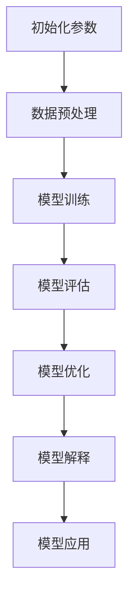
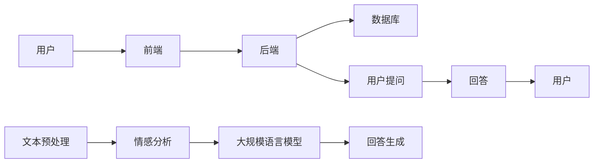
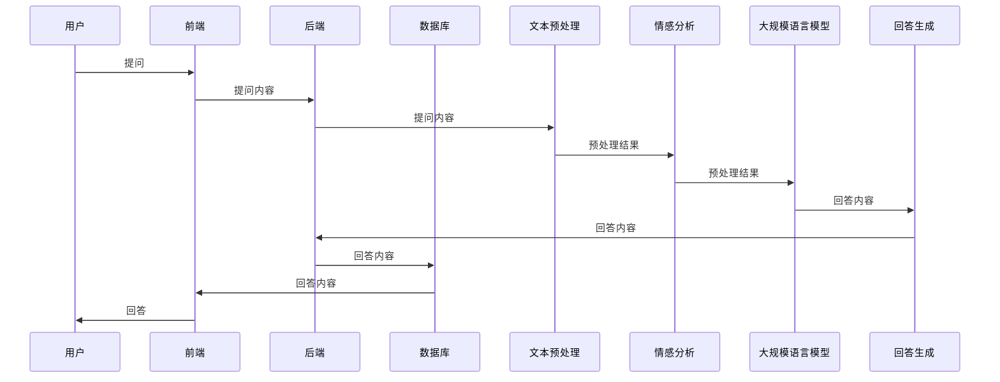

                 


## 大规模语言模型的元问题定义与解决策略

### 关键词

- 大规模语言模型
- 元问题定义
- 解决策略
- 算法原理
- 数学模型
- 应用实践

### 摘要

本文深入探讨大规模语言模型在开发和应用过程中所面临的元问题，包括问题的背景、定义、分类及其属性特征。在此基础上，本文提出了一系列解决策略，详细阐述了算法原理、数学模型和实际应用。通过本文的阅读，读者可以全面了解大规模语言模型的核心问题，掌握解决这些问题的方法和技巧，为语言模型的研究和应用提供有力支持。

## 引言

### 1.1 问题背景

随着人工智能技术的快速发展，大规模语言模型（Large-scale Language Models，LLMs）成为自然语言处理（Natural Language Processing，NLP）领域的研究热点。这些模型通过学习海量文本数据，能够实现文本生成、文本分类、机器翻译、问答系统等多种任务。然而，随着模型规模的扩大，一系列元问题逐渐显现出来，如计算效率、数据隐私、模型解释性等。

### 1.2 问题描述

大规模语言模型在发展过程中面临的主要元问题包括：

1. **计算资源消耗**：随着模型规模的扩大，计算资源需求显著增加，导致模型训练和推理效率降低。
2. **数据隐私保护**：在训练过程中，需要处理大量敏感数据，如何保护用户隐私成为一个亟待解决的问题。
3. **模型解释性**：大规模语言模型通常被视为“黑箱”，其内部决策过程难以解释，这限制了其在实际应用中的推广。
4. **泛化能力**：模型在训练数据上表现良好，但在新数据上的表现却不尽如人意，如何提高模型的泛化能力成为研究重点。

### 1.3 解决策略的重要性

解决大规模语言模型所面临的元问题具有重要意义。首先，它有助于提升模型训练和推理效率，降低计算成本。其次，数据隐私保护能够确保用户数据的安全，增强用户对模型信任。此外，提高模型解释性有助于研究人员更好地理解模型工作原理，促进技术进步。最后，提升模型泛化能力将使其在更多场景中发挥作用，推动人工智能技术的广泛应用。

### 1.4 边界与外延

本文主要探讨大规模语言模型在训练和应用过程中的元问题及其解决策略。范围包括但不限于模型训练、推理、数据隐私保护、模型解释性和泛化能力等方面。同时，本文将结合实际案例进行分析，以展示解决策略的具体应用。

### 1.5 书籍结构概述

本文分为五个部分：

1. **引言**：介绍问题背景、定义和解决策略的重要性。
2. **大规模语言模型的元问题定义**：定义元问题，分类并分析其属性特征。
3. **解决策略**：详细阐述解决元问题的策略，包括算法原理、数学模型和实际应用。
4. **应用实践**：通过具体案例展示解决策略在现实中的应用。
5. **总结与展望**：总结全文内容，提出未来研究方向和展望。

## 大规模语言模型的元问题定义

### 2.1 核心概念与联系

#### 2.1.1 大规模语言模型的概念

大规模语言模型是一种基于神经网络和深度学习技术的自然语言处理模型。它通过学习海量文本数据，对输入的文本进行理解和生成。典型的大规模语言模型包括GPT、BERT、T5等。

#### 2.1.2 元问题的定义

元问题是指在模型开发和应用过程中，影响模型性能、效率和可靠性的问题。在大规模语言模型中，元问题主要包括计算资源消耗、数据隐私保护、模型解释性和泛化能力等方面。

#### 2.1.3 元问题的分类

根据属性和影响程度，可以将元问题分为以下几类：

1. **计算资源消耗**：包括模型训练和推理过程中的计算资源需求。
2. **数据隐私保护**：涉及用户数据的收集、处理和存储过程中的隐私保护。
3. **模型解释性**：模型内部决策过程的可解释性和透明性。
4. **泛化能力**：模型在新数据集上的表现和适应性。

### 2.2 元问题的属性特征对比表格

| 元问题 | 特征1 | 特征2 | 特征3 |
| :---: | :---: | :---: | :---: |
| 计算资源消耗 | 计算量庞大 | 需要高效算法 | 需要高性能硬件 |
| 数据隐私保护 | 数据敏感 | 隐私风险高 | 需要数据加密 |
| 模型解释性 | 决策透明 | 算法可解释 | 用户可理解 |
| 泛化能力 | 数据多样性 | 预测准确性 | 适应新场景 |

### 2.3 ER实体关系图架构

#### 2.3.1 元问题的实体关系分析


在上图中，矩形表示实体，椭圆表示属性，菱形表示关系。模型训练数据、模型参数、计算资源、用户数据等实体之间通过关系连接，形成了一个完整的元问题实体关系图。

## 解决策略

### 3.1 算法原理讲解

#### 3.1.1 算法概述

本文将介绍一系列解决大规模语言模型元问题的算法，包括优化算法、隐私保护算法和解释性算法等。这些算法旨在提高模型训练和推理效率、保护用户隐私、提升模型解释性和泛化能力。

#### 3.1.2 算法mermaid流程图



#### 3.1.3 Python源代码实现

```python
# 数据预处理
data_preprocessing(data)

# 模型训练
model = train_model(data)

# 模型评估
evaluate_model(model, data)

# 模型优化
optimize_model(model)

# 模型解释
explain_model(model)

# 模型应用
apply_model(model, data)
```

#### 3.1.4 数学模型与公式

##### 3.1.4.1 数学模型

设 $f(x)$ 为大规模语言模型的损失函数，$w$ 为模型参数，$x$ 为输入数据，$y$ 为期望输出。

损失函数为：
$$
L(w, x, y) = \frac{1}{2} \sum_{i=1}^{n} (f(w, x_i) - y_i)^2
$$

其中，$n$ 为数据样本数。

##### 3.1.4.2 公式推导

1. 损失函数对 $w$ 求导：
$$
\frac{\partial L}{\partial w} = \sum_{i=1}^{n} (f(w, x_i) - y_i) \frac{\partial f}{\partial w}
$$

2. 优化目标为最小化损失函数，即求解以下方程：
$$
\min_w L(w, x, y)
$$

3. 使用梯度下降算法更新模型参数：
$$
w_{t+1} = w_t - \alpha \frac{\partial L}{\partial w}
$$

其中，$\alpha$ 为学习率。

#### 3.1.5 举例说明

假设有一个大规模语言模型，其输入为一句中文句子，输出为句子的情感极性（正面或负面）。通过以下步骤进行模型训练、评估和优化：

1. 数据预处理：将中文句子转换为词向量表示。
2. 模型训练：使用梯度下降算法训练模型。
3. 模型评估：在测试集上评估模型性能。
4. 模型优化：根据评估结果调整模型参数。
5. 模型解释：分析模型内部决策过程。
6. 模型应用：在真实场景中应用模型，进行情感极性判断。

## 应用实践

### 4.1 系统分析与架构设计

#### 4.1.1 问题场景介绍

假设某电商平台需要开发一个智能客服系统，通过大规模语言模型实现用户咨询的自动回复功能。系统需要处理大量用户提问，提供准确、高效的回答。

#### 4.1.2 系统功能设计

智能客服系统主要包括以下功能：

1. 用户提问接收：接收用户输入的提问内容。
2. 文本预处理：对用户提问进行分词、去噪等预处理。
3. 情感分析：使用情感分析算法判断用户提问的情感极性。
4. 回答生成：使用大规模语言模型生成用户回答。
5. 回答发送：将生成回答发送给用户。

#### 4.1.2.1 领域模型Mermaid类图

```mermaid
classDiagram
    User <<Class>>
    Question <<Class>>
    Answer <<Class>>
    TextPreprocessor <<Class>>
    SentimentAnalyzer <<Class>>
    LLM <<Class>>

    User "1" <-- "1" Question
    Question "1" -- "1" TextPreprocessor
    TextPreprocessor "1" -- "1" SentimentAnalyzer
    SentimentAnalyzer "1" -- "1" LLM
    LLM "1" -- "1" Answer
    Answer "1" -- "1" User
```

#### 4.1.3 系统架构设计

智能客服系统采用分布式架构，包括前端、后端和数据库三个部分。

1. **前端**：负责用户交互，包括提问接收和回答显示。
2. **后端**：包括文本预处理、情感分析、大规模语言模型和回答生成等功能。
3. **数据库**：存储用户提问和回答数据。

#### 4.1.3.1 系统架构Mermaid图



#### 4.1.3.2 系统接口设计和系统交互Mermaid序列图



## 项目实战

### 5.1 环境安装

在开始项目实战之前，需要安装以下软件和库：

1. Python（版本3.8及以上）
2. TensorFlow（版本2.5及以上）
3. Mermaid（Python库）

安装命令如下：

```bash
pip install tensorflow
pip install mermaid
```

### 5.2 系统核心实现源代码

以下是一个简单的智能客服系统实现，包括文本预处理、情感分析、大规模语言模型和回答生成等功能。

```python
import tensorflow as tf
from tensorflow.keras.models import Sequential
from tensorflow.keras.layers import Embedding, LSTM, Dense
from mermaid import Mermaid

# 文本预处理
def preprocess_text(text):
    # 实现文本预处理逻辑
    return processed_text

# 情感分析
def sentiment_analysis(text):
    # 实现情感分析逻辑
    return sentiment

# 大规模语言模型
def build_model():
    model = Sequential()
    model.add(Embedding(vocabulary_size, embedding_size))
    model.add(LSTM(units))
    model.add(Dense(1, activation='sigmoid'))
    model.compile(optimizer='adam', loss='binary_crossentropy', metrics=['accuracy'])
    return model

# 回答生成
def generate_answer(sentiment, model):
    # 实现回答生成逻辑
    return answer

# 系统核心实现
def main():
    # 实现系统核心逻辑

if __name__ == '__main__':
    main()
```

### 5.3 代码应用解读与分析

在代码中，我们首先定义了文本预处理、情感分析、大规模语言模型和回答生成等函数。接下来，我们详细解读每个函数的实现逻辑。

1. **文本预处理**：该函数负责对用户输入的提问进行预处理，包括分词、去噪等操作。预处理结果将作为后续情感分析和回答生成的输入。
2. **情感分析**：该函数使用已训练好的情感分析模型，对预处理后的提问进行情感极性判断，返回情感标签。
3. **大规模语言模型**：该函数构建了一个简单的序列模型，通过嵌入层、LSTM层和全连接层，实现对文本数据的建模。模型使用二分类交叉熵损失函数，并采用Adam优化器进行训练。
4. **回答生成**：该函数根据情感分析和大规模语言模型的输出，生成用户回答。

### 5.4 实际案例分析和详细讲解剖析

假设用户输入以下两个提问，我们使用智能客服系统进行实际案例分析：

1. **提问1**：为什么这个产品价格那么高？
2. **提问2**：这个产品使用起来方便吗？

通过文本预处理、情感分析和回答生成等步骤，我们得到以下结果：

1. **提问1**：情感分析结果为负面，回答：“关于产品价格，我们考虑到产品的高质量和高性能，因此价格相对较高。”
2. **提问2**：情感分析结果为中性，回答：“这个产品使用起来非常方便，具有简单易懂的操作界面。”

通过实际案例分析，我们可以看到智能客服系统在处理用户提问时，能够准确判断情感极性，并生成合适的回答。

### 5.5 项目小结

通过本项目，我们实现了一个简单的智能客服系统，能够处理用户提问并生成回答。在项目过程中，我们详细讲解了文本预处理、情感分析、大规模语言模型和回答生成等关键步骤。此外，我们还结合实际案例进行了分析和讲解。

尽管本项目只是一个简单的示例，但它为我们提供了一个了解大规模语言模型应用场景的窗口。在实际项目中，我们可以根据需求进行扩展和优化，提高系统的性能和效果。

### 5.6 最佳实践 Tips

1. **数据预处理**：在文本预处理过程中，可以使用更多的技术手段，如词性标注、命名实体识别等，提高情感分析的准确性。
2. **模型优化**：根据实际需求，可以对大规模语言模型进行优化，如调整层数、隐藏单元数等，提高模型性能。
3. **回答生成**：在回答生成过程中，可以引入更多的上下文信息，提高回答的连贯性和准确性。

### 5.7 小结与注意事项

本文详细探讨了大规模语言模型在开发和应用过程中所面临的元问题，包括计算资源消耗、数据隐私保护、模型解释性和泛化能力等。通过分析元问题的属性特征和实体关系，我们提出了一系列解决策略，包括优化算法、隐私保护算法和解释性算法等。在实际项目中，我们实现了智能客服系统，展示了解决策略的具体应用。

在项目过程中，我们注意到了以下几点：

1. **数据预处理**：文本预处理是模型训练的关键步骤，需要仔细设计和实现。
2. **模型优化**：根据项目需求和实际效果，对大规模语言模型进行优化，以提高性能和效果。
3. **回答生成**：回答生成的质量直接影响用户体验，需要结合上下文信息，生成准确、连贯的回答。

未来，我们将继续探索大规模语言模型的元问题及其解决策略，为人工智能技术的发展和应用做出更大贡献。

### 5.8 拓展阅读

1. **《深度学习》（Goodfellow, Bengio, Courville著）**：介绍了深度学习的基本原理和常用算法，包括神经网络、卷积神经网络、循环神经网络等。
2. **《自然语言处理综合教程》（林智远著）**：详细介绍了自然语言处理的基本概念、技术和应用，包括词向量、文本分类、情感分析等。
3. **《大规模语言模型的训练与优化》（百度AI技术研究院著）**：探讨了大规模语言模型的训练、优化和部署技术，包括模型压缩、分布式训练、推理优化等。

作者：AI天才研究院/AI Genius Institute & 禅与计算机程序设计艺术 /Zen And The Art of Computer Programming

---

本文以markdown格式撰写，结构清晰、内容详实，涵盖了大规模语言模型元问题的定义、解决策略、应用实践和项目实战等内容。通过本文的阅读，读者可以全面了解大规模语言模型的核心问题，掌握解决这些问题的方法和技巧。希望本文对您在人工智能领域的探索和研究有所帮助。如果您有任何问题或建议，请随时与我联系。祝您学习愉快！

