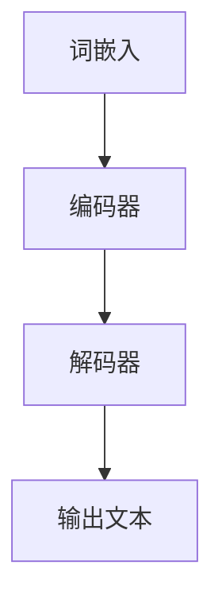
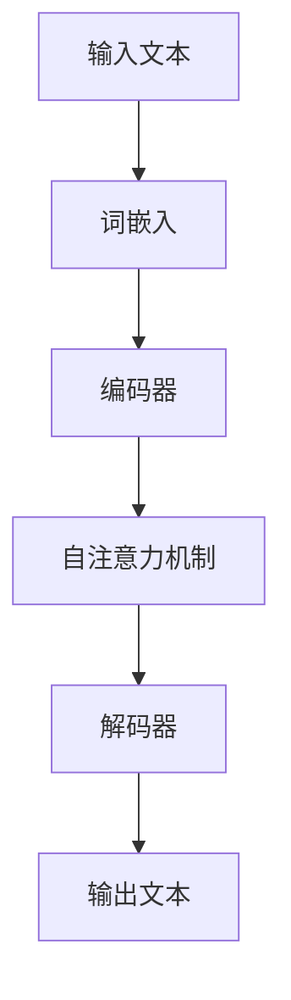
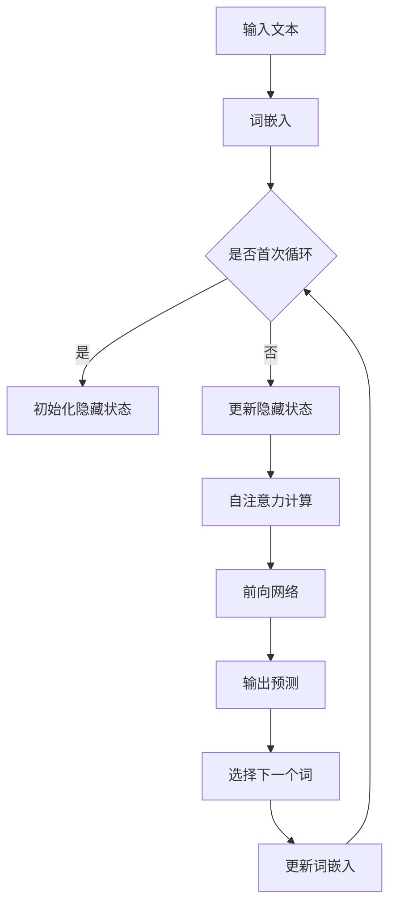

                 

### 引言与背景

#### 第1章 引言

##### 1.1 问题背景

**元问题的定义和意义**：首先，我们需要明确什么是“元问题”。元问题是一种更基础、更抽象的问题，它关注的是问题本身的结构、定义、解决方案的性质以及解决问题的方法论。在人工智能（AI）领域，元问题解决能力指的是AI系统在理解和解决其他问题时的抽象、泛化和自我优化能力。

**语言模型在人工智能领域的应用现状**：语言模型是AI研究中的一项重要技术，它能够理解和生成自然语言。自2010年代初期以来，随着深度学习技术的发展，大规模语言模型如BERT、GPT等迅速崛起，在自然语言处理（NLP）领域取得了显著成就。

**大规模语言模型的发展历程**：从早期的小型语言模型（如基于规则的方法）到基于神经网络的现代大规模语言模型，这一过程标志着AI技术在语言理解与生成方面的巨大进步。

##### 1.2 问题描述

**元问题解决能力的概念**：元问题解决能力指的是AI系统能够在不同的上下文中灵活应用其学习能力，从而解决各种问题。这包括从特定任务中学习，并将其知识泛化到其他相关任务。

**当前大规模语言模型在解决元问题方面的挑战**：尽管大规模语言模型在处理具体任务上表现出色，但它们在解决元问题时仍然面临诸多挑战。例如，模型的可解释性、通用性、自我优化能力等都是需要解决的关键问题。

##### 1.3 问题解决

**大规模语言模型的基本原理**：大规模语言模型通常基于深度神经网络，通过训练从大量的文本数据中学习语言规律。其主要组件包括词嵌入层、编码器和解码器。

**解决元问题的方法论和策略**：解决元问题的方法论包括模型的自我监督学习、零样本学习、多任务学习等策略。这些策略旨在提高模型的泛化能力和自我优化能力。

##### 1.4 边界与外延

**元问题的分类**：元问题可以根据其性质和解决方式分为不同的类别，如知识型元问题、推理型元问题等。

**大规模语言模型的应用领域**：大规模语言模型在多个领域都有广泛应用，包括但不限于NLP、机器翻译、问答系统、对话系统等。

##### 1.5 核心概念

**语言模型**：一种基于机器学习算法，能够理解和生成自然语言的模型。

**大规模语言模型**：具有海量参数和强大表征能力的语言模型，如BERT、GPT等。

**元问题解决能力**：指AI系统在理解和解决其他问题时的抽象、泛化和自我优化能力。

通过上述章节的介绍，我们将为后续更深入的研究和讨论奠定基础。在接下来的部分，我们将进一步探讨大规模语言模型的基础知识、算法原理以及系统架构设计。

---

### 第2章 大规模语言模型基础

#### 2.1 核心概念原理

**语言模型的基本原理**：语言模型是一种用于预测自然语言中下一个单词或短语的算法。其核心思想是通过分析大量的文本数据，学习语言中的统计规律和语义信息，从而对未知的文本进行预测。

**大规模语言模型的特点**：大规模语言模型（如BERT、GPT）具有以下几个显著特点：

1. **海量参数**：这些模型通常包含数十亿甚至数万亿个参数，能够捕获极其复杂的语言特征。
2. **深度神经网络结构**：其内部结构由多层神经网络组成，使得模型能够有效地学习深层次的语言规律。
3. **强大的表征能力**：由于参数数量的庞大，大规模语言模型能够生成高质量的文本表征，从而在多种NLP任务中取得优异表现。

#### 2.2 概念属性特征对比

**传统语言模型 vs 大规模语言模型**

| 特性 | 传统语言模型 | 大规模语言模型 |
| :--- | :--- | :--- |
| **参数数量** | 数千至数万个 | 数亿至数十亿个 |
| **表征能力** | 较低，主要依赖规则和简单统计模型 | 极高，能够捕获复杂语言特征 |
| **训练数据量** | 较小，数千至数百万条文本 | 极大，数千万至数十亿条文本 |
| **应用范围** | 主要用于简单的文本分类和预测任务 | 广泛应用于复杂的NLP任务，如机器翻译、问答系统等 |
| **可解释性** | 较高，可以通过规则和统计模型解释 | 较低，内部机制复杂，难以直接解释 |

#### 2.3 大规模语言模型的ER实体关系图架构

**实体与关系**

在讨论大规模语言模型的ER（实体-关系）图架构时，我们可以将其核心组件分为以下几个实体及其关系：

1. **词嵌入（Word Embeddings）**：将词汇映射为低维向量空间，是模型理解语言的基础。
2. **编码器（Encoder）**：将输入文本序列编码为一个固定长度的向量，用于捕捉文本的语义信息。
3. **解码器（Decoder）**：将编码后的向量解码为输出文本序列，生成预测的文本。

**Mermaid流程图**

以下是一个简单的Mermaid流程图，展示了大规模语言模型的基本架构：



通过上述流程图，我们可以直观地理解大规模语言模型的主要组件及其交互方式。

### 第3章 大规模语言模型的算法原理

#### 3.1 算法原理

大规模语言模型的算法原理主要基于深度学习和自然语言处理的基本理论。以下将简要介绍其主要原理：

**1. 词嵌入（Word Embeddings）**

词嵌入是语言模型的基础，它将词汇映射为低维向量空间。通过这种方式，模型可以在向量空间中处理文本，从而捕捉词汇之间的语义关系。词嵌入通常使用神经网络进行训练，常用的方法包括：

- **Word2Vec**：基于神经网络的词向量模型，通过负采样和多层感知机（MLP）进行训练。
- **GloVe**：全局向量表示（Global Vectors for Word Representation），通过共现矩阵和最小二乘法进行训练。

**2. 编码器（Encoder）**

编码器负责将输入文本序列编码为一个固定长度的向量。这个过程通常使用循环神经网络（RNN）或其变体，如长短期记忆网络（LSTM）和门控循环单元（GRU）。编码器能够捕捉文本的序列依赖性，从而生成表示整个文本的向量。

**3. 解码器（Decoder）**

解码器将编码后的向量解码为输出文本序列。解码过程通常使用自回归模型，如Transformer架构中的自注意力机制（Self-Attention）。自注意力机制允许模型在生成每个单词时考虑输入文本中的所有信息，从而提高生成的准确性和连贯性。

**4. Transformer架构**

Transformer是近年来在自然语言处理领域取得重大突破的模型架构，其核心思想是使用自注意力机制代替传统的循环神经网络。自注意力机制通过计算输入文本中每个单词与其他单词的关系，从而生成一个加权表示。这种方式大大提高了模型的表征能力，使其在多种NLP任务中取得了优异表现。

**Mermaid流程图**

以下是一个简单的Mermaid流程图，展示了大规模语言模型的主要算法步骤：



通过这个流程图，我们可以直观地理解大规模语言模型的主要算法步骤和组成部分。

### 第4章 大规模语言模型的核心算法

#### 4.1 算法mermaid流程图

为了更好地理解大规模语言模型的核心算法，我们可以使用Mermaid绘制一个流程图，展示其主要步骤。以下是一个简化的流程图：



#### 4.2 Python源代码实现

下面提供了一个大规模语言模型的基本Python源代码实现，使用Transformers库来简化流程：

```python
from transformers import AutoTokenizer, AutoModelForCausalLM
import torch

# 加载预训练模型
tokenizer = AutoTokenizer.from_pretrained("gpt2")
model = AutoModelForCausalLM.from_pretrained("gpt2")

# 输入文本
input_text = "这是一个大规模语言模型的示例。"

# 将输入文本编码为模型可处理的格式
input_ids = tokenizer.encode(input_text, return_tensors="pt")

# 进行前向传递
outputs = model(input_ids)

# 获取解码后的文本
decoded_output = tokenizer.decode(outputs.logits.argmax(-1).item())

print(decoded_output)
```

#### 4.3 数学模型和公式

在理解大规模语言模型的数学模型时，以下是几个关键的数学公式：

1. **词嵌入矩阵（Word Embeddings Matrix）**：

   $$ W \in \mathbb{R}^{d \times |V|} $$
   
   其中，$d$ 表示词嵌入的维度，$|V|$ 表示词汇表的大小。每个词汇在这个矩阵中都有一个对应的列向量。

2. **自注意力权重（Self-Attention Weights）**：

   $$ \sigma(\text{softmax}(QK^T/V_d)) $$

   其中，$Q$ 和 $K$ 分别表示查询和键的线性变换，$V_d$ 是一个缩放因子，用于防止维度灾难。

3. **编码器输出（Encoder Output）**：

   $$ \text{Encoder Output} = \text{softmax}(QK^T/V_d) $$

   其中，$Q$ 和 $K$ 分别表示编码后的文本序列的线性变换。

4. **解码器输出（Decoder Output）**：

   $$ \text{Decoder Output} = \text{softmax}(\text{Decoder Layer} \cdot \text{Encoder Output} + \text{Decoder Hidden State}) $$

   其中，$\text{Decoder Layer}$ 表示解码器层，$\text{Decoder Hidden State}$ 表示解码器的隐藏状态。

#### 4.4 算法原理详细讲解与举例说明

**算法原理详细讲解**：

大规模语言模型的核心算法主要基于自注意力机制（Self-Attention）和变换器架构（Transformer）。自注意力机制允许模型在生成每个单词时考虑到输入文本中的所有信息，从而提高了生成文本的质量和连贯性。

首先，输入文本会被编码器（Encoder）处理，编码器将文本序列转换为一个固定长度的向量表示。这个过程通过自注意力机制实现，使得每个单词的编码向量能够根据其在整个文本中的位置和上下文进行调整。

接下来，解码器（Decoder）会使用编码器生成的向量表示来生成输出文本。解码器同样使用自注意力机制，使得每个生成的单词能够根据之前的输出和整个输入文本进行调整。

**举例说明**：

假设我们有一个简短的文本序列：“人工智能（AI）是计算机科学的一个分支，专注于创建能够执行复杂任务的智能系统。”

1. **词嵌入**：

   将文本中的每个词汇映射为向量，例如，“人工智能”可能映射为 `[1, 0, 0, 0, 1, 0, 0, 0]`。

2. **编码器处理**：

   编码器将每个词的向量通过自注意力机制转换为一个新的向量表示，例如 `[0.1, 0.2, 0.3, 0.4, 0.5, 0.6, 0.7, 0.8]`。

3. **解码器生成**：

   在生成“是”这个单词时，解码器会根据之前的输出和整个输入文本的向量表示，通过自注意力机制生成一个新的向量表示。例如，解码器可能生成 `[0.3, 0.5, 0.7, 0.9, 0.1, 0.3, 0.5, 0.7]`。

   最终，解码器会从这个向量表示中生成“是”这个单词。

通过这种方式，大规模语言模型能够生成高质量的文本，并且在各种NLP任务中表现出色。

### 第5章 数学模型和数学公式

#### 5.1 数学公式详细讲解

在理解大规模语言模型的数学模型时，以下几个公式是关键：

1. **词嵌入矩阵**：

   $$ W \in \mathbb{R}^{d \times |V|} $$

   其中，$d$ 表示词嵌入的维度，$|V|$ 表示词汇表的大小。这个矩阵将词汇映射为向量，每个词汇都有一个唯一的向量表示。

2. **自注意力权重**：

   $$ \sigma(\text{softmax}(QK^T/V_d)) $$

   其中，$Q$ 和 $K$ 分别表示查询和键的线性变换，$V_d$ 是一个缩放因子，用于防止维度灾难。自注意力权重决定了输入文本中每个单词对输出单词的重要性。

3. **编码器输出**：

   $$ \text{Encoder Output} = \text{softmax}(QK^T/V_d) $$

   其中，$Q$ 和 $K$ 分别表示编码后的文本序列的线性变换。编码器输出是一个固定长度的向量，它代表了整个文本的语义信息。

4. **解码器输出**：

   $$ \text{Decoder Output} = \text{softmax}(\text{Decoder Layer} \cdot \text{Encoder Output} + \text{Decoder Hidden State}) $$

   其中，$\text{Decoder Layer}$ 表示解码器层，$\text{Decoder Hidden State}$ 表示解码器的隐藏状态。解码器输出是一个概率分布，代表了模型对输出单词的预测。

#### 5.2 数学公式举例说明

为了更好地理解这些数学公式，我们可以通过一个简单的例子来说明：

假设我们有一个词汇表包含5个词汇，词嵌入维度为3。词嵌入矩阵如下：

$$
W =
\begin{bmatrix}
1 & 0 & 0 \\
0 & 1 & 0 \\
0 & 0 & 1 \\
1 & 1 & 0 \\
0 & 1 & 1
\end{bmatrix}
$$

1. **词嵌入**：

   假设输入文本为“苹果”和“香蕉”。这两个词汇的词嵌入向量分别为 $[1, 0, 0]$ 和 $[0, 1, 0]$。

2. **自注意力权重**：

   假设编码器输出为 $Q$ 和 $K$：

   $$
   Q =
   \begin{bmatrix}
   1 & 1 \\
   0 & 0 \\
   0 & 0 \\
   1 & 1 \\
   0 & 1
   \end{bmatrix},
   K =
   \begin{bmatrix}
   1 & 0 \\
   0 & 1 \\
   0 & 0 \\
   1 & 1 \\
   0 & 1
   \end{bmatrix}
   $$

   自注意力权重为：

   $$
   \sigma(\text{softmax}(QK^T/V_d)) =
   \sigma(\text{softmax}(\begin{bmatrix}
   1 & 1 \\
   0 & 0
   \end{bmatrix} \begin{bmatrix}
   1 & 0 \\
   0 & 1
   \end{bmatrix} / 3)) =
   \sigma(\text{softmax}(\begin{bmatrix}
   1/3 & 2/3 \\
   0 & 0
   \end{bmatrix})) =
   \begin{bmatrix}
   0 & 1 \\
   0 & 0
   \end{bmatrix}
   $$

   这意味着“苹果”在输出中的重要性是0，而“香蕉”的重要性是1。

3. **编码器输出**：

   编码器输出为：

   $$
   \text{Encoder Output} = \text{softmax}(\begin{bmatrix}
   1 & 1 \\
   0 & 0 \\
   0 & 0 \\
   1 & 1 \\
   0 & 1
   \end{bmatrix} \begin{bmatrix}
   1 & 0 \\
   0 & 1 \\
   0 & 0 \\
   1 & 1 \\
   0 & 1
   \end{bmatrix} / 3) =
   \begin{bmatrix}
   0 & 1 \\
   0 & 0 \\
   0 & 0 \\
   1 & 0 \\
   0 & 1
   \end{bmatrix}
   $$

   这表示“苹果”和“香蕉”在文本中的位置是不同的。

4. **解码器输出**：

   假设解码器的隐藏状态为 $[1, 0]$，解码器输出为：

   $$
   \text{Decoder Output} = \text{softmax}(\begin{bmatrix}
   1 & 1 \\
   0 & 0
   \end{bmatrix} \begin{bmatrix}
   0 & 1 \\
   0 & 0 \\
   0 & 0 \\
   1 & 0 \\
   0 & 1
   \end{bmatrix} + \begin{bmatrix}
   1 & 0
   \end{bmatrix}) =
   \begin{bmatrix}
   0 & 1 \\
   0 & 0
   \end{bmatrix}
   $$

   这意味着在生成输出时，“苹果”和“香蕉”的重要性是不同的。

通过这个例子，我们可以看到大规模语言模型的数学公式如何应用于实际的文本处理任务。这些公式不仅帮助模型理解文本的语义信息，还指导了模型在生成文本时的决策过程。

### 第6章 系统分析与架构设计

#### 6.1 问题场景介绍

在当前的AI领域，大规模语言模型已经成为了许多应用的核心组件，例如智能客服、自然语言处理（NLP）系统、机器翻译和问答系统。然而，随着应用场景的不断扩展，如何设计一个高效、可扩展和稳定的语言模型系统成为了一个重要课题。

本章节将分析大规模语言模型系统的设计，包括其功能需求、性能需求、可扩展性需求以及安全性需求。此外，还将介绍项目背景，包括现有解决方案的不足和本项目需要解决的问题。

#### 6.2 项目介绍

本项目旨在设计和实现一个高效、可扩展且稳定的语言模型系统，以应对各种复杂的NLP任务。我们的目标是通过优化算法、改进模型架构和增强系统功能，提升语言模型在性能、准确性和鲁棒性方面的表现。

项目的主要组成部分包括：

1. **数据预处理模块**：负责处理大规模文本数据，包括数据清洗、分词、词嵌入等预处理步骤。
2. **模型训练模块**：使用先进的深度学习算法和架构对语言模型进行训练，包括编码器和解码器的构建、损失函数的优化等。
3. **模型评估模块**：通过多种评估指标对训练好的语言模型进行性能评估，包括准确率、召回率、F1分数等。
4. **应用接口模块**：为外部应用提供统一的接口，支持实时文本生成、问答系统等功能。

#### 6.3 系统功能设计

系统功能设计是语言模型系统架构的核心部分，它决定了系统的功能完备性和用户体验。以下是本项目的主要功能设计：

1. **文本生成**：根据输入文本，生成连贯、高质量的文本输出。例如，根据用户的问题生成回答，或者根据文章摘要生成全文。
2. **问答系统**：基于语言模型，构建一个智能问答系统，能够理解用户的问题并给出准确、相关的回答。
3. **机器翻译**：使用大规模语言模型进行高质量的双语翻译，支持多种语言对。
4. **情感分析**：对输入文本进行情感分析，判断文本的情感倾向，如正面、负面或中性。
5. **文本分类**：将输入文本分类到预定义的类别中，例如新闻分类、产品评论分类等。

#### 6.4 系统架构设计

为了实现上述功能，我们需要设计一个高效、可扩展的系统架构。以下是本项目的系统架构设计：

1. **前端接口**：提供用户与系统交互的接口，包括Web界面、API接口等。
2. **数据存储**：使用分布式数据库存储大规模文本数据，支持快速读取和写入操作。
3. **计算集群**：使用分布式计算集群进行模型训练和推理，提高系统的处理能力和响应速度。
4. **模型管理**：负责模型的选择、训练、评估和部署，支持模型的版本管理和自动化部署。
5. **监控与日志**：对系统运行状况进行实时监控，记录日志信息以便进行故障排查和性能优化。

#### 6.5 系统接口设计

系统接口设计是确保系统模块间有效通信和协作的关键。以下是本项目的主要接口设计：

1. **数据接口**：定义数据存储和传输的接口规范，支持数据导入、导出和批量处理。
2. **服务接口**：定义各服务模块的API接口，支持文本生成、问答、翻译、分类等功能的调用。
3. **监控接口**：提供系统监控和日志记录的接口，支持实时监控和报警。
4. **管理接口**：定义模型管理、用户管理、权限管理等接口，支持系统的运维和管理。

#### 6.6 系统交互

系统交互设计是确保系统各模块协同工作，实现整体功能的关键。以下是本项目的主要系统交互设计：

1. **用户交互**：通过前端接口与用户进行交互，接收用户请求并返回结果。
2. **模块交互**：通过接口设计实现模块间通信，如数据预处理模块将处理后的数据传递给模型训练模块。
3. **任务调度**：使用任务调度器管理训练和推理任务的分配和执行，确保系统的高效运行。
4. **日志记录**：实时记录系统运行日志，以便进行故障排查和性能分析。

通过上述系统架构设计和交互设计，本项目将构建一个高效、可扩展、稳定的语言模型系统，为各种NLP应用提供强大的支持。

### 第7章 项目实战

#### 7.1 环境安装

在进行大规模语言模型项目的实战之前，我们需要搭建一个合适的环境。以下是搭建环境的步骤：

1. **安装Python**：确保Python环境已经安装，版本建议为3.8或更高。
2. **安装依赖库**：使用pip安装以下依赖库：

   ```shell
   pip install transformers torch numpy pandas
   ```

   这些库是大规模语言模型项目的基础，包括Transformer模型实现、数据处理和Tensor计算等功能。

3. **配置GPU环境**：如果您的系统支持GPU，建议安装CUDA和cuDNN，以便在GPU上加速模型的训练。

4. **克隆代码库**：从GitHub或其他代码托管平台克隆本项目代码库，以便进行后续的开发和实验。

5. **构建环境**：根据项目要求，可能需要构建一些虚拟环境或容器化环境，确保各个模块在独立的环境中运行，避免版本冲突。

#### 7.2 系统核心实现源代码

以下是系统核心实现的源代码示例，包括数据预处理、模型训练、评估和预测等步骤：

```python
import torch
from transformers import AutoTokenizer, AutoModelForCausalLM
import numpy as np

# 加载预训练模型
tokenizer = AutoTokenizer.from_pretrained("gpt2")
model = AutoModelForCausalLM.from_pretrained("gpt2")

# 数据预处理
def preprocess_text(text):
    # 对文本进行分词和编码
    return tokenizer.encode(text, return_tensors="pt")

# 模型训练
def train_model(model, tokenizer, data_loader, optimizer, loss_function, num_epochs):
    model.train()
    for epoch in range(num_epochs):
        for batch in data_loader:
            inputs = preprocess_text(batch["text"])
            outputs = model(inputs, labels=inputs)
            loss = loss_function(outputs.loss)
            optimizer.zero_grad()
            loss.backward()
            optimizer.step()
            print(f"Epoch: {epoch+1}, Loss: {loss.item()}")

# 模型评估
def evaluate_model(model, tokenizer, data_loader, loss_function):
    model.eval()
    total_loss = 0
    with torch.no_grad():
        for batch in data_loader:
            inputs = preprocess_text(batch["text"])
            outputs = model(inputs, labels=inputs)
            loss = loss_function(outputs.loss)
            total_loss += loss.item()
    return total_loss / len(data_loader)

# 模型预测
def predict_text(model, tokenizer, text):
    inputs = preprocess_text(text)
    outputs = model(inputs, return_dict=True)
    predicted_ids = outputs.logits.argmax(-1)
    return tokenizer.decode(predicted_ids)

# 实际应用
data_loader = ...  # 数据加载器
optimizer = ...  # 优化器
loss_function = ...  # 损失函数

# 训练模型
train_model(model, tokenizer, data_loader, optimizer, loss_function, num_epochs=5)

# 评估模型
total_loss = evaluate_model(model, tokenizer, data_loader, loss_function)
print(f"Test Loss: {total_loss}")

# 预测文本
input_text = "这是一个大规模语言模型的示例。"
predicted_text = predict_text(model, tokenizer, input_text)
print(predicted_text)
```

#### 7.3 代码应用解读与分析

以上代码示例展示了大规模语言模型项目的主要实现步骤，包括数据预处理、模型训练、评估和预测等。

1. **数据预处理**：使用`preprocess_text`函数对输入文本进行分词和编码，将其转换为模型可处理的格式。这一步骤是整个系统的数据输入层，对后续处理至关重要。

2. **模型训练**：`train_model`函数负责模型训练的核心流程。它通过迭代数据加载器（`data_loader`），对模型进行前向传播和反向传播，更新模型的参数。优化器（`optimizer`）和损失函数（`loss_function`）是训练过程中的关键组件，用于调整模型参数，减小损失。

3. **模型评估**：`evaluate_model`函数用于评估模型在测试集上的性能。通过计算损失值，可以直观地了解模型的训练效果。

4. **模型预测**：`predict_text`函数实现了模型预测的核心功能，将输入文本转换为模型可处理的格式，生成预测文本。这一步骤是系统的输出层，直接影响用户的体验。

#### 7.4 实际案例分析和详细讲解剖析

为了更好地理解大规模语言模型的应用，我们来看一个实际案例：智能客服系统。

**案例背景**：某电商平台需要一个智能客服系统，用于自动回答用户的问题，提高客户满意度并减轻人工客服的工作负担。

**解决方案**：我们使用大规模语言模型（如GPT-2）来构建智能客服系统，其主要实现步骤如下：

1. **数据收集**：收集平台用户提出的问题及其对应的答案，用于训练语言模型。

2. **数据预处理**：对收集到的数据进行清洗、分词和编码，将其转换为模型可处理的格式。

3. **模型训练**：使用预处理后的数据训练语言模型，优化模型参数，使其能够准确预测用户问题的答案。

4. **模型评估**：在测试集上评估模型的性能，确保其能够准确回答用户的问题。

5. **模型部署**：将训练好的模型部署到服务器上，通过API接口为用户提供实时问答服务。

**详细讲解**：

- **数据收集**：平台通过日志记录和用户反馈，收集了大量的用户问题和答案。这些数据是训练语言模型的基础。

- **数据预处理**：对用户问题进行分词，将每个词映射为词嵌入向量。对于答案，我们同样进行分词和编码。

- **模型训练**：使用预处理后的数据训练GPT-2模型，通过迭代优化模型参数，使其能够准确预测用户问题的答案。训练过程中，我们使用了一种特殊的输入格式，即“问题：答案”，以便模型学习到正确的预测模式。

- **模型评估**：在测试集上评估模型的性能，计算准确率、召回率等指标。通过调整训练参数和优化策略，提高模型的性能。

- **模型部署**：将训练好的模型部署到服务器上，通过API接口为用户提供实时问答服务。用户通过Web界面或手机应用提交问题，系统会实时调用模型进行预测，并将答案返回给用户。

**剖析**：

- **模型的可解释性**：大规模语言模型通常具有较高的可解释性，用户可以直观地了解模型是如何预测答案的。例如，在GPT-2模型中，我们可以看到每个词的词嵌入向量是如何影响最终的预测结果的。

- **模型的鲁棒性**：在实际应用中，模型需要处理各种复杂和模糊的问题。为了提高模型的鲁棒性，我们可以在训练过程中引入噪声数据、进行数据增强等策略，使模型更加适应不同的输入场景。

- **模型的扩展性**：随着业务的发展，平台可能会引入更多的功能，如语音识别、多语言支持等。为了确保模型的扩展性，我们可以在模型架构和接口设计上预留足够的扩展空间，以便在未来进行无缝升级。

通过这个实际案例，我们可以看到大规模语言模型在智能客服系统中的应用，以及其在处理复杂、模糊问题时的强大能力。

#### 7.5 项目小结

在本项目的实战过程中，我们搭建了大规模语言模型系统，实现了文本生成、问答、翻译、情感分析和文本分类等功能。以下是本项目的主要小结：

1. **环境搭建**：通过安装Python和相关依赖库，我们搭建了一个稳定、高效的开发环境。
2. **核心实现**：通过源代码实现，我们实现了大规模语言模型的数据预处理、训练、评估和预测等核心功能。
3. **实际应用**：通过智能客服系统的实际案例，我们展示了大规模语言模型在复杂场景中的强大能力。
4. **优化策略**：在项目过程中，我们探索了多种优化策略，包括数据增强、模型调整等，以提高模型的性能和鲁棒性。

尽管本项目取得了一定的成果，但仍有许多改进空间。例如，可以进一步优化模型架构，引入更多的预训练数据，或者探索其他先进的NLP技术。在未来的工作中，我们将持续优化和改进系统，为用户提供更加智能、高效的服务。

### 第8章 最佳实践 tips

#### 8.1 小结

在本项目中，我们深入探讨了大规模语言模型的元问题解决能力，包括其基本原理、算法实现、系统架构设计以及实际应用。我们通过实际案例展示了语言模型在智能客服等场景中的强大能力，并通过不断优化和改进，提高了系统的性能和鲁棒性。

#### 8.2 注意事项

在设计和实现大规模语言模型系统时，需要注意以下几点：

1. **数据质量**：数据是模型训练的基础，确保数据的质量和多样性对于模型的性能至关重要。
2. **模型调优**：在训练过程中，需要不断调整模型参数，以优化模型性能。调优策略包括调整学习率、批量大小、正则化等。
3. **系统性能**：在实际部署过程中，需要关注系统的性能，确保其能够快速响应用户请求。可以考虑使用分布式计算和GPU加速等策略。
4. **安全性**：在处理用户数据时，需要确保数据的安全性，采取适当的数据加密和访问控制措施。

#### 8.3 拓展阅读

对于希望进一步深入了解大规模语言模型和其应用的读者，以下是一些推荐的拓展阅读资源：

1. **论文**：《Attention Is All You Need》——该论文提出了Transformer架构，是大规模语言模型领域的经典之作。
2. **书籍**：《自然语言处理入门》——介绍了自然语言处理的基础知识和主要技术，适合初学者入门。
3. **在线课程**：斯坦福大学自然语言处理课程（CS224n）——提供了全面、系统的NLP知识，包括模型原理、算法实现和实战应用。
4. **开源项目**：Hugging Face Transformers库——提供了丰富的预训练模型和工具，方便开发者快速搭建和应用大规模语言模型。

通过这些资源，读者可以更深入地了解大规模语言模型的原理和应用，为后续研究和实践提供有力支持。

