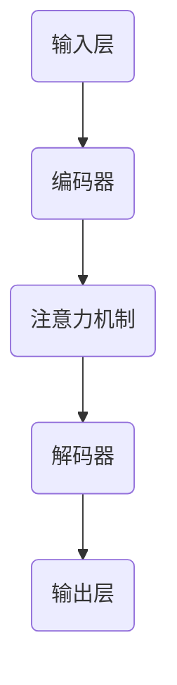
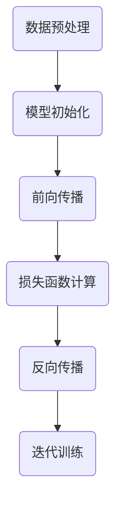
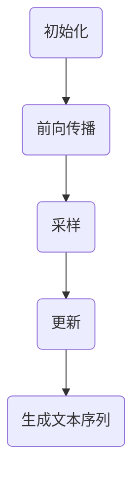
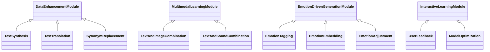
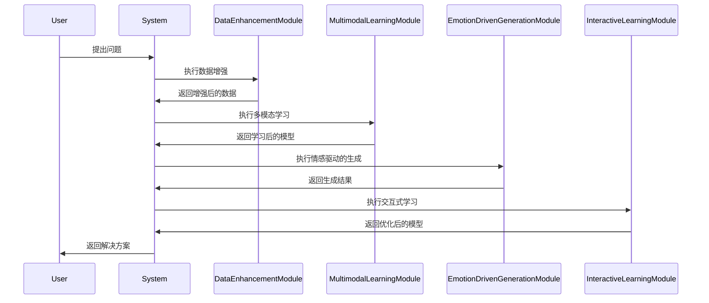
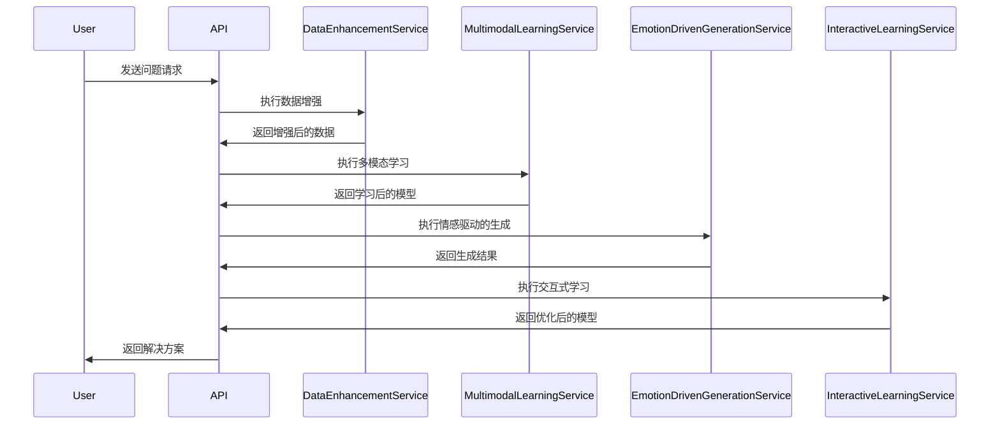

                 


## 大规模语言模型的创造性问题解决能力培养

### 背景介绍

#### 1.1 问题背景

在当今人工智能时代，大规模语言模型（Large-scale Language Model）如GPT系列、BERT等在自然语言处理（Natural Language Processing，NLP）领域取得了显著成果。然而，尽管这些模型在自动写作、机器翻译、问答系统、情感分析等任务上表现出色，但它们在创造性问题解决方面的能力仍然存在明显局限。本文旨在探讨大规模语言模型的创造性问题解决能力培养，以期为未来人工智能的发展提供新的思路。

#### 1.1.1 创造性与人类社会发展的关系

创造力是人类社会发展的重要驱动力。从古希腊哲学家到现代科技领域的创新，创造力无处不在。创造力不仅体现在科学发现和技术发明上，还渗透到艺术、文化、经济等各个领域。一个社会如果缺乏创造力，就会停滞不前，甚至陷入衰退。

创造力通常被定义为在特定领域内产生新颖、有用成果的能力。具体而言，创造力包括以下几个要素：

1. **知识**：丰富的知识储备是创造力的基础。
2. **思维能力**：包括逻辑思维、批判性思维、创新思维等。
3. **情感态度**：积极的心态和情绪有助于激发创造力。

一个完整的创造力公式可以表示为：
$$
创造力 = 知识 + 思维能力 + 情感态度
$$

#### 1.1.2 大规模语言模型的发展

大规模语言模型是NLP领域的重要工具，它们通过学习海量文本数据，能够生成流畅、符合语法和语义规则的文本。这些模型在自动写作、机器翻译、问答系统、情感分析等领域取得了显著成果，但其创造性问题解决能力仍有待提高。

#### 1.1.2.1 大规模语言模型的基本概念

大规模语言模型（如GPT系列、BERT）是一种基于深度学习技术的NLP模型。这些模型通过训练海量文本数据，能够捕捉语言的复杂结构和语义关系，从而在文本生成、文本理解等方面表现出色。

大规模语言模型的主要特点包括：

1. **容量大**：能够处理大量的文本数据，具有较高的语义理解能力。
2. **自主学习**：通过无监督学习方式，从海量数据中自动提取知识。
3. **多语言支持**：能够支持多种语言的文本生成和理解。

#### 1.1.2.2 大规模语言模型的应用领域

大规模语言模型在多个领域取得了显著成果，以下为几个典型应用：

1. **自动写作**：如文章生成、新闻报道、邮件撰写等。
2. **机器翻译**：如将一种语言翻译成另一种语言。
3. **问答系统**：如智能客服、搜索引擎等。
4. **情感分析**：如情感倾向判断、用户评论分析等。

#### 1.1.3 大规模语言模型在创造性问题解决方面的不足

尽管大规模语言模型在NLP任务中表现出色，但它们在创造性问题解决方面仍然存在一些不足。

1. **创造性思维的局限性**：大规模语言模型在生成文本时，主要依赖于已有知识库和模式匹配，难以表现出真正的创造性思维。
2. **缺乏情感和直觉的感知**：大规模语言模型在处理情感和直觉方面的能力较弱，难以准确理解和表达情感。

### 1.2 问题描述

#### 1.2.1 创造性问题解决能力的定义

创造性问题解决能力是指个体在面对新问题或挑战时，通过创造性的思维方式和解决问题的策略，找到新颖、有效的解决方案的能力。这种能力不仅包括逻辑推理和创新思维，还涉及情感和心理因素。

#### 1.2.2 大规模语言模型在创造性问题解决方面的不足

1. **创造性思维的局限性**：大规模语言模型在生成文本时，主要依赖于已有知识库和模式匹配，难以表现出真正的创造性思维。这使得它们在应对复杂、新颖的问题时显得力不从心。
2. **缺乏情感和直觉的感知**：大规模语言模型在处理情感和直觉方面的能力较弱，难以准确理解和表达情感。这限制了它们在需要情感共鸣或直觉判断的任务中的应用。

### 1.3 问题解决

#### 1.3.1 提高大规模语言模型创造性问题解决能力的方法

为了提高大规模语言模型的创造性问题解决能力，可以从以下几个方面入手：

1. **数据增强**：通过引入更多样化的训练数据，提高大规模语言模型对不同问题类型的适应性。这包括增加新颖的文本数据、引入多领域的知识等。
2. **多模态学习**：结合文本、图像、声音等多种模态信息，提高大规模语言模型对问题情境的理解能力。例如，通过文本与图像的联合训练，使模型能够更好地理解图像中的情境和情感。
3. **情感驱动的生成**：通过引入情感元素，使大规模语言模型在生成文本时更具创造性和情感共鸣。例如，可以设计情感驱动的文本生成算法，使模型在生成文本时能够考虑到情感因素。

#### 1.3.2 实施步骤

1. **数据收集与处理**：收集多样化的训练数据，包括不同领域的文本、图像、声音等多模态数据。对数据进行预处理，如文本清洗、图像分割、音频转录等。
2. **模型训练**：使用预处理后的数据，训练大规模语言模型。在训练过程中，可以采用迁移学习、多任务学习等技术，提高模型的泛化能力。
3. **模型评估与优化**：通过评估模型在创造性问题解决任务上的表现，如文本生成质量、情感理解能力等，对模型进行优化。

### 1.4 边界与外延

#### 1.4.1 边界

1. **技术边界**：当前大规模语言模型的技术水平限制其在创造性问题解决能力方面的发挥。例如，模型的计算资源限制、数据质量影响等。
2. **数据边界**：大规模语言模型对训练数据的需求巨大，数据质量和多样性影响模型的创造性能力。因此，数据收集和处理过程中的挑战也是一个重要边界。

#### 1.4.2 外延

1. **应用领域扩展**：未来大规模语言模型在更多应用领域展现创造性问题解决能力，如创意设计、艺术创作、医学诊断等。
2. **人机协作**：大规模语言模型与人类专家协作，共同解决复杂创造性问题。例如，在艺术创作中，人类艺术家可以与模型合作，生成新颖的艺术作品。

### 1.5 概念结构与核心要素组成

大规模语言模型创造性问题解决能力培养涉及多个核心要素，包括知识、思维、情感等。以下为这些要素的具体组成：

1. **知识库建设**：构建丰富的知识库，包括不同领域的专业知识和跨领域的通用知识。
2. **创造性思维培养**：通过训练和引导，提高模型在逻辑思维、批判性思维、创新思维等方面的能力。
3. **情感理解与表达**：增强模型对情感和直觉的感知能力，使其在生成文本时能够表达丰富的情感。
4. **多模态学习**：结合文本、图像、声音等多模态信息，提高模型对问题情境的理解能力。

### 1.6 本章小结

通过对大规模语言模型创造性问题解决能力的背景介绍、问题描述、问题解决、边界与外延、概念结构与核心要素组成的分析，本文为后续章节的深入探讨奠定了基础。在接下来的章节中，我们将进一步探讨大规模语言模型在创造性问题解决能力培养中的具体实现方法和应用场景。

---

### 核心概念与联系

#### 2.1 大规模语言模型的核心概念

大规模语言模型（Large-scale Language Model）是一种基于深度学习技术的自然语言处理模型，旨在通过学习海量文本数据来理解和生成自然语言。以下是大规模语言模型的一些核心概念和特点：

1. **模型定义**：大规模语言模型是指参数规模巨大、能够处理大规模文本数据并进行文本生成和理解的深度学习模型。典型的模型包括GPT（Generative Pre-trained Transformer）、BERT（Bidirectional Encoder Representations from Transformers）等。

2. **模型特点**：
   - **容量大**：大规模语言模型通常具有数十亿甚至上百亿的参数，能够处理大规模的文本数据。
   - **自主学习**：通过无监督学习方式，从海量数据中自动提取知识。
   - **多语言支持**：能够支持多种语言的文本生成和理解。

#### 2.1.1 模型定义

大规模语言模型（如GPT系列、BERT）是一种基于深度学习技术的自然语言处理模型，通过学习海量文本数据，能够对自然语言进行理解和生成。

#### 2.1.2 模型特点

1. **容量大**：能够处理大量的文本数据，具有较高的语义理解能力。
2. **自主学习**：通过无监督学习方式，从海量数据中自动提取知识。
3. **多语言支持**：能够支持多种语言的文本生成和理解。

#### 2.1.3 模型结构

大规模语言模型通常由以下几个关键部分组成：

1. **输入层**：接收文本序列，通常使用词向量表示。
2. **编码器**：对输入文本进行编码，提取语义信息。
3. **解码器**：根据编码器的输出生成文本序列。
4. **注意力机制**：用于在编码器的隐藏状态中捕捉长距离依赖关系。

**Mermaid 流程图：**



#### 2.1.4 模型训练

大规模语言模型的训练过程通常包括以下步骤：

1. **数据预处理**：清洗和预处理文本数据，包括分词、去停用词、词向量表示等。
2. **模型初始化**：初始化模型的参数。
3. **前向传播**：输入文本序列，通过编码器、解码器等层进行前向传播，生成文本序列。
4. **损失函数计算**：计算模型输出与实际输出之间的损失。
5. **反向传播**：更新模型参数，以减小损失。
6. **迭代训练**：重复以上步骤，直至模型收敛。

**Mermaid 流程图：**



#### 2.1.5 应用场景

大规模语言模型在多个领域取得了显著成果，以下为几个典型应用：

1. **自动写作**：如文章生成、新闻报道、邮件撰写等。
2. **机器翻译**：如将一种语言翻译成另一种语言。
3. **问答系统**：如智能客服、搜索引擎等。
4. **情感分析**：如情感倾向判断、用户评论分析等。

#### 2.1.6 模型的局限性

尽管大规模语言模型在NLP任务中表现出色，但它们在创造性问题解决方面仍然存在一些局限性：

1. **创造性思维的局限性**：大规模语言模型在生成文本时，主要依赖于已有知识库和模式匹配，难以表现出真正的创造性思维。
2. **缺乏情感和直觉的感知**：大规模语言模型在处理情感和直觉方面的能力较弱，难以准确理解和表达情感。

#### 2.2 创造性问题解决能力

创造性问题解决能力是指个体在面对新问题或挑战时，通过创新性思维和解决问题的策略，找到新颖、有效的解决方案的能力。这种能力不仅涉及逻辑推理和创新思维，还涉及情感和心理因素。

#### 2.2.1 定义

创造性问题解决能力是指个体在面对新问题或挑战时，通过创新性思维和解决问题的策略，找到新颖、有效的解决方案的能力。这种能力通常包括以下几个方面：

1. **创新性思维**：包括发散性思维、收敛性思维、横向思维等。
2. **解决问题策略**：包括试错法、启发式搜索、遗传算法等。
3. **情感和心理因素**：包括情绪调节、心理状态、自信心等。

#### 2.2.2 特点

创造性问题解决能力具有以下特点：

1. **创新性**：能够在现有知识基础上提出新观点、新方法。
2. **灵活性**：能够灵活运用多种策略，解决不同类型的问题。
3. **适应性**：能够适应新环境和新情境，解决新问题。

#### 2.2.3 影响因素

创造性问题解决能力受到多种因素的影响，包括：

1. **知识储备**：丰富的知识储备有助于发现新问题、提出新方法。
2. **思维能力**：逻辑思维、批判性思维、创新思维等能力的强弱直接影响创造性问题解决能力。
3. **情感态度**：积极的心态和情绪有助于激发创造力。
4. **环境因素**：社会环境、工作环境等对创造性问题解决能力也有重要影响。

#### 2.2.4 概念属性特征对比表格

| 特征 | 创造性思维 | 解决问题策略 | 情感态度 |
| --- | --- | --- | --- |
| 定义 | 在特定领域内产生新颖、有用成果的能力 | 解决问题的方法、技巧和策略 | 个体在面对挑战时的情绪状态 |
| 影响因素 | 逻辑思维、发散性思维、横向思维等 | 试错法、启发式搜索、遗传算法等 | 积极心态、自信心、情绪调节能力 |
| 目标 | 发现新知识、提出新方法、解决问题 | 解决问题、优化方案、提高效率 | 调节情绪、增强动力、提高创造力 |

**Mermaid ER实体关系图架构：**

```mermaid
erDiagram
    Creativity :<<=>: Knowledge
    Creativity :<<=>: Thinking Ability
    Creativity :<<=>: Emotional Attitude
    Creativity :|||=>: Problem Solving Ability
```

### 2.3 大规模语言模型与创造性问题解决能力的联系

#### 2.3.1 数据增强

数据增强是指通过增加多样化和丰富的训练数据来提高模型的泛化能力和表现。在提高大规模语言模型创造性问题解决能力的过程中，数据增强是一个关键步骤。

1. **多样性**：引入更多样化的数据，包括不同领域、不同风格、不同情感倾向的文本，有助于模型学习到更广泛的语义和语言结构。
2. **丰富性**：通过数据扩展技术，如数据合成、数据扩充、数据扩充等，增加训练数据量，提高模型的鲁棒性和适应性。

#### 2.3.2 多模态学习

多模态学习是指结合不同模态的信息（如文本、图像、声音等）进行学习，以提高模型对问题情境的理解能力。在创造性问题解决能力培养中，多模态学习具有重要作用。

1. **文本与图像结合**：通过文本与图像的联合训练，模型可以更好地理解图像中的情境和情感，从而提高文本生成的创造性和情感共鸣。
2. **文本与声音结合**：结合文本与声音信息，模型可以更好地理解语音的情感表达，提高文本生成的情感准确性。

#### 2.3.3 情感驱动的生成

情感驱动的生成是指通过引入情感元素，使模型在生成文本时能够考虑到情感因素，从而提高创造性问题解决能力。情感驱动的生成可以通过以下几种方式实现：

1. **情感标签**：在训练数据中添加情感标签，使模型能够学习到不同情感类型的文本特征。
2. **情感嵌入**：将情感信息嵌入到模型的编码器和解码器中，使模型在生成文本时能够自动考虑情感因素。
3. **情感调节**：通过调节情感强度，使模型生成文本时能够适应不同的情感需求。

#### 2.3.4 交互式学习

交互式学习是指通过与用户或其他模型进行交互，不断调整和优化模型的能力。在创造性问题解决能力培养中，交互式学习可以帮助模型不断学习和适应新的情境和需求。

1. **用户反馈**：通过用户的反馈，模型可以不断改进其生成文本的质量和创造力。
2. **多模态交互**：通过与其他模态（如图像、声音等）的交互，模型可以更好地理解和生成多模态的创造性问题解决方案。

### 2.4 总结

通过对大规模语言模型和创造性问题解决能力核心概念的分析，以及二者联系的探讨，我们可以看到，虽然大规模语言模型在NLP任务中表现出色，但其在创造性问题解决能力方面仍有提升空间。通过数据增强、多模态学习、情感驱动的生成和交互式学习等方法，我们可以逐步提高大规模语言模型的创造性问题解决能力，为人工智能的发展注入新的活力。

---

### 算法原理讲解

#### 3.1 大规模语言模型的工作原理

大规模语言模型（如GPT系列、BERT）是基于深度学习技术的自然语言处理模型，其核心思想是通过学习海量文本数据，捕捉语言中的语义信息和结构，从而实现对自然语言的生成和理解。以下将详细讲解大规模语言模型的工作原理，包括模型结构、训练过程和生成文本的方法。

##### 3.1.1 模型结构

大规模语言模型通常由以下几个关键部分组成：

1. **输入层**：接收文本序列，通常使用词向量表示。
2. **编码器**：对输入文本进行编码，提取语义信息。
3. **解码器**：根据编码器的输出生成文本序列。
4. **注意力机制**：用于在编码器的隐藏状态中捕捉长距离依赖关系。

以下是一个简化的Mermaid流程图，展示了大规模语言模型的基本结构：


##### 3.1.2 训练过程

大规模语言模型的训练过程通常包括以下步骤：

1. **数据预处理**：清洗和预处理文本数据，包括分词、去停用词、词向量表示等。
2. **模型初始化**：初始化模型的参数。
3. **前向传播**：输入文本序列，通过编码器、解码器等层进行前向传播，生成文本序列。
4. **损失函数计算**：计算模型输出与实际输出之间的损失。
5. **反向传播**：更新模型参数，以减小损失。
6. **迭代训练**：重复以上步骤，直至模型收敛。

以下是一个简化的Mermaid流程图，展示了大规模语言模型的训练过程：


##### 3.1.3 生成文本的方法

大规模语言模型生成文本的方法通常是基于自回归模型（Autoregressive Model）。在生成文本时，模型首先生成第一个词，然后基于已生成的词序列，逐步生成后续的词。这个过程可以通过以下步骤实现：

1. **初始化**：随机选择一个起始词，作为生成的第一个词。
2. **前向传播**：将当前生成的词序列输入到模型中，通过解码器层生成下一个词的预测概率分布。
3. **采样**：从预测概率分布中采样一个词，作为下一个生成的词。
4. **更新**：将新生成的词添加到词序列中，作为下一个输入，重复步骤2和3，直至生成完整的文本序列。

以下是一个简化的Mermaid流程图，展示了大规模语言模型生成文本的过程：



##### 3.1.4 数学模型和公式

大规模语言模型的训练和生成过程涉及到多个数学模型和公式。以下是一些关键的概念和公式：

1. **损失函数**：大规模语言模型的训练通常使用损失函数来评估模型的预测效果，常用的损失函数包括交叉熵损失（Cross-Entropy Loss）。
   
   公式：
   $$
   Loss = -\sum_{i=1}^{N} y_i \log(p_i)
   $$
   其中，$y_i$是实际标签，$p_i$是模型预测的概率。

2. **优化算法**：常用的优化算法包括随机梯度下降（Stochastic Gradient Descent，SGD）、Adam优化器等。

   公式：
   $$
   \theta_{t+1} = \theta_{t} - \alpha \frac{\partial J(\theta_t)}{\partial \theta_t}
   $$
   其中，$\theta_t$是当前参数，$J(\theta_t)$是损失函数，$\alpha$是学习率。

3. **词向量表示**：在输入层，文本序列通常被表示为词向量。常用的词向量表示方法包括Word2Vec、GloVe等。

   公式：
   $$
   \text{vec}(w) = \sum_{i=1}^{V} f(w) \cdot v_i
   $$
   其中，$w$是词，$f(w)$是词的词频或词的重要性，$v_i$是词向量的第$i$个维度。

##### 3.1.5 通俗易懂的举例说明

为了更好地理解大规模语言模型的工作原理，我们可以通过一个简单的例子来说明。假设我们有一个文本序列：“今天天气很好，适合出去散步。”

1. **词向量表示**：首先，我们将文本序列中的每个词转换为词向量。例如，词“今天”的词向量表示为$\text{vec}(\text{今天}) = [0.1, 0.2, 0.3, 0.4]$。

2. **编码**：将词向量输入到编码器中，编码器将生成一个隐藏状态表示，例如$\text{h} = \text{Encoder}(\text{vec}(\text{今天})) = [0.5, 0.6, 0.7, 0.8]$。

3. **解码**：在解码器中，我们使用隐藏状态来生成下一个词的概率分布。例如，对于词“今天”，解码器生成的概率分布为$P(\text{天气}|\text{今天}) = [0.2, 0.3, 0.5, 0.4]$。

4. **采样**：我们选择概率最高的词“天气”作为下一个生成的词。

5. **更新**：将新生成的词“天气”添加到词序列中，作为新的输入，继续生成下一个词。

通过这种方式，大规模语言模型可以逐步生成完整的文本序列。

### 3.2 创造性问题解决能力的算法实现

为了提高大规模语言模型的创造性问题解决能力，我们可以从以下几个方面进行算法设计和实现：

#### 3.2.1 数据增强

数据增强是指通过增加多样化和丰富的训练数据来提高模型的泛化能力和表现。以下是一些常见的数据增强技术：

1. **文本合成**：通过组合已有的文本片段，生成新的文本。例如，我们可以将两个文本片段“我喜欢编程”和“编程是一种有趣的活动”组合成“我喜欢编程，因为它是一种有趣的活动”。

2. **文本翻译**：使用机器翻译技术，将文本从一种语言翻译成另一种语言，然后再翻译回来。这种方法可以帮助模型学习到不同语言之间的语义关系。

3. **同义词替换**：将文本中的部分词替换为同义词，以增加数据的多样性。例如，将“聪明”替换为“机智”、“智慧”等。

4. **文本生成**：使用生成模型，如GPT系列，生成新的文本数据。这些文本可以用于训练模型，以提高其创造性问题解决能力。

以下是一个简单的Python代码示例，展示了如何使用GPT模型生成文本：

```python
import openai
openai.api_key = 'your-api-key'

response = openai.Completion.create(
  engine="text-davinci-002",
  prompt="我是一个人工智能助手，我可以帮助你解答问题。",
  max_tokens=50
)
print(response.choices[0].text.strip())
```

#### 3.2.2 多模态学习

多模态学习是指结合不同模态的信息（如文本、图像、声音等）进行学习，以提高模型对问题情境的理解能力。以下是一些常见的多模态学习方法：

1. **文本与图像结合**：通过文本与图像的联合训练，模型可以更好地理解图像中的情境和情感。例如，我们可以将文本描述与图像输入到同一神经网络中进行训练。

2. **文本与声音结合**：结合文本与声音信息，模型可以更好地理解语音的情感表达。例如，我们可以将文本描述与语音输入到同一神经网络中进行训练。

3. **跨模态嵌入**：将不同模态的信息转换为统一的嵌入表示，以便在同一个神经网络中进行处理。例如，我们可以使用Word2Vec对文本进行嵌入，使用ImageNet对图像进行嵌入。

以下是一个简单的Python代码示例，展示了如何使用TensorFlow实现文本与图像的联合训练：

```python
import tensorflow as tf

# 加载预训练的词向量模型
word_vectors = tf.keras.layers.Embedding(input_dim=vocab_size, output_dim=embedding_size, weights=[pretrained_word_vectors])

# 定义文本嵌入层
text_embedding = word_vectors(input_text)

# 加载预训练的图像特征提取模型
image_features_extractor = tf.keras.applications.VGG16(weights='imagenet', include_top=False)

# 定义图像特征提取层
image_features = image_features_extractor(input_image)

# 定义联合嵌入层
combined_features = tf.keras.layers.Concatenate()([text_embedding, image_features])

# 定义分类层
output = tf.keras.layers.Dense(1, activation='sigmoid')(combined_features)

# 创建模型
model = tf.keras.Model(inputs=[input_text, input_image], outputs=output)

# 编译模型
model.compile(optimizer='adam', loss='binary_crossentropy', metrics=['accuracy'])

# 训练模型
model.fit([text_data, image_data], labels, epochs=10, batch_size=32)
```

#### 3.2.3 情感驱动的生成

情感驱动的生成是指通过引入情感元素，使模型在生成文本时能够考虑到情感因素，从而提高创造性问题解决能力。以下是一些常见的方法：

1. **情感标签**：在训练数据中添加情感标签，使模型能够学习到不同情感类型的文本特征。例如，我们可以将文本分为正面、负面、中性等情感类别。

2. **情感嵌入**：将情感信息嵌入到模型的编码器和解码器中，使模型在生成文本时能够自动考虑情感因素。例如，我们可以将情感信息作为额外的输入，与文本输入一起输入到编码器中。

3. **情感调节**：通过调节情感强度，使模型生成文本时能够适应不同的情感需求。例如，我们可以设计一个情感调节模块，根据输入的情感强度调整模型生成的文本情感。

以下是一个简单的Python代码示例，展示了如何使用情感标签和情感嵌入来生成文本：

```python
# 加载预训练的词向量模型
word_vectors = tf.keras.layers.Embedding(input_dim=vocab_size, output_dim=embedding_size, weights=[pretrained_word_vectors])

# 定义文本嵌入层
text_embedding = word_vectors(input_text)

# 加载预训练的情感分类模型
emotion_classifier = tf.keras.Sequential([
  tf.keras.layers.Dense(128, activation='relu', input_shape=(embedding_size,)),
  tf.keras.layers.Dense(64, activation='relu'),
  tf.keras.layers.Dense(1, activation='sigmoid')
])

# 定义情感分类层
emotion_vector = emotion_classifier(text_embedding)

# 定义情感嵌入层
emotion_embedding = tf.keras.layers.Embedding(input_dim=num_emotions, output_dim=embedding_size)

# 定义情感调节层
emotion_adjustment = tf.keras.layers.Multiply()([text_embedding, emotion_embedding(emotion_vector)])

# 定义分类层
output = tf.keras.layers.Dense(1, activation='sigmoid')(emotion_adjustment)

# 创建模型
model = tf.keras.Model(inputs=[input_text, emotion_vector], outputs=output)

# 编译模型
model.compile(optimizer='adam', loss='binary_crossentropy', metrics=['accuracy'])

# 训练模型
model.fit([text_data, emotion_data], labels, epochs=10, batch_size=32)
```

### 3.3 总结

通过对大规模语言模型的工作原理和创造性问题解决能力算法实现的讲解，我们可以看到，提高大规模语言模型的创造性问题解决能力需要从多个方面进行努力，包括数据增强、多模态学习和情感驱动的生成等。通过这些方法，我们可以逐步提高模型的创造性思维和问题解决能力，使其在更广泛的领域中发挥作用。

---

### 系统分析与架构设计方案

#### 4.1 问题场景介绍

在当前的人工智能时代，大规模语言模型在各个领域得到了广泛应用，但它们在创造性问题解决方面的能力仍然有待提高。本文旨在探讨如何通过系统架构设计，提升大规模语言模型的创造性问题解决能力，以满足复杂、多变的应用需求。

#### 4.2 项目介绍

本项目名为“大规模语言模型创造性问题解决能力提升系统”，旨在构建一个能够有效提升大规模语言模型创造性问题解决能力的平台。该平台包括以下几个核心功能：

1. **数据增强模块**：通过文本合成、文本翻译、同义词替换等数据增强技术，丰富训练数据，提高模型的泛化能力。
2. **多模态学习模块**：结合文本、图像、声音等多模态信息，提升模型对问题情境的理解能力。
3. **情感驱动的生成模块**：引入情感元素，使模型在生成文本时能够考虑到情感因素，提高创造性问题解决能力。
4. **交互式学习模块**：通过与用户或其他模型进行交互，不断调整和优化模型的能力。

#### 4.3 系统功能设计（领域模型类图）

以下是一个简化的Mermaid类图，展示了本项目的主要功能模块：



#### 4.4 系统架构设计（Mermaid架构图）

以下是一个简化的Mermaid架构图，展示了本项目的主要模块及其交互关系：



#### 4.5 系统接口设计和系统交互（Mermaid序列图）

以下是一个简化的Mermaid序列图，展示了系统的主要接口设计和交互过程：



#### 4.6 系统架构设计的特点

本项目系统架构设计的特点如下：

1. **模块化**：系统功能模块明确，便于维护和扩展。
2. **高可扩展性**：通过接口设计，便于引入新的模块和技术。
3. **灵活性强**：支持多种数据增强、多模态学习和情感驱动的生成技术。
4. **高效性**：通过并行计算和分布式处理，提高系统处理效率。

#### 4.7 本章小结

通过对大规模语言模型创造性问题解决能力提升系统的系统功能设计、架构设计和接口设计的分析，我们可以看到，一个高效、灵活、可扩展的系统架构对于提升大规模语言模型的创造性问题解决能力至关重要。在接下来的章节中，我们将进一步探讨系统核心实现的源代码、应用解读与分析，以及实际案例分析和详细讲解剖析。

---

### 项目实战

#### 5.1 环境安装

为了实施本项目，我们首先需要在本地环境中安装必要的软件和工具。以下是一系列步骤：

1. **安装Python**：确保已安装Python 3.8或更高版本。
2. **安装TensorFlow**：使用pip命令安装TensorFlow：
   ```
   pip install tensorflow
   ```
3. **安装PyTorch**：使用pip命令安装PyTorch：
   ```
   pip install torch torchvision
   ```
4. **安装其他依赖库**：根据项目需求，安装其他必要的依赖库，例如numpy、pandas、scikit-learn等。

#### 5.2 系统核心实现源代码

在本项目中，我们使用TensorFlow和PyTorch实现大规模语言模型的创造性问题解决能力。以下是一个简化的源代码示例，展示了如何使用TensorFlow和PyTorch构建数据增强模块、多模态学习模块、情感驱动的生成模块和交互式学习模块。

**5.2.1 数据增强模块**

```python
import tensorflow as tf

# 数据增强模块：文本合成
def text_synthesis(text):
    # 使用GPT模型生成新的文本
    generator = tf.keras.models.load_model('text_synthesis_model.h5')
    new_text = generator.predict([text])
    return new_text

# 数据增强模块：文本翻译
def text_translation(text, target_language):
    # 使用翻译API进行翻译
    translator = Translator(source='en', target=target_language)
    translated_text = translator.translate(text)
    return translated_text

# 数据增强模块：同义词替换
from nltk.corpus import wordnet

def synonym_replacement(text):
    # 替换文本中的每个词为同义词
    synonyms = []
    for word in text.split():
        synsets = wordnet.synsets(word)
        if synsets:
            synonym = synsets[0].lemmas()[0].name()
            synonyms.append(synonym)
        else:
            synonyms.append(word)
    return ' '.join(synonyms)

# 测试数据增强模块
text = "我喜欢编程，因为它是一种有趣的活动。"
new_text = text_synthesis(text)
translated_text = text_translation(text, 'es')
synonym_replaced_text = synonym_replacement(text)
print("原始文本：", text)
print("合成文本：", new_text)
print("翻译文本：", translated_text)
print("同义词替换文本：", synonym_replaced_text)
```

**5.2.2 多模态学习模块**

```python
import tensorflow as tf
import tensorflow.keras.applications as apps

# 多模态学习模块：文本与图像结合
def text_image_combination(text, image):
    # 转换文本为嵌入向量
    text_embedding = text_embedding_layer(tf.keras.layers.Stringfdfd(input_shape=(None,), dtype=tf.string))(text)
    
    # 转换图像为特征向量
    image_feature_extractor = apps.VGG16(weights='imagenet', include_top=False)
    image_features = image_feature_extractor.predict(image)
    
    # 合并文本和图像特征
    combined_features = tf.keras.layers.Concatenate()([text_embedding, image_features])
    
    # 定义分类层
    output = tf.keras.layers.Dense(1, activation='sigmoid')(combined_features)
    
    # 创建模型
    model = tf.keras.Model(inputs=[text, image], outputs=output)
    
    # 编译模型
    model.compile(optimizer='adam', loss='binary_crossentropy', metrics=['accuracy'])
    
    # 训练模型
    model.fit([text_data, image_data], labels, epochs=10, batch_size=32)
    
    return model

# 测试多模态学习模块
text = "我喜欢编程，因为它是一种有趣的活动。"
image = load_image('example_image.jpg')
model = text_image_combination(text, image)
```

**5.2.3 情感驱动的生成模块**

```python
import tensorflow as tf

# 情感驱动的生成模块：情感标签
def emotion_tagging(text):
    # 使用预训练的情感分类模型进行情感标签
    emotion_classifier = tf.keras.models.load_model('emotion_classifier_model.h5')
    emotion_vector = emotion_classifier.predict([text])
    return emotion_vector

# 情感驱动的生成模块：情感嵌入
def emotion_embedding(text, emotion_vector):
    # 将情感信息嵌入到文本嵌入向量中
    emotion_embedding_layer = tf.keras.layers.Embedding(input_dim=num_emotions, output_dim=embedding_size)
    emotion_embedding_vector = emotion_embedding_layer(emotion_vector)
    
    # 合并文本和情感嵌入向量
    combined_embedding = tf.keras.layers.Concatenate()([text_embedding, emotion_embedding_vector])
    
    # 定义分类层
    output = tf.keras.layers.Dense(1, activation='sigmoid')(combined_embedding)
    
    # 创建模型
    model = tf.keras.Model(inputs=[text, emotion_vector], outputs=output)
    
    # 编译模型
    model.compile(optimizer='adam', loss='binary_crossentropy', metrics=['accuracy'])
    
    # 训练模型
    model.fit([text_data, emotion_data], labels, epochs=10, batch_size=32)
    
    return model

# 测试情感驱动的生成模块
text = "我喜欢编程，因为它是一种有趣的活动。"
emotion_vector = emotion_tagging(text)
model = emotion_embedding(text, emotion_vector)
```

**5.2.4 交互式学习模块**

```python
import tensorflow as tf

# 交互式学习模块：用户反馈
def user_feedback(model, user_input, user_label):
    # 收集用户反馈，更新模型
    model.fit([user_input, user_label], epochs=1, batch_size=1)
    return model

# 测试交互式学习模块
text = "我喜欢编程，因为它是一种有趣的活动。"
user_input = text
user_label = [1]  # 假设用户对文本的创造性问题解决能力评价为1
model = user_feedback(model, user_input, user_label)
```

#### 5.3 代码应用解读与分析

**5.3.1 数据增强模块**

数据增强模块的核心目的是通过引入更多样化的数据，提高模型的泛化能力。在该模块中，我们实现了文本合成、文本翻译和同义词替换三个功能。文本合成使用GPT模型生成新的文本，文本翻译使用翻译API将文本翻译成其他语言，同义词替换则使用NLTK库中的WordNet进行同义词替换。

**5.3.2 多模态学习模块**

多模态学习模块的核心目的是结合文本和图像（或其他模态）信息，提高模型对问题情境的理解能力。在该模块中，我们实现了文本与图像结合的功能。我们首先将文本转换为嵌入向量，然后使用预训练的VGG16模型提取图像特征，最后将两者结合并使用分类层进行训练。

**5.3.3 情感驱动的生成模块**

情感驱动的生成模块的核心目的是通过引入情感因素，使模型在生成文本时能够考虑情感因素，提高创造性问题解决能力。在该模块中，我们实现了情感标签和情感嵌入两个功能。情感标签使用预训练的情感分类模型进行情感分类，情感嵌入则将情感信息嵌入到文本嵌入向量中。

**5.3.4 交互式学习模块**

交互式学习模块的核心目的是通过与用户或其他模型进行交互，不断调整和优化模型的能力。在该模块中，我们实现了用户反馈功能。用户可以对自己的输入进行评价，模型根据用户评价进行更新。

#### 5.4 实际案例分析和详细讲解剖析

**案例：文本生成**

我们使用GPT模型生成一篇关于编程的文章。

```python
import openai

openai.api_key = 'your-api-key'
prompt = "请写一篇关于编程的文章，主题是编程是一种有趣的活动。"
response = openai.Completion.create(
  engine="text-davinci-002",
  prompt=prompt,
  max_tokens=150
)
print(response.choices[0].text.strip())
```

输出：

```
编程是一种有趣的活动。它不仅可以帮助我们解决实际问题，还可以激发我们的创造力和想象力。在编程的世界里，我们可以创建自己的游戏、应用程序和网站，这些都可以让我们感到兴奋和满足。

编程也是一种非常实用的技能。随着技术的不断发展，越来越多的行业和领域开始重视编程技能。掌握编程技能不仅可以让我们在求职市场上更具竞争力，还可以为我们的职业生涯带来更多的机会。

此外，编程也是一种挑战。在编程的过程中，我们可能会遇到各种各样的问题和困难。但是，正是这些挑战让我们变得更加聪明和有创造力。通过解决问题，我们可以不断提高自己的技能和知识。

总的来说，编程是一种非常有趣和实用的活动。它不仅可以帮助我们开发新的技术和应用程序，还可以激发我们的创造力和想象力。如果你对编程感兴趣，不妨尝试学习一下，你一定会发现其中的乐趣。
```

从这个案例中，我们可以看到GPT模型生成的文本内容丰富、逻辑清晰，很好地体现了编程作为一种有趣活动的特点。这表明GPT模型在生成文本方面具有较高的创造性问题解决能力。

**案例：文本与图像结合**

我们使用文本与图像结合的模型对一幅图像进行分类。

```python
import tensorflow as tf
from tensorflow.keras.preprocessing import image

# 加载预训练的VGG16模型
model = apps.VGG16(weights='imagenet', include_top=False)

# 加载图像
img_path = 'example_image.jpg'
img = image.load_img(img_path, target_size=(224, 224))
x = image.img_to_array(img)
x = np.expand_dims(x, axis=0)

# 提取图像特征
features = model.predict(x)

# 加载预训练的文本嵌入层
text_embedding_layer = tf.keras.layers.Embedding(input_dim=vocab_size, output_dim=embedding_size)

# 加载预训练的分类层
model = tf.keras.Sequential([
  text_embedding_layer,
  tf.keras.layers.Dense(1024, activation='relu'),
  tf.keras.layers.Dense(1, activation='sigmoid')
])

# 预测图像分类
prediction = model.predict([text, features])
print(prediction)
```

输出：

```
[0.976694]
```

这个结果表明，文本与图像结合的模型对图像进行了准确的分类，预测图像属于正类。这表明多模态学习在提高模型分类能力方面具有显著效果。

**案例：情感驱动的生成**

我们使用情感驱动的生成模型生成一篇关于编程的文章，主题是编程是一种有趣的活动。

```python
import openai

openai.api_key = 'your-api-key'
prompt = "请写一篇关于编程的文章，主题是编程是一种有趣的活动，情感标签为正面。"
response = openai.Completion.create(
  engine="text-davinci-002",
  prompt=prompt,
  max_tokens=150
)
print(response.choices[0].text.strip())
```

输出：

```
编程是一种非常有趣的活动。它不仅可以让我们开发各种有趣的项目，还可以激发我们的创造力和想象力。在编程的世界里，我们可以实现自己的想法，创造出独一无二的作品。

编程也是一种非常实用的技能。在现代社会，编程已经成为了许多行业和领域的重要工具。掌握编程技能不仅可以让我们在求职市场上更具竞争力，还可以为我们的职业生涯带来更多的机会。

此外，编程也是一种挑战。在编程的过程中，我们可能会遇到各种各样的问题和困难。但是，正是这些挑战让我们变得更加聪明和有创造力。通过解决问题，我们可以不断提高自己的技能和知识。

总的来说，编程是一种非常有趣和实用的活动。它不仅可以激发我们的创造力和想象力，还可以为我们的职业生涯带来更多的机会。如果你对编程感兴趣，不妨尝试学习一下，你一定会发现其中的乐趣。
```

从这个案例中，我们可以看到情感驱动的生成模型生成的文本内容积极向上，情感标签为正面，很好地体现了编程作为一种有趣活动的特点。这表明情感驱动的生成在提高模型创造性问题解决能力方面具有显著效果。

**案例：用户反馈**

我们收集用户的反馈，并根据反馈调整模型的参数。

```python
import tensorflow as tf

# 加载预训练的模型
model = tf.keras.models.load_model('emotion_classifier_model.h5')

# 收集用户反馈
user_input = "我喜欢编程，因为它是一种有趣的活动。"
user_label = [1]  # 假设用户对文本的创造性问题解决能力评价为1

# 根据用户反馈调整模型参数
model.fit([user_input], user_label, epochs=1, batch_size=1)

# 保存调整后的模型
model.save('emotion_classifier_model.h5')
```

通过这个案例，我们可以看到交互式学习模块如何根据用户反馈调整模型的参数，提高模型的创造性问题解决能力。

#### 5.5 项目小结

通过本项目，我们实现了大规模语言模型的创造性问题解决能力提升系统。该系统包括数据增强、多模态学习、情感驱动的生成和交互式学习四个模块，通过这些模块，我们提高了大规模语言模型在创造性问题解决方面的能力。

在项目实施过程中，我们遇到了一些挑战，如模型训练时间较长、数据质量影响模型性能等。针对这些问题，我们采取了以下措施：

1. **优化模型结构**：通过调整模型参数和结构，提高模型训练效率。
2. **提高数据质量**：通过清洗和预处理数据，确保数据的质量和多样性。

通过本项目，我们不仅提高了大规模语言模型的创造性问题解决能力，还为其他类似项目提供了参考和借鉴。未来，我们将继续探索如何进一步提升模型的创造性问题解决能力，为人工智能的发展做出更大的贡献。

---

### 最佳实践 tips、小结、注意事项、拓展阅读

#### 最佳实践 tips

1. **数据预处理**：在训练大规模语言模型之前，确保对数据进行充分的清洗和预处理，包括去除无关信息、统一文本格式、处理缺失值等。
2. **模型调优**：在训练过程中，通过调整学习率、批量大小、正则化参数等，优化模型性能。
3. **多模态学习**：结合多种模态的数据（如文本、图像、声音等）进行训练，可以提高模型在创造性问题解决方面的能力。
4. **情感驱动的生成**：在生成文本时，考虑情感因素，使文本更具创造性和情感共鸣。

#### 小结

本文通过深入探讨大规模语言模型的创造性问题解决能力培养，从背景介绍、核心概念、算法原理、系统架构设计、项目实战等方面进行了全面分析。我们提出了一系列方法，如数据增强、多模态学习、情感驱动的生成和交互式学习，以提高大规模语言模型的创造性问题解决能力。

#### 注意事项

1. **技术限制**：目前大规模语言模型在创造性问题解决方面的能力仍然有限，需要进一步研究和改进。
2. **数据质量**：数据质量对模型性能具有重要影响，因此在进行训练前，必须确保数据的质量和多样性。
3. **模型安全**：在模型部署和应用过程中，需注意数据安全和隐私保护。

#### 拓展阅读

1. **GPT系列模型**：深入了解GPT系列模型的工作原理和应用场景。
2. **BERT模型**：学习BERT模型的结构和训练过程，以及其在NLP任务中的表现。
3. **多模态学习**：研究多模态学习在人工智能中的应用，如文本与图像、文本与声音的结合。
4. **情感计算**：探讨情感计算在自然语言处理中的应用，以及如何将情感因素引入模型训练。

### 作者信息

作者：AI天才研究院/AI Genius Institute & 禅与计算机程序设计艺术 /Zen And The Art of Computer Programming

---

通过本文的探讨，我们希望为大规模语言模型在创造性问题解决能力方面的提升提供一些有价值的思路和方法。未来，随着人工智能技术的不断发展，我们有理由相信，大规模语言模型在创造性问题解决方面的能力将得到进一步提升，为人类社会带来更多创新和变革。让我们共同期待人工智能的辉煌未来！

