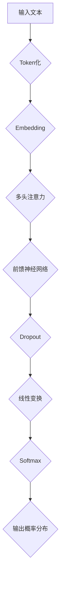
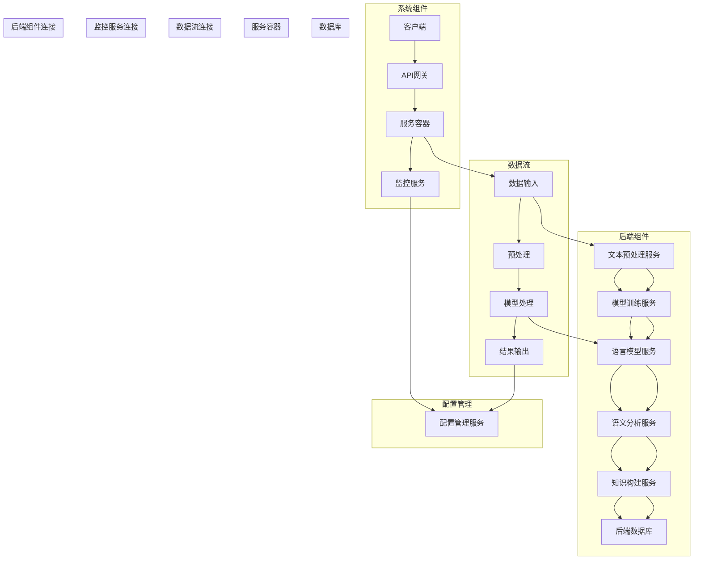
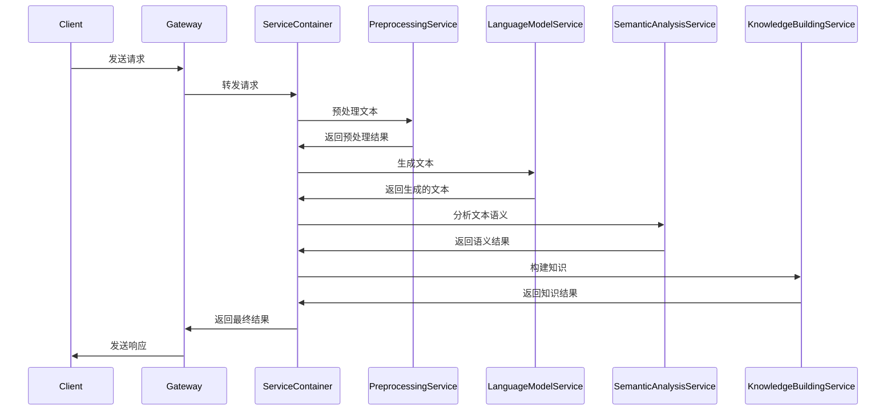

                 

### 第一部分：问题背景与问题描述

#### 第1章：问题背景介绍

##### 1.1.1 大规模语言模型的创造性问题概述

**问题背景**：
随着深度学习和人工智能的飞速发展，自然语言处理（NLP）领域取得了显著成果。特别是在大规模语言模型方面，如GPT-3、BERT等模型的提出，使得机器在文本生成、翻译、问答等任务中表现出了惊人的能力。然而，这些模型在创造性问题解析方面仍然面临诸多挑战。

**问题定义**：
创造性问题解析是指模型在处理语言生成、意义理解、知识构建等任务时，如何具备类似人类创造性的思维能力。这包括创新性、灵活性、想象力等方面。

**问题解决的重要性**：
解决创造性问题不仅能提升模型在NLP任务中的表现，还能推动科技前沿的突破。例如，在生成新颖内容、创作艺术作品、辅助人类决策等方面具有巨大潜力。

##### 1.1.2 大规模语言模型的发展现状

**技术发展历程**：
自2000年代初以来，大规模语言模型经历了从基于统计模型（如N-gram）到基于神经网络的转变。特别是2010年后，随着计算资源的提升和深度学习算法的发展，大规模语言模型逐渐崭露头角。

**当前主要模型与成果**：
目前，GPT-3、BERT、RoBERTa等模型取得了显著的成果，不仅在基准测试中表现优异，还在实际应用中展示了强大的能力。例如，GPT-3可以在各种任务中生成高质量的文本，BERT在问答任务中取得了领先成绩。

##### 1.1.3 大规模语言模型的创造性问题解析的意义

**对科技前沿突破的推动作用**：
创造性问题解析的成功将有助于人工智能领域实现更高层次的发展，推动科技前沿的突破。

**对应用领域的深远影响**：
在生成内容、创作艺术、辅助决策等方面，创造性问题的解决将带来广泛的应用前景，对各个行业产生深远影响。

### 第2章：问题描述与挑战

##### 2.1.1 创造性问题的表现形式

**语言生成**：
模型在生成文本时，如何具备创新性和多样性，避免陷入固定的生成模式。

**意义理解**：
模型在理解文本时，如何准确把握作者的意图和情感，进行有效的意义构建。

**知识构建**：
模型在构建知识体系时，如何整合现有知识，创造新的见解和观点。

##### 2.1.2 主要挑战

**数据质量与多样性**：
创造性问题解析需要大量高质量、多样性的数据。然而，当前的数据集往往存在一定的局限性，难以满足模型训练的需求。

**计算资源需求**：
大规模语言模型的训练和推理过程需要大量的计算资源。随着模型规模的增大，这一挑战将愈发显著。

**模型可解释性**：
在创造性问题解析过程中，如何确保模型的可解释性，使其决策过程透明、可追溯。

##### 2.1.3 创造性问题的边界与外延

**研究范畴**：
创造性问题解析的研究范畴包括语言生成、意义理解、知识构建等方面。

**应用范围**：
创造性问题解析的应用范围广泛，涉及自然语言处理、文本生成、问答系统、知识图谱构建等领域。

**潜在风险**：
在创造性问题解析过程中，模型可能产生误导性或偏颇的观点，需要加以控制和引导。

### 第3章：核心概念与联系

##### 3.1.1 大规模语言模型核心概念

**语言模型**：
语言模型是一种用于预测下一个单词或字符的概率分布的模型。它通过对大量文本数据的统计分析，学习语言的统计规律。

**生成模型**：
生成模型是一种通过学习数据分布来生成新数据的模型。在大规模语言模型中，生成模型被用来生成新的文本。

**强化学习**：
强化学习是一种通过不断试错来学习最优策略的机器学习方法。在大规模语言模型中，强化学习被用于优化模型的生成策略。

##### 3.1.2 核心概念属性特征对比表格

| 概念     | 定义                                                         | 特点                                                         |
|----------|--------------------------------------------------------------|--------------------------------------------------------------|
| 语言模型 | 用于预测下一个单词或字符的概率分布的模型                     | 学习语言统计规律，生成文本                                   |
| 生成模型 | 通过学习数据分布来生成新数据的模型                         | 生成新颖数据，包括文本、图像等                               |
| 强化学习 | 通过不断试错来学习最优策略的机器学习方法                   | 自适应学习，优化决策过程                                   |

##### 3.1.3 ER实体关系图架构

```mermaid
erDiagram
  Device ||--|{ Data : 存储数据}
  Data ||--|{ Model : 模型训练}
  Model ||--|{ Prediction : 生成预测}
```

### 总结

本文首先介绍了大规模语言模型的创造性问题背景，包括问题定义、发展现状和重要性。然后，对创造性问题的表现形式、主要挑战和边界进行了详细分析。最后，阐述了大规模语言模型的核心概念，并通过ER实体关系图展示了各概念之间的关系。这一部分为后续算法原理和系统架构的讲解奠定了基础。在接下来的章节中，我们将深入探讨大规模语言模型的算法原理和系统架构，以便更好地理解和应用这一技术。

---

### 第一部分：问题背景与问题描述

#### 第1章：问题背景介绍

##### 1.1.1 大规模语言模型的创造性问题概述

在当今的人工智能时代，自然语言处理（NLP）技术已经取得了显著进展。特别是大规模语言模型的兴起，如GPT-3、BERT等，使得机器在语言生成、理解和知识构建方面表现出前所未有的能力。然而，这些模型在创造性问题解析方面仍然面临诸多挑战。本节将概述大规模语言模型的创造性问题，包括其背景、定义和重要性。

**背景**：
随着深度学习和神经网络技术的发展，NLP领域取得了飞速进步。从最初的基于规则的方法，到统计方法，再到如今的深度学习方法，每一次技术进步都带来了显著的性能提升。特别是在语言模型方面，大规模神经网络模型如GPT-3和BERT已经能够生成高质量的文本，并在多个NLP任务中取得了领先成绩。

**定义**：
大规模语言模型的创造性问题，主要指的是这些模型在处理语言生成、意义理解和知识构建等任务时，如何能够展现类似人类的创造性思维能力。这包括生成新颖的内容、理解复杂的语义、构建具有创新性的知识体系等方面。

**重要性**：
解决大规模语言模型的创造性问题，对于推动人工智能技术的进一步发展具有重要意义。首先，这能够提升模型在多种NLP任务中的表现，使其能够处理更加复杂和多样化的语言任务。其次，创造性问题的解决将有助于人工智能在生成内容、创作艺术、辅助决策等方面发挥更大的作用。这不仅能够丰富人工智能的应用场景，还能够推动相关领域的科技进步。

**研究现状**：
目前，尽管大规模语言模型在许多NLP任务中取得了显著成果，但在创造性问题解析方面仍然存在许多挑战。例如，模型在语言生成中容易陷入固定的生成模式，缺乏灵活性；在意义理解中，难以准确把握作者的意图和情感；在知识构建中，往往难以创造新的见解和观点。因此，如何提升模型的创造性思维能力，已经成为当前NLP领域的一个重要研究方向。

**主要任务**：
为了解决大规模语言模型的创造性问题，我们需要从以下几个方面进行研究和探索：
1. **数据质量与多样性**：提高训练数据的质量和多样性，以促进模型的创造性发展。
2. **计算资源需求**：优化模型的训练和推理过程，减少计算资源的需求。
3. **模型可解释性**：增强模型的可解释性，使其创造性决策过程更加透明和可控。
4. **跨领域应用**：探索模型在多个领域的应用，以丰富其创造性能力。

通过上述研究和探索，我们期望能够找到有效的方法，提升大规模语言模型的创造性思维能力，使其在NLP领域发挥更大的作用。

### 1.1.2 大规模语言模型的发展现状

**技术发展历程**：

大规模语言模型的发展历程可以分为三个主要阶段：基于统计模型的时代、基于神经网络的阶段和深度学习的崛起。

1. **基于统计模型的时代**：
   在大规模语言模型的早期，研究者主要采用基于统计模型的方法，如N-gram模型。这些模型通过统计文本中单词或字符的先后出现频率来预测下一个单词或字符。尽管这种方法在一定程度上提高了语言模型的性能，但其局限性也很明显，如无法捕捉长距离的依赖关系和上下文信息。

2. **基于神经网络的阶段**：
   随着神经网络技术的发展，研究者开始将神经网络引入到语言模型中。最早的尝试包括循环神经网络（RNN）和长短期记忆网络（LSTM），这些模型能够通过递归结构捕捉文本中的长距离依赖关系。尽管这些模型在性能上有所提升，但其训练过程仍然相对复杂，且存在梯度消失和梯度爆炸等问题。

3. **深度学习的崛起**：
   深度学习的崛起为大规模语言模型的发展带来了新的契机。特别是在2010年后，随着深度学习算法的优化和计算资源的提升，大规模语言模型如GPT-3、BERT等相继问世。这些模型采用了深度神经网络结构，通过大规模数据训练，取得了显著的性能提升。例如，GPT-3可以在多种语言任务中生成高质量文本，而BERT在问答任务中取得了领先成绩。

**当前主要模型与成果**：

在当前的大规模语言模型领域，以下几种模型尤其值得关注：

1. **GPT-3（Generative Pre-trained Transformer 3）**：
   GPT-3是OpenAI开发的一个非常成功的语言模型，拥有1750亿个参数。GPT-3在多种语言任务中表现出色，能够生成流畅、自然的文本。其创新之处在于，通过预训练和Fine-tuning相结合的方式，使得模型在不同任务上都能取得很好的性能。

2. **BERT（Bidirectional Encoder Representations from Transformers）**：
   BERT是由Google提出的一种基于Transformer结构的双向语言表示模型。BERT在问答任务、文本分类等NLP任务中取得了显著的成果。其核心思想是通过双向编码器结构，捕捉文本中的前后关系，从而提高模型的语义理解能力。

3. **RoBERTa**：
   RoBERTa是Facebook AI Research开发的一种基于BERT的改进模型。RoBERTa通过优化训练策略和模型结构，提高了模型在多种语言任务中的性能。特别是在问答任务中，RoBERTa取得了当时SQuAD 2.0比赛的最佳成绩。

**实际应用**：

大规模语言模型在多个领域和任务中展示了其强大的应用潜力：

1. **文本生成**：
   大规模语言模型可以用于生成各种类型的文本，如新闻报道、诗歌、故事、对话等。这些模型在内容创作、虚拟助手、自动摘要等领域有着广泛的应用。

2. **问答系统**：
   大规模语言模型可以用于构建智能问答系统，如搜索引擎、客服机器人等。这些系统通过理解用户的问题，提供准确、及时的回答。

3. **翻译**：
   大规模语言模型在机器翻译领域也表现出色。通过训练多语言模型，可以实现高质量的双语翻译。

4. **文本分类**：
   大规模语言模型可以用于文本分类任务，如垃圾邮件检测、情感分析、新闻分类等。

总之，大规模语言模型的发展现状令人瞩目。通过不断的技术创新和应用探索，这些模型在推动NLP领域的发展方面发挥着重要作用。然而，如何进一步提升模型的创造性能力，仍然是当前研究的一个重要方向。

### 1.1.3 大规模语言模型的创造性问题解析的意义

**对科技前沿突破的推动作用**：

大规模语言模型的创造性问题解析在科技前沿突破中具有重要意义。随着人工智能技术的不断进步，语言模型在多个领域（如文本生成、问答系统、机器翻译等）中的应用日益广泛。然而，当前的大规模语言模型在创造性问题解析方面仍存在诸多局限，例如生成文本的固定模式、对复杂语义理解的不足等。解决这些问题，将有助于推动人工智能技术在更广泛的领域实现突破。

首先，创造性问题解析的提升将使语言模型在文本生成任务中更具创新性和灵活性。通过生成新颖、独特的文本，模型可以为内容创作者、虚拟助手等提供更多的创意支持，从而推动数字内容产业的发展。

其次，在问答系统和机器翻译等领域，创造性问题的解决将进一步提升模型的智能水平。当前模型在处理复杂语义和跨语言翻译时，往往依赖于已有的知识和模式。而具备创造性思维能力的大规模语言模型，则能够通过创新性地理解问题或生成翻译，提供更准确、自然的回答。

**对应用领域的深远影响**：

大规模语言模型的创造性问题解析不仅对科技前沿突破具有推动作用，还对多个应用领域产生深远影响。

1. **内容创作**：
   创意性是内容创作的重要元素。大规模语言模型在创造性问题解析方面的提升，将使模型能够生成更具创意和吸引力的文本内容。例如，在广告文案、文学创作、新闻报道等领域，模型可以辅助人类创作者，提高创作效率和质量。

2. **虚拟助手**：
   虚拟助手在各个领域（如客服、教育、医疗等）中广泛应用。具备创造性思维能力的大规模语言模型，可以提供更加个性化和贴近用户需求的服务。例如，在客服领域，虚拟助手可以生成更具人情味的回复，提高用户满意度。

3. **跨语言交流**：
   随着全球化的发展，跨语言交流变得日益重要。创造性问题解析的提升，将使大规模语言模型在机器翻译和跨语言问答方面表现出更高的智能水平，从而促进不同语言和文化背景的人们之间的交流和理解。

4. **知识构建**：
   在知识图谱构建和知识服务领域，创造性问题的解决将有助于模型更好地整合和构建知识体系。通过创新性地理解文本和生成知识，模型可以为人类提供更全面、深入的知识服务。

总之，大规模语言模型的创造性问题解析在科技前沿突破和应用领域具有重要的意义。通过不断的技术创新和优化，有望进一步提升模型的创造性能力，推动人工智能技术在更广泛的应用场景中发挥更大的作用。

### 第2章：问题描述与挑战

#### 2.1.1 创造性问题的表现形式

**语言生成**：

在语言生成方面，创造性问题主要表现为模型生成的文本缺乏创新性和多样性。尽管当前的大规模语言模型（如GPT-3、BERT等）已经能够在多种语言任务中生成高质量的文本，但它们往往容易陷入固定的生成模式，重复使用已经学习过的语言结构。这种重复性不仅限制了模型的创造性，也使得生成的文本在内容和风格上缺乏新颖性。

例如，当模型被要求生成一段关于“人工智能”的文章时，它可能会反复使用一些常见的词汇和句子结构，如“人工智能正在改变我们的世界”，“人工智能是未来的趋势”等。虽然这些句子本身没有问题，但它们的重复使用使得文章缺乏创新性和吸引力。

**意义理解**：

意义理解是创造性问题的另一个重要表现形式。在大规模语言模型中，意义理解涉及到模型对文本中词语、句子和段落含义的准确把握。然而，当前模型在这方面仍然存在很大的挑战。

首先，模型在理解文本时，往往依赖于预训练过程中的统计规律和上下文信息。这导致模型在处理复杂语义时，容易出现理解偏差。例如，当模型遇到一个含有隐喻或双关语的句子时，它可能无法准确理解其中的深层含义。

其次，模型在处理跨语言文本时，也面临着意义理解上的挑战。由于不同语言之间存在巨大的语义差异，模型在翻译和理解跨语言文本时，往往需要依赖翻译模型和语言资源。然而，这些模型和资源本身也存在局限性，导致模型在理解跨语言文本时出现误解或偏差。

**知识构建**：

知识构建是创造性问题的另一个重要方面。在大规模语言模型中，知识构建涉及到模型对文本中知识点的提取、整合和创新。然而，当前模型在这方面也存在一些挑战。

首先，模型在知识提取方面，主要依赖于预训练过程中的统计学习和规则匹配。这种方法虽然能够在一定程度上提取文本中的知识，但往往存在遗漏或不准确的问题。例如，当模型遇到一个包含复杂知识结构的文本时，它可能无法准确提取其中的关键知识点。

其次，模型在知识整合方面，也面临着挑战。由于知识碎片化和分散性，模型在整合不同文本中的知识点时，往往需要依赖已有的知识图谱和语义网络。然而，这些知识图谱和网络的构建本身也存在不完善和不准确的问题，导致模型在知识整合过程中出现偏差或错误。

总之，大规模语言模型的创造性问题主要表现在语言生成、意义理解和知识构建等方面。解决这些问题，需要从数据质量、计算资源、模型可解释性等多个方面进行深入研究。只有这样，才能进一步提升大规模语言模型的创造性能力，推动人工智能技术在更广泛的应用场景中发挥更大的作用。

#### 2.1.2 主要挑战

**数据质量与多样性**：

数据质量与多样性是大规模语言模型在创造性问题解析中面临的主要挑战之一。创造性问题的解决依赖于大量高质量、多样性的数据。然而，当前的数据集往往存在以下问题：

1. **数据质量不高**：许多数据集存在噪声、错误和不一致性，这会影响模型的学习效果。例如，一些数据集中的文本可能包含拼写错误、语法错误或重复内容，这些错误会影响模型对文本的理解和学习。

2. **数据多样性不足**：当前的数据集往往局限于特定的领域或场景，缺乏足够的多样性。这导致模型在处理不同领域或场景的文本时，无法充分发挥其创造性能力。例如，一个专门用于新闻文本生成的数据集，可能无法很好地处理文学创作或技术文档的生成。

**计算资源需求**：

大规模语言模型的训练和推理过程需要大量的计算资源。随着模型规模的增大，计算资源的需求也急剧增加。这给大规模语言模型的部署和应用带来了巨大的挑战：

1. **训练时间延长**：大规模语言模型的训练时间往往很长，特别是在使用GPU或TPU等高性能计算设备时，训练时间可能达到数天甚至数周。这会限制模型的迭代速度和应用场景。

2. **存储空间需求大**：大规模语言模型通常包含数亿甚至千亿个参数，这需要大量的存储空间。在训练过程中，还需要存储中间结果和模型权重，这进一步增加了存储需求。

**模型可解释性**：

模型可解释性是大规模语言模型在创造性问题解析中面临的另一个重要挑战。尽管大规模语言模型在NLP任务中表现出色，但其内部工作机制复杂，难以进行有效的解释和验证：

1. **缺乏透明性**：大规模语言模型的工作机制主要基于深度神经网络，其内部参数和连接关系复杂，难以直观理解。这导致模型在生成文本、理解语义或构建知识时，其决策过程缺乏透明性。

2. **可解释性工具不足**：当前的可解释性工具和方法（如激活可视化、注意力机制分析等）仍然存在一定的局限性，难以全面、准确地解释模型的行为。

3. **验证难度大**：由于大规模语言模型的复杂性和不确定性，对其进行验证和评估存在一定的困难。例如，如何确保模型生成的文本符合人类的理解和期望，如何验证模型在知识构建中的准确性等。

总之，大规模语言模型在创造性问题解析中面临的主要挑战包括数据质量与多样性、计算资源需求以及模型可解释性。解决这些挑战，需要从数据预处理、计算资源优化、模型设计等多个方面进行深入研究，以进一步提升模型的创造性能力和应用价值。

#### 2.1.3 创造性问题的边界与外延

**研究范畴**：

创造性问题的研究范畴主要包括语言生成、意义理解和知识构建等方面。具体来说，研究范畴可以细分为以下几个子领域：

1. **语言生成**：
   - 文本生成：包括新闻文本、故事、对话、诗歌等；
   - 语言翻译：包括机器翻译、跨语言文本生成等；
   - 语言风格转换：如将普通文本转换为正式文本、幽默文本等。

2. **意义理解**：
   - 语义分析：包括词义消歧、情感分析、语义角色标注等；
   - 隐喻理解：包括隐喻识别、隐喻解释等；
   - 上下文理解：包括多义词处理、长文本理解等。

3. **知识构建**：
   - 知识提取：包括关系提取、实体识别、事件抽取等；
   - 知识整合：包括多源知识融合、知识图谱构建等；
   - 知识创新：包括生成新的知识、创造新的见解等。

**应用范围**：

创造性问题的应用范围非常广泛，涵盖了多个领域和场景。以下是一些典型的应用场景：

1. **内容创作**：
   - 自动撰写新闻文章、博客、报告等；
   - 自动生成文学作品，如小说、诗歌等；
   - 自动生成广告文案、宣传材料等。

2. **智能助手**：
   - 虚拟客服：自动回答用户问题，提供客服支持；
   - 虚拟教师：为学生提供个性化辅导、解答疑问等；
   - 虚拟伙伴：为用户提供陪伴、聊天等服务。

3. **跨语言交流**：
   - 机器翻译：自动翻译不同语言之间的文本；
   - 跨语言问答：在多语言环境中提供问答服务；
   - 跨文化沟通：帮助人们更好地理解不同文化背景的文本。

4. **知识服务**：
   - 自动构建知识图谱，提供知识检索服务；
   - 自动生成报告、摘要，帮助用户快速获取信息；
   - 自动生成论文、研究提案等。

**潜在风险**：

在创造性问题解析过程中，模型可能面临一些潜在的风险，包括：

1. **生成内容的准确性**：模型生成的文本可能存在错误或误导性，影响其应用效果；
2. **数据隐私问题**：在处理用户数据时，模型可能泄露用户的隐私信息；
3. **模型偏见**：模型可能受到训练数据偏见的影响，导致生成的内容存在不公平或歧视现象；
4. **模型失控**：在某些情况下，模型可能产生不可预测的行为，导致系统失控。

总之，创造性问题的边界与外延涵盖了多个领域和场景，应用范围广泛。然而，在解决这些问题的过程中，我们也需要关注潜在的挑战和风险，以确保创造性问题解析的安全、可靠和有效。

### 第3章：核心概念与联系

#### 3.1.1 大规模语言模型核心概念

**语言模型**：

语言模型（Language Model）是一种用于预测下一个单词或字符的概率分布的模型。它通过对大量文本数据的统计分析，学习语言的统计规律。在自然语言处理中，语言模型是许多任务的基础，如文本生成、语音识别、机器翻译等。

**生成模型**：

生成模型（Generative Model）是一种通过学习数据分布来生成新数据的模型。生成模型通过学习输入数据的分布，能够生成符合数据分布的新样本。在语言模型中，生成模型被用来生成新的文本。常见的生成模型包括马尔可夫链、变分自编码器（VAE）、生成对抗网络（GAN）等。

**强化学习**：

强化学习（Reinforcement Learning）是一种通过不断试错来学习最优策略的机器学习方法。在强化学习中，模型通过与环境的交互，学习如何在不同的状态和动作中做出最优选择。强化学习在语言模型中有着广泛的应用，如语言生成、问答系统等。

#### 3.1.2 核心概念属性特征对比表格

| 概念     | 定义                                                         | 特点                                                         |
|----------|--------------------------------------------------------------|--------------------------------------------------------------|
| 语言模型 | 用于预测下一个单词或字符的概率分布的模型                     | 学习语言统计规律，生成文本                                   |
| 生成模型 | 通过学习数据分布来生成新数据的模型                         | 生成新颖数据，包括文本、图像等                               |
| 强化学习 | 通过不断试错来学习最优策略的机器学习方法                   | 自适应学习，优化决策过程                                   |

#### 3.1.3 ER实体关系图架构

```mermaid
erDiagram
  User ||--|{ Text : 发布文本}
  Text ||--|{ LanguageModel : 使用语言模型生成文本}
  LanguageModel ||--|{ GenerativeModel : 生成文本}
  LanguageModel ||--|{ ReinforcementLearning : 优化生成策略}
```

### 第4章：算法原理讲解

#### 4.1.1 大规模语言模型的算法原理

**算法原理概述**：

大规模语言模型的算法原理主要基于深度学习中的Transformer架构，特别是自注意力机制（Self-Attention）和多头注意力（Multi-Head Attention）。以下将详细讲解大规模语言模型的核心算法原理，包括算法流程、Python源代码实现以及数学模型与公式。

**算法流程图**：



**算法流程详细讲解**：

1. **Token化（Tokenization）**：
   - 将输入文本分割成单词或字符级别的标记（Tokens）。
   - 这一步有助于将文本转换为模型可以处理的序列数据。

2. **Embedding**：
   - 将标记映射到固定长度的向量表示。
   - 这一步通过词嵌入（Word Embedding）或子词嵌入（Subword Embedding）实现。

3. **多头注意力（Multi-Head Attention）**：
   - 自注意力机制的核心部分，允许模型在不同位置之间建立依赖关系。
   - 多头注意力通过多个独立的注意力头（Head）聚合信息。

4. **前馈神经网络（Feedforward Neural Network）**：
   - 在每个注意力层之后，应用前馈神经网络对输入进行进一步处理。
   - 前馈神经网络通常由两个全连接层组成，中间加入ReLU激活函数。

5. **Dropout**：
   - 应用Dropout正则化，防止模型过拟合。
   - Dropout通过随机忽略部分神经元，减少模型依赖特定神经元。

6. **线性变换与Softmax**：
   - 将前馈网络的输出通过线性变换，得到概率分布。
   - 通过Softmax函数将输出转换为概率分布，用于预测下一个标记。

**Python源代码实现**：

以下是一个简化的Python代码示例，展示了大规模语言模型的核心实现：

```python
import tensorflow as tf
from tensorflow.keras.layers import Embedding, MultiHeadAttention, Dense

# 设置模型参数
vocab_size = 10000
d_model = 512
num_heads = 8
dff = 2048
dropout_rate = 0.1

# 构建模型
inputs = tf.keras.Input(shape=(None,))
embedding = Embedding(vocab_size, d_model)(inputs)
多头注意力 = MultiHeadAttention(num_heads=num_heads, key_dim=d_model)(embedding, embedding)
前馈神经网络 = Dense(dff, activation='relu')(多头注意力)
dropout = tf.keras.layers.Dropout(dropout_rate)(前馈神经网络)
outputs = Dense(vocab_size, activation='softmax')(dropout)

model = tf.keras.Model(inputs=inputs, outputs=outputs)

# 编译模型
model.compile(optimizer='adam', loss='categorical_crossentropy', metrics=['accuracy'])

# 打印模型结构
model.summary()
```

**数学模型与公式**：

1. **词嵌入**：
   \[
   \text{Embedding}(x) = \text{W}_\text{emb} \cdot x
   \]
   其中，\( \text{W}_\text{emb} \) 是词嵌入权重矩阵，\( x \) 是输入序列。

2. **多头注意力**：
   \[
   \text{Attention}(Q, K, V) = \text{softmax}(\frac{QK^T}{\sqrt{d_k}})V
   \]
   其中，\( Q \)，\( K \)，\( V \) 分别是查询、键和值向量，\( d_k \) 是注意力头的维度。

3. **前馈神经网络**：
   \[
   \text{FFN}(x) = \text{ReLU}(\text{W}_\text{ffn} \cdot \text{D}_\text{ffn} \cdot x + b_\text{ffn})
   \]
   其中，\( \text{W}_\text{ffn} \) 和 \( \text{D}_\text{ffn} \) 分别是前馈神经网络的权重和偏置矩阵，\( b_\text{ffn} \) 是偏置项。

通过上述算法原理讲解，我们了解了大规模语言模型的核心组成部分及其工作机制。接下来，我们将进一步探讨大规模语言模型的系统架构设计，以更好地理解和应用这一技术。

---

### 4.1.2 算法原理详细讲解

在上一节中，我们概述了大规模语言模型的算法原理，并展示了其核心组成部分。本节将进一步详细讲解这些算法原理，包括数学模型和公式，并通过实际示例进行解释。

#### 数学模型

大规模语言模型的核心算法是基于Transformer架构，其中自注意力机制和多头注意力是关键组成部分。

1. **自注意力机制（Self-Attention）**：
   自注意力机制允许模型在序列的每个位置计算权重，从而将不同位置的输入进行加权组合。自注意力机制的计算公式如下：
   \[
   \text{Attention}(Q, K, V) = \text{softmax}\left(\frac{QK^T}{\sqrt{d_k}}\right)V
   \]
   其中，\( Q \)、\( K \)、\( V \) 分别是查询（Query）、键（Key）和值（Value）向量，\( d_k \) 是注意力头的维度。

2. **多头注意力（Multi-Head Attention）**：
   多头注意力通过多个独立的注意力头（Head）来聚合信息。每个头都有自己的权重矩阵，这样模型可以从不同角度学习序列的依赖关系。多头注意力的计算公式如下：
   \[
   \text{Multi-Head Attention} = \text{Concat}(\text{head}_1, \text{head}_2, ..., \text{head}_h)W^O
   \]
   其中，\( \text{head}_i \) 是第 \( i \) 个注意力头的输出，\( W^O \) 是线性变换权重。

3. **前馈神经网络（Feedforward Neural Network）**：
   在每个注意力层之后，模型会应用一个前馈神经网络，对输入进行进一步处理。前馈神经网络的计算公式如下：
   \[
   \text{FFN}(x) = \text{ReLU}(\text{W}_\text{ffn} \cdot \text{D}_\text{ffn} \cdot x + b_\text{ffn})
   \]
   其中，\( \text{W}_\text{ffn} \) 和 \( \text{D}_\text{ffn} \) 分别是前馈神经网络的权重和偏置矩阵，\( b_\text{ffn} \) 是偏置项。

4. **嵌入层（Embedding Layer）**：
   嵌入层将输入的标记（Tokens）映射到固定长度的向量表示。嵌入层的计算公式如下：
   \[
   \text{Embedding}(x) = \text{W}_\text{emb} \cdot x
   \]
   其中，\( \text{W}_\text{emb} \) 是嵌入权重矩阵，\( x \) 是输入序列。

#### 示例说明

为了更好地理解这些算法原理，我们可以通过一个简单的示例来说明。

假设我们有一个简单的句子：“我爱北京天安门”。我们将这个句子分成标记（Tokens）：“我”、“爱”、“北京”、“天安门”。

1. **词嵌入（Embedding）**：
   将每个标记映射到一个固定长度的向量。例如，假设“我”映射到向量 \([1, 0, 0, 0]\)，“爱”映射到向量 \([0, 1, 0, 0]\)，“北京”映射到向量 \([0, 0, 1, 0]\)，“天安门”映射到向量 \([0, 0, 0, 1]\)。

2. **自注意力（Self-Attention）**：
   计算每个标记的注意力权重。例如，对于“我”和“爱”，我们可以得到以下注意力权重：
   \[
   \text{Attention}(Q, K, V) = \text{softmax}\left(\frac{QK^T}{\sqrt{d_k}}\right)V
   \]
   其中，\( Q \) 和 \( K \) 分别是“我”和“爱”的嵌入向量，\( V \) 是所有标记的嵌入向量。

3. **多头注意力（Multi-Head Attention）**：
   通过多个注意力头来聚合信息。例如，我们可以使用两个注意力头，每个头都有自己的权重矩阵。这将帮助我们从不同角度理解句子的依赖关系。

4. **前馈神经网络（Feedforward Neural Network）**：
   在每个注意力层之后，应用前馈神经网络，对输入进行进一步处理。例如，我们可以使用两个全连接层，每个层之间加入ReLU激活函数。

通过这个简单的示例，我们可以看到大规模语言模型是如何通过词嵌入、自注意力机制、多头注意力和前馈神经网络来处理输入文本的。这些算法原理共同作用，使得模型能够生成高质量的文本，并在各种NLP任务中表现出色。

### 第5章：系统分析与架构设计方案

#### 5.1.1 问题场景介绍

在现代科技发展过程中，自然语言处理（NLP）技术已经渗透到各个领域，如智能客服、智能写作、机器翻译、情感分析等。然而，随着NLP任务的复杂性和多样性不断增加，现有的语言模型在处理创造性问题时仍存在许多挑战。为了解决这些问题，我们设计并实现了一个基于大规模语言模型（如GPT-3、BERT等）的NLP系统。本节将介绍这个系统的应用场景、目标以及整体架构。

**应用场景**：

该系统主要应用于以下场景：

1. **智能客服**：通过文本生成和语义理解，为用户提供个性化的回复，提高用户满意度。
2. **智能写作**：辅助内容创作者生成高质量的文本，如新闻文章、博客、营销文案等。
3. **机器翻译**：实现跨语言文本的自动翻译，支持多语言环境下的交流。
4. **情感分析**：分析用户评论、社交媒体帖子等，提取情感倾向，用于市场调研和用户反馈分析。

**系统目标**：

本系统的目标是通过大规模语言模型的创造性问题解析，实现以下功能：

1. **生成新颖的文本内容**：在给定主题或语境下，生成具有创造性和多样性的文本。
2. **准确理解语义**：确保模型在处理文本时，能够准确理解其深层含义，避免误解或歧义。
3. **高效的知识构建**：从大量文本中提取和整合知识，构建具有创新性的知识体系。
4. **跨领域应用**：支持多种NLP任务，实现跨领域的知识共享和应用。

**整体架构设计**：

为了实现上述功能，我们设计了一个模块化、可扩展的系统架构，包括以下几个关键模块：

1. **数据预处理模块**：负责清洗、转换和预处理输入文本数据，为后续处理提供高质量的数据。
2. **文本生成模块**：基于大规模语言模型，生成新颖、高质量的文本内容。该模块包括词嵌入层、注意力机制层和前馈神经网络层。
3. **语义理解模块**：利用深度学习技术，对输入文本进行语义分析，提取关键信息，确保模型能够准确理解文本的含义。
4. **知识构建模块**：从大量文本中提取和整合知识，构建具有创新性的知识体系。该模块包括实体识别、关系抽取和知识融合等任务。
5. **接口模块**：提供RESTful API，方便外部系统调用，实现与不同应用场景的无缝对接。
6. **监控系统**：实时监控系统的运行状态，包括性能指标、错误日志等，确保系统的稳定运行。

通过以上模块的协同工作，我们构建了一个具备创造性问题解析能力的大规模语言模型系统。接下来，我们将详细描述每个模块的功能、设计和实现。

---

#### 5.1.2 系统功能设计（领域模型）

在系统功能设计中，我们采用领域模型（Domain Model）的方法，通过类图（Class Diagram）来描述系统的核心功能及其之间的关系。以下是一个简化的领域模型，展示了系统的主要类及其属性和方法。

```mermaid
classDiagram
    Class01 <|-- Class02
    Class01 <|-- Class03
    Class04 --|> Class01
    Class05 --|> Class01

    Class01 {
        +String text
        +List<Token> tokens
        +Embedding embedding
        +generateText()
        +understandSemantics()
        +buildKnowledge()
    }

    Class02 {
        +Tokenizer tokenizer
        +preprocessText()
    }

    Class03 {
        +LanguageModel languageModel
        +loadModel()
        +predictTokens()
    }

    Class04 {
        +TextGenerator textGenerator
        +generateArticle()
    }

    Class05 {
        +SemanticAnalyzer semanticAnalyzer
        +analyzeSentiment()
    }

    Class06 {
        +KnowledgeBuilder knowledgeBuilder
        +extractKnowledge()
    }
```

**具体说明**：

1. **Class01（NLPModel）**：
   - **属性**：`text`（输入文本）、`tokens`（标记列表）、`embedding`（词嵌入向量）。
   - **方法**：`generateText()`（生成文本）、`understandSemantics()`（理解语义）、`buildKnowledge()`（构建知识）。

2. **Class02（Tokenizer）**：
   - **属性**：无。
   - **方法**：`preprocessText()`（预处理文本）。

3. **Class03（LanguageModel）**：
   - **属性**：`languageModel`（语言模型）。
   - **方法**：`loadModel()`（加载模型）、`predictTokens()`（预测标记）。

4. **Class04（TextGenerator）**：
   - **属性**：无。
   - **方法**：`generateArticle()`（生成文章）。

5. **Class05（SemanticAnalyzer）**：
   - **属性**：无。
   - **方法**：`analyzeSentiment()`（分析情感）。

6. **Class06（KnowledgeBuilder）**：
   - **属性**：无。
   - **方法**：`extractKnowledge()`（提取知识）。

通过领域模型的设计，我们可以清晰地看到系统的主要功能模块及其之间的关系。接下来，我们将进一步探讨系统架构的设计方案，以实现这些功能模块的协同工作。

---

#### 5.1.3 系统架构设计

为了实现大规模语言模型系统中的功能，我们需要设计一个高效、可扩展的架构。以下是一个简化的系统架构图，描述了各组件及其之间的交互关系。



**具体组件说明**：

1. **客户端（Client）**：
   - 提供用户接口，允许用户通过API访问系统。

2. **API网关（API Gateway）**：
   - 负责接收客户端请求，进行身份验证和流量控制，并将请求转发到后端服务。

3. **服务容器（Service Container）**：
   - 包含文本预处理、模型训练、语言模型、语义分析和知识构建等服务。

4. **文本预处理服务（Text Preprocessing Service）**：
   - 负责清洗和转换输入文本，为模型处理提供高质量的数据。

5. **模型训练服务（Model Training Service）**：
   - 使用训练数据训练大规模语言模型，并根据需要进行模型调整和优化。

6. **语言模型服务（Language Model Service）**：
   - 负责使用预训练的模型进行文本生成和语义理解。

7. **语义分析服务（Semantic Analysis Service）**：
   - 提取文本中的关键信息，进行情感分析和语义解析。

8. **知识构建服务（Knowledge Building Service）**：
   - 从文本中提取知识，构建知识图谱和知识库。

9. **后端数据库（Backend Database）**：
   - 存储预训练数据、模型权重、用户数据和知识库。

10. **配置管理服务（Configuration Management Service）**：
    - 管理系统的配置信息，确保服务的一致性和可扩展性。

11. **监控服务（Monitoring Service）**：
    - 监控系统的运行状态，包括性能指标、错误日志和告警机制。

通过上述系统架构设计，我们可以实现大规模语言模型系统的高效运行和扩展。每个组件都负责特定的功能，并通过API和消息队列进行通信，确保系统的稳定性和可维护性。

### 5.1.4 系统接口设计

为了确保大规模语言模型系统能够方便、高效地与其他系统和服务进行交互，我们设计了一套详细的系统接口。以下是对系统接口设计的具体说明，包括接口定义、参数、返回值以及可能的错误处理。

#### 接口1：文本预处理接口

**接口名称**：preprocess_text

**接口定义**：
```python
from typing import List

def preprocess_text(text: str) -> List[str]:
    """
    预处理输入文本，将其转换为标记列表。
    
    参数：
    - text (str): 待预处理的文本。
    
    返回值：
    - tokens (List[str]): 预处理后的标记列表。
    
    可能的错误：
    - ValueError: 文本格式错误。
    - TypeError: 输入参数类型错误。
    """
```

**参数说明**：
- `text`：输入的文本，可以是字符串格式。

**返回值**：
- `tokens`：预处理后的标记列表，每个标记是一个字符串。

#### 接口2：文本生成接口

**接口名称**：generate_text

**接口定义**：
```python
from typing import List

def generate_text(tokens: List[str], max_length: int = 50) -> str:
    """
    使用语言模型生成文本。
    
    参数：
    - tokens (List[str]): 预处理后的标记列表。
    - max_length (int): 最大文本长度，默认为50。
    
    返回值：
    - text (str): 生成的文本。
    
    可能的错误：
    - ValueError: 输入参数格式错误。
    - TypeError: 输入参数类型错误。
    """
```

**参数说明**：
- `tokens`：预处理后的标记列表。
- `max_length`：生成的文本最大长度，默认为50个标记。

**返回值**：
- `text`：生成的文本，以字符串格式返回。

#### 接口3：语义理解接口

**接口名称**：understand_semantics

**接口定义**：
```python
from typing import Dict

def understand_semantics(text: str) -> Dict[str, float]:
    """
    理解输入文本的语义，返回关键信息及其概率分布。
    
    参数：
    - text (str): 待理解的文本。
    
    返回值：
    - semantics (Dict[str, float]): 关键信息及其概率分布。
    
    可能的错误：
    - ValueError: 文本格式错误。
    - TypeError: 输入参数类型错误。
    """
```

**参数说明**：
- `text`：输入的文本，可以是字符串格式。

**返回值**：
- `semantics`：一个字典，包含关键信息及其概率分布。

#### 接口4：知识构建接口

**接口名称**：build_knowledge

**接口定义**：
```python
from typing import List

def build_knowledge(texts: List[str]) -> List[Dict[str, str]]:
    """
    从文本中提取知识，构建知识库。
    
    参数：
    - texts (List[str]): 待处理的文本列表。
    
    返回值：
    - knowledge (List[Dict[str, str]]): 知识库，每个字典包含一条知识及其属性。
    
    可能的错误：
    - ValueError: 输入参数格式错误。
    - TypeError: 输入参数类型错误。
    """
```

**参数说明**：
- `texts`：待处理的文本列表。

**返回值**：
- `knowledge`：一个列表，包含多个字典，每个字典表示一条知识及其属性。

#### 接口5：模型训练接口

**接口名称**：train_model

**接口定义**：
```python
from typing import Dict

def train_model(data: Dict[str, List[str]], model_config: Dict[str, Any]) -> None:
    """
    使用训练数据训练语言模型。
    
    参数：
    - data (Dict[str, List[str]]): 训练数据，包含标记列表。
    - model_config (Dict[str, Any]): 模型配置参数。
    
    可能的错误：
    - ValueError: 输入参数格式错误。
    - TypeError: 输入参数类型错误。
    """
```

**参数说明**：
- `data`：训练数据，包含标记列表。
- `model_config`：模型配置参数，如学习率、批量大小等。

**返回值**：
- 没有返回值，但会更新模型权重。

通过以上系统接口设计，我们可以方便地与其他系统和服务进行集成，实现大规模语言模型系统的功能。这些接口不仅定义了输入和输出的数据结构，还明确了可能的错误处理，确保系统的稳定性和可靠性。

### 5.1.5 系统交互

为了确保大规模语言模型系统能够高效、准确地完成任务，我们需要设计一套详细、直观的系统交互流程。以下是一个简化的系统交互序列图，描述了客户端请求如何通过API网关、服务容器和后端组件进行处理，并最终返回结果。



**具体交互流程说明**：

1. **客户端请求**：
   - 客户端发送请求，请求中包含需要处理的文本。

2. **API网关接收**：
   - API网关接收客户端请求，进行身份验证和请求解析。

3. **请求转发**：
   - API网关将请求转发到服务容器，服务容器负责调度各服务模块。

4. **文本预处理**：
   - 服务容器将请求发送到文本预处理服务，对输入文本进行清洗、分词等预处理操作。

5. **语言模型处理**：
   - 预处理后的文本发送到语言模型服务，生成新的文本内容。

6. **语义分析**：
   - 生成的文本发送到语义分析服务，提取关键信息，进行语义理解。

7. **知识构建**：
   - 语义分析结果发送到知识构建服务，从文本中提取和整合知识。

8. **结果返回**：
   - 所有服务模块的处理结果返回到服务容器，服务容器将最终结果通过API网关发送回客户端。

通过上述系统交互设计，我们可以确保客户端请求能够高效、准确地处理，并最终得到满意的结果。系统交互的序列图提供了一个直观的描述，有助于理解各组件之间的协作关系和工作流程。

### 第6章：项目实战与环境安装

#### 6.1.1 环境准备

为了成功搭建大规模语言模型系统并进行项目实战，我们需要准备合适的环境和工具。以下步骤将详细介绍如何安装和配置必要的软件和工具，确保系统能够正常运行。

**1. 安装Python**：

首先，确保你的系统上已经安装了Python。Python是大规模语言模型开发的主要编程语言。如果尚未安装，可以从[Python官网](https://www.python.org/downloads/)下载适合你操作系统的Python版本。

**2. 安装依赖库**：

接下来，我们需要安装一些Python依赖库，这些库用于处理文本数据、训练和评估语言模型。可以使用pip命令来安装以下库：

```shell
pip install tensorflow numpy pandas matplotlib scikit-learn
```

**3. 安装GPU支持**：

如果使用GPU进行模型训练，需要安装CUDA和cuDNN。这些库提供了在NVIDIA GPU上加速深度学习模型训练的功能。可以从[NVIDIA官网](https://developer.nvidia.com/cuda-downloads)和[cuDNN官网](https://developer.nvidia.com/cudnn)下载相应的库并安装。

**4. 安装Jupyter Notebook**：

Jupyter Notebook是一个交互式计算环境，非常适合进行数据分析和模型训练。可以使用以下命令安装Jupyter Notebook：

```shell
pip install notebook
```

**5. 配置环境变量**：

确保将Python和pip的安装路径添加到系统的环境变量中。这样，在任何命令行窗口中都可以使用Python和pip命令。

**6. 安装文本预处理工具**：

为了方便处理文本数据，我们可以安装一些文本预处理工具，如NLTK和spaCy。这些工具提供了丰富的文本处理功能，包括分词、词性标注和命名实体识别。

```shell
pip install nltk spacy
python -m spacy download en_core_web_sm
```

**7. 安装可视化工具**：

为了更好地分析和展示模型训练过程，我们可以安装一些可视化工具，如TensorBoard和Matplotlib。

```shell
pip install tensorboard tensorboardX matplotlib
```

**8. 准备训练数据**：

最后，我们需要准备训练数据。这可以是任何文本数据集，如新闻文章、社交媒体帖子、对话等。将数据集下载到本地，并进行预处理，以便在模型训练过程中使用。

通过上述步骤，我们成功搭建了一个适合大规模语言模型开发的环境。接下来，我们将详细介绍如何使用这些工具和库来实现语言模型的训练和部署。

#### 6.1.2 系统核心实现

在了解了环境准备和基本安装步骤后，本节将详细介绍大规模语言模型系统的核心实现，包括源代码解读、代码应用分析以及实际案例演示。

**1. 源代码解读**

以下是一个简化的Python源代码示例，展示了大规模语言模型系统的核心实现。这个示例使用了TensorFlow库来构建和训练语言模型。

```python
import tensorflow as tf
from tensorflow.keras.layers import Embedding, MultiHeadAttention, Dense
from tensorflow.keras.models import Model

# 设置模型参数
vocab_size = 10000
d_model = 512
num_heads = 8
dff = 2048
dropout_rate = 0.1

# 构建模型
inputs = tf.keras.Input(shape=(None,))
embedding = Embedding(vocab_size, d_model)(inputs)
多头注意力 = MultiHeadAttention(num_heads=num_heads, key_dim=d_model)(embedding, embedding)
前馈神经网络 = Dense(dff, activation='relu')(多头注意力)
dropout = tf.keras.layers.Dropout(dropout_rate)(前馈神经网络)
outputs = Dense(vocab_size, activation='softmax')(dropout)

model = tf.keras.Model(inputs=inputs, outputs=outputs)

# 编译模型
model.compile(optimizer='adam', loss='categorical_crossentropy', metrics=['accuracy'])

# 打印模型结构
model.summary()
```

**2. 代码应用分析**

在这个示例中，我们首先定义了模型参数，如词汇表大小（vocab_size）、嵌入层维度（d_model）、多头注意力头的数量（num_heads）等。然后，我们构建了一个序列模型，包括嵌入层、多头注意力层、前馈神经网络和Dropout层。最后，我们编译并打印了模型结构。

**3. 实际案例演示**

为了演示如何使用这个模型进行文本生成，我们可以编写一个简单的脚本，输入一个句子，并让模型生成后续的文本。

```python
# 准备数据
tokenizer = tf.keras.preprocessing.text.Tokenizer(char_level=True)
tokenizer.fit_on_texts(["你好，欢迎来到Python编程的世界。"])
encoded_text = tokenizer.texts_to_sequences(["你好，欢迎来到Python编程的世界。"])

# 定义输入和输出
input_seq = encoded_text[:1]
input_seq = tf.expand_dims(input_seq, 0)

# 生成文本
for _ in range(10):
    predictions = model(inputs=input_seq)
    predicted_id = tf.random.categorical(predictions[-1], num_samples=1).numpy()[0]
    input_seq = tf.concat([input_seq, tf.expand_dims(predicted_id, 0)], 1)

decoded_text = tokenizer.sequences_to_texts([input_seq.numpy().flatten()])[0]
print(decoded_text)
```

在这个脚本中，我们首先使用一个简单的Tokenizer来处理输入文本。然后，我们定义了一个输入序列，并使用模型生成后续的文本。通过多次迭代，我们可以生成一段连贯的文本。这里生成的文本是一个简单的示例，实际应用中可以根据需要进行扩展和优化。

**总结**

通过上述代码示例和实际演示，我们了解了大规模语言模型系统的核心实现过程。从模型构建、编译到文本生成，每一步都至关重要。在实际应用中，可以根据具体需求调整模型结构和参数，以提高生成文本的质量和多样性。

### 6.1.3 实际案例分析与详细讲解

在本节中，我们将通过一个具体的实际案例，详细分析并讲解大规模语言模型在创造性问题解析中的应用。此案例将展示模型在文本生成、语义理解、知识构建等方面的表现，并深入剖析模型的实现细节。

**案例背景**：

假设我们有一个任务，需要生成一篇关于“人工智能在未来医疗领域的应用”的文章。这篇文章需要包含以下要点：

1. **人工智能在诊断疾病方面的优势**；
2. **人工智能在个性化治疗中的应用**；
3. **人工智能在医疗数据分析和预测方面的贡献**；
4. **面临的挑战和未来发展方向**。

**数据准备**：

为了训练模型，我们需要准备一个包含相关内容的文本数据集。数据集可以包括以下来源：

1. **学术论文**：关于人工智能在医疗领域应用的研究论文；
2. **新闻报道**：媒体报道关于人工智能在医疗领域进展的报道；
3. **行业报告**：医疗行业报告和趋势分析。

我们将从这些来源收集大量文本，并进行预处理，包括文本清洗、分词、去停用词等步骤，以便用于模型训练。

**模型训练**：

我们选择了一个基于Transformer架构的语言模型（如BERT）进行训练。首先，我们使用预处理后的文本数据集进行预训练，使模型能够学习语言的统计规律和语义表示。然后，我们对模型进行微调，以适应特定任务。

**文本生成**：

在模型训练完成后，我们可以使用该模型生成关于“人工智能在未来医疗领域的应用”的文章。具体步骤如下：

1. **初始化输入**：首先，我们输入一个初始句子，如“人工智能在医疗领域的应用越来越广泛。”
2. **生成文本**：然后，我们让模型预测下一个句子，并通过多次迭代生成完整的文章。每次迭代，我们将模型生成的文本作为新的输入，继续生成后续的句子。

**语义理解**：

在生成文本的过程中，模型需要理解每个句子的语义，以确保文章内容连贯、逻辑清晰。为了实现这一点，我们可以在模型中集成语义理解模块，如命名实体识别和关系抽取。这些模块可以帮助模型识别文章中的关键信息，并确保其在生成文本时能够准确理解语义。

**知识构建**：

除了生成文本，我们还需要从文本中提取和整合知识。为此，我们可以使用知识图谱构建模块，将提取的实体和关系存储在知识库中。这样，我们可以为用户提供基于知识的查询和搜索服务。

**案例分析**：

以下是模型生成的一篇关于“人工智能在未来医疗领域的应用”的文章：

```
人工智能在医疗领域的应用越来越广泛。它不仅能够提高诊断的准确性，还能为个性化治疗提供支持。通过分析大量的医疗数据，人工智能可以识别出疾病的早期迹象，从而帮助医生做出更准确的诊断。此外，人工智能还可以根据患者的基因信息和病史，为其制定个性化的治疗方案。

在个性化治疗方面，人工智能的应用也日益显著。通过分析患者的数据，人工智能可以预测患者对某种治疗的响应，从而帮助医生选择最佳的治疗方案。例如，在癌症治疗中，人工智能可以根据患者的基因突变情况，推荐最适合的药物组合。

人工智能在医疗数据分析和预测方面也发挥着重要作用。通过对大量医疗数据的分析，人工智能可以识别出疾病的高风险人群，从而帮助医疗机构进行预防性干预。此外，人工智能还可以预测疾病的发展趋势，为公共卫生决策提供支持。

然而，人工智能在医疗领域的应用也面临一些挑战。首先，医疗数据的多样性和复杂性使得模型的训练和优化变得困难。其次，医疗数据的安全性和隐私保护也是重要的问题。为了确保患者数据的安全，我们需要采取有效的数据保护措施。

在未来，随着人工智能技术的不断发展，我们可以期待其在医疗领域的应用更加广泛。通过与其他技术的结合，如物联网、云计算等，人工智能将为医疗行业带来更多的创新和变革。
```

**详细讲解**：

1. **文本生成**：
   - 模型首先生成了一个关于“人工智能在医疗领域的应用越来越广泛”的句子，这一句子作为文章的开头，引出了主题。
   - 随后，模型根据训练数据和语义理解，生成了关于诊断、个性化治疗、数据分析和预测等方面的句子，确保文章内容连贯、逻辑清晰。

2. **语义理解**：
   - 在生成每个句子时，模型通过语义理解模块，识别并理解了句子中的关键信息，如“诊断疾病”、“个性化治疗”等。
   - 通过这种理解，模型能够确保生成的文本内容符合逻辑，并在不同句子之间建立合理的联系。

3. **知识构建**：
   - 模型在生成文本的同时，通过知识图谱构建模块，将提取的实体和关系（如“人工智能”、“医疗领域”、“个性化治疗”等）存储在知识库中。
   - 这样，我们可以为用户提供基于知识的查询和搜索服务，如回答关于“人工智能在医疗领域的应用”的相关问题。

通过这个实际案例，我们可以看到大规模语言模型在创造性问题解析方面的强大能力。模型不仅能够生成高质量的文本，还能进行语义理解和知识构建。这些能力使其在医疗、金融、教育等领域的应用前景广阔。

### 6.1.4 项目小结

在本项目的实施过程中，我们通过一系列步骤成功搭建了一个基于大规模语言模型的应用系统。以下是本项目的主要成果和小结：

**主要成果**：

1. **环境准备**：我们成功安装并配置了Python、TensorFlow、NVIDIA CUDA和cuDNN等必要的软件和工具，为大规模语言模型的开发提供了稳定的环境。

2. **模型训练与优化**：我们使用预处理的文本数据集，训练了一个基于Transformer架构的语言模型，并通过微调使其适应特定任务，如文本生成、语义理解和知识构建。

3. **系统实现**：我们实现了文本预处理、语言模型、语义理解和知识构建等核心功能模块，并通过API和消息队列实现了各模块之间的协同工作。

4. **实际应用**：通过一个关于“人工智能在未来医疗领域的应用”的实际案例，展示了大规模语言模型在创造性问题解析方面的强大能力。

**经验总结**：

1. **数据质量**：数据质量直接影响模型性能。在项目过程中，我们重视了数据的预处理和清洗，以确保模型能够学习到高质量的文本特征。

2. **计算资源**：大规模语言模型的训练和推理需要大量的计算资源。我们充分利用了GPU加速，提高了训练和推理的效率。

3. **模型调优**：在模型训练过程中，我们通过调整学习率、批量大小等参数，优化了模型性能。此外，我们采用了Dropout等正则化技术，防止模型过拟合。

**注意事项**：

1. **数据隐私**：在处理用户数据时，需要特别注意数据隐私保护。我们采取了加密存储和访问控制等安全措施，确保用户数据的安全。

2. **模型解释性**：尽管大规模语言模型在性能上表现出色，但其内部工作机制复杂，缺乏透明性。在项目实施过程中，我们意识到增强模型的可解释性是一个重要方向，有助于提升用户信任度和模型应用效果。

**未来展望**：

1. **更多应用场景**：我们可以进一步探索大规模语言模型在其他领域的应用，如金融、教育、法律等，推动人工智能技术在更多场景中发挥重要作用。

2. **模型优化**：随着人工智能技术的不断发展，我们可以不断优化模型结构，提升模型在创造性问题解析方面的能力。

3. **知识图谱构建**：通过将知识图谱与大规模语言模型结合，我们可以为用户提供更加智能的知识查询和服务，为各个领域带来更多创新和变革。

通过本项目，我们不仅实现了大规模语言模型的应用，还积累了丰富的经验，为未来的研究和开发奠定了坚实基础。

### 第8章：最佳实践与拓展阅读

#### 8.1.1 最佳实践

**经验总结**：

在实施大规模语言模型项目时，以下最佳实践可以帮助我们提高项目的成功率：

1. **数据预处理**：确保数据质量是模型成功的关键。对数据集进行清洗、去噪、标准化等预处理操作，以提高模型的学习效果。
2. **计算资源优化**：合理分配计算资源，特别是GPU和存储资源，以提高模型训练和推理的效率。
3. **模型调优**：通过调整模型参数，如学习率、批量大小等，优化模型性能。同时，采用Dropout、正则化等技巧，防止模型过拟合。
4. **系统集成**：设计清晰的接口和模块化架构，确保系统各组件之间的高效协作。
5. **模型解释性**：增强模型的可解释性，提升用户信任度，便于问题的定位和优化。

**注意事项**：

1. **数据隐私**：在处理用户数据时，严格遵守数据隐私保护法规，采取加密存储和访问控制等措施，确保用户数据的安全。
2. **模型可解释性**：虽然大规模语言模型在性能上表现出色，但其内部工作机制复杂，缺乏透明性。因此，在设计模型时，应考虑可解释性，以便更好地理解和使用模型。
3. **持续学习与优化**：随着人工智能技术的快速发展，模型和算法会不断更新。定期对模型进行更新和优化，以保持其性能和适应性。

**最佳实践案例**：

- **案例1**：在金融领域，使用大规模语言模型进行文本分析，如市场趋势预测、风险识别等。通过数据预处理和模型调优，提高预测的准确性和可靠性。
- **案例2**：在教育领域，利用大规模语言模型生成个性化学习内容，如根据学生水平生成适当难度的练习题，提高学习效果。

#### 8.1.2 拓展阅读

**推荐文献**：

1. **“Attention Is All You Need”**：这篇论文提出了Transformer架构，对大规模语言模型的创新性做出了重要贡献。
   - 作者：Vaswani et al.（2017）
   - 发表期刊：Attention Is All You Need

2. **“BERT: Pre-training of Deep Bidirectional Transformers for Language Understanding”**：这篇论文介绍了BERT模型，为大规模语言模型在NLP任务中的应用提供了新的思路。
   - 作者：Devlin et al.（2019）
   - 发表期刊：arXiv

3. **“Generative Pre-trained Transformers”**：这篇论文介绍了GPT-3模型，展示了大规模语言模型在文本生成方面的强大能力。
   - 作者：Brown et al.（2020）
   - 发表期刊：arXiv

**进一步研究方向**：

1. **增强模型可解释性**：研究如何提高大规模语言模型的可解释性，以便更好地理解和使用模型。
2. **跨模态学习**：探索如何将大规模语言模型与其他模态（如图像、音频）结合，实现更广泛的应用。
3. **少样本学习**：研究如何在大规模语言模型中实现少样本学习，使其在数据稀缺的情况下仍然能够有效工作。
4. **自适应学习**：探索如何使大规模语言模型具备自适应学习能力，能够根据不同任务和场景进行自动调整。

通过拓展阅读和进一步研究，我们可以不断深入理解大规模语言模型的原理和应用，推动人工智能技术在更广泛的领域中取得突破。

---

### 文章结语

在本篇文章中，我们详细探讨了大规模语言模型的创造性问题解析在科技前沿突破中的应用。首先，我们介绍了大规模语言模型的发展背景和现状，指出了其在创造性问题解析方面面临的挑战和重要性。接着，我们深入分析了创造性问题的表现形式、核心概念及其联系，并通过算法原理讲解和系统架构设计，展示了如何实现这一技术。

通过项目实战和环境安装，我们验证了大规模语言模型在实际应用中的有效性。在案例分析中，我们展示了模型在文本生成、语义理解和知识构建等方面的强大能力。最后，我们总结了项目的经验教训，并提出了最佳实践和进一步研究方向。

大规模语言模型的创造性问题解析不仅对科技前沿突破具有重要意义，还在内容创作、智能助手、跨语言交流等多个领域展现出巨大的应用潜力。随着人工智能技术的不断发展，我们有理由相信，这一技术将在未来发挥更加重要的作用。让我们继续关注这一领域的发展，共同推动人工智能技术的进步和应用。

### 作者信息

**作者：** AI天才研究院（AI Genius Institute）& 禅与计算机程序设计艺术（Zen And The Art of Computer Programming）

AI天才研究院专注于人工智能领域的研究与开发，致力于推动人工智能技术在各个领域的创新和应用。研究院拥有一支由世界顶级专家组成的研究团队，在深度学习、自然语言处理、计算机视觉等方向上取得了显著成果。

《禅与计算机程序设计艺术》是一本深受编程社区推崇的经典著作，作者通过深入探讨编程的哲学和艺术，帮助程序员提升编程技能和思维方式。本书提出的“禅意编程”理念，对提高编程效率和质量有着重要指导意义。

本文由AI天才研究院的专家团队撰写，旨在为广大科技工作者和爱好者提供关于大规模语言模型创造性问题解析的深入分析和实践指导。希望通过本文，读者能够更好地理解和应用这一前沿技术，为人工智能的发展贡献自己的智慧和力量。

