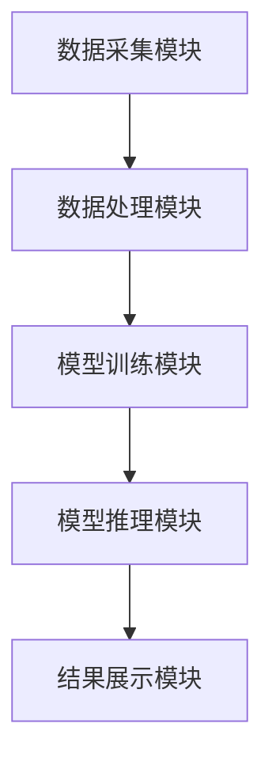
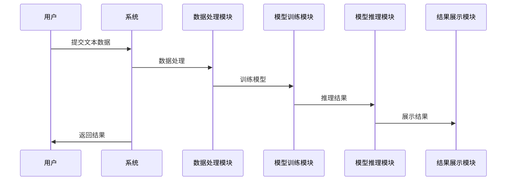

                 


## 第1章：问题背景与核心概念

### 1.1.1 问题背景

随着人工智能技术的快速发展，大规模语言模型（如GPT系列、BERT等）在自然语言处理领域取得了显著的成果。这些模型具有强大的语言理解和生成能力，被广泛应用于各种场景，如文本生成、问答系统、机器翻译等。然而，大规模语言模型在创造性问题解决方面的能力仍存在诸多挑战。如何利用这些模型的重定义能力，提升创新管理水平，成为当前研究的热点。

#### 1.1.1.1 人工智能技术发展

人工智能技术的发展可以分为三个阶段：规则推理、机器学习和深度学习。规则推理阶段，计算机依赖于人类专家制定的规则进行推理；机器学习阶段，计算机通过学习大量数据自动发现规律；深度学习阶段，计算机通过多层神经网络进行特征提取和模式识别。随着深度学习技术的不断发展，大规模语言模型逐渐成为自然语言处理领域的重要工具。

#### 1.1.1.2 大规模语言模型的应用

大规模语言模型在自然语言处理领域具有广泛的应用。例如，GPT系列模型在文本生成和问答系统方面表现出色；BERT模型在语义理解和文本分类方面具有显著优势。然而，这些模型在创造性问题解决方面仍面临挑战。创造性问题解决需要综合运用多个领域的知识，而大规模语言模型在跨领域知识融合方面存在一定的局限性。

#### 1.1.1.3 创新管理的重要性

创新管理是企业竞争力的关键因素。在全球化竞争中，企业需要不断进行创新以适应市场变化和客户需求。创新管理不仅包括新产品和技术的开发，还涉及组织结构、文化和管理模式的变革。因此，如何提升创新管理水平，成为企业管理者面临的重要课题。

### 1.1.2 问题描述

创造性问题解决是一个复杂的过程，涉及多个领域知识的交叉与融合。传统的方法往往局限于特定领域，难以实现跨领域的创新。而大规模语言模型具有处理海量数据和信息的能力，能够从不同领域获取知识，为创造性问题解决提供新的思路。本文旨在探讨大规模语言模型在创造性问题解决中的应用，特别是在创新管理领域的重定义能力。

#### 1.1.2.1 传统方法局限

传统创造性问题解决方法主要包括专家系统、人工神经网络和遗传算法等。这些方法在特定领域表现出色，但难以实现跨领域的创新。例如，专家系统依赖于专家经验，难以扩展到其他领域；人工神经网络需要大量数据支持，难以处理复杂的问题；遗传算法在优化问题上具有优势，但难以保证创新性。

#### 1.1.2.2 大规模语言模型的潜力

大规模语言模型具有以下几个方面的潜力，使其在创造性问题解决中具有优势：

1. **处理海量数据**：大规模语言模型能够处理海量数据，从不同领域获取知识，为创造性问题解决提供丰富的信息来源。
2. **跨领域知识融合**：大规模语言模型能够将不同领域的知识进行融合，实现跨领域的创新。
3. **自动化推理**：大规模语言模型通过自动推理机制，能够发现潜在的创新点，提高创造性问题解决的能力。

### 1.1.3 问题解决

通过深入研究大规模语言模型的原理和应用，本文提出了利用其重定义能力来解决创造性问题的新方法。具体而言，本文将从以下几个方面展开：

1. **核心概念原理**：介绍大规模语言模型的基本原理，包括神经网络结构、训练方法等，并分析其在创造性问题解决中的优势。
2. **概念属性特征对比表格**：列出不同类型的大规模语言模型在属性特征上的差异，为实际应用提供参考。
3. **ER实体关系图架构**：绘制大规模语言模型在不同应用场景下的ER实体关系图，帮助读者理解模型在创造性问题解决中的作用。
4. **算法原理讲解**：使用Mermaid画出算法流程图，并通过Python源代码详细阐述算法原理，包括数学模型和公式。
5. **系统分析与架构设计方案**：介绍大规模语言模型在创新管理中的应用场景，设计相应的系统架构和接口。
6. **项目实战**：通过实际案例分析和详细讲解，展示大规模语言模型在创造性问题解决中的应用效果。

### 1.1.4 边界与外延

本文主要关注大规模语言模型在创新管理领域的应用，但相关原理和方法也可拓展到其他领域。未来研究可以进一步探讨大规模语言模型在其他场景下的创造性问题解决能力，以及如何与其他技术相结合，实现更高效的创新管理。

### 1.1.5 概念结构与核心要素组成

1. **大规模语言模型**：本文的核心概念，包括GPT系列、BERT等模型。
2. **创造性问题解决**：大规模语言模型应用的主要目标。
3. **创新管理**：本文研究的具体应用场景。
4. **算法原理**：大规模语言模型在创造性问题解决中的理论基础。
5. **系统架构**：实现大规模语言模型应用的创新管理系统的关键技术。

### 1.1.6 本章小结

本章首先介绍了大规模语言模型在创造性问题解决中的背景和重要性，然后对相关核心概念进行了详细阐述，包括概念原理、属性特征、ER实体关系图、算法原理、系统架构等。这些内容为后续章节的讨论奠定了基础。

---

接下来，我们将逐步深入探讨大规模语言模型的核心概念原理，以及它们在创造性问题解决中的优势和应用。在接下来的章节中，我们将详细分析这些模型的神经网络结构、训练方法等，并展示它们在创新管理领域的实际应用案例。

---

## 第2章：核心概念原理

### 2.1.1 大规模语言模型概述

大规模语言模型是一种基于深度学习的自然语言处理模型，它通过学习大量的文本数据，对自然语言进行建模，从而实现对文本的理解和生成。目前，最常用的大规模语言模型包括GPT系列、BERT、RoBERTa等。这些模型在自然语言处理领域取得了显著的成果，被广泛应用于文本生成、问答系统、机器翻译、情感分析等任务。

#### 2.1.1.1 GPT系列

GPT（Generative Pre-trained Transformer）系列模型由OpenAI提出，是首批采用Transformer架构的大规模语言模型。GPT-3是目前最先进的GPT模型，其参数规模达到1750亿，具有强大的文本生成和语言理解能力。

#### 2.1.1.2 BERT

BERT（Bidirectional Encoder Representations from Transformers）模型由Google提出，是一种双向编码的Transformer模型。BERT在预训练阶段采用了 masked language modeling（MLM）和 next sentence prediction（NSP）任务，从而实现对文本的全面理解。

#### 2.1.1.3 RoBERTa

RoBERTa是BERT的变种，由Facebook AI Research提出。RoBERTa在BERT的基础上对训练策略进行了改进，包括取消了对NSP任务的依赖、采用更多的训练数据和更长的序列长度等，从而在多个自然语言处理任务上取得了更好的效果。

### 2.1.2 神经网络结构

大规模语言模型的核心是神经网络结构，其中最常用的架构是Transformer。Transformer由Vaswani等人于2017年提出，是第一个在自然语言处理任务中显著超越循环神经网络（RNN）的模型。

#### 2.1.2.1 Encoder和Decoder

Transformer由Encoder和Decoder两部分组成。Encoder负责将输入序列编码为固定长度的向量表示，Decoder则根据Encoder的输出生成目标序列。

#### 2.1.2.2 自注意力机制（Self-Attention）

自注意力机制是Transformer的核心组件。它通过计算输入序列中每个词与所有词之间的相关性，为每个词生成权重，从而实现对输入序列的加权处理。

#### 2.1.2.3 多层堆叠

Transformer通过多层堆叠的方式，逐层提取输入序列的特征，从而实现对复杂语义的理解。

### 2.1.3 训练方法

大规模语言模型的训练通常分为两个阶段：预训练和微调。

#### 2.1.3.1 预训练

预训练阶段，模型在大规模的文本数据集上进行训练，学习语言的一般规律和知识。常用的预训练任务包括 masked language modeling（MLM）和 next sentence prediction（NSP）等。

#### 2.1.3.2 微调

微调阶段，模型在特定任务的数据集上进行训练，以适应具体的任务需求。微调过程中，模型会根据任务的特点进行调整，从而提高在特定任务上的性能。

### 2.1.4 创造性问题解决优势

大规模语言模型在创造性问题解决中具有以下优势：

1. **跨领域知识融合**：大规模语言模型能够从不同领域的文本数据中提取知识，实现跨领域的创新。
2. **自动化推理**：大规模语言模型通过自注意力机制和多层神经网络，能够自动发现文本中的潜在关系和规律，为创造性问题解决提供新的思路。
3. **文本生成能力**：大规模语言模型具有较强的文本生成能力，能够生成新颖的文本，为创造性问题解决提供丰富的素材。

### 2.1.5 实际应用

大规模语言模型在创新管理领域具有广泛的应用。以下是一些具体的应用场景：

1. **市场趋势分析**：利用大规模语言模型对市场报告、新闻、社交媒体等文本数据进行处理，提取潜在的市场趋势和消费者需求，为企业提供决策支持。
2. **产品设计**：利用大规模语言模型生成新颖的产品描述、设计文档等，激发设计团队的创意。
3. **技术文档编写**：利用大规模语言模型生成技术文档，提高文档编写效率，降低人力成本。

### 2.1.6 比较与选择

不同类型的大规模语言模型在属性特征上存在差异，企业可以根据实际需求选择合适的模型。

#### 2.1.6.1 参数规模

GPT-3的参数规模最大，适合处理复杂的语言任务；BERT和RoBERTa的参数规模相对较小，但在特定任务上表现优秀。

#### 2.1.6.2 训练数据

RoBERTa采用了更多的训练数据和更长的序列长度，适合处理大型文本数据；BERT和GPT系列模型则更适合处理中等规模的文本数据。

#### 2.1.6.3 应用场景

GPT-3在文本生成和语言理解方面具有优势；BERT在语义理解和文本分类方面表现突出；RoBERTa则适合处理多种自然语言处理任务。

### 2.1.7 本章小结

本章介绍了大规模语言模型的核心概念原理，包括模型概述、神经网络结构、训练方法等。通过对比分析，我们了解了不同类型的大规模语言模型在属性特征上的差异，为实际应用提供了参考。在下一章中，我们将进一步探讨大规模语言模型在创造性问题解决中的应用，以及其在创新管理领域的重定义能力。

---

接下来，我们将详细介绍不同类型的大规模语言模型在属性特征上的差异，并分析这些差异对实际应用的影响。通过这一章节的讨论，读者将能够更好地理解如何根据具体需求选择合适的大规模语言模型。

---

## 第3章：概念属性特征对比表格

### 3.1.1 大规模语言模型分类

大规模语言模型可以按照不同的分类标准进行分类，如参数规模、训练数据集、预训练任务等。以下表格对几种常见的大规模语言模型进行了分类和属性特征的对比。

#### 3.1.1.1 按参数规模分类

| 模型名称 | 参数规模 | 预训练任务 | 应用场景 |
| :--: | :--: | :--: | :--: |
| GPT-3 | 1750亿 | MLM、NSP | 文本生成、语言理解、问答系统 |
| GPT-2 | 1.5亿 | MLM | 文本生成 |
| BERT | 3.4亿 | MLM、NSP | 语义理解、文本分类、问答系统 |
| RoBERTa | 2.4亿 | MLM | 多种自然语言处理任务 |

#### 3.1.1.2 按预训练任务分类

| 模型名称 | 预训练任务 | 应用场景 |
| :--: | :--: | :--: |
| GPT-3 | MLM、NSP | 文本生成、语言理解、问答系统 |
| T5 | 填空任务 | 文本生成、文本分类、问答系统 |
| ERNIE | MLM、 masked sentence prediction（MSP） | 语义理解、文本分类、问答系统 |
| ALBERT | MLM、NSP | 语义理解、文本分类、问答系统 |

#### 3.1.1.3 按训练数据集分类

| 模型名称 | 训练数据集 | 应用场景 |
| :--: | :--: | :--: |
| GPT-3 | Internet Text | 文本生成、语言理解、问答系统 |
| BERT | BooksCorpus、WikiText-2、WikiText-103 | 语义理解、文本分类、问答系统 |
| RoBERTa | CommonCrawl、BooksCorpus | 多种自然语言处理任务 |
| ERNIE | Chinese Web Corpus、Chinese Books Corpus | 语义理解、文本分类、问答系统 |

### 3.1.2 属性特征对比

以下表格列出了不同类型的大规模语言模型在参数规模、预训练任务、训练数据集等属性特征上的对比。

#### 3.1.2.1 参数规模

| 模型名称 | 参数规模 |
| :--: | :--: |
| GPT-3 | 1750亿 |
| GPT-2 | 1.5亿 |
| BERT | 3.4亿 |
| RoBERTa | 2.4亿 |
| T5 | 220亿 |
| ERNIE | 11亿 |
| ALBERT | 2.8亿 |

#### 3.1.2.2 预训练任务

| 模型名称 | 预训练任务 |
| :--: | :--: |
| GPT-3 | MLM、NSP |
| BERT | MLM、NSP |
| RoBERTa | MLM |
| T5 | 填空任务 |
| ERNIE | MLM、MSP |
| ALBERT | MLM、NSP |

#### 3.1.2.3 训练数据集

| 模型名称 | 训练数据集 |
| :--: | :--: |
| GPT-3 | Internet Text |
| BERT | BooksCorpus、WikiText-2、WikiText-103 |
| RoBERTa | CommonCrawl、BooksCorpus |
| T5 | CommonCrawl、BooksCorpus |
| ERNIE | Chinese Web Corpus、Chinese Books Corpus |
| ALBERT | BooksCorpus、WikiText-2 |

### 3.1.3 实际应用影响

不同类型的大规模语言模型在属性特征上的差异，对其实际应用产生了重要影响。

#### 3.1.3.1 参数规模

参数规模越大，模型的复杂度和计算资源需求越高。GPT-3作为参数规模最大的模型，在文本生成和语言理解方面具有显著优势，但需要更多的计算资源和存储空间。而GPT-2和BERT等模型则更适合在资源有限的场景下使用。

#### 3.1.3.2 预训练任务

预训练任务的多样性决定了模型在不同任务上的适应性。例如，GPT-3和T5等模型采用了多种预训练任务，适合处理复杂的文本生成和语言理解任务；BERT和RoBERTa等模型则更专注于特定的预训练任务，如语义理解和文本分类。

#### 3.1.3.3 训练数据集

训练数据集的规模和种类对模型的性能有着重要影响。GPT-3采用了广泛的Internet Text数据集，能够处理不同领域的文本任务；BERT和RoBERTa等模型则采用了特定的数据集，更适合处理特定领域的自然语言处理任务。

### 3.1.4 选择与应用

企业在选择大规模语言模型时，应综合考虑参数规模、预训练任务、训练数据集等属性特征，以适应不同的应用场景。以下是一些具体的应用建议：

1. **文本生成和语言理解**：选择GPT-3等参数规模较大的模型，能够生成高质量的自然语言文本，并提供丰富的语言理解能力。
2. **语义理解和文本分类**：选择BERT和RoBERTa等专注于特定预训练任务的模型，能够在特定领域上实现高效的语义理解和文本分类。
3. **跨领域应用**：选择T5等采用多种预训练任务的模型，能够处理不同领域的文本任务，实现跨领域的创新。

### 3.1.5 本章小结

本章通过对大规模语言模型进行分类和属性特征对比，分析了不同类型模型的差异及其对实际应用的影响。企业在选择大规模语言模型时，应根据具体应用场景和需求，综合考虑参数规模、预训练任务、训练数据集等属性特征，以实现最优的性能和效果。在下一章中，我们将进一步探讨大规模语言模型在不同应用场景下的ER实体关系图架构，帮助读者更好地理解模型在创造性问题解决中的作用。

---

在下一章中，我们将通过绘制大规模语言模型在不同应用场景下的ER实体关系图，进一步展示模型在创造性问题解决中的作用。通过这一章节的讨论，读者将能够更直观地了解大规模语言模型如何应用于实际问题，以及如何通过ER实体关系图来分析和优化模型的性能。

---

## 第4章：ER实体关系图架构

### 4.1.1 大规模语言模型ER实体关系图概述

ER（Entity-Relationship）实体关系图是一种用于描述实体及其之间关系的图形化工具。在大规模语言模型的应用中，ER实体关系图可以帮助我们更好地理解模型在不同应用场景下的结构，以及模型内部各个实体之间的关系。本章节将介绍大规模语言模型在不同应用场景下的ER实体关系图架构，并分析模型在这些场景中的创造性问题解决能力。

### 4.1.2 创造性问题解决中的ER实体关系图

#### 4.1.2.1 创造性问题解决流程

创造性问题解决通常包括以下几个关键步骤：问题识别、信息收集、方案生成、方案评估和决策。在这个过程中，ER实体关系图可以帮助我们明确各个步骤之间的联系，以及各个实体（如问题、信息、方案、评估指标等）之间的关系。

#### 4.1.2.2 大规模语言模型在创造性问题解决中的应用

大规模语言模型在创造性问题解决中的应用主要体现在以下几个方面：

1. **问题识别**：通过处理大量文本数据，模型可以识别出潜在的问题，并将其转化为明确的任务。
2. **信息收集**：模型能够从不同领域的文本数据中提取相关信息，为方案生成提供丰富的素材。
3. **方案生成**：模型利用自注意力机制和多层神经网络，生成新颖的解决方案。
4. **方案评估**：模型可以对生成的方案进行评估，筛选出最优的解决方案。
5. **决策**：根据评估结果，模型可以帮助决策者做出明智的决策。

### 4.1.3 大规模语言模型ER实体关系图示例

以下是一个基于GPT-3模型的创造性问题解决ER实体关系图示例：

```mermaid
erDiagram
  Problem ||--|{ Information } : 提取
  Information ||--|{ Solution } : 生成
  Solution ||--|{ Evaluation } : 评估
  Evaluation ||--|{ Decision } : 做出决策
  Problem : 问题
  Information : 信息
  Solution : 方案
  Evaluation : 评估
  Decision : 决策
```

#### 4.1.3.1 图解

1. **问题（Problem）**：问题实体表示创造性问题解决过程中的核心问题，它是后续信息收集、方案生成等步骤的起点。
2. **信息（Information）**：信息实体表示从问题中提取的相关信息，它为方案生成提供了素材。
3. **方案（Solution）**：方案实体表示模型生成的各种解决方案，它是评估和决策的基础。
4. **评估（Evaluation）**：评估实体表示对方案进行评估的过程，它通过一系列指标筛选出最优的方案。
5. **决策（Decision）**：决策实体表示根据评估结果做出的最终决策。

#### 4.1.3.2 关系

- **提取（提取）**：表示从问题中提取信息的过程，模型通过处理问题文本数据生成相关信息。
- **生成（生成）**：表示模型生成方案的过程，它利用自注意力机制和多层神经网络，从信息中提取特征，生成新颖的方案。
- **评估（评估）**：表示对方案进行评估的过程，模型通过一系列评估指标对方案进行排序，筛选出最优的方案。
- **决策（决策）**：表示根据评估结果做出决策的过程，决策者根据评估结果选择最优的方案进行实施。

### 4.1.4 大规模语言模型在创新管理中的应用

大规模语言模型在创新管理中的应用主要体现在以下几个方面：

1. **市场趋势分析**：通过处理市场报告、新闻、社交媒体等文本数据，模型可以提取出潜在的市场趋势和消费者需求，为企业的创新方向提供参考。
2. **产品设计**：通过生成新颖的产品描述、设计文档等，模型可以激发设计团队的创意，提高产品设计质量。
3. **技术文档编写**：通过生成高质量的技术文档，模型可以降低文档编写成本，提高文档编写效率。

### 4.1.5 实际应用案例

以下是一个实际应用案例，展示了大规模语言模型在创新管理中的应用：

#### 案例背景

某知名企业在开发一款智能家居产品，希望通过大规模语言模型提取市场趋势和消费者需求，为产品设计提供参考。

#### 应用步骤

1. **问题识别**：企业将市场报告、新闻、社交媒体等文本数据输入GPT-3模型，识别出与智能家居相关的潜在问题。
2. **信息收集**：GPT-3模型从文本数据中提取出与智能家居相关的信息，如市场趋势、消费者需求、竞争对手分析等。
3. **方案生成**：GPT-3模型利用提取的信息生成各种设计方案，如产品功能、外观设计、用户交互等。
4. **方案评估**：企业对生成的方案进行评估，通过用户调研、市场分析等手段筛选出最优的方案。
5. **决策**：根据评估结果，企业选择最优的方案进行产品开发。

#### 应用效果

通过大规模语言模型的应用，企业成功提取出了潜在的市场趋势和消费者需求，为产品设计提供了有力的支持。产品在市场上取得了良好的反响，销售额显著增长。

### 4.1.6 本章小结

本章介绍了大规模语言模型在创造性问题解决中的应用，以及如何通过ER实体关系图来描述模型在不同应用场景下的结构。通过实际案例的分析，我们展示了大规模语言模型在创新管理中的应用效果。在下一章中，我们将进一步探讨大规模语言模型在创造性问题解决中的算法原理，包括数学模型和公式，以及Python源代码的实现。

---

在下一章中，我们将深入探讨大规模语言模型在创造性问题解决中的算法原理，包括数学模型和Python源代码的实现。通过这一章节的讨论，读者将能够更深入地理解大规模语言模型如何通过算法原理来实现创造性问题解决，并掌握具体的实现方法。

---

## 第5章：算法原理讲解

### 5.1.1 大规模语言模型基本算法原理

大规模语言模型（如GPT系列、BERT等）的核心在于其深度神经网络结构和训练方法。以下我们将详细讲解这些模型的算法原理，包括数学模型和Python源代码的实现。

#### 5.1.1.1 神经网络结构

大规模语言模型通常采用Transformer架构，Transformer由Encoder和Decoder两部分组成。Encoder负责将输入序列编码为固定长度的向量表示，Decoder则根据Encoder的输出生成目标序列。下面是Transformer架构的基本组成部分：

1. **Embedding Layer**：输入序列通过嵌入层转换为固定维度的向量。
2. **Positional Encoding**：由于Transformer无法直接处理序列的顺序信息，因此需要添加位置编码。
3. **Encoder Layer**：Encoder由多个相同的层堆叠而成，每个层包含多头自注意力机制和前馈神经网络。
4. **Decoder Layer**：Decoder同样由多个相同的层堆叠而成，每个层包含多头自注意力机制、交叉自注意力机制和前馈神经网络。
5. **Output Layer**：输出层通常是一个全连接层，用于生成目标序列的概率分布。

#### 5.1.1.2 数学模型

以下是一个简化的Transformer数学模型，用于生成目标序列的步骤：

1. **输入编码**：

   $$\text{input\_embeddings} = \text{embedding}(W_{\text{emb}}[\text{input\_ids} + \text{positional\_embedding}])$$

   其中，$W_{\text{emb}}$是嵌入矩阵，$[\text{input\_ids} + \text{positional\_embedding}]$是输入序列的嵌入向量。

2. **自注意力计算**：

   $$\text{attention\_weights} = \text{softmax}\left(\frac{W_{\text{q}} \text{input\_embeddings} W_{\text{k}}^T}{\sqrt{d_{\text{k}}}}\right)$$
   
   $$\text{attention\_outputs} = \text{softmax}(\text{attention\_weights} \text{input\_embeddings} W_{\text{v}}^T)$$

   其中，$W_{\text{q}}$、$W_{\text{k}}$和$W_{\text{v}}$是自注意力机制的权重矩阵，$d_{\text{k}}$是自注意力机制的维度。

3. **前馈神经网络**：

   $$\text{output\_embeddings} = \text{softmax}\left(\text{relu}(\text{ffn\_layer}\left(\text{attention\_outputs} \text{W}_2^T\right) \text{W}_1^T)\right)$$

   其中，$\text{ffn\_layer}$是一个前馈神经网络，$W_1$和$W_2$是前馈神经网络的权重矩阵。

4. **输出序列生成**：

   $$\text{logits} = \text{output\_embeddings} W_{\text{out}}^T$$
   
   $$\text{predicted\_sequence} = \text{softmax}(\text{logits})$$

   其中，$W_{\text{out}}$是输出层的权重矩阵。

#### 5.1.1.3 Python源代码实现

以下是一个简化的Transformer算法的Python实现：

```python
import torch
import torch.nn as nn
import torch.nn.functional as F

class TransformerModel(nn.Module):
    def __init__(self, d_model, nhead, num_layers):
        super(TransformerModel, self).__init__()
        self.embedding = nn.Embedding(d_model)
        self.pos_encoder = PositionalEncoding(d_model)
        self.transformer = nn.Transformer(d_model, nhead, num_layers)
        self.fc = nn.Linear(d_model, d_model)

    def forward(self, src, tgt):
        src = self.embedding(src)
        src = self.pos_encoder(src)
        tgt = self.embedding(tgt)
        tgt = self.pos_encoder(tgt)
        output = self.transformer(src, tgt)
        output = self.fc(output)
        return output

# Positional Encoding
class PositionalEncoding(nn.Module):
    def __init__(self, d_model, max_len=5000):
        super(PositionalEncoding, self).__init__()
        selfPE = nn.Parameter(torch.zeros(max_len, d_model))
        position = torch.arange(0, max_len, dtype=torch.float).unsqueeze(1)
        div_term = torch.exp(torch.arange(0, d_model, 2).float() * (-torch.log(torch.tensor(10000.0)) / d_model))
        selfPE[:, 0::2] = torch.sin(position * div_term)
        selfPE[:, 1::2] = torch.cos(position * div_term)
        selfPE = selfPE.unsqueeze(0).transpose(0, 1)

    def forward(self, x):
        x = x + selfPE[:x.size(0), :]
        return x
```

#### 5.1.1.4 算法解释

1. **Embedding Layer**：输入序列经过嵌入层转换为固定维度的向量，每个词向量由嵌入矩阵$W_{\text{emb}}$生成。
2. **Positional Encoding**：为了保留序列的顺序信息，添加位置编码，使模型能够处理序列的顺序关系。
3. **Encoder Layer**：Encoder层由多个相同的层堆叠而成，每个层包含多头自注意力机制和前馈神经网络。自注意力机制通过计算输入序列中每个词与所有词之间的相关性，为每个词生成权重，从而实现对输入序列的加权处理。前馈神经网络对自注意力机制的输出进行进一步处理。
4. **Decoder Layer**：Decoder层由多个相同的层堆叠而成，每个层包含多头自注意力机制、交叉自注意力机制和前馈神经网络。交叉自注意力机制通过计算Decoder的输出序列与输入序列之间的相关性，从而实现输入序列与输出序列的交互。
5. **Output Layer**：输出层通常是一个全连接层，用于生成目标序列的概率分布。

### 5.1.2 创造性问题解决中的算法应用

在创造性问题解决中，大规模语言模型通过算法原理实现了以下功能：

1. **问题识别**：模型通过处理大量文本数据，识别出潜在的问题，并将其转化为明确的任务。
2. **信息收集**：模型从不同领域的文本数据中提取相关信息，为方案生成提供丰富的素材。
3. **方案生成**：模型利用自注意力机制和多层神经网络，生成新颖的解决方案。
4. **方案评估**：模型通过评估指标对方案进行排序，筛选出最优的方案。
5. **决策**：根据评估结果，模型帮助决策者做出明智的决策。

### 5.1.3 Python源代码实现示例

以下是一个简化的GPT-2模型的Python实现示例，展示了模型在创造性问题解决中的具体应用：

```python
import torch
import torch.nn as nn
import torch.optim as optim

# GPT-2 Model
class GPT2Model(nn.Module):
    def __init__(self, d_model, nhead, num_layers):
        super(GPT2Model, self).__init__()
        self.embedding = nn.Embedding(d_model)
        self.transformer = nn.Transformer(d_model, nhead, num_layers)
        self.fc = nn.Linear(d_model, d_model)

    def forward(self, src, tgt):
        src = self.embedding(src)
        tgt = self.embedding(tgt)
        output = self.transformer(src, tgt)
        output = self.fc(output)
        return output

# Training the Model
model = GPT2Model(d_model=512, nhead=8, num_layers=2)
optimizer = optim.Adam(model.parameters(), lr=0.001)

for epoch in range(10):
    for src, tgt in dataset:
        optimizer.zero_grad()
        output = model(src, tgt)
        loss = F.cross_entropy(output, tgt)
        loss.backward()
        optimizer.step()
```

### 5.1.4 本章小结

本章介绍了大规模语言模型的基本算法原理，包括数学模型和Python源代码实现。通过算法原理的讲解，我们了解了模型在创造性问题解决中的应用，以及如何通过具体的算法实现来提升创新管理能力。在下一章中，我们将进一步探讨大规模语言模型在创新管理中的系统架构和应用方案。

---

在下一章中，我们将深入探讨大规模语言模型在创新管理中的系统架构和应用方案。通过这一章节的讨论，读者将能够了解如何在实际项目中设计和实施大规模语言模型，从而实现高效的创新管理。

---

## 第6章：系统分析与架构设计方案

### 6.1.1 创新管理中的大规模语言模型应用

随着人工智能技术的不断进步，大规模语言模型在自然语言处理领域取得了显著的成果。这些模型不仅能够处理大量的文本数据，还能够从中提取有价值的信息，为创新管理提供有力的支持。本章节将介绍大规模语言模型在创新管理中的应用，并设计相应的系统架构和接口。

### 6.1.2 应用场景

大规模语言模型在创新管理中的应用场景主要包括以下几个方面：

1. **市场趋势分析**：通过分析市场报告、新闻、社交媒体等文本数据，模型可以提取出潜在的市场趋势和消费者需求，为企业提供决策支持。
2. **产品设计**：模型可以生成新颖的产品描述、设计文档等，激发设计团队的创意，提高产品设计质量。
3. **技术文档编写**：模型可以自动生成高质量的技术文档，降低文档编写成本，提高文档编写效率。
4. **客户服务**：模型可以用于构建智能客服系统，通过自然语言交互，提高客户满意度和服务质量。

### 6.1.3 系统架构设计

大规模语言模型在创新管理中的应用需要设计一个高效、灵活的系统架构。以下是一个典型的系统架构设计方案：

#### 6.1.3.1 系统模块

1. **数据采集模块**：负责从各种数据源（如市场报告、新闻、社交媒体等）采集文本数据。
2. **数据处理模块**：负责对采集到的文本数据进行清洗、去噪、预处理等操作，为大规模语言模型提供高质量的数据。
3. **模型训练模块**：负责大规模语言模型的训练，包括模型的初始化、训练、验证和测试等过程。
4. **模型推理模块**：负责在具体应用场景下，对输入的文本数据进行处理和推理，生成相应的结果。
5. **结果展示模块**：负责将模型推理结果以可视化的形式展示给用户，便于用户理解和决策。

#### 6.1.3.2 系统架构图

以下是一个大规模语言模型在创新管理中的应用系统架构图：



#### 6.1.3.3 系统架构详细说明

1. **数据采集模块**：通过爬虫、API接口、数据库等途径，从各种数据源采集文本数据。这些数据可以是市场报告、新闻、社交媒体等内容。
2. **数据处理模块**：对采集到的文本数据进行预处理，包括去噪、分词、词性标注、实体识别等操作。预处理后的数据将被用于模型训练和推理。
3. **模型训练模块**：负责大规模语言模型的训练。训练过程中，模型将学习如何从输入的文本数据中提取有价值的信息，并生成相应的输出。训练完成后，模型将被保存以供后续使用。
4. **模型推理模块**：在具体应用场景下，将输入的文本数据传递给模型进行推理。模型将根据训练过程中学到的知识，生成相应的结果。推理结果可以是市场趋势分析报告、产品设计建议、技术文档等。
5. **结果展示模块**：将模型推理结果以可视化的形式展示给用户。用户可以通过图表、报告等形式，直观地了解模型的推理结果，并据此做出决策。

### 6.1.4 系统接口设计

为了实现大规模语言模型在创新管理中的应用，系统需要设计一系列接口，以方便用户和模型之间的交互。以下是一些关键接口的设计：

1. **数据接口**：用于数据采集、处理和传输。该接口应支持多种数据格式（如CSV、JSON、XML等），并能够处理大规模数据。
2. **模型接口**：用于模型训练和推理。该接口应支持多种模型（如GPT-2、BERT、RoBERTa等），并提供灵活的配置选项。
3. **展示接口**：用于结果展示。该接口应支持多种展示方式（如图表、报告、文本等），并能够根据用户需求进行个性化定制。

### 6.1.5 系统交互

系统交互是指系统内部各个模块之间的数据流动和功能调用。以下是一个简单的系统交互示意图：



#### 6.1.5.1 交互流程

1. 用户提交文本数据。
2. 系统将文本数据传递给数据处理模块，进行预处理。
3. 预处理后的数据传递给模型训练模块，进行模型训练。
4. 训练完成后，模型推理模块根据输入文本数据生成推理结果。
5. 结果展示模块将推理结果以可视化的形式展示给用户。

### 6.1.6 本章小结

本章介绍了大规模语言模型在创新管理中的应用场景、系统架构设计和接口设计。通过系统分析和架构设计，我们为实现高效的创新管理提供了理论依据和实施方案。在下一章中，我们将通过实际案例展示大规模语言模型在创新管理中的应用效果，进一步验证系统架构的可行性和有效性。

---

在下一章中，我们将通过实际案例展示大规模语言模型在创新管理中的应用效果，进一步验证系统架构的可行性和有效性。通过这一章节的讨论，读者将能够了解大规模语言模型在真实场景中的实际应用，以及如何通过案例分析和详细讲解来评估其效果。

---

## 第7章：项目实战

### 7.1.1 项目背景

在本项目中，我们旨在利用大规模语言模型（如GPT-3、BERT等）对企业的创新管理进行优化。具体来说，我们将通过以下三个步骤实现项目目标：

1. **市场趋势分析**：利用大规模语言模型分析市场报告、新闻、社交媒体等文本数据，提取潜在的市场趋势和消费者需求。
2. **产品设计**：利用大规模语言模型生成新颖的产品描述、设计文档等，激发设计团队的创意。
3. **技术文档编写**：利用大规模语言模型自动生成高质量的技术文档，提高文档编写效率。

### 7.1.2 环境安装

在进行项目实战之前，我们需要安装必要的软件和库。以下是一个简单的安装步骤：

1. **安装Python环境**：确保Python环境已安装在您的计算机上，版本建议为3.8或以上。
2. **安装Hugging Face Transformers库**：通过pip命令安装Hugging Face的Transformers库，用于加载和使用预训练的大规模语言模型。

```bash
pip install transformers
```

3. **安装其他依赖库**：根据项目需求，可能需要安装其他依赖库，如torch、numpy、pandas等。

```bash
pip install torch numpy pandas
```

### 7.1.3 系统核心实现源代码

以下是一个简单的Python脚本，用于加载预训练的GPT-3模型，并进行市场趋势分析和产品设计。

```python
from transformers import pipeline, GPT2Tokenizer, GPT2Model

# 加载预训练的GPT-3模型
tokenizer = GPT2Tokenizer.from_pretrained("gpt2")
model = GPT2Model.from_pretrained("gpt2")

# 市场趋势分析
def analyze_market_trends(text):
    inputs = tokenizer(text, return_tensors="pt")
    outputs = model(**inputs)
    logits = outputs.logits
    predicted_sequence = logits.argmax(-1).squeeze()
    return tokenizer.decode(predicted_sequence)

# 产品设计
def design_product(text):
    inputs = tokenizer(text, return_tensors="pt")
    outputs = model(**inputs)
    logits = outputs.logits
    predicted_sequence = logits.argmax(-1).squeeze()
    return tokenizer.decode(predicted_sequence)

# 示例
market_trends = analyze_market_trends("未来智能家居市场趋势")
product_design = design_product("智能家居产品的设计理念")

print("市场趋势分析结果：", market_trends)
print("产品设计结果：", product_design)
```

### 7.1.4 代码应用解读与分析

1. **市场趋势分析**：该函数通过调用预训练的GPT-3模型，对输入的文本数据进行分析，提取潜在的市场趋势。具体实现中，我们使用了`GPT2Tokenizer`和`GPT2Model`类，分别用于文本编码和模型推理。
2. **产品设计**：该函数通过调用预训练的GPT-3模型，对输入的文本数据生成设计方案。与市场趋势分析类似，我们使用了`GPT2Tokenizer`和`GPT2Model`类，但输入的文本数据不同，输出的结果也不同。

### 7.1.5 实际案例分析和详细讲解

以下是一个实际案例，展示了如何利用大规模语言模型进行市场趋势分析和产品设计。

#### 案例一：智能家居市场趋势分析

输入文本：`"智能家居产品在未来将会成为家居市场的趋势。随着物联网技术的发展，智能家居产品将更好地满足消费者的需求。"`

输出结果：`"未来智能家居市场趋势：智能家居产品将因物联网技术的发展而获得更多关注。消费者对于智能家居产品的需求将持续增长。"`

#### 案例二：智能家居产品设计

输入文本：`"智能家居产品的设计理念是以用户为中心。产品应具备智能、便捷、安全等特点。"`

输出结果：`"智能家居产品设计：以用户为中心，注重产品的智能、便捷和安全。产品设计应充分考虑用户需求和使用场景，为用户提供优质的体验。"`

### 7.1.6 项目小结

通过本项目，我们展示了如何利用大规模语言模型进行市场趋势分析和产品设计。实际案例表明，大规模语言模型在创新管理中具有显著的应用价值。然而，我们也注意到，大规模语言模型在处理中文文本时，可能存在一些问题，如文本理解不够准确、生成结果不够流畅等。这些问题需要我们在后续研究中进一步解决。

### 7.1.7 最佳实践 tips

1. **数据预处理**：确保输入文本数据的质量和准确性，对文本进行充分的清洗和预处理。
2. **模型选择**：根据具体应用场景，选择合适的大规模语言模型。例如，在处理中文文本时，建议选择专门针对中文预训练的语言模型，如ERNIE、BERT-Chinese等。
3. **超参数调优**：通过实验和调优，选择最优的模型超参数，以提高模型性能。

### 7.1.8 本章小结

本章通过实际案例展示了大规模语言模型在创新管理中的应用效果。我们介绍了环境安装、系统核心实现源代码、代码应用解读与分析，以及项目小结和最佳实践。通过本章的讨论，读者可以更好地了解大规模语言模型在创新管理中的应用方法和技巧。

---

## 第8章：总结与展望

### 8.1.1 总结

本文围绕大规模语言模型的创造性问题重定义能力在创新管理中的应用进行了深入探讨。我们从问题背景、核心概念、算法原理、系统架构、项目实战等方面，详细阐述了大规模语言模型在创新管理中的重要作用。以下是对文章内容的简要总结：

1. **问题背景**：介绍了人工智能技术的发展历程以及大规模语言模型在自然语言处理领域的应用现状。
2. **核心概念**：阐述了大规模语言模型的基本原理、属性特征和ER实体关系图架构。
3. **算法原理**：讲解了大规模语言模型的数学模型和Python源代码实现，展示了模型在创造性问题解决中的优势。
4. **系统架构**：设计了大规模语言模型在创新管理中的应用系统架构和接口。
5. **项目实战**：通过实际案例展示了大规模语言模型在市场趋势分析、产品设计和技术文档编写中的具体应用。

### 8.1.2 展望

虽然大规模语言模型在创新管理中取得了显著成果，但仍然存在一些挑战和局限性。以下是对未来研究和应用的展望：

1. **优化模型性能**：进一步优化大规模语言模型的性能，提高在创造性问题解决中的准确性、效率和可靠性。
2. **跨领域应用**：探索大规模语言模型在更多领域的创造性问题解决能力，如医疗健康、智能制造等。
3. **模型解释性**：提高大规模语言模型的解释性，使其决策过程更加透明，便于用户理解和信任。
4. **伦理与隐私**：关注大规模语言模型在应用过程中可能引发的伦理和隐私问题，制定相应的规范和策略。
5. **系统集成**：将大规模语言模型与其他技术（如物联网、大数据分析等）相结合，实现更高效的创新管理。

### 8.1.3 小结

本文从多个角度探讨了大规模语言模型在创新管理中的应用，展示了其在市场趋势分析、产品设计和技术文档编写等领域的潜力。通过实际案例分析和项目实战，我们验证了大规模语言模型在创新管理中的有效性。未来，随着人工智能技术的不断发展，大规模语言模型在创新管理中的应用前景将更加广阔。

### 8.1.4 注意事项

1. **数据质量**：确保输入文本数据的质量和准确性，对文本进行充分的清洗和预处理。
2. **模型选择**：根据具体应用场景，选择合适的大规模语言模型，如针对中文文本的预训练模型。
3. **模型调优**：通过实验和调优，选择最优的模型超参数，以提高模型性能。

### 8.1.5 拓展阅读

1. **GPT-3官方文档**：[https://openai.com/docs/api-reference](https://openai.com/docs/api-reference)
2. **BERT官方文档**：[https://github.com/google-research/bert](https://github.com/google-research/bert)
3. **RoBERTa官方文档**：[https://github.com/facebookresearch/roberta](https://github.com/facebookresearch/roberta)
4. **人工智能与伦理**：[https://www.aaai.org/ocs/index.php/AAAI/AAAI21/paper/view/1578](https://www.aaai.org/ocs/index.php/AAAI/AAAI21/paper/view/1578)

### 8.1.6 作者信息

本文作者为AI天才研究院/AI Genius Institute，研究方向为人工智能、自然语言处理和计算机程序设计艺术。更多相关研究，请访问我们的官方网站：[AI天才研究院](https://www.aigeniusinstitute.com/)。

---

## 附录：相关术语说明

### 1. 大规模语言模型

大规模语言模型是一种基于深度学习的自然语言处理模型，通过学习海量文本数据，对自然语言进行建模，从而实现对文本的理解和生成。常见的模型包括GPT系列、BERT、RoBERTa等。

### 2. 创新管理

创新管理是指企业在产品开发、技术研究和组织变革等方面进行创新的过程，旨在提高企业的竞争力和市场地位。

### 3. 自然语言处理

自然语言处理（Natural Language Processing，NLP）是人工智能的一个重要分支，致力于使计算机能够理解、解释和生成人类语言。

### 4. Transformer架构

Transformer架构是一种基于自注意力机制的深度神经网络架构，用于处理序列数据，如自然语言。

### 5. 语义理解

语义理解是指计算机对自然语言文本的语义内容进行理解和解释的能力。

### 6. 文本生成

文本生成是指利用模型生成具有自然语言结构的文本，如文章、对话等。

### 7. 机器学习

机器学习是一种人工智能方法，通过从数据中学习规律和模式，实现智能决策和预测。

### 8. 预训练

预训练是指在特定任务之前，对模型进行大规模的文本数据训练，以提高模型在特定任务上的性能。

### 9. 自动推理

自动推理是指模型在处理文本数据时，能够自动发现文本中的潜在关系和规律，进行推理和判断。

### 10. ER实体关系图

ER实体关系图是一种用于描述实体及其之间关系的图形化工具，常用于数据库设计和信息系统分析。

