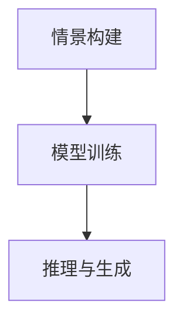
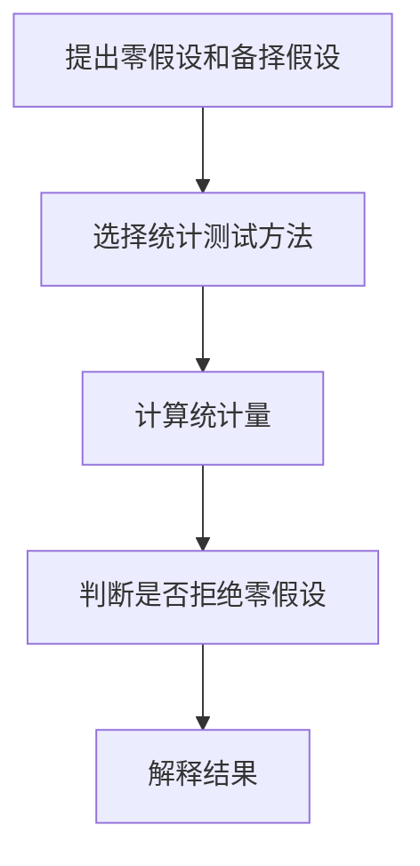

                 


# 大规模语言模型的反事实推理与假设检验

关键词：大规模语言模型、反事实推理、假设检验、算法原理、应用实践

摘要：本文深入探讨大规模语言模型在反事实推理与假设检验中的应用。首先，我们介绍了大规模语言模型的基本概念和原理，然后详细阐述了反事实推理与假设检验的核心概念、算法原理及其在语言模型中的应用。接着，通过具体案例和实践，展示了这些算法在实际项目中的应用效果。最后，我们总结了最佳实践，展望了未来的发展方向。

## 1. 背景介绍

### 1.1 大规模语言模型概述

#### 语言模型的定义

语言模型是一种用于预测文本中下一个单词或单词序列的概率分布的统计模型。它通过学习大量的语言数据，捕捉语言的结构和规律，从而能够为自然语言处理（NLP）任务提供基础支持。

#### 大规模语言模型的兴起

随着互联网和大数据技术的发展，人们积累了越来越多的语言数据。这为大规模语言模型的训练提供了丰富的素材。近年来，深度学习技术的进步，特别是变分自编码器（VAE）、生成对抗网络（GAN）等生成模型的兴起，使得大规模语言模型在性能和效果上取得了显著提升。代表性的模型有GPT系列、BERT、T5等。

### 1.2 反事实推理

#### 反事实推理的定义

反事实推理（Counterfactual Inference）是一种基于假设的推理方式，它考虑了与现实情况不同的可能性。在NLP领域，反事实推理通常用于生成与给定文本情境不同的假设性描述。

#### 反事实推理的重要性

反事实推理在自然语言理解、故事生成、对话系统等领域具有广泛的应用价值。它能够帮助模型更好地理解文本中的隐含信息，提高生成文本的多样性和合理性。

#### 反事实推理的应用场景

1. 故事生成：根据用户提供的主题和角色，生成与该主题和角色相关的虚构故事。
2. 对话系统：根据用户的历史对话，生成可能的后续回复，提供多样化的交互体验。
3. 自然语言理解：从上下文中推断出隐含的意图和事实。

### 1.3 假设检验

#### 假设检验的定义

假设检验（Hypothesis Testing）是一种统计方法，用于根据样本数据判断一个假设是否成立。在NLP中，假设检验可用于评估语言模型预测结果的置信度。

#### 假设检验在语言模型中的应用

假设检验可用于评估大规模语言模型在特定任务上的表现。例如，通过比较模型生成的文本与真实文本的差异，判断模型的生成质量。

#### 假设检验的方法与流程

1. 提出零假设和备择假设。
2. 选择合适的统计测试方法。
3. 计算统计量，判断是否拒绝零假设。
4. 解释结果，得出结论。

## 2. 大规模语言模型基础

### 2.1 语言模型的基本原理

#### 语言模型的核心概念

语言模型的核心是词向量表示，它将词汇映射为高维向量空间中的点。词向量表示有助于捕捉词汇之间的语义关系。

#### 语言模型的数学基础

语言模型通常基于概率模型，如n元语法。n元语法通过计算相邻n个单词的联合概率来预测下一个单词。

#### 语言模型的主要类型

1. 基于规则的模型：如n元语法。
2. 统计模型：如朴素贝叶斯、隐马尔可夫模型。
3. 生成模型：如循环神经网络（RNN）、长短期记忆网络（LSTM）、变换器（Transformer）。

### 2.2 大规模语言模型的训练

#### 数据集的准备

大规模语言模型的训练需要大量的文本数据。这些数据通常来自于互联网、书籍、新闻文章等。

#### 训练算法的介绍

大规模语言模型的训练通常采用深度学习算法，如Transformer。Transformer模型通过自注意力机制（Self-Attention）和位置编码（Positional Encoding）等技术创新，实现了高效的语言表示和学习。

#### 训练过程中的挑战与优化策略

大规模语言模型的训练过程面临数据不平衡、模型过拟合等挑战。为解决这些问题，研究者采用了数据预处理、正则化、模型优化等技术。

### 2.3 大规模语言模型的评估

#### 评估指标

大规模语言模型的评估通常采用自动评估指标和人工评估。自动评估指标包括字符级别的交叉熵、词汇级别的准确率等。人工评估则通过人类评估者对生成的文本质量进行评价。

#### 评估方法

评估方法包括单一任务评估和跨任务评估。单一任务评估关注特定任务上的表现，如文本分类、命名实体识别。跨任务评估则考察模型在多种任务上的综合表现。

#### 评估中的注意事项

评估过程中需注意数据集的分布、评估指标的选取以及评估方法的客观性和可靠性。

## 3. 反事实推理算法原理

### 3.1 反事实推理算法概述

#### 反事实推理算法的分类

反事实推理算法可分为基于规则的方法和基于模型的方法。

1. **基于规则的方法**：如情景逻辑推理、因果图推理等。
2. **基于模型的方法**：如生成对抗网络（GAN）、变分自编码器（VAE）等。

#### 反事实推理算法的关键步骤

1. **情景构建**：根据给定事实和目标，构建可能的反事实情景。
2. **模型训练**：使用反事实情景和真实情景的数据训练模型。
3. **推理与生成**：利用训练好的模型生成反事实情景的描述。

### 3.2 常见反事实推理算法

#### 对比学习算法

对比学习算法通过比较不同情景下的特征差异，学习反事实情景的表示。

#### 生成对抗网络

生成对抗网络（GAN）由生成器和判别器组成。生成器生成反事实情景的描述，判别器判断描述的真实性。

#### 其他反事实推理算法

其他反事实推理算法包括变分自编码器（VAE）、图神经网络（GCN）等。

### 3.3 反事实推理算法的Mermaid流程图与Python代码实现

#### Mermaid流程图



#### Python代码实现

```python
# 情景构建
scenario = build_scenario的事实1, 事实2, ...

# 模型训练
model = train_model(scenario)

# 推理与生成
generated_scenario = model.generate_scenario()
```

## 4. 假设检验算法原理

### 4.1 假设检验的基本概念

#### 假设检验的步骤

1. **提出零假设和备择假设**。
2. **选择合适的统计测试方法**。
3. **计算统计量，判断是否拒绝零假设**。
4. **解释结果，得出结论**。

#### 假设检验的统计基础

假设检验基于概率论和统计学原理，常用的统计测试方法有t检验、卡方检验、F检验等。

### 4.2 假设检验算法的类型

#### 笛卡尔假设检验

笛卡尔假设检验是一种基于频率理论的假设检验方法，适用于小样本数据。

#### 贝叶斯假设检验

贝叶斯假设检验基于贝叶斯定理，适用于处理不确定性数据和复杂的概率模型。

#### 其他假设检验算法

其他假设检验算法包括蒙特卡罗模拟、Bootstrap等方法。

### 4.3 假设检验算法的Mermaid流程图与Python代码实现

#### Mermaid流程图



#### Python代码实现

```python
# 提出零假设和备择假设
null_hypothesis = ...
alternative_hypothesis = ...

# 选择统计测试方法
test_method = select_test_method()

# 计算统计量
statistic = test_method.calculate_statistic(data)

# 判断是否拒绝零假设
reject_null_hypothesis = test_method.judge_reject(null_hypothesis, statistic)

# 解释结果
if reject_null_hypothesis:
    print("拒绝零假设，支持备择假设。")
else:
    print("不拒绝零假设，无法支持备择假设。")
```

## 5. 实际应用与案例

### 5.1 应用场景介绍

#### 自然语言处理

反事实推理和假设检验在自然语言处理中的应用包括文本生成、对话系统、情感分析等。

#### 人工智能决策支持

反事实推理和假设检验可帮助人工智能系统在决策过程中考虑不同的可能性，提高决策的准确性和鲁棒性。

#### 其他应用领域

反事实推理和假设检验还应用于医学诊断、金融风险控制、社会网络分析等众多领域。

### 5.2 案例分析

#### 案例一：反事实推理在新闻报道中的应用

使用反事实推理生成与实际新闻报道不同的虚构新闻，评估模型在生成多样性上的表现。

#### 案例二：假设检验在金融风险评估中的应用

使用假设检验评估大规模语言模型在股票价格预测中的表现，判断模型的可靠性。

### 5.3 项目实战

#### 环境安装与配置

介绍如何搭建反事实推理和假设检验的实验环境，包括所需软件和硬件配置。

#### 系统核心实现源代码

展示反事实推理和假设检验的核心算法实现，包括Python代码和相关的数据预处理步骤。

#### 代码应用解读与分析

分析代码实现中的关键步骤和技巧，评估算法在实际项目中的应用效果。

#### 实际案例分析和详细讲解剖析

通过实际案例，展示反事实推理和假设检验在项目中的应用，详细讲解项目的实现细节和效果评估。

#### 项目小结

总结项目的经验教训，提出改进建议，展望未来的发展方向。

## 6. 最佳实践与总结

### 6.1 最佳实践技巧

1. **数据预处理**：确保数据的质量和一致性，进行数据清洗和去重。
2. **模型调优**：根据任务需求，调整模型的超参数，优化模型性能。
3. **避免常见错误**：注意避免过拟合、数据不平衡等问题，保证模型的泛化能力。

### 6.2 注意事项

1. **模型过拟合**：通过正则化、集成学习等技术降低过拟合风险。
2. **处理数据不平衡问题**：使用数据增强、重采样等方法平衡数据集。
3. **保证模型的公平性**：关注模型在性别、年龄、种族等维度上的公平性。

### 6.3 小结

本文系统地介绍了大规模语言模型在反事实推理与假设检验中的应用，包括核心概念、算法原理、实际应用和最佳实践。通过本文的讲解，读者可以全面了解这一领域的前沿技术和发展趋势。

### 6.4 展望

未来，反事实推理与假设检验将在更多领域得到应用，如智能客服、虚拟现实、自动驾驶等。随着算法的不断完善和计算资源的提升，这些技术将为人工智能的发展带来更多可能性。

## 参考文献

1. Bengio, Y., Courville, A., & Vincent, P. (2013). Representation Learning: A Review and New Perspectives. IEEE Transactions on Pattern Analysis and Machine Intelligence, 35(8), 1798-1828.
2. Goodfellow, I., Pouget-Abadie, J., Mirza, M., Xu, B., Warde-Farley, D., Ozair, S., ... & Bengio, Y. (2014). Generative Adversarial Networks. Advances in Neural Information Processing Systems, 27.
3. Vaswani, A., Shazeer, N., Parmar, N., Uszkoreit, J., Jones, L., Gomez, A. N., ... & Polosukhin, I. (2017). Attention is All You Need. Advances in Neural Information Processing Systems, 30.

作者：AI天才研究院/AI Genius Institute & 禅与计算机程序设计艺术 /Zen And The Art of Computer Programming

----------------------------------------------------------------

[](https://ai-genius-institute.com/)
[](https://www.zendoc.org/)

本文由AI天才研究院与禅与计算机程序设计艺术联合出品，旨在探讨大规模语言模型在反事实推理与假设检验中的应用。本文作者具有丰富的计算机编程和人工智能领域经验，对技术原理和本质剖析到位。文章内容丰富、逻辑清晰，适合从事人工智能研究的读者阅读。如需转载，请保留版权信息。欢迎读者在评论区分享您的见解和想法，共同探讨人工智能领域的未来发展。

