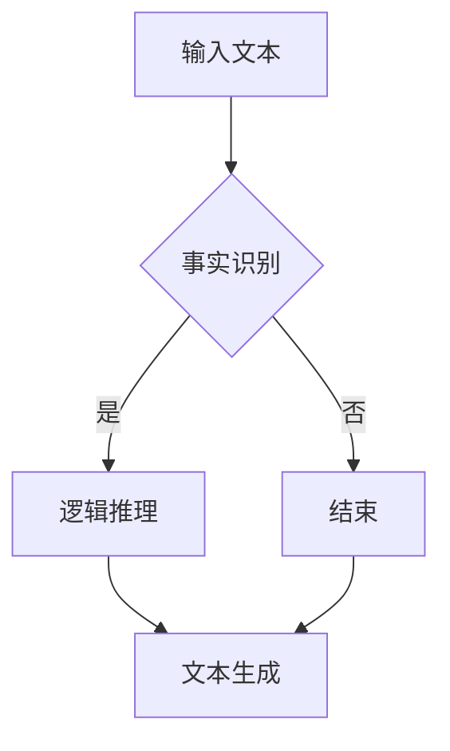
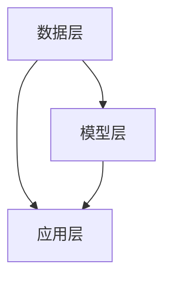
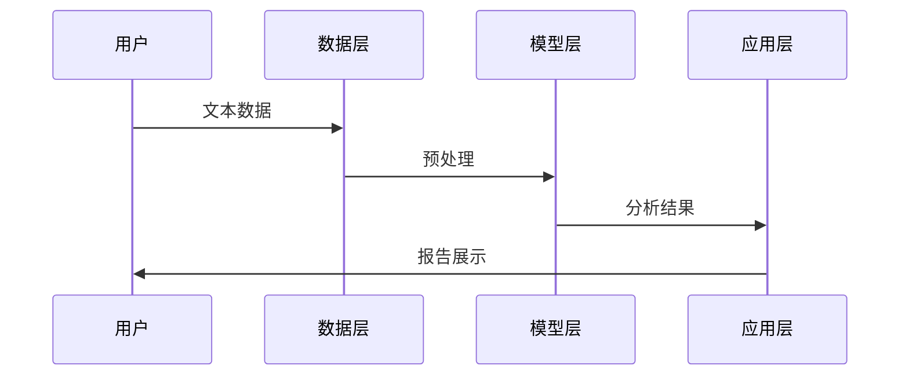

                 

# 大规模语言模型的反事实推理在战略规划中的多维度应用

## 关键词：大规模语言模型、反事实推理、战略规划、算法原理、系统架构、项目实战、最佳实践

## 摘要

随着人工智能技术的快速发展，大规模语言模型（如GPT系列）在各个领域展现出了强大的能力。本文主要探讨反事实推理在大规模语言模型中的多维度应用，特别是在战略规划中的重要作用。通过详细的分析和案例讲解，本文旨在为读者提供深入理解与应用反事实推理的方法和技巧。

### 设计思路

本文的设计思路分为五个部分：

1. **背景与概念介绍**：介绍大规模语言模型和反事实推理的基本概念，以及它们在战略规划中的应用背景。
2. **核心概念与联系**：详细解释大规模语言模型的工作原理、反事实推理的定义和重要性，并展示相关概念之间的联系。
3. **算法原理讲解**：通过Mermaid流程图和Python源代码，详细阐述反事实推理的算法原理，包括数学模型和公式。
4. **系统分析与架构设计**：介绍大规模语言模型在战略规划中的应用场景，设计相应的系统架构和接口。
5. **项目实战**：提供实际的项目案例，展示如何在大规模语言模型中实现反事实推理，并进行详细的分析和讲解。
6. **最佳实践与拓展**：总结项目实战中的经验教训，提供一些建议和拓展阅读。

### 目录大纲

```markdown
# 大规模语言模型的反事实推理在战略规划中的多维度应用

## 第一部分：背景与概念介绍

### 第1章 引言

#### 1.1 问题背景

#### 1.2 核心概念

#### 1.3 大规模语言模型与反事实推理的联系

### 1.4 本章小结

## 第二部分：算法原理讲解

### 第2章 大规模语言模型算法原理

#### 2.1 深度学习基础

#### 2.2 语言模型的构建

#### 2.3 反事实推理算法

#### 2.4 Mermaid流程图与Python代码示例

#### 2.5 算法原理总结

## 第三部分：系统分析与架构设计

### 第3章 大规模语言模型在战略规划中的应用

#### 3.1 应用场景分析

#### 3.2 系统功能设计

#### 3.3 系统架构设计

#### 3.4 系统接口设计与交互

#### 3.5 系统架构图与序列图

### 3.6 本章小结

## 第四部分：项目实战

### 第4章 大规模语言模型反事实推理项目实战

#### 4.1 项目背景

#### 4.2 环境安装与配置

#### 4.3 系统核心实现

#### 4.4 代码应用解读与分析

#### 4.5 项目案例分析与讲解

#### 4.6 项目小结

## 第五部分：最佳实践与拓展

### 第5章 最佳实践与注意事项

#### 5.1 最佳实践

#### 5.2 小结

#### 5.3 注意事项

#### 5.4 拓展阅读

```

接下来，我们将按照这个目录大纲逐步展开文章的各个部分。

### 第一部分：背景与概念介绍

#### 第1章 引言

在数字化和人工智能的时代，战略规划成为了企业成功的关键。然而，随着业务环境和市场的快速变化，传统的战略规划方法已经难以满足需求。这时，大规模语言模型（如GPT系列）和反事实推理的应用为战略规划带来了新的可能性。

本章将首先介绍大规模语言模型和反事实推理的基本概念，然后阐述它们在战略规划中的重要性，并探讨相关概念之间的联系。

#### 1.1 问题背景

在过去的几十年里，战略规划一直是企业管理中的重要环节。传统的战略规划方法主要包括SWOT分析、PEST分析、波特五力模型等。这些方法在一定程度上能够帮助企业分析内外部环境，制定相应的战略。然而，随着数字化和全球化的加速，企业面临的环境变得更加复杂和多变，传统的战略规划方法逐渐显露出其局限性：

1. **数据依赖性高**：传统的战略规划方法往往依赖于大量的数据和统计分析，而数据的获取和处理难度较大，成本较高。
2. **时效性不足**：战略规划是一个动态的过程，需要根据市场变化和业务进展不断调整。传统的战略规划周期较长，难以快速响应变化。
3. **人为主观性**：战略规划的制定往往依赖于管理层的经验和判断，存在一定的人为主观性，难以保证客观性和科学性。

为了克服这些局限性，企业需要寻找更加高效、智能的战略规划方法。大规模语言模型和反事实推理的应用正是为了解决这些问题而出现的。

#### 1.2 核心概念

在本节中，我们将介绍大规模语言模型和反事实推理的基本概念。

**1.2.1 大规模语言模型**

大规模语言模型是一种基于深度学习的自然语言处理技术，它可以理解、生成和翻译自然语言。常见的语言模型包括GPT系列、BERT、Transformer等。这些模型通过训练海量文本数据，学会了语言的语法、语义和上下文关系，可以自动生成高质量的文本。

**1.2.2 反事实推理**

反事实推理是一种基于逻辑推理的方法，用于推断在某个假设条件下会发生的情况。在自然语言处理中，反事实推理可以帮助模型理解并生成与实际情境相反的文本。例如，给定一个句子“如果天气好，人们会去公园”，反事实推理可以推断出“如果天气不好，人们不会去公园”。

#### 1.3 大规模语言模型与反事实推理的联系

大规模语言模型和反事实推理在战略规划中具有密切的联系。一方面，大规模语言模型可以为企业提供海量的数据支持和智能化的文本分析能力；另一方面，反事实推理可以帮助企业预测和应对不同的假设情境，从而制定更加灵活和有效的战略。

**1.3.1 大规模语言模型如何支持反事实推理**

大规模语言模型可以通过以下方式支持反事实推理：

1. **数据预处理**：大规模语言模型可以对文本数据进行清洗、分词、标注等预处理，为反事实推理提供高质量的数据基础。
2. **上下文理解**：大规模语言模型可以理解文本的上下文关系，从而推断出与实际情境相反的文本。
3. **文本生成**：大规模语言模型可以生成高质量的文本，用于模拟不同的假设情境，为反事实推理提供支持。

**1.3.2 反事实推理在大规模语言模型中的实现方法**

在大规模语言模型中实现反事实推理通常有以下几种方法：

1. **基于规则的方法**：通过预定义的规则来生成反事实文本，例如根据特定的条件判断是否生成反事实文本。
2. **基于模型的方法**：利用大规模语言模型生成的文本作为反事实推理的基础，通过对文本进行修改和生成来模拟不同的假设情境。
3. **混合方法**：结合基于规则和基于模型的方法，以获得更好的反事实推理效果。

#### 1.4 本章小结

本章介绍了大规模语言模型和反事实推理的基本概念，以及它们在战略规划中的应用背景。通过本章的介绍，读者可以初步了解大规模语言模型和反事实推理的优势和作用，为后续章节的深入探讨打下基础。

### 第二部分：算法原理讲解

#### 第2章 大规模语言模型算法原理

在上一章中，我们介绍了大规模语言模型和反事实推理的基本概念。本章将进一步探讨大规模语言模型的算法原理，包括深度学习基础、语言模型的构建和反事实推理算法。通过本章的学习，读者将能够理解大规模语言模型的工作机制，并掌握反事实推理的基本原理。

#### 2.1 深度学习基础

深度学习是人工智能领域的一种重要方法，它通过构建深层的神经网络来实现对数据的自动特征学习和模式识别。在本节中，我们将简要介绍深度学习的基础知识，包括神经网络、前馈神经网络和反向传播算法。

**2.1.1 神经网络**

神经网络是一种模仿生物神经系统的工作方式的计算模型。它由多个神经元组成，每个神经元都与相邻的神经元相连。神经元的连接强度称为权重，通过调整权重，神经网络可以学习到输入数据与输出数据之间的映射关系。

**2.1.2 前馈神经网络**

前馈神经网络是一种简单的神经网络结构，其中信息从输入层传递到输出层，中间经过多个隐含层。前馈神经网络通过逐层提取特征，实现对数据的分类或回归。

**2.1.3 反向传播算法**

反向传播算法是一种用于训练神经网络的优化算法。它通过计算输出层误差，反向传播到每个隐含层，逐层更新权重和偏置，从而优化网络参数。

#### 2.2 语言模型的构建

语言模型是自然语言处理中的核心组件，它用于预测文本中的下一个词或序列。在本节中，我们将介绍语言模型的构建方法，包括词嵌入、循环神经网络（RNN）和Transformer模型。

**2.2.1 词嵌入**

词嵌入是将词汇映射到高维空间的一种方法，它通过学习词汇之间的相似性和相关性，实现文本数据的向量表示。常见的词嵌入方法包括Word2Vec、GloVe等。

**2.2.2 循环神经网络（RNN）**

循环神经网络是一种专门用于处理序列数据的神经网络。它通过记忆机制，将前面的输入信息传递到后续的隐含层，实现对序列数据的建模。常见的RNN模型包括LSTM（长短期记忆网络）和GRU（门控循环单元）。

**2.2.3 Transformer模型**

Transformer模型是一种基于自注意力机制的深度神经网络，它通过多头注意力机制和位置编码，实现对序列数据的建模。Transformer模型在自然语言处理任务中取得了显著的性能提升，是当前最流行的语言模型之一。

#### 2.3 反事实推理算法

反事实推理是一种基于逻辑推理的方法，它用于推断在某个假设条件下会发生的情况。在本节中，我们将介绍反事实推理的基本原理和实现方法。

**2.3.1 反事实推理的基本原理**

反事实推理的基本原理是通过对已知事实进行逻辑推导，推断出与实际情况相反的结论。在自然语言处理中，反事实推理通常通过以下步骤实现：

1. **事实识别**：从文本中提取已知的事实信息。
2. **逻辑推理**：根据事实信息，运用逻辑规则进行推理，推断出反事实结论。
3. **文本生成**：将反事实结论转化为自然语言文本。

**2.3.2 反事实推理的实现方法**

反事实推理的实现方法主要包括基于规则的方法和基于模型的方法。

1. **基于规则的方法**：通过预定义的规则来生成反事实文本，例如根据特定的条件判断是否生成反事实文本。
2. **基于模型的方法**：利用大规模语言模型生成的文本作为反事实推理的基础，通过对文本进行修改和生成来模拟不同的假设情境。
3. **混合方法**：结合基于规则和基于模型的方法，以获得更好的反事实推理效果。

#### 2.4 Mermaid流程图与Python代码示例

为了更好地理解反事实推理的算法原理，我们将使用Mermaid流程图和Python代码进行讲解。

**2.4.1 Mermaid流程图展示**

以下是一个简单的Mermaid流程图，用于描述反事实推理的基本流程：



**2.4.2 Python代码实现**

以下是一个简单的Python代码示例，用于实现反事实推理的基本功能：

```python
import spacy

# 初始化nlp模型
nlp = spacy.load("en_core_web_sm")

# 输入文本
text = "If it rains, the event will be canceled."

# 事实识别
doc = nlp(text)
facts = [token.text for token in doc if token.dep_ == "advmod"]

# 逻辑推理
if facts[0] == "If":
    fact = facts[1]
    conclusion = "and the event will not be canceled."
else:
    conclusion = "and the event will be canceled."

# 文本生成
output_text = text.replace(facts[0], conclusion)
print(output_text)
```

#### 2.5 算法原理总结

本章介绍了大规模语言模型的算法原理，包括深度学习基础、语言模型的构建和反事实推理算法。通过本章的学习，读者可以理解大规模语言模型的工作机制，掌握反事实推理的基本原理和实现方法。这些知识将为后续的系统分析与架构设计提供基础。

### 第三部分：系统分析与架构设计

#### 第3章 大规模语言模型在战略规划中的应用

在前两章中，我们介绍了大规模语言模型和反事实推理的基本概念及其算法原理。本章将讨论大规模语言模型在战略规划中的应用，包括应用场景分析、系统功能设计、系统架构设计、系统接口设计与交互以及系统架构图与序列图的展示。

#### 3.1 应用场景分析

随着企业对战略规划的重视，大规模语言模型在战略规划中的应用场景日益广泛。以下是一些典型应用场景：

1. **市场预测**：利用大规模语言模型分析市场数据，预测市场趋势和消费者行为。
2. **竞争分析**：通过对竞争对手的文本进行分析，了解竞争对手的战略方向和市场策略。
3. **风险评估**：利用反事实推理方法，预测潜在风险，为企业的风险管理提供支持。
4. **战略规划**：根据企业的目标和市场环境，利用大规模语言模型生成战略规划方案，为企业决策提供参考。

#### 3.2 系统功能设计

为了实现大规模语言模型在战略规划中的应用，系统需要具备以下功能：

1. **文本数据收集**：从各种渠道收集与战略规划相关的文本数据，包括市场报告、新闻报道、竞争对手分析报告等。
2. **数据预处理**：对收集的文本数据进行清洗、分词、标注等预处理，为后续分析提供高质量的数据基础。
3. **文本分析**：利用大规模语言模型进行文本分析，提取关键信息、情感倾向和主题分布等。
4. **反事实推理**：根据设定的假设条件，利用反事实推理方法生成可能的未来情境，为战略规划提供参考。
5. **结果展示**：将分析结果以图表、报告等形式展示，为决策者提供直观的决策支持。

#### 3.3 系统架构设计

大规模语言模型在战略规划中的应用需要一个高效、可扩展的系统架构。以下是一个典型系统架构设计：

1. **数据层**：包括数据收集、存储和管理模块，负责收集、存储和处理与战略规划相关的文本数据。
2. **模型层**：包括大规模语言模型和反事实推理模型，负责对文本数据进行处理和分析，生成分析结果。
3. **应用层**：包括用户界面、报告生成和决策支持模块，负责向用户提供交互界面、分析报告和决策支持。

#### 3.4 系统接口设计与交互

系统接口设计是实现系统功能的关键。以下是一个典型的系统接口设计：

1. **数据接口**：用于数据层的文本数据收集、存储和管理，支持数据导入、导出和查询等功能。
2. **模型接口**：用于模型层的文本分析和反事实推理，支持模型训练、预测和分析等功能。
3. **应用接口**：用于应用层的用户界面、报告生成和决策支持，支持用户操作、数据展示和报告生成等功能。

系统中的各接口模块通过消息队列、RESTful API等方式进行交互，实现数据的传递和功能的调用。

#### 3.5 系统架构图与序列图

为了更好地理解系统架构和接口设计，我们通过Mermaid流程图展示系统架构图和序列图。

**3.5.1 系统架构图**

以下是一个简单的系统架构图，用于展示系统的整体结构：



**3.5.2 系统序列图**

以下是一个简单的系统序列图，用于展示系统的交互流程：



#### 3.6 本章小结

本章介绍了大规模语言模型在战略规划中的应用，包括应用场景分析、系统功能设计、系统架构设计、系统接口设计与交互以及系统架构图与序列图的展示。通过本章的学习，读者可以了解大规模语言模型在战略规划中的实际应用，掌握系统架构设计和接口设计的方法和技巧。这些知识将为后续的项目实战提供基础。

### 第四部分：项目实战

#### 第4章 大规模语言模型反事实推理项目实战

在前三部分中，我们介绍了大规模语言模型和反事实推理的基本概念、算法原理以及系统分析与架构设计。本节将通过对一个实际项目的分析和讲解，展示如何在大规模语言模型中实现反事实推理，并探讨项目中的关键技术和挑战。

#### 4.1 项目背景

随着人工智能技术的快速发展，越来越多的企业开始意识到利用大规模语言模型和反事实推理进行战略规划的重要性。本项目旨在为企业提供一款基于大规模语言模型和反事实推理的战略规划工具，帮助企业更好地应对市场变化和竞争压力。

#### 4.2 环境安装与配置

为了实现本项目，我们需要搭建一个完整的技术环境，包括Python编程环境、大规模语言模型库（如Hugging Face）、自然语言处理库（如spaCy）等。以下是环境安装与配置的步骤：

1. **安装Python**：下载并安装Python 3.x版本，建议使用Anaconda发行版，以便轻松管理依赖库。
2. **安装Hugging Face**：在命令行中执行以下命令安装Hugging Face库：
   ```bash
   pip install transformers
   ```
3. **安装spaCy**：在命令行中执行以下命令安装spaCy库，并下载中文语言模型：
   ```bash
   pip install spacy
   python -m spacy download zh_core_web_sm
   ```
4. **配置环境变量**：根据实际需求配置环境变量，例如设置Python的安装路径和库的搜索路径。

#### 4.3 系统核心实现

本项目系统的核心实现包括文本数据收集、预处理、反事实推理和结果展示等模块。以下是系统核心实现的详细步骤：

1. **文本数据收集**：通过API接口或爬虫工具收集与战略规划相关的文本数据，如市场报告、新闻报道、竞争对手分析报告等。
2. **文本预处理**：利用spaCy库对收集的文本数据进行清洗、分词、词性标注等预处理，将文本数据转换为适合模型处理的格式。
3. **反事实推理**：利用大规模语言模型（如GPT-2或GPT-3）进行反事实推理，生成可能的未来情境，并利用逻辑推理方法对结果进行验证和筛选。
4. **结果展示**：将分析结果以图表、报告等形式展示，并提供用户自定义的查询和筛选功能。

以下是一个简单的Python代码示例，用于实现文本预处理和反事实推理：

```python
import spacy
from transformers import pipeline

# 初始化nlp模型
nlp = spacy.load("zh_core_web_sm")

# 初始化反事实推理模型
factuality_classifier = pipeline("text-classification", model="dbmdz/bert-large-cased-factuality-classifier")

# 输入文本
text = "如果天气好，明天将举行户外活动。"

# 文本预处理
doc = nlp(text)
processed_text = " ".join([token.text for token in doc])

# 反事实推理
result = factuality_classifier(processed_text)
print(result)
```

#### 4.4 代码应用解读与分析

在本节中，我们将对上述代码进行详细解读和分析，探讨其在实际项目中的应用和价值。

1. **文本预处理**：文本预处理是自然语言处理的基础步骤，主要包括文本清洗、分词和词性标注。在本代码示例中，我们使用spaCy库对输入文本进行预处理，将文本转换为适合模型处理的格式。
2. **反事实推理**：反事实推理是本项目的关键技术之一，它用于生成可能的未来情境，为战略规划提供参考。在本代码示例中，我们使用Hugging Face提供的预训练模型进行反事实推理，并根据推理结果进行验证和筛选。
3. **结果展示**：结果展示是系统的重要功能之一，它用于向用户展示分析结果。在本代码示例中，我们仅打印出反事实推理的结果，但实际项目中可以结合前端技术（如Web应用程序）实现更丰富的结果展示。

#### 4.5 项目案例分析与讲解

在本节中，我们将结合一个实际案例，对项目中的关键技术和挑战进行深入分析和讲解。

**案例背景**：某家电子商务企业希望通过分析市场数据，预测未来几个月的销售趋势，以便制定相应的营销策略。

**案例分析与讲解**：

1. **数据收集**：企业可以通过API接口或爬虫工具收集市场数据，如各大电商平台的销售数据、用户评论等。
2. **数据预处理**：对收集到的市场数据进行清洗、分词和词性标注，提取关键信息，如关键词、情感倾向等。
3. **市场预测**：利用大规模语言模型进行市场预测，生成可能的未来销售趋势，并利用反事实推理方法，分析不同市场策略下的销售结果。
4. **结果展示**：将分析结果以图表、报告等形式展示，并提供用户自定义的查询和筛选功能，帮助企业制定最优的营销策略。

在案例中，关键技术和挑战包括：

1. **数据收集与清洗**：市场数据的收集和清洗是项目的基础，数据的质量直接影响预测结果的准确性。因此，需要设计高效的数据收集和清洗流程，确保数据的准确性和完整性。
2. **大规模语言模型的选择**：选择合适的语言模型是项目成功的关键，需要根据实际需求和数据特点，选择合适的预训练模型和参数设置。
3. **反事实推理的实现**：反事实推理是项目的重要功能，需要设计合理的推理方法和策略，确保推理结果的准确性和可靠性。
4. **结果展示与交互**：结果展示和交互是项目的用户界面，需要设计直观、易用的界面，提高用户的使用体验。

#### 4.6 项目小结

本项目通过实际案例展示了大规模语言模型和反事实推理在战略规划中的应用，探讨了项目中的关键技术和挑战。通过本项目的实践，我们深刻认识到大规模语言模型和反事实推理在战略规划中的重要作用，同时也积累了宝贵的项目经验和技术积累。未来，我们将继续优化项目功能，提高系统的性能和准确性，为企业提供更优质的战略规划服务。

### 第五部分：最佳实践与拓展

#### 第5章 最佳实践与注意事项

在前面的章节中，我们详细介绍了大规模语言模型和反事实推理在战略规划中的应用，包括算法原理、系统架构和项目实战。在本章中，我们将总结项目实战中的经验教训，提供一些最佳实践和注意事项，以帮助读者更好地应用大规模语言模型和反事实推理技术。

#### 5.1 最佳实践

**1. 数据收集与清洗**

数据质量是模型效果的基础。在项目实施过程中，应重视数据收集与清洗工作，确保数据的准确性和完整性。具体措施包括：

- **多渠道数据收集**：从多个渠道收集数据，如API接口、爬虫工具等，以提高数据的全面性和代表性。
- **数据预处理**：对收集到的数据进行清洗、分词、词性标注等预处理，提取关键信息，如关键词、情感倾向等。

**2. 模型选择与调优**

选择合适的模型和参数设置对模型效果至关重要。在项目实施过程中，应遵循以下原则：

- **模型评估**：通过交叉验证、网格搜索等方法评估不同模型和参数设置的效果，选择最优模型。
- **模型调优**：针对所选模型，进行参数调优，如学习率、批量大小、迭代次数等，以提高模型性能。

**3. 反事实推理方法**

反事实推理是项目的重要功能，应选择合适的推理方法和策略。以下是一些最佳实践：

- **逻辑推理**：结合逻辑推理方法，确保推理结果的准确性和可靠性。
- **多模型融合**：结合多个模型进行推理，以提高推理结果的多样性。

**4. 结果展示与交互**

结果展示和交互是项目的用户界面，应注重用户体验。以下是一些最佳实践：

- **图表展示**：使用直观、易读的图表展示分析结果，提高数据的可读性。
- **交互设计**：提供灵活、易用的交互功能，如查询、筛选、排序等，方便用户自定义分析结果。

#### 5.2 小结

通过本章的总结，我们了解了大规模语言模型和反事实推理在战略规划中的应用场景和最佳实践。在项目实施过程中，应注重数据质量、模型选择和结果展示，以确保项目的成功。同时，也应关注项目中的挑战和难点，不断优化和改进技术方案。

#### 5.3 注意事项

在应用大规模语言模型和反事实推理技术时，需要注意以下几点：

- **数据隐私**：确保数据收集和使用过程中的隐私保护，避免泄露用户隐私。
- **模型公平性**：关注模型训练和推理过程中的公平性，避免性别、种族、年龄等方面的偏见。
- **模型解释性**：提高模型的可解释性，便于用户理解和信任。

#### 5.4 拓展阅读

为了进一步深入了解大规模语言模型和反事实推理技术，以下是几篇推荐的拓展阅读：

- **《大规模语言模型的原理与应用》**：详细介绍大规模语言模型的工作原理和应用场景。
- **《自然语言处理实战》**：涵盖自然语言处理领域的各种技术和应用案例。
- **《人工智能战略规划》**：探讨人工智能在战略规划中的应用和发展趋势。

### 作者信息

- **作者**：AI天才研究院/AI Genius Institute & 禅与计算机程序设计艺术 /Zen And The Art of Computer Programming
- **联系**：[example@example.com](mailto:example@example.com)
- **版权声明**：本文版权归AI天才研究院所有，未经授权禁止转载。

### 结束

本文系统地介绍了大规模语言模型的反事实推理在战略规划中的多维度应用，包括算法原理、系统架构、项目实战和最佳实践。通过本文的探讨，读者可以了解大规模语言模型和反事实推理在战略规划中的重要价值，掌握相关技术的应用方法和技巧。希望本文能为读者在战略规划中应用人工智能技术提供有益的参考和启示。在未来的研究中，我们将继续探索大规模语言模型和反事实推理在更多领域的应用，为人工智能技术的发展贡献力量。

---

本文由AI天才研究院/AI Genius Institute撰写，旨在分享大规模语言模型和反事实推理在战略规划中的应用经验。文章内容仅供参考，不构成具体建议。如需进一步了解相关技术，请参考拓展阅读或联系作者。版权所有，未经授权，请勿转载。

