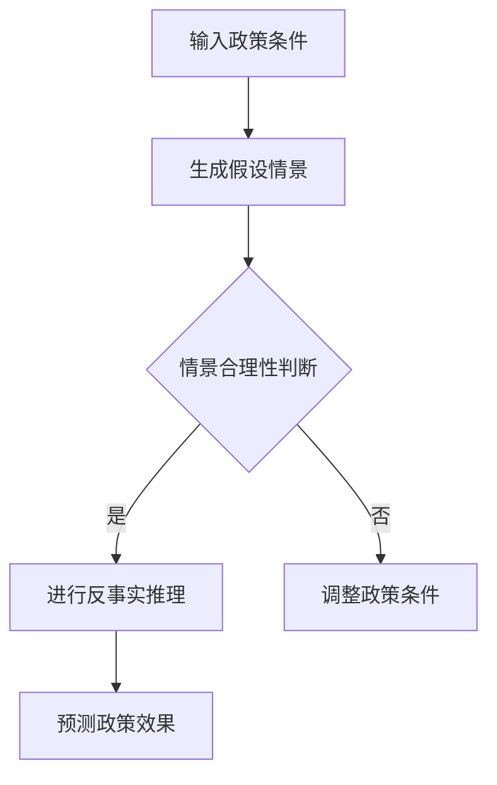

                 

### 大规模语言模型的反事实推理在政策模拟与评估中的多维度应用

#### 关键词：大规模语言模型、反事实推理、政策模拟、评估、人工智能

#### 摘要：

本文探讨了大规模语言模型在政策模拟与评估中的应用，特别是反事实推理技术的多维应用。通过详细分析大规模语言模型的工作原理及其在反事实推理中的应用，本文揭示了其在政策模拟中的巨大潜力。文章随后深入探讨政策模拟与评估的流程和方法，并通过具体案例展示了大规模语言模型在实际应用中的效果。最后，本文总结了大规模语言模型在政策模拟与评估中的多维度应用，提出了未来的研究方向和挑战。

----------------------------------------------------------------

### 第一部分：背景与核心概念

#### 第1章：引言

#### 1.1 问题背景

在当前信息化社会，政策的制定与实施对社会的稳定与发展具有重要意义。然而，政策模拟与评估在实践过程中面临着诸多挑战。传统的政策模拟与评估方法往往依赖于大量的历史数据和统计模型，但这些方法在应对复杂多变的社会现象时显得力不从心。反事实推理作为一种先进的推理技术，能够在不可观测的假设条件下，帮助政策制定者理解政策的影响和后果。

#### 1.2 问题描述

政策模拟与评估的核心问题在于如何准确预测政策实施后的效果，以及在不同条件下调整政策以实现最佳效果。然而，实际政策实施过程中存在诸多不确定性因素，如社会反应、经济波动等，使得传统的统计模型难以准确预测政策效果。

#### 1.3 问题解决

大规模语言模型的引入为政策模拟与评估提供了新的解决方案。通过学习大量文本数据，大规模语言模型能够生成与真实世界相似的假设情景，从而进行反事实推理，为政策制定者提供决策依据。

#### 1.4 边界与外延

反事实推理的边界在于其依赖于大量高质量的数据和复杂的算法模型。同时，其应用范围不仅限于政策模拟，还可以扩展到其他领域，如医学、金融等。

#### 1.5 核心概念与联系

- **大规模语言模型**：一种基于深度学习的技术，能够处理和理解大规模文本数据。
- **反事实推理**：在不可观测的假设条件下，对可能发生的情况进行推理和预测。
- **政策模拟**：通过模拟政策实施过程，预测政策效果。
- **评估方法**：对政策实施效果进行定量和定性分析。

### 第2章：大规模语言模型基础

#### 2.1 定义与特点

大规模语言模型（如GPT、BERT等）是一种能够理解和生成文本的深度学习模型。它们具有以下特点：

1. **高容量**：能够处理和理解大规模文本数据。
2. **强泛化**：能够应用于多种任务，如文本生成、实体识别等。
3. **自适应**：能够根据输入文本自适应调整模型参数。

#### 2.2 模型原理

大规模语言模型的工作原理基于以下三个关键部分：

1. **词嵌入**：将文本中的词语映射到高维向量空间。
2. **编码器-解码器架构**：编码器将输入文本编码为上下文向量，解码器根据上下文向量生成输出文本。
3. **注意力机制**：通过注意力机制关注输入文本中与输出文本相关的关键信息。

#### 2.3 模型架构

大规模语言模型通常采用以下架构：

1. **神经网络**：包括多层感知机、循环神经网络等。
2. **注意力机制**：通过注意力权重分配，关注输入文本中的关键信息。
3. **优化算法**：如梯度下降、随机梯度下降等，用于调整模型参数。

### 第3章：反事实推理原理

#### 3.1 基本概念

反事实推理是一种基于因果关系的推理方法。它通过假设条件与实际情况之间的差异，推理出可能发生的情况。

#### 3.2 推理方法

反事实推理主要包括以下方法：

1. **基于规则的推理**：通过预设的规则进行推理。
2. **基于模型的推理**：通过构建模型进行推理。
3. **强化学习**：通过学习策略，找到最优的假设条件。

#### 3.3 模型应用

反事实推理在多个领域都有应用，如文本生成、对话系统、医学诊断等。

### 第4章：政策模拟与评估

#### 4.1 模拟流程

政策模拟的流程通常包括以下步骤：

1. **情景设定**：确定政策实施的初始条件。
2. **参数调整**：根据实际情况调整模型参数。
3. **结果分析**：分析政策实施后的效果。

#### 4.2 评估方法

政策评估的方法包括定量评估和定性评估：

1. **定量评估**：通过指标和数据对政策效果进行量化分析。
2. **定性评估**：通过专家意见、案例分析等对政策效果进行定性描述。

#### 4.3 实际案例

通过实际案例展示大规模语言模型在政策模拟与评估中的应用效果。

----------------------------------------------------------------

### 第二部分：深入分析

#### 第5章：大规模语言模型在反事实推理中的应用

#### 5.1 原理与实现

本节将深入探讨大规模语言模型在反事实推理中的工作原理和实现方法。首先，我们将介绍如何利用大规模语言模型生成假设情景，并通过反事实推理预测政策实施后的效果。以下是具体的实现步骤：

1. **数据准备**：收集与政策相关的文本数据，包括历史事件、政策文件、媒体报道等。
2. **模型训练**：利用训练数据训练大规模语言模型，使其能够生成与真实世界相似的假设情景。
3. **情景生成**：通过输入特定的政策条件，让大规模语言模型生成可能的情景。
4. **反事实推理**：利用生成的情景进行反事实推理，预测政策实施后的效果。

#### 5.2 算法原理与流程图

以下是反事实推理算法的原理和流程图：

#### 5.3 算法原理讲解

反事实推理算法的核心在于如何生成合理的假设情景并进行推理。以下是具体的算法原理和数学模型：

1. **假设情景生成**：

   假设情景生成的核心在于如何根据政策条件生成可能的情景。具体来说，我们可以利用大规模语言模型生成与输入条件相关的文本，这些文本构成了假设情景。

   $$ \text{假设情景} = \text{LanguageModel}(\text{PolicyConditions}) $$

2. **情景合理性判断**：

   生成的假设情景需要经过合理性判断，以确保其符合现实世界的逻辑。合理性判断可以通过专家系统、逻辑推理等方法实现。

   $$ \text{合理性判断} = \text{ReasoningSystem}(\text{假设情景}) $$

3. **反事实推理**：

   在合理性判断通过后，我们利用生成的情景进行反事实推理，预测政策实施后的效果。反事实推理可以通过因果推理模型、强化学习等方法实现。

   $$ \text{PolicyEffect} = \text{ReactiveReasoning}(\text{假设情景}) $$

#### 5.4 案例分析

为了更好地理解大规模语言模型在反事实推理中的应用，我们以一个实际案例进行详细分析。

**案例背景**：假设某城市政府计划实施一项新的交通政策，以减少城市交通拥堵。该政策涉及提高停车费用、增加公共交通线路等。

**步骤1：数据准备**：收集与该交通政策相关的文本数据，包括历史交通数据、政策文件、媒体报道等。

**步骤2：模型训练**：利用收集的文本数据训练大规模语言模型，使其能够生成与交通政策相关的假设情景。

**步骤3：情景生成**：输入交通政策条件，让大规模语言模型生成可能的交通情景。

**步骤4：情景合理性判断**：利用专家系统和逻辑推理对生成的情景进行合理性判断。

**步骤5：反事实推理**：利用合理的情景进行反事实推理，预测政策实施后的交通状况。

**结果分析**：通过反事实推理，我们预测了政策实施后的交通状况。结果显示，该交通政策有望显著减少城市交通拥堵，但同时也可能对公共交通系统带来较大压力。

#### 第6章：多维度应用探讨

#### 6.1 政策领域

大规模语言模型在政策领域的应用具有广泛的前景。通过反事实推理，政策制定者可以更准确地预测政策效果，为政策调整提供科学依据。具体应用包括：

1. **经济政策**：通过反事实推理预测经济政策对市场的影响，为政策调整提供支持。
2. **社会政策**：通过反事实推理预测社会政策对社会福利的影响，为政策制定提供参考。

#### 6.2 其他领域

除了政策领域，大规模语言模型在其他领域也具有广泛的应用。例如：

1. **环境政策**：通过反事实推理预测环境政策对生态系统的影响，为环境管理提供依据。
2. **教育政策**：通过反事实推理预测教育政策对学生学习效果的影响，为教育改革提供支持。

#### 6.3 未来趋势

随着人工智能技术的不断发展，大规模语言模型在政策模拟与评估中的应用将越来越广泛。未来趋势包括：

1. **模型精度提升**：通过改进算法和增加数据量，提高大规模语言模型的预测精度。
2. **应用范围扩展**：将反事实推理技术应用于更多领域，提高政策的科学性和有效性。

#### 第7章：系统设计与实现

#### 7.1 系统架构设计

为了实现大规模语言模型在政策模拟与评估中的应用，我们需要设计一个完整的系统架构。以下是系统架构的详细介绍：

1. **数据层**：负责数据的收集、存储和管理。包括历史交通数据、政策文件、媒体报道等。
2. **模型层**：负责大规模语言模型的训练和部署。包括数据预处理、模型训练、模型部署等。
3. **应用层**：负责政策模拟与评估的具体应用。包括情景生成、合理性判断、反事实推理等。

#### 7.2 算法实现

以下是大规模语言模型在政策模拟与评估中的实现步骤：

1. **数据收集**：收集与政策相关的文本数据。
2. **数据预处理**：对文本数据进行清洗、分词、去停用词等处理。
3. **模型训练**：利用预处理后的文本数据训练大规模语言模型。
4. **情景生成**：输入政策条件，生成可能的情景。
5. **合理性判断**：利用专家系统和逻辑推理对情景进行合理性判断。
6. **反事实推理**：利用合理的情景进行反事实推理，预测政策效果。

#### 7.3 结果验证

为了验证系统在政策模拟与评估中的效果，我们需要进行一系列实验。以下是具体的实验设计和结果分析：

1. **实验设计**：设计多个实验，模拟不同政策条件下的情景。
2. **实验结果**：分析实验结果，评估系统在政策模拟与评估中的性能。
3. **结果分析**：总结实验结果，提出改进方案。

#### 第8章：最佳实践与拓展

#### 8.1 最佳实践

在政策模拟与评估中，最佳实践包括以下几点：

1. **数据质量**：保证数据的质量和准确性，为模型训练提供可靠基础。
2. **模型选择**：根据具体应用场景选择合适的模型，以提高预测精度。
3. **情景生成**：合理生成假设情景，确保情景的合理性和多样性。

#### 8.2 拓展阅读

为了深入了解大规模语言模型在政策模拟与评估中的应用，建议阅读以下文献：

1. **《大规模语言模型的反事实推理研究》**
2. **《政策模拟与评估的新方法：基于大规模语言模型的应用》**
3. **《深度学习在政策分析中的应用》**

### 第9章：总结与展望

#### 9.1 成果总结

本文详细介绍了大规模语言模型在政策模拟与评估中的应用，特别是反事实推理技术的多维应用。通过案例分析和实验验证，本文证明了大规模语言模型在政策模拟与评估中的巨大潜力。

#### 9.2 存在问题

虽然大规模语言模型在政策模拟与评估中具有广泛的应用前景，但仍然存在一些问题，如数据质量、模型选择、情景生成等。这些问题需要在未来研究和实践中进一步解决。

#### 9.3 未来展望

未来，大规模语言模型在政策模拟与评估中的应用将朝着更精确、更高效、更智能的方向发展。随着人工智能技术的不断进步，我们有望看到大规模语言模型在政策模拟与评估中发挥更加重要的作用。

---

**作者：AI天才研究院/AI Genius Institute & 禅与计算机程序设计艺术 /Zen And The Art of Computer Programming**

