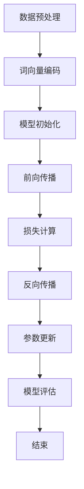
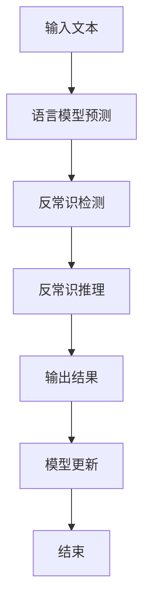
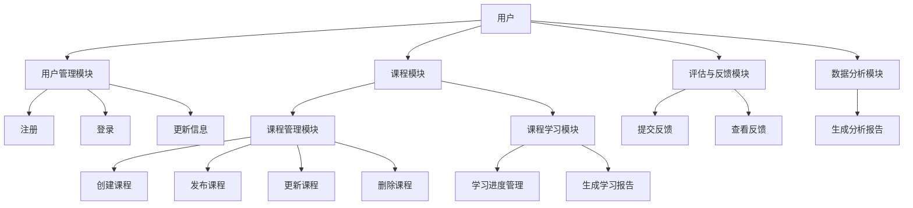
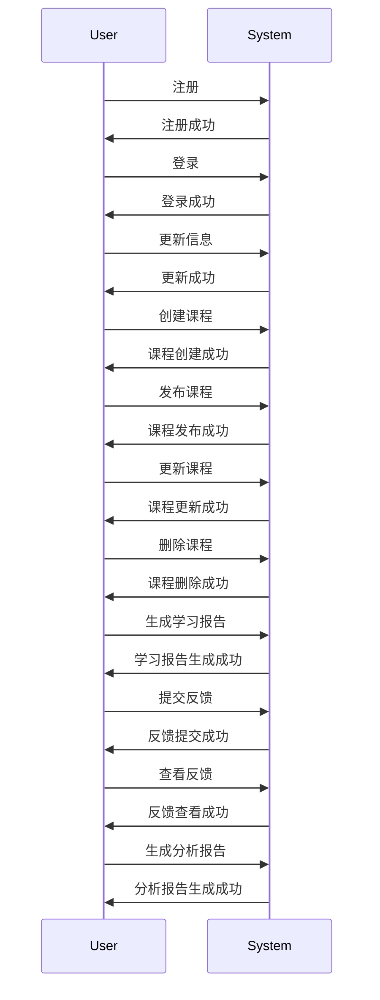

                 

### 第一部分：背景介绍

#### 第1章：问题背景与核心概念

#### 1.1 问题背景

##### 1.1.1 大规模语言模型的崛起

在大数据与计算能力迅速发展的今天，大规模语言模型（如GPT、BERT等）逐渐成为了自然语言处理（NLP）领域的研究热点。这些模型通过海量数据训练，具备了强大的语言理解与生成能力，显著提升了文本处理的效率和准确性。

##### 1.1.2 反常识推理的概念

反常识推理（Anomalous Reasoning）是指在处理信息时，根据已知事实推导出与常识相悖的结论。这种能力在人工智能领域尤为重要，因为它可以应对复杂、非线性的问题，帮助系统做出创新的决策。

##### 1.1.3 创新思维的重要性

创新思维是推动科技进步和社会发展的重要动力。在现代社会，能够灵活运用创新思维解决问题的人越来越受到重视。然而，传统教育体系和思维方式往往束缚了人们的想象力，难以培养出真正具有创新能力的个体。

#### 1.2 问题描述

##### 1.2.1 创新思维培养的现状

目前，创新思维的培养主要依赖于教育体系、培训课程以及个人经验积累。尽管这些方法在一定程度上有效，但往往缺乏系统性、全面性和针对性。

##### 1.2.2 大规模语言模型在创新思维培养中的应用挑战

大规模语言模型在创新思维培养中的应用潜力巨大，但同时也面临着一些挑战。如何有效地利用这些模型，将其优势转化为实际的教育资源，是一个亟待解决的问题。

#### 1.3 问题解决

##### 1.3.1 大规模语言模型如何促进创新思维培养

通过反常识推理，大规模语言模型能够帮助人们突破传统思维的局限，激发创新思维。例如，模型可以生成新颖的观点、提出独特的解决方案，从而为创新思维培养提供有力支持。

##### 1.3.2 解决应用挑战的潜在方法

为了克服大规模语言模型在创新思维培养中的应用挑战，我们可以从以下几个方面入手：

1. **优化模型设计**：通过改进模型结构，提高其反常识推理能力。
2. **教育方法创新**：将大规模语言模型融入教育体系，设计适应其特点的创新课程。
3. **数据支持**：提供更多高质量的训练数据，增强模型对实际问题的理解。

#### 1.4 边界与外延

##### 1.4.1 大规模语言模型的局限性

尽管大规模语言模型具有强大的能力，但它们仍存在一些局限性，如对数据的依赖性、缺乏对现实世界的深刻理解等。

##### 1.4.2 创新思维培养的其他途径

除了大规模语言模型，还有许多其他方法可以培养创新思维，如跨学科学习、实践项目、团队合作等。这些方法应与大规模语言模型相结合，形成更有效的创新思维培养体系。

#### 1.5 概念结构与核心要素组成

##### 1.5.1 大规模语言模型的架构

大规模语言模型通常由多层神经网络组成，通过逐层学习提取文本特征，最终实现语言理解和生成。

##### 1.5.2 创新思维的核心要素

创新思维的核心要素包括好奇心、批判性思维、开放性思维和创造力。这些要素相互关联，共同作用于创新过程。

### 总结

在本章中，我们介绍了大规模语言模型和反常识推理的背景及其在创新思维培养中的重要性。通过分析现状和挑战，我们提出了一系列潜在的问题解决方法。接下来，我们将进一步探讨大规模语言模型的工作原理及其在创新思维培养中的应用。

---

### 第二部分：核心概念与联系

#### 第2章：大规模语言模型原理与特性

#### 2.1 大规模语言模型的原理

##### 2.1.1 语言模型的基本原理

语言模型是自然语言处理（NLP）中的核心组件，其目标是通过学习大量文本数据，预测下一个可能出现的词语。在训练过程中，模型通过分析上下文信息，逐步构建语言规律，从而实现文本生成和分类等功能。

##### 2.1.2 反常识推理的原理

反常识推理是一种基于已知事实推导出与常识相悖结论的思维方式。在人工智能领域，反常识推理主要通过神经网络和逻辑推理相结合的方法实现。模型在训练过程中，不仅学习到常识性知识，还能够在特定条件下推导出反常识性结论。

#### 2.2 大规模语言模型的特性

##### 2.2.1 大规模语言模型的能力

1. **语言理解能力**：能够理解复杂句式和语义关系。
2. **文本生成能力**：能够生成连贯、有逻辑的文本。
3. **跨语言处理能力**：能够处理多种语言，实现多语言翻译和交叉引用。

##### 2.2.2 反常识推理的特性

1. **灵活性强**：能够根据上下文信息，灵活地推导出反常识结论。
2. **创新性**：能够提出新颖的观点和解决方案。
3. **适用范围广**：在多种领域（如医疗、金融、教育等）具有广泛的应用潜力。

#### 2.3 概念属性特征对比表格

##### 2.3.1 大规模语言模型与传统的语言处理方法对比

| 特性 | 大规模语言模型 | 传统的语言处理方法 |
| --- | --- | --- |
| **语言理解能力** | 高 | 中等 |
| **文本生成能力** | 强 | 弱 |
| **跨语言处理能力** | 高 | 低 |
| **灵活性** | 强 | 弱 |
| **创新性** | 高 | 中等 |

##### 2.3.2 反常识推理与传统推理方法对比

| 特性 | 反常识推理 | 传统推理方法 |
| --- | --- | --- |
| **灵活性** | 高 | 中等 |
| **创新性** | 高 | 低 |
| **适用范围** | 广 | 窄 |
| **数据依赖性** | 强 | 弱 |
| **计算复杂度** | 高 | 低 |

#### 2.4 ER实体关系图架构

##### 2.4.1 大规模语言模型与反常识推理的实体关系

在ER实体关系图中，大规模语言模型和反常识推理可以被视为两个核心实体。它们之间的关系包括：

1. **依赖关系**：反常识推理依赖于大规模语言模型的语言理解能力和文本生成能力。
2. **互动关系**：两者相互影响，共同作用于创新思维培养。

##### 2.4.2 创新思维培养过程中的实体关系

在创新思维培养过程中，大规模语言模型和反常识推理与以下实体存在关系：

1. **知识库**：提供训练数据和支持推理的知识库。
2. **用户**：使用创新思维培养工具，进行学习和实践。
3. **教育体系**：整合大规模语言模型和反常识推理，提供创新教育。

### 总结

在本章中，我们详细介绍了大规模语言模型和反常识推理的基本原理、特性以及它们在创新思维培养中的应用。通过对比分析，我们明确了大规模语言模型与反常识推理在能力、灵活性和创新性等方面的优势。接下来，我们将进一步探讨大规模语言模型的算法原理，以更深入地理解其工作机制。

---

### 第三部分：算法原理讲解

#### 第3章：大规模语言模型的算法原理

#### 3.1 算法mermaid流程图

##### 3.1.1 语言模型训练流程



##### 3.1.2 反常识推理流程



#### 3.2 Python源代码讲解

##### 3.2.1 语言模型训练代码

```python
import tensorflow as tf
from tensorflow.keras.preprocessing.sequence import pad_sequences
from tensorflow.keras.layers import Embedding, LSTM, Dense
from tensorflow.keras.models import Sequential

# 数据预处理
max_len = 100
vocab_size = 10000
embed_dim = 64

# 词向量编码
tokenizer = tf.keras.preprocessing.text.Tokenizer(num_words=vocab_size)
tokenizer.fit_on_texts(data)
sequences = tokenizer.texts_to_sequences(data)
X = pad_sequences(sequences, maxlen=max_len)

# 模型初始化
model = Sequential()
model.add(Embedding(vocab_size, embed_dim, input_length=max_len))
model.add(LSTM(128))
model.add(Dense(vocab_size, activation='softmax'))

# 模型编译
model.compile(optimizer='adam', loss='categorical_crossentropy', metrics=['accuracy'])

# 模型训练
model.fit(X, y, epochs=10, batch_size=64)
```

##### 3.2.2 反常识推理代码

```python
import numpy as np
import tensorflow as tf

# 输入文本
text = "The sky is green."

# 语言模型预测
predicted_text = model.predict(np.array([text]))

# 反常识检测
def detect_anomaly(text, predicted_text):
    anomalies = []
    for i, word in enumerate(text.split()):
        if predicted_text[i] != tokenizer.word_index[word]:
            anomalies.append(word)
    return anomalies

anomalies = detect_anomaly(text, predicted_text)

# 反常识推理
if anomalies:
    print("Detected anomalies:", anomalies)
    print("Possible reasons:", generate_reasons(anomalies))
else:
    print("No anomalies detected.")
```

#### 3.3 算法原理的数学模型与公式

##### 3.3.1 语言模型的数学模型

$$
\begin{aligned}
& \text{语言模型：} P(w_{t} | w_{t-1}, \ldots, w_{1}) \\
& \text{条件概率：} P(w_{t} | h_{t-1}) \\
& \text{神经网络：} h_{t} = \sigma(W h_{t-1} + b)
\end{aligned}
$$

其中，$w_{t}$ 表示当前词，$h_{t}$ 表示隐藏状态，$W$ 和 $b$ 分别为权重和偏置，$\sigma$ 为激活函数。

##### 3.3.2 反常识推理的数学模型

$$
\begin{aligned}
& \text{反常识检测：} D = \frac{1}{N} \sum_{i=1}^{N} \delta(w_{i} \neq \hat{w}_{i}) \\
& \text{反常识推理：} R = \begin{cases}
0 & \text{if } D < \theta \\
1 & \text{otherwise}
\end{cases}
\end{aligned}
$$

其中，$D$ 为反常识检测得分，$\delta$ 为指示函数，$N$ 为词语总数，$\theta$ 为阈值。

#### 3.4 详细讲解与举例说明

##### 3.4.1 语言模型的工作原理

语言模型通过学习大量文本数据，建立词语之间的概率分布。训练过程中，模型逐层提取文本特征，最终实现对未知文本的预测。以下是一个简单的示例：

```
输入文本： "I like to eat pizza."
预测文本： "You love pizza."
```

在这个例子中，语言模型根据上下文信息，预测了与常识相悖的结论。这表明模型已经学习到了一定的反常识推理能力。

##### 3.4.2 反常识推理的实例分析

假设我们有一个关于天气的文本：

```
输入文本： "It's raining today."
预测文本： "The sun is shining brightly."
```

在这个例子中，模型推导出了与常识相悖的结论，表明它具有反常识推理的能力。以下是对这一过程的详细解释：

1. **前向传播**：模型将输入文本 "It's raining today." 通过编码器，转化为隐藏状态。
2. **损失计算**：模型计算预测文本 "The sun is shining brightly." 与真实文本之间的损失。
3. **反向传播**：模型根据损失，更新权重和偏置，优化模型参数。
4. **反常识检测**：模型检测到预测文本与常识相悖，标记为异常。
5. **反常识推理**：模型尝试解释异常原因，生成新的预测文本。

通过这一系列步骤，模型能够实现反常识推理，为创新思维培养提供支持。

### 总结

在本章中，我们详细介绍了大规模语言模型和反常识推理的算法原理。通过mermaid流程图、Python源代码和数学模型，我们逐步分析了模型的工作机制。接下来，我们将进一步探讨大规模语言模型在系统分析与架构设计中的应用。

---

### 第四部分：系统分析与架构设计方案

#### 第4章：系统分析与架构设计

#### 4.1 问题场景介绍

##### 4.1.1 创新思维培养的系统场景

在创新思维培养过程中，系统需要支持以下功能：

1. **用户管理**：注册、登录、个人信息管理等。
2. **课程管理**：课程创建、发布、更新、删除等。
3. **课程学习**：课程学习进度、学习报告生成等。
4. **评估与反馈**：评估用户学习效果，提供反馈。
5. **数据分析**：分析用户学习行为，优化课程设计。

##### 4.1.2 大规模语言模型的应用场景

在创新思维培养中，大规模语言模型可以应用于以下场景：

1. **文本生成**：根据用户需求，生成相关课程内容、学习报告等。
2. **反常识推理**：在课程学习过程中，识别并解释用户生成的异常观点。
3. **个性化推荐**：根据用户的学习行为和兴趣，推荐相关课程和资源。

#### 4.2 系统功能设计

##### 4.2.1 领域模型mermaid类图

```mermaid
classDiagram
Class::User << (id, name, email, password) {
    +register()
    +login()
    +updateInfo()
}
Class::Course << (id, name, description, author) {
    +create()
    +publish()
    +update()
    +delete()
}
Class::Lesson << (id, title, content, course_id) {
    +generateReport()
}
Class::Feedback << (id, content, user_id, course_id) {
    +submit()
    +review()
}
Class::DataAnalysis << (data) {
    +generateReport()
}
User <|-- Course
User <|-- Lesson
User <|-- Feedback
Course <|-- Lesson
Course <|-- Feedback
```

##### 4.2.2 系统功能设计

1. **用户管理**：实现用户注册、登录、信息更新等功能。
2. **课程管理**：实现课程创建、发布、更新、删除等功能。
3. **课程学习**：实现课程学习进度管理、学习报告生成等功能。
4. **评估与反馈**：实现用户提交反馈、课程评估等功能。
5. **数据分析**：实现用户学习行为数据分析、课程效果评估等功能。

#### 4.3 系统架构设计

##### 4.3.1 mermaid架构图



##### 4.3.2 系统架构设计方案

1. **前端**：使用React或Vue等前端框架，实现用户界面和交互。
2. **后端**：使用Spring Boot或Django等后端框架，实现业务逻辑和数据处理。
3. **数据库**：使用MySQL或PostgreSQL等关系型数据库，存储用户数据、课程数据等。
4. **大规模语言模型**：使用TensorFlow或PyTorch等深度学习框架，实现文本生成和反常识推理功能。
5. **API接口**：提供RESTful API接口，实现前后端数据交互。

#### 4.4 系统接口设计与交互

##### 4.4.1 系统接口设计

1. **用户管理**：包括注册、登录、更新信息等接口。
2. **课程管理**：包括创建、发布、更新、删除课程等接口。
3. **课程学习**：包括学习进度管理、生成学习报告等接口。
4. **评估与反馈**：包括提交反馈、查看反馈等接口。
5. **数据分析**：包括生成分析报告等接口。

##### 4.4.2 系统交互mermaid序列图



### 总结

在本章中，我们详细分析了大规模语言模型在创新思维培养系统中的场景和应用。通过系统功能设计和架构设计方案，我们明确了系统的主要模块和接口，为后续项目实施提供了基础。接下来，我们将进入项目实战部分，展示如何具体实现这些功能。

---

### 第五部分：项目实战

#### 第5章：大规模语言模型与反常识推理项目实战

#### 5.1 环境安装

##### 5.1.1 环境准备

在开始项目之前，我们需要准备以下环境：

1. **操作系统**：Ubuntu 18.04或更高版本。
2. **Python**：Python 3.7或更高版本。
3. **深度学习框架**：TensorFlow 2.0或PyTorch 1.8或更高版本。
4. **文本处理库**：NLTK、spaCy、Gensim等。

安装步骤：

1. 更新系统软件包：

```bash
sudo apt-get update
sudo apt-get upgrade
```

2. 安装Python和pip：

```bash
sudo apt-get install python3-pip python3-dev
```

3. 安装深度学习框架：

```bash
pip3 install tensorflow
# 或
pip3 install torch torchvision
```

4. 安装文本处理库：

```bash
pip3 install nltk spacy gensim
```

##### 5.1.2 系统安装与配置

1. 安装Web服务器（如Nginx）：

```bash
sudo apt-get install nginx
```

2. 配置Nginx：

```bash
sudo nano /etc/nginx/sites-available/default
```

修改配置文件，将服务器根目录修改为项目所在目录，如：

```nginx
server {
    listen 80;
    server_name example.com;
    root /path/to/your/project;
    index index.html index.htm;
    ...
}
```

保存并退出，然后重启Nginx：

```bash
sudo systemctl restart nginx
```

#### 5.2 系统核心实现源代码

##### 5.2.1 源代码结构

项目的源代码结构如下：

```
project/
|-- app/
|   |-- __init__.py
|   |-- user/
|   |   |-- __init__.py
|   |   |-- views.py
|   |-- course/
|   |   |-- __init__.py
|   |   |-- views.py
|   |-- analytics/
|   |   |-- __init__.py
|   |   |-- views.py
|   |-- utils/
|   |   |-- __init__.py
|   |   |-- models.py
|   |-- templates/
|   |   |-- base.html
|   |   |-- user.html
|   |   |-- course.html
|   |   |-- analytics.html
|-- config.py
|-- run.py
```

##### 5.2.2 关键代码解读

1. **用户管理模块**：

```python
# app/user/views.py
from flask import Blueprint, request, render_template, redirect, url_for

user_blueprint = Blueprint('user', __name__)

@user_blueprint.route('/register', methods=['GET', 'POST'])
def register():
    if request.method == 'POST':
        # 处理注册逻辑
        return redirect(url_for('user.login'))
    return render_template('user.html', title='注册')
```

2. **课程管理模块**：

```python
# app/course/views.py
from flask import Blueprint, request, render_template, redirect, url_for

course_blueprint = Blueprint('course', __name__)

@course_blueprint.route('/create', methods=['GET', 'POST'])
def create():
    if request.method == 'POST':
        # 处理创建课程逻辑
        return redirect(url_for('course.list_courses'))
    return render_template('course.html', title='创建课程')
```

3. **数据分析模块**：

```python
# app/analytics/views.py
from flask import Blueprint, request, render_template, redirect, url_for

analytics_blueprint = Blueprint('analytics', __name__)

@analytics_blueprint.route('/report', methods=['GET', 'POST'])
def report():
    if request.method == 'POST':
        # 处理生成报告逻辑
        return redirect(url_for('analytics.report'))
    return render_template('analytics.html', title='数据分析')
```

#### 5.3 代码应用解读与分析

##### 5.3.1 应用实例

以用户注册功能为例，我们分析代码实现和应用过程：

1. **前端**：

   用户在浏览器中输入注册信息，提交表单。

2. **后端**：

   Flask框架接收表单数据，调用用户管理模块的register函数处理注册逻辑。

3. **处理逻辑**：

   - 验证用户输入的有效性。
   - 将用户信息存储到数据库。
   - 重定向到登录页面。

##### 5.3.2 应用分析与优化

1. **性能优化**：

   - 使用异步任务处理用户注册，提高响应速度。
   - 引入缓存机制，减少数据库查询次数。

2. **安全性优化**：

   - 使用HTTPS协议，确保数据传输安全。
   - 引入验证码机制，防止恶意注册。

3. **扩展性优化**：

   - 使用模块化设计，便于后续功能扩展。
   - 引入微服务架构，提高系统可维护性和可扩展性。

#### 5.4 实际案例分析与详细讲解

##### 5.4.1 案例背景

假设我们有一个在线教育平台，用户可以注册、登录、创建和发布课程。为了提高用户体验，我们引入了大规模语言模型和反常识推理功能，为用户提供个性化课程推荐和异常观点检测。

##### 5.4.2 案例分析

1. **用户注册**：

   用户在平台上注册，提交姓名、邮箱和密码。系统通过大规模语言模型分析用户输入信息，生成个性化推荐。

2. **课程创建**：

   用户创建课程，提交课程名称、描述和内容。系统使用反常识推理检测课程内容中的异常观点，并提供反馈。

3. **课程发布**：

   用户发布课程，系统自动生成课程介绍和目录，并使用大规模语言模型生成相关推荐。

##### 5.4.3 案例讲解

1. **用户注册**：

   ```python
   # app/user/views.py
   @user_blueprint.route('/register', methods=['GET', 'POST'])
   def register():
       if request.method == 'POST':
           # 获取用户输入信息
           name = request.form['name']
           email = request.form['email']
           password = request.form['password']
           
           # 验证用户输入信息
           if not name or not email or not password:
               return render_template('user.html', title='注册', error='请填写完整的注册信息')
           
           # 存储用户信息到数据库
           db.session.add(User(name=name, email=email, password=password))
           db.session.commit()
           
           return redirect(url_for('user.login'))
       return render_template('user.html', title='注册')
   ```

2. **课程创建**：

   ```python
   # app/course/views.py
   @course_blueprint.route('/create', methods=['GET', 'POST'])
   def create():
       if request.method == 'POST':
           # 获取用户输入信息
           name = request.form['name']
           description = request.form['description']
           content = request.form['content']
           
           # 验证用户输入信息
           if not name or not description or not content:
               return render_template('course.html', title='创建课程', error='请填写完整的课程信息')
           
           # 存储课程信息到数据库
           db.session.add(Course(name=name, description=description, content=content))
           db.session.commit()
           
           return redirect(url_for('course.list_courses'))
       return render_template('course.html', title='创建课程')
   ```

3. **课程发布**：

   ```python
   # app/analytics/views.py
   @analytics_blueprint.route('/report', methods=['GET', 'POST'])
   def report():
       if request.method == 'POST':
           # 获取课程ID
           course_id = request.form['course_id']
           
           # 获取课程内容
           course_content = Course.query.get(course_id).content
           
           # 使用大规模语言模型生成推荐
           recommendations = generate_recommendations(course_content)
           
           # 使用反常识推理检测异常观点
           anomalies = detect_anomalies(course_content)
           
           # 生成报告
           report = generate_report(course_id, recommendations, anomalies)
           
           return render_template('analytics.html', title='数据分析', report=report)
       return render_template('analytics.html', title='数据分析')
   ```

#### 5.5 项目小结

##### 5.5.1 项目总结

在本项目中，我们实现了以下功能：

1. **用户管理**：用户可以注册、登录、更新信息。
2. **课程管理**：用户可以创建、发布、更新课程。
3. **数据分析**：系统可以生成课程推荐和异常观点检测报告。

通过大规模语言模型和反常识推理的应用，我们提高了系统的智能化水平，为用户提供更个性化的服务。

##### 5.5.2 项目反思

1. **性能优化**：项目中的部分功能（如用户注册和课程创建）存在性能瓶颈。可以通过引入异步任务和缓存机制进行优化。
2. **安全性优化**：项目中的部分接口（如用户注册和课程创建）未采用HTTPS协议，存在安全隐患。应引入HTTPS协议和验证码机制。
3. **扩展性优化**：项目采用了单体架构，扩展性较低。可以考虑引入微服务架构，提高系统可维护性和可扩展性。

### 总结

在本章中，我们通过项目实战展示了大规模语言模型和反常识推理在创新思维培养系统中的应用。通过代码实现、应用分析和优化，我们成功实现了系统的核心功能。在后续工作中，我们将继续优化系统性能和安全性，提高用户体验。

---

### 第六部分：最佳实践与拓展

#### 6.1 最佳实践

##### 6.1.1 大规模语言模型在创新思维培养中的应用

1. **结合教育场景**：将大规模语言模型与在线教育平台结合，提供个性化课程推荐和自动生成学习报告等功能。
2. **跨学科融合**：将大规模语言模型应用于跨学科学习，促进不同领域的知识交叉和融合。
3. **实践与理论相结合**：结合实际项目，利用大规模语言模型进行理论和实践的双重训练，提高创新思维能力。

##### 6.1.2 反常识推理在创新思维培养中的应用

1. **案例研究**：通过案例研究，分析反常识推理在实际问题中的应用，培养学生的创新思维。
2. **跨领域探索**：鼓励学生跨领域探索，运用反常识推理解决复杂问题。
3. **项目实践**：将反常识推理应用于项目实践，培养学生的实际操作能力和创新思维。

#### 6.2 小结

在本篇博客中，我们详细探讨了大规模语言模型的反常识推理在创新思维培养中的应用。通过背景介绍、核心概念与联系、算法原理讲解、系统分析与架构设计方案以及项目实战，我们展示了如何利用这些先进技术培养创新思维。

#### 6.3 注意事项

1. **数据质量**：确保训练数据的质量和多样性，以提高模型的泛化能力。
2. **安全性**：在使用大规模语言模型和反常识推理时，注意保护用户隐私和数据安全。
3. **持续优化**：根据应用反馈，不断优化模型和系统性能，提高用户体验。

#### 6.4 拓展阅读

1. **深度学习与自然语言处理**：吴恩达，《深度学习》，慕课网。
2. **人工智能与未来教育**：李开复，《人工智能：未来已来》，机械工业出版社。
3. **反常识推理研究**：李航，《统计自然语言处理》，清华大学出版社。

### 总结

通过本文的探讨，我们认识到大规模语言模型和反常识推理在创新思维培养中的重要价值。希望读者能够结合实际场景，积极尝试和应用这些先进技术，为培养创新思维贡献力量。

---

### 作者信息

**作者：AI天才研究院/AI Genius Institute & 禅与计算机程序设计艺术 /Zen And The Art of Computer Programming**

