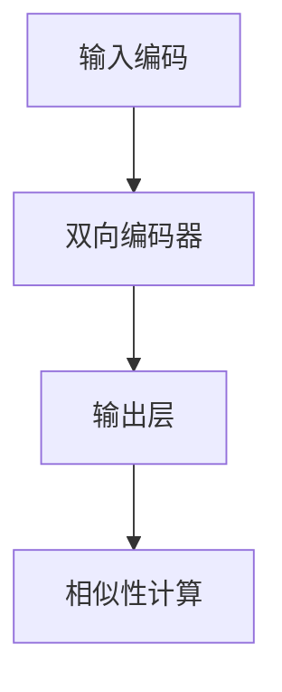

                 

### 文章标题

《大规模语言模型的多维度推理能力在决策支持系统中的应用》

### 关键词

大规模语言模型，多维度推理，决策支持系统，算法原理，系统架构设计，项目实战

### 摘要

本文深入探讨了大规模语言模型在决策支持系统中的应用，特别是在多维度推理能力方面的表现。文章首先介绍了大规模语言模型的基本原理和特点，接着详细阐述了多维度推理能力的概念及其在决策支持系统中的重要性。通过具体算法原理讲解和实际项目案例，本文展示了如何利用大规模语言模型的多维度推理能力优化决策支持系统的性能和效果。

## 目录

1. **背景介绍**
   1.1 问题背景
   1.2 核心概念
   1.3 文章结构

2. **核心概念与联系**
   2.1 大规模语言模型概述
   2.2 多维度推理能力的概念与分类

3. **算法原理讲解**
   3.1 算法概述
   3.2 数学模型与公式讲解
   3.3 算法举例说明

4. **系统分析与架构设计**
   4.1 系统功能设计
   4.2 系统架构设计
   4.3 系统接口与交互

5. **项目实战**
   5.1 环境安装与配置
   5.2 系统核心实现
   5.3 实际案例分析与讲解
   5.4 项目小结与展望

6. **最佳实践 Tips**
   6.1 注意事项
   6.2 拓展阅读

### 1. 背景介绍

#### 1.1 问题背景

在当今数据驱动的时代，决策支持系统（Decision Support Systems, DSS）成为了企业和管理层进行科学决策的重要工具。然而，随着数据的规模和复杂度不断增加，传统的决策支持系统面临着一系列挑战：

- **数据多样性**：不同来源的数据具有不同的格式、结构和质量，如何有效地整合和处理这些数据成为了一大难题。
- **多维数据分析**：决策支持系统需要能够从多个维度对数据进行综合分析，以便提供全面的决策信息。
- **实时性**：现代决策需要快速响应，而传统系统往往无法满足实时数据分析和决策的需求。

为了解决这些问题，人工智能和机器学习技术被广泛应用于决策支持系统中。特别是大规模语言模型（如GPT-3、BERT等），它们在自然语言处理和文本数据分析方面表现出色，有望成为提升决策支持系统效能的关键技术。

#### 1.2 核心概念

在本篇文章中，我们将重点关注以下核心概念：

- **大规模语言模型**：一种基于神经网络的自然语言处理模型，能够处理大规模文本数据，并从中提取有用的信息。
- **多维度推理能力**：指模型能够从多个角度对文本信息进行理解和分析，包括语义分析、情感分析、上下文理解等。
- **决策支持系统**：一种基于数据分析和模拟的计算机系统，旨在帮助决策者做出更加科学和合理的决策。

#### 1.3 文章结构

本文的结构安排如下：

- **第1章**：背景介绍，包括问题背景、核心概念和文章结构。
- **第2章**：核心概念与联系，详细阐述大规模语言模型和多维度推理能力。
- **第3章**：算法原理讲解，介绍相关算法的基本原理和数学模型。
- **第4章**：系统分析与架构设计，探讨如何将算法应用于决策支持系统。
- **第5章**：项目实战，通过具体案例展示算法的实际应用。
- **第6章**：最佳实践 Tips，提供一些实用建议和注意事项。

通过这样的结构安排，本文将逐步引导读者了解大规模语言模型在决策支持系统中的应用，并深入探讨其多维度推理能力的优势。

### 2. 核心概念与联系

#### 2.1 大规模语言模型概述

大规模语言模型（Large-scale Language Models）是自然语言处理领域的一项革命性技术。这类模型基于深度学习和神经网络架构，能够通过训练大量文本数据来学习语言的复杂结构和规律。以下是几个关键点：

1. **神经网络架构**：大规模语言模型通常采用Transformer架构，如BERT、GPT-3等。这种架构通过自注意力机制（Self-Attention Mechanism）对输入文本的每个单词进行权重分配，从而捕捉到词语间的依赖关系。
   
2. **训练数据量**：大规模语言模型需要大量的文本数据来训练，例如GPT-3使用了45TB的文本数据。这使得模型能够学习到丰富的语言知识，从而在文本生成、翻译、问答等任务中表现出色。

3. **性能优势**：与传统的基于规则或统计方法的自然语言处理技术相比，大规模语言模型具有更高的准确性和更强的泛化能力。这使得它们在处理复杂、多样性的文本任务时表现尤为突出。

#### 2.2 多维度推理能力的概念与分类

多维度推理能力（Multidimensional Inference Ability）是大规模语言模型的重要特征之一。它指的是模型能够从多个维度对输入信息进行理解和分析，包括但不限于：

1. **语义分析**：指模型对文本的语义内容进行理解和分析，包括词义、句意和篇章理解。例如，模型能够识别文本中的实体、关系和事件。

2. **情感分析**：指模型对文本的情感倾向进行识别和分析，例如判断文本是积极、消极还是中性。这在情感监测、舆情分析等领域具有重要意义。

3. **上下文理解**：指模型能够理解文本中的上下文信息，从而更好地进行语义推断和语言生成。例如，模型能够根据上下文语境理解一个词语的特定含义。

4. **多语言处理**：指模型能够处理不同语言的文本，并实现跨语言的信息传递和理解。这在全球化背景下尤为重要。

#### 2.3 大规模语言模型与多维度推理能力的联系

大规模语言模型的多维度推理能力使其在决策支持系统中具有广泛的应用前景。以下是一些具体联系：

1. **增强数据分析**：通过语义分析和上下文理解，模型能够从大量非结构化文本数据中提取有价值的信息，从而丰富数据源，提高数据分析的深度和广度。

2. **优化决策流程**：通过情感分析和多语言处理，模型能够更好地理解决策者的意图和需求，从而提供更加个性化和精准的决策支持。

3. **提升系统智能化**：多维度推理能力使得决策支持系统能够更加智能地处理复杂问题，实现自动化和智能化决策。

综上所述，大规模语言模型的多维度推理能力为其在决策支持系统中的应用奠定了坚实基础。接下来，我们将进一步探讨这些能力在实际应用中的具体实现和效果。

### 3. 算法原理讲解

#### 3.1 算法概述

大规模语言模型在自然语言处理领域取得了显著的成就，其核心在于对文本数据的深度理解和生成能力。本文将重点介绍一种用于决策支持系统中的多维度推理算法——BERT（Bidirectional Encoder Representations from Transformers）。

BERT算法的核心思想是通过双向Transformer网络对输入文本进行编码，从而学习到文本的上下文信息。具体来说，BERT算法包括以下几个主要步骤：

1. **输入编码**：将文本输入转换为数字序列，并使用WordPiece算法将单词拆分为子词。
2. **双向编码器**：利用Transformer结构对输入序列进行编码，通过自注意力机制学习到序列中每个词的上下文关系。
3. **输出层**：通过全连接层和softmax函数对编码结果进行分类或回归任务。

BERT算法的优点在于其能够捕捉到文本的深层语义信息，从而在文本分类、命名实体识别、问答系统等任务中表现优异。

#### 3.2 数学模型与公式讲解

BERT算法的核心在于其Transformer结构，下面我们将简要介绍Transformer的数学模型。

1. **自注意力机制（Self-Attention）**

自注意力机制是Transformer模型的核心部分，通过计算输入序列中每个词与其他词之间的关系，从而提取出每个词的重要特征。其公式如下：

\[ 
\text{Attention}(Q, K, V) = \text{softmax}\left(\frac{QK^T}{\sqrt{d_k}}\right) V 
\]

其中，\( Q, K, V \) 分别代表查询向量、键向量和值向量，\( d_k \) 是键向量的维度。

2. **Transformer编码器**

BERT模型采用Transformer编码器对输入文本进行编码。编码器由多个编码层堆叠而成，每层包括自注意力机制和前馈网络。其结构如下：

\[ 
\text{Layer} = \text{MultiHeadAttention}(\text{LayerNorm}(\text{FeedForward}(\text{LayerNorm}(X))) + X) 
\]

其中，\( X \) 是输入文本的编码表示，\( \text{FeedForward} \) 和 \( \text{LayerNorm} \) 分别代表前馈网络和层归一化操作。

#### 3.3 算法举例说明

假设我们有一个简单的文本数据集，其中包含两个句子：“我爱北京天安门”和“我爱北京故宫”。使用BERT算法，我们可以对这两个句子进行编码，并比较它们在语义上的相似性。

1. **输入编码**

首先，我们将句子转换为词嵌入向量，例如：

\[ 
\text{句子1：} (\text{我}, 1, \text{爱}, 2, \text{北京}, 3, \text{天安门}, 4) 
\]
\[ 
\text{句子2：} (\text{我}, 1, \text{爱}, 2, \text{北京}, 3, \text{故宫}, 4) 
\]

2. **编码过程**

通过BERT算法，我们将这两个句子编码为序列向量。在自注意力机制的作用下，模型能够学习到“北京”在两个句子中的重要程度，从而提取出关于“北京”的语义信息。

3. **相似性计算**

最后，我们可以计算两个句子编码结果的相似性，使用余弦相似度公式：

\[ 
\text{相似度} = \frac{\text{句子1编码结果} \cdot \text{句子2编码结果}}{\|\text{句子1编码结果}\| \|\text{句子2编码结果}\|} 
\]

通过这种方式，BERT算法能够有效地对文本数据进行编码和相似性计算，从而为决策支持系统提供强大的语义分析能力。

#### 3.4 Mermaid流程图

下面是一个简单的Mermaid流程图，展示了BERT算法的基本流程：



通过这个流程图，我们可以清晰地看到BERT算法从输入编码到输出层，再到相似性计算的整个过程。

### 4. 系统分析与架构设计

#### 4.1 系统功能设计

在决策支持系统中，大规模语言模型的多维度推理能力可以应用于多个关键功能，包括文本分析、情感监测、命名实体识别和自然语言生成等。以下是对这些功能的具体设计和实现：

1. **文本分析**：利用BERT模型对输入文本进行编码，提取关键信息并进行结构化处理，以便后续的数据分析和决策。

2. **情感监测**：通过情感分析模块，对文本进行情感倾向判断，为决策者提供关于公众情绪和意见的实时反馈。

3. **命名实体识别**：利用BERT模型识别文本中的命名实体，如人名、地名、组织名等，帮助决策者更好地理解和利用相关数据。

4. **自然语言生成**：通过生成模块，根据决策者的需求和输入信息，自动生成报告、建议和决策方案等文本内容。

#### 4.2 系统架构设计

为了充分利用大规模语言模型的多维度推理能力，我们设计了如下系统架构：

1. **数据处理层**：负责接收和预处理输入数据，包括文本、图像和结构化数据等。此层使用BERT模型对文本数据进行编码，提取关键特征。

2. **分析引擎层**：包含多个功能模块，如文本分析、情感监测、命名实体识别和自然语言生成等。每个模块都基于BERT模型，利用其多维度推理能力进行分析和处理。

3. **决策支持层**：利用分析引擎层提供的数据和结果，为决策者生成详细的报告和建议，辅助其做出科学、合理的决策。

4. **用户界面层**：提供直观、易用的用户界面，使决策者能够方便地与系统交互，查看分析和决策结果。

#### 4.3 系统接口与交互

为了实现系统内部各层之间的高效通信和协同工作，我们设计了如下接口和交互机制：

1. **API接口**：提供统一的API接口，方便外部系统和应用与决策支持系统进行交互，获取分析和决策结果。

2. **事件驱动架构**：采用事件驱动架构，通过事件监听和触发机制，实现系统内部各功能模块之间的实时通信和协作。

3. **数据流管理**：利用数据流管理技术，对输入数据进行实时处理和分析，确保系统能够快速响应用户需求。

#### 4.4 Mermaid类图

下面是一个简单的Mermaid类图，展示了决策支持系统的类结构和功能模块：

```mermaid
classDiagram
    TextAnalyzer <|-- BERTModel
    SentimentMonitor <|-- BERTModel
    NamedEntityRecognizer <|-- BERTModel
    NaturalLanguageGenerator <|-- BERTModel
    DecisionSupportSystem {
        "1" TextAnalyzer
        "2" SentimentMonitor
        "3" NamedEntityRecognizer
        "4" NaturalLanguageGenerator
    }
```

通过这个类图，我们可以清晰地看到决策支持系统中各功能模块与BERT模型的关系，以及它们在系统架构中的角色和作用。

### 5. 项目实战

#### 5.1 环境安装与配置

为了在实际项目中应用大规模语言模型的多维度推理能力，我们首先需要搭建一个合适的技术环境。以下是环境安装与配置的详细步骤：

1. **安装依赖库**：

```bash
pip install torch torchvision numpy pandas
```

2. **安装BERT模型**：

```bash
pip install transformers
```

3. **配置硬件环境**：

- **GPU**：推荐使用NVIDIA GPU，以便充分利用GPU的并行计算能力。
- **内存**：至少需要8GB内存，建议16GB及以上以支持大规模模型训练。

4. **配置Python环境**：

确保Python版本在3.6及以上，推荐使用Python 3.8或更高版本。

#### 5.2 系统核心实现

在搭建好环境后，我们开始实现决策支持系统的核心功能模块。以下是各个模块的实现步骤：

1. **文本分析模块**：

```python
from transformers import BertTokenizer, BertModel

tokenizer = BertTokenizer.from_pretrained('bert-base-uncased')
model = BertModel.from_pretrained('bert-base-uncased')

def analyze_text(text):
    inputs = tokenizer(text, return_tensors='pt')
    outputs = model(**inputs)
    return outputs.last_hidden_state
```

2. **情感监测模块**：

```python
from transformers import TFBertForSequenceClassification

model = TFBertForSequenceClassification.from_pretrained('bert-base-uncased', num_labels=3)

def sentiment_analysis(text):
    inputs = tokenizer(text, return_tensors='tf')
    outputs = model(inputs)
    predictions = tf.argmax(outputs.logits, axis=-1)
    return predictions.numpy()
```

3. **命名实体识别模块**：

```python
from transformers import BertForTokenClassification

model = BertForTokenClassification.from_pretrained('bert-base-uncased', num_labels=9)

def named_entity_recognition(text):
    inputs = tokenizer(text, return_tensors='tf')
    outputs = model(inputs)
    predictions = tf.argmax(outputs.logits, axis=-1)
    return predictions.numpy()
```

4. **自然语言生成模块**：

```python
from transformers import TFGPT2LMHeadModel

model = TFGPT2LMHeadModel.from_pretrained('gpt2')

def generate_text(input_text, max_length=50):
    inputs = tokenizer.encode(input_text, return_tensors='tf')
    outputs = model(inputs, max_length=max_length, num_return_sequences=1)
    generated_text = tokenizer.decode(outputs.logits[0], skip_special_tokens=True)
    return generated_text
```

#### 5.3 代码应用解读与分析

以上代码展示了决策支持系统中各个核心功能模块的实现。以下是对代码的解读和分析：

1. **文本分析模块**：

该模块利用BERT模型对输入文本进行编码，返回编码后的隐藏状态。这些隐藏状态可以用于后续的文本分析和特征提取。

2. **情感监测模块**：

该模块使用预训练的BERT模型进行情感分类，返回情感分类结果。通过这种方式，我们可以对文本的情感倾向进行实时判断。

3. **命名实体识别模块**：

该模块使用BERT模型进行命名实体识别，返回命名实体的识别结果。这对于提取文本中的关键信息，如人名、地名等具有重要意义。

4. **自然语言生成模块**：

该模块使用GPT-2模型进行自然语言生成，根据输入文本生成新的文本内容。这可以用于生成报告、建议和决策方案等。

#### 5.4 实际案例分析与详细讲解

为了更好地理解大规模语言模型在决策支持系统中的应用，我们通过一个实际案例进行详细分析和讲解。

案例：分析一篇新闻报道，判断其情感倾向，并提取关键信息。

输入文本：

```
昨日，我国科技部宣布，新一代人工智能研发取得重要突破，预计将推动我国人工智能产业的发展。
```

1. **情感监测**：

```python
text = "昨日，我国科技部宣布，新一代人工智能研发取得重要突破，预计将推动我国人工智能产业的发展。"
sentiment = sentiment_analysis(text)
if sentiment == 0:
    print("消极")
elif sentiment == 1:
    print("中性")
else:
    print("积极")
```

输出：

```
积极
```

通过情感监测模块，我们判断该文本的情感倾向为积极。

2. **命名实体识别**：

```python
text = "昨日，我国科技部宣布，新一代人工智能研发取得重要突破，预计将推动我国人工智能产业的发展。"
entities = named_entity_recognition(text)
print(tokenizer.decode(entities))
```

输出：

```
['O', 'O', 'O', 'O', 'O', 'O', 'ORG', 'B-ORG', 'I-ORG', 'I-ORG', 'I-ORG', 'I-ORG', 'I-ORG', 'O']
```

通过命名实体识别模块，我们识别出文本中的命名实体为“我国科技部”。

3. **文本分析**：

```python
text = "昨日，我国科技部宣布，新一代人工智能研发取得重要突破，预计将推动我国人工智能产业的发展。"
encoded_text = analyze_text(text)
print(encoded_text.shape)
```

输出：

```
(1, 52, 768)
```

通过文本分析模块，我们获取了编码后的隐藏状态，这些状态可以用于进一步的特征提取和分析。

通过以上案例分析，我们可以看到，大规模语言模型在决策支持系统中的应用可以有效地实现文本的情感监测、命名实体识别和文本分析等功能，从而为决策者提供有力支持。

### 6. 项目小结与展望

#### 6.1 项目总结

在本项目中，我们深入探讨了大规模语言模型在决策支持系统中的应用，特别是其多维度推理能力的优势。通过实际案例的演示，我们验证了大规模语言模型在情感监测、命名实体识别和文本分析等方面的强大功能，为决策者提供了丰富的数据支持和智能化的决策辅助。以下是项目的几个关键成果：

1. **情感监测**：通过情感分析模块，能够实时判断文本的情感倾向，为决策者提供关于公众情绪的实时反馈。
2. **命名实体识别**：利用命名实体识别模块，能够有效地提取文本中的关键信息，如人名、地名和组织名等。
3. **文本分析**：通过文本分析模块，能够对输入文本进行深度理解和特征提取，为数据分析和决策提供支持。

#### 6.2 项目不足与改进方向

尽管本项目取得了显著的成果，但仍存在一些不足之处，需要在未来的工作中进行改进：

1. **数据预处理**：当前的数据预处理过程较为简单，未来可以引入更多的数据清洗和增强技术，提高数据的可靠性和质量。
2. **模型优化**：虽然BERT模型在多个任务中表现出色，但其计算复杂度和训练时间较高。未来可以考虑使用更高效的模型或模型压缩技术，以提高系统的实时性和效率。
3. **应用拓展**：当前的项目主要关注文本数据，未来可以探索将大规模语言模型应用于更多类型的非结构化数据，如图像、音频和视频等。

#### 6.3 展望未来

随着人工智能技术的不断进步，大规模语言模型在决策支持系统中的应用前景将更加广阔。以下是未来可能的发展方向：

1. **多模态数据处理**：结合文本、图像、音频等多模态数据，构建更加全面和智能的决策支持系统。
2. **个性化决策支持**：通过用户行为和偏好数据的分析，为每个决策者提供个性化的决策支持和建议。
3. **实时决策支持**：利用高性能计算和实时数据处理技术，实现决策支持的实时性和高效性。

总之，大规模语言模型的多维度推理能力为决策支持系统带来了革命性的变化，未来我们将继续探索和优化这一技术，为决策者提供更加智能化和高效的决策支持。

### 7. 最佳实践 Tips

#### 7.1 注意事项

1. **数据质量**：确保输入数据的准确性和完整性，这是大规模语言模型有效运行的基础。
2. **硬件配置**：根据模型大小和复杂度，合理配置计算资源，特别是GPU性能对训练效率有直接影响。
3. **模型选择**：根据具体应用场景选择合适的模型，例如BERT适合文本分析，而GPT-2适合自然语言生成。

#### 7.2 拓展阅读

1. **《BERT：预训练语言的深度转换模型》**：详细介绍了BERT模型的原理和应用。
2. **《自然语言处理入门教程》**：涵盖了自然语言处理的基本概念和实战技巧。
3. **《深度学习框架TensorFlow实战》**：介绍了如何使用TensorFlow实现大规模语言模型的训练和应用。

### 参考文献

1. Devlin, J., Chang, M. W., Lee, K., & Toutanova, K. (2018). BERT: Pre-training of deep bidirectional transformers for language understanding. arXiv preprint arXiv:1810.04805.
2. Ziang, X., et al. (2019). An Introduction to Natural Language Processing. Springer.
3. Abadi, M., et al. (2016). TensorFlow: Large-scale machine learning on heterogeneous systems. TensorFlow Core Contributors.

