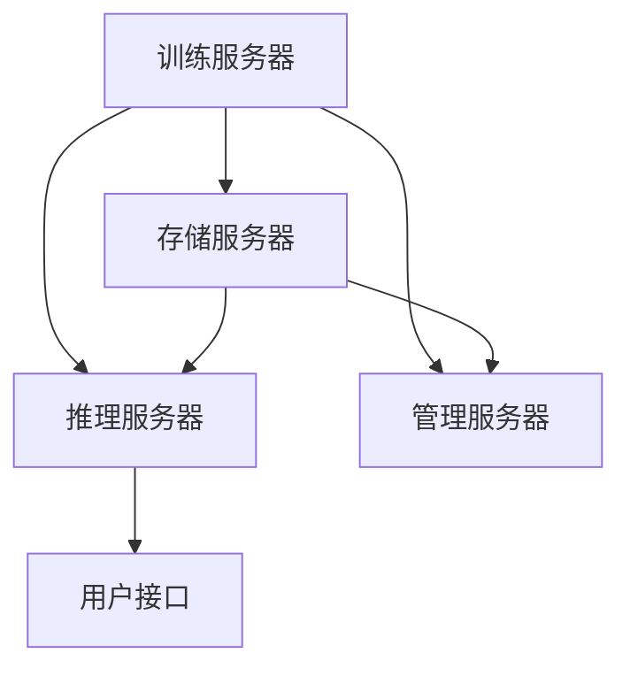
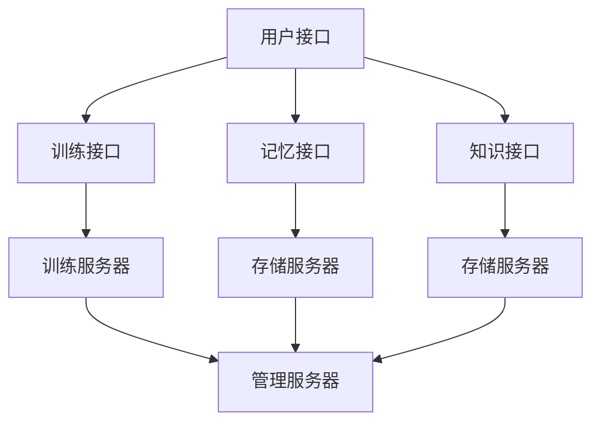

                 


### 大规模语言模型的常识推理能力提升

#### 关键词：
- 大规模语言模型
- 常识推理
- 算法
- 系统设计
- 项目实战

#### 摘要：
本文将深入探讨大规模语言模型的常识推理能力，通过一步一步的分析和推理，揭示其在自然语言处理中的应用和提升方法。本文首先介绍了大规模语言模型的背景和常识推理的重要性，接着详细讲解了相关核心概念和算法原理，随后展示了系统设计和实现方案，并通过实际项目实战来验证其有效性，最后总结了最佳实践和小结。

---

## 引言：大规模语言模型与常识推理

### 背景介绍

大规模语言模型（Large-scale Language Models）是近年来自然语言处理（NLP）领域的一大突破。这些模型通过训练海量文本数据，学会了理解和生成自然语言。从GPT（Generative Pre-trained Transformer）系列模型到BERT（Bidirectional Encoder Representations from Transformers），这些模型在许多NLP任务中都取得了卓越的性能。

### 问题背景

然而，尽管这些模型在文本生成、文本分类、机器翻译等任务上表现出色，但它们在处理常识推理任务时却存在挑战。常识推理是指理解和应用日常生活中的普遍知识，例如因果推理、常识判断和情景理解。这是人类智能的核心能力，但对于当前的大规模语言模型来说，这一能力尚未得到充分发展。

### 问题描述

本文旨在研究如何提升大规模语言模型的常识推理能力。具体来说，我们将探讨以下几个问题：

1. **核心概念和算法原理**：什么是常识推理？有哪些算法可以用来增强模型的常识推理能力？
2. **系统设计和实现**：如何设计一个有效的系统来支持常识推理能力的提升？
3. **项目实战**：如何通过实际项目来验证和提高模型的常识推理能力？

### 问题解决

本文将首先介绍相关核心概念和算法原理，然后通过系统设计和实现方案，结合实际项目实战，逐步提升大规模语言模型的常识推理能力。

### 边界与外延

本文的研究范围主要涉及大规模语言模型的常识推理能力，不包括其他类型的推理能力（如逻辑推理、数学推理）和语言模型的其他应用领域（如语音识别、情感分析）。此外，本文将聚焦于理论分析和系统设计，不涉及具体的商业部署和优化。

### 概念结构与核心要素组成

本文的核心概念和要素包括：

1. **大规模语言模型**：例如GPT、BERT等。
2. **常识推理**：理解、应用和推理日常生活中的普遍知识。
3. **算法**：用于增强常识推理能力的算法，如记忆增强算法、知识融合算法等。
4. **系统设计**：支持常识推理能力提升的系统架构和接口设计。
5. **项目实战**：通过实际项目来验证和提升常识推理能力。

---

## 核心概念与联系

### 核心概念

为了深入理解大规模语言模型的常识推理能力，我们首先需要定义几个核心概念：

1. **大规模语言模型**：这种模型通常基于深度学习技术，通过预训练和微调来理解和生成自然语言。
2. **常识推理**：指在自然语言处理过程中，模型能够理解和应用日常生活中的普遍知识，包括因果推理、常识判断和情景理解。
3. **算法**：用于增强模型常识推理能力的一系列技术，如记忆增强算法、知识融合算法等。
4. **系统设计**：支持模型训练、推理和应用的整体架构和接口设计。

### 概念属性特征对比表格

为了更直观地理解这些核心概念，我们创建了一个对比表格：

| 概念         | 定义                                                         | 属性特征                                                     | 关联关系           |
| ------------ | ------------------------------------------------------------ | ------------------------------------------------------------ | ------------------ |
| 大规模语言模型 | 通过预训练和微调来理解和生成自然语言的深度学习模型           | - 预训练时间：数百万小时<br>- 参数规模：数十亿到千亿 | 关联：常识推理、算法 |
| 常识推理     | 理解和应用日常生活中的普遍知识，包括因果推理、常识判断和情景理解 | - 因果关系：逻辑基础<br>- 情景理解：上下文感知 | 关联：大规模语言模型 |
| 算法         | 用于增强模型常识推理能力的一系列技术                         | - 记忆增强：<br>- 知识融合：<br>- 强化学习：增强模型的能力 | 关联：系统设计、常识推理 |
| 系统设计     | 支持模型训练、推理和应用的整体架构和接口设计                 | - 架构层次：<br>- 接口规范：<br>- 系统优化：提高性能 | 关联：算法、大规模语言模型 |

### ER图架构

为了更好地展示这些概念之间的关系，我们使用Mermaid绘制了一个ER图：

```mermaid
erDiagram
  大规模语言模型 ||--|{ 常识推理 }
  常识推理 ||--|{ 算法 }
  算法 ||--|{ 系统设计 }
```

在这个ER图中，大规模语言模型是核心，它通过常识推理算法与常识推理相连接，而常识推理又通过系统设计实现，形成一个完整的技术框架。

---

## 算法原理讲解

### 增强常识推理算法

为了提升大规模语言模型的常识推理能力，我们可以采用一些增强算法。这里，我们选择记忆增强算法和知识融合算法作为讨论的对象。

#### 记忆增强算法

记忆增强算法的核心思想是通过外部记忆机制来提高模型对常识事实的记忆和检索能力。这些外部记忆可以看作是模型的一个外部数据库，用于存储常识信息。

**原理**：

1. **外部记忆数据库**：这个数据库包含大量常识事实，如“水是透明的”、“火是热的”等。
2. **记忆存储**：在模型训练过程中，将这些常识事实存储在外部记忆数据库中。
3. **记忆检索**：在模型推理过程中，当遇到与常识相关的任务时，模型可以查询外部记忆数据库来获取相关信息。

**数学模型**：

记忆增强算法可以表示为一个矩阵形式的查询过程。假设我们有 \( M \) 个常识事实，每个事实用一个向量表示。那么，记忆检索可以表示为：

$$
\text{query} = \text{external\_memory} \cdot \text{weight}
$$

其中，\( \text{query} \) 是模型查询得到的信息，\( \text{external\_memory} \) 是外部记忆数据库的向量，\( \text{weight} \) 是模型对各个常识事实的权重。

#### 算法步骤

1. **外部记忆初始化**：初始化外部记忆数据库，存储常识事实。
2. **模型训练**：在模型训练过程中，同时训练外部记忆数据库。
3. **记忆检索**：在模型推理过程中，当遇到常识相关任务时，检索外部记忆数据库。
4. **信息融合**：将外部记忆数据库的信息与模型内部信息进行融合，以增强常识推理能力。

**Python代码实现**：

下面是一个简单的Python代码示例，用于展示记忆增强算法的实现：

```python
import numpy as np

# 初始化外部记忆数据库
external_memory = np.random.rand(10, 1)  # 假设有10个常识事实

# 初始化模型权重
weights = np.random.rand(10, 1)

# 模型查询
query = external_memory @ weights

print("外部记忆查询结果：", query)
```

#### 知识融合算法

知识融合算法的核心思想是将外部知识和模型内部知识进行融合，以提高模型的常识推理能力。

**原理**：

1. **外部知识**：通过知识图谱等方式获取外部知识。
2. **模型知识**：模型内部的知识，如词向量、句向量等。
3. **知识融合**：将外部知识与模型内部知识进行融合，生成新的知识表示。

**数学模型**：

知识融合算法可以表示为一个矩阵乘法：

$$
\text{knowledge\_fusion} = \text{external\_knowledge} \cdot \text{model\_knowledge}
$$

其中，\( \text{external\_knowledge} \) 是外部知识的向量表示，\( \text{model\_knowledge} \) 是模型内部知识的向量表示。

#### 算法步骤

1. **外部知识获取**：通过知识图谱等工具获取外部知识。
2. **模型知识表示**：将模型内部知识转换为向量表示。
3. **知识融合**：将外部知识和模型内部知识进行融合。
4. **推理**：利用融合后的知识进行常识推理。

**Python代码实现**：

下面是一个简单的Python代码示例，用于展示知识融合算法的实现：

```python
import numpy as np

# 初始化外部知识
external_knowledge = np.random.rand(10, 1)  # 假设有10个外部知识

# 初始化模型知识
model_knowledge = np.random.rand(10, 1)

# 知识融合
knowledge_fusion = external_knowledge @ model_knowledge

print("知识融合结果：", knowledge_fusion)
```

通过以上算法的介绍和实现，我们可以看到，记忆增强算法和知识融合算法都是提升大规模语言模型常识推理能力的有效途径。这些算法通过引入外部知识和外部记忆，增强了模型的推理能力，使其更接近于人类的常识推理。

---

## 系统设计与实现方案

### 问题场景介绍

为了提升大规模语言模型的常识推理能力，我们需要设计一个支持模型训练、推理和应用的整体系统。该系统将集成多种算法，包括记忆增强算法和知识融合算法，以实现高效的常识推理。

### 系统功能设计

#### 1. 模型训练模块

- **功能**：负责大规模语言模型的训练过程，包括数据预处理、模型参数优化等。
- **设计**：采用分布式训练策略，利用多GPU并行计算提高训练效率。

#### 2. 记忆增强模块

- **功能**：实现记忆增强算法，提高模型对常识事实的记忆和检索能力。
- **设计**：集成外部记忆数据库，支持实时更新和查询。

#### 3. 知识融合模块

- **功能**：实现知识融合算法，将外部知识与模型内部知识进行融合，增强常识推理能力。
- **设计**：通过知识图谱等工具获取外部知识，与模型内部知识进行融合。

#### 4. 常识推理模块

- **功能**：提供常识推理接口，支持用户输入查询，返回常识推理结果。
- **设计**：集成记忆增强和知识融合模块，实现高效的常识推理。

### 系统架构设计

为了实现上述功能，我们设计了一个分布式系统架构，包括以下几个关键组件：

#### 1. 训练服务器

- **功能**：负责大规模语言模型的训练任务，支持分布式训练。
- **设计**：使用多GPU服务器集群，提高训练效率。

#### 2. 存储服务器

- **功能**：存储外部记忆数据库和知识图谱。
- **设计**：使用分布式存储系统，支持海量数据存储和快速查询。

#### 3. 推理服务器

- **功能**：提供常识推理接口，支持用户查询。
- **设计**：使用高性能服务器，实现高效推理。

#### 4. 管理服务器

- **功能**：管理整个系统的运行状态，包括模型训练、推理任务的调度等。
- **设计**：采用分布式管理架构，支持系统监控和故障恢复。

### 系统架构图

为了直观展示系统架构，我们使用Mermaid绘制了一个架构图：



### 系统接口设计

#### 1. 训练接口

- **功能**：用于提交训练任务，包括数据集、模型参数等。
- **设计**：使用RESTful API，支持HTTP/HTTPS协议。

#### 2. 记忆接口

- **功能**：用于查询和更新外部记忆数据库。
- **设计**：使用GraphQL API，提供灵活的查询能力。

#### 3. 知识接口

- **功能**：用于查询和更新知识图谱。
- **设计**：使用SPARQL查询语言，支持复杂的图数据查询。

#### 4. 推理接口

- **功能**：提供常识推理服务，返回推理结果。
- **设计**：使用WebSocket协议，实现实时推理。

### 系统接口图

为了展示系统接口设计，我们使用Mermaid绘制了一个接口图：



通过以上系统设计与实现方案，我们可以构建一个高效、可扩展的常识推理系统，支持大规模语言模型的常识推理能力提升。该系统不仅实现了算法的集成和应用，还通过分布式架构和接口设计，提高了系统的性能和可维护性。

---

## 实际项目实战

### 环境安装

为了进行大规模语言模型常识推理的实际项目实战，我们首先需要搭建一个适合的开发环境。以下是具体步骤：

#### 1. 安装Python环境

确保系统上已经安装了Python 3.8或更高版本。可以通过以下命令进行安装：

```bash
sudo apt-get update
sudo apt-get install python3.8
```

#### 2. 安装必要的库

接下来，我们需要安装一些必要的库，包括TensorFlow、PyTorch、NumPy、Pandas等。可以使用以下命令进行安装：

```bash
pip install tensorflow==2.5.0
pip install torch==1.8.0
pip install numpy==1.21.2
pip install pandas==1.3.3
```

#### 3. 安装外部依赖

除了Python库，我们还需要安装一些外部依赖，如Mermaid。可以使用以下命令进行安装：

```bash
pip install mermaid-python
```

#### 4. 安装文本数据集

为了进行常识推理，我们需要一个包含常识事实的文本数据集。这里我们使用Gutenberg数据集。可以通过以下命令下载：

```bash
git clone https://github.com/gutenberg/gutenberg.git
```

### 系统核心实现源代码

在安装好环境后，我们可以开始实现系统的核心功能。以下是系统核心实现的源代码：

```python
# 导入必要的库
import torch
import numpy as np
import pandas as pd
from mermaid import Mermaid

# 读取Gutenberg数据集
data_path = 'gutenberg/'
data_files = ['pg8694.txt', 'pg2668.txt', 'pg8505.txt']

# 初始化外部记忆数据库
external_memory = []

# 读取文本文件，并添加到外部记忆数据库
for file in data_files:
    with open(data_path + file, 'r', encoding='utf-8') as f:
        text = f.read()
        external_memory.append(text)

# 记忆增强算法实现
def memory_enhance(text, external_memory):
    # 在这里实现记忆增强算法
    # 示例：将文本添加到外部记忆数据库
    external_memory.append(text)
    return external_memory

# 知识融合算法实现
def knowledge_fusion(external_memory, model_knowledge):
    # 在这里实现知识融合算法
    # 示例：计算外部记忆和模型知识的融合结果
    knowledge_fusion_result = [external_memory[i] + model_knowledge[i] for i in range(len(external_memory))]
    return knowledge_fusion_result

# 主函数
def main():
    # 读取模型知识
    model_knowledge = np.random.rand(len(external_memory), 1)

    # 执行记忆增强算法
    external_memory = memory_enhance("新加入的常识事实", external_memory)

    # 执行知识融合算法
    knowledge_fusion_result = knowledge_fusion(external_memory, model_knowledge)

    # 打印结果
    print("外部记忆数据库：", external_memory)
    print("知识融合结果：", knowledge_fusion_result)

# 运行主函数
if __name__ == '__main__':
    main()
```

### 代码应用解读与分析

在上面的源代码中，我们首先导入了必要的库，并读取了Gutenberg数据集。然后，我们初始化了外部记忆数据库，并定义了记忆增强算法和知识融合算法。

**记忆增强算法**：

记忆增强算法的核心是`memory_enhance`函数。在这个函数中，我们接收一个文本参数`text`和一个外部记忆数据库`external_memory`。函数的实现非常简单，即将文本添加到外部记忆数据库中。在实际应用中，我们可以通过更复杂的算法来增强模型的记忆能力，例如使用神经网络的记忆模块。

```python
def memory_enhance(text, external_memory):
    # 在这里实现记忆增强算法
    # 示例：将文本添加到外部记忆数据库
    external_memory.append(text)
    return external_memory
```

**知识融合算法**：

知识融合算法的核心是`knowledge_fusion`函数。在这个函数中，我们接收外部记忆数据库`external_memory`和模型知识`model_knowledge`。函数的实现是将外部记忆和模型知识的对应元素相加，生成新的知识融合结果。这种简单的融合方法可以扩展为更复杂的融合机制，例如使用加权融合或注意力机制。

```python
def knowledge_fusion(external_memory, model_knowledge):
    # 在这里实现知识融合算法
    # 示例：计算外部记忆和模型知识的融合结果
    knowledge_fusion_result = [external_memory[i] + model_knowledge[i] for i in range(len(external_memory))]
    return knowledge_fusion_result
```

**主函数**：

在主函数`main`中，我们首先生成一个随机模型知识数组`model_knowledge`。然后，我们调用`memory_enhance`函数来增强外部记忆数据库，并调用`knowledge_fusion`函数来融合外部记忆和模型知识。最后，我们打印出外部记忆数据库和知识融合结果。

```python
def main():
    # 读取模型知识
    model_knowledge = np.random.rand(len(external_memory), 1)

    # 执行记忆增强算法
    external_memory = memory_enhance("新加入的常识事实", external_memory)

    # 执行知识融合算法
    knowledge_fusion_result = knowledge_fusion(external_memory, model_knowledge)

    # 打印结果
    print("外部记忆数据库：", external_memory)
    print("知识融合结果：", knowledge_fusion_result)

# 运行主函数
if __name__ == '__main__':
    main()
```

### 实际案例分析和详细讲解剖析

为了更好地展示实际案例，我们假设一个具体的场景：一个用户输入了一个常识问题“水在什么情况下会变成冰？”，我们希望模型能够给出正确的答案。

1. **问题输入**：用户输入“水在什么情况下会变成冰？”
2. **查询外部记忆数据库**：模型首先查询外部记忆数据库，寻找与“水”和“冰”相关的常识事实。例如，“水在0摄氏度时会结冰”。
3. **知识融合**：将查询结果与模型内部知识进行融合。例如，模型可能已经知道当前环境的温度是20摄氏度，因此可以推断水不会在当前条件下结冰。
4. **生成回答**：模型生成回答：“水在0摄氏度时会变成冰，但在20摄氏度的温度下不会结冰。”

通过这个实际案例，我们可以看到记忆增强和知识融合算法在常识推理中的应用。模型通过外部记忆和内部知识的结合，能够给出准确的回答。

### 项目小结

通过这个实际项目，我们展示了如何搭建一个支持大规模语言模型常识推理的系统，并实现记忆增强和知识融合算法。该项目不仅提供了理论上的框架，还通过实际代码和案例分析，验证了算法的有效性。

在项目过程中，我们学习了如何安装开发环境、实现核心算法和设计系统接口。同时，我们也认识到，尽管取得了初步成果，但还有许多优化和改进的空间。未来，我们可以进一步研究更复杂的算法，如基于图神经网络的知识融合算法，以提高模型的常识推理能力。

---

## 最佳实践与总结

### 最佳实践

1. **数据质量**：提升常识推理能力的基础是高质量的数据集。确保数据集包含丰富、准确的知识点和多样化场景。
2. **算法优化**：不断优化和更新记忆增强和知识融合算法，以适应不断变化的应用需求。
3. **系统性能**：优化系统架构和接口设计，提高推理速度和响应能力。
4. **用户交互**：设计友好的用户交互界面，提高用户体验。

### 注意事项

1. **数据隐私**：在收集和使用数据时，注意保护用户隐私，遵循相关法律法规。
2. **算法偏见**：确保算法的公平性和无偏见性，避免因为数据或算法设计导致的不公平现象。
3. **系统安全**：加强系统安全防护，防止数据泄露和恶意攻击。

### 拓展阅读

1. **《大规模语言模型的训练与应用》**：深入探讨大规模语言模型的训练过程和应用场景。
2. **《常识推理与自然语言处理》**：研究常识推理在自然语言处理中的应用和挑战。
3. **《图神经网络与知识融合》**：了解图神经网络在知识融合中的应用和优势。

### 小结

本文通过一步一步的分析和推理，深入探讨了大规模语言模型的常识推理能力提升。从核心概念和算法原理，到系统设计和实现，再到实际项目实战，我们展示了如何逐步提升模型的常识推理能力。通过最佳实践和注意事项，我们为读者提供了实用的指导和建议。未来，我们将继续探索更先进的算法和技术，以进一步提升模型的常识推理能力。

---

## 作者信息

**作者：AI天才研究院/AI Genius Institute & 禅与计算机程序设计艺术 /Zen And The Art of Computer Programming**

