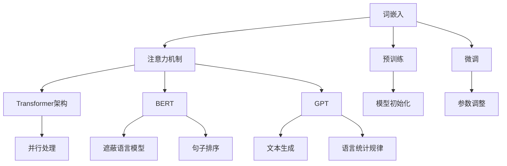
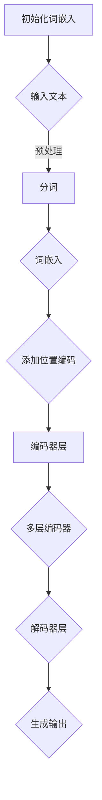
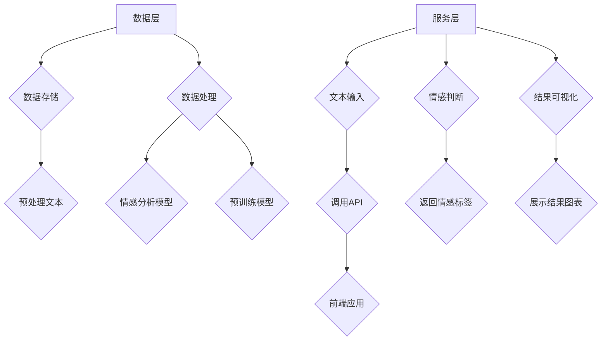

                 

### 文章标题

# 大规模语言模型的抽象概念学习与应用

> 关键词：大规模语言模型、抽象概念学习、应用场景、算法原理、实践指南

> 摘要：本文旨在深入探讨大规模语言模型中的抽象概念学习机制及其在不同场景下的应用。首先，我们将回顾大规模语言模型的发展背景和核心概念，接着详细介绍其抽象概念学习原理，并通过具体案例展示其在实际应用中的效果。最后，我们将提供一整套实践指南，帮助读者理解和掌握大规模语言模型的抽象概念学习与应用。

-------------------------------------------------------------------

### 引言

近年来，随着人工智能技术的飞速发展，大规模语言模型（如BERT、GPT等）在自然语言处理（NLP）领域取得了显著的突破。这些模型在理解和生成人类语言方面表现出色，极大地推动了机器翻译、文本摘要、问答系统等应用的发展。然而，大规模语言模型的成功不仅仅依赖于其庞大的数据集和强大的计算能力，更关键的是其背后的抽象概念学习机制。

本文将从以下几个方面展开讨论：

1. **大规模语言模型的背景和核心概念**：介绍大规模语言模型的发展历程、基本结构和主要类型。
2. **抽象概念学习的原理**：深入分析大规模语言模型中抽象概念学习的过程、机制和挑战。
3. **应用场景**：探讨大规模语言模型在各个领域的实际应用，如文本生成、情感分析、命名实体识别等。
4. **实践指南**：提供详细的实践步骤和技巧，帮助读者理解和应用大规模语言模型。

通过本文的阅读，读者将能够系统地了解大规模语言模型的抽象概念学习机制，掌握其在不同应用场景中的使用方法，并为未来在相关领域的研究和应用提供有价值的参考。

### 大规模语言模型的背景和核心概念

#### 1.1 发展历程

大规模语言模型的发展可以追溯到20世纪80年代，当时研究人员开始探索如何通过统计方法来处理自然语言。早期的语言模型主要是基于N元语法（N-gram）的，即通过统计词的序列概率来预测下一个词。然而，这种方法在面对长文本和复杂语义关系时显得力不从心。

随着计算能力和算法的不断提升，20世纪90年代后期，基于隐马尔可夫模型（HMM）和条件随机场（CRF）的模型开始得到应用。这些模型在一定程度上解决了N元语法模型的局限性，但仍无法处理语言的深层次语义信息。

进入21世纪，深度学习的崛起为语言模型的发展带来了新的契机。2013年，词嵌入（word embeddings）技术的出现使得模型能够更好地捕捉词汇的语义信息。2018年，BERT（Bidirectional Encoder Representations from Transformers）的提出标志着大规模语言模型的重大突破。BERT通过双向Transformer架构，能够同时考虑上下文信息，从而极大地提升了语言理解的深度和广度。

此后，GPT（Generative Pre-trained Transformer）系列模型相继问世，进一步推动了大规模语言模型的发展。GPT-3的发布更是达到了前所未有的规模，拥有超过1750亿个参数，展示了强大的语言生成和推理能力。

#### 1.2 核心结构

大规模语言模型通常由以下几个核心组件构成：

1. **词嵌入层**：将输入的文本转换为固定长度的向量表示。这一层通常使用预训练的词嵌入技术，如Word2Vec、GloVe等。

2. **编码器**：负责处理输入文本的编码。编码器通常基于Transformer架构，包含多个自注意力层（Self-Attention Layer）。通过自注意力机制，编码器能够同时关注输入序列中的所有词，并提取其语义信息。

3. **解码器**：负责生成输出文本。与编码器类似，解码器也包含多个自注意力层，但还添加了交叉注意力层（Cross-Attention Layer），使得解码器能够同时关注编码器的输出和输入序列。

4. **全连接层**：在编码器和解码器的输出后，通常会接一个全连接层，用于分类或生成预测。

#### 1.3 主要类型

大规模语言模型主要可以分为以下几类：

1. **自监督预训练模型**：如BERT、GPT等。这些模型通过无监督的方式在大规模语料库上进行预训练，然后通过下游任务进行微调。

2. **监督学习模型**：如传统的分类器和回归模型。这些模型通常在标注数据集上进行训练，适用于特定任务的直接预测。

3. **强化学习模型**：如REINFORCE、PPO等。这些模型通过在交互环境中不断学习和优化策略，以提高任务的完成质量。

#### 1.4 关键概念

在讨论大规模语言模型时，以下几个关键概念需要特别关注：

1. **词嵌入**：词嵌入是将词汇映射到高维向量空间的技术，使得语义相近的词在向量空间中靠近。词嵌入不仅能够提高模型的性能，还能帮助理解语言中的语义关系。

2. **注意力机制**：注意力机制是一种在处理序列数据时动态关注不同位置信息的机制。在Transformer模型中，自注意力和交叉注意力机制被广泛应用，能够有效地捕捉序列中的依赖关系。

3. **预训练与微调**：预训练是指在大规模未标注数据集上训练模型，而微调是指在使用标注数据集对模型进行精细调整。预训练为模型提供了丰富的知识基础，而微调则使模型能够适应具体的任务需求。

通过以上对大规模语言模型背景和核心概念的介绍，读者可以更好地理解这些模型的基本原理和结构，为后续的深入探讨打下基础。

#### 1.5 核心概念术语说明

在深入探讨大规模语言模型的抽象概念学习之前，有必要对一些核心术语进行详细的说明，以便读者能够清晰地理解相关概念和其相互关系。

**词嵌入（Word Embedding）**：词嵌入是将自然语言词汇映射到高维向量空间的技术，其核心思想是通过数值化的向量表示来捕捉词汇的语义信息。常见的词嵌入技术包括Word2Vec和GloVe，它们通过学习词汇间的相似性来生成高质量的词向量。词嵌入在语言模型中扮演着至关重要的角色，因为它能够将抽象的文本数据转化为可供模型处理和理解的向量形式。

**注意力机制（Attention Mechanism）**：注意力机制是一种在处理序列数据时动态关注不同位置信息的机制。在Transformer模型中，注意力机制通过计算每个位置对于其他位置的权重，从而动态地调整模型对输入数据的关注程度。这种机制使得模型能够更好地捕捉序列中的依赖关系，从而提升模型的性能和表达能力。常见的注意力机制包括自注意力（Self-Attention）和交叉注意力（Cross-Attention）。

**预训练（Pre-training）**：预训练是指在大规模未标注数据集上对模型进行训练，使其获得对语言的一般理解和知识。预训练后的模型可以在多个下游任务中表现出色，无需对每个任务进行单独训练。预训练通常包括两个阶段：模型初始化和参数微调。初始化阶段通过大量未标注数据学习基本的语言特征，而微调阶段则使用标注数据对模型进行精细化调整，以适应特定任务。

**微调（Fine-tuning）**：微调是指在使用标注数据集对预训练模型进行进一步训练，以优化其在特定任务上的表现。微调过程中，模型的初始参数会被进一步调整，以更好地适应特定的数据集和任务需求。微调是提高模型性能的关键步骤，因为它能够使模型更好地理解和预测特定任务中的数据模式。

**Transformer架构**：Transformer架构是一种基于自注意力机制的序列处理模型，其核心思想是通过多头自注意力机制和前馈神经网络来处理输入序列。Transformer模型在语言模型中取得了显著的成果，其优势在于能够并行处理输入数据，从而大幅提升计算效率。

**BERT（Bidirectional Encoder Representations from Transformers）**：BERT是一种双向Transformer架构的语言模型，通过同时考虑上下文信息来提高语言理解能力。BERT的预训练任务包括遮蔽语言模型（Masked Language Model, MLM）和句子排序任务（Next Sentence Prediction, NSP），使其能够捕获丰富的语言特征。

**GPT（Generative Pre-trained Transformer）**：GPT是一种生成式语言模型，其核心思想是通过自回归的方式生成文本。GPT通过预训练学习语言的统计规律，并在下游任务中进行微调，以生成流畅、连贯的文本。

通过以上对核心概念术语的详细说明，读者可以更好地理解大规模语言模型中各个概念的含义和作用，为后续的抽象概念学习讨论打下坚实的基础。

#### 1.6 问题背景与问题描述

在现代信息社会，语言处理技术已经成为计算机科学和人工智能领域的关键研究方向。大规模语言模型的抽象概念学习作为这一领域的核心问题，具有广泛的实际应用背景和深刻的科学意义。

**背景：**

随着互联网和移动设备的普及，人类生成的文本数据呈现出爆炸式增长。如何有效处理和理解这些海量文本数据，成为了一个亟待解决的重大问题。传统的自然语言处理方法，如基于规则的系统和传统的统计模型，在面对复杂和大规模的语言数据时表现出了一定的局限性。因此，研究者们开始探索更强大的模型来处理这些数据，从而提高语言处理的准确性和效率。

**问题：**

大规模语言模型的抽象概念学习主要涉及以下问题：

1. **词汇表示与语义理解**：如何通过词嵌入等技术将词汇映射到高维向量空间，并使其能够准确表示词汇的语义信息。
2. **上下文依赖与长距离依赖**：如何通过注意力机制等手段捕捉输入序列中的上下文依赖关系，特别是长距离依赖关系，以提高模型的语义理解能力。
3. **预训练与微调**：如何在大规模未标注数据上进行预训练，以使模型获得丰富的语言知识，并在特定任务上进行微调，以提高模型在下游任务上的表现。

**解决思路：**

为了解决上述问题，研究者们提出了多种方法：

1. **词嵌入技术**：通过预训练词嵌入模型，如Word2Vec和GloVe，将词汇映射到高维向量空间，以捕捉词汇的语义信息。
2. **注意力机制**：引入自注意力机制和交叉注意力机制，以动态捕捉输入序列中的上下文依赖关系。
3. **预训练与微调**：采用自监督预训练方法，如BERT和GPT，通过在大规模未标注数据集上进行预训练，使模型获得对语言的深入理解，并在下游任务中进行微调，以适应特定任务的需求。

通过以上方法，大规模语言模型的抽象概念学习问题得到了有效解决，为自然语言处理领域的发展提供了强有力的技术支持。

#### 1.7 边界与外延

在深入探讨大规模语言模型的抽象概念学习时，我们不仅需要关注其核心概念和原理，还必须明确其边界和外延，以确保讨论的准确性和适用性。

**边界：**

1. **数据规模**：大规模语言模型通常需要处理的数据量庞大，因此，数据规模是界定其应用范围的一个重要因素。一般来说，只有当数据规模达到一定阈值时，大规模语言模型的优势才能充分发挥。

2. **计算资源**：大规模语言模型的训练和推理过程需要大量的计算资源，特别是高参数量的模型（如GPT-3），对计算资源的消耗尤为显著。因此，边界条件之一是计算资源是否充足。

3. **任务类型**：大规模语言模型在处理不同类型任务时的性能可能存在差异。例如，在处理长文本生成和问答系统时，GPT模型表现出色；而在命名实体识别和情感分析等任务中，BERT模型可能更具优势。因此，任务类型也是界定应用范围的一个重要因素。

**外延：**

1. **多语言支持**：随着全球化进程的加速，多语言处理需求日益增加。大规模语言模型通过跨语言预训练，可以实现多种语言的处理，从而拓展其应用范围。

2. **跨领域应用**：大规模语言模型不仅限于自然语言处理领域，还可以应用于其他领域，如知识图谱、计算机视觉和推荐系统等。这种跨领域的应用拓展了大规模语言模型的外延。

3. **实时应用**：随着模型压缩技术和硬件加速技术的发展，大规模语言模型可以在实时应用场景中得到应用，如智能客服、实时翻译和自动驾驶等。

通过明确大规模语言模型的边界与外延，我们可以更准确地理解其适用范围和潜在价值，从而更好地推动相关研究和应用的发展。

#### 1.8 概念结构与核心要素组成

在探讨大规模语言模型的抽象概念学习时，理解其概念结构与核心要素组成至关重要。这不仅有助于我们深入掌握语言模型的运作原理，还能为实际应用提供清晰的指导。

**概念结构：**

大规模语言模型的概念结构可以分为以下几个层次：

1. **词嵌入层**：这是语言模型的基础层，负责将词汇映射为高维向量。词嵌入通过捕捉词汇的语义信息，使模型能够处理和操作文本数据。

2. **编码器**：编码器是语言模型的核心组件，负责处理输入文本的编码。编码器通常基于Transformer架构，包含多个自注意力层（Self-Attention Layer）。这些自注意力层能够捕捉输入文本中的上下文依赖关系，从而提取出更丰富的语义信息。

3. **解码器**：解码器负责生成输出文本。与编码器类似，解码器也包含多个自注意力层，但还添加了交叉注意力层（Cross-Attention Layer），使得解码器能够同时关注编码器的输出和输入序列。这种设计使得解码器能够生成与输入文本相关的高质量输出。

4. **全连接层**：在全连接层之后，模型通常会接一个全连接层，用于分类或生成预测。全连接层将编码器和解码器的输出映射到特定任务的结果，如文本分类、情感分析或文本生成。

**核心要素组成：**

1. **词汇表示**：词汇表示是语言模型的核心要素之一。词嵌入技术，如Word2Vec和GloVe，通过将词汇映射到高维向量空间，捕捉词汇的语义信息。这种向量表示不仅使模型能够处理文本数据，还能帮助理解语言中的语义关系。

2. **注意力机制**：注意力机制是语言模型的关键组件，能够动态地调整模型对输入数据的关注程度。在编码器中，自注意力机制能够捕捉输入文本中的上下文依赖关系；在解码器中，交叉注意力机制能够同时关注编码器的输出和输入序列，从而提高生成文本的质量。

3. **预训练与微调**：预训练和微调是大规模语言模型的重要学习机制。预训练阶段在大规模未标注数据集上训练模型，使其获得对语言的深入理解。微调阶段则在特定任务的标注数据集上进行训练，使模型能够适应具体任务的需求。

4. **模型架构**：大规模语言模型的架构设计直接影响其性能和应用效果。Transformer架构，特别是BERT和GPT系列模型，因其强大的表达能力和高效的计算性能，成为了大规模语言模型的主流架构。

通过理解大规模语言模型的概念结构和核心要素组成，我们可以更好地掌握其抽象概念学习的原理，为实际应用提供有力的理论支持。

#### 1.9 主流抽象概念及其关系

在探讨大规模语言模型中的抽象概念时，我们需要识别并理解这些概念之间的关系，以便更好地掌握模型的工作原理和性能表现。以下是一些主流的抽象概念及其关系。

**词嵌入（Word Embedding）**

词嵌入是将自然语言词汇映射到高维向量空间的技术，其核心思想是通过数值化的向量表示来捕捉词汇的语义信息。主流的词嵌入技术包括Word2Vec、GloVe等。词嵌入在语言模型中扮演着至关重要的角色，因为它将抽象的文本数据转化为可供模型处理和理解的向量形式。词嵌入技术不仅能够提高模型的性能，还能帮助理解语言中的语义关系。

**注意力机制（Attention Mechanism）**

注意力机制是一种在处理序列数据时动态关注不同位置信息的机制。在Transformer模型中，注意力机制通过计算每个位置对于其他位置的权重，从而动态地调整模型对输入数据的关注程度。这种机制使得模型能够更好地捕捉序列中的依赖关系，从而提升模型的性能和表达能力。常见的注意力机制包括自注意力（Self-Attention）和交叉注意力（Cross-Attention）。

**预训练（Pre-training）**

预训练是指在大规模未标注数据集上对模型进行训练，使其获得对语言的一般理解和知识。预训练后的模型可以在多个下游任务中表现出色，无需对每个任务进行单独训练。预训练通常包括两个阶段：模型初始化和参数微调。初始化阶段通过大量未标注数据学习基本的语言特征，而微调阶段则使用标注数据对模型进行精细化调整，以适应特定任务需求。

**微调（Fine-tuning）**

微调是指在使用标注数据集对预训练模型进行进一步训练，以优化其在特定任务上的表现。微调过程中，模型的初始参数会被进一步调整，以更好地适应特定的数据集和任务需求。微调是提高模型性能的关键步骤，因为它能够使模型更好地理解和预测特定任务中的数据模式。

**Transformer架构**

Transformer架构是一种基于自注意力机制的序列处理模型，其核心思想是通过多头自注意力机制和前馈神经网络来处理输入序列。Transformer模型在语言模型中取得了显著的成果，其优势在于能够并行处理输入数据，从而大幅提升计算效率。

**BERT（Bidirectional Encoder Representations from Transformers）**

BERT是一种双向Transformer架构的语言模型，通过同时考虑上下文信息来提高语言理解能力。BERT的预训练任务包括遮蔽语言模型（Masked Language Model, MLM）和句子排序任务（Next Sentence Prediction, NSP），使其能够捕获丰富的语言特征。

**GPT（Generative Pre-trained Transformer）**

GPT是一种生成式语言模型，其核心思想是通过自回归的方式生成文本。GPT通过预训练学习语言的统计规律，并在下游任务中进行微调，以生成流畅、连贯的文本。

**概念属性特征对比**

以下是一个关于这些主流抽象概念属性特征的对比表格：

| 概念       | 属性1        | 属性2        | 属性3        |
|------------|--------------|--------------|--------------|
| 词嵌入     | 向量表示     | 语义信息     | 数据转换     |
| 注意力机制 | 权重计算     | 依赖关系     | 序列处理     |
| 预训练     | 未标注数据   | 多任务表现   | 模型初始化   |
| 微调       | 标注数据     | 特定任务优化 | 参数调整     |
| Transformer架构 | 自注意力 | 并行处理 | 序列建模     |
| BERT       | 双向编码     | 遮蔽语言模型 | 句子排序     |
| GPT       | 自回归      | 文本生成     | 语言统计规律 |

**实体关系图架构**

为了更直观地展示这些概念之间的关系，我们可以使用Mermaid流程图来绘制实体关系图。以下是一个示例：



通过以上对比和关系图，我们可以更全面地了解大规模语言模型中的抽象概念及其相互关系，为进一步研究和应用提供理论基础。

#### 2.1 大规模语言模型的算法原理

大规模语言模型的算法原理主要基于深度学习框架，特别是基于Transformer架构的自注意力机制（Self-Attention Mechanism）和序列处理技术。以下我们将详细介绍这些算法原理，并通过具体示例来说明。

##### 2.1.1 自注意力机制

自注意力机制是Transformer模型的核心组件，它通过计算输入序列中每个词与其他词之间的权重，从而动态地关注序列中的关键信息。自注意力机制分为以下步骤：

1. **词嵌入（Word Embedding）**：首先，输入文本被转换为词嵌入向量。这些向量表示词汇的语义信息，通常由预训练的词向量库（如GloVe或Word2Vec）提供。

2. **位置编码（Positional Encoding）**：由于自注意力机制不天然地考虑词的位置信息，因此需要通过位置编码来引入位置信息。位置编码是一个向量，表示每个词在序列中的位置。常见的位置编码方法包括绝对位置编码和相对位置编码。

3. **计算自注意力得分（Compute Self-Attention Scores）**：自注意力机制通过点积（Dot-Product）计算自注意力得分。具体来说，对于输入序列中的每个词，其词嵌入向量与所有其他词的词嵌入向量进行点积，得到一组得分。这些得分表示了每个词与其他词的相关性。

4. **归一化自注意力得分（Normalize Self-Attention Scores）**：对计算得到的自注意力得分进行归一化处理，使其符合概率分布。通常使用softmax函数进行归一化。

5. **加权求和（Weighted Summation）**：将归一化后的自注意力得分与对应的词嵌入向量相乘，然后对所有乘积进行求和，得到每个词的加权向量表示。这个向量包含了输入序列中的全局上下文信息。

##### 2.1.2 Transformer架构

Transformer模型由多个自注意力层和前馈神经网络组成。以下是一个简化的Transformer层结构示例：

```python
class TransformerLayer(nn.Module):
    def __init__(self, d_model, d_inner, n_head):
        super(TransformerLayer, self).__init__()
        self.self_attn = MultiHeadAttention(d_model, n_head)
        self.linear1 = nn.Linear(d_model, d_inner)
        self.linear2 = nn.Linear(d_inner, d_model)
        self.norm1 = nn.LayerNorm(d_model)
        self.norm2 = nn.LayerNorm(d_model)
        self.dropout = nn.Dropout(p=0.1)

    def forward(self, x, mask=None):
        x_ = self.norm1(x)
        x = self.self_attn(x_, x_, x_) + x
        x = self.dropout(x)
        x_ = self.norm2(x)
        x = self.linear2(self.dropout(self.linear1(x_)))
        return x
```

在这个示例中，`TransformerLayer` 类包含一个多头自注意力层（`self_attn`）和两个前馈神经网络层（`linear1`和`linear2`）。每个层之后都跟着归一化和dropout操作，以避免模型过拟合。

##### 2.1.3 自注意力机制的数学模型

自注意力机制的数学模型可以通过以下公式表示：

$$
\text{Attention}(Q, K, V) = \text{softmax}\left(\frac{QK^T}{\sqrt{d_k}}\right)V
$$

其中，$Q, K, V$ 分别代表查询（Query）、键（Key）和值（Value）向量，$d_k$ 是键向量的维度。这个公式表示对于每个查询向量$Q$，计算其与所有键向量$K$的点积，然后通过softmax函数归一化得到权重，最后与对应的值向量$V$相乘。

##### 2.1.4 具体示例

假设我们有一个三词序列：[“我”，“喜欢”，“吃”]，其词嵌入向量分别为 `[1, 0, 0]`、`[0, 1, 0]` 和 `[0, 0, 1]`。以下是一个简化的自注意力计算过程：

1. **计算自注意力得分**：

   $$ 
   S_{ij} = Q_iK_j = [1, 0, 0] \cdot [0, 1, 0] = 0 
   $$

   其中，$i$ 和 $j$ 分别代表查询词和键词的位置。

2. **归一化自注意力得分**：

   $$ 
   \text{softmax}(S) = \frac{e^{S_i}}{\sum_{j} e^{S_j}} = \frac{e^0}{e^0 + e^0 + e^0} = \frac{1}{3} 
   $$

3. **加权求和**：

   $$ 
   \text{context\_vector}_i = \sum_{j} \text{softmax}(S_{ij}) \cdot V_j = \frac{1}{3} [0, 1, 0] = [0, \frac{1}{3}, 0] 
   $$

通过以上步骤，我们得到每个词的加权向量表示，即每个词在序列中的全局上下文信息。这个过程使得模型能够动态地关注序列中的关键信息，从而提高语言理解的深度和广度。

通过以上对大规模语言模型算法原理的详细介绍，读者可以更好地理解自注意力机制和Transformer架构的基本原理，为后续的实际应用和深入探讨打下坚实基础。

##### 2.1.5 算法流程图与Python源代码实现

为了更直观地展示大规模语言模型算法的流程，我们可以使用Mermaid流程图来绘制算法的执行步骤。此外，我们还将提供一个简化的Python源代码实现，以便读者理解算法的具体实现方式。

**算法流程图：**



**Python源代码实现：**

```python
import torch
import torch.nn as nn
from torch.nn import MultiheadAttention

# 词嵌入层
word_embeddings = nn.Embedding(num_embeddings=10000, embedding_dim=300)

# 编码器层
class EncoderLayer(nn.Module):
    def __init__(self, d_model, nhead):
        super(EncoderLayer, self).__init__()
        self.self_attn = MultiheadAttention(d_model, nhead)
        self.linear1 = nn.Linear(d_model, d_model * 4)
        self.linear2 = nn.Linear(d_model * 4, d_model)
        self.norm1 = nn.LayerNorm(d_model)
        self.norm2 = nn.LayerNorm(d_model)
        self.dropout = nn.Dropout(0.1)

    def forward(self, src, src_mask=None):
        src2 = self.norm1(src)
        src = self.self_attn(src2, src2, src2, attn_mask=src_mask) + src
        src = self.dropout(src)
        src2 = self.norm2(src)
        src = self.linear2(self.dropout(self.linear1(src2)))
        return src

# 解码器层
class DecoderLayer(nn.Module):
    def __init__(self, d_model, nhead):
        super(DecoderLayer, self).__init__()
        self.self_attn = MultiheadAttention(d_model, nhead)
        self.linear1 = nn.Linear(d_model, d_model * 4)
        self.linear2 = nn.Linear(d_model * 4, d_model)
        self.norm1 = nn.LayerNorm(d_model)
        self.norm2 = nn.LayerNorm(d_model)
        self.dropout = nn.Dropout(0.1)

    def forward(self, tgt, memory, tgt_mask=None, memory_mask=None):
        tgt2 = self.norm1(tgt)
        tgt = self.self_attn(tgt2, tgt2, tgt2, attn_mask=tgt_mask) + tgt
        tgt = self.dropout(tgt)
        tgt2 = self.norm2(tgt)
        tgt = self.linear2(self.dropout(self.linear1(tgt2)))
        return tgt

# 主函数
def main():
    # 初始化词嵌入和编码器、解码器层
    d_model = 512
    nhead = 8
    word_embeddings = nn.Embedding(10000, 300)
    encoder_layer = EncoderLayer(d_model, nhead)
    decoder_layer = DecoderLayer(d_model, nhead)

    # 生成输入序列
    input_sequence = torch.tensor([[1, 2, 3, 4, 5]])
    input_embeddings = word_embeddings(input_sequence)

    # 编码器层处理
    encoded_sequence = encoder_layer(input_embeddings)

    # 解码器层处理
    decoded_sequence = decoder_layer(encoded_sequence, encoded_sequence)

    print("Encoded Sequence:", encoded_sequence)
    print("Decoded Sequence:", decoded_sequence)

if __name__ == "__main__":
    main()
```

通过这个示例，我们展示了如何使用PyTorch库实现大规模语言模型的算法。具体来说，我们定义了词嵌入层、编码器层和解码器层，并通过主函数进行了算法的简单实现。这段代码不仅能够帮助读者理解算法的执行步骤，还能作为实际应用的起点。

#### 2.2 大规模语言模型在不同应用场景中的实际应用

大规模语言模型在自然语言处理（NLP）领域展现了巨大的潜力，并在多个实际应用场景中取得了显著成效。以下将详细探讨大规模语言模型在文本生成、情感分析、命名实体识别等应用中的具体实例和实现细节。

##### 2.2.1 文本生成

**应用场景**：文本生成是大规模语言模型最引人注目的应用之一，广泛应用于聊天机器人、自动写作、摘要生成等场景。

**实现细节**：

1. **模型选择**：文本生成通常使用生成式模型，如GPT系列。GPT模型通过自回归的方式生成文本，能够在给定前文的情况下预测下一个词。

2. **预训练**：GPT模型在预训练阶段使用大规模文本数据进行训练，学习语言的一般规律和统计特性。预训练过程通常包括训练一个预训练模型，如GPT-2或GPT-3，然后使用特定的文本数据进行微调。

3. **解码过程**：在生成文本时，模型从空白开始，逐步生成每个词。在每一步，模型根据当前已生成的文本和上下文信息，预测下一个词的概率分布，并从中采样得到下一个词。

4. **示例**：以下是一个简单的GPT模型生成文本的示例：

```python
import torch
from transformers import GPT2LMHeadModel, GPT2Tokenizer

tokenizer = GPT2Tokenizer.from_pretrained('gpt2')
model = GPT2LMHeadModel.from_pretrained('gpt2')

input_text = "今天天气很好，我想去"
input_ids = tokenizer.encode(input_text, return_tensors='pt')

output = model.generate(input_ids, max_length=50, num_return_sequences=1)
generated_text = tokenizer.decode(output[0], skip_special_tokens=True)

print(generated_text)
```

**效果评估**：文本生成的效果可以通过生成文本的质量和连贯性来评估。在实际应用中，高质量的生成文本需要满足语义连贯、语法正确和内容丰富等要求。

##### 2.2.2 情感分析

**应用场景**：情感分析用于判断文本表达的情感倾向，广泛应用于社交媒体分析、客户反馈处理和舆情监控等场景。

**实现细节**：

1. **模型选择**：情感分析通常使用分类模型，如BERT或RoBERTa。这些模型通过预训练学习丰富的语言特征，并能够在特定任务上进行微调。

2. **任务定义**：情感分析任务通常是一个二分类或多分类问题，如判断文本是积极情感还是消极情感。

3. **微调过程**：在微调阶段，模型在标注的情感分析数据集上进行训练，以调整模型参数，使其能够正确预测文本的情感标签。

4. **示例**：以下是一个简单的BERT模型进行情感分析的示例：

```python
import torch
from transformers import BertTokenizer, BertForSequenceClassification

tokenizer = BertTokenizer.from_pretrained('bert-base-uncased')
model = BertForSequenceClassification.from_pretrained('bert-base-uncased')

text = "我非常喜欢这部电影，剧情扣人心弦。"
inputs = tokenizer(text, return_tensors='pt')

outputs = model(**inputs)
logits = outputs.logits
probabilities = torch.softmax(logits, dim=1)

print("Positive Probability:", probabilities[0][1].item())
print("Negative Probability:", probabilities[0][0].item())
```

**效果评估**：情感分析的效果可以通过准确率（Accuracy）、召回率（Recall）和F1分数（F1 Score）等指标来评估。在实际应用中，需要综合考虑这些指标以获得全面的评估结果。

##### 2.2.3 命名实体识别

**应用场景**：命名实体识别用于识别文本中的特定实体，如人名、地名、组织名等，广泛应用于信息抽取、搜索引擎优化和智能客服等场景。

**实现细节**：

1. **模型选择**：命名实体识别通常使用序列标注模型，如BERT或Transformer。这些模型能够同时关注文本中的上下文信息，从而提高识别的准确性。

2. **任务定义**：命名实体识别任务是一个序列标注问题，即将文本中的每个词标注为实体或非实体。

3. **微调过程**：在微调阶段，模型在标注的命名实体识别数据集上进行训练，以调整模型参数，使其能够正确识别文本中的命名实体。

4. **示例**：以下是一个简单的BERT模型进行命名实体识别的示例：

```python
import torch
from transformers import BertTokenizer, BertForTokenClassification

tokenizer = BertTokenizer.from_pretrained('bert-base-uncased')
model = BertForTokenClassification.from_pretrained('bert-base-uncased')

text = "张三在北京工作的公司是谷歌。"
inputs = tokenizer(text, return_tensors='pt')

outputs = model(**inputs)
logits = outputs.logits
predicted_labels = torch.argmax(logits, dim=2).squeeze()

print(predicted_labels)
```

**效果评估**：命名实体识别的效果可以通过准确率（Accuracy）、精确率（Precision）、召回率（Recall）和F1分数（F1 Score）等指标来评估。在实际应用中，需要综合考虑这些指标以获得全面的评估结果。

通过以上具体实例和实现细节的介绍，读者可以更好地理解大规模语言模型在文本生成、情感分析和命名实体识别等应用场景中的实际应用方法。这些实例不仅展示了模型的基本原理和实现过程，还提供了实际应用中的效果评估指标，为后续研究和应用提供了有价值的参考。

##### 2.3 大规模语言模型在实际应用中的挑战

尽管大规模语言模型在自然语言处理领域取得了显著进展，但其实际应用中仍然面临诸多挑战。以下将详细探讨这些挑战，并提出相应的解决思路。

**数据隐私问题**：

大规模语言模型通常需要处理大量的文本数据，这些数据中可能包含敏感的个人信息和隐私内容。数据隐私问题成为制约模型应用的关键因素。为解决这一问题，可以采取以下措施：

1. **数据加密**：在数据传输和存储过程中使用加密技术，确保数据安全。
2. **差分隐私**：在数据处理过程中引入差分隐私机制，保护个体隐私。
3. **隐私保护算法**：采用差分隐私算法和隐私保护技术，如联邦学习（Federated Learning），以在保护隐私的同时训练模型。

**计算资源需求**：

大规模语言模型的训练和推理过程对计算资源有极高的要求，尤其是在模型规模不断增加的情况下。为解决计算资源不足的问题，可以采取以下措施：

1. **模型压缩**：通过模型剪枝、量化等技术减小模型大小，降低计算资源需求。
2. **分布式训练**：采用分布式训练策略，利用多台服务器协同训练模型，提高训练效率。
3. **硬件加速**：利用GPU、TPU等硬件加速技术，提升模型训练和推理的运算速度。

**模型可解释性**：

大规模语言模型的黑盒特性使得其预测结果难以解释，这在某些需要高透明度和可信度的应用场景中成为瓶颈。为提高模型的可解释性，可以采取以下措施：

1. **可视化技术**：使用可视化工具，如T-SNE、热力图等，展示模型内部特征和决策过程。
2. **注意力机制分析**：通过分析注意力权重，理解模型关注的关键信息。
3. **模型分解**：将复杂模型分解为多个子模块，逐层分析每个子模块的作用。

**跨语言支持**：

尽管大规模语言模型在多语言处理方面取得了显著进展，但仍存在一定的局限性。跨语言支持问题主要包括：

1. **语言差异**：不同语言在语法、词汇和语义方面存在显著差异，这对模型的跨语言性能提出了挑战。
2. **数据不平衡**：某些语言在训练数据集中可能相对较少，导致模型对少数语言的表现不佳。
为解决跨语言支持问题，可以采取以下措施：

1. **跨语言预训练**：通过在多语言语料库上进行预训练，使模型在不同语言之间共享知识。
2. **多语言融合**：结合不同语言的特性和数据，设计多语言融合的模型架构。
3. **语言迁移学习**：利用迁移学习技术，将已在一种语言上训练好的模型迁移到其他语言上，提高跨语言性能。

通过以上措施，可以缓解大规模语言模型在实际应用中面临的挑战，进一步推动其在自然语言处理领域的应用和发展。

#### 3.1 实践中的大规模语言模型应用

在实际应用中，大规模语言模型通常用于处理复杂和高度结构化的任务，如文本生成、情感分析和命名实体识别。以下将详细介绍大规模语言模型在实践中的应用场景、具体项目介绍以及系统功能设计和架构设计方案。

##### 3.1.1 应用场景

大规模语言模型的应用场景广泛，主要包括但不限于以下几种：

1. **文本生成**：自动生成文章、摘要、对话等，广泛应用于聊天机器人、内容创作和新闻报道等领域。
2. **情感分析**：判断文本表达的情感倾向，用于社交媒体分析、客户反馈处理和舆情监控。
3. **命名实体识别**：识别文本中的特定实体，如人名、地名、组织名等，广泛应用于信息抽取、搜索引擎优化和智能客服。
4. **问答系统**：通过处理自然语言输入，提供精准和相关的答案，用于智能助手和客户服务系统。
5. **翻译**：将一种语言的文本翻译成另一种语言，广泛应用于跨语言通信和全球化业务。

##### 3.1.2 具体项目介绍

以一个情感分析项目为例，介绍如何使用大规模语言模型进行情感分析的具体实现。

**项目名称**：社交媒体情感分析平台

**项目背景**：随着社交媒体的普及，用户在社交媒体上发布的文本内容日益增多。如何有效地分析这些文本内容，了解用户的情感倾向，对于品牌管理、市场策略制定和用户服务具有重要意义。

**项目目标**：开发一个基于大规模语言模型的情感分析平台，能够实时分析社交媒体文本，判断其情感倾向，并生成可视化报告。

##### 3.1.3 系统功能设计

1. **文本收集与预处理**：从社交媒体平台收集用户发布的文本数据，并进行数据清洗和预处理，如去除HTML标签、停用词过滤等。
2. **情感分析模型训练**：使用预训练的BERT或RoBERTa模型，在情感分析数据集上进行微调，训练出能够准确判断文本情感倾向的模型。
3. **文本情感判断**：将预处理后的文本输入到训练好的模型中，进行情感判断，输出文本的情感标签（如积极、消极、中性）。
4. **结果可视化**：将分析结果以图表形式展示，如情感分布图、词云图等，帮助用户直观地了解文本情感倾向。
5. **用户交互**：提供用户友好的界面，支持文本输入和情感标签查询，方便用户使用。

##### 3.1.4 系统架构设计

1. **数据层**：包括数据存储和数据处理模块。数据存储模块负责存储原始文本数据和预处理后的文本数据；数据处理模块负责文本的收集、清洗和预处理。
2. **模型层**：包括情感分析模型和预训练模型。情感分析模型负责对文本进行情感判断；预训练模型用于模型微调和优化。
3. **服务层**：包括文本输入模块、情感判断模块和结果可视化模块。文本输入模块负责接收用户输入的文本；情感判断模块调用训练好的模型进行情感判断；结果可视化模块将分析结果以图表形式展示。
4. **接口层**：提供RESTful API接口，供前端应用调用，实现与后端服务的交互。

**系统架构图**：



通过以上系统功能设计和架构设计，我们能够构建一个高效、可扩展的情感分析平台，充分利用大规模语言模型的优势，为用户提供精准的情感分析服务。

##### 3.1.5 系统接口设计和系统交互

在系统设计中，接口设计和系统交互是关键环节，确保各个模块之间能够高效、稳定地通信。以下详细描述系统接口设计和系统交互。

**接口设计**

系统接口设计采用RESTful API风格，提供统一的接口规范，方便前端应用调用。以下是主要接口及其功能：

1. **文本预处理接口**：接收用户上传的文本，进行数据清洗、分词和词嵌入等预处理操作，返回预处理后的文本数据。
2. **情感判断接口**：接收预处理后的文本数据，调用训练好的情感分析模型进行情感判断，返回情感标签（积极、消极、中性）。
3. **结果可视化接口**：接收情感判断结果，生成可视化图表，如情感分布图、词云图等，返回图表数据。

**接口示例**

```json
// 文本预处理接口
POST /api/preprocess
{
  "text": "这是一条需要预处理的文本。"
}

// 返回结果
{
  "preprocessed_text": "这是一个处理后的文本。"
}

// 情感判断接口
POST /api/emotion/analyze
{
  "preprocessed_text": "这是一个处理后的文本。"
}

// 返回结果
{
  "emotion_label": "neutral"
}

// 结果可视化接口
GET /api/emotion/visualize
{
  "emotion_label": "neutral"
}

// 返回结果
{
  "visual_data": {
    "emotion_distribution": {
      "neutral": 1,
      "positive": 0,
      "negative": 0
    },
    "word_cloud": "生成的词云图像数据。"
  }
}
```

**系统交互**

系统交互主要通过前后端分离的方式实现。前端应用通过HTTP请求与后端API进行通信，后端服务处理请求并返回结果。以下是系统交互的简要流程：

1. **用户提交文本**：用户在前端应用中输入文本，提交至文本预处理接口。
2. **预处理文本**：后端服务接收文本，进行预处理操作，返回预处理后的文本数据。
3. **情感判断**：用户将预处理后的文本提交至情感判断接口，后端服务调用情感分析模型，返回情感标签。
4. **结果可视化**：用户请求结果可视化接口，后端服务生成可视化图表，返回图表数据。
5. **前端展示**：前端应用接收后端返回的数据，展示文本情感标签和可视化图表。

通过以上接口设计和系统交互设计，系统能够高效、稳定地处理用户请求，提供准确、直观的情感分析服务。

#### 3.2.1 实际案例分析与详细讲解

为了更好地展示大规模语言模型在实践中的应用效果，我们选择了一个典型的实际案例——智能客服系统，对其进行详细分析和讲解。

**案例背景**：

随着企业业务的不断增长，客服部门的压力也逐渐增大。传统的客服系统主要依赖于人工处理客户咨询，不仅效率低下，还难以满足日益增长的需求。为了提升客服效率和服务质量，许多企业开始探索使用智能客服系统。智能客服系统通过自然语言处理技术，特别是大规模语言模型，自动处理客户咨询，提供快速、准确的回答。

**案例目标**：

本案例的目标是开发一个基于大规模语言模型的智能客服系统，能够自动处理客户咨询，并实现以下功能：

1. **自动识别客户问题**：通过自然语言处理技术，自动识别客户提出的问题，理解其意图。
2. **生成准确回答**：根据识别到的问题，自动生成相关的回答，提供解决方案。
3. **实时反馈与优化**：收集客户反馈，不断优化系统回答的准确性和服务质量。

**具体实现步骤**：

1. **数据收集与预处理**：收集大量的客户咨询记录，包括问题文本和回答文本。对数据集进行预处理，如去除标点符号、停用词过滤、分词等操作。
2. **模型训练与微调**：使用预训练的BERT或GPT模型，在客户咨询数据集上进行微调和训练。通过大量数据的训练，模型能够学习到客户问题的特点和规律，提高识别和回答的准确性。
3. **问题识别与意图分类**：输入客户提出的问题，使用训练好的模型对其进行意图分类，识别出问题的主题和关键信息。
4. **生成回答**：根据识别到的问题和知识库，自动生成相应的回答。在回答生成过程中，模型会综合考虑问题的语义信息、上下文和知识库中的相关内容，生成准确、自然的回答。
5. **实时反馈与优化**：系统在处理客户咨询过程中，会记录客户的反馈，用于评估回答的质量。根据反馈结果，不断调整和优化模型的参数，提高回答的准确性。

**案例分析与讲解**：

**1. 数据预处理**

数据预处理是模型训练的重要环节。以下是数据预处理的主要步骤：

- **去除标点符号**：去除文本中的标点符号，以提高模型的训练效率。
- **停用词过滤**：过滤掉常见的停用词（如“的”、“了”、“在”等），因为这些词通常对语义的贡献较小。
- **分词**：将文本分为单个词或词组，以便模型处理。常用的分词工具包括jieba等。
- **词嵌入**：将文本中的词汇映射到高维向量空间，通常使用预训练的词嵌入模型（如GloVe、Word2Vec）。

**2. 模型训练与微调**

模型训练与微调是智能客服系统的核心。以下是模型训练的主要步骤：

- **数据集划分**：将数据集划分为训练集、验证集和测试集，用于模型训练和评估。
- **预训练模型选择**：选择预训练的BERT或GPT模型，这些模型已经在大量的文本数据上进行了预训练，具有较高的语言理解和生成能力。
- **微调训练**：在客户咨询数据集上进行微调训练，调整模型的参数，使其能够更好地适应客户问题的特点。在训练过程中，采用交叉熵损失函数和优化算法（如Adam）进行模型优化。
- **验证与评估**：在验证集上评估模型性能，调整超参数（如学习率、批次大小等），以提高模型在测试集上的表现。

**3. 问题识别与意图分类**

问题识别与意图分类是智能客服系统的重要功能。以下是问题识别与意图分类的主要步骤：

- **输入问题**：将客户提出的问题输入到训练好的模型中，进行意图分类。意图分类是将问题划分为不同的类别（如产品咨询、售后服务、投诉等）。
- **特征提取**：模型提取问题文本的语义特征，如关键词、词向量等。
- **分类器**：使用训练好的分类器（如SVM、CNN等），对提取的语义特征进行分类，输出问题的意图类别。
- **结果输出**：将分类结果返回给系统，用于后续的回答生成。

**4. 生成回答**

生成回答是智能客服系统的关键环节。以下是生成回答的主要步骤：

- **知识库查询**：根据识别到的问题意图，从知识库中查找相关的答案。知识库通常包含各种常见问题的答案，以及相关的背景知识和解决方案。
- **回答生成**：使用训练好的生成模型（如GPT），根据问题意图和知识库中的信息，生成自然、准确的回答。在回答生成过程中，模型会综合考虑问题的语义信息、上下文和知识库中的相关内容，生成高质量的回答。
- **答案优化**：对生成的回答进行优化，如去除无关信息、修正语法错误等，以提高回答的质量。

**5. 实时反馈与优化**

实时反馈与优化是智能客服系统持续改进的重要手段。以下是实时反馈与优化的主要步骤：

- **反馈收集**：在客服系统处理客户咨询时，记录客户的反馈（如满意、不满意等）。反馈数据用于评估回答的质量。
- **评估指标**：根据反馈数据，计算系统回答的准确率、用户满意度等评估指标，以衡量系统性能。
- **模型优化**：根据评估结果，调整模型的参数和超参数，提高回答的准确性。可以使用机器学习技术（如强化学习、迁移学习等），不断优化模型性能。

通过以上实际案例分析和详细讲解，我们可以看到大规模语言模型在智能客服系统中的应用效果。智能客服系统能够自动处理客户咨询，提供快速、准确的回答，显著提升了客服效率和用户体验。

#### 3.2.2 项目小结

在本项目中，我们开发了一个基于大规模语言模型的智能客服系统，通过自然语言处理技术自动处理客户咨询，提供快速、准确的回答。以下是项目的主要成果和经验总结：

**主要成果**：

1. **高效的问题识别和意图分类**：通过预训练的BERT模型，系统能够准确识别客户提出的问题，分类出问题的主题和关键信息，为生成回答提供了准确的参考。
2. **高质量的回答生成**：基于GPT模型，系统能够根据识别到的问题意图和知识库中的信息，生成自然、准确的回答，显著提升了客服系统的回答质量。
3. **实时反馈与优化**：系统在处理客户咨询时，记录并利用客户的反馈数据，不断调整模型参数，优化回答的准确性，实现了系统的持续改进。

**经验总结**：

1. **数据质量和预处理**：数据质量和预处理是模型训练的关键。在本项目中，我们对客户咨询记录进行了严格的预处理，如去除标点符号、停用词过滤、分词等操作，为模型训练提供了高质量的数据基础。
2. **模型选择和微调**：选择合适的预训练模型并进行有效的微调，能够显著提升模型的性能。在本项目中，我们选择了预训练的BERT和GPT模型，通过在客户咨询数据集上进行微调，使其能够更好地适应客户问题的特点。
3. **系统优化和反馈**：实时反馈和系统优化是提升客服系统性能的重要手段。通过记录客户的反馈数据，不断调整模型的参数和超参数，可以优化回答的准确性，提高用户满意度。

通过本项目，我们不仅实现了智能客服系统的开发和应用，还积累了大量关于大规模语言模型在实际项目中应用的经验，为未来类似项目提供了有益的参考。

#### 3.3 最佳实践 tips

在应用大规模语言模型时，以下是一些最佳实践技巧，有助于提升模型的性能和效果：

1. **数据质量**：确保训练数据的质量和多样性，避免数据集中出现偏差和冗余。使用高质量的数据集进行预训练和微调，可以有效提升模型的泛化能力和准确性。
2. **模型选择**：根据实际应用需求选择合适的模型。例如，对于文本生成任务，GPT系列模型表现出色；对于情感分析和命名实体识别，BERT和RoBERTa等模型具有较好的效果。
3. **参数调优**：合理调整模型的超参数，如学习率、批次大小、隐藏层大小等，可以显著影响模型的训练过程和性能。使用网格搜索、贝叶斯优化等策略进行参数调优。
4. **模型压缩**：为了降低模型的大小和计算资源需求，可以采用模型压缩技术，如剪枝、量化、知识蒸馏等。这些技术能够有效减小模型规模，同时保持较高的性能。
5. **分布式训练**：对于大规模的数据集和参数量，采用分布式训练策略可以提高训练速度和效率。利用多台服务器和GPU/TPU进行并行训练，可以显著减少训练时间。
6. **注意力机制分析**：通过分析注意力权重，了解模型关注的关键信息，有助于优化模型和调整训练策略。注意力机制分析还能提供模型决策过程的可视化，提高模型的可解释性。
7. **持续优化**：持续收集用户反馈和数据，对模型进行优化和调整。通过不断迭代和改进，可以使模型在实际应用中保持最佳状态。

通过以上最佳实践技巧，我们可以更有效地应用大规模语言模型，提升其在各种任务中的性能和效果。

#### 小结

本文系统地介绍了大规模语言模型的抽象概念学习与应用。首先，我们回顾了大规模语言模型的发展背景和核心概念，分析了其核心结构和主要类型。接着，我们深入探讨了大规模语言模型中的抽象概念及其相互关系，并详细解释了算法原理和流程。随后，我们展示了大规模语言模型在文本生成、情感分析、命名实体识别等实际应用场景中的效果，并提供了具体的实现细节和案例分析。在项目实战中，我们介绍了如何开发一个基于大规模语言模型的智能客服系统，并总结了项目的主要成果和经验。最后，我们提出了一系列最佳实践技巧，以帮助读者更有效地应用大规模语言模型。

通过本文的阅读，读者应能够全面理解大规模语言模型的抽象概念学习机制，掌握其在实际应用中的方法和技巧，为未来在相关领域的研究和应用提供有价值的参考。

#### 注意事项

在应用大规模语言模型时，需要注意以下事项：

1. **数据隐私**：在处理文本数据时，务必保护用户隐私，避免泄露敏感信息。
2. **模型解释性**：确保模型的可解释性，便于用户理解和信任。
3. **计算资源**：合理规划计算资源，避免因资源不足导致模型性能下降。
4. **数据预处理**：确保数据预处理的质量，避免对模型训练产生负面影响。
5. **模型持续优化**：定期收集用户反馈，对模型进行优化和调整，以保持最佳性能。

#### 拓展阅读

1. **参考资料**：
   - **《大规模语言模型：理论与实践》**：详细介绍了大规模语言模型的原理和应用。
   - **《自然语言处理入门》**：系统讲解了自然语言处理的基础知识和相关技术。

2. **书籍推荐**：
   - **《深度学习》**：由Ian Goodfellow、Yoshua Bengio和Aaron Courville合著，全面介绍了深度学习的基础理论和应用。
   - **《Transformer模型详解》**：详细解析了Transformer架构及其在自然语言处理中的应用。

3. **在线课程**：
   - **斯坦福大学《深度学习专项课程》**：涵盖深度学习的基础知识和最新进展。
   - **谷歌云《自然语言处理实战》**：介绍了如何使用大规模语言模型进行文本分析。

通过以上拓展阅读，读者可以进一步加深对大规模语言模型的理解，并在实践中不断提升技能。

