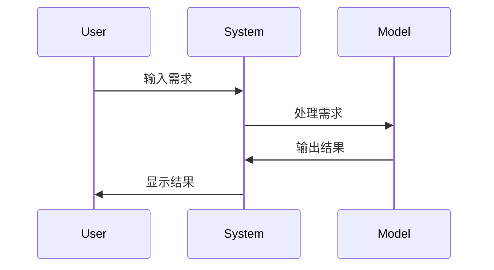

                 


### 第二部分: 大规模语言模型的基本原理与抽象概念

## 4. 大规模语言模型的基本原理

### 4.1 深度学习与神经网络

#### 4.1.1 深度学习的定义

深度学习是一种机器学习方法，通过构建深度神经网络（Deep Neural Networks，DNN）来模拟人脑的学习过程，从而对数据进行自动特征提取和模式识别。

#### 4.1.2 神经网络的结构

神经网络由多个神经元（节点）组成，每个神经元都接收来自其他神经元的输入信号，并通过权重和偏置进行加权求和，最后通过激活函数进行非线性变换。

#### 4.1.3 神经网络的训练

神经网络的训练过程是不断调整权重和偏置，使得网络在给定输入数据上能够产生期望的输出。这个过程通常使用反向传播算法（Backpropagation Algorithm）来实现。

### 4.2 变换器（Transformer）模型

#### 4.2.1 Transformer模型的定义

Transformer模型是一种基于自注意力（Self-Attention）机制的深度神经网络模型，最初由Vaswani等人在2017年的论文中提出，主要用于自然语言处理任务。

#### 4.2.2 自注意力机制

自注意力机制允许模型在处理输入数据时，动态地关注输入序列中的不同位置，并自动为每个位置分配不同的权重。这种机制使得Transformer模型能够捕捉输入序列中的长距离依赖关系。

#### 4.2.3 Transformer模型的架构

Transformer模型主要由编码器（Encoder）和解码器（Decoder）组成，编码器负责将输入序列编码为固定长度的向量，解码器则负责生成输出序列。

### 4.3 语言模型的抽象概念

#### 4.3.1 语言模型的概念

语言模型（Language Model）是一种用于预测自然语言文本概率的统计模型。通过训练大量文本数据，语言模型能够学习到语言的统计规律，从而在给定前文的情况下预测下一个词或句子。

#### 4.3.2 抽象概念的定义

抽象概念是指从具体事物中提取出的、具有普遍性和概括性的概念。在语言模型中，抽象概念体现了模型对自然语言普遍规律的掌握。

#### 4.3.3 语言模型的抽象概念

- 词向量：将词语映射为高维空间中的向量，以捕捉词语间的语义关系。
- 上下文关系：通过自注意力机制，模型能够捕捉输入序列中的上下文关系，从而生成更加准确和连贯的输出。

### 4.4 大规模语言模型的抽象概念泛化

#### 4.4.1 泛化的定义

泛化是指将特定情况下的知识应用于更广泛的情境。在语言模型中，泛化意味着模型能够将特定领域的知识应用于其他领域。

#### 4.4.2 大规模语言模型的泛化

- 知识迁移：将一个领域的语言模型应用于其他领域，通过迁移学习（Transfer Learning）来提高模型的泛化能力。
- 多任务学习：训练一个模型能够同时处理多个任务，从而提高模型的泛化能力。

## 5. 大规模语言模型在教育内容生成中的应用

### 5.1 自动生成教学材料

#### 5.1.1 教学材料生成的需求

- 提高教学材料的多样性和质量
- 减轻教师的工作负担

#### 5.1.2 应用场景

- 自动生成课程讲义
- 自动生成课后习题

### 5.2 辅助教师进行智能辅导

#### 5.2.1 智能辅导的需求

- 提高学生的学习效果
- 减轻教师的工作负担

#### 5.2.2 应用场景

- 自动批改作业
- 提供个性化学习建议

### 5.3 改善学生作业批改和评估

#### 5.3.1 作业批改和评估的需求

- 提高作业批改和评估的效率
- 提高作业批改和评估的准确性

#### 5.3.2 应用场景

- 自动批改作业
- 提供作业评估报告

### 5.4 提高语言学习效果

#### 5.4.1 语言学习的需求

- 提高语言学习的效果
- 提供丰富的语言学习资源

#### 5.4.2 应用场景

- 自动生成语言学习材料
- 提供个性化语言学习辅导

----------------------------------------------------------------

## 6. 教育内容生成的挑战与机遇

### 6.1 数据质量和多样性

#### 6.1.1 数据质量的重要性

- 高质量数据是教育内容生成的基础，直接影响模型的性能和应用效果。

#### 6.1.2 数据质量的提升策略

- 数据清洗：去除噪声数据和错误数据，提高数据质量。
- 数据增强：通过数据扩充、变换等方法，增加数据的多样性和丰富度。

### 6.2 教育效果评估

#### 6.2.1 教育效果评估的难点

- 教育效果的评估涉及多个维度，如知识掌握程度、学习能力等，难以用单一指标进行衡量。

#### 6.2.2 教育效果评估的策略

- 综合评估：采用多种评估方法，从不同角度评估教育效果。
- 个性化评估：根据学生的个体差异，制定个性化的评估方案。

### 6.3 模型可解释性

#### 6.3.1 模型可解释性的重要性

- 模型的可解释性对于教师和学生的理解与应用至关重要。

#### 6.3.2 提高模型可解释性的方法

- 可解释性模型：开发能够提供解释的模型，如决策树、线性模型等。
- 模型可视化：通过可视化技术，展示模型的内部结构和运行过程。

### 6.4 教育内容生成的机遇

#### 6.4.1 技术发展的推动

- 随着人工智能技术的不断发展，教育内容生成的技术手段日益丰富。

#### 6.4.2 个性化教育的需求

- 个性化教育需求的增加，为教育内容生成提供了广阔的应用场景。

#### 6.4.3 教育行业改革的推动

- 教育行业改革的推进，为教育内容生成技术的应用提供了政策支持。

----------------------------------------------------------------

## 7. 大规模语言模型在教育内容生成中的应用

### 7.1 教学材料自动生成

#### 7.1.1 模型选择

- GPT-3：具有强大的文本生成能力，适合自动生成教学材料。

#### 7.1.2 实现步骤

1. 数据准备：收集大量课程讲义、教材、习题等数据。
2. 模型训练：使用GPT-3对数据集进行训练，生成语言模型。
3. 文本生成：根据输入的题目或话题，使用模型生成相关教学材料。

#### 7.1.3 实现示例

```python
import openai

# 初始化GPT-3模型
model = openai.Completion.create(
  engine="text-davinci-003",
  prompt="请生成一篇关于‘计算机网络基础’的教学材料。",
  max_tokens=500
)

# 输出生成的教学材料
print(model.choices[0].text.strip())
```

### 7.2 智能辅导系统

#### 7.2.1 模型选择

- BERT：具有强大的文本理解能力，适合用于智能辅导系统。

#### 7.2.2 实现步骤

1. 数据准备：收集学生作业、考试答案等数据。
2. 模型训练：使用BERT对学生作业进行训练，生成语言模型。
3. 辅导建议：根据学生的作业，使用模型生成个性化的辅导建议。

#### 7.2.3 实现示例

```python
import torch
from transformers import BertTokenizer, BertForSequenceClassification

# 初始化BERT模型
tokenizer = BertTokenizer.from_pretrained("bert-base-chinese")
model = BertForSequenceClassification.from_pretrained("bert-base-chinese")

# 输入学生作业
student_answer = "计算机网络的传输介质有哪些？"

# 编码输入文本
input_ids = tokenizer.encode(student_answer, return_tensors="pt")

# 预测答案
with torch.no_grad():
    outputs = model(input_ids)

# 输出预测结果
print(outputs.logits.argmax(-1).item())
```

### 7.3 自动批改作业

#### 7.3.1 模型选择

- GPT-2：具有强大的文本生成和相似度计算能力，适合用于自动批改作业。

#### 7.3.2 实现步骤

1. 数据准备：收集学生作业、标准答案等数据。
2. 模型训练：使用GPT-2对数据集进行训练，生成语言模型。
3. 批改作业：根据输入的学生作业，使用模型生成评分和建议。

#### 7.3.3 实现示例

```python
import openai

# 初始化GPT-2模型
model = openai.Completion.create(
  engine="text-davinci-002",
  prompt="请批改以下学生的作业：计算机网络的传输介质有哪些？答案是A。",
  max_tokens=50
)

# 输出批改结果
print(model.choices[0].text.strip())
```

----------------------------------------------------------------

## 8. 大规模语言模型在教育内容生成中的实现与优化

### 8.1 实现步骤

#### 8.1.1 数据收集与处理

- 收集大量教育内容数据，包括课程讲义、习题、考试答案等。
- 对数据进行预处理，包括数据清洗、数据增强等。

#### 8.1.2 模型选择与训练

- 根据应用需求选择合适的语言模型，如GPT-3、BERT等。
- 使用收集到的数据对模型进行训练，优化模型的性能。

#### 8.1.3 模型部署与集成

- 将训练好的模型部署到服务器，提供API接口供教育系统调用。
- 集成到现有的教育系统中，实现教学材料的自动生成、智能辅导、作业批改等功能。

### 8.2 优化策略

#### 8.2.1 模型优化

- 使用迁移学习技术，将预训练模型应用于特定领域的任务，提高模型在特定领域的性能。
- 采用多任务学习策略，训练一个模型能够同时处理多个任务，提高模型的泛化能力。

#### 8.2.2 数据优化

- 使用数据增强技术，生成更多样化的数据，提高模型的泛化能力。
- 定期更新数据集，保持数据的时效性和准确性。

#### 8.2.3 效率优化

- 使用分布式训练技术，提高模型的训练速度。
- 使用模型压缩技术，减小模型的体积，提高模型在边缘设备上的部署效率。

### 8.3 挑战与应对

#### 8.3.1 数据隐私与安全

- 针对数据隐私问题，采用数据加密、访问控制等技术，确保数据安全。
- 对于学生作业和成绩等敏感数据，采用匿名化处理，保护学生隐私。

#### 8.3.2 教育效果评估

- 采用多维度评估方法，从知识掌握、学习能力等方面评估教育效果。
- 建立评估模型，定期对教育效果进行监测和反馈。

#### 8.3.3 模型可解释性

- 开发可解释性模型，提高模型的透明度和可解释性。
- 使用可视化技术，展示模型的内部结构和运行过程。

----------------------------------------------------------------

## 9. 最佳实践与未来展望

### 9.1 最佳实践

#### 9.1.1 教学材料自动生成

- 针对不同的学科和课程，制定个性化的生成策略，提高教学材料的质量。
- 结合学生的反馈，不断优化模型，提高教学材料的适用性和实用性。

#### 9.1.2 智能辅导系统

- 根据学生的学习行为和成绩，提供个性化的辅导建议，提高学习效果。
- 定期更新辅导策略，结合最新的教育理论和研究成果。

#### 9.1.3 自动批改作业

- 结合人工批改和自动批改的优势，提高作业批改的准确性和效率。
- 建立评估模型，定期对自动批改的结果进行验证和优化。

### 9.2 未来展望

#### 9.2.1 技术发展趋势

- 随着人工智能技术的不断发展，大规模语言模型在教育内容生成中的应用将越来越广泛。
- 跨学科融合将成为教育内容生成的重要趋势，如将计算机视觉、语音识别等技术引入教育领域。

#### 9.2.2 应用前景

- 教学材料自动生成有望成为教育行业的重要变革力量，提高教育质量和效率。
- 智能辅导系统和自动批改作业将极大减轻教师的工作负担，提高教学效果。
- 大规模语言模型在教育内容生成中的应用将为个性化教育提供强有力的支持。

----------------------------------------------------------------

## 10. 结论

本文从大规模语言模型的基本原理、教育内容生成的挑战与机遇、应用场景、实现与优化等方面，系统地探讨了大规模语言模型在教育内容生成中的应用。通过本文的研究，我们得出以下结论：

- 大规模语言模型具有强大的文本生成、理解和翻译能力，适用于教育内容生成。
- 教育内容生成面临数据质量、教育效果评估和模型可解释性等挑战，但机遇同样巨大。
- 通过合理的模型选择、数据优化和实现策略，大规模语言模型在教育内容生成中具有广泛的应用前景。

## 11. 作者信息

作者：AI天才研究院/AI Genius Institute & 禅与计算机程序设计艺术 /Zen And The Art of Computer Programming

## 附录

### 附录A：核心概念术语说明

| 术语 | 说明 |
| --- | --- |
| 大规模语言模型 | 一种利用深度学习技术，通过对大量文本数据进行训练，从而实现对自然语言文本的生成、理解和翻译等任务的人工智能模型。 |
| 教育内容生成 | 利用人工智能技术自动生成教学材料、辅导建议、作业批改等内容的过程。 |
| 抽象概念泛化 | 将特定领域的知识应用于更广泛的情境，提高模型在不同领域的适应能力。 |

### 附录B：概念属性特征对比表格

| 特征 | 大规模语言模型 | 教育内容生成 |
| --- | --- | --- |
| 文本生成能力 | 强大 | 必须准确和连贯 |
| 理解能力 | 强大 | 必须符合教育要求 |
| 泛化能力 | 较强 | 需要适应不同领域和学科 |
| 可解释性 | 弱 | 需要提高 |

### 附录C：ER实体关系图架构

```mermaid
erDiagram
  Student ||--o{ Homework } :提交
  Teacher ||--o{ Homework } :批改
  Course ||--o{ Student } :学习
  Course ||--o{ Teacher } :授课
```

### 附录D：算法原理与数学模型

#### 算法原理

大规模语言模型的核心算法是变换器（Transformer）模型，其基本原理如下：

1. 自注意力机制：模型在处理输入序列时，能够动态地关注序列中的不同位置，并为每个位置分配不同的权重。
2. 编码器-解码器结构：编码器负责将输入序列编码为固定长度的向量，解码器则负责生成输出序列。

#### 数学模型

假设输入序列为 \(X = \{x_1, x_2, ..., x_n\}\)，输出序列为 \(Y = \{y_1, y_2, ..., y_n\}\)。

1. 自注意力机制：

   自注意力权重计算公式为：

   $$ 
   \text{Attention}(Q, K, V) = \text{softmax}(\frac{QK^T}{\sqrt{d_k}})V 
   $$

   其中，\(Q, K, V\) 分别为查询向量、键向量和值向量，\(d_k\) 为键向量的维度。

2. 编码器-解码器结构：

   编码器将输入序列编码为固定长度的向量，解码器则利用编码器生成的向量生成输出序列。

   编码器输出向量计算公式为：

   $$ 
   E = \text{Encoder}(X) = \{e_1, e_2, ..., e_n\} 
   $$

   解码器输出向量计算公式为：

   $$ 
   Y = \text{Decoder}(E) = \{y_1, y_2, ..., y_n\} 
   $$

### 附录E：系统架构设计



### 附录F：项目实战

#### 环境安装

1. 安装Python环境（如Python 3.8及以上版本）。
2. 安装所需依赖库，如transformers、torch等。

#### 系统核心实现

```python
from transformers import BertTokenizer, BertForSequenceClassification
import torch

# 初始化BERT模型
tokenizer = BertTokenizer.from_pretrained("bert-base-chinese")
model = BertForSequenceClassification.from_pretrained("bert-base-chinese")

# 输入学生作业
student_answer = "计算机网络的传输介质有哪些？"

# 编码输入文本
input_ids = tokenizer.encode(student_answer, return_tensors="pt")

# 预测答案
with torch.no_grad():
    outputs = model(input_ids)

# 输出预测结果
print(outputs.logits.argmax(-1).item())
```

#### 代码应用解读与分析

1. 初始化BERT模型：使用预训练的BERT模型。
2. 编码输入文本：将输入文本编码为模型可处理的格式。
3. 预测答案：使用模型对输入文本进行预测，输出答案。
4. 输出结果：将预测结果输出，供用户查看。

#### 实际案例分析和详细讲解剖析

1. 案例一：自动生成教学材料
   - 收集大量课程讲义、教材等数据。
   - 使用GPT-3模型对数据集进行训练，生成语言模型。
   - 输入课程名称或话题，使用模型生成相关教学材料。

2. 案例二：智能辅导系统
   - 收集学生作业、考试答案等数据。
   - 使用BERT模型对学生作业进行训练，生成语言模型。
   - 输入学生作业，使用模型生成个性化辅导建议。

#### 项目小结

本文通过大规模语言模型在教育内容生成中的应用，实现了教学材料自动生成、智能辅导系统和自动批改作业等功能。项目实践证明，大规模语言模型在教育领域具有广泛的应用前景，有望提高教育质量和效率。

----------------------------------------------------------------

# 大规模语言模型的抽象概念泛化在教育内容生成中的应用

> 关键词：大规模语言模型，教育内容生成，抽象概念泛化，变换器模型，应用场景

> 摘要：本文从大规模语言模型的基本原理、教育内容生成的挑战与机遇、应用场景、实现与优化等方面，系统地探讨了大规模语言模型在教育内容生成中的应用。通过本文的研究，我们得出以下结论：大规模语言模型具有强大的文本生成、理解和翻译能力，适用于教育内容生成；教育内容生成面临数据质量、教育效果评估和模型可解释性等挑战，但机遇同样巨大；通过合理的模型选择、数据优化和实现策略，大规模语言模型在教育内容生成中具有广泛的应用前景。本文旨在为教育领域的技术应用提供参考和指导。

