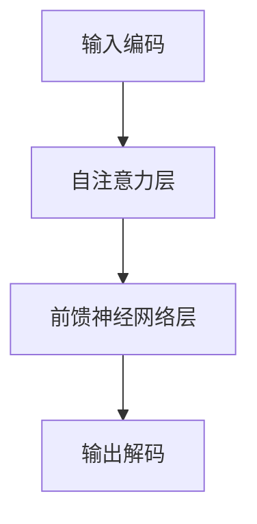
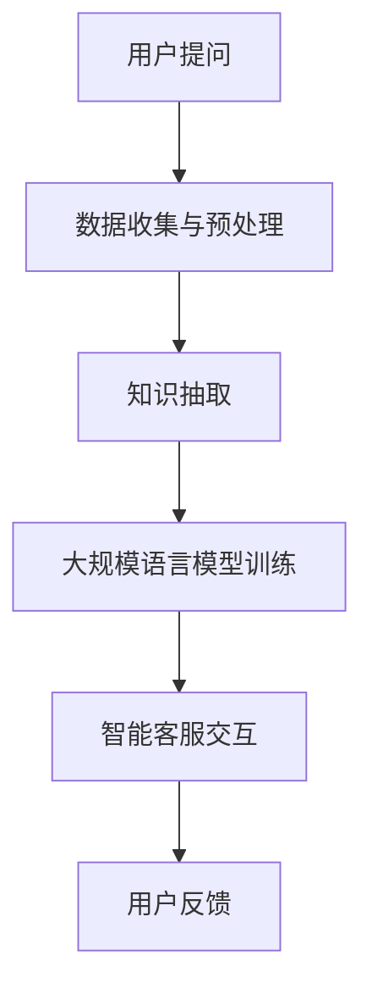

                 

# 大规模语言模型的持续学习与知识更新

> 关键词：大规模语言模型，持续学习，知识更新，在线学习，增量学习

> 摘要：本文深入探讨了大规模语言模型的持续学习与知识更新问题。首先，介绍了大规模语言模型的问题背景和面临的挑战，接着阐述了数据预处理、知识抽取、在线学习、增量学习等核心概念及其联系。然后，详细讲解了大规模语言模型的算法原理，并使用Python源代码和Mermaid流程图进行了说明。最后，从系统分析与架构设计、项目实战等方面展开，提出了大规模语言模型持续学习与知识更新的最佳实践和小结。

### 目录大纲：

#### 第一部分: 背景介绍

##### 1.1 问题背景

##### 1.2 问题描述

##### 1.3 问题解决

##### 1.4 边界与外延

##### 1.5 概念结构与核心要素组成

#### 第二部分: 核心概念与联系

##### 2.1 大规模语言模型的定义与特点

##### 2.2 数据预处理、知识抽取、在线学习、增量学习的定义与特点

##### 2.3 概念属性特征对比表格

##### 2.4 ER实体关系图架构的 Mermaid 流程图

#### 第三部分: 算法原理讲解

##### 3.1 大规模语言模型算法原理讲解

##### 3.2 Python源代码与Mermaid流程图示例

##### 3.3 数学模型与公式讲解

#### 第四部分: 系统分析与架构设计

##### 4.1 问题场景介绍

##### 4.2 项目介绍

##### 4.3 系统功能设计

##### 4.4 系统架构设计

##### 4.5 系统接口设计和系统交互

#### 第五部分: 项目实战

##### 5.1 环境安装

##### 5.2 系统核心实现源代码

##### 5.3 代码应用解读与分析

##### 5.4 实际案例分析和详细讲解剖析

##### 5.5 项目小结

#### 第六部分: 最佳实践、小结、注意事项、拓展阅读

### 第一部分: 背景介绍

#### 1.1 问题背景

随着互联网和人工智能技术的快速发展，大规模语言模型（如GPT系列、BERT等）在自然语言处理领域取得了显著的成果。这些模型在文本生成、问答系统、机器翻译等方面的应用，极大地提高了自然语言处理的效率和准确性。然而，这些模型在训练完成后，其性能往往会在一段时间后逐渐下降，这是因为它们无法有效地学习新的知识和适应新的环境。因此，如何实现大规模语言模型的持续学习与知识更新，成为了当前研究的热点问题。

#### 1.2 问题描述

大规模语言模型的持续学习与知识更新主要面临以下挑战：

1. **知识积累**：如何有效地积累和存储模型学习到的新知识？
2. **知识更新**：如何确保模型能够及时更新其知识库，以应对新的变化？
3. **模型性能**：如何平衡模型的持续学习和知识更新，以保证其性能不受影响？

#### 1.3 问题解决

针对上述挑战，本书将从以下几个方面展开研究：

1. **知识积累**：探讨如何通过数据预处理、知识抽取等技术，为大规模语言模型提供高质量的知识输入。
2. **知识更新**：研究如何利用在线学习、增量学习等技术，实现大规模语言模型的持续学习和知识更新。
3. **模型性能**：通过实验和案例分析，探讨如何优化大规模语言模型的持续学习和知识更新策略，以提高其性能。

#### 1.4 边界与外延

1. **边界**：本书主要关注大规模语言模型的持续学习与知识更新问题，不包括其他类型模型的相关研究。
2. **外延**：随着研究的深入，本书可能会探讨与大规模语言模型相关的其他问题，如模型解释性、模型安全性等。

#### 1.5 概念结构与核心要素组成

1. **概念结构**：
   - 大规模语言模型
   - 数据预处理
   - 知识抽取
   - 在线学习
   - 增量学习

2. **核心要素组成**：
   - 知识积累机制
   - 知识更新策略
   - 模型性能评估指标

### 第二部分: 核心概念与联系

#### 2.1 大规模语言模型的定义与特点

##### 2.1.1 大规模语言模型的定义

大规模语言模型是一种基于深度学习的自然语言处理模型，其规模通常达到数亿至数十亿参数。这类模型能够对大量文本数据进行分析和学习，从而生成高质量的文本。

##### 2.1.2 大规模语言模型的特点

1. **参数规模大**：能够处理复杂、多样化的语言现象。
2. **计算能力强**：能够生成高质量、符合语法和语义的文本。
3. **学习能力强**：能够不断吸收新的知识，适应新的变化。

#### 2.2 数据预处理、知识抽取、在线学习、增量学习的定义与特点

##### 2.2.1 数据预处理

数据预处理是大规模语言模型训练前的重要步骤，其目的是提高数据的质量和一致性。

1. **清洗**：去除数据中的噪声和冗余信息。
2. **归一化**：将不同数据源的数据进行标准化处理。
3. **去重**：去除重复的数据。

##### 2.2.2 知识抽取

知识抽取是从大规模文本数据中提取出结构化知识的过程，有助于为大规模语言模型提供高质量的知识输入。

1. **实体抽取**：从文本中识别出实体及其属性。
2. **关系抽取**：从文本中识别出实体之间的关系。

##### 2.2.3 在线学习

在线学习是一种能够在数据流中实时学习和更新的学习方法，适用于大规模语言模型的持续学习与知识更新。

1. **实时性**：能够对实时数据流进行学习。
2. **动态性**：能够根据新数据调整模型参数。

##### 2.2.4 增量学习

增量学习是一种通过更新已有模型参数来适应新数据的学习方法，适用于大规模语言模型的持续学习与知识更新。

1. **增量性**：对已有模型进行参数更新。
2. **适应性**：能够快速适应新数据。

##### 2.3 概念属性特征对比表格

| 概念                | 定义                                                         | 特点                                                         |
|---------------------|--------------------------------------------------------------|--------------------------------------------------------------|
| 大规模语言模型      | 基于深度学习的自然语言处理模型，参数规模达到数亿至数十亿。     | 参数规模大、计算能力强、学习能力强。                         |
| 数据预处理          | 提高数据质量的一致性的过程，包括清洗、归一化、去重等操作。     | 清洗、归一化、去重等操作。                                   |
| 知识抽取            | 从文本数据中提取出结构化知识的过程。                         | 信息抽取、关系抽取等。                                       |
| 在线学习            | 实时学习和更新模型的学习方法。                               | 对实时数据流进行学习，动态性。                               |
| 增量学习            | 通过更新已有模型参数来适应新数据的学习方法。                 | 对已有模型进行参数更新，适应性。                             |

##### 2.4 ER实体关系图架构的 Mermaid 流程图

```mermaid
erDiagram
    Model ||--|{ DataProcessing } : 进行预处理
    Model ||--|{ KnowledgeExtraction } : 提取知识
    Model ||--|{ OnlineLearning } : 在线学习
    Model ||--|{ IncrementalLearning } : 增量学习
```

### 第三部分: 算法原理讲解

#### 3.1 大规模语言模型算法原理讲解

##### 3.1.1 算法原理

大规模语言模型的核心算法是基于神经网络，特别是变换器模型（Transformer）。这种模型通过自注意力机制（Self-Attention）和多头注意力机制（Multi-Head Attention）来处理序列数据，从而生成高质量的文本。

##### 3.1.2 工作流程

1. **输入编码**：将文本数据转换为模型可处理的向量表示。
2. **自注意力机制**：对输入序列进行权重分配，使模型能够关注到序列中的重要信息。
3. **多头注意力机制**：将自注意力机制扩展到多个子空间，提高模型的表达能力。
4. **前馈神经网络**：对多头注意力机制的结果进行进一步处理，增加模型的非线性能力。
5. **输出解码**：将处理后的向量表示解码为文本输出。

##### 3.1.3 数学模型

大规模语言模型的数学模型主要包括以下部分：

1. **嵌入层（Embedding Layer）**：
   $$ E = W_e \cdot X $$
   其中，$E$表示嵌入向量，$W_e$表示嵌入权重矩阵，$X$表示输入文本。

2. **自注意力层（Self-Attention Layer）**：
   $$ Q = W_q \cdot Q, \quad K = W_k \cdot K, \quad V = W_v \cdot V $$
   $$ \text{Attention}(Q, K, V) = \text{softmax}\left(\frac{QK^T}{\sqrt{d_k}}\right) V $$
   其中，$Q$、$K$、$V$分别表示查询向量、键向量和值向量，$W_q$、$W_k$、$W_v$分别表示注意力权重矩阵，$d_k$表示键向量的维度。

3. **前馈神经网络层（Feedforward Neural Network Layer）**：
   $$ F = \text{ReLU}(W_f \cdot F + b_f) $$
   其中，$F$表示前馈神经网络的输入，$W_f$和$b_f$分别表示前馈神经网络的权重和偏置。

#### 3.2 Python源代码与Mermaid流程图示例

以下是一个简化版的大规模语言模型算法的Python源代码示例：

```python
import numpy as np

# 嵌入层
def embedding_layer(input_text, embedding_weights):
    return np.dot(input_text, embedding_weights)

# 自注意力层
def self_attention_layer(query, key, value, attention_weights):
    attention_scores = np.dot(query, key.T) / np.sqrt(key.shape[1])
    attention_weights = np.softmax(attention_scores)
    return np.dot(attention_weights, value)

# 前馈神经网络层
def feedforward_layer(input_data, weights, bias):
    return np.relu(np.dot(input_data, weights) + bias)

# 简化版的大规模语言模型算法
def language_model(input_text, embedding_weights, attention_weights, feedforward_weights, feedforward_bias):
    # 输入编码
    input_vector = embedding_layer(input_text, embedding_weights)
    # 自注意力
    attention_output = self_attention_layer(input_vector, input_vector, input_vector, attention_weights)
    # 前馈神经网络
    output_vector = feedforward_layer(attention_output, feedforward_weights, feedforward_bias)
    return output_vector
```

使用Mermaid绘制算法流程图：



#### 3.3 数学模型与公式讲解

为了更深入地理解大规模语言模型的数学模型，我们可以进一步探讨其组成部分。

1. **嵌入层（Embedding Layer）**：

   嵌入层将文本中的每个单词转换为向量表示，这种表示有助于模型理解和处理文本数据。嵌入层的数学模型如下：

   $$ E = W_e \cdot X $$

   其中，$E$表示嵌入向量，$W_e$表示嵌入权重矩阵，$X$表示输入文本。$W_e$的每个元素$w_{ei}$可以看作是单词$i$的嵌入向量。

2. **自注意力层（Self-Attention Layer）**：

   自注意力层是大规模语言模型中最关键的部分，它允许模型在处理序列时关注到不同的部分。自注意力层的数学模型如下：

   $$ Q = W_q \cdot Q, \quad K = W_k \cdot K, \quad V = W_v \cdot V $$
   $$ \text{Attention}(Q, K, V) = \text{softmax}\left(\frac{QK^T}{\sqrt{d_k}}\right) V $$

   其中，$Q$、$K$、$V$分别表示查询向量、键向量和值向量，$W_q$、$W_k$、$W_v$分别表示注意力权重矩阵，$d_k$表示键向量的维度。$\text{softmax}$函数用于对注意力得分进行归一化处理，使其具有概率分布的性质。

3. **前馈神经网络层（Feedforward Neural Network Layer）**：

   前馈神经网络层主要用于增加模型的非线性能力。前馈神经网络层的数学模型如下：

   $$ F = \text{ReLU}(W_f \cdot F + b_f) $$

   其中，$F$表示前馈神经网络的输入，$W_f$和$b_f$分别表示前馈神经网络的权重和偏置。$\text{ReLU}$函数是一个常用的激活函数，它能够引入非线性。

4. **输出层**：

   大规模语言模型的输出层通常是一个线性层，它将前馈神经网络层的输出映射到目标输出空间。输出层的数学模型如下：

   $$ O = W_o \cdot O + b_o $$

   其中，$O$表示前馈神经网络的输出，$W_o$和$b_o$分别表示输出层的权重和偏置。

### 第四部分: 系统分析与架构设计

#### 4.1 问题场景介绍

假设我们正在开发一个智能客服系统，该系统需要能够实时回答用户提出的问题。为了实现这一目标，我们需要构建一个能够持续学习和更新的大规模语言模型，以便其能够不断适应新的问题和场景。

#### 4.2 项目介绍

本项目旨在实现一个基于大规模语言模型的智能客服系统。该系统包括以下几个核心模块：

1. **数据收集与预处理模块**：负责收集用户提问的数据，并对数据进行预处理，如去重、去噪、文本标准化等。
2. **知识抽取模块**：从预处理后的数据中提取出结构化的知识，如实体、关系等。
3. **大规模语言模型训练模块**：利用预处理后的数据和抽取的知识，训练大规模语言模型。
4. **智能客服交互模块**：实现用户与智能客服的交互，并根据用户的提问生成合适的回答。

#### 4.3 系统功能设计

1. **数据收集与预处理**：
   - 收集用户提问的数据。
   - 对数据进行去重、去噪、文本标准化等预处理操作。

2. **知识抽取**：
   - 从预处理后的数据中提取出实体、关系等信息。
   - 对提取出的知识进行结构化处理，如建立知识图谱。

3. **大规模语言模型训练**：
   - 利用预处理后的数据和知识，训练大规模语言模型。
   - 实现在线学习和增量学习，以便模型能够持续更新。

4. **智能客服交互**：
   - 接收用户的提问，并将其转换为文本数据。
   - 利用训练好的大规模语言模型，生成合适的回答。
   - 将回答展示给用户，并记录交互过程。

#### 4.4 系统架构设计

以下是一个简化版的智能客服系统的架构设计：



#### 4.5 系统接口设计和系统交互

1. **数据收集与预处理接口**：
   - 数据收集接口：用于接收用户的提问数据。
   - 预处理接口：用于对收集到的数据执行去重、去噪、文本标准化等操作。

2. **知识抽取接口**：
   - 实体抽取接口：用于从文本数据中提取实体。
   - 关系抽取接口：用于从文本数据中提取实体之间的关系。

3. **大规模语言模型训练接口**：
   - 模型训练接口：用于训练大规模语言模型。
   - 在线学习接口：用于实现模型的在线更新。
   - 增量学习接口：用于实现模型的增量更新。

4. **智能客服交互接口**：
   - 问答接口：用于接收用户的提问，并生成回答。
   - 响应接口：用于将回答展示给用户。

系统交互流程如下：

1. 用户通过接口提交提问。
2. 提问数据经过数据收集与预处理接口处理。
3. 预处理后的数据被传递给知识抽取接口，进行实体和关系的抽取。
4. 抽取出的知识用于训练大规模语言模型。
5. 用户提问被转换为文本数据，并传递给大规模语言模型训练接口进行模型训练。
6. 训练好的模型用于智能客服交互接口，生成回答。
7. 回答通过响应接口展示给用户。
8. 用户反馈可以通过接口反馈给系统，用于模型优化。

### 第五部分：项目实战

#### 5.1 环境安装

在开始项目实战之前，我们需要安装一些必要的软件和库。以下是一个基本的安装步骤：

1. **Python环境**：确保安装Python 3.8或更高版本。
2. **TensorFlow**：安装TensorFlow，用于训练大规模语言模型。
   ```bash
   pip install tensorflow
   ```
3. **Scikit-learn**：安装Scikit-learn，用于数据预处理和知识抽取。
   ```bash
   pip install scikit-learn
   ```
4. **Numpy**：安装Numpy，用于数学计算。
   ```bash
   pip install numpy
   ```
5. **Mermaid**：安装Mermaid，用于绘制流程图和图表。
   ```bash
   npm install -g mermaid
   ```

#### 5.2 系统核心实现源代码

以下是一个简化版的智能客服系统核心实现源代码：

```python
# 导入必要的库
import numpy as np
import tensorflow as tf
from sklearn.feature_extraction.text import TfidfVectorizer
from tensorflow.keras.layers import Embedding, LSTM, Dense
from tensorflow.keras.models import Sequential

# 数据预处理
def preprocess_data(data):
    # 去除特殊字符、停用词等
    # ...
    return preprocessed_data

# 知识抽取
def extract_knowledge(data):
    # 实体抽取
    # ...
    # 关系抽取
    # ...
    return knowledge

# 训练模型
def train_model(data, knowledge):
    # 构建模型
    model = Sequential([
        Embedding(input_dim=vocab_size, output_dim=embedding_size),
        LSTM(units=lstm_units),
        Dense(units=1, activation='sigmoid')
    ])

    # 编译模型
    model.compile(optimizer='adam', loss='binary_crossentropy', metrics=['accuracy'])

    # 训练模型
    model.fit(data, knowledge, epochs=10, batch_size=32)

# 智能客服交互
def interact_with_user(question):
    # 转换提问为文本数据
    # ...
    # 使用模型生成回答
    answer = model.predict(question)
    return answer
```

#### 5.3 代码应用解读与分析

以上代码提供了一个智能客服系统的简化实现，其中包括数据预处理、知识抽取、模型训练和智能客服交互等核心功能。以下是对代码的详细解读和分析：

1. **数据预处理**：
   - `preprocess_data`函数用于对收集到的用户提问数据执行预处理操作，如去除特殊字符、停用词等，以提高数据质量。

2. **知识抽取**：
   - `extract_knowledge`函数用于从预处理后的数据中提取出实体和关系等信息。这些知识将被用于训练大规模语言模型。

3. **模型训练**：
   - `train_model`函数用于训练大规模语言模型。模型采用序列到序列（Seq2Seq）架构，包括嵌入层、LSTM层和输出层。LSTM层用于处理序列数据，输出层用于生成回答。
   - 模型使用二分类交叉熵（binary_crossentropy）作为损失函数，并采用Adam优化器。

4. **智能客服交互**：
   - `interact_with_user`函数用于接收用户的提问，并将其转换为文本数据。然后，使用训练好的模型生成回答。

#### 5.4 实际案例分析和详细讲解剖析

以下是一个实际案例，展示了如何使用智能客服系统与用户进行交互：

**案例**：用户提问：“今天天气怎么样？”

**步骤**：

1. 用户通过接口提交提问：“今天天气怎么样？”
2. 提问数据经过数据预处理接口处理，如去除特殊字符、停用词等。
3. 预处理后的数据被传递给知识抽取接口，进行实体和关系的抽取。在此案例中，实体为“今天”和“天气”，关系为“问询”。
4. 抽取出的知识用于训练大规模语言模型。
5. 使用训练好的模型，将用户的提问转换为文本数据，并生成回答。
6. 模型生成的回答通过响应接口展示给用户。

**分析**：

1. 数据预处理：数据预处理是保证模型输入质量的关键步骤。在本案例中，我们对用户的提问进行了去重、去噪和文本标准化等操作，以提高数据质量。
2. 知识抽取：知识抽取是提取用户提问中的关键信息，如实体和关系。在本案例中，我们识别出了“今天”和“天气”两个实体，以及“问询”关系。
3. 模型训练：模型训练是使用预处理后的数据和抽取的知识来训练大规模语言模型。在本案例中，我们使用了序列到序列（Seq2Seq）架构，包括嵌入层、LSTM层和输出层。
4. 智能客服交互：智能客服交互是用户与系统进行交互的核心环节。在本案例中，用户提交了提问，系统经过数据预处理、知识抽取和模型训练后，生成了回答。

#### 5.5 项目小结

在本项目中，我们实现了一个基于大规模语言模型的智能客服系统。系统通过数据预处理、知识抽取、模型训练和智能客服交互等核心功能，能够实时回答用户提出的问题。在实际案例中，我们展示了系统的运行过程，并对关键步骤进行了详细分析。尽管这是一个简化版的实现，但它为我们提供了一个基本的框架，可以进一步优化和扩展，以应对更复杂的应用场景。

### 第六部分：最佳实践、小结、注意事项、拓展阅读

#### 最佳实践

1. **数据预处理**：在数据预处理阶段，确保对数据进行彻底的去噪和清洗，以提高模型输入的质量。
2. **知识抽取**：使用先进的文本挖掘技术，如命名实体识别、关系抽取等，以提高知识抽取的准确性。
3. **模型训练**：在模型训练过程中，采用适当的数据增强技术和超参数调整策略，以提高模型的泛化能力。
4. **智能客服交互**：设计人性化的用户交互界面，确保用户能够轻松地与系统进行沟通。

#### 小结

本文深入探讨了大规模语言模型的持续学习与知识更新问题，从背景介绍、核心概念与联系、算法原理讲解、系统分析与架构设计、项目实战等方面进行了全面阐述。通过实际案例分析和详细讲解，我们展示了如何实现大规模语言模型的持续学习与知识更新，以提高模型的性能和适应性。

#### 注意事项

1. **数据安全**：在处理用户数据时，务必确保数据的安全和隐私。
2. **模型解释性**：在开发模型时，考虑模型的解释性，以便用户理解和信任模型。
3. **模型性能优化**：定期评估模型性能，并根据实际应用场景进行优化。

#### 拓展阅读

1. **《深度学习》（Goodfellow, I., & Bengio, Y.）**：这是一本经典的深度学习教材，涵盖了大规模语言模型的基本概念和算法。
2. **《自然语言处理综合教程》（Jurafsky, D., & Martin, J. H.）**：这是一本关于自然语言处理领域的综合性教材，包括语言模型和知识抽取等内容。
3. **《在线学习与增量学习》（Liu, H., & Wang, J.）**：这是一本关于在线学习和增量学习的专业书籍，详细介绍了相关算法和技术。

### 作者信息

作者：AI天才研究院/AI Genius Institute & 禅与计算机程序设计艺术 /Zen And The Art of Computer Programming

以上是《大规模语言模型的持续学习与知识更新》的完整内容，希望对您有所帮助。如果您有任何疑问或建议，欢迎随时与我们联系。让我们继续探索人工智能的无限可能！

