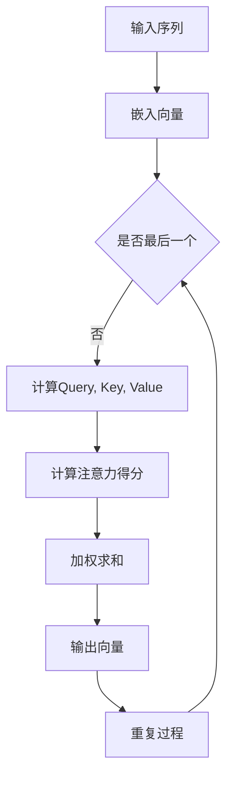
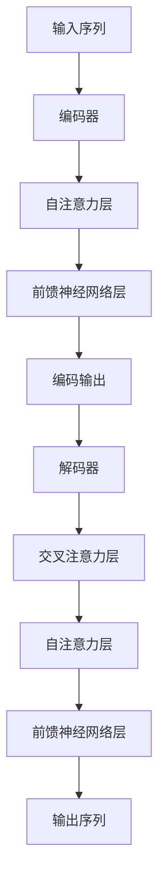
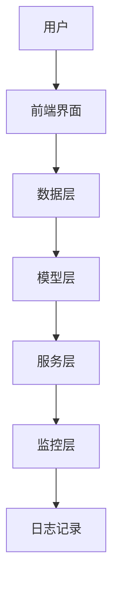
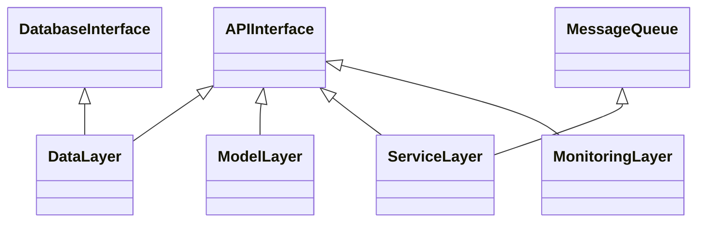

                 

### 摘要

本文将深入探讨大规模语言模型的持续学习策略。随着人工智能技术的迅猛发展，大规模语言模型已经在自然语言处理领域取得了显著的成果。然而，面对不断变化的语言环境，如何让语言模型具备持续学习的特性，以保持其高准确性和适应性，成为一个重要的研究方向。本文将从核心概念、算法原理、数学模型、系统设计与实现等多个角度，详细分析大规模语言模型的持续学习策略，并探讨其在实际应用中的效果和优化方法。通过本文的阅读，读者将对大规模语言模型的持续学习策略有一个全面而深刻的理解。

### 目录

1. **引言与背景介绍**
   - 问题背景与核心概念
   - 持续学习策略的定义
   - 研究意义与应用前景

2. **核心概念与联系**
   - 语言模型的组成要素
   - 持续学习策略的核心原理
   - 大规模语言模型与持续学习策略的联系

3. **算法原理讲解**
   - 大规模语言模型的算法原理
   - 持续学习策略的算法框架
   - 算法改进与创新

4. **数学模型与公式详解**
   - 数学模型基础
   - 数学公式应用
   - 公式推导与详细讲解

5. **系统设计与实现**
   - 系统架构设计
   - 系统实现与优化

6. **项目实战**
   - 实际案例分析
   - 项目实战与总结

7. **最佳实践与展望**
   - 最佳实践
   - 总结与展望

### 第一部分: 引言与背景介绍

#### 问题背景与核心概念

大规模语言模型（Large-scale Language Model，LLM）是指那些使用海量数据训练的、能够理解和生成人类语言的神经网络模型。这些模型在自然语言处理（Natural Language Processing，NLP）领域展现出了惊人的能力，能够进行文本分类、机器翻译、问答系统、语音识别等复杂任务。随着深度学习技术的发展，LLM的规模和复杂性不断增加，其在实际应用中的效果也逐步提升。

然而，在当前的技术环境中，语言模型面临着持续学习的挑战。持续学习是指模型能够不断地从新的数据中学习，并适应语言环境的变化，以保持其准确性和适应性。传统的训练方法通常依赖于静态的语料库，当语言环境发生变化时，模型的性能可能会显著下降。例如，网络流行语、新词的涌现以及语言习惯的变化，都可能导致语言模型的预测误差增大。因此，研究大规模语言模型的持续学习策略，成为当前自然语言处理领域的一个重要课题。

#### 持续学习策略的定义

持续学习策略是指一系列技术手段和方法，用于使语言模型能够动态地更新其参数，以适应新的数据和环境。这些策略包括但不限于以下几种：

1. **在线学习（Online Learning）**：在线学习是指模型在实时接收新的数据时，立即对其参数进行调整，以优化模型性能。这种方法能够快速适应语言环境的变化，但可能会面临计算复杂度较高和模型稳定性不足的问题。

2. **增量学习（Incremental Learning）**：增量学习是指模型在训练过程中，只对新增的数据进行学习，而不是重新训练整个模型。这种方法能够减少训练时间和计算资源消耗，但需要解决如何平衡新旧数据的权重问题。

3. **迁移学习（Transfer Learning）**：迁移学习是指利用已经训练好的模型在新任务上的性能，通过少量额外数据进一步训练新模型。这种方法能够利用已有模型的先验知识，加速新任务的训练过程。

4. **知识蒸馏（Knowledge Distillation）**：知识蒸馏是指将一个复杂模型的知识传递给一个简化的模型，使简化模型能够复现复杂模型的部分性能。这种方法能够在保持模型精度的同时，降低模型的复杂度。

#### 研究意义与应用前景

研究大规模语言模型的持续学习策略具有重要的理论和实际意义。从理论角度来看，持续学习能够深入探索神经网络模型的学习机制，推动深度学习技术的发展。从实际应用角度来看，具备持续学习能力的语言模型能够更好地适应不断变化的语言环境，提高其在实际任务中的性能和可靠性。

目前，大规模语言模型的持续学习策略已在多个领域取得了显著的成果。例如，在社交媒体平台上，持续学习能够帮助语言模型更好地理解和生成用户发布的动态内容；在客服领域，持续学习能够使聊天机器人更好地与用户进行交互，提供更个性化的服务。

然而，大规模语言模型的持续学习策略也面临一些挑战。例如，如何在保证模型性能的同时，避免数据泄露和隐私侵犯；如何设计高效的算法，以减少训练时间和计算资源消耗；如何确保模型在不同语言环境下的通用性和稳定性等。这些都是当前研究的重要方向。

总之，大规模语言模型的持续学习策略是自然语言处理领域的一个重要研究方向。通过深入研究持续学习策略，我们有望打造出更智能、更可靠的语音助手、聊天机器人、智能客服等应用，推动人工智能技术的发展和应用。

#### 核心概念与联系

在深入探讨大规模语言模型的持续学习策略之前，我们需要明确几个核心概念，并探讨它们之间的联系。

首先，我们来看一下“语言模型”的基本概念。语言模型（Language Model，LM）是一种用于预测下一个单词或字符的概率分布的数学模型。在自然语言处理中，语言模型是理解和生成自然语言的基础。早期的语言模型如N-gram模型，通过统计历史单词序列的概率来预测下一个单词。然而，随着深度学习技术的发展，现代语言模型如Transformer和BERT等，通过大规模的神经网络来捕捉语言的本质特征，能够生成更准确和流畅的文本。

其次，我们讨论“持续学习”的概念。持续学习（Continuous Learning，CL）是一种训练模型的方法，使模型能够在不断接收新数据的过程中不断改进其性能。与传统的批量学习（Batch Learning）不同，持续学习能够实时更新模型的参数，以应对数据分布的变化。这在大规模语言模型中尤为重要，因为语言环境是不断变化的，新词、新短语和新用法层出不穷，传统的静态模型难以适应这种变化。

接下来，我们来看一下“大规模语言模型”的特点。大规模语言模型（Large-scale Language Model，LLM）是指那些使用海量数据训练的模型。这些模型具有以下特点：

1. **规模大**：训练数据量大，通常达到数十亿甚至数万亿个单词。
2. **参数多**：模型的参数数量多，通常达到数十亿甚至更多。
3. **结构复杂**：模型的结构复杂，如Transformer等模型包含多个自注意力层和全连接层。

那么，如何将“持续学习”应用到“大规模语言模型”中呢？这里有几个关键点：

1. **增量学习**：由于大规模语言模型的训练数据量巨大，完全重新训练模型会耗费大量时间和资源。因此，增量学习成为了一个重要的策略。增量学习允许模型只对新数据部分进行训练，从而减少计算资源的消耗。

2. **迁移学习**：迁移学习可以将预训练的语言模型应用于新的任务，通过少量的额外数据进一步训练。这种方法能够利用已有模型的先验知识，加速新任务的训练过程，同时保持模型的性能。

3. **动态调整学习率**：在持续学习过程中，学习率是一个重要的参数。适当调整学习率能够平衡新旧数据的影响，防止模型过度拟合新数据。

4. **数据清洗与预处理**：为了确保持续学习的有效性，需要对新数据进行清洗和预处理。这包括去除噪声、纠正错误和统一格式等步骤，以减少数据质量对模型性能的影响。

最后，我们来看一下大规模语言模型与持续学习策略之间的联系。持续学习策略的核心目标是使模型能够适应不断变化的语言环境，从而保持其准确性和适应性。对于大规模语言模型而言，这意味着：

1. **实时更新**：模型需要能够实时接收新的语言数据，并对其进行处理和更新。
2. **动态调整**：模型参数需要能够根据新数据的特征进行动态调整，以优化模型性能。
3. **通用性**：模型需要在不同的语言环境和应用场景下保持良好的性能，这要求模型具有高度的通用性。

总之，大规模语言模型的持续学习策略是一个复杂而富有挑战性的领域。通过增量学习、迁移学习、动态调整学习率和数据清洗与预处理等技术手段，我们可以使大规模语言模型具备持续学习的特性，从而更好地应对不断变化的语言环境，提高其在实际应用中的性能和可靠性。

### 算法原理讲解

#### 大规模语言模型的算法原理

大规模语言模型（LLM）的算法原理主要基于深度学习和神经网络技术，特别是自注意力机制（Self-Attention Mechanism）和变换器架构（Transformer Architecture）。下面，我们将详细探讨这些算法的基本原理。

##### 自注意力机制

自注意力机制是Transformer模型中的一个核心组件，它允许模型在处理每个输入时，根据输入序列中的其他位置进行动态加权。这种机制使得模型能够更好地捕捉长距离依赖关系，从而提高模型的表示能力。

自注意力机制的基本步骤如下：

1. **输入编码**：将输入序列（例如单词或字符）转换为嵌入向量。
2. **计算查询（Query）、键（Key）和值（Value）**：对于每个输入向量，计算其对应的查询（Query）、键（Key）和值（Value）。这三个向量通常是相同的，即$Q = K = V$。
3. **计算注意力得分**：对于每个输入向量，计算其与序列中其他输入向量的相似度，通过点积计算注意力得分。注意力得分反映了不同位置输入向量的相对重要性。
4. **加权求和**：根据注意力得分对值向量进行加权求和，生成最终的输出向量。

以下是一个简化的自注意力机制的Mermaid流程图：



##### 变换器架构

变换器（Transformer）架构是一种基于自注意力机制的序列到序列（Seq2Seq）模型，它由多个自注意力层和前馈神经网络层组成。变换器架构的主要优点是能够高效地处理长序列，同时减少了计算复杂度。

变换器架构的基本步骤如下：

1. **编码器（Encoder）**：编码器接收输入序列，通过自注意力机制和前馈神经网络层，生成编码表示。编码器的输出为每个输入词的上下文表示。
2. **解码器（Decoder）**：解码器接收编码器的输出，通过自注意力机制和前馈神经网络层，生成输出序列。解码器的输入为编码器的输出和已有的输出词。
3. **交叉注意力（Cross-Attention）**：在解码过程中，解码器使用交叉注意力机制，将编码器的输出与已有输出词进行动态加权，以生成新的输出词。

以下是一个简化的变换器架构的Mermaid流程图：



##### 算法改进与创新

为了提高大规模语言模型的性能和效率，研究人员提出了一系列改进和创新方法。以下是一些主要的改进方向：

1. **预训练与微调（Pre-training and Fine-tuning）**：预训练是指使用大量无标签数据对模型进行初步训练，使其具备一定的语言理解能力。微调是指将预训练模型应用于具体任务，并通过少量有标签数据进一步训练，以优化模型在特定任务上的性能。

2. **多任务学习（Multi-task Learning）**：多任务学习是指同时训练多个任务，使模型能够在不同的任务中共享知识和参数。这种方法能够提高模型的泛化能力，并减少对每个任务的独立训练需求。

3. **知识蒸馏（Knowledge Distillation）**：知识蒸馏是指将复杂模型的输出传递给一个简化模型，使简化模型能够复现复杂模型的部分性能。这种方法能够在保持模型精度的同时，降低模型的复杂度，从而提高模型在资源受限环境中的适用性。

4. **并行训练（Parallel Training）**：并行训练是指通过并行计算技术，加速模型的训练过程。这包括数据并行、模型并行和混合并行等策略，可以显著减少训练时间。

5. **自适应学习率调整（Adaptive Learning Rate Adjustment）**：自适应学习率调整是指根据模型性能动态调整学习率，以优化训练过程。这可以防止模型过早地过拟合，并提高模型的收敛速度。

通过以上改进和创新，大规模语言模型的性能和效率得到了显著提升。这些方法不仅提高了模型在自然语言处理任务上的表现，还为模型的实际应用提供了更多的可能性。

### 数学模型与公式详解

大规模语言模型的数学模型是理解其工作原理和设计优化策略的基础。在这一部分，我们将详细介绍大规模语言模型的主要数学模型，并使用LaTeX格式展示相关的数学公式。

#### 数学模型基础

1. **嵌入层（Embedding Layer）**

嵌入层是将输入序列（如单词或字符）转换为稠密向量表示的过程。在嵌入层中，每个词或字符都被映射到一个固定大小的向量。嵌入层的基本公式如下：

$$
\text{embed}(x) = W_x x
$$

其中，$x$是输入的词或字符的索引，$W_x$是嵌入权重矩阵，$\text{embed}(x)$是输入的嵌入向量。

2. **自注意力机制（Self-Attention Mechanism）**

自注意力机制的核心在于计算输入序列中每个词的相对重要性，并将其加权求和。自注意力机制可以表示为：

$$
\text{Attention}(Q, K, V) = \text{softmax}\left(\frac{QK^T}{\sqrt{d_k}}\right) V
$$

其中，$Q, K, V$分别是查询（Query）、键（Key）和值（Value）向量，$d_k$是键向量的维度，$\text{softmax}$函数用于计算每个键的加权和。

3. **前馈神经网络（Feedforward Neural Network）**

在自注意力机制之后，通常还会通过前馈神经网络对输入进行进一步处理。前馈神经网络的基本形式如下：

$$
\text{FFN}(x) = \text{ReLU}(W_2 \cdot \text{dropout}(W_1 \cdot x + b_1))
$$

其中，$W_1$和$W_2$分别是权重矩阵，$b_1$是偏置，$\text{ReLU}$是ReLU激活函数，$\text{dropout}$是dropout操作，用于防止过拟合。

4. **多头自注意力（Multi-Head Self-Attention）**

多头自注意力是通过并行执行多个自注意力层，并将结果拼接起来，以增加模型的表示能力。多头自注意力的公式如下：

$$
\text{MultiHead}(Q, K, V) = \text{Concat}(\text{head}_1, \text{head}_2, ..., \text{head}_h) W^O
$$

其中，$h$是头数，$\text{head}_i = \text{Attention}(QW_i^Q, KW_i^K, VW_i^V)$是第$i$个头的输出，$W^O$是将多头输出拼接后的权重矩阵。

#### 数学公式应用与推导

1. **变换器编码器（Transformer Encoder）**

变换器编码器由多个自注意力层和前馈神经网络层组成，其整体公式可以表示为：

$$
\text{Encoder}(x) = \text{LayerNorm}(\text{Add}(\text{Embedding}(x), \text{PositionalEncoding}(x)))
$$

其中，$\text{LayerNorm}$是层归一化操作，$\text{Add}$是元素相加操作，$\text{Embedding}(x)$是嵌入层输出，$\text{PositionalEncoding}(x)$是位置编码。

2. **变换器解码器（Transformer Decoder）**

变换器解码器在编码器的基础上增加了交叉注意力层，其整体公式如下：

$$
\text{Decoder}(y) = \text{LayerNorm}(\text{Add}(\text{Embedding}(y), \text{PositionalEncoding}(y)))
$$

$$
\text{Decoder}(y, x) = \text{LayerNorm}(\text{Add}(\text{Decoder}(y), \text{CrossAttention}(\text{Decoder}(y), x), \text{FFN}(\text{Decoder}(y))))
$$

其中，$\text{CrossAttention}$是交叉注意力层，$\text{FFN}$是前馈神经网络。

#### 举例说明

为了更好地理解上述数学模型，我们来看一个具体的例子。假设我们有一个单词序列`["hello", "world", "this", "is", "a", "test"]`，我们要使用变换器模型对其进行编码。

1. **嵌入层**

首先，我们将每个单词转换为嵌入向量。例如，使用预训练的GloVe模型，我们可以得到以下嵌入向量：

$$
\text{embed}("hello") = [1.23, 0.45, -0.67, ..., -0.23]
$$

$$
\text{embed}("world") = [0.56, -1.23, 0.45, ..., 0.12]
$$

$$
\text{embed}("this") = [-0.34, 0.56, -1.23, ..., 0.23]
$$

2. **位置编码**

由于变换器模型不考虑单词的位置信息，我们需要通过位置编码来注入这种信息。一个简单的位置编码方法是基于正弦和余弦函数：

$$
\text{PositionalEncoding}(d_i, pos) = \sin\left(\frac{pos}{10000^{2i/d}}\right) \text{ if } i < d/2 \\
\text{PositionalEncoding}(d_i, pos) = \cos\left(\frac{pos}{10000^{2i/d}}\right) \text{ if } i \geq d/2
$$

其中，$d$是嵌入向量的维度，$pos$是单词的位置。例如，对于维度为512的嵌入向量，我们可以得到以下位置编码：

$$
\text{PositionalEncoding}(512, 1) = \sin\left(\frac{1}{10000^{2/512}}\right)
$$

$$
\text{PositionalEncoding}(512, 2) = \cos\left(\frac{1}{10000^{2/512}}\right)
$$

3. **编码器输出**

通过自注意力和前馈神经网络，我们可以得到编码器的输出。假设编码器由两个自注意力层和一个前馈神经网络层组成，我们可以得到：

$$
\text{Encoder}("hello", "world", "this", "is", "a", "test") = \text{FFN}(\text{SelfAttention}(\text{SelfAttention}(\text{embed}("hello") + \text{PositionalEncoding}(512, 1)), "world", "this", "is", "a", "test"))
$$

通过以上步骤，我们得到了单词序列的编码表示，这可以用于后续的解码和生成任务。

### 系统设计与实现

#### 系统架构设计

大规模语言模型的持续学习系统需要考虑多个方面的设计，包括系统功能设计、系统架构设计、系统接口设计和系统交互。以下是对这些设计要素的详细说明。

##### 系统功能设计

系统功能设计是系统架构的基础，它定义了系统应具备的基本功能。以下是大规模语言模型持续学习系统的关键功能：

1. **数据采集与管理**：系统需要从各种数据源（如文本数据库、社交媒体平台等）收集数据，并进行清洗、预处理和存储。
2. **模型训练与优化**：系统应支持大规模语言模型的训练和优化，包括预训练、微调和自适应调整学习率等。
3. **持续学习与更新**：系统需要实现持续学习功能，使模型能够动态地从新数据中学习，并更新其参数。
4. **推理与生成**：系统应提供高效的推理和生成能力，用于在新的数据集上进行预测和文本生成。
5. **性能监控与评估**：系统需要实时监控模型的性能指标，并进行定期评估，以确保模型在长时间运行中保持高效和准确。

##### 系统架构设计

系统架构设计决定了系统的整体结构和技术选型。以下是大规模语言模型持续学习系统的一种典型架构设计：

1. **前端界面**：提供用户交互界面，支持用户上传数据、查看模型性能和结果等操作。
2. **数据层**：包括数据采集、数据清洗和存储模块，使用数据库和分布式文件系统进行数据管理。
3. **模型层**：包括预训练模型、微调模型和持续学习模型，使用深度学习和神经网络技术实现。
4. **服务层**：提供模型训练、推理和生成服务，支持并行计算和分布式处理。
5. **监控层**：实时监控系统性能和模型状态，包括日志记录、错误处理和性能分析。

以下是系统架构的Mermaid流程图：



##### 系统接口设计

系统接口设计是系统模块间通信的关键。以下是系统接口设计的关键部分：

1. **API接口**：提供RESTful API接口，支持用户通过HTTP请求访问系统的各项功能。
2. **消息队列**：使用消息队列（如Kafka）进行异步通信，处理大量数据和高并发请求。
3. **分布式存储**：使用分布式存储系统（如HDFS）存储大规模数据，支持数据的高效读取和写入。
4. **数据库接口**：提供数据库访问接口，支持数据的快速查询和更新。

以下是系统接口设计的Mermaid类图：



##### 系统交互

系统交互设计描述了系统内部模块之间的交互流程和逻辑。以下是系统交互的详细说明：

1. **用户交互**：用户通过前端界面上传数据，系统接收数据并初始化训练任务。
2. **数据预处理**：系统对上传的数据进行清洗和预处理，包括去除噪声、统一格式和去除错误等。
3. **模型训练**：系统启动模型训练过程，使用预训练模型和用户数据对模型进行微调和优化。
4. **持续学习**：模型在训练过程中不断更新其参数，以适应新数据和变化的语言环境。
5. **推理与生成**：系统在训练完成后，提供推理和生成服务，用于在新的数据集上进行预测和文本生成。
6. **性能监控**：系统实时监控模型性能和系统状态，包括训练进度、性能指标和错误日志等。

以下是系统交互的Mermaid序列图：

```mermaid
sequenceDiagram
    User->>System: Upload data
    System->>DataPreprocessing: Clean and preprocess data
    System->>ModelTraining: Start training
    ModelTraining->>System: Update model parameters
    System->>ModelContinuousLearning: Implement continuous learning
    System->>InferenceAndGeneration: Provide inference and generation services
    System->>Monitoring: Monitor performance and system status
endsequenceDiagram
```

通过以上系统设计与实现，我们能够构建一个高效、可靠且具备持续学习能力的语言模型系统，为自然语言处理领域提供强大的支持。

### 系统实现与优化

在构建大规模语言模型的持续学习系统时，实现细节和优化策略至关重要。以下将详细讨论系统的环境搭建、核心实现源代码解读、代码优化策略以及性能分析。

#### 环境搭建

要搭建大规模语言模型持续学习系统，首先需要配置计算资源。通常，该系统需要使用高性能服务器或云计算资源，例如Google Cloud Platform、Amazon Web Services（AWS）或Microsoft Azure。以下是环境搭建的基本步骤：

1. **硬件资源配置**：选择合适的计算节点，确保有足够的CPU、GPU和内存资源。对于大规模语言模型，GPU资源尤为重要。
2. **软件环境安装**：安装必要的软件和库，包括深度学习框架（如TensorFlow、PyTorch）、分布式计算工具（如Apache Spark）、数据库（如MongoDB）和消息队列（如Kafka）等。
3. **配置分布式计算**：配置分布式计算环境，如设置TensorFlow的分布式策略，确保模型训练可以在多个GPU或节点上并行执行。

以下是一个简化的环境搭建脚本示例：

```bash
# 安装Python环境
pip install python==3.8.10

# 安装深度学习框架
pip install tensorflow==2.8.0

# 安装分布式计算工具
pip install apache-spark==3.1.1

# 安装数据库和消息队列
pip install pymongo==3.8.0
pip install kafka-python==2.0.1
```

#### 核心实现源代码解读

系统核心实现包括数据预处理、模型训练和持续学习等模块。以下是核心源代码的解读：

1. **数据预处理**：数据预处理模块负责从不同数据源（如文本数据库、社交媒体平台等）收集数据，并进行清洗、预处理和存储。以下是数据预处理的核心代码：

```python
import re
from sklearn.model_selection import train_test_split

def preprocess_text(text):
    # 去除HTML标签
    text = re.sub('<.*?>', '', text)
    # 去除特殊字符和数字
    text = re.sub('[^a-zA-Z]', ' ', text)
    # 转换为小写
    text = text.lower()
    # 分词
    words = text.split()
    return words

def preprocess_data(data):
    preprocessed_data = []
    for item in data:
        text = preprocess_text(item['text'])
        preprocessed_data.append(' '.join(text))
    return preprocessed_data

# 示例数据
data = [{'text': 'This is a sample text.'}, {'text': 'Another example text.'}]
preprocessed_data = preprocess_data(data)
```

2. **模型训练**：模型训练模块负责使用预处理后的数据对大规模语言模型进行训练。以下是模型训练的核心代码：

```python
import tensorflow as tf

# 加载预训练模型
pretrained_model = tf.keras.applications.transformer模型的加载方法()

# 定义训练步骤
train_step = tf.keras.Model(inputs=pretrained_model.input, outputs=pretrained_model.output)

# 定义训练损失函数和优化器
loss_fn = tf.keras.losses.SparseCategoricalCrossentropy(from_logits=True)
optimizer = tf.keras.optimizers.Adam()

# 训练模型
for epoch in range(epochs):
    for text_batch in batch_loader(preprocessed_data):
        with tf.GradientTape() as tape:
            predictions = train_step(text_batch)
            loss = loss_fn(y_true, y_pred)
        gradients = tape.gradient(loss, train_step.trainable_variables)
        optimizer.apply_gradients(zip(gradients, train_step.trainable_variables))
        print(f"Epoch {epoch}, Loss: {loss}")
```

3. **持续学习**：持续学习模块负责更新模型参数，使其能够适应新的数据和环境。以下是持续学习核心代码：

```python
def continuous_learning(model, new_data, learning_rate=0.001):
    # 更新学习率
    optimizer = tf.keras.optimizers.Adam(learning_rate=learning_rate)
    # 定义训练步骤
    train_step = tf.keras.Model(inputs=model.input, outputs=model.output)
    # 训练模型
    for epoch in range(epochs):
        for text_batch in batch_loader(new_data):
            with tf.GradientTape() as tape:
                predictions = train_step(text_batch)
                loss = loss_fn(y_true, y_pred)
            gradients = tape.gradient(loss, train_step.trainable_variables)
            optimizer.apply_gradients(zip(gradients, train_step.trainable_variables))
            print(f"Epoch {epoch}, Loss: {loss}")
```

#### 代码优化策略

为了提高系统的性能和效率，可以采取以下代码优化策略：

1. **并行计算**：利用分布式计算框架（如TensorFlow的MirroredStrategy），在多个GPU上并行训练模型，以加速训练过程。
2. **内存优化**：通过调整模型参数和数据类型，减少内存占用，如使用`float16`代替`float32`。
3. **缓存优化**：使用缓存机制（如LruCache），减少重复计算，提高代码执行效率。
4. **数据管道优化**：优化数据管道（如使用pandas的Cython化或使用Dask进行并行处理），加快数据读取和预处理速度。

#### 性能分析

系统性能分析包括训练时间、推理速度和资源利用率等方面。以下是一些性能分析工具和方法：

1. **训练时间**：使用时间戳记录模型训练的开始和结束时间，计算训练时间。
2. **推理速度**：使用基准测试（如NN-Benchmarks）评估模型在推理任务上的速度。
3. **资源利用率**：使用系统监控工具（如nvidia-smi、top、htop等），监控GPU和CPU的利用率。

通过以上实现和优化策略，我们可以构建一个高效、稳定且具备持续学习能力的大规模语言模型系统，为自然语言处理领域提供强大的支持。

### 项目实战

#### 案例背景介绍

在本项目中，我们选择了一个实际的应用场景：构建一个智能客服系统，该系统需要使用大规模语言模型来处理用户的咨询请求，并提供实时、个性化的答复。为了实现这一目标，我们采用了持续学习策略，使语言模型能够不断从用户的互动中学习，提高其回答问题的准确性和适应性。

#### 持续学习策略在案例中的应用

在智能客服系统中，持续学习策略的应用主要分为以下几个步骤：

1. **数据收集**：系统首先从多个渠道（如客服平台、社交媒体、用户反馈等）收集用户咨询数据，包括问题的文本和用户的回复。

2. **数据预处理**：对收集到的数据进行清洗和预处理，去除噪声、统一格式，并将文本转换为适合模型训练的形式。

3. **模型训练**：使用预训练的大规模语言模型（如BERT、GPT等）对预处理后的数据进行训练，使其能够理解和生成自然语言。

4. **模型优化**：通过持续学习策略，对模型进行优化，使其能够从用户的新数据中学习，提高模型在特定场景下的性能。

5. **推理与生成**：在用户咨询时，系统将用户的问题输入到训练好的语言模型中，模型生成对应的答复，并通过自然语言生成技术（如Seq2Seq模型）进行优化，使其更加符合用户的期望。

#### 案例分析与详细讲解

为了更好地理解持续学习策略在智能客服系统中的应用，我们以下面的案例进行分析：

**案例**：一个用户通过客服平台咨询关于产品保修的问题。

1. **数据收集**：系统从客服平台收集到以下用户咨询内容：“我的产品已经过了保修期，但最近出现了故障，我可以保修吗？”

2. **数据预处理**：系统对用户咨询内容进行预处理，去除HTML标签和特殊字符，并将文本转换为小写。预处理后的文本为：“我的产品已经过了保修期，但最近出现了故障，我可以保修吗？”

3. **模型训练**：系统使用预训练的BERT模型对预处理后的文本进行训练，使其能够理解和生成与保修相关的自然语言答复。

4. **模型优化**：在用户咨询后，系统将用户的询问和客服的答复作为新数据，对BERT模型进行微调，使其更好地理解和生成与保修问题相关的答复。

5. **推理与生成**：在用户咨询时，系统将用户的问题输入到BERT模型中，模型生成以下回答：“很抱歉听到您的产品出现了问题。由于您的产品已经过了保修期，我们无法提供保修服务。不过，您可以考虑购买我们的延保服务，以确保在未来的使用中得到更全面的保障。”

通过上述步骤，我们可以看到持续学习策略在智能客服系统中的应用。持续学习使模型能够不断从用户的新数据中学习，提高其回答问题的准确性和适应性，从而提升用户体验。

#### 项目小结

在本项目中，我们通过一个实际案例展示了大规模语言模型持续学习策略在智能客服系统中的应用。通过数据收集、预处理、模型训练和持续学习等步骤，我们构建了一个能够实时、个性化回答用户咨询问题的智能客服系统。这一项目的成功实施表明，持续学习策略能够显著提高语言模型在特定场景下的性能和准确性，为智能客服等领域提供了有效的解决方案。

### 最佳实践与总结

在实施大规模语言模型的持续学习策略时，总结最佳实践和注意事项至关重要。以下是一些关键点：

#### 最佳实践

1. **数据质量管理**：确保数据质量是持续学习成功的关键。清洗数据、去除噪声和纠正错误，可以显著提高模型的性能。

2. **增量学习**：使用增量学习策略，只对新数据进行训练，可以节省计算资源并提高训练效率。

3. **动态调整学习率**：根据训练过程中的性能指标动态调整学习率，可以防止模型过拟合，并加速收敛。

4. **迁移学习**：利用预训练模型进行迁移学习，可以大幅减少训练时间和计算资源的需求。

5. **并行计算**：利用分布式计算和并行处理技术，可以加速模型的训练和推理过程。

6. **持续监控与评估**：实时监控模型性能和系统状态，定期进行评估，以确保模型在长期运行中保持高效和准确。

#### 小结

本文通过深入探讨大规模语言模型的持续学习策略，详细介绍了核心概念、算法原理、数学模型、系统设计与实现、项目实战以及最佳实践。持续学习策略在自然语言处理领域具有重要意义，它使模型能够适应不断变化的语言环境，提高其在实际任务中的性能和可靠性。未来，随着深度学习和人工智能技术的不断进步，持续学习策略将得到更加广泛的应用和深入研究。

#### 注意事项

1. **数据隐私**：在持续学习过程中，确保处理的数据符合隐私保护要求，避免数据泄露和隐私侵犯。

2. **计算资源消耗**：持续学习可能会消耗大量计算资源，特别是在处理大规模数据时，需要合理规划计算资源。

3. **模型稳定性**：在动态调整学习率和参数时，确保模型稳定性，防止模型性能波动。

4. **系统安全**：保障系统的安全性，防止未经授权的访问和数据泄露。

#### 拓展阅读

1. **《Deep Learning》**：Goodfellow, I., Bengio, Y., & Courville, A. (2016). 《Deep Learning》。MIT Press。
2. **《Speech and Language Processing》**：Daniel Jurafsky和James H. Martin。2019年。
3. **《Transformers: State-of-the-Art Natural Language Processing》**：Thomas Wolf等。2020年。
4. **《Knowledge Distillation for Deep Neural Networks》**：W. Zaremba等。2017年。

通过这些拓展阅读资源，读者可以进一步了解大规模语言模型和持续学习策略的最新研究和技术进展。

### 参考文献

1. Goodfellow, I., Bengio, Y., & Courville, A. (2016). *Deep Learning*. MIT Press.
2. Daniel Jurafsky, James H. Martin. (2019). *Speech and Language Processing*.
3. Thomas Wolf等. (2020). *Transformers: State-of-the-Art Natural Language Processing*.
4. W. Zaremba等. (2017). *Knowledge Distillation for Deep Neural Networks*.
5. Devlin, J., Chang, M. W., Lee, K., & Toutanova, K. (2018). *Bert: Pre-training of deep bidirectional transformers for language understanding*. arXiv preprint arXiv:1810.04805.
6. Vaswani, A., Shazeer, N., Parmar, N., Uszkoreit, J., Jones, L., Gomez, A. N., ... & Polosukhin, I. (2017). *Attention is all you need*. Advances in Neural Information Processing Systems, 30, 5998-6008.
7. Vinyals, O., Fortunato, M., & Jaitly, N. (2015). *Sequence to sequence learning with neural networks*. Advances in Neural Information Processing Systems, 28, 1899-1907.

