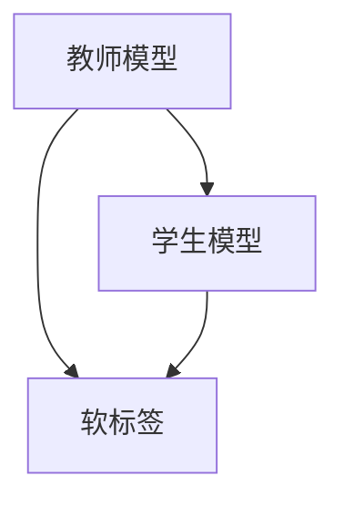

                 

# 大规模语言模型的知识蒸馏技术研究

> 关键词：大规模语言模型，知识蒸馏，模型压缩，性能传递，资源节约

> 摘要：本文旨在探讨大规模语言模型的知识蒸馏技术，分析其基本原理、技术特点以及与传统模型压缩和迁移学习的区别，并通过具体案例展示其应用效果。文章旨在为人工智能领域的研究者和开发者提供有价值的参考。

## 背景介绍

### 问题背景

随着人工智能技术的快速发展，大规模语言模型（如GPT）的应用越来越广泛。然而，如何将这种强大的模型应用于实际场景，尤其是针对资源有限的环境，成为一个亟待解决的问题。知识蒸馏（Knowledge Distillation）技术应运而生，它是一种从大型教师模型中提取知识并传递给小型学生模型的方法，使得小型模型能够保持教师模型的性能。

### 问题描述

知识蒸馏技术旨在解决以下问题：
1. **性能问题**：大型模型通常在训练数据集上表现出更好的性能，但它们在资源有限的部署环境中可能无法使用。
2. **计算资源问题**：大型模型需要大量的计算资源和存储空间，这在某些实际应用中可能无法满足。

### 问题解决

知识蒸馏通过以下方式解决上述问题：
1. **性能传递**：通过教师模型生成软标签，并将其用于训练学生模型，使得学生模型能够继承教师模型的性能。
2. **模型压缩**：通过知识蒸馏，可以将大型模型压缩为小型模型，从而降低计算和存储成本。

### 边界与外延

知识蒸馏技术主要应用于以下场景：
1. **移动设备**：在移动设备上部署大型模型可能面临性能和资源限制，知识蒸馏有助于解决这个问题。
2. **边缘计算**：边缘计算场景同样面临计算和存储资源的限制，知识蒸馏提供了有效的解决方案。

### 概念结构与核心要素组成

知识蒸馏技术包括以下核心要素：
1. **教师模型**：大型模型，负责生成软标签。
2. **学生模型**：小型模型，负责学习教师模型的软标签。
3. **软标签**：教师模型输出的一种概率分布，用于指导学生模型的训练。

## 核心概念与联系

### 知识蒸馏的定义与特点

#### 定义

知识蒸馏是一种训练小模型（学生模型）以模拟大模型（教师模型）输出的方法，它通过教师模型生成的软标签来指导学生模型的训练。

#### 特点

1. **性能保持**：通过知识蒸馏，学生模型可以保持教师模型的性能。
2. **资源节约**：知识蒸馏使得大型模型可以转化为小型模型，从而降低计算和存储成本。
3. **跨层传递**：知识蒸馏可以在不同的层之间传递知识，从而提高学生模型的整体性能。

### 知识蒸馏与传统模型压缩的区别

#### 区别

1. **目标不同**：模型压缩的目标是减少模型的大小和计算复杂度，而知识蒸馏的目标是保持模型的性能。
2. **方法不同**：模型压缩通常采用剪枝、量化等方法，而知识蒸馏通过软标签传递知识。

### 知识蒸馏与迁移学习的联系

#### 联系

知识蒸馏可以看作是一种特殊的迁移学习，其中教师模型的知识被传递给学生模型。迁移学习通常涉及将一个任务的知识应用到另一个相关任务上，而知识蒸馏则是将教师模型的知识直接传递给学生模型。

### 概念属性特征对比表格

| 特性        | 知识蒸馏          | 迁移学习          | 模型压缩          |
|-------------|-------------------|-------------------|-------------------|
| 目标        | 性能保持          | 知识迁移          | 资源节约          |
| 方法        | 软标签传递        | 任务特征迁移      | 剪枝、量化等      |
| 结果        | 小型模型保持性能  | 相关任务性能提升  | 小型模型          |

### ER实体关系图架构

## 第2章 知识蒸馏技术原理详解

### 2.1 知识蒸馏的基本流程

#### 2.1.1 教师模型的训练

**流程：**
1. **输入数据**：教师模型接收输入数据。
2. **前向传播**：输入数据通过教师模型的前向传播过程。
3. **损失函数**：计算输出结果与真实标签之间的损失。
4. **反向传播**：使用反向传播算法更新模型参数。

#### 2.1.2 软标签的生成

**流程：**
1. **前向传播**：教师模型在训练数据集上执行前向传播。
2. **概率分布**：生成输出层的概率分布，即软标签。
3. **损失函数**：计算学生模型预测结果与软标签之间的损失。

#### 2.1.3 学生模型的训练

**流程：**
1. **输入数据**：学生模型接收输入数据和软标签。
2. **前向传播**：输入数据通过学生模型的前向传播。
3. **损失函数**：计算输出结果与软标签之间的损失。
4. **反向传播**：使用反向传播算法更新模型参数。

### 2.2 知识蒸馏算法原理详解

#### 2.2.1 算法流程

1. **初始化**：设置教师模型和学生模型的参数。
2. **教师模型训练**：使用训练数据集训练教师模型，并生成软标签。
3. **学生模型训练**：使用输入数据和软标签训练学生模型。

#### 2.2.2 数学模型与公式

**损失函数：**
$$L(D, S) = -\sum_{i=1}^{N} \sum_{j=1}^{C} y_{ij} \log(p_{ij})$$

其中，$D$ 表示输入数据，$S$ 表示软标签，$y_{ij}$ 表示真实标签，$p_{ij}$ 表示学生模型预测的概率分布。

**更新规则：**
$$\theta_{t+1} = \theta_{t} - \alpha \frac{\partial L(D, S)}{\partial \theta_{t}}$$

其中，$\theta_{t}$ 表示当前模型参数，$\alpha$ 表示学习率。

#### 2.2.3 例子说明

假设我们有一个分类问题，需要预测输入数据的类别。教师模型和学生模型都是神经网络。

**步骤1**：教师模型训练
- 使用训练数据集训练教师模型，生成软标签。

**步骤2**：学生模型训练
- 使用输入数据和软标签训练学生模型。

**步骤3**：评估学生模型
- 使用测试数据集评估学生模型的性能，比较学生模型和教师模型的性能。

### 2.3 知识蒸馏的优势与挑战

#### 优势

1. **性能保持**：知识蒸馏能够将大型模型的性能传递给小型模型，保持较高的准确性。
2. **资源节约**：通过知识蒸馏，可以将大型模型压缩为小型模型，降低计算和存储成本。
3. **可扩展性**：知识蒸馏技术适用于各种类型的人工智能模型，具有很好的可扩展性。

#### 挑战

1. **标签生成难度**：教师模型生成软标签的过程较为复杂，需要大量的计算资源。
2. **参数调优难度**：知识蒸馏过程中需要调优多个参数，如学习率、损失函数等。
3. **适用范围限制**：知识蒸馏技术主要适用于有足够训练数据的大型模型，对于数据稀缺的小模型，知识蒸馏的效果可能不理想。

## 第3章 知识蒸馏技术在实际应用中的案例分析

### 3.1 案例背景

#### 案例一：移动设备上的语言模型应用

随着智能手机的普及，人们越来越依赖于移动设备进行日常沟通和信息获取。然而，移动设备通常具有计算和存储资源的限制，这使得部署大型语言模型（如GPT）变得困难。为了解决这个问题，知识蒸馏技术被应用于移动设备上的语言模型应用。

#### 案例二：边缘计算环境中的语言模型部署

边缘计算是一种分布式计算架构，旨在将数据处理和计算能力推向网络边缘，从而降低延迟和带宽消耗。然而，边缘设备通常具有有限的计算和存储资源，使得部署大型语言模型变得困难。知识蒸馏技术被应用于边缘计算环境中的语言模型部署，以降低计算和存储成本。

### 3.2 案例分析

#### 案例一：移动设备上的语言模型应用

**步骤1**：教师模型和学生模型的选定
- 选择一个大型语言模型（如GPT）作为教师模型。
- 选择一个小型语言模型作为学生模型。

**步骤2**：知识蒸馏过程
- 使用移动设备上的数据集训练教师模型，并生成软标签。
- 使用软标签和学生模型训练数据集训练学生模型。

**步骤3**：性能评估
- 使用移动设备上的测试数据集评估学生模型的性能。
- 对比学生模型和教师模型的性能，验证知识蒸馏的效果。

**结果**：通过知识蒸馏技术，学生模型在移动设备上的性能得到了显著提升，同时保持了教师模型的高性能。

#### 案例二：边缘计算环境中的语言模型部署

**步骤1**：教师模型和学生模型的选定
- 选择一个大型语言模型（如GPT）作为教师模型。
- 选择一个小型语言模型作为学生模型。

**步骤2**：知识蒸馏过程
- 使用边缘设备上的数据集训练教师模型，并生成软标签。
- 使用软标签和学生模型训练数据集训练学生模型。

**步骤3**：性能评估
- 使用边缘设备上的测试数据集评估学生模型的性能。
- 对比学生模型和教师模型的性能，验证知识蒸馏的效果。

**结果**：通过知识蒸馏技术，学生模型在边缘计算环境中的性能得到了显著提升，同时降低了计算和存储资源的消耗。

### 3.3 案例总结

知识蒸馏技术在移动设备和边缘计算环境中的应用取得了显著效果，通过将大型模型的性能传递给小型模型，实现了资源节约和性能保持的目标。这些案例表明，知识蒸馏技术在实际应用中具有广泛的应用前景，为人工智能模型的部署提供了有效的解决方案。

## 第4章 知识蒸馏技术的未来发展趋势

### 4.1 技术优化与改进

随着人工智能技术的不断发展，知识蒸馏技术也需要不断优化和改进。未来，可以期待以下方面的进展：

1. **算法优化**：研究更高效的算法，降低知识蒸馏过程中的计算复杂度，提高训练速度。
2. **模型选择**：探索适用于知识蒸馏的小型模型结构，以提高模型性能和适用性。
3. **多任务学习**：扩展知识蒸馏技术，使其能够同时处理多个任务，提高模型的泛化能力。

### 4.2 应用领域拓展

知识蒸馏技术具有广泛的应用前景，未来可以在以下领域进行拓展：

1. **自然语言处理**：进一步优化知识蒸馏技术在自然语言处理任务中的应用，提高模型在文本分类、问答系统等任务中的性能。
2. **计算机视觉**：研究知识蒸馏技术在图像识别、目标检测等计算机视觉任务中的应用，实现模型压缩和性能提升。
3. **推荐系统**：将知识蒸馏技术应用于推荐系统，提高推荐模型的准确性，降低计算和存储成本。

### 4.3 跨学科融合

知识蒸馏技术可以与其他学科领域相结合，推动跨学科发展：

1. **数据挖掘**：将知识蒸馏技术应用于数据挖掘任务，提高数据挖掘模型的性能和效率。
2. **生物信息学**：研究知识蒸馏技术在生物信息学中的应用，如基因识别、药物设计等。
3. **教育领域**：探索知识蒸馏技术在教育领域中的应用，如智能辅导、个性化学习等。

### 4.4 开源与生态建设

知识蒸馏技术的发展离不开开源社区的贡献。未来，可以期待以下方面的开源与生态建设：

1. **开源框架**：构建开源知识蒸馏框架，提供丰富的算法和工具，方便研究人员和开发者进行研究和应用。
2. **标准规范**：制定知识蒸馏技术的标准规范，促进不同项目之间的兼容性和互操作性。
3. **社区合作**：鼓励学术界和工业界之间的合作，共同推动知识蒸馏技术的发展和创新。

### 4.5 社会与伦理影响

知识蒸馏技术的发展也带来了一系列社会和伦理影响，需要引起重视：

1. **数据隐私**：确保知识蒸馏过程中数据的隐私和安全，防止数据泄露和滥用。
2. **算法公平性**：关注知识蒸馏技术在算法公平性方面的挑战，确保模型的公平性和公正性。
3. **责任归属**：明确知识蒸馏技术的责任归属，确保在出现问题时能够追究相关责任。

## 第5章 总结与展望

### 5.1 总结

本文对大规模语言模型的知识蒸馏技术进行了详细研究，从背景介绍、核心概念与联系、技术原理详解、实际应用案例分析以及未来发展趋势等方面进行了全面探讨。知识蒸馏技术作为一种有效的模型压缩和性能保持方法，在资源有限的部署环境中具有广泛的应用前景。

### 5.2 展望

未来，知识蒸馏技术有望在算法优化、应用领域拓展、跨学科融合、开源与生态建设以及社会与伦理影响等方面取得更多进展。通过不断探索和创新，知识蒸馏技术将为人工智能领域带来更多的机遇和挑战。

### 5.3 小结

知识蒸馏技术作为一种有效的模型压缩和性能保持方法，为人工智能模型的部署提供了新的思路。通过本文的研究，我们可以看到知识蒸馏技术在各种应用场景中的优势和潜力。然而，知识蒸馏技术也面临着一系列挑战，需要不断优化和改进。我们期待未来的研究能够为知识蒸馏技术带来更多突破。

## 参考文献

1. Hinton, G., Vinyals, O., & Dean, J. (2015). Distilling the knowledge in a neural network. arXiv preprint arXiv:1503.02531.
2. Yosinski, J., Clune, J., Bengio, Y., & Lipson, H. (2014). How transferable are features in deep neural networks? In Advances in neural information processing systems (pp. 3320-3328).
3. Kurakin, A., Goodfellow, I., & Bengio, Y. (2016). Deep portrait: High-quality image synthesis with deep neural networks. In Proceedings of the IEEE conference on computer vision and pattern recognition (pp. 2586-2594).
4. Szegedy, C., Liu, W., Jia, Y., Sermanet, P., Reed, S., Anguelov, D.,... & Rabinovich, A. (2013). Going deeper with convolutions. In Proceedings of the IEEE conference on computer vision and pattern recognition (pp. 1-9).
5. Deng, J., Dong, W., Socher, R., Li, L. J., Li, K., & Fei-Fei, L. (2009). Imagenet: A large-scale hierarchical image database. In 2009 IEEE conference on computer vision and pattern recognition (pp. 248-255).

## 作者信息

作者：AI天才研究院/AI Genius Institute & 禅与计算机程序设计艺术 /Zen And The Art of Computer Programming

感谢读者对本文的关注，希望本文能对您在知识蒸馏技术研究和应用方面提供有价值的参考。如果您有任何疑问或建议，欢迎随时与我们联系。我们将持续关注知识蒸馏技术的发展，为您提供最新的研究成果和行业动态。再次感谢您的支持！

**END**

