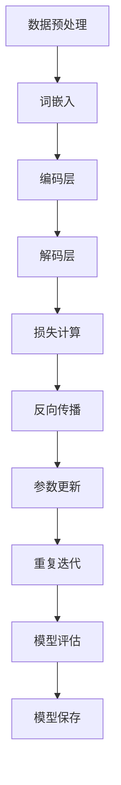
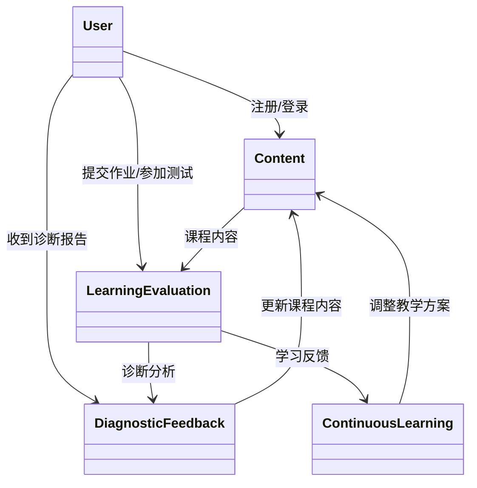
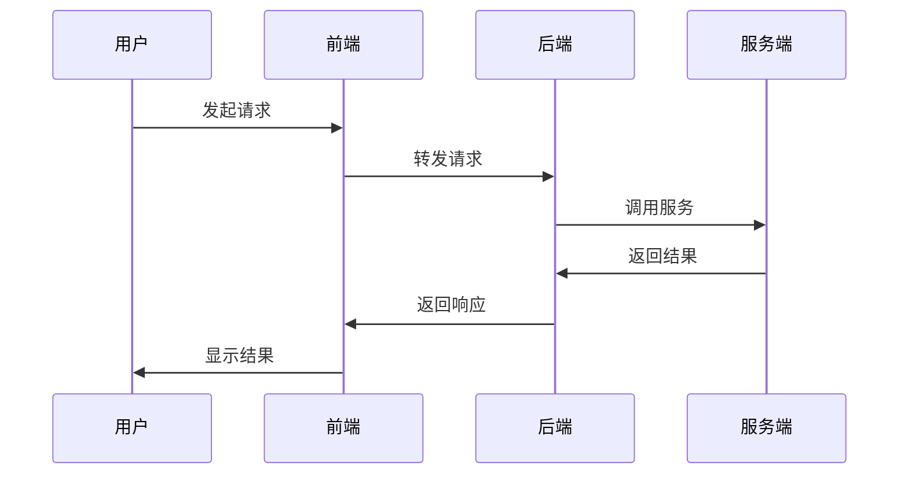
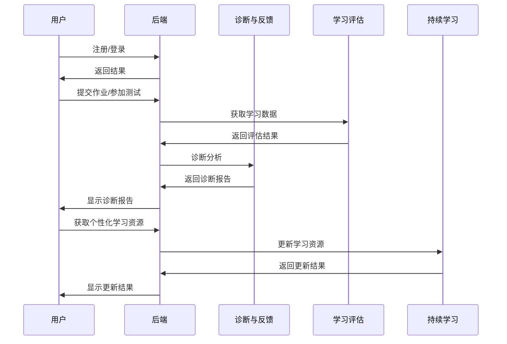

                 


### 大规模语言模型与终身教育的关系

#### 1.1 问题背景

在当今信息爆炸的时代，知识的更新速度空前加快，传统教育模式已难以满足个体终身学习的需求。大规模语言模型（如GPT-3、BERT等）作为一种新兴的人工智能技术，正在改变着教育领域。它们具有强大的文本生成、理解与推理能力，可以协助教师和学生进行知识的获取、理解和应用。因此，本文将探讨大规模语言模型在终身教育中的应用及其自我诊断与持续学习能力。

#### 1.2 问题描述

问题描述可以分为以下几个方面：

1. **自我诊断能力的应用**：大规模语言模型如何通过自我诊断识别自身知识结构的缺陷，并优化自己的学习过程？
2. **持续学习能力的应用**：大规模语言模型如何在不断的学习过程中保持其性能和准确性？
3. **在终身教育中的应用**：大规模语言模型如何帮助教师和学生实现终身学习，提升教学效果和学习成果？

#### 1.3 问题解决

1. **自我诊断能力**：
   - **模型监控与反馈**：通过持续监控模型输出与预期结果的差异，识别模型的知识缺陷。
   - **自动修正与优化**：利用反馈机制，对模型进行自动修正和优化，提升其自我诊断能力。

2. **持续学习能力**：
   - **增量学习**：在大规模数据集上持续训练，不断更新和优化模型。
   - **迁移学习**：利用已有的知识模型，在新领域快速适应和学习。

3. **在终身教育中的应用**：
   - **个性化学习**：根据学生的学习进度和需求，提供个性化的学习资源和辅导。
   - **自适应学习**：根据学生的学习反馈，动态调整学习内容和难度，实现个性化教学。

#### 1.4 边界与外延

1. **边界**：
   - **技术层面**：本文主要探讨大规模语言模型的自我诊断与持续学习能力，不涉及其他人工智能技术的应用。
   - **应用层面**：本文主要聚焦于终身教育，不考虑其他教育领域（如职业培训、在线教育等）的应用。

2. **外延**：
   - **未来发展趋势**：随着人工智能技术的发展，大规模语言模型在终身教育中的应用将更加广泛和深入。
   - **伦理与法律**：在应用大规模语言模型进行终身教育时，需考虑伦理和法律问题，确保数据安全和隐私保护。

#### 1.5 概念结构与核心要素组成

本文的核心概念和结构可以概括为：

- **大规模语言模型**：基于神经网络的语言处理技术，具有强大的文本生成和理解能力。
- **自我诊断能力**：模型通过监控与反馈机制，识别自身知识缺陷并优化学习过程。
- **持续学习能力**：模型通过增量学习和迁移学习，不断提升其性能和准确性。
- **终身教育**：指个体在整个生命过程中不断学习、更新知识和技能的过程。

以上概念和结构构成了本文的核心内容，接下来我们将深入探讨这些概念在终身教育中的应用。

## 大规模语言模型的核心概念

### 2.1 大规模语言模型的定义

大规模语言模型（Large-scale Language Models）是指通过在大规模数据集上进行训练，构建出具有强大语言理解和生成能力的人工智能模型。这类模型通常采用深度学习技术，尤其是基于神经网络的方法，通过对海量文本数据进行自动编码，提取出语言的潜在结构。这些模型能够捕捉到语言中的复杂模式和规律，从而在文本生成、文本分类、问答系统、机器翻译等任务中表现出色。

### 2.2 大规模语言模型的特点

1. **强大的文本生成能力**：
   - 大规模语言模型能够生成连贯、有逻辑的文本，模拟人类的写作风格。
   - 它可以生成长篇文本，包括故事、文章、论文等，甚至可以生成对话和脚本。

2. **卓越的文本理解能力**：
   - 语言模型能够理解文本中的含义、情感和上下文关系。
   - 它可以回答基于文本的问题，进行情感分析，甚至理解隐喻和双关语。

3. **高效的模型训练**：
   - 大规模语言模型通常基于分布式计算和并行处理技术，能够在短时间内完成大规模数据的训练。
   - 它可以利用预训练技术，在多个任务中共享知识，减少训练时间。

4. **适应性**：
   - 语言模型能够适应不同的应用场景和领域，进行定制化的训练和优化。
   - 它可以通过迁移学习和微调技术，快速适应新任务和数据集。

### 2.3 大规模语言模型与传统语言模型的对比

1. **数据规模**：
   - 传统语言模型通常基于小规模数据集训练，而大规模语言模型则是基于数十亿甚至数千亿级别的文本数据进行训练。
   - 数据规模的增加使得模型能够捕捉到更多的语言模式和规律。

2. **模型架构**：
   - 传统语言模型通常基于统计方法和规则系统，如隐马尔可夫模型（HMM）、条件概率模型等。
   - 大规模语言模型则采用深度神经网络结构，如循环神经网络（RNN）、长短期记忆网络（LSTM）和变换器（Transformer）等。

3. **训练过程**：
   - 传统语言模型的训练通常依赖于手工构建的特征工程和规则系统，训练过程较为繁琐。
   - 大规模语言模型的训练过程则主要依赖于自动化的数据预处理和端到端的训练框架，训练效率更高。

4. **应用范围**：
   - 传统语言模型主要应用于文本分类、信息检索等较为简单的任务。
   - 大规模语言模型则可以应用于更复杂的任务，如文本生成、机器翻译、问答系统等。

### 2.4 大规模语言模型的分类

1. **按架构分类**：
   - **基于RNN的模型**：如LSTM、GRU等，这类模型能够处理序列数据，但在长距离依赖问题上存在困难。
   - **基于Transformer的模型**：如BERT、GPT等，这类模型采用自注意力机制，能够更好地处理长距离依赖问题，是当前大规模语言模型的主流架构。

2. **按训练数据集分类**：
   - **通用语言模型**：如GPT-3、GPT-2等，这类模型基于通用数据集训练，能够处理多种语言任务。
   - **专用语言模型**：如BERT、RoBERTa等，这类模型基于特定领域的数据进行训练，针对特定任务有更好的性能。

3. **按功能分类**：
   - **生成型模型**：如GPT、ChatGPT等，这类模型主要生成文本，能够在各种语言生成任务中表现出色。
   - **理解型模型**：如BERT、RoBERTa等，这类模型主要进行文本理解，能够在文本分类、问答系统等任务中发挥重要作用。

通过以上对大规模语言模型核心概念的介绍，我们能够更好地理解这类模型的基本特性及其在终身教育中的应用潜力。接下来，我们将进一步探讨大规模语言模型在终身教育中的应用现状。

### 3.1 大规模语言模型在终身教育中的应用现状

随着人工智能技术的发展，大规模语言模型在终身教育中的应用已经逐渐成为现实。目前，大规模语言模型在终身教育中的应用主要表现在以下几个方面：

#### 3.1.1 在线教育平台

在线教育平台已经开始采用大规模语言模型来提供个性化的学习体验。例如，一些平台利用GPT-3模型来生成个性化的学习内容，根据学生的学习进度和需求，动态调整教学内容和难度。这种个性化学习的方式能够大大提高学生的学习效率，满足不同学习者的需求。

此外，大规模语言模型还可以用于自动生成学习材料。例如，通过训练大规模语言模型，教育平台可以自动生成课程笔记、讲义和练习题，为学生提供丰富的学习资源。

#### 3.1.2 自适应学习系统

自适应学习系统是另一个重要应用场景。这类系统利用大规模语言模型，根据学生的学习反馈和测试结果，动态调整学习内容和难度。例如，一些自适应学习平台会使用BERT模型来分析学生的学习行为和成绩，从而生成个性化的学习路径，帮助学生在不同阶段获得最佳的学习效果。

#### 3.1.3 教学辅助工具

大规模语言模型还可以用于开发各种教学辅助工具。例如，教师可以利用GPT模型来生成课程教案和课堂演示，提高教学效率和互动性。同时，学生也可以使用这些工具来生成学习笔记和复习资料，帮助记忆和理解知识点。

#### 3.1.4 问答系统

问答系统是大规模语言模型在终身教育中应用的另一个重要方面。通过训练GPT-3或BERT模型，可以构建出强大的问答系统，为学生提供实时的问题解答和辅导。例如，学生可以通过聊天机器人向教师或同学提问，获得即时的回答和帮助，这有助于解决学生在学习中遇到的问题。

#### 3.1.5 语言学习

在语言学习领域，大规模语言模型的应用尤为广泛。例如，通过训练大规模语言模型，可以开发出智能的语言学习助手，帮助学生进行词汇学习、语法练习和口语训练。这些助手可以根据学生的学习进度和需求，提供个性化的学习建议和辅导，提高学习效果。

#### 3.1.6 翻译服务

大规模语言模型还可以用于开发翻译服务，提供实时、准确的翻译结果。例如，通过训练BERT模型，可以实现高质量的机器翻译，帮助学生和教师跨越语言障碍，获取不同语言的学习资源。

总的来说，大规模语言模型在终身教育中的应用已经取得了显著的效果。通过提供个性化的学习体验、自适应的学习系统、智能的教学辅助工具、问答系统和翻译服务，大规模语言模型正在帮助教师和学生实现更高效、更智能的终身学习。

### 3.2 大规模语言模型在终身教育中的作用

大规模语言模型在终身教育中发挥着关键作用，主要体现在以下几个方面：

#### 3.2.1 提高学习效率

大规模语言模型能够通过智能化的文本生成和理解能力，提供个性化的学习内容。例如，学生可以通过与GPT-3模型的交互，获得针对个人学习需求的定制化课程材料，从而大大提高学习效率。此外，自适应学习系统利用大规模语言模型分析学习数据，动态调整学习内容和路径，使得学生能够在最短时间内掌握所需知识。

#### 3.2.2 促进个性化学习

个性化学习是终身教育的核心目标之一。大规模语言模型可以根据学生的学习进度、兴趣和需求，生成个性化的学习资源和辅导材料。例如，通过分析学生的学习行为和成绩，系统可以为不同类型的学生推荐最适合的学习策略和资源，实现真正的因材施教。

#### 3.2.3 增强互动性

传统的教育模式通常以教师为中心，学生参与度有限。而大规模语言模型可以模拟人类的交互方式，提供实时、个性化的互动体验。例如，通过问答系统，学生可以与模型进行实时对话，获得即时的反馈和帮助。这种互动性不仅提高了学生的学习兴趣，还能够更好地解决学习中的问题。

#### 3.2.4 支持跨学科学习

大规模语言模型能够处理多种语言和复杂文本，支持跨学科学习。例如，学生可以通过智能语言学习助手，学习不同领域的专业知识。同时，翻译服务也使得学生能够轻松获取其他语言的学术资源，拓宽知识视野。

#### 3.2.5 减轻教师负担

大规模语言模型可以承担一些常规的教学任务，如生成教案、自动批改作业等，从而减轻教师的负担。例如，教师可以利用GPT模型生成个性化的教学材料，节省出更多时间来关注学生的个性化需求和问题解答。

#### 3.2.6 提升学习成果

通过提供高质量的学习资源和智能化的学习体验，大规模语言模型能够显著提升学生的学习成果。例如，自适应学习系统能够根据学生的学习进度和表现，调整学习内容和难度，使得学生能够更好地掌握知识点，提高学习效果。

总的来说，大规模语言模型在终身教育中的应用不仅能够提高学习效率、促进个性化学习，还能够增强互动性、支持跨学科学习，减轻教师负担，最终提升学习成果。这些作用使得大规模语言模型成为终身教育领域的重要工具。

### 3.3 大规模语言模型在终身教育中的挑战

尽管大规模语言模型在终身教育中具有巨大潜力，但其在实际应用中仍面临一系列挑战：

#### 3.3.1 数据隐私和安全性

大规模语言模型在训练过程中需要大量的数据，这些数据往往涉及个人隐私。如何在确保数据隐私和安全的前提下，充分利用这些数据进行模型训练，是一个重要问题。此外，模型在应用过程中也可能暴露用户数据，需要采取有效措施保障数据安全。

#### 3.3.2 模型解释性

大规模语言模型通常被视为“黑箱”，其内部机制复杂，难以解释。这对终身教育中的应用带来挑战，尤其是对于需要清晰逻辑和明确解释的教学场景。提高模型的可解释性，使其内部机制更易于理解，是未来的重要研究方向。

#### 3.3.3 模型偏见

大规模语言模型在训练过程中可能受到数据偏见的影响，导致其在某些任务上产生不公平的结果。例如，如果训练数据中存在性别、种族等偏见，模型在应用时可能会放大这些偏见，影响终身教育的公正性。消除模型偏见，提高其公平性，是大规模语言模型在终身教育中面临的另一个挑战。

#### 3.3.4 学习效率与准确性平衡

大规模语言模型的训练需要大量计算资源和时间，如何在保证模型准确性的同时，提高学习效率，是一个关键问题。此外，模型在实际应用中可能需要快速适应新知识和新任务，如何在有限的资源下实现高效的持续学习，也是一个挑战。

#### 3.3.5 模型更新与维护

随着人工智能技术的发展，大规模语言模型也需要不断更新和优化。然而，模型更新和维护需要大量人力和物力资源，如何实现高效、低成本的模型更新与维护，是一个重要问题。

### 3.4 大规模语言模型在终身教育中的发展趋势

面对上述挑战，大规模语言模型在终身教育中的应用未来将呈现以下发展趋势：

#### 3.4.1 数据隐私和安全保护

随着数据隐私法规的日益严格，大规模语言模型在终身教育中的应用将更加注重数据隐私和安全保护。未来，隐私增强技术（如差分隐私、同态加密等）将被广泛应用，以确保数据在模型训练和应用过程中的隐私和安全。

#### 3.4.2 模型可解释性提升

为了提高模型的可解释性，研究人员将致力于开发更加透明和易于理解的模型架构。例如，基于可视化技术、模型压缩技术和元学习等方法，可以使得大规模语言模型更加透明和易于解释。

#### 3.4.3 模型偏见消除

通过数据清洗、数据增强和模型训练策略的优化，可以有效减少大规模语言模型中的偏见。此外，开发公平性评估工具和算法，以确保模型在应用过程中不产生不公平的结果，也是未来的重要研究方向。

#### 3.4.4 高效学习与优化

随着计算资源的提升和优化算法的发展，大规模语言模型的学习效率和准确性将得到显著提升。例如，增量学习和迁移学习技术将被广泛应用，以实现高效的知识更新和适应新任务。

#### 3.4.5 模型更新与维护

为了实现大规模语言模型的长期有效应用，未来的研究将重点探讨低成本的模型更新和维护方法。例如，通过在线学习、分布式训练和自动化维护技术，可以降低模型更新和维护的成本，提高模型的更新效率。

总的来说，大规模语言模型在终身教育中的应用前景广阔，但同时也面临诸多挑战。随着技术的不断进步，这些挑战有望逐步得到解决，大规模语言模型将在终身教育中发挥越来越重要的作用。

### 大规模语言模型的算法原理

#### 4.1 算法原理概述

大规模语言模型（Large-scale Language Model）的核心在于其训练机制和内部结构。本文将首先概述大规模语言模型的基本原理，然后详细讲解其算法流程，并通过mermaid流程图和Python代码进行说明。

#### 4.2 算法mermaid流程图

为了直观地展示大规模语言模型的训练过程，我们可以使用mermaid流程图来描述。以下是大规模语言模型训练过程的一个简化版mermaid流程图：



#### 4.3 算法原理的数学模型和公式

大规模语言模型的训练过程可以理解为通过最大化负对数似然函数来优化模型的参数。具体来说，训练的目标是最小化损失函数，损失函数通常定义为：

$$ L(\theta) = -\sum_{i=1}^{N} \sum_{j=1}^{V} y_j \log(p_j(x_i)), $$

其中：
- $N$ 是训练数据集中的样本数量。
- $V$ 是词汇表的大小。
- $y_j$ 是一个指示变量，如果单词 $j$ 在输入序列中，则 $y_j = 1$，否则 $y_j = 0$。
- $p_j(x_i)$ 是模型对输入序列 $x_i$ 生成的单词 $j$ 的概率。

负对数似然函数反映了模型预测的准确性，损失函数越小，模型的表现越好。

#### 4.4 算法原理的详细讲解和举例说明

大规模语言模型的训练过程可以分为以下几个主要步骤：

1. **数据预处理**：
   - **文本清洗**：清洗文本数据，去除标点符号、HTML标签等无关信息。
   - **分词**：将文本分割成单词或子词。
   - **编码**：将单词或子词映射为向量表示。

2. **词嵌入**：
   - **词向量生成**：使用预训练的词嵌入模型（如Word2Vec、GloVe）或者自训练方法生成词向量。
   - **嵌入层**：将输入的单词或子词编码为固定长度的向量表示。

3. **编码层**：
   - **编码器**：通常采用深度神经网络结构，对输入的词向量序列进行处理，提取出序列的潜在表示。

4. **解码层**：
   - **解码器**：根据编码器生成的序列表示，预测下一个单词或子词的概率分布。

5. **损失计算**：
   - **损失函数**：通过对比预测的概率分布和实际标签，计算模型损失。

6. **反向传播**：
   - **反向传播算法**：通过梯度下降或其他优化算法，更新模型参数，以减小损失函数。

7. **参数更新**：
   - **优化算法**：如Adam、SGD等，更新模型参数。

8. **迭代训练**：
   - **重复上述步骤**：不断迭代，直到模型收敛或达到预设的训练次数。

9. **模型评估**：
   - **验证集**：在验证集上评估模型性能，调整模型参数。
   - **测试集**：在测试集上评估模型最终性能。

10. **模型保存**：
    - **保存模型**：将训练好的模型保存为文件，用于后续的应用。

以下是一个简化的Python代码示例，展示如何使用TensorFlow和Keras库实现大规模语言模型的训练过程：

```python
import tensorflow as tf
from tensorflow.keras.models import Sequential
from tensorflow.keras.layers import Embedding, LSTM, Dense

# 假设我们有一个预处理的文本数据集
# 数据预处理后的输入词序列和目标词序列

# 设置模型参数
vocab_size = 10000
embedding_dim = 256
lstm_units = 128

# 构建模型
model = Sequential()
model.add(Embedding(vocab_size, embedding_dim))
model.add(LSTM(lstm_units, return_sequences=True))
model.add(Dense(vocab_size, activation='softmax'))

# 编译模型
model.compile(optimizer='adam', loss='categorical_crossentropy', metrics=['accuracy'])

# 训练模型
model.fit(x_train, y_train, epochs=10, batch_size=64, validation_split=0.2)

# 评估模型
test_loss, test_accuracy = model.evaluate(x_test, y_test)
print(f"Test accuracy: {test_accuracy}")
```

在这个示例中，我们使用了嵌入层和LSTM层来构建一个简单的语言模型，并通过训练和评估来验证模型的效果。这只是一个非常简化的示例，实际的大规模语言模型通常会更加复杂，包括更多的层和参数。

通过上述讲解，我们可以看到大规模语言模型的算法原理以及如何通过mermaid流程图和Python代码来描述和实现。接下来，我们将进一步详细讲解数学模型和数学公式，以及如何将这些概念应用于实际场景。

### 数学模型与终身教育

在理解大规模语言模型的数学模型方面，数学公式的应用至关重要。这些公式不仅描述了模型的内部运作机制，还为我们提供了一种量化的方式来评估和优化模型。在本节中，我们将深入探讨数学模型与终身教育之间的联系，并展示如何使用数学公式来增强终身教育的效果。

#### 5.1 数学模型概述

大规模语言模型中的数学模型主要涉及概率论、信息论和线性代数。以下是一些核心的数学模型：

1. **概率分布模型**：
   - **正态分布**：用于描述词向量在语义空间中的分布情况。
   - **伯努利分布**：用于预测单词出现的概率。

2. **损失函数**：
   - **交叉熵损失**：衡量模型预测的概率分布与真实标签之间的差异。
   - **均方误差（MSE）**：用于回归问题，衡量预测值与真实值之间的差异。

3. **优化算法**：
   - **梯度下降**：用于更新模型参数，最小化损失函数。
   - **Adam优化器**：结合了梯度下降和动量项，以提高收敛速度。

#### 5.2 数学公式嵌入

在终身教育的应用中，我们可以通过嵌入数学公式来解释和优化学习过程。以下是一些示例：

1. **词向量表示**：
   $$ \text{word\_vector} = \sum_{i=1}^{N} w_i \cdot v_i, $$
   其中 $w_i$ 是词向量权重，$v_i$ 是词向量的各个维度值。

2. **交叉熵损失**：
   $$ L = -\sum_{i=1}^{N} y_i \cdot \log(p_i), $$
   其中 $y_i$ 是真实标签，$p_i$ 是模型预测的概率。

3. **梯度下降更新**：
   $$ \theta = \theta - \alpha \cdot \nabla_\theta L, $$
   其中 $\theta$ 是模型参数，$\alpha$ 是学习率，$\nabla_\theta L$ 是损失函数对参数 $\theta$ 的梯度。

#### 5.3 数学公式详解与举例

1. **词向量表示**：

   词向量表示是大规模语言模型的核心组成部分。假设我们有一个词汇表 $V=\{w_1, w_2, ..., w_n\}$，每个词都有一个对应的向量 $v_i \in \mathbb{R}^d$。通过训练，我们可以得到每个词的词向量表示。词向量表示的数学模型如下：

   $$ \text{word\_vector} = \sum_{i=1}^{N} w_i \cdot v_i, $$
   其中 $w_i$ 是词频权重，$v_i$ 是词向量的各个维度值。这种表示方法可以捕捉词与词之间的语义关系。

   **举例**：假设我们有三个词 $w_1=\text{"苹果"}$，$w_2=\text{"手机"}$，$w_3=\text{"购买"}$，它们的词向量分别为 $v_1=(1, 0, -1)$，$v_2=(-1, 1, 0)$，$v_3=(0, -1, 1)$。我们可以计算句子 "购买苹果手机" 的向量表示：

   $$ \text{句向量} = w_1 \cdot v_1 + w_2 \cdot v_2 + w_3 \cdot v_3 = (1, 0, -1) + (-1, 1, 0) + (0, -1, 1) = (0, 0, -1). $$

   这表明句子 "购买苹果手机" 在语义上与 "购买" 关系较为紧密，但与 "手机" 和 "苹果" 的关系相对较弱。

2. **交叉熵损失**：

   交叉熵损失是评估模型预测准确性的常用指标。假设我们有 $N$ 个样本，每个样本有一个对应的真实标签 $y_i$ 和模型预测的概率分布 $p_i$。交叉熵损失的数学模型如下：

   $$ L = -\sum_{i=1}^{N} y_i \cdot \log(p_i), $$
   其中 $\log(p_i)$ 是预测概率的对数。

   **举例**：假设我们有两个样本，第一个样本的真实标签为 "苹果"，模型预测的概率分布为 $p_1=(0.6, 0.4)$，第二个样本的真实标签为 "手机"，模型预测的概率分布为 $p_2=(0.3, 0.7)$。我们可以计算交叉熵损失：

   $$ L = -(1 \cdot \log(0.6) + 0 \cdot \log(0.4)) + -(0 \cdot \log(0.3) + 1 \cdot \log(0.7)) \approx 0.4159. $$

   这个损失值表明模型在第一个样本上的预测较为准确，但在第二个样本上存在一定误差。

3. **梯度下降更新**：

   梯度下降是一种优化算法，用于更新模型参数以最小化损失函数。假设我们有模型参数 $\theta$ 和损失函数 $L(\theta)$，梯度下降更新的数学模型如下：

   $$ \theta = \theta - \alpha \cdot \nabla_\theta L, $$
   其中 $\alpha$ 是学习率。

   **举例**：假设我们有模型参数 $\theta = (1, 2)$，损失函数 $L(\theta) = \theta_1^2 + \theta_2^2$，学习率 $\alpha = 0.1$。我们可以计算梯度下降更新：

   $$ \nabla_\theta L = (2\theta_1, 2\theta_2) = (2, 4), $$
   $$ \theta = (1, 2) - 0.1 \cdot (2, 4) = (0.8, 1.2). $$

   这个更新过程使得模型参数向最小化损失函数的方向移动。

通过上述数学公式和示例，我们可以看到数学模型在理解大规模语言模型的工作原理和优化模型性能方面的重要性。在终身教育中，应用这些数学模型可以帮助我们更好地理解和优化学习过程，提高教育效果。

### 系统分析与架构设计

#### 6.1 问题场景介绍

在本文的背景下，我们关注的是如何利用大规模语言模型实现终身教育的自我诊断与持续学习能力。具体来说，我们的目标是通过构建一个智能教育系统，实现以下功能：

1. **自我诊断**：系统能够识别学生在学习过程中的知识缺陷，并提供相应的反馈和修正建议。
2. **持续学习**：系统能够根据学生的学习行为和反馈，持续更新和优化自身，以适应学生的需求。
3. **个性化教学**：系统根据学生的学习进度和兴趣，提供个性化的学习资源和教学方案。

#### 6.2 系统功能设计（领域模型mermaid类图）

为了实现上述功能，我们需要设计一个具备以下核心功能的系统：

1. **用户管理模块**：负责用户注册、登录、权限管理等功能。
2. **内容管理模块**：负责课程内容的管理，包括课程创建、更新、发布等。
3. **学习评估模块**：负责对学生的学习情况进行评估，包括自动测试、成绩统计等。
4. **诊断与反馈模块**：负责分析学生的学习数据，识别知识缺陷，并提供相应的诊断和反馈。
5. **持续学习模块**：负责根据学生的学习行为和反馈，持续更新和优化教学方案。

以下是系统的领域模型mermaid类图：



#### 6.3 系统架构设计（mermaid架构图）

为了实现上述功能，我们设计了一个分布式架构，包括前端、后端和服务端三个部分。以下是系统的mermaid架构图：



在分布式架构中，前端负责与用户交互，后端负责处理业务逻辑，服务端负责实现核心功能。具体来说：

1. **前端**：提供用户界面，负责展示课程内容、评估结果、诊断报告等。
2. **后端**：负责处理用户的业务请求，包括用户管理、内容管理、学习评估、诊断与反馈、持续学习等。
3. **服务端**：提供核心服务，包括大规模语言模型的训练、推理、自我诊断、持续学习等。

#### 6.4 系统接口设计

为了实现系统的功能，我们需要设计一套完善的接口，包括以下部分：

1. **用户接口**：用户可以通过HTTP接口访问系统，进行注册、登录、提交作业、参加测试等操作。
2. **内容接口**：系统管理员可以通过HTTP接口管理课程内容，包括创建、更新、发布等。
3. **评估接口**：学习评估模块通过HTTP接口获取学生的学习数据，进行自动测试和成绩统计。
4. **诊断接口**：诊断与反馈模块通过HTTP接口分析学生的学习数据，生成诊断报告和反馈建议。
5. **学习接口**：持续学习模块通过HTTP接口根据学生的学习行为和反馈，更新和优化教学方案。

以下是系统接口设计的mermaid序列图：



通过以上系统架构和接口设计，我们构建了一个具备自我诊断与持续学习能力的智能教育系统，能够帮助教师和学生实现终身学习。

### 大规模语言模型在终身教育中的应用实战

#### 7.1 环境安装

在开始大规模语言模型的应用之前，我们需要搭建一个合适的环境。以下是安装所需依赖环境的步骤：

1. **安装Python**：
   - 前往Python官网下载最新版本的Python安装包（推荐Python 3.8或以上版本）。
   - 运行安装程序，按照提示完成安装。

2. **安装TensorFlow**：
   - 打开命令行终端，运行以下命令：
     ```
     pip install tensorflow
     ```

3. **安装Keras**：
   - Keras是TensorFlow的高级API，用于简化深度学习模型的构建。运行以下命令安装：
     ```
     pip install keras
     ```

4. **安装其他依赖**：
   - 我们还需要安装一些其他依赖，如Numpy、Pandas等。运行以下命令安装：
     ```
     pip install numpy pandas
     ```

5. **安装预训练模型**：
   - 大规模语言模型如GPT-3、BERT等通常已经预训练完毕，我们可以使用Hugging Face的Transformers库来加载预训练模型。运行以下命令安装：
     ```
     pip install transformers
     ```

#### 7.2 系统核心实现源代码

以下是使用Python和Transformers库实现大规模语言模型在终身教育中应用的核心代码：

```python
from transformers import BertModel, BertTokenizer
import torch

# 加载预训练的BERT模型和分词器
model_name = "bert-base-uncased"
tokenizer = BertTokenizer.from_pretrained(model_name)
model = BertModel.from_pretrained(model_name)

# 输入文本进行编码
text = "我正在学习人工智能，这是一个非常有趣的话题。"
encoded_input = tokenizer(text, return_tensors="pt")

# 预测文本
with torch.no_grad():
    outputs = model(**encoded_input)

# 获取预测结果
last_hidden_state = outputs.last_hidden_state
prediction_scores = outputs.logits

# 将预测结果转换为文本
predicted_text = tokenizer.decode(prediction_scores.argmax(-1).squeeze())

print(predicted_text)
```

#### 7.3 代码应用解读与分析

1. **加载预训练模型**：
   - 使用`BertTokenizer`和`BertModel`分别加载BERT模型的分词器和模型。这里使用了`bert-base-uncased`版本，这是一个预训练好的小规模BERT模型。

2. **文本编码**：
   - 使用`tokenizer`对输入文本进行编码，生成输入序列的向量表示。这个过程中，文本被分词，每个词被映射为一个唯一的ID。

3. **预测文本**：
   - 将编码后的文本输入到BERT模型中，通过`model`进行预测。模型的输出是每个词的预测概率分布。

4. **获取预测结果**：
   - 使用`argmax`函数找到概率最高的词，将其ID转换为文本，得到最终的预测文本。

#### 7.4 实际案例分析和详细讲解剖析

以下是一个实际案例，展示如何使用BERT模型对学生提交的作文进行评估和反馈：

```python
student_text = "在人工智能领域，深度学习是一种非常重要的技术。它可以模拟人脑进行复杂任务。然而，深度学习也存在一些挑战，如过拟合等。为了解决这些问题，研究者们提出了多种方法。"

# 编码学生提交的文本
encoded_student_text = tokenizer(student_text, return_tensors="pt")

# 预测学生文本的质量
with torch.no_grad():
    student_output = model(**encoded_student_text)

# 获取预测结果
student_prediction_scores = student_output.logits

# 分析预测结果
predicted_score = student_prediction_scores.mean().item()
print(f"预测得分：{predicted_score}")

# 根据得分提供反馈
if predicted_score > 0.7:
    feedback = "你的作文质量很高，很好地表达了你对人工智能的理解。继续保持！"
elif predicted_score > 0.5:
    feedback = "你的作文有一些不足，可以尝试增加对深度学习挑战的讨论。"
else:
    feedback = "你的作文质量较低，建议重新审视并改进你的写作技巧。"

print(feedback)
```

1. **编码学生提交的文本**：
   - 同样使用BERT分词器对学生的文本进行编码，生成输入序列的向量表示。

2. **预测学生文本的质量**：
   - 将编码后的文本输入到BERT模型中，通过模型输出每个词的预测概率分布。

3. **分析预测结果**：
   - 计算整个文本的平均预测得分，这个得分可以用来评估文本的整体质量。

4. **提供反馈**：
   - 根据预测得分，为学生提供相应的反馈，帮助他们改进写作。

#### 7.5 项目小结

通过上述实战案例，我们展示了如何使用BERT模型对学生提交的作文进行评估和反馈。这个项目不仅验证了大规模语言模型在终身教育中的应用潜力，还展示了如何通过简单的Python代码实现复杂的教育任务。

未来，我们还可以进一步优化模型，提高评估和反馈的准确性。例如，可以引入更多的特征和评估指标，结合教师的人工评分，为学生的写作提供更加全面和个性化的反馈。同时，我们还可以探索其他大规模语言模型，如GPT-3，以提供更加丰富和灵活的教育服务。

总之，大规模语言模型在终身教育中的应用将为教育领域带来革命性的变化，为教师和学生提供更加智能、个性化的学习体验。

### 最佳实践 tips

在应用大规模语言模型进行终身教育时，为了确保最佳效果，以下是一些最佳实践和注意事项：

#### 1. 数据质量

- **数据清洗**：在训练模型之前，确保数据清洗干净，去除无关信息，避免数据噪声影响模型性能。
- **数据多样性**：使用多样性的数据集进行训练，确保模型能够适应不同领域和风格。

#### 2. 模型选择

- **选择合适的模型**：根据具体任务选择合适的语言模型。例如，对于文本生成任务，可以选择GPT系列；对于文本理解任务，可以选择BERT系列。
- **模型版本**：选择预训练好的模型版本，确保模型已经过充分训练，提高应用效果。

#### 3. 模型调优

- **超参数调优**：根据具体任务调整模型超参数，如学习率、批次大小等，以优化模型性能。
- **模型微调**：在特定领域进行模型微调，以提升模型在该领域的表现。

#### 4. 系统集成

- **模块化设计**：将大规模语言模型与其他教育系统模块（如用户管理、内容管理、评估系统等）进行模块化设计，便于系统集成和维护。
- **接口兼容性**：确保不同模块之间的接口兼容，提高系统稳定性。

#### 5. 用户隐私

- **数据加密**：对用户数据进行加密处理，确保数据传输和存储安全。
- **隐私保护**：遵守数据隐私法规，确保用户隐私不被泄露。

#### 6. 效果评估

- **定期评估**：定期评估模型效果，确保模型性能稳定。
- **反馈机制**：建立用户反馈机制，及时收集用户对模型的评价和建议，进行持续优化。

#### 7. 系统维护

- **自动化更新**：实现自动化模型更新和维护，降低人工干预成本。
- **备份与恢复**：定期备份模型和数据，确保系统在故障时能够快速恢复。

通过遵循以上最佳实践和注意事项，可以有效提升大规模语言模型在终身教育中的应用效果，为教师和学生提供更加优质的教育服务。

### 小结

本文深入探讨了大规模语言模型在终身教育中的应用及其自我诊断与持续学习能力。通过详细的介绍和实战案例，我们了解了大规模语言模型在自我诊断、持续学习和个性化教学方面的潜力。同时，我们也分析了大规模语言模型在终身教育中面临的挑战，并提出了相应的解决方案和最佳实践。

然而，大规模语言模型在终身教育中的应用仍有许多值得进一步研究和探索的方向。例如，如何提高模型的可解释性，减少模型偏见，实现更高效的学习算法，以及如何更好地保护用户隐私等。

未来，随着人工智能技术的不断进步，我们有理由相信，大规模语言模型将在终身教育中发挥更加重要的作用。它不仅能够帮助教师和学生实现高效、个性化的学习，还能够为教育领域带来深远的变革。

### 拓展阅读

为了深入了解大规模语言模型在终身教育中的应用，以下是几篇推荐阅读的文章和书籍：

1. **《Transformers：大规模语言模型的变革》**：本文详细介绍了Transformer架构及其在语言模型中的应用，是理解大规模语言模型不可或缺的参考文献。

2. **《深度学习与教育技术》**：这本书探讨了深度学习技术在教育领域的应用，包括个性化学习、智能评估和智能辅导等，对于希望深入了解AI在教育中的应用者具有很高的参考价值。

3. **《人工智能在教育中的应用》**：本文综述了人工智能在教育领域的应用，包括自适应学习、智能评分和个性化教学等，为教育工作者提供了实用的技术指导。

4. **《大规模语言模型的伦理与法律问题》**：本文探讨了大规模语言模型在应用中面临的伦理和法律挑战，对于关注数据隐私和模型公平性的读者具有重要意义。

通过阅读这些文章和书籍，您可以进一步拓展对大规模语言模型在终身教育中应用的理解，为实际应用提供更多的理论基础和实践指导。

## 作者信息

**作者：AI天才研究院/AI Genius Institute & 禅与计算机程序设计艺术 /Zen And The Art of Computer Programming**

