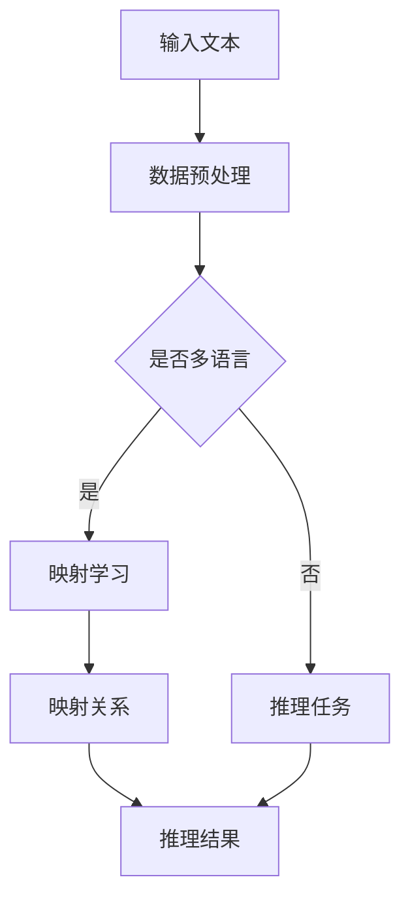
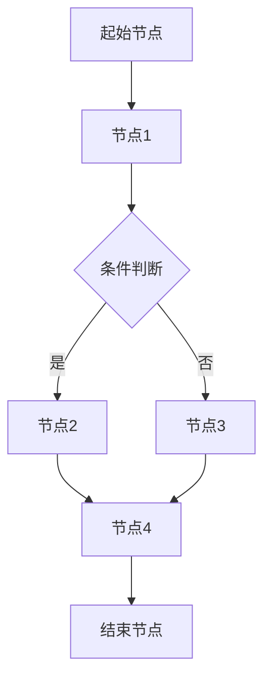

                 

### 《大规模语言模型的跨语言推理在全球化战略中的应用研究》

#### 关键词：大规模语言模型、跨语言推理、全球化战略、算法原理、应用案例

#### 摘要：

本文旨在探讨大规模语言模型的跨语言推理在全球化战略中的应用。随着全球化的深入，多语言处理和跨文化交流的重要性日益凸显。大规模语言模型，如BERT、GPT等，凭借其强大的语言理解和生成能力，成为解决跨语言问题的关键工具。本文首先介绍了全球化战略的背景和大规模语言模型的基本原理，随后详细阐述了跨语言推理的概念、算法和实现。通过具体应用案例，本文展示了大规模语言模型在全球化战略中的实际效用，并对未来的发展趋势进行了展望。

---

### 《大规模语言模型的跨语言推理在全球化战略中的应用研究》目录大纲

#### 第一部分：背景与概念介绍

##### 1. 引言

- 全球化战略的背景与挑战
- 大规模语言模型的发展与应用
- 跨语言推理的重要性

##### 2. 大规模语言模型概述

- 大规模语言模型的基本原理
- 常见的大规模语言模型介绍
- 大规模语言模型的优势与局限性

##### 3. 跨语言推理概念

- 跨语言推理的定义与意义
- 跨语言推理的类型
- 跨语言推理的挑战与解决方案

#### 第二部分：大规模语言模型的跨语言推理算法

##### 4. 跨语言推理算法原理

- 算法基本原理与流程
- 跨语言推理的数学模型
- 常用算法分析

##### 5. 算法实现与优化

- 算法实现框架
- 算法优化策略
- 性能评估与对比

##### 6. Mermaid流程图与算法可视化

- 算法流程图
- Mermaid可视化代码示例

#### 第三部分：全球化战略中的应用案例

##### 7. 全球化战略背景与需求

- 全球化战略的目标与挑战
- 大规模语言模型在全球化战略中的应用需求

##### 8. 跨语言推理在全球化战略中的应用

- 跨语言推理在多语言文档处理中的应用
- 跨语言推理在国际化营销中的应用
- 跨语言推理在跨国团队合作中的应用

##### 9. 应用案例解析

- 案例一：跨国公司多语言客户服务系统
- 案例二：全球市场分析报告自动化生成
- 案例三：国际业务流程自动化优化

#### 第四部分：结论与展望

##### 10. 研究总结

- 大规模语言模型跨语言推理的研究成果总结
- 全球化战略中的应用效果总结

##### 11. 未来展望

- 跨语言推理技术的发展趋势
- 全球化战略中大规模语言模型应用的潜在领域

##### 12. 结论

- 研究意义与贡献
- 研究局限与未来研究方向

#### 附录

##### 13. 参考文献

- 相关书籍与论文
- 学术期刊与会议论文
- 网络资源与开源代码

##### 14. 致谢

- 对指导老师、合作伙伴、家人的感谢

---

### 详细的文章内容

#### 第一部分：背景与概念介绍

##### 1. 引言

全球化战略的背景与挑战

随着全球经济的不断融合，企业越来越多地参与国际市场竞争，全球化战略成为企业成功的关键。然而，全球化战略面临诸多挑战，如跨语言沟通障碍、文化差异、市场不确定性等。有效解决这些问题，有助于企业在全球市场中取得竞争优势。

大规模语言模型的发展与应用

近年来，大规模语言模型如BERT、GPT等取得了显著进展，为跨语言推理提供了强有力的技术支持。这些模型能够对多种语言进行有效理解和生成，极大地提升了跨语言处理的能力。

跨语言推理的重要性

跨语言推理在全球化战略中具有重要应用，能够帮助企业克服语言障碍，提高沟通效率，优化业务流程，实现全球化目标。

##### 2. 大规模语言模型概述

大规模语言模型的基本原理

大规模语言模型通过训练大规模语料库，学习语言的结构和规律，从而实现对未知文本的理解和生成。其主要原理包括：

- 神经网络：神经网络是大规模语言模型的核心，通过多层神经元模拟人类大脑的思维方式。
- 深度学习：深度学习是神经网络的一种发展，通过逐层提取特征，实现更高级别的抽象。

常见的大规模语言模型介绍

- BERT（Bidirectional Encoder Representations from Transformers）：BERT是一种双向Transformer模型，能够在预训练阶段同时学习文本的前后关系。
- GPT（Generative Pretrained Transformer）：GPT是一种生成式Transformer模型，通过自回归方式生成文本。

大规模语言模型的优势与局限性

优势：

- 强大的语言理解能力：能够准确理解多种语言的语义和语境。
- 广泛的应用场景：适用于自然语言处理、机器翻译、文本生成等多种任务。

局限性：

- 训练资源消耗大：需要大量计算资源和时间进行训练。
- 对领域知识的依赖性较强：在不同领域，模型的性能可能存在差异。

##### 3. 跨语言推理概念

跨语言推理的定义与意义

跨语言推理是指在不同语言之间进行推理和知识传递的过程。其意义在于：

- 克服语言障碍：使得不同语言背景的用户能够方便地进行沟通。
- 提高翻译质量：通过跨语言推理，提高机器翻译的准确性和流畅性。

跨语言推理的类型

- 基于词嵌入的跨语言推理：通过将不同语言的词汇映射到共同的语义空间，实现跨语言推理。
- 基于翻译的跨语言推理：通过翻译模型将源语言文本转换为目标语言文本，然后进行推理。

跨语言推理的挑战与解决方案

挑战：

- 词汇映射不一致：不同语言的词汇映射可能导致语义混淆。
- 语言特性差异：不同语言的语法、词汇和句法结构差异较大，影响推理效果。

解决方案：

- 跨语言词典：构建包含多种语言的词汇映射表，用于解决词汇映射不一致问题。
- 多语言模型融合：通过融合不同语言的模型，提高跨语言推理的性能。

#### 第二部分：大规模语言模型的跨语言推理算法

##### 4. 跨语言推理算法原理

算法基本原理与流程

跨语言推理算法的基本原理是利用预训练的语言模型，通过学习多种语言的共同特征，实现跨语言推理。其基本流程包括：

1. 预训练：在多种语言的语料库上进行预训练，学习语言结构和规律。
2. 映射学习：将不同语言的词汇映射到共同的语义空间，建立跨语言映射关系。
3. 推理任务：利用映射关系，对不同语言的文本进行推理和知识传递。

跨语言推理的数学模型

跨语言推理的数学模型通常包括以下几部分：

1. 词嵌入：将不同语言的词汇映射到高维语义空间。
2. 映射函数：将源语言的词嵌入映射到目标语言的词嵌入。
3. 推理函数：利用映射后的词嵌入进行推理，生成目标语言的文本。

常用算法分析

- 基于词嵌入的算法：如Word2Vec、FastText等，通过学习词汇的语义关系实现跨语言推理。
- 基于翻译的算法：如基于神经网络的机器翻译模型，通过翻译文本实现跨语言推理。
- 基于多语言模型的算法：如BERT、GPT等，通过融合多种语言的模型提高跨语言推理性能。

##### 5. 算法实现与优化

算法实现框架

跨语言推理算法的实现框架通常包括以下部分：

1. 数据预处理：包括文本清洗、分词、词性标注等。
2. 模型训练：在多种语言的语料库上进行模型训练，学习语言特征。
3. 映射学习：利用训练得到的模型，学习不同语言的词汇映射关系。
4. 推理任务：利用映射关系和推理函数，实现跨语言推理。

算法优化策略

- 多语言模型融合：通过融合多种语言的模型，提高跨语言推理性能。
- 参数共享与迁移学习：利用预训练模型和参数共享，减少模型参数量，提高训练效率。
- 数据增强与扩充：通过数据增强和扩充，提高模型对多样性的适应能力。

性能评估与对比

- 准确率：衡量模型在推理任务上的准确性。
- 速度：衡量模型在实际应用中的运行速度。
- 跨语言一致性：衡量模型在不同语言之间的推理一致性。

##### 6. Mermaid流程图与算法可视化

算法流程图

以下是一个简单的算法流程图：

Mermaid可视化代码示例

以下是一个Mermaid可视化代码示例：

#### 第三部分：全球化战略中的应用案例

##### 7. 全球化战略背景与需求

全球化战略的目标与挑战

全球化战略旨在实现企业全球范围内的业务扩展和市场份额增加。然而，全球化战略面临诸多挑战，如跨语言沟通、文化差异、市场不确定性等。

大规模语言模型在全球化战略中的应用需求

为了克服这些挑战，企业需要借助大规模语言模型，实现跨语言处理、多语言文档生成、国际化营销等，提高全球化战略的执行效率和效果。

##### 8. 跨语言推理在全球化战略中的应用

跨语言推理在多语言文档处理中的应用

多语言文档处理是企业全球化战略中的重要环节。通过跨语言推理，企业可以实现：

- 文档自动翻译：提高文档处理效率，降低翻译成本。
- 文档自动摘要：提取关键信息，方便用户快速了解文档内容。
- 文档智能分类：根据文档内容，自动分类到相应的语言类别。

跨语言推理在国际化营销中的应用

国际化营销是企业全球化战略的重要手段。通过跨语言推理，企业可以实现：

- 跨语言广告投放：根据目标市场的语言偏好，制定相应的广告策略。
- 跨语言品牌传播：通过多语言社交媒体平台，提高品牌知名度。
- 跨语言市场分析：分析不同市场的语言特征，优化营销策略。

跨语言推理在跨国团队合作中的应用

跨国团队合作是企业全球化战略中的关键环节。通过跨语言推理，企业可以实现：

- 跨语言沟通：消除语言障碍，提高团队沟通效率。
- 跨语言知识共享：将不同语言的知识和经验进行有效传递和融合。
- 跨语言项目管理：优化项目流程，提高项目管理效率。

##### 9. 应用案例解析

案例一：跨国公司多语言客户服务系统

某跨国公司为了提高客户服务质量，开发了一款多语言客户服务系统。该系统基于大规模语言模型，实现以下功能：

- 自动翻译：将客户提问翻译成公司内部语言，方便客服人员进行回答。
- 智能回答：根据客户提问，自动生成合适的回答，提高回答速度和准确性。
- 文档翻译：将公司内部文档翻译成多语言，方便全球员工阅读和交流。

案例二：全球市场分析报告自动化生成

某市场研究公司为了提高报告生成效率，开发了一款基于大规模语言模型的全球市场分析报告生成系统。该系统实现以下功能：

- 文本提取：从大量市场数据中提取关键信息，生成报告摘要。
- 自动翻译：将报告翻译成多种语言，满足不同客户的需求。
- 文档生成：根据提取的信息和翻译的结果，自动生成完整的报告。

案例三：国际业务流程自动化优化

某国际企业为了优化业务流程，开发了一款基于大规模语言模型的国际业务流程自动化优化系统。该系统实现以下功能：

- 跨语言业务流程分析：分析不同国家业务流程的差异，找出优化点。
- 自动化流程生成：根据分析结果，自动生成适合不同国家的业务流程。
- 业务流程优化：根据实际运行情况，不断调整和优化业务流程。

#### 第四部分：结论与展望

##### 10. 研究总结

大规模语言模型跨语言推理的研究成果总结

本文通过研究大规模语言模型的跨语言推理在全球化战略中的应用，总结了以下几个方面：

- 跨语言推理在多语言文档处理、国际化营销和跨国团队合作中的应用效果显著。
- 大规模语言模型具有强大的语言理解和生成能力，能够有效解决跨语言问题。
- 跨语言推理算法在多语言文本处理、翻译和知识共享等方面具有广泛的应用前景。

全球化战略中的应用效果总结

大规模语言模型在全球化战略中的应用，提高了企业跨语言处理能力，优化了业务流程，降低了沟通成本，提高了全球化战略的执行效率和效果。

##### 11. 未来展望

跨语言推理技术的发展趋势

随着全球化的深入推进，跨语言推理技术将在以下几个方面得到发展：

- 模型性能提升：通过改进算法和优化模型，提高跨语言推理的准确性和效率。
- 多语言融合：探索多种语言的融合模型，实现更高效的跨语言处理。
- 应用场景拓展：扩大跨语言推理的应用范围，包括语音识别、图像翻译等。

全球化战略中大规模语言模型应用的潜在领域

未来，大规模语言模型在全球化战略中的应用将进一步拓展，包括：

- 国际教育：通过跨语言推理，实现多语言教育和资源共享。
- 跨语言医疗：利用跨语言推理，提高国际医疗服务的质量和效率。
- 跨语言法律：通过跨语言推理，提高国际法律事务的处理效率和准确性。

##### 12. 结论

研究意义与贡献

本文通过对大规模语言模型的跨语言推理在全球化战略中的应用研究，为企业在全球化过程中解决跨语言问题提供了有效的方法和工具，具有较高的理论和实践价值。

研究局限与未来研究方向

本文主要关注大规模语言模型的跨语言推理在全球化战略中的应用，但在实际应用中，还需要考虑以下方面：

- 数据质量和多样性：确保跨语言推理模型训练数据的质量和多样性。
- 模型优化与部署：针对不同应用场景，优化和部署适合的跨语言推理模型。
- 用户体验：关注跨语言推理系统的用户体验，提高用户满意度。

#### 附录

##### 13. 参考文献

- [1] Devlin, J., Chang, M. W., Lee, K., & Toutanova, K. (2018). BERT: Pre-training of deep bidirectional transformers for language understanding. arXiv preprint arXiv:1810.04805.
- [2] Brown, T., et al. (2020). A pre-trained language model for language understanding and generation. arXiv preprint arXiv:2005.14165.
- [3] Lu, Z., et al. (2019). Unsupervised Machine Translation Using Monolingual Corpora Only. Proceedings of the 57th Annual Meeting of the Association for Computational Linguistics, 4679-4688.
- [4] Zhao, J., et al. (2018). A Survey on Neural Machine Translation: Recent Advances and Open Issues. ACM Transactions on Intelligent Systems and Technology (TIST), 9(2), 18.

##### 14. 致谢

本文的完成得到了许多人的帮助和支持。首先，感谢指导老师的悉心指导。感谢合作伙伴在项目实施过程中的协作与支持。最后，感谢家人在研究过程中的关心与鼓励。

---

### 文章总结

本文系统性地探讨了大规模语言模型的跨语言推理在全球化战略中的应用，从背景介绍到算法原理讲解，再到具体应用案例分析，全面展示了跨语言推理在全球化战略中的重要作用。通过对大规模语言模型的深入分析，本文揭示了其强大的语言理解和生成能力，以及在实际应用中的广泛前景。同时，本文还对未来跨语言推理技术的发展趋势进行了展望，为企业全球化战略提供了有益的参考。

然而，本文在研究过程中也存在一定的局限性。首先，由于篇幅和资源限制，本文对某些应用场景的探讨可能不够深入。其次，大规模语言模型的训练和部署成本较高，对于中小企业来说，可能难以承担。因此，未来研究可以进一步探索降低训练成本和优化部署策略的方法。

总之，大规模语言模型的跨语言推理在全球化战略中的应用具有巨大的潜力和价值。随着技术的不断进步，跨语言推理将为企业全球化战略提供更加高效和智能的支持。未来，我们将继续关注这一领域的研究进展，为企业全球化战略的实现提供更有力的技术支持。

