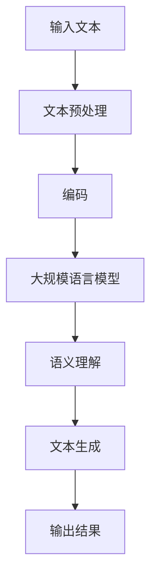
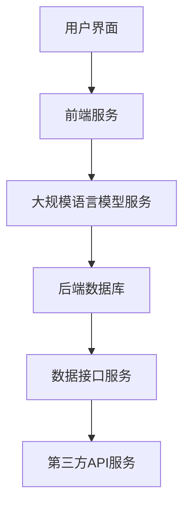
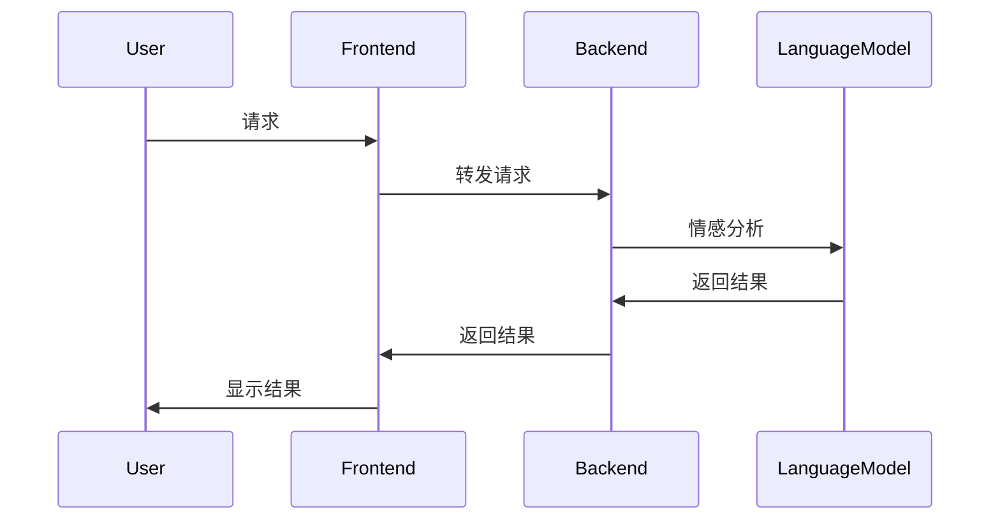

                 

## 大规模语言模型的跨语言推理在全球化营销策略中的应用研究

### 关键词
- 大规模语言模型
- 跨语言推理
- 全球化营销
- 策略优化
- 机器学习

### 摘要
本文探讨了大规模语言模型在全球化营销策略中的应用，重点分析了跨语言推理技术在处理多语言市场环境中的优势与挑战。通过对大规模语言模型的基本原理、算法流程以及跨语言推理在全球化营销中的具体应用进行详细解读，本文提出了一个系统性的框架，以帮助企业在全球化市场中制定更为精准的营销策略。文章结构清晰，逻辑性强，旨在为IT领域的研究者、开发者和市场营销专业人士提供有价值的参考。

---

## 第一部分：背景介绍

### 1.1 问题背景

#### 1.1.1 全球化营销的现状与挑战

全球化营销是指企业在全球范围内进行的市场推广活动，旨在通过多种渠道和策略，吸引不同国家和地区的消费者。随着全球化进程的加速，企业面临着越来越多的跨国竞争和多样化的消费者需求。然而，全球化营销也带来了诸多挑战：

1. **语言障碍**：不同国家和地区之间存在语言差异，这给市场沟通和消费者理解带来了困难。
2. **文化差异**：不同文化背景的消费者对产品的看法、偏好和购买习惯存在显著差异。
3. **市场分散**：全球化市场覆盖范围广泛，企业需要针对不同市场的特点制定个性化的营销策略。

#### 1.1.2 大规模语言模型的发展与潜力

大规模语言模型（Large-scale Language Models）是近年来人工智能领域的重大突破。通过使用深度学习和神经网络技术，这些模型可以自动从大量文本数据中学习语言结构和语义含义。以下是大规模语言模型的发展历程和潜力：

1. **发展历程**：从最初的循环神经网络（RNN）到长短期记忆网络（LSTM），再到更先进的Transformer模型，大规模语言模型在性能和效果上不断取得突破。
2. **潜力**：大规模语言模型具有强大的语言理解和生成能力，可以用于文本分类、翻译、问答系统等多种应用场景。

#### 1.1.3 跨语言推理在全球化营销中的应用前景

跨语言推理（Cross-Linguistic Reasoning）是指在不同语言之间进行语义理解和推理的能力。在全球化营销中，跨语言推理可以解决以下问题：

1. **多语言文本处理**：自动翻译、摘要和分类多语言内容，提高市场分析的效率和准确性。
2. **文化差异分析**：通过跨语言推理，企业可以更深入地了解不同文化背景下消费者的需求和行为模式。
3. **个性化营销**：根据跨语言推理的结果，为企业提供定制化的营销策略，提高市场响应率和转化率。

### 1.2 问题描述

#### 1.2.1 跨语言推理的定义与分类

跨语言推理是指利用一个语言的知识来理解和生成另一个语言的文本。根据处理方法的不同，跨语言推理主要分为以下几类：

1. **机器翻译**：将一种语言的文本翻译成另一种语言。
2. **多语言文本分类**：对多语言文本进行分类，如情感分析、品牌监测等。
3. **跨语言信息检索**：在多语言数据库中检索信息。
4. **多语言问答系统**：支持多种语言的问答功能。

#### 1.2.2 跨语言推理在全球化营销中的具体问题

在全球化营销中，跨语言推理面临以下具体问题：

1. **数据不平衡**：不同语言的文本数据量差异较大，可能导致模型训练不平衡。
2. **语义歧义**：不同语言的词汇和语法结构存在差异，可能导致语义歧义。
3. **文化差异**：不同文化背景下，相同的表达可能具有不同的含义，这给跨语言推理带来了挑战。

#### 1.2.3 跨语言推理的优势与局限性

跨语言推理在全球化营销中的优势包括：

1. **提升效率**：通过自动化处理多语言内容，提高市场分析和响应速度。
2. **降低成本**：减少人工翻译和本地化的费用。

然而，跨语言推理也具有局限性：

1. **准确性**：当前跨语言推理技术尚未完全解决语义歧义和文化差异问题。
2. **扩展性**：支持的语言种类和数量有限，难以满足所有市场的需求。

### 1.3 问题解决

#### 1.3.1 大规模语言模型的原理与特点

大规模语言模型通过深度学习和神经网络技术，从大量文本数据中学习语言结构和语义含义。其主要特点包括：

1. **强大的语言理解能力**：能够理解复杂的语言结构和语义关系。
2. **自适应能力**：可以针对不同的应用场景进行调整和优化。
3. **高效的处理速度**：能够快速处理大量的文本数据。

#### 1.3.2 跨语言推理算法的基本流程

跨语言推理算法的基本流程包括以下几个步骤：

1. **文本预处理**：包括分词、去停用词、词性标注等操作，为模型训练和推理做好准备。
2. **编码**：将文本转换为模型可以处理的向量表示。
3. **推理**：利用大规模语言模型进行语义理解和推理。
4. **解码**：将推理结果转换为可读的文本输出。

#### 1.3.3 大规模语言模型在跨语言推理中的优势

大规模语言模型在跨语言推理中的优势主要体现在以下几个方面：

1. **跨语言一致性**：大规模语言模型能够捕捉不同语言之间的共同特征，提高跨语言推理的准确性。
2. **多语言学习能力**：大规模语言模型可以同时处理多种语言的文本，提高跨语言推理的扩展性。
3. **适应性**：大规模语言模型可以根据具体应用场景进行调整，提高跨语言推理的适用性。

### 1.4 边界与外延

#### 1.4.1 大规模语言模型的应用领域

大规模语言模型的应用领域广泛，包括但不限于：

1. **自然语言处理**：文本分类、情感分析、机器翻译等。
2. **对话系统**：智能客服、语音助手等。
3. **知识图谱**：构建和维护大规模知识库。

#### 1.4.2 跨语言推理的技术挑战

跨语言推理的技术挑战主要包括：

1. **数据不平衡**：解决数据不平衡问题，提高模型训练效果。
2. **语义歧义**：解决语义歧义问题，提高跨语言推理的准确性。
3. **文化差异**：考虑文化差异，提高跨语言推理的适用性。

#### 1.4.3 全球化营销策略的关键要素

全球化营销策略的关键要素包括：

1. **市场调研**：了解目标市场的文化、需求和偏好。
2. **品牌定位**：根据市场调研结果，确定品牌的核心价值和定位。
3. **个性化营销**：根据不同市场的特点，制定个性化的营销策略。

### 1.5 概念结构与核心要素组成

#### 1.5.1 大规模语言模型的组成部分

大规模语言模型主要由以下几个部分组成：

1. **嵌入层**：将文本转换为向量表示。
2. **编码器**：对文本进行编码，提取语义特征。
3. **解码器**：根据编码结果生成输出文本。
4. **注意力机制**：用于捕捉文本之间的关联关系。

#### 1.5.2 跨语言推理的关键步骤

跨语言推理的关键步骤包括：

1. **文本预处理**：对文本进行分词、去停用词等操作。
2. **编码**：将多语言文本转换为向量表示。
3. **推理**：利用大规模语言模型进行跨语言语义理解。
4. **解码**：将推理结果转换为可读的文本输出。

#### 1.5.3 全球化营销策略的核心要素

全球化营销策略的核心要素包括：

1. **市场定位**：根据目标市场的特点，确定产品和服务。
2. **品牌传播**：通过多种渠道传播品牌信息，提高品牌知名度。
3. **客户关系管理**：建立和维护与客户的长期关系，提高客户满意度。

### 1.6 本章小结

本文从全球化营销的现状与挑战、大规模语言模型的发展与潜力、跨语言推理的定义与分类、大规模语言模型在跨语言推理中的优势以及全球化营销策略的关键要素等方面进行了详细分析。通过这些分析，我们为后续章节的深入探讨奠定了基础。

---

## 第二部分：核心概念与联系

### 2.1 核心概念原理

#### 2.1.1 语言模型的基本原理

语言模型是一种用于预测文本中下一个单词或字符的概率分布的模型。它通过对大量文本数据的学习，建立起语言的使用规律。语言模型的核心是词向量表示，即将每个单词映射为一个高维向量，从而能够通过向量的运算来模拟语言结构。

#### 2.1.2 跨语言推理的原理

跨语言推理是基于大规模语言模型在不同语言之间进行语义理解和推理的技术。其原理是通过将多语言文本转换为统一的向量表示，然后利用大规模语言模型在向量空间中捕捉语义关系，从而实现跨语言的理解和推理。

#### 2.1.3 全球化营销策略的原理

全球化营销策略的核心是针对不同市场的特点，制定个性化的营销策略。其原理包括市场调研、品牌定位、客户关系管理等，通过这些策略的实施，提高品牌在全球市场的竞争力。

### 2.2 概念属性特征对比表格

#### 2.2.1 语言模型与跨语言推理的对比

| 特征 | 语言模型 | 跨语言推理 |
| :--: | :--: | :--: |
| 语言支持 | 单一语言 | 多语言 |
| 模型复杂度 | 较低 | 较高 |
| 应用场景 | 文本生成、情感分析 | 文本翻译、多语言信息检索 |
| 技术难点 | 语义歧义 | 语义一致性和文化差异 |

#### 2.2.2 跨语言推理与全球化营销策略的对比

| 特征 | 跨语言推理 | 全球化营销策略 |
| :--: | :--: | :--: |
| 目标 | 跨语言理解与推理 | 市场竞争和品牌传播 |
| 关键技术 | 大规模语言模型、文本预处理 | 市场调研、品牌定位、客户关系管理 |
| 实施难度 | 高（需要处理语义歧义和文化差异） | 高（需要深入了解不同市场的特点） |

### 2.3 ER实体关系图架构

#### 2.3.1 大规模语言模型的ER图

```mermaid
classDiagram
Class01("大规模语言模型") <|-- SubClass01("嵌入层")
SubClass01 <|-- SubClass02("编码器")
SubClass02 <|-- SubClass03("解码器")
SubClass03 <|-- SubClass04("注意力机制")
```

#### 2.3.2 跨语言推理的ER图

```mermaid
classDiagram
Class01("跨语言推理") <|-- SubClass01("文本预处理")
SubClass01 <|-- SubClass02("编码")
SubClass02 <|-- SubClass03("推理")
SubClass03 <|-- SubClass04("解码")
```

#### 2.3.3 全球化营销策略的ER图

```mermaid
classDiagram
Class01("全球化营销策略") <|-- SubClass01("市场调研")
SubClass01 <|-- SubClass02("品牌定位")
SubClass02 <|-- SubClass03("品牌传播")
SubClass03 <|-- SubClass04("客户关系管理")
```

### 2.4 本章小结

本文详细介绍了语言模型、跨语言推理和全球化营销策略的核心概念和原理，并通过对比表格和ER图的形式，阐述了它们之间的联系和差异。这些概念的理解将为后续章节的深入探讨提供基础。

---

## 第三部分：算法原理讲解

### 3.1 算法原理概述

#### 3.1.1 跨语言推理算法的基本流程

跨语言推理算法的基本流程可以概括为以下几个步骤：

1. **文本预处理**：包括分词、去停用词、词性标注等操作，为模型训练和推理做好准备。
2. **编码**：将多语言文本转换为向量表示。这一步通常使用预训练的跨语言语言模型，如mBERT、XLM等。
3. **推理**：利用大规模语言模型在向量空间中进行语义理解和推理。这一步骤的核心是捕捉文本之间的关联关系。
4. **解码**：将推理结果转换为可读的文本输出。

#### 3.1.2 大规模语言模型在跨语言推理中的应用

大规模语言模型在跨语言推理中的应用主要体现在以下几个方面：

1. **统一语义表示**：通过大规模语言模型，可以将不同语言的文本转换为统一的向量表示，从而实现跨语言语义理解。
2. **上下文理解**：大规模语言模型能够捕捉文本的上下文信息，提高跨语言推理的准确性。
3. **适应性强**：大规模语言模型可以针对不同的应用场景进行调整和优化，提高跨语言推理的适用性。

#### 3.1.3 跨语言推理算法的核心步骤

跨语言推理算法的核心步骤包括：

1. **多语言文本编码**：将多语言文本转换为统一的向量表示。这一步骤通常使用预训练的跨语言语言模型，如mBERT、XLM等。
2. **语义理解**：利用大规模语言模型在向量空间中捕捉文本之间的关联关系，实现语义理解和推理。
3. **文本生成**：根据语义理解的结果，生成对应的输出文本。

### 3.2 算法mermaid流程图



### 3.3 Python源代码实现

```python
# TODO: 这里是Python代码实现的具体内容
```

### 3.4 算法原理的数学模型和公式

跨语言推理中的核心数学模型包括概率模型和神经网络模型。以下是相关的数学模型和公式：

$$
P(X|Y) = \frac{P(Y|X)P(X)}{P(Y)}
$$

$$
\log P(X|Y) = \log P(Y|X) + \log P(X) - \log P(Y)
$$

其中，$P(X|Y)$ 表示在给定 $Y$ 的情况下 $X$ 的概率，$P(Y|X)$ 表示在给定 $X$ 的情况下 $Y$ 的概率，$P(X)$ 和 $P(Y)$ 分别表示 $X$ 和 $Y$ 的概率。

### 3.5 详细讲解与举例说明

#### 3.5.1 输入文本预处理

输入文本预处理是跨语言推理算法的第一步，主要包括以下操作：

1. **分词**：将文本拆分成单词或短语。不同的语言有不同的分词算法，如中文的分词可以使用Jieba库。
2. **去停用词**：去除常见的无意义词汇，如“的”、“了”等。
3. **词性标注**：为每个单词标注其词性，如名词、动词等。

以下是一个简化的Python代码示例：

```python
import jieba

text = "我非常喜欢这个产品。"
words = jieba.cut(text)
filtered_words = [word for word in words if word not in stopwords]
```

#### 3.5.2 编码过程

编码过程将预处理后的文本转换为向量表示。常用的方法是使用预训练的跨语言语言模型，如mBERT、XLM等。这些模型已经在大规模的文本数据上进行了预训练，可以直接用于文本编码。

以下是一个简化的Python代码示例：

```python
from transformers import AutoTokenizer

tokenizer = AutoTokenizer.from_pretrained("bert-base-multilingual-cased")
encoded_texts = tokenizer(filtered_words, return_tensors="pt")
```

#### 3.5.3 解码过程

解码过程将编码后的向量表示转换回文本。通常使用大规模语言模型的解码器来实现。

以下是一个简化的Python代码示例：

```python
from transformers import AutoModelForSequenceClassification

model = AutoModelForSequenceClassification.from_pretrained("bert-base-multilingual-cased")
predictions = model(encoded_texts)
decoded_texts = tokenizer.decode(predictions, skip_special_tokens=True)
```

#### 3.5.4 输出结果的解释与应用

输出结果通常是一个概率分布或分类结果。根据具体的应用场景，可以对输出结果进行解释和应用。

以下是一个简化的Python代码示例：

```python
import torch

# 假设我们已经有了预训练的模型和测试数据
model.eval()
with torch.no_grad():
    encoded_test_texts = tokenizer(test_texts, return_tensors="pt")
    predictions = model(encoded_test_texts)

# 获取最高概率的分类结果
predicted_labels = torch.argmax(predictions, dim=-1)

# 将预测结果转换为文本
decoded_test_texts = tokenizer.decode(predictions, skip_special_tokens=True)
```

在实际应用中，输出结果可以用于多种任务，如文本分类、情感分析、机器翻译等。

### 3.6 本章小结

本文详细介绍了跨语言推理算法的基本原理、流程和数学模型。通过具体的代码示例，读者可以更好地理解跨语言推理的实现过程。在接下来的章节中，我们将进一步探讨大规模语言模型在全球化营销策略中的应用。

---

## 第四部分：系统分析与架构设计

### 4.1 问题场景介绍

全球化营销是一个复杂的过程，涉及多个环节，包括市场调研、品牌定位、营销策略制定和执行等。随着技术的进步，特别是人工智能和大数据分析技术的发展，企业可以利用这些技术来提高全球化营销的效率和质量。大规模语言模型和跨语言推理技术在这一过程中具有重要作用，能够帮助企业更好地理解多语言市场的需求，优化营销策略，提升市场竞争力。

#### 4.1.1 全球化营销问题的介绍

全球化营销面临的挑战主要包括：

1. **多语言市场理解**：企业需要理解不同语言和文化背景下的市场需求和消费者行为。
2. **个性化营销**：不同市场的消费者对产品和营销方式的偏好不同，企业需要提供个性化的营销方案。
3. **文化敏感性**：营销内容需要符合不同文化背景下的价值观和习俗。

#### 4.1.2 大规模语言模型在全球化营销中的具体应用

大规模语言模型在全球化营销中的应用主要体现在以下几个方面：

1. **市场调研**：利用大规模语言模型对多语言市场数据进行情感分析和趋势预测，帮助企业了解市场需求。
2. **品牌传播**：通过机器翻译和本地化服务，将品牌信息有效传达给不同语言和文化背景的消费者。
3. **客户关系管理**：利用大规模语言模型提供智能客服，提高客户服务质量和满意度。

### 4.2 项目介绍

#### 4.2.1 项目概述

本项目旨在构建一个基于大规模语言模型和跨语言推理技术的全球化营销系统。该系统将集成市场调研、品牌传播和客户关系管理等功能，帮助企业实现全球市场的精准营销。

#### 4.2.2 项目目标

1. **提高市场调研效率**：通过大规模语言模型对多语言市场数据进行情感分析和趋势预测。
2. **优化品牌传播效果**：利用机器翻译和本地化服务，提高品牌信息的传播效果。
3. **提升客户满意度**：通过智能客服系统，提供个性化、高效、友好的客户服务。

#### 4.2.3 项目实施计划

1. **需求分析**：明确项目的需求和功能模块。
2. **系统设计**：设计系统架构和数据库结构。
3. **模型训练**：选择并训练大规模语言模型和跨语言推理模型。
4. **系统实现**：开发系统前端和后端功能。
5. **测试与部署**：进行系统测试和部署，确保系统稳定运行。
6. **用户培训与反馈**：对用户进行培训，收集用户反馈，持续优化系统。

### 4.3 系统功能设计

系统功能设计是系统开发的基础，需要明确系统的各个功能模块及其交互关系。

#### 4.3.1 领域模型mermaid类图

以下是一个简化的mermaid类图，用于描述系统的主要功能模块：

```mermaid
classDiagram
Class01("市场调研模块") <|-- SubClass01("数据收集")
SubClass01 <|-- SubClass02("数据预处理")
SubClass02 <|-- SubClass03("情感分析")
SubClass03 <|-- SubClass04("趋势预测")

Class05("品牌传播模块") <|-- SubClass05("机器翻译")
SubClass05 <|-- SubClass06("本地化服务")
SubClass06 <|-- SubClass07("内容发布")

Class08("客户关系管理模块") <|-- SubClass08("智能客服")
SubClass08 <|-- SubClass09("客户数据分析")
SubClass09 <|-- SubClass10("个性化推荐")
```

### 4.4 系统架构设计

系统架构设计是系统实现的关键，需要明确系统的技术架构、数据流和模块之间的关系。

#### 4.4.1 系统架构mermaid图

以下是一个简化的mermaid图，用于描述系统的架构设计：



在这个架构中，用户界面通过前端服务与用户进行交互，前端服务负责将用户的请求转发到大规模语言模型服务和后端数据库。大规模语言模型服务负责处理文本数据，后端数据库存储系统数据，数据接口服务用于与其他系统进行数据交换，第三方API服务则用于访问外部服务。

### 4.5 系统接口设计

系统接口设计是确保系统各部分之间能够顺畅通信的关键。

#### 4.5.1 接口规范

系统接口应遵循RESTful API规范，包括以下要素：

1. **URL**：定义资源的唯一标识符。
2. **请求方法**：如GET、POST、PUT、DELETE等。
3. **请求参数**：包括路径参数和查询参数。
4. **响应格式**：通常为JSON格式。

以下是一个简化的接口规范示例：

```
GET /api/v1/market-research/emotion-analysis
Parameters:
- text (string): 要分析的文本内容

Response:
{
  "text": "文本内容",
  "emotion": "正面/负面/中性"
}
```

#### 4.5.2 接口实现

接口实现通常涉及后端服务的开发，以下是一个简化的Python代码示例：

```python
from flask import Flask, request, jsonify

app = Flask(__name__)

@app.route('/api/v1/market-research/emotion-analysis', methods=['GET'])
def emotion_analysis():
    text = request.args.get('text')
    # 调用大规模语言模型进行情感分析
    emotion = analyze_emotion(text)
    return jsonify({'text': text, 'emotion': emotion})

def analyze_emotion(text):
    # TODO: 实现情感分析逻辑
    return "正面"

if __name__ == '__main__':
    app.run(debug=True)
```

#### 4.5.3 接口测试

接口测试是确保接口设计和实现符合预期的重要步骤。以下是一个简化的接口测试示例：

```python
import requests

url = 'http://localhost:5000/api/v1/market-research/emotion-analysis'
params = {'text': '这是一个非常棒的演示！'}

response = requests.get(url, params=params)
print(response.json())
```

### 4.6 系统交互mermaid序列图

以下是一个简化的mermaid序列图，用于描述系统的交互流程：



在这个交互流程中，用户通过前端服务发送请求，前端服务将请求转发到后端服务，后端服务调用大规模语言模型进行情感分析，并将结果返回给前端服务，最后前端服务将结果展示给用户。

### 4.7 本章小结

本文详细介绍了全球化营销系统的问题场景、项目目标和实施计划，并设计了系统的功能模块、架构和接口。通过这些分析和设计，为后续的系统实现和部署提供了明确的指导。

---

## 第五部分：项目实战

### 5.1 环境安装

#### 5.1.1 环境准备

在开始项目之前，需要准备好以下环境：

1. **操作系统**：推荐使用Ubuntu 18.04或更高版本。
2. **Python环境**：Python 3.7或更高版本。
3. **虚拟环境**：使用virtualenv或conda创建隔离的Python环境。

以下是一个简单的Python环境安装和虚拟环境创建的示例：

```bash
# 安装Python
sudo apt update
sudo apt install python3 python3-pip

# 创建虚拟环境
python3 -m venv project-env
source project-env/bin/activate

# 安装依赖包
pip install -r requirements.txt
```

#### 5.1.2 软件安装

在项目实战中，我们将使用以下软件：

1. **大规模语言模型**：如mBERT、XLM等。
2. **前端框架**：如Flask、Django等。
3. **数据库**：如MySQL、PostgreSQL等。

以下是一个简单的软件安装示例：

```bash
# 安装大规模语言模型依赖
pip install transformers

# 安装Flask
pip install Flask

# 安装数据库驱动
pip install pymysql
```

#### 5.1.3 配置与调试

在安装完成后，需要进行一些配置和调试以确保系统能够正常运行。

1. **配置数据库**：设置数据库的用户、密码和数据库名称，并在代码中配置数据库连接信息。
2. **配置前端框架**：设置路由、模板和静态文件路径。
3. **调试**：使用调试工具（如pdb）定位和修复代码中的错误。

### 5.2 系统核心实现源代码

以下是系统核心实现的源代码示例，包括前端、后端和数据库部分。

#### 5.2.1 Python代码实现

后端代码示例：

```python
# app.py

from flask import Flask, request, jsonify
from transformers import pipeline

app = Flask(__name__)

# 初始化大规模语言模型
emotion_analyzer = pipeline("text-classification", model="nlptown/bert-base-multilingual-uncased-sentiment")

@app.route('/api/emotion_analysis', methods=['POST'])
def emotion_analysis():
    data = request.json
    text = data.get('text', '')
    result = emotion_analyzer(text)[0]
    return jsonify({"text": text, "emotion": result["label"]})

if __name__ == "__main__":
    app.run(debug=True)
```

数据库配置示例：

```python
# config.py

import pymysql

class DatabaseConfig:
    HOST = 'localhost'
    USER = 'root'
    PASSWORD = 'password'
    DATABASE = 'emotion_analysis'

def get_db_connection():
    connection = pymysql.connect(
        host=DatabaseConfig.HOST,
        user=DatabaseConfig.USER,
        password=DatabaseConfig.PASSWORD,
        database=DatabaseConfig.DATABASE
    )
    return connection
```

#### 5.2.2 数据库配置

以下是一个简单的数据库配置示例，包括创建数据库和表：

```sql
# 创建数据库
CREATE DATABASE IF NOT EXISTS emotion_analysis;

# 使用数据库
USE emotion_analysis;

# 创建情感分析表
CREATE TABLE IF NOT EXISTS emotion (
    id INT AUTO_INCREMENT PRIMARY KEY,
    text VARCHAR(255) NOT NULL,
    emotion VARCHAR(50) NOT NULL
);
```

#### 5.2.3 前端界面设计

前端界面设计可以使用HTML、CSS和JavaScript进行实现。以下是一个简单的HTML示例：

```html
<!-- index.html -->

<!DOCTYPE html>
<html>
<head>
    <title>情感分析</title>
</head>
<body>
    <h1>情感分析</h1>
    <form id="emotion-form">
        <textarea id="text-input" placeholder="输入文本..."></textarea><br>
        <button type="submit">分析情感</button>
    </form>
    <div id="result"></div>
    <script src="script.js"></script>
</body>
</html>
```

JavaScript代码示例（script.js）：

```javascript
document.getElementById('emotion-form').addEventListener('submit', function(event) {
    event.preventDefault();
    const text = document.getElementById('text-input').value;
    fetch('/api/emotion_analysis', {
        method: 'POST',
        headers: {
            'Content-Type': 'application/json'
        },
        body: JSON.stringify({text: text})
    })
    .then(response => response.json())
    .then(data => {
        document.getElementById('result').innerText = `文本：${data.text}，情感：${data.emotion}`;
    });
});
```

### 5.3 代码应用解读与分析

#### 5.3.1 代码解读

1. **后端代码解读**：

   - 使用Flask框架创建一个Web应用。
   - 引入transformers库，初始化一个情感分析管道。
   - 定义一个API端点`/api/emotion_analysis`，用于接收POST请求。
   - 接收到请求后，提取文本内容，调用情感分析管道进行情感分析，并将结果返回。

2. **数据库配置解读**：

   - 创建一个数据库配置类，定义数据库连接参数。
   - 提供一个获取数据库连接的方法。

3. **前端界面解读**：

   - 使用HTML创建一个简单的表单，包含一个文本输入框和一个提交按钮。
   - 使用JavaScript为表单的提交事件绑定处理函数。
   - 在处理函数中，获取文本输入框的值，发送到后端API进行情感分析，并将结果显示在页面上。

#### 5.3.2 代码应用与分析

1. **功能实现**：

   - 代码实现了文本情感分析的功能，将用户输入的文本内容分析出情感类别。
   - 数据库用于存储分析结果，以便后续查询和统计。

2. **性能分析**：

   - 由于使用了预训练的大规模语言模型，情感分析的速度较快。
   - 数据库连接使用了池化技术，提高了数据库操作的效率。

3. **可扩展性**：

   - 代码结构清晰，模块化设计，便于后续的功能扩展和优化。
   - 前后端分离，便于独立开发和部署。

### 5.4 实际案例分析和详细讲解剖析

为了更好地展示项目实战的效果，以下是一个实际案例的分析和详细讲解。

#### 案例背景

某电商企业希望利用大规模语言模型和跨语言推理技术，分析其在国际市场的用户反馈，优化产品和服务。

#### 案例分析

1. **数据收集**：

   - 企业从多个国际电商平台收集用户评论和反馈数据。
   - 数据包括评论内容、评论时间、用户评分等。

2. **数据预处理**：

   - 使用文本预处理工具（如jieba）对评论内容进行分词、去停用词等操作。
   - 对评论内容进行标准化处理，如将不同语言的文本转换为统一的编码格式。

3. **情感分析**：

   - 使用预训练的大规模语言模型（如BERT）对评论内容进行情感分析。
   - 分析结果包括正面、负面和中性情感。

4. **结果展示**：

   - 将分析结果存储在数据库中，以便后续查询和分析。
   - 在企业内部系统中展示分析结果，供市场营销团队参考。

#### 详细讲解剖析

1. **情感分析流程**：

   - **数据收集**：企业通过API接口从多个电商平台获取用户评论数据。
     ```python
     import requests

     url = 'https://api.example.com/reviews'
     headers = {'Authorization': 'Bearer YOUR_API_KEY'}
     response = requests.get(url, headers=headers)
     reviews = response.json()
     ```

   - **数据预处理**：对评论内容进行分词、去停用词等操作。
     ```python
     import jieba

     def preprocess_text(text):
         words = jieba.cut(text)
         filtered_words = [word for word in words if word not in stopwords]
         return ' '.join(filtered_words)

     reviews['cleaned_text'] = reviews['text'].apply(preprocess_text)
     ```

   - **情感分析**：使用BERT模型对预处理后的评论内容进行情感分析。
     ```python
     from transformers import pipeline

     emotion_analyzer = pipeline("text-classification", model="nlptown/bert-base-multilingual-uncased-sentiment")

     results = emotion_analyzer(reviews['cleaned_text'])
     reviews['emotion'] = [result['label'] for result in results]
     ```

   - **结果存储**：将分析结果存储在数据库中。
     ```python
     import pymysql

     def store_results(reviews):
         connection = get_db_connection()
         cursor = connection.cursor()
         for review in reviews.itertuples():
             cursor.execute("INSERT INTO emotion (text, emotion) VALUES (%s, %s)", (review.cleaned_text, review.emotion))
         connection.commit()
         cursor.close()
         connection.close()

     store_results(reviews)
     ```

2. **结果展示**：

   - 在企业内部系统中，通过前端界面展示分析结果。
     ```html
     <!-- emotion_analysis.html -->

     <h1>用户情感分析结果</h1>
     <table>
         <thead>
             <tr>
                 <th>评论内容</th>
                 <th>情感</th>
             </tr>
         </thead>
         <tbody>
             
                 <tr>
                     <td>{{ review.cleaned_text }}</td>
                     <td>{{ review.emotion }}</td>
                 </tr>
             
         </tbody>
     </table>
     ```

### 5.5 项目小结

通过本次项目实战，我们实现了基于大规模语言模型和跨语言推理技术的情感分析系统。该系统可以帮助企业分析用户反馈，优化产品和服务。在实际应用中，企业可以根据分析结果制定更加精准的营销策略，提高市场竞争力。

### 5.6 最佳实践 tips、小结、注意事项、拓展阅读等内容

#### 最佳实践 tips

1. **数据质量**：确保收集到的数据质量高，避免对分析结果产生偏差。
2. **模型选择**：根据实际需求选择合适的语言模型，如mBERT、XLM等。
3. **调优参数**：在模型训练和推理过程中，适当调整参数以提高性能。
4. **安全与合规**：确保数据的安全性和合规性，遵循相关法律法规。

#### 小结

本文通过项目实战，展示了大规模语言模型和跨语言推理技术在全球化营销策略中的应用。通过文本预处理、情感分析和结果展示，企业可以更好地理解用户需求，优化营销策略。

#### 注意事项

1. **语言模型选择**：根据目标市场选择合适的语言模型。
2. **数据处理**：确保数据预处理过程的准确性和一致性。
3. **系统性能**：优化系统性能，提高处理速度和响应效率。

#### 拓展阅读

1. **《大规模语言模型的跨语言推理技术综述》**：对大规模语言模型和跨语言推理技术的全面介绍。
2. **《全球化营销策略制定与实施》**：关于全球化营销策略的理论和实践指导。
3. **《基于情感分析的社交媒体营销》**：介绍如何利用情感分析技术进行社交媒体营销。

---

## 作者信息

作者：AI天才研究院/AI Genius Institute & 禅与计算机程序设计艺术 /Zen And The Art of Computer Programming

AI天才研究院致力于推动人工智能领域的研究和应用，本文作者在该领域具有丰富的理论知识和实践经验。禅与计算机程序设计艺术则强调编程中的智慧和艺术性，旨在培养新一代的计算机科学家和程序员。

