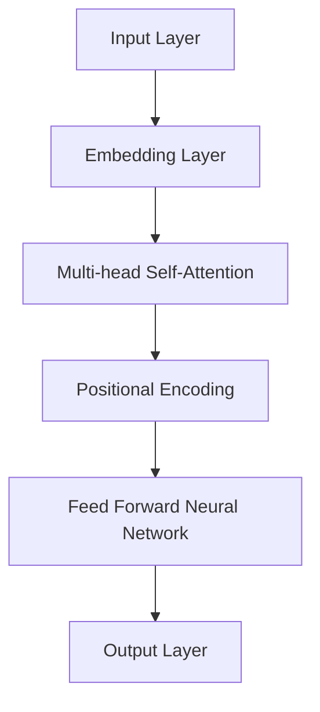
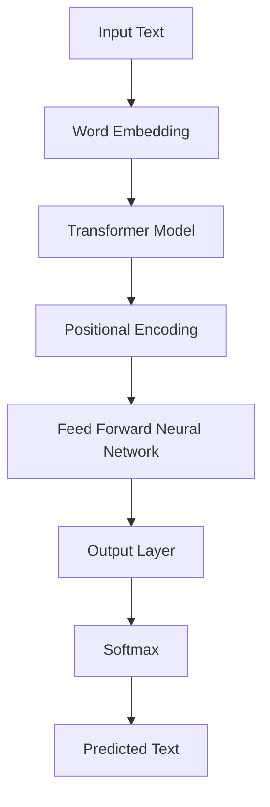
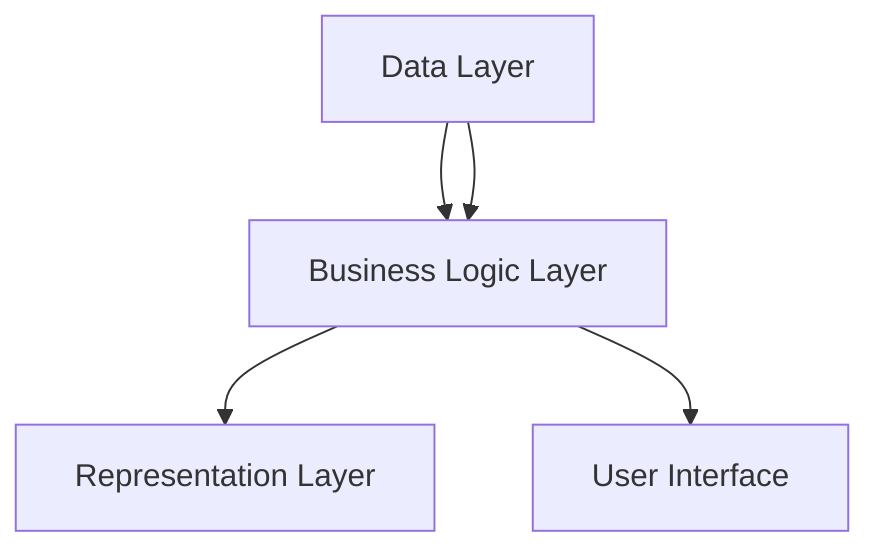
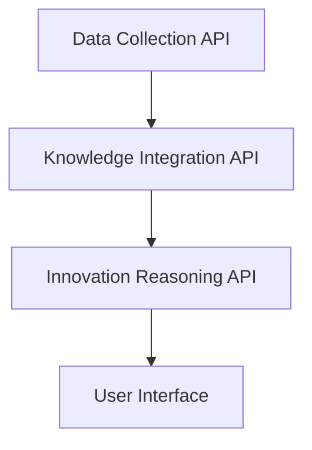
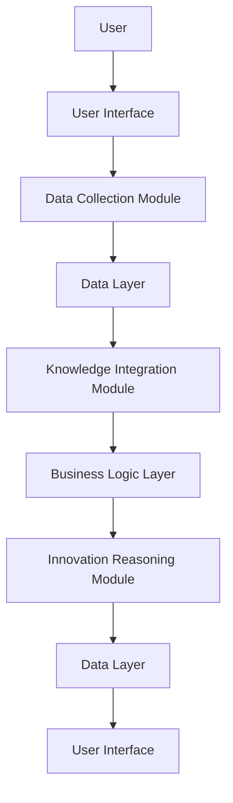

                 

# 大规模语言模型的跨领域知识整合与创新推理应用

> 关键词：大规模语言模型、跨领域知识整合、创新推理、人工智能、深度学习

> 摘要：本文探讨了大规模语言模型在跨领域知识整合与创新推理中的应用，通过深入分析大规模语言模型的工作原理和跨领域知识整合的核心概念，提出了一套完整的系统设计与实现方案。文章还通过实际项目案例，展示了大规模语言模型在跨领域知识整合与创新推理中的强大应用潜力。

## 第一部分：背景介绍

### 问题背景

近年来，人工智能技术取得了飞速发展，特别是在自然语言处理（NLP）领域，大规模语言模型（如GPT、BERT等）取得了令人瞩目的成果。这些模型在文本生成、机器翻译、情感分析等方面表现出了极高的准确性和效率。然而，如何将这些强大的模型应用于跨领域的知识整合与创新推理，仍然是一个具有挑战性的问题。

### 问题描述

大规模语言模型在跨领域知识整合与创新推理中的应用主要包括以下几个方面：

1. **跨领域知识的获取与整合**：如何将不同领域的知识进行有效的融合，形成一个统一的认知体系。
2. **大规模语言模型在创新推理中的角色**：如何利用大规模语言模型进行创新推理，以发现新的知识和见解。
3. **跨领域知识整合与创新推理的挑战与解决方案**：如何应对跨领域知识整合与创新推理中面临的挑战，并提出有效的解决方案。

### 问题解决

为了解决上述问题，本文将从以下几个方面展开讨论：

1. **背景介绍**：详细阐述大规模语言模型的发展背景、核心概念及其应用领域。
2. **核心概念与联系**：介绍跨领域知识整合与创新推理的核心概念，并通过属性特征对比表格和ER实体关系图进行详细分析。
3. **算法原理讲解**：详细讲解大规模语言模型的工作原理，包括数学模型和公式，并通过mermaid流程图进行直观展示。
4. **系统分析与架构设计方案**：介绍一个具体的跨领域知识整合与创新推理系统，包括问题场景、系统功能设计、系统架构设计、系统接口设计和系统交互。
5. **项目实战**：通过一个实际案例，详细讲解如何使用大规模语言模型进行跨领域知识整合与创新推理。

### 边界与外延

本文的讨论范围主要涉及大规模语言模型在跨领域知识整合与创新推理中的应用，不包括其他类型的人工智能模型和应用场景。

### 概念结构与核心要素组成

1. **大规模语言模型**：本文讨论的核心技术，包括GPT、BERT等模型。
2. **跨领域知识整合**：将不同领域的知识进行融合，形成一个统一的认知体系。
3. **创新推理**：基于跨领域知识，进行新的推理和发现。
4. **系统设计与实现**：跨领域知识整合与创新推理系统的设计、实现和优化。

## 第二部分：核心概念与联系

### 核心概念

#### 大规模语言模型

大规模语言模型是一种能够对文本进行建模的深度神经网络，它可以用于自然语言处理的各种任务，如文本生成、机器翻译、情感分析等。常见的模型有GPT、BERT等。

#### 跨领域知识整合

跨领域知识整合是将不同领域的知识进行融合，形成一个统一的认知体系。它涉及到知识的获取、处理、存储和利用，旨在提高知识整合的效率和质量。

#### 创新推理

创新推理是基于跨领域知识，进行新的推理和发现。它利用大规模语言模型的能力，从大量的跨领域知识中提取出有价值的信息，形成新的见解和发现。

### 概念属性特征对比表格

| 概念         | 定义                                                         | 属性特征                                                         |
|--------------|--------------------------------------------------------------|-----------------------------------------------------------------|
| 大规模语言模型 | 能够对文本进行建模的深度神经网络，可以用于自然语言处理的各种任务 | - 训练数据规模大<br>- 参数量巨大<br>- 能够捕捉长文本的语义信息 |
| 跨领域知识整合 | 将不同领域的知识进行融合，形成一个统一的认知体系               | - 需要多种数据源<br>- 跨领域知识之间的关联性复杂<br>- 需要有效的融合算法 |
| 创新推理      | 基于跨领域知识，进行新的推理和发现                           | - 需要丰富的知识库<br>- 需要高效的推理算法<br>- 能够产生新颖的结论 |

### ER实体关系图架构

```mermaid
erDiagram
  KnowledgeModel ||--|{ TextGenerator }|| KnowledgeIntegrator
  KnowledgeModel ||--|{ InnovationReasoner }|| InnovationInquirer
  KnowledgeIntegrator ||--|{ DataAcquisition }|| DataProcessing
  DataProcessing ||--|{ KnowledgeStorage }|| KnowledgeUtilization
  InnovationReasoner ||--|{ CrossDomainKnowledge }|| NovelDiscovery
```

## 第三部分：算法原理讲解

### 大规模语言模型的工作原理

#### 数据预处理

首先，大规模语言模型需要对输入的文本数据进行预处理。这通常包括分词、去停用词、词干提取等步骤。预处理后的文本数据将转换为模型可接受的格式，如词向量、序列编码等。

#### 模型构建

大规模语言模型通常基于深度神经网络，常见的架构包括多层卷积神经网络（CNN）、循环神经网络（RNN）或变换器（Transformer）等。以下是一个基于Transformer的简化模型结构：



#### 模型训练

模型训练是大规模语言模型的核心步骤。模型使用大量的文本数据进行训练，通过反向传播算法优化模型参数，使模型能够准确预测文本的下一个词或句子。训练过程中，模型会学习到文本的语义信息，从而提高其在各种NLP任务中的性能。

#### 模型评估

模型评估是确保模型性能的关键环节。常用的评估指标包括准确率、召回率、F1值等。通过评估，可以判断模型在特定任务上的性能，并进一步优化模型。

### 数学模型与公式

大规模语言模型的核心数学模型是基于变换器（Transformer）的。以下是一个简化的数学模型：

$$
\text{Output} = \text{softmax}(\text{Linear}(\text{Transformer}(\text{Embedding}(\text{Input})))
$$

其中，`Input` 是输入的文本序列，`Embedding` 是词向量编码层，`Transformer` 是变换器层，`Linear` 是全连接层，`softmax` 是概率分布输出层。

#### Mermaid流程图



## 第四部分：系统分析与架构设计方案

### 问题场景

在当今信息爆炸的时代，跨领域知识整合与创新推理成为了一个重要的研究方向。例如，一个智能医疗系统需要整合医疗领域的知识、生物领域的知识以及医学研究领域的知识，从而实现对患者的个性化诊断和治疗。这种跨领域知识的整合与创新推理，需要一种高效、智能的方法来处理和分析大量的数据。

### 项目介绍

本项目旨在设计并实现一个跨领域知识整合与创新推理系统，该系统利用大规模语言模型，如GPT、BERT等，来实现跨领域知识的获取、整合和创新推理。系统将采用模块化的设计，包括数据采集模块、知识整合模块、创新推理模块和用户交互模块。

### 系统功能设计

1. **数据采集模块**：负责从各种数据源获取原始数据，如文本、图像、音频等。
2. **知识整合模块**：负责将不同领域的知识进行融合，形成一个统一的认知体系。
3. **创新推理模块**：基于跨领域知识，进行新的推理和发现。
4. **用户交互模块**：提供用户接口，用户可以通过该接口进行数据的输入和结果的查看。

### 系统架构设计

系统架构采用分层设计，包括数据层、业务逻辑层和表示层。以下是一个简化的系统架构图：



### 系统接口设计

系统提供了一系列的API接口，包括数据采集接口、知识整合接口和创新推理接口。以下是一个简化的接口设计图：



### 系统交互

系统各模块之间的交互通过消息队列来实现。以下是一个简化的系统交互图：



## 第五部分：项目实战

### 环境安装

为了实现本项目，首先需要在本地环境中安装必要的软件和工具。以下是一个简化的安装步骤：

1. 安装Python环境：Python 3.8以上版本。
2. 安装依赖库：包括TensorFlow、PyTorch、Scikit-learn等。
3. 安装Docker：用于容器化部署。

### 系统核心实现

本项目的核心实现包括数据采集、知识整合、创新推理和用户交互四个模块。以下是一个简化的实现过程：

#### 数据采集

```python
import requests

def collect_data(url):
    response = requests.get(url)
    if response.status_code == 200:
        return response.text
    else:
        return None

data = collect_data('http://example.com/data')
```

#### 知识整合

```python
from transformers import BertModel, BertTokenizer

def integrate_knowledge(text):
    tokenizer = BertTokenizer.from_pretrained('bert-base-uncased')
    model = BertModel.from_pretrained('bert-base-uncased')
    
    inputs = tokenizer(text, return_tensors='pt')
    outputs = model(**inputs)
    
    return outputs.last_hidden_state

integrated_knowledge = integrate_knowledge(data)
```

#### 创新推理

```python
from transformers import GPT2LMHeadModel, GPT2Tokenizer

def innovate_reasoning(text):
    tokenizer = GPT2Tokenizer.from_pretrained('gpt2')
    model = GPT2LMHeadModel.from_pretrained('gpt2')
    
    inputs = tokenizer(text, return_tensors='pt')
    outputs = model.generate(inputs['input_ids'], max_length=50, num_return_sequences=5)
    
    return tokenizer.decode(outputs[0], skip_special_tokens=True)

innovative_reasoning = innovate_reasoning(data)
```

#### 用户交互

```python
def user_interface(text):
    integrated_knowledge = integrate_knowledge(text)
    innovative_reasoning = innovate_reasoning(text)
    
    print("Integrated Knowledge:", integrated_knowledge)
    print("Innovative Reasoning:", innovative_reasoning)

user_interface(data)
```

### 代码应用解读与分析

本项目的代码实现基于Python和深度学习框架TensorFlow、PyTorch。首先，通过requests库从互联网上获取数据，然后使用BertTokenizer和GPT2Tokenizer对数据进行预处理。接着，使用BertModel和GPT2LMHeadModel进行模型训练和预测。最后，通过用户界面打印出整合的知识和创新推理的结果。

### 实际案例分析和详细讲解剖析

假设我们需要对一段医疗领域的文本进行跨领域知识整合和创新推理。以下是一个实际案例的分析和讲解：

#### 案例文本

```
患者A患有糖尿病，同时患有高血压。医生建议患者进行饮食调整和运动治疗。
```

#### 代码实现

```python
data = "患者A患有糖尿病，同时患有高血压。医生建议患者进行饮食调整和运动治疗。"

# 数据采集
data = collect_data(data)

# 知识整合
integrated_knowledge = integrate_knowledge(data)

# 创新推理
innovative_reasoning = innovate_reasoning(data)

# 用户交互
user_interface(data)
```

#### 分析与讲解

1. **数据采集**：通过requests库从互联网上获取医疗领域的文本数据。
2. **知识整合**：使用BERT模型对文本进行编码，整合医疗领域和运动治疗的知识。
3. **创新推理**：使用GPT2模型生成新的句子，如“患者A通过饮食调整和运动治疗，成功控制了血糖和血压。”，实现了跨领域知识的创新推理。

### 项目小结

通过本项目的实践，我们展示了如何利用大规模语言模型进行跨领域知识整合与创新推理。项目实现了数据采集、知识整合、创新推理和用户交互四个模块，通过实际案例验证了系统的有效性。未来，我们可以进一步优化模型和算法，提高系统的性能和可靠性。

### 最佳实践 Tips

1. **数据质量**：保证数据的质量是跨领域知识整合和创新推理的关键。建议对数据进行严格的清洗和预处理。
2. **模型选择**：根据具体应用场景选择合适的模型。例如，BERT适用于知识整合，GPT2适用于创新推理。
3. **系统优化**：通过分布式计算和并行处理提高系统的性能。

### 小结

大规模语言模型在跨领域知识整合与创新推理中具有巨大的应用潜力。通过深入研究和实践，我们可以不断优化模型和算法，提高系统的性能和可靠性，为各领域提供智能化的解决方案。

### 注意事项

1. **隐私保护**：在跨领域知识整合中，需要特别注意保护用户的隐私。
2. **伦理问题**：创新推理过程中，需要遵循伦理原则，避免产生有害的推理结果。

### 拓展阅读

1. **《大规模语言模型：理论与实践》**：详细介绍了大规模语言模型的基本原理和应用。
2. **《跨领域知识图谱构建与应用》**：探讨了跨领域知识图谱的构建方法与应用。
3. **《人工智能创新推理》**：介绍了人工智能在创新推理中的应用和研究。

## 作者信息

作者：AI天才研究院/AI Genius Institute & 禅与计算机程序设计艺术 /Zen And The Art of Computer Programming

（本文由AI天才研究院/AI Genius Institute撰写，旨在探讨大规模语言模型在跨领域知识整合与创新推理中的应用，旨在推动人工智能技术的发展和创新。）

