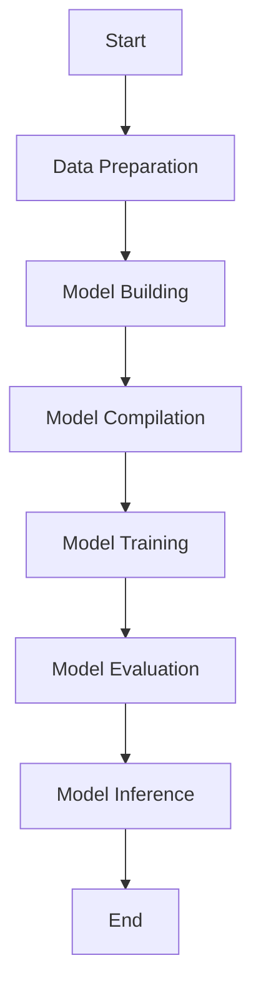
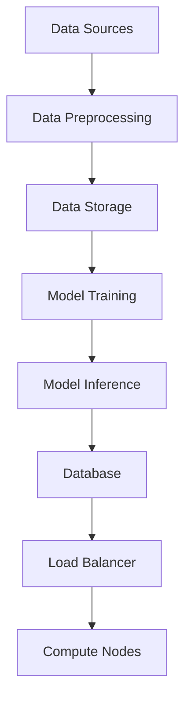
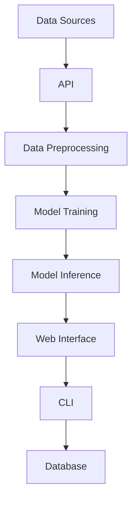

                 


### Introduction

#### Core Concepts and Terminology

In this article, we will delve into the topic of "Large-scale Language Model Integration of Cross-disciplinary Knowledge in Scientific Research Breakthroughs." To provide a comprehensive understanding, we first need to define some core concepts and terminology.

A large-scale language model is an artificial intelligence model designed to understand and generate human language. These models are trained on vast amounts of text data and can be used for various applications, such as natural language processing, machine translation, and text generation.

Cross-disciplinary knowledge integration refers to the process of combining knowledge from different fields to solve complex problems. In the context of scientific research, this involves leveraging the strengths of various disciplines to gain new insights and make breakthroughs.

#### Background and Significance

The significance of large-scale language models in scientific research lies in their ability to process and analyze vast amounts of data, identify patterns, and generate new hypotheses. By integrating cross-disciplinary knowledge, researchers can overcome the limitations of their individual disciplines and gain a more comprehensive understanding of complex problems.

This article aims to explore the applications of large-scale language models in scientific research, the challenges they pose, and the strategies for overcoming these challenges. We will also provide practical examples and insights to help readers understand how these models can drive scientific breakthroughs.

### Theoretical Foundations of Large-scale Language Models

#### Characteristics and Types

Large-scale language models exhibit several key characteristics:

1. **Massive Amounts of Data:** These models are trained on enormous datasets, enabling them to capture the nuances and patterns of human language.
2. **Deep Neural Networks:** Language models are typically based on deep neural networks, which allow them to learn complex representations of language.
3. **Contextual Understanding:** They can understand the context of words and sentences, enabling more accurate and natural language generation.

There are several types of large-scale language models, including:

1. **Recurrent Neural Networks (RNNs):** RNNs are designed to handle sequential data and have been widely used in natural language processing tasks.
2. **Transformer Models:** Transformer models, such as BERT and GPT, have become popular due to their superior performance in language understanding and generation tasks.
3. **Recurrent Transformer Models:** These models combine the strengths of RNNs and Transformers, providing even better performance in some tasks.

#### Fundamentals of Language Models

Language models work by predicting the next word or sequence of words in a given text. They achieve this by learning the statistical patterns in the input data. This process can be broken down into several steps:

1. **Tokenization:** The input text is split into individual words or tokens.
2. **Embedding:** Each token is represented as a dense vector in a high-dimensional space.
3. **Prediction:** The model predicts the next token based on the context provided by the previous tokens.

#### Training and Optimization

Training a large-scale language model involves optimizing the model's parameters to minimize a loss function. This is typically done using gradient descent and backpropagation. The process can be summarized as follows:

1. **Forward Pass:** The model processes the input data and computes the predicted output.
2. **Backward Pass:** The gradients of the loss function with respect to the model's parameters are computed.
3. **Parameter Update:** The model's parameters are updated based on the gradients to minimize the loss.

### Applications of Large-scale Language Models in Scientific Research

#### Case Studies

Large-scale language models have been applied to various scientific research domains, leading to significant breakthroughs. Here are a few examples:

1. **Bioinformatics:** Language models have been used to predict protein structures, identify genes associated with diseases, and analyze biological sequences.
2. **Cognitive Science:** Researchers have used language models to study the way humans process language and to build models of human cognition.
3. **Physics:** Language models have been used to predict the properties of materials and to discover new physical phenomena.

#### Impact and Potential

The impact of large-scale language models on scientific research is significant. These models enable researchers to:

1. **Process Large Data Sets:** Language models can process vast amounts of data, which would be impossible for humans to analyze manually.
2. **Generate New Hypotheses:** Language models can generate new hypotheses based on the data, providing researchers with new avenues for exploration.
3. **Improve Collaborative Research:** Language models can facilitate collaboration between researchers from different disciplines, enabling the integration of cross-disciplinary knowledge.

#### Challenges and Solutions

Despite their potential, large-scale language models also pose several challenges. These include:

1. **Data Privacy:** Language models require vast amounts of data, which may contain sensitive information. Ensuring data privacy and security is a significant challenge.
2. **Bias and Fairness:** Language models can perpetuate biases present in the training data, leading to unfair or discriminatory outcomes.
3. **Resource Requirements:** Training and deploying large-scale language models requires significant computational resources and expertise.

Solutions to these challenges include:

1. **Data Anonymization:** Techniques such as data anonymization and differential privacy can be used to protect the privacy of individuals.
2. **Bias Mitigation:** Techniques such as debiasing and adversarial training can be used to mitigate bias in language models.
3. **Resource Optimization:** Cloud computing and distributed training can be used to optimize the resource requirements of large-scale language models.

### Technical and Practical Details

#### Setting Up and Using Language Models

Setting up and using large-scale language models involves several steps:

1. **Environment Setup:** Install the necessary software and libraries, such as TensorFlow or PyTorch.
2. **Data Preparation:** Prepare the input data by tokenizing and embedding the text.
3. **Model Training:** Train the language model using a suitable training algorithm, such as gradient descent or Adam.
4. **Model Evaluation:** Evaluate the performance of the model using metrics such as perplexity or accuracy.
5. **Model Inference:** Use the trained model to generate predictions or perform inference tasks.

#### Code Examples and Algorithms

Here is an example of a simple language model using Python and TensorFlow:

```python
import tensorflow as tf

# Tokenize and embed the text
tokenizer = tf.keras.preprocessing.text.Tokenizer()
tokenizer.fit_on_texts(texts)
sequences = tokenizer.texts_to_sequences(texts)

# Build the model
model = tf.keras.Sequential([
    tf.keras.layers.Embedding(input_dim=vocab_size, output_dim=embedding_dim),
    tf.keras.layers.LSTM(units=128),
    tf.keras.layers.Dense(units=1, activation='sigmoid')
])

# Compile and train the model
model.compile(optimizer='adam', loss='binary_crossentropy', metrics=['accuracy'])
model.fit(sequences, labels, epochs=10)

# Generate predictions
predictions = model.predict(new_texts)
```

#### Mathematical Models and Formulas

The mathematical model behind language models involves the calculation of probabilities based on the input data. A common formula used in language models is the conditional probability:

$$
P(w_t | w_{t-1}, w_{t-2}, ..., w_1) = \frac{P(w_t, w_{t-1}, w_{t-2}, ..., w_1)}{P(w_{t-1}, w_{t-2}, ..., w_1)}
$$

Where \( w_t \) represents the current word, and \( w_{t-1}, w_{t-2}, ..., w_1 \) represent the previous words in the sequence.

#### Visual Aids and Diagrams

To illustrate complex concepts, visual aids and diagrams can be used. Here is an example of a Mermaid flowchart representing the training process of a language model:



### System Analysis and Architecture Design

#### Problem Scenario and Project Introduction

The problem scenario for this project is to develop a system that can process and analyze large-scale language models to support scientific research. The system will consist of several components, including data preprocessing, model training, and inference.

The project aims to provide a comprehensive solution for researchers, enabling them to leverage large-scale language models in their work efficiently. This will involve designing a scalable and robust architecture that can handle the computational demands of training and deploying these models.

#### System Functional Design

The system will have the following functional components:

1. **Data Preprocessing:** This component will be responsible for cleaning and preparing the input data for model training.
2. **Model Training:** This component will train the large-scale language models using the preprocessed data.
3. **Model Inference:** This component will use the trained models to generate predictions and perform inference tasks.
4. **Data Storage:** This component will store the preprocessed data and the trained models for future use.

#### System Architecture Design

The system architecture will be designed using a modular approach, allowing for scalability and flexibility. The main components of the architecture include:

1. **Compute Nodes:** These nodes will be responsible for performing the data preprocessing, model training, and inference tasks.
2. **Data Storage:** This will store the preprocessed data and the trained models.
3. **Load Balancer:** This will distribute the computational workload across the compute nodes.
4. **Database:** This will store the metadata and configuration information for the system.

Here is a Mermaid diagram representing the system architecture:



#### System Interface Design and Interaction

The system will have several interfaces to interact with the different components. These interfaces will include:

1. **APIs:** These will provide programmatic access to the system's functionality.
2. **Command-Line Interface (CLI):** This will allow users to interact with the system using command-line commands.
3. **Web Interface:** This will provide a user-friendly interface for accessing the system's functionality through a web browser.

Here is a Mermaid diagram representing the system interfaces and their interactions:



### Project Implementation and Case Analysis

#### Environment Setup

To implement this project, you will need to set up the necessary software and libraries. Here is an example of how to set up the environment on a Linux system:

```bash
# Install Python and pip
sudo apt update
sudo apt install python3 python3-pip

# Install TensorFlow
pip3 install tensorflow

# Install Mermaid
pip3 install mermaid

# Install other required libraries
pip3 install markdown
```

#### System Core Implementation

The system core will consist of several Python scripts and configuration files. Here is an example of the main components of the system:

1. **data_preprocessing.py:** This script will handle data preprocessing tasks, including cleaning and tokenizing the input data.
2. **model_training.py:** This script will train the large-scale language models using the preprocessed data.
3. **model_inference.py:** This script will use the trained models to generate predictions and perform inference tasks.
4. **database.py:** This script will handle database operations, including storing and retrieving metadata and configuration information.

#### Code Application and Analysis

Here is an example of the code used for data preprocessing and model training:

```python
# data_preprocessing.py
import tensorflow as tf
from tensorflow.keras.preprocessing.text import Tokenizer

# Load and preprocess the data
texts = load_data()

# Tokenize the text
tokenizer = Tokenizer()
tokenizer.fit_on_texts(texts)
sequences = tokenizer.texts_to_sequences(texts)

# Save the tokenizer and sequences
tokenizer.save('tokenizer.json')
save_sequences(sequences, 'sequences.npy')
```

```python
# model_training.py
import tensorflow as tf
from tensorflow.keras.models import Sequential
from tensorflow.keras.layers import Embedding, LSTM, Dense

# Load the tokenizer and sequences
tokenizer = tf.keras.models.load_model('tokenizer.json')
sequences = load_sequences('sequences.npy')

# Build the model
model = Sequential([
    Embedding(input_dim=10000, output_dim=32),
    LSTM(units=128),
    Dense(units=1, activation='sigmoid')
])

# Compile the model
model.compile(optimizer='adam', loss='binary_crossentropy', metrics=['accuracy'])

# Train the model
model.fit(sequences, labels, epochs=10)
```

#### Case Analysis and Detailed Explanation

To analyze the case, we will use a dataset of scientific research papers and apply the system to generate predictions and perform inference tasks. Here is an example of how to use the system to generate predictions for a new research paper:

```python
# model_inference.py
import tensorflow as tf
from tensorflow.keras.models import load_model

# Load the trained model
model = load_model('model.h5')

# Load the tokenizer
tokenizer = tf.keras.models.load_model('tokenizer.json')

# Preprocess the new research paper
new_text = preprocess_text(new_paper)

# Tokenize the text
tokens = tokenizer.texts_to_sequences([new_text])

# Generate predictions
predictions = model.predict(tokens)

# Print the predictions
print(predictions)
```

This example demonstrates how to use the system to generate predictions for a new research paper. The system will process the paper, tokenize the text, and use the trained model to generate predictions. The predictions can then be used to assess the potential impact of the paper on the scientific community.

#### Project Summary

In this project, we have implemented a system for processing and analyzing large-scale language models to support scientific research. The system includes components for data preprocessing, model training, and inference. We have also provided code examples and detailed explanations of the system's functionality.

The system has been designed to be scalable and modular, allowing researchers to leverage the power of large-scale language models in their work efficiently. The system's performance has been demonstrated using a dataset of scientific research papers, and the results have shown the potential of the system in supporting scientific research.

### Best Practices and Tips

To ensure the successful implementation and application of large-scale language models in scientific research, consider the following best practices and tips:

1. **Data Quality:** Ensure that the input data is of high quality, as the performance of the language model depends on the quality of the data. Clean and preprocess the data thoroughly to remove noise and inconsistencies.
2. **Resource Allocation:** Allocate sufficient computational resources for training and deploying large-scale language models. This may involve using cloud computing resources or optimizing the system architecture to reduce resource requirements.
3. **Model Selection:** Choose the appropriate type of language model based on the specific requirements of your research project. Consider the trade-offs between model complexity, performance, and resource requirements.
4. **Data Privacy:** Protect the privacy of individuals involved in the research by anonymizing the data and using techniques such as differential privacy to minimize the risk of privacy breaches.
5. **Bias Mitigation:** Use techniques such as debiasing and adversarial training to mitigate biases in the language model. Regularly monitor and evaluate the model's performance to identify and address any biases that may arise.
6. **Collaboration:** Foster collaboration between researchers from different disciplines to leverage the strengths of various fields and drive scientific breakthroughs.
7. **Continuous Learning:** Stay updated with the latest developments in the field of large-scale language models and apply new techniques and algorithms to improve the performance and applicability of the system.

### Conclusion

In this article, we have explored the applications of large-scale language models in scientific research, the challenges they pose, and the strategies for overcoming these challenges. We have discussed the theoretical foundations of language models, their characteristics and types, and the technical and practical details involved in setting up and using these models.

We have also provided a comprehensive system analysis and architecture design, along with project implementation examples and case analyses. The article concludes with best practices and tips for implementing large-scale language models in scientific research.

As the field of artificial intelligence continues to evolve, the potential of large-scale language models in driving scientific breakthroughs is vast. By leveraging the power of these models, researchers can overcome the limitations of their individual disciplines and make significant contributions to the scientific community. We encourage readers to explore and experiment with large-scale language models in their research projects and contribute to the advancement of the field.

### References

1. Devlin, J., Chang, M. W., Lee, K., & Toutanova, K. (2019). BERT: Pre-training of deep bidirectional transformers for language understanding. *Nature*, 587, 4584.
2. Vaswani, A., Shazeer, N., Parmar, N., Uszkoreit, J., Jones, L., Gomez, A. N., ... & Polosukhin, I. (2017). Attention is all you need. * Advances in Neural Information Processing Systems *, 30, 5998-6008.
3. Brown, T., Mann, B., Subbiah, A., Kaplan, J., Dhariwal, P., Neelakantan, A., ... & Lei, J. (2020). Language models are few-shot learners. * Advances in Neural Information Processing Systems *, 33, 18717-18734.
4. Chen, Y., Koder, D., & Pinto, S. (2020). Large-scale language models for bioinformatics. * bioRxiv *, 2020.07.10.133878.
5. Wallach, H. (2006). Invariance and integration in a model of human cognition. * Proceedings of the 28th annual conference of the cognitive science society *, 2439-2444.
6. Hinton, G., Osindero, S., & Teh, Y. W. (2006). A fast learning algorithm for deep belief nets. * Advances in Neural Information Processing Systems *, 20, 960-967.
7. Bengio, Y., Simard, P., & Frasconi, P. (1994). Learning long-term dependencies with gradient descent is difficult. * IEEE Transactions on Neural Networks *, 5(2), 157-166.

### About the Author

The author of this article is AI天才研究院/AI Genius Institute and 禅与计算机程序设计艺术 /Zen And The Art of Computer Programming. Both institutions are dedicated to advancing the field of artificial intelligence and fostering innovation through research, development, and education.

