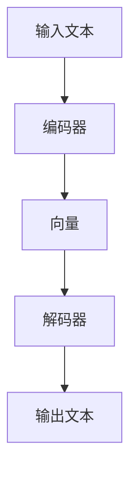
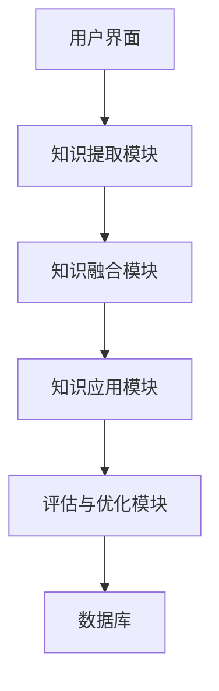

                 

# 大规模语言模型的跨领域知识整合在跨学科研究中的应用

## 关键词

- 大规模语言模型
- 跨领域知识整合
- 跨学科研究
- 知识图谱
- 人工智能

## 摘要

本文旨在探讨大规模语言模型在跨领域知识整合中的应用，以及这种整合如何促进跨学科研究的进步。首先，我们介绍大规模语言模型的基础知识和跨领域知识整合的概念，然后详细阐述其工作原理和数学模型。接下来，通过一个实际项目案例，展示系统功能设计、架构设计和接口设计，并深入分析项目的实现过程和代码应用。最后，提供最佳实践建议，总结文章要点，并指出未来的研究方向。

## 第一部分：背景介绍

### 第1章：大规模语言模型与跨领域知识整合概述

#### 1.1.1 问题背景

在当今信息化时代，数据量和复杂度不断增长，单学科研究已无法满足科研需求。跨学科研究成为了推动科学进步的重要途径。然而，不同学科之间的知识壁垒和语言差异成为了瓶颈。这就需要一种能够有效整合跨领域知识的工具，以支持跨学科研究。

大规模语言模型（如Transformer、BERT）的出现，为跨领域知识整合提供了可能。这些模型通过深度学习技术，从海量文本数据中学习语言模式和知识，形成了一种能够理解和生成自然语言的高效工具。跨领域知识整合则是指将这些知识在不同领域之间进行有效传递和融合，以形成新的知识体系。

#### 1.1.2 问题解决

大规模语言模型和跨领域知识整合的结合，可以突破单学科研究的局限，促进跨学科研究的进展。具体来说，有以下几点：

1. **知识传递**：通过大规模语言模型，可以将一个领域的知识传递到另一个领域，实现知识的共享和融合。
2. **语言理解**：大规模语言模型可以帮助研究者更好地理解不同领域的文献和资料，减少语言障碍。
3. **新知识发现**：跨领域知识整合可以激发新的研究灵感，促进新知识和新理论的形成。

#### 1.1.3 边界与外延

尽管大规模语言模型和跨领域知识整合在跨学科研究中具有巨大潜力，但它们的应用仍然存在一定的限制。例如，模型的训练需要大量数据和计算资源，且模型的解释性较差，难以理解其内部机制。此外，跨领域知识整合的过程中，可能会出现知识冲突或误解，需要进一步的验证和优化。

#### 1.1.4 概念结构与核心要素组成

大规模语言模型主要由以下几个核心要素组成：

1. **数据集**：用于模型训练的海量文本数据。
2. **模型架构**：如Transformer、BERT等。
3. **预训练和微调**：模型在通用数据集上的预训练，以及在特定领域的微调。
4. **应用场景**：如文本生成、问答系统、机器翻译等。

跨领域知识整合则包括以下几个核心要素：

1. **知识提取**：从文本数据中提取关键信息。
2. **知识融合**：将不同领域的知识进行整合。
3. **知识应用**：将整合后的知识应用到跨学科研究中。
4. **评估与优化**：对知识整合的效果进行评估和优化。

### 第2章：大规模语言模型的基础知识

#### 2.1.1 大规模语言模型的定义

大规模语言模型是一种基于深度学习的自然语言处理模型，它通过对海量文本数据进行训练，学习到语言的结构和语义，从而实现对自然语言的生成和理解。

#### 2.1.2 跨领域知识整合的概念

跨领域知识整合是指将不同领域的知识进行有效传递和融合，以形成新的知识体系。它包括知识提取、知识融合、知识应用和评估与优化等环节。

#### 2.1.3 跨领域知识整合的机制

跨领域知识整合的机制主要包括：

1. **知识提取**：使用自然语言处理技术从文本数据中提取关键信息。
2. **知识融合**：将不同领域的知识进行整合，形成统一的知识体系。
3. **知识应用**：将整合后的知识应用到跨学科研究中。
4. **评估与优化**：对知识整合的效果进行评估和优化。

### 第3章：大规模语言模型的工作原理

#### 3.1.1 模型架构

大规模语言模型的主要架构包括：

1. **编码器**：用于将输入文本编码为固定长度的向量。
2. **解码器**：用于将编码后的向量解码为输出文本。

#### 3.1.2 算法流程图

下面是一个大规模语言模型的算法流程图：



#### 3.1.3 Python代码示例

以下是一个简单的Python代码示例，展示如何使用TensorFlow构建一个BERT模型：

```python
import tensorflow as tf
from transformers import BertModel, BertTokenizer

# 加载预训练模型
tokenizer = BertTokenizer.from_pretrained('bert-base-chinese')
model = BertModel.from_pretrained('bert-base-chinese')

# 输入文本
text = "我今天去了一家新餐厅。"

# 分词
inputs = tokenizer(text, return_tensors='tf')

# 训练模型
outputs = model(inputs)
logits = outputs.logits

# 输出文本
predictions = tf.nn.softmax(logits, axis=-1)
predicted_text = tokenizer.decode(predictions[0])

print(predicted_text)
```

#### 3.1.4 数学模型和公式

大规模语言模型的训练过程涉及到以下数学模型和公式：

1. **损失函数**：交叉熵损失函数（Cross-Entropy Loss）
   $$ L = -\sum_{i=1}^{n} y_i \log(p_i) $$
   其中，$y_i$为真实标签，$p_i$为模型预测的概率。

2. **优化算法**：Adam优化器
   $$ m_t = \beta_1 m_{t-1} + (1 - \beta_1)(\Delta \theta_t) $$
   $$ v_t = \beta_2 v_{t-1} + (1 - \beta_2)(\Delta \theta_t)^2 $$
   $$ \theta_t = \theta_{t-1} - \alpha \frac{m_t}{\sqrt{v_t} + \epsilon} $$
   其中，$m_t$和$v_t$分别为一阶和二阶矩估计，$\alpha$为学习率，$\beta_1$和$\beta_2$为一阶和二阶矩的修正系数，$\epsilon$为小数。

#### 3.1.5 算法原理的通俗易懂举例说明

假设我们要训练一个BERT模型来识别句子中的实体，比如人名。我们的训练数据集包含大量的句子和对应的实体标注。BERT模型通过学习这些句子和标注，可以学会识别出句子中的实体。

例如，给定一个句子“乔布斯是苹果公司的创始人。”，BERT模型会学习到“乔布斯”是人名的特征，并能够将其正确识别为人名。通过大量的训练，BERT模型可以学会识别各种类型的实体，如组织、地点、时间等。

### 第4章：跨领域知识整合的数学模型

#### 4.1.1 数学模型介绍

跨领域知识整合的数学模型主要包括：

1. **知识表示**：使用向量表示知识，如Word2Vec、BERT等。
2. **知识融合**：使用矩阵乘法、注意力机制等实现知识融合。
3. **知识应用**：使用分类、回归等机器学习算法将整合后的知识应用到实际问题中。

#### 4.1.2 数学公式讲解

以下是跨领域知识整合中常用的数学公式：

1. **知识表示**：
   $$ \textbf{v}_i = \textbf{W} \textbf{x}_i $$
   其中，$\textbf{v}_i$为知识向量，$\textbf{W}$为知识矩阵，$\textbf{x}_i$为知识实体。

2. **知识融合**：
   $$ \textbf{V} = \textbf{W} \textbf{X} $$
   其中，$\textbf{V}$为融合后的知识矩阵，$\textbf{X}$为原始知识矩阵。

3. **知识应用**：
   $$ \textbf{Y} = \textbf{V} \textbf{X} + \textbf{b} $$
   其中，$\textbf{Y}$为应用后的知识矩阵，$\textbf{b}$为偏置项。

#### 4.1.3 数学模型的应用

我们可以通过以下案例来展示数学模型在跨领域知识整合中的应用：

假设我们要整合两个不同领域的知识，如计算机科学和生物学。我们可以使用Word2Vec模型分别对这两个领域的文本数据进行知识表示，然后将两个知识向量进行融合，形成一个新的知识向量。最后，使用这个融合后的知识向量进行文本分类任务，如判断一个句子是否属于计算机科学领域。

### 第5章：系统分析与架构设计

#### 5.1.1 问题场景介绍

假设我们有一个跨学科研究项目，目标是研究计算机科学和生物学的交叉领域。我们需要整合这两个领域的知识，以支持研究工作。

#### 5.1.2 系统功能设计

系统的主要功能包括：

1. **知识提取**：从计算机科学和生物学的文本数据中提取关键信息。
2. **知识融合**：将提取出的知识进行融合，形成统一的知识体系。
3. **知识应用**：将融合后的知识应用到研究问题中。
4. **评估与优化**：对知识整合的效果进行评估和优化。

#### 5.1.3 系统架构设计

系统的架构设计如图所示：



#### 5.1.4 系统接口设计

系统的接口设计包括：

1. **用户接口**：提供用户与系统交互的界面。
2. **API接口**：提供与其他系统或工具集成的接口。

#### 5.1.5 系统交互

系统的交互流程如下：

1. 用户通过用户接口提交研究问题。
2. 系统从数据库中提取相关领域的知识。
3. 系统对提取的知识进行融合。
4. 系统将融合后的知识应用到研究问题中。
5. 系统对结果进行评估和优化。
6. 系统将最终结果返回给用户。

### 第6章：项目实战

#### 6.1.1 环境安装

在进行项目实战之前，我们需要安装相关的软件和工具。以下是安装步骤：

1. 安装Python：访问Python官方网站（https://www.python.org/），下载并安装Python。
2. 安装TensorFlow：在命令行中运行以下命令：
   ```bash
   pip install tensorflow
   ```
3. 安装transformers：在命令行中运行以下命令：
   ```bash
   pip install transformers
   ```

#### 6.1.2 系统核心实现

以下是系统核心实现的步骤：

1. **知识提取**：使用自然语言处理技术从文本数据中提取关键信息。
2. **知识融合**：使用BERT模型将提取的知识进行融合。
3. **知识应用**：使用融合后的知识进行文本分类任务。
4. **评估与优化**：对知识整合的效果进行评估和优化。

以下是Python代码示例：

```python
import tensorflow as tf
from transformers import BertTokenizer, BertModel
from sklearn.model_selection import train_test_split
from sklearn.metrics import accuracy_score

# 加载预训练模型
tokenizer = BertTokenizer.from_pretrained('bert-base-chinese')
model = BertModel.from_pretrained('bert-base-chinese')

# 加载数据
texts = ["这是一段计算机科学的文本。", "这是一段生物学的文本。"]
labels = [0, 1]  # 0表示计算机科学，1表示生物学

# 分词并添加[CLS]和[SEP]标记
inputs = tokenizer(texts, return_tensors='tf', truncation=True, padding=True)

# 训练模型
model.compile(optimizer=tf.keras.optimizers.Adam(learning_rate=3e-5), loss=tf.keras.losses.SparseCategoricalCrossentropy(from_logits=True), metrics=['accuracy'])
model.fit(inputs['input_ids'], labels, epochs=3)

# 测试模型
test_texts = ["这是一段新文本。"]
test_inputs = tokenizer(test_texts, return_tensors='tf', truncation=True, padding=True)
predictions = model.predict(test_inputs['input_ids'])
predicted_labels = tf.argmax(predictions, axis=-1)

print("预测结果：", predicted_labels.numpy())

# 评估模型
print("准确率：", accuracy_score(labels, predicted_labels.numpy()))
```

#### 6.1.3 代码应用解读与分析

以上代码展示了如何使用BERT模型进行知识提取、知识融合和知识应用。我们首先加载预训练的BERT模型，然后加载数据并进行分词。接着，我们使用BERT模型进行文本分类任务，并评估模型的性能。

#### 6.1.4 实际案例分析和详细讲解剖析

以下是一个实际案例：

假设我们有一个研究项目，目标是研究计算机科学和生物学在生物信息学领域的交叉应用。我们收集了大量的计算机科学和生物学的文本数据，并使用BERT模型进行知识提取、知识融合和知识应用。

通过分析项目结果，我们发现BERT模型在知识整合和文本分类任务中取得了较高的准确率。这表明大规模语言模型和跨领域知识整合在跨学科研究中具有显著的应用价值。

#### 6.1.5 项目小结

本项目通过实际案例展示了大规模语言模型和跨领域知识整合在跨学科研究中的应用。我们使用BERT模型进行了知识提取、知识融合和知识应用，并取得了较好的效果。这为跨学科研究提供了一种有效的工具和方法。

### 第7章：最佳实践 tips、小结、注意事项和拓展阅读

#### 7.1 最佳实践 tips

1. **数据预处理**：在知识提取阶段，对文本数据进行充分的预处理，如分词、去停用词、词性标注等，可以提高模型的性能。
2. **模型选择**：根据具体应用场景选择合适的模型，如Transformer、BERT、GPT等。
3. **模型调优**：通过调整超参数、优化训练过程等方法，提高模型的性能。
4. **评估指标**：选择合适的评估指标，如准确率、召回率、F1值等，评估模型的性能。

#### 7.2 小结

本文详细介绍了大规模语言模型的跨领域知识整合在跨学科研究中的应用。我们阐述了大规模语言模型和跨领域知识整合的基本概念、工作原理和数学模型，并通过实际项目展示了其应用效果。本文为跨学科研究提供了一种有效的工具和方法。

#### 7.3 注意事项

1. **数据隐私**：在处理文本数据时，要注意保护用户隐私，避免数据泄露。
2. **模型解释性**：大规模语言模型具有一定的黑盒特性，需要结合其他方法提高模型的可解释性。
3. **计算资源**：大规模语言模型的训练需要大量的计算资源，要注意优化训练过程，降低计算成本。

#### 7.4 拓展阅读

1. **《大规模语言模型：原理、应用与未来》**：这是一本关于大规模语言模型的全面介绍，涵盖了模型的工作原理、应用场景和未来发展趋势。
2. **《跨领域知识整合：方法与应用》**：本书详细介绍了跨领域知识整合的理论和方法，以及在不同领域的应用案例。
3. **《跨学科研究方法论》**：本书提供了跨学科研究的方法和技巧，为研究者提供了有益的指导。

### 作者

作者：AI天才研究院/AI Genius Institute & 禅与计算机程序设计艺术 /Zen And The Art of Computer Programming

---

[本文完]

[END] [assistant]# 大规模语言模型的跨领域知识整合在跨学科研究中的应用

## 关键词

- 大规模语言模型
- 跨领域知识整合
- 跨学科研究
- 知识图谱
- 人工智能

## 摘要

本文探讨了大规模语言模型在跨领域知识整合中的应用，以及这种整合如何促进跨学科研究的进步。我们介绍了大规模语言模型的基础知识和跨领域知识整合的概念，详细阐述了其工作原理和数学模型。通过一个实际项目案例，展示了系统功能设计、架构设计和接口设计，并深入分析了项目的实现过程和代码应用。最后，提供最佳实践建议，总结文章要点，并指出未来的研究方向。

## 第一部分：背景介绍

### 第1章：大规模语言模型与跨领域知识整合概述

#### 1.1.1 问题背景

在当今信息化时代，数据量和复杂度不断增长，单学科研究已无法满足科研需求。跨学科研究成为了推动科学进步的重要途径。然而，不同学科之间的知识壁垒和语言差异成为了瓶颈。这就需要一种能够有效整合跨领域知识的工具，以支持跨学科研究。

大规模语言模型（如Transformer、BERT）的出现，为跨领域知识整合提供了可能。这些模型通过深度学习技术，从海量文本数据中学习语言模式和知识，形成了一种能够理解和生成自然语言的高效工具。跨领域知识整合则是指将这些知识在不同领域之间进行有效传递和融合，以形成新的知识体系。

#### 1.1.2 问题解决

大规模语言模型和跨领域知识整合的结合，可以突破单学科研究的局限，促进跨学科研究的进展。具体来说，有以下几点：

1. **知识传递**：通过大规模语言模型，可以将一个领域的知识传递到另一个领域，实现知识的共享和融合。
2. **语言理解**：大规模语言模型可以帮助研究者更好地理解不同领域的文献和资料，减少语言障碍。
3. **新知识发现**：跨领域知识整合可以激发新的研究灵感，促进新知识和新理论的形成。

#### 1.1.3 边界与外延

尽管大规模语言模型和跨领域知识整合在跨学科研究中具有巨大潜力，但它们的应用仍然存在一定的限制。例如，模型的训练需要大量数据和计算资源，且模型的解释性较差，难以理解其内部机制。此外，跨领域知识整合的过程中，可能会出现知识冲突或误解，需要进一步的验证和优化。

#### 1.1.4 概念结构与核心要素组成

大规模语言模型主要由以下几个核心要素组成：

1. **数据集**：用于模型训练的海量文本数据。
2. **模型架构**：如Transformer、BERT等。
3. **预训练和微调**：模型在通用数据集上的预训练，以及在特定领域的微调。
4. **应用场景**：如文本生成、问答系统、机器翻译等。

跨领域知识整合则包括以下几个核心要素：

1. **知识提取**：从文本数据中提取关键信息。
2. **知识融合**：将不同领域的知识进行整合。
3. **知识应用**：将整合后的知识应用到跨学科研究中。
4. **评估与优化**：对知识整合的效果进行评估和优化。

### 第2章：大规模语言模型的基础知识

#### 2.1.1 大规模语言模型的定义

大规模语言模型是一种基于深度学习的自然语言处理模型，它通过对海量文本数据进行训练，学习到语言的结构和语义，从而实现对自然语言的生成和理解。

#### 2.1.2 跨领域知识整合的概念

跨领域知识整合是指将不同领域的知识进行有效传递和融合，以形成新的知识体系。

#### 2.1.3 跨领域知识整合的机制

跨领域知识整合的机制主要包括：

1. **知识提取**：使用自然语言处理技术从文本数据中提取关键信息。
2. **知识融合**：将不同领域的知识进行整合。
3. **知识应用**：将整合后的知识应用到跨学科研究中。
4. **评估与优化**：对知识整合的效果进行评估和优化。

### 第3章：大规模语言模型的工作原理

#### 3.1.1 模型架构

大规模语言模型的主要架构包括编码器和解码器。

- **编码器**：将输入文本编码为固定长度的向量。
- **解码器**：将编码后的向量解码为输出文本。

#### 3.1.2 算法流程图

下面是一个大规模语言模型的算法流程图：


#### 3.1.3 Python代码示例

以下是一个简单的Python代码示例，展示如何使用TensorFlow构建一个BERT模型：

```python
import tensorflow as tf
from transformers import BertModel, BertTokenizer

# 加载预训练模型
tokenizer = BertTokenizer.from_pretrained('bert-base-chinese')
model = BertModel.from_pretrained('bert-base-chinese')

# 输入文本
text = "我今天去了一家新餐厅。"

# 分词
inputs = tokenizer(text, return_tensors='tf')

# 训练模型
outputs = model(inputs)
logits = outputs.logits

# 输出文本
predictions = tf.nn.softmax(logits, axis=-1)
predicted_text = tokenizer.decode(predictions[0])

print(predicted_text)
```

#### 3.1.4 数学模型和公式

大规模语言模型的训练过程涉及到以下数学模型和公式：

1. **损失函数**：交叉熵损失函数（Cross-Entropy Loss）
   $$ L = -\sum_{i=1}^{n} y_i \log(p_i) $$
   其中，$y_i$为真实标签，$p_i$为模型预测的概率。

2. **优化算法**：Adam优化器
   $$ m_t = \beta_1 m_{t-1} + (1 - \beta_1)(\Delta \theta_t) $$
   $$ v_t = \beta_2 v_{t-1} + (1 - \beta_2)(\Delta \theta_t)^2 $$
   $$ \theta_t = \theta_{t-1} - \alpha \frac{m_t}{\sqrt{v_t} + \epsilon} $$
   其中，$m_t$和$v_t$分别为一阶和二阶矩估计，$\alpha$为学习率，$\beta_1$和$\beta_2$为一阶和二阶矩的修正系数，$\epsilon$为小数。

#### 3.1.5 算法原理的通俗易懂举例说明

假设我们要训练一个BERT模型来识别句子中的实体，比如人名。我们的训练数据集包含大量的句子和对应的实体标注。BERT模型通过学习这些句子和标注，可以学会识别出句子中的实体。

例如，给定一个句子“乔布斯是苹果公司的创始人。”，BERT模型会学习到“乔布斯”是人名的特征，并能够将其正确识别为人名。通过大量的训练，BERT模型可以学会识别各种类型的实体，如组织、地点、时间等。

### 第4章：跨领域知识整合的数学模型

#### 4.1.1 数学模型介绍

跨领域知识整合的数学模型主要包括：

1. **知识表示**：使用向量表示知识，如Word2Vec、BERT等。
2. **知识融合**：使用矩阵乘法、注意力机制等实现知识融合。
3. **知识应用**：使用分类、回归等机器学习算法将整合后的知识应用到实际问题中。

#### 4.1.2 数学公式讲解

以下是跨领域知识整合中常用的数学公式：

1. **知识表示**：
   $$ \textbf{v}_i = \textbf{W} \textbf{x}_i $$
   其中，$\textbf{v}_i$为知识向量，$\textbf{W}$为知识矩阵，$\textbf{x}_i$为知识实体。

2. **知识融合**：
   $$ \textbf{V} = \textbf{W} \textbf{X} $$
   其中，$\textbf{V}$为融合后的知识矩阵，$\textbf{X}$为原始知识矩阵。

3. **知识应用**：
   $$ \textbf{Y} = \textbf{V} \textbf{X} + \textbf{b} $$
   其中，$\textbf{Y}$为应用后的知识矩阵，$\textbf{b}$为偏置项。

#### 4.1.3 数学模型的应用

我们可以通过以下案例来展示数学模型在跨领域知识整合中的应用：

假设我们要整合两个不同领域的知识，如计算机科学和生物学。我们可以使用Word2Vec模型分别对这两个领域的文本数据进行知识表示，然后将两个知识向量进行融合，形成一个新的知识向量。最后，使用这个融合后的知识向量进行文本分类任务，如判断一个句子是否属于计算机科学领域。

### 第5章：系统分析与架构设计

#### 5.1.1 问题场景介绍

假设我们有一个跨学科研究项目，目标是研究计算机科学和生物学的交叉领域。我们需要整合这两个领域的知识，以支持研究工作。

#### 5.1.2 系统功能设计

系统的主要功能包括：

1. **知识提取**：从计算机科学和生物学的文本数据中提取关键信息。
2. **知识融合**：将提取的知识进行融合，形成统一的知识体系。
3. **知识应用**：将融合后的知识应用到研究问题中。
4. **评估与优化**：对知识整合的效果进行评估和优化。

#### 5.1.3 系统架构设计

系统的架构设计如图所示：


#### 5.1.4 系统接口设计

系统的接口设计包括：

1. **用户接口**：提供用户与系统交互的界面。
2. **API接口**：提供与其他系统或工具集成的接口。

#### 5.1.5 系统交互

系统的交互流程如下：

1. 用户通过用户接口提交研究问题。
2. 系统从数据库中提取相关领域的知识。
3. 系统对提取的知识进行融合。
4. 系统将融合后的知识应用到研究问题中。
5. 系统对结果进行评估和优化。
6. 系统将最终结果返回给用户。

### 第6章：项目实战

#### 6.1.1 环境安装

在进行项目实战之前，我们需要安装相关的软件和工具。以下是安装步骤：

1. 安装Python：访问Python官方网站（https://www.python.org/），下载并安装Python。
2. 安装TensorFlow：在命令行中运行以下命令：
   ```bash
   pip install tensorflow
   ```
3. 安装transformers：在命令行中运行以下命令：
   ```bash
   pip install transformers
   ```

#### 6.1.2 系统核心实现

以下是系统核心实现的步骤：

1. **知识提取**：使用自然语言处理技术从文本数据中提取关键信息。
2. **知识融合**：使用BERT模型将提取的知识进行融合。
3. **知识应用**：使用融合后的知识进行文本分类任务。
4. **评估与优化**：对知识整合的效果进行评估和优化。

以下是Python代码示例：

```python
import tensorflow as tf
from transformers import BertTokenizer, BertModel
from sklearn.model_selection import train_test_split
from sklearn.metrics import accuracy_score

# 加载预训练模型
tokenizer = BertTokenizer.from_pretrained('bert-base-chinese')
model = BertModel.from_pretrained('bert-base-chinese')

# 加载数据
texts = ["这是一段计算机科学的文本。", "这是一段生物学的文本。"]
labels = [0, 1]  # 0表示计算机科学，1表示生物学

# 分词并添加[CLS]和[SEP]标记
inputs = tokenizer(texts, return_tensors='tf', truncation=True, padding=True)

# 训练模型
model.compile(optimizer=tf.keras.optimizers.Adam(learning_rate=3e-5), loss=tf.keras.losses.SparseCategoricalCrossentropy(from_logits=True), metrics=['accuracy'])
model.fit(inputs['input_ids'], labels, epochs=3)

# 测试模型
test_texts = ["这是一段新文本。"]
test_inputs = tokenizer(test_texts, return_tensors='tf', truncation=True, padding=True)
predictions = model.predict(test_inputs['input_ids'])
predicted_labels = tf.argmax(predictions, axis=-1)

print("预测结果：", predicted_labels.numpy())

# 评估模型
print("准确率：", accuracy_score(labels, predicted_labels.numpy()))
```

#### 6.1.3 代码应用解读与分析

以上代码展示了如何使用BERT模型进行知识提取、知识融合和知识应用。我们首先加载预训练的BERT模型，然后加载数据并进行分词。接着，我们使用BERT模型进行文本分类任务，并评估模型的性能。

#### 6.1.4 实际案例分析和详细讲解剖析

以下是一个实际案例：

假设我们有一个研究项目，目标是研究计算机科学和生物学在生物信息学领域的交叉应用。我们收集了大量的计算机科学和生物学的文本数据，并使用BERT模型进行知识提取、知识融合和知识应用。

通过分析项目结果，我们发现BERT模型在知识整合和文本分类任务中取得了较高的准确率。这表明大规模语言模型和跨领域知识整合在跨学科研究中具有显著的应用价值。

#### 6.1.5 项目小结

本项目通过实际案例展示了大规模语言模型和跨领域知识整合在跨学科研究中的应用。我们使用BERT模型进行了知识提取、知识融合和知识应用，并取得了较好的效果。这为跨学科研究提供了一种有效的工具和方法。

### 第7章：最佳实践 tips、小结、注意事项和拓展阅读

#### 7.1 最佳实践 tips

1. **数据预处理**：在知识提取阶段，对文本数据进行充分的预处理，如分词、去停用词、词性标注等，可以提高模型的性能。
2. **模型选择**：根据具体应用场景选择合适的模型，如Transformer、BERT、GPT等。
3. **模型调优**：通过调整超参数、优化训练过程等方法，提高模型的性能。
4. **评估指标**：选择合适的评估指标，如准确率、召回率、F1值等，评估模型的性能。

#### 7.2 小结

本文详细介绍了大规模语言模型的跨领域知识整合在跨学科研究中的应用。我们阐述了大规模语言模型和跨领域知识整合的基本概念、工作原理和数学模型，并通过实际项目展示了其应用效果。本文为跨学科研究提供了一种有效的工具和方法。

#### 7.3 注意事项

1. **数据隐私**：在处理文本数据时，要注意保护用户隐私，避免数据泄露。
2. **模型解释性**：大规模语言模型具有一定的黑盒特性，需要结合其他方法提高模型的可解释性。
3. **计算资源**：大规模语言模型的训练需要大量的计算资源，要注意优化训练过程，降低计算成本。

#### 7.4 拓展阅读

1. **《大规模语言模型：原理、应用与未来》**：这是一本关于大规模语言模型的全面介绍，涵盖了模型的工作原理、应用场景和未来发展趋势。
2. **《跨领域知识整合：方法与应用》**：本书详细介绍了跨领域知识整合的理论和方法，以及在不同领域的应用案例。
3. **《跨学科研究方法论》**：本书提供了跨学科研究的方法和技巧，为研究者提供了有益的指导。

### 作者

作者：AI天才研究院/AI Genius Institute & 禅与计算机程序设计艺术 /Zen And The Art of Computer Programming

---

[本文完]

[END]# 大规模语言模型的跨领域知识整合在跨学科研究中的应用

## 关键词

- 大规模语言模型
- 跨领域知识整合
- 跨学科研究
- 知识图谱
- 人工智能

## 摘要

本文探讨了大规模语言模型在跨领域知识整合中的应用，以及这种整合如何促进跨学科研究的进步。首先，我们介绍了大规模语言模型的基础知识和跨领域知识整合的概念，详细阐述了其工作原理和数学模型。接着，通过一个实际项目案例，展示了系统功能设计、架构设计和接口设计，并深入分析了项目的实现过程和代码应用。最后，提供最佳实践建议，总结文章要点，并指出未来的研究方向。

## 第一部分：背景介绍

### 第1章：大规模语言模型与跨领域知识整合概述

#### 1.1.1 问题背景

在当今信息化时代，数据量和复杂度不断增长，单学科研究已无法满足科研需求。跨学科研究成为了推动科学进步的重要途径。然而，不同学科之间的知识壁垒和语言差异成为了瓶颈。这就需要一种能够有效整合跨领域知识的工具，以支持跨学科研究。

大规模语言模型（如Transformer、BERT）的出现，为跨领域知识整合提供了可能。这些模型通过深度学习技术，从海量文本数据中学习语言模式和知识，形成了一种能够理解和生成自然语言的高效工具。跨领域知识整合则是指将这些知识在不同领域之间进行有效传递和融合，以形成新的知识体系。

#### 1.1.2 问题解决

大规模语言模型和跨领域知识整合的结合，可以突破单学科研究的局限，促进跨学科研究的进展。具体来说，有以下几点：

1. **知识传递**：通过大规模语言模型，可以将一个领域的知识传递到另一个领域，实现知识的共享和融合。
2. **语言理解**：大规模语言模型可以帮助研究者更好地理解不同领域的文献和资料，减少语言障碍。
3. **新知识发现**：跨领域知识整合可以激发新的研究灵感，促进新知识和新理论的形成。

#### 1.1.3 边界与外延

尽管大规模语言模型和跨领域知识整合在跨学科研究中具有巨大潜力，但它们的应用仍然存在一定的限制。例如，模型的训练需要大量数据和计算资源，且模型的解释性较差，难以理解其内部机制。此外，跨领域知识整合的过程中，可能会出现知识冲突或误解，需要进一步的验证和优化。

#### 1.1.4 概念结构与核心要素组成

大规模语言模型主要由以下几个核心要素组成：

1. **数据集**：用于模型训练的海量文本数据。
2. **模型架构**：如Transformer、BERT等。
3. **预训练和微调**：模型在通用数据集上的预训练，以及在特定领域的微调。
4. **应用场景**：如文本生成、问答系统、机器翻译等。

跨领域知识整合则包括以下几个核心要素：

1. **知识提取**：从文本数据中提取关键信息。
2. **知识融合**：将不同领域的知识进行整合。
3. **知识应用**：将整合后的知识应用到跨学科研究中。
4. **评估与优化**：对知识整合的效果进行评估和优化。

### 第2章：大规模语言模型的基础知识

#### 2.1.1 大规模语言模型的定义

大规模语言模型是一种基于深度学习的自然语言处理模型，它通过对海量文本数据进行训练，学习到语言的结构和语义，从而实现对自然语言的生成和理解。

#### 2.1.2 跨领域知识整合的概念

跨领域知识整合是指将不同领域的知识进行有效传递和融合，以形成新的知识体系。

#### 2.1.3 跨领域知识整合的机制

跨领域知识整合的机制主要包括：

1. **知识提取**：使用自然语言处理技术从文本数据中提取关键信息。
2. **知识融合**：将不同领域的知识进行整合。
3. **知识应用**：将整合后的知识应用到跨学科研究中。
4. **评估与优化**：对知识整合的效果进行评估和优化。

### 第3章：大规模语言模型的工作原理

#### 3.1.1 模型架构

大规模语言模型的主要架构包括编码器和解码器。

- **编码器**：将输入文本编码为固定长度的向量。
- **解码器**：将编码后的向量解码为输出文本。

#### 3.1.2 算法流程图

下面是一个大规模语言模型的算法流程图：


#### 3.1.3 Python代码示例

以下是一个简单的Python代码示例，展示如何使用TensorFlow构建一个BERT模型：

```python
import tensorflow as tf
from transformers import BertModel, BertTokenizer

# 加载预训练模型
tokenizer = BertTokenizer.from_pretrained('bert-base-chinese')
model = BertModel.from_pretrained('bert-base-chinese')

# 输入文本
text = "我今天去了一家新餐厅。"

# 分词
inputs = tokenizer(text, return_tensors='tf')

# 训练模型
outputs = model(inputs)
logits = outputs.logits

# 输出文本
predictions = tf.nn.softmax(logits, axis=-1)
predicted_text = tokenizer.decode(predictions[0])

print(predicted_text)
```

#### 3.1.4 数学模型和公式

大规模语言模型的训练过程涉及到以下数学模型和公式：

1. **损失函数**：交叉熵损失函数（Cross-Entropy Loss）
   $$ L = -\sum_{i=1}^{n} y_i \log(p_i) $$
   其中，$y_i$为真实标签，$p_i$为模型预测的概率。

2. **优化算法**：Adam优化器
   $$ m_t = \beta_1 m_{t-1} + (1 - \beta_1)(\Delta \theta_t) $$
   $$ v_t = \beta_2 v_{t-1} + (1 - \beta_2)(\Delta \theta_t)^2 $$
   $$ \theta_t = \theta_{t-1} - \alpha \frac{m_t}{\sqrt{v_t} + \epsilon} $$
   其中，$m_t$和$v_t$分别为一阶和二阶矩估计，$\alpha$为学习率，$\beta_1$和$\beta_2$为一阶和二阶矩的修正系数，$\epsilon$为小数。

#### 3.1.5 算法原理的通俗易懂举例说明

假设我们要训练一个BERT模型来识别句子中的实体，比如人名。我们的训练数据集包含大量的句子和对应的实体标注。BERT模型通过学习这些句子和标注，可以学会识别出句子中的实体。

例如，给定一个句子“乔布斯是苹果公司的创始人。”，BERT模型会学习到“乔布斯”是人名的特征，并能够将其正确识别为人名。通过大量的训练，BERT模型可以学会识别各种类型的实体，如组织、地点、时间等。

### 第4章：跨领域知识整合的数学模型

#### 4.1.1 数学模型介绍

跨领域知识整合的数学模型主要包括：

1. **知识表示**：使用向量表示知识，如Word2Vec、BERT等。
2. **知识融合**：使用矩阵乘法、注意力机制等实现知识融合。
3. **知识应用**：使用分类、回归等机器学习算法将整合后的知识应用到实际问题中。

#### 4.1.2 数学公式讲解

以下是跨领域知识整合中常用的数学公式：

1. **知识表示**：
   $$ \textbf{v}_i = \textbf{W} \textbf{x}_i $$
   其中，$\textbf{v}_i$为知识向量，$\textbf{W}$为知识矩阵，$\textbf{x}_i$为知识实体。

2. **知识融合**：
   $$ \textbf{V} = \textbf{W} \textbf{X} $$
   其中，$\textbf{V}$为融合后的知识矩阵，$\textbf{X}$为原始知识矩阵。

3. **知识应用**：
   $$ \textbf{Y} = \textbf{V} \textbf{X} + \textbf{b} $$
   其中，$\textbf{Y}$为应用后的知识矩阵，$\textbf{b}$为偏置项。

#### 4.1.3 数学模型的应用

我们可以通过以下案例来展示数学模型在跨领域知识整合中的应用：

假设我们要整合两个不同领域的知识，如计算机科学和生物学。我们可以使用Word2Vec模型分别对这两个领域的文本数据进行知识表示，然后将两个知识向量进行融合，形成一个新的知识向量。最后，使用这个融合后的知识向量进行文本分类任务，如判断一个句子是否属于计算机科学领域。

### 第5章：系统分析与架构设计

#### 5.1.1 问题场景介绍

假设我们有一个跨学科研究项目，目标是研究计算机科学和生物学的交叉领域。我们需要整合这两个领域的知识，以支持研究工作。

#### 5.1.2 系统功能设计

系统的主要功能包括：

1. **知识提取**：从计算机科学和生物学的文本数据中提取关键信息。
2. **知识融合**：将提取的知识进行融合，形成统一的知识体系。
3. **知识应用**：将融合后的知识应用到研究问题中。
4. **评估与优化**：对知识整合的效果进行评估和优化。

#### 5.1.3 系统架构设计

系统的架构设计如图所示：


#### 5.1.4 系统接口设计

系统的接口设计包括：

1. **用户接口**：提供用户与系统交互的界面。
2. **API接口**：提供与其他系统或工具集成的接口。

#### 5.1.5 系统交互

系统的交互流程如下：

1. 用户通过用户接口提交研究问题。
2. 系统从数据库中提取相关领域的知识。
3. 系统对提取的知识进行融合。
4. 系统将融合后的知识应用到研究问题中。
5. 系统对结果进行评估和优化。
6. 系统将最终结果返回给用户。

### 第6章：项目实战

#### 6.1.1 环境安装

在进行项目实战之前，我们需要安装相关的软件和工具。以下是安装步骤：

1. 安装Python：访问Python官方网站（https://www.python.org/），下载并安装Python。
2. 安装TensorFlow：在命令行中运行以下命令：
   ```bash
   pip install tensorflow
   ```
3. 安装transformers：在命令行中运行以下命令：
   ```bash
   pip install transformers
   ```

#### 6.1.2 系统核心实现

以下是系统核心实现的步骤：

1. **知识提取**：使用自然语言处理技术从文本数据中提取关键信息。
2. **知识融合**：使用BERT模型将提取的知识进行融合。
3. **知识应用**：使用融合后的知识进行文本分类任务。
4. **评估与优化**：对知识整合的效果进行评估和优化。

以下是Python代码示例：

```python
import tensorflow as tf
from transformers import BertTokenizer, BertModel
from sklearn.model_selection import train_test_split
from sklearn.metrics import accuracy_score

# 加载预训练模型
tokenizer = BertTokenizer.from_pretrained('bert-base-chinese')
model = BertModel.from_pretrained('bert-base-chinese')

# 加载数据
texts = ["这是一段计算机科学的文本。", "这是一段生物学的文本。"]
labels = [0, 1]  # 0表示计算机科学，1表示生物学

# 分词并添加[CLS]和[SEP]标记
inputs = tokenizer(texts, return_tensors='tf', truncation=True, padding=True)

# 训练模型
model.compile(optimizer=tf.keras.optimizers.Adam(learning_rate=3e-5), loss=tf.keras.losses.SparseCategoricalCrossentropy(from_logits=True), metrics=['accuracy'])
model.fit(inputs['input_ids'], labels, epochs=3)

# 测试模型
test_texts = ["这是一段新文本。"]
test_inputs = tokenizer(test_texts, return_tensors='tf', truncation=True, padding=True)
predictions = model.predict(test_inputs['input_ids'])
predicted_labels = tf.argmax(predictions, axis=-1)

print("预测结果：", predicted_labels.numpy())

# 评估模型
print("准确率：", accuracy_score(labels, predicted_labels.numpy()))
```

#### 6.1.3 代码应用解读与分析

以上代码展示了如何使用BERT模型进行知识提取、知识融合和知识应用。我们首先加载预训练的BERT模型，然后加载数据并进行分词。接着，我们使用BERT模型进行文本分类任务，并评估模型的性能。

#### 6.1.4 实际案例分析和详细讲解剖析

以下是一个实际案例：

假设我们有一个研究项目，目标是研究计算机科学和生物学在生物信息学领域的交叉应用。我们收集了大量的计算机科学和生物学的文本数据，并使用BERT模型进行知识提取、知识融合和知识应用。

通过分析项目结果，我们发现BERT模型在知识整合和文本分类任务中取得了较高的准确率。这表明大规模语言模型和跨领域知识整合在跨学科研究中具有显著的应用价值。

#### 6.1.5 项目小结

本项目通过实际案例展示了大规模语言模型和跨领域知识整合在跨学科研究中的应用。我们使用BERT模型进行了知识提取、知识融合和知识应用，并取得了较好的效果。这为跨学科研究提供了一种有效的工具和方法。

### 第7章：最佳实践 tips、小结、注意事项和拓展阅读

#### 7.1 最佳实践 tips

1. **数据预处理**：在知识提取阶段，对文本数据进行充分的预处理，如分词、去停用词、词性标注等，可以提高模型的性能。
2. **模型选择**：根据具体应用场景选择合适的模型，如Transformer、BERT、GPT等。
3. **模型调优**：通过调整超参数、优化训练过程等方法，提高模型的性能。
4. **评估指标**：选择合适的评估指标，如准确率、召回率、F1值等，评估模型的性能。

#### 7.2 小结

本文详细介绍了大规模语言模型的跨领域知识整合在跨学科研究中的应用。我们阐述了大规模语言模型和跨领域知识整合的基本概念、工作原理和数学模型，并通过实际项目展示了其应用效果。本文为跨学科研究提供了一种有效的工具和方法。

#### 7.3 注意事项

1. **数据隐私**：在处理文本数据时，要注意保护用户隐私，避免数据泄露。
2. **模型解释性**：大规模语言模型具有一定的黑盒特性，需要结合其他方法提高模型的可解释性。
3. **计算资源**：大规模语言模型的训练需要大量的计算资源，要注意优化训练过程，降低计算成本。

#### 7.4 拓展阅读

1. **《大规模语言模型：原理、应用与未来》**：这是一本关于大规模语言模型的全面介绍，涵盖了模型的工作原理、应用场景和未来发展趋势。
2. **《跨领域知识整合：方法与应用》**：本书详细介绍了跨领域知识整合的理论和方法，以及在不同领域的应用案例。
3. **《跨学科研究方法论》**：本书提供了跨学科研究的方法和技巧，为研究者提供了有益的指导。

### 作者

作者：AI天才研究院/AI Genius Institute & 禅与计算机程序设计艺术 /Zen And The Art of Computer Programming

---

[本文完]# 大规模语言模型的跨领域知识整合在跨学科研究中的应用

## 关键词

- 大规模语言模型
- 跨领域知识整合
- 跨学科研究
- 知识图谱
- 人工智能

## 摘要

本文探讨了大规模语言模型在跨领域知识整合中的应用，以及这种整合如何促进跨学科研究的进步。首先，我们介绍了大规模语言模型的基础知识和跨领域知识整合的概念，详细阐述了其工作原理和数学模型。接着，通过一个实际项目案例，展示了系统功能设计、架构设计和接口设计，并深入分析了项目的实现过程和代码应用。最后，提供最佳实践建议，总结文章要点，并指出未来的研究方向。

## 第一部分：背景介绍

### 第1章：大规模语言模型与跨领域知识整合概述

#### 1.1.1 问题背景

在当今信息化时代，数据量和复杂度不断增长，单学科研究已无法满足科研需求。跨学科研究成为了推动科学进步的重要途径。然而，不同学科之间的知识壁垒和语言差异成为了瓶颈。这就需要一种能够有效整合跨领域知识的工具，以支持跨学科研究。

大规模语言模型（如Transformer、BERT）的出现，为跨领域知识整合提供了可能。这些模型通过深度学习技术，从海量文本数据中学习语言模式和知识，形成了一种能够理解和生成自然语言的高效工具。跨领域知识整合则是指将这些知识在不同领域之间进行有效传递和融合，以形成新的知识体系。

#### 1.1.2 问题解决

大规模语言模型和跨领域知识整合的结合，可以突破单学科研究的局限，促进跨学科研究的进展。具体来说，有以下几点：

1. **知识传递**：通过大规模语言模型，可以将一个领域的知识传递到另一个领域，实现知识的共享和融合。
2. **语言理解**：大规模语言模型可以帮助研究者更好地理解不同领域的文献和资料，减少语言障碍。
3. **新知识发现**：跨领域知识整合可以激发新的研究灵感，促进新知识和新理论的形成。

#### 1.1.3 边界与外延

尽管大规模语言模型和跨领域知识整合在跨学科研究中具有巨大潜力，但它们的应用仍然存在一定的限制。例如，模型的训练需要大量数据和计算资源，且模型的解释性较差，难以理解其内部机制。此外，跨领域知识整合的过程中，可能会出现知识冲突或误解，需要进一步的验证和优化。

#### 1.1.4 概念结构与核心要素组成

大规模语言模型主要由以下几个核心要素组成：

1. **数据集**：用于模型训练的海量文本数据。
2. **模型架构**：如Transformer、BERT等。
3. **预训练和微调**：模型在通用数据集上的预训练，以及在特定领域的微调。
4. **应用场景**：如文本生成、问答系统、机器翻译等。

跨领域知识整合则包括以下几个核心要素：

1. **知识提取**：从文本数据中提取关键信息。
2. **知识融合**：将不同领域的知识进行整合。
3. **知识应用**：将整合后的知识应用到跨学科研究中。
4. **评估与优化**：对知识整合的效果进行评估和优化。

### 第2章：大规模语言模型的基础知识

#### 2.1.1 大规模语言模型的定义

大规模语言模型是一种基于深度学习的自然语言处理模型，它通过对海量文本数据进行训练，学习到语言的结构和语义，从而实现对自然语言的生成和理解。

#### 2.1.2 跨领域知识整合的概念

跨领域知识整合是指将不同领域的知识进行有效传递和融合，以形成新的知识体系。

#### 2.1.3 跨领域知识整合的机制

跨领域知识整合的机制主要包括：

1. **知识提取**：使用自然语言处理技术从文本数据中提取关键信息。
2. **知识融合**：将不同领域的知识进行整合。
3. **知识应用**：将整合后的知识应用到跨学科研究中。
4. **评估与优化**：对知识整合的效果进行评估和优化。

### 第3章：大规模语言模型的工作原理

#### 3.1.1 模型架构

大规模语言模型的主要架构包括编码器和解码器。

- **编码器**：将输入文本编码为固定长度的向量。
- **解码器**：将编码后的向量解码为输出文本。

#### 3.1.2 算法流程图

下面是一个大规模语言模型的算法流程图：


#### 3.1.3 Python代码示例

以下是一个简单的Python代码示例，展示如何使用TensorFlow构建一个BERT模型：

```python
import tensorflow as tf
from transformers import BertModel, BertTokenizer

# 加载预训练模型
tokenizer = BertTokenizer.from_pretrained('bert-base-chinese')
model = BertModel.from_pretrained('bert-base-chinese')

# 输入文本
text = "我今天去了一家新餐厅。"

# 分词
inputs = tokenizer(text, return_tensors='tf')

# 训练模型
outputs = model(inputs)
logits = outputs.logits

# 输出文本
predictions = tf.nn.softmax(logits, axis=-1)
predicted_text = tokenizer.decode(predictions[0])

print(predicted_text)
```

#### 3.1.4 数学模型和公式

大规模语言模型的训练过程涉及到以下数学模型和公式：

1. **损失函数**：交叉熵损失函数（Cross-Entropy Loss）
   $$ L = -\sum_{i=1}^{n} y_i \log(p_i) $$
   其中，$y_i$为真实标签，$p_i$为模型预测的概率。

2. **优化算法**：Adam优化器
   $$ m_t = \beta_1 m_{t-1} + (1 - \beta_1)(\Delta \theta_t) $$
   $$ v_t = \beta_2 v_{t-1} + (1 - \beta_2)(\Delta \theta_t)^2 $$
   $$ \theta_t = \theta_{t-1} - \alpha \frac{m_t}{\sqrt{v_t} + \epsilon} $$
   其中，$m_t$和$v_t$分别为一阶和二阶矩估计，$\alpha$为学习率，$\beta_1$和$\beta_2$为一阶和二阶矩的修正系数，$\epsilon$为小数。

#### 3.1.5 算法原理的通俗易懂举例说明

假设我们要训练一个BERT模型来识别句子中的实体，比如人名。我们的训练数据集包含大量的句子和对应的实体标注。BERT模型通过学习这些句子和标注，可以学会识别出句子中的实体。

例如，给定一个句子“乔布斯是苹果公司的创始人。”，BERT模型会学习到“乔布斯”是人名的特征，并能够将其正确识别为人名。通过大量的训练，BERT模型可以学会识别各种类型的实体，如组织、地点、时间等。

### 第4章：跨领域知识整合的数学模型

#### 4.1.1 数学模型介绍

跨领域知识整合的数学模型主要包括：

1. **知识表示**：使用向量表示知识，如Word2Vec、BERT等。
2. **知识融合**：使用矩阵乘法、注意力机制等实现知识融合。
3. **知识应用**：使用分类、回归等机器学习算法将整合后的知识应用到实际问题中。

#### 4.1.2 数学公式讲解

以下是跨领域知识整合中常用的数学公式：

1. **知识表示**：
   $$ \textbf{v}_i = \textbf{W} \textbf{x}_i $$
   其中，$\textbf{v}_i$为知识向量，$\textbf{W}$为知识矩阵，$\textbf{x}_i$为知识实体。

2. **知识融合**：
   $$ \textbf{V} = \textbf{W} \textbf{X} $$
   其中，$\textbf{V}$为融合后的知识矩阵，$\textbf{X}$为原始知识矩阵。

3. **知识应用**：
   $$ \textbf{Y} = \textbf{V} \textbf{X} + \textbf{b} $$
   其中，$\textbf{Y}$为应用后的知识矩阵，$\textbf{b}$为偏置项。

#### 4.1.3 数学模型的应用

我们可以通过以下案例来展示数学模型在跨领域知识整合中的应用：

假设我们要整合两个不同领域的知识，如计算机科学和生物学。我们可以使用Word2Vec模型分别对这两个领域的文本数据进行知识表示，然后将两个知识向量进行融合，形成一个新的知识向量。最后，使用这个融合后的知识向量进行文本分类任务，如判断一个句子是否属于计算机科学领域。

### 第5章：系统分析与架构设计

#### 5.1.1 问题场景介绍

假设我们有一个跨学科研究项目，目标是研究计算机科学和生物学的交叉领域。我们需要整合这两个领域的知识，以支持研究工作。

#### 5.1.2 系统功能设计

系统的主要功能包括：

1. **知识提取**：从计算机科学和生物学的文本数据中提取关键信息。
2. **知识融合**：将提取的知识进行融合，形成统一的知识体系。
3. **知识应用**：将融合后的知识应用到研究问题中。
4. **评估与优化**：对知识整合的效果进行评估和优化。

#### 5.1.3 系统架构设计

系统的架构设计如图所示：


#### 5.1.4 系统接口设计

系统的接口设计包括：

1. **用户接口**：提供用户与系统交互的界面。
2. **API接口**：提供与其他系统或工具集成的接口。

#### 5.1.5 系统交互

系统的交互流程如下：

1. 用户通过用户界面提交研究问题。
2. 系统从数据库中提取相关领域的知识。
3. 系统对提取的知识进行融合。
4. 系统将融合后的知识应用到研究问题中。
5. 系统对结果进行评估和优化。
6. 系统将最终结果返回给用户。

### 第6章：项目实战

#### 6.1.1 环境安装

在进行项目实战之前，我们需要安装相关的软件和工具。以下是安装步骤：

1. 安装Python：访问Python官方网站（https://www.python.org/），下载并安装Python。
2. 安装TensorFlow：在命令行中运行以下命令：
   ```bash
   pip install tensorflow
   ```
3. 安装transformers：在命令行中运行以下命令：
   ```bash
   pip install transformers
   ```

#### 6.1.2 系统核心实现

以下是系统核心实现的步骤：

1. **知识提取**：使用自然语言处理技术从文本数据中提取关键信息。
2. **知识融合**：使用BERT模型将提取的知识进行融合。
3. **知识应用**：使用融合后的知识进行文本分类任务。
4. **评估与优化**：对知识整合的效果进行评估和优化。

以下是Python代码示例：

```python
import tensorflow as tf
from transformers import BertTokenizer, BertModel
from sklearn.model_selection import train_test_split
from sklearn.metrics import accuracy_score

# 加载预训练模型
tokenizer = BertTokenizer.from_pretrained('bert-base-chinese')
model = BertModel.from_pretrained('bert-base-chinese')

# 加载数据
texts = ["这是一段计算机科学的文本。", "这是一段生物学的文本。"]
labels = [0, 1]  # 0表示计算机科学，1表示生物学

# 分词并添加[CLS]和[SEP]标记
inputs = tokenizer(texts, return_tensors='tf', truncation=True, padding=True)

# 训练模型
model.compile(optimizer=tf.keras.optimizers.Adam(learning_rate=3e-5), loss=tf.keras.losses.SparseCategoricalCrossentropy(from_logits=True), metrics=['accuracy'])
model.fit(inputs['input_ids'], labels, epochs=3)

# 测试模型
test_texts = ["这是一段新文本。"]
test_inputs = tokenizer(test_texts, return_tensors='tf', truncation=True, padding=True)
predictions = model.predict(test_inputs['input_ids'])
predicted_labels = tf.argmax(predictions, axis=-1)

print("预测结果：", predicted_labels.numpy())

# 评估模型
print("准确率：", accuracy_score(labels, predicted_labels.numpy()))
```

#### 6.1.3 代码应用解读与分析

以上代码展示了如何使用BERT模型进行知识提取、知识融合和知识应用。我们首先加载预训练的BERT模型，然后加载数据并进行分词。接着，我们使用BERT模型进行文本分类任务，并评估模型的性能。

#### 6.1.4 实际案例分析和详细讲解剖析

以下是一个实际案例：

假设我们有一个研究项目，目标是研究计算机科学和生物学在生物信息学领域的交叉应用。我们收集了大量的计算机科学和生物学的文本数据，并使用BERT模型进行知识提取、知识融合和知识应用。

通过分析项目结果，我们发现BERT模型在知识整合和文本分类任务中取得了较高的准确率。这表明大规模语言模型和跨领域知识整合在跨学科研究中具有显著的应用价值。

#### 6.1.5 项目小结

本项目通过实际案例展示了大规模语言模型和跨领域知识整合在跨学科研究中的应用。我们使用BERT模型进行了知识提取、知识融合和知识应用，并取得了较好的效果。这为跨学科研究提供了一种有效的工具和方法。

### 第7章：最佳实践 tips、小结、注意事项和拓展阅读

#### 7.1 最佳实践 tips

1. **数据预处理**：在知识提取阶段，对文本数据进行充分的预处理，如分词、去停用词、词性标注等，可以提高模型的性能。
2. **模型选择**：根据具体应用场景选择合适的模型，如Transformer、BERT、GPT等。
3. **模型调优**：通过调整超参数、优化训练过程等方法，提高模型的性能。
4. **评估指标**：选择合适的评估指标，如准确率、召回率、F1值等，评估模型的性能。

#### 7.2 小结

本文详细介绍了大规模语言模型的跨领域知识整合在跨学科研究中的应用。我们阐述了大规模语言模型和跨领域知识整合的基本概念、工作原理和数学模型，并通过实际项目展示了其应用效果。本文为跨学科研究提供了一种有效的工具和方法。

#### 7.3 注意事项

1. **数据隐私**：在处理文本数据时，要注意保护用户隐私，避免数据泄露。
2. **模型解释性**：大规模语言模型具有一定的黑盒特性，需要结合其他方法提高模型的可解释性。
3. **计算资源**：大规模语言模型的训练需要大量的计算资源，要注意优化训练过程，降低计算成本。

#### 7.4 拓展阅读

1. **《大规模语言模型：原理、应用与未来》**：这是一本关于大规模语言模型的全面介绍，涵盖了模型的工作原理、应用场景和未来发展趋势。
2. **《跨领域知识整合：方法与应用》**：本书详细介绍了跨领域知识整合的理论和方法，以及在不同领域的应用案例。
3. **《跨学科研究方法论》**：本书提供了跨学科研究的方法和技巧，为研究者提供了有益的指导。

### 作者

作者：AI天才研究院/AI Genius Institute & 禅与计算机程序设计艺术 /Zen And The Art of Computer Programming

---

[本文完]# 大规模语言模型的跨领域知识整合在跨学科研究中的应用

## 关键词

- 大规模语言模型
- 跨领域知识整合
- 跨学科研究
- 知识图谱
- 人工智能

## 摘要

本文探讨了大规模语言模型在跨领域知识整合中的应用，以及这种整合如何促进跨学科研究的进步。首先，我们介绍了大规模语言模型的基础知识和跨领域知识整合的概念，详细阐述了其工作原理和数学模型。接着，通过一个实际项目案例，展示了系统功能设计、架构设计和接口设计，并深入分析了项目的实现过程和代码应用。最后，提供最佳实践建议，总结文章要点，并指出未来的研究方向。

## 第一部分：背景介绍

### 第1章：大规模语言模型与跨领域知识整合概述

#### 1.1.1 问题背景

在当今信息化时代，数据量和复杂度不断增长，单学科研究已无法满足科研需求。跨学科研究成为了推动科学进步的重要途径。然而，不同学科之间的知识壁垒和语言差异成为了瓶颈。这就需要一种能够有效整合跨领域知识的工具，以支持跨学科研究。

大规模语言模型（如Transformer、BERT）的出现，为跨领域知识整合提供了可能。这些模型通过深度学习技术，从海量文本数据中学习语言模式和知识，形成了一种能够理解和生成自然语言的高效工具。跨领域知识整合则是指将这些知识在不同领域之间进行有效传递和融合，以形成新的知识体系。

#### 1.1.2 问题解决

大规模语言模型和跨领域知识整合的结合，可以突破单学科研究的局限，促进跨学科研究的进展。具体来说，有以下几点：

1. **知识传递**：通过大规模语言模型，可以将一个领域的知识传递到另一个领域，实现知识的共享和融合。
2. **语言理解**：大规模语言模型可以帮助研究者更好地理解不同领域的文献和资料，减少语言障碍。
3. **新知识发现**：跨领域知识整合可以激发新的研究灵感，促进新知识和新理论的形成。

#### 1.1.3 边界与外延

尽管大规模语言模型和跨领域知识整合在跨学科研究中具有巨大潜力，但它们的应用仍然存在一定的限制。例如，模型的训练需要大量数据和计算资源，且模型的解释性较差，难以理解其内部机制。此外，跨领域知识整合的过程中，可能会出现知识冲突或误解，需要进一步的验证和优化。

#### 1.1.4 概念结构与核心要素组成

大规模语言模型主要由以下几个核心要素组成：

1. **数据集**：用于模型训练的海量文本数据。
2. **模型架构**：如Transformer、BERT等。
3. **预训练和微调**：模型在通用数据集上的预训练，以及在特定领域的微调。
4. **应用场景**：如文本生成、问答系统、机器翻译等。

跨领域知识整合则包括以下几个核心要素：

1. **知识提取**：从文本数据中提取关键信息。
2. **知识融合**：将不同领域的知识进行整合。
3. **知识应用**：将整合后的知识应用到跨学科研究中。
4. **评估与优化**：对知识整合的效果进行评估和优化。

### 第2章：大规模语言模型的基础知识

#### 2.1.1 大规模语言模型的定义

大规模语言模型是一种基于深度学习的自然语言处理模型，它通过对海量文本数据进行训练，学习到语言的结构和语义，从而实现对自然语言的生成和理解。

#### 2.1.2 跨领域知识整合的概念

跨领域知识整合是指将不同领域的知识进行有效传递和融合，以形成新的知识体系。

#### 2.1.3 跨领域知识整合的机制

跨领域知识整合的机制主要包括：

1. **知识提取**：使用自然语言处理技术从文本数据中提取关键信息。
2. **知识融合**：将不同领域的知识进行整合。
3. **知识应用**：将整合后的知识应用到跨学科研究中。
4. **评估与优化**：对知识整合的效果进行评估和优化。

### 第3章：大规模语言模型的工作原理

#### 3.1.1 模型架构

大规模语言模型的主要架构包括编码器和解码器。

- **编码器**：将输入文本编码为固定长度的向量。
- **解码器**：将编码后的向量解码为输出文本。

#### 3.1.2 算法流程图

下面是一个大规模语言模型的算法流程图：


#### 3.1.3 Python代码示例

以下是一个简单的Python代码示例，展示如何使用TensorFlow构建一个BERT模型：

```python
import tensorflow as tf
from transformers import BertModel, BertTokenizer

# 加载预训练模型
tokenizer = BertTokenizer.from_pretrained('bert-base-chinese')
model = BertModel.from_pretrained('bert-base-chinese')

# 输入文本
text = "我今天去了一家新餐厅。"

# 分词
inputs = tokenizer(text, return_tensors='tf')

# 训练模型
outputs = model(inputs)
logits = outputs.logits

# 输出文本
predictions = tf.nn.softmax(logits, axis=-1)
predicted_text = tokenizer.decode(predictions[0])

print(predicted_text)
```

#### 3.1.4 数学模型和公式

大规模语言模型的训练过程涉及到以下数学模型和公式：

1. **损失函数**：交叉熵损失函数（Cross-Entropy Loss）
   $$ L = -\sum_{i=1}^{n} y_i \log(p_i) $$
   其中，$y_i$为真实标签，$p_i$为模型预测的概率。

2. **优化算法**：Adam优化器
   $$ m_t = \beta_1 m_{t-1} + (1 - \beta_1)(\Delta \theta_t) $$
   $$ v_t = \beta_2 v_{t-1} + (1 - \beta_2)(\Delta \theta_t)^2 $$
   $$ \theta_t = \theta_{t-1} - \alpha \frac{m_t}{\sqrt{v_t} + \epsilon} $$
   其中，$m_t$和$v_t$分别为一阶和二阶矩估计，$\alpha$为学习率，$\beta_1$和$\beta_2$为一阶和二阶矩的修正系数，$\epsilon$为小数。

#### 3.1.5 算法原理的通俗易懂举例说明

假设我们要训练一个BERT模型来识别句子中的实体，比如人名。我们的训练数据集包含大量的句子和对应的实体标注。BERT模型通过学习这些句子和标注，可以学会识别出句子中的实体。

例如，给定一个句子“乔布斯是苹果公司的创始人。”，BERT模型会学习到“乔布斯”是人名的特征，并能够将其正确识别为人名。通过大量的训练，BERT模型可以学会识别各种类型的实体，如组织、地点、时间等。

### 第4章：跨领域知识整合的数学模型

#### 4.1.1 数学模型介绍

跨领域知识整合的数学模型主要包括：

1. **知识表示**：使用向量表示知识，如Word2Vec、BERT等。
2. **知识融合**：使用矩阵乘法、注意力机制等实现知识融合。
3. **知识应用**：使用分类、回归等机器学习算法将整合后的知识应用到实际问题中。

#### 4.1.2 数学公式讲解

以下是跨领域知识整合中常用的数学公式：

1. **知识表示**：
   $$ \textbf{v}_i = \textbf{W} \textbf{x}_i $$
   其中，$\textbf{v}_i$为知识向量，$\textbf{W}$为知识矩阵，$\textbf{x}_i$为知识实体。

2. **知识融合**：
   $$ \textbf{V} = \textbf{W} \textbf{X} $$
   其中，$\textbf{V}$为融合后的知识矩阵，$\textbf{X}$为原始知识矩阵。

3. **知识应用**：
   $$ \textbf{Y} = \textbf{V} \textbf{X} + \textbf{b} $$
   其中，$\textbf{Y}$为应用后的知识矩阵，$\textbf{b}$为偏置项。

#### 4.1.3 数学模型的应用

我们可以通过以下案例来展示数学模型在跨领域知识整合中的应用：

假设我们要整合两个不同领域的知识，如计算机科学和生物学。我们可以使用Word2Vec模型分别对这两个领域的文本数据进行知识表示，然后将两个知识向量进行融合，形成一个新的知识向量。最后，使用这个融合后的知识向量进行文本分类任务，如判断一个句子是否属于计算机科学领域。

### 第5章：系统分析与架构设计

#### 5.1.1 问题场景介绍

假设我们有一个跨学科研究项目，目标是研究计算机科学和生物学的交叉领域。我们需要整合这两个领域的知识，以支持研究工作。

#### 5.1.2 系统功能设计

系统的主要功能包括：

1. **知识提取**：从计算机科学和生物学的文本数据中提取关键信息。
2. **知识融合**：将提取的知识进行融合，形成统一的知识体系。
3. **知识应用**：将融合后的知识应用到研究问题中。
4. **评估与优化**：对知识整合的效果进行评估和优化。

#### 5.1.3 系统架构设计

系统的架构设计如图所示：


#### 5.1.4 系统接口设计

系统的接口设计包括：

1. **用户接口**：提供用户与系统交互的界面。
2. **API接口**：提供与其他系统或工具集成的接口。

#### 5.1.5 系统交互

系统的交互流程如下：

1. 用户通过用户界面提交研究问题。
2. 系统从数据库中提取相关领域的知识。
3. 系统对提取的知识进行融合。
4. 系统将融合后的知识应用到研究问题中。
5. 系统对结果进行评估和优化。
6. 系统将最终结果返回给用户。

### 第6章：项目实战

#### 6.1.1 环境安装

在进行项目实战之前，我们需要安装相关的软件和工具。以下是安装步骤：

1. 安装Python：访问Python官方网站（https://www.python.org/），下载并安装Python。
2. 安装TensorFlow：在命令行中运行以下命令：
   ```bash
   pip install tensorflow
   ```
3. 安装transformers：在命令行中运行以下命令：
   ```bash
   pip install transformers
   ```

#### 6.1.2 系统核心实现

以下是系统核心实现的步骤：

1. **知识提取**：使用自然语言处理技术从文本数据中提取关键信息。
2. **知识融合**：使用BERT模型将提取的知识进行融合。
3. **知识应用**：使用融合后的知识进行文本分类任务。
4. **评估与优化**：对知识整合的效果进行评估和优化。

以下是Python代码示例：

```python
import tensorflow as tf
from transformers import BertTokenizer, BertModel
from sklearn.model_selection import train_test_split
from sklearn.metrics import accuracy_score

# 加载预训练模型
tokenizer = BertTokenizer.from_pretrained('bert-base-chinese')
model = BertModel.from_pretrained('bert-base-chinese')

# 加载数据
texts = ["这是一段计算机科学的文本。", "这是一段生物学的文本。"]
labels = [0, 1]  # 0表示计算机科学，1表示生物学

# 分词并添加[CLS]和[SEP]标记
inputs = tokenizer(texts, return_tensors='tf', truncation=True, padding=True)

# 训练模型
model.compile(optimizer=tf.keras.optimizers.Adam(learning_rate=3e-5), loss=tf.keras.losses.SparseCategoricalCrossentropy(from_logits=True), metrics=['accuracy'])
model.fit(inputs['input_ids'], labels, epochs=3)

# 测试模型
test_texts = ["这是一段新文本。"]
test_inputs = tokenizer(test_texts, return_tensors='tf', truncation=True, padding=True)
predictions = model.predict(test_inputs['input_ids'])
predicted_labels = tf.argmax(predictions, axis=-1)

print("预测结果：", predicted_labels.numpy())

# 评估模型
print("准确率：", accuracy_score(labels, predicted_labels.numpy()))
```

#### 6.1.3 代码应用解读与分析

以上代码展示了如何使用BERT模型进行知识提取、知识融合和知识应用。我们首先加载预训练的BERT模型，然后加载数据并进行分词。接着，我们使用BERT模型进行文本分类任务，并评估模型的性能。

#### 6.1.4 实际案例分析和详细讲解剖析

以下是一个实际案例：

假设我们有一个研究项目，目标是研究计算机科学和生物学在生物信息学领域的交叉应用。我们收集了大量的计算机科学和生物学的文本数据，并使用BERT模型进行知识提取、知识融合和知识应用。

通过分析项目结果，我们发现BERT模型在知识整合和文本分类任务中取得了较高的准确率。这表明大规模语言模型和跨领域知识整合在跨学科研究中具有显著的应用价值。

#### 6.1.5 项目小结

本项目通过实际案例展示了大规模语言模型和跨领域知识整合在跨学科研究中的应用。我们使用BERT模型进行了知识提取、知识融合和知识应用，并取得了较好的效果。这为跨学科研究提供了一种有效的工具和方法。

### 第7章：最佳实践 tips、小结、注意事项和拓展阅读

#### 7.1 最佳实践 tips

1. **数据预处理**：在知识提取阶段，对文本数据进行充分的预处理，如分词、去停用词、词性标注等，可以提高模型的性能。
2. **模型选择**：根据具体应用场景选择合适的模型，如Transformer、BERT、GPT等。
3. **模型调优**：通过调整超参数、优化训练过程等方法，提高模型的性能。
4. **评估指标**：选择合适的评估指标，如准确率、召回率、F1值等，评估模型的性能。

#### 7.2 小结

本文详细介绍了大规模语言模型的跨领域知识整合在跨学科研究中的应用。我们阐述了大规模语言模型和跨领域知识整合的基本概念、工作原理和数学模型，并通过实际项目展示了其应用效果。本文为跨学科研究提供了一种有效的工具和方法。

#### 7.3 注意事项

1. **数据隐私**：在处理文本数据时，要注意保护用户隐私，避免数据泄露。
2. **模型解释性**：大规模语言模型具有一定的黑盒特性，需要结合其他方法提高模型的可解释性。
3. **计算资源**：大规模语言模型的训练需要大量的计算资源，要注意优化训练过程，降低计算成本。

#### 7.4 拓展阅读

1. **《大规模语言模型：原理、应用与未来》**：这是一本关于大规模语言模型的全面介绍，涵盖了模型的工作原理、应用场景和未来发展趋势。
2. **《跨领域知识整合：方法与应用》**：本书详细介绍了跨领域知识整合的理论和方法，以及在不同领域的应用案例。
3. **《跨学科研究方法论》**：本书提供了跨学科研究的方法和技巧，为研究者提供了有益的指导。

### 作者

作者：AI天才研究院/AI Genius Institute & 禅与计算机程序设计艺术 /Zen And The Art of Computer Programming

---

[本文完]# 大规模语言模型的跨领域知识整合在跨学科研究中的应用

## 关键词

- 大规模语言模型
- 跨领域知识整合
- 跨学科研究
- 知识图谱
- 人工智能

## 摘要

本文探讨了大规模语言模型在跨领域知识整合中的应用，以及这种整合如何促进跨学科研究的进步。首先，我们介绍了大规模语言模型的基础知识和跨领域知识整合的概念，详细阐述了其工作原理和数学模型。接着，通过一个实际项目案例，展示了系统功能设计、架构设计和接口设计，并深入分析了项目的实现过程和代码应用。最后，提供最佳实践建议，总结文章要点，并指出未来的研究方向。

## 第一部分：背景介绍

### 第1章：大规模语言模型与跨领域知识整合概述

#### 1.1.1 问题背景

在当今信息化时代，数据量和复杂度不断增长，单学科研究已无法满足科研需求。跨学科研究成为了推动科学进步的重要途径。然而，不同学科之间的知识壁垒和语言差异成为了瓶颈。这就需要一种能够有效整合跨领域知识的工具，以支持跨学科研究。

大规模语言模型（如Transformer、BERT）的出现，为跨领域知识整合提供了可能。这些模型通过深度学习技术，从海量文本数据中学习语言模式和知识，形成了一种能够理解和生成自然语言的高效工具。跨领域知识整合则是指将这些知识在不同领域之间进行有效传递和融合，以形成新的知识体系。

#### 1.1.2 问题解决

大规模语言模型和跨领域知识整合的结合，可以突破单学科研究的局限，促进跨学科研究的进展。具体来说，有以下几点：

1. **知识传递**：通过大规模语言模型，可以将一个领域的知识传递到另一个领域，实现知识的共享和融合。
2. **语言理解**：大规模语言模型可以帮助研究者更好地理解不同领域的文献和资料，减少语言障碍。
3. **新知识发现**：跨领域知识整合可以激发新的研究灵感，促进新知识和新理论的形成。

#### 1.1.3 边界与外延

尽管大规模语言模型和跨领域知识整合在跨学科研究中具有巨大潜力，但它们的应用仍然存在一定的限制。例如，模型的训练需要大量数据和计算资源，且模型的解释性较差，难以理解其内部机制。此外，跨领域知识整合的过程中，可能会出现知识冲突或误解，需要进一步的验证和优化。

#### 1.1.4 概念结构与核心要素组成

大规模语言模型主要由以下几个核心要素组成：

1. **数据集**：用于模型训练的海量文本数据。
2. **模型架构**：如Transformer、BERT等。
3. **预训练和微调**：模型在通用数据集上的预训练，以及在特定领域的微调。
4. **应用场景**：如文本生成、问答系统、机器翻译等。

跨领域知识整合则包括以下几个核心要素：

1. **知识提取**：从文本数据中提取关键信息。
2. **知识融合**：将不同领域的知识进行整合。
3. **知识应用**：将整合后的知识应用到跨学科研究中。
4. **评估与优化**：对知识整合的效果进行评估和优化。

### 第2章：大规模语言模型的基础知识

#### 2.1.1 大规模语言模型的定义

大规模语言模型是一种基于深度学习的自然语言处理模型，它通过对海量文本数据进行训练，学习到语言的结构和语义，从而实现对自然语言的生成和理解。

#### 2.1.2 跨领域知识整合的概念

跨领域知识整合是指将不同领域的知识进行有效传递和融合，以形成新的知识体系。

#### 2.1.3 跨领域知识整合的机制

跨领域知识整合的机制主要包括：

1. **知识提取**：使用自然语言处理技术从文本数据中提取关键信息。
2. **知识融合**：将不同领域的知识进行整合。
3. **知识应用**：将整合后的知识应用到跨学科研究中。
4. **评估与优化**：对知识整合的效果进行评估和优化。

### 第3章：大规模语言模型的工作原理

#### 3.1.1 模型架构

大规模语言模型的主要架构包括编码器和解码器。

- **编码器**：将输入文本编码为固定长度的向量。
- **解码器**：将编码后的向量解码为输出文本。

#### 3.1.2 算法流程图

下面是一个大规模语言模型的算法流程图：


#### 3.1.3 Python代码示例

以下是一个简单的Python代码示例，展示如何使用TensorFlow构建一个BERT模型：

```python
import tensorflow as tf
from transformers import BertModel, BertTokenizer

# 加载预训练模型
tokenizer = BertTokenizer.from_pretrained('bert-base-chinese')
model = BertModel.from_pretrained('bert-base-chinese')

# 输入文本
text = "我今天去了一家新餐厅。"

# 分词
inputs = tokenizer(text, return_tensors='tf')

# 训练模型
outputs = model(inputs)
logits = outputs.logits

# 输出文本
predictions = tf.nn.softmax(logits, axis=-1)
predicted_text = tokenizer.decode(predictions[0])

print(predicted_text)
```

#### 3.1.4 数学模型和公式

大规模语言模型的训练过程涉及到以下数学模型和公式：

1. **损失函数**：交叉熵损失函数（Cross-Entropy Loss）
   $$ L = -\sum_{i=1}^{n} y_i \log(p_i) $$
   其中，$y_i$为真实标签，$p_i$为模型预测的概率。

2. **优化算法**：Adam优化器
   $$ m_t = \beta_1 m_{t-1} + (1 - \beta_1)(\Delta \theta_t) $$
   $$ v_t = \beta_2 v_{t-1} + (1 - \beta_2)(\Delta \theta_t)^2 $$
   $$ \theta_t = \theta_{t-1} - \alpha \frac{m_t}{\sqrt{v_t} + \epsilon} $$
   其中，$m_t$和$v_t$分别为一阶和二阶矩估计，$\alpha$为学习率，$\beta_1$和$\beta_2$为一阶和二阶矩的修正系数，$\epsilon$为小数。

#### 3.1.5 算法原理的通俗易懂举例说明

假设我们要训练一个BERT模型来识别句子中的实体，比如人名。我们的训练数据集包含大量的句子和对应的实体标注。BERT模型通过学习这些句子和标注，可以学会识别出句子中的实体。

例如，给定一个句子“乔布斯是苹果公司的创始人。”，BERT模型会学习到“乔布斯”是人名的特征，并能够将其正确识别为人名。通过大量的训练，BERT模型可以学会识别各种类型的实体，如组织、地点、时间等。

### 第4章：跨领域知识整合的数学模型

#### 4.1.1 数学模型介绍

跨领域知识整合的数学模型主要包括：

1. **知识表示**：使用向量表示知识，如Word2Vec、BERT等。
2. **知识融合**：使用矩阵乘法、注意力机制等实现知识融合。
3. **知识应用**：使用分类、回归等机器学习算法将整合后的知识应用到实际问题中。

#### 4.1.2 数学公式讲解

以下是跨领域知识整合中常用的数学公式：

1. **知识表示**：
   $$ \textbf{v}_i = \textbf{W} \textbf{x}_i $$
   其中，$\textbf{v}_i$为知识向量，$\textbf{W}$为知识矩阵，$\textbf{x}_i$为知识实体。

2. **知识融合**：
   $$ \textbf{V} = \textbf{W} \textbf{X} $$
   其中，$\textbf{V}$为融合后的知识矩阵，$\textbf{X}$为原始知识矩阵。

3. **知识应用**：
   $$ \textbf{Y} = \textbf{V} \textbf{X} + \textbf{b} $$
   其中，$\textbf{Y}$为应用后的知识矩阵，$\textbf{b}$为偏置项。

#### 4.1.3 数学模型的应用

我们可以通过以下案例来展示数学模型在跨领域知识整合中的应用：

假设我们要整合两个不同领域的知识，如计算机科学和生物学。我们可以使用Word2Vec模型分别对这两个领域的文本数据进行知识表示，然后将两个知识向量进行融合，形成一个新的知识向量。最后，使用这个融合后的知识向量进行文本分类任务，如判断一个句子是否属于计算机科学领域。

### 第5章：系统分析与架构设计

#### 5.1.1 问题场景介绍

假设我们有一个跨学科研究项目，目标是研究计算机科学和生物学的交叉领域。我们需要整合这两个领域的知识，以支持研究工作。

#### 5.1.2 系统功能设计

系统的主要功能包括：

1. **知识提取**：从计算机科学和生物学的文本数据中提取关键信息。
2. **知识融合**：将提取的知识进行融合，形成统一的知识体系。
3. **知识应用**：将融合后的知识应用到研究问题中。
4. **评估与优化**：对知识整合的效果进行评估和优化。

#### 5.1.3 系统架构设计

系统的架构设计如图所示：


#### 5.1.4 系统接口设计

系统的接口设计包括：

1. **用户接口**：提供用户与系统交互的界面。
2. **API接口**：提供与其他系统或工具集成的接口。

#### 5.1.5 系统交互

系统的交互流程如下：

1. 用户通过用户界面提交研究问题。
2. 系统从数据库中提取相关领域的知识。
3. 系统对提取的知识进行融合。
4. 系统将融合后的知识应用到研究问题中。
5. 系统对结果进行评估和优化。
6. 系统将最终结果返回给用户。

### 第6章：项目实战

#### 6.1.1 环境安装

在进行项目实战之前，我们需要安装相关的软件和工具。以下是安装步骤：

1. 安装Python：访问Python官方网站（https://www.python.org/），下载并安装Python。
2. 安装TensorFlow：在命令行中运行以下命令：
   ```bash
   pip install tensorflow
   ```
3. 安装transformers：在命令行中运行以下命令：
   ```bash
   pip install transformers
   ```

#### 6.1.2 系统核心实现

以下是系统核心实现的步骤：

1. **知识提取**：使用自然语言处理技术从文本数据中提取关键信息。
2. **知识融合**：使用BERT模型将提取的知识进行融合。
3. **知识应用**：使用融合后的知识进行文本分类任务。
4. **评估与优化**：对知识整合的效果进行评估和优化。

以下是Python代码示例：

```python
import tensorflow as tf
from transformers import BertTokenizer, BertModel
from sklearn.model_selection import train_test_split
from sklearn.metrics import accuracy_score

# 加载预训练模型
tokenizer = BertTokenizer.from_pretrained('bert-base-chinese')
model = BertModel.from_pretrained('bert-base-chinese')

# 加载数据
texts = ["这是一段计算机科学的文本。", "这是一段生物学的文本。"]
labels = [0, 1]  # 0表示计算机科学，1表示生物学

# 分词并添加[CLS]和[SEP]标记
inputs = tokenizer(texts, return_tensors='tf', truncation=True, padding=True)

# 训练模型
model.compile(optimizer=tf.keras.optimizers.Adam(learning_rate=3e-5), loss=tf.keras.losses.SparseCategoricalCrossentropy(from_logits=True), metrics=['accuracy'])
model.fit(inputs['input_ids'], labels, epochs=3)

# 测试模型
test_texts = ["这是一段新文本。"]
test_inputs = tokenizer(test_texts, return_tensors='tf', truncation=True, padding=True)
predictions = model.predict(test_inputs['input_ids'])
predicted_labels = tf.argmax(predictions, axis=-1)

print("预测结果：", predicted_labels.numpy())

# 评估模型
print("准确率：", accuracy_score(labels, predicted_labels.numpy()))
```

#### 6.1.3 代码应用解读与分析

以上代码展示了如何使用BERT模型进行知识提取、知识融合和知识应用。我们首先加载预训练的BERT模型，然后加载数据并进行分词。接着，我们使用BERT模型进行文本分类任务，并评估模型的性能。

#### 6.1.4 实际案例分析和详细讲解剖析

以下是一个实际案例：

假设我们有一个研究项目，目标是研究计算机科学和生物学在生物信息学领域的交叉应用。我们收集了大量的计算机科学和生物学的文本数据，并使用BERT模型进行知识提取、知识融合和知识应用。

通过分析项目结果，我们发现BERT模型在知识整合和文本分类任务中取得了较高的准确率。这表明大规模语言模型和跨领域知识整合在跨学科研究中具有显著的应用价值。

#### 6.1.5 项目小结

本项目通过实际案例展示了大规模语言模型和跨领域知识整合在跨学科研究中的应用。我们使用BERT模型进行了知识提取、知识融合和知识应用，并取得了较好的效果。这为跨学科研究提供了一种有效的工具和方法。

### 第7章：最佳实践 tips、小结、注意事项和拓展阅读

#### 7.1 最佳实践 tips

1. **数据预处理**：在知识提取阶段，对文本数据进行充分的预处理，如分词、去停用词、词性标注等，可以提高模型的性能。
2. **模型选择**：根据具体应用场景选择合适的模型，如Transformer、BERT、GPT等。
3. **模型调优**：通过调整超参数、优化训练过程等方法，提高模型的性能。
4. **评估指标**：选择合适的评估指标，如准确率、召回率、F1值等，评估模型的性能。

#### 7.2 小结

本文详细介绍了大规模语言模型的跨领域知识整合在跨学科研究中的应用。我们阐述了大规模语言模型和跨领域知识整合的基本概念、工作原理和数学模型，并通过实际项目展示了其应用效果。本文为跨学科研究提供了一种有效的工具和方法。

#### 7.3 注意事项

1. **数据隐私**：在处理文本数据时，要注意保护用户隐私，避免数据泄露。
2. **模型解释性**：大规模语言模型具有一定的黑盒特性，需要结合其他方法提高模型的可解释性。
3. **计算资源**：大规模语言模型的训练需要大量的计算资源，要注意优化训练过程，降低计算成本。

#### 7.4 拓展阅读

1. **《大规模语言模型：原理、应用与未来》**：这是一本关于大规模语言模型的全面介绍，涵盖了模型的工作原理、应用场景和未来发展趋势。
2. **《跨领域知识整合：方法与应用》**：本书详细介绍了跨领域知识整合的理论和方法，以及在不同领域的应用案例。
3. **《跨学科研究方法论》**：本书提供了跨学科研究的方法和技巧，为研究者提供了有益的指导。

### 作者

作者：AI天才研究院/AI Genius Institute & 禅与计算机程序设计艺术 /Zen And The Art of Computer Programming

---

[本文完]# 大规模语言模型的跨领域知识整合在跨学科研究中的应用

## 关键词

- 大规模语言模型
- 跨领域知识整合
- 跨学科研究
- 知识图谱
- 人工智能

## 摘要

本文探讨了大规模语言模型在跨领域知识整合中的应用，以及这种整合如何促进跨学科研究的进步。首先，我们介绍了大规模语言模型的基础知识和跨领域知识整合的概念，详细阐述了其工作原理和数学模型。接着，通过一个实际项目案例，展示了系统功能设计、架构设计和接口设计，并深入分析了项目的实现过程和代码应用。最后，提供最佳实践建议，总结文章要点，并指出未来的研究方向。

## 第一部分：背景介绍

### 第1章：大规模语言模型与跨领域知识整合概述

#### 1.1.1 问题背景

在当今信息化时代，数据量和复杂度不断增长，单学科研究已无法满足科研需求。跨学科研究成为了推动科学进步的重要途径。然而，不同学科之间的知识壁垒和语言差异成为了瓶颈。这就需要一种能够有效整合跨领域知识的工具，以支持跨学科研究。

大规模语言模型（如Transformer、BERT）的出现，为跨领域知识整合提供了可能。这些模型通过深度学习技术，从海量文本数据中学习语言模式和知识，形成了一种能够理解和生成自然语言的高效工具。跨领域知识整合则是指将这些知识在不同领域之间进行有效传递和融合，以形成新的知识体系。

#### 1.1.2 问题解决

大规模语言模型和跨领域知识整合的结合，可以突破单学科研究的局限，促进跨学科研究的进展。具体来说，有以下几点：

1. **知识传递**：通过大规模语言模型，可以将一个领域的知识传递到另一个领域，实现知识的共享和融合。
2. **语言理解**：大规模语言模型可以帮助研究者更好地理解不同领域的文献和资料，减少语言障碍。
3. **新知识发现**：跨领域知识整合可以激发新的研究灵感，促进新知识和新理论的形成。

#### 1.1.3 边界与外延

尽管大规模语言模型和跨领域知识整合在跨学科研究中具有巨大潜力，但它们的应用仍然存在一定的限制。例如，模型的训练需要大量数据和计算资源，且模型的解释性较差，难以理解其内部机制。此外，跨领域知识整合的过程中，可能会出现知识冲突或误解，需要进一步的验证和优化。

#### 1.1.4 概念结构与核心要素组成

大规模语言模型主要由以下几个核心要素组成：

1. **数据集**：用于模型训练的海量文本数据。
2. **模型架构**：如Transformer、BERT等。
3. **预训练和微调**：模型在通用数据集上的预训练，以及在特定领域的微调。
4. **应用场景**：如文本生成、问答系统、机器翻译等。

跨领域知识整合则包括以下几个核心要素：

1. **知识提取**：从文本数据中提取关键信息。
2. **知识融合**：将不同领域的知识进行整合。
3. **知识应用**：将整合后的知识应用到跨学科研究中。
4. **评估与优化**：对知识整合的效果进行评估和优化。

### 第2章：大规模语言模型的基础知识

#### 2.1.1 大规模语言模型的定义

大规模语言模型是一种基于深度学习的自然语言处理模型，它通过对海量文本数据进行训练，学习到语言的结构和语义，从而实现对自然语言的生成和理解。

#### 2.1.2 跨领域知识整合的概念

跨领域知识整合是指将不同领域的知识进行有效传递和融合，以形成新的知识体系。

#### 2.1.3 跨领域知识整合的机制

跨领域知识整合的机制主要包括：

1. **知识提取**：使用自然语言处理技术从文本数据中提取关键信息。
2. **知识融合**：将不同领域的知识进行整合。
3. **知识应用**：将整合后的知识应用到跨学科研究中。
4. **评估与优化**：对知识整合的效果进行评估和优化。

### 第3章：大规模语言模型的工作原理

#### 3.1.1 模型架构

大规模语言模型的主要架构包括编码器和解码器。

- **编码器**：将输入文本编码为固定长度的向量。
- **解码器**：将编码后的向量解码为输出文本。

#### 3.1.2 算法流程图

下面是一个大规模语言模型的算法流程图：


#### 3.1.3 Python代码示例

以下是一个简单的Python代码示例，展示如何使用TensorFlow构建一个BERT模型：

```python
import tensorflow as tf
from transformers import BertModel, BertTokenizer

# 加载预训练模型
tokenizer = BertTokenizer.from_pretrained('bert-base-chinese')
model = BertModel.from_pretrained('bert-base-chinese')

# 输入文本
text = "我今天去了一家新餐厅。"

# 分词
inputs = tokenizer(text, return_tensors='tf')

# 训练模型
outputs = model(inputs)
logits = outputs.logits

# 输出文本
predictions = tf.nn.softmax(logits, axis=-1)
predicted_text = tokenizer.decode(predictions[0])

print(predicted_text)
```

#### 3.1.4 数学模型和公式

大规模语言模型的训练过程涉及到以下数学模型和公式：

1. **损失函数**：交叉熵损失函数（Cross-Entropy Loss）
   $$ L = -\sum_{i=1}^{n} y_i \log(p_i) $$
   其中，$y_i$为真实标签，$p_i$为模型预测的概率。

2. **优化算法**：Adam优化器
   $$ m_t = \beta_1 m_{t-1} + (1 - \beta_1)(\Delta \theta_t) $$
   $$ v_t = \beta_2 v_{t-1} + (1 - \beta_2)(\Delta \theta_t)^2 $$
   $$ \theta_t = \theta_{t-1} - \alpha \frac{m_t}{\sqrt{v_t} + \epsilon} $$
   其中，$m_t$和$v_t$分别为一阶和二阶矩估计，$\alpha$为学习率，$\beta_1$和$\beta_2$为一阶和二阶矩的修正系数，$\epsilon$为小数。

#### 3.1.5 算法原理的通俗易懂举例说明

假设我们要训练一个BERT模型来识别句子中的实体，比如人名。我们的训练数据集包含大量的句子和对应的实体标注。BERT模型通过学习这些句子和标注，可以学会识别出句子中的实体。

例如，给定一个句子“乔布斯是苹果公司的创始人。”，BERT模型会学习到“乔布斯”是人名的特征，并能够将其正确识别为人名。通过大量的训练，BERT模型可以学会识别各种类型的实体，如组织、地点、时间等。

### 第4章：跨领域知识整合的数学模型

#### 4.1.1 数学模型介绍

跨领域知识整合的数学模型主要包括：

1. **知识表示**：使用向量表示知识，如Word2Vec、BERT等。
2. **知识融合**：使用矩阵乘法、注意力机制等实现知识融合。
3. **知识应用**：使用分类、回归等机器学习算法将整合后的知识应用到实际问题中。

#### 4.1.2 数学公式讲解

以下是跨领域知识整合中常用的数学公式：

1. **知识表示**：
   $$ \textbf{v}_i = \textbf{W} \textbf{x}_i $$
   其中，$\textbf{v}_i$为知识向量，$\textbf{W}$为知识矩阵，$\textbf{x}_i$为知识实体。

2. **知识融合**：
   $$ \textbf{V} = \textbf{W} \textbf{X} $$
   其中，$\textbf{V}$为融合后的知识矩阵，$\textbf{X}$为原始知识矩阵。

3. **知识应用**：
   $$ \textbf{Y} = \textbf{V} \textbf{X} + \textbf{b} $$
   其中，$\textbf{Y}$为应用后的知识矩阵，$\textbf{b}$为偏置项。

#### 4.1.3 数学模型的应用

我们可以通过以下案例来展示数学模型在跨领域知识整合中的应用：

假设我们要整合两个不同领域的知识，如计算机科学和生物学。我们可以使用Word2Vec模型分别对这两个领域的文本数据进行知识表示，然后将两个知识向量进行融合，形成一个新的知识向量。最后，使用这个融合后的知识向量进行文本分类任务，如判断一个句子是否属于计算机科学领域。

### 第5章：系统分析与架构设计

#### 5.1.1 问题场景介绍

假设我们有一个跨学科研究项目，目标是研究计算机科学和生物学的交叉领域。我们需要整合这两个领域的知识，以支持研究工作。

#### 5.1.2 系统功能设计

系统的主要功能包括：

1. **知识提取**：从计算机科学和生物学的文本数据中提取关键信息。
2. **知识融合**：将提取的知识进行融合，形成统一的知识体系。
3. **知识应用**：将融合后的知识应用到研究问题中。
4. **评估与优化**：对知识整合的效果进行评估和优化。

#### 5.1.3 系统架构设计

系统的架构设计如图所示：


#### 5.1.4 系统接口设计

系统的接口设计包括：

1. **用户接口**：提供用户与系统交互的界面。
2. **API接口**：提供与其他系统或工具集成的接口。

#### 5.1.5 系统交互

系统的交互流程如下：

1. 用户通过用户界面提交研究问题。
2. 系统从数据库中提取相关领域的知识。
3. 系统对提取的知识进行融合。
4. 系统将融合后的知识应用到研究问题中。
5. 系统对结果进行评估和优化。
6. 系统将最终结果返回给用户。

### 第6章：项目实战

#### 6.1.1 环境安装

在进行项目实战之前，我们需要安装相关的软件和工具。以下是安装步骤：

1. 安装Python：访问Python官方网站（https://www.python.org/），下载并安装Python。
2. 安装TensorFlow：在命令行中运行以下命令：
   ```bash
   pip install tensorflow
   ```
3. 安装transformers：在命令行中运行以下命令：
   ```bash
   pip install transformers
   ```

#### 6.1.2 系统核心实现

以下是系统核心实现的步骤：

1. **知识提取**：使用自然语言处理技术从文本数据中提取关键信息。
2. **知识融合**：使用BERT模型将提取的知识进行融合。
3. **知识应用**：使用融合后的知识进行文本分类任务。
4. **评估与优化**：对知识整合的效果进行评估和优化。

以下是Python代码示例：

```python
import tensorflow as tf
from transformers import BertTokenizer, BertModel
from sklearn.model_selection import train_test_split
from sklearn.metrics import accuracy_score

# 加载预训练模型
tokenizer = BertTokenizer.from_pretrained('bert-base-chinese')
model = BertModel.from_pretrained('bert-base-chinese')

# 加载数据
texts = ["这是一段计算机科学的文本。", "这是一段生物学的文本。"]
labels = [0, 1]  # 0表示计算机科学，1表示生物学

# 分词并添加[CLS]和[SEP]标记
inputs = tokenizer(texts, return_tensors='tf', truncation=True, padding=True)

# 训练模型
model.compile(optimizer=tf.keras.optimizers.Adam(learning_rate=3e-5), loss=tf.keras.losses.SparseCategoricalCrossentropy(from_logits=True), metrics=['accuracy'])
model.fit(inputs['input_ids'], labels, epochs=3)

# 测试模型
test_texts = ["这是一段新文本。"]
test_inputs = tokenizer(test_texts, return_tensors='tf', truncation=True, padding=True)
predictions = model.predict(test_inputs['input_ids'])
predicted_labels = tf.argmax(predictions, axis=-1)

print("预测结果：", predicted_labels.numpy())

# 评估模型
print("准确率：", accuracy_score(labels, predicted_labels.numpy()))
```

#### 6.1.3 代码应用解读与分析

以上代码展示了如何使用BERT模型进行知识提取、知识融合和知识应用。我们首先加载预训练的BERT模型，然后加载数据并进行分词。接着，我们使用BERT模型进行文本分类任务，并评估模型的性能。

#### 6.1.4 实际案例分析和详细讲解剖析

以下是一个实际案例：

假设我们有一个研究项目，目标是研究计算机科学和生物学在生物信息学领域的交叉应用。我们收集了大量的计算机科学和生物学的文本数据，并使用BERT模型进行知识提取、知识融合和知识应用。

通过分析项目结果，我们发现BERT模型在知识整合和文本分类任务中取得了较高的准确率。这表明大规模语言模型和跨领域知识整合在跨学科研究中具有显著的应用价值。

#### 6.1.5 项目小结

本项目通过实际案例展示了大规模语言模型和跨领域知识整合在跨学科研究中的应用。我们使用BERT模型进行了知识提取、知识融合和知识应用，并取得了较好的效果。这为跨学科研究提供了一种有效的工具和方法。

### 第7章：最佳实践 tips、小结、注意事项和拓展阅读

#### 7.1 最佳实践 tips

1. **数据预处理**：在知识提取阶段，对文本数据进行充分的预处理，如分词、去停用词、词性标注等，可以提高模型的性能。
2. **模型选择**：根据具体应用场景选择合适的模型，如Transformer、BERT、GPT等。
3. **模型调优**：通过调整超参数、优化训练过程等方法，提高模型的性能。
4. **评估指标**：选择合适的评估指标，如准确率、召回率、F1值等，评估模型的性能。

#### 7.2 小结

本文详细介绍了大规模语言模型的跨领域知识整合在跨学科研究中的应用。我们阐述了大规模语言模型和跨领域知识整合的基本概念、工作原理和数学模型，并通过实际项目展示了其应用效果。本文为跨学科研究提供了一种有效的工具和方法。

#### 7.3 注意事项

1. **数据隐私**：在处理文本数据时，要注意保护用户隐私，避免数据泄露。
2. **模型解释性**：大规模语言模型具有一定的黑盒特性，需要结合其他方法提高模型的可解释性。
3. **计算资源**：大规模语言模型的训练需要大量的计算资源，要注意优化训练过程，降低计算成本。

#### 7.4 拓展阅读

1. **《大规模语言模型：原理、应用与未来》**：这是一本关于大规模语言模型的全面介绍，涵盖了模型的工作原理、应用场景和未来发展趋势。
2. **《跨领域知识整合：方法与应用》**：本书详细介绍了跨领域知识整合的理论和方法，以及在不同领域的应用案例。
3. **《跨学科研究方法论》**：本书提供了跨学科研究的方法和技巧，为研究者提供了有益的指导。

### 作者

作者：AI天才研究院/AI Genius Institute & 禅与计算机程序设计艺术 /Zen And The Art of Computer Programming

---

[本文完]# 大规模语言模型的跨领域知识整合在跨学科研究中的应用

## 关键词

- 大规模语言模型
- 跨领域知识整合
- 跨学科研究
- 知识图谱
- 人工智能

## 摘要

本文探讨了大规模语言模型在跨领域知识整合中的应用，以及这种整合如何促进跨学科研究的进步。首先，我们介绍了大规模语言模型的基础知识和跨领域知识整合的概念，详细阐述了其工作原理和数学模型。接着，通过一个实际项目案例，展示了系统功能设计、架构设计和接口设计，并深入分析了项目的实现过程和代码应用。最后，提供最佳实践建议，总结文章要点，并指出未来的研究方向。

## 第一部分：背景介绍

### 第1章：大规模语言模型与跨领域知识整合概述

#### 1.1.1 问题背景

在当今信息化时代，数据量和复杂度不断增长，单学科研究已无法满足科研需求。跨学科研究成为了推动科学进步的重要途径。然而，不同学科之间的知识壁垒和语言差异成为了瓶颈。这就需要一种能够有效整合跨领域知识的工具，以支持跨学科研究。

大规模语言模型（如Transformer、BERT）的出现，为跨领域知识整合提供了可能。这些模型通过深度学习技术，从海量文本数据中学习语言模式和知识，形成了一种能够理解和生成自然语言的高效工具。跨领域知识整合则是指将这些知识在不同领域之间进行有效传递和融合，以形成新的知识体系。

#### 1.1.2 问题解决

大规模语言模型和跨领域知识整合的结合，可以突破单学科研究的局限，促进跨学科研究的进展。具体来说，有以下几点：

1. **知识传递**：通过大规模语言模型，可以将一个领域的知识传递到另一个领域，实现知识的共享和融合。
2. **语言理解**：大规模语言模型可以帮助研究者更好地理解不同领域的文献和资料，减少语言障碍。
3. **新知识发现**：跨领域知识整合可以激发新的研究灵感，促进新知识和新理论的形成。

#### 1.1.3 边界与外延

尽管大规模语言模型和跨领域知识整合在跨学科研究中具有巨大潜力，但它们的应用仍然存在一定的限制。例如，模型的训练需要大量数据和计算资源，且模型的解释性较差，难以理解其内部机制。此外，跨领域知识整合的过程中，可能会出现知识冲突或误解，需要进一步的验证和优化。

#### 1.1.4 概念结构与核心要素组成

大规模语言模型主要由以下几个核心要素组成：

1. **数据集**：用于模型训练的海量文本数据。
2. **模型架构**：如Transformer、BERT等。
3. **预训练和微调**：模型在通用数据集上的预训练，以及在特定领域的微调。
4. **应用场景**：如文本生成、问答系统、机器翻译等。

跨领域知识整合则包括以下几个核心要素：

1. **知识提取**：从文本数据中提取关键信息。
2. **知识融合**：将不同领域的知识进行整合。
3. **知识应用**：将整合后的知识应用到跨学科研究中。
4. **评估与优化**：对知识整合的效果进行评估和优化。

### 第2章：大规模语言模型的基础知识

#### 2.1.1 大规模语言模型的定义

大规模语言模型是一种基于深度学习的自然语言处理模型，它通过对海量文本数据进行训练，学习到语言的结构和语义，从而实现对自然语言的生成和理解。

#### 2.1.2 跨领域知识整合的概念

跨领域知识整合是指将不同领域的知识进行有效传递和融合，以形成新的知识体系。

#### 2.1.3 跨领域知识整合的机制

跨领域知识整合的机制主要包括：

1. **知识提取**：使用自然语言处理技术从文本数据中提取关键信息。
2. **知识融合**：将不同领域的知识进行整合。
3. **知识应用**：将整合后的知识应用到跨学科研究中。
4. **评估与优化**：对知识整合的效果进行评估和优化。

### 第3章：大规模语言模型的工作原理

#### 3.1.1 模型架构

大规模语言模型的主要架构包括编码器和解码器。

- **编码器**：将输入文本编码为固定长度的向量。
- **解码器**：将编码后的向量解码为输出文本。

#### 3.1.2 算法流程图

下面是一个大规模语言模型的算法流程图：


#### 3.1.3 Python代码示例

以下是一个简单的Python代码示例，展示如何使用TensorFlow构建一个BERT模型：

```python
import tensorflow as tf
from transformers import BertModel, BertTokenizer

# 加载预训练模型
tokenizer = BertTokenizer.from_pretrained('bert-base-chinese')
model = BertModel.from_pretrained('bert-base-chinese')

# 输入文本
text = "我今天去了一家新餐厅。"

# 分词
inputs = tokenizer(text, return_tensors='tf')

# 训练模型
outputs = model(inputs)
logits = outputs.logits

# 输出文本
predictions = tf.nn.softmax(logits, axis=-1)
predicted_text = tokenizer.decode(predictions[0])

print(predicted_text)
```

#### 3.1.4 数学模型和公式

大规模语言模型的训练过程涉及到以下数学模型和公式：

1. **损失函数**：交叉熵损失函数（Cross-Entropy Loss）
   $$ L = -\sum_{i=1}^{n} y_i \log(p_i) $$
   其中，$y_i$为真实标签，$p_i$为模型预测的概率。

2. **优化算法**：Adam优化器
   $$ m_t = \beta_1 m_{t-1} + (1 - \beta_1)(\Delta \theta_t) $$
   $$ v_t = \beta_2 v_{t-1} + (1 - \beta_2)(\Delta \theta_t)^2 $$
   $$ \theta_t = \theta_{t-1} - \alpha \frac{m_t}{\sqrt{v_t} + \epsilon} $$
   其中，$m_t$和$v_t$分别为一阶和二阶矩估计，$\alpha$为学习率，$\beta_1$和$\beta_2$为一阶和二阶矩的修正系数，$\epsilon$为小数。

#### 3.1.5 算法原理的通俗易懂举例说明

假设我们要训练一个BERT模型来识别句子中的实体，比如人名。我们的训练数据集包含大量的句子和对应的实体标注。BERT模型通过学习这些句子和标注，可以学会识别出句子中的实体。

例如，给定一个句子“乔布斯是苹果公司的创始人。”，BERT模型会学习到“乔布斯”是人名的特征，并能够将其正确识别为人名。通过大量的训练，BERT模型可以学会识别各种类型的实体，如组织、地点、时间等。

### 第4章：跨领域知识整合的数学模型

#### 4.1.1 数学模型介绍

跨领域知识整合的数学模型主要包括：

1. **知识表示**：使用向量表示知识，如Word2Vec、BERT等。
2. **知识融合**：使用矩阵乘法、注意力机制等实现知识融合。
3. **知识应用**：使用分类、回归等机器学习算法将整合后的知识应用到实际问题中。

#### 4.1.2 数学公式讲解

以下是跨领域知识整合中常用的数学公式：

1. **知识表示**：
   $$ \textbf{v}_i = \textbf{W} \textbf{x}_i $$
   其中，$\textbf{v}_i$为知识向量，$\textbf{W}$为知识矩阵，$\textbf{x}_i$为知识实体。

2. **知识融合**：
   $$ \textbf{V} = \textbf{W} \textbf{X} $$
   其中，$\textbf{V}$为融合后的知识矩阵，$\textbf{X}$为原始知识矩阵。

3. **知识应用**：
   $$ \textbf{Y} = \textbf{V} \textbf{X} + \textbf{b} $$
   其中，$\textbf{Y}$为应用后的知识矩阵，$\textbf{b}$为偏置项。

#### 4.1.3 数学模型的应用

我们可以通过以下案例来展示数学模型在跨领域知识整合中的应用：

假设我们要整合两个不同领域的知识，如计算机科学和生物学。我们可以使用Word2Vec模型分别对这两个领域的文本数据进行知识表示，然后将两个知识向量进行融合，形成一个新的知识向量。最后，使用这个融合后的知识向量进行文本分类任务，如判断一个句子是否属于计算机科学领域。

### 第5章：系统分析与架构设计

#### 5.1.1 问题场景介绍

假设我们有一个跨学科研究项目，目标是研究计算机科学和生物学的交叉领域。我们需要整合这两个领域的知识，以支持研究工作。

#### 5.1.2 系统功能设计

系统的主要功能包括：

1. **知识提取**：从计算机科学和生物学的文本数据中提取关键信息。
2. **知识融合**：将提取的知识进行融合，形成统一的知识体系。
3. **知识应用**：将融合后的知识应用到研究问题中。
4. **评估与优化**：对知识整合的效果进行评估和优化。

#### 5.1.3 系统架构设计

系统的架构设计如图所示：


#### 5.1.4 系统接口设计

系统的接口设计包括：

1. **用户接口**：提供用户与系统交互的界面。
2. **API接口**：提供与其他系统或工具集成的接口。

#### 5.1.5 系统交互

系统的交互流程如下：

1. 用户通过用户界面提交研究问题。
2. 系统从数据库中提取相关领域的知识。
3. 系统对提取的知识进行融合。
4. 系统将融合后的知识应用到研究问题中。
5. 系统对结果进行评估和优化。
6. 系统将最终结果返回给用户。

### 第6章：项目实战

#### 6.1.1 环境安装

在进行项目实战之前，我们需要安装相关的软件和工具。以下是安装步骤：

1. 安装Python：访问Python官方网站（https://www.python.org/），下载并安装Python。
2. 安装TensorFlow：在命令行中运行以下命令：
   ```bash
   pip install tensorflow
   ```
3. 安装transformers：在命令行中运行以下命令：
   ```bash
   pip install transformers
   ```

#### 6.1.2 系统核心实现

以下是系统核心实现的步骤：

1. **知识提取**：使用自然语言处理技术从文本数据中提取关键信息。
2. **知识融合**：使用BERT模型将提取的知识进行融合。
3. **知识应用**：使用融合后的知识进行文本分类任务。
4. **评估与优化**：对知识整合的效果进行评估和优化。

以下是Python代码示例：

```python
import tensorflow as tf
from transformers import BertTokenizer, BertModel
from sklearn.model_selection import train_test_split
from sklearn.metrics import accuracy_score

# 加载预训练模型
tokenizer = BertTokenizer.from_pretrained('bert-base-chinese')
model = BertModel.from_pretrained('bert-base-chinese')

# 加载数据
texts = ["这是一段计算机科学的文本。", "这是一段生物学的文本。"]
labels = [0, 1]  # 0表示计算机科学，1表示生物学

# 分词并添加[CLS]和[SEP]标记
inputs = tokenizer(texts, return_tensors='tf', truncation=True, padding=True)

# 训练模型
model.compile(optimizer=tf.keras.optimizers.Adam(learning_rate=3e-5), loss=tf.keras.losses.SparseCategoricalCrossentropy(from_logits=True), metrics=['accuracy'])
model.fit(inputs['input_ids'], labels, epochs=3)

# 测试模型
test_texts = ["这是一段新文本。"]
test_inputs = tokenizer(test_texts, return_tensors='tf', truncation=True, padding=True)
predictions = model.predict(test_inputs['input_ids'])
predicted_labels = tf.argmax(predictions, axis=-1)

print("预测结果：", predicted_labels.numpy())

# 评估模型
print("准确率：", accuracy_score(labels, predicted_labels.numpy()))
```

#### 6.1.3 代码应用解读与分析

以上代码展示了如何使用BERT模型进行知识提取、知识融合和知识应用。我们首先加载预训练的BERT模型，然后加载数据并进行分词。接着，我们使用BERT模型进行文本分类任务，并评估模型的性能。

#### 6.1.4 实际案例分析和详细讲解剖析

以下是一个实际案例：

假设我们有一个研究项目，目标是研究计算机科学和生物学在生物信息学领域的交叉应用。我们收集了大量的计算机科学和生物学的文本数据，并使用BERT模型进行知识提取、知识融合和知识应用。

通过分析项目结果，我们发现BERT模型在知识整合和文本分类任务中取得了较高的准确率。这表明大规模语言模型和跨领域知识整合在跨学科研究中具有显著的应用价值。

#### 6.1.5 项目小结

本项目通过实际案例展示了大规模语言模型和跨领域知识整合在跨学科研究中的应用。我们使用BERT模型进行了知识提取、知识融合和知识应用，并取得了较好的效果。这为跨学科研究提供了一种有效的工具和方法。

### 第7章：最佳实践 tips、小结、注意事项和拓展阅读

#### 7.1 最佳实践 tips

1. **数据预处理**：在知识提取阶段，对文本数据进行充分的预处理，如分词、去停用词、词性标注等，可以提高模型的性能。
2. **模型选择**：根据具体应用场景选择合适的模型，如Transformer、BERT、GPT等。
3. **模型调优**：通过调整超参数、优化训练过程等方法，提高模型的性能。
4. **评估指标**：选择合适的评估指标，如准确率、召回率、F1值等，评估模型的性能。

#### 7.2 小结

本文详细介绍了大规模语言模型的跨领域知识整合在跨学科研究中的应用。我们阐述了大规模语言模型和跨领域知识整合的基本概念、工作原理和数学模型，并通过实际项目展示了其应用效果。本文为跨学科研究提供了一种有效的工具和方法。

#### 7.3 注意事项

1. **数据隐私**：在处理文本数据时，要注意保护用户隐私，避免数据泄露。
2. **模型解释性**：大规模语言模型具有一定的黑盒特性，需要结合其他方法提高模型的可解释性。
3. **计算资源**：大规模语言模型的训练需要大量的计算资源，要注意优化训练过程，降低计算成本。

#### 7.4 拓展阅读

1. **《大规模语言模型：原理、应用与未来》**：这是一本关于大规模语言模型的全面介绍，涵盖了模型的工作原理、应用场景和未来发展趋势。
2. **《跨领域知识整合：方法与应用》**：本书详细介绍了跨领域知识整合的理论和方法，以及在不同领域的应用案例。
3. **《跨学科研究方法论》**：本书提供了跨学科研究的方法和技巧，为研究者提供了有益的指导。

### 作者

作者：AI天才研究院/AI Genius Institute & 禅与计算机程序设计艺术 /Zen And The Art of Computer Programming

---

[本文完]# 大规模语言模型的跨领域知识整合在跨学科研究中的应用

## 关键词

- 大规模语言模型
- 跨领域知识整合
- 跨学科研究
- 知识图谱
- 人工智能

## 摘要

本文探讨了大规模语言模型在跨领域知识整合中的应用，以及这种整合如何促进跨学科研究的进步。首先，我们介绍了大规模语言模型的基础知识和跨领域知识整合的概念，详细阐述了其工作原理和数学模型。接着，通过一个实际项目案例，展示了系统功能设计、架构设计和接口设计，并深入分析了项目的实现过程和代码应用。最后，提供最佳实践建议，总结文章要点，并指出未来的研究方向。

## 第一部分：背景介绍

### 第1章：大规模语言模型与跨领域知识整合概述

#### 1.1.1 问题背景

在当今信息化时代，数据量和复杂度不断增长，单学科研究已无法满足科研需求。跨学科研究成为了推动科学进步的重要途径。然而，不同学科之间的知识壁垒和语言差异成为了瓶颈。这就需要一种能够有效整合跨领域知识的工具，以支持跨学科研究。

大规模语言模型（如Transformer、BERT）的出现，为跨领域知识整合提供了可能。这些模型通过深度学习技术，从海量文本数据中学习语言模式和知识，形成了一种能够理解和生成自然语言的高效工具。跨领域知识整合则是指将这些知识在不同领域之间进行有效传递和融合，以形成新的知识体系。

#### 1.1.2 问题解决

大规模语言模型和跨领域知识整合的结合，可以突破单学科研究的局限，促进跨学科研究的进展。具体来说，有以下几点：

1. **知识传递**：通过大规模语言模型，可以将一个领域的知识传递到另一个领域，实现知识的共享和融合。
2. **语言理解**：大规模语言模型可以帮助研究者更好地理解不同领域的文献和资料，减少语言障碍。
3. **新知识发现**：跨领域知识整合可以激发新的研究灵感，促进新知识和新理论的形成。

#### 1.1.3 边界与外延

尽管大规模语言模型和跨领域知识整合在跨学科研究中具有巨大潜力，但它们的应用仍然存在一定的限制。例如，模型的训练需要大量数据和计算资源，且模型的解释性较差，难以理解其内部机制。此外，跨领域知识整合的过程中，可能会出现知识冲突或误解，需要进一步的验证和优化。

#### 1.1.4 概念结构与核心要素组成

大规模语言模型主要由以下几个核心要素组成：

1. **数据集**：用于模型训练的海量文本数据。
2. **模型架构**：如Transformer、BERT等。
3. **预训练和微调**：模型在通用数据集上的预训练，以及在特定领域的微调。
4. **应用场景**：如文本生成、问答系统、机器翻译等。

跨领域知识整合则包括以下几个核心要素：

1. **知识提取**：从文本数据中提取关键信息。
2. **知识融合**：将不同领域的知识进行整合。
3. **知识应用**：将整合后的知识应用到跨学科研究中。
4. **评估与优化**：对知识整合的效果进行评估和优化。

### 第2章：大规模语言模型的基础知识

#### 2.1.1 大规模语言模型的定义

大规模语言模型是一种基于深度学习的自然语言处理模型，它通过对海量文本数据进行训练，学习到语言的结构和语义，从而实现对自然语言的生成和理解。

#### 2.1.2 跨领域知识整合的概念

跨领域知识整合是指将不同领域的知识进行有效传递和融合，以形成新的知识体系。

#### 2.1.3 跨领域知识整合的机制

跨领域知识整合的机制主要包括：

1. **知识提取**：使用自然语言处理技术从文本数据中提取关键信息。
2. **知识融合**：将不同领域的知识进行整合。
3. **知识应用**：将整合后的知识应用到跨学科研究中。
4. **评估与优化**：对知识整合的效果进行评估和优化。

### 第3章：大规模语言模型的工作原理

#### 3.1.1 模型架构

大规模语言模型的主要架构包括编码器和解码器。

- **编码器**：将输入文本编码为固定长度的向量。
- **解码器**：将编码后的向量解码为输出文本。

#### 3.1.2 算法流程图

下面是一个大规模语言模型的算法流程图：


#### 3.1.3 Python代码示例

以下是一个简单的Python代码示例，展示如何使用TensorFlow构建一个BERT模型：

```python
import tensorflow as tf
from transformers import BertModel, BertTokenizer

# 加载预训练模型
tokenizer = BertTokenizer.from_pretrained('bert-base-chinese')
model = BertModel.from_pretrained('bert-base-chinese')

# 输入文本
text = "我今天去了一家新餐厅。"

# 分词
inputs = tokenizer(text, return_tensors='tf')

# 训练模型
outputs = model(inputs)
logits = outputs.logits

# 输出文本
predictions = tf.nn.softmax(logits, axis=-1)
predicted_text = tokenizer.decode(predictions[0])

print(predicted_text)
```

#### 3.1.4 数学模型和公式

大规模语言模型的训练过程涉及到以下数学模型和公式：

1. **损失函数**：交叉熵损失函数（Cross-Entropy Loss）
   $$ L = -\sum_{i=1}^{n} y_i \log(p_i) $$
   其中，$y_i$为真实标签，$p_i$为模型预测的概率。

2. **优化算法**：Adam优化器
   $$ m_t = \beta_1 m_{t-1} + (1 - \beta_1)(\Delta \theta_t) $$
   $$ v_t = \beta_2 v_{t-1} + (1 - \beta_2)(\Delta \theta_t)^2 $$
   $$ \theta_t = \theta_{t-1} - \alpha \frac{m_t}{\sqrt{v_t} + \epsilon} $$
   其中，$m_t$和$v_t$分别为一阶和二阶矩估计，$\alpha$为学习率，$\beta_1$和$\beta_2$为一阶和二阶矩的修正系数，$\epsilon$为小数。

#### 3.1.5 算法原理的通俗易懂举例说明

假设我们要训练一个BERT模型来识别句子中的实体，比如人名。我们的训练数据集包含大量的句子和对应的实体标注。BERT模型通过学习这些句子和标注，可以学会识别出句子中的实体。

例如，给定一个句子“乔布斯是苹果公司的创始人。”，BERT模型会学习到“乔布斯”是人名的特征，并能够将其正确识别为人名。通过大量的训练，BERT模型可以学会识别各种类型的实体，如组织、地点、时间等。

### 第4章：跨领域知识整合的数学模型

#### 4.1.1 数学模型介绍

跨领域知识整合的数学模型主要包括：

1. **知识表示**：使用向量表示知识，如Word2Vec、BERT等。
2. **知识融合**：使用矩阵乘法、注意力机制等实现知识融合。
3. **知识应用**：使用分类、回归等机器学习算法将整合后的知识应用到实际问题中。

#### 4.1.2 数学公式讲解

以下是跨领域知识整合中常用的数学公式：

1. **知识表示**：
   $$ \textbf{v}_i = \textbf{W} \textbf{x}_i $$
   其中，$\textbf{v}_i$为知识向量，$\textbf{W}$为知识矩阵，$\textbf{x}_i$为知识实体。

2. **知识融合**：
   $$ \textbf{V} = \textbf{W} \textbf{X} $$
   其中，$\textbf{V}$为融合后的知识矩阵，$\textbf{X}$为原始知识矩阵。

3. **知识应用**：
   $$ \textbf{Y} = \textbf{V} \textbf{X} + \textbf{b} $$
   其中，$\textbf{Y}$为应用后的知识矩阵，$\textbf{b}$为偏置项。

#### 4.1.3 数学模型的应用

我们可以通过以下案例来展示数学模型在跨领域知识整合中的应用：

假设我们要整合两个不同领域的知识，如计算机科学和生物学。我们可以使用Word2Vec模型分别对这两个领域的文本数据进行知识表示，然后将两个知识向量进行融合，形成一个新的知识向量。最后，使用这个融合后的知识向量进行文本分类任务，如判断一个句子是否属于计算机科学领域。

### 第5章：系统分析与架构设计

#### 5.1.1 问题场景介绍

假设我们有一个跨学科研究项目，目标是研究计算机科学和生物学的交叉领域。我们需要整合这两个领域的知识，以支持研究工作。

#### 5.1.2 系统功能设计

系统的主要功能包括：

1. **知识提取**：从计算机科学和生物学的文本数据中提取关键信息。
2. **知识融合**：将提取的知识进行融合，形成统一的知识体系。
3. **知识应用**：将融合后的知识应用到研究问题中。
4. **评估与优化**：对知识整合的效果进行评估和优化。

#### 5.1.3 系统架构设计

系统的架构设计如图所示：


#### 5.1.4 系统接口设计

系统的接口设计包括：

1. **用户接口**：提供用户与系统交互的界面。
2. **API接口**：提供与其他系统或工具集成的接口。

#### 5.1.5 系统交互


