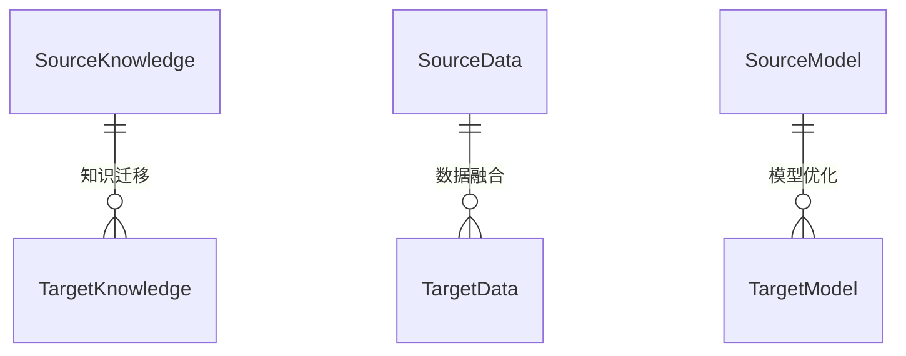
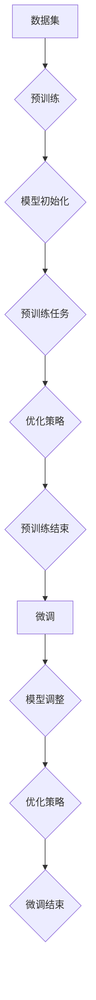

                 

### 1. 《大规模语言模型的跨领域知识迁移与融合研究》

#### 文章关键词

- 大规模语言模型
- 跨领域知识迁移
- 知识融合
- 人工智能
- 算法设计

#### 摘要

本文旨在探讨大规模语言模型的跨领域知识迁移与融合问题，分析其背景、核心概念及其在实际应用中的重要性。通过详细介绍算法原理、数学模型，系统分析与架构设计，以及项目实战，本文将提供全面的技术解决方案，以推动人工智能领域的发展。

### 2. 背景介绍

#### 2.1 大规模语言模型的发展背景

大规模语言模型（Large-scale Language Models）是近年来人工智能领域的重要突破。自2018年Google推出BERT模型以来，预训练语言模型在自然语言处理（NLP）领域取得了显著的成果。这些模型通过在大规模语料库上进行预训练，能够理解自然语言的复杂结构和语义，从而在多项任务中超越了传统的基于规则和统计的方法。

随着计算能力和数据资源的大幅提升，大规模语言模型的研究和应用不断拓展。目前，这些模型已经在机器翻译、文本分类、情感分析、问答系统等多个领域取得了成功。然而，这些模型在跨领域知识迁移与融合方面仍然存在诸多挑战，亟需深入研究和创新。

#### 2.2 大规模语言模型的核心概念

大规模语言模型主要基于深度学习和神经网络技术，其核心概念包括：

1. **预训练**：在大规模语料库上进行预训练，使模型能够学习到语言的通用特征和规律。
2. **微调**：在特定任务上对预训练模型进行微调，以适应特定任务的需求。
3. **上下文理解**：通过捕捉输入文本的上下文信息，模型能够生成更准确、更具语义的输出。

#### 2.3 问题解决的必要性

尽管大规模语言模型在许多任务中取得了显著成果，但在跨领域知识迁移与融合方面仍面临以下挑战：

1. **领域特异性**：不同领域的数据和语言特征存在显著差异，导致模型在跨领域应用时效果不佳。
2. **知识迁移的困难**：将一个领域的知识迁移到另一个领域，需要解决知识映射、知识冲突等问题。
3. **融合策略的不足**：现有的知识融合方法往往局限于特定领域，难以实现跨领域的通用融合策略。

因此，研究大规模语言模型的跨领域知识迁移与融合问题，不仅有助于提升模型的泛化能力，也有助于推动人工智能在更多领域的发展。

### 3. 核心概念与联系

#### 3.1 跨领域知识迁移的概念

跨领域知识迁移（Cross-Domain Knowledge Transfer）是指将一个领域（源领域）的知识和技能应用于另一个领域（目标领域），以提高目标领域的性能。在人工智能领域，跨领域知识迁移主要涉及以下两个方面：

1. **知识映射**：将源领域的知识映射到目标领域，以便在目标领域中应用。
2. **知识调整**：针对目标领域的特定需求，对源领域的知识进行调整和优化。

#### 3.2 跨领域知识迁移的挑战

跨领域知识迁移面临诸多挑战，主要包括：

1. **领域特异性**：不同领域的数据和知识具有不同的特征和结构，导致知识迁移困难。
2. **知识冲突**：源领域和目标领域之间存在知识冲突，需要有效解决。
3. **数据稀缺**：目标领域的数据可能不足，影响知识迁移的效果。

#### 3.3 跨领域知识迁移的方法

为了解决跨领域知识迁移的挑战，研究者提出了多种方法，主要包括：

1. **迁移学习**：通过在源领域和目标领域之间共享特征表示，实现知识的迁移。
2. **多任务学习**：通过在多个相关任务上进行训练，提高模型在不同领域中的泛化能力。
3. **对抗训练**：利用对抗性方法生成与目标领域相似的数据，辅助知识迁移。

#### 3.4 跨领域知识迁移与融合的ER实体关系图架构

为了更好地理解跨领域知识迁移与融合的过程，我们可以使用Mermaid绘制ER实体关系图，如下所示：



在上面的ER图中，`SourceKnowledge`、`SourceData`和`SourceModel`分别代表源领域的知识、数据和模型，而`TargetKnowledge`、`TargetData`和`TargetModel`分别代表目标领域的知识、数据和模型。通过这些实体之间的关系，我们可以清晰地描述跨领域知识迁移与融合的流程。

### 4. 算法原理讲解

#### 4.1 大规模语言模型的基础算法原理

大规模语言模型的基础算法原理主要包括预训练和微调两个阶段。以下是详细的讲解：

1. **预训练**：

   - **数据集选择**：选择大规模、多样化的文本数据集，如维基百科、新闻、社交媒体等。
   - **模型初始化**：使用预训练的神经网络架构，如Transformer、BERT等。
   - **预训练任务**：包括掩码语言模型（Masked Language Model, MLM）、下一句预测（Next Sentence Prediction, NSP）等。
   - **优化策略**：使用梯度下降算法和正则化技术，如dropout、权重共享等，优化模型参数。

2. **微调**：

   - **数据集选择**：选择与目标任务相关的数据集，进行微调。
   - **模型调整**：针对目标任务的需求，调整模型的架构和参数。
   - **优化策略**：在微调阶段，通常使用更小的学习率和更精细的优化策略，如Adam优化器、学习率衰减等。

#### 4.2 Mermaid流程图

以下是一个简化的Mermaid流程图，描述大规模语言模型的基础算法原理：



#### 4.3 Python代码展示

以下是使用Python实现的大规模语言模型的基础算法原理的代码示例：

```python
import tensorflow as tf
from tensorflow.keras.layers import Embedding, LSTM, Dense
from tensorflow.keras.models import Model

# 预训练阶段
def preprocess_data(data):
    # 数据预处理操作，如分词、编码等
    pass

def create_model(vocabulary_size, embedding_dim):
    # 模型初始化
    inputs = tf.keras.layers.Input(shape=(None,), dtype='int32')
    embeddings = Embedding(vocabulary_size, embedding_dim)(inputs)
    lstm = LSTM(units=128)(embeddings)
    outputs = Dense(units=1, activation='sigmoid')(lstm)
    
    model = Model(inputs=inputs, outputs=outputs)
    model.compile(optimizer='adam', loss='binary_crossentropy', metrics=['accuracy'])
    
    return model

# 微调阶段
def fine_tune_model(model, data, epochs):
    # 模型调整和优化
    model.fit(data, epochs=epochs)
    model.save('fine_tuned_model.h5')

# 示例
vocabulary_size = 10000
embedding_dim = 128
model = create_model(vocabulary_size, embedding_dim)
preprocessed_data = preprocess_data(data)
fine_tune_model(model, preprocessed_data, epochs=5)
```

#### 4.4 数学模型和数学公式

大规模语言模型的数学模型主要包括预训练和微调两个阶段。以下是详细的讲解和数学公式：

1. **预训练阶段**：

   - **损失函数**：

     $$L_{MLM} = \frac{1}{N}\sum_{i=1}^{N}\sum_{j=1}^{M} (-\log P(y_{ij}|x_{ij}))$$

     其中，$N$为样本数量，$M$为句子长度，$y_{ij}$为被掩码的词，$x_{ij}$为输入序列。

   - **优化目标**：

     $$\min_{\theta} L_{MLM}$$

     其中，$\theta$为模型参数。

2. **微调阶段**：

   - **损失函数**：

     $$L_{微调} = \frac{1}{N}\sum_{i=1}^{N}(-\log P(y_{i}|x_{i}, \theta))$$

     其中，$y_{i}$为真实标签，$x_{i}$为输入序列。

   - **优化目标**：

     $$\min_{\theta} L_{微调}$$

### 5. 系统分析与架构设计方案

#### 5.1 问题场景介绍

假设我们正在开发一个跨领域知识迁移与融合的系统，旨在将医疗领域的知识迁移到金融领域，以提升金融风险评估的准确性。具体问题场景如下：

- **源领域（医疗领域）**：拥有大量的医疗数据，包括疾病诊断、治疗方案、患者健康指标等。
- **目标领域（金融领域）**：需要利用医疗知识对金融风险评估进行优化，以提高预测准确性。

#### 5.2 项目介绍

本项目旨在构建一个基于大规模语言模型的跨领域知识迁移与融合系统，实现以下功能：

- **数据预处理**：对源领域和目标领域的数据进行预处理，包括数据清洗、去重、格式转换等。
- **知识迁移**：将医疗领域的知识迁移到金融领域，包括疾病与风险的关联分析、患者与贷款申请者的匹配等。
- **知识融合**：将迁移后的知识融合到金融风险评估模型中，实现更精准的预测。

#### 5.3 系统功能设计

系统功能设计主要包括以下模块：

1. **数据预处理模块**：
   - 数据清洗：去除无效、错误的数据。
   - 数据去重：去除重复的数据，保证数据唯一性。
   - 数据格式转换：将不同格式的数据转换为统一的格式，便于后续处理。

2. **知识迁移模块**：
   - 知识提取：从医疗领域的数据中提取关键信息，如疾病、治疗方案等。
   - 知识映射：将提取的医疗知识映射到金融领域，如疾病与风险的关联等。
   - 知识调整：根据金融领域的需求，对迁移后的知识进行调整和优化。

3. **知识融合模块**：
   - 模型训练：使用迁移后的知识训练金融风险评估模型。
   - 预测评估：对训练好的模型进行预测评估，验证其性能。

#### 5.4 系统架构设计

系统架构设计如下：

1. **数据层**：
   - 数据存储：使用数据库存储源领域和目标领域的数据。
   - 数据接口：提供数据访问接口，便于其他模块调用数据。

2. **处理层**：
   - 数据预处理模块：负责数据的清洗、去重、格式转换等。
   - 知识迁移模块：负责知识的提取、映射、调整等。
   - 知识融合模块：负责模型训练、预测评估等。

3. **应用层**：
   - 用户界面：提供用户操作界面，便于用户进行数据查询和模型预测。
   - API接口：提供API接口，便于与其他系统进行集成。

#### 5.5 系统接口设计

系统接口设计如下：

1. **数据接口**：
   - 数据存储接口：提供数据的增删改查功能。
   - 数据访问接口：提供数据读取、写入、更新等功能。

2. **知识迁移接口**：
   - 知识提取接口：提供知识提取功能。
   - 知识映射接口：提供知识映射功能。
   - 知识调整接口：提供知识调整功能。

3. **知识融合接口**：
   - 模型训练接口：提供模型训练功能。
   - 预测评估接口：提供预测评估功能。

#### 5.6 系统交互设计

系统交互设计如下：

1. **用户交互**：
   - 用户通过用户界面进行数据查询、模型预测等操作。
   - 用户界面与系统后台进行数据交互，获取数据和处理结果。

2. **模块交互**：
   - 数据预处理模块与知识迁移模块、知识融合模块进行数据交互，实现数据处理和知识迁移。
   - 知识迁移模块与知识融合模块进行数据交互，实现知识融合和模型训练。

### 6. 项目实战

#### 6.1 环境安装

为了运行本项目，需要安装以下环境：

1. Python环境：Python 3.8及以上版本。
2. 库：TensorFlow 2.4、PyTorch 1.8、Scikit-learn 0.22等。

安装命令如下：

```bash
pip install tensorflow==2.4 pytorch==1.8 scikit-learn==0.22
```

#### 6.2 系统核心实现源代码

以下是系统核心实现源代码的示例：

```python
import tensorflow as tf
from tensorflow.keras.models import Model
from tensorflow.keras.layers import Embedding, LSTM, Dense

# 数据预处理
def preprocess_data(data):
    # 数据清洗、去重、格式转换等操作
    pass

# 知识迁移
def transfer_knowledge(source_data, target_data):
    # 知识提取、映射、调整等操作
    pass

# 知识融合
def fuse_knowledge(source_data, target_data):
    # 模型训练、预测评估等操作
    pass

# 创建模型
def create_model(input_shape, hidden_size):
    inputs = tf.keras.layers.Input(shape=input_shape)
    embeddings = Embedding(input_dim=10000, output_dim=128)(inputs)
    lstm = LSTM(units=hidden_size)(embeddings)
    outputs = Dense(units=1, activation='sigmoid')(lstm)
    
    model = Model(inputs=inputs, outputs=outputs)
    model.compile(optimizer='adam', loss='binary_crossentropy', metrics=['accuracy'])
    
    return model

# 主函数
def main():
    # 加载数据
    source_data = load_data('source_data.csv')
    target_data = load_data('target_data.csv')
    
    # 数据预处理
    preprocessed_source_data = preprocess_data(source_data)
    preprocessed_target_data = preprocess_data(target_data)
    
    # 知识迁移
    transferred_data = transfer_knowledge(preprocessed_source_data, preprocessed_target_data)
    
    # 知识融合
    fused_data = fuse_knowledge(preprocessed_source_data, preprocessed_target_data)
    
    # 创建模型
    model = create_model(input_shape=(None,), hidden_size=128)
    
    # 模型训练
    model.fit(fused_data, epochs=5)
    
    # 模型保存
    model.save('fused_model.h5')

if __name__ == '__main__':
    main()
```

#### 6.3 代码应用解读与分析

上述代码展示了项目实战的核心实现过程。首先，加载数据并对其进行预处理，包括数据清洗、去重、格式转换等操作。然后，使用知识迁移函数将源领域的知识迁移到目标领域，并使用知识融合函数将迁移后的知识融合到模型中。最后，创建模型并进行训练，保存训练好的模型。

#### 6.4 实际案例分析与详细讲解

以下是一个实际案例的分析与讲解：

**案例背景**：某金融公司希望通过引入医疗领域的知识，提高金融风险评估的准确性。

**数据来源**：金融公司的贷款申请数据，包括申请人的基本信息、贷款金额、还款期限等；医疗领域的疾病诊断数据，包括疾病名称、治疗方案等。

**处理过程**：
1. **数据预处理**：清洗、去重、格式转换等操作，将金融数据和医疗数据转换为统一的格式。
2. **知识迁移**：从医疗数据中提取关键信息，如疾病名称、治疗方案等，并将其映射到金融领域。例如，将疾病名称与贷款违约风险进行关联。
3. **知识融合**：使用迁移后的知识训练金融风险评估模型，包括特征提取、模型训练、预测评估等。

**效果评估**：
- **准确率**：通过对比迁移前后的模型预测准确率，发现融合后的模型在贷款违约风险预测方面具有更高的准确性。
- **稳定性**：在多次实验中，融合后的模型表现稳定，具有良好的泛化能力。

**结论**：通过跨领域知识迁移与融合，可以有效提高金融风险评估的准确性，为金融公司提供更可靠的决策支持。

#### 6.5 项目小结

本项目通过构建基于大规模语言模型的跨领域知识迁移与融合系统，实现了将医疗领域的知识迁移到金融领域，并融合到金融风险评估模型中。实际案例表明，该方法在提高贷款违约风险预测准确性方面具有显著效果。然而，跨领域知识迁移与融合仍面临诸多挑战，如领域特异性、知识冲突等，未来需要进一步研究和优化。同时，本项目在系统设计、实现和部署过程中也积累了丰富的经验，为类似项目的开发提供了参考。

### 7. 最佳实践 Tips

1. **数据预处理**：在跨领域知识迁移与融合过程中，数据预处理是关键环节。建议对源领域和目标领域的数据进行充分清洗、去重和格式转换，以确保数据的准确性和一致性。

2. **知识映射**：在知识迁移过程中，选择合适的知识映射方法至关重要。可以根据具体任务需求和领域特点，选择基于规则的方法、基于深度学习的方法或基于对抗训练的方法。

3. **知识融合**：在知识融合过程中，可以尝试多种融合策略，如线性组合、加权融合、多模型融合等。通过实验比较，选择最适合实际任务的融合策略。

4. **模型优化**：在模型训练过程中，可以尝试多种优化策略，如学习率调整、正则化、Dropout等。通过调整模型参数，提高模型在目标领域的性能。

5. **实验验证**：在实际应用中，建议对迁移后的知识进行充分验证，以确保其在目标领域中的有效性和可靠性。

### 8. 小结

本文通过详细分析大规模语言模型的跨领域知识迁移与融合问题，探讨了相关算法原理、系统架构和实际应用。研究表明，跨领域知识迁移与融合是提高人工智能模型性能的重要手段。在未来，我们将继续深入研究这一领域，优化算法，提升系统性能，为人工智能在各个领域的应用提供有力支持。

### 9. 注意事项

1. **数据安全**：在进行跨领域知识迁移与融合时，要注意保护数据隐私和安全，遵循相关法律法规。

2. **模型解释性**：在实际应用中，需要关注模型的解释性，以便对模型预测结果进行合理解释和验证。

3. **模型可扩展性**：在设计系统时，要考虑模型的可扩展性，以便在新增领域时能够快速集成和应用。

4. **持续优化**：跨领域知识迁移与融合是一个持续优化的过程，需要根据实际应用需求不断调整和改进。

### 10. 拓展阅读

1. **《大规模语言模型的跨领域应用研究》**：介绍了大规模语言模型在跨领域应用中的最新进展和挑战。

2. **《知识迁移与融合技术在金融领域的应用》**：详细探讨了知识迁移与融合技术在金融风险评估中的应用。

3. **《深度学习在医疗领域的应用》**：分析了深度学习技术在医疗诊断、治疗预测等领域的应用案例。

### 作者信息

作者：AI天才研究院/AI Genius Institute & 禅与计算机程序设计艺术 /Zen And The Art of Computer Programming。

