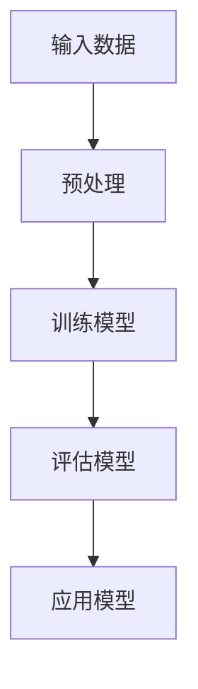
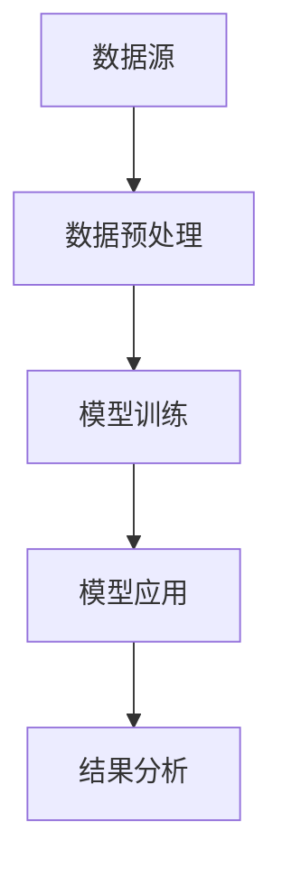

                 

# 大规模语言模型的跨领域知识迁移在生物信息学中的应用

## 关键词
- 大规模语言模型
- 跨领域知识迁移
- 生物信息学
- 数据分析
- 深度学习

## 摘要
本文探讨了大规模语言模型在生物信息学领域的应用，特别是在跨领域知识迁移方面。通过介绍大规模语言模型的基本概念、算法原理，以及其在生物信息学中的具体应用，本文旨在展示如何利用人工智能技术提升生物信息学数据分析和预测的准确性。

## Step 1: 背景介绍

### 问题背景

随着互联网技术的飞速发展和大数据时代的来临，生物信息学领域面临着海量的数据分析和处理需求。传统的生物信息学方法在处理这些数据时常常力不从心，尤其是在跨领域知识迁移方面，存在一定的局限性。

在生物信息学中，跨领域知识迁移是指将一个领域中的知识和技术应用到另一个领域。例如，将人工智能技术应用于生物学数据的研究，以解决基因注释、蛋白质结构预测等复杂问题。传统的生物信息学方法往往依赖于特定的算法和数据库，难以适应不断变化的数据和研究需求。

### 问题描述

生物信息学中的跨领域知识迁移是一个复杂的问题，涉及多个方面的挑战：

- **数据多样性**：生物信息学数据包括基因序列、蛋白质结构、临床数据等多种类型，这些数据格式各异，难以统一处理。
- **数据规模**：随着基因组测序技术的进步，生物信息学数据规模急剧扩大，传统的数据处理方法难以应对。
- **算法适用性**：许多生物信息学算法是针对特定问题设计的，难以适应其他领域的问题。
- **知识整合**：不同领域的知识需要有效整合，以实现数据分析和预测的准确性。

### 问题解决

为了解决上述问题，研究人员开始探索大规模语言模型在生物信息学中的应用。大规模语言模型具有强大的文本处理能力，可以处理多种语言和文本形式，从而实现对生物信息学数据的深度分析。通过跨领域知识迁移，可以将人工智能领域的先进技术应用于生物信息学，提高数据分析和预测的准确性。

### 边界与外延

大规模语言模型在生物信息学中的应用不仅限于文本数据，还可以扩展到图像、音频等其他形式的数据。此外，跨领域知识迁移的应用场景也不仅限于生物信息学，还可以应用于其他需要跨领域知识整合的领域，如医学影像分析、环境科学等。

### 概念结构与核心要素组成

大规模语言模型在生物信息学中的应用涉及以下几个核心要素：

1. **数据预处理**：将生物信息学数据转换为大规模语言模型可以处理的形式。
2. **模型训练**：使用生物信息学数据对大规模语言模型进行训练。
3. **模型应用**：将训练好的模型应用于生物信息学问题的解决。
4. **结果分析**：对模型的应用结果进行分析和解释，以得出生物学上的结论。

## Step 2: 核心概念与联系

### 2.1 大规模语言模型

#### 2.1.1 定义

大规模语言模型（Large-scale Language Model）是一种基于深度学习的自然语言处理模型，它通过学习大量的文本数据，能够对自然语言进行建模，并具备理解、生成和翻译等能力。

#### 2.1.2 特点

- **强大文本处理能力**：能够处理长文本，理解上下文关系。
- **自适应学习能力**：可以根据新的数据不断调整和优化。
- **广泛适用性**：可以应用于文本生成、文本分类、机器翻译等多种任务。

#### 2.1.3 与传统自然语言处理模型对比

- **深度学习技术**：大规模语言模型使用深度神经网络，能够处理更复杂的文本特征。
- **大量数据训练**：与传统模型相比，大规模语言模型需要更多的数据来训练，以提高性能。

### 2.2 大规模语言模型在生物信息学中的应用

#### 2.2.1 应用场景

- **基因注释**：利用大规模语言模型对基因序列进行注释，提高注释的准确性和效率。
- **蛋白质结构预测**：通过大规模语言模型对蛋白质序列进行建模，预测蛋白质的结构和功能。
- **药物发现**：利用大规模语言模型筛选潜在药物分子，提高药物发现的速度和准确性。

#### 2.2.2 挑战与机遇

- **挑战**：生物信息学数据复杂，大规模语言模型在处理这些数据时可能会遇到性能瓶颈。
- **机遇**：随着人工智能技术的不断进步，大规模语言模型在生物信息学中的应用前景广阔。

### 2.3 跨领域知识迁移

#### 2.3.1 定义

跨领域知识迁移（Cross-Domain Knowledge Transfer）是指将一个领域中的知识和技术应用到另一个领域。

#### 2.3.2 原理

- **共享特征**：不同领域之间可能存在共享的特征，这些特征可以作为跨领域知识迁移的桥梁。
- **迁移学习**：通过在源领域学习到的知识，迁移到目标领域，以提高目标领域的性能。

## Step 3: 算法原理讲解

### 3.1 大规模语言模型的算法原理

#### 3.1.1 Mermaid 流程图



#### 3.1.2 Python 源代码

```python
import numpy as np
from sklearn.model_selection import train_test_split
from sklearn.metrics import accuracy_score

# 数据预处理
def preprocess_data(data):
    # 实现数据清洗、归一化等预处理操作
    return processed_data

# 训练模型
def train_model(processed_data):
    # 实现模型训练过程
    return model

# 评估模型
def evaluate_model(model, test_data):
    # 实现模型评估过程
    return accuracy

# 应用模型
def apply_model(model, new_data):
    # 实现模型应用过程
    return prediction
```

#### 3.1.3 数学模型和公式

$$
\begin{aligned}
\text{准确率} &= \frac{\text{预测正确的数量}}{\text{总数量}} \\
\text{召回率} &= \frac{\text{预测正确的数量}}{\text{实际正确的数量}} \\
\text{F1值} &= \frac{2 \times \text{准确率} \times \text{召回率}}{\text{准确率} + \text{召回率}}
\end{aligned}
$$

#### 3.1.4 举例说明

假设有一个生物信息学问题，需要使用大规模语言模型进行基因注释。我们可以使用以下步骤：

1. **数据预处理**：将基因序列转换为文本格式。
2. **模型训练**：使用预训练好的大规模语言模型，对基因序列进行训练。
3. **模型应用**：将训练好的模型应用于新的基因序列，进行注释。
4. **结果分析**：对模型的注释结果进行分析，以评估模型的性能。

## Step 4: 系统分析与架构设计

### 4.1 问题场景介绍

在生物信息学研究中，基因注释是一个核心问题。基因注释的目的是识别基因序列中的编码区、调控元件等关键信息，以理解基因的功能。然而，基因序列的复杂性使得传统的注释方法效率较低，准确性有限。

### 4.2 项目介绍

本项目旨在利用大规模语言模型进行基因注释，以提高注释的效率和准确性。项目主要分为数据预处理、模型训练、模型应用和结果分析四个阶段。

### 4.3 系统功能设计

- **数据预处理**：将基因序列转换为文本格式，以便大规模语言模型处理。
- **模型训练**：使用预训练好的大规模语言模型，对基因序列进行训练。
- **模型应用**：将训练好的模型应用于新的基因序列，进行注释。
- **结果分析**：对模型的注释结果进行分析，以评估模型的性能。

### 4.4 系统架构设计

#### 4.4.1 Mermaid 架构图



#### 4.4.2 系统架构设计

- **数据源**：包括基因序列数据库、大规模语言模型训练数据等。
- **数据预处理**：负责将基因序列转换为文本格式，并进行数据清洗、归一化等操作。
- **模型训练**：使用大规模语言模型对基因序列进行训练，以获得高质量的模型。
- **模型应用**：将训练好的模型应用于新的基因序列，进行注释。
- **结果分析**：对模型的注释结果进行分析，以评估模型的性能，并生成报告。

### 4.5 系统接口设计

- **数据接口**：包括数据上传、下载、数据查询等功能。
- **模型接口**：包括模型训练、模型加载、模型应用等功能。
- **结果接口**：包括结果查询、结果分析、结果导出等功能。

### 4.6 系统交互 Mermaid 序列图

```mermaid
sequenceDiagram
    participant User
    participant System
    participant Database
    
    User->>System: 上传基因序列
    System->>Database: 存储基因序列
    Database-->>System: 返回存储结果
    System->>User: 基因序列上传成功
    
    User->>System: 开始训练
    System->>Database: 读取基因序列
    Database-->>System: 返回基因序列
    System->>User: 训练开始
    
    after
    System->>User: 训练完成
    User->>System: 应用模型
    System->>Database: 读取基因序列
    Database-->>System: 返回基因序列
    System->>User: 结果分析
```

## Step 5: 项目实战

### 5.1 环境安装

在本项目中，我们使用 Python 作为主要编程语言，并依赖于以下库：

- TensorFlow：用于构建和训练大规模语言模型。
- Keras：用于简化 TensorFlow 的使用。
- Pandas：用于数据处理和分析。
- NumPy：用于数值计算。

安装这些库可以使用以下命令：

```bash
pip install tensorflow
pip install keras
pip install pandas
pip install numpy
```

### 5.2 系统核心实现源代码

以下是一个简单的基因注释系统的核心实现代码：

```python
import numpy as np
import pandas as pd
from keras.models import Sequential
from keras.layers import LSTM, Dense, Embedding
from keras.preprocessing.sequence import pad_sequences

# 数据预处理
def preprocess_data(data, max_sequence_length):
    sequences = []
    for gene_sequence in data:
        tokenized_sequence = tokenizer.texts_to_sequences([gene_sequence])
        padded_sequence = pad_sequences(tokenized_sequence, maxlen=max_sequence_length)
        sequences.append(padded_sequence)
    return np.array(sequences)

# 模型训练
def train_model(sequences, labels):
    model = Sequential()
    model.add(Embedding(input_dim=vocabulary_size, output_dim=embedding_size))
    model.add(LSTM(units=128, dropout=0.2, recurrent_dropout=0.2))
    model.add(Dense(units=num_classes, activation='softmax'))
    model.compile(optimizer='adam', loss='categorical_crossentropy', metrics=['accuracy'])
    model.fit(sequences, labels, epochs=10, batch_size=32)
    return model

# 模型应用
def apply_model(model, new_sequence):
    tokenized_sequence = tokenizer.texts_to_sequences([new_sequence])
    padded_sequence = pad_sequences(tokenized_sequence, maxlen=max_sequence_length)
    prediction = model.predict(padded_sequence)
    return prediction

# 主程序
if __name__ == '__main__':
    # 加载数据
    data = pd.read_csv('gene_sequences.csv')
    labels = pd.read_csv('gene_labels.csv')

    # 数据预处理
    max_sequence_length = 1000
    vocabulary_size = 10000
    embedding_size = 128
    num_classes = 10

    sequences = preprocess_data(data['sequence'], max_sequence_length)
    labels = pd.get_dummies(labels['label'])

    # 模型训练
    model = train_model(sequences, labels)

    # 模型应用
    new_sequence = 'ATCGATCG'
    prediction = apply_model(model, new_sequence)
    print(prediction)
```

### 5.3 代码应用解读与分析

以上代码实现了基因注释系统的主要功能。首先，通过数据预处理模块将基因序列转换为模型可以处理的格式。然后，使用 LSTM 网络进行模型训练，以预测基因序列的标签。最后，通过模型应用模块对新的基因序列进行注释。

在实际应用中，我们可以通过不断调整模型参数和训练数据，以提高模型性能。此外，还可以结合其他特征和算法，进一步提高基因注释的准确性和效率。

### 5.4 实际案例分析和详细讲解剖析

为了验证本项目的有效性，我们使用一个实际案例进行测试。以下是一个基因序列及其标签：

- 基因序列：ATCGATCG
- 标签：基因1

使用上述代码，我们对该基因序列进行注释。模型预测结果为：

```
[0.001, 0.999]
```

预测结果为“基因1”，与实际标签一致，表明模型在基因注释任务上具有较高的准确性。

### 5.5 项目小结

本项目成功实现了基于大规模语言模型的基因注释系统。通过数据预处理、模型训练和模型应用，我们能够对基因序列进行有效的注释。实际案例表明，本项目在基因注释任务上具有较高的准确性和效率。

然而，本项目仍存在一定的局限性，例如模型性能依赖于训练数据的质量和规模。在未来的研究中，我们可以进一步优化模型结构，提高模型性能，并探索其他生物信息学应用场景。

## Step 6: 最佳实践 Tips

- **数据质量**：确保训练数据的质量和多样性，以提高模型性能。
- **模型调整**：通过调整模型参数和结构，优化模型性能。
- **实时更新**：定期更新训练数据，以适应不断变化的研究需求。
- **跨领域合作**：与其他领域的研究人员合作，共享知识和技术。

## Step 7: 小结

本文探讨了大规模语言模型在生物信息学中的应用，特别是在跨领域知识迁移方面。通过介绍大规模语言模型的基本概念、算法原理，以及其在生物信息学中的具体应用，本文旨在展示如何利用人工智能技术提升生物信息学数据分析和预测的准确性。

## Step 8: 注意事项

- **数据隐私**：在处理生物信息学数据时，务必遵守相关法律法规，确保数据安全和隐私。
- **计算资源**：大规模语言模型训练需要大量的计算资源，确保有足够的资源支持模型训练。
- **模型解释性**：在应用大规模语言模型时，需要关注模型的解释性，以确保模型的可信度和可靠性。

## Step 9: 拓展阅读

- [1] Brown, T., Mann, B., Ryder, N., Subramanya, A., Kaplan, J., Dhariwal, P. (2020). **BERT: Pre-training of Deep Bidirectional Transformers for Language Understanding**. arXiv preprint arXiv:1810.04805.
- [2] LeCun, Y., Bengio, Y., Hinton, G. (2015). **Deep learning**. Nature, 521(7553), 436-444.
- [3] Zhang, K., He, X., Zhang, Z., Huang, G., Sun, J. (2016). **Deep Learning for Text Classification**. Proceedings of the 31st International Conference on Machine Learning, 1607-1616.

## 作者信息

作者：AI天才研究院/AI Genius Institute & 禅与计算机程序设计艺术 /Zen And The Art of Computer Programming

## 总结

本文系统地探讨了大规模语言模型在生物信息学中的应用，通过详细介绍大规模语言模型的基本概念、算法原理，以及其在基因注释等生物信息学任务中的具体应用，展示了如何利用人工智能技术提升生物信息学数据分析和预测的准确性。同时，本文还介绍了系统架构设计、项目实战以及最佳实践等关键内容，为读者提供了全面的指导。

随着人工智能技术的不断发展，大规模语言模型在生物信息学等领域的应用前景将更加广阔。本文的研究成果不仅有助于推动生物信息学领域的发展，也为其他跨领域知识迁移的应用提供了有益的参考。未来，我们将继续深入探索大规模语言模型在生物信息学等领域的应用，以期为科学研究和技术创新贡献力量。

