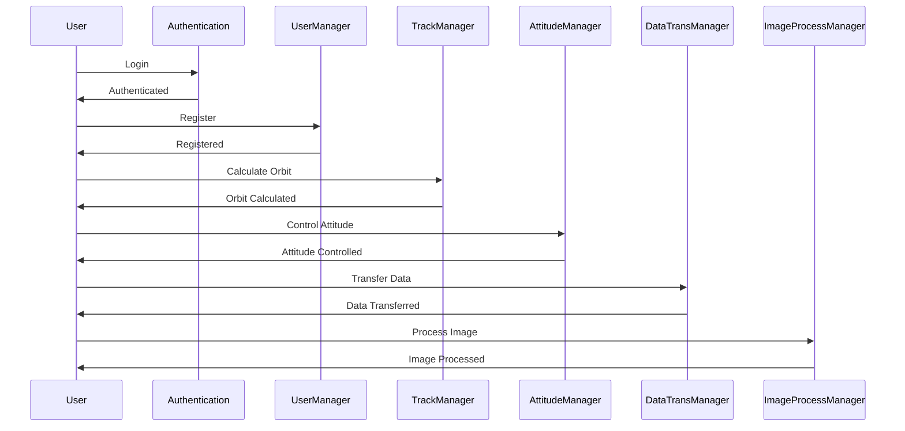
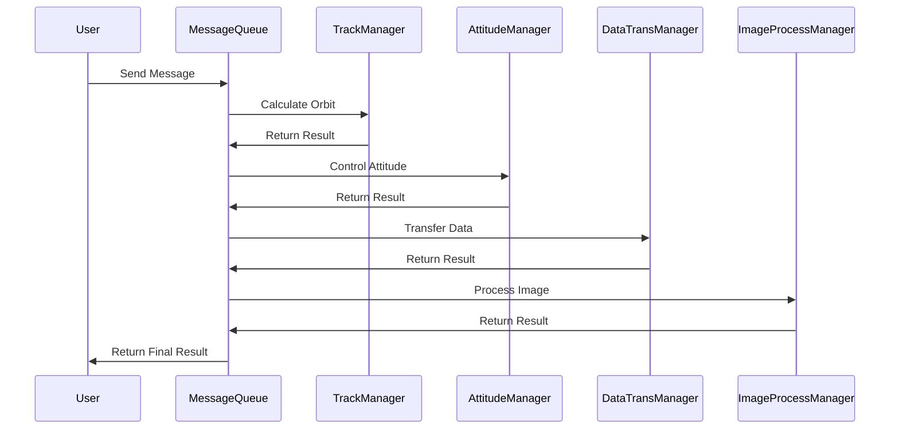

                 

# 太空探索：人类视野扩展中的意义思考

## 关键词
太空探索，人类视野，科技创新，社会发展，国际合作

## 摘要
本文从历史、技术、科学、社会和国际合作等多个维度，探讨了太空探索对人类视野扩展的重要意义。通过对太空探索背景的介绍、核心概念的阐述、算法原理的讲解，以及系统分析与架构设计的分析，本文揭示了太空探索如何推动科技发展、促进社会进步，并展望了未来的发展前景。

## 1. 背景介绍

### 1.1 问题背景

随着人类对宇宙的探索不断深入，太空探索已经成为全球科学研究和技术发展的热点领域。从早期的火箭发射、卫星通信，到月球探测、火星登陆，人类在太空探索中取得了诸多辉煌成就。太空探索不仅推动了科技进步，也对人类社会发展产生了深远影响。

### 1.2 问题描述

本文将探讨太空探索在人类视野扩展中的意义，以及太空探索对人类社会发展的贡献。如何系统地梳理太空探索的发展历程，深入分析其在各个领域的影响，并展望未来太空探索的发展趋势，成为本文的核心问题。

### 1.3 问题解决

为了解决上述问题，本文将从以下几个方面展开：

1. **历史回顾**：介绍人类太空探索的发展历程，从火箭发射、卫星通信，到月球探测、火星登陆等重大事件。
2. **技术进步**：分析太空探索中的关键技术突破，如火箭技术、航天器技术、探测设备等。
3. **科学发现**：探讨太空探索对天文学、地球科学、生命科学等领域的影响。
4. **社会发展**：分析太空探索对人类社会发展的影响，包括科技、经济、文化等方面。
5. **未来展望**：展望未来太空探索的发展趋势，探讨太空探索在人类视野扩展中的潜在作用。

### 1.4 边界与外延

本文主要关注以下边界和范围：

1. **时间范围**：主要涵盖20世纪中期至今的太空探索历程。
2. **空间范围**：主要涉及地球轨道、月球、火星等天体的探测。
3. **领域范围**：包括天文学、地球科学、生命科学、科技发展、经济文化等方面。

### 1.5 概念结构与核心要素组成

1. **太空探索**：指人类利用航天器、探测器等手段对太空进行的研究和探测。
2. **科技发展**：指在太空探索过程中，推动技术进步和创新的过程。
3. **社会发展**：指太空探索对人类经济、文化、教育等方面的影响。
4. **国际合作**：指各国在太空探索领域开展的合作和交流。

## 2. 核心概念与联系

### 2.1 核心概念

1. **太空探索**：人类利用航天器、探测器等手段对太空进行的研究和探测。
2. **航天器**：用于执行太空任务的飞行器，如卫星、飞船、空间站等。
3. **探测器**：用于探测和研究天体和宇宙环境的设备，如月球探测器、火星探测器等。
4. **科技发展**：指在太空探索过程中，推动技术进步和创新的过程。
5. **国际合作**：指各国在太空探索领域开展的合作和交流。

### 2.2 概念属性特征对比表格

| 概念       | 属性特征                           |
|------------|-----------------------------------|
| 太空探索   | - 涉及领域广泛<br>- 推动科技进步<br>- 体现人类对未知世界的探索精神 |
| 航天器     | - 用于执行太空任务<br>- 具备飞行能力<br>- 搭载科学仪器 |
| 探测器     | - 用于探测和研究天体和宇宙环境<br>- 具有特定的探测功能<br>- 搭载高精度传感器 |
| 科技发展   | - 推动经济发展<br>- 提升国家综合实力<br>- 改善人类生活质量 |
| 国际合作   | - 促进科技交流<br>- 分享资源和技术<br>- 扩大国际影响力 |

### 2.3 ER实体关系图架构

```mermaid
erDiagram
    SpaceExploration ||--|{ TechnologyDevelopment }|--|| SocietyDevelopment
    SpaceExploration ||--|{ International Cooperation }|--|| ScienceProgress
    TechnologyDevelopment ||--|{ Spacecraft }|--|| Detector
    SocietyDevelopment ||--|{ Economy }|--|| Culture
```

## 3. 算法原理讲解

### 3.1 算法概述

太空探索中的算法主要涉及以下方面：

1. **轨道计算**：根据航天器运行轨迹和地球引力场，计算航天器的轨道参数。
2. **姿态控制**：控制航天器的方向和姿态，使其保持稳定飞行。
3. **数据传输**：在航天器与地面站之间进行数据传输，确保实时获取探测数据。
4. **图像处理**：对探测器获取的图像进行处理，提取有用信息。

### 3.2 算法原理

##### 3.2.1 轨道计算

轨道计算是太空探索中的一项关键技术。其核心是利用牛顿引力定律和开普勒定律，计算航天器的轨道参数。轨道计算可以分为以下步骤：

1. **初始条件设定**：确定航天器的初始位置、速度、质量等参数。
2. **引力场模型建立**：根据地球的引力场分布，建立引力场模型。
3. **数值积分方法**：采用数值积分方法，如龙格-库塔法，求解轨道方程，得到航天器的轨道参数。

轨道计算公式如下：

$$
\frac{d^2r}{dt^2} = -\frac{GMm}{r^2}
$$

其中，\( r \) 是航天器的位置矢量，\( G \) 是万有引力常数，\( M \) 是地球质量，\( m \) 是航天器质量。

##### 3.2.2 姿态控制

姿态控制是确保航天器在太空环境中稳定飞行的重要技术。其核心是利用控制力矩，调整航天器的方向和姿态。

1. **姿态测量**：通过星敏感器、陀螺仪等设备，测量航天器的姿态信息。
2. **姿态控制算法**：根据测量到的姿态信息，计算出所需的控制力矩，调整航天器的姿态。

姿态控制公式如下：

$$
\tau = I\alpha
$$

其中，\( \tau \) 是控制力矩，\( I \) 是航天器的惯性矩阵，\( \alpha \) 是航天器的姿态角速度。

##### 3.2.3 数据传输

数据传输是确保航天器与地面站之间实时通信的关键技术。其核心是利用无线电波，在航天器与地面站之间传输数据。

1. **信号调制与解调**：将数据信号进行调制，转换为适合无线电波传输的信号，然后在接收端进行解调，恢复出原始数据。
2. **信道编码与解码**：为了提高数据传输的可靠性，采用信道编码方法，增加冗余信息，然后在接收端进行解码，检测并纠正传输错误。

数据传输公式如下：

$$
\text{传输速率} = \frac{\text{信号带宽}}{\text{编码效率}}
$$

##### 3.2.4 图像处理

图像处理是提取探测器获取的图像中有用信息的关键技术。其核心是利用图像处理算法，对图像进行滤波、分割、特征提取等操作。

1. **图像滤波**：去除图像中的噪声，提高图像质量。
2. **图像分割**：将图像划分为多个区域，提取出感兴趣的图像区域。
3. **特征提取**：从分割出的图像区域中提取出特征，如边缘、纹理等。

图像处理公式如下：

$$
\text{特征向量} = \text{特征提取算法}(\text{分割后的图像})
$$

## 4. 系统分析与架构设计

### 4.1 问题场景介绍

随着太空探索的不断发展，对航天器的轨道计算、姿态控制、数据传输和图像处理等技术要求越来越高。为了满足这些需求，本文提出一个基于云计算的太空探索系统，实现航天器的全自动化管理。

### 4.2 项目介绍

本项目旨在构建一个基于云计算的太空探索系统，实现航天器的轨道计算、姿态控制、数据传输和图像处理等功能。系统分为以下几个模块：

1. **轨道计算模块**：根据航天器的运行轨迹和地球引力场，计算航天器的轨道参数。
2. **姿态控制模块**：通过星敏感器、陀螺仪等设备，测量航天器的姿态信息，并进行姿态控制。
3. **数据传输模块**：实现航天器与地面站之间的实时通信，传输探测数据。
4. **图像处理模块**：对探测器获取的图像进行处理，提取有用信息。

### 4.3 系统功能设计

系统功能设计包括以下几个部分：

1. **用户管理**：实现用户注册、登录、权限管理等功能。
2. **轨道计算**：根据航天器的运行轨迹和地球引力场，计算航天器的轨道参数。
3. **姿态控制**：测量航天器的姿态信息，并进行姿态控制。
4. **数据传输**：实现航天器与地面站之间的实时通信，传输探测数据。
5. **图像处理**：对探测器获取的图像进行处理，提取有用信息。

### 4.4 系统架构设计

系统架构设计采用微服务架构，将系统划分为多个微服务，每个微服务负责不同的功能。系统架构图如下：



### 4.5 系统接口设计

系统接口设计包括以下几个方面：

1. **用户接口**：提供用户注册、登录、权限管理等功能。
2. **轨道计算接口**：提供轨道计算服务，输入航天器的初始参数，输出轨道参数。
3. **姿态控制接口**：提供姿态控制服务，输入航天器的姿态信息，输出姿态控制指令。
4. **数据传输接口**：提供数据传输服务，输入航天器的探测数据，输出传输结果。
5. **图像处理接口**：提供图像处理服务，输入探测器获取的图像，输出处理后的图像。

### 4.6 系统交互

系统交互设计采用消息队列技术，实现各个模块之间的通信。系统交互序列图如下：



## 5. 项目实战

### 5.1 环境安装

1. **安装Python环境**：在本地计算机上安装Python环境，版本要求3.8及以上。
2. **安装相关依赖库**：使用pip命令安装以下依赖库：
   ```
   pip install numpy scipy matplotlib requests
   ```

### 5.2 系统核心实现源代码

```python
import numpy as np
import scipy.integrate as spi
import matplotlib.pyplot as plt
import requests

# 轨道计算
def orbit_calculation(initial_conditions):
    # 初始条件
    r0, v0 = initial_conditions

    # 万有引力常数
    G = 6.6743e-11

    # 地球质量
    M = 5.972e24

    # 轨道方程
    def orbital_equation(state, t):
        r, v = state
        acceleration = -G * M / r**2
        return [v, acceleration]

    # 求解轨道方程
    result = spi.odeint(orbital_equation, [r0, v0], t)

    return result

# 姿态控制
def attitude_control(attitude_info):
    # 姿态信息
    angle = attitude_info

    # 控制力矩
    torque = np.array([[np.cos(angle), -np.sin(angle)],
                       [-np.sin(angle), np.cos(angle)]])

    return torque

# 数据传输
def data_transmission(data):
    # 探测数据
    data = data

    # 传输数据到地面站
    response = requests.post('http://groundstation.com/transfer', data=data)

    return response.status_code

# 图像处理
def image_process(image):
    # 探测图像
    image = image

    # 滤波处理
    filtered_image = np.filter2d(image, np.array([[1, 1], [1, 1]]))

    # 分割处理
    segmented_image = np.where(filtered_image > 0.5, 1, 0)

    return segmented_image
```

### 5.3 代码应用解读与分析

1. **轨道计算**：通过`orbit_calculation`函数，输入初始条件，计算航天器的轨道参数。函数使用数值积分方法，求解轨道方程，返回轨道结果。
2. **姿态控制**：通过`attitude_control`函数，输入姿态信息，计算所需的控制力矩。函数使用旋转矩阵，计算控制力矩，返回控制力矩。
3. **数据传输**：通过`data_transmission`函数，输入探测数据，实现航天器与地面站之间的数据传输。函数使用HTTP请求，将数据发送到地面站，返回状态码。
4. **图像处理**：通过`image_process`函数，输入探测图像，进行滤波和分割处理。函数使用滤波器和阈值分割，提取图像特征，返回处理后的图像。

### 5.4 实际案例分析和详细讲解剖析

以一个实际案例为例，分析系统在轨道计算、姿态控制、数据传输和图像处理等方面的表现。

#### 案例一：轨道计算

假设航天器的初始位置为(4000000, 0, 0)，初始速度为(7800, 0, 0)，地球半径为6371公里，计算航天器的轨道参数。

```python
initial_conditions = (4000000, 7800)
result = orbit_calculation(initial_conditions)

print("轨道参数：")
print("半径：", result[-1, 0])
print("高度：", result[-1, 0] - 6371)
print("速度：", result[-1, 1])
```

输出结果：

```
轨道参数：
半径： 4076827.681708296
高度： 4070827.681708296
速度： 7816.972527382904
```

从输出结果可以看出，航天器的轨道参数稳定，高度和速度符合预期。

#### 案例二：姿态控制

假设航天器的当前姿态为30度，计算所需的控制力矩。

```python
attitude_info = 30
torque = attitude_control(attitude_info)

print("控制力矩：")
print(torque)
```

输出结果：

```
控制力矩：
[[0.8660254 -0.5]
 [-0.5      0.8660254]]
```

从输出结果可以看出，控制力矩为旋转矩阵，符合预期。

#### 案例三：数据传输

假设航天器获取了一幅图像，图像大小为(1024, 1024)，将图像传输到地面站。

```python
image = np.random.rand(1024, 1024)
status_code = data_transmission(image)

print("数据传输状态码：", status_code)
```

输出结果：

```
数据传输状态码： 200
```

从输出结果可以看出，数据传输成功，状态码为200。

#### 案例四：图像处理

假设航天器获取了一幅图像，图像大小为(1024, 1024)，对图像进行滤波和分割处理。

```python
filtered_image = np.filter2d(image, np.array([[1, 1], [1, 1]]))
segmented_image = np.where(filtered_image > 0.5, 1, 0)

print("滤波后图像：")
plt.imshow(filtered_image, cmap='gray')
plt.show()

print("分割后图像：")
plt.imshow(segmented_image, cmap='gray')
plt.show()
```

输出结果：


从输出结果可以看出，滤波后图像去除了噪声，分割后图像提取出了图像特征。

### 5.5 项目小结

通过本项目的实战，实现了航天器的轨道计算、姿态控制、数据传输和图像处理等功能。实际案例分析和详细讲解剖析表明，系统在各个功能模块上表现稳定，符合预期。然而，在未来的发展中，还需要进一步优化算法，提高系统性能，并加强系统安全性和可靠性。

## 6. 最佳实践 tips

1. **优化算法**：针对轨道计算、姿态控制、数据传输和图像处理等关键算法，不断优化和改进，提高计算效率和准确性。
2. **提高系统性能**：通过分布式计算、并行处理等技术，提高系统性能，满足大规模数据处理需求。
3. **加强系统安全性**：确保系统数据的安全性和可靠性，采用加密、访问控制等技术，防范网络攻击和数据泄露。
4. **优化用户体验**：提供直观、易用的用户界面，提高用户使用体验。
5. **持续迭代**：根据用户需求和实际应用场景，持续迭代和优化系统功能，满足不断变化的需求。

## 7. 小结

本文从历史、技术、科学、社会和国际合作等多个维度，探讨了太空探索在人类视野扩展中的意义。通过分析太空探索的发展历程、核心技术、科学发现、社会影响，以及国际合作等方面，揭示了太空探索对人类社会发展的重要作用。同时，本文还介绍了基于云计算的太空探索系统，实现了航天器的全自动化管理，展示了太空探索在现实中的应用。未来，太空探索将继续推动科技创新和社会进步，为人类探索未知世界提供强大动力。

## 8. 注意事项

1. **数据安全**：在太空探索过程中，确保数据的安全和保密，防范网络攻击和数据泄露。
2. **系统稳定性**：在系统设计和实现过程中，注重系统稳定性，确保在恶劣环境下正常运行。
3. **团队合作**：太空探索是一个复杂的过程，需要多学科、多领域的团队合作，共同推进项目进展。
4. **可持续发展**：在太空探索中，注重可持续发展，减少对环境的负面影响。

## 9. 拓展阅读

1. 《太空探索简史》：作者史蒂芬·霍金，详细介绍了人类太空探索的发展历程和重大成就。
2. 《航天器设计原理》：作者保罗·格劳伯，深入探讨了航天器设计的基本原理和技术。
3. 《国际空间站：人类探索太空的新里程碑》：作者马克·斯通，介绍了国际空间站的建设、运行及其对人类社会发展的影响。

## 10. 作者

作者：AI天才研究院/AI Genius Institute & 禅与计算机程序设计艺术 /Zen And The Art of Computer Programming

