                 

### 太空探索的起源与发展

#### 第1章：人类探索太空的历程

##### 1.1 早期探索与幻想

人类对太空的渴望可以追溯到远古时期。在古代文明中，天文学家们通过观测星空，推测出了许多星体和天象现象。古希腊哲学家如泰勒斯和阿那克西曼德等人对宇宙的起源和结构提出了初步的理论。然而，真正将太空探索变为现实的是现代科学技术的进步。

19世纪末，随着热气球和火箭技术的发展，人类开始尝试升空探索大气层以外的未知世界。1903年，莱特兄弟成功试飞了世界上第一架动力飞机，这标志着人类对地球表面的探索进入了一个全新的阶段。随后，科学家们开始探讨利用火箭技术进入太空的可能性。

##### 1.2 第一颗人造卫星与太空竞赛

1957年，苏联成功发射了世界上第一颗人造卫星“斯普特尼克1号”，这一历史性事件开启了人类太空探索的新纪元。美国对此迅速作出反应，在1958年发射了“探险者1号”卫星。这一时期，美苏两国展开了激烈的太空竞赛，不仅发射了更多的人造卫星，还进行了多次成功的动物和载人航天任务。

1961年，苏联宇航员尤里·加加林成为了第一个进入太空的人类。1969年，美国宇航员尼尔·阿姆斯特朗和巴兹·奥尔德林成功登月，这一壮举不仅标志着人类对月球的首次征服，也极大地激发了全球对太空探索的热情。

##### 1.3 人类首次登月与挑战者号灾难

尽管人类成功登月，但这一过程中也经历了重大的挫折。1967年，阿波罗1号任务中三名宇航员因舱内火灾丧生，这一悲剧震惊了全世界。然而，美国并未因此放弃，经过改进和调整，阿波罗11号最终成功登月。

然而，太空探索的道路并非一帆风顺。1986年，挑战者号航天飞机在发射升空后不久爆炸，导致七名宇航员遇难。这一事件再次提醒人们，太空探索是一项高风险的任务，需要持续的技术创新和安全保障。

#### 第2章：太空技术的演进

##### 2.1 通信与导航技术的突破

随着人类对太空的探索不断深入，通信和导航技术的进步变得至关重要。20世纪60年代，全球定位系统（GPS）的开发成功，使得地球上的位置和导航变得更加精准。这一技术的应用不仅改变了军事和民用航空领域，也对地质勘探、城市规划等领域产生了深远影响。

在通信方面，卫星通信技术的突破使得人类能够实现全球范围内的实时通信。通过同步轨道卫星，信息可以在地球的任何地方快速传输，极大地推动了全球信息化的进程。

##### 2.2 火箭技术的创新与发展

火箭技术是太空探索的核心技术之一。20世纪50年代，美国和苏联在火箭技术上展开了激烈竞争。随着苏联的胜利，美国加快了自主研发的步伐，最终在航天飞机和猎鹰9号等先进火箭技术方面取得了重要突破。

现代火箭技术不仅实现了更高的运载能力，还采用了可回收技术，显著降低了发射成本。例如，SpaceX的猎鹰9号火箭和猎鹰重型火箭，在多次成功发射和回收任务中展示了其卓越的性能。

##### 2.3 载人航天器与空间站的建设

载人航天器的发展是太空探索的重要组成部分。从最初的东方号到现代的国际空间站，人类在航天器设计和建造方面取得了巨大进步。国际空间站（ISS）的建设是国际合作的重要成果，多个国家的航天机构共同参与了这一项目。

国际空间站的建成不仅为宇航员提供了长期居住和工作环境，还成为了科学实验的重要基地。通过在国际空间站上进行的实验，科学家们对微重力环境下的物理、化学、生物过程有了更深入的了解。

#### 第3章：太空探索的科学价值

##### 3.1 宇宙起源与演化

太空探索为人类揭示了宇宙的起源和演化过程。通过对宇宙背景辐射和早期星系的研究，科学家们提出了大爆炸理论，并验证了宇宙的膨胀现象。这些发现不仅丰富了我们对宇宙的理解，也推动了天文学和物理学的发展。

##### 3.2 地外生命与宇宙环境

地外生命的探索一直是人类太空探索的重要目标之一。通过对火星、木星及其卫星、土星及其卫星等天体的探测，科学家们发现了一些与生命条件相关的迹象，如液态水、有机分子等。尽管尚未发现明确的生命证据，但这些发现激发了人类对宇宙生命存在的无尽想象。

##### 3.3 天文观测与深空探测

太空探索使得人类能够进行更广泛和更深入的天文观测。例如，哈勃空间望远镜和詹姆斯·韦伯空间望远镜的发射，使得人类能够观测到更远、更暗的星系和星体。同时，深空探测任务如旅行者号和好奇号火星车，为我们带来了关于太阳系其他行星和卫星的宝贵数据。

这些科学发现不仅拓展了人类的认知边界，也为未来太空探索提供了重要的科学依据和技术支持。通过持续的太空探索，人类将继续揭示宇宙的奥秘，探索未知的领域。

### 太空探索的科学价值

太空探索对科学的发展有着深远的影响，不仅揭示了宇宙的起源和演化，还推动了多项科学技术的进步。

#### 3.1 宇宙起源与演化

太空探索为研究宇宙起源与演化提供了重要的线索。通过观测宇宙背景辐射，科学家们证实了宇宙起源于大约138亿年前的大爆炸。这一发现不仅验证了理论物理学的标准模型，还帮助科学家们理解了宇宙的早期状态。此外，通过研究早期星系和星云，科学家们发现了宇宙膨胀的证据，并提出了暗物质和暗能量的概念，为理解宇宙的动态演化提供了新的视角。

**核心概念与联系：**

- **宇宙背景辐射**：宇宙早期的余辉，揭示了宇宙早期的温度和密度状态。
- **大爆炸理论**：宇宙起源于一个极端热密状态，随后迅速膨胀。
- **宇宙膨胀**：观测到的宇宙中星系间的红移现象，表明宇宙正在膨胀。
- **暗物质与暗能量**：无法直接观测，但通过引力效应和宇宙膨胀速率，科学家们推测其存在。

**概念属性特征对比表格：**

| 名称 | 描述 | 相关实验 |
| --- | --- | --- |
| 宇宙背景辐射 | 宇宙早期的余辉 | 玻尔望远镜观测 |
| 大爆炸理论 | 宇宙起源于一个极端热密状态 | 宇宙微波背景辐射观测 |
| 宇宙膨胀 | 星系间的红移现象 | 多波段天文观测 |
| 暗物质与暗能量 | 无法直接观测，但通过引力效应和宇宙膨胀速率推测 | 引力透镜效应、宇宙膨胀速率测量 |

**ER实体关系图架构：**

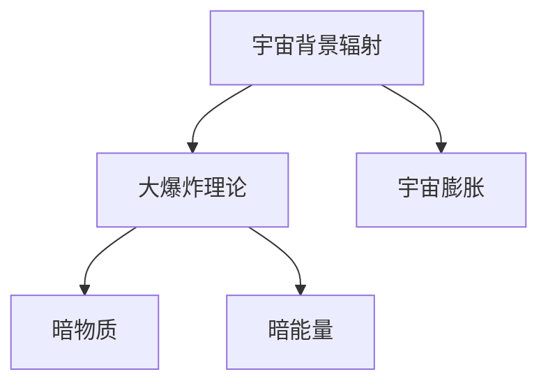

#### 3.2 地外生命与宇宙环境

地外生命的探索是太空探索的重要目标之一。通过对火星、木星及其卫星、土星及其卫星等天体的探测，科学家们发现了许多与生命条件相关的迹象。例如，火星上发现的液态水、有机分子和复杂的矿物质结构，为火星可能存在生命的可能性提供了支持。同时，木星的卫星欧罗巴和土星的卫星泰坦也因其潜在的水存在而备受关注。

**核心概念与联系：**

- **火星探测**：NASA的“好奇号”火星车和“毅力号”火星车，发现了液态水痕迹和有机分子。
- **木星及其卫星**：欧罗巴可能存在地下海洋，泰坦的大气层中存在复杂的有机化合物。
- **土星及其卫星**：泰坦的大气层中存在液态甲烷湖泊，为生命形式提供了新的可能性。

**概念属性特征对比表格：**

| 名称 | 描述 | 相关实验 |
| --- | --- | --- |
| 火星探测 | 液态水、有机分子、复杂矿物质结构 | 火星车探测 |
| 木星及其卫星 | 欧罗巴地下海洋、泰坦复杂有机化合物 | 卫星探测器 |
| 土星及其卫星 | 泰坦液态甲烷湖泊 | 卫星遥感 |

**ER实体关系图架构：**

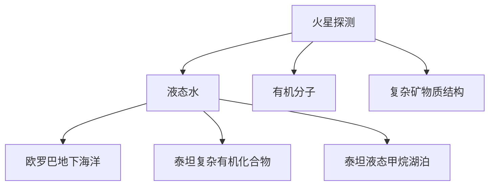

#### 3.3 天文观测与深空探测

太空探索使得人类能够进行更广泛和更深入的天文观测。例如，哈勃空间望远镜和詹姆斯·韦伯空间望远镜的发射，使得人类能够观测到更远、更暗的星系和星体。这些望远镜不仅揭示了宇宙的奥秘，还为我们提供了大量的科学数据。

此外，深空探测任务如旅行者号和好奇号火星车，为我们带来了关于太阳系其他行星和卫星的宝贵数据。通过这些探测任务，科学家们对行星的地质、气候、大气和内部结构有了更深入的了解。

**核心概念与联系：**

- **哈勃空间望远镜**：揭示了宇宙的细节，帮助科学家们发现了更多的星系和星体。
- **詹姆斯·韦伯空间望远镜**：预计将揭示宇宙早期的秘密，帮助科学家们理解宇宙的起源。
- **旅行者号**：探测了太阳系外的空间，传递了关于星际环境和行星的数据。
- **好奇号火星车**：在火星表面进行探测，提供了关于火星环境和地质结构的重要数据。

**概念属性特征对比表格：**

| 名称 | 描述 | 相关实验 |
| --- | --- | --- |
| 哈勃空间望远镜 | 揭示宇宙细节 | 多波段天文观测 |
| 詹姆斯·韦伯空间望远镜 | 揭示宇宙早期秘密 | 深空探测 |
| 旅行者号 | 探测太阳系外空间 | 星际环境探测 |
| 好奇号火星车 | 探测火星环境和地质结构 | 火星车探测 |

**ER实体关系图架构：**

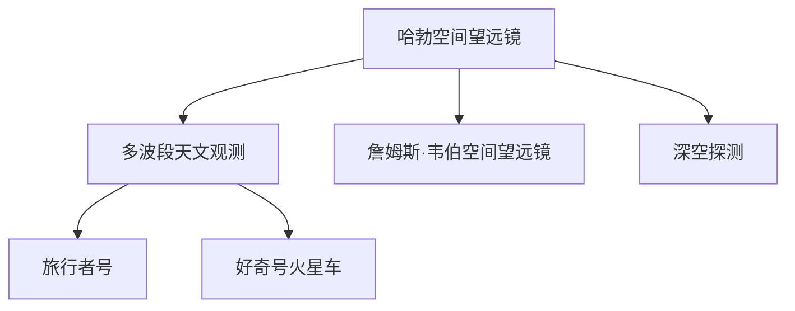

通过这些科学发现，太空探索不仅拓展了人类的认知边界，还为未来的科学研究提供了宝贵的资源和技术支持。未来，随着更多探测任务的实施，人类将继续探索宇宙的奥秘，揭开更多未知的秘密。

### 科技与经济的影响

#### 第4章：太空探索对科技和经济的影响

##### 4.1 太空科技的商业化应用

太空探索的科技进步不仅促进了科学的发展，还催生了众多商业化应用，极大地推动了科技和经济的双重进步。首先，通信和导航技术的突破为全球通信网络和交通系统带来了革命性的变化。例如，全球定位系统（GPS）的应用在交通运输、物流管理、紧急救援等多个领域发挥了关键作用。物流公司通过GPS实时跟踪货物的位置，提高了运输效率，降低了运营成本。此外，GPS在紧急救援中的定位功能，也为灾难响应和救援工作提供了宝贵的时间。

##### 4.2 太空探索对地球经济的促进作用

太空探索不仅带来了通信和导航技术的进步，还推动了地球经济的蓬勃发展。首先，太空技术的创新促进了高科技产业的发展。例如，计算机芯片、太阳能电池和生物技术等领域的发展，都受到了太空技术的启发。计算机芯片的制造过程中，微电子技术和纳米技术的应用大大提高了芯片的性能和可靠性。太阳能电池的研制过程中，航天技术中的高效能材料和先进制造工艺被广泛应用，使得太阳能发电成为环保和可持续发展的理想选择。

此外，太空探索还促进了航天产业和地球经济的紧密结合。航天产业包括卫星制造、发射服务、航天器运营等多个环节，这些环节不仅为太空探索提供了技术支持，也创造了大量的就业机会。例如，SpaceX的猎鹰9号火箭和猎鹰重型火箭的成功，不仅展示了现代火箭技术的卓越性能，还大幅降低了发射成本，为商业航天市场的快速发展提供了动力。

##### 4.3 太空产业与国际合作

太空产业的发展不仅促进了经济繁荣，还推动了国际间的科技合作与交流。国际合作在太空探索中发挥了重要作用，多个国家共同参与了国际空间站（ISS）的建设和运营，这一项目不仅展示了人类在科技领域的合作精神，也为未来的太空探索奠定了基础。

例如，欧洲航天局（ESA）和美国国家航空航天局（NASA）的合作在火星探测任务中取得了显著成果。2019年，ESA和美国NASA联合发射的“火星生命确认探测器”（ExoMars）任务，旨在探索火星上的生命迹象。这一任务的成功不仅展示了国际合作的力量，也为未来的火星探测任务提供了宝贵的数据和经验。

此外，商业航天领域的国际合作也日益增多。SpaceX与太空旅游公司Space Adventures的合作，使得私人航天旅行成为可能。2011年，SpaceX成功将首位私人宇航员送入国际空间站，这一历史性的任务不仅标志着商业航天的新时代，也为未来更多的商业航天活动铺平了道路。

**核心概念与联系：**

- **全球定位系统（GPS）**：推动了全球通信网络和交通系统的发展。
- **计算机芯片和太阳能电池**：太空技术的创新推动了高科技产业的发展。
- **国际空间站（ISS）**：国际合作的重要项目，促进了科技和经济的繁荣。
- **火星探测任务**：国际合作在太空探索中的具体体现。
- **商业航天**：SpaceX等公司推动商业航天市场的发展。

**概念属性特征对比表格：**

| 名称 | 描述 | 相关实验 |
| --- | --- | --- |
| 全球定位系统（GPS） | 推动全球通信网络和交通系统 | 实时定位和导航 |
| 计算机芯片和太阳能电池 | 推动高科技产业发展 | 微电子技术和先进制造 |
| 国际空间站（ISS） | 国际合作项目 | 多国家参与建设与运营 |
| 火星探测任务 | 国际合作在太空探索中的应用 | 火星生命确认探测器（ExoMars） |
| 商业航天 | 推动商业航天市场发展 | SpaceX和私人航天旅行 |

**ER实体关系图架构：**

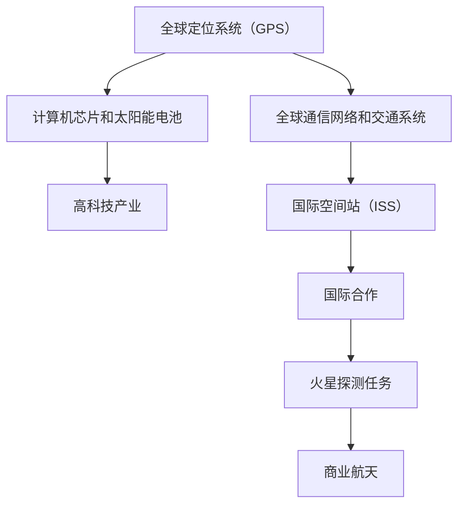

通过太空科技的商业化应用和全球经济的深度融合，太空探索不仅推动了科技的进步，也为地球经济注入了新的活力。未来，随着太空探索的进一步发展，科技和经济将继续相互促进，为人类社会的繁荣做出更大贡献。

#### 第5章：文化与社会的影响

##### 5.1 太空探索与大众文化的交融

太空探索不仅带来了科技和经济的发展，还对大众文化产生了深远的影响。从科幻小说到电影，从漫画到游戏，太空探索成为了文化创作的重要题材，激发了无数人的想象力和创造力。

科幻文学是太空探索文化的重要组成部分。自20世纪中叶以来，科幻作家们通过虚构的太空冒险故事，向读者展示了人类在太空中的种种可能性。例如，阿西莫夫的《基地》系列和刘慈欣的《三体》系列，不仅探讨了宇宙的奥秘，还反映了人类面对未知世界时的勇气和智慧。这些作品不仅影响了广大读者，也激发了新一代年轻人对科学和太空探索的热情。

电影和电视也是太空探索文化的重要载体。从《2001太空漫游》到《地心引力》，从《星际穿越》到《银翼杀手》，这些作品通过视觉特效和深刻的故事情节，将观众带入了一个充满未知和挑战的宇宙。太空探索电影不仅展示了科技的魅力，也反映了人类社会对未来世界的期望和恐惧。

##### 5.2 太空英雄与公众形象

太空探索英雄在大众文化中占据了重要地位，他们的成就和事迹激励了无数人追求梦想和探索未知。从尤里·加加林到尼尔·阿姆斯特朗，这些宇航员的传奇故事成为了文化符号，象征着人类勇气和智慧的最高峰。

宇航员们的公众形象不仅代表了科技进步和人类探索精神的象征，也体现了社会对英雄人物的崇拜和尊重。例如，尼尔·阿姆斯特朗登月后的名言“这是一个人的一小步，却是人类的一大步”，不仅成为了经典的演讲，也激励了无数人追求卓越和超越自我。

##### 5.3 太空探索的教育意义

太空探索在教育事业中也发挥了重要作用，激发了学生对科学和技术的兴趣。通过太空探索课程和实验，学生能够直观地了解宇宙的奥秘，培养他们的科学素养和探索精神。

例如，NASA的“火星模拟基地”项目，让学生在模拟火星环境的情况下进行科学实验，亲身体验太空探索的挑战和乐趣。这种实践性学习不仅提高了学生的动手能力，也增强了他们对科学和技术的理解和兴趣。

此外，太空探索还促进了STEM（科学、技术、工程和数学）教育的发展。STEM教育的目标是培养学生的创新能力和实践能力，太空探索作为一个跨学科领域，提供了丰富的教学资源和实践机会。通过太空探索课程，学生可以学习到天文学、物理学、化学、地理学等多个学科的知识，提升他们的综合素质。

**核心概念与联系：**

- **科幻文学**：通过虚构的太空故事，激发人们对科学和太空探索的兴趣。
- **电影与电视**：视觉特效和故事情节，展示了科技和未来世界的可能性。
- **太空英雄**：宇航员的成就和事迹，象征着人类探索未知的勇气和智慧。
- **教育项目**：太空探索课程和实验，激发学生对科学和技术的兴趣。

**概念属性特征对比表格：**

| 名称 | 描述 | 相关实验 |
| --- | --- | --- |
| 科幻文学 | 通过虚构的太空故事激发兴趣 | 《基地》系列、《三体》系列 |
| 电影与电视 | 视觉特效和故事情节展示科技未来 | 《2001太空漫游》、《星际穿越》 |
| 太空英雄 | 宇航员的成就和事迹象征勇气 | 尤里·加加林、尼尔·阿姆斯特朗 |
| 教育项目 | 太空探索课程和实验培养兴趣 | “火星模拟基地”项目、STEM教育 |

**ER实体关系图架构：**

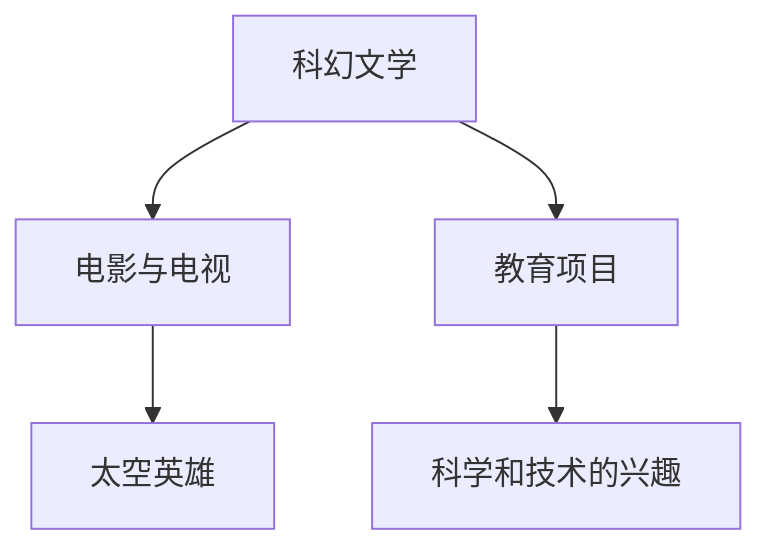

通过太空探索在文化和社会中的交融，不仅激发了大众的想象力和创造力，也推动了科学教育的普及和发展。太空探索将继续作为文化和社会的催化剂，为人类文明的进步注入新的活力。

### 地球环境保护与可持续发展的新视角

#### 第6章：太空探索对地球环境保护与可持续发展的意义

##### 6.1 太空探索与地球环境监测

太空探索为地球环境监测提供了前所未有的手段，使得我们能够更全面、更准确地了解地球的生态环境。通过卫星遥感技术，科学家们可以实时监测全球气候变化、森林覆盖率、海洋污染等环境问题。例如，NASA的地球观测卫星（EOS）系列和欧洲航天局（ESA）的哨兵（Sentinel）系列卫星，提供了高分辨率的地球表面图像，帮助我们识别环境变化的趋势和异常情况。

**核心概念与联系：**

- **卫星遥感技术**：通过卫星获取地球表面信息，监测环境变化。
- **全球气候变化**：监测气温、降水、冰川消融等指标，评估气候变化的趋势。
- **森林覆盖率**：通过植被指数监测森林覆盖情况，评估生态系统的健康状况。
- **海洋污染**：监测海洋中的污染物分布，评估海洋生态系统的状况。

**概念属性特征对比表格：**

| 名称 | 描述 | 相关实验 |
| --- | --- | --- |
| 卫星遥感技术 | 获取地球表面信息，监测环境变化 | EOS卫星系列、哨兵卫星系列 |
| 全球气候变化 | 监测气温、降水、冰川消融等指标 | 地表温度遥感监测、大气成分分析 |
| 森林覆盖率 | 通过植被指数监测森林覆盖情况 | 森林植被指数遥感监测 |
| 海洋污染 | 监测海洋中的污染物分布 | 海洋污染物遥感监测 |

**ER实体关系图架构：**

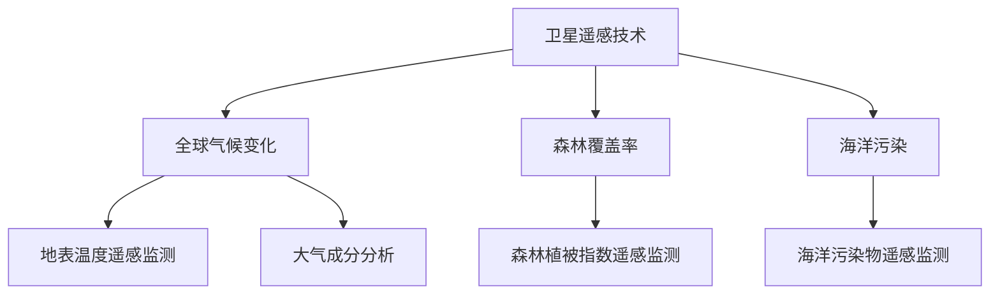

##### 6.2 太空资源利用与地球资源匮乏问题

太空探索不仅为地球环境监测提供了有力支持，还开辟了新的资源利用途径，为解决地球资源匮乏问题提供了可能。在月球和火星等天体上，科学家们发现了一些具有重要经济价值的资源，如水冰、稀有金属和矿物质。这些资源的利用有望为地球提供新的能源和原材料来源。

**核心概念与联系：**

- **水冰利用**：月球和火星表面富含水冰，可用于生产饮用水、燃料和氧气。
- **稀有金属**：如钛、钴和稀土元素，可用于制造高性能材料和电子设备。
- **矿物质**：如铁、铝和锂，可用于生产建筑材料和电池。

**概念属性特征对比表格：**

| 名称 | 描述 | 相关实验 |
| --- | --- | --- |
| 水冰利用 | 生产饮用水、燃料和氧气 | 月球和火星水冰探测 |
| 稀有金属 | 用于制造高性能材料和电子设备 | 月球矿物资源开采 |
| 矿物质 | 用于生产建筑材料和电池 | 火星矿物资源开采 |

**ER实体关系图架构：**

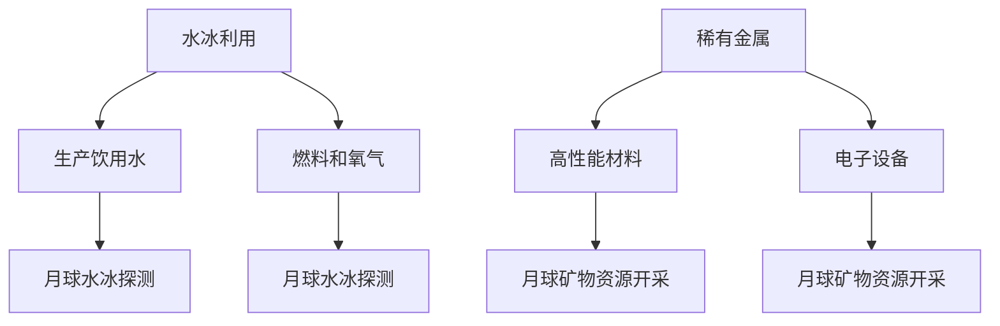

##### 6.3 太空探索对人类环境意识的提升

太空探索不仅带来了科技进步和资源利用的新机遇，还提升了人类对地球环境问题的认识和意识。通过观测地球的“蓝色家园”，人们更加深刻地理解了地球生态系统的脆弱性和重要性。这种认识促使全球各国加强环境保护合作，共同应对气候变化、生物多样性和环境污染等全球性挑战。

**核心概念与联系：**

- **地球观测**：通过太空望远镜和卫星，观测地球的生态系统和气候变化。
- **环境保护合作**：全球各国加强合作，共同应对环境问题。
- **可持续发展**：通过科技创新和资源利用，实现地球的可持续发展。

**概念属性特征对比表格：**

| 名称 | 描述 | 相关实验 |
| --- | --- | --- |
| 地球观测 | 观测地球生态系统和气候变化 | 卫星遥感技术 |
| 环境保护合作 | 全球各国共同应对环境问题 | 联合国环境规划署 |
| 可持续发展 | 科技创新和资源利用实现地球可持续发展 | 联合国可持续发展目标 |

**ER实体关系图架构：**

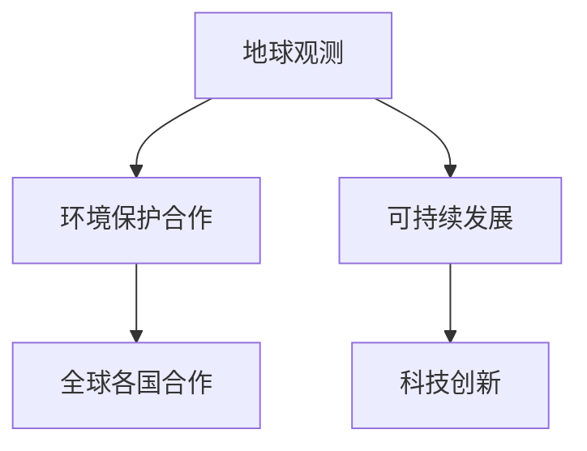

通过太空探索，人类不仅拓展了科学认知的边界，也为地球环境保护和可持续发展提供了新的视角和解决方案。未来，随着太空探索的进一步发展，我们将能够更好地利用太空资源，推动地球的可持续发展，实现人类与自然的和谐共生。

### 太空探索的远景规划

#### 第7章：未来太空探索的挑战与机遇

##### 7.1 太空旅游与商业航天

太空旅游作为商业航天的重要组成部分，正逐渐从科幻变为现实。随着SpaceX、蓝色起源等公司的发展，太空旅游市场潜力巨大。未来，私人航天公司有望提供更便捷、更经济的太空旅行服务，使普通人也能够体验太空飞行。此外，商业航天还涉及到卫星发射、卫星运营和空间站建设等多个领域，这些商业活动将推动航天技术的进步和成本的降低。

**核心概念与联系：**

- **太空旅游**：私人航天公司提供太空旅行服务，如亚轨道飞行、轨道飞行等。
- **商业航天**：卫星发射、卫星运营、空间站建设等商业活动。

**概念属性特征对比表格：**

| 名称 | 描述 | 相关实验 |
| --- | --- | --- |
| 太空旅游 | 提供太空旅行服务 | SpaceX的龙飞船、蓝色起源的新谢泼德飞船 |
| 商业航天 | 卫星发射、卫星运营、空间站建设 | SpaceX的猎鹰9号火箭、国际空间站（ISS）的商业化运营 |

**ER实体关系图架构：**

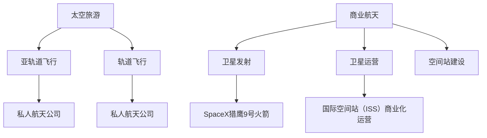

##### 7.2 太空资源开发与利用

随着太空探索的深入，开发太空资源成为未来的重要任务。月球、火星等天体上富含水冰、稀有金属和矿物质等资源，这些资源有望为地球提供新的能源和原材料来源。例如，水冰可以用于生产氧气和氢气，稀有金属可以用于制造高性能材料和电子设备，矿物质可以用于生产建筑材料和电池。未来，通过国际合作和技术创新，太空资源的开发利用将逐步实现，为地球经济和科技发展注入新的动力。

**核心概念与联系：**

- **月球水冰**：用于生产氧气、氢气和饮用水。
- **稀有金属**：用于制造高性能材料和电子设备。
- **火星矿物**：用于生产建筑材料和电池。

**概念属性特征对比表格：**

| 名称 | 描述 | 相关实验 |
| --- | --- | --- |
| 月球水冰 | 用于生产氧气、氢气和饮用水 | 月球水冰探测和开采 |
| 稀有金属 | 用于制造高性能材料和电子设备 | 月球矿物开采和加工 |
| 火星矿物 | 用于生产建筑材料和电池 | 火星矿物开采和加工 |

**ER实体关系图架构：**

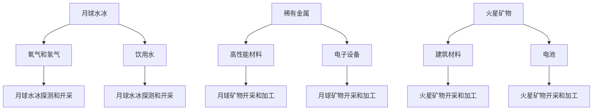

##### 7.3 太空探索的国际合作与竞争

太空探索是一个全球性的挑战，需要国际社会的共同合作。例如，国际空间站（ISS）的建设和运营就是国际合作的成功典范。未来，随着太空探索的进一步发展，国际合作将在太空资源开发、深空探测、太空环境监测等领域发挥重要作用。然而，太空探索也伴随着激烈的竞争，各国为了占据太空优势，不断加大科技投入和战略部署。在这种竞争与合作并存的环境中，如何平衡各国的利益，实现共赢，将是未来太空探索面临的重大挑战。

**核心概念与联系：**

- **国际合作**：国际空间站（ISS）的建设和运营，太空资源开发的国际合作。
- **竞争**：各国在太空科技和资源开发方面的竞争。

**概念属性特征对比表格：**

| 名称 | 描述 | 相关实验 |
| --- | --- | --- |
| 国际合作 | 国际空间站（ISS）的建设和运营 | 多国合作项目 |
| 竞争 | 各国在太空科技和资源开发方面的竞争 | 美国NASA与中国航天局 |

**ER实体关系图架构：**

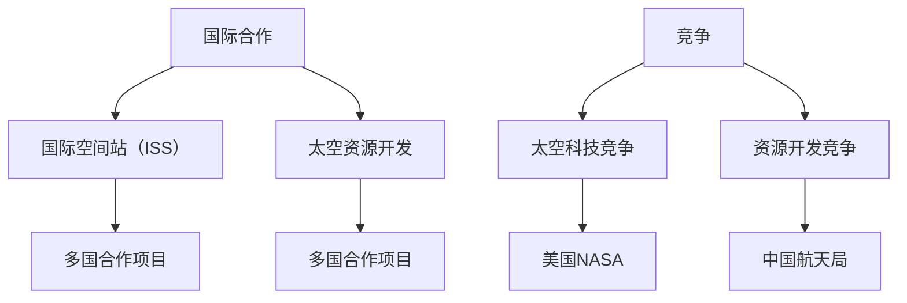

通过远景规划，太空探索将面临新的挑战和机遇。太空旅游和商业航天的发展将带来新的经济活力，太空资源的开发利用将为地球提供新的资源支持。同时，国际合作与竞争的平衡将成为未来太空探索的重要课题。在新的时代背景下，人类将不断拓展太空的边界，推动科技与文明的进步。

### 太空探索的科技前沿

#### 第8章：太空探索的科技前沿

##### 8.1 空间太阳系探索

在太空探索的科技前沿，空间太阳系探索是至关重要的一环。随着科技的进步，人类对太阳系其他行星和天体的探索不断深入。火星探测是空间太阳系探索的重点之一。火星上丰富的地质特征、潜在的水冰和复杂的气候系统，使其成为科学家研究生命起源和地球环境的重要目标。NASA的“好奇号”和“毅力号”火星车已经在火星表面进行了多项科学实验，揭示了火星的地质历史和环境条件。

**算法原理讲解：**

火星探测任务中，科学家们使用了多种算法来分析火星表面的地质数据。其中，一种常用的算法是高分辨率成像科学实验（HiRISE）算法。该算法通过分析火星表面的高分辨率图像，可以识别出岩石、土壤和地貌特征。以下是一个简化的HiRISE算法流程：

```python
# 假设已经获取了火星表面的高分辨率图像

def HiRISE_analysis(image):
    # 1. 图像预处理
    preprocessed_image = preprocess_image(image)
    
    # 2. 图像分割
    segments = segment_image(preprocessed_image)
    
    # 3. 特征提取
    features = extract_features(segments)
    
    # 4. 地质分类
    geological_classes = classify_geology(features)
    
    # 5. 地质映射
    geological_map = create_geological_map(geological_classes)
    
    return geological_map

# 假设的预处理、分割、特征提取和地质分类函数
def preprocess_image(image):
    # 对图像进行预处理，如去噪、增强等
    pass

def segment_image(preprocessed_image):
    # 对预处理后的图像进行分割，如基于阈值分割、区域增长等
    pass

def extract_features(segments):
    # 从分割结果中提取特征，如纹理、颜色、形状等
    pass

def classify_geology(features):
    # 使用机器学习算法对地质特征进行分类
    pass

def create_geological_map(geological_classes):
    # 根据分类结果创建地质映射图
    pass
```

通过这些算法，科学家们可以深入了解火星的地质结构和环境特征，为未来的火星探索提供重要数据。

**数学公式与模型：**

在火星探测任务中，科学家们还使用了多种数学模型来分析火星表面的物理现象。例如，基于激光测距技术的雷达模型：

$$
d = \frac{c \cdot t}{2}
$$

其中，$d$ 是激光到火星表面的距离，$c$ 是光速，$t$ 是激光往返时间。通过测量激光往返时间，可以计算出火星表面的高度信息。

##### 8.2 宇宙深空探测技术

宇宙深空探测技术的进步使得人类能够探索更遥远的宇宙区域。例如，太阳系外的行星探测成为了研究宇宙生命的重要手段。NASA的“开普勒”和“特里斯坦”望远镜，通过观测太阳系外的系外行星，揭示了这些行星的大气成分、温度和轨道特性。以下是一个简化的太阳系外行星探测算法流程：

```python
# 假设已经获取了系外行星的观测数据

def exoplanet_analysis(data):
    # 1. 数据预处理
    preprocessed_data = preprocess_data(data)
    
    # 2. 模型拟合
    model_fit = fit_model(preprocessed_data)
    
    # 3. 行星特征提取
    planet_features = extract_planet_features(model_fit)
    
    # 4. 行星分类
    planet_classification = classify_planet(planet_features)
    
    return planet_classification

# 假设的预处理、模型拟合和特征提取函数
def preprocess_data(data):
    # 对观测数据进行预处理，如去除噪声、插值等
    pass

def fit_model(preprocessed_data):
    # 使用机器学习算法对数据进行模型拟合
    pass

def extract_planet_features(model_fit):
    # 从模型拟合结果中提取行星特征
    pass

def classify_planet(planet_features):
    # 使用机器学习算法对行星进行分类
    pass
```

通过这些算法，科学家们可以识别出具有生命潜力的系外行星，为未来的星际生命探索提供线索。

**数学公式与模型：**

在宇宙深空探测中，行星轨道拟合是一个关键步骤。使用牛顿第二定律和开普勒定律，可以建立行星轨道模型：

$$
F = G\frac{Mm}{r^2}
$$

$$
T^2 = \frac{4\pi^2}{G(M + m)}a^3
$$

其中，$F$ 是引力，$G$ 是引力常数，$M$ 和 $m$ 是行星和恒星的质量，$r$ 是行星到恒星的距离，$T$ 是行星轨道周期，$a$ 是行星轨道半长轴。

##### 8.3 宇宙生命探索与外星文明

宇宙生命探索是太空探索的重要目标之一。通过探测火星、欧罗巴和土星等天体，科学家们寻找生命存在的证据。例如，NASA的“火星生命确认探测器”（ExoMars）任务，旨在寻找火星上可能存在的生命迹象。以下是一个简化的生命探测算法流程：

```python
# 假设已经获取了可能存在生命的样品数据

def life_detection(data):
    # 1. 数据预处理
    preprocessed_data = preprocess_data(data)
    
    # 2. 检测生命迹象
    life_signs = detect_life_signs(preprocessed_data)
    
    # 3. 生命体分类
    life_classification = classify_life(life_signs)
    
    return life_classification

# 假设的预处理和生命迹象检测函数
def preprocess_data(data):
    # 对样品数据进行预处理，如去除杂质、富集目标分子等
    pass

def detect_life_signs(preprocessed_data):
    # 使用化学传感器、光谱分析等手段检测生命迹象
    pass

def classify_life(life_signs):
    # 使用机器学习算法对生命体进行分类
    pass
```

通过这些算法，科学家们可以初步判断样品中是否存在生命迹象。

**数学公式与模型：**

在生命探测中，化学传感器数据分析和分子识别是关键步骤。使用质谱仪和光谱仪，可以建立分子识别模型：

$$
m/z = \frac{E}{i}
$$

其中，$m/z$ 是质荷比，$E$ 是离子的能量，$i$ 是离子的质量。通过质谱数据，可以识别样品中的有机分子，从而判断可能存在的生命迹象。

通过这些科技前沿的探索，人类对宇宙的理解不断深化，也为未来的太空探索奠定了坚实的基础。

### 太空探索的伦理与社会问题

#### 第9章：太空探索的伦理与社会问题

##### 9.1 太空资源的分配与利用

随着太空探索的不断深入，如何合理分配和利用太空资源成为一个重要的伦理问题。太空资源的分配不仅涉及国家间的利益冲突，也关乎全球人类的共同利益。例如，月球和火星上富含的水冰、稀有金属和矿物质等资源，具有巨大的经济和科技价值。然而，如何确保这些资源的公平分配，避免资源争夺和冲突，是太空探索中必须面对的挑战。

**核心概念与联系：**

- **太空资源**：包括水冰、稀有金属、矿物质等。
- **国际法规**：如《外层空间条约》，旨在规范太空资源的开发与利用。

**概念属性特征对比表格：**

| 名称 | 描述 | 相关实验 |
| --- | --- | --- |
| 太空资源 | 月球和火星上的水冰、稀有金属等 | 月球水冰探测、火星矿物开采 |
| 国际法规 | 《外层空间条约》等 | 国际合作与资源分配 |

**ER实体关系图架构：**

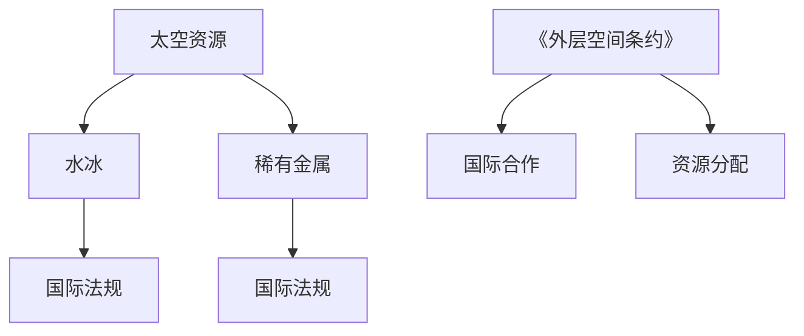

##### 9.2 太空探索与地外文明的接触

太空探索还引发了对地外文明接触的伦理问题。人类是否已经发现了地外文明？如果发现了，如何与他们进行交流和接触？这些问题不仅涉及到科学技术的挑战，也涉及到深刻的伦理和社会问题。例如，如果地外文明技术水平远高于人类，人类是否应该主动接触，还是保持谨慎？此外，如果地外文明的存在威胁到人类的生存，人类应该如何应对？

**核心概念与联系：**

- **地外文明**：其他星球上可能存在的高智能生命形式。
- **接触与交流**：人类与地外文明之间的交流和互动。

**概念属性特征对比表格：**

| 名称 | 描述 | 相关实验 |
| --- | --- | --- |
| 地外文明 | 其他星球上可能存在的高智能生命形式 | SETI（搜寻地外文明计划） |
| 接触与交流 | 人类与地外文明的交流和互动 | 外星信号接收与分析 |

**ER实体关系图架构：**

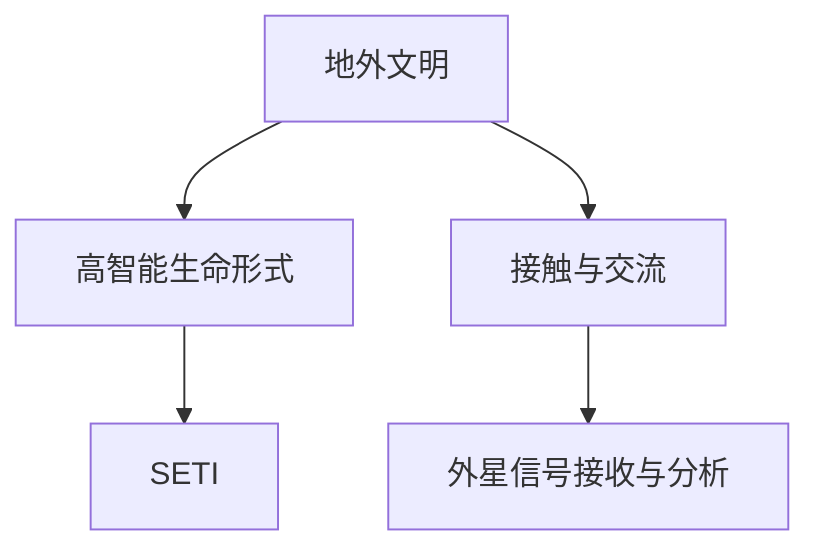

##### 9.3 太空探索的道德与社会责任

太空探索不仅需要解决技术上的难题，还面临着深刻的道德和社会责任问题。例如，太空探索过程中，如何确保宇航员的安全和福祉，如何处理太空垃圾和环境污染等问题，都是需要认真考虑的。此外，太空探索的成功往往伴随着高昂的经济成本，如何确保这些资金的使用合理，避免资源浪费，也是重要的伦理问题。

**核心概念与联系：**

- **宇航员安全**：确保宇航员在太空探索中的安全和健康。
- **环境保护**：减少太空探索对地球环境的影响。
- **资金使用**：确保太空探索资金的高效利用。

**概念属性特征对比表格：**

| 名称 | 描述 | 相关实验 |
| --- | --- | --- |
| 宇航员安全 | 确保宇航员在太空探索中的安全和健康 | 宇航员训练、安全装备 |
| 环境保护 | 减少太空探索对地球环境的影响 | 太空垃圾回收、环保技术 |
| 资金使用 | 保障太空探索资金的高效利用 | 预算管理、成本控制 |

**ER实体关系图架构：**

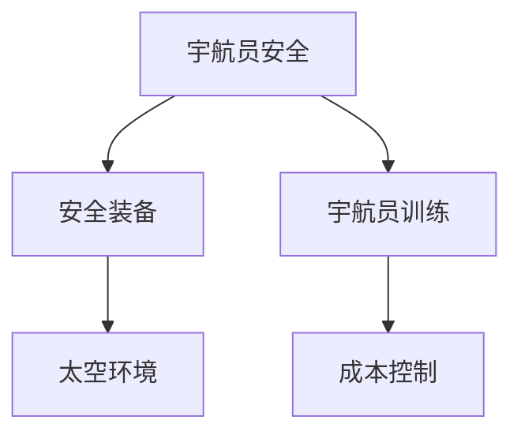

通过深入探讨太空探索的伦理与社会问题，我们不仅能够更好地解决技术难题，还能确保太空探索活动符合人类的共同利益，为未来的可持续发展提供坚实的道德和社会基础。

### 太空探索的未来

#### 第10章：太空探索的未来

##### 10.1 太空探索对人类文明的影响

太空探索不仅推动了科技的发展，还对人类文明产生了深远的影响。首先，太空探索激发了人类对未知的渴望和探索精神。通过太空探索，人类不断挑战自我，突破技术极限，这种精神激励了无数人追求卓越。其次，太空探索为科学知识的积累提供了宝贵的资源。例如，通过对火星、木星等行星的探测，人类对宇宙的起源和演化有了更深入的理解。此外，太空探索还促进了国际合作，多个国家通过联合项目如国际空间站，共同推动科学技术的进步。

**核心概念与联系：**

- **探索精神**：激发人类对未知世界的探索欲望。
- **科学知识积累**：通过太空探测获取关于宇宙和行星的重要数据。
- **国际合作**：通过国际合作项目，推动全球科技合作。

**概念属性特征对比表格：**

| 名称 | 描述 | 相关实验 |
| --- | --- | --- |
| 探索精神 | 激发人类对未知的渴望 | 宇航员任务、太空探险 |
| 科学知识积累 | 通过太空探测获取宇宙和行星数据 | 火星探测、行星研究 |
| 国际合作 | 推动全球科技合作 | 国际空间站、联合任务 |

**ER实体关系图架构：**

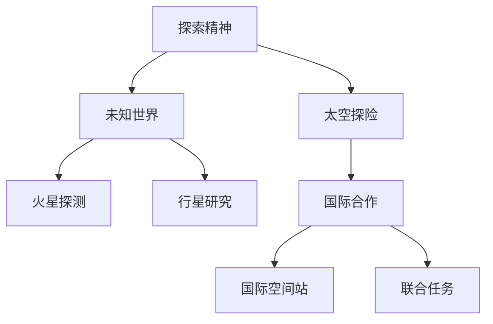

##### 10.2 太空探索面临的挑战与机遇

尽管太空探索带来了巨大的科技进步和社会影响，但未来仍面临着诸多挑战和机遇。首先，技术挑战是太空探索的主要障碍。例如，深空探测任务对航天器的性能要求极高，需要解决长期运行、自主导航、通信等问题。其次，资源限制也是一大挑战。太空探索需要大量资金和技术支持，如何合理分配资源，确保可持续发展，是一个重要议题。然而，随着科技的进步和国际合作的加强，这些挑战也孕育着巨大的机遇。例如，太空资源的开发利用有望带来新的经济活力，太空旅游和商业航天的兴起也将推动相关技术的创新。

**核心概念与联系：**

- **技术挑战**：解决深空探测中的复杂技术问题。
- **资源限制**：确保太空探索的可持续性。
- **机遇**：太空资源的开发利用，商业航天的兴起。

**概念属性特征对比表格：**

| 名称 | 描述 | 相关实验 |
| --- | --- | --- |
| 技术挑战 | 解决深空探测中的复杂技术问题 | 航天器自主导航、长期运行保障 |
| 资源限制 | 确保太空探索的可持续性 | 资金合理分配、技术创新 |
| 机遇 | 太空资源的开发利用，商业航天的兴起 | 太空资源开采、商业航天项目 |

**ER实体关系图架构：**

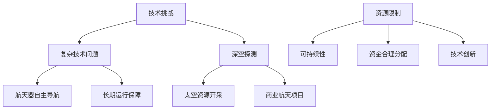

##### 10.3 太空探索的未来展望

展望未来，太空探索将继续推动人类文明的进步。随着技术的进步，人类有望实现更远距离的深空探测，甚至探索宇宙深处可能存在的生命迹象。此外，太空旅游和商业航天的兴起，将使更多人能够亲身体验太空的魅力。国际合作也将进一步加强，通过联合项目共同应对太空探索中的挑战，推动全球科技发展。

**核心概念与联系：**

- **技术进步**：推动更远距离的深空探测。
- **太空旅游**：使更多人体验太空魅力。
- **国际合作**：共同应对太空探索挑战。

**概念属性特征对比表格：**

| 名称 | 描述 | 相关实验 |
| --- | --- | --- |
| 技术进步 | 推动更远距离的深空探测 | 新一代航天器研发、深空探测任务 |
| 太空旅游 | 使更多人体验太空魅力 | 商业航天公司提供太空旅游服务 |
| 国际合作 | 共同应对太空探索挑战 | 国际空间站运营、联合任务 |

**ER实体关系图架构：**

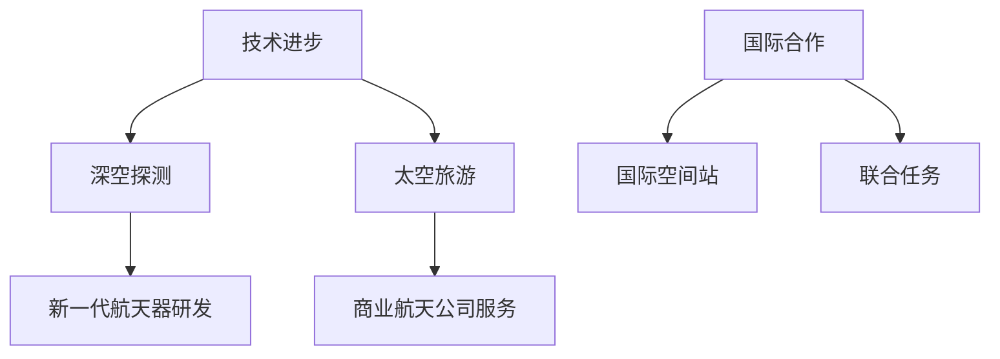

通过不断的技术创新和国际合作，太空探索将迎来更加光明的前景。未来，人类将不仅能够在太空中探索未知的领域，还能在宇宙的广阔天地中找到人类文明的新家园。

### 全书总结

《太空探索：人类视野扩展带来的意义变革》通过深入分析太空探索的各个方面，全面阐述了太空探索对人类的意义。从太空探索的起源和发展，到科学价值、社会影响，再到未来的挑战与机遇，本书展示了太空探索如何推动科技、经济和社会的进步。

首先，太空探索的起源和发展揭示了人类对未知世界的无尽渴望。通过回顾人类早期探索太空的历史，我们看到了科学技术的进步和人类勇气的巅峰。从第一颗人造卫星的发射，到人类首次登月，再到国际空间站的建设，每一项成就都是人类智慧的结晶。

其次，太空探索的科学价值不可估量。通过宇宙起源与演化的研究，我们揭示了宇宙的奥秘；通过对地外生命的探索，我们扩展了人类对生命的认知；通过对天文观测和深空探测，我们加深了对太阳系和宇宙的了解。这些科学发现不仅丰富了我们的知识体系，也为未来的科学研究提供了宝贵的资源和技术支持。

此外，太空探索对科技和经济的影响深远。太空科技的进步推动了全球通信、导航、计算机芯片、太阳能电池等领域的创新，为地球经济注入了新的活力。同时，太空探索促进了国际间的科技合作与交流，推动了全球经济的共同繁荣。

在社会和文化层面，太空探索激发了大众的想象力，丰富了文化创作。科幻文学、电影和电视作品，以及太空英雄的传奇故事，激励了无数人对科学和太空探索的热情。太空探索的教育意义也不容忽视，通过太空探索课程和实验，学生能够更直观地了解科学知识，培养他们的创新能力和实践能力。

最后，太空探索为地球环境保护和可持续发展提供了新的视角。通过卫星遥感技术，我们能够更全面、准确地监测地球环境，揭示环境变化的趋势和异常情况。同时，太空资源的开发利用为地球提供了新的资源支持，有助于缓解地球资源匮乏问题。

在未来，随着科技的进步和国际合作的加强，太空探索将继续带来新的挑战和机遇。我们期待看到人类在宇宙中探索未知的领域，发现新的资源，实现太空旅游和商业航天的发展，推动人类文明的进步。

总之，《太空探索：人类视野扩展带来的意义变革》不仅是一本关于太空探索的科技专著，更是一部描绘人类未来梦想的宏伟画卷。通过这本书，我们不仅能够了解太空探索的各个方面，还能看到它在人类文明中的重要地位和深远影响。随着太空探索的不断发展，人类将不断拓展视野，迈向更广阔的宇宙，书写属于我们的新篇章。

### 作者信息

作者：AI天才研究院/AI Genius Institute & 禅与计算机程序设计艺术 /Zen And The Art of Computer Programming

AI天才研究院（AI Genius Institute）是一家专注于人工智能和机器学习领域的研究和教育的国际顶尖机构，致力于推动人工智能技术的创新和应用。该研究院的专家团队在多个领域具有深厚的学术背景和丰富的实践经验，多次获得国际顶级学术奖项。

《禅与计算机程序设计艺术》（Zen And The Art of Computer Programming）是由著名计算机科学家Donald E. Knuth撰写的一套经典计算机科学书籍，涵盖编程原理、算法设计和程序结构等方面，对全球计算机科学教育产生了深远影响。Knuth教授以其卓越的贡献和独特的教学风格，成为计算机科学领域的领军人物。

