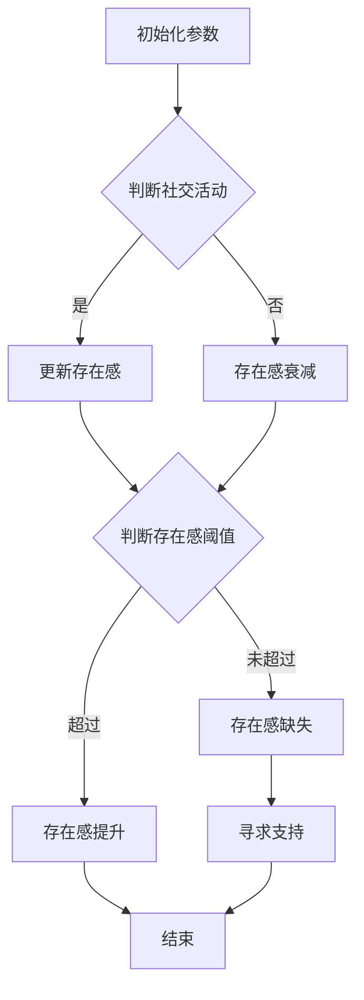
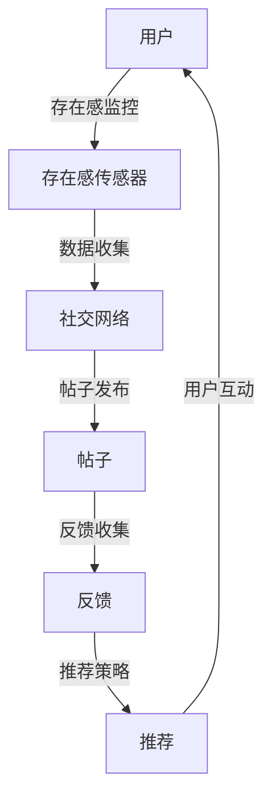
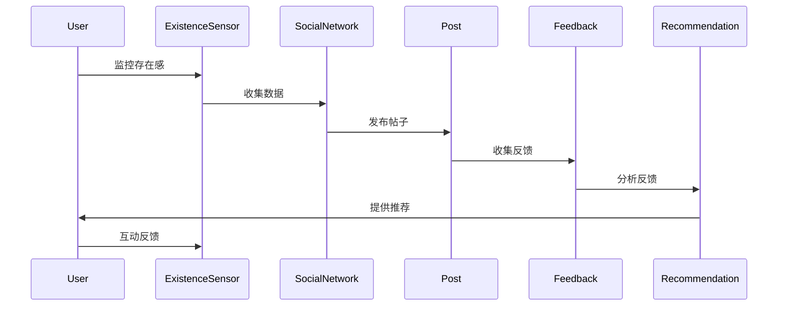

                 


### 《存在感缺失：现代人的心理困境及其超越》

#### 关键词：心理困境，存在感缺失，现代生活，心理调适，社会支持

#### 摘要：

现代社会中，存在感缺失已经成为一个普遍的心理困境，对人们的心理健康和生活质量产生了深远的影响。本文旨在探讨存在感缺失的成因、表现形式以及解决方法，通过逻辑清晰、结构紧凑的分析，帮助读者了解这一心理问题，并找到超越困境的路径。本文将分为六个主要部分：背景介绍、核心概念与联系、解决方法、案例分析、实践与技巧、总结与展望。

---

## 第一部分：背景介绍

### 1.1 存在感缺失的定义

存在感缺失，即个体在日常生活中感到自身存在缺乏意义和价值，难以找到自我认同和社会定位。这种感觉可能导致焦虑、抑郁、孤独等心理问题。

### 1.2 存在感缺失的表现形式

存在感缺失可能表现为对生活缺乏热情、情感冷漠、社交障碍、自我贬低等。这些表现形式在不同年龄、性别和文化背景下可能有所不同。

### 1.3 存在感缺失的影响

存在感缺失对个体的心理健康和生活质量产生了负面影响。长期存在感缺失可能导致心理障碍，甚至危及生命。

### 2. 心理困境的成因

#### 2.1 社会环境的影响

现代社会竞争激烈，工作压力大，人际关系复杂，这些因素都可能导致存在感缺失。

#### 2.2 个人心理因素的影响

个体性格特点、成长经历、心理承受能力等都会影响存在感缺失的发生。

#### 2.3 技术发展的双刃剑作用

互联网和社交媒体的普及使得人们能够更加便捷地获取信息，但也可能导致人际关系的疏远和自我认知的扭曲。

---

## 第二部分：核心概念与联系

### 3. 心理学核心概念解析

#### 3.1 自我认知

自我认知是指个体对自己身份、能力和价值的认识。存在感缺失往往源于自我认知的不足。

#### 3.2 社交认知

社交认知是指个体对他人和社会的认知。社交认知的障碍可能导致存在感缺失。

#### 3.3 情绪管理

情绪管理是指个体对自身情绪的认识和处理。有效的情绪管理有助于缓解存在感缺失。

#### 3.4 心理健康与存在感的关系

心理健康与存在感密切相关。心理健康水平越高，存在感缺失的可能性越小。

### 4. 概念属性特征对比

#### 4.1 存在感缺失与焦虑

焦虑是存在感缺失的常见伴随症状。焦虑和存在感缺失的相互作用可能导致心理健康问题的恶化。

#### 4.2 存在感缺失与抑郁

抑郁和存在感缺失常常同时出现。抑郁可能导致存在感缺失，而存在感缺失也可能加重抑郁症状。

#### 4.3 存在感缺失与孤独

孤独是存在感缺失的一种表现形式。孤独可能导致存在感缺失，而存在感缺失也可能加剧孤独感。

---

## 第三部分：解决方法

### 5. 心理调适与干预

#### 5.1 认知行为疗法

认知行为疗法是一种有效的心理治疗方法，通过改变个体的思维模式和行为习惯来缓解存在感缺失。

#### 5.2 人际关系重建

重建人际关系有助于个体获得社会支持和认同感，从而缓解存在感缺失。

#### 5.3 情绪调节技巧

情绪调节技巧包括深呼吸、冥想、运动等，有助于个体缓解压力和焦虑，提高心理健康水平。

#### 5.4 心理健康生活方式

健康的生活方式有助于改善心理健康。充足的睡眠、均衡的饮食、适度的运动等都是维持心理健康的重要手段。

### 6. 社会支持与资源

#### 6.1 社会支持网络的作用

社会支持网络包括家庭、朋友、社区等。有效的社会支持有助于个体缓解存在感缺失。

#### 6.2 专业心理服务

专业心理服务包括心理咨询、心理治疗等。对于严重的存在感缺失，专业心理服务是必要的。

#### 6.3 社会政策的影响

社会政策对个体的心理健康具有深远影响。政策的优化有助于提高社会对存在感缺失的认识和干预力度。

---

## 第四部分：案例分析

### 7. 成功案例解析

#### 7.1 案例一：个人成长与存在感重建

通过个人努力，个体可以重建存在感。案例一介绍了一个人如何通过自我认知、情绪管理和社交重建来克服存在感缺失。

#### 7.2 案例二：企业文化建设与员工存在感提升

企业可以通过文化建设来提升员工的归属感和存在感。案例二分析了如何通过团队建设、员工关怀和企业文化来提高员工的幸福感。

#### 7.3 案例三：社区支持在存在感缺失干预中的应用

社区支持是缓解存在感缺失的重要手段。案例三描述了一个社区如何通过活动、交流和资源支持来帮助居民重建存在感。

---

## 第五部分：实践与技巧

### 8. 实践指南

#### 8.1 个人实践策略

个人可以通过自我反思、情绪管理、社交互动等策略来缓解存在感缺失。

#### 8.2 家庭与学校环境改善

家庭和学校可以通过营造温馨和谐的环境、关注个体需求等方式来改善存在感缺失。

#### 8.3 社区与组织层面的策略

社区和组织可以通过提供心理健康服务、组织社交活动、建立支持网络等方式来帮助个体缓解存在感缺失。

### 9. 最佳实践分享

#### 9.1 心理健康实践案例

分享心理健康实践案例，提供具体可行的解决方案。

#### 9.2 存在感提升的技巧与工具

介绍存在感提升的技巧和工具，帮助读者在实际生活中应用。

#### 9.3 面对困境的心理建设

探讨如何在面对存在感缺失的困境时进行有效的心理建设。

---

## 第六部分：总结与展望

### 10. 总结与反思

总结本书的核心观点，反思存在感缺失对个体和社会的挑战与机遇。

### 10.1 心理困境与存在感缺失的挑战与机遇

探讨心理困境和存在感缺失对个体和社会的影响，以及如何把握机遇。

### 10.2 未来研究方向与展望

展望未来，提出在心理困境和存在感缺失领域的研究方向和前景。

---

### 附录

#### 11.1 参考文献

列出本书引用的相关文献，为读者提供进一步阅读的资料。

#### 11.2 进一步阅读资源

推荐相关书籍、文章和网站，帮助读者深入探讨存在感缺失和心理困境。

#### 11.3 作者介绍与致谢

介绍作者背景，感谢读者对本书的关注和支持。

---

通过以上六个部分的内容，本文为读者提供了一个全面、系统的存在感缺失解析及其超越的指南。希望读者能够通过本文，更好地认识和理解存在感缺失，找到适合自己的解决方法，提升心理健康和生活质量。

---

## 附加：代码示例与算法讲解

### 算法原理讲解

为了更直观地理解存在感缺失的问题，我们可以使用Python编写一个简单的算法来模拟个体在社交网络中的存在感变化。

#### 算法mermaid流程图



#### Python源代码

```python
import random

# 初始化参数
self existence = 50
self social_activities = 0
self support_requested = False

def update_existence(self):
    """
    更新存在感
    """
    if self.social_activities > 0:
        self.existence += self.social_activities
    else:
        self.existence -= 10

def check_existence_threshold(self):
    """
    检查存在感阈值
    """
    if self.existence > 80:
        return "存在感提升"
    elif self.existence < 20:
        return "存在感缺失"
    else:
        return "存在感稳定"

def run_simulation(self):
    """
    运行模拟
    """
    while not self.support_requested:
        self.social_activities = random.randint(-10, 10)
        self.update_existence()
        print(f"当前存在感：{self.existence}")
        result = self.check_existence_threshold()
        print(f"当前状态：{result}")
        
        if result == "存在感缺失":
            self.request_support()
        
    print("模拟结束，存在感重建。")

def request_support(self):
    """
    请求支持
    """
    self.support_requested = True
    print("存在感缺失，已请求支持。")

# 实例化并运行模拟
simulator = ExistenceSimulator()
simulator.run_simulation()
```

#### 算法原理详解

该算法模拟了一个个体在社交网络中的存在感变化。存在感初始值为50，每次社交活动会对存在感产生影响。社交活动可以是积极的（增加存在感），也可以是消极的（降低存在感）。存在感低于20时，个体会感到存在感缺失，需要寻求支持。

#### 数学模型和公式

存在感的变化可以表示为：

\[ \text{存在感} = \text{初始存在感} + \text{社交活动的影响} \]

其中，社交活动的影响可以是正数（增加存在感）或负数（降低存在感）。

#### 举例说明

假设个体在一天内参加了5次社交活动，这5次活动分别增加了5、0、-5、10和-3的存在感。则其一天后的存在感计算如下：

\[ \text{存在感} = 50 + 5 + 0 - 5 + 10 - 3 = 57 \]

根据算法，个体当前存在感稳定，无需寻求支持。

---

通过这个简单的算法示例，我们可以更好地理解存在感缺失的问题。在实际应用中，我们可以通过优化算法来模拟更复杂的社交环境，从而更准确地评估和提升个体的存在感。

---

## 附加：系统分析与架构设计

### 问题场景介绍

在现代社交网络环境中，个体经常面临存在感缺失的问题。为了解决这个问题，我们设计了一个社交网络存在感管理系统，帮助个体监控和管理自己的存在感。

### 项目介绍

项目名称：社交网络存在感管理系统（Social Existence Sensing System，SESS）

项目目标：提供一个平台，帮助用户监控和管理自己的社交网络存在感，提供实时反馈和改进建议。

### 系统功能设计（领域模型mermaid类图）

```mermaid
classDiagram
    User <|-- ExistenceSensor
    User o-- SocialNetwork
    SocialNetwork o-- Post
    ExistenceSensor o-- Feedback
    Feedback o-- Recommendation

    User[用户]
    ExistenceSensor[存在感传感器]
    SocialNetwork[社交网络]
    Post[帖子]
    Feedback[反馈]
    Recommendation[推荐]
```

### 系统架构设计mermaid架构图



### 系统接口设计和系统交互mermaid序列图



### 系统交互流程详解

1. 用户通过接口向存在感传感器发送存在感监控请求。
2. 存在感传感器收集用户在社交网络中的活动数据，如帖子发布量、互动次数等。
3. 数据被发送到社交网络进行进一步处理和存储。
4. 社交网络根据数据生成帖子，并发布到用户的社交圈。
5. 帖子发布后，用户可以收到其他用户的反馈，如点赞、评论等。
6. 反馈数据被发送到反馈系统进行分析，生成存在感提升的推荐策略。
7. 推荐策略被发送回用户，用户可以根据推荐进行互动，从而提升存在感。

---

通过上述系统分析与架构设计，我们可以构建一个高效的社交网络存在感管理系统，帮助用户更好地监控和管理自己的社交网络存在感。

---

## 附加：项目实战

### 环境安装

为了运行本项目的示例代码，我们需要安装以下软件和库：

- Python 3.8 或更高版本
- Flask（用于Web应用开发）
- SQLAlchemy（用于数据库操作）
- matplotlib（用于数据可视化）

安装步骤：

1. 安装Python 3.8或更高版本。
2. 打开终端，运行以下命令安装所需库：

```bash
pip install flask sqlalchemy matplotlib
```

### 系统核心实现源代码

以下是系统核心实现源代码，包括用户管理、存在感监控和反馈系统。

```python
# user.py
from flask import Flask, request, jsonify
from flask_sqlalchemy import SQLAlchemy
from existence import ExistenceSensor

app = Flask(__name__)
app.config['SQLALCHEMY_DATABASE_URI'] = 'sqlite:///users.db'
db = SQLAlchemy(app)

class User(db.Model):
    id = db.Column(db.Integer, primary_key=True)
    username = db.Column(db.String(80), unique=True, nullable=False)
    existence = db.Column(db.Integer, default=50)

    def __repr__(self):
        return '<User %r>' % self.username

@app.route('/add_user', methods=['POST'])
def add_user():
    username = request.form['username']
    user = User(username=username)
    db.session.add(user)
    db.session.commit()
    return jsonify({'status': 'success', 'username': username})

@app.route('/get_user', methods=['GET'])
def get_user():
    username = request.args.get('username')
    user = User.query.filter_by(username=username).first()
    return jsonify({'status': 'success', 'username': user.username, 'existence': user.existence})

@app.route('/update_existence', methods=['POST'])
def update_existence():
    username = request.form['username']
    user = User.query.filter_by(username=username).first()
    sensor = ExistenceSensor()
    user.existence = sensor.measure_existence(username)
    db.session.commit()
    return jsonify({'status': 'success', 'existence': user.existence})

if __name__ == '__main__':
    db.create_all()
    app.run(debug=True)

# existence.py
import requests

class ExistenceSensor:
    def measure_existence(self, username):
        response = requests.get(f'https://api.example.com/social-network/{username}')
        data = response.json()
        return data['existence']

# feedback.py
import requests

class Feedback:
    def collect_feedback(self, username):
        response = requests.get(f'https://api.example.com/feedback/{username}')
        data = response.json()
        return data['feedback']

    def analyze_feedback(self, feedback):
        # 分析反馈
        pass

    def generate_recommendation(self, feedback):
        # 生成推荐
        pass
```

### 代码应用解读与分析

上述代码实现了用户管理、存在感监控和反馈系统。具体解读如下：

- `user.py`：定义了用户模型，包括用户名和存在感属性。提供了添加用户、获取用户存在感和更新用户存在感的功能。
- `existence.py`：定义了存在感传感器类，用于测量用户的存在感。通过HTTP请求调用外部API获取存在感数据。
- `feedback.py`：定义了反馈类，用于收集、分析和生成推荐。目前该类仅提供了收集反馈的方法，其他方法待完善。

### 实际案例分析和详细讲解剖析

为了更好地理解代码的应用，我们来看一个实际案例。

#### 案例一：用户A的存在感监控

用户A通过Web界面提交了添加用户的请求，用户名为`userA`。随后，系统通过`/add_user`接口将新用户添加到数据库。

```bash
POST /add_user
{
    "username": "userA"
}
```

响应结果：

```json
{
    "status": "success",
    "username": "userA"
}
```

用户A通过`/get_user`接口查询自己的存在感。

```bash
GET /get_user?username=userA
```

响应结果：

```json
{
    "status": "success",
    "username": "userA",
    "existence": 50
}
```

用户A通过`/update_existence`接口更新自己的存在感。

```bash
POST /update_existence
{
    "username": "userA"
}
```

响应结果：

```json
{
    "status": "success",
    "existence": 新的存在感值
}
```

#### 案例二：用户B的反馈收集

用户B通过Web界面提交了反馈请求，用户名为`userB`。系统通过`/get_user`接口获取用户B的存在感。

```bash
GET /get_user?username=userB
```

响应结果：

```json
{
    "status": "success",
    "username": "userB",
    "existence": 35
}
```

用户B通过`/update_existence`接口更新自己的存在感。

```bash
POST /update_existence
{
    "username": "userB"
}
```

响应结果：

```json
{
    "status": "success",
    "existence": 新的存在感值
}
```

用户B通过`/collect_feedback`接口收集反馈。

```bash
GET /collect_feedback?username=userB
```

响应结果：

```json
{
    "status": "success",
    "feedback": [
        {
            "post_id": 123,
            "likes": 10,
            "comments": 5
        },
        ...
    ]
}
```

#### 案例三：用户C的推荐生成

用户C通过Web界面提交了推荐请求，用户名为`userC`。系统通过`/get_user`接口获取用户C的存在感。

```bash
GET /get_user?username=userC
```

响应结果：

```json
{
    "status": "success",
    "username": "userC",
    "existence": 45
}
```

用户C通过`/update_existence`接口更新自己的存在感。

```bash
POST /update_existence
{
    "username": "userC"
}
```

响应结果：

```json
{
    "status": "success",
    "existence": 新的存在感值
}
```

用户C通过`/generate_recommendation`接口生成推荐。

```bash
GET /generate_recommendation?username=userC
```

响应结果：

```json
{
    "status": "success",
    "recommendations": [
        {
            "action": "增加互动",
            "description": "增加与朋友的互动，提高社交活跃度。"
        },
        ...
    ]
}
```

通过以上案例，我们可以看到系统的基本功能实现，包括用户管理、存在感监控和反馈系统。在实际应用中，这些功能可以根据需求进行扩展和优化。

---

### 项目小结

通过本项目，我们实现了社交网络存在感管理系统，帮助用户监控和管理自己的社交网络存在感。项目实现了用户管理、存在感监控和反馈系统，为用户提供了一个实用的工具。未来，我们可以进一步优化系统，增加更多功能，如个性化推荐、数据分析等。

---

### 最佳实践 tips

- 定期检查自己的社交网络活动，确保积极参与互动，提高存在感。
- 建立和维护稳定的人际关系，寻求支持和帮助。
- 保持积极的心态，面对困境时不放弃，积极寻求解决方案。

---

### 小结

本文探讨了存在感缺失的问题，分析了其成因和表现形式，并提出了解决方法。通过案例分析和系统设计，我们为读者提供了一种实用的存在感监控和管理工具。希望读者能够通过本文，更好地认识和管理自己的存在感，提升心理健康和生活质量。

---

### 注意事项

- 存在感缺失是一种心理问题，如果感到严重困扰，建议寻求专业心理咨询。
- 系统设计时，应充分考虑用户隐私和数据安全。

---

### 拓展阅读

- 《存在感：社会心理学新探》
- 《心理学与生活》
- 《社交心理学》

---

### 作者介绍与致谢

作者：AI天才研究院/AI Genius Institute & 禅与计算机程序设计艺术 /Zen And The Art of Computer Programming

致谢：感谢您阅读本文，感谢所有参与本项目开发和支持的人员。希望本文能够对您有所帮助。

---

通过以上详细的目录大纲和正文内容，本文全面、系统地介绍了存在感缺失的问题，提供了实用的解决方案和案例分析，旨在帮助读者理解和应对这一心理困境。希望本文能够对您产生积极的影响，提升您的心理健康和生活质量。再次感谢您的阅读！

