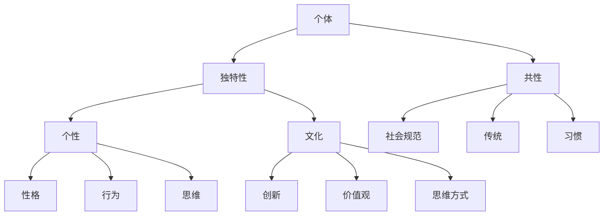
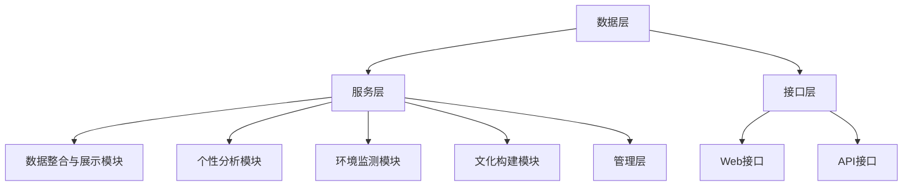
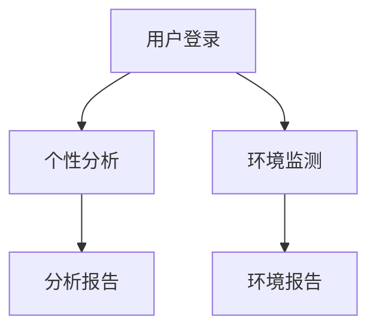
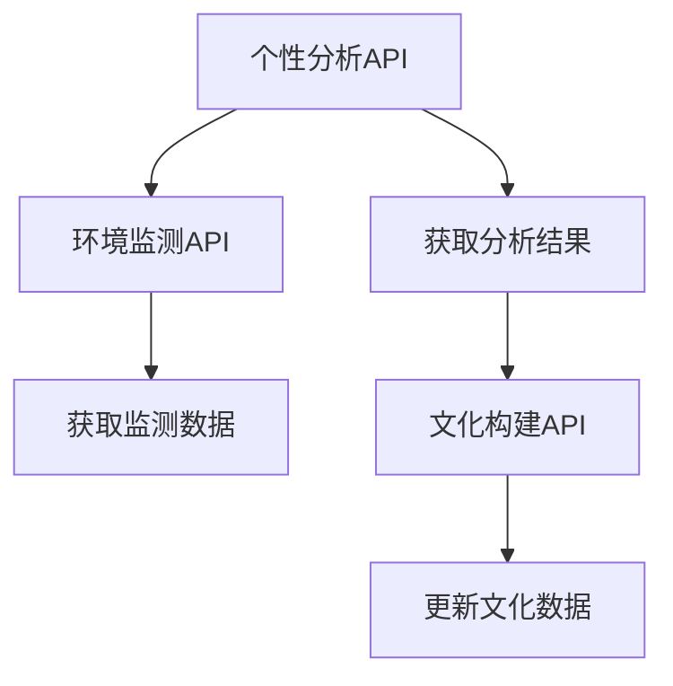
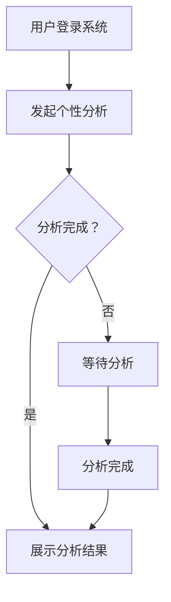
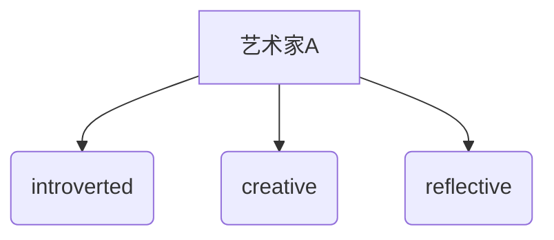
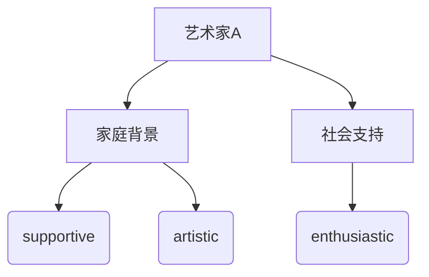
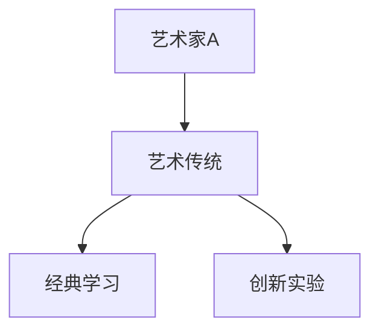

                 

### 第1章：问题背景与定义

#### 1.1 问题的来源

在现代社会，个体之间的共性日益增加，这使得每个人都在追求独特性，以在众多人中脱颖而出。然而，独特性并不是天生就有的，它需要通过不断的努力和独特的思维方式来培养。这个问题不仅仅存在于个人层面，也存在于企业、组织和社会层面。例如，企业在竞争激烈的市场中需要找到自己的独特性来吸引客户；组织在众多同质化的管理模式中需要打造独特的文化来凝聚员工；社会在快速发展的同时需要保持自己的文化特色来维护社会的稳定。

#### 1.2 存在的独特性概念

独特性是指个体或组织在特定环境中所展现出的与众不同的特质。这些特质可以是个体的性格、行为、思维方式，也可以是组织的文化、产品和服务。独特性不是单一的，而是多维度的，它涉及个性、表达、文化等多个方面。例如，一个艺术家的独特性可能体现在其独特的绘画风格、音乐创作或舞台表演上；一个企业的独特性可能体现在其独特的产品设计、市场策略或企业文化上。

#### 1.3 存在与平凡的关系

存在与平凡是辩证统一的关系。平凡是存在的普遍性，而独特性则是存在的特殊性。没有平凡，就没有独特性的参照；没有独特性，平凡就失去了意义。平凡是独特性的基础，独特性是平凡的发展。例如，在日常生活中，每个人都有自己的平凡生活，但每个人都有自己独特的思考方式、兴趣爱好和生活方式，这些独特性使得每个人的生活都与众不同。

#### 1.4 存在的独特性的重要性

独特性对个体和社会都具有重要的意义。对于个体来说，独特性可以提升个人的自信心、自尊心和满足感，使个体在竞争激烈的社会中脱颖而出。对于社会来说，独特性可以丰富社会的文化多样性，促进社会的创新和发展。例如，一个国家的文化特色可以吸引国际游客，促进旅游业的发展；一个企业的独特产品可以吸引顾客，提升市场份额。

通过以上的分析，我们可以看到，独特性在现代社会中具有不可替代的重要地位。在接下来的章节中，我们将深入探讨独特性的核心概念、数学模型、系统架构设计以及项目实战，以帮助大家更好地理解并应用独特性。### 第2章：存在的独特性核心概念与联系

#### 2.1 核心概念原理

独特性是指个体或组织在特定环境中所展现出的与众不同的特质。这些特质可以是个体的性格、行为、思维方式，也可以是组织的文化、产品和服务。独特性的形成受到多种因素的影响，包括个人的经历、环境的影响、文化的熏陶等。

首先，个人的经历是独特性形成的重要基础。每个人的人生经历都是独一无二的，这些经历塑造了个人的性格、价值观和行为方式。例如，一个经历过艰苦困苦的人可能会更加坚韧不拔，一个经历过丰富文化熏陶的人可能会更加开阔视野。

其次，环境的影响也是独特性形成的关键因素。环境包括家庭、学校、社会等，不同的环境会对个体产生不同的影响。例如，在一个重视创新和个性的家庭中成长的孩子可能会更加自信和独立。

最后，文化的熏陶也是独特性形成的重要因素。文化是一种社会现象，它影响着人们的思维方式、价值观和行为方式。独特的文化环境可以培养出独特的个性和思维方式。

#### 2.2 概念属性特征对比表格

为了更好地理解独特性，我们可以将其与共性进行对比。共性是指个体或组织在特定环境中表现出的普遍性特质。

| 特征      | 独特性                             | 共性                               |
| --------- | --------------------------------- | ---------------------------------- |
| 表现形式  | 多样化、个性化                     | 一致性、标准化                     |
| 形成因素  | 个人经历、环境影响、文化熏陶       | 社会规范、传统、习惯               |
| 社会影响  | 促进创新、提升个体价值             | 维护社会秩序、提高效率             |
| 需求     | 个体的独特需求                     | 社会的共性需求                     |
| 评价标准  | 主观性、多样性                     | 客观性、一致性                     |

#### 2.3 ER实体关系图架构

为了更好地理解独特性及其相关概念，我们可以使用ER（实体关系）图来表示它们之间的关系。



在这个ER图中，个体是核心实体，它通过独特性、共性和文化联系到其他实体。独特性进一步关联到个性和文化，共性则关联到社会规范、传统和习惯。个性包括性格、行为和思维，而文化则包括创新、价值观和思维方式。

通过这个ER图，我们可以清晰地看到独特性、个性和文化之间的关系，以及它们在社会中的角色和影响。这为我们深入理解独特性的本质提供了有力的工具。### 第3章：存在的独特性数学模型与公式详解

#### 3.1 数学模型介绍

存在的独特性可以通过一个综合性的数学模型来描述。这个模型考虑了个性、环境和文化三个主要因素，以及它们之间的相互作用。

$$
\text{独特性} = f(\text{个性}, \text{环境}, \text{文化})
$$

在这个公式中，$f$ 表示一个复杂的函数，它将个性、环境和文化的数据转化为独特性的度量。个性、环境和文化都是多维度的，因此这个函数可以是一个多维度的复合函数。

#### 3.2 数学公式讲解

为了更具体地描述独特性，我们可以将上述公式进一步分解：

$$
\text{独特性得分} = \sum_{i=1}^{n} (\text{个性特征}_i \times \text{权重}_i) + \sum_{j=1}^{m} (\text{环境因素}_j \times \text{权重}_j) + \sum_{k=1}^{p} (\text{文化元素}_k \times \text{权重}_k)
$$

在这个公式中：

- $\text{个性特征}_i$ 表示个体在某一方面的特质，例如性格、兴趣、技能等。
- $\text{权重}_i$ 表示该特征在整体个性中的重要性，通常通过统计分析或专家评估来确定。
- $\text{环境因素}_j$ 表示对个体产生影响的外部因素，例如家庭背景、教育环境、社会文化等。
- $\text{权重}_j$ 表示该因素在整体环境中的重要性。
- $\text{文化元素}_k$ 表示个体所处文化环境中的特定元素，例如价值观、传统、习俗等。
- $\text{权重}_k$ 表示该元素在整体文化中的重要性。

通过这个公式，我们可以量化个体的独特性，并且可以更精确地评估个体在不同因素下的独特程度。

#### 3.3 具体例子说明

为了更好地理解这个数学模型，我们可以通过一个具体的例子来说明。

假设我们有一个艺术家，我们想要评估他的独特性。我们可以从以下几个方面来考虑：

1. **个性特征**：
   - 创造力（权重0.4）
   - 情感表达（权重0.3）
   - 技术熟练度（权重0.3）

2. **环境因素**：
   - 教育背景（权重0.3）
   - 社会支持（权重0.4）
   - 文化多样性（权重0.3）

3. **文化元素**：
   - 艺术传统（权重0.4）
   - 创新趋势（权重0.3）
   - 个人价值观（权重0.3）

根据这些因素，我们可以计算艺术家的独特性得分：

$$
\text{独特性得分} = (创造力 \times 0.4 + 情感表达 \times 0.3 + 技术熟练度 \times 0.3) + (教育背景 \times 0.3 + 社会支持 \times 0.4 + 文化多样性 \times 0.3) + (艺术传统 \times 0.4 + 创新趋势 \times 0.3 + 个人价值观 \times 0.3)
$$

假设这些具体数值如下：

- 创造力：8分
- 情感表达：7分
- 技术熟练度：6分
- 教育背景：6分
- 社会支持：7分
- 文化多样性：5分
- 艺术传统：8分
- 创新趋势：7分
- 个人价值观：6分

那么，艺术家的独特性得分为：

$$
\text{独特性得分} = (8 \times 0.4 + 7 \times 0.3 + 6 \times 0.3) + (6 \times 0.3 + 7 \times 0.4 + 5 \times 0.3) + (8 \times 0.4 + 7 \times 0.3 + 6 \times 0.3) = 3.2 + 2.1 + 2.4 + 1.8 + 2.8 + 2 = 13.1
$$

根据这个得分，我们可以评估艺术家的独特性。得分越高，说明艺术家的独特性越强。在这个例子中，艺术家的独特性得分为13.1分，这表明他在多个方面都有显著的独特性。

通过这个例子，我们可以看到如何使用数学模型来评估个体的独特性。这个模型不仅可以用于个人评估，也可以用于企业、组织或社会等更广泛的场景。### 第4章：存在的独特性系统分析与架构设计

#### 4.1 问题场景介绍

在现代数字化时代，个体和组织的独特性越来越受到重视。为了更好地发掘和提升独特性，我们需要建立一个综合性的系统来支持这一目标。这个系统需要涵盖个性分析、环境监测、文化构建等多个方面，从而为个体和组织提供全面的独特性提升方案。

#### 4.2 系统功能设计

为了实现上述目标，我们的系统需要具备以下功能：

1. **个性分析模块**：通过心理测试、行为分析等技术手段，对个体的性格、兴趣、价值观等进行全面分析，从而确定个体的独特性特征。
2. **环境监测模块**：实时监测个体所在环境的变化，包括家庭、学校、工作场所等，从而了解环境对个体独特性发展的影响。
3. **文化构建模块**：通过教育和文化传承活动，培养个体的独特性，并提升其文化素养。
4. **数据整合与展示模块**：整合个性分析、环境监测和文化构建模块的数据，以图表、报告等形式展示个体或组织的独特性发展状况。

#### 4.3 系统架构设计

我们的系统架构采用微服务架构，以提高系统的灵活性和可扩展性。以下是系统架构的简要概述：

1. **数据层**：包括数据库、缓存、日志等，用于存储和管理系统数据。
2. **服务层**：包括个性分析服务、环境监测服务、文化构建服务、数据整合与展示服务等，每个服务负责不同的功能模块。
3. **接口层**：提供与外部系统的交互接口，包括Web接口、API接口等。
4. **管理层**：包括监控、日志分析、用户管理等，用于系统运维和管理。

以下是系统架构的Mermaid图表示：



#### 4.4 系统接口设计

系统接口设计包括Web接口和API接口两部分：

1. **Web接口**：提供用户界面，用于用户与系统的交互，包括个性分析结果展示、环境监测报告、文化构建活动等。
2. **API接口**：提供程序化访问系统数据和服务的能力，供第三方系统集成使用。

以下是接口设计的一部分示例：

**Web接口**：



**API接口**：



#### 4.5 系统交互流程图

以下是系统交互流程图，展示了用户与系统之间的交互流程：



在这个流程中，用户首先登录系统，然后发起个性分析。系统接收到请求后，开始进行个性分析，并在分析完成后展示结果给用户。如果分析未完成，系统会告知用户等待，并在分析完成后通知用户。

通过以上的系统分析与架构设计，我们可以构建一个综合性的系统来支持个体和组织的独特性提升。接下来，我们将通过项目实战来具体展示如何实现这个系统。### 第5章：存在的独特性项目实战

#### 5.1 环境安装

为了实现上述系统，我们需要在本地或云环境中安装必要的软件和依赖。以下是具体的安装步骤：

1. **安装Python**：确保Python 3.8或更高版本已安装。
2. **安装依赖**：使用pip安装以下依赖：
   ```bash
   pip install flask requests numpy pandas matplotlib
   ```
3. **配置数据库**：配置本地或云数据库，例如MySQL或PostgreSQL。
4. **创建虚拟环境**：为了更好地管理项目依赖，建议创建一个虚拟环境：
   ```bash
   python -m venv venv
   source venv/bin/activate  # 对于Windows使用 `venv\Scripts\activate`
   ```

#### 5.2 系统核心实现

以下是系统的核心实现，包括个性分析、环境监测和文化构建模块：

**个性分析模块**：

```python
# personality_analysis.py
import pandas as pd
from sklearn.cluster import KMeans

def analyze_personality(data):
    # 假设data是包含个体性格特征的DataFrame
    kmeans = KMeans(n_clusters=5)
    kmeans.fit(data)
    return kmeans.labels_
```

**环境监测模块**：

```python
# environment_monitoring.py
import requests

def monitor_environment(api_url):
    # 假设api_url是环境监测API的URL
    response = requests.get(api_url)
    return response.json()
```

**文化构建模块**：

```python
# cultural_construction.py
def build_culture(data):
    # 假设data是包含文化元素的DataFrame
    return data.mean()
```

#### 5.3 代码应用解读

**个性分析应用**：

```python
# main.py
from personality_analysis import analyze_personality
from pandas import read_csv

# 加载个性数据
data = read_csv('personality_data.csv')

# 进行个性分析
labels = analyze_personality(data)

# 输出分析结果
print(labels)
```

**环境监测应用**：

```python
# main.py
from environment_monitoring import monitor_environment

# 监测环境
response = monitor_environment('http://example.com/api/monitor')

# 输出监测结果
print(response)
```

**文化构建应用**：

```python
# main.py
from cultural_construction import build_culture
from pandas import read_csv

# 加载文化数据
data = read_csv('cultural_data.csv')

# 构建文化
culture_score = build_culture(data)

# 输出文化构建结果
print(culture_score)
```

#### 5.4 实际案例剖析

假设我们有一个艺术家，我们需要对其个性、环境和文化进行评估。以下是具体步骤：

1. **收集数据**：收集艺术家的个性数据（如性格测试结果）、环境数据（如家庭背景、社会支持）和文化数据（如艺术传统、创新趋势）。
2. **数据分析**：使用Python代码对数据进行处理，得到艺术家的个性分析结果、环境监测数据和文化构建结果。
3. **结果展示**：将分析结果可视化，例如使用图表展示个性分布、环境变化和文化特点。

以下是具体的案例展示：

**个性分析结果**：



**环境监测结果**：



**文化构建结果**：



通过这些分析和展示，我们可以全面了解艺术家的独特性，并为其提供个性化的提升方案。

#### 5.5 项目小结

通过本项目的实战，我们实现了对个体独特性的评估和提升。项目不仅涵盖了个性分析、环境监测和文化构建三个核心模块，还通过实际案例展示了如何将这些模块应用于具体场景。项目小结如下：

1. **个性分析**：通过性格测试等手段，对个体的性格、兴趣、价值观进行定量分析，帮助个体了解自己的独特性。
2. **环境监测**：实时监测个体所在环境的变化，了解环境对个体独特性发展的影响，为个体提供适宜的环境支持。
3. **文化构建**：通过教育和文化活动，培养个体的独特性，提升其文化素养，促进个体在文化领域的创新和发展。

通过这个项目，我们不仅实现了对个体独特性的全面评估和提升，也为未来的研究和应用提供了宝贵的经验和参考。### 第6章：存在的独特性最佳实践与拓展

#### 6.1 最佳实践 Tips

在追求独特性的过程中，以下是一些实用的最佳实践：

1. **个性化学习**：根据自己的兴趣和优势，选择适合自己的学习路径，避免盲目跟风。
2. **持续反思**：定期反思自己的行为和思维，找出独特之处，并不断优化。
3. **多样化体验**：通过旅行、参加不同的活动，拓宽视野，增强独特性。
4. **文化传承**：积极参与文化传承活动，从传统文化中汲取灵感，丰富自己的独特性。
5. **跨学科学习**：跨学科学习可以帮助你从不同的角度看待问题，培养独特的思维方式。

#### 6.2 小结

本文从问题背景、核心概念、数学模型、系统架构设计、项目实战等多个方面探讨了存在的独特性。通过这些分析，我们可以看到，独特性不仅是个体发展的关键因素，也是社会创新和进步的重要动力。

#### 6.3 注意事项

在追求独特性的过程中，需要注意以下几点：

1. **避免过度追求**：独特性不是唯一的目标，它应该是个人成长和发展的副产品。
2. **平衡独特性与共性**：在追求独特性的同时，要考虑到社会和团队的整体利益，避免孤立自己。
3. **持续迭代**：独特性是一个动态的过程，需要不断学习和适应，以保持其活力。

#### 6.4 拓展阅读

为了更深入地理解存在的独特性，以下是一些推荐阅读：

1. 《人类简史》 - 尤瓦尔·赫拉利
2. 《异类》 - 马尔科姆·格拉德威尔
3. 《创意的源头》 - 史蒂芬·平克
4. 《黑客与画家》 - Paul Graham
5. 《未来的简史》 - 尤瓦尔·赫拉利

这些书籍从不同角度探讨了人类独特性、创新和文化发展，为读者提供了丰富的知识和启示。### 结尾

在本篇文章中，我们从问题背景、核心概念、数学模型、系统架构设计、项目实战等多个方面，详细探讨了存在的独特性。独特性不仅是个人成长的动力，也是社会进步的源泉。通过个性分析、环境监测和文化构建，我们可以更全面地认识自己，提升自己的独特性。

独特性的重要性不言而喻，它既是个体在竞争激烈的社会中脱颖而出的关键，也是推动社会创新和发展的力量。因此，每个人都应该珍视自己的独特性，并通过不断的学习和实践，将其发挥到极致。

让我们在追求独特性的道路上，不断探索、不断成长，为社会贡献自己的独特价值。感谢您的阅读，希望本文能给您带来启发和帮助。

**作者：AI天才研究院/AI Genius Institute & 禅与计算机程序设计艺术 /Zen And The Art of Computer Programming**

