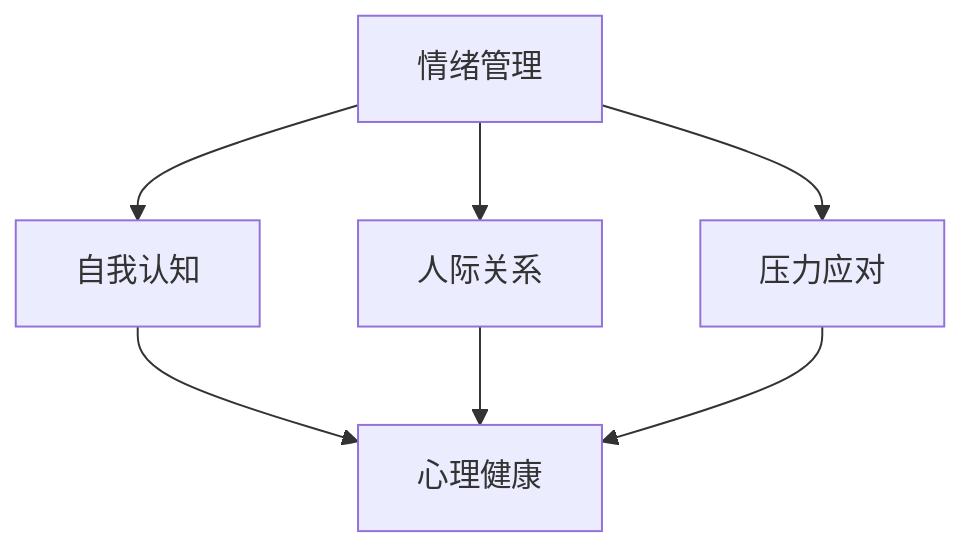

                 

# 存在的喜悦：重新发现生活中的美好

## 关键词
- 心理健康
- 生活美好
- 简化生活
- 自我探索
- 社交技巧
- 持续行动
- 拓展阅读

## 摘要
本文旨在探讨如何通过重新发现生活中的美好来提升心理健康和幸福感。我们将从心理健康的概念、简化生活策略、自我探索与成长、社交技巧、持续行动等方面逐步深入，为读者提供实用的方法和建议，帮助他们在快节奏的生活中找到存在的喜悦。

---

## 引言与背景介绍

### 1.1 问题背景

在当今社会，随着生活节奏的加快和工作压力的增大，越来越多的人感到焦虑、抑郁和孤独。心理健康问题已经成为一个全球性的挑战。根据世界卫生组织（WHO）的数据，全球约有3.5亿人患有抑郁症，而焦虑症则影响到全球约7亿人。这些问题不仅影响个人的生活质量，还可能导致工作绩效下降和社会关系破裂。

### 1.2 问题描述

心理健康问题通常表现为情绪波动、睡眠障碍、食欲变化、自我价值感降低等。这些问题可能会影响个人的工作、学习和日常生活。例如，长期的情绪低落可能导致工作效率下降，从而影响职业发展；而社交技巧的缺乏则可能导致孤独感和人际关系的疏离。

### 1.3 问题解决

为了解决心理健康问题，我们需要从多个方面入手。首先，了解心理健康的基本概念和原理是非常重要的。其次，我们需要采取一系列策略来简化生活，减轻压力。此外，自我探索和成长、社交技巧的提升以及持续行动的培养也是关键。

### 1.4 边界与外延

心理健康是一个广泛的概念，它不仅包括心理健康问题的诊断和治疗，还包括促进心理健康的方法和策略。生活美好不仅仅是指物质上的满足，更重要的是精神层面的满足和幸福感。因此，我们在本文中将探讨如何通过心理健康和生活美好的结合，来提升个人的整体幸福感。

### 1.5 概念结构与核心要素组成

心理健康的核心要素包括情绪管理、自我认知、人际关系和压力应对。为了更好地理解这些要素，我们可以通过以下Mermaid流程图来表示：

这个流程图展示了心理健康各个要素之间的相互作用和影响。情绪管理、自我认知、人际关系和压力应对都是维护心理健康的关键要素。

---

在引言部分，我们首先介绍了心理健康问题的背景和影响，然后提出了问题解决的思路，并明确了文章的边界和外延。接下来，我们将进一步探讨心理健康的核心概念和联系，以及如何通过简化生活策略来提升幸福感。

---

## 核心概念与联系

### 2.1 心理健康概述

心理健康是指个体心理过程的正常运作和功能的良好状态。它不仅关乎个人的情绪状态，还涉及到认知功能、行为模式和社会适应能力。为了更好地理解心理健康，我们可以将之划分为以下几个方面：

1. **情绪管理**：包括情绪的表达、情绪的调节以及情绪的适应能力。
2. **自我认知**：涉及个体对自己性格、能力和价值观的理解和认同。
3. **人际关系**：涉及个体与他人建立和维护关系的质量。
4. **压力应对**：涉及个体对压力源的识别和应对策略。

### 2.2 心理健康与生活美好的关系

心理健康和生活美好之间存在密切的关系。心理健康是生活美好的基础，而生活美好又能促进心理健康的提升。以下是心理

