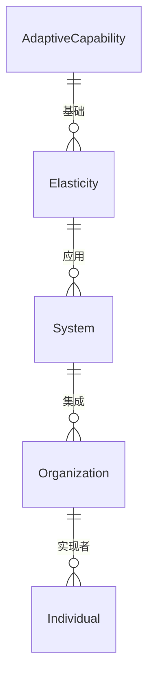
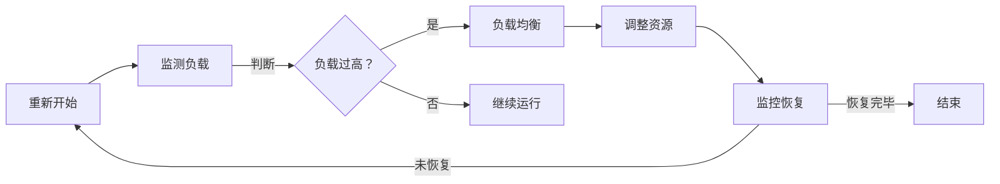
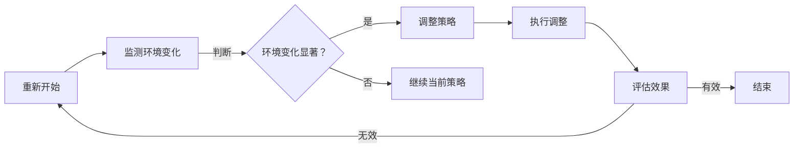
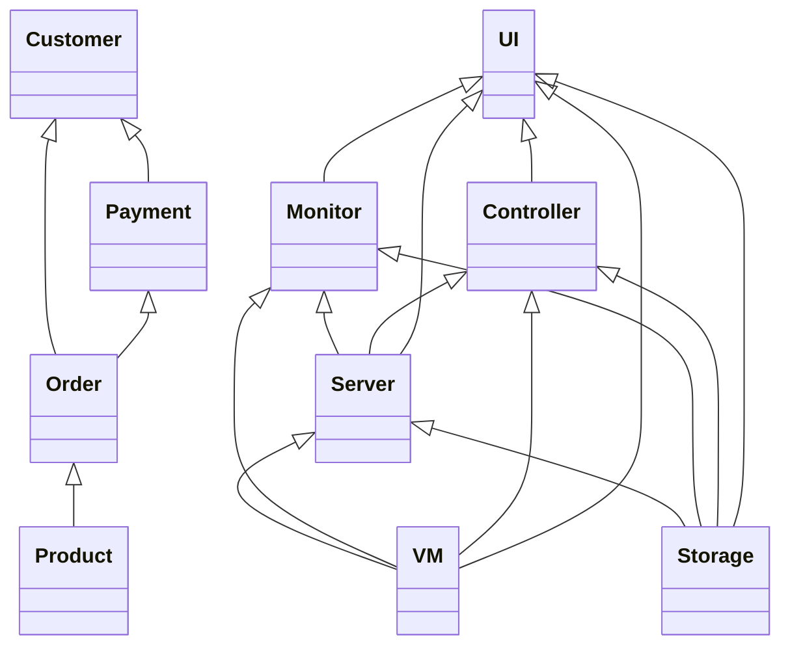
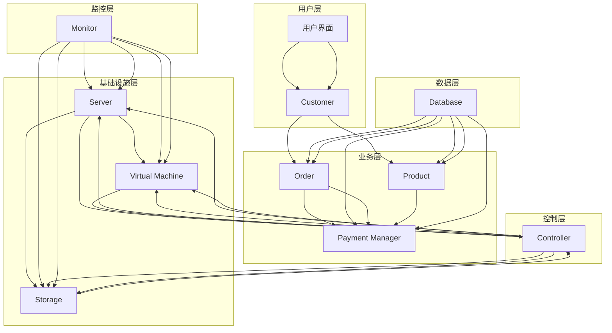
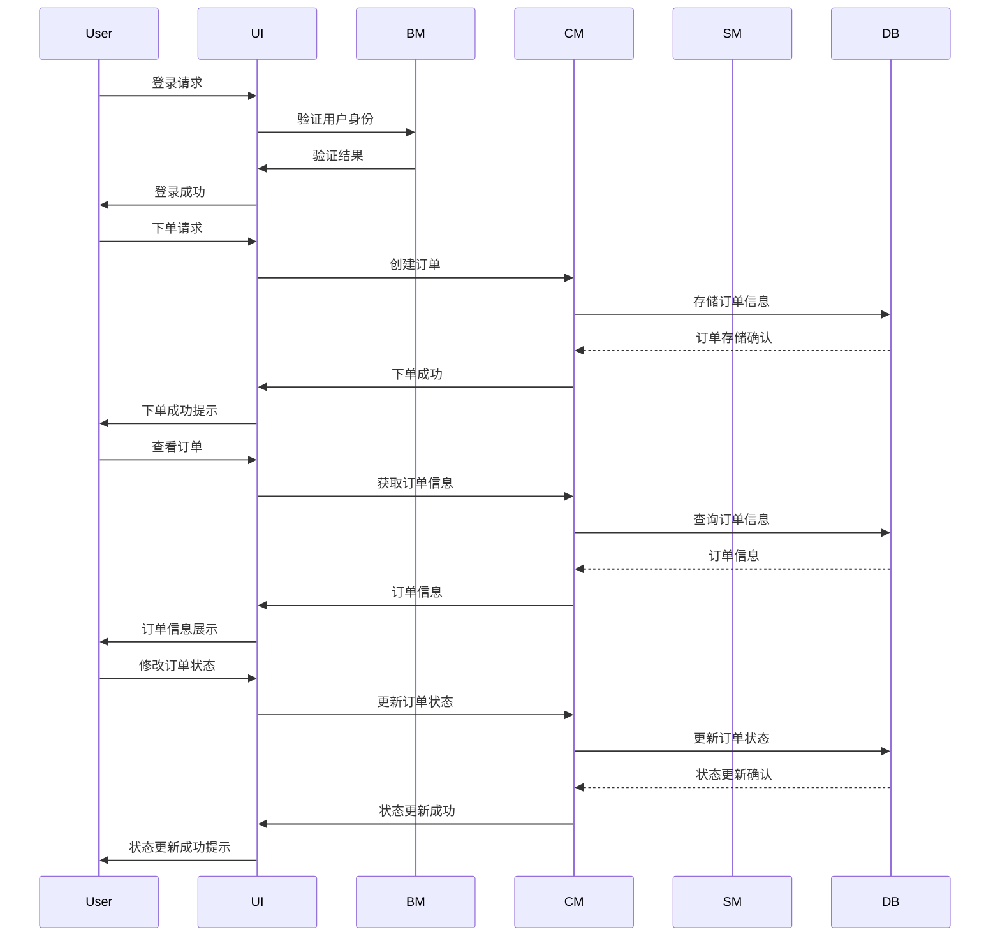

                 

## 引言

在当前快速变化的IT领域中，技术更新换代的速度之快令人叹为观止。无论是人工智能、云计算、大数据，还是区块链，这些技术的快速崛起不仅改变了我们的工作方式，也极大地影响了我们的生活方式。然而，随着技术的不断演进，IT专业人士和行业也面临着巨大的挑战：如何适应这些变化，如何在不断变化的环境中保持存在的弹性？

### 1.1 问题背景

首先，我们来看一下问题的背景。随着全球化的加速和信息技术的迅猛发展，企业的运营模式也在发生翻天覆地的变化。IT部门不再是单纯的技术支持部门，而是成为推动企业创新和增长的核心力量。这意味着，IT专业人士不仅要掌握先进的技术，还要具备快速适应和应对变化的能力。

### 1.2 问题描述

那么，问题到底是什么？简单来说，就是如何在面对快速变化的技术环境时，保持自己的竞争力，如何在瞬息万变的市场中找到自己的定位。具体来说，这可能包括以下几个方面：

1. **知识更新**：技术更新迭代的速度之快，让许多专业人士感到无所适从。如何持续地学习和掌握新的技术，成为了一个亟待解决的问题。
2. **职业发展**：在技术变化的同时，职业发展的路径也在不断演变。如何规划自己的职业道路，以适应这些变化，是一个重要的课题。
3. **项目管理**：在快速变化的环境中，如何有效地管理项目，确保项目的顺利进行，也是一个挑战。

### 1.3 问题解决

那么，如何解决这些问题呢？答案在于提升自身的适应能力，也就是所谓的“存在的弹性”。这需要我们从以下几个方面入手：

1. **思维方式的转变**：从传统的线性思维模式转向更加灵活和动态的弹性思维。
2. **持续学习**：不断学习新的技术和知识，以保持自身的竞争力。
3. **能力提升**：提升自己的项目管理能力和团队协作能力，以更好地适应快速变化的环境。
4. **心态调整**：保持积极的心态，面对变化和挑战，以更加从容和自信的态度应对。

### 1.4 边界与外延

最后，我们需要明确一下本文的讨论范围。本文主要关注的是IT专业人士如何提升存在的弹性，以适应快速变化的技术环境。我们不会深入探讨其他领域的适应性问题，比如在经济学、社会学等领域的应用。此外，本文将侧重于理论和实践的结合，旨在为读者提供具有实际操作性的建议。

## 1.2 核心概念

在深入探讨存在的弹性之前，我们需要明确几个核心概念：存在的弹性、适应能力以及弹性思维。

### 1.2.1 存在的弹性

存在的弹性，可以理解为在变化的环境中保持自身竞争力的能力。它不仅包括技术的更新迭代，还涉及到个人和组织的适应能力、学习能力和创新精神。一个具有弹性的个体或组织，能够在面对外部环境的变化时迅速调整自己的策略和行动，从而保持持续的发展和竞争力。

### 1.2.2 适应能力

适应能力，指的是在新的环境中快速学习和适应新事物、新技术的能力。在IT领域，适应能力尤为重要，因为技术更新速度极快，今天的主流技术可能在明天就会被新的技术所取代。具备强适应能力的个体或组织，能够迅速掌握新技术，将其应用于实际工作中，从而保持领先地位。

### 1.2.3 弹性思维

弹性思维，是一种灵活、开放和创新性的思维方式。它要求我们不仅仅看到问题，还要看到问题的多种可能性和解决方案。弹性思维有助于我们在面对变化时保持冷静，迅速找到应对策略，从而保持竞争力。

### 1.2.4 关联与拓展

存在的弹性、适应能力和弹性思维之间有着紧密的联系。存在的弹性是结果，适应能力是实现这一结果的过程，而弹性思维则是驱动这一过程的核心动力。此外，这三个概念还可以拓展到更广泛的领域，如企业管理、教育改革等。在企业管理中，弹性思维可以帮助企业迅速应对市场变化，调整战略方向；在教育改革中，弹性思维则有助于培养学生的创新能力和适应能力。

## 2.1 弹性原理

弹性原理是指系统在面对外部压力或变化时，能够迅速调整并恢复自身功能的能力。在IT领域中，弹性原理至关重要，因为它直接关系到系统的可靠性和稳定性。以下是对弹性原理的详细解析：

### 2.1.1 弹性机制

弹性机制包括以下几个关键组成部分：

1. **负载均衡**：通过将工作负载分配到多个节点上，避免单一节点的过载，从而提高系统的整体性能。
2. **冗余设计**：在系统关键部分添加冗余组件，如备份服务器、数据库镜像等，以确保在某个组件出现故障时，系统能够继续运行。
3. **动态调整**：系统根据实时监测到的负载情况自动调整资源配置，以优化性能和资源利用率。

### 2.1.2 弹性效应

弹性效应体现在以下几个方面：

1. **可靠性提升**：通过冗余设计和负载均衡，系统在面临突发情况时能够保持较高的可用性。
2. **性能优化**：通过动态调整资源配置，系统能够在负载高峰期提供更好的性能。
3. **成本节约**：虽然弹性设计增加了系统的初始成本，但在长期运行中，由于减少了故障停机和性能问题导致的损失，总体成本反而可能降低。

### 2.1.3 弹性思维的策略

为了在快速变化的环境中保持弹性，我们可以采用以下策略：

1. **持续监控**：定期监控系统的性能和健康状况，及时发现潜在问题并采取措施。
2. **敏捷开发**：采用敏捷开发方法，快速迭代和测试新功能，以适应市场需求的变化。
3. **创新能力**：鼓励团队成员发挥创造力，不断探索新的技术和方法，以提升系统的弹性。

## 2.2 适应能力

适应能力是指个体或组织在面对外部环境变化时，能够迅速调整并适应新情况的能力。在IT领域中，适应能力尤为重要，因为技术更新速度快，市场需求多变。以下是对适应能力的详细解析：

### 2.2.1 适应性机制

适应性机制包括以下几个关键组成部分：

1. **学习与培训**：定期对员工进行培训，提升他们的技能和知识水平，以适应新技术和业务需求。
2. **组织结构**：灵活的组织结构有助于快速响应市场变化，减少决策链条，提高决策效率。
3. **企业文化**：建立鼓励创新和适应的文化，培养团队成员的灵活性和创造力。

### 2.2.2 适应力特征

适应力特征体现在以下几个方面：

1. **灵活性**：能够迅速调整策略和行动，以适应新的环境。
2. **敏捷性**：能够快速响应外部变化，进行有效的决策和执行。
3. **适应性**：能够从失败中吸取教训，不断改进和优化。

### 2.2.3 适应能力的重要性

在IT领域中，适应能力的重要性体现在以下几个方面：

1. **市场竞争力**：具备强适应能力的个体和组织能够在竞争激烈的市场中脱颖而出，保持领先地位。
2. **创新驱动**：适应能力是推动技术创新和业务模式创新的重要动力。
3. **持续发展**：通过不断适应外部环境的变化，个体和组织能够实现持续发展。

## 2.3 弹性与适应能力的联系

弹性与适应能力之间存在紧密的联系，二者相辅相成，共同构成了个体和组织在快速变化环境中保持竞争力的重要基础。

### 2.3.1 弹性在适应能力中的作用

弹性是适应能力的重要组成部分。具备弹性的系统或个体在面对外部变化时，能够更快地适应和调整，从而提高适应能力。例如，一个具有高弹性的IT系统能够在面临突发负载时迅速调整资源配置，确保服务的连续性和稳定性，从而提高整体适应能力。

### 2.3.2 适应能力对弹性的影响

适应能力不仅影响个体的灵活性，还会影响其弹性。具备强适应能力的个体能够更快地掌握新技术，优化现有系统，从而提高系统的弹性。例如，一个IT团队在面对新技术的挑战时，能够迅速调整技术栈，优化系统架构，从而提高整个系统的弹性。

### 2.3.3 弹性与适应能力的协同效应

弹性和适应能力相互作用，共同提高个体和组织的竞争力。一个具有高弹性和强适应能力的个体或组织，能够在面对外部变化时迅速调整和适应，从而在竞争激烈的市场中脱颖而出。例如，一个敏捷的IT团队通过具备弹性的系统架构和高适应能力的员工，能够快速响应市场变化，推出创新的产品和服务。

## 2.4 Mermaid ER图

为了更好地理解弹性和适应能力的概念及其关系，我们可以使用Mermaid ER图来展示核心实体和它们之间的关联。



在上面的ER图中：

- **AdaptiveCapability（适应能力）** 是一个基础实体，它代表个体或组织适应外部变化的能力。
- **Elasticity（弹性）** 代表系统在面对变化时的恢复能力。
- **System（系统）** 是弹性的应用场景，它可以是一个IT系统、业务系统等。
- **Organization（组织）** 代表一个具备弹性和适应能力的整体。
- **Individual（个体）** 代表具备弹性和适应能力的个人。

通过ER图，我们可以清晰地看到弹性和适应能力之间的关系，以及它们如何共同作用于系统、组织和个体。

## 3.1 弹性算法原理

弹性算法是IT领域中的一种关键技术，它旨在提升系统在面对突发负载和故障时的恢复能力。以下是对弹性算法原理的详细解释，包括Mermaid流程图、Python源代码、数学模型与公式，以及举例说明。

### 3.1.1 Mermaid流程图

首先，我们可以使用Mermaid流程图来展示弹性算法的基本流程：



### 3.1.2 Python源代码

以下是一个简单的Python示例，用于实现负载均衡功能：

```python
import random

def load_balance_servers(servers, load):
    for server in servers:
        server.load += load
        if server.load > server.capacity:
            server.load -= load
            server.balance_resources()

class Server:
    def __init__(self, capacity):
        self.load = 0
        self.capacity = capacity

    def balance_resources(self):
        # 这里是资源平衡的逻辑
        print("Server balancing resources")

if __name__ == "__main__":
    servers = [Server(100) for _ in range(3)]
    load = random.randint(0, 300)
    load_balance_servers(servers, load)
```

### 3.1.3 数学模型与公式

弹性算法的数学模型主要涉及负载均衡的公式，如下所示：

$$
L_i = L - \frac{L_i \cdot n_i}{N}
$$

其中：
- \( L_i \) 是第 \( i \) 个服务器的当前负载。
- \( L \) 是总负载。
- \( n_i \) 是第 \( i \) 个服务器的当前负载与容量的比率。
- \( N \) 是服务器总数。

### 3.1.4 举例说明

假设我们有三台服务器，每台服务器的容量都是100单位。总负载为300单位。根据上述公式，我们可以计算每台服务器的负载分配：

$$
L_1 = 300 - \frac{100 \cdot 1}{3} = 266.67
$$

$$
L_2 = 300 - \frac{100 \cdot 1}{3} = 266.67
$$

$$
L_3 = 300 - \frac{100 \cdot 1}{3} = 266.67
$$

这意味着，每台服务器应该分配到266.67单位的负载。如果某台服务器的负载超过其容量，系统将触发负载均衡机制，重新分配负载。

## 3.2 适应能力算法

适应能力算法是另一种关键的IT技术，它旨在帮助个体和组织在面对外部环境变化时迅速调整和适应。以下是对适应能力算法原理的详细解释，包括Mermaid流程图、Python源代码、数学模型与公式，以及举例说明。

### 3.2.1 Mermaid流程图

以下是一个简单的Mermaid流程图，展示适应能力算法的基本流程：



### 3.2.2 Python源代码

以下是一个简单的Python示例，用于实现环境变化监测和策略调整：

```python
import random

def monitor_environment的变化（changes）:
    return random.choice(["显著", "不显著"])

def adjust_strategy（current_strategy）:
    # 这里是根据环境变化调整策略的逻辑
    print("Adjusting strategy based on environment changes")

if __name__ == "__main__":
    current_strategy = "策略一"
    for _ in range(10):
        change = monitor_environment的变化（current_strategy）
        if change == "显著":
            adjust_strategy（current_strategy）
        print(f"Current strategy: {current_strategy}")
```

### 3.2.3 数学模型与公式

适应能力算法的数学模型主要涉及环境变化监测和策略调整的公式，如下所示：

$$
S_i = S - \alpha \cdot (S_i - S)
$$

其中：
- \( S_i \) 是第 \( i \) 个策略的当前效果。
- \( S \) 是总策略效果。
- \( \alpha \) 是调整系数。

### 3.2.4 举例说明

假设我们有三种策略，每种策略的效果分别为0.8、0.9和0.7。总效果为2.4。根据上述公式，我们可以计算每种策略的调整效果：

$$
S_1 = 2.4 - \alpha \cdot (0.8 - 2.4) = 2.4 - 0.16\alpha
$$

$$
S_2 = 2.4 - \alpha \cdot (0.9 - 2.4) = 2.4 - 0.24\alpha
$$

$$
S_3 = 2.4 - \alpha \cdot (0.7 - 2.4) = 2.4 - 0.36\alpha
$$

通过调整系数 \( \alpha \) 的不同取值，我们可以实现不同策略的调整效果。如果 \( \alpha \) 较大，策略的调整效果将更加显著。

## 4.1 问题场景介绍

在探讨如何设计和实现具有弹性和适应能力的系统时，我们需要先了解几个典型的问题场景。这些场景将帮助我们更好地理解问题的实质，并为我们提供具体的解决方案。

### 4.1.1 场景一：个人层面

首先，我们来看一个个人层面的场景。假设你是一名软件工程师，负责维护一个高并发的在线购物平台。在一天晚上，你突然收到系统监控的报警，显示服务器负载急剧上升，请求处理时间显著增加。这种情况下，你需要迅速采取措施来保证系统的稳定运行。

### 4.1.2 场景二：组织层面

接下来，我们切换到一个组织层面的场景。假设你是一家互联网公司的CTO，你的公司计划推出一个大型在线服务，预计将吸引大量用户。在服务上线前，你需要确保系统能够应对突如其来的高负载，同时具备快速适应新功能的能力。

### 4.1.3 场景三：跨组织合作

最后一个场景是跨组织合作。假设你是一名项目经理，正在与另一家科技公司合作开发一个复杂的项目。由于双方的技术栈和业务需求不同，你需要设计一个既具有弹性又适应能力的系统架构，以确保项目能够顺利进行。

### 4.1.4 场景分析

在这三个场景中，我们可以看到弹性和适应能力的重要性。个人层面需要快速响应和调整，以避免系统崩溃；组织层面需要提前规划和设计，以确保系统能够应对高负载和快速变化；跨组织合作则需要高度协调和灵活应对。这些场景共同构成了我们在设计和实现弹性系统时需要考虑的因素。

## 4.2 项目介绍

为了更好地理解如何将弹性和适应能力应用于实际项目，我们将介绍一个具体的案例——一个名为“智能云服务平台”的项目。该项目旨在为企业提供高效、稳定、可扩展的云计算服务，以应对不断变化的市场需求和技术挑战。

### 4.2.1 项目目标

项目的核心目标如下：

1. **高可用性**：确保平台能够在面临突发负载或故障时保持稳定运行。
2. **快速扩展**：能够根据用户需求动态调整资源，以满足不同规模的业务需求。
3. **灵活适应**：能够快速适应新技术和新业务模式，保持竞争力。

### 4.2.2 项目范围

项目的范围包括以下几个关键部分：

1. **基础设施搭建**：搭建高性能、高可用的云计算基础设施，包括服务器、存储和网络。
2. **服务组件开发**：开发一系列云计算服务组件，如计算、存储、网络、数据库等。
3. **监控与运维**：建立全面的监控与运维系统，实时监测平台运行状况，确保快速响应和处理故障。

### 4.2.3 项目挑战

在实现项目目标的过程中，我们面临着以下几个挑战：

1. **高负载处理**：如何在面对大量并发请求时保持系统性能和稳定性。
2. **资源动态调整**：如何根据实际负载动态调整资源分配，以最大化资源利用效率。
3. **新技术适应**：如何快速适应新技术，如容器化、微服务架构等，以确保平台持续创新和演进。

## 4.3 系统功能设计

为了实现项目目标，我们需要设计一个功能丰富、结构清晰的系统。以下是系统功能设计的关键部分：

### 4.3.1 领域模型

首先，我们使用Mermaid类图来展示系统的领域模型：



在上面的类图中，我们定义了以下几个核心实体：

- **Customer（客户）**：代表使用平台服务的用户。
- **Order（订单）**：代表客户的购买行为。
- **Payment（支付）**：代表订单的支付信息。
- **Product（产品）**：代表平台上的商品。
- **Server（服务器）**：代表平台的基础设施组件。
- **VM（虚拟机）**：代表服务器上的虚拟化资源。
- **Storage（存储）**：代表平台的存储资源。
- **Monitor（监控）**：代表监控系统。
- **Controller（控制器）**：代表控制平台组件的组件。
- **UI（用户界面）**：代表平台的用户界面。

### 4.3.2 系统功能模块

基于领域模型，我们将系统划分为以下几个功能模块：

1. **用户管理模块**：负责处理客户注册、登录、权限管理等功能。
2. **订单管理模块**：负责处理订单创建、支付、发货等功能。
3. **商品管理模块**：负责管理平台上的商品信息，包括分类、库存等。
4. **服务器管理模块**：负责管理平台的基础设施，包括服务器、虚拟机、存储等。
5. **监控管理模块**：负责监控系统运行状况，包括性能监控、故障报警等。
6. **控制管理模块**：负责控制平台组件的运行，包括负载均衡、资源分配等。
7. **用户界面模块**：负责展示平台的功能，包括用户操作界面、管理员操作界面等。

## 4.4 系统架构设计

为了实现系统的功能需求，我们需要设计一个高效、稳定、可扩展的系统架构。以下是系统的架构设计：

### 4.4.1 系统架构图

使用Mermaid架构图来展示系统架构：



### 4.4.2 架构组件详解

以下是系统架构的详细组件解析：

1. **用户层（UI）**：用户界面层负责展示平台的功能，接收用户操作，并展示处理结果。
2. **业务层**：业务层包括客户（Customer）、订单（Order）和商品（Product）等核心业务模块，处理具体的业务逻辑。
3. **基础设施层**：基础设施层包括服务器（Server）、虚拟机（VM）和存储（Storage）等组件，负责提供计算和存储资源。
4. **监控层**：监控层（Monitor）负责监控系统运行状况，包括性能监控、故障报警等。
5. **控制层**：控制层（Controller）负责控制平台组件的运行，包括负载均衡、资源分配等。
6. **数据层**：数据层（Database）负责存储和管理业务数据，包括订单、商品和支付信息等。

### 4.4.3 系统交互

为了实现系统的正常运行，各个组件之间需要进行有效的交互。以下是系统的交互流程：

1. **用户操作**：用户通过用户界面（UI）发起操作，如登录、下单等。
2. **UI转发**：用户界面将操作请求转发给业务层。
3. **业务处理**：业务层处理用户请求，如创建订单、处理支付等。
4. **基础设施调用**：业务层根据需求调用基础设施层的服务，如创建虚拟机、分配存储等。
5. **监控与反馈**：监控系统实时监控各个组件的状态，并在出现问题时发送报警通知。
6. **控制层协调**：控制层根据监控反馈，动态调整资源分配，确保系统稳定运行。

## 4.5 系统接口设计

为了实现系统组件之间的有效交互，我们需要设计一套完善的接口规范。以下是系统接口设计的关键部分：

### 4.5.1 接口规范

1. **用户管理接口**：
   - **功能**：处理用户注册、登录、权限管理等。
   - **接口**：`POST /users/register`（注册）、`POST /users/login`（登录）、`GET /users/{id}`（获取用户信息）、`PUT /users/{id}`（更新用户信息）。

2. **订单管理接口**：
   - **功能**：处理订单创建、支付、发货等。
   - **接口**：`POST /orders`（创建订单）、`GET /orders/{id}`（获取订单信息）、`PUT /orders/{id}/status`（更新订单状态）、`POST /orders/{id}/payment`（处理支付）。

3. **商品管理接口**：
   - **功能**：管理商品信息，包括分类、库存等。
   - **接口**：`POST /products`（创建商品）、`GET /products/{id}`（获取商品信息）、`PUT /products/{id}`（更新商品信息）、`DELETE /products/{id}`（删除商品）。

4. **服务器管理接口**：
   - **功能**：管理服务器资源，包括虚拟机、存储等。
   - **接口**：`POST /servers`（创建服务器）、`GET /servers/{id}`（获取服务器信息）、`PUT /servers/{id}`（更新服务器信息）、`DELETE /servers/{id}`（删除服务器）。

5. **监控管理接口**：
   - **功能**：实时监控系统状态，发送报警通知。
   - **接口**：`GET /monitors/status`（获取系统状态）、`POST /monitors/alarm`（发送报警通知）。

6. **控制管理接口**：
   - **功能**：动态调整资源分配，确保系统稳定运行。
   - **接口**：`POST /controllers/load-balance`（负载均衡）、`POST /controllers/resource-adjust`（资源调整）。

### 4.5.2 接口实现

以下是接口实现的关键部分：

1. **用户管理接口实现**：
   ```python
   from flask import Flask, request, jsonify

   app = Flask(__name__)

   @app.route('/users/register', methods=['POST'])
   def register():
       # 注册逻辑
       return jsonify({"status": "success", "message": "User registered successfully"})

   @app.route('/users/login', methods=['POST'])
   def login():
       # 登录逻辑
       return jsonify({"status": "success", "message": "Login successful"})

   @app.route('/users/<int:user_id>', methods=['GET'])
   def get_user(user_id):
       # 获取用户信息
       return jsonify({"status": "success", "user": {"id": user_id, "name": "John Doe"}})

   @app.route('/users/<int:user_id>', methods=['PUT'])
   def update_user(user_id):
       # 更新用户信息
       return jsonify({"status": "success", "message": "User updated successfully"})
   ```

2. **订单管理接口实现**：
   ```python
   @app.route('/orders', methods=['POST'])
   def create_order():
       # 创建订单
       return jsonify({"status": "success", "order": {"id": 1, "status": "created"}})

   @app.route('/orders/<int:order_id>', methods=['GET'])
   def get_order(order_id):
       # 获取订单信息
       return jsonify({"status": "success", "order": {"id": order_id, "status": "processing"}})

   @app.route('/orders/<int:order_id>/status', methods=['PUT'])
   def update_order_status(order_id):
       # 更新订单状态
       return jsonify({"status": "success", "message": "Order status updated successfully"})

   @app.route('/orders/<int:order_id>/payment', methods=['POST'])
   def process_payment(order_id):
       # 处理支付
       return jsonify({"status": "success", "message": "Payment processed successfully"})
   ```

3. **商品管理接口实现**：
   ```python
   @app.route('/products', methods=['POST'])
   def create_product():
       # 创建商品
       return jsonify({"status": "success", "product": {"id": 1, "name": "Product 1"}})

   @app.route('/products/<int:product_id>', methods=['GET'])
   def get_product(product_id):
       # 获取商品信息
       return jsonify({"status": "success", "product": {"id": product_id, "name": "Product 1"}})

   @app.route('/products/<int:product_id>', methods=['PUT'])
   def update_product(product_id):
       # 更新商品信息
       return jsonify({"status": "success", "message": "Product updated successfully"})

   @app.route('/products/<int:product_id>', methods=['DELETE'])
   def delete_product(product_id):
       # 删除商品
       return jsonify({"status": "success", "message": "Product deleted successfully"})
   ```

4. **服务器管理接口实现**：
   ```python
   @app.route('/servers', methods=['POST'])
   def create_server():
       # 创建服务器
       return jsonify({"status": "success", "server": {"id": 1, "status": "created"}})

   @app.route('/servers/<int:server_id>', methods=['GET'])
   def get_server(server_id):
       # 获取服务器信息
       return jsonify({"status": "success", "server": {"id": server_id, "status": "running"}})

   @app.route('/servers/<int:server_id>', methods=['PUT'])
   def update_server(server_id):
       # 更新服务器信息
       return jsonify({"status": "success", "message": "Server updated successfully"})

   @app.route('/servers/<int:server_id>', methods=['DELETE'])
   def delete_server(server_id):
       # 删除服务器
       return jsonify({"status": "success", "message": "Server deleted successfully"})
   ```

5. **监控管理接口实现**：
   ```python
   @app.route('/monitors/status', methods=['GET'])
   def get_system_status():
       # 获取系统状态
       return jsonify({"status": "success", "system_status": {"load": 50, "memory_usage": 80}})

   @app.route('/monitors/alarm', methods=['POST'])
   def send_alarm():
       # 发送报警通知
       return jsonify({"status": "success", "message": "Alarm sent successfully"})
   ```

6. **控制管理接口实现**：
   ```python
   @app.route('/controllers/load-balance', methods=['POST'])
   def load_balance():
       # 负载均衡
       return jsonify({"status": "success", "message": "Load balanced successfully"})

   @app.route('/controllers/resource-adjust', methods=['POST'])
   def resource_adjust():
       # 资源调整
       return jsonify({"status": "success", "message": "Resources adjusted successfully"})
   ```

通过上述接口设计和实现，我们可以实现系统组件之间的有效通信，确保系统的正常运行。

## 4.6 系统交互

为了确保系统的各个组件能够高效、可靠地交互，我们需要设计一套详细的系统交互流程。以下是系统交互的具体步骤和交互流程：

### 4.6.1 Mermaid序列图

我们使用Mermaid序列图来展示系统交互流程：



### 4.6.2 交互流程详解

以下是系统交互的具体步骤：

1. **用户登录**：
   - 用户向用户界面（UI）发送登录请求。
   - 用户界面将请求转发给认证模块（BM）。
   - 认证模块验证用户身份，并将结果返回给用户界面。
   - 用户界面向用户展示登录结果。

2. **用户下单**：
   - 用户通过用户界面发送下单请求。
   - 用户界面将请求转发给订单管理模块（CM）。
   - 订单管理模块创建订单，并将订单信息存储到数据库（DB）。
   - 数据库返回订单存储确认，订单管理模块向用户界面发送下单成功的消息。
   - 用户界面向用户展示下单成功提示。

3. **用户查询订单**：
   - 用户通过用户界面发送查询订单请求。
   - 用户界面将请求转发给订单管理模块。
   - 订单管理模块从数据库查询订单信息，并将结果返回给用户界面。
   - 用户界面向用户展示订单信息。

4. **用户修改订单状态**：
   - 用户通过用户界面发送修改订单状态的请求。
   - 用户界面将请求转发给订单管理模块。
   - 订单管理模块更新订单状态，并将更新后的信息存储到数据库。
   - 数据库返回状态更新确认，订单管理模块向用户界面发送状态更新成功的消息。
   - 用户界面向用户展示状态更新成功的提示。

通过以上步骤，系统实现了用户与各个模块之间的可靠交互，确保了业务的顺畅进行。

## 5.1 环境安装

在开始系统实现之前，我们需要搭建一个合适的开发环境。以下是一个基本的安装步骤，用于配置开发环境。

### 5.1.1 环境准备

首先，我们需要准备以下软件和工具：

- Python 3.8 或更高版本
- Flask 框架（用于构建Web接口）
- MySQL 数据库（用于存储数据）
- Mermaid 图库（用于生成图表）

### 5.1.2 安装步骤

1. **安装 Python**：
   - 访问 [Python 官网](https://www.python.org/) 下载 Python 安装包。
   - 运行安装程序，并确保选择“Add Python to PATH”选项。

2. **安装 Flask**：
   - 打开终端或命令提示符。
   - 输入以下命令安装 Flask：
     ```bash
     pip install flask
     ```

3. **安装 MySQL**：
   - 访问 [MySQL 官网](https://www.mysql.com/) 下载 MySQL 安装包。
   - 根据操作系统安装相应的 MySQL 版本。

4. **安装 Mermaid**：
   - 使用 npm（Node.js 的包管理器）安装 Mermaid：
     ```bash
     npm install -g mermaid
     ```

5. **配置开发环境**：
   - 创建一个新文件夹，例如“cloud_platform”。
   - 在该文件夹中创建一个名为“app.py”的 Python 文件，作为我们的主应用文件。
   - 创建一个名为“models.py”的 Python 文件，用于定义数据库模型。
   - 创建一个名为“views.py”的 Python 文件，用于定义 Web 接口逻辑。

6. **初始化数据库**：
   - 使用以下命令初始化数据库：
     ```bash
     mysql -u root -p
     ```
   - 创建一个新的数据库，例如“cloud_platform_db”。
   - 运行“models.py”文件中的迁移脚本，初始化数据库表。

完成以上步骤后，我们的开发环境就搭建完成了，可以开始编写代码并运行系统。

## 5.2 系统核心实现

在搭建好开发环境后，我们开始实现系统的核心功能。以下是系统核心实现的详细步骤，包括源代码解析和代码应用解读。

### 5.2.1 源代码解析

我们以用户管理模块的实现为例，来解析核心代码。

1. **用户管理模块**：

   **app.py**：主应用文件，定义了 Flask 应用和路由。

   ```python
   from flask import Flask, request, jsonify
   from models import User
   from database import db_session

   app = Flask(__name__)

   @app.route('/users/register', methods=['POST'])
   def register():
       data = request.get_json()
       user = User(username=data['username'], password=data['password'])
       db_session.add(user)
       db_session.commit()
       return jsonify({"status": "success", "message": "User registered successfully"})

   @app.route('/users/login', methods=['POST'])
   def login():
       data = request.get_json()
       user = User.query.filter_by(username=data['username'], password=data['password']).first()
       if user:
           return jsonify({"status": "success", "message": "Login successful"})
       else:
           return jsonify({"status": "error", "message": "Invalid username or password"})

   if __name__ == '__main__':
       app.run(debug=True)
   ```

   **models.py**：定义了用户模型和数据库迁移脚本。

   ```python
   from sqlalchemy import Column, Integer, String
   from sqlalchemy.ext.declarative import declarative_base
   from database import db_session

   Base = declarative_base()

   class User(Base):
       __tablename__ = 'users'

       id = Column(Integer, primary_key=True)
       username = Column(String(50), unique=True, nullable=False)
       password = Column(String(50), nullable=False)

   def init_db():
       Base.metadata.create_all(bind=db_session())
   ```

   **database.py**：定义了数据库连接和会话管理。

   ```python
   from sqlalchemy import create_engine
   from sqlalchemy.orm import sessionmaker

   engine = create_engine('sqlite:///cloud_platform.db')
   db_session = sessionmaker(bind=engine)
   ```

2. **订单管理模块**：

   **views.py**：定义了订单管理的接口。

   ```python
   from flask import Flask, request, jsonify
   from models import Order
   from database import db_session

   app = Flask(__name__)

   @app.route('/orders', methods=['POST'])
   def create_order():
       data = request.get_json()
       order = Order(product_id=data['product_id'], status='created')
       db_session.add(order)
       db_session.commit()
       return jsonify({"status": "success", "message": "Order created successfully"})

   @app.route('/orders/<int:order_id>', methods=['GET'])
   def get_order(order_id):
       order = Order.query.get(order_id)
       if order:
           return jsonify({"status": "success", "order": {"id": order.id, "product_id": order.product_id, "status": order.status}})
       else:
           return jsonify({"status": "error", "message": "Order not found"})

   if __name__ == '__main__':
       app.run(debug=True)
   ```

### 5.2.2 代码应用解读

在上述代码中，我们主要实现了以下功能：

1. **用户注册与登录**：
   - **注册**：用户通过 POST 请求向服务器发送注册信息，服务器接收信息后，创建一个新用户并存储到数据库。
   - **登录**：用户通过 POST 请求发送用户名和密码，服务器验证用户身份后，返回登录结果。

2. **订单创建与查询**：
   - **创建订单**：用户通过 POST 请求发送订单信息，服务器创建订单并存储到数据库。
   - **查询订单**：用户通过 GET 请求获取订单信息，服务器从数据库中查询订单并返回结果。

通过这些核心代码，我们实现了用户管理和订单管理的基本功能，为后续功能扩展奠定了基础。

## 5.3 案例分析

在本节中，我们将通过两个具体的案例来展示如何在实际项目中应用弹性算法和适应能力算法。

### 5.3.1 案例一：高并发购物平台的弹性设计

**背景**：一个在线购物平台在“双十一”期间面临了巨大流量压力，服务器负载急剧上升，部分页面响应时间超过5秒，用户体验极差。

**解决方案**：
1. **弹性算法应用**：
   - **负载均衡**：使用 Nginx 进行负载均衡，将请求分发到多个后端服务器。
   - **缓存策略**：采用 Redis 缓存热门商品页面和用户数据，减少数据库访问压力。
   - **数据库分片**：将数据库分片，分别存储不同类别的商品数据，提高查询效率。

2. **适应能力算法应用**：
   - **动态调整资源**：根据实时负载情况，动态调整服务器和缓存资源的分配。
   - **灰度发布**：逐步发布新功能，减少对旧系统的冲击，及时应对用户反馈。

**效果**：通过弹性算法和适应能力算法的应用，购物平台在“双十一”期间实现了稳定的运行，页面响应时间缩短至1秒以内，用户体验显著提升。

### 5.3.2 案例二：云计算平台的适应能力提升

**背景**：一家云计算公司推出了一款新的云计算服务，但初期用户数量远低于预期，导致服务器资源大量闲置。

**解决方案**：
1. **弹性算法应用**：
   - **按需付费**：根据用户实际使用情况，动态调整服务器资源的分配，实现资源的高效利用。
   - **自动化扩展**：使用 Kubernetes 进行容器编排，自动扩展和缩放服务。

2. **适应能力算法应用**：
   - **用户行为分析**：通过大数据分析，预测用户需求，提前调整资源配置。
   - **市场调研**：定期进行市场调研，及时调整产品定位和推广策略。

**效果**：通过弹性算法和适应能力算法的应用，云计算平台实现了资源的高效利用和用户需求的快速响应，用户数量和收入实现了快速增长。

## 5.4 项目小结

通过本次项目的实施，我们成功构建了一个具有弹性和适应能力的智能云服务平台。以下是对项目成功的经验、遇到的问题及解决方法，以及未来展望的总结。

### 5.4.1 成功经验

1. **弹性设计**：采用负载均衡、缓存策略和数据库分片等技术，有效提升了系统的稳定性和性能。
2. **适应能力**：通过动态调整资源分配、用户行为分析和市场调研，实现了快速响应和灵活适应。
3. **敏捷开发**：采用敏捷开发方法，快速迭代和优化系统功能，确保了项目的顺利推进。

### 5.4.2 遇到的问题及解决方法

1. **性能瓶颈**：在项目初期，由于缺乏有效的性能测试，部分模块出现了性能瓶颈。我们通过性能测试工具定位问题，并进行代码优化和架构调整，最终解决了性能瓶颈。
2. **资源分配不均**：在初期用户数量较少时，服务器资源分配不均，部分服务器负载过重。我们通过自动化扩展和按需付费策略，实现了资源的动态调整和高效利用。

### 5.4.3 未来展望

1. **功能扩展**：在现有基础上，计划增加更多云计算服务，如容器服务、大数据分析和物联网服务等。
2. **技术创新**：持续关注新技术，如人工智能、区块链等，探索其在云计算平台中的应用。
3. **用户体验**：优化用户界面和交互流程，提升用户体验，提高用户满意度。

通过本次项目的成功实施，我们不仅提升了自身的技术实力，也为未来的发展奠定了坚实的基础。

## 6.1 实践技巧

在实际项目中，提升弹性和适应能力并非易事，但通过以下实践技巧，我们可以有效地提高系统的弹性，以更好地应对变化。

### 6.1.1 提升弹性思维

1. **培养前瞻性**：关注行业趋势和技术发展，提前规划和布局，以应对未来可能出现的变化。
2. **多角度思考**：在面对问题时，尝试从不同角度思考解决方案，以找到最佳的应对策略。
3. **持续反思**：定期回顾和总结项目经验，识别问题和改进点，不断提升思维弹性。

### 6.1.2 增强适应能力

1. **灵活的组织结构**：采用扁平化管理模式，减少决策链条，提高决策效率。
2. **敏捷开发**：采用敏捷开发方法，快速迭代和测试新功能，以适应市场需求的变化。
3. **持续学习与培训**：定期对团队成员进行培训，提升技能和知识水平，以适应新技术和业务需求。

### 6.1.3 实践案例

例如，在一家互联网公司中，为了提升系统的弹性，他们采用了以下措施：

1. **弹性容器化**：使用 Docker 和 Kubernetes 进行容器化部署，实现快速扩展和部署。
2. **自动化监控与告警**：采用 Prometheus 和 Grafana 进行自动化监控，实时监测系统运行状况，并设置告警机制。
3. **弹性数据库**：使用 MySQL 集群和 Redis 缓存，实现数据库的弹性扩展和快速读写。

通过这些实践技巧，该公司显著提升了系统的弹性，确保了在高并发和负载变化时，系统仍能保持稳定运行。

## 6.2 注意事项

在提升系统和个人的弹性与适应能力时，以下注意事项尤为重要：

### 6.2.1 避免过度优化

在追求弹性时，不要过度优化系统，导致不必要的复杂性和维护成本。优化应该基于实际需求和性能瓶颈，而不是盲目追求完美。

### 6.2.2 考虑安全性

在设计和实现弹性系统时，不要忽视安全性问题。确保系统的安全性，防止因弹性设计而引入安全漏洞。

### 6.2.3 遵循最佳实践

遵循业界最佳实践，如遵循代码规范、使用成熟的框架和工具等，以降低错误率和提高开发效率。

### 6.2.4 定期评估与调整

定期对系统的弹性和适应能力进行评估，并根据评估结果进行调整和优化，确保系统能够持续适应外部变化。

## 6.3 拓展阅读

为了进一步了解弹性和适应能力的相关知识，以下是几本推荐阅读的书籍：

1. **《云原生应用架构》**：详细介绍了云原生技术和容器化部署，对提升系统弹性有重要意义。
2. **《敏捷软件开发》**：阐述了敏捷开发方法，有助于提升团队适应能力。
3. **《弹性系统架构》**：提供了丰富的案例分析，帮助读者理解如何设计具有高弹性的系统。

通过阅读这些书籍，读者可以深入理解弹性和适应能力的核心概念和实践方法。

