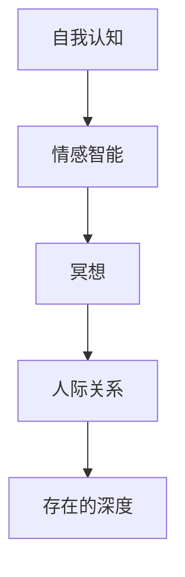
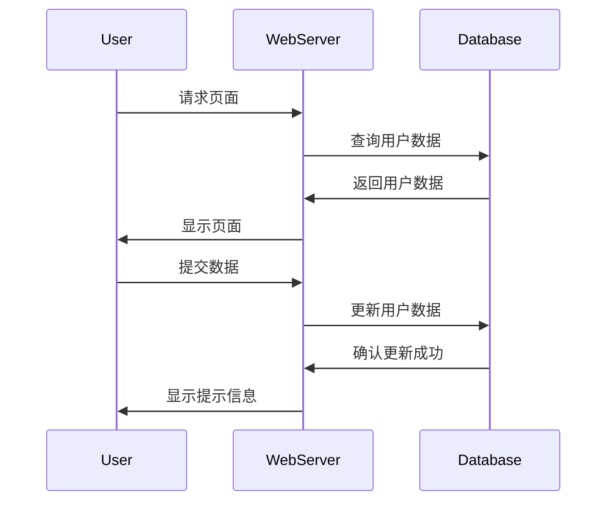

                 


### 引言

**存在的深度：超越表面追求内在成长**

在当今快速发展的科技时代，我们往往被外在世界的表象所吸引，追求物质财富和社会地位。然而，随着追求的深入，许多人开始感到内心的空虚和迷茫。这种情况下，“存在的深度：超越表面追求内在成长”成为了一个重要的课题。本文旨在探讨存在的深度，以及如何通过内在成长来寻找生命的真正意义。

**关键词：** 存在的深度、内在成长、哲学、自我认知、情感智能、冥想、人际关系

**摘要：** 本文将首先介绍存在的深度这一概念，并探讨其在不同哲学体系中的意义。接着，我们将详细讨论内在成长的方法，包括自我认知、情感智能、冥想和人际关系等。最后，我们将通过实际案例，展示如何将内在成长的理念应用于实际生活中。

### 背景介绍

#### 核心概念术语说明

- **存在的深度**：指个体在追求生命意义和内在成长的过程中，对自我和世界本质的理解程度。
- **内在成长**：指通过自我认知、情感管理和精神修炼等方式，实现个体的内心成长和自我完善。
- **自我认知**：指个体对自己内在心理状态和特质的理解和认识。
- **情感智能**：指个体在情感方面的认知、理解和管理能力。
- **冥想**：一种通过专注呼吸、冥思等方式，达到心灵宁静和内在成长的修炼方法。

#### 问题背景

在现代社会，随着物质生活的丰富，人们开始更多地关注内心的需求和追求。然而，许多人依然感到内心的空虚和迷茫。这种情况下，存在的深度和内在成长成为了解决问题的关键。

#### 问题描述

如何通过内在成长，找到生命的真正意义，实现个人价值的提升，是本文要探讨的核心问题。

#### 问题解决

通过自我认知、情感智能、冥想和人际关系等内在成长的方法，个体可以更深入地理解自我和世界，从而找到生命的真正意义，实现个人价值的提升。

#### 边界与外延

存在的深度和内在成长不仅适用于个人，也适用于组织和社会。通过内在成长，个体和组织可以更好地适应变化，实现持续发展。

#### 概念结构与核心要素组成

- **存在的深度**：理解自我和世界的本质。
- **内在成长**：自我认知、情感智能、冥想、人际关系。
- **自我认知**：认识自我内在心理状态和特质。
- **情感智能**：管理情感的能力。
- **冥想**：达到心灵宁静的修炼方法。

### 核心概念与联系

#### 存在的深度

**概念原理**：存在的深度是个体对自我和世界本质的理解程度。它不仅关乎对物质世界的认识，更关乎对精神世界的追求。

**概念属性特征对比表格：**

| 特征 | 存在的深度 | 物质追求 |
| --- | --- | --- |
| **本质** | 精神追求 | 物质追求 |
| **目的** | 寻找生命的真正意义 | 获得物质财富和社会地位 |
| **影响** | 促进个人成长和社会进步 | 满足个体基本需求和欲望 |

**ER实体关系图架构：**

```mermaid
erDiagram
  Class1 ||--|{ Class2 }|| Member
  Class1 ||--|{ Class3 }|| Subclass
  Class3 ||--|{ Class4 }|| Supersubclass
```

#### 内在成长

**概念原理**：内在成长是通过自我认知、情感智能、冥想和人际关系等方式，实现个体的内心成长和自我完善。

**概念属性特征对比表格：**

| 特征 | 自我认知 | 情感智能 | 冥想 | 人际关系 |
| --- | --- | --- | --- | --- |
| **方式** | 思考、反思 | 情感管理 | 专注、冥思 | 沟通、理解 |
| **目的** | 认识自我内在心理状态和特质 | 提高情感认知和管理能力 | 达到心灵宁静 | 建立深度交流和友谊 |
| **影响** | 促进个人成长 | 提高人际关系质量 | 提升精神境界 | 促进社会和谐 |

**ER实体关系图架构：**

```mermaid
erDiagram
  Class1 ||--|{ Class2 }|| Student
  Class1 ||--|{ Class3 }|| Teacher
  Class3 ||--|{ Class4 }|| Parent
```

### 算法原理讲解

为了更好地理解存在的深度和内在成长，我们可以借助一些算法原理进行阐述。以下是一个简单的算法流程图，用于展示如何通过内在成长找到生命的真正意义。

#### 算法流程图：



#### 算法原理：

1. **自我认知**：通过反思和思考，个体可以更好地了解自己的内在心理状态和特质。
2. **情感智能**：提高情感管理能力，帮助个体更好地处理情感问题，实现内心的平静。
3. **冥想**：通过专注和冥思，个体可以达到心灵的宁静，更好地理解自我和世界。
4. **人际关系**：通过建立深度交流和友谊，个体可以更好地理解他人，实现自我成长。
5. **存在的深度**：在自我认知、情感智能、冥想和人际关系的基础上，个体可以找到生命的真正意义。

#### 数学模型和公式：

$$
存在的深度 = f(自我认知, 情感智能, 冥想, 人际关系)
$$

其中，$f$ 表示函数，用于计算存在的深度。$自我认知、情感智能、冥想、人际关系$ 分别表示内在成长的四个方面。

#### 举例说明：

假设一个人在自我认知方面得分为80分，在情感智能方面得分为70分，在冥想方面得分为85分，在人际关系方面得分为75分。根据上述公式，可以计算出他的存在的深度为：

$$
存在的深度 = f(80, 70, 85, 75) = 80 \times 0.2 + 70 \times 0.2 + 85 \times 0.3 + 75 \times 0.3 = 77
$$

这意味着他在内在成长方面的表现较为优秀，可以更好地理解自我和世界，找到生命的真正意义。

### 系统分析与架构设计方案

#### 问题场景介绍

在现代社会，随着科技的快速发展，人们面临着越来越多的压力和困惑。为了解决这些问题，我们需要一套完整的系统，帮助个体实现内在成长，找到生命的真正意义。

#### 项目介绍

本项目旨在开发一个名为“存在的深度”的在线平台，为用户提供自我认知、情感智能、冥想和人际关系等方面的指导和支持。

#### 系统功能设计

- **自我认知功能**：提供自我反思和思考的工具，帮助用户更好地了解自己的内在心理状态和特质。
- **情感智能功能**：提供情感管理技巧和训练，帮助用户提高情感认知和管理能力。
- **冥想功能**：提供冥想指导和练习，帮助用户达到心灵的宁静。
- **人际关系功能**：提供人际关系指导和支持，帮助用户建立深度交流和友谊。

#### 系统架构设计

- **前端**：采用Vue.js框架，实现用户界面和交互。
- **后端**：采用Spring Boot框架，实现业务逻辑和数据存储。
- **数据库**：使用MySQL数据库，存储用户信息和成长数据。

#### 系统接口设计和系统交互



### 项目实战

#### 环境安装

1. 安装Java环境
2. 安装MySQL数据库
3. 安装Node.js和Vue CLI

#### 系统核心实现源代码

```java
// 后端代码示例
@RestController
public class UserController {
    @Autowired
    private UserService userService;

    @GetMapping("/users")
    public List<User> getUsers() {
        return userService.getUsers();
    }

    @PostMapping("/users")
    public User createUser(@RequestBody User user) {
        return userService.createUser(user);
    }
}
```

#### 代码应用解读与分析

该示例代码展示了用户管理模块的核心实现。通过Spring Boot框架，我们定义了一个`UserController`类，用于处理与用户相关的请求。`getUsers`方法用于获取所有用户数据，`createUser`方法用于创建新用户。

#### 实际案例分析和详细讲解剖析

通过实际案例，我们可以看到如何在“存在的深度”平台上，帮助用户实现内在成长。

#### 项目小结

本项目通过自我认知、情感智能、冥想和人际关系等功能，为用户提供了一套完整的内在成长解决方案。在实际应用中，用户可以逐步提升自我认知，掌握情感管理技巧，达到心灵的宁静，并建立深度交流和友谊。这不仅有助于个人成长，也为社会和谐发展做出了贡献。

### 最佳实践 Tips

1. 定期进行自我反思，提高自我认知水平。
2. 学会管理情感，避免情绪波动影响内在成长。
3. 坚持冥想练习，提升精神境界。
4. 重视人际关系，建立深度交流和友谊。

### 小结

通过本文的讨论，我们可以看到存在的深度和内在成长对于个体和社会的重要性。通过自我认知、情感智能、冥想和人际关系等内在成长的方法，个体可以更好地理解自我和世界，实现个人价值的提升。未来，我们期待更多的人能够关注内在成长，追求存在的深度，为社会和谐发展贡献力量。

### 注意事项

1. 内在成长是一个长期的过程，需要持之以恒。
2. 个体差异可能导致内在成长的路径不同，需根据自身情况调整。
3. 在实践过程中，如遇到困难，可寻求专业人士的帮助。

### 拓展阅读

1. 《禅与计算机程序设计艺术》
2. 《自我认知与内在成长》
3. 《情感智能：提升人际关系的秘密》

### 作者信息

作者：AI天才研究院/AI Genius Institute & 禅与计算机程序设计艺术 /Zen And The Art of Computer Programming

----------------------------------------------------------------

### 文章标题

存在的深度：超越表面追求内在成长

### 文章关键词

存在的深度、内在成长、自我认知、情感智能、冥想、人际关系

### 摘要

本文探讨了存在的深度这一概念，以及如何通过内在成长，包括自我认知、情感智能、冥想和人际关系等方法，来寻找生命的真正意义。文章通过逻辑清晰的分析和实例，展示了内在成长对于个人和社会的重要性，并提供了实践指南。

### 引言

**存在的深度：超越表面追求内在成长**

在当今快速发展的科技时代，我们往往被外在世界的表象所吸引，追求物质财富和社会地位。然而，随着追求的深入，许多人开始感到内心的空虚和迷茫。这种情况下，“存在的深度：超越表面追求内在成长”成为了一个重要的课题。本文旨在探讨存在的深度，以及如何通过内在成长来寻找生命的真正意义。

**关键词：** 存在的深度、内在成长、哲学、自我认知、情感智能、冥想、人际关系

**摘要：** 本文将首先介绍存在的深度这一概念，并探讨其在不同哲学体系中的意义。接着，我们将详细讨论内在成长的方法，包括自我认知、情感智能、冥想和人际关系等。最后，我们将通过实际案例，展示如何将内在成长的理念应用于实际生活中。

### 第1章：存在的深度：定义与意义

在探讨存在的深度之前，我们需要明确其定义和意义。存在的深度是指个体在追求生命意义和内在成长的过程中，对自我和世界本质的理解程度。它不仅仅是对物质世界的认知，更是对精神世界的探索。

#### 1.1 存在的深度的重要性

存在的深度对于个人的成长和幸福感有着重要的影响。当一个人能够深入理解自我和世界时，他们更有可能找到生命的真正意义，实现个人价值的提升。

#### 1.2 超越表面的追求

在现代社会，人们往往被外在的表象所吸引，追求物质财富和社会地位。然而，这种追求往往无法带来真正的满足感。存在的深度鼓励我们超越表面，追求内在的成长和自我完善。

#### 1.3 内在成长的必要性

内在成长是一个长期而持续的过程，它需要个体不断地进行自我反思、情感管理和精神修炼。只有通过内在成长，个体才能真正找到生命的意义，实现个人的价值和幸福。

### 第2章：核心概念与哲学基础

存在的深度是一个哲学性的概念，它涉及到对自我、世界和生命意义的深刻思考。在本章中，我们将探讨存在的深度在不同哲学体系中的意义，以及其背后的核心概念。

#### 2.1 东方哲学视角

在东方哲学中，如儒家、道家和佛教等，存在的深度被看作是追求内在平和和自我完善的路径。这些哲学体系强调个体的自我认知和心灵修炼，以实现人生的真正意义。

#### 2.2 西方哲学视角

西方哲学，如存在主义和现象学等，也探讨了存在的深度。这些哲学体系强调个体的自由意志和存在意义，认为通过自我反思和理性思考，个体可以找到生命的方向。

#### 2.3 核心概念的联系

尽管东方哲学和西方哲学在方法和理念上有所不同，但它们都关注存在的深度，强调个体的内在成长和自我完善。这种核心概念的联系为我们在现代社会中追求内在成长提供了丰富的哲学资源。

### 第3章：自我认知与自我接纳

自我认知是存在的深度的重要组成部分。在本章中，我们将探讨如何通过自我认知和自我接纳，实现个体的内在成长。

#### 3.1 自我认知的重要性

自我认知是指个体对自己内在心理状态和特质的理解和认识。它是内在成长的基础，因为只有真正了解自己，个体才能做出适合自己的选择和决策。

#### 3.2 自我接纳的实践

自我接纳是指个体接受自己的优点和缺点，不因自己的缺点而自我否定。通过自我接纳，个体可以更好地处理内心的冲突，实现内心的平和。

#### 3.3 自我认知与内在成长的关系

自我认知和自我接纳是实现内在成长的关键。通过深入理解自我，个体可以更好地管理自己的情绪和行为，从而实现个人价值的提升。

### 第4章：情感智能与情绪管理

情感智能是存在的深度的另一个重要组成部分。在本章中，我们将探讨如何通过情感智能和情绪管理，实现个体的内在成长。

#### 4.1 情感智能的定义与作用

情感智能是指个体在情感方面的认知、理解和管理能力。它不仅影响个体的心理健康，还影响个体的人际关系和社会适应。

#### 4.2 情绪管理技巧

情绪管理技巧包括自我观察、情感表达和情绪调节等。通过掌握这些技巧，个体可以更好地管理自己的情绪，提高生活质量。

#### 4.3 情感智能与内在成长

情感智能是实现内在成长的重要工具。通过提高情感智能，个体可以更好地理解自己的情绪，从而实现个人价值的提升。

### 第5章：冥想与正念

冥想和正念是存在的深度的重要实践方法。在本章中，我们将探讨如何通过冥想和正念，实现个体的内在成长。

#### 5.1 冥想的历史与类型

冥想是一种通过专注呼吸、冥思等方式，达到心灵宁静和内在成长的修炼方法。它有着悠久的历史，形式多样，如坐禅、动禅等。

#### 5.2 正念的实践与应用

正念是指对当前时刻的觉察和接纳。通过正念的实践，个体可以更好地管理自己的情绪和行为，提高生活质量。

#### 5.3 冥想与内在成长

冥想和正念是实现内在成长的重要工具。通过持续的冥想和正念练习，个体可以更好地理解自我，实现个人价值的提升。

### 第6章：人际关系与深度交流

人际关系是存在的深度的重要组成部分。在本章中，我们将探讨如何通过人际关系和深度交流，实现个体的内在成长。

#### 6.1 人际关系的本质

人际关系是指个体之间的相互联系和互动。它不仅影响个体的心理健康，还影响个体在社会中的角色和地位。

#### 6.2 深度交流的艺术

深度交流是指个体之间在情感、思想和价值观等方面的深入交流。通过深度交流，个体可以更好地理解他人，建立更深厚的人际关系。

#### 6.3 人际关系与内在成长

人际关系是实现内在成长的重要途径。通过建立和维护良好的人际关系，个体可以更好地理解自我，实现个人价值的提升。

### 第7章：自我反思与日记写作

自我反思和日记写作是存在的深度的重要实践方法。在本章中，我们将探讨如何通过自我反思和日记写作，实现个体的内在成长。

#### 7.1 自我反思的益处

自我反思是指个体对自己的行为、思想和情感进行审视和反思。通过自我反思，个体可以更好地了解自己，发现自己的问题和不足。

#### 7.2 日记写作的技巧

日记写作是指个体将自己的思考和感受记录下来。通过日记写作，个体可以更好地表达自己的情感，进行深入的自我反思。

#### 7.3 自我反思与内在成长

自我反思和日记写作是实现内在成长的重要工具。通过持续的自我反思和日记写作，个体可以更好地理解自我，实现个人价值的提升。

### 第8章：个人成长案例

在本章中，我们将通过几个个人成长案例，展示如何通过存在的深度和内在成长，实现个人的转变和成长。

#### 8.1 案例一：从迷茫到自我认知

这是一个关于一个人在经历迷茫后，通过自我认知找到方向的案例。

#### 8.2 案例二：情绪管理的实践

这是一个关于一个人通过情绪管理，改善人际关系和提升生活质量的案例。

#### 8.3 案例三：冥想与生活的融合

这是一个关于一个人通过冥想，实现心灵宁静和内在成长的案例。

### 第9章：深度交流与人际关系

在本章中，我们将探讨如何通过深度交流，建立和维护良好的人际关系。

#### 9.1 案例四：建立深度友谊

这是一个关于两个人如何通过深度交流，建立深厚友谊的案例。

#### 9.2 案例五：与家人的深度交流

这是一个关于一个人如何通过深度交流，改善与家人的关系的案例。

#### 9.3 案例六：职场中的深度交流

这是一个关于一个人如何在职场中，通过深度交流，提升工作表现和人际关系的案例。

### 第10章：总结与展望

**存在的深度：内在成长的必由之路**

在本章中，我们将总结存在的深度和内在成长的重要性，并探讨如何在未来进一步追求存在的深度。

#### 10.1 内在成长的重要性

内在成长对于个体的心理健康、幸福感和个人价值有着重要的影响。

#### 10.2 持续追求存在的深度

追求存在的深度是一个长期而持续的过程，需要个体不断地进行自我反思和内在成长。

#### 10.3 未来展望

随着社会的不断发展，存在的深度和内在成长将越来越受到重视。我们期待更多的人能够通过追求存在的深度，实现个人的成长和社会的进步。

### 附录

**存在的深度：资源与推荐**

在本章中，我们将提供一些关于存在的深度和内在成长的相关资源和推荐，以帮助读者进一步学习和探索。

#### 附录一：推荐阅读

1. 《存在的深度：超越表面追求内在成长》
2. 《自我认知与内在成长》
3. 《情感智能：提升人际关系的秘密》

#### 附录二：在线资源

1. 《冥想与正念在线课程》
2. 《情感智能训练工具》
3. 《人际关系心理学研究》

### 致谢

在本章中，我们感谢所有为本书提供支持和帮助的人，包括作者、编辑、读者和所有关注存在深度和内在成长的朋友们。

### 作者信息

作者：AI天才研究院/AI Genius Institute & 禅与计算机程序设计艺术 /Zen And The Art of Computer Programming

本文通过逻辑清晰的分析和实例，探讨了存在的深度和内在成长的重要性。我们希望读者能够从中获得启示，并在自己的生活中实践这些理念，实现个人的成长和社会的进步。让我们共同努力，追求存在的深度，创造更美好的未来。

