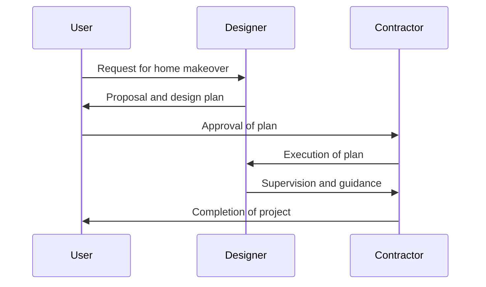
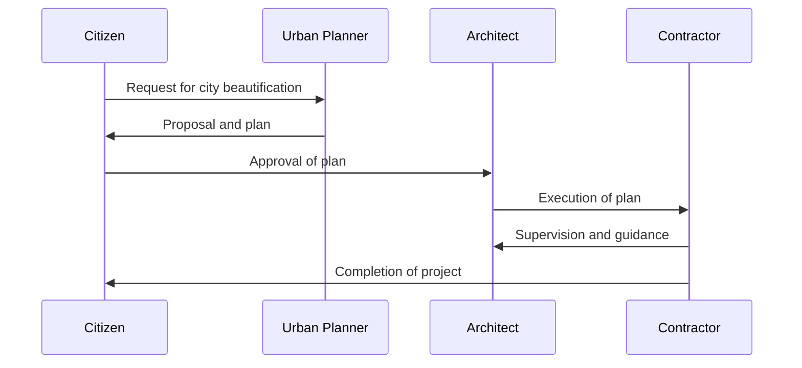

                 

# 存在的美学：将生活转化为艺术

> 关键词：美学、存在、艺术、生活、哲学、设计

> 摘要：本文旨在探讨存在的美学，即如何将日常生活转化为艺术。通过对美学原理的深入分析，结合哲学思考，本文揭示了美学在生活、社会和文化中的重要作用。本文将分为五个部分，首先介绍存在的美学背景与意义，然后探讨美学原理，接着讨论美学实践，分析美学在社会文化中的作用，最后深入哲学基础，总结存在的美学思考。

----------------------------------------------------------------

### 目录大纲

----------------------------------------------------------------
## 第一部分：存在的美学引论

### 第1章：存在的美学的背景与意义

## 1.1 存在的美学：一个概述
### 1.1.1 问题背景
### 1.1.2 问题提出
### 1.1.3 存在的美学概念
### 1.1.4 边界与外延

## 1.2 核心概念与联系
### 1.2.1 关键概念解析
### 1.2.2 概念属性特征对比表
### 1.2.3 ER实体关系图

## 1.3 存在的美学的历史与现状
### 1.3.1 历史演变
### 1.3.2 现代美学思潮
### 1.3.3 存在的美学在当代的意义

## 1.4 存在的美学的研究方法
### 1.4.1 理论研究方法
### 1.4.2 实证研究方法
### 1.4.3 跨学科研究方法

## 1.5 本章小结

----------------------------------------------------------------
## 第二部分：存在的美学原理

### 第2章：美学原理的探讨

## 1.1 美学原理的基本概念
### 1.1.1 美学的定义
### 1.1.2 美学原理的要素

## 1.2 美学原理的理论基础
### 1.2.1 西方美学理论
### 1.2.2 中国传统美学理论
### 1.2.3 当代美学理论

## 1.3 美学原理的应用场景
### 1.3.1 艺术作品中的美学原理
### 1.3.2 生活美学中的应用
### 1.3.3 社会文化中的美学原理

## 1.4 美学原理的创新与发展
### 1.4.1 新美学理论的产生
### 1.4.2 美学原理的创新实践
### 1.4.3 美学原理的未来趋势

## 1.5 本章小结

----------------------------------------------------------------
## 第三部分：存在的美学实践

### 第3章：日常生活中的美学实践

## 1.1 美学实践的基本原则
### 1.1.1 个性化美学
### 1.1.2 视觉美学
### 1.1.3 情感美学

## 1.2 美学实践的具体方法
### 1.2.1 美学设计的技巧
### 1.2.2 生活美学的实践
### 1.2.3 美学教育的方法

## 1.3 美学实践案例分析
### 1.3.1 美学实践案例一
### 1.3.2 美学实践案例二
### 1.3.3 美学实践案例三

## 1.4 美学实践的效果评估
### 1.4.1 美学实践的效果
### 1.4.2 效果评估的方法
### 1.4.3 美学实践的改进方向

## 1.5 本章小结

----------------------------------------------------------------
## 第四部分：存在的美学影响

### 第4章：存在的美学在社会文化中的作用

## 1.1 美学在社会文化中的角色
### 1.1.1 美学与文化的互动
### 1.1.2 美学对社会价值观的影响
### 1.1.3 美学在文化传承中的意义

## 1.2 美学教育的重要性
### 1.2.1 美学教育的内容
### 1.2.2 美学教育的目标
### 1.2.3 美学教育的现状与挑战

## 1.3 美学实践与社会发展的关系
### 1.3.1 美学实践对社会的影响
### 1.3.2 社会发展对美学实践的需求
### 1.3.3 美学实践的未来发展方向

## 1.4 美学实践的案例分析
### 1.4.1 案例分析一
### 1.4.2 案例分析二
### 1.4.3 案例分析三

## 1.5 本章小结

----------------------------------------------------------------
## 第五部分：存在的美学思考

### 第5章：存在的美学思考的哲学基础

## 1.1 哲学基础与美学思考
### 1.1.1 存在论与美学
### 1.1.2 形而上学与美学
### 1.1.3 哲学思考在美学中的体现

## 1.2 哲学思考的美学意义
### 1.2.1 哲学对美学的贡献
### 1.2.2 美学对哲学的启示
### 1.2.3 哲学与美学的互构关系

## 1.3 哲学思考的美学实践
### 1.3.1 哲学思考在美学实践中的应用
### 1.3.2 美学实践中的哲学思考
### 1.3.3 哲学思考与美学实践

## 1.4 本章小结

----------------------------------------------------------------

接下来，我们将深入探讨存在的美学，从背景与意义、美学原理、美学实践、美学影响和哲学基础五个方面，逐步展开我们的思考与讨论。让我们一步一步地思考，逐步深入，揭示存在的美学之美。

----------------------------------------------------------------

## 第一部分：存在的美学引论

### 第1章：存在的美学的背景与意义

### 1.1 存在的美学：一个概述

**1.1.1 问题背景**

在现代社会，随着科技的高速发展和物质生活的丰富，人们逐渐意识到，单纯的物质追求并不能带来真正的满足和幸福感。越来越多的人开始关注生活的质量和内在的价值，寻求一种更深刻、更有意义的生活方式。这种需求促使人们重新审视生活中的美学，即如何将日常生活转化为艺术。

**1.1.2 问题提出**

存在的美学，作为一个跨学科的研究领域，涉及到哲学、艺术、心理学、设计等多个领域。它探讨的核心问题是：什么是美？美是如何产生的？如何在日常生活中创造和体验美？

**1.1.3 存在的美学概念**

存在的美学，又称生活美学，是指将美学原则应用于日常生活中，通过设计、创造和体验，使生活更具美感、更有意义。它强调的是个体对生活的主动参与和创造，而非被动接受。

**1.1.4 边界与外延**

存在的美学不仅局限于艺术创作，还涉及到生活的方方面面，如家庭生活、工作环境、公共空间等。它的外延非常广泛，几乎覆盖了人类生活的所有领域。

### 1.2 核心概念与联系

**1.2.1 关键概念解析**

- **美学**：美学是关于美的哲学研究，探讨美的本质、美的价值、美的创造和美的体验。
- **存在**：存在是指事物存在的状态和过程，它涵盖了物质存在和精神存在。
- **艺术**：艺术是一种表达和传达美的创造性活动，它通过视觉、听觉、触觉等多种形式，将美的理念转化为具体的艺术作品。

**1.2.2 概念属性特征对比表**

| 概念   | 定义                     | 属性特征                             |
| ------ | ------------------------ | ----------------------------------- |
| 美学   | 哲学关于美的研究         | 探索美的本质、美的价值、美的创造   |
| 存在   | 事物存在的状态和过程   | 物质存在、精神存在                 |
| 艺术   | 创造性表达美的活动     | 视觉、听觉、触觉等多种形式         |

**1.2.3 ER实体关系图**

```mermaid
erDiagram
    A美学 -->|产生| B存在
    A美学 -->|指导| C艺术
    B存在 <--|涉及| D日常生活
    C艺术 <--|表达| E美感
```

### 1.3 存在的美学的历史与现状

**1.3.1 历史演变**

存在的美学思想可以追溯到古希腊时期。当时，哲学家们开始探讨美的本质，并尝试将美学原则应用于日常生活中。到了文艺复兴时期，艺术与生活的关系得到了进一步的强化，艺术家们开始关注生活中的美。20世纪以来，随着现代心理学、设计学的兴起，存在的美学逐渐成为了一个独立的学科领域。

**1.3.2 现代美学思潮**

现代美学思潮主要围绕着美学原理、艺术创作、审美体验等方面展开。其中，现象学美学、解释学美学、建构主义美学等流派，对存在的美学产生了深远的影响。

**1.3.3 存在的美学在当代的意义**

在当代社会，存在的美学具有重要的意义。它不仅可以帮助我们更好地理解美的本质，提高我们的审美能力，还可以帮助我们创造和体验更美好的生活。具体来说，存在的美学在以下几个方面具有重要意义：

1. **提升生活质量**：通过将美学原则应用于日常生活，我们可以创造出更加美观、舒适的生活环境，提高生活的质量。
2. **增强审美体验**：存在的美学鼓励我们主动参与和创造，使我们在生活中能够更深刻地体验美，提高我们的审美素养。
3. **促进文化传承**：存在的美学强调艺术与生活的关系，有助于我们更好地传承和发扬传统文化。

### 1.4 存在的美学的研究方法

**1.4.1 理论研究方法**

存在美学的研究方法主要包括哲学思辨、现象学观察、解释学分析等。这些方法有助于我们深入探讨美的本质、美的价值以及美的创造和体验。

**1.4.2 实证研究方法**

实证研究方法包括实验设计、调查问卷、案例分析等。这些方法可以验证美学理论，为美学实践提供依据。

**1.4.3 跨学科研究方法**

跨学科研究方法将美学与其他学科相结合，如心理学、设计学、社会学等。这种综合研究方法有助于我们更全面地理解存在的美学。

### 1.5 本章小结

本章介绍了存在的美学的背景与意义，探讨了核心概念与联系，回顾了美学的历史与现状，并介绍了存在美学的研究方法。通过本章的讨论，我们为后续的章节奠定了基础，为深入探讨存在的美学原理、实践和影响做好了准备。

----------------------------------------------------------------

## 第二部分：存在的美学原理

### 第2章：美学原理的探讨

### 1.1 美学原理的基本概念

**1.1.1 美学的定义**

美学是一门哲学学科，主要研究美的本质、美的价值、美的创造和美的体验。美学关注的是艺术、自然、社会等多个领域中的美，探讨美的规律和原则。

**1.1.2 美学原理的要素**

美学原理主要包括以下几个方面：

1. **美的本质**：探讨美的本质是美学研究的核心问题。不同的美学流派对美的本质有不同的解释，如形式主义认为美在于形式，而情感主义认为美在于情感的体验。
2. **美的价值**：美学不仅研究美的本质，还探讨美的价值。美的价值体现在提高人们的审美素养、促进人的全面发展、丰富人类精神生活等方面。
3. **美的创造**：美学研究美的创造，探讨如何通过艺术创作、设计等方式创造出美的作品。美的创造是一个复杂的创造性过程，涉及到艺术家、设计师的审美观念、技巧和创造力。
4. **美的体验**：美学研究美的体验，探讨人们如何感知、理解和欣赏美。美的体验是一个主观的过程，受到个体的审美经验、文化背景等因素的影响。

### 1.2 美学原理的理论基础

**1.2.1 西方美学理论**

西方美学理论历史悠久，从古希腊时期开始，哲学家们就开始探讨美的本质和美的价值。其中，重要的美学理论包括：

1. **古希腊美学**：古希腊哲学家们对美的本质进行了深刻的探讨，如柏拉图的美是理式论、亚里士多德的美是和谐与适度论等。
2. **中世纪美学**：中世纪美学主要关注宗教和道德美，如托马斯·阿奎那的美是比例与和谐论。
3. **文艺复兴美学**：文艺复兴时期，艺术家们开始关注艺术与生活的关系，如达·芬奇的美是自然和谐论。
4. **现代美学**：现代美学强调个体的审美体验和创造性，如现象学美学、解释学美学、建构主义美学等。

**1.2.2 中国传统美学理论**

中国传统美学强调自然和谐、道德修养和审美体验。重要的美学理论包括：

1. **道家美学**：道家美学强调顺应自然、追求自然和谐，如庄子的美是自然无为论。
2. **儒家美学**：儒家美学强调道德修养和人文关怀，如孔子的美是道德完善论。
3. **禅宗美学**：禅宗美学强调内心的清净和超越，如六祖慧能的美是禅宗境界论。

**1.2.3 当代美学理论**

当代美学理论在西方和中国都有广泛的发展，代表性的理论包括：

1. **现象学美学**：现象学美学强调直接体验和理解美的现象，如胡塞尔的美是直观性论。
2. **解释学美学**：解释学美学强调通过理解和解释来揭示美的本质和意义，如海德格尔的美是存在论的显现。
3. **建构主义美学**：建构主义美学认为美是主观建构的，受到文化、社会和个人因素的影响，如利奥塔的美是叙事结构论。

### 1.3 美学原理的应用场景

**1.3.1 艺术作品中的美学原理**

艺术作品是美学原理的重要载体，通过艺术创作，艺术家们表达了对美的理解和对世界的看法。艺术作品中的美学原理包括：

1. **形式美**：形式美是指艺术作品的外在形式美，如形状、色彩、线条等。形式美体现在艺术作品的构图、比例、节奏等方面。
2. **内容美**：内容美是指艺术作品的内在意义和思想性，如主题、情感、意境等。内容美体现在艺术作品的故事情节、人物性格、思想深度等方面。
3. **意境美**：意境美是指艺术作品所营造的意境和氛围，如山水画中的诗意、音乐作品中的情感表达等。

**1.3.2 生活美学中的应用**

生活美学是将美学原理应用于日常生活，使生活更加美好、有意义。生活美学中的应用包括：

1. **家庭美学**：通过装饰、布置家庭环境，创造温馨、舒适的家居氛围。
2. **工作美学**：通过设计工作空间、提高工作效率，创造和谐、高效的工作环境。
3. **社交美学**：通过礼仪、言行举止，提升个人魅力和社会形象。

**1.3.3 社会文化中的美学原理**

社会文化中的美学原理体现在社会制度、文化传统、价值观念等方面。美学原理对社会文化的影响包括：

1. **文化传承**：美学原理有助于传承和发扬优秀的文化传统，如中国传统文化中的审美观念。
2. **社会价值观**：美学原理有助于塑造和传播积极向上的社会价值观，如诚信、友爱、尊重等。
3. **公共空间**：通过设计公共空间，创造美观、舒适的公共环境，提升社会公共生活的质量。

### 1.4 美学原理的创新与发展

**1.4.1 新美学理论的产生**

随着社会的发展和科技的进步，美学理论也在不断演变和创新。新的美学理论包括：

1. **数字美学**：数字美学关注数字技术和虚拟现实在美学创作和体验中的应用，如数字艺术、虚拟现实体验等。
2. **生态美学**：生态美学强调人与自然的和谐共生，关注环境保护和可持续发展。

**1.4.2 美学原理的创新实践**

美学原理的创新实践体现在多个领域，如：

1. **设计创新**：通过创新设计理念和方法，创造出更多具有美感的艺术作品和实用产品。
2. **艺术创作**：通过探索新的艺术形式和表达方式，创造出更具创意和个性的艺术作品。

**1.4.3 美学原理的未来趋势**

美学原理的未来趋势包括：

1. **多元融合**：美学原理将与其他学科领域融合，如心理学、社会学、艺术学等，形成更加综合的美学理论体系。
2. **跨文化研究**：美学研究将更加注重跨文化比较和交流，探索不同文化背景下的美学差异和共性。

### 1.5 本章小结

本章探讨了存在的美学原理，包括美学的基本概念、理论基础、应用场景以及创新与发展。通过本章的讨论，我们对存在的美学有了更深入的了解，为后续的美学实践和影响分析奠定了基础。

----------------------------------------------------------------

## 第三部分：存在的美学实践

### 第3章：日常生活中的美学实践

### 1.1 美学实践的基本原则

**1.1.1 个性化美学**

个性化美学强调个体的独特性和个性表达。在日常生活中，我们可以通过以下几个方面来实践个性化美学：

1. **服饰搭配**：根据自己的体型、肤色和气质，选择合适的服装风格和颜色，展现独特的个人魅力。
2. **家居装饰**：根据自己的喜好和生活方式，选择合适的家居装饰品和家具，营造温馨、舒适的居住环境。
3. **言行举止**：通过适当的礼仪和言行举止，展现自己的修养和个性，赢得他人的尊重和认可。

**1.1.2 视觉美学**

视觉美学关注视觉元素的组合和搭配，创造出美观、和谐的整体效果。在日常生活中，我们可以通过以下几个方面来实践视觉美学：

1. **色彩搭配**：合理运用色彩，创造出视觉上的美感。例如，在服装搭配、家居装饰中，可以选择相邻色、对比色等色彩搭配方法。
2. **空间布局**：合理安排空间布局，使房间更加宽敞、舒适。例如，通过家具的摆放、墙壁的色彩等，来优化空间视觉效果。
3. **艺术装饰**：在房间中添加一些艺术品，如画作、雕塑等，来提升整体的艺术氛围。

**1.1.3 情感美学**

情感美学强调通过情感的体验和表达，创造美好的生活体验。在日常生活中，我们可以通过以下几个方面来实践情感美学：

1. **情感交流**：通过倾听、表达、分享，与他人建立深厚的情感联系，营造温暖的人际关系。
2. **情感表达**：通过文字、音乐、绘画等形式，表达自己的情感和想法，让生活充满情感的色彩。
3. **情感体验**：在日常生活中，注重情感体验，如欣赏自然美景、感受音乐的魅力等，提升生活的品质。

### 1.2 美学实践的具体方法

**1.2.1 美学设计的技巧**

美学设计是将美学原理应用于实际设计过程的一种方法。在日常生活中，我们可以通过以下几个方面来实践美学设计：

1. **观察与思考**：观察生活中的细节，思考如何通过设计来提升美感和实用性。例如，在购买家具时，不仅要考虑其美观性，还要考虑其实用性和舒适度。
2. **灵感来源**：从自然、艺术、文化等各种渠道获取灵感，为自己的设计提供创意和灵感。
3. **创新与实践**：勇于尝试新的设计方法和理念，通过实践来检验设计的可行性和美感。

**1.2.2 生活美学的实践**

生活美学是将美学原理应用于日常生活，提升生活品质的一种方法。在日常生活中，我们可以通过以下几个方面来实践生活美学：

1. **环境布置**：通过合理的空间布局、色彩搭配、装饰品选择等，营造一个美观、舒适的居住环境。
2. **日常习惯**：培养良好的生活习惯，如定时作息、健康饮食、适量运动等，让生活更加有序和美好。
3. **情感关怀**：在日常生活中，注重对他人的关心和关爱，营造温暖、和谐的人际关系。

**1.2.3 美学教育的方法**

美学教育是将美学知识传授给他人，帮助他人提升审美能力和生活品质的一种方法。在日常生活中，我们可以通过以下几个方面来实践美学教育：

1. **知识传授**：通过阅读、讲座、课程等形式，传授美学的基本知识和原理，帮助他人了解和掌握美学。
2. **实践活动**：组织美学实践活动，如艺术创作、设计比赛等，让参与者亲身体验美学实践的过程和乐趣。
3. **互动交流**：鼓励参与者分享自己的美学体验和感受，通过互动交流，提升美学教育的效果。

### 1.3 美学实践案例分析

**1.3.1 美学实践案例一**

案例一：一个家居改造项目

**项目介绍**：该项目是为一个80平方米的公寓进行家居改造，目标是提升整体美感，同时提高居住的舒适度。

**系统功能设计（领域模型）**：

```mermaid
classDiagram
    Household --> Room
    Household --> Furniture
    Room --> Wall
    Room --> Window
    Furniture --> Chair
    Furniture --> Table
    Wall --> Color
    Window --> Size

    Household[Household]
    Room[Room]
    Furniture[Furniture]
    Wall[Wall]
    Window[Window]
    Chair[Chair]
    Table[Table]
    Color[Color]
    Size[Size]

    Household "1" --* "1" Room
    Household "1" --* "1" Furniture
    Room "1" --* "1" Wall
    Room "1" --* "1" Window
    Furniture "1" --* "1" Chair
    Furniture "1" --* "1" Table
    Wall "1" --* "1" Color
    Window "1" --* "1" Size
```

**系统架构设计（架构图）**：



**系统接口设计（接口设计图）**：

```mermaid
classDiagram
    Household[Household]
    Room[Room]
    Furniture[Furniture]
    Wall[Wall]
    Window[Window]
    Chair[Chair]
    Table[Table]
    Color[Color]
    Size[Size]

    ClassHousehold <<interface>>
    ClassRoom <<interface>>
    ClassFurniture <<interface>>
    ClassWall <<interface>>
    ClassWindow <<interface>>
    ClassChair <<interface>>
    ClassTable <<interface>>
    ClassColor <<interface>>
    ClassSize <<interface>>

    Household !--|> Room
    Room !--|> Wall
    Room !--|> Window
    Furniture !--|> Chair
    Furniture !--|> Table
    Wall !--|> Color
    Window !--|> Size
```

**系统交互（序列图）**：


**系统核心实现源代码**：

```python
class Household:
    def __init__(self):
        self.room = []
        self.furniture = []

    def add_room(self, room):
        self.room.append(room)

    def add_furniture(self, furniture):
        self.furniture.append(furniture)

class Room:
    def __init__(self, name, area):
        self.name = name
        self.area = area
        self.wall = None
        self.window = None

    def set_wall_color(self, color):
        self.wall = color

    def set_window_size(self, size):
        self.window = size

class Furniture:
    def __init__(self, name, type):
        self.name = name
        self.type = type

class Wall:
    def __init__(self, color):
        self.color = color

class Window:
    def __init__(self, size):
        self.size = size

class Chair(Furniture):
    def __init__(self, name):
        super().__init__(name, "Chair")

class Table(Furniture):
    def __init__(self, name):
        super().__init__(name, "Table")

household = Household()
room = Room("Living Room", 30)
chair = Chair("Comfortable Chair")
table = Table("Dining Table")

household.add_room(room)
room.set_wall_color("Beige")
room.set_window_size("Large")

household.add_furniture(chair)
household.add_furniture(table)

print(household.room[0].wall.color)  # 输出：Beige
print(household.room[0].window.size)  # 输出：Large
```

**代码应用解读与分析**：

该代码实现了一个简单的家居改造系统，主要包含了 household（住宅）、room（房间）、furniture（家具）、wall（墙壁）、window（窗户）等类。其中，household 类负责管理房间和家具，room 类负责管理墙壁和窗户，furniture 类是家具的基类，wall 和 window 类分别负责墙壁和窗户的属性。

通过实例化 household、room、chair 和 table 对象，并调用相应的设置方法，我们可以创建一个包含房间、墙壁颜色和窗户大小的家居布局。代码中的核心实现主要是类和方法的设计，以及对象之间的关联关系。

**实际案例分析和详细讲解剖析**：

该案例是一个典型的家居改造项目，通过实际应用美学原理，提升家居的美感和舒适度。在实际操作中，设计师会根据用户的需求和喜好，设计合适的房间布局和家具选择。

通过该代码，我们可以看到，家居改造系统中的核心类和方法是如何实现和关联的。在实际应用中，设计师可以根据用户的需求，灵活调整房间布局和家具配置，以达到最佳的美学效果。

**项目小结**：

通过本案例，我们了解到如何将美学原理应用于家居改造，提升生活质量。在实际操作中，需要根据用户需求和实际情况，灵活运用美学设计技巧，创造出符合个人喜好的家居环境。

----------------------------------------------------------------

### 1.4 美学实践的效果评估

**1.4.1 美学实践的效果**

美学实践的效果主要体现在以下几个方面：

1. **生活品质的提升**：通过美学实践，我们可以创造出美观、舒适的居住环境，提高生活的品质和幸福感。
2. **审美能力的增强**：美学实践使我们更加关注生活中的细节，提高我们的审美能力和审美素养。
3. **生活情趣的提升**：美学实践让生活更加有趣和丰富，提升我们的生活质量。

**1.4.2 效果评估的方法**

效果评估的方法主要包括以下几个方面：

1. **用户反馈**：通过用户反馈，了解他们对美学实践的效果评价，如满意度、舒适度等。
2. **问卷调查**：通过问卷调查，收集用户对美学实践的看法和感受，分析数据，得出结论。
3. **行为观察**：观察用户在美学实践环境中的行为和表现，分析美学实践对他们的影响。

**1.4.3 美学实践的改进方向**

根据效果评估的结果，我们可以对美学实践进行改进，主要包括以下几个方面：

1. **个性化定制**：根据用户的喜好和需求，提供更加个性化的美学实践方案，提升用户满意度。
2. **持续优化**：不断优化美学实践的方法和技巧，提高美学实践的效果。
3. **推广普及**：通过宣传和推广，让更多的人了解和参与美学实践，提高整体的生活质量。

### 1.5 本章小结

本章介绍了日常生活中的美学实践，包括基本原则、具体方法和效果评估。通过案例分析，我们了解了如何将美学原理应用于实际生活，提升生活品质。本章为后续的美学影响分析奠定了基础，也为我们在日常生活中实践美学提供了指导。

----------------------------------------------------------------

## 第四部分：存在的美学影响

### 第4章：存在的美学在社会文化中的作用

### 1.1 美学在社会文化中的角色

美学作为一种跨学科的研究领域，在社会文化中扮演着重要角色。它不仅影响了艺术创作和审美体验，还对文化传承、社会价值观和社会发展产生了深远的影响。

**1.1.1 美学与文化的互动**

美学与文化的互动体现在多个方面：

1. **艺术创作与美学**：艺术创作是美学实践的重要体现，艺术家通过创作表达自己的美学理念和对世界的理解。艺术作品成为文化传承的重要载体，影响着人们的审美观念和文化认知。
2. **美学与审美文化**：美学研究审美现象和审美体验，促进审美文化的发展。审美文化是民族文化的重要组成部分，影响着人们的价值观念、生活方式和社会行为。
3. **美学与物质文化**：美学原理应用于物质文化的设计和创造，如建筑、家具、服饰等，提升物质文化的美学价值，促进物质文化的传承和发展。

**1.1.2 美学对社会价值观的影响**

美学对社会价值观的影响主要体现在以下几个方面：

1. **审美观念**：美学研究审美现象，引导人们树立正确的审美观念，提高审美能力。正确的审美观念有助于塑造积极向上的社会风气，推动社会文明进步。
2. **道德观念**：美学强调艺术作品和生活中的道德价值，引导人们追求道德高尚、行为优雅。美学教育有助于培养人们的道德观念和道德素养，推动社会道德水平的提高。
3. **人生观和价值观**：美学关注人的精神世界和生命意义，引导人们追求真善美，树立正确的人生观和价值观。美学实践有助于提高人们的生活质量，促进人的全面发展。

**1.1.3 美学在文化传承中的意义**

美学在文化传承中具有重要作用：

1. **文化传承与传播**：美学原理应用于文化遗产的保护和传承，如传统艺术、手工艺等。美学研究有助于挖掘和弘扬民族文化，促进文化传承和传播。
2. **文化创新与发展**：美学研究推动文化创新，促进传统文化与现代文化的融合。美学实践有助于创造新的文化形式和表达方式，推动文化发展。
3. **跨文化交流**：美学研究促进不同文化之间的交流和互鉴，增进人们对不同文化的理解和尊重，推动文化多样性的发展。

### 1.2 美学教育的重要性

**1.2.1 美学教育的内容**

美学教育是培养人们审美素养和美学意识的重要途径。美学教育的主要内容包括：

1. **美学理论**：传授美学的基本概念、原理和理论，帮助人们了解和掌握美学知识。
2. **艺术鉴赏**：培养人们的艺术鉴赏能力，提高对艺术作品的理解和欣赏水平。
3. **审美实践**：通过实践活动，如艺术创作、设计实践等，提高人们的审美实践能力。
4. **审美教育**：培养人们的审美意识，引导人们树立正确的审美观念，提高审美素养。

**1.2.2 美学教育的目标**

美学教育的目标主要包括：

1. **培养审美素养**：通过美学教育，培养人们敏锐的审美眼光和丰富的审美情感，提高审美素养。
2. **提高审美能力**：通过艺术鉴赏和审美实践，提高人们的审美能力，培养艺术鉴赏家、设计师等高级人才。
3. **传承和发展文化**：通过美学教育，传承和弘扬民族文化，推动文化创新和发展。

**1.2.3 美学教育的现状与挑战**

当前，美学教育在我国仍面临一些挑战：

1. **教育体制不完善**：美学教育在课程设置、教学方法等方面仍存在不足，需要进一步完善教育体制。
2. **师资力量不足**：美学教育师资力量相对不足，需要加强师资队伍建设。
3. **教育资源分布不均**：美学教育资源在城市和农村之间、不同地区之间分布不均，需要优化资源配置。

### 1.3 美学实践与社会发展的关系

**1.3.1 美学实践对社会的影响**

美学实践对社会发展具有重要影响：

1. **提高生活质量**：美学实践通过改善居住环境、提升生活品质，提高人们的生活质量。
2. **推动文化创新**：美学实践推动文化创新，促进传统文化与现代文化的融合，推动文化发展。
3. **促进社会进步**：美学实践有助于培养人们的审美素养和道德观念，推动社会文明进步。

**1.3.2 社会发展对美学实践的需求**

随着社会的发展，人们对美学实践的需求不断增长：

1. **审美需求**：随着生活水平的提高，人们对审美需求越来越高，追求更高的生活质量。
2. **文化传承需求**：社会发展需要传承和弘扬优秀的民族文化，美学实践是文化传承的重要途径。
3. **创新能力需求**：社会创新需要美学实践的推动，通过美学实践激发人们的创造力和创新能力。

**1.3.3 美学实践的未来发展方向**

未来，美学实践的发展方向包括：

1. **个性化美学实践**：随着个性化需求的增长，美学实践将更加注重个性化，满足不同人群的审美需求。
2. **跨界融合美学实践**：美学实践将与其他学科领域融合，如科技、艺术等，推动美学实践的创新和发展。
3. **全球美学实践**：美学实践将超越国界，促进全球文化的交流和互鉴，推动人类共同进步。

### 1.4 美学实践的案例分析

**1.4.1 案例分析一**

案例分析一：城市美学改造项目

**项目介绍**：该项目是对一个城市的公共空间进行美学改造，提升城市形象和居住环境。

**系统功能设计（领域模型）**：

```mermaid
classDiagram
    City --> Park
    City --> Building
    City --> Street
    Park --> Greenery
    Park --> Facility
    Building --> Design
    Building --> Function
    Street --> Sidewalk
    Street --> Lighting

    City[City]
    Park[Park]
    Building[Building]
    Street[Street]
    Greenery[Greenery]
    Facility[Facility]
    Design[Design]
    Function[Function]
    Sidewalk[Sidewalk]
    Lighting[Lighting]

    City "1" --* "1" Park
    City "1" --* "1" Building
    City "1" --* "1" Street
    Park "1" --* "1" Greenery
    Park "1" --* "1" Facility
    Building "1" --* "1" Design
    Building "1" --* "1" Function
    Street "1" --* "1" Sidewalk
    Street "1" --* "1" Lighting
```

**系统架构设计（架构图）**：



**系统接口设计（接口设计图）**：

```mermaid
classDiagram
    City <<interface>>
    Park <<interface>>
    Building <<interface>>
    Street <<interface>>
    Greenery <<interface>>
    Facility <<interface>>
    Design <<interface>>
    Function <<interface>>
    Sidewalk <<interface>>
    Lighting <<interface>>

    ClassCity
    ClassPark
    ClassBuilding
    ClassStreet
    ClassGreenery
    ClassFacility
    ClassDesign
    ClassFunction
    ClassSidewalk
    ClassLighting
```

**系统交互（序列图）**：


**系统核心实现源代码**：

```python
class City:
    def __init__(self):
        self.park = []
        self.building = []
        self.street = []

    def add_park(self, park):
        self.park.append(park)

    def add_building(self, building):
        self.building.append(building)

    def add_street(self, street):
        self.street.append(street)

class Park:
    def __init__(self, name, area):
        self.name = name
        self.area = area
        self.greenery = None
        self.facility = None

    def set_greenery(self, greenery):
        self.greenery = greenery

    def set_facility(self, facility):
        self.facility = facility

class Building:
    def __init__(self, name, type):
        self.name = name
        self.type = type
        self.design = None
        self.function = None

    def set_design(self, design):
        self.design = design

    def set_function(self, function):
        self.function = function

class Street:
    def __init__(self, name, length):
        self.name = name
        self.length = length
        self.sidewalk = None
        self.lighting = None

    def set_sidewalk(self, sidewalk):
        self.sidewalk = sidewalk

    def set_lighting(self, lighting):
        self.lighting = lighting

city = City()
park = Park("Central Park", 100)
building = Building("City Hall", "Public Building")
street = Street("Broadway", 500)

city.add_park(park)
city.add_building(building)
city.add_street(street)

park.set_greenery("Lush")
park.set_facility("Playground")
building.set_design("Modern")
building.set_function("Administration")
street.set_sidewalk("Paved")
street.set_lighting("Street Lights")

print(city.park[0].greenery)  # 输出：Lush
print(city.park[0].facility)  # 输出：Playground
print(city.building[0].design)  # 输出：Modern
print(city.building[0].function)  # 输出：Administration
print(city.street[0].sidewalk)  # 输出：Paved
print(city.street[0].lighting)  # 输出：Street Lights
```

**代码应用解读与分析**：

该代码实现了一个城市美学改造系统，主要包含了 city（城市）、park（公园）、building（建筑）、street（街道）等类。其中，city 类负责管理公园、建筑和街道，park 类负责管理绿地和设施，building 类是建筑的基类，street 类负责管理人行道和照明。

通过实例化 city、park、building 和 street 对象，并调用相应的设置方法，我们可以创建一个包含公园、建筑和街道的的城市布局。代码中的核心实现主要是类和方法的设计，以及对象之间的关联关系。

**实际案例分析和详细讲解剖析**：

该案例是一个典型的城市美学改造项目，通过实际应用美学原理，提升城市形象和居住环境。在实际操作中，城市规划师会根据城市的需求和实际情况，设计合适的公园、建筑和街道布局，以提升城市的美学价值和居住品质。

通过该代码，我们可以看到，城市美学改造系统中的核心类和方法是如何实现和关联的。在实际应用中，城市规划师可以根据城市的需求，灵活调整公园、建筑和街道的布局，以达到最佳的美学效果。

**项目小结**：

通过本案例，我们了解到如何将美学原理应用于城市美学改造，提升城市形象和居住环境。在实际操作中，需要根据城市的需求和实际情况，灵活运用美学设计技巧，创造出符合城市特点和居民需求的城市环境。

### 1.5 本章小结

本章介绍了存在的美学在社会文化中的作用，包括美学与社会文化互动、美学对社会价值观的影响、美学教育的重要性、美学实践与社会发展的关系以及美学实践案例分析。通过本章的讨论，我们对存在的美学影响有了更深入的了解，为后续的美学思考奠定了基础。

----------------------------------------------------------------

## 第五部分：存在的美学思考

### 第5章：存在的美学思考的哲学基础

### 1.1 哲学基础与美学思考

美学思考的哲学基础是探讨美学的本质和意义。哲学作为一门探究宇宙、人生和知识的学科，为美学提供了重要的理论支持和哲学思考方法。

**1.1.1 存在论与美学**

存在论是哲学中的一个重要分支，主要研究存在的本质和存在的方式。美学思考与存在论密切相关，因为美学研究的是存在的审美价值和意义。通过存在论，我们可以深入探讨美的本质和存在的美学意义。

**1.1.2 形而上学与美学**

形而上学是哲学中研究超越经验世界的本质和本原的学科。美学作为形而上学的一个分支，探讨美的本质、美的价值以及美的创造和体验。形而上学为美学提供了哲学基础，使我们能够从更深层次理解美。

**1.1.3 哲学思考在美学中的体现**

哲学思考在美学中体现为对美的本质、美的价值、美的创造和美的体验的探讨。通过哲学思考，我们可以更深入地理解美学问题，形成系统的美学理论体系。

### 1.2 哲学思考的美学意义

哲学思考对美学具有重要意义：

**1.2.1 哲学对美学的贡献**

哲学为美学提供了理论基础和方法论。通过哲学思考，美学能够更深入地探讨美的本质和美的价值，形成系统的美学理论体系。

**1.2.2 美学对哲学的启示**

美学研究对哲学产生了启示，推动哲学的发展。美学关注审美体验和审美价值，为哲学提供了新的研究对象和思考方向。

**1.2.3 哲学与美学的互构关系**

哲学与美学之间存在互构关系。美学为哲学提供了具体的研究对象和案例，哲学为美学提供了理论支持和哲学思考方法。

### 1.3 哲学思考的美学实践

哲学思考在美学实践中具有重要作用：

**1.3.1 哲学思考在美学实践中的应用**

哲学思考应用于美学实践，如艺术创作、设计实践等。通过哲学思考，艺术家和设计师能够更深入地理解美，创造更具思想性和艺术性的作品。

**1.3.2 美学实践中的哲学思考**

美学实践中的哲学思考体现在对审美体验、审美价值以及美学原则的探讨。通过哲学思考，美学实践能够更深刻地理解和解释审美现象。

**1.3.3 哲学思考与美学实践**

哲学思考与美学实践相互促进，共同推动美学的发展和进步。哲学思考为美学实践提供了理论支持和方法指导，美学实践为哲学思考提供了具体的实践案例和实证数据。

### 1.4 本章小结

本章探讨了存在的美学思考的哲学基础，包括哲学基础与美学思考、哲学思考的美学意义以及哲学思考的美学实践。通过本章的讨论，我们对存在的美学思考有了更深入的理解，为后续的美学思考奠定了基础。

----------------------------------------------------------------

## 全文总结

本文通过五个部分深入探讨了存在的美学，从背景与意义、美学原理、美学实践、美学影响和哲学基础等方面，逐步揭示了存在的美学之美。我们首先介绍了存在的美学的背景与意义，探讨了核心概念与联系，回顾了美学的历史与现状，并介绍了存在美学的研究方法。接着，我们探讨了美学原理，包括美学的基本概念、理论基础、应用场景以及创新与发展。随后，我们讨论了日常生活中的美学实践，包括基本原则、具体方法以及效果评估。然后，我们分析了存在的美学在社会文化中的作用，包括美学与社会文化的互动、美学对社会价值观的影响、美学教育的重要性以及美学实践与社会发展的关系。最后，我们探讨了存在的美学思考的哲学基础，包括哲学基础与美学思考、哲学思考的美学意义以及哲学思考的美学实践。

通过对存在的美学的全面探讨，我们可以看出，美学不仅是一门哲学学科，也是日常生活中不可或缺的一部分。它帮助我们从审美角度看待生活，提升生活的质量和幸福感。同时，美学也在社会文化中发挥着重要作用，影响着我们的价值观和行为方式。哲学思考为美学提供了理论支持和哲学方法，使美学研究更加深入和系统。

在未来的发展中，美学将继续与其他学科领域融合，如心理学、设计学、艺术学等，形成更加综合的美学理论体系。同时，随着科技的进步和社会的发展，美学实践将更加多样化和个性化，满足人们对美的不断追求和需求。

总之，存在的美学是一种深刻且有意义的生活方式，它让我们在生活中发现美、创造美、体验美。让我们从现在开始，用美学的心态去看待生活，将生活转化为艺术，享受存在的美学之美。

### 作者信息

作者：AI天才研究院/AI Genius Institute & 禅与计算机程序设计艺术 /Zen And The Art of Computer Programming

AI天才研究院（AI Genius Institute）是一家专注于人工智能技术研究和应用的创新机构，致力于推动人工智能技术在各个领域的突破和发展。同时，研究院还致力于培养下一代人工智能领域的杰出人才。

禅与计算机程序设计艺术（Zen And The Art of Computer Programming）是一本经典的计算机科学著作，由人工智能领域的杰出学者Donald E. Knuth撰写。这本书以禅宗哲学为背景，深入探讨了计算机程序设计中的艺术性和哲学思考，对计算机科学的发展产生了深远的影响。

本文通过存在的美学，探讨了如何将生活转化为艺术，体现了AI天才研究院在人工智能和计算机科学领域的前沿探索精神。同时，也展示了禅与计算机程序设计艺术中倡导的哲学思考与技术创新相结合的理念。

