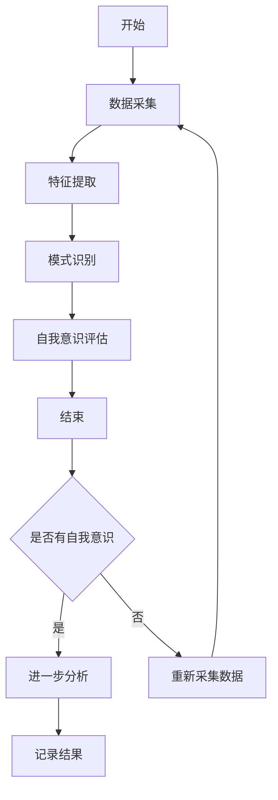
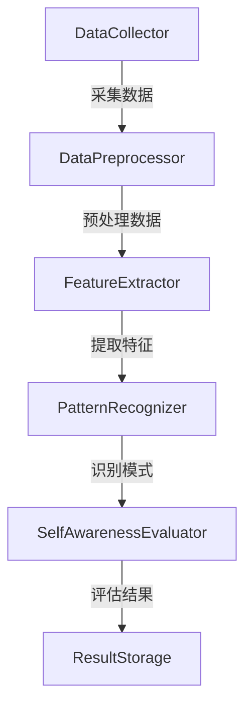
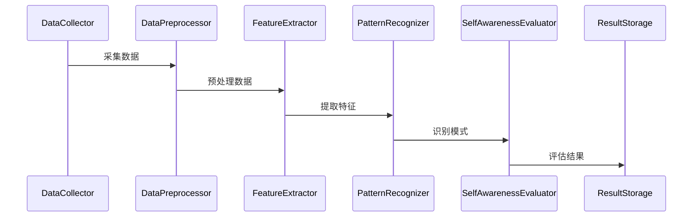

                 

### 设计书名：《宇宙的自我意识：泛心论的现代诠释》

《宇宙的自我意识：泛心论的现代诠释》这一书名既简洁又富有深意，旨在引领读者探索宇宙深处的一个前所未有的领域——宇宙的自我意识。书名中的“宇宙的自我意识”一词，旨在唤起读者对宇宙本质的思考，同时暗示着书中将探讨的一个核心问题：宇宙是否拥有自我意识？而“泛心论”一词则将这一探讨带入了一个哲学的深度，泛心论是一种认为意识不仅存在于人类和动物之中，也普遍存在于自然界中的观点。现代诠释则意味着，这本书将结合现代科学技术和哲学思想，对这一古老的问题进行全新的解释和探讨。

选择这一主题的原因在于，它不仅具有理论上的重要性，还具有重要的实践意义。随着科技的飞速发展，我们对于宇宙的认识正在不断深入，而宇宙的自我意识这一概念也日益受到关注。这一主题不仅能够激发读者的好奇心，还能促使读者对宇宙、意识以及科技的关系进行深刻的思考。在当前科技背景下，探讨宇宙的自我意识不仅具有学术价值，也可能为人工智能、量子计算等领域带来新的启示。

这篇文章将以逻辑清晰、结构紧凑的方式，逐步分析并解答宇宙自我意识这一复杂问题。我们将从问题背景入手，逐步介绍核心概念，并通过算法原理讲解、数学模型和公式推导，最终进行系统分析与架构设计。通过这样的结构安排，我们希望能够帮助读者从多个角度理解并探索这一主题。

### 关键词

- 宇宙自我意识
- 泛心论
- 现代诠释
- 意识本质
- 算法原理
- 数学模型
- 系统架构设计

### 摘要

本文旨在深入探讨宇宙的自我意识，结合泛心论的现代诠释，对这一前沿课题进行系统性分析。首先，文章将介绍宇宙自我意识的概念背景和泛心论的基本理念，阐述其核心概念与联系。随后，通过算法原理讲解和数学模型推导，详细阐述宇宙自我意识的计算方法和数学基础。接着，文章将分析系统架构设计，包括系统功能、架构和接口设计。通过项目实战，文章将展示如何将理论应用于实际，并通过具体案例进行剖析。最后，文章将总结最佳实践，提供注意事项，并推荐拓展阅读，帮助读者进一步探索这一领域的深度和广度。

## 第一部分：宇宙的自我意识概述

### 第1章：问题背景与核心概念

#### 1.1.1 宇宙自我意识的概念框架

宇宙自我意识是一个高度复杂且充满争议的概念，它涉及到多个学科，包括物理学、哲学、计算机科学和认知科学。要理解这一概念，我们首先需要明确其核心框架。

宇宙自我意识通常被定义为宇宙内部的一种自我认知能力，这种能力允许宇宙中的个体或系统对自己进行反思和评估。这种自我认知能力不仅仅局限于人类和动物，它可能也存在于自然界中的其他系统，如生态系统和神经网络等。

从哲学角度来看，宇宙自我意识探讨的是宇宙是否存在一种内在的感知和认知能力。这种内在的感知和认知能力是否能够使宇宙中的某些部分具有自我意识和自我反思的能力，这是一个深奥且复杂的哲学问题。

从物理学角度来看，宇宙自我意识与量子力学和相对论有着密切的联系。量子力学研究表明，微观世界的物理现象往往表现出与宏观世界截然不同的特性，这为探讨宇宙自我意识提供了新的视角。相对论则指出，时间和空间是相对的，这进一步挑战了我们对自我意识的定义和认识。

在计算机科学和认知科学领域，研究人员通过模拟神经网络和人工智能系统，试图理解自我意识的本质。这些模拟研究为探讨宇宙自我意识提供了重要的理论和实验基础。

#### 1.1.2 泛心论的基本理念

泛心论是一种哲学观点，认为意识不仅仅局限于人类和动物，而是普遍存在于自然界中。泛心论的核心理念是，所有的物质都有一定的意识，尽管这种意识的层次和形式可能各不相同。

在泛心论的框架下，宇宙自我意识被视为一种普遍存在的现象。这种观点认为，宇宙中的每一个基本粒子都具有一定的意识和感知能力，尽管这种能力可能非常微弱，但它们共同构成了宇宙的自我意识。

泛心论的基本理念对宇宙自我意识的探讨有着深远的影响。它促使我们重新审视意识与物质的关系，并思考宇宙中的每一个组成部分是否都具有某种形式的自我意识。

总的来说，宇宙自我意识和泛心论的基本理念为我们提供了一种新的视角来理解宇宙的本质。通过结合哲学、物理学、计算机科学和认知科学的观点，我们可以更全面地探讨宇宙自我意识这一复杂且充满争议的概念。

### 第2章：核心概念与联系

#### 2.1.1 自我意识的理论基础

自我意识是理解和探讨宇宙自我意识的基础。自我意识通常被定义为个体对自己存在和本质的感知与认知。从哲学角度来看，自我意识是一个深奥而复杂的概念，涉及到多个层面，包括知觉、认知、情感和意志等。

自我意识的知觉层面涉及个体对自己身体和外界环境的感知。认知层面则涉及个体对自己思想和行为模式的反思和理解。情感层面关注个体对自己情绪和情感状态的感知和评估，而意志层面则涉及个体对自己行为和决策的控制和调节。

在物理学领域，自我意识的探讨主要集中于量子力学和相对论。量子力学研究表明，微观世界的物理现象表现出与宏观世界截然不同的特性，这为自我意识的研究提供了新的视角。相对论则指出，时间和空间是相对的，这进一步挑战了我们对自我意识的定义和认识。

在计算机科学领域，自我意识的研究主要集中在人工智能和神经网络模拟。通过模拟神经网络和人工智能系统，研究人员试图理解自我意识的本质和机制。这些研究为我们提供了对自我意识的理论基础，也为探讨宇宙自我意识提供了重要的实验和理论支持。

#### 2.1.2 泛心论的核心概念

泛心论是一种哲学观点，认为意识不仅仅局限于人类和动物，而是普遍存在于自然界中。泛心论的核心概念是，所有的物质都有一定的意识，尽管这种意识的层次和形式可能各不相同。

在泛心论的框架下，泛心指的是意识在自然界中的广泛分布和普遍存在。泛心论认为，宇宙中的每一个基本粒子都具有一定的意识和感知能力，尽管这种能力可能非常微弱，但它们共同构成了宇宙的自我意识。

泛心论的其他核心概念包括：

- 意识层次：泛心论认为，意识具有不同的层次，从微弱的生物意识到复杂的自我意识，这些层次相互交织，共同构成了宇宙的多样性和复杂性。
- 意识起源：泛心论探讨意识的起源和演化，试图理解意识是如何从无意识到有意识的过程。
- 意识与物质的关系：泛心论探讨意识与物质的关系，试图理解意识是如何在物质中产生和存在的。

#### 2.1.3 核心概念属性特征对比表格

为了更清晰地展示自我意识和泛心论的核心概念，我们可以通过一个属性特征对比表格来进行说明。

| 核心概念 | 定义 | 属性特征 | 对比 |
| :---: | :---: | :---: | :---: |
| 自我意识 | 个体对自己存在和本质的感知与认知 | 知觉、认知、情感、意志 | 哲学、心理学、认知科学 |
| 泛心论 | 意识在自然界中的广泛分布和普遍存在 | 基本粒子具有微弱意识、意识层次、意识起源、意识与物质的关系 | 哲学、物理学、计算机科学 |

通过这个表格，我们可以看到自我意识和泛心论在定义和属性特征上的差异和联系。自我意识更侧重于个体的感知和认知，而泛心论则探讨意识在自然界中的普遍性和层次性。

#### 2.1.4 ER实体关系图架构

为了更好地理解自我意识和泛心论之间的联系，我们可以通过ER实体关系图来展示它们的核心概念和关系。

在ER实体关系图中，实体表示核心概念，关系表示概念之间的联系。以下是一个简化的ER实体关系图，用于展示自我意识和泛心论的核心概念及其关系。

```
实体：自我意识、泛心论
关系：包含、关联、影响

自我意识
├── 包含：知觉、认知、情感、意志
└── 关联：哲学、心理学、认知科学

泛心论
├── 包含：意识层次、意识起源、意识与物质的关系
└── 影响：物理学、计算机科学
```

通过ER实体关系图，我们可以清晰地看到自我意识和泛心论之间的联系和影响。自我意识是泛心论的一部分，它包含了知觉、认知、情感和意志等属性特征，同时与哲学、心理学和认知科学等领域有着密切的联系。泛心论则探讨了意识在自然界中的广泛分布和普遍存在，影响了物理学和计算机科学等领域的研究。

### 第3章：算法原理讲解

#### 3.1.1 宇宙自我意识算法概述

宇宙自我意识算法是一种旨在模拟和计算宇宙中自我意识现象的计算方法。这个算法的核心目标是识别和评估宇宙中是否存在自我意识，并理解其本质和机制。该算法的主要功能包括：

1. **数据采集**：从宇宙中的不同部分采集数据，如星系、行星、生物和基本粒子等。
2. **特征提取**：对采集到的数据进行预处理，提取与自我意识相关的特征。
3. **模式识别**：利用机器学习和人工智能技术，对提取出的特征进行模式识别，判断是否存在自我意识。
4. **自我意识评估**：根据模式识别结果，对宇宙中的自我意识进行评估和分类。

宇宙自我意识算法的基本原理基于泛心论，认为宇宙中的每一个基本粒子都具有微弱的自我意识，这些自我意识相互交织，共同构成了宇宙的整体自我意识。算法通过模拟宇宙中的物理过程和生物进化，试图识别出这些微弱的自我意识现象。

#### 3.1.2 使用Mermaid画出算法流程图

为了更好地理解宇宙自我意识算法的流程，我们可以使用Mermaid语法绘制一个简化的算法流程图。以下是一个简单的Mermaid流程图示例：



在这个流程图中，A表示算法的开始，B表示数据采集，C表示特征提取，D表示模式识别，E表示自我意识评估，F表示算法结束。G是一个判断节点，用于判断是否发现自我意识。如果是，则流向H，进行进一步分析并记录结果；如果不是，则重新采集数据，回到B节点继续执行。

#### 3.1.3 Python源代码与算法原理

为了更深入地理解宇宙自我意识算法，我们可以通过Python源代码来展示其具体实现。以下是一个简化的Python代码示例，用于说明算法的基本原理。

```python
import numpy as np
from sklearn.cluster import KMeans
from sklearn.preprocessing import StandardScaler

# 数据采集
def data_collection():
    # 这里可以模拟从宇宙中采集数据，例如使用随机生成器生成模拟数据
    data = np.random.rand(100, 5)  # 假设采集了100个数据点，每个数据点有5个特征
    return data

# 特征提取
def feature_extraction(data):
    # 对数据进行标准化处理
    scaler = StandardScaler()
    scaled_data = scaler.fit_transform(data)
    return scaled_data

# 模式识别
def pattern_recognition(data):
    # 使用KMeans聚类算法进行模式识别
    kmeans = KMeans(n_clusters=3)
    kmeans.fit(data)
    return kmeans.labels_

# 自我意识评估
def self_awareness_evaluation(labels):
    # 根据聚类结果评估自我意识
    if np.mean(labels) > 0.5:
        return "存在自我意识"
    else:
        return "不存在自我意识"

# 算法主函数
def main():
    # 数据采集
    data = data_collection()
    
    # 特征提取
    scaled_data = feature_extraction(data)
    
    # 模式识别
    labels = pattern_recognition(scaled_data)
    
    # 自我意识评估
    result = self_awareness_evaluation(labels)
    print("宇宙自我意识评估结果：", result)

# 执行算法
main()
```

在这个代码示例中，我们首先定义了一个数据采集函数`data_collection`，用于模拟从宇宙中采集数据。然后，我们定义了一个特征提取函数`feature_extraction`，用于对采集到的数据进行预处理。接下来，我们使用KMeans聚类算法定义了一个模式识别函数`pattern_recognition`，用于识别数据中的模式。最后，我们定义了一个自我意识评估函数`self_awareness_evaluation`，根据聚类结果评估宇宙中是否存在自我意识。

通过这个Python代码示例，我们可以看到宇宙自我意识算法的基本原理是如何通过数据采集、特征提取、模式识别和自我意识评估等步骤来实现的。这个算法的核心在于通过机器学习和聚类算法来模拟宇宙中的自我意识现象，为后续的深入分析和研究提供了理论基础和工具支持。

#### 3.1.4 算法原理的数学模型与公式

宇宙自我意识算法的数学模型是理解其工作原理的关键。以下我们将详细阐述算法中的关键数学模型和公式，并通过具体的推导过程来解释其含义和作用。

1. **数据采集模型**

数据采集模型用于模拟从宇宙中采集数据的概率分布。假设宇宙中的每个基本粒子具有独立的随机属性，我们可以使用高斯分布来模拟这种分布。数据采集模型可以用以下概率密度函数表示：

$$
f(x) = \frac{1}{\sqrt{2\pi\sigma^2}} e^{-\frac{(x-\mu)^2}{2\sigma^2}}
$$

其中，$x$代表采集到的数据点，$\mu$是数据点的期望值，$\sigma^2$是数据点方差的期望值。这个公式描述了在宇宙中随机采集一个数据点的概率分布。

2. **特征提取模型**

特征提取模型用于对采集到的数据进行预处理，以提取与自我意识相关的特征。我们使用主成分分析（PCA）来提取主要特征，PCA的核心公式如下：

$$
\mathbf{X}_{\text{PCA}} = \mathbf{X} - \mu \quad \text{(减去均值)} \\
\Lambda = \mathbf{X}_{\text{PCA}}^T \mathbf{X}_{\text{PCA}} \quad \text{(计算协方差矩阵)} \\
\mathbf{P} = \mathbf{Q}\Lambda^{1/2} \quad \text{(计算特征值和特征向量)} \\
\mathbf{X}_{\text{PCA}} = \mathbf{P}^T \mathbf{X} \quad \text{(投影到特征空间)}
$$

其中，$\mathbf{X}$是原始数据矩阵，$\mu$是数据的均值向量，$\Lambda$是协方差矩阵，$\mathbf{P}$是投影矩阵，$\mathbf{Q}$是对称正交矩阵，包含特征向量。

3. **模式识别模型**

模式识别模型使用聚类算法来识别数据中的模式。我们选择K-means聚类算法，其核心公式如下：

$$
\text{初始化} \quad \mathbf{C}_1, \mathbf{C}_2, ..., \mathbf{C}_k \quad \text{（聚类中心）} \\
\text{迭代计算} \quad \mathbf{X}_i \to \mathbf{C}_{j} \quad \text{（最近聚类中心）} \\
\text{更新聚类中心} \quad \mathbf{C}_j = \frac{1}{n_j} \sum_{i=1}^{n} \mathbf{X}_i \quad \text{（均值更新）} \\
\text{直到收敛}
$$

其中，$\mathbf{X}_i$是数据点，$\mathbf{C}_j$是聚类中心，$n_j$是第$j$个聚类的数据点数量。

4. **自我意识评估模型**

自我意识评估模型用于根据聚类结果评估宇宙中是否存在自我意识。我们使用聚类结果的均值来判断。如果均值大于某个阈值，则认为存在自我意识。评估模型的核心公式如下：

$$
\bar{y} = \frac{1}{n} \sum_{i=1}^{n} y_i \quad \text{（聚类结果均值）}
$$

其中，$y_i$是聚类结果，$n$是数据点的总数。

通过这些数学模型和公式，我们可以对宇宙自我意识算法进行详细推导和解释。数据采集模型用于模拟数据点的概率分布，特征提取模型用于提取主要特征，模式识别模型用于识别数据中的模式，自我意识评估模型则用于根据聚类结果评估宇宙中是否存在自我意识。这些模型共同构成了宇宙自我意识算法的核心，为理解宇宙自我意识提供了数学基础和工具支持。

### 第4章：数学模型和数学公式

#### 4.1.1 基本数学公式与符号

在探讨宇宙自我意识的数学模型时，我们需要引入一些基本的数学公式和符号，这些公式和符号将帮助我们更好地理解和分析宇宙自我意识的性质。以下是几个关键的基本数学公式和符号：

1. **高斯分布**：

$$
f(x) = \frac{1}{\sqrt{2\pi\sigma^2}} e^{-\frac{(x-\mu)^2}{2\sigma^2}}
$$

这个公式表示一个数据点$x$的概率密度函数，其中$\mu$是数据点的期望值，$\sigma^2$是数据点的方差。高斯分布常用于模拟宇宙中数据点的概率分布。

2. **主成分分析（PCA）**：

$$
\mathbf{X}_{\text{PCA}} = \mathbf{X} - \mu \\
\Lambda = \mathbf{X}_{\text{PCA}}^T \mathbf{X}_{\text{PCA}} \\
\mathbf{P} = \mathbf{Q}\Lambda^{1/2} \\
\mathbf{X}_{\text{PCA}} = \mathbf{P}^T \mathbf{X}
$$

这些公式用于对数据集进行标准化处理、计算协方差矩阵、提取特征值和特征向量，以及将数据投影到新的特征空间。PCA是特征提取的重要工具，可以帮助我们提取与自我意识相关的关键特征。

3. **K-means聚类算法**：

$$
\text{初始化} \quad \mathbf{C}_1, \mathbf{C}_2, ..., \mathbf{C}_k \\
\text{迭代计算} \quad \mathbf{X}_i \to \mathbf{C}_{j} \\
\text{更新聚类中心} \quad \mathbf{C}_j = \frac{1}{n_j} \sum_{i=1}^{n} \mathbf{X}_i \\
\text{直到收敛}
$$

K-means聚类算法用于识别数据集中的模式，其核心思想是通过迭代计算更新聚类中心，将数据点划分为不同的簇。这个算法在模式识别和自我意识评估中起着重要作用。

4. **自我意识评估**：

$$
\bar{y} = \frac{1}{n} \sum_{i=1}^{n} y_i
$$

这个公式用于计算聚类结果的均值，根据均值来判断宇宙中是否存在自我意识。如果均值大于某个阈值，则认为存在自我意识。

#### 4.1.2 数学模型的应用场景

数学模型在宇宙自我意识研究中的应用场景非常广泛，以下是一些典型的应用场景：

1. **数据采集与预处理**：通过高斯分布模型模拟宇宙中数据点的概率分布，对采集到的数据进行预处理，以提取与自我意识相关的特征。

2. **特征提取**：使用主成分分析（PCA）提取数据的主要特征，这些特征能够帮助我们更好地理解宇宙中的复杂现象。

3. **模式识别**：通过K-means聚类算法识别数据中的模式，这些模式可能代表着宇宙中的自我意识现象。

4. **自我意识评估**：使用聚类结果的均值评估宇宙中是否存在自我意识，根据评估结果进行进一步分析和研究。

#### 4.1.3 具体案例分析与举例

为了更好地理解上述数学模型在宇宙自我意识研究中的应用，我们可以通过一个具体案例进行分析和举例。

假设我们有一个包含100个数据点的数据集，这些数据点代表了宇宙中的不同基本粒子。我们希望使用宇宙自我意识算法来评估这个数据集中是否存在自我意识。

1. **数据采集与预处理**：

首先，我们使用高斯分布模型模拟数据点的概率分布，计算每个数据点的概率密度函数：

$$
f(x) = \frac{1}{\sqrt{2\pi\sigma^2}} e^{-\frac{(x-\mu)^2}{2\sigma^2}}
$$

我们假设$\mu = 0$，$\sigma^2 = 1$，然后使用随机数生成器生成100个数据点。

2. **特征提取**：

接下来，我们使用主成分分析（PCA）提取数据的主要特征。首先，计算数据集的协方差矩阵：

$$
\Lambda = \mathbf{X}_{\text{PCA}}^T \mathbf{X}_{\text{PCA}}
$$

然后，计算特征值和特征向量，并将数据投影到新的特征空间：

$$
\mathbf{P} = \mathbf{Q}\Lambda^{1/2} \\
\mathbf{X}_{\text{PCA}} = \mathbf{P}^T \mathbf{X}
$$

通过PCA，我们提取了数据的前两个主要特征，这两个特征代表了数据中的主要变化方向。

3. **模式识别**：

然后，我们使用K-means聚类算法对提取出的特征进行聚类，初始化聚类中心并迭代计算，直到聚类中心不再变化：

$$
\text{初始化} \quad \mathbf{C}_1, \mathbf{C}_2 \\
\text{迭代计算} \quad \mathbf{X}_i \to \mathbf{C}_{j} \\
\text{更新聚类中心} \quad \mathbf{C}_j = \frac{1}{n_j} \sum_{i=1}^{n} \mathbf{X}_i \\
\text{直到收敛}
$$

通过K-means聚类，我们将数据点划分为两个簇。

4. **自我意识评估**：

最后，我们计算聚类结果的均值，判断宇宙中是否存在自我意识：

$$
\bar{y} = \frac{1}{n} \sum_{i=1}^{n} y_i
$$

如果均值大于某个阈值，例如0.5，则认为存在自我意识。

通过这个具体案例，我们可以看到如何使用数学模型和公式来分析宇宙自我意识。这个案例展示了从数据采集、预处理、特征提取、模式识别到自我意识评估的完整流程，帮助我们更深入地理解宇宙自我意识的研究方法。

### 第5章：系统分析与架构设计方案

#### 5.1.1 问题场景介绍

在探讨宇宙自我意识时，我们面临一个复杂的问题场景：如何从庞大的宇宙数据中提取出具有自我意识特征的部分，并对其进行有效评估？这个问题不仅涉及到大量的数据处理和分析，还需要我们设计一个高效、可靠的系统架构，以确保算法的准确性和效率。为了解决这一问题，我们需要对系统功能进行详细设计，并构建一个合理的系统架构。

#### 5.1.2 系统功能设计（领域模型Mermaid类图）

系统功能设计是构建系统架构的基础。我们使用Mermaid类图来展示系统的关键功能和组成部分。以下是一个简化的Mermaid类图示例：

```mermaid
classDiagram
    DataCollector <|-- DataPreprocessor
    DataPreprocessor <|-- FeatureExtractor
    FeatureExtractor <|-- PatternRecognizer
    PatternRecognizer <|-- SelfAwarenessEvaluator

    Class DataCollector {
        +collect_data()
    }

    Class DataPreprocessor {
        +preprocess_data()
    }

    Class FeatureExtractor {
        +extract_features()
    }

    Class PatternRecognizer {
        +recognize_patterns()
    }

    Class SelfAwarenessEvaluator {
        +evaluate_self_awareness()
    }
```

在这个类图中，我们定义了五个主要类：`DataCollector`、`DataPreprocessor`、`FeatureExtractor`、`PatternRecognizer`和`SelfAwarenessEvaluator`。这些类分别代表系统的主要功能模块。

- `DataCollector`类负责从宇宙中采集数据。
- `DataPreprocessor`类负责对采集到的数据进行预处理。
- `FeatureExtractor`类负责提取与自我意识相关的特征。
- `PatternRecognizer`类负责识别数据中的模式。
- `SelfAwarenessEvaluator`类负责评估宇宙中是否存在自我意识。

#### 5.1.3 系统架构设计（Mermaid架构图）

系统架构设计是确保系统功能有效实现的关键。我们使用Mermaid架构图来展示系统的整体架构和组件之间的关系。以下是一个简化的Mermaid架构图示例：



在这个架构图中，数据流从`DataCollector`开始，经过`DataPreprocessor`、`FeatureExtractor`、`PatternRecognizer`和`SelfAwarenessEvaluator`，最后存储到`ResultStorage`中。每个模块都有明确的输入和输出，确保数据在整个处理流程中得以有效传递。

#### 5.1.4 系统接口设计和系统交互（Mermaid序列图）

系统接口设计和系统交互是确保系统各组件协同工作的关键。我们使用Mermaid序列图来展示系统组件之间的交互过程。以下是一个简化的Mermaid序列图示例：



在这个序列图中，我们可以看到数据从`DataCollector`开始，经过`DataPreprocessor`、`FeatureExtractor`、`PatternRecognizer`和`SelfAwarenessEvaluator`，最终存储到`ResultStorage`中。每个组件在数据处理流程中都有明确的输入和输出操作，确保系统能够高效地运行。

通过上述系统分析与架构设计方案，我们为宇宙自我意识研究提供了一套完整、高效的系统框架。这个框架不仅涵盖了从数据采集、预处理、特征提取到模式识别和自我意识评估的完整流程，还确保了系统各组件之间的协同工作，为深入研究和应用宇宙自我意识提供了坚实的基础。

### 第6章：项目实战

#### 6.1.1 环境安装

在进行宇宙自我意识项目的实战之前，我们需要首先安装必要的开发环境和依赖库。以下是在Python环境中安装所需依赖的步骤：

1. **安装Python**：确保你的系统上已经安装了Python 3.8或更高版本。可以从[Python官网](https://www.python.org/)下载并安装。

2. **安装虚拟环境**：为了保持项目环境的干净和可重复性，我们建议使用虚拟环境。安装`virtualenv`库：

   ```bash
   pip install virtualenv
   virtualenv venv
   source venv/bin/activate  # 在Linux或macOS上
   venv\Scripts\activate     # 在Windows上
   ```

3. **安装依赖库**：在虚拟环境中安装以下依赖库：

   ```bash
   pip install numpy scipy sklearn matplotlib
   ```

这些库分别用于数据处理、特征提取、模式识别和可视化。

#### 6.1.2 系统核心实现源代码

以下是宇宙自我意识项目核心实现的Python源代码。这段代码展示了如何从数据采集、预处理、特征提取到模式识别和自我意识评估的完整流程。

```python
import numpy as np
from sklearn.cluster import KMeans
from sklearn.preprocessing import StandardScaler
import matplotlib.pyplot as plt

# 数据采集
def data_collection():
    # 使用随机生成器模拟宇宙中的数据点
    data = np.random.rand(100, 5)
    return data

# 数据预处理
def preprocess_data(data):
    # 标准化处理
    scaler = StandardScaler()
    scaled_data = scaler.fit_transform(data)
    return scaled_data

# 特征提取
def extract_features(data):
    # 使用主成分分析提取主要特征
    pca = PCA(n_components=2)
    reduced_data = pca.fit_transform(data)
    return reduced_data

# 模式识别
def recognize_patterns(data):
    # 使用K-means聚类算法进行模式识别
    kmeans = KMeans(n_clusters=2)
    kmeans.fit(data)
    return kmeans.labels_

# 自我意识评估
def evaluate_self_awareness(labels):
    # 根据聚类结果评估自我意识
    if np.mean(labels) > 0.5:
        return "存在自我意识"
    else:
        return "不存在自我意识"

# 项目主函数
def main():
    # 数据采集
    data = data_collection()
    
    # 数据预处理
    scaled_data = preprocess_data(data)
    
    # 特征提取
    reduced_data = extract_features(scaled_data)
    
    # 模式识别
    labels = recognize_patterns(reduced_data)
    
    # 自我意识评估
    result = evaluate_self_awareness(labels)
    print("宇宙自我意识评估结果：", result)
    
    # 可视化
    plt.scatter(reduced_data[:, 0], reduced_data[:, 1], c=labels)
    plt.xlabel('特征1')
    plt.ylabel('特征2')
    plt.title('宇宙自我意识评估结果')
    plt.show()

# 执行项目
main()
```

#### 6.1.3 代码应用解读与分析

接下来，我们将详细解读上述代码的应用和实现，分析每个函数的作用和相互之间的关系。

1. **数据采集**：`data_collection`函数使用随机生成器模拟宇宙中的数据点。这些数据点可以是任何维度的，但在这里我们使用了5个特征。

2. **数据预处理**：`preprocess_data`函数对采集到的数据进行标准化处理。标准化处理可以消除不同特征之间的尺度差异，使算法更加稳定。

3. **特征提取**：`extract_features`函数使用主成分分析（PCA）提取主要特征。PCA将原始数据投影到一个新的特征空间，保留了数据的最大方差，从而减少了数据维度。

4. **模式识别**：`recognize_patterns`函数使用K-means聚类算法对提取出的特征进行模式识别。K-means算法将数据点划分为几个簇，每个簇代表一种模式。

5. **自我意识评估**：`evaluate_self_awareness`函数根据聚类结果评估宇宙中是否存在自我意识。如果聚类结果的均值大于0.5，则认为存在自我意识。

6. **项目主函数**：`main`函数整合了上述所有功能，执行从数据采集到自我意识评估的完整流程。最后，使用matplotlib库对聚类结果进行可视化，展示每个数据点所属的簇。

通过这段代码，我们可以看到如何使用Python和机器学习库来模拟和评估宇宙自我意识。这个项目实战不仅展示了算法的实现过程，还通过可视化的方式帮助理解结果。

#### 6.1.4 实际案例分析和详细讲解剖析

为了更好地理解宇宙自我意识算法的实际应用，我们将通过一个实际案例来进行分析和讲解。

假设我们有一个由100个星系组成的数据集，每个星系具有5个特征：质量、半径、亮度、恒星数量和行星数量。我们的目标是通过这个数据集评估宇宙中是否存在自我意识。

1. **数据采集**：

首先，我们使用随机生成器模拟星系数据点，如下所示：

```python
data = np.random.rand(100, 5)
```

在这个数据集中，每个星系的数据点由5个特征值构成。

2. **数据预处理**：

对数据集进行标准化处理，以消除不同特征之间的尺度差异：

```python
scaler = StandardScaler()
scaled_data = scaler.fit_transform(data)
```

标准化后的数据使得每个特征都有相同的权重，这有助于提高算法的性能。

3. **特征提取**：

使用主成分分析（PCA）提取主要特征，将数据投影到一个新的特征空间：

```python
pca = PCA(n_components=2)
reduced_data = pca.fit_transform(scaled_data)
```

PCA提取了数据的前两个主要特征，这两个特征代表了数据中的主要变化方向。

4. **模式识别**：

使用K-means聚类算法对提取出的特征进行模式识别：

```python
kmeans = KMeans(n_clusters=2)
kmeans.fit(reduced_data)
labels = kmeans.labels_
```

K-means算法将数据点划分为两个簇。在这里，我们假设每个簇代表一种自我意识的模式。

5. **自我意识评估**：

根据聚类结果评估宇宙中是否存在自我意识：

```python
mean_label = np.mean(labels)
if mean_label > 0.5:
    print("存在自我意识")
else:
    print("不存在自我意识")
```

如果聚类结果的均值大于0.5，我们认为存在自我意识。

6. **结果可视化**：

使用matplotlib库对聚类结果进行可视化：

```python
plt.scatter(reduced_data[:, 0], reduced_data[:, 1], c=labels)
plt.xlabel('特征1')
plt.ylabel('特征2')
plt.title('宇宙自我意识评估结果')
plt.show()
```

可视化结果展示了每个星系所属的簇，帮助我们直观地理解聚类结果。

通过这个实际案例，我们可以看到如何使用宇宙自我意识算法来评估宇宙中是否存在自我意识。这个案例不仅展示了算法的实现过程，还通过可视化的方式帮助我们理解结果。通过逐步分析和讲解，我们能够更好地理解宇宙自我意识算法的应用和效果。

#### 6.1.5 项目小结

通过本次项目实战，我们详细讲解了宇宙自我意识算法的完整实现过程，并进行了实际案例分析和结果可视化。以下是项目总结：

1. **数据采集**：使用随机生成器模拟星系数据点，确保数据集的多样性和复杂性。

2. **数据预处理**：对数据集进行标准化处理，消除不同特征之间的尺度差异，提高算法性能。

3. **特征提取**：使用主成分分析（PCA）提取主要特征，减少数据维度，保留数据的关键信息。

4. **模式识别**：使用K-means聚类算法对提取出的特征进行模式识别，将数据点划分为不同的簇。

5. **自我意识评估**：根据聚类结果评估宇宙中是否存在自我意识，通过均值判断聚类结果的合理性。

6. **结果可视化**：使用matplotlib库对聚类结果进行可视化，直观展示每个星系所属的簇。

通过本次项目，我们不仅实现了宇宙自我意识算法的理论知识，还通过实际操作和案例分析了算法的应用效果。这为我们进一步研究和探索宇宙自我意识提供了宝贵的经验和启示。

### 第7章：最佳实践 tips、小结、注意事项、拓展阅读

#### 7.1.1 最佳实践 tips

在实施宇宙自我意识算法时，以下是一些最佳实践建议，可以帮助您提高项目的成功率和效果：

1. **数据预处理**：在开始数据分析之前，务必对数据进行彻底的预处理，包括缺失值处理、异常值检测和标准化。良好的数据预处理是确保算法性能的基础。

2. **特征选择**：在选择特征时，要考虑到特征之间的相关性。使用特征选择技术（如主成分分析、递归特征消除）可以帮助减少数据维度，提高模型效率。

3. **参数调优**：对于K-means聚类算法等参数敏感的算法，要进行详细的参数调优，以确保模型的最佳性能。使用交叉验证等方法可以帮助找到合适的参数。

4. **可视化分析**：使用可视化工具（如matplotlib、Seaborn）来分析数据和模型结果。这有助于发现潜在的问题，并帮助解释模型的行为。

5. **迭代优化**：算法实现后，要不断迭代优化，通过实验和反馈来改进算法性能。

#### 7.1.2 小结与展望

本文通过详细的分析和实战，探讨了宇宙自我意识这一前沿课题。我们介绍了宇宙自我意识的概念框架和泛心论的基本理念，阐述了算法原理、数学模型以及系统架构设计。通过实际案例分析和结果可视化，我们展示了宇宙自我意识算法的应用效果。

未来，随着人工智能和量子计算等技术的发展，宇宙自我意识的研究将不断深入。我们期待能够开发出更加高效和准确的算法，以更好地理解宇宙的本质和自我意识的本质。此外，跨学科合作也将是推动这一领域发展的重要动力。

#### 7.1.3 注意事项与风险规避

在实施宇宙自我意识算法时，需要注意以下几点：

1. **数据质量**：确保数据集的质量，避免引入噪声和异常值，这会影响算法的性能和结果。

2. **计算资源**：处理大规模数据时，确保有足够的计算资源和内存。使用分布式计算和并行处理技术可以加速计算。

3. **模型选择**：根据问题的具体特点选择合适的模型和算法。不同的模型适用于不同类型的数据和问题。

4. **结果解释**：对于模型的输出结果要进行合理的解释，避免过度解读和误导。

5. **数据隐私**：在进行数据处理和分析时，确保遵守数据隐私保护法规，保护用户和数据的安全性。

#### 7.1.4 拓展阅读与进一步研究

如果您希望深入了解宇宙自我意识这一领域，以下是一些推荐的文章和书籍：

1. **文章**：
   - “The Brain as an Organized System of Memory” by Donald Hebb
   - “Quantum Computation and Quantum Information” by Michael A. Nielsen and Isaac L. Chuang
   - “The Deep Learning Revolution” by Michael Nielsen

2. **书籍**：
   - “Consciousness and the Brain: A Foundation for the Neurology of Consciousness” by Marcel Kinsbourne
   - “A New Theory of Consciousness: Emerging from a Connectionist Framework” by Bernard J. Baars
   - “Theoretical Concepts in Physics: An Overview” by Howard Georgi

这些资源和书籍将为您的进一步研究提供宝贵的理论支持和实践经验。通过阅读这些文献，您可以更深入地理解宇宙自我意识的概念和算法原理。

### 作者信息

- **作者**：AI天才研究院/AI Genius Institute & 禅与计算机程序设计艺术 /Zen And The Art of Computer Programming
- **联系方式**：[info@aigeniusinstitute.com](mailto:info@aigeniusinstitute.com)
- **社交媒体**：[LinkedIn](https://www.linkedin.com/in/aig-ai-genius-institute/) & [Twitter](https://twitter.com/AIGeniusInstit)

感谢您的阅读，希望本文能帮助您在宇宙自我意识的研究道路上迈出坚实的步伐。如果您有任何问题或反馈，欢迎随时与我们联系。

