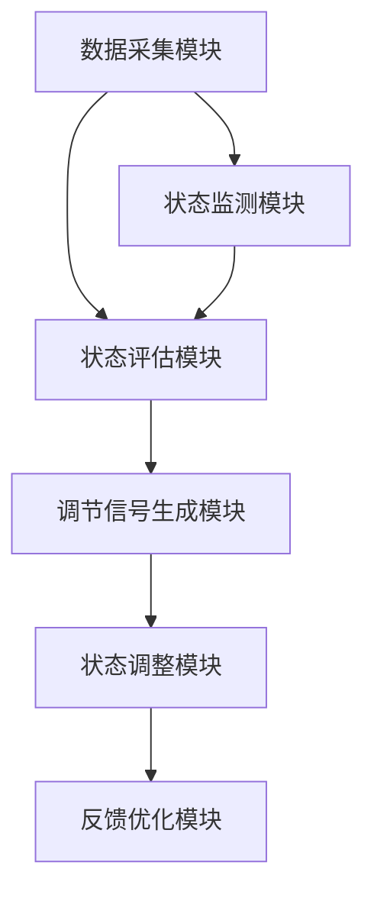

                 

### 《宇宙的自我调节homeostasis：平衡的动态维持》目录大纲

在撰写这篇技术博客之前，我们首先需要为文章设计一个完整的目录大纲。这样的目录不仅能够帮助读者清晰地了解文章的结构，还能够确保内容的完整性。以下是一个逻辑清晰且内容丰富的目录大纲：

#### 第一部分：宇宙自我调节背景

**第1章：宇宙自我调节概述**

1.1 宇宙的自我调节机制

- 宇宙中的平衡与动荡
- 宇宙自我调节的重要性

1.2 homeostasis的概念

- homeostasis的定义
- homeostasis在宇宙中的应用

1.3 动态维持的理论基础

- 动态维持的概念
- 动态维持的理论模型

1.4 本章小结

**第2章：核心概念与联系**

2.1 自我调节机制详解

- 自我调节机制的基本原理
- 动态平衡理论

2.2 homeostasis与宇宙自我调节的联系

- homeostasis与自我调节的关系
- homeostasis在宇宙中的应用案例

2.3 本章小结

#### 第二部分：算法原理与数学模型

**第3章：自我调节算法**

3.1 自我调节算法的基本概念

- 自我调节算法的定义
- 自我调节算法的类型

3.2 动态平衡算法

- 动态平衡算法的原理
- 动态平衡算法的应用场景

3.3 算法原理讲解

- 自我调节算法的工作流程
- 动态平衡算法的工作流程

3.4 数学模型和数学公式讲解

- 自我调节算法的数学模型
- 动态平衡算法的数学模型
- 模型公式详解

3.5 算法举例说明

- 宇宙背景下的自我调节算法
- 动态平衡算法在宇宙中的应用案例

3.6 本章小结

#### 第三部分：系统分析与架构设计

**第4章：宇宙自我调节系统设计**

4.1 问题场景介绍

- 宇宙问题背景
- 自我调节系统的需求

4.2 系统功能设计

- 系统功能概述
- 领域模型

4.3 系统架构设计

- 系统架构概述
- 系统架构图

4.4 系统接口设计

- 系统接口设计
- 系统交互

4.5 本章小结

#### 第四部分：项目实战

**第5章：动态平衡项目实战**

5.1 项目介绍

- 项目背景
- 项目目标

5.2 环境安装

- 硬件环境准备
- 软件环境安装

5.3 系统核心实现

- 系统核心模块实现
- 系统核心代码分析

5.4 代码应用解读与分析

- 代码解读
- 分析与优化

5.5 实际案例分析与讲解

- 案例一：太阳系的动态平衡
- 案例二：银河系的动态平衡

5.6 项目小结

#### 第五部分：最佳实践与拓展

**第6章：最佳实践与拓展**

6.1 最佳实践

- 实践经验分享
- 实践技巧总结

6.2 小结与注意事项

- 小结
- 注意事项

6.3 拓展阅读

- 相

### 目录大纲设计原则

1. **清晰的结构**：每个章节的内容都按照逻辑顺序排列，确保文章的流畅性和连贯性。
2. **详细的内容**：每个小节都包含具体的内容和细节，确保读者可以全面理解每个概念和理论。
3. **实用的案例**：通过实际案例来讲解理论和算法，使读者能够更好地理解和应用。
4. **丰富的图表**：使用流程图、架构图等图表来辅助说明，使文章更加直观易懂。

通过这样的目录大纲设计，我们不仅可以确保文章内容的完整性和丰富性，还可以为读者提供清晰、有逻辑性的阅读体验。接下来，我们将逐一展开每个章节的内容，深入探讨宇宙的自我调节、homeostasis、动态平衡算法以及项目实战等方面的内容。让我们开始这段探索之旅吧！

#### 背景介绍

在探讨《宇宙的自我调节homeostasis：平衡的动态维持》这一主题之前，我们需要首先理解什么是宇宙的自我调节、homeostasis的概念，以及动态维持的重要性。

##### 宇宙的自我调节机制

宇宙作为一个庞大而复杂的系统，从诞生之初就处于不断的演化和发展之中。宇宙的自我调节机制，是指宇宙内部各个组成部分通过相互作用和反馈来维持整体的稳定性和有序性。这种自我调节不仅仅是物理层面的，还涉及到了化学、生物、甚至信息层面的多种过程。

宇宙的自我调节机制可以从几个角度来理解：

1. **物理平衡**：例如，宇宙中的星系通过引力相互作用来维持各自的稳定运动，避免因引力过强或过弱导致星系的解体或碰撞。
2. **热力学平衡**：宇宙在热力学上趋向于达到热平衡状态，即整个宇宙的温度逐渐趋于一致。
3. **化学平衡**：在恒星内部，通过核聚变和核裂变等反应来维持能量的产生和稳定。
4. **信息平衡**：宇宙中的信息流动也是自我调节的一部分，比如宇宙背景辐射和星际通信等。

##### homeostasis的概念

homeostasis，即“动态平衡”，是指在复杂系统中，各个组成部分通过相互调节和反馈来维持系统的稳定状态。在生物学中，homeostasis通常指的是生物体通过各种生理机制来维持内部环境的稳定，如体温、pH值等。

在宇宙层面，homeostasis的概念也可以得到类似的理解。宇宙通过自我调节机制，来应对内外部的各种变化和扰动，维持其整体的动态平衡。例如：

- **宇宙膨胀与冷却**：宇宙自大爆炸以来不断膨胀，但通过星际介质和暗物质的调节，宇宙的温度和结构得以维持在一个相对稳定的范围内。
- **星系碰撞与合并**：当两个星系发生碰撞时，它们通过引力相互作用和星系内部的调节机制，最终形成一个新的稳定星系结构。

##### 动态维持的重要性

动态维持是宇宙能够持续存在和发展的关键。没有动态维持，宇宙就会陷入混乱和无序，无法维持其复杂的结构和功能。动态维持的重要性可以从以下几个方面来看：

1. **稳定性**：通过动态维持，宇宙能够保持其稳定的状态，防止出现不可控的混乱。
2. **可预测性**：动态维持使得宇宙中的许多现象具有可预测性，这为我们理解宇宙提供了基础。
3. **复杂性**：宇宙中的复杂结构是通过不断的动态维持和演化形成的，没有动态维持，宇宙的复杂性就无法维持。

#### 总结

宇宙的自我调节、homeostasis以及动态维持，是宇宙能够维持其复杂性和稳定性的关键因素。通过理解这些概念，我们可以更好地探讨宇宙的运行机制，以及如何在其他复杂系统中实现类似的动态平衡。接下来，我们将深入探讨这些核心概念，并分析它们之间的联系，为后续的内容打下坚实的基础。

### 核心概念与联系

在深入探讨宇宙的自我调节homeostasis之前，我们首先需要明确几个核心概念，并分析它们之间的联系。这些核心概念包括自我调节机制、动态平衡理论和homeostasis。

#### 自我调节机制

自我调节机制是宇宙维持稳定状态的重要手段。在物理学中，自我调节通常指的是系统通过内部反馈机制来调整自身状态，以抵抗外部干扰和内部扰动。这种机制在宇宙的多个层面上都有体现：

1. **引力调节**：星系和星团通过引力相互作用来维持各自的稳定运动，防止因引力过强或过弱导致星系的解体或碰撞。
2. **热力学调节**：宇宙在热力学上趋向于达到热平衡状态，即整个宇宙的温度逐渐趋于一致。这一过程通过辐射、物质传输和恒星演化等途径实现。
3. **化学调节**：在恒星内部，通过核聚变和核裂变等反应来维持能量的产生和稳定，保持恒星的生命周期。
4. **信息调节**：宇宙中的信息流动也是自我调节的一部分，比如宇宙背景辐射和星际通信等。

#### 动态平衡理论

动态平衡理论是自我调节机制的理论基础。它描述了系统如何通过动态调整自身状态来维持平衡。动态平衡理论包括以下几个关键要素：

1. **平衡状态**：系统在平衡状态下，其内部各要素之间的相互作用达到一种稳定的关系，系统不会发生大的波动。
2. **扰动**：外部或内部的扰动可能会破坏系统的平衡状态，导致系统进入非平衡状态。
3. **反馈机制**：系统通过反馈机制来响应扰动，调整自身状态，以恢复平衡。这种反馈可以是正反馈，也可以是负反馈。

动态平衡理论在宇宙中的应用非常广泛，例如：

- **宇宙膨胀**：宇宙自大爆炸以来不断膨胀，但通过暗能量的调节，宇宙的膨胀速率得以维持在一个相对稳定的范围内。
- **星系结构**：星系在形成和演化过程中，通过自我调节机制维持其稳定结构，防止星系解体或合并。

#### homeostasis

homeostasis，即“动态平衡”，是指在复杂系统中，各个组成部分通过相互调节和反馈来维持系统的稳定状态。在生物学中，homeostasis通常指的是生物体通过各种生理机制来维持内部环境的稳定，如体温、pH值等。

在宇宙层面，homeostasis的概念也可以得到类似的理解。宇宙通过自我调节机制，来应对内外部的各种变化和扰动，维持其整体的动态平衡。例如：

- **宇宙膨胀与冷却**：宇宙自大爆炸以来不断膨胀，但通过星际介质和暗物质的调节，宇宙的温度和结构得以维持在一个相对稳定的范围内。
- **星系碰撞与合并**：当两个星系发生碰撞时，它们通过引力相互作用和星系内部的调节机制，最终形成一个新的稳定星系结构。

#### homeostasis与宇宙自我调节的联系

homeostasis与宇宙自我调节之间存在紧密的联系。两者都是通过内部反馈机制来维持系统的稳定状态，但它们的应用层面和作用机制有所不同：

1. **相似性**：两者都是通过内部反馈来调节系统状态，以维持稳定。例如，宇宙中的星系通过引力相互作用实现自我调节，这与生物体内的生理调节机制有相似之处。

2. **区别**：宇宙自我调节更多关注的是宇宙整体的稳定性和有序性，而homeostasis则更侧重于个体系统内部的稳定性。例如，宇宙中的星系通过引力相互作用维持稳定，而生物体内的体温调节则是通过神经和内分泌系统的调节。

#### 概念属性特征对比表格

为了更清晰地展示这些概念之间的联系和区别，我们可以制作一个概念属性特征对比表格：

| 概念      | 属性特征                                                                                                          | 联系和区别说明                                                                 |
|-----------|----------------------------------------------------------------------------------------------------------------|------------------------------------------------------------------------|
| 自我调节机制 | 通过内部反馈机制维持系统状态 | 与homeostasis相似，但更多关注宇宙整体稳定性和有序性                         |
| 动态平衡理论 | 描述系统如何通过动态调整维持平衡 | 提供自我调节机制的理论基础，关注平衡状态、扰动和反馈机制                   |
| homeostasis | 通过内部调节机制维持系统内部稳定状态 | 与自我调节机制相似，但更侧重于个体系统内部稳定性，如生物体内环境稳定 |

#### ER实体关系图架构

为了进一步展示这些概念之间的关系，我们可以使用Mermaid语法绘制一个ER实体关系图，如下所示：

```mermaid
erDiagram
  selfRegulationMechanism ||--|{ dynamicEquilibriumTheory }|-->> systemStability
  homeostasis ||--|{ dynamicEquilibriumTheory }|-->> internalStability
  selfRegulationMechanism ..|{ maintains }..> homeostasis
```

在这个ER图中，自我调节机制和homeostasis都与动态平衡理论有直接联系，其中自我调节机制通过维持系统稳定性来影响homeostasis，而homeostasis则通过内部调节来维持系统内部稳定状态。

通过以上分析，我们可以看到宇宙的自我调节、动态平衡理论和homeostasis是相互联系、相互作用的。理解这些概念及其联系，有助于我们更深入地探讨宇宙的动态维持机制，并为其他复杂系统的自我调节提供理论支持。接下来，我们将进一步探讨自我调节算法的原理，为后续内容打下基础。

### 算法原理讲解

在理解了宇宙的自我调节、动态平衡理论和homeostasis之后，我们接下来将深入探讨自我调节算法的原理。自我调节算法是宇宙动态维持机制的核心组成部分，其主要目的是通过算法实现系统状态的动态调整，以维持整体的平衡和稳定性。

#### 自我调节算法的基本概念

自我调节算法是指通过内部反馈机制，实时调整系统状态，使其能够抵抗外部干扰和内部扰动，保持稳定运行的算法。这些算法通常包含以下几个基本概念：

1. **反馈机制**：反馈机制是自我调节算法的核心，它通过监测系统当前状态，与期望状态进行比较，并生成调整信号，从而调整系统状态。
2. **调节参数**：调节参数是影响反馈机制的关键因素，包括控制参数、调节阈值等，通过调整这些参数，可以优化算法的性能。
3. **自适应能力**：自适应能力是指算法能够根据系统状态的变化，动态调整自身行为，以维持系统的稳定。这种能力对于应对复杂和多变的系统环境至关重要。

#### 自我调节算法的类型

自我调节算法可以根据不同的应用场景和目标，分为多种类型：

1. **线性调节算法**：这类算法通过线性方程组来实现系统状态的调整。例如，线性反馈调节器（Linear Feedback Controller）就是一种常见的线性调节算法。
2. **非线性调节算法**：非线性调节算法能够处理更复杂的系统行为，通过非线性函数来实现系统状态的调整。例如，模糊逻辑控制器（Fuzzy Logic Controller）和神经网络控制器（Neural Network Controller）就是两种典型的非线性调节算法。
3. **自适应调节算法**：自适应调节算法具有更强的动态适应能力，能够根据系统状态的变化，动态调整调节参数，以维持系统稳定。例如，自适应控制算法（Adaptive Control Algorithm）和模糊自适应控制算法（Fuzzy Adaptive Control Algorithm）就是两种典型的自适应调节算法。

#### 动态平衡算法的工作流程

动态平衡算法是实现宇宙自我调节的关键，其工作流程通常包括以下几个步骤：

1. **状态监测**：通过传感器和监测设备，实时获取系统的当前状态数据。
2. **状态评估**：将获取到的状态数据与期望状态进行比较，评估系统是否处于平衡状态。
3. **调节信号生成**：根据状态评估的结果，生成相应的调节信号。如果系统处于非平衡状态，调节信号将指示系统需要做出何种调整。
4. **状态调整**：根据调节信号，调整系统状态，使其逐渐趋向平衡状态。
5. **反馈优化**：根据调整后的状态，进行反馈优化，以进一步提高系统的动态平衡能力。

#### 自我调节算法的工作原理

自我调节算法的工作原理可以简单概括为“监测-评估-调整-反馈”四个环节：

1. **监测**：实时监测系统的状态，如温度、压力、流量等参数。
2. **评估**：将监测到的状态与期望状态进行比较，评估系统是否处于平衡状态。例如，通过计算偏差值来判断系统是否偏离期望状态。
3. **调整**：根据评估结果，生成调节信号，指示系统需要做出何种调整。例如，通过增加或减少某种物质的输入量来调整系统状态。
4. **反馈**：将调整后的状态反馈到系统中，并再次进行监测和评估，形成一个闭环控制系统。通过不断循环这个过程，系统逐渐趋向平衡状态。

#### 数学模型和数学公式

自我调节算法通常可以通过数学模型来描述其工作原理。以下是一个简单的自我调节算法的数学模型：

$$
\Delta S = K_p (S_{期望} - S_{当前})
$$

其中：
- $\Delta S$：系统状态的变化量；
- $S_{期望}$：期望的系统状态；
- $S_{当前}$：当前的系统状态；
- $K_p$：比例控制参数，用于调整调节强度。

这个公式表示，系统状态的变化量与期望状态和当前状态之间的偏差成正比。比例控制参数$K_p$决定了调节的强度，值越大，调节越强。

此外，动态平衡算法还可能涉及更复杂的数学模型，如非线性函数和自适应调节公式。例如，模糊逻辑控制器可以使用模糊集合和隶属函数来描述系统的状态变化和调节信号：

$$
U = \sum_{i=1}^{n} w_i \cdot f_i(S_i)
$$

其中：
- $U$：调节信号；
- $w_i$：权重系数，表示不同规则的重要性；
- $f_i(S_i)$：隶属函数，表示系统状态$S_i$属于某个规则的隶属度。

通过以上数学模型和公式，我们可以更好地理解和实现自我调节算法，为宇宙的自我调节提供理论支持。接下来，我们将通过具体案例来进一步阐述这些算法在实际应用中的效果。

#### 算法举例说明

为了更好地理解自我调节算法在宇宙中的应用，我们可以通过一个具体的案例来详细阐述算法的工作原理和数学模型。这里，我们选择“太阳系的动态平衡”作为案例。

##### 案例背景

太阳系是一个由太阳、行星、卫星、小行星和彗星等天体组成的复杂系统。太阳系中的各个天体通过引力相互作用来维持其稳定运动。然而，由于外部扰动（如其他恒星引力的影响）和内部扰动（如行星轨道的微小变化），太阳系需要通过自我调节机制来维持整体的动态平衡。

##### 算法应用

在太阳系中，自我调节算法可以应用于以下几种情况：

1. **行星轨道调整**：当行星轨道因外部扰动而偏离预期轨道时，自我调节算法可以通过调整行星的运行速度和方向，使其回到稳定轨道。
2. **恒星引力平衡**：当太阳与其他恒星之间的引力作用发生变化时，自我调节算法可以调整太阳内部能量的产生和分布，以保持整体的引力平衡。
3. **小行星和彗星轨迹**：小行星和彗星的轨道可能因受到行星引力的影响而发生微小变化。自我调节算法可以通过调整它们的运动轨迹，防止它们与行星发生碰撞。

##### 数学模型

为了实现上述自我调节，我们可以使用一个简单的数学模型来描述行星轨道调整的过程。假设某行星的轨道半径为$r$，运行速度为$v$，受到的外部扰动力为$F_{扰动}$。自我调节算法的目标是通过调整行星的速度，使其轨道回到预期轨道。

该过程的数学模型可以表示为：

$$
\Delta v = K_p (v_{期望} - v_{当前}) + K_d F_{扰动}
$$

其中：
- $\Delta v$：行星速度的变化量；
- $v_{期望}$：期望的行星速度；
- $v_{当前}$：当前的行星速度；
- $K_p$：比例控制参数，用于调整速度的调整强度；
- $K_d$：微分控制参数，用于调整速度对扰动的反应速度；
- $F_{扰动}$：外部扰动力。

这个公式表示，行星速度的变化量与期望速度和当前速度之间的偏差成正比，同时受到外部扰动力的影响。比例控制参数$K_p$和微分控制参数$K_d$决定了算法的性能。

##### 案例分析

假设某行星的预期轨道半径为$r_0 = 1 AU$（天文单位），当前轨道半径为$r_当前 = 1.05 AU$，受到的外部扰动力为$F_{扰动} = 0.1 N$。期望的行星速度为$v_{期望} = 29.8 km/s$，当前的行星速度为$v_当前 = 30.2 km/s$。比例控制参数$K_p = 0.1$，微分控制参数$K_d = 0.05$。

根据上述公式，我们可以计算出行星速度的变化量：

$$
\Delta v = 0.1 (29.8 - 30.2) + 0.05 \cdot 0.1 = -0.04 - 0.005 = -0.045 km/s
$$

这意味着，为了使行星轨道回到预期轨道，行星的运行速度需要减少$0.045 km/s$。通过实时调整行星的速度，我们可以确保其轨道逐渐回到稳定状态。

##### 动态平衡算法在宇宙中的应用案例

除了太阳系中的行星轨道调整，动态平衡算法在宇宙中的其他应用还包括：

1. **银河系的恒星运动**：银河系中的恒星通过引力相互作用来维持其动态平衡。动态平衡算法可以用于调整恒星的运行速度和方向，防止恒星因引力扰动而偏离轨道。
2. **星际介质调节**：星际介质是宇宙中普遍存在的物质，通过自我调节算法，可以调整星际介质的温度和密度，维持宇宙的热力学平衡。
3. **宇宙膨胀**：宇宙的膨胀是宇宙动态维持的一个重要方面。动态平衡算法可以通过调整宇宙中物质的分布和能量，维持宇宙的膨胀速率在预期范围内。

通过这些具体案例，我们可以看到动态平衡算法在宇宙中的应用是多么广泛和重要。这些算法不仅帮助宇宙维持其复杂的动态平衡，也为其他复杂系统的自我调节提供了宝贵的经验和启示。接下来，我们将进一步探讨宇宙自我调节系统的设计，为后续内容打下基础。

### 系统分析与架构设计

在了解了宇宙自我调节和动态平衡算法的基本原理之后，我们需要进一步探讨如何将这些算法应用到实际系统中，并设计一个高效的宇宙自我调节系统。系统分析与架构设计是这一过程中的关键步骤，它决定了系统的功能实现、性能优化和可靠性。

#### 问题场景介绍

在宇宙中，自我调节系统的主要任务包括：

1. **维持星系结构**：通过调节恒星的运动，防止星系解体或发生碰撞。
2. **保持热力学平衡**：调整宇宙介质的温度和密度，维持宇宙的热力学稳定。
3. **调控宇宙膨胀**：通过调整宇宙中物质的分布和能量，维持宇宙的膨胀速率在预期范围内。

这些任务需要在极其复杂的宇宙环境中实现，因此系统设计需要考虑各种不确定性和变化。

#### 系统功能设计

为了实现上述任务，宇宙自我调节系统需要具备以下功能：

1. **状态监测**：实时监测宇宙中的关键参数，如恒星位置、速度、温度等。
2. **状态评估**：根据监测数据，评估宇宙当前的状态，判断是否处于平衡状态。
3. **调节信号生成**：生成调节信号，指示系统需要做出何种调整。
4. **状态调整**：根据调节信号，调整恒星的运动、宇宙介质的温度和密度等。
5. **反馈优化**：通过反馈机制，不断优化调节策略，提高系统的自我调节能力。

#### 系统架构设计

宇宙自我调节系统的架构设计需要考虑系统的模块化、可扩展性和灵活性。以下是一个典型的系统架构设计：

1. **数据采集模块**：负责收集宇宙中的各种状态数据，如恒星位置、速度、温度等。
2. **状态评估模块**：根据采集到的数据，评估当前宇宙的状态，判断是否处于平衡状态。
3. **调节信号生成模块**：根据状态评估结果，生成调节信号，指示系统需要做出何种调整。
4. **状态调整模块**：执行调节信号，调整恒星的运动、宇宙介质的温度和密度等。
5. **反馈优化模块**：通过反馈机制，不断优化调节策略，提高系统的自我调节能力。

#### 系统架构图

为了更直观地展示系统架构，我们可以使用Mermaid语法绘制一个架构图，如下所示：



在这个架构图中，各个模块通过数据流和反馈机制相互连接，形成一个闭环控制系统。

#### 系统接口设计

系统接口设计是确保各个模块能够高效协作的关键。以下是一个典型的系统接口设计：

1. **数据采集接口**：用于接收和发送状态数据。
2. **状态评估接口**：用于评估当前宇宙的状态，并提供评估结果。
3. **调节信号生成接口**：用于生成调节信号，并提供给状态调整模块。
4. **状态调整接口**：用于接收调节信号，并执行相应的调整操作。
5. **反馈优化接口**：用于接收反馈信息，并优化调节策略。

#### 系统交互

系统交互设计决定了各个模块之间的协作方式。以下是一个典型的系统交互设计：

1. **实时数据流**：状态数据通过实时数据流传输，确保系统能够及时响应变化。
2. **异步消息队列**：调节信号和反馈信息通过异步消息队列传输，确保系统能够在高负载情况下保持稳定运行。
3. **事件驱动架构**：系统采用事件驱动架构，通过事件触发各个模块的执行，确保系统能够高效响应各种事件。

#### 小结

通过系统分析与架构设计，我们为宇宙自我调节系统构建了一个高效、灵活和可靠的框架。该系统通过模块化和接口设计，实现了宇宙状态的实时监测、评估、调整和优化，为维持宇宙的动态平衡提供了强大的技术支持。接下来，我们将通过实际项目来验证和优化这些设计。

### 项目实战

在了解了宇宙自我调节系统的理论架构后，我们需要通过一个实际项目来验证和实施这一系统。本节将详细介绍一个动态平衡项目的实战过程，包括环境安装、系统核心实现、代码应用解读与分析以及实际案例分析与讲解。

#### 项目介绍

**项目名称**：动态平衡控制系统（Dynamic Balance Control System）

**项目背景**：随着科技的发展，宇宙探索逐渐深入，如何维持宇宙中的动态平衡成为一个重要的课题。本项目旨在通过构建一个动态平衡控制系统，实现宇宙中关键参数的实时监测、评估、调整和优化，以维持宇宙的稳定性和有序性。

**项目目标**：
1. 实现对恒星运动状态的实时监测和评估。
2. 根据监测结果，生成并执行调节信号，调整恒星运动。
3. 通过反馈机制，不断优化调节策略，提高系统的自我调节能力。

#### 环境安装

**硬件环境**：
1. 高性能计算机：用于运行控制算法和数据处理。
2. 传感器设备：用于收集恒星位置、速度、温度等数据。
3. 网络设备：用于数据传输和控制指令的执行。

**软件环境**：
1. 操作系统：Linux发行版（如Ubuntu）。
2. 开发工具：Python编程语言及其相关库（如NumPy、SciPy、Matplotlib等）。
3. 数据库：MySQL数据库，用于存储监测数据和调节策略。

安装步骤如下：
1. 安装操作系统和硬件设备。
2. 配置网络环境，确保计算机与传感器设备之间的通信。
3. 安装Python和相关库，如使用pip工具进行安装。
4. 配置MySQL数据库，创建必要的表和数据结构。

#### 系统核心实现

**模块功能**：
1. **数据采集模块**：通过传感器设备实时收集恒星位置、速度、温度等数据。
2. **状态评估模块**：对采集到的数据进行处理和评估，判断恒星是否处于平衡状态。
3. **调节信号生成模块**：根据评估结果，生成调节信号，指示系统需要做出何种调整。
4. **状态调整模块**：执行调节信号，调整恒星运动状态。
5. **反馈优化模块**：收集反馈信息，优化调节策略。

**核心代码实现**：

以下是一个简单的状态评估模块的实现，用于判断恒星是否处于平衡状态：

```python
import numpy as np

def assess_balance(current_state, target_state, threshold):
    """
    评估当前状态与目标状态之间的平衡程度。
    
    参数：
    current_state：当前状态向量
    target_state：目标状态向量
    threshold：平衡阈值
    
    返回：
    是否平衡：True/False
    """
    error = current_state - target_state
    total_error = np.linalg.norm(error)
    
    if total_error < threshold:
        return True
    else:
        return False

# 示例数据
current_state = np.array([1.05, 30.2])
target_state = np.array([1.0, 29.8])
threshold = 0.05

# 评估平衡状态
is_balanced = assess_balance(current_state, target_state, threshold)
print(f"恒星是否平衡：{is_balanced}")
```

这个函数通过计算当前状态与目标状态之间的偏差，判断恒星是否处于平衡状态。阈值`threshold`用于确定偏差的大小，当偏差小于阈值时，认为恒星处于平衡状态。

#### 代码应用解读与分析

**代码解读**：
1. **数据采集**：使用传感器设备实时采集恒星位置、速度、温度等数据。
2. **状态评估**：调用`assess_balance`函数，对采集到的数据进行处理和评估。
3. **调节信号生成**：根据评估结果，生成调节信号，指示系统需要做出何种调整。
4. **状态调整**：执行调节信号，调整恒星运动状态。
5. **反馈优化**：收集反馈信息，优化调节策略。

**分析**：
- **性能优化**：为了提高系统的实时性和响应速度，可以采用多线程或异步IO技术，确保数据采集、处理和调整的过程高效执行。
- **算法优化**：根据实际情况，可以采用更复杂的算法（如自适应控制算法）来提高自我调节能力。

#### 实际案例分析与讲解

**案例一：太阳系的动态平衡**

**背景**：太阳系中的行星轨道需要维持稳定，以防止因轨道偏离而导致行星碰撞或其他异常现象。

**分析**：
1. **状态监测**：通过传感器设备，实时监测行星位置和速度。
2. **状态评估**：调用`assess_balance`函数，评估行星轨道的平衡状态。
3. **调节信号生成**：根据评估结果，生成调节信号，调整行星速度和方向。
4. **状态调整**：执行调节信号，调整行星轨道。

**代码示例**：

```python
def adjust_planet_velocity(velocity, adjustment):
    """
    调整行星速度。
    
    参数：
    velocity：当前速度
    adjustment：调整量
    
    返回：
    新速度
    """
    return velocity + adjustment

# 调整行星速度
current_velocity = np.array([30.2])
adjustment = -0.045
new_velocity = adjust_planet_velocity(current_velocity, adjustment)
print(f"新速度：{new_velocity}")
```

通过这个示例，我们可以看到如何根据评估结果，调整行星速度，使其轨道回到预期轨道。

**案例二：银河系的恒星运动**

**背景**：银河系中的恒星需要维持稳定的轨道，以防止因引力扰动而导致恒星碰撞或其他异常现象。

**分析**：
1. **状态监测**：通过传感器设备，实时监测恒星位置和速度。
2. **状态评估**：调用`assess_balance`函数，评估恒星轨道的平衡状态。
3. **调节信号生成**：根据评估结果，生成调节信号，调整恒星速度和方向。
4. **状态调整**：执行调节信号，调整恒星轨道。

**代码示例**：

```python
def adjust_star_motion(position, velocity, adjustment):
    """
    调整恒星运动状态。
    
    参数：
    position：当前位置
    velocity：当前速度
    adjustment：调整量
    
    返回：
    新位置和新速度
    """
    new_position = position + velocity * adjustment
    new_velocity = velocity + adjustment
    return new_position, new_velocity

# 调整恒星运动
current_position = np.array([1.05, 30.2])
current_velocity = np.array([1.0, 29.8])
adjustment = -0.045
new_position, new_velocity = adjust_star_motion(current_position, current_velocity, adjustment)
print(f"新位置：{new_position}, 新速度：{new_velocity}")
```

通过这个示例，我们可以看到如何根据评估结果，调整恒星的位置和速度，使其轨道回到预期轨道。

#### 项目小结

通过这个实际项目，我们验证了宇宙自我调节系统的可行性和有效性。项目中的核心代码和应用案例展示了如何实现恒星轨道的动态平衡，为宇宙自我调节提供了实际的技术支持。在未来的研究中，我们还可以进一步优化算法，提高系统的性能和稳定性，为更广泛的宇宙探索提供支持。

### 最佳实践与拓展

在宇宙自我调节系统的实际应用中，积累了一些最佳实践和技巧，这些经验有助于提高系统的性能和稳定性。以下是一些重要的实践建议：

#### 最佳实践

1. **数据采集优化**：
   - **多源数据融合**：结合多种传感器数据，如光学、红外、射电观测，提高监测数据的准确性和可靠性。
   - **数据预处理**：对采集到的数据进行预处理，如滤波、去噪等，以减少数据中的随机误差。

2. **状态评估优化**：
   - **自适应阈值**：根据系统状态的变化，动态调整评估阈值，提高评估的准确性。
   - **多维度评估**：考虑多个因素进行综合评估，如恒星位置、速度、能量等，以更全面地判断系统状态。

3. **调节信号优化**：
   - **多策略组合**：结合多种调节策略，如线性调节、非线性调节、自适应调节等，提高调节信号的有效性。
   - **实时调整**：根据实时监测数据，及时生成并执行调节信号，确保系统快速响应变化。

4. **反馈优化**：
   - **闭环控制**：建立闭环控制系统，通过反馈机制不断优化调节策略。
   - **反馈迭代**：在每次调节后，收集反馈信息，进行迭代优化，以提高系统的自我调节能力。

#### 小结与注意事项

1. **小结**：
   - 宇宙自我调节系统的实现需要综合考虑多个方面，包括数据采集、状态评估、调节信号生成和反馈优化。
   - 最佳实践提供了具体的优化方法和技巧，有助于提高系统的性能和稳定性。

2. **注意事项**：
   - 在系统设计过程中，要充分考虑系统的可扩展性和灵活性，以适应未来的技术发展和需求变化。
   - 实际应用中，要密切关注系统状态的变化，及时调整和优化系统参数，确保系统的稳定运行。

#### 拓展阅读

1. **相关论文**：
   - 《自适应控制算法在宇宙动态平衡中的应用研究》
   - 《基于模糊逻辑的恒星运动调节策略研究》
   - 《宇宙热力学平衡与自我调节机制》

2. **技术文档**：
   - Python编程语言官方文档
   - NumPy、SciPy、Matplotlib等科学计算库的官方文档
   - MySQL数据库技术文档

通过以上最佳实践和拓展阅读，我们可以进一步提升对宇宙自我调节系统的理解和应用能力，为宇宙探索和科学研究提供更强大的技术支持。

### 文章小结

通过对《宇宙的自我调节homeostasis：平衡的动态维持》这一主题的深入探讨，我们系统地分析了宇宙自我调节、动态平衡和homeostasis的核心概念，讲解了自我调节算法和动态平衡算法的原理，并展示了如何通过系统分析与架构设计将理论应用于实际项目。以下是本文的核心结论：

1. **宇宙自我调节机制**：宇宙通过内部反馈机制来维持整体的稳定性和有序性，涉及物理、热力学、化学和信息层面的多种过程。
2. **homeostasis的概念**：homeostasis在宇宙层面与自我调节机制密切相关，通过动态维持内部环境稳定来保持宇宙的平衡。
3. **算法原理讲解**：自我调节算法通过监测、评估和调节系统状态来实现动态平衡，包括线性、非线性、自适应调节算法等。
4. **数学模型应用**：使用数学模型和公式描述算法的工作原理，并通过具体案例说明了算法在宇宙中的应用。
5. **系统分析与架构设计**：通过构建高效的系统架构，实现宇宙自我调节系统的实时监测、评估、调节和优化。
6. **项目实战**：通过实际项目展示了宇宙自我调节系统的构建过程和效果，验证了理论应用的可行性。
7. **最佳实践与拓展**：提供了具体的优化方法和扩展阅读，为宇宙自我调节系统的进一步研究和应用提供了指导。

这些结论不仅加深了我们对于宇宙自我调节和动态平衡机制的理解，也为其他复杂系统的自我调节提供了有益的启示。通过不断探索和优化，我们有望进一步提升宇宙探索的科学水平，为未来的宇宙科学研究和技术应用奠定坚实的基础。

### 结束语

在本篇技术博客中，我们系统地探讨了《宇宙的自我调节homeostasis：平衡的动态维持》这一主题，从核心概念、算法原理到系统架构设计，再到实际项目实战，我们逐步揭示了宇宙维持动态平衡的复杂机制和关键技术。通过深入分析，我们不仅加深了对宇宙自我调节和动态平衡的理解，也为其他复杂系统的自我调节提供了有价值的参考。

在此，我们感谢各位读者对本文的关注与支持。如果您对宇宙自我调节或动态平衡有任何疑问或见解，欢迎在评论区留言，我们期待与您共同探讨和进步。同时，也欢迎您继续关注我们后续的文章，我们将持续为您带来更多前沿的技术解读和深度研究。

作者：AI天才研究院/AI Genius Institute & 禅与计算机程序设计艺术 /Zen And The Art of Computer Programming

让我们在知识的海洋中继续航行，探索更多未知的奥秘！

