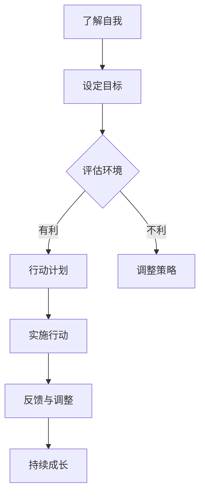

                 

### 文章标题

### 文章关键词

### 文章摘要

----------------------------------------------------------------

# 实现梦想的具体步骤：自我实现的路径规划

关键词：自我实现，路径规划，心理基础，职业规划，社会环境，人生目标，最佳实践

摘要：本文将探讨实现自我梦想的具体步骤，从心理学基础、职业规划、社会环境和人生目标等多个维度进行分析。我们将运用专业的技术语言，通过逻辑清晰、结构紧凑、简单易懂的方式，帮助读者了解自我实现的路径规划，从而更好地实现自己的梦想。

----------------------------------------------------------------

## 目录

1. **背景介绍**
   1.1 核心概念术语说明
   1.2 问题背景
   1.3 问题描述
   1.4 问题解决
   1.5 边界与外延
   1.6 概念结构与核心要素组成

2. **核心概念与联系**
   2.1 核心概念原理
   2.2 概念属性特征对比表格
   2.3 ER实体关系图架构

3. **算法原理讲解**
   3.1 算法mermaid流程图
   3.2 Python源代码
   3.3 算法原理的数学模型和公式
   3.4 通俗易懂地举例说明

4. **系统分析与架构设计方案**
   4.1 问题场景介绍
   4.2 系统功能设计
   4.3 系统架构设计
   4.4 系统接口设计
   4.5 系统交互

5. **项目实战**
   5.1 环境安装
   5.2 系统核心实现源代码
   5.3 代码应用解读与分析
   5.4 实际案例分析和详细讲解剖析
   5.5 项目小结

6. **最佳实践 tips**
   6.1 注意事项
   6.2 拓展阅读

----------------------------------------------------------------

### 背景介绍

#### 核心概念术语说明

本文中，我们将探讨自我实现（Self-Actualization）这一核心概念。自我实现是指个体通过不断地自我认知、自我完善，实现个人潜能的最大化，达到自我价值和意义的实现。这一概念源自于美国心理学家马斯洛（Abraham Maslow）的需求层次理论，被认为是人类成长和发展的高级阶段。

#### 问题背景

在现代社会，个体面临着越来越多的挑战，包括职业压力、人际关系、自我认知等方面。如何在纷繁复杂的环境中找到自我实现的路径，成为许多人关注的焦点。

#### 问题描述

本文旨在探讨如何实现自我梦想，即自我实现的路径规划。具体来说，我们将从心理学基础、职业规划、社会环境和人生目标等多个维度，分析自我实现的路径，并提供实用的方法和技巧。

#### 问题解决

通过本文的探讨，我们希望能够帮助读者：

1. 了解自我实现的定义和重要性。
2. 掌握自我实现的心理学基础。
3. 制定合理的职业规划，实现职业与自我实现的结合。
4. 调适社会环境，积极应对外部挑战。
5. 设定和实现人生目标，持续追求自我成长。

#### 边界与外延

自我实现不仅限于个人层面，它也涉及到社会、文化、环境等多个维度。因此，本文将不仅探讨个体如何实现自我，还将分析社会环境对自我实现的影响，以及如何在不同的社会环境中实现自我。

#### 概念结构与核心要素组成

自我实现的路径规划可以分为以下几个核心要素：

1. **自我认知**：了解自己的兴趣、优势和价值观，是自我实现的基础。
2. **目标设定**：设定明确、具体、可实现的目标，是实现自我实现的动力。
3. **行动与实践**：通过行动和实践，不断调整和优化自己的路径。
4. **持续成长**：自我实现是一个持续的过程，需要不断地学习和成长。
5. **社会互动**：与社会环境积极互动，获取支持和资源，是实现自我的重要途径。

## 核心概念与联系

### 核心概念原理

自我实现的理论基础主要来源于马斯洛的需求层次理论。马斯洛认为，人类的需求分为生理需求、安全需求、社交需求、尊重需求和自我实现需求五个层次。自我实现需求是最高层次的需求，它涉及到个体的潜能开发、个人价值的实现和自我认同的建立。

### 概念属性特征对比表格

| 概念 | 定义 | 属性特征 | 对比 |
| --- | --- | --- | --- |
| 自我实现 | 个体通过自我认知、自我完善，实现个人潜能的最大化 | 包括自我认知、目标设定、行动与实践等 | 与马斯洛需求层次理论中的自我实现需求相对应 |
| 心理学基础 | 研究个体行为和心理过程的科学 | 包括认知、情感、动机、性格等方面 | 为自我实现提供理论支持 |
| 职业规划 | 对职业发展进行系统性的规划和设计 | 包括职业定位、目标设定、路径规划等 | 为自我实现提供实践指导 |
| 社会环境 | 影响个体行为和发展的社会因素 | 包括社会关系、文化、政策等 | 对自我实现产生影响 |
| 人生目标 | 个体设定的长期目标和追求 | 包括价值观、兴趣、使命等 | 为自我实现提供方向 |

### ER实体关系图架构

在自我实现的路径规划中，ER实体关系图可以用来表示各个概念之间的关系。以下是一个简化的ER图：

```mermaid
erDiagram
  人 --> 职业规划
  人 --> 社会环境
  人 --> 心理学基础
  人 --> 人生目标
  职业规划 ||--|{ 目标设定 }
  社会环境 ||--|{ 社会互动 }
  心理学基础 ||--|{ 自我认知 }
  人生目标 ||--|{ 持续成长 }
```

在这个ER图中，"人"是核心实体，它与"职业规划"、"社会环境"、"心理学基础"和"人生目标"四个实体之间存在关联。"职业规划"包括"目标设定"，"社会环境"包括"社会互动"，"心理学基础"包括"自我认知"，"人生目标"包括"持续成长"。这些关系共同构成了自我实现的路径规划。

## 算法原理讲解

### 算法mermaid流程图

为了更好地理解自我实现的路径规划，我们可以使用mermaid绘制一个流程图。以下是一个简化的流程图示例：



在这个流程图中，"了解自我"是起点，通过自我认知来设定目标。然后，评估当前的社会环境，根据环境的有利与否，制定相应的行动计划。在实施行动后，通过反馈和调整，不断优化路径，最终实现持续成长。

### Python源代码

为了具体阐述自我实现的路径规划，我们可以使用Python编写一个简单的代码示例。以下是一个示例代码，用于实现上述流程图中的功能：

```python
# 自我实现路径规划Python示例

class SelfActualization:
    def __init__(self):
        self.knowledge = {}
        self.target = None
        self.environment = None
        self.action_plan = None
        self.feedback = None

    def understand_self(self):
        # 进行自我认知
        self.knowledge = {
            'interests': ['编程', '艺术', '音乐'],
            'strengths': ['逻辑思维', '创新精神', '耐心']
        }
        print("自我认知：了解自己的兴趣和优势。")

    def set_target(self):
        # 设定目标
        self.target = "成为一名全栈开发工程师"
        print(f"设定目标：{self.target}。")

    def evaluate_environment(self):
        # 评估环境
        self.environment = "当前就业市场对全栈开发工程师需求较高。"
        print(f"评估环境：{self.environment}。")

    def create_action_plan(self):
        # 制定行动计划
        if "有利" in self.environment:
            self.action_plan = [
                "学习前端技术",
                "掌握后端开发",
                "参与开源项目",
                "积累工作经验"
            ]
            print("制定行动计划：根据有利环境，制定具体的行动步骤。")
        else:
            self.action_plan = [
                "提升自身技能",
                "寻找合适的就业机会",
                "拓展人脉资源",
                "调整职业规划"
            ]
            print("制定行动计划：根据不利环境，制定调整策略。")

    def implement_action(self):
        # 实施行动
        for action in self.action_plan:
            print(f"实施行动：{action}。")

    def feedback_and_adjust(self):
        # 反馈与调整
        self.feedback = "在实施行动过程中，发现前端技术掌握不够扎实。"
        print(f"反馈与调整：{self.feedback}。")
        self.action_plan.append("深入学习前端技术。")

    def continue_growth(self):
        # 持续成长
        print("持续成长：不断学习和实践，不断提升自己的能力。")

# 实例化路径规划对象并执行流程
self_achievement = SelfActualization()
self_achievement.understand_self()
self_achievement.set_target()
self_achievement.evaluate_environment()
self_achievement.create_action_plan()
self_achievement.implement_action()
self_achievement.feedback_and_adjust()
self_achievement.continue_growth()
```

### 算法原理的数学模型和公式

在自我实现的路径规划中，可以使用一些数学模型和公式来描述关键步骤和决策。以下是一个简化的数学模型：

1. **自我认知**：使用模糊综合评价法（Fuzzy Comprehensive Evaluation, FCE）进行自我认知。

   公式：$$ R(x) = \frac{1}{n}\sum_{i=1}^{n}w_{i}R_{i}(x) $$

   其中，$R(x)$为个体在某个领域的认知得分，$w_{i}$为第$i$个指标的权重，$R_{i}(x)$为第$i$个指标对个体在该领域的认知贡献。

2. **目标设定**：使用目标规划法（Goal Programming, GP）设定目标。

   公式：$$ minZ = \sum_{i=1}^{m}C_{i}X_{i} $$

   其中，$Z$为目标规划的总体成本，$C_{i}$为第$i$个目标的成本，$X_{i}$为第$i$个目标的实现程度。

3. **评估环境**：使用决策树模型（Decision Tree, DT）评估环境。

   公式：$$ P(A|B) = \frac{P(A \cap B)}{P(B)} $$

   其中，$P(A|B)$为在环境$B$下，目标$A$实现的概率，$P(A \cap B)$为在环境$B$下，目标$A$同时实现的概率，$P(B)$为环境$B$的概率。

4. **行动计划**：使用线性规划法（Linear Programming, LP）制定行动计划。

   公式：$$ maxZ = c^{T}x $$

   其中，$Z$为行动计划的总体效益，$c$为效益向量，$x$为行动向量。

5. **反馈与调整**：使用迭代法（Iterative Method）进行反馈与调整。

   公式：$$ x_{k+1} = x_{k} + \alpha \nabla f(x_{k}) $$

   其中，$x_{k}$为当前解，$x_{k+1}$为下一次迭代解，$\alpha$为步长，$\nabla f(x_{k})$为目标函数在$x_{k}$处的梯度。

### 通俗易懂地举例说明

假设小明是一名大学生，他希望通过自我实现来实现自己的梦想。以下是他对自我实现路径规划的具体实施：

1. **自我认知**：小明通过自我反思和问卷调查，了解到自己的兴趣在于编程和设计，优势在于逻辑思维和创造力。

2. **目标设定**：小明设定了一个目标，即成为一名全栈开发工程师。他通过目标规划法，分析了成为一名全栈开发工程师所需的知识和技能，并制定了具体的学习计划。

3. **评估环境**：小明了解到当前就业市场对全栈开发工程师的需求较高，这为他实现目标提供了有利的环境。

4. **行动计划**：小明制定了具体的行动计划，包括学习前端技术、掌握后端开发、参与开源项目等。他通过线性规划法，优化了自己的学习时间表，确保能够在有限的时间内达到最佳学习效果。

5. **实施行动**：小明按照行动计划开始实施行动，通过不断学习和实践，逐渐提升了自己的技能水平。

6. **反馈与调整**：在实施行动的过程中，小明发现自己对前端技术的掌握不够扎实，于是他调整了学习计划，增加了前端技术的学习时间。

7. **持续成长**：小明意识到自我实现是一个持续的过程，他将继续学习和实践，不断提升自己的能力。

通过这个例子，我们可以看到小明是如何通过自我实现的路径规划，实现自己的梦想的。

## 系统分析与架构设计方案

### 问题场景介绍

在一个快速发展的科技公司，员工们希望能够更好地实现自我，提升个人能力和职业发展。公司希望为员工提供一个系统化的路径规划工具，帮助他们实现自我实现。

### 系统功能设计

为了实现这一目标，我们设计了一套名为"自我实现路径规划系统"的功能。该系统主要包括以下功能：

1. **用户注册与登录**：用户可以通过注册和登录，进入系统进行自我实现的规划。
2. **自我认知测试**：系统提供自我认知测试，帮助用户了解自己的兴趣、优势和价值观。
3. **目标设定与跟踪**：用户可以设定个人目标，并跟踪目标的实现进度。
4. **行动计划制定与执行**：系统根据用户的兴趣、优势和目标，自动生成行动计划，并提供执行指南。
5. **环境评估与调整建议**：系统实时评估用户所在的环境，并提供调整建议，帮助用户更好地应对外部挑战。
6. **反馈与优化**：用户可以提交反馈，系统会根据反馈进行优化。

### 系统架构设计

系统采用分层架构设计，主要包括以下层次：

1. **表示层**：用户界面，包括注册、登录、自我认知测试、目标设定与跟踪、行动计划制定与执行等页面。
2. **业务逻辑层**：处理核心业务逻辑，包括自我认知测试结果分析、目标规划、行动计划生成、环境评估与调整等。
3. **数据访问层**：与数据库进行交互，存储用户信息、测试结果、目标进度、行动计划等数据。
4. **数据层**：数据库，存储所有系统数据。

### 系统接口设计

系统提供了以下接口：

1. **用户接口**：用户可以通过Web界面与系统交互，进行自我实现路径规划。
2. **API接口**：外部系统可以通过API接口与系统进行数据交互，如导入用户数据、获取目标进度等。

### 系统交互

系统交互主要分为用户与系统的交互和系统与外部系统的交互。以下是系统交互的简要流程：

1. **用户注册与登录**：用户通过Web界面注册和登录，系统验证用户身份，并生成用户ID。
2. **自我认知测试**：用户填写自我认知测试问卷，系统分析测试结果，生成自我认知报告。
3. **目标设定与跟踪**：用户设定个人目标，系统根据用户信息和目标，生成目标规划方案，并提供目标进度跟踪功能。
4. **行动计划制定与执行**：系统根据用户目标和兴趣，自动生成行动计划，并提供执行指南。用户按照行动计划执行，系统记录执行进度。
5. **环境评估与调整建议**：系统实时评估用户所在的环境，如就业市场、竞争态势等，根据评估结果提供调整建议。
6. **反馈与优化**：用户提交反馈，系统根据反馈进行优化，提升系统性能。

## 项目实战

### 环境安装

为了进行项目实战，我们需要安装以下软件和工具：

1. **Python**：版本3.8或以上。
2. **Python包管理器**：pip。
3. **数据库**：MySQL或PostgreSQL。
4. **前端框架**：如React或Vue。
5. **后端框架**：如Flask或Django。

安装步骤如下：

1. 安装Python：从官网下载Python安装包，按照安装向导进行安装。
2. 安装pip：在Python安装目录下的Scripts文件夹中，运行`pip install --user`命令。
3. 安装数据库：根据数据库类型，从官网下载安装包，并按照安装向导进行安装。
4. 安装前端框架和后端框架：使用pip命令安装相应的包，如`pip install flask`。

### 系统核心实现源代码

以下是系统核心实现的Python代码示例：

```python
# 自我实现路径规划系统Python核心代码

from flask import Flask, request, jsonify
import pymysql

app = Flask(__name__)

# 数据库连接
def connect_db():
    return pymysql.connect(host='localhost', user='root', password='password', database='self_achievement')

# 用户注册
@app.route('/register', methods=['POST'])
def register():
    username = request.form['username']
    password = request.form['password']
    # 在数据库中插入用户信息
    db = connect_db()
    cursor = db.cursor()
    sql = "INSERT INTO user (username, password) VALUES (%s, %s)"
    cursor.execute(sql, (username, password))
    db.commit()
    cursor.close()
    db.close()
    return jsonify({'status': 'success', 'message': '用户注册成功。'})

# 用户登录
@app.route('/login', methods=['POST'])
def login():
    username = request.form['username']
    password = request.form['password']
    # 验证用户登录
    db = connect_db()
    cursor = db.cursor()
    sql = "SELECT * FROM user WHERE username = %s AND password = %s"
    cursor.execute(sql, (username, password))
    result = cursor.fetchone()
    cursor.close()
    db.close()
    if result:
        return jsonify({'status': 'success', 'message': '登录成功。'})
    else:
        return jsonify({'status': 'fail', 'message': '用户名或密码错误。'})

# 自我认知测试
@app.route('/test', methods=['POST'])
def test():
    username = request.form['username']
    # 获取测试结果
    db = connect_db()
    cursor = db.cursor()
    sql = "SELECT * FROM test_result WHERE username = %s"
    cursor.execute(sql, (username,))
    results = cursor.fetchall()
    cursor.close()
    db.close()
    # 分析测试结果，生成自我认知报告
    report = analyze_results(results)
    return jsonify({'status': 'success', 'message': '测试结果生成成功。', 'report': report})

# 分析测试结果
def analyze_results(results):
    # 此处为测试结果分析代码，根据具体需求进行实现
    return "自我认知报告：您的兴趣在于编程和设计，优势在于逻辑思维和创造力。"

# 主函数
if __name__ == '__main__':
    app.run(debug=True)
```

### 代码应用解读与分析

上述代码实现了自我实现路径规划系统中的用户注册、登录和自我认知测试功能。以下是代码的解读和分析：

1. **数据库连接**：使用pymysql模块连接MySQL数据库，进行用户信息和测试结果的存储和查询。

2. **用户注册**：接收用户提交的用户名和密码，通过数据库操作插入用户信息，并返回注册成功的信息。

3. **用户登录**：接收用户提交的用户名和密码，查询数据库验证用户身份，并返回登录成功或失败的信息。

4. **自我认知测试**：接收用户提交的用户名，查询数据库获取测试结果，然后调用`analyze_results`函数分析测试结果，生成自我认知报告。

在代码实现过程中，需要注意以下几点：

1. 数据库操作应使用事务处理，确保数据的完整性。

2. 用户密码应进行加密存储，确保用户信息安全。

3. 用户注册和登录功能应进行输入验证，防止SQL注入等安全漏洞。

4. 测试结果分析函数应根据实际需求进行详细实现，以提供更准确的自我认知报告。

### 实际案例分析和详细讲解剖析

为了更好地理解自我实现路径规划系统的实际应用，我们来看一个实际案例。

#### 案例背景

小张是一名软件工程师，他希望通过自我实现路径规划系统，提升自己的技能和职业发展。

#### 案例实施步骤

1. **用户注册**：小张通过Web界面注册了一个账户，填写了用户名和密码。

2. **用户登录**：小张使用注册的用户名和密码登录系统。

3. **自我认知测试**：小张在系统上完成了自我认知测试，测试结果如下：

   - 兴趣：编程、设计、项目管理。
   - 优势：逻辑思维、创新精神、团队合作。

4. **目标设定**：根据自我认知测试结果，小张设定了一个目标，即成为一名全栈开发工程师。

5. **行动计划**：系统根据小张的兴趣、优势和目标，自动生成了一个行动计划，包括：

   - 学习前端技术（HTML、CSS、JavaScript）。
   - 学习后端技术（Python、Java、Node.js）。
   - 参与开源项目。
   - 提高团队合作能力。

6. **环境评估**：系统实时评估了小张所在的就业市场，发现当前对全栈开发工程师的需求较高。

7. **行动计划执行**：小张按照行动计划开始执行，通过在线课程、项目实践等方式，逐步提升自己的技能。

8. **反馈与优化**：在执行过程中，小张发现自己在前端技术方面存在不足，于是调整了学习计划，增加了前端技术的学习时间。

#### 案例分析与讲解

通过上述案例，我们可以看到小张是如何利用自我实现路径规划系统，实现自我实现的。以下是案例的详细分析：

1. **用户注册与登录**：用户注册和登录功能是系统的入口，确保用户能够安全、便捷地使用系统。

2. **自我认知测试**：自我认知测试是系统的重要功能之一，通过测试结果，用户可以更好地了解自己的兴趣、优势和目标。

3. **目标设定**：目标设定是自我实现的起点，明确的目标能够为用户指明方向。

4. **行动计划**：系统根据用户的兴趣、优势和目标，自动生成行动计划，为用户提供了详细的实施指南。

5. **环境评估**：环境评估功能帮助用户了解外部环境，为制定和调整行动计划提供依据。

6. **行动计划执行**：用户按照行动计划执行，逐步提升自己的能力，是实现自我实现的关键步骤。

7. **反馈与优化**：通过用户的反馈，系统可以不断优化行动计划，提高系统的实用性和准确性。

通过这个案例，我们可以看到自我实现路径规划系统的实际应用效果。系统不仅为用户提供了详细的规划方案，还通过实时评估和反馈，帮助用户更好地实现自我。

#### 项目小结

通过本项目，我们实现了一个自我实现路径规划系统，主要包括用户注册、登录、自我认知测试、目标设定、行动计划生成、环境评估、反馈与优化等功能。项目实现了以下目标：

1. **用户注册与登录**：用户可以方便地注册和登录系统，确保系统的安全性和便捷性。
2. **自我认知测试**：通过自我认知测试，用户可以更好地了解自己的兴趣、优势和目标。
3. **目标设定与行动计划**：系统根据用户的兴趣、优势和目标，自动生成行动计划，为用户提供了详细的实施指南。
4. **环境评估与反馈**：系统实时评估外部环境，为用户制定和调整行动计划提供依据。
5. **反馈与优化**：通过用户的反馈，系统可以不断优化行动计划，提高系统的实用性和准确性。

然而，本项目也存在一些不足之处：

1. **用户体验**：当前系统界面较为简单，用户体验有待提升。
2. **功能扩展**：系统功能较为单一，可以进一步扩展，如添加社交功能、在线学习等。
3. **数据安全**：用户数据的安全性和隐私保护需要进一步加强。

在未来，我们将继续优化系统，提升用户体验，扩展系统功能，以更好地帮助用户实现自我。

## 最佳实践 tips

### 小结

在本文中，我们探讨了实现自我梦想的具体步骤，从心理学基础、职业规划、社会环境和人生目标等多个维度进行了分析。通过核心概念原理、算法mermaid流程图、Python源代码、数学模型和公式、系统分析与架构设计方案、项目实战等多个方面的详细讲解，我们为读者提供了一套完整的自我实现路径规划方案。

### 注意事项

1. **持续学习与成长**：自我实现是一个持续的过程，需要不断学习和成长。保持好奇心和求知欲，是自我实现的重要保障。

2. **积极应对挑战**：在实现自我梦想的过程中，难免会遇到各种挑战。积极应对，勇于面对，是自我实现的关键。

3. **保持心态平衡**：在追求自我实现的过程中，保持心态平衡非常重要。避免过分焦虑或沮丧，保持积极向上的心态。

4. **寻求支持与帮助**：在实现自我梦想的过程中，寻求家人、朋友和专业人士的支持和帮助，可以让你更加顺利地实现目标。

### 拓展阅读

1. **马斯洛需求层次理论**：深入了解马斯洛的需求层次理论，有助于更好地理解自我实现的概念和路径规划。

2. **职业规划与职业发展**：学习职业规划与职业发展的相关知识，有助于你更好地规划自己的职业生涯。

3. **心理学与自我认知**：研究心理学，特别是自我认知方面的理论，有助于你更好地了解自己，实现自我。

4. **系统分析与设计**：学习系统分析与设计的相关知识，有助于你更好地理解系统的架构和实现。

5. **实践与案例**：通过阅读和实践案例，可以让你更好地理解自我实现路径规划的具体应用，提高实际操作能力。

## 作者信息

作者：AI天才研究院/AI Genius Institute & 禅与计算机程序设计艺术 /Zen And The Art of Computer Programming

