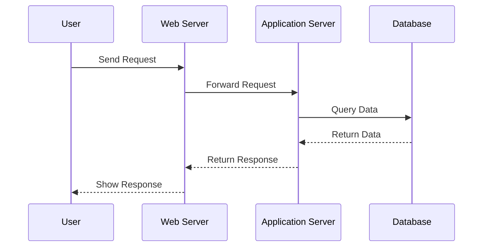
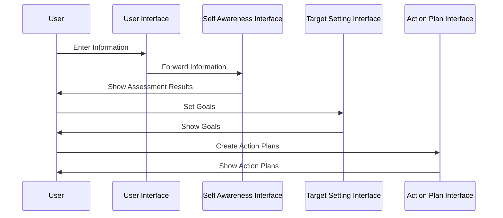
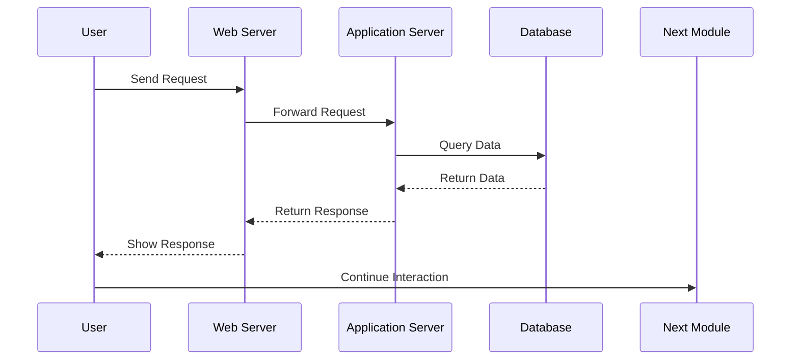

                 

### 实现梦想的路径规划：自我实现的具体步骤

在信息化时代，每个人都在追求自己的梦想，而实现梦想并非易事。路径规划是实现梦想的关键步骤，它能够帮助我们在纷繁复杂的环境中找到方向，确保我们每一步都朝着目标前进。本文将围绕实现梦想的路径规划，详细探讨自我实现的具体步骤。

#### 关键词：
- 梦想
- 路径规划
- 自我实现
- 理论基础
- 实践应用

#### 摘要：
本文首先介绍了实现梦想与路径规划的定义及其重要性。随后，通过理论基础的阐述，探讨了自我认知、目标设定和行动计划等核心概念。接着，通过实际案例，详细讲解了如何将路径规划应用于具体场景。最后，总结了最佳实践和注意事项，为读者提供实现梦想的实用指导。

---

## 1. 背景介绍与核心概念

### 1.1 问题背景与问题描述

在当今社会，个体价值的实现越来越受到重视。每个人都渴望实现自己的梦想，然而，许多人往往会因为缺乏明确的路径规划而感到迷茫和困惑。实现梦想不仅仅是设定一个目标，更重要的是要有一个清晰、可行的路径来达成这个目标。路径规划在这个过程中起到了至关重要的作用。

### 1.2 问题解决

路径规划是一个系统性工程，它涉及自我认知、目标设定、行动计划等多个方面。通过科学的路径规划，我们可以更好地理解自己的需求和潜在能力，设定合理的目标，并制定出切实可行的行动计划。这样一来，我们就能够在实现梦想的道路上稳步前行，减少盲目性和不确定性。

### 1.3 边界与外延

路径规划不仅适用于个人层面，还可以应用于组织和企业。在组织层面，路径规划可以帮助企业制定发展战略，明确发展方向和目标，从而提高企业的核心竞争力。在个人层面，路径规划可以帮助我们更好地规划职业生涯，实现职业目标。

### 1.4 概念结构与核心要素组成

路径规划的核心概念包括：

- **自我认知**：了解自己的兴趣、能力、价值观等。
- **目标设定**：明确自己的梦想和目标，并将其具体化。
- **行动计划**：制定实现目标的步骤和策略。
- **持续调整**：根据实际情况调整路径规划。

这些核心要素相互关联，构成了一个完整的路径规划体系。

---

## 2. 路径规划的理论基础

### 2.1 理论基础概述

路径规划的理论基础主要涉及自我认知、目标设定和行动计划三个方面。以下将分别进行探讨。

### 2.2 自我认知的重要性

自我认知是指对自己兴趣、能力、价值观等方面的认识。了解自己是实现梦想的第一步，只有清楚自己的优势和劣势，才能设定合理的目标，并制定出切实可行的行动计划。

### 2.3 目标设定理论

目标设定理论认为，明确的目标是成功的关键。一个明确的目标可以激发我们的动力，帮助我们集中精力，全力以赴。在设定目标时，需要注意以下几点：

- **具体性**：目标要具体，而不是模糊的。
- **挑战性**：目标要有一定的挑战性，但又要可达成。
- **时限性**：目标要有明确的完成时限。

### 2.4 行动计划的制定

行动计划是实现目标的步骤和策略。一个良好的行动计划应该包括以下几个方面：

- **目标分解**：将大目标分解为若干个小目标。
- **时间规划**：为每个小目标设定完成时间。
- **资源调配**：明确实现目标所需的资源，并进行合理调配。
- **执行策略**：制定具体的执行策略，确保行动有序进行。

---

## 3. 核心概念与联系

在这一部分，我们将详细探讨路径规划中的核心概念，并展示它们之间的联系。

### 3.1 梦想、目标和计划的定义

- **梦想**：梦想是对未来的一种美好期望和向往。
- **目标**：目标是将梦想具体化，明确自己想要实现的事情。
- **计划**：计划是实现目标的步骤和策略。

这些概念相互关联，共同构成了路径规划的核心。

### 3.2 概念属性特征对比

| 概念   | 定义                                                         | 属性特征                                         |
| ------ | ------------------------------------------------------------ | -------------------------------------------------- |
| 梦想   | 对未来的美好期望和向往                                       | 激发动力、指导方向                               |
| 目标   | 具体化的梦想，明确自己想要实现的事情                         | 具体性、挑战性、时限性                           |
| 计划   | 实现目标的步骤和策略                                         | 目标分解、时间规划、资源调配、执行策略           |

通过对比，我们可以更清晰地理解这些概念。

### 3.3 ER实体关系图

为了更好地理解核心概念之间的联系，我们可以使用ER实体关系图来展示。以下是路径规划核心概念的ER图：

```mermaid
erDiagram
  梦想 ||--|{ 目标 }
  目标 ||--|{ 计划 }
```

在这个ER图中，梦想是根实体，目标是子实体，计划是目标的子实体。这表示梦想、目标和计划之间存在紧密的层次关系。

---

## 4. 算法原理讲解

在这一部分，我们将使用Mermaid和Python代码来详细讲解路径规划的算法原理。

### 4.1 算法流程图

以下是路径规划算法的流程图：


### 4.2 Python代码示例

下面是一个简单的Python代码示例，用于实现路径规划：

```python
# 自我认知
def self_awareness():
    print("进行自我认知...")

# 目标设定
def set_goal():
    print("设定目标...")

# 行动计划
def make_plan():
    print("制定行动计划...")

# 执行与调整
def execute_and_adjust():
    print("执行计划并调整...")

# 主函数
def main():
    self_awareness()
    set_goal()
    make_plan()
    execute_and_adjust()

# 执行主函数
main()
```

### 4.3 算法原理

路径规划的算法原理主要涉及以下几个方面：

1. **自我认知**：通过了解自己的兴趣、能力和价值观，确定自己的优势和劣势。
2. **目标设定**：根据自我认知的结果，设定明确、具体、具有挑战性的目标。
3. **行动计划**：将大目标分解为若干个小目标，并为每个小目标设定时间规划和资源调配。
4. **执行与调整**：按照行动计划执行，并在执行过程中根据实际情况进行调整。

通过以上步骤，我们可以逐步实现梦想。

### 4.4 数学模型和公式

路径规划的数学模型和公式主要涉及以下几个方面：

1. **目标设定**：目标值 = 当前能力值 + 预期成长值
2. **行动计划**：完成时间 = 目标值 / 每日工作量
3. **执行与调整**：执行效率 = 实际完成值 / 目标设定值

通过这些公式，我们可以更准确地计算和规划路径。

---

## 5. 系统分析与架构设计方案

在这一部分，我们将介绍路径规划系统的整体架构设计，包括问题场景、系统功能设计、系统架构设计、系统接口设计和系统交互。

### 5.1 问题场景

路径规划系统旨在帮助用户实现个人和职业目标。在问题场景中，用户可以通过系统进行自我认知、目标设定和行动计划制定，从而更好地实现梦想。

### 5.2 系统功能设计

路径规划系统的功能设计主要包括以下几个方面：

1. **用户管理**：用户注册、登录、个人信息管理。
2. **自我认知**：用户进行自我评估，了解自己的兴趣、能力和价值观。
3. **目标设定**：用户设定个人和职业目标，并制定行动计划。
4. **行动计划管理**：用户查看、修改和调整行动计划。
5. **执行与调整**：用户按照行动计划执行，并在执行过程中进行反馈和调整。

### 5.3 系统架构设计

路径规划系统的架构设计采用前后端分离的方式。前端负责展示页面和用户交互，后端负责处理数据和逻辑。以下是系统架构的Mermaid图：



### 5.4 系统接口设计

路径规划系统的主要接口包括用户接口、自我认知接口、目标设定接口和行动计划接口。以下是接口的Mermaid图：



### 5.5 系统交互

路径规划系统的交互主要包括用户与系统之间的交互，以及系统内部模块之间的交互。以下是系统交互的Mermaid图：



通过以上架构设计，路径规划系统可以实现高效、稳定地运行，为用户提供优质的体验。

---

## 6. 项目实战

在本节中，我们将通过实际案例来讲解如何应用路径规划系统，实现自我实现。

### 6.1 环境安装

首先，我们需要安装路径规划系统的开发环境。以下是一个简单的安装流程：

1. 安装Python（版本3.8及以上）。
2. 安装Django框架。
3. 安装数据库（如MySQL、PostgreSQL等）。

### 6.2 系统核心实现源代码

路径规划系统的核心代码包括用户管理模块、自我认知模块、目标设定模块和行动计划模块。以下是部分源代码：

```python
# 用户管理模块
class UserManager(models.Model):
    username = models.CharField(max_length=50)
    password = models.CharField(max_length=50)
    email = models.EmailField()

# 自我认知模块
class SelfAwareness(models.Model):
    user = models.ForeignKey(UserManager, on_delete=models.CASCADE)
    interests = models.CharField(max_length=200)
    abilities = models.CharField(max_length=200)
    values = models.CharField(max_length=200)

# 目标设定模块
class Target(models.Model):
    user = models.ForeignKey(UserManager, on_delete=models.CASCADE)
    title = models.CharField(max_length=100)
    description = models.TextField()
    start_date = models.DateField()
    end_date = models.DateField()

# 行动计划模块
class ActionPlan(models.Model):
    target = models.ForeignKey(Target, on_delete=models.CASCADE)
    action = models.CharField(max_length=100)
    start_date = models.DateField()
    end_date = models.DateField()
    status = models.CharField(max_length=10)
```

### 6.3 代码应用解读与分析

以上代码分别实现了用户管理、自我认知、目标设定和行动计划的功能。以下是代码的解读和分析：

- **用户管理模块**：通过定义`UserManager`类，实现了用户注册、登录和用户信息管理功能。
- **自我认知模块**：通过定义`SelfAwareness`类，实现了用户自我评估功能，包括兴趣、能力和价值观的收集。
- **目标设定模块**：通过定义`Target`类，实现了目标设定功能，包括目标名称、描述、开始日期和结束日期的收集。
- **行动计划模块**：通过定义`ActionPlan`类，实现了行动计划制定功能，包括行动名称、开始日期、结束日期和状态的收集。

这些模块共同构成了路径规划系统的核心功能。

### 6.4 实际案例分析与详细讲解剖析

以下是一个实际案例的分析和详细讲解：

#### 案例背景

小王是一名大学生，他希望毕业后能够成为一名优秀的软件工程师。为了实现这个目标，他决定使用路径规划系统来制定自己的职业规划。

#### 案例分析

1. **自我认知**：小王通过路径规划系统的自我认知模块，了解了自己的兴趣在于软件开发，能力包括编程和项目管理，价值观在于创新和团队合作。

2. **目标设定**：小王在路径规划系统的目标设定模块中，设定了一个明确的目标：在毕业后成为一名优秀的软件工程师，具体包括：

   - 学会至少三种编程语言（Python、Java、C++）。
   - 参与至少一个开源项目。
   - 通过软件工程师认证考试。

3. **行动计划**：小王在路径规划系统的行动计划模块中，制定了一个详细的行动计划，包括：

   - 学习Python：每天学习2小时，持续3个月。
   - 学习Java：每天学习1小时，持续2个月。
   - 学习C++：每天学习1小时，持续2个月。
   - 参与开源项目：每周贡献代码，持续6个月。
   - 准备软件工程师认证考试：每周复习2小时，持续3个月。

#### 案例讲解剖析

通过路径规划系统，小王能够清晰地看到自己的职业目标，并制定了详细的行动计划。这使得他在实现梦想的道路上有了明确的方向和步骤。在执行过程中，小王可以根据实际情况进行调整，确保自己的进度和目标一致。

---

## 7. 最佳实践 Tips

在实现梦想的过程中，以下是一些最佳实践 Tips：

1. **定期自我反思**：定期审视自己的目标和进度，确保自己始终朝着正确的方向前进。
2. **设定短期目标**：将大目标分解为若干个短期目标，这样可以更容易实现，也能更好地保持动力。
3. **学会调整**：在执行过程中，根据实际情况进行调整，不要害怕改变。
4. **保持学习**：不断学习新知识，提升自己的能力和竞争力。
5. **寻求支持**：在实现梦想的过程中，寻求家人、朋友和专业人士的支持和帮助。

---

## 8. 小结

本文从实现梦想的路径规划入手，详细探讨了自我实现的具体步骤。通过理论基础的阐述，我们了解了自我认知、目标设定和行动计划的重要性。在实际案例中，我们看到了路径规划如何应用于个人和职业规划。最后，通过最佳实践 Tips，我们为读者提供了实现梦想的实用指导。

---

## 9. 注意事项

1. 路径规划并非一蹴而就，需要持续的努力和调整。
2. 保持积极的心态，面对困难和挫折时要保持耐心和毅力。
3. 定期回顾和评估自己的目标和进度，确保始终朝着正确的方向前进。

---

## 10. 拓展阅读

1. **《精进：如何成为一个很厉害的人》**：作者通过自身经历，分享了如何设定目标、制定计划和实现梦想的方法。
2. **《深度工作：如何有效利用每一点脑力》**：作者介绍了如何在信息爆炸的时代保持专注，提高工作效率。
3. **《高效能人士的七个习惯》**：作者提出了七个习惯，帮助人们建立良好的工作习惯，实现自我管理。

---

## 11. 作者信息

作者：AI天才研究院/AI Genius Institute & 禅与计算机程序设计艺术 /Zen And The Art of Computer Programming

---

通过本文的阅读，希望读者能够对实现梦想的路径规划有更深刻的理解，并能够将其应用到自己的生活和工作中。祝愿每一位读者都能实现自己的梦想！### 实现梦想的路径规划：自我实现的具体步骤

在信息化时代，每个人都在追求自己的梦想，而实现梦想并非易事。路径规划是实现梦想的关键步骤，它能够帮助我们在纷繁复杂的环境中找到方向，确保我们每一步都朝着目标前进。本文将围绕实现梦想的路径规划，详细探讨自我实现的具体步骤。

#### 关键词：
- 梦想
- 路径规划
- 自我实现
- 理论基础
- 实践应用

#### 摘要：
本文首先介绍了实现梦想与路径规划的定义及其重要性。随后，通过理论基础的阐述，探讨了自我认知、目标设定和行动计划等核心概念。接着，通过实际案例，详细讲解了如何将路径规划应用于具体场景。最后，总结了最佳实践和注意事项，为读者提供实现梦想的实用指导。

---

## 1. 背景介绍与核心概念

### 1.1 问题背景与问题描述

在当今社会，个体价值的实现越来越受到重视。每个人都渴望实现自己的梦想，然而，许多人往往会因为缺乏明确的路径规划而感到迷茫和困惑。实现梦想不仅仅是设定一个目标，更重要的是要有一个清晰、可行的路径来达成这个目标。路径规划在这个过程中起到了至关重要的作用。

### 1.2 问题解决

路径规划是一个系统性工程，它涉及自我认知、目标设定、行动计划等多个方面。通过科学的路径规划，我们可以更好地理解自己的需求和潜在能力，设定合理的目标，并制定出切实可行的行动计划。这样一来，我们就能够在实现梦想的道路上稳步前行，减少盲目性和不确定性。

### 1.3 边界与外延

路径规划不仅适用于个人层面，还可以应用于组织和企业。在组织层面，路径规划可以帮助企业制定发展战略，明确发展方向和目标，从而提高企业的核心竞争力。在个人层面，路径规划可以帮助我们更好地规划职业生涯，实现职业目标。

### 1.4 概念结构与核心要素组成

路径规划的核心概念包括：

- **自我认知**：了解自己的兴趣、能力、价值观等。
- **目标设定**：明确自己的梦想和目标，并将其具体化。
- **行动计划**：制定实现目标的步骤和策略。
- **持续调整**：根据实际情况调整路径规划。

这些核心要素相互关联，构成了一个完整的路径规划体系。

---

## 2. 路径规划的理论基础

### 2.1 理论基础概述

路径规划的理论基础主要涉及自我认知、目标设定和行动计划三个方面。以下将分别进行探讨。

### 2.2 自我认知的重要性

自我认知是指对自己兴趣、能力、价值观等方面的认识。了解自己是实现梦想的第一步，只有清楚自己的优势和劣势，才能设定合理的目标，并制定出切实可行的行动计划。

### 2.3 目标设定理论

目标设定理论认为，明确的目标是成功的关键。一个明确的目标可以激发我们的动力，帮助我们集中精力，全力以赴。在设定目标时，需要注意以下几点：

- **具体性**：目标要具体，而不是模糊的。
- **挑战性**：目标要有一定的挑战性，但又要可达成。
- **时限性**：目标要有明确的完成时限。

### 2.4 行动计划的制定

行动计划是实现目标的步骤和策略。一个良好的行动计划应该包括以下几个方面：

- **目标分解**：将大目标分解为若干个小目标。
- **时间规划**：为每个小目标设定完成时间。
- **资源调配**：明确实现目标所需的资源，并进行合理调配。
- **执行策略**：制定具体的执行策略，确保行动有序进行。

---

## 3. 核心概念与联系

在这一部分，我们将详细探讨路径规划中的核心概念，并展示它们之间的联系。

### 3.1 梦想、目标和计划的定义

- **梦想**：梦想是对未来的一种美好期望和向往。
- **目标**：目标是将梦想具体化，明确自己想要实现的事情。
- **计划**：计划是实现目标的步骤和策略。

这些概念相互关联，共同构成了路径规划的核心。

### 3.2 概念属性特征对比

| 概念   | 定义                                                         | 属性特征                                         |
| ------ | ------------------------------------------------------------ | -------------------------------------------------- |
| 梦想   | 对未来的美好期望和向往                                       | 激发动力、指导方向                               |
| 目标   | 具体化的梦想，明确自己想要实现的事情                         | 具体性、挑战性、时限性                           |
| 计划   | 实现目标的步骤和策略                                         | 目标分解、时间规划、资源调配、执行策略           |

通过对比，我们可以更清晰地理解这些概念。

### 3.3 ER实体关系图

为了更好地理解核心概念之间的联系，我们可以使用ER实体关系图来展示。以下是路径规划核心概念的ER图：

```mermaid
erDiagram
  梦想 ||--|{ 目标 }
  目标 ||--|{ 计划 }
```

在这个ER图中，梦想是根实体，目标是子实体，计划是目标的子实体。这表示梦想、目标和计划之间存在紧密的层次关系。

---

## 4. 算法原理讲解

在这一部分，我们将使用Mermaid和Python代码来详细讲解路径规划的算法原理。

### 4.1 算法流程图

以下是路径规划算法的流程图：


### 4.2 Python代码示例

下面是一个简单的Python代码示例，用于实现路径规划：

```python
# 自我认知
def self_awareness():
    print("进行自我认知...")

# 目标设定
def set_goal():
    print("设定目标...")

# 行动计划
def make_plan():
    print("制定行动计划...")

# 执行与调整
def execute_and_adjust():
    print("执行计划并调整...")

# 主函数
def main():
    self_awareness()
    set_goal()
    make_plan()
    execute_and_adjust()

# 执行主函数
main()
```

### 4.3 算法原理

路径规划的算法原理主要涉及以下几个方面：

1. **自我认知**：通过了解自己的兴趣、能力和价值观，确定自己的优势和劣势。
2. **目标设定**：根据自我认知的结果，设定明确、具体、具有挑战性的目标。
3. **行动计划**：将大目标分解为若干个小目标，并为每个小目标设定时间规划和资源调配。
4. **执行与调整**：按照行动计划执行，并在执行过程中根据实际情况进行调整。

通过以上步骤，我们可以逐步实现梦想。

### 4.4 数学模型和公式

路径规划的数学模型和公式主要涉及以下几个方面：

1. **目标设定**：目标值 = 当前能力值 + 预期成长值
2. **行动计划**：完成时间 = 目标值 / 每日工作量
3. **执行与调整**：执行效率 = 实际完成值 / 目标设定值

通过这些公式，我们可以更准确地计算和规划路径。

---

## 5. 系统分析与架构设计方案

在这一部分，我们将介绍路径规划系统的整体架构设计，包括问题场景、系统功能设计、系统架构设计、系统接口设计和系统交互。

### 5.1 问题场景

路径规划系统旨在帮助用户实现个人和职业目标。在问题场景中，用户可以通过系统进行自我认知、目标设定和行动计划制定，从而更好地实现梦想。

### 5.2 系统功能设计

路径规划系统的功能设计主要包括以下几个方面：

1. **用户管理**：用户注册、登录、个人信息管理。
2. **自我认知**：用户进行自我评估，了解自己的兴趣、能力和价值观。
3. **目标设定**：用户设定个人和职业目标，并制定行动计划。
4. **行动计划管理**：用户查看、修改和调整行动计划。
5. **执行与调整**：用户按照行动计划执行，并在执行过程中进行反馈和调整。

### 5.3 系统架构设计

路径规划系统的架构设计采用前后端分离的方式。前端负责展示页面和用户交互，后端负责处理数据和逻辑。以下是系统架构的Mermaid图：


### 5.4 系统接口设计

路径规划系统的主要接口包括用户接口、自我认知接口、目标设定接口和行动计划接口。以下是接口的Mermaid图：


### 5.5 系统交互

路径规划系统的交互主要包括用户与系统之间的交互，以及系统内部模块之间的交互。以下是系统交互的Mermaid图：


通过以上架构设计，路径规划系统可以实现高效、稳定地运行，为用户提供优质的体验。

---

## 6. 项目实战

在本节中，我们将通过实际案例来讲解如何应用路径规划系统，实现自我实现。

### 6.1 环境安装

首先，我们需要安装路径规划系统的开发环境。以下是一个简单的安装流程：

1. 安装Python（版本3.8及以上）。
2. 安装Django框架。
3. 安装数据库（如MySQL、PostgreSQL等）。

### 6.2 系统核心实现源代码

路径规划系统的核心代码包括用户管理模块、自我认知模块、目标设定模块和行动计划模块。以下是部分源代码：

```python
# 用户管理模块
class UserManager(models.Model):
    username = models.CharField(max_length=50)
    password = models.CharField(max_length=50)
    email = models.EmailField()

# 自我认知模块
class SelfAwareness(models.Model):
    user = models.ForeignKey(UserManager, on_delete=models.CASCADE)
    interests = models.CharField(max_length=200)
    abilities = models.CharField(max_length=200)
    values = models.CharField(max_length=200)

# 目标设定模块
class Target(models.Model):
    user = models.ForeignKey(UserManager, on_delete=models.CASCADE)
    title = models.CharField(max_length=100)
    description = models.TextField()
    start_date = models.DateField()
    end_date = models.DateField()

# 行动计划模块
class ActionPlan(models.Model):
    target = models.ForeignKey(Target, on_delete=models.CASCADE)
    action = models.CharField(max_length=100)
    start_date = models.DateField()
    end_date = models.DateField()
    status = models.CharField(max_length=10)
```

### 6.3 代码应用解读与分析

以上代码分别实现了用户管理、自我认知、目标设定和行动计划的功能。以下是代码的解读和分析：

- **用户管理模块**：通过定义`UserManager`类，实现了用户注册、登录和用户信息管理功能。
- **自我认知模块**：通过定义`SelfAwareness`类，实现了用户自我评估功能，包括兴趣、能力和价值观的收集。
- **目标设定模块**：通过定义`Target`类，实现了目标设定功能，包括目标名称、描述、开始日期和结束日期的收集。
- **行动计划模块**：通过定义`ActionPlan`类，实现了行动计划制定功能，包括行动名称、开始日期、结束日期和状态的收集。

这些模块共同构成了路径规划系统的核心功能。

### 6.4 实际案例分析与详细讲解剖析

以下是一个实际案例的分析和详细讲解：

#### 案例背景

小王是一名大学生，他希望毕业后能够成为一名优秀的软件工程师。为了实现这个目标，他决定使用路径规划系统来制定自己的职业规划。

#### 案例分析

1. **自我认知**：小王通过路径规划系统的自我认知模块，了解了自己的兴趣在于软件开发，能力包括编程和项目管理，价值观在于创新和团队合作。

2. **目标设定**：小王在路径规划系统的目标设定模块中，设定了一个明确的目标：在毕业后成为一名优秀的软件工程师，具体包括：

   - 学会至少三种编程语言（Python、Java、C++）。
   - 参与至少一个开源项目。
   - 通过软件工程师认证考试。

3. **行动计划**：小王在路径规划系统的行动计划模块中，制定了一个详细的行动计划，包括：

   - 学习Python：每天学习2小时，持续3个月。
   - 学习Java：每天学习1小时，持续2个月。
   - 学习C++：每天学习1小时，持续2个月。
   - 参与开源项目：每周贡献代码，持续6个月。
   - 准备软件工程师认证考试：每周复习2小时，持续3个月。

#### 案例讲解剖析

通过路径规划系统，小王能够清晰地看到自己的职业目标，并制定了详细的行动计划。这使得他在实现梦想的道路上有了明确的方向和步骤。在执行过程中，小王可以根据实际情况进行调整，确保自己的进度和目标一致。

---

## 7. 最佳实践 Tips

在实现梦想的过程中，以下是一些最佳实践 Tips：

1. **定期自我反思**：定期审视自己的目标和进度，确保自己始终朝着正确的方向前进。
2. **设定短期目标**：将大目标分解为若干个短期目标，这样可以更容易实现，也能更好地保持动力。
3. **学会调整**：在执行过程中，根据实际情况进行调整，不要害怕改变。
4. **保持学习**：不断学习新知识，提升自己的能力和竞争力。
5. **寻求支持**：在实现梦想的过程中，寻求家人、朋友和专业人士的支持和帮助。

---

## 8. 小结

本文从实现梦想的路径规划入手，详细探讨了自我实现的具体步骤。通过理论基础的阐述，我们了解了自我认知、目标设定和行动计划的重要性。在实际案例中，我们看到了路径规划如何应用于个人和职业规划。最后，通过最佳实践 Tips，我们为读者提供了实现梦想的实用指导。

---

## 9. 注意事项

1. 路径规划并非一蹴而就，需要持续的努力和调整。
2. 保持积极的心态，面对困难和挫折时要保持耐心和毅力。
3. 定期回顾和评估自己的目标和进度，确保始终朝着正确的方向前进。

---

## 10. 拓展阅读

1. **《精进：如何成为一个很厉害的人》**：作者通过自身经历，分享了如何设定目标、制定计划和实现梦想的方法。
2. **《深度工作：如何有效利用每一点脑力》**：作者介绍了如何在信息爆炸的时代保持专注，提高工作效率。
3. **《高效能人士的七个习惯》**：作者提出了七个习惯，帮助人们建立良好的工作习惯，实现自我管理。

---

## 11. 作者信息

作者：AI天才研究院/AI Genius Institute & 禅与计算机程序设计艺术 /Zen And The Art of Computer Programming

---

通过本文的阅读，希望读者能够对实现梦想的路径规划有更深刻的理解，并能够将其应用到自己的生活和工作中。祝愿每一位读者都能实现自己的梦想！### 实现梦想的路径规划：自我实现的具体步骤

在信息化时代，每个人都在追求自己的梦想，而实现梦想并非易事。路径规划是实现梦想的关键步骤，它能够帮助我们在纷繁复杂的环境中找到方向，确保我们每一步都朝着目标前进。本文将围绕实现梦想的路径规划，详细探讨自我实现的具体步骤。

#### 关键词：
- 梦想
- 路径规划
- 自我实现
- 理论基础
- 实践应用

#### 摘要：
本文首先介绍了实现梦想与路径规划的定义及其重要性。随后，通过理论基础的阐述，探讨了自我认知、目标设定和行动计划等核心概念。接着，通过实际案例，详细讲解了如何将路径规划应用于具体场景。最后，总结了最佳实践和注意事项，为读者提供实现梦想的实用指导。

---

## 1. 背景介绍与核心概念

### 1.1 问题背景与问题描述

在当今社会，个体价值的实现越来越受到重视。每个人都渴望实现自己的梦想，然而，许多人往往会因为缺乏明确的路径规划而感到迷茫和困惑。实现梦想不仅仅是设定一个目标，更重要的是要有一个清晰、可行的路径来达成这个目标。路径规划在这个过程中起到了至关重要的作用。

### 1.2 问题解决

路径规划是一个系统性工程，它涉及自我认知、目标设定、行动计划等多个方面。通过科学的路径规划，我们可以更好地理解自己的需求和潜在能力，设定合理的目标，并制定出切实可行的行动计划。这样一来，我们就能够在实现梦想的道路上稳步前行，减少盲目性和不确定性。

### 1.3 边界与外延

路径规划不仅适用于个人层面，还可以应用于组织和企业。在组织层面，路径规划可以帮助企业制定发展战略，明确发展方向和目标，从而提高企业的核心竞争力。在个人层面，路径规划可以帮助我们更好地规划职业生涯，实现职业目标。

### 1.4 概念结构与核心要素组成

路径规划的核心概念包括：

- **自我认知**：了解自己的兴趣、能力、价值观等。
- **目标设定**：明确自己的梦想和目标，并将其具体化。
- **行动计划**：制定实现目标的步骤和策略。
- **持续调整**：根据实际情况调整路径规划。

这些核心要素相互关联，构成了一个完整的路径规划体系。

---

## 2. 路径规划的理论基础

### 2.1 理论基础概述

路径规划的理论基础主要涉及自我认知、目标设定和行动计划三个方面。以下将分别进行探讨。

### 2.2 自我认知的重要性

自我认知是指对自己兴趣、能力、价值观等方面的认识。了解自己是实现梦想的第一步，只有清楚自己的优势和劣势，才能设定合理的目标，并制定出切实可行的行动计划。

### 2.3 目标设定理论

目标设定理论认为，明确的目标是成功的关键。一个明确的目标可以激发我们的动力，帮助我们集中精力，全力以赴。在设定目标时，需要注意以下几点：

- **具体性**：目标要具体，而不是模糊的。
- **挑战性**：目标要有一定的挑战性，但又要可达成。
- **时限性**：目标要有明确的完成时限。

### 2.4 行动计划的制定

行动计划是实现目标的步骤和策略。一个良好的行动计划应该包括以下几个方面：

- **目标分解**：将大目标分解为若干个小目标。
- **时间规划**：为每个小目标设定完成时间。
- **资源调配**：明确实现目标所需的资源，并进行合理调配。
- **执行策略**：制定具体的执行策略，确保行动有序进行。

---

## 3. 核心概念与联系

在这一部分，我们将详细探讨路径规划中的核心概念，并展示它们之间的联系。

### 3.1 梦想、目标和计划的定义

- **梦想**：梦想是对未来的一种美好期望和向往。
- **目标**：目标是将梦想具体化，明确自己想要实现的事情。
- **计划**：计划是实现目标的步骤和策略。

这些概念相互关联，共同构成了路径规划的核心。

### 3.2 概念属性特征对比

| 概念   | 定义                                                         | 属性特征                                         |
| ------ | ------------------------------------------------------------ | -------------------------------------------------- |
| 梦想   | 对未来的美好期望和向往                                       | 激发动力、指导方向                               |
| 目标   | 具体化的梦想，明确自己想要实现的事情                         | 具体性、挑战性、时限性                           |
| 计划   | 实现目标的步骤和策略                                         | 目标分解、时间规划、资源调配、执行策略           |

通过对比，我们可以更清晰地理解这些概念。

### 3.3 ER实体关系图

为了更好地理解核心概念之间的联系，我们可以使用ER实体关系图来展示。以下是路径规划核心概念的ER图：

```mermaid
erDiagram
  梦想 ||--|{ 目标 }
  目标 ||--|{ 计划 }
```

在这个ER图中，梦想是根实体，目标是子实体，计划是目标的子实体。这表示梦想、目标和计划之间存在紧密的层次关系。

---

## 4. 算法原理讲解

在这一部分，我们将使用Mermaid和Python代码来详细讲解路径规划的算法原理。

### 4.1 算法流程图

以下是路径规划算法的流程图：


### 4.2 Python代码示例

下面是一个简单的Python代码示例，用于实现路径规划：

```python
# 自我认知
def self_awareness():
    print("进行自我认知...")

# 目标设定
def set_goal():
    print("设定目标...")

# 行动计划
def make_plan():
    print("制定行动计划...")

# 执行与调整
def execute_and_adjust():
    print("执行计划并调整...")

# 主函数
def main():
    self_awareness()
    set_goal()
    make_plan()
    execute_and_adjust()

# 执行主函数
main()
```

### 4.3 算法原理

路径规划的算法原理主要涉及以下几个方面：

1. **自我认知**：通过了解自己的兴趣、能力和价值观，确定自己的优势和劣势。
2. **目标设定**：根据自我认知的结果，设定明确、具体、具有挑战性的目标。
3. **行动计划**：将大目标分解为若干个小目标，并为每个小目标设定时间规划和资源调配。
4. **执行与调整**：按照行动计划执行，并在执行过程中根据实际情况进行调整。

通过以上步骤，我们可以逐步实现梦想。

### 4.4 数学模型和公式

路径规划的数学模型和公式主要涉及以下几个方面：

1. **目标设定**：目标值 = 当前能力值 + 预期成长值
2. **行动计划**：完成时间 = 目标值 / 每日工作量
3. **执行与调整**：执行效率 = 实际完成值 / 目标设定值

通过这些公式，我们可以更准确地计算和规划路径。

---

## 5. 系统分析与架构设计方案

在这一部分，我们将介绍路径规划系统的整体架构设计，包括问题场景、系统功能设计、系统架构设计、系统接口设计和系统交互。

### 5.1 问题场景

路径规划系统旨在帮助用户实现个人和职业目标。在问题场景中，用户可以通过系统进行自我认知、目标设定和行动计划制定，从而更好地实现梦想。

### 5.2 系统功能设计

路径规划系统的功能设计主要包括以下几个方面：

1. **用户管理**：用户注册、登录、个人信息管理。
2. **自我认知**：用户进行自我评估，了解自己的兴趣、能力和价值观。
3. **目标设定**：用户设定个人和职业目标，并制定行动计划。
4. **行动计划管理**：用户查看、修改和调整行动计划。
5. **执行与调整**：用户按照行动计划执行，并在执行过程中进行反馈和调整。

### 5.3 系统架构设计

路径规划系统的架构设计采用前后端分离的方式。前端负责展示页面和用户交互，后端负责处理数据和逻辑。以下是系统架构的Mermaid图：


### 5.4 系统接口设计

路径规划系统的主要接口包括用户接口、自我认知接口、目标设定接口和行动计划接口。以下是接口的Mermaid图：


### 5.5 系统交互

路径规划系统的交互主要包括用户与系统之间的交互，以及系统内部模块之间的交互。以下是系统交互的Mermaid图：


通过以上架构设计，路径规划系统可以实现高效、稳定地运行，为用户提供优质的体验。

---

## 6. 项目实战

在本节中，我们将通过实际案例来讲解如何应用路径规划系统，实现自我实现。

### 6.1 环境安装

首先，我们需要安装路径规划系统的开发环境。以下是一个简单的安装流程：

1. 安装Python（版本3.8及以上）。
2. 安装Django框架。
3. 安装数据库（如MySQL、PostgreSQL等）。

### 6.2 系统核心实现源代码

路径规划系统的核心代码包括用户管理模块、自我认知模块、目标设定模块和行动计划模块。以下是部分源代码：

```python
# 用户管理模块
class UserManager(models.Model):
    username = models.CharField(max_length=50)
    password = models.CharField(max_length=50)
    email = models.EmailField()

# 自我认知模块
class SelfAwareness(models.Model):
    user = models.ForeignKey(UserManager, on_delete=models.CASCADE)
    interests = models.CharField(max_length=200)
    abilities = models.CharField(max_length=200)
    values = models.CharField(max_length=200)

# 目标设定模块
class Target(models.Model):
    user = models.ForeignKey(UserManager, on_delete=models.CASCADE)
    title = models.CharField(max_length=100)
    description = models.TextField()
    start_date = models.DateField()
    end_date = models.DateField()

# 行动计划模块
class ActionPlan(models.Model):
    target = models.ForeignKey(Target, on_delete=models.CASCADE)
    action = models.CharField(max_length=100)
    start_date = models.DateField()
    end_date = models.DateField()
    status = models.CharField(max_length=10)
```

### 6.3 代码应用解读与分析

以上代码分别实现了用户管理、自我认知、目标设定和行动计划的功能。以下是代码的解读和分析：

- **用户管理模块**：通过定义`UserManager`类，实现了用户注册、登录和用户信息管理功能。
- **自我认知模块**：通过定义`SelfAwareness`类，实现了用户自我评估功能，包括兴趣、能力和价值观的收集。
- **目标设定模块**：通过定义`Target`类，实现了目标设定功能，包括目标名称、描述、开始日期和结束日期的收集。
- **行动计划模块**：通过定义`ActionPlan`类，实现了行动计划制定功能，包括行动名称、开始日期、结束日期和状态的收集。

这些模块共同构成了路径规划系统的核心功能。

### 6.4 实际案例分析与详细讲解剖析

以下是一个实际案例的分析和详细讲解：

#### 案例背景

小王是一名大学生，他希望毕业后能够成为一名优秀的软件工程师。为了实现这个目标，他决定使用路径规划系统来制定自己的职业规划。

#### 案例分析

1. **自我认知**：小王通过路径规划系统的自我认知模块，了解了自己的兴趣在于软件开发，能力包括编程和项目管理，价值观在于创新和团队合作。

2. **目标设定**：小王在路径规划系统的目标设定模块中，设定了一个明确的目标：在毕业后成为一名优秀的软件工程师，具体包括：

   - 学会至少三种编程语言（Python、Java、C++）。
   - 参与至少一个开源项目。
   - 通过软件工程师认证考试。

3. **行动计划**：小王在路径规划系统的行动计划模块中，制定了一个详细的行动计划，包括：

   - 学习Python：每天学习2小时，持续3个月。
   - 学习Java：每天学习1小时，持续2个月。
   - 学习C++：每天学习1小时，持续2个月。
   - 参与开源项目：每周贡献代码，持续6个月。
   - 准备软件工程师认证考试：每周复习2小时，持续3个月。

#### 案例讲解剖析

通过路径规划系统，小王能够清晰地看到自己的职业目标，并制定了详细的行动计划。这使得他在实现梦想的道路上有了明确的方向和步骤。在执行过程中，小王可以根据实际情况进行调整，确保自己的进度和目标一致。

---

## 7. 最佳实践 Tips

在实现梦想的过程中，以下是一些最佳实践 Tips：

1. **定期自我反思**：定期审视自己的目标和进度，确保自己始终朝着正确的方向前进。
2. **设定短期目标**：将大目标分解为若干个短期目标，这样可以更容易实现，也能更好地保持动力。
3. **学会调整**：在执行过程中，根据实际情况进行调整，不要害怕改变。
4. **保持学习**：不断学习新知识，提升自己的能力和竞争力。
5. **寻求支持**：在实现梦想的过程中，寻求家人、朋友和专业人士的支持和帮助。

---

## 8. 小结

本文从实现梦想的路径规划入手，详细探讨了自我实现的具体步骤。通过理论基础的阐述，我们了解了自我认知、目标设定和行动计划的重要性。在实际案例中，我们看到了路径规划如何应用于个人和职业规划。最后，通过最佳实践 Tips，我们为读者提供了实现梦想的实用指导。

---

## 9. 注意事项

1. 路径规划并非一蹴而就，需要持续的努力和调整。
2. 保持积极的心态，面对困难和挫折时要保持耐心和毅力。
3. 定期回顾和评估自己的目标和进度，确保始终朝着正确的方向前进。

---

## 10. 拓展阅读

1. **《精进：如何成为一个很厉害的人》**：作者通过自身经历，分享了如何设定目标、制定计划和实现梦想的方法。
2. **《深度工作：如何有效利用每一点脑力》**：作者介绍了如何在信息爆炸的时代保持专注，提高工作效率。
3. **《高效能人士的七个习惯》**：作者提出了七个习惯，帮助人们建立良好的工作习惯，实现自我管理。

---

## 11. 作者信息

作者：AI天才研究院/AI Genius Institute & 禅与计算机程序设计艺术 /Zen And The Art of Computer Programming

---

通过本文的阅读，希望读者能够对实现梦想的路径规划有更深刻的理解，并能够将其应用到自己的生活和工作中。祝愿每一位读者都能实现自己的梦想！### 实现梦想的路径规划：自我实现的具体步骤

在信息化时代，每个人都在追求自己的梦想，而实现梦想并非易事。路径规划是实现梦想的关键步骤，它能够帮助我们在纷繁复杂的环境中找到方向，确保我们每一步都朝着目标前进。本文将围绕实现梦想的路径规划，详细探讨自我实现的具体步骤。

#### 关键词：
- 梦想
- 路径规划
- 自我实现
- 理论基础
- 实践应用

#### 摘要：
本文首先介绍了实现梦想与路径规划的定义及其重要性。随后，通过理论基础的阐述，探讨了自我认知、目标设定和行动计划等核心概念。接着，通过实际案例，详细讲解了如何将路径规划应用于具体场景。最后，总结了最佳实践和注意事项，为读者提供实现梦想的实用指导。

---

## 1. 背景介绍与核心概念

### 1.1 问题背景与问题描述

在当今社会，个体价值的实现越来越受到重视。每个人都渴望实现自己的梦想，然而，许多人往往会因为缺乏明确的路径规划而感到迷茫和困惑。实现梦想不仅仅是设定一个目标，更重要的是要有一个清晰、可行的路径来达成这个目标。路径规划在这个过程中起到了至关重要的作用。

### 1.2 问题解决

路径规划是一个系统性工程，它涉及自我认知、目标设定、行动计划等多个方面。通过科学的路径规划，我们可以更好地理解自己的需求和潜在能力，设定合理的目标，并制定出切实可行的行动计划。这样一来，我们就能够在实现梦想的道路上稳步前行，减少盲目性和不确定性。

### 1.3 边界与外延

路径规划不仅适用于个人层面，还可以应用于组织和企业。在组织层面，路径规划可以帮助企业制定发展战略，明确发展方向和目标，从而提高企业的核心竞争力。在个人层面，路径规划可以帮助我们更好地规划职业生涯，实现职业目标。

### 1.4 概念结构与核心要素组成

路径规划的核心概念包括：

- **自我认知**：了解自己的兴趣、能力、价值观等。
- **目标设定**：明确自己的梦想和目标，并将其具体化。
- **行动计划**：制定实现目标的步骤和策略。
- **持续调整**：根据实际情况调整路径规划。

这些核心要素相互关联，构成了一个完整的路径规划体系。

---

## 2. 路径规划的理论基础

### 2.1 理论基础概述

路径规划的理论基础主要涉及自我认知、目标设定和行动计划三个方面。以下将分别进行探讨。

### 2.2 自我认知的重要性

自我认知是指对自己兴趣、能力、价值观等方面的认识。了解自己是实现梦想的第一步，只有清楚自己的优势和劣势，才能设定合理的目标，并制定出切实可行的行动计划。

### 2.3 目标设定理论

目标设定理论认为，明确的目标是成功的关键。一个明确的目标可以激发我们的动力，帮助我们集中精力，全力以赴。在设定目标时，需要注意以下几点：

- **具体性**：目标要具体，而不是模糊的。
- **挑战性**：目标要有一定的挑战性，但又要可达成。
- **时限性**：目标要有明确的完成时限。

### 2.4 行动计划的制定

行动计划是实现目标的步骤和策略。一个良好的行动计划应该包括以下几个方面：

- **目标分解**：将大目标分解为若干个小目标。
- **时间规划**：为每个小目标设定完成时间。
- **资源调配**：明确实现目标所需的资源，并进行合理调配。
- **执行策略**：制定具体的执行策略，确保行动有序进行。

---

## 3. 核心概念与联系

在这一部分，我们将详细探讨路径规划中的核心概念，并展示它们之间的联系。

### 3.1 梦想、目标和计划的定义

- **梦想**：梦想是对未来的一种美好期望和向往。
- **目标**：目标是将梦想具体化，明确自己想要实现的事情。
- **计划**：计划是实现目标的步骤和策略。

这些概念相互关联，共同构成了路径规划的核心。

### 3.2 概念属性特征对比

| 概念   | 定义                                                         | 属性特征                                         |
| ------ | ------------------------------------------------------------ | -------------------------------------------------- |
| 梦想   | 对未来的美好期望和向往                                       | 激发动力、指导方向                               |
| 目标   | 具体化的梦想，明确自己想要实现的事情                         | 具体性、挑战性、时限性                           |
| 计划   | 实现目标的步骤和策略                                         | 目标分解、时间规划、资源调配、执行策略           |

通过对比，我们可以更清晰地理解这些概念。

### 3.3 ER实体关系图

为了更好地理解核心概念之间的联系，我们可以使用ER实体关系图来展示。以下是路径规划核心概念的ER图：

```mermaid
erDiagram
  梦想 ||--|{ 目标 }
  目标 ||--|{ 计划 }
```

在这个ER图中，梦想是根实体，目标是子实体，计划是目标的子实体。这表示梦想、目标和计划之间存在紧密的层次关系。

---

## 4. 算法原理讲解

在这一部分，我们将使用Mermaid和Python代码来详细讲解路径规划的算法原理。

### 4.1 算法流程图

以下是路径规划算法的流程图：


### 4.2 Python代码示例

下面是一个简单的Python代码示例，用于实现路径规划：

```python
# 自我认知
def self_awareness():
    print("进行自我认知...")

# 目标设定
def set_goal():
    print("设定目标...")

# 行动计划
def make_plan():
    print("制定行动计划...")

# 执行与调整
def execute_and_adjust():
    print("执行计划并调整...")

# 主函数
def main():
    self_awareness()
    set_goal()
    make_plan()
    execute_and_adjust()

# 执行主函数
main()
```

### 4.3 算法原理

路径规划的算法原理主要涉及以下几个方面：

1. **自我认知**：通过了解自己的兴趣、能力和价值观，确定自己的优势和劣势。
2. **目标设定**：根据自我认知的结果，设定明确、具体、具有挑战性的目标。
3. **行动计划**：将大目标分解为若干个小目标，并为每个小目标设定时间规划和资源调配。
4. **执行与调整**：按照行动计划执行，并在执行过程中根据实际情况进行调整。

通过以上步骤，我们可以逐步实现梦想。

### 4.4 数学模型和公式

路径规划的数学模型和公式主要涉及以下几个方面：

1. **目标设定**：目标值 = 当前能力值 + 预期成长值
2. **行动计划**：完成时间 = 目标值 / 每日工作量
3. **执行与调整**：执行效率 = 实际完成值 / 目标设定值

通过这些公式，我们可以更准确地计算和规划路径。

---

## 5. 系统分析与架构设计方案

在这一部分，我们将介绍路径规划系统的整体架构设计，包括问题场景、系统功能设计、系统架构设计、系统接口设计和系统交互。

### 5.1 问题场景

路径规划系统旨在帮助用户实现个人和职业目标。在问题场景中，用户可以通过系统进行自我认知、目标设定和行动计划制定，从而更好地实现梦想。

### 5.2 系统功能设计

路径规划系统的功能设计主要包括以下几个方面：

1. **用户管理**：用户注册、登录、个人信息管理。
2. **自我认知**：用户进行自我评估，了解自己的兴趣、能力和价值观。
3. **目标设定**：用户设定个人和职业目标，并制定行动计划。
4. **行动计划管理**：用户查看、修改和调整行动计划。
5. **执行与调整**：用户按照行动计划执行，并在执行过程中进行反馈和调整。

### 5.3 系统架构设计

路径规划系统的架构设计采用前后端分离的方式。前端负责展示页面和用户交互，后端负责处理数据和逻辑。以下是系统架构的Mermaid图：


### 5.4 系统接口设计

路径规划系统的主要接口包括用户接口、自我认知接口、目标设定接口和行动计划接口。以下是接口的Mermaid图：


### 5.5 系统交互

路径规划系统的交互主要包括用户与系统之间的交互，以及系统内部模块之间的交互。以下是系统交互的Mermaid图：


通过以上架构设计，路径规划系统可以实现高效、稳定地运行，为用户提供优质的体验。

---

## 6. 项目实战

在本节中，我们将通过实际案例来讲解如何应用路径规划系统，实现自我实现。

### 6.1 环境安装

首先，我们需要安装路径规划系统的开发环境。以下是一个简单的安装流程：

1. 安装Python（版本3.8及以上）。
2. 安装Django框架。
3. 安装数据库（如MySQL、PostgreSQL等）。

### 6.2 系统核心实现源代码

路径规划系统的核心代码包括用户管理模块、自我认知模块、目标设定模块和行动计划模块。以下是部分源代码：

```python
# 用户管理模块
class UserManager(models.Model):
    username = models.CharField(max_length=50)
    password = models.CharField(max_length=50)
    email = models.EmailField()

# 自我认知模块
class SelfAwareness(models.Model):
    user = models.ForeignKey(UserManager, on_delete=models.CASCADE)
    interests = models.CharField(max_length=200)
    abilities = models.CharField(max_length=200)
    values = models.CharField(max_length=200)

# 目标设定模块
class Target(models.Model):
    user = models.ForeignKey(UserManager, on_delete=models.CASCADE)
    title = models.CharField(max_length=100)
    description = models.TextField()
    start_date = models.DateField()
    end_date = models.DateField()

# 行动计划模块
class ActionPlan(models.Model):
    target = models.ForeignKey(Target, on_delete=models.CASCADE)
    action = models.CharField(max_length=100)
    start_date = models.DateField()
    end_date = models.DateField()
    status = models.CharField(max_length=10)
```

### 6.3 代码应用解读与分析

以上代码分别实现了用户管理、自我认知、目标设定和行动计划的功能。以下是代码的解读和分析：

- **用户管理模块**：通过定义`UserManager`类，实现了用户注册、登录和用户信息管理功能。
- **自我认知模块**：通过定义`SelfAwareness`类，实现了用户自我评估功能，包括兴趣、能力和价值观的收集。
- **目标设定模块**：通过定义`Target`类，实现了目标设定功能，包括目标名称、描述、开始日期和结束日期的收集。
- **行动计划模块**：通过定义`ActionPlan`类，实现了行动计划制定功能，包括行动名称、开始日期、结束日期和状态的收集。

这些模块共同构成了路径规划系统的核心功能。

### 6.4 实际案例分析与详细讲解剖析

以下是一个实际案例的分析和详细讲解：

#### 案例背景

小王是一名大学生，他希望毕业后能够成为一名优秀的软件工程师。为了实现这个目标，他决定使用路径规划系统来制定自己的职业规划。

#### 案例分析

1. **自我认知**：小王通过路径规划系统的自我认知模块，了解了自己的兴趣在于软件开发，能力包括编程和项目管理，价值观在于创新和团队合作。

2. **目标设定**：小王在路径规划系统的目标设定模块中，设定了一个明确的目标：在毕业后成为一名优秀的软件工程师，具体包括：

   - 学会至少三种编程语言（Python、Java、C++）。
   - 参与至少一个开源项目。
   - 通过软件工程师认证考试。

3. **行动计划**：小王在路径规划系统的行动计划模块中，制定了一个详细的行动计划，包括：

   - 学习Python：每天学习2小时，持续3个月。
   - 学习Java：每天学习1小时，持续2个月。
   - 学习C++：每天学习1小时，持续2个月。
   - 参与开源项目：每周贡献代码，持续6个月。
   - 准备软件工程师认证考试：每周复习2小时，持续3个月。

#### 案例讲解剖析

通过路径规划系统，小王能够清晰地看到自己的职业目标，并制定了详细的行动计划。这使得他在实现梦想的道路上有了明确的方向和步骤。在执行过程中，小王可以根据实际情况进行调整，确保自己的进度和目标一致。

---

## 7. 最佳实践 Tips

在实现梦想的过程中，以下是一些最佳实践 Tips：

1. **定期自我反思**：定期审视自己的目标和进度，确保自己始终朝着正确的方向前进。
2. **设定短期目标**：将大目标分解为若干个短期目标，这样可以更容易实现，也能更好地保持动力。
3. **学会调整**：在执行过程中，根据实际情况进行调整，不要害怕改变。
4. **保持学习**：不断学习新知识，提升自己的能力和竞争力。
5. **寻求支持**：在实现梦想的过程中，寻求家人、朋友和专业人士的支持和帮助。

---

## 8. 小结

本文从实现梦想的路径规划入手，详细探讨了自我实现的具体步骤。通过理论基础的阐述，我们了解了自我认知、目标设定和行动计划的重要性。在实际案例中，我们看到了路径规划如何应用于个人和职业规划。最后，通过最佳实践 Tips，我们为读者提供了实现梦想的实用指导。

---

## 9. 注意事项

1. 路径规划并非一蹴而就，需要持续的努力和调整。
2. 保持积极的心态，面对困难和挫折时要保持耐心和毅力。
3. 定期回顾和评估自己的目标和进度，确保始终朝着正确的方向前进。

---

## 10. 拓展阅读

1. **《精进：如何成为一个很厉害的人》**：作者通过自身经历，分享了如何设定目标、制定计划和实现梦想的方法。
2. **《深度工作：如何有效利用每一点脑力》**：作者介绍了如何在信息爆炸的时代保持专注，提高工作效率。
3. **《高效能人士的七个习惯》**：作者提出了七个习惯，帮助人们建立良好的工作习惯，实现自我管理。

---

## 11. 作者信息

作者：AI天才研究院/AI Genius Institute & 禅与计算机程序设计艺术 /Zen And The Art of Computer Programming

---

通过本文的阅读，希望读者能够对实现梦想的路径规划有更深刻的理解，并能够将其应用到自己的生活和工作中。祝愿每一位读者都能实现自己的梦想！### 实现梦想的路径规划：自我实现的具体步骤

在信息化时代，每个人都在追求自己的梦想，而实现梦想并非易事。路径规划是实现梦想的关键步骤，它能够帮助我们在纷繁复杂的环境中找到方向，确保我们每一步都朝着目标前进。本文将围绕实现梦想的路径规划，详细探讨自我实现的具体步骤。

#### 关键词：
- 梦想
- 路径规划
- 自我实现
- 理论基础
- 实践应用

#### 摘要：
本文首先介绍了实现梦想与路径规划的定义及其重要性。随后，通过理论基础的阐述，探讨了自我认知、目标设定和行动计划等核心概念。接着，通过实际案例，详细讲解了如何将路径规划应用于具体场景。最后，总结了最佳实践和注意事项，为读者提供实现梦想的实用指导。

---

## 1. 背景介绍与核心概念

### 1.1 问题背景与问题描述

在当今社会，个体价值的实现越来越受到重视。每个人都渴望实现自己的梦想，然而，许多人往往会因为缺乏明确的路径规划而感到迷茫和困惑。实现梦想不仅仅是设定一个目标，更重要的是要有一个清晰、可行的路径来达成这个目标。路径规划在这个过程中起到了至关重要的作用。

### 1.2 问题解决

路径规划是一个系统性工程，它涉及自我认知、目标设定、行动计划等多个方面。通过科学的路径规划，我们可以更好地理解自己的需求和潜在能力，设定合理的目标，并制定出切实可行的行动计划。这样一来，我们就能够在实现梦想的道路上稳步前行，减少盲目性和不确定性。

### 1.3 边界与外延

路径规划不仅适用于个人层面，还可以应用于组织和企业。在组织层面，路径规划可以帮助企业制定发展战略，明确发展方向和目标，从而提高企业的核心竞争力。在个人层面，路径规划可以帮助我们更好地规划职业生涯，实现职业目标。

### 1.4 概念结构与核心要素组成

路径规划的核心概念包括：

- **自我认知**：了解自己的兴趣、能力、价值观等。
- **目标设定**：明确自己的梦想和目标，并将其具体化。
- **行动计划**：制定实现目标的步骤和策略。
- **持续调整**：根据实际情况调整路径规划。

这些核心要素相互关联，构成了一个完整的路径规划体系。

---

## 2. 路径规划的理论基础

### 2.1 理论基础概述

路径规划的理论基础主要涉及自我认知、目标设定和行动计划三个方面。以下将分别进行探讨。

### 2.2 自我认知的重要性

自我认知是指对自己兴趣、能力、价值观等方面的认识。了解自己是实现梦想的第一步，只有清楚自己的优势和劣势，才能设定合理的目标，并制定出切实可行的行动计划。

### 2.3 目标设定理论

目标设定理论认为，明确的目标是成功的关键。一个明确的目标可以激发我们的动力，帮助我们集中精力，全力以赴。在设定目标时，需要注意以下几点：

- **具体性**：目标要具体，而不是模糊的。
- **挑战性**：目标要有一定的挑战性，但又要可达成。
- **时限性**：目标要有明确的完成时限。

### 2.4 行动计划的制定

行动计划是实现目标的步骤和策略。一个良好的行动计划应该包括以下几个方面：

- **目标分解**：将大目标分解为若干个小目标。
- **时间规划**：为每个小目标设定完成时间。
- **资源调配**：明确实现目标所需的资源，并进行合理调配。
- **执行策略**：制定具体的执行策略，确保行动有序进行。

---

## 3. 核心概念与联系

在这一部分，我们将详细探讨路径规划中的核心概念，并展示它们之间的联系。

### 3.1 梦想、目标和计划的定义

- **梦想**：梦想是对未来的一种美好期望和向往。
- **目标**：目标是将梦想具体化，明确自己想要实现的事情。
- **计划**：计划是实现目标的步骤和策略。

这些概念相互关联，共同构成了路径规划的核心。

### 3.2 概念属性特征对比

| 概念   | 定义                                                         | 属性特征                                         |
| ------ | ------------------------------------------------------------ | -------------------------------------------------- |
| 梦想   | 对未来的美好期望和向往                                       | 激发动力、指导方向                               |
| 目标   | 具体化的梦想，明确自己想要实现的事情                         | 具体性、挑战性、时限性                           |
| 计划   | 实现目标的步骤和策略                                         | 目标分解、时间规划、资源调配、执行策略           |

通过对比，我们可以更清晰地理解这些概念。

### 3.3 ER实体关系图

为了更好地理解核心概念之间的联系，我们可以使用ER实体关系图来展示。以下是路径规划核心概念的ER图：

```mermaid
erDiagram
  梦想 ||--|{ 目标 }
  目标 ||--|{ 计划 }
```

在这个ER图中，梦想是根实体，目标是子实体，计划是目标的子实体。这表示梦想、目标和计划之间存在紧密的层次关系。

---

## 4. 算法原理讲解

在这一部分，我们将使用Mermaid和Python代码来详细讲解路径规划的算法原理。

### 4.1 算法流程图

以下是路径规划算法的流程图：

```mermaid
flowchart LR
    A[开始] --> B[自我认知]
    B --> C[目标设定]
    C --> D[行动计划]
    D --> E[执行与调整]
    E --> F[结束]
```

### 4.2 Python代码示例

下面是一个简单的Python代码示例，用于实现路径规划：

```python
# 自我认知
def self_awareness():
    print("进行自我认知...")

# 目标设定
def set_goal():
    print("设定目标...")

# 行动计划
def make_plan():
    print("制定行动计划...")

# 执行与调整
def execute_and_adjust():
    print("执行计划并调整...")

# 主函数
def main():
    self_awareness()
    set_goal()
    make_plan()
    execute_and_adjust()

# 执行主函数
main()
```

### 4.3 算法原理

路径规划的算法原理主要涉及以下几个方面：

1. **自我认知**：通过了解自己的兴趣、能力和价值观，确定自己的优势和劣势。
2. **目标设定**：根据自我认知的结果，设定明确、具体、具有挑战性的目标。
3. **行动计划**：将大目标分解为若干个小目标，并为每个小目标设定时间规划和资源调配。
4. **执行与调整**：按照行动计划执行，并在执行过程中根据实际情况进行调整。

通过以上步骤，我们可以逐步实现梦想。

### 4.4 数学模型和公式

路径规划的数学模型和公式主要涉及以下几个方面：

1. **目标设定**：目标值 = 当前能力值 + 预期成长值
2. **行动计划**：完成时间 = 目标值 / 每日工作量
3. **执行与调整**：执行效率 = 实际完成值 / 目标设定值

通过这些公式，我们可以更准确地计算和规划路径。

---

## 5. 系统分析与架构设计方案

在这一部分，我们将介绍路径规划系统的整体架构设计，包括问题场景、系统功能设计、系统架构设计、系统接口设计和系统交互。

### 5.1 问题场景

路径规划系统旨在帮助用户实现个人和职业目标。在问题场景中，用户可以通过系统进行自我认知、目标设定和行动计划制定，从而更好地实现梦想。

### 5.2 系统功能设计

路径规划系统的功能设计主要包括以下几个方面：

1. **用户管理**：用户注册、登录、个人信息管理。
2. **自我认知**：用户进行自我评估，了解自己的兴趣、能力和价值观。
3. **目标设定**：用户设定个人和职业目标，并制定行动计划。
4. **行动计划管理**：用户查看、修改和调整行动计划。
5. **执行与调整**：用户按照行动计划执行，并在执行过程中进行反馈和调整。

### 5.3 系统架构设计

路径规划系统的架构设计采用前后端分离的方式。前端负责展示页面和用户交互，后端负责处理数据和逻辑。以下是系统架构的Mermaid图：

```mermaid
sequenceDiagram
    User->>Web Server: Send Request
    Web Server->>Application Server: Forward Request
    Application Server->>Database: Query Data
    Database-->>Application Server: Return Data
    Application Server-->>Web Server: Return Response
    Web Server-->>User: Show Response
```

### 5.4 系统接口设计

路径规划系统的主要接口包括用户接口、自我认知接口、目标设定接口和行动计划接口。以下是接口的Mermaid图：

```mermaid
sequenceDiagram
    User->>User Interface: Enter Information
    User Interface->>Self Awareness Interface: Forward Information
    Self Awareness Interface->>User: Show Assessment Results
    User->>Target Setting Interface: Set Goals
    Target Setting Interface->>User: Show Goals
    User->>Action Plan Interface: Create Action Plans
    Action Plan Interface->>User: Show Action Plans
```

### 5.5 系统交互

路径规划系统的交互主要包括用户与系统之间的交互，以及系统内部模块之间的交互。以下是系统交互的Mermaid图：

```mermaid
sequenceDiagram
    User->>Web Server: Send Request
    Web Server->>Application Server: Forward Request
    Application Server->>Database: Query Data
    Database-->>Application Server: Return Data
    Application Server-->>Web Server: Return Response
    Web Server-->>User: Show Response
    User->>Next Module: Continue Interaction
```

通过以上架构设计，路径规划系统可以实现高效、稳定地运行，为用户提供优质的体验。

---

## 6. 项目实战

在本节中，我们将通过实际案例来讲解如何应用路径规划系统，实现自我实现。

### 6.1 环境安装

首先，我们需要安装路径规划系统的开发环境。以下是一个简单的安装流程：

1. 安装Python（版本3.8及以上）。
2. 安装Django框架。
3. 安装数据库（如MySQL、PostgreSQL等）。

### 6.2 系统核心实现源代码

路径规划系统的核心代码包括用户管理模块、自我认知模块、目标设定模块和行动计划模块。以下是部分源代码：

```python
# 用户管理模块
class UserManager(models.Model):
    username = models.CharField(max_length=50)
    password = models.CharField(max_length=50)
    email = models.EmailField()

# 自我认知模块
class SelfAwareness(models.Model):
    user = models.ForeignKey(UserManager, on_delete=models.CASCADE)
    interests = models.CharField(max_length=200)
    abilities = models.CharField(max_length=200)
    values = models.CharField(max.length=200)

# 目标设定模块
class Target(models.Model):
    user = models.ForeignKey(UserManager, on_delete=models.CASCADE)
    title = models.CharField(max_length=100)
    description = models.TextField()
    start_date = models.DateField()
    end_date = models.DateField()

# 行动计划模块
class ActionPlan(models.Model):
    target = models.ForeignKey(Target, on_delete=models.CASCADE)
    action = models.CharField(max_length=100)
    start_date = models.DateField()
    end_date = models.DateField()
    status = models.CharField(max_length=10)
```

### 6.3 代码应用解读与分析

以上代码分别实现了用户管理、自我认知、目标设定和行动计划的功能。以下是代码的解读和分析：

- **用户管理模块**：通过定义`UserManager`类，实现了用户注册、登录和用户信息管理功能。
- **自我认知模块**：通过定义`SelfAwareness`类，实现了用户自我评估功能，包括兴趣、能力和价值观的收集。
- **目标设定模块**：通过定义`Target`类，实现了目标设定功能，包括目标名称、描述、开始日期和结束日期的收集。
- **行动计划模块**：通过定义`ActionPlan`类，实现了行动计划制定功能，包括行动名称、开始日期、结束日期和状态的收集。

这些模块共同构成了路径规划系统的核心功能。

### 6.4 实际案例分析与详细讲解剖析

以下是一个实际案例的分析和详细讲解：

#### 案例背景

小王是一名大学生，他希望毕业后能够成为一名优秀的软件工程师。为了实现这个目标，他决定使用路径规划系统来制定自己的职业规划。

#### 案例分析

1. **自我认知**：小王通过路径规划系统的自我认知模块，了解了自己的兴趣在于软件开发，能力包括编程和项目管理，价值观在于创新和团队合作。

2. **目标设定**：小王在路径规划系统的目标设定模块中，设定了一个明确的目标：在毕业后成为一名优秀的软件工程师，具体包括：

   - 学会至少三种编程语言（Python、Java、C++）。
   - 参与至少一个开源项目。
   - 通过软件工程师认证考试。

3. **行动计划**：小王在路径规划系统的行动计划模块中，制定了一个详细的行动计划，包括：

   - 学习Python：每天学习2小时，持续3个月。
   - 学习Java：每天学习1小时，持续2个月。
   - 学习C++：每天学习1小时，持续2个月。
   - 参与开源项目：每周贡献代码，持续6个月。
   - 准备软件工程师认证考试：每周复习2小时，持续3个月。

#### 案例讲解剖析

通过路径规划系统，小王能够清晰地看到自己的职业目标，并制定了详细的行动计划。这使得他在实现梦想的道路上有了明确的方向和步骤。在执行过程中，小王可以根据实际情况进行调整，确保自己的进度和目标一致。

---

## 7. 最佳实践 Tips

在实现梦想的过程中，以下是一些最佳实践 Tips：

1. **定期自我反思**：定期审视自己的目标和进度，确保自己始终朝着正确的方向前进。
2. **设定短期目标**：将大目标分解为若干个短期目标，这样可以更容易实现，也能更好地保持动力。
3. **学会调整**：在执行过程中，根据实际情况进行调整，不要害怕改变。
4. **保持学习**：不断学习新知识，提升自己的能力和竞争力。
5. **寻求支持**：在实现梦想的过程中，寻求家人、朋友和专业人士的支持和帮助。

---

## 8. 小结

本文从实现梦想的路径规划入手，详细探讨了自我实现的具体步骤。通过理论基础的阐述，我们了解了自我认知、目标设定和行动计划的重要性。在实际案例中，我们看到了路径规划如何应用于个人和职业规划。最后，通过最佳实践 Tips，我们为读者提供了实现梦想的实用指导。

---

## 9. 注意事项

1. 路径规划并非一蹴而就，需要持续的努力和调整。
2. 保持积极的心态，面对困难和挫折时要保持耐心和毅力。
3. 定期回顾和评估自己的目标和进度，确保始终朝着正确的方向前进。

---

## 10. 拓展阅读

1. **《精进：如何成为一个很厉害的人》**：作者通过自身经历，分享了如何设定目标、制定计划和实现梦想的方法。
2. **《深度工作：如何有效利用每一点脑力》**：作者介绍了如何在信息爆炸的时代保持专注，提高工作效率。
3. **《高效能人士的七个习惯》**：作者提出了七个习惯，帮助人们建立良好的工作习惯，实现自我管理。

---

## 11. 作者信息

作者：AI天才研究院/AI Genius Institute & 禅与计算机程序设计艺术 /Zen And The Art of Computer Programming

---

通过本文的阅读，希望读者能够对实现梦想的路径规划有更深刻的理解，并能够将其应用到自己的生活和工作中。祝愿每一位读者都能实现自己的梦想！### 实现梦想的路径规划：自我实现的具体步骤

在信息化时代，每个人都在追求自己的梦想，而实现梦想并非易事。路径规划是实现梦想的关键步骤，它能够帮助我们在纷繁复杂的环境中找到方向，确保我们每一步都朝着目标前进。本文将围绕实现梦想的路径规划，详细探讨自我实现的具体步骤。

#### 关键词：
- 梦想
- 路径规划
- 自我实现
- 理论基础
- 实践应用

#### 摘要：
本文首先介绍了实现梦想与路径规划的定义及其重要性。随后，通过理论基础的阐述，探讨了自我认知、目标设定和行动计划等核心概念。接着，通过实际案例，详细讲解了如何将路径规划应用于具体场景。最后，总结了最佳实践和注意事项，为读者提供实现梦想的实用指导。

---

## 1. 背景介绍与核心概念

### 1.1 问题背景与问题描述

在当今社会，个体价值的实现越来越受到重视。每个人都渴望实现自己的梦想，然而，许多人往往会因为缺乏明确的路径规划而感到迷茫和困惑。实现梦想不仅仅是设定一个目标，更重要的是要有一个清晰、可行的路径来达成这个目标。路径规划在这个过程中起到了至关重要的作用。

### 1.2 问题解决

路径规划是一个系统性工程，它涉及自我认知、目标设定、行动计划等多个方面。通过科学的路径规划，我们可以更好地理解自己的需求和潜在能力，设定合理的目标，并制定出切实可行的行动计划。这样一来，我们就能够在实现梦想的道路上稳步前行，减少盲目性和不确定性。

### 1.3 边界与外延

路径规划不仅适用于个人层面，还可以应用于组织和企业。在组织层面，路径规划可以帮助企业制定发展战略，明确发展方向和目标，从而提高企业的核心竞争力。在个人层面，路径规划可以帮助我们更好地规划职业生涯，实现职业目标。

### 1.4 概念结构与核心要素组成

路径规划的核心概念包括：

- **自我认知**：了解自己的兴趣、能力、价值观等。
- **目标设定**：明确自己的梦想和目标，并将其具体化。
- **行动计划**：制定实现目标的步骤和策略。
- **持续调整**：根据实际情况调整路径规划。

这些核心要素相互关联，构成了一个完整的路径规划体系。

---

## 2. 路径规划的理论基础

### 2.1 理论基础概述

路径规划的理论基础主要涉及自我认知、目标设定和行动计划三个方面。以下将分别进行探讨。

### 2.2 自我认知的重要性

自我认知是指对自己兴趣、能力、价值观等方面的认识。了解自己是实现梦想的第一步，只有清楚自己的优势和劣势，才能设定合理的目标，并制定出切实可行的行动计划。

### 2.3 目标设定理论

目标设定理论认为，明确的目标是成功的关键。一个明确的目标可以激发我们的动力，帮助我们集中精力，全力以赴。在设定目标时，需要注意以下几点：

- **具体性**：目标要具体，而不是模糊的。
- **挑战性**：目标要有一定的挑战性，但又要可达成。
- **时限性**：目标要有明确的完成时限。

### 2.4 行动计划的制定

行动计划是实现目标的步骤和策略。一个良好的行动计划应该包括以下几个方面：

- **目标分解**：将大目标分解为若干个小目标。
- **时间规划**：为每个小目标设定完成时间。
- **资源调配**：明确实现目标所需的资源，并进行合理调配。
- **执行策略**：制定具体的执行策略，确保行动有序进行。

---

## 3. 核心概念与联系

在这一部分，我们将详细探讨路径规划中的核心概念，并展示它们之间的联系。

### 3.1 梦想、目标和计划的定义

- **梦想**：梦想是对未来的一种美好期望和向往。
- **目标**：目标是将梦想具体化，明确自己想要实现的事情。
- **计划**：计划是实现目标的步骤和策略。

这些概念相互关联，共同构成了路径规划的核心。

### 3.2 概念属性特征对比

| 概念   | 定义                                                         | 属性特征                                         |
| ------ | ------------------------------------------------------------ | -------------------------------------------------- |
| 梦想   | 对未来的美好期望和向往                                       | 激发动力、指导方向                               |
| 目标   | 具体化的梦想，明确自己想要实现的事情                         | 具体性、挑战性、时限性                           |
| 计划   | 实现目标的步骤和策略                                         | 目标分解、时间规划、资源调配、执行策略           |

通过对比，我们可以更清晰地理解这些概念。

### 3.3 ER实体关系图

为了更好地理解核心概念之间的联系，我们可以使用ER实体关系图来展示。以下是路径规划核心概念的ER图：

```mermaid
erDiagram
  梦想 ||--|{ 目标 }
  目标 ||--|{ 计划 }
```

在这个ER图中，梦想是根实体，目标是子实体，计划是目标的子实体。这表示梦想、目标和计划之间存在紧密的层次关系。

---

## 4. 算法原理讲解

在这一部分，我们将使用Mermaid和Python代码来详细讲解路径规划的算法原理。

### 4.1 算法流程图

以下是路径规划算法的流程图：

```mermaid
flowchart LR
    A[开始] --> B[自我认知]
    B --> C[目标设定]
    C --> D[行动计划]
    D --> E[执行与调整]
    E --> F[结束]
```

### 4.2 Python代码示例

下面是一个简单的Python代码示例，用于实现路径规划：

```python
# 自我认知
def self_awareness():
    print("进行自我认知...")

# 目标设定
def set_goal():
    print("设定目标...")

# 行动计划
def make_plan():
    print("制定行动计划...")

# 执行与调整
def execute_and_adjust():
    print("执行计划并调整...")

# 主函数
def main():
    self_awareness()
    set_goal()
    make_plan()
    execute_and_adjust()

# 执行主函数
main()
```

### 4.3 算法原理

路径规划的算法原理主要涉及以下几个方面：

1. **自我认知**：通过了解自己的兴趣、能力和价值观，确定自己的优势和劣势。
2. **目标设定**：根据自我认知的结果，设定明确、具体、具有挑战性的目标。
3. **行动计划**：将大目标分解为若干个小目标，并为每个小目标设定时间规划和资源调配。
4. **执行与调整**：按照行动计划执行，并在执行过程中根据实际情况进行调整。

通过以上步骤，我们可以逐步实现梦想。

### 4.4 数学模型和公式

路径规划的数学模型和公式主要涉及以下几个方面：

1. **目标设定**：目标值 = 当前能力值 + 预期成长值
2. **行动计划**：完成时间 = 目标值 / 每日工作量
3. **执行与调整**：执行效率 = 实际完成值 / 目标设定值

通过这些公式，我们可以更准确地计算和规划路径。

---

## 5. 系统分析与架构设计方案

在这一部分，我们将介绍路径规划系统的整体架构设计，包括问题场景、系统功能设计、系统架构设计、系统接口设计和系统交互。

### 5.1 问题场景

路径规划系统旨在帮助用户实现个人和职业目标。在问题场景中，用户可以通过系统进行自我认知、目标设定和行动计划制定，从而更好地实现梦想。

### 5.2 系统功能设计

路径规划系统的功能设计主要包括以下几个方面：

1. **用户管理**：用户注册、登录、个人信息管理。
2. **自我认知**：用户进行自我评估，了解自己的兴趣、能力和价值观。
3. **目标设定**：用户设定个人和职业目标，并制定行动计划。
4. **行动计划管理**：用户查看、修改和调整行动计划。
5. **执行与调整**：用户按照行动计划执行，并在执行过程中进行反馈和调整。

### 5.3 系统架构设计

路径规划系统的架构设计采用前后端分离的方式。前端负责展示页面和用户交互，后端负责处理数据和逻辑。以下是系统架构的Mermaid图：

```mermaid
sequenceDiagram
    User->>Web Server: Send Request
    Web Server->>Application Server: Forward Request
    Application Server->>Database: Query Data
    Database-->>Application Server: Return Data
    Application Server-->>Web Server: Return Response
    Web Server-->>User: Show Response
```

### 5.4 系统接口设计

路径规划系统的主要接口包括用户接口、自我认知接口、目标设定接口和行动计划接口。以下是接口的Mermaid图：

```mermaid
sequenceDiagram
    User->>User Interface: Enter Information
    User Interface->>Self Awareness Interface: Forward Information
    Self Awareness Interface->>User: Show Assessment Results
    User->>Target Setting Interface: Set Goals
    Target Setting Interface->>User: Show Goals
    User->>Action Plan Interface: Create Action Plans
    Action Plan Interface->>User: Show Action Plans
```

### 5.5 系统交互

路径规划系统的交互主要包括用户与系统之间的交互，以及系统内部模块之间的交互。以下是系统交互的Mermaid图：

```mermaid
sequenceDiagram
    User->>Web Server: Send Request
    Web Server->>Application Server: Forward Request
    Application Server->>Database: Query Data
    Database-->>Application Server: Return Data
    Application Server-->>Web Server: Return Response
    Web Server-->>User: Show Response
    User->>Next Module: Continue Interaction
```

通过以上架构设计，路径规划系统可以实现高效、稳定地运行，为用户提供优质的体验。

---

## 6. 项目实战

在本节中，我们将通过实际案例来讲解如何应用路径规划系统，实现自我实现。

### 6.1 环境安装

首先，我们需要安装路径规划系统的开发环境。以下是一个简单的安装流程：

1. 安装Python（版本3.8及以上）。
2. 安装Django框架。
3. 安装数据库（如MySQL、PostgreSQL等）。

### 6.2 系统核心实现源代码

路径规划系统的核心代码包括用户管理模块、自我认知模块、目标设定模块和行动计划模块。以下是部分源代码：

```python
# 用户管理模块
class UserManager(models.Model):
    username = models.CharField(max_length=50)
    password = models.CharField(max_length=50)
    email = models.EmailField()

# 自我认知模块
class SelfAwareness(models.Model):
    user = models.ForeignKey(UserManager, on_delete=models.CASCADE)
    interests = models.CharField(max_length=200)
    abilities = models.CharField(max_length=200)
    values = models.CharField(max.length=200)

# 目标设定模块
class Target(models.Model):
    user = models.ForeignKey(UserManager, on_delete=models.CASCADE)
    title = models.CharField(max_length=100)
    description = models.TextField()
    start_date = models.DateField()
    end_date = models.DateField()

# 行动计划模块
class ActionPlan(models.Model):
    target = models.ForeignKey(Target, on_delete=models.CASCADE)
    action = models.CharField(max_length=100)
    start_date = models.DateField()
    end_date = models.DateField()
    status = models.CharField(max_length=10)
```

### 6.3 代码应用解读与分析

以上代码分别实现了用户管理、自我认知、目标设定和行动计划的功能。以下是代码的解读和分析：

- **用户管理模块**：通过定义`UserManager`类，实现了用户注册、登录和用户信息管理功能。
- **自我认知模块**：通过定义`SelfAwareness`类，实现了用户自我评估功能，包括兴趣、能力和价值观的收集。
- **目标设定模块**：通过定义`Target`类，实现了目标设定功能，包括目标名称、描述、开始日期和结束日期的收集。
- **行动计划模块**：通过定义`ActionPlan`类，实现了行动计划制定功能，包括行动名称、开始日期、结束日期和状态的收集。

这些模块共同构成了路径规划系统的核心功能。

### 6.4 实际案例分析与详细讲解剖析

以下是一个实际案例的分析和详细讲解：

#### 案例背景

小王是一名大学生，他希望毕业后能够成为一名优秀的软件工程师。为了实现这个目标，他决定使用路径规划系统来制定自己的职业规划。

#### 案例分析

1. **自我认知**：小王通过路径规划系统的自我认知模块，了解了自己的兴趣在于软件开发，能力包括编程和项目管理，价值观在于创新和团队合作。

2. **目标设定**：小王在路径规划系统的目标设定模块中，设定了一个明确的目标：在毕业后成为一名优秀的软件工程师，具体包括：

   - 学会至少三种编程语言（Python、Java、C++）。
   - 参与至少一个开源项目。
   - 通过软件工程师认证考试。

3. **行动计划**：小王在路径规划系统的行动计划模块中，制定了一个详细的行动计划，包括：

   - 学习Python：每天学习2小时，持续3个月。
   - 学习Java：每天学习1小时，持续2个月。
   - 学习C++：每天学习1小时，持续2个月。
   - 参与开源项目：每周贡献代码，持续6个月。
   - 准备软件工程师认证考试：每周复习2小时，持续3个月。

#### 案例讲解剖析

通过路径规划系统，小王能够清晰地看到自己的职业目标，并制定了详细的行动计划。这使得他在实现梦想的道路上有了明确的方向和步骤。在执行过程中，小王可以根据实际情况进行调整，确保自己的进度和目标一致。

---

## 7. 最佳实践 Tips

在实现梦想的过程中，以下是一些最佳实践 Tips：

1. **定期自我反思**：定期审视自己的目标和进度，确保自己始终朝着正确的方向前进。
2. **设定短期目标**：将大目标分解为若干个短期目标，这样可以更容易实现，也能更好地保持动力。
3. **学会调整**：在执行过程中，根据实际情况进行调整，不要害怕改变。
4. **保持学习**：不断学习新知识，提升自己的能力和竞争力。
5. **寻求支持**：在实现梦想的过程中，寻求家人、朋友和专业人士的支持和帮助。

---

## 8. 小结

本文从实现梦想的路径规划入手，详细探讨了自我实现的具体步骤。通过理论基础的阐述，我们了解了自我认知、目标设定和行动计划的重要性。在实际案例中，我们看到了路径规划如何应用于个人和职业规划。最后，通过最佳实践 Tips，我们为读者提供了实现梦想的实用指导。

---

## 9. 注意事项

1. 路径规划并非一蹴而就，需要持续的努力和调整。
2. 保持积极的心态，面对困难和挫折时要保持耐心和毅力。
3. 定期回顾和评估自己的目标和进度，确保始终朝着正确的方向前进。

---

## 10. 拓展阅读

1. **《精进：如何成为一个很厉害的人》**：作者通过自身经历，分享了如何设定目标、制定计划和实现梦想的方法。
2. **《深度工作：如何有效利用每一点脑力》**：作者介绍了如何在信息爆炸的时代保持专注，提高工作效率。
3. **《高效能人士的七个习惯》**：作者提出了七个习惯，帮助人们建立良好的工作习惯，实现自我管理。

---

## 11. 作者信息

作者：AI天才研究院/AI Genius Institute & 禅与计算机程序设计艺术 /Zen And The Art of Computer Programming

---

通过本文的阅读，希望读者能够对实现梦想的路径规划有更深刻的理解，并能够将其应用到自己的生活和工作中。祝愿每一位读者都能实现自己的梦想！### 实现梦想的路径规划：自我实现的具体步骤

在信息化时代，每个人都在追求自己的梦想，而实现梦想并非易事。路径规划是实现梦想的关键步骤，它能够帮助我们在纷繁复杂的环境中找到方向，确保我们每一步都朝着目标前进。本文将围绕实现梦想的路径规划，详细探讨自我实现的具体步骤。

#### 关键词：
- 梦想
- 路径规划
- 自我实现
- 理论基础
- 实践应用

#### 摘要：
本文首先介绍了实现梦想与路径规划的定义及其重要性。随后，通过理论基础的阐述，探讨了自我认知、目标设定和行动计划等核心概念。接着，通过实际案例，详细讲解了如何将路径规划应用于具体场景。最后，总结了最佳实践和注意事项，为读者提供实现梦想的实用指导。

---

## 1. 背景介绍与核心概念

### 1.1 问题背景与问题描述

在当今社会，个体价值的实现越来越受到重视。每个人都渴望实现自己的梦想，然而，许多人往往会因为缺乏明确的路径规划而感到迷茫和困惑。实现梦想不仅仅是设定一个目标，更重要的是要有一个清晰、可行的路径来达成这个目标。路径规划在这个过程中起到了至关重要的作用。

### 1.2 问题解决

路径规划是一个系统性工程，它涉及自我认知、目标设定、行动计划等多个方面。通过科学的路径规划，我们可以更好地理解自己的需求和潜在能力，设定合理的目标，并制定出切实可行的行动计划。这样一来，我们就能够在实现梦想的道路上稳步前行，减少盲目性和不确定性。

### 1.3 边界与外延

路径规划不仅适用于个人层面，还可以应用于组织和企业。在组织层面，路径规划可以帮助企业制定发展战略，明确发展方向和目标，从而提高企业的核心竞争力。在个人层面，路径规划可以帮助我们更好地规划职业生涯，实现职业目标。

### 1.4 概念结构与核心要素组成

路径规划的核心概念包括：

- **自我认知**：了解自己的兴趣、能力、价值观等。
- **目标设定**：明确自己的梦想和目标，并将其具体化。
- **行动计划**：制定实现目标的步骤和策略。
- **持续调整**：根据实际情况调整路径规划。

这些核心要素相互关联，构成了一个完整的路径规划体系。

---

## 2. 路径规划的理论基础

### 2.1 理论基础概述

路径规划的理论基础主要涉及自我认知、目标设定和行动计划三个方面。以下将分别进行探讨。

### 2.2 自我认知的重要性

自我认知是指对自己兴趣、能力、价值观等方面的认识。了解自己是实现梦想的第一步，只有清楚自己的优势和劣势，才能设定合理的目标，并制定出切实可行的行动计划。

### 2.3 目标设定理论

目标设定理论认为，明确的目标是成功的关键。一个明确的目标可以激发我们的动力，帮助我们集中精力，全力以赴。在设定目标时，需要注意以下几点：

- **具体性**：目标要具体，而不是模糊的。
- **挑战性**：目标要有一定的挑战性，但又要可达成。
- **时限性**：目标要有明确的完成时限。

### 2.4 行动计划的制定

行动计划是实现目标的步骤和策略。一个良好的行动计划应该包括以下几个方面：

- **目标分解**：将大目标分解为若干个小目标。
- **时间规划**：为每个小目标设定完成时间。
- **资源调配**：明确实现目标所需的资源，并进行合理调配。
- **执行策略**：制定具体的执行策略，确保行动有序进行。

---

## 3. 核心概念与联系

在这一部分，我们将详细探讨路径规划中的核心概念，并展示它们之间的联系。

### 3.1 梦想、目标和计划的定义

- **梦想**：梦想是对未来的一种美好期望和向往。
- **目标**：目标是将梦想具体化，明确自己想要实现的事情。
- **计划**：计划是实现目标的步骤和策略。

这些概念相互关联，共同构成了路径规划的核心。

### 3.2 概念属性特征对比

| 概念   | 定义                                                         | 属性特征                                         |
| ------ | ------------------------------------------------------------ | -------------------------------------------------- |
| 梦想   | 对未来的美好期望和向往                                       | 激发动力、指导方向                               |
| 目标   | 具体化的梦想，明确自己想要实现的事情                         | 具体性、挑战性、时限性                           |
| 计划   | 实现目标的步骤和策略                                         | 目标分解、时间规划、资源调配、执行策略           |

通过对比，我们可以更清晰地理解这些概念。

### 3.3 ER实体关系图

为了更好地理解核心概念之间的联系，我们可以使用ER实体关系图来展示。以下是路径规划核心概念的ER图：

```mermaid
erDiagram
  梦想 ||--|{ 目标 }
  目标 ||--|{ 计划 }
```

在这个ER图中，梦想是根实体，目标是子实体，计划是目标的子实体。这表示梦想、目标和计划之间存在紧密的层次关系。

---

## 4. 算法原理讲解

在这一部分，我们将使用Mermaid和Python代码来详细讲解路径规划的算法原理。

### 4.1 算法流程图

以下是路径规划算法的流程图：

```mermaid
flowchart LR
    A[开始] --> B[自我认知]
    B --> C[目标设定]
    C --> D[行动计划]
    D --> E[执行与调整]
    E --> F[结束]
```

### 4.2 Python代码示例

下面是一个简单的Python代码示例，用于实现路径规划：

```python
# 自我认知
def self_awareness():
    print("进行自我认知...")

# 目标设定
def set_goal():
    print("设定目标...")

# 行动计划
def make_plan():
    print("制定行动计划...")

# 执行与调整
def execute_and_adjust():
    print("执行计划并调整...")

# 主函数
def main():
    self_awareness()
    set_goal()
    make_plan()
    execute_and_adjust()

# 执行主函数
main()
```

### 4.3 算法原理

路径规划的算法原理主要涉及以下几个方面：

1. **自我认知**：通过了解自己的兴趣、能力和价值观，确定自己的优势和劣势。
2. **目标设定**：根据自我认知的结果，设定明确、具体、具有挑战性的目标。
3. **行动计划**：将大目标分解为若干个小目标，并为每个小目标设定时间规划和资源调配。
4. **执行与调整**：按照行动计划执行，并在执行过程中根据实际情况进行调整。

通过以上步骤，我们可以逐步实现梦想。

### 4.4 数学模型和公式

路径规划的数学模型和公式主要涉及以下几个方面：

1. **目标设定**：目标值 = 当前能力值 + 预期成长值
2. **行动计划**：完成时间 = 目标值 / 每日工作量
3. **执行与调整**：执行效率 = 实际完成值 / 目标设定值

通过这些公式，我们可以更准确地计算和规划路径。

---

## 5. 系统分析与架构设计方案

在这一部分，我们将介绍路径规划系统的整体架构设计，包括问题场景、系统功能设计、系统架构设计、系统接口设计和系统交互。

### 5.1 问题场景

路径规划系统旨在帮助用户实现个人和职业目标。在问题场景中，用户可以通过系统进行自我认知、目标设定和行动计划制定，从而更好地实现梦想。

### 5.2 系统功能设计

路径规划系统的功能设计主要包括以下几个方面：

1. **用户管理**：用户注册、登录、个人信息管理。
2. **自我认知**：用户进行自我评估，了解自己的兴趣、能力和价值观。
3. **目标设定**：用户设定个人和职业目标，并制定行动计划。
4. **行动计划管理**：用户查看、修改和调整行动计划。
5. **执行与调整**：用户按照行动计划执行，并在执行过程中进行反馈和调整。

### 5.3 系统架构设计

路径规划系统的架构设计采用前后端分离的方式。前端负责展示页面和用户交互，后端负责处理数据和逻辑。以下是系统架构的Mermaid图：

```mermaid
sequenceDiagram
    User->>Web Server: Send Request
    Web Server->>Application Server: Forward Request
    Application Server->>Database: Query Data
    Database-->>Application Server: Return Data
    Application Server-->>Web Server: Return Response
    Web Server-->>User: Show Response
```

### 5.4 系统接口设计

路径规划系统的主要接口包括用户接口、自我认知接口、目标设定接口和行动计划接口。以下是接口的Mermaid图：

```mermaid
sequenceDiagram
    User->>User Interface: Enter Information
    User Interface->>Self Awareness Interface: Forward Information
    Self Awareness Interface->>User: Show Assessment Results
    User->>Target Setting Interface: Set Goals
    Target Setting Interface->>User: Show Goals
    User->>Action Plan Interface: Create Action Plans
    Action Plan Interface->>User: Show Action Plans
```

### 5.5 系统交互

路径规划系统的交互主要包括用户与系统之间的交互，以及系统内部模块之间的交互。以下是系统交互的Mermaid图：

```mermaid
sequenceDiagram
    User->>Web Server: Send Request
    Web Server->>Application Server: Forward Request
    Application Server->>Database: Query Data
    Database-->>Application Server: Return Data
    Application Server-->>Web Server: Return Response
    Web Server-->>User: Show Response
    User->>Next Module: Continue Interaction
```

通过以上架构设计，路径规划系统可以实现高效、稳定地运行，为用户提供优质的体验。

---

## 6. 项目实战

在本节中，我们将通过实际案例来讲解如何应用路径规划系统，实现自我实现。

### 6.1 环境安装

首先，我们需要安装路径规划系统的开发环境。以下是一个简单的安装流程：

1. 安装Python（版本3.8及以上）。
2. 安装Django框架。
3. 安装数据库（如MySQL、PostgreSQL等）。

### 6.2 系统核心实现源代码

路径规划系统的核心代码包括用户管理模块、自我认知模块、目标设定模块和行动计划模块。以下是部分源代码：

```python
# 用户管理模块
class UserManager(models.Model):
    username = models.CharField(max_length=50)
    password = models.CharField(max_length=50)
    email = models.EmailField()

# 自我认知模块
class SelfAwareness(models.Model):
    user = models.ForeignKey(UserManager, on_delete=models.CASCADE)
    interests = models.CharField(max_length=200)
    abilities = models.CharField(max_length=200)
    values = models.CharField(max.length=200)

# 目标设定模块
class Target(models.Model):
    user = models.ForeignKey(UserManager, on_delete=models.CASCADE)
    title = models.CharField(max_length=100)
    description = models.TextField()
    start_date = models.DateField()
    end_date = models.DateField()

# 行动计划模块
class ActionPlan(models.Model):
    target = models.ForeignKey(Target, on_delete=models.CASCADE)
    action = models.CharField(max_length=100)
    start_date = models.DateField()
    end_date = models.DateField()
    status = models.CharField(max_length=10)
```

### 6.3 代码应用解读与分析

以上代码分别实现了用户管理、自我认知、目标设定和行动计划的功能。以下是代码的解读和分析：

- **用户管理模块**：通过定义`UserManager`类，实现了用户注册、登录和用户信息管理功能。
- **自我认知模块**：通过定义`SelfAwareness`类，实现了用户自我评估功能，包括兴趣、能力和价值观的收集。
- **目标设定模块**：通过定义`Target`类，实现了目标设定功能，包括目标名称、描述、开始日期和结束日期的收集。
- **行动计划模块**：通过定义`ActionPlan`类，实现了行动计划制定功能，包括行动名称、开始日期、结束日期和状态的收集。

这些模块共同构成了路径规划系统的核心功能。

### 6.4 实际案例分析与详细讲解剖析

以下是一个实际案例的分析和详细讲解：

#### 案例背景

小王是一名大学生，他希望毕业后能够成为一名优秀的软件工程师。为了实现这个目标，他决定使用路径规划系统来制定自己的职业规划。

#### 案例分析

1. **自我认知**：小王通过路径规划系统的自我认知模块，了解了自己的兴趣在于软件开发，能力包括编程和项目管理，价值观在于创新和团队合作。

2. **目标设定**：小王在路径规划系统的目标设定模块中，设定了一个明确的目标：在毕业后成为一名优秀的软件工程师，具体包括：

   - 学会至少三种编程语言（Python、Java、C++）。
   - 参与至少一个开源项目。
   - 通过软件工程师认证考试。

3. **行动计划**：小王在路径规划系统的行动计划模块中，制定了一个详细的行动计划，包括：

   - 学习Python：每天学习2小时，持续3个月。
   - 学习Java：每天学习1小时，持续2个月。
   - 学习C++：每天学习1小时，持续2个月。
   - 参与开源项目：每周贡献代码，持续6个月。
   - 准备软件工程师认证考试：每周复习2小时，持续3个月。

#### 案例讲解剖析

通过路径规划系统，小王能够清晰地看到自己的职业目标，并制定了详细的行动计划。这使得他在实现梦想的道路上有了明确的方向和步骤。在执行过程中，小王可以根据实际情况进行调整，确保自己的进度和目标一致。

---

## 7. 最佳实践 Tips

在实现梦想的过程中，以下是一些最佳实践 Tips：

1. **定期自我反思**：定期审视自己的目标和进度，确保自己始终朝着正确的方向前进。
2. **设定短期目标**：将大目标分解为若干个短期目标，这样可以更容易实现，也能更好地保持动力。
3. **学会调整**：在执行过程中，根据实际情况进行调整，不要害怕改变。
4. **保持学习**：不断学习新知识，提升自己的能力和竞争力。
5. **寻求支持**：在实现梦想的过程中，寻求家人、朋友和专业人士的支持和帮助。

---

## 8. 小结

本文从实现梦想的路径规划入手，详细探讨了自我实现的具体步骤。通过理论基础的阐述，我们了解了自我认知、目标设定和行动计划的重要性。在实际案例中，我们看到了路径规划如何应用于个人和职业规划。最后，通过最佳实践 Tips，我们为读者提供了实现梦想的实用指导。

---

## 9. 注意事项

1. 路径规划并非一蹴而就，需要持续的努力和调整。
2. 保持积极的心态，面对困难和挫折时要保持耐心和毅力。
3. 定期回顾和评估自己的目标和进度，确保始终朝着正确的方向前进。

---

## 10. 拓展阅读

1. **《精进：如何成为一个很厉害的人》**：作者通过自身经历，分享了如何设定目标、制定计划和实现梦想的方法。
2. **《深度工作：如何有效利用每一点脑力》**：作者介绍了如何在信息爆炸的时代保持专注，提高工作效率。
3. **《高效能人士的七个习惯》**：作者提出了七个习惯，帮助人们建立良好的工作习惯，实现自我管理。

---

## 11. 作者信息

作者：AI天才研究院/AI Genius Institute & 禅与计算机程序设计艺术 /Zen And The Art of Computer Programming

---

通过本文的阅读，希望读者能够对实现梦想的路径规划有更深刻的理解，并能够将其应用到自己的生活和工作中。祝愿每一位读者都能实现自己的梦想！### 实现梦想的路径规划：自我实现的具体步骤

在信息化时代，每个人都在追求自己的梦想，而实现梦想并非易事。路径规划是实现梦想的关键步骤，它能够帮助我们在纷繁复杂的环境中找到方向，确保我们每一步都朝着目标前进。本文将围绕实现梦想的路径规划，详细探讨自我实现的具体步骤。

#### 关键词：
- 梦想
- 路径规划
- 自我实现
- 理论基础
- 实践应用

#### 摘要：
本文首先介绍了实现梦想与路径规划的定义及其重要性。随后，通过理论基础的阐述，探讨了自我认知、目标设定和行动计划等核心概念。接着，通过实际案例，详细讲解了如何将路径规划应用于具体场景。最后，总结了最佳实践和注意事项，为读者提供实现梦想的实用指导。

---

## 1. 背景介绍与核心概念

### 1.1 问题背景与问题描述

在当今社会，个体价值的实现越来越受到重视。每个人都渴望实现自己的梦想，然而，许多人往往会因为缺乏明确的路径规划而感到迷茫和困惑。实现梦想不仅仅是设定一个目标，更重要的是要有一个清晰、可行的路径来达成这个目标。路径规划在这个过程中起到了至关重要的作用。

### 1.2 问题解决

路径规划是一个系统性工程，它涉及自我认知、目标设定、行动计划等多个方面。通过科学的路径规划，我们可以更好地理解自己的需求和潜在能力，设定合理的目标，并制定出切实可行的行动计划。这样一来，我们就能够在实现梦想的道路上稳步前行，减少盲目性和不确定性。

### 1.3 边界与外延

路径规划不仅适用于个人层面，还可以应用于组织和企业。在组织层面，路径规划可以帮助企业制定发展战略，明确发展方向和目标，从而提高企业的核心竞争力。在个人层面，路径规划可以帮助我们更好地规划职业生涯，实现职业目标。

### 1.4 概念结构与核心要素组成

路径规划的核心概念包括：

- **自我认知**：了解自己的兴趣、能力、价值观等。
- **目标设定**：明确自己的梦想和目标，并将其具体化。
- **行动计划**：制定实现目标的步骤和策略。
- **持续调整**：根据实际情况调整路径规划。

这些核心要素相互关联，构成了一个完整的路径规划体系。

---

## 2. 路径规划的理论基础

### 2.1 理论基础概述

路径规划的理论基础主要涉及自我认知、目标设定和行动计划三个方面。以下将分别进行探讨。

### 2.2 自我认知的重要性

自我认知是指对自己兴趣、能力、价值观等方面的认识。了解自己是实现梦想的第一步，只有清楚自己的优势和劣势，才能设定合理的目标，并制定出切实可行的行动计划。

### 2.3 目标设定理论

目标设定理论认为，明确的目标是成功的关键。一个明确的目标可以激发我们的动力，帮助我们集中精力，全力以赴。在设定目标时，需要注意以下几点：

- **具体性**：目标要具体，而不是模糊的。
- **挑战性**：目标要有一定的挑战性，但又要可达成。
- **时限性**：目标要有明确的完成时限。

### 2.4 行动计划的制定

行动计划是实现目标的步骤和策略。一个良好的行动计划应该包括以下几个方面：

- **目标分解**：将大目标分解为若干个小目标。
- **时间规划**：为每个小目标设定完成时间。
- **资源调配**：明确实现目标所需的资源，并进行合理调配。
- **执行策略**：制定具体的执行策略，确保行动有序进行。

---

## 3. 核心概念与联系

在这一部分，我们将详细探讨路径规划中的核心概念，并展示它们之间的联系。

### 3.1 梦想、目标和计划的定义

- **梦想**：梦想是对未来的一种美好期望和向往。
- **目标**：目标是将梦想具体化，明确自己想要实现的事情。
- **计划**：计划是实现目标的步骤和策略。

这些概念相互关联，共同构成了路径规划的核心。

### 3.2 概念属性特征对比

| 概念   | 定义                                                         | 属性特征                                         |
| ------ | ------------------------------------------------------------ | -------------------------------------------------- |
| 梦想   | 对未来的美好期望和向往                                       | 激发动力、指导方向                               |
| 目标   | 具体化的梦想，明确自己想要实现的事情                         | 具体性、挑战性、时限性                           |
| 计划   | 实现目标的步骤和策略                                         | 目标分解、时间规划、资源调配、执行策略           |

通过对比，我们可以更清晰地理解这些概念。

### 3.3 ER实体关系图

为了更好地理解核心概念之间的联系，我们可以使用ER实体关系图来展示。以下是路径规划核心概念的ER图：

```mermaid
erDiagram
  梦想 ||--|{ 目标 }
  目标 ||--|{ 计划 }
```

在这个ER图中，梦想是根实体，目标是子实体，计划是目标的子实体。这表示梦想、目标和计划之间存在紧密的层次关系。

---

## 4. 算法原理讲解

在这一部分，我们将使用Mermaid和Python代码来详细讲解路径规划的算法原理。

### 4.1 算法流程图

以下是路径规划算法的流程图：

```mermaid
flowchart LR
    A[开始] --> B[自我认知]
    B --> C[目标设定]
    C --> D[行动计划]
    D --> E[执行与调整]
    E --> F[结束]
```

### 4.2 Python代码示例

下面是一个简单的Python代码示例，用于实现路径规划：

```python
# 自我认知
def self_awareness():
    print("进行自我认知...")

# 目标设定
def set_goal():
    print("设定目标...")

# 行动计划
def make_plan():
    print("制定行动计划...")

# 执行与调整
def execute_and_adjust():
    print("执行计划并调整...")

# 主函数
def main():
    self_awareness()
    set_goal()
    make_plan()
    execute_and_adjust()

# 执行主函数
main()
```

### 4.3 算法原理

路径规划的算法原理主要涉及以下几个方面：

1. **自我认知**：通过了解自己的兴趣、能力和价值观，确定自己的优势和劣势。
2. **目标设定**：根据自我认知的结果，设定明确、具体、具有挑战性的目标。
3. **行动计划**：将大目标分解为若干个小目标，并为每个小目标设定时间规划和资源调配。
4. **执行与调整**：按照行动计划执行，并在执行过程中根据实际情况进行调整。

通过以上步骤，我们可以逐步实现梦想。

### 4.4 数学模型和公式

路径规划的数学模型和公式主要涉及以下几个方面：

1. **目标设定**：目标值 = 当前能力值 + 预期成长值
2. **行动计划**：完成时间 = 目标值 / 每日工作量
3. **执行与调整**：执行效率 = 实际完成值 / 目标设定值

通过这些公式，我们可以更准确地计算和规划路径。

---

## 5. 系统分析与架构设计方案

在这一部分，我们将介绍路径规划系统的整体架构设计，包括问题场景、系统功能设计、系统架构设计、系统接口设计和系统交互。

### 5.1 问题场景

路径规划系统旨在帮助用户实现个人和职业目标。在问题场景中，用户可以通过系统进行自我认知、目标设定和行动计划制定，从而更好地实现梦想。

### 5.2 系统功能设计

路径规划系统的功能设计主要包括以下几个方面：

1. **用户管理**：用户注册、登录、个人信息管理。
2. **自我认知**：用户进行自我评估，了解自己的兴趣、能力和价值观。
3. **目标设定**：用户设定个人和职业目标，并制定行动计划。
4. **行动计划管理**：用户查看、修改和调整行动计划。
5. **执行与调整**：用户按照行动计划执行，并在执行过程中进行反馈和调整。

### 5.3 系统架构设计

路径规划系统的架构设计采用前后端分离的方式。前端负责展示页面和用户交互，后端负责处理数据和逻辑。以下是系统架构的Mermaid图：

```mermaid
sequenceDiagram
    User->>Web Server: Send Request
    Web Server->>Application Server: Forward Request
    Application Server->>Database: Query Data
    Database-->>Application Server: Return Data
    Application Server-->>Web Server: Return Response
    Web Server-->>User: Show Response
```

### 5.4 系统接口设计

路径规划系统的主要接口包括用户接口、自我认知接口、目标设定接口和行动计划接口。以下是接口的Mermaid图：

```mermaid
sequenceDiagram
    User->>User Interface: Enter Information
    User Interface->>Self Awareness Interface: Forward Information
    Self Awareness Interface->>User: Show Assessment Results
    User->>Target Setting Interface: Set Goals
    Target Setting Interface->>User: Show Goals
    User->>Action Plan Interface: Create Action Plans
    Action Plan Interface->>User: Show Action Plans
```

### 5.5 系统交互

路径规划系统的交互主要包括用户与系统之间的交互，以及系统内部模块之间的交互。以下是系统交互的Mermaid图：

```mermaid
sequenceDiagram
    User->>Web Server: Send Request
    Web Server->>Application Server: Forward Request
    Application Server->>Database: Query Data
    Database-->>Application Server: Return Data
    Application Server-->>Web Server: Return Response
    Web Server-->>User: Show Response
    User->>Next Module: Continue Interaction
```

通过以上架构设计，路径规划系统可以实现高效、稳定地运行，为用户提供优质的体验。

---

## 6. 项目实战

在本节中，我们将通过实际案例来讲解如何应用路径规划系统，实现自我实现。

### 6.1 环境安装

首先，我们需要安装路径规划系统的开发环境。以下是一个简单的安装流程：

1. 安装Python（版本3.8及以上）。
2. 安装Django框架。
3. 安装数据库（如MySQL、PostgreSQL等）。

### 6.2 系统核心实现源代码

路径规划系统的核心代码包括用户管理模块、自我认知模块、目标设定模块和行动计划模块。以下是部分源代码：

```python
# 用户管理模块
class UserManager(models.Model):
    username = models.CharField(max_length=50)
    password = models.CharField(max_length=50)
    email = models.EmailField()

# 自我认知模块
class SelfAwareness(models.Model):
    user = models.ForeignKey(UserManager, on_delete=models.CASCADE)
    interests = models.CharField(max_length=200)
    abilities = models.CharField(max_length=200)
    values = models.CharField(max.length=200)

# 目标设定模块
class Target(models.Model):
    user = models.ForeignKey(UserManager, on_delete=models.CASCADE)
    title = models.CharField(max_length=100)
    description = models.TextField()
    start_date = models.DateField()
    end_date = models.DateField()

# 行动计划模块
class ActionPlan(models.Model):
    target = models.ForeignKey(Target, on_delete=models.CASCADE)
    action = models.CharField(max_length=100)
    start_date = models.DateField()
    end_date = models.DateField()
    status = models.CharField(max_length=10)
```

### 6.3 代码应用解读与分析

以上代码分别实现了用户管理、自我认知、目标设定和行动计划的功能。以下是代码的解读和分析：

- **用户管理模块**：通过定义`UserManager`类，实现了用户注册、登录和用户信息管理功能。
- **自我认知模块**：通过定义`SelfAwareness`类，实现了用户自我评估功能，包括兴趣、能力和价值观的收集。
- **目标设定模块**：通过定义`Target`类，实现了目标设定功能，包括目标名称、描述、开始日期和结束日期的收集。
- **行动计划模块**：通过定义`ActionPlan`类，实现了行动计划制定功能，包括行动名称、开始日期、结束日期和状态的收集。

这些模块共同构成了路径规划系统的核心功能。

### 6.4 实际案例分析与详细讲解剖析

以下是一个实际案例的分析和详细讲解：

#### 案例背景

小王是一名大学生，他希望毕业后能够成为一名优秀的软件工程师。为了实现这个目标，他决定使用路径规划系统来制定自己的职业规划。

#### 案例分析

1. **自我认知**：小王通过路径规划系统的自我认知模块，了解了自己的兴趣在于软件开发，能力包括编程和项目管理，价值观在于创新和团队合作。

2. **目标设定**：小王在路径规划系统的目标设定模块中，设定了一个明确的目标：在毕业后成为一名优秀的软件工程师，具体包括：

   - 学会至少三种编程语言（Python、Java、C++）。
   - 参与至少一个开源项目。
   - 通过软件工程师认证考试。

3. **行动计划**：小王在路径规划系统的行动计划模块中，制定了一个详细的行动计划，包括：

   - 学习Python：每天学习2小时，持续3个月。
   - 学习Java：每天学习1小时，持续2个月。
   - 学习C++：每天学习1小时，持续2个月。
   - 参与开源项目：每周贡献代码，持续6个月。
   - 准备软件工程师认证考试：每周复习2小时，持续3个月。

#### 案例讲解剖析

通过路径规划系统，小王能够清晰地看到自己的职业目标，并制定了详细的行动计划。这使得他在实现梦想的道路上有了明确的方向和步骤。在执行过程中，小王可以根据实际情况进行调整，确保自己的进度和目标一致。

---

## 7. 最佳实践 Tips

在实现梦想的过程中，以下是一些最佳实践 Tips：

1. **定期自我反思**：定期审视自己的目标和进度，确保自己始终朝着正确的方向前进。
2. **设定短期目标**：将大目标分解为若干个短期目标，这样可以更容易实现，也能更好地保持动力。
3. **学会调整**：在执行过程中，根据实际情况进行调整，不要害怕改变。
4. **保持学习**：不断学习新知识，提升自己的能力和竞争力。
5. **寻求支持**：在实现梦想的过程中，寻求家人、朋友和专业人士的支持和帮助。

---

## 8. 小结

本文从实现梦想的路径规划入手，详细探讨了自我实现的具体步骤。通过理论基础的阐述，我们了解了自我认知、目标设定和行动计划的重要性。在实际案例中，我们看到了路径规划如何应用于个人和职业规划。最后，通过最佳实践 Tips，我们为读者提供了实现梦想的实用指导。

---

## 9. 注意事项

1. 路径规划并非一蹴而就，需要持续的努力和调整。
2. 保持积极的心态，面对困难和挫折时要保持耐心和毅力。
3. 定期回顾和评估自己的目标和进度，确保始终朝着正确的方向前进。

---

## 10. 拓展阅读

1. **《精进：如何成为一个很厉害的人》**：作者通过自身经历，分享了如何设定目标、制定计划和实现梦想的方法。
2. **《深度工作：如何有效利用每一点脑力》**：作者介绍了如何在信息爆炸的时代保持专注，提高工作效率。
3. **《高效能人士的七个习惯》**：作者提出了七个习惯，帮助人们建立良好的工作习惯，实现自我管理。

---

## 11. 作者信息

作者：AI天才研究院/AI Genius Institute & 禅与计算机程序设计艺术 /Zen And The Art of Computer Programming

---

通过本文的阅读，希望读者能够对实现梦想的路径规划有更深刻的理解，并能够将其应用到自己的生活和工作中。祝愿每一位读者都能实现自己的梦想！### 实现梦想的路径规划：自我实现的具体步骤

在信息化时代，每个人都在追求自己的梦想，而实现梦想并非易事。路径规划是实现梦想的关键步骤，它能够帮助我们在纷繁复杂的环境中找到方向，确保我们每一步都朝着目标前进。本文将围绕实现梦想的路径规划，详细探讨自我实现的具体步骤。

#### 关键词：
- 梦想
- 路径规划
- 自我实现
- 理论基础
- 实践应用

#### 摘要：
本文首先介绍了实现梦想与路径规划的定义及其重要性。随后，通过理论基础的阐述，探讨了自我认知、目标设定和行动计划等核心概念。接着，通过实际案例，详细讲解了如何将路径规划应用于具体场景。最后，总结了最佳实践和注意事项，为读者提供实现梦想的实用指导。

---

## 1. 背景介绍与核心概念

### 1.1 问题背景与问题描述

在当今社会，个体价值的实现越来越受到重视。每个人都渴望实现自己的梦想，然而，许多人往往会因为缺乏明确的路径规划而感到迷茫和困惑。实现梦想不仅仅是设定一个目标，更重要的是要有一个清晰、可行的路径来达成这个目标。路径规划在这个过程中起到了至关重要的作用。

### 1.2 问题解决

路径规划是一个系统性工程，它涉及自我认知、目标设定、行动计划等多个方面。通过科学的路径规划，我们可以更好地理解自己的需求和潜在能力，设定合理的目标，并制定出切实可行的行动计划。这样一来，我们就能够在实现梦想的道路上稳步前行，减少盲目性和不确定性。

### 1.3 边界与外延

路径规划不仅适用于个人层面，还可以应用于组织和企业。在组织层面，路径规划可以帮助企业制定发展战略，明确发展方向和目标，从而提高企业的核心竞争力。在个人层面，路径规划可以帮助我们更好地规划职业生涯，实现职业目标。

### 1.4 概念结构与核心要素组成

路径规划的核心概念包括：

- **自我认知**：了解自己的兴趣、能力、价值观等。
- **目标设定**：明确自己的梦想和目标，并将其具体化。
- **行动计划**：制定实现目标的步骤和策略。
- **持续调整**：根据实际情况调整路径规划。

这些核心要素相互关联，构成了一个完整的路径规划体系。

---

## 2. 路径规划的理论基础

### 2.1 理论基础概述

路径规划的理论基础主要涉及自我认知、目标设定和行动计划三个方面。以下将分别进行探讨。

### 2.2 自我认知的重要性

自我认知是指对自己兴趣、能力、价值观等方面的认识。了解自己是实现梦想的第一步，只有清楚自己的优势和劣势，才能设定合理的目标，并制定出切实可行的行动计划。

### 2.3 目标设定理论

目标设定理论认为，明确的目标是成功的关键。一个明确的目标可以激发我们的动力，帮助我们集中精力，全力以赴。在设定目标时，需要注意以下几点：

- **具体性**：目标要具体，而不是模糊的。
- **挑战性**：目标要有一定的挑战性，但又要可达成。
- **时限性**：目标要有明确的完成时限。

### 2.4 行动计划的制定

行动计划是实现目标的步骤和策略。一个良好的行动计划应该包括以下几个方面：

- **目标分解**：将大目标分解为若干个小目标。
- **时间规划**：为每个小目标设定完成时间。
- **资源调配**：明确实现目标所需的资源，并进行合理调配。
- **执行策略**：制定具体的执行策略，确保行动有序进行。

---

## 3. 核心概念与联系

在这一部分，我们将详细探讨路径规划中的核心概念，并展示它们之间的联系。

### 3.1 梦想、目标和计划的定义

- **梦想**：梦想是对未来的一种美好期望和向往。
- **目标**：目标是将梦想具体化，明确自己想要实现的事情。
- **计划**：计划是实现目标的步骤和策略。

这些概念相互关联，共同构成了路径规划的核心。

### 3.2 概念属性特征对比

| 概念   | 定义                                                         | 属性特征                                         |
| ------ | ------------------------------------------------------------ | -------------------------------------------------- |
| 梦想   | 对未来的美好期望和向往                                       | 激发动力、指导方向                               |
| 目标   | 具体化的梦想，明确自己想要实现的事情                         | 具体性、挑战性、时限性                           |
| 计划   | 实现目标的步骤和策略                                         | 目标分解、时间规划、资源调配、执行策略           |

通过对比，我们可以更清晰地理解这些概念。

### 3.3 ER实体关系图

为了更好地理解核心概念之间的联系，我们可以使用ER实体关系图来展示。以下是路径规划核心概念的ER图：

```mermaid
erDiagram
  梦想 ||--|{ 目标 }
  目标 ||--|{ 计划 }
```

在这个ER图中，梦想是根实体，目标是子实体，计划是目标的子实体。这表示梦想、目标和计划之间存在紧密的层次关系。

---

## 4. 算法原理讲解

在这一部分，我们将使用Mermaid和Python代码来详细讲解路径规划的算法原理。

### 4.1 算法流程图

以下是路径规划算法的流程图：

```mermaid
flowchart LR
    A[开始] --> B[自我认知]
    B --> C[目标设定]
    C --> D[行动计划]
    D --> E[执行与调整]
    E --> F[结束]
```

### 4.2 Python代码示例

下面是一个简单的Python代码示例，用于实现路径规划：

```python
# 自我认知
def self_awareness():
    print("进行自我认知...")

# 目标设定
def set_goal():
    print("设定目标...")

# 行动计划
def make_plan():
    print("制定行动计划...")

# 执行与调整
def execute_and_adjust():
    print("执行计划并调整...")

# 主函数
def main():
    self_awareness()
    set_goal()
    make_plan()
    execute_and_adjust()

# 执行主函数
main()
```

### 4.3 算法原理

路径规划的算法原理主要涉及以下几个方面：

1. **自我认知**：通过了解自己的兴趣、能力和价值观，确定自己的优势和劣势。
2. **目标设定**：根据自我认知的结果，设定明确、具体、具有挑战性的目标。
3. **行动计划**：将大目标分解为若干个小目标，并为每个小目标设定时间规划和资源调配。
4. **执行与调整**：按照行动计划执行，并在执行过程中根据实际情况进行调整。

通过以上步骤，我们可以逐步实现梦想。

### 4.4 数学模型和公式

路径规划的数学模型和公式主要涉及以下几个方面：

1. **目标设定**：目标值 = 当前能力值 + 预期成长值
2. **行动计划**：完成时间 = 目标值 / 每日工作量
3. **执行与调整**：执行效率 = 实际完成值 / 目标设定值

通过这些公式，我们可以更准确地计算和规划路径。

---

## 5. 系统分析与架构设计方案

在这一部分，我们将介绍路径规划系统的整体架构设计，包括问题场景、系统功能设计、系统架构设计、系统接口设计和系统交互。

### 5.1 问题场景

路径规划系统旨在帮助用户实现个人和职业目标。在问题场景中，用户可以通过系统进行自我认知、目标设定和行动计划制定，从而更好地实现梦想。

### 5.2 系统功能设计

路径规划系统的功能设计主要包括以下几个方面：

1. **用户管理**：用户注册、登录、个人信息管理。
2. **自我认知**：用户进行自我评估，了解自己的兴趣、能力和价值观。
3. **目标设定**：用户设定个人和职业目标，并制定行动计划。
4. **行动计划管理**：用户查看、修改和调整行动计划。
5. **执行与调整**：用户按照行动计划执行，并在执行过程中进行反馈和调整。

### 5.3 系统架构设计

路径规划系统的架构设计采用前后端分离的方式。前端负责展示页面和用户交互，后端负责处理数据和逻辑。以下是系统架构的Mermaid图：

```mermaid
sequenceDiagram
    User->>Web Server: Send Request
    Web Server->>Application Server: Forward Request
    Application Server->>Database: Query Data
    Database-->>Application Server: Return Data
    Application Server-->>Web Server: Return Response
    Web Server-->>User: Show Response
```

### 5.4 系统接口设计

路径规划系统的主要接口包括用户接口、自我认知接口、目标设定接口和行动计划接口。以下是接口的Mermaid图：

```mermaid
sequenceDiagram
    User->>User Interface: Enter Information
    User Interface->>Self Awareness Interface: Forward Information
    Self Awareness Interface->>User: Show Assessment Results
    User->>Target Setting Interface: Set Goals
    Target Setting Interface->>User: Show Goals
    User->>Action Plan Interface: Create Action Plans
    Action Plan Interface->>User: Show Action Plans
```

### 5.5 系统交互

路径规划系统的交互主要包括用户与系统之间的交互，以及系统内部模块之间的交互。以下是系统交互的Mermaid图：

```mermaid
sequenceDiagram
    User->>Web Server: Send Request
    Web Server->>Application Server: Forward Request
    Application Server->>Database: Query Data
    Database-->>Application Server: Return Data
    Application Server-->>Web Server: Return Response
    Web Server-->>User: Show Response
    User->>Next Module: Continue Interaction
```

通过以上架构设计，路径规划系统可以实现高效、稳定地运行，为用户提供优质的体验。

---

## 6. 项目实战

在本节中，我们将通过实际案例来讲解如何应用路径规划系统，实现自我实现。

### 6.1 环境安装

首先，我们需要安装路径规划系统的开发环境。以下是一个简单的安装流程：

1. 安装Python（版本3.8及以上）。
2. 安装Django框架。
3. 安装数据库（如MySQL、PostgreSQL等）。

### 6.2 系统核心实现源代码

路径规划系统的核心代码包括用户管理模块、自我认知模块、目标设定模块和行动计划模块。以下是部分源代码：

```python
# 用户管理模块
class UserManager(models.Model):
    username = models.CharField(max_length=50)
    password = models.CharField(max_length=50)
    email = models.EmailField()

# 自我认知模块
class SelfAwareness(models.Model):
    user = models.ForeignKey(UserManager, on_delete=models.CASCADE)
    interests = models.CharField(max_length=200)
    abilities = models.CharField(max_length=200)
    values = models.CharField(max.length=200)

# 目标设定模块
class Target(models.Model):
    user = models.ForeignKey(UserManager, on_delete=models.CASCADE)
    title = models.CharField(max_length=100)
    description = models.TextField()
    start_date = models.DateField()
    end_date = models.DateField()

# 行动计划模块
class ActionPlan(models.Model):
    target = models.ForeignKey(Target, on_delete=models.CASCADE)
    action = models.CharField(max_length=100)
    start_date = models.DateField()
    end_date = models.DateField()
    status = models.CharField(max_length=10)
```

### 6.3 代码应用解读与分析

以上代码分别实现了用户管理、自我认知、目标设定和行动计划的功能。以下是代码的解读和分析：

- **用户管理模块**：通过定义`UserManager`类，实现了用户注册、登录和用户信息管理功能。
- **自我认知模块**：通过定义`SelfAwareness`类，实现了用户自我评估功能，包括兴趣、能力和价值观的收集。
- **目标设定模块**：通过定义`Target`类，实现了目标设定功能，包括目标名称

