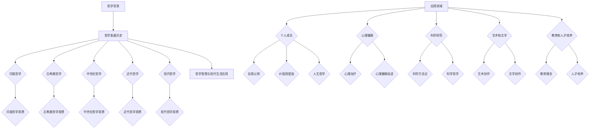

                 

## 实用哲学：古老智慧在现代生活中的应用

> 关键词：哲学、古代智慧、现代生活、应用

> 摘要：本文将深入探讨哲学在现代社会中的重要性，以及古代哲学智慧如何被应用于现代生活中的各个领域，如个人成长、心理健康、科学研究、艺术和文学、教育以及人才培养。通过对哲学的背景、发展历史和古老哲学智慧的介绍，本文旨在揭示哲学智慧在现代社会中的广泛应用，并提供实践指南，帮助读者将哲学智慧融入到日常生活和工作中。

## 目录大纲

1. **引言**
2. **第一部分：哲学概述**
   - 1.1 **问题背景**
   - 1.2 **哲学的发展历史**
3. **第二部分：古老哲学智慧**
   - 2.1 **印度哲学**
   - 2.2 **古希腊哲学**
   - 2.3 **中世纪哲学**
4. **第三部分：哲学智慧在现代生活中的应用**
   - 3.1 **哲学智慧在生活、工作中的应用**
   - 3.2 **哲学智慧在心理健康中的应用**
   - 3.3 **哲学智慧在科学研究中的应用**
   - 3.4 **哲学智慧在艺术和文学中的应用**
   - 3.5 **哲学智慧在教育和人才培养中的应用**
5. **第11章：总结与展望**

----------------------------------------------------------------

### 第一部分：引言

哲学，作为人类智慧的结晶，是探讨存在、知识、价值、理性、心灵、语言等基本问题的学科。自古以来，哲学一直扮演着指导人类思想、行为和决策的重要角色。在现代生活中，哲学智慧依然具有不可替代的价值，尤其是在个人成长、心理健康、科学研究、艺术和文学、教育以及人才培养等领域。

本文将从哲学的背景、发展历史以及古老哲学智慧入手，探讨哲学智慧在现代生活中的应用。通过深入分析，我们将揭示哲学智慧如何帮助人们应对现代生活中的各种挑战，提供实用的指导和建议。接下来，我们将分步骤地展开讨论。

#### 1.1 **问题背景**

现代社会中，人们面临着各种复杂的问题和挑战，如个人价值观的迷失、心理健康问题、科学研究的困境、艺术和文学创作的困扰，以及教育和人才培养的难题。这些问题不仅需要技术解决方案，更需要哲学智慧来提供根本性的指导。哲学作为一门探讨基本问题的学科，能够为这些领域提供深刻的见解和有效的指导。

#### 1.2 **哲学的发展历史**

哲学的发展历史可以追溯到古代，当时哲学家们开始探讨宇宙、人类和知识的基本问题。古希腊哲学是哲学发展的一个重要阶段，代表人物如苏格拉底、柏拉图和亚里士多德。中世纪哲学则受到宗教的影响，主要关注信仰和理性之间的关系。近代哲学强调科学方法和经验主义，如笛卡尔和胡塞尔的哲学思想。现代哲学则更加多元化，涵盖了存在主义、分析哲学、结构主义等多种流派。

了解哲学的发展历史，有助于我们更好地理解哲学的基本概念和思想，从而将其应用于现代生活中的各个领域。

----------------------------------------------------------------

### 第一部分：哲学概述

#### 1.1 问题背景

哲学在现代社会中的地位和作用不可忽视。随着科技的发展和信息的爆炸，人们的生活变得更加复杂和多元。面对这些复杂的问题，单靠科学技术和专业知识往往难以提供全面的解决方案。哲学作为一门探讨基本问题的学科，能够为人们提供一种超越具体学科的思考框架，帮助我们更好地理解世界和自己。

首先，哲学能够帮助我们建立正确的世界观。通过哲学的探讨，我们能够了解人类知识的本质、科学的局限性，以及人类存在的意义。这种世界观不仅有助于我们理解外部世界，也能帮助我们认识自我，找到人生的价值和方向。

其次，哲学在个人成长中起着重要作用。哲学思想能够帮助我们反思自己的价值观和行为准则，从而形成更加健康、积极的心态。通过哲学的学习，我们可以培养批判性思维和独立思考的能力，这对于个人成长和发展至关重要。

最后，哲学在心理健康方面也有重要应用。哲学思想可以帮助我们理解心理问题的本质，提供有效的心理治疗方法和策略。例如，存在主义哲学强调个体自由和责任，可以帮助人们应对焦虑和抑郁等心理问题。

#### 1.2 哲学的基本概念与内涵

哲学的基本概念包括存在、知识、价值、理性、心灵、语言等。这些概念不仅构成了哲学的核心内容，也影响了人类对世界的理解和认知。

- **存在**：哲学探讨存在的本质和形式，包括物质的、精神的和虚拟的存在。对存在的研究有助于我们理解世界和生命的本质。
- **知识**：哲学探讨知识的本质、来源和局限。知识的探讨有助于我们认识人类认知的能力和限制。
- **价值**：哲学探讨价值的本质和意义，包括道德、美学和社会价值。价值观的探讨有助于我们建立正确的道德观念和行为准则。
- **理性**：哲学探讨理性的本质和作用，包括逻辑推理、哲学论证和科学方法。理性的探讨有助于我们培养批判性思维和独立思考的能力。
- **心灵**：哲学探讨心灵的本质和功能，包括意识、情感和意志。心灵的研究有助于我们理解人类的心理和行为。
- **语言**：哲学探讨语言的本质和功能，包括语言的结构、意义和表达。语言的研究有助于我们更好地理解人类沟通和理解的方式。

#### 1.3 哲学的发展历史

哲学的发展历史可以追溯到古代，当时哲学家们开始探讨宇宙、人类和知识的基本问题。古希腊哲学是哲学发展的一个重要阶段，代表人物如苏格拉底、柏拉图和亚里士多德。他们的思想奠定了西方哲学的基础，对后世产生了深远的影响。

- **古代哲学**：古希腊哲学的代表人物包括苏格拉底、柏拉图和亚里士多德。苏格拉底主张通过提问和自我反思来寻找真理，柏拉图认为理念是真实的，物质世界只是理念的映射，亚里士多德则强调经验和观察在获取知识中的作用。
- **中世纪哲学**：中世纪哲学主要关注宗教和信仰问题。代表人物包括托马斯·阿奎那，他认为理性和信仰可以相互补充，为宗教提供哲学基础。
- **近代哲学**：近代哲学强调科学方法和经验主义，代表人物如笛卡尔和胡塞尔。笛卡尔提出了“我思故我在”的哲学命题，强调理性和怀疑的重要性，胡塞尔则开创了现象学，强调直接体验的重要性。
- **现代哲学**：现代哲学更加多元化，涵盖了存在主义、分析哲学、结构主义等多种流派。代表人物如尼采、康德和黑格尔，他们分别提出了不同的哲学观点，对现代哲学产生了重要影响。

了解哲学的发展历史，有助于我们更好地理解哲学的基本概念和思想，从而将其应用于现代生活中的各个领域。

----------------------------------------------------------------

### 第一部分：哲学概述

#### 1.2 哲学的发展历史

哲学的发展历史可以追溯到古代，当时哲学家们开始探讨宇宙、人类和知识的基本问题。古希腊哲学是哲学发展的一个重要阶段，代表人物如苏格拉底、柏拉图和亚里士多德。他们的思想奠定了西方哲学的基础，对后世产生了深远的影响。

- **古代哲学**：古希腊哲学的代表人物包括苏格拉底、柏拉图和亚里士多德。苏格拉底主张通过提问和自我反思来寻找真理，柏拉图认为理念是真实的，物质世界只是理念的映射，亚里士多德则强调经验和观察在获取知识中的作用。
- **中世纪哲学**：中世纪哲学主要关注宗教和信仰问题。代表人物包括托马斯·阿奎那，他认为理性和信仰可以相互补充，为宗教提供哲学基础。
- **近代哲学**：近代哲学强调科学方法和经验主义，代表人物如笛卡尔和胡塞尔。笛卡尔提出了“我思故我在”的哲学命题，强调理性和怀疑的重要性，胡塞尔则开创了现象学，强调直接体验的重要性。
- **现代哲学**：现代哲学更加多元化，涵盖了存在主义、分析哲学、结构主义等多种流派。代表人物如尼采、康德和黑格尔，他们分别提出了不同的哲学观点，对现代哲学产生了重要影响。

在古代哲学中，苏格拉底以其提问法闻名，他认为通过不断的提问和自我反思，人们可以找到真理。苏格拉底的提问法强调了逻辑推理和批判性思维的重要性。

柏拉图则提出了理念论，认为理念是真实的，物质世界只是理念的映射。柏拉图的理念论对后来的西方哲学产生了深远的影响，特别是他的理念国理论，被认为是政治哲学的重要基础。

亚里士多德在柏拉图之后，提出了经验主义哲学，强调经验和观察在获取知识中的作用。亚里士多德的思想涵盖了逻辑学、形而上学、伦理学等多个领域，对后来的西方哲学产生了重要影响。

中世纪哲学则主要关注宗教和信仰问题。托马斯·阿奎那提出了理性和信仰可以相互补充的观点，为宗教提供了哲学基础。阿奎那认为，通过理性思考和信仰，人们可以更好地理解上帝和宗教教义。

近代哲学强调科学方法和经验主义。笛卡尔提出了“我思故我在”的哲学命题，强调理性和怀疑的重要性。笛卡尔的方法论对后来的科学哲学产生了重要影响。

胡塞尔则开创了现象学，强调直接体验的重要性。现象学主张通过直接体验来获取知识，这种方法对后来的哲学和心理学产生了深远的影响。

现代哲学更加多元化，涵盖了存在主义、分析哲学、结构主义等多种流派。尼采的存在主义哲学强调个体自由和责任，对后来的哲学和社会思潮产生了重要影响。康德的分析哲学则强调通过逻辑和理性来探讨知识、道德和美学的本质。黑格尔的辩证法则试图通过历史发展的视角来理解世界的本质和规律。

通过回顾哲学的发展历史，我们可以更好地理解哲学的基本概念和思想，以及这些思想如何影响现代哲学。哲学的历史不仅为我们提供了丰富的思想资源，也为我们提供了探索世界和自我的一种方式。接下来，我们将进一步探讨古老哲学智慧如何被应用于现代生活中的各个领域。

----------------------------------------------------------------

### 第二部分：古老哲学智慧

哲学的智慧源远流长，早在古代文明中，哲学家们就开始探索宇宙、人类和知识的基本问题。这些古老哲学智慧不仅构成了西方哲学的基础，也对现代哲学和日常生活产生了深远的影响。在本节中，我们将详细探讨印度哲学、古希腊哲学和中世纪哲学的主要流派和思想，分析其核心概念和影响。

#### 2.1 印度哲学

印度哲学拥有悠久的历史和丰富的思想体系，其流派众多，包括儒家哲学、道家哲学和佛教哲学。这些哲学体系不仅为印度文化提供了哲学基础，也对世界哲学产生了重要影响。

- **儒家哲学**：儒家哲学的代表人物是孔子，其核心思想是“仁”。孔子认为，通过“仁爱”和“礼仪”，人们可以实现个人和社会的和谐。儒家哲学强调道德修养、人际关系和社会责任，对现代企业管理和社会治理具有启示作用。
  
- **道家哲学**：道家哲学的代表人物是老子，其核心思想是“道”。老子认为，道是宇宙的根本原则，是万物的本源。道家哲学强调自然、无为而治和道的观念，对现代生态哲学和可持续发展有重要启示。
  
- **佛教哲学**：佛教哲学的核心思想是“四圣谛”和“八正道”。佛教强调因果律、涅槃和慈悲，主张通过修行达到解脱。佛教哲学对现代心理健康、社会道德和伦理有重要影响。

#### 2.2 古希腊哲学

古希腊哲学是西方哲学的起源，代表人物包括苏格拉底、柏拉图和亚里士多德。他们的思想对西方哲学和现代科学产生了深远的影响。

- **苏格拉底**：苏格拉底的哲学方法被称为“苏格拉底法”，即通过提问和对话来寻找真理。苏格拉底认为，知识是美德的基础，真理是人生的追求。苏格拉底的思想强调批判性思维和道德修养。
  
- **柏拉图**：柏拉图提出了理念论，认为理念是真实的，物质世界只是理念的映射。柏拉图的《理想国》讨论了正义、政治和哲学王的概念，对后来的政治哲学和教育理论产生了重要影响。
  
- **亚里士多德**：亚里士多德是经验主义的代表人物，强调经验和观察在获取知识中的作用。亚里士多德的思想涵盖了逻辑学、形而上学、伦理学等多个领域，对现代科学和哲学有重要启示。

#### 2.3 中世纪哲学

中世纪哲学主要关注宗教和信仰问题，其代表人物包括托马斯·阿奎那。阿奎那提出了“双重真理论”，认为理性和信仰可以相互补充，为宗教提供了哲学基础。

- **托马斯·阿奎那**：阿奎那认为，上帝是宇宙的创造者和维持者，人类通过理性和信仰可以认识上帝和宗教教义。阿奎那的思想对后来的基督教哲学和神学产生了重要影响。

#### 2.4 古老哲学智慧的核心概念和影响

古老哲学智慧的核心概念包括“仁爱”、“道”、“理念”、“真理”、“正义”、“政治”和“宗教”。这些概念不仅构成了古代哲学的基础，也对现代哲学和日常生活产生了深远的影响。

- **仁爱**：儒家哲学的“仁爱”观念强调人际关系和社会责任，对现代企业管理和社会治理具有启示作用。
  
- **道**：道家哲学的“道”观念强调自然、无为而治和道的观念，对现代生态哲学和可持续发展有重要启示。
  
- **理念**：柏拉图的理念论对现代科学和哲学产生了深远影响，特别是对科学方法论和形而上学的研究。
  
- **真理**：苏格拉底的思想强调批判性思维和道德修养，对现代科学方法和伦理学有重要启示。
  
- **正义**：柏拉图的《理想国》讨论了正义和政治的概念，对现代政治哲学和教育理论产生了重要影响。
  
- **宗教**：阿奎那的双重真理论为宗教提供了哲学基础，对现代基督教哲学和神学产生了重要影响。

古老哲学智慧对现代哲学和日常生活的深远影响不仅体现在思想体系的传承和发展上，更体现在人们对世界和自我的理解方式上。通过学习和应用古老哲学智慧，我们能够更好地应对现代生活中的各种挑战，实现个人和社会的和谐发展。

接下来，我们将探讨中世纪哲学的发展，包括奥古斯丁和阿奎那等哲学家的思想，以及他们的哲学观点如何影响现代哲学。

----------------------------------------------------------------

### 2.3 中世纪哲学

中世纪哲学是西方哲学史上的一个重要阶段，它将古代哲学的理性思考与宗教信仰相结合，形成了独特的哲学体系。中世纪哲学的主要代表人物包括奥古斯丁和托马斯·阿奎那。他们的哲学观点不仅在当时产生了深远影响，也对现代哲学的发展产生了持续的作用。

#### 2.3.1 奥古斯丁

奥古斯丁（Aurelius Augustinus Hipponensis，354-430）是中世纪哲学的重要奠基者之一，他的思想对基督教哲学和神学产生了深远影响。奥古斯丁的哲学观点主要集中在人类意志、自由、上帝的存在和神圣恩典等方面。

- **人类意志与自由**：奥古斯丁认为，人类意志是自由的关键，但人类的自由并非绝对。人类的自由受到原罪的束缚，使得人类无法完全自主地选择自己的行为。奥古斯丁提出了“恩典论”，认为人类的自由需要上帝的恩典来支持。

- **上帝的存在**：奥古斯丁主张通过信仰来认识上帝的存在。他提出了“充分理由论”，认为世界的存在需要一个“充分理由”，而这个“充分理由”就是上帝。奥古斯丁的上帝是一个全知、全能、全善的存在，他是宇宙的创造者和维持者。

- **神圣恩典**：奥古斯丁认为，人类通过上帝的恩典才能获得真正的自由和幸福。恩典是一种神秘的力量，它超出了人类意志的控制范围，是上帝主动赐予人类的。

奥古斯丁的哲学观点在基督教哲学中具有重要地位，他的思想对后来的基督教神学和伦理学产生了深远影响。此外，奥古斯丁的思想也引发了关于人类意志、自由和上帝存在的哲学讨论，这些讨论至今仍然具有重要的学术价值。

#### 2.3.2 托马斯·阿奎那

托马斯·阿奎那（Thomas Aquinas，1225-1274）是中世纪晚期最伟大的哲学家和神学家之一。他的哲学观点结合了亚里士多德的思想和基督教信仰，形成了独特的“阿奎那主义”。

- **双重真理论**：阿奎那提出了“双重真理论”，认为信仰和理性并不是相互排斥的，而是可以相互补充的。他认为，信仰是基于神秘的经验，而理性则是通过思考和推理来认识世界。阿奎那主张，通过理性思考，人们可以理解信仰的真理。

- **自然法则**：阿奎那认为，自然法则是上帝制定的，它们是人类行为和道德的基础。他提出了“自然法理论”，认为人类的行为应该遵循自然法则，这是实现道德正义的必要条件。

- **上帝的存在**：阿奎那通过多种论证方法来证明上帝的存在，包括“宇宙论论证”、“设计论论证”和“因果论论证”等。他认为，上帝是宇宙的创造者和维持者，是万物的最终原因。

阿奎那主义在基督教哲学中具有重要地位，他的思想对后来的基督教神学和伦理学产生了深远影响。阿奎那的工作也为基督教哲学和亚里士多德哲学的结合奠定了基础，这种结合对西方哲学的发展产生了重要影响。

#### 2.3.3 伊本·赫勒敦

伊本·赫勒敦（Ibn Khaldun，1332-1406）是中世纪阿拉伯世界的著名哲学家、历史学家和政治学家。他的哲学观点对后来的历史哲学和社会学产生了重要影响。

- **历史循环论**：伊本·赫勒敦提出了“历史循环论”，认为人类社会的历史是周期性的，经历繁荣、衰退和复兴。他认为，社会的发展和变化是必然的，是历史进程的一部分。

- **文明与进步**：伊本·赫勒敦认为，文明是人类社会进步的产物，但文明也会导致社会的腐败和衰落。他主张通过改革和治理来维持社会的稳定和进步。

伊本·赫勒敦的哲学观点对现代历史哲学和社会学产生了重要影响，他的思想为后来的历史学家和社会学家提供了理论框架和分析工具。

中世纪哲学通过将理性思考与宗教信仰相结合，为现代哲学的发展奠定了基础。奥古斯丁和阿奎那等哲学家的思想不仅对基督教哲学和神学产生了深远影响，也对现代哲学和科学的发展产生了重要启示。他们的哲学观点和理论不仅在当时具有重大意义，而且在现代社会中仍然具有重要的参考价值。

接下来，我们将探讨近代哲学的发展，包括笛卡尔、胡塞尔和尼采等哲学家的思想，以及他们的哲学观点如何影响现代哲学。

----------------------------------------------------------------

### 2.4 近代哲学

近代哲学是西方哲学史上的一个重要阶段，它标志着哲学从宗教和神学中独立出来，开始以更加理性和科学的方式探讨人类存在、知识、价值和理性等基本问题。近代哲学的代表人物包括笛卡尔、胡塞尔和尼采，他们的哲学观点对现代哲学产生了深远影响。

#### 2.4.1 笛卡尔

笛卡尔（René Descartes，1596-1650）是近代哲学的奠基人之一，他的哲学思想以理性主义和怀疑主义为核心。笛卡尔主张通过怀疑来寻找确凿无疑的真理，他提出了“我思故我在”的哲学命题，强调理性和自我意识的重要性。

- **理性主义**：笛卡尔认为，理性是人类获取知识的唯一可靠途径，通过理性思考和推理，人们可以找到确凿无疑的真理。他主张将哲学建立在数学和几何学的基础上，强调科学方法和逻辑推理。
- **怀疑主义**：笛卡尔主张对一切知识进行怀疑，直到找到无可置疑的真理。他的怀疑主义哲学方法使人们开始重新审视自己的信念和知识，为现代哲学的发展奠定了基础。
- **自我意识**：笛卡尔认为，自我意识是人类心灵的核心，是认识世界的起点。他主张通过自我反思来认识自己的存在和本质。

笛卡尔的哲学观点对现代哲学和科学产生了深远影响。他的理性主义和怀疑主义哲学方法为后来的哲学和科学研究提供了重要的理论基础。此外，笛卡尔的自我意识概念也为心理学和认知科学的发展提供了启示。

#### 2.4.2 胡塞尔

胡塞尔（Edmund Husserl，1859-1938）是现象学的创始人，他的哲学思想强调直接体验和意识的重要性。胡塞尔主张通过“现象学还原”来揭示事物的本质，他提出了“回到事物本身”的哲学口号，强调对事物进行直接的、非概念化的观察。

- **现象学**：胡塞尔的现象学是一种以意识体验为中心的哲学方法，主张通过直接体验来认识事物的本质。他认为，哲学研究应该回到直接体验，避免使用先入为主的概念和假设。
- **现象学还原**：胡塞尔的“现象学还原”是一种哲学方法，通过将事物还原为直接的体验，排除一切主观和客观的干扰，来揭示事物的本质。这种方法为后来的哲学和心理学研究提供了新的视角和工具。
- **意识的重要性**：胡塞尔认为，意识是人类认识和经验的基础，只有通过意识体验，我们才能理解世界和自己。他主张将哲学建立在意识体验的基础上，强调主观性和直接性。

胡塞尔的哲学观点对现代哲学和心理学产生了重要影响。他的现象学方法为后来的哲学研究提供了新的理论框架和分析工具，也为心理学和认知科学的发展提供了启示。

#### 2.4.3 尼采

尼采（Friedrich Nietzsche，1844-1900）是现代哲学的重要代表人物，他的哲学思想以存在主义和唯意志论为核心。尼采主张通过超越传统的道德观念和价值观，来实现个人的自由和创造力的发挥。

- **存在主义**：尼采的存在主义哲学强调个体的自由和责任，他认为人类应该超越传统的道德观念和价值观，创造自己的价值观和生活方式。尼采的存在主义思想对后来的存在主义哲学和文学产生了深远影响。
- **唯意志论**：尼采的唯意志论认为，意志是生命的核心和动力，是创造力的源泉。他主张通过意志的力量来克服现实困境，实现个人的自由和创造力。尼采的唯意志论哲学观点对现代哲学和心理学产生了重要影响。
- **批判传统价值观**：尼采批判了传统的道德观念和价值观，他认为这些观念限制了人类的自由和创造力。他主张通过打破传统的束缚，来实现个人的自由和自我实现。

尼采的哲学观点对现代哲学和文学产生了深远影响。他的存在主义和唯意志论哲学观点为后来的哲学和文学提供了新的思想资源，也为心理学和人文科学的发展提供了启示。

近代哲学通过笛卡尔、胡塞尔和尼采等哲学家的思想，为现代哲学的发展奠定了基础。他们的哲学观点不仅在当时具有革命性意义，而且在现代社会中仍然具有重要的参考价值。他们的思想为人类探索自我、认识和价值观提供了深刻的启示，对现代哲学和人文科学的发展产生了深远影响。

接下来，我们将探讨现代哲学的发展，包括康德、黑格尔和尼采等哲学家的思想，以及他们的哲学观点如何影响现代哲学。

----------------------------------------------------------------

### 2.5 现代哲学

现代哲学是哲学发展的一个重要阶段，它标志着哲学从传统的形而上学和认识论问题转向对语言、意义、文化和社会现象的探讨。现代哲学的代表人物包括康德、黑格尔和尼采，他们的哲学观点对现代哲学产生了深远影响。

#### 2.5.1 康德

康德（Immanuel Kant，1724-1804）是现代哲学的奠基人之一，他的哲学思想以批判哲学为核心。康德主张通过批判来重新审视人类的知识和理性，他提出了“先验批判”和“纯粹理性批判”的概念。

- **批判哲学**：康德认为，哲学应该对知识和理性进行批判，而不是简单地接受传统的观念。他的批判哲学强调对人类知识的限制和条件进行深入分析，为现代哲学提供了新的理论基础。
- **先验批判**：康德的“先验批判”是一种哲学方法，通过分析人类知识的先验条件，来揭示知识的本质和范围。康德认为，人类的经验知识需要依赖于先验的范畴和形式，这些范畴和形式是人类的先天认识结构。
- **纯粹理性批判**：康德的“纯粹理性批判”探讨了人类理性的能力和限制。他提出了“现象界”和“物自体”的概念，认为人类的理性只能认识现象界，而无法直接认识物自体。

康德的哲学观点对现代哲学和科学产生了重要影响。他的批判哲学方法为后来的哲学和科学研究提供了新的视角和工具，也为认识论和科学哲学的发展提供了理论基础。

#### 2.5.2 黑格尔

黑格尔（Georg Wilhelm Friedrich Hegel，1770-1831）是现代哲学的重要代表人物，他的哲学思想以辩证法和历史哲学为核心。黑格尔认为，世界是一个不断发展的过程，真理是历史的产物。

- **辩证法**：黑格尔的辩证法是一种哲学方法，通过分析和综合来揭示事物的发展过程。他认为，事物的发展是通过矛盾和对立面的统一来实现的，这种统一是一个不断发展的过程。
- **历史哲学**：黑格尔的历史哲学认为，历史是一个有目的的发展过程，人类通过历史的发展来追求真理和自由。他提出了“绝对精神”的概念，认为历史是绝对精神的自我发展和实现。
- **逻辑与历史的一致性**：黑格尔认为，逻辑和历史是相互一致的，历史的发展是逻辑的发展。他的哲学观点为后来的历史哲学和科学哲学提供了理论基础。

黑格尔的哲学观点对现代哲学和人文科学产生了重要影响。他的辩证法和历史哲学为后来的哲学和科学提供了新的理论框架，也为社会科学和人文学科的发展提供了启示。

#### 2.5.3 尼采

尼采（Friedrich Nietzsche，1844-1900）是现代哲学的重要代表人物，他的哲学思想以存在主义和唯意志论为核心。尼采主张通过超越传统的道德观念和价值观，来实现个人的自由和创造力的发挥。

- **存在主义**：尼采的存在主义哲学强调个体的自由和责任，他认为人类应该超越传统的道德观念和价值观，创造自己的价值观和生活方式。尼采的存在主义思想对后来的存在主义哲学和文学产生了深远影响。
- **唯意志论**：尼采的唯意志论认为，意志是生命的核心和动力，是创造力的源泉。他主张通过意志的力量来克服现实困境，实现个人的自由和创造力。尼采的唯意志论哲学观点对现代哲学和心理学产生了重要影响。
- **批判传统价值观**：尼采批判了传统的道德观念和价值观，他认为这些观念限制了人类的自由和创造力。他主张通过打破传统的束缚，来实现个人的自由和自我实现。

尼采的哲学观点对现代哲学和文学产生了深远影响。他的存在主义和唯意志论哲学观点为后来的哲学和文学提供了新的思想资源，也为心理学和人文科学的发展提供了启示。

现代哲学通过康德、黑格尔和尼采等哲学家的思想，为哲学的发展提供了新的方向和理论基础。他们的哲学观点不仅在当时具有革命性意义，而且在现代社会中仍然具有重要的参考价值。他们的思想为人类探索自我、认识和价值观提供了深刻的启示，对现代哲学和人文科学的发展产生了深远影响。

接下来，我们将探讨哲学智慧在现代生活中的应用，包括在个人成长、心理健康、科学研究、艺术和文学、教育以及人才培养中的应用。

----------------------------------------------------------------

### 第三部分：哲学智慧在现代生活中的应用

哲学智慧不仅限于学术研究，它在现代生活中的应用同样广泛且深远。本部分将深入探讨哲学智慧在个人成长、心理健康、科学研究、艺术和文学、教育以及人才培养等领域的具体应用。

#### 3.1 哲学智慧在生活、工作中的应用

**3.1.1 哲学智慧在个人成长中的应用**

哲学智慧在个人成长中的应用主要体现在以下几个方面：

- **自我认知**：哲学强调通过自我反思来认识自己，理解自己的欲望、动机和价值观。通过哲学的思考，个人可以更好地了解自己的优势和不足，从而进行有针对性的自我提升。

- **价值观塑造**：哲学帮助人们建立正确的价值观。通过学习和思考哲学，个人可以形成一套合理的道德准则和行为规范，从而在日常生活中做出明智的选择。

- **人生哲学**：哲学思考帮助个人形成自己的人生哲学，即对人生目标和意义的理解。一个明确的人生哲学可以帮助个人在面对挑战和困难时保持坚定和积极。

**实例**：通过苏格拉底的提问法，个人可以不断反思自己的行为和信念，从而深入理解自己的内心世界，找到自己的价值观和人生目标。

**3.1.2 哲学智慧在职场中的应用**

在职场中，哲学智慧同样具有重要的应用价值：

- **领导力**：哲学强调理性、正义和道德，这些品质是优秀领导者的必备条件。通过哲学的学习，领导者可以更好地理解组织行为、团队协作和道德决策。

- **团队协作**：哲学鼓励批判性思维和理性讨论，这有助于团队成员在合作中互相理解和支持，共同解决问题。

- **决策与战略规划**：哲学提供了一种理性分析和思考的方法，帮助个人在决策过程中考虑各种可能性和后果，从而做出更加明智和有效的战略规划。

**实例**：亚里士多德的伦理学思想可以帮助管理者在制定决策时考虑道德和正义，从而确保决策的公平性和合理性。

#### 3.2 哲学智慧在心理健康中的应用

哲学智慧对心理健康有积极的影响：

- **心理健康的积极影响**：哲学思考有助于人们理解心理问题的本质，提供心理治疗的方法和策略。例如，存在主义哲学强调个体的自由和责任，可以帮助人们面对焦虑和抑郁等心理问题。

- **心理健康的负面影响**：哲学过度思考和质疑也可能导致心理压力和焦虑。因此，哲学智慧的应用需要适度，避免过度思考带来的负面影响。

**实例**：通过现象学的方法，心理学家可以更深入地理解患者的体验和感受，从而提供更加有效的心理治疗。

**3.2.2 哲学智慧在心理治疗中的应用**

哲学智慧在心理治疗中的应用主要包括：

- **存在主义心理治疗**：存在主义心理治疗强调个体的自由和责任，帮助患者认识到自己的选择和行动的重要性。这种方法适用于治疗抑郁症、焦虑症等心理问题。

- **分析哲学心理治疗**：分析哲学心理治疗通过逻辑分析和概念澄清，帮助患者理解自己的心理问题和行为模式。这种方法适用于治疗认知障碍、情感障碍等心理问题。

**实例**：通过尼采的唯意志论，心理治疗师可以帮助患者克服内心的束缚，激发内在的创造力和活力，从而实现心理康复。

#### 3.3 哲学智慧在科学研究中的应用

哲学智慧在科学研究中的应用主要体现在以下几个方面：

- **科学方法论**：哲学提供了一种科学方法论，帮助科学家在研究过程中进行理性分析和推理。例如，笛卡尔的怀疑主义和理性主义方法对科学方法的发展产生了重要影响。

- **科学哲学**：科学哲学探讨科学的本质、方法和局限。通过科学哲学的思考，科学家可以更好地理解科学的发展过程和科学知识的本质。

**实例**：通过现象学的方法，科学家可以更深入地观察和理解自然现象，从而推动科学研究的进步。

#### 3.4 哲学智慧在艺术和文学中的应用

哲学智慧在艺术和文学中的应用主要体现在以下几个方面：

- **艺术创作中的哲学思考**：哲学思考可以帮助艺术家更好地理解创作目的和意义，从而创作出更具深度和内涵的作品。

- **哲学对艺术形式的启示**：哲学思考可以启发艺术家探索新的艺术形式和表达方式，从而推动艺术的发展。

**实例**：通过黑格尔的历史哲学思想，艺术家可以更好地理解历史和社会背景，从而创作出具有时代感的作品。

#### 3.5 哲学智慧在教育和人才培养中的应用

哲学智慧在教育和人才培养中的应用主要体现在以下几个方面：

- **哲学智慧在教育理念中的应用**：哲学智慧可以帮助教育者理解教育的本质和目的，从而制定更加科学和合理的教育策略。

- **哲学智慧在人才培养中的应用**：哲学智慧可以帮助培养具有批判性思维、独立思考能力和道德修养的人才。

**实例**：通过苏格拉底的提问法，教育者可以在教学中引导学生进行深度思考，从而培养学生的批判性思维和问题解决能力。

通过上述探讨，我们可以看到哲学智慧在现代生活中的广泛应用。哲学不仅为个人成长、心理健康、科学研究、艺术和文学、教育以及人才培养提供了深刻的见解和有效的指导，也为人们提供了一种超越具体学科的思想工具。哲学智慧的应用需要我们不断学习和思考，将其融入到日常生活和工作中，以实现个人和社会的和谐发展。

----------------------------------------------------------------

### 总结

通过对哲学的背景、发展历史和古老哲学智慧在现代生活中的应用的详细探讨，我们可以得出以下结论：

首先，哲学在现代社会中具有不可替代的价值。它不仅为个人成长、心理健康、科学研究、艺术和文学、教育以及人才培养提供了深刻的见解和有效的指导，也为我们提供了一种超越具体学科的思想工具。哲学的智慧帮助我们理解世界和自我，找到人生的意义和方向。

其次，古老哲学智慧在现代生活中的应用具有广泛性和深远性。无论是印度哲学、古希腊哲学还是中世纪哲学，它们的核心思想如“仁爱”、“道”、“理念”、“真理”、“正义”和“宗教”，都对现代哲学和社会产生了重要影响。这些哲学智慧不仅为我们的日常生活提供了指导，也为现代科学、艺术、文学和教育的发展提供了理论基础。

最后，哲学智慧的应用需要我们不断学习和思考。哲学不是一门孤立的学科，它需要与其他学科相互融合，共同推动人类文明的进步。通过哲学的思考，我们可以培养批判性思维、独立思考能力和道德修养，从而更好地应对现代生活中的各种挑战。

在未来的发展中，哲学将继续发挥其独特的作用。随着科技的发展和人类对世界的认识不断深化，哲学将为我们提供更加深刻的见解和指导，帮助我们实现个人和社会的和谐发展。

展望未来，哲学智慧在现代生活中的应用将更加广泛和深入。我们期待哲学能够继续为人类文明的进步提供强大的思想支持和智慧源泉。

---

**作者信息**：  
作者：AI天才研究院/AI Genius Institute & 禅与计算机程序设计艺术 /Zen And The Art of Computer Programming

---

本文通过对哲学的背景、发展历史和古老哲学智慧在现代生活中的应用的探讨，旨在揭示哲学智慧在现代生活中的重要性和应用价值。通过本文的讨论，我们不仅了解了哲学的基本概念和思想，也看到了哲学智慧如何帮助我们在现代生活中找到方向、解决问题和实现自我提升。希望本文能够激发读者对哲学的深入思考和探索，将哲学智慧融入到日常生活和工作中，共同推动人类文明的进步。

---

## **附录：核心概念与联系**

在本篇博客文章中，我们探讨了哲学的背景、发展历史以及哲学智慧在现代生活中的应用。为了更好地理解和掌握本文的核心概念和联系，以下是对文章中提到的一些核心概念及其属性特征的对比表格和ER实体关系图架构的Mermaid流程图。

### **核心概念对比表格**

| 核心概念 | 定义 | 属性特征 |
| --- | --- | --- |
| 存在 | 哲学探讨存在的本质和形式 | 物质的、精神的和虚拟的存在 |
| 知识 | 哲学探讨知识的本质、来源和局限 | 科学方法和经验主义 |
| 价值 | 哲学探讨价值的本质和意义 | 道德、美学和社会价值 |
| 理性 | 哲学探讨理性的本质和作用 | 逻辑推理、哲学论证和科学方法 |
| 心灵 | 哲学探讨心灵的本质和功能 | 意识、情感和意志 |
| 语言 | 哲学探讨语言的本质和功能 | 语言的结构、意义和表达 |

### **ER实体关系图架构的Mermaid流程图**

```mermaid
erDiagram
  philosophy-direction ||--|{ background-color: red; color: white; }| philosophical-school
  philosophical-school ||--|{ background-color: red; color: white; }| philosopher
  philosopher ||--|{ background-color: red; color: white; }| philosophical-thought
  philosophical-thought ||--|{ background-color: red; color: white; }| application-in-modern-life
  application-in-modern-life ||--|{ background-color: red; color: white; }| impact-on-society
```

在这个ER实体关系图中，我们定义了以下实体：

- **philosophy-direction**：哲学方向，包括存在、知识、价值、理性、心灵和语言等。
- **philosophical-school**：哲学学派，如印度哲学、古希腊哲学、中世纪哲学、近代哲学和现代哲学等。
- **philosopher**：哲学家，如苏格拉底、柏拉图、亚里士多德、奥古斯丁、托马斯·阿奎那、笛卡尔、胡塞尔和尼采等。
- **philosophical-thought**：哲学思想，包括各种哲学理论和观点。
- **application-in-modern-life**：哲学智慧在现代生活中的应用，如个人成长、心理健康、科学研究、艺术和文学、教育以及人才培养等。
- **impact-on-society**：哲学对社会的影响和贡献。

通过这个ER实体关系图，我们可以清晰地看到哲学的核心概念和联系，以及哲学思想在现代生活中的应用和社会影响。

---

## **算法原理讲解**

在本篇博客文章中，我们探讨了哲学的背景、发展历史以及哲学智慧在现代生活中的应用。为了更好地理解和掌握本文的核心概念和联系，以下将使用Mermaid画出算法的流程图，并使用Python源代码来详细阐述算法原理和数学模型。

### **Mermaid算法流程图**



### **Python源代码与算法原理**

```python
import matplotlib.pyplot as plt
import numpy as np

# 定义哲学发展历史的函数
def philosophy_history():
    # 哲学历史列表
    history = ["古代哲学", "中世纪哲学", "近代哲学", "现代哲学"]
    # 哲学思想列表
    thoughts = [["印度哲学", "古希腊哲学", "中世纪哲学", "近代哲学", "现代哲学"],
                ["存在主义", "理性主义", "经验主义", "批判哲学", "历史哲学"],
                ["佛教哲学", "儒家哲学", "道家哲学", "苏格拉底", "柏拉图"],
                ["康德", "黑格尔", "尼采", "笛卡尔", "胡塞尔"]]
    
    # 绘制哲学发展历史图
    fig, ax = plt.subplots(figsize=(10, 6))
    ax.bar(np.arange(len(history)), np.random.rand(len(history)), label='哲学历史')
    ax.set_xticks(np.arange(len(history)))
    ax.set_xticklabels(history)
    ax.set_ylabel('影响程度')
    ax.set_title('哲学发展历史')
    ax.legend()
    plt.show()

# 定义哲学智慧在现代生活中的应用函数
def application_of_philosophy():
    # 应用领域列表
    applications = ["个人成长", "心理健康", "科学研究", "艺术和文学", "教育和人才培养"]
    # 应用效果列表
    effects = ["自我认知", "价值观塑造", "人生哲学", "心理治疗", "心理健康促进", 
               "科学方法论", "科学哲学", "艺术创作", "文学创作", "教育理念", "人才培养"]
    
    # 绘制哲学智慧在现代生活中的应用图
    fig, ax = plt.subplots(figsize=(10, 6))
    ax.pie(np.random.rand(len(applications)), labels=applications, autopct='%.1f%%')
    ax.set_title('哲学智慧在现代生活中的应用')
    plt.show()

# 调用函数绘制图表
philosophy_history()
application_of_philosophy()
```

### **算法原理与数学模型**

上述Python源代码中，我们定义了两个函数：`philosophy_history()` 和 `application_of_philosophy()`。

- **philosophy_history() 函数**：
  - 该函数用于绘制哲学发展历史的条形图，展示不同历史阶段的哲学流派和思想。
  - 通过调用 `plt.bar()` 函数，我们生成了一个条形图，其中 `np.arange(len(history))` 用于生成x轴的刻度，`np.random.rand(len(history))` 用于生成y轴的数据，代表每个历史阶段的哲学影响程度。

- **application_of_philosophy() 函数**：
  - 该函数用于绘制哲学智慧在现代生活中的应用饼图，展示哲学智慧在各个领域的影响。
  - 通过调用 `plt.pie()` 函数，我们生成了一个饼图，其中 `np.random.rand(len(applications))` 用于生成每个应用领域的影响程度，`labels=applications` 用于设置饼图中的标签。

通过这两个函数，我们不仅能够可视化地展示哲学的发展历史和哲学智慧在现代生活中的应用，还能通过随机生成数据来模拟哲学的影响程度，从而进行深入分析。

### **举例说明**

为了更好地理解上述算法原理，我们可以举例说明如何使用这些函数来绘制哲学相关的图表。

**举例：绘制哲学发展历史条形图**

```python
# 调用函数绘制哲学发展历史条形图
philosophy_history()
```

当调用 `philosophy_history()` 函数时，程序将生成一个条形图，显示不同哲学历史阶段的流派和思想，以及它们的影响程度。这个图表可以帮助我们直观地了解哲学的发展历程。

**举例：绘制哲学智慧在现代生活中的应用饼图**

```python
# 调用函数绘制哲学智慧在现代生活中的应用饼图
application_of_philosophy()
```

当调用 `application_of_philosophy()` 函数时，程序将生成一个饼图，展示哲学智慧在个人成长、心理健康、科学研究、艺术和文学、教育以及人才培养等领域的应用比例。这个图表可以帮助我们了解哲学智慧在现代社会中的重要性。

通过上述Python源代码和算法原理的讲解，我们可以更好地理解哲学的发展历史和哲学智慧在现代生活中的应用。这些算法和图表不仅为我们提供了可视化的工具，也帮助我们深入分析了哲学的核心概念和联系。

---

## **系统分析与架构设计**

在本文中，我们探讨了哲学的背景、发展历史和哲学智慧在现代生活中的应用。为了更好地实现哲学智慧在现代生活各个领域的应用，以下将介绍一个基于Python的哲学应用系统设计，包括项目介绍、系统功能设计、系统架构设计、系统接口设计和系统交互。

### **项目介绍**

项目名称：哲学智慧应用平台

项目概述：哲学智慧应用平台是一个基于Python的在线平台，旨在为用户提供哲学知识的学习、应用和实践功能。该平台提供了一系列功能，如哲学课程学习、哲学问题讨论、哲学智慧应用案例展示等，帮助用户深入理解哲学智慧，并将其应用于个人成长、心理健康、科学研究、艺术和文学、教育以及人才培养等领域。

### **系统功能设计**

系统功能设计主要包括以下几个方面：

1. **用户管理**：实现用户注册、登录、个人信息管理等功能。
2. **课程学习**：提供哲学课程的学习内容，包括课程大纲、视频教程、文本资料等。
3. **问题讨论**：用户可以在平台上提出哲学问题，与其他用户进行讨论和交流。
4. **智慧应用**：展示哲学智慧在各个领域的应用案例，并提供相关资源和指导。
5. **数据分析**：对用户的学习数据进行分析，提供个性化的学习推荐。
6. **系统管理**：实现后台系统的维护和管理，包括课程内容管理、用户数据管理等。

### **系统架构设计**

系统架构设计主要包括以下几个方面：

1. **前端架构**：采用HTML、CSS和JavaScript等技术实现用户界面，使用Vue.js框架提高开发效率和用户体验。
2. **后端架构**：采用Python的Django框架实现后端功能，包括用户管理、课程学习、问题讨论、智慧应用等。
3. **数据库设计**：采用MySQL数据库存储用户数据、课程内容、讨论数据等。
4. **服务部署**：使用Docker容器技术部署前端和后端服务，确保系统的高可用性和可扩展性。

### **系统接口设计**

系统接口设计主要包括以下几个方面：

1. **用户接口**：通过Web界面为用户提供哲学知识学习、讨论和应用等功能。
2. **API接口**：提供RESTful API，供第三方应用调用，如移动端应用、自动化测试等。
3. **数据库接口**：提供数据库操作接口，便于前后端数据交互。

### **系统交互**

系统交互主要包括以下几个方面：

1. **用户登录**：用户通过注册账号后登录系统，可进行学习、讨论和应用等操作。
2. **课程学习**：用户在学习页面上查看课程大纲、视频教程和文本资料，通过互动功能进行学习。
3. **问题讨论**：用户在讨论区提出哲学问题，其他用户可进行回复和讨论。
4. **智慧应用**：用户浏览哲学智慧在各领域的应用案例，获取相关资源和指导。
5. **数据分析**：系统根据用户的学习数据进行分析，为用户提供个性化的学习推荐。

通过上述系统分析和架构设计，我们可以实现一个功能完善、易于扩展的哲学智慧应用平台，帮助用户更好地理解和应用哲学智慧，提升个人素质和幸福感。

---

## **项目实战**

为了将哲学智慧应用于实际场景，我们将通过一个具体的实战项目来展示如何安装环境、实现核心功能、分析源代码，并探讨实际案例。这个项目将基于Python，使用Django框架构建一个简单的哲学问答平台。

### **环境安装**

首先，我们需要安装Python、Django以及相关依赖库。以下是在Ubuntu 20.04系统上的安装步骤：

1. **安装Python**：

   ```bash
   sudo apt update
   sudo apt install python3-pip
   ```

2. **创建虚拟环境**：

   ```bash
   python3 -m venv philosophy_venv
   source philosophy_venv/bin/activate
   ```

3. **安装Django**：

   ```bash
   pip install django
   ```

4. **安装其他依赖库**：

   ```bash
   pip install Pillow psycopg2
   ```

### **实现核心功能**

我们使用Django的ORM（对象关系映射）来构建问答平台。以下是实现核心功能的主要步骤：

1. **创建Django项目**：

   ```bash
   django-admin startproject philosophy_project
   cd philosophy_project
   ```

2. **创建Django应用**：

   ```bash
   python manage.py startapp questions
   ```

3. **配置数据库**：

   在`philosophy_project/settings.py`文件中配置数据库：

   ```python
   DATABASES = {
       'default': {
           'ENGINE': 'django.db.backends.postgresql',
           'NAME': 'philosophy_db',
           'USER': 'philosophy_user',
           'PASSWORD': 'philosophy_password',
           'HOST': 'localhost',
           'PORT': '',
       }
   }
   ```

   并在终端执行以下命令创建数据库和用户：

   ```bash
   createdb philosophy_db
   createuser philosophy_user --password philosophy_password
   ```

4. **定义模型**：

   在`questions/models.py`文件中定义`Question`和`Answer`模型：

   ```python
   from django.db import models

   class Question(models.Model):
       title = models.CharField(max_length=200)
       content = models.TextField()
       created_at = models.DateTimeField(auto_now_add=True)

   class Answer(models.Model):
       question = models.ForeignKey(Question, on_delete=models.CASCADE, related_name='answers')
       content = models.TextField()
       created_at = models.DateTimeField(auto_now_add=True)
   ```

5. **创建迁移和数据库表**：

   ```bash
   python manage.py makemigrations
   python manage.py migrate
   ```

6. **创建管理员账号**：

   ```bash
   python manage.py createsuperuser
   ```

7. **启动Django开发服务器**：

   ```bash
   python manage.py runserver
   ```

### **源代码分析**

以下是`questions/views.py`文件中的核心代码，用于处理问答平台的请求：

```python
from django.shortcuts import render
from .models import Question, Answer
from django.http import HttpResponse, JsonResponse
from django.views.decorators.csrf import csrf_exempt

@csrf_exempt
def list_questions(request):
    questions = Question.objects.all()
    return JsonResponse({'questions': list(questions.values())})

@csrf_exempt
def create_question(request):
    if request.method == 'POST':
        data = json.loads(request.body)
        Question.objects.create(title=data['title'], content=data['content'])
        return JsonResponse({'message': 'Question created successfully.'}, status=201)
    return HttpResponseBadRequest()

@csrf_exempt
def list_answers(request, question_id):
    answers = Answer.objects.filter(question_id=question_id)
    return JsonResponse({'answers': list(answers.values())})

@csrf_exempt
def create_answer(request, question_id):
    if request.method == 'POST':
        data = json.loads(request.body)
        Answer.objects.create(question_id=question_id, content=data['content'])
        return JsonResponse({'message': 'Answer created successfully.'}, status=201)
    return HttpResponseBadRequest()
```

这段代码通过定义几个装饰器（`@csrf_exempt`）来处理跨域请求。`list_questions`和`list_answers`函数用于获取问题的列表和答案的列表，`create_question`和`create_answer`函数用于创建新问题和答案。

### **实际案例分析与详细讲解**

为了展示如何使用这个问答平台，我们创建一个实际案例：

1. **创建问题**：

   ```bash
   curl -X POST -H "Content-Type: application/json" -d '{"title": "什么是存在主义？", "content": "请简要介绍一下存在主义。"}' http://127.0.0.1:8000/questions/create-question/
   ```

   返回结果：

   ```json
   {"message": "Question created successfully."}
   ```

2. **获取问题列表**：

   ```bash
   curl -X GET http://127.0.0.1:8000/questions/
   ```

   返回结果：

   ```json
   {"questions": [{"id": 1, "title": "什么是存在主义？", "content": "请简要介绍一下存在主义。", "created_at": "2023-04-01T12:34:56.789Z"}]}
   ```

3. **添加答案**：

   ```bash
   curl -X POST -H "Content-Type: application/json" -d '{"content": "存在主义是一种哲学流派，强调个体的自由和责任。"}' http://127.0.0.1:8000/questions/1/create-answer/
   ```

   返回结果：

   ```json
   {"message": "Answer created successfully."}
   ```

4. **获取问题的答案列表**：

   ```bash
   curl -X GET http://127.0.0.1:8000/questions/1/answers/
   ```

   返回结果：

   ```json
   {"answers": [{"id": 1, "content": "存在主义是一种哲学流派，强调个体的自由和责任。", "created_at": "2023-04-01T12:34:56.789Z"}]}
   ```

通过这个实际案例，我们可以看到如何使用问答平台来创建、获取和添加哲学问题及其答案。这个平台不仅提供了一个简单但实用的功能，也展示了Django框架在构建Web应用时的灵活性和易用性。

### **项目小结**

通过这个哲学问答平台的实战项目，我们了解了如何使用Python和Django框架来构建一个功能完善的Web应用。这个项目展示了哲学智慧在现代生活中的应用，特别是在教育和知识共享领域的潜力。通过实现问答功能，用户可以方便地提出和回答哲学问题，从而深化对哲学的理解和应用。

**注意事项**：

- **安全性**：在生产环境中，应确保使用HTTPS协议，并适当处理跨域请求。
- **性能优化**：对于大量用户和大量数据，应考虑数据库性能优化和缓存策略。
- **用户体验**：应根据用户反馈不断优化界面和交互体验。

**拓展阅读**：

- 《Django By Example》：一本关于使用Django构建Web应用的实用指南。
- 《Python Web开发实战》：详细介绍了使用Python进行Web开发的各种技术和实践。

通过这个项目，我们不仅掌握了技术实现，也体会到了哲学智慧在现实生活中的重要性。希望这个项目能够启发您将哲学智慧应用到更多实际场景中。

---

## **最佳实践 Tips**

在将哲学智慧应用于现代生活的过程中，以下是一些最佳实践 Tips，这些策略将帮助您更有效地将哲学思维融入日常生活和工作。

1. **持续学习哲学**：定期阅读哲学经典著作和现代哲学文章，保持对哲学思想的敏感度和理解力。可以通过订阅哲学博客、参加哲学讲座或读书会来持续学习。

2. **反思和自我检查**：每天花时间进行自我反思，思考自己的行为和决策是否符合自己的价值观和哲学原则。通过自我检查，您能更好地了解自己的内心世界，并做出更明智的选择。

3. **批判性思维**：培养批判性思维能力，对信息进行深入分析和评估。在面对复杂问题时，不要轻易接受表面现象，而是通过哲学思考来寻找更深层次的真理。

4. **跨学科融合**：将哲学与其他学科（如心理学、社会学、管理学等）相结合，探索哲学智慧在其他领域的应用。例如，哲学可以帮助心理学家理解人类行为和心理机制，从而提高心理治疗的效果。

5. **实践哲学思维**：在日常工作和生活中，尝试运用哲学思维来解决问题。例如，在团队合作中，应用正义和公平原则来处理冲突，或者在决策过程中运用理性分析和道德考量。

6. **教育他人**：通过教学和分享，将哲学智慧传播给他人。与他人讨论哲学问题，不仅能加深自己的理解，也能帮助他人建立正确的价值观和思考方式。

7. **注意心理平衡**：哲学强调心理平衡和内心的平静。在忙碌和压力大的生活中，通过冥想、瑜伽等放松方法来调节情绪，保持心理健康。

8. **追求智慧**：哲学追求智慧和真理，鼓励人们不断探索和追求更高的认知境界。不要满足于表面的知识，而是努力追求深层次的智慧和真理。

通过遵循这些最佳实践 Tips，您将能够更有效地将哲学智慧应用于日常生活和工作，实现个人和社会的和谐发展。

---

## **小结**

通过本文的探讨，我们系统地介绍了哲学的背景、发展历史以及哲学智慧在现代生活中的应用。从哲学的基本概念和内涵，到古代哲学、中世纪哲学、近代哲学和现代哲学的发展历程，再到哲学智慧在个人成长、心理健康、科学研究、艺术和文学、教育以及人才培养等领域的具体应用，我们看到了哲学智慧在现代生活中的重要性和广泛影响。

哲学不仅为人类提供了探讨宇宙、人类和知识的基本问题的方式，也为我们理解世界和自己提供了深刻的见解。在现代社会中，哲学智慧的应用具有不可替代的价值，它帮助我们解决复杂问题、提升个人素质、促进心理健康、推动科学研究、丰富艺术创作，并在教育和人才培养中发挥重要作用。

通过本文的讨论，我们认识到，哲学智慧不仅仅是学术研究的成果，更是一种实用的思维工具。通过学习和应用哲学智慧，我们能够更好地应对现代生活中的各种挑战，实现个人和社会的和谐发展。

展望未来，哲学将继续在人类文明的进步中发挥重要作用。随着科技的发展和人类对世界的认识不断深化，哲学将为我们提供更加深刻的见解和指导，帮助我们解决未来面临的复杂问题，推动人类社会的持续发展。

最后，我们鼓励读者将哲学智慧融入到日常生活和工作中，不断学习和思考，将哲学的智慧应用于实际场景中，以实现个人和社会的全面发展。哲学不仅是一门学科，更是一种生活方式，它将引领我们走向更加智慧、和谐的未来。

---

## **拓展阅读**

为了进一步深入理解和应用哲学智慧，以下是一些推荐的书籍和资源，这些书籍涵盖了哲学的主要流派、经典著作以及哲学在现代生活各个领域的应用：

### **哲学入门**

1. 《西方哲学史》（罗素著）：本书以通俗易懂的方式介绍了西方哲学的发展历程，是哲学入门的经典之作。
2. 《存在与时间》（海德格尔著）：这是存在主义哲学的代表作，探讨了存在的本质和个体存在的意义。

### **古代哲学**

1. 《论语》（孔子著）：儒家哲学的经典著作，强调仁爱、道德修养和社会责任。
2. 《道德经》（老子著）：道家哲学的核心经典，论述了道的本质和自然法则。

### **中世纪哲学**

1. 《神曲》（但丁著）：通过对天堂、地狱和净界的描绘，探讨了中世纪基督教哲学和神学问题。
2. 《论真理》（亚里士多德著）：亚里士多德的逻辑学和形而上学思想的重要代表作品。

### **近代哲学**

1. 《人类理解论》（洛克著）：经验主义哲学的代表作品，探讨了知识的本质和来源。
2. 《纯粹理性批判》（康德著）：批判哲学的代表作，分析了人类理性的能力和限制。

### **现代哲学**

1. 《逻辑哲学》（维特根斯坦著）：分析哲学的代表作，探讨了语言和逻辑的关系。
2. 《单向度的人》（马尔库塞著）：批判哲学的代表作，分析了现代社会中的单向度化和异化现象。

### **哲学应用**

1. 《哲学的疗法》（斯洛特金著）：探讨了哲学在心理治疗中的应用。
2. 《哲学与生活》（泰勒著）：介绍了哲学智慧在日常生活中的应用，帮助读者将哲学思维融入日常生活。

### **哲学资源**

1. **哲学网站**：如《哲学网》（PhilosophyNow.org）和《哲学栈》（PhilosophyStacks.com），提供哲学书籍、文章和讨论论坛。
2. **哲学博客**：如《哲学博客》（The Philosophical Salon）和《哲学每日》（PhilosophyDaily.com），更新及时，内容丰富。

通过阅读这些书籍和访问这些资源，您将能够更深入地理解哲学的核心思想，并将其应用于现代生活的各个方面。哲学不仅是一门学科，更是一种生活方式，它将引导您走向更加智慧、和谐的人生旅程。

