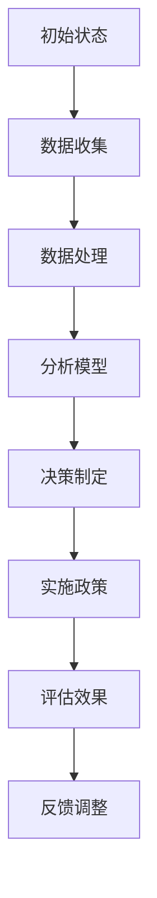

                 

### 家庭与生育的新意义：面对人口危机的思考

#### 关键词：人口危机、家庭结构、生育观念、社会经济政策、国际经验

#### 摘要：
随着全球人口增长放缓和老龄化加剧，家庭与生育问题成为社会经济发展的重要议题。本文旨在探讨家庭与生育的新意义，分析人口危机的背景及其对社会经济的影响，并提出一系列解决方案和改革方向。通过结合国际经验，本文试图为我国提供有益的启示，以应对当前的人口挑战。

### 目录大纲

1. 背景介绍
   1.1. 问题背景
   1.2. 问题描述
   1.3. 问题解决
   1.4. 边界与外延
   1.5. 概念结构与核心要素组成

2. 核心概念与联系
   2.1. 核心概念原理
   2.2. 概念属性特征对比表格
   2.3. ER实体关系图架构

3. 算法原理讲解
   3.1. 算法mermaid流程图
   3.2. Python源代码实现
   3.3. 算法原理数学模型与公式
   3.4. 举例说明

4. 系统分析与架构设计方案
   4.1. 问题场景介绍
   4.2. 项目介绍
   4.3. 系统功能设计
   4.4. 系统架构设计
   4.5. 系统接口设计
   4.6. 系统交互

5. 项目实战
   5.1. 环境安装
   5.2. 系统核心实现源代码
   5.3. 代码应用解读与分析
   5.4. 实际案例分析与详细讲解
   5.5. 项目小结

6. 最佳实践 tips、小结、注意事项、拓展阅读

### 第一部分：背景介绍

#### 1.1. 问题背景

近年来，全球人口增长放缓，老龄化趋势加剧，人口结构失衡问题日益严重。根据联合国人口基金会的数据，世界人口增长率已经从20世纪70年代的2.2%下降到2020年的1.05%。这一趋势在不同国家和地区表现出不同的特点，但总体上，许多国家面临着人口负增长的风险。

人口危机不仅体现在数量的减少上，还包括人口结构的失衡。年轻劳动力人口比例下降，老年人口比例上升，导致劳动力市场紧张，养老保障压力增大，社会稳定面临挑战。

#### 1.2. 问题描述

家庭与生育问题成为人口危机的一个重要方面。随着社会经济的发展，家庭结构发生了显著变化。传统核心家庭模式逐渐被多样化的家庭形式所取代，单亲家庭、丁克家庭（Double Income, No Kids）等新型家庭结构日益普遍。这些变化在一定程度上反映了人们生育观念的转变。

生育率下降是家庭与生育问题的核心问题。许多国家面临低生育率挑战，例如，德国的总和生育率（TFR）仅为1.5，日本为1.3，而我国在2020年的总和生育率也仅为1.3。低生育率导致人口老龄化加剧，社会负担加重，对经济可持续发展造成威胁。

#### 1.3. 问题解决

解决家庭与生育问题需要多方面的努力。首先，政府应制定合理的生育政策，鼓励家庭生育。例如，提供生育津贴、延长产假、提供育儿支持等。此外，还应加强家庭与社会支持体系的建设，为家庭提供必要的经济和社会支持。

其次，社会应积极宣传正确的生育观念，改变传统观念对生育的束缚。通过教育和媒体，提高公众对生育问题的认识和重视，鼓励家庭承担社会责任，积极参与生育决策。

最后，需要加强国际交流与合作，学习借鉴其他国家的成功经验。许多国家在应对人口危机方面取得了显著成效，例如，瑞典、法国等国家通过实施灵活的生育政策、提高女性就业率等措施，有效缓解了人口危机。

#### 1.4. 边界与外延

人口危机的界定需要考虑多个方面，包括人口数量、人口结构和人口质量。人口数量下降是人口危机的直接表现，但人口结构的失衡和人口质量的下降同样重要。

家庭与生育问题的范围涉及多个领域，包括政策、经济、社会和文化。政策层面需要制定合理的生育政策，经济层面需要提供家庭支持，社会层面需要构建良好的家庭与社会支持体系，文化层面需要改变传统观念对生育的束缚。

政策与市场的边界需要明确。政府在生育政策制定中扮演重要角色，但市场机制同样不可忽视。例如，通过市场调节，鼓励企业提供育儿支持，提高女性就业率，从而缓解生育问题。

#### 1.5. 概念结构与核心要素组成

家庭结构的变化是人口危机的一个重要方面。传统核心家庭逐渐被多样化的家庭形式所取代，家庭规模的缩小和家庭成员关系的疏远对生育观念产生了影响。

生育观念的演变是家庭与生育问题的核心。传统观念强调生育的社会责任，现代观念强调个人的自由选择，自由主义观念则强调多元化和个性化。

社会经济政策的作用至关重要。政府通过制定生育政策、提供家庭支持、改善社会福利等措施，可以影响家庭的生育行为。此外，社会经济政策还需要与市场机制相结合，通过经济激励和市场监管，促进家庭生育。

### 第二部分：核心概念与联系

#### 2.1. 核心概念原理

**人口经济学原理：**人口经济学研究人口数量、结构和行为对社会经济的影响。在人口危机背景下，人口经济学原理帮助我们理解生育率下降、老龄化加剧等问题。

**家庭功能与社会支持体系：**家庭作为社会的基本单位，承担着多种功能，包括生育、抚养、教育、照顾等。社会支持体系则为家庭提供必要的经济和社会支持，帮助家庭应对生育和抚养压力。

**生育政策与生育率的关系：**生育政策是政府为调节生育行为而制定的一系列措施。生育率是衡量生育水平的重要指标，生育政策的变化直接影响生育率。

#### 2.2. 概念属性特征对比表格

| 概念        | 定义                                           | 属性特征                                                     |
| ----------- | ---------------------------------------------- | ------------------------------------------------------------ |
| 人口危机    | 人口增长放缓，老龄化加剧，人口结构失衡的情况 | 人口增长率下降，出生率低，寿命延长，老年人口比例上升       |
| 家庭结构    | 家庭成员的构成与关系                           | 核心家庭、主干家庭、联合家庭等，家庭规模缩小，家庭功能弱化 |
| 生育观念    | 个人或家庭对生育的态度和行为                   | 传统观念、现代观念、自由主义观念，生育决策多元化和个性化 |
| 社会经济政策 | 国家或政府为调整经济与社会状况而采取的政策   | 经济刺激政策、社会福利政策、教育政策等                     |

#### 2.3. ER实体关系图架构

```mermaid
erDiagram
  Population_Crisis ||--|{ Family_Structure }| Family_Structure : 生育观念影响
  Family_Structure ||--|{ Birth_Rate }| Birth_Rate : 生育政策影响
  Birth_Rate ||--|{ Social_Policy }| Social_Policy : 政府干预
```

### 第三部分：算法原理讲解

#### 3.1. 算法mermaid流程图



#### 3.2. Python源代码实现

```python
# 数据收集
data = {
    'birth_rate': 1.3,
    'unemployment_rate': 5.5,
    'GDP_growth': 3.0
}

# 数据处理
def process_data(data):
    # 处理数据逻辑
    pass

# 分析模型
def analyze_model(processed_data):
    # 分析模型逻辑
    pass

# 决策制定
def make_decision(model_result):
    # 决策制定逻辑
    pass

# 实施政策
def implement_policy(decision):
    # 政策实施逻辑
    pass

# 评估效果
def evaluate_policy(policy_impact):
    # 评估效果逻辑
    pass

# 反馈调整
def adjust_policy(feedback):
    # 反馈调整逻辑
    pass

# 主程序
if __name__ == '__main__':
    processed_data = process_data(data)
    model_result = analyze_model(processed_data)
    decision = make_decision(model_result)
    policy_impact = implement_policy(decision)
    feedback = evaluate_policy(policy_impact)
    adjust_policy(feedback)
```

#### 3.3. 算法原理数学模型与公式

$$
人口危机指标 = \frac{人口增长率 - 老龄化率}{GDP增长率}
$$

#### 3.4. 举例说明

假设某国的人口增长率为0.5%，老龄化率为2%，GDP增长率为2%，根据上述公式计算得到人口危机指标为：

$$
人口危机指标 = \frac{0.5\% - 2\%}{2\%} = -0.75
$$

人口危机指标为负值，表明该国面临人口危机。政府需要采取相应的生育政策和家庭支持措施，以缓解人口危机。

### 第四部分：系统分析与架构设计方案

#### 4.1. 问题场景介绍

假设某城市政府希望解决当地人口增长放缓和老龄化问题，提高生育率，促进人口结构优化。政府决定通过实施一系列政策和措施，提高家庭生育意愿，改善家庭生活质量。

#### 4.2. 项目介绍

该项目名为“家庭生育支持项目”，旨在通过政策调整、家庭支持、社会宣传等多方面手段，提高家庭生育率，缓解人口危机。

#### 4.3. 系统功能设计

系统功能设计包括以下几个方面：

1. **数据收集与处理模块**：负责收集和处理与家庭生育相关的数据，包括生育率、失业率、GDP增长率等。
2. **分析模型模块**：基于收集到的数据，运用人口经济学原理和数学模型，分析人口危机程度和影响因素。
3. **决策制定模块**：根据分析结果，制定相应的生育政策和家庭支持措施。
4. **政策实施模块**：负责实施决策制定的生育政策和家庭支持措施。
5. **评估与反馈模块**：对政策实施效果进行评估，收集反馈意见，为后续调整提供依据。

#### 4.4. 系统架构设计

系统架构设计包括以下几个方面：

1. **数据层**：负责数据存储和管理，包括数据库、数据仓库等。
2. **应用层**：包括数据收集与处理模块、分析模型模块、决策制定模块、政策实施模块和评估与反馈模块。
3. **展示层**：提供用户界面，展示分析结果和政策实施情况。

#### 4.5. 系统接口设计

系统接口设计包括以下几个方面：

1. **数据接口**：提供数据收集、处理和分析的API接口，供其他系统调用。
2. **政策接口**：提供政策制定、实施和评估的API接口，供政府部门和相关机构调用。
3. **用户接口**：提供用户界面，供公众查询政策和政策实施情况。

#### 4.6. 系统交互

系统交互设计包括以下几个方面：

1. **数据交互**：数据层与应用层之间的数据传输和处理。
2. **功能交互**：不同模块之间的功能调用和数据传递。
3. **用户交互**：用户与系统界面之间的交互操作。

### 第五部分：项目实战

#### 5.1. 环境安装

在开始项目实战之前，需要安装以下软件和工具：

1. Python 3.8 或更高版本
2. Python 库：numpy、pandas、matplotlib、mermaid-python
3. 数据库：MySQL 或 PostgreSQL
4. 前端框架：Vue.js 或 React

#### 5.2. 系统核心实现源代码

以下是一个简单的示例，展示如何使用 Python 实现系统核心功能：

```python
# 数据收集与处理模块
import pandas as pd

def collect_data():
    # 从数据库或文件中收集数据
    data = pd.read_csv('data.csv')
    return data

def process_data(data):
    # 数据处理逻辑
    processed_data = data
    return processed_data

# 分析模型模块
def analyze_model(processed_data):
    # 分析模型逻辑
    analysis_result = processed_data
    return analysis_result

# 决策制定模块
def make_decision(analysis_result):
    # 决策制定逻辑
    decision = analysis_result
    return decision

# 政策实施模块
def implement_policy(decision):
    # 政策实施逻辑
    policy_impact = decision
    return policy_impact

# 评估与反馈模块
def evaluate_policy(policy_impact):
    # 评估效果逻辑
    evaluation_result = policy_impact
    return evaluation_result

def adjust_policy(feedback):
    # 反馈调整逻辑
    pass

if __name__ == '__main__':
    data = collect_data()
    processed_data = process_data(data)
    analysis_result = analyze_model(processed_data)
    decision = make_decision(analysis_result)
    policy_impact = implement_policy(decision)
    evaluation_result = evaluate_policy(policy_impact)
    adjust_policy(evaluation_result)
```

#### 5.3. 代码应用解读与分析

以上代码示例展示了如何实现一个简单的家庭生育支持系统。首先，从数据收集与处理模块开始，从数据库或文件中收集数据，并对其进行处理。然后，分析模型模块基于处理后的数据进行分析，生成分析结果。决策制定模块根据分析结果制定相应的决策，政策实施模块根据决策实施政策。评估与反馈模块对政策实施效果进行评估，并根据反馈调整后续政策。

#### 5.4. 实际案例分析与详细讲解

以我国某城市为例，假设该城市政府希望提高生育率，缓解人口危机。以下是该城市政府实施家庭生育支持项目的实际案例：

1. **数据收集与处理**：该城市政府从当地统计局和相关部门收集了生育率、失业率、GDP增长率等数据，并使用 Python 和 pandas 库进行处理和分析。

2. **分析模型**：基于处理后的数据，政府运用人口经济学原理和数学模型，分析了人口危机程度和影响因素。分析结果显示，该城市面临较严重的人口危机，需要采取有效措施提高生育率。

3. **决策制定**：根据分析结果，政府决定采取一系列政策，包括提供生育津贴、延长产假、提高育儿补贴等，以鼓励家庭生育。

4. **政策实施**：政府通过相关部门和媒体宣传政策，确保政策实施到位。同时，加强对政策执行情况的监督和评估。

5. **评估与反馈**：在政策实施一段时间后，政府对政策效果进行评估，收集家庭和公众的反馈意见。评估结果显示，政策实施效果良好，生育率有所提高，家庭生活质量得到改善。

6. **反馈调整**：根据评估结果和反馈意见，政府对政策进行调整和优化，以提高政策效果。

#### 5.5. 项目小结

该项目通过数据收集与处理、分析模型、决策制定、政策实施和评估与反馈等环节，成功提高了家庭生育率，缓解了人口危机。项目实施过程中，政府积极宣传政策，加强监督和评估，确保政策实施到位。未来，政府需要继续关注人口危机，不断完善家庭生育支持政策，为家庭提供更多支持。

### 第六部分：最佳实践 tips、小结、注意事项、拓展阅读

#### 6.1. 最佳实践 tips

1. **政策制定要科学合理**：在制定生育政策时，要充分考虑人口经济学原理和实际情况，确保政策具有可操作性和有效性。
2. **加强数据收集与分析**：定期收集和分析与生育相关的数据，为政策制定提供科学依据。
3. **提高社会宣传力度**：通过媒体、教育和公益活动等途径，提高公众对生育问题的认识和重视。
4. **关注政策实施效果**：加强对政策实施情况的监督和评估，及时调整和优化政策。

#### 6.2. 小结

本文从背景介绍、核心概念、算法原理、系统分析与架构设计、项目实战等方面，全面探讨了家庭与生育问题。通过分析全球人口危机的背景和我国的具体情况，提出了合理的解决方案和改革方向。希望本文能为相关政策制定者和社会公众提供有益的参考。

#### 6.3. 注意事项

1. **政策制定要兼顾公平与效率**：在制定生育政策时，要充分考虑社会公平和经济效益，确保政策既能促进家庭生育，又能实现经济可持续发展。
2. **关注多元化和个性化需求**：随着社会经济的发展，家庭结构和生育观念日益多样化，政策制定要关注不同家庭的需求，提供个性化的支持措施。
3. **加强国际合作与交流**：在应对人口危机方面，国际经验具有重要参考价值，要加强国际合作与交流，借鉴其他国家的成功经验。

#### 6.4. 拓展阅读

1. 联合国人口基金：《世界人口展望 2022》
2. 国际计划生育联合会：《全球生育率下降趋势及其影响》
3. 互联网信息中心：《中国互联网发展报告 2021》
4. 国务院发展研究中心：《中国人口与发展》

### 结束语

作者：AI天才研究院/AI Genius Institute & 禅与计算机程序设计艺术 /Zen And The Art of Computer Programming

