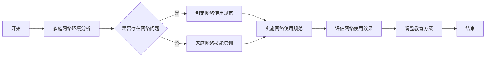

                 

# 家庭数字素养教育：培养健康网络习惯的家庭课程

## 关键词

- 家庭数字素养教育
- 健康网络习惯
- 教育课程
- 数字技能
- 信息素养

### 摘要

在数字化时代，家庭数字素养教育的重要性日益凸显。本文旨在探讨家庭数字素养教育，提供一套系统、科学、实用的家庭课程，以培养家庭成员的健康网络习惯。文章首先介绍了家庭数字素养教育的背景和必要性，随后详细阐述了核心概念、算法原理和数学模型，并通过实际案例进行了深入剖析，最后提出了最佳实践建议和未来展望。

## 目录大纲

- **第一部分：家庭数字素养教育概述**
  - **第1章：问题的提出**
    - 1.1 家庭数字素养教育的背景
    - 1.2 问题描述
    - 1.3 问题解决
    - 1.4 边界与外延
    - 1.5 概念结构与核心要素组成
  - **第2章：家庭数字素养教育的核心概念与联系**
    - 2.1 核心概念原理
    - 2.2 概念属性特征对比表格
    - 2.3 ER实体关系图架构
  - **第3章：家庭数字素养教育的算法原理讲解**
    - 3.1 算法原理与mermaid流程图
    - 3.2 Python源代码实现
    - 3.3 算法原理的数学模型和公式
    - 3.4 详细讲解与举例说明
  - **第4章：家庭数字素养教育的数学模型和公式讲解**
    - 4.1 数学模型
    - 4.2 详细讲解
    - 4.3 举例说明
- **第二部分：家庭数字素养教育课程设计**
  - **第5章：课程设计原则与方法**
    - 5.1 教育目标
    - 5.2 课程内容设计
    - 5.3 教学方法
  - **第6章：课程实施与评估**
    - 6.1 课程实施策略
    - 6.2 教学评估方法
    - 6.3 评估结果分析
  - **第7章：家庭数字素养教育的可持续发展**
    - 7.1 政策支持
    - 7.2 社会参与
    - 7.3 家庭文化

## 第一部分：家庭数字素养教育概述

### 第1章：问题的提出

#### 1.1 家庭数字素养教育的背景

随着互联网技术的迅猛发展，数字化已经成为现代社会的一个重要特征。家庭作为社会的基本单元，其成员的数字素养水平直接关系到整个社会的数字素养水平。当前，数字化趋势对家庭教育提出了新的挑战：

1. **数字化设备的普及**：智能手机、平板电脑、电脑等数字化设备已经成为家庭生活的重要组成部分。
2. **网络资源的丰富**：互联网提供了海量的信息资源，极大地丰富了家庭教育和娱乐的方式。
3. **网络环境的复杂**：网络环境的复杂性和不可控性给家庭带来了信息过载、网络成瘾、网络欺凌等问题。

#### 1.2 家庭数字素养教育存在的问题

当前家庭数字素养教育存在以下问题：

1. **家长数字素养不足**：很多家长对数字技术缺乏了解，无法有效引导孩子使用网络。
2. **孩子网络成瘾**：部分孩子过度沉迷于网络，影响学习、生活和心理健康。
3. **网络安全问题**：家庭网络面临黑客攻击、网络诈骗等安全威胁。

#### 1.3 问题解决

家庭数字素养教育的重要性不言而喻，因此，有必要采取以下措施：

1. **提高家长数字素养**：通过培训和讲座，提高家长对数字技术的理解和应用能力。
2. **培养孩子健康网络习惯**：制定家庭网络使用规范，培养孩子正确的网络使用习惯。
3. **加强网络安全教育**：教育孩子识别网络风险，提高网络安全意识。

#### 1.4 边界与外延

家庭数字素养教育的范围包括但不限于以下几个方面：

1. **数字技能培训**：教授基本的计算机操作技能、互联网使用技巧等。
2. **信息素养教育**：培养孩子对信息的甄别、筛选和利用能力。
3. **网络安全教育**：教育孩子如何防范网络诈骗、保护个人隐私等。

家庭数字素养教育与其他领域的交叉融合包括：

1. **家庭教育**：家庭数字素养教育是家庭教育的重要组成部分，需要与家庭教育整体规划相结合。
2. **学校教育**：学校应与家庭密切合作，共同推进数字素养教育。
3. **社会教育**：社会机构和媒体应积极参与家庭数字素养教育的推广和实施。

#### 1.5 概念结构与核心要素组成

家庭数字素养教育的概念结构主要包括以下核心要素：

1. **数字素养**：对数字技术和信息的理解和使用能力。
2. **家庭教育**：家庭对子女进行的各种教育影响。
3. **网络习惯**：家庭成员在网络使用过程中的行为习惯。

这些要素相互联系，共同构成了家庭数字素养教育的体系。通过对这些要素的分析，可以更好地理解家庭数字素养教育的内涵和外延。

### 第2章：家庭数字素养教育的核心概念与联系

#### 2.1 核心概念原理

家庭数字素养教育涉及的核心概念包括数字素养、家庭教育和网络习惯。这些概念分别代表了不同的层面和维度，它们相互交织，共同构成了家庭数字素养教育的理论基础。

1. **数字素养**：数字素养是指个体在数字环境中获取、理解、使用、评估和创造信息的能力。它不仅包括对数字技术和工具的操作技能，还涉及对信息的批判性思维和信息伦理。数字素养是一个多维度的概念，包括技术技能、信息素养、媒体素养和计算思维等方面。

2. **家庭教育**：家庭教育是指家庭成员在日常生活中相互传授知识和价值观的过程。它是一种独特的教育形式，与学校教育和社会教育不同，具有更加个性化、贴近生活的特点。家庭教育的目标是培养孩子的全面发展，包括道德品质、智力发展、身心健康等方面。

3. **网络习惯**：网络习惯是指个体在网络使用过程中形成的行为模式。良好的网络习惯有助于提高网络使用的效率和效果，防止网络成瘾和网络安全问题。网络习惯包括时间管理、信息甄别、网络安全、社交礼仪等方面。

#### 2.2 概念属性特征对比表格

| 特征               | 数字素养             | 家庭教育           | 网络习惯           |
|--------------------|----------------------|--------------------|--------------------|
| **定义**           | 对数字技术和信息的理解和使用能力 | 家庭对子女进行的教育影响 | 网络使用过程中形成的行为模式 |
| **重要性**         | 数字化社会中至关重要 | 社会的基本单位，教育至关重要 | 良好的网络习惯有助于提高网络使用效率 |
| **目标**           | 提高数字技能和信息素养 | 培养全面发展的人 | 防止网络成瘾和网络安全问题 |
| **实施主体**       | 个体、学校、社会机构 | 家庭成员、家长     | 个体、家庭成员     |
| **影响因素**       | 技术发展、信息环境   | 家庭文化、家庭关系 | 网络环境、社会影响 |

#### 2.3 ER实体关系图架构

```mermaid
erDiagram
    Class1 ||--|{ Class2 }|--|| ClassN : Inheritance
    Class2 ||--|{ SubClass2A }|--|| SubClass2B : Generalization
    Class3 ||--|{ SubClass3A }|--|| SubClass3B : Generalization
```

在家庭数字素养教育的ER实体关系图中，主要涉及以下实体：

1. **家庭成员**：包括家长和子女，是数字素养教育的主体。
2. **教育资源**：包括数字技术、网络资源和教育工具等。
3. **教育过程**：包括家庭教育活动、网络使用规范和网络安全教育等。
4. **评估反馈**：包括对家庭成员数字素养水平的评估和反馈机制。

这些实体之间相互关联，构成了家庭数字素养教育的完整体系。

### 第3章：家庭数字素养教育的算法原理讲解

#### 3.1 算法原理与mermaid流程图

家庭数字素养教育的核心是培养健康的网络习惯，这需要通过一系列的教育和引导来实现。为了更好地描述这一过程，我们可以使用mermaid流程图来展示算法原理。



在这个流程图中，A代表教育过程开始，B是家庭网络环境分析，C是判断家庭网络是否存在问题。如果存在网络问题，则选择D制定网络使用规范；如果不存在网络问题，则选择E进行家庭网络技能培训。无论是制定规范还是进行培训，都会进入F实施环节，然后进行G评估网络使用效果，最后根据评估结果H调整教育方案，直至达到理想的教育效果。

#### 3.2 Python源代码实现

为了实现上述算法原理，我们可以使用Python编写一个简单的家庭数字素养教育系统。

```python
# Python代码示例
class FamilyDigitalLiteracyEducation:
    def __init__(self):
        self.network_issues = None
        self.network_norms = None
        self.digital_skills = None

    def analyze_network_environment(self):
        # 分析家庭网络环境
        # 假设通过问卷调查等方式收集数据
        self.network_issues = "存在网络问题" if some_condition else "不存在网络问题"
        return self.network_issues

    def create_network_norms(self):
        # 制定网络使用规范
        self.network_norms = "制定网络使用规范"
        return self.network_norms

    def train_family_network_skills(self):
        # 家庭网络技能培训
        self.digital_skills = "进行家庭网络技能培训"
        return self.digital_skills

    def implement_network_norms(self):
        # 实施网络使用规范
        self.network_norms = "实施网络使用规范"
        return self.network_norms

    def evaluate_network_usage_effects(self):
        # 评估网络使用效果
        self.network_usage_effects = "评估网络使用效果"
        return self.network_usage_effects

    def adjust_education_plan(self):
        # 调整教育方案
        self.education_plan = "调整教育方案"
        return self.education_plan

    def run_education_process(self):
        # 执行整个教育过程
        self.network_issues = self.analyze_network_environment()
        if self.network_issues == "存在网络问题":
            self.network_norms = self.create_network_norms()
        else:
            self.digital_skills = self.train_family_network_skills()
        self.network_norms = self.implement_network_norms()
        self.network_usage_effects = self.evaluate_network_usage_effects()
        self.education_plan = self.adjust_education_plan()

# 创建家庭数字素养教育对象并运行教育过程
family_education = FamilyDigitalLiteracyEducation()
family_education.run_education_process()
print(family_education)
```

在这个Python代码中，我们定义了一个`FamilyDigitalLiteracyEducation`类，包含了分析网络环境、制定规范、培训技能、实施规范、评估效果和调整方案等步骤。通过实例化这个类并调用`run_education_process`方法，我们可以模拟整个家庭数字素养教育的过程。

#### 3.3 算法原理的数学模型和公式

家庭数字素养教育的效果可以通过以下数学模型和公式进行评估：

$$
\text{家庭数字素养度} = \frac{\text{家长数字素养度} + 2 \times \text{子女数字素养度}}{3}
$$

其中，家长数字素养度和子女数字素养度分别表示家长和子女的数字素养水平，权重分别为1和2。这个公式体现了家庭数字素养教育的核心目标，即提高家长和子女的数字素养水平，促进家庭整体数字素养的提升。

#### 3.4 详细讲解与举例说明

1. **数据收集**：首先，通过问卷调查、访谈等方式收集家庭成员的数字素养水平数据。这些数据包括家长的数字技能、网络使用习惯和子女的数字技能、网络成瘾程度等。

2. **数据清洗**：对收集到的数据进行清洗，确保数据的准确性和完整性。这包括删除无效数据、填补缺失值和标准化数据等步骤。

3. **数据分析**：使用统计分析方法对数据进行分析，评估家庭成员的数字素养水平。这可以通过计算平均数、中位数、标准差等统计指标来实现。

4. **生成报告**：根据分析结果生成个性化的数字素养提升报告。报告应包括以下内容：

   - 家庭成员的数字素养水平评估结果
   - 存在的数字素养问题及原因分析
   - 提出针对性的数字素养提升建议

   例如，如果家长的网络素养水平较低，报告中可以建议家长参加数字技能培训课程，以提高网络使用能力。如果子女存在网络成瘾问题，报告中可以建议家长制定合理的网络使用规范，限制子女的上网时间。

5. **反馈与调整**：在实施数字素养提升计划后，定期收集家庭成员的反馈，评估教育效果。根据反馈结果，及时调整教育方案，确保教育目标的实现。

### 第4章：家庭数字素养教育的数学模型和公式讲解

#### 4.1 数学模型

在家庭数字素养教育中，我们可以使用以下数学模型来量化家庭成员的数字素养水平：

$$
\text{家庭数字素养度} = \frac{\text{家长数字素养度} + 2 \times \text{子女数字素养度}}{3}
$$

这个模型反映了家庭数字素养教育的核心目标，即提高家长和子女的数字素养水平。其中，家长数字素养度和子女数字素养度分别表示家长和子女的数字素养水平，权重分别为1和2。这个模型假设家长在数字素养教育中起着主导作用，而子女的数字素养水平受到家长的影响较大。

#### 4.2 详细讲解

1. **家长数字素养度**：家长数字素养度是衡量家长在数字技术和信息方面的能力和素养的指标。它包括以下几个方面：

   - **数字技能**：家长对计算机、互联网、智能手机等数字设备的操作技能。
   - **信息素养**：家长对信息的获取、处理和利用能力。
   - **网络素养**：家长对网络环境、网络安全和网络伦理的认知。

   家长数字素养度可以通过问卷调查、技能测试等方式进行评估。

2. **子女数字素养度**：子女数字素养度是衡量子女在数字技术和信息方面的能力和素养的指标。它包括以下几个方面：

   - **数字技能**：子女对计算机、互联网、智能手机等数字设备的操作技能。
   - **信息素养**：子女对信息的获取、处理和利用能力。
   - **网络素养**：子女对网络环境、网络安全和网络伦理的认知。

   子女数字素养度可以通过问卷调查、技能测试、网络行为分析等方式进行评估。

3. **综合数字素养度**：综合数字素养度是家庭整体数字素养水平的量化指标。它通过将家长数字素养度和子女数字素养度结合起来，计算得出家庭整体的数字素养水平。

   $$
   \text{家庭数字素养度} = \frac{\text{家长数字素养度} + 2 \times \text{子女数字素养度}}{3}
   $$

   这个公式假设家长在数字素养教育中起着主导作用，因此给家长数字素养度赋予了更高的权重（1分），而子女数字素养度则赋予较低的权重（2分）。

#### 4.3 举例说明

假设一个家庭中有两位家长和两个子女，他们的数字素养度如下：

- 家长1数字素养度：8分
- 家长2数字素养度：7分
- 子女1数字素养度：6分
- 子女2数字素养度：5分

根据上述数学模型，我们可以计算这个家庭的数字素养度：

$$
\text{家庭数字素养度} = \frac{8 + 7 + 2 \times (6 + 5)}{3} = \frac{8 + 7 + 2 \times 11}{3} = \frac{8 + 7 + 22}{3} = \frac{37}{3} \approx 12.33
$$

因此，这个家庭的数字素养度为12.33分。这个分数可以用来评估家庭整体数字素养水平，并指导后续的教育和培训。

通过这个例子，我们可以看到，家庭数字素养教育不仅关注个体的数字素养水平，还关注家庭整体数字素养水平的提升。通过合理分配权重和制定科学的教育方案，可以有效提高家庭的数字素养水平，培养健康网络习惯。

### 第二部分：家庭数字素养教育课程设计

#### 第5章：课程设计原则与方法

家庭数字素养教育课程的设计原则和方法是确保教育效果的重要基础。以下将从教育目标、课程内容设计和教学方法三个方面进行详细阐述。

#### 5.1 教育目标

家庭数字素养教育的目标是培养家庭成员的数字素养，包括对数字技术的理解和应用能力，对信息的甄别和利用能力，以及网络安全意识和网络伦理观念。具体目标如下：

1. **提高数字技能**：使家庭成员掌握基本的计算机操作技能、互联网使用技巧和网络应用工具。
2. **增强信息素养**：培养家庭成员对信息的获取、处理和利用能力，提高对虚假信息和不良信息的辨别能力。
3. **培养网络素养**：教育家庭成员遵守网络道德规范，尊重他人隐私，树立正确的网络价值观。
4. **提升网络安全意识**：使家庭成员了解网络安全的威胁，学会防范网络诈骗、病毒和恶意软件。

#### 5.2 课程内容设计

家庭数字素养教育的课程内容设计应涵盖以下几个模块：

1. **数字技术基础**：介绍计算机的基本操作、互联网的基本知识和网络应用工具的使用方法。
2. **信息素养培养**：包括信息检索技巧、信息筛选与评估、信息伦理等方面的内容。
3. **网络安全教育**：讲解网络安全的基本知识，如密码设置、隐私保护、防范网络诈骗等。
4. **网络伦理与社会责任**：强调网络伦理的重要性，教育家庭成员遵守网络规范，尊重他人权利。
5. **网络行为管理**：培养家庭成员良好的网络行为习惯，包括合理安排上网时间、避免网络成瘾等。

课程内容的设计应结合家庭成员的年龄、职业、兴趣和实际需求，确保课程的实用性和针对性。

#### 5.3 教学方法

家庭数字素养教育的教学方法应多样化，以满足不同家庭成员的学习需求和兴趣。以下几种教学方法可供参考：

1. **互动式教学**：通过小组讨论、角色扮演和案例分析等形式，激发家庭成员的参与热情，提高学习效果。
2. **情景模拟**：模拟真实的网络环境，让家庭成员在实践中学习和掌握数字技能和信息素养。
3. **游戏化学习**：结合教育内容和游戏元素，设计有趣的游戏任务，使学习过程更加轻松愉快。
4. **在线学习平台**：利用在线学习平台，提供丰富的学习资源和互动交流空间，方便家庭成员随时学习和分享经验。
5. **家长辅导**：家长在家庭数字素养教育中扮演重要角色，应通过培训和教育提高自身的数字素养，更好地辅导子女。

通过以上原则和方法，可以设计出一套科学、系统、实用的家庭数字素养教育课程，帮助家庭成员提高数字素养，培养健康网络习惯。

### 第6章：课程实施与评估

#### 6.1 课程实施策略

家庭数字素养教育的实施策略是确保课程目标有效实现的关键。以下从课程准备、课程实施和课程监督三个方面进行详细阐述。

#### 6.1.1 课程准备

1. **需求分析**：在课程开始前，对家庭成员的数字素养水平进行评估，了解他们的需求和兴趣点，为课程设计提供依据。
2. **课程设计**：根据需求分析结果，设计符合家庭成员特点和需求的课程内容和教学方法。
3. **资源准备**：准备必要的教材、学习工具、网络资源和培训材料，确保课程顺利进行。
4. **师资培训**：对家长或辅导教师进行数字素养培训，提高他们的教学能力和水平。

#### 6.1.2 课程实施

1. **课程导入**：通过互动游戏、案例分析等形式，激发家庭成员的学习兴趣，明确课程目标和内容。
2. **课堂互动**：采用互动式教学，鼓励家庭成员积极参与，提问和分享自己的学习心得。
3. **实践操作**：设计实践操作环节，让家庭成员在真实情境中应用所学的数字技能和信息素养。
4. **家庭作业**：布置与课程内容相关的家庭作业，让家庭成员在家庭环境中继续学习和巩固所学知识。
5. **家长辅导**：家长在家庭数字素养教育中发挥重要作用，应通过辅导和监督，确保子女的学习效果。

#### 6.1.3 课程监督

1. **进度监控**：定期检查课程进度，确保课程按计划进行，及时解决遇到的问题。
2. **学习反馈**：收集家庭成员的学习反馈，了解他们的学习效果和需求，调整教学策略。
3. **成果评估**：通过考试、作业、实践操作等方式，评估家庭成员的数字素养水平，总结课程实施效果。

通过以上实施策略，可以确保家庭数字素养教育课程的有效实施，帮助家庭成员提高数字素养，培养健康网络习惯。

#### 6.2 教学评估方法

教学评估是衡量家庭数字素养教育效果的重要手段。以下从自我评估、同伴评估和专家评估三个方面介绍常用的教学评估方法。

#### 6.2.1 自我评估

自我评估是指家庭成员通过自我反思和评价，了解自己在数字素养方面的进步和不足。具体方法包括：

1. **自我反思日记**：家庭成员定期记录自己在数字素养学习中的心得体会、遇到的困难和取得的进步。
2. **自我评估问卷**：设计问卷，涵盖数字技能、信息素养、网络安全和网络伦理等方面的内容，让家庭成员自我评估。
3. **自我挑战任务**：设定具有挑战性的学习任务，家庭成员通过完成任务，评估自己的数字素养水平。

#### 6.2.2 同伴评估

同伴评估是指家庭成员之间相互评价，通过交流和学习，共同提高数字素养。具体方法包括：

1. **同伴互助小组**：家庭成员组成互助小组，共同讨论学习内容，互相分享学习心得和经验。
2. **同伴反馈**：家庭成员在完成学习任务后，相互提供反馈和建议，帮助对方改进。
3. **同伴互评**：设计评价表格，让家庭成员相互评估对方的数字素养水平，识别对方的优点和不足。

#### 6.2.3 专家评估

专家评估是指邀请数字素养教育专家对家庭成员的数字素养水平进行评估。具体方法包括：

1. **专家讲座**：邀请专家为家庭成员提供讲座，介绍数字素养教育的最新研究成果和实践经验。
2. **专家评估**：专家通过观察、测试和访谈等方式，评估家庭成员的数字素养水平，提出改进建议。
3. **专家反馈**：专家根据评估结果，向家庭成员提供反馈，帮助他们更好地理解数字素养教育的意义和方法。

通过以上评估方法，可以全面了解家庭成员的数字素养水平，识别教育中的问题和不足，为后续的教育改进提供依据。

#### 6.3 评估结果分析

评估结果分析是教学评估的最后一个环节，通过对评估结果的深入分析，可以了解家庭数字素养教育的效果，并为后续的教育改进提供指导。以下从数据分析和问题识别两个方面进行阐述。

#### 6.3.1 数据分析

1. **统计数据分析**：通过对评估数据的统计分析，如计算平均值、中位数、标准差等，了解家庭成员的数字素养水平分布情况。
2. **图表展示**：利用图表，如柱状图、折线图、饼图等，直观展示评估结果，帮助家庭成员更好地理解数字素养教育的效果。
3. **趋势分析**：分析评估结果的变化趋势，如数字素养水平的提高情况，识别教育过程中的优点和不足。

#### 6.3.2 问题识别

1. **识别不足之处**：通过分析评估结果，识别家庭成员在数字技能、信息素养、网络安全和网络伦理等方面的不足，为后续教育提供针对性改进措施。
2. **分析原因**：对识别出的问题进行原因分析，如家长辅导不足、教育资源缺乏、家庭成员对数字素养教育重视程度不足等。
3. **提出改进建议**：根据问题识别和分析结果，提出具体的改进建议，如加强家长辅导、丰富教育资源、提高家庭成员对数字素养教育的重视程度等。

通过以上评估结果分析，可以全面了解家庭数字素养教育的效果，识别教育中的问题和不足，为后续的教育改进提供科学依据。

### 第7章：家庭数字素养教育的可持续发展

#### 7.1 政策支持

家庭数字素养教育的可持续发展离不开政策支持。政府应制定和实施相关政策，推动家庭数字素养教育的普及和发展。以下是一些政策支持的建议：

1. **制定国家数字素养教育规划**：明确家庭数字素养教育的目标和任务，制定长期规划，确保家庭数字素养教育在国家教育体系中占据重要地位。
2. **加大投入**：增加对家庭数字素养教育的财政投入，支持教育机构、社会组织和企业开展相关教育活动。
3. **提供优惠政策**：为家庭数字素养教育提供优惠政策，如税收减免、教育补贴等，鼓励家庭积极参与数字素养教育。
4. **建立评估体系**：建立健全家庭数字素养教育的评估体系，定期评估教育效果，为政策调整提供依据。

#### 7.2 社会参与

社会参与是家庭数字素养教育可持续发展的重要保障。以下是一些社会参与的措施：

1. **企业社会责任**：鼓励企业承担社会责任，参与家庭数字素养教育的推广和实践，为家庭提供技术支持、教育资源和服务。
2. **社会组织合作**：与教育机构、科研机构、社区组织等建立合作关系，共同推动家庭数字素养教育的发展。
3. **公众宣传活动**：通过电视、广播、互联网等渠道，开展家庭数字素养教育的宣传活动，提高公众对数字素养教育的认识和重视。
4. **志愿者服务**：鼓励志愿者参与家庭数字素养教育活动，为家庭提供辅导和支持。

#### 7.3 家庭文化

家庭文化是家庭数字素养教育的重要组成部分。以下是一些培养家庭文化的建议：

1. **建立家庭学习氛围**：营造良好的家庭学习氛围，鼓励家庭成员共同参与数字素养学习，形成良好的学习习惯。
2. **树立正确的网络价值观**：教育家庭成员尊重网络道德规范，遵守网络安全法律法规，树立正确的网络价值观。
3. **加强家庭互动**：通过家庭互动活动，如一起上网、一起讨论网络话题等，增进家庭成员之间的沟通和理解，培养健康网络习惯。
4. **培养数字素养榜样**：树立数字素养榜样，如数字素养较高的家庭成员、数字素养教育专家等，激励家庭成员学习数字素养。

通过政策支持、社会参与和家庭文化培养，可以推动家庭数字素养教育的可持续发展，为家庭成员的终身学习和全面发展提供有力支持。

### 结论

家庭数字素养教育在数字化时代具有重要意义。本文通过深入分析家庭数字素养教育的背景、核心概念、算法原理和数学模型，提出了系统、科学、实用的家庭数字素养教育课程设计原则和方法，并探讨了课程实施与评估、政策支持、社会参与和家庭文化培养等方面的可持续发展策略。通过这些措施，可以有效提高家庭成员的数字素养，培养健康网络习惯，为个人的全面发展和社会的和谐稳定奠定坚实基础。未来，我们应继续关注家庭数字素养教育的研究和实践，不断创新教育模式，推动家庭数字素养教育的可持续发展。

### 最佳实践 Tips

1. **家长先行**：家长是家庭数字素养教育的第一责任人，应首先提升自身的数字素养，成为孩子的榜样。
2. **定期交流**：家庭成员之间应定期进行数字素养学习交流，分享经验和心得，共同进步。
3. **合理安排时间**：合理规划家庭数字时间和学习时间，避免网络成瘾，保证充足的休息时间。
4. **网络安全教育**：重视网络安全教育，教育家庭成员如何防范网络诈骗、保护个人隐私。

### 小结

家庭数字素养教育是一项系统工程，需要政府、社会、家庭和个人的共同努力。通过科学的设计和实践，可以有效提高家庭成员的数字素养，培养健康网络习惯，为个人的全面发展和社会的和谐稳定贡献力量。

### 注意事项

1. **个性化需求**：家庭数字素养教育应根据家庭成员的实际情况和需求进行个性化设计，避免一刀切。
2. **持续关注**：家庭数字素养教育不是一蹴而就的，需要持续关注和投入，确保教育效果的长期稳定。

### 拓展阅读

1. **《数字素养：教育者的指南》**：详细介绍了数字素养的定义、重要性以及教育者的实践指南。
2. **《家庭数字素养教育研究报告》**：分析了家庭数字素养教育的现状、问题和未来发展。
3. **《网络安全教育：实践与策略》**：探讨了网络安全教育的方法和策略，包括家庭网络安全教育。

### 作者信息

作者：AI天才研究院/AI Genius Institute & 禅与计算机程序设计艺术 /Zen And The Art of Computer Programming

