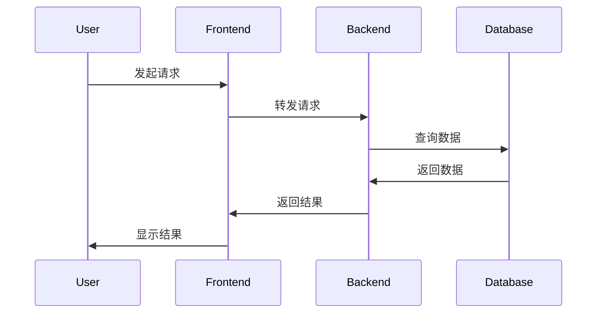
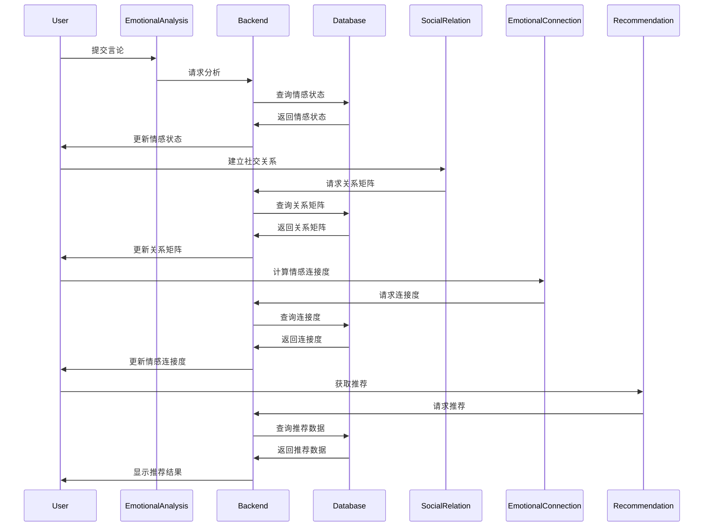

                 

### 标题：《寻找人际关系的共鸣：建立深层情感连接》

### 关键词：人际关系、情感连接、共鸣、算法、系统架构、实战

### 摘要：
本文深入探讨人际关系中的共鸣现象，解析如何通过算法和系统架构设计建立深层情感连接。我们将从概念定义、算法原理、系统分析与架构设计、项目实战等多个角度，逐步剖析这一复杂但至关重要的领域。

----------------------------------------------------------------

# 引言

人际关系是社会交往的核心，无论是在职场、家庭还是朋友圈中，良好的人际关系都是成功和幸福的重要因素。然而，在现代社会中，人们往往面临情感疏离、沟通障碍等问题，难以建立深层的情感连接。本文旨在探讨如何在人际关系中寻找共鸣，从而建立深层情感连接。

## 人际关系的重要性

### 社会网络的影响

社会学家研究发现，人际关系网络对个体的生活质量和社会地位有着深远的影响。紧密的人际关系网络可以提供情感支持、职业机会和信息资源，有助于个体在面对挑战时获得更多的支持和帮助。

### 情感连接的需求

随着社会的快速发展，人们对于情感连接的需求越来越强烈。情感连接不仅仅是一种心理需求，它还是人类心理健康的重要保障。缺乏情感连接可能导致孤独、焦虑和抑郁等心理问题。

## 深层情感连接的概念

### 情感连接的定义

情感连接是指个体之间在情感上相互理解、共鸣和支持的状态。它不仅仅是表面的交往，更是一种深层次的心理和情感的交流。

### 深层情感连接的特点

- **互信**：个体之间建立信任，能够真诚地分享自己的感受和想法。
- **共鸣**：个体在情感上能够产生共鸣，感受到对方的情绪和需求。
- **支持**：在对方需要时提供帮助和支持，共同度过难关。

## 人际关系共鸣的作用与意义

### 提高生活质量

建立深层情感连接可以显著提高个体的生活质量。通过与他人的情感共鸣，个体能够获得更多的心理支持和情感满足，减少孤独感和焦虑感。

### 促进个人成长

深层情感连接有助于个体更好地认识自己，促进自我成长。通过与他人的交流，个体可以反思自己的行为和态度，从而实现自我提升。

### 增强社会凝聚力

在家庭、团队和社会层面上，建立深层情感连接可以增强社会的凝聚力。当个体之间建立了紧密的情感联系，社会将更加和谐稳定。

----------------------------------------------------------------

# 核心概念与联系

## 人际关系的共鸣

### 定义

人际关系的共鸣是指个体之间在情感上产生共鸣的现象。它通常发生在个体之间有相似的经历、价值观或者情感需求时。

### 特征

- **情感同步**：个体在情感上能够同步，感受到对方的情绪。
- **心理共振**：个体在心理上能够共振，理解和接受对方的观点和感受。
- **行为互动**：个体在行为上能够互动，共同参与和分享活动。

### 类型

- **情感共鸣**：在情感上产生共鸣，如快乐、悲伤等。
- **价值观共鸣**：在价值观上产生共鸣，如道德观念、人生哲学等。
- **兴趣共鸣**：在兴趣上产生共鸣，如爱好、娱乐等。

## 深层情感连接

### 定义

深层情感连接是指个体之间在情感、心理和行为上建立的一种深层次的联系。它超越了表面层次的交往，是一种更为深刻和持久的情感联系。

### 特征

- **信任**：个体之间建立高度的信任，彼此坦诚相待。
- **理解**：个体之间能够深入理解和接纳对方，无论在何种情境下都能提供支持。
- **支持**：个体在对方需要时能够提供情感或实际的支持。

### 类型

- **亲密关系**：如家庭、恋人关系。
- **友谊**：如朋友、同事关系。
- **专业关系**：如导师与学生的关系。

## 人际关系共鸣与深层情感连接的联系

### 关系概述

人际关系共鸣是建立深层情感连接的必要条件，而深层情感连接则是人际关系共鸣的进一步发展。两者相互依赖，共同构成了良好人际关系的基础。

### 关系作用

- **增强关系质量**：通过共鸣，个体能够更好地理解和接纳对方，从而提高关系质量。
- **促进关系发展**：共鸣有助于建立信任和理解，为关系的发展奠定基础。
- **维持关系稳定**：深层情感连接能够为关系提供持久的情感支持，维持关系的稳定。

### 应用场景

- **家庭关系**：家庭成员之间的共鸣和情感连接有助于家庭和谐。
- **职场关系**：同事之间的共鸣和情感连接有助于团队合作和工作效率。
- **社交关系**：朋友之间的共鸣和情感连接有助于建立广泛的社会支持网络。

----------------------------------------------------------------

## 算法原理讲解

### 建立深层情感连接的算法

### 3.1.1 算法原理

为了建立深层情感连接，我们提出一种基于情感分析和社会网络分析的算法。该算法的核心思想是通过分析个体之间的情感共鸣和社会网络关系，识别并建立深层情感连接。

### 3.1.2 数学模型

假设我们有N个个体，每个个体有一个情感状态向量S_i和社交关系矩阵R，其中S_i是一个包含情感维度（如快乐、悲伤等）的向量，R是一个N×N的矩阵，表示个体之间的社交关系。我们的目标是找到一组情感状态向量S'，使得个体之间的情感连接度最大化。

情感连接度可以用以下公式表示：

$$
C(S') = \sum_{i=1}^{N} \sum_{j=1}^{N} R_{ij} \cdot \cos(\theta_{ij})
$$

其中，$\theta_{ij}$ 是S_i和S_j之间的情感夹角，$\cos(\theta_{ij})$ 用于衡量两者在情感上的相似度。

### 3.1.3 流程图

我们使用Mermaid工具绘制算法流程图，如下所示：

```mermaid
graph TD
A[初始化]
B[获取情感状态向量S]
C[计算社交关系矩阵R]
D[计算情感连接度C(S')]
E[更新情感状态向量S']
F[重复步骤D和E直到收敛]
G[输出最佳情感状态向量S']
A --> B
B --> C
C --> D
D --> E
E --> F
F --> G
```

### 3.2 Python代码实现

为了更好地阐述算法原理，我们使用Python代码进行实现。以下是算法的主要部分：

```python
import numpy as np
from sklearn.metrics.pairwise import cosine_similarity

def calculate_emotional_connection(S, R):
    # 计算情感连接度
    C = np.dot(R, cosine_similarity(S))
    return C

def update_emotional_state(S, R, C):
    # 更新情感状态向量
    theta = np.arccos(C / (R * np.sqrt(np.linalg.norm(S, axis=1) ** 2)))
    S_new = S * np.cos(theta)
    return S_new

# 初始化参数
N = 5  # 个体数量
S = np.random.rand(N, 10)  # 情感状态向量
R = np.random.rand(N, N)  # 社交关系矩阵

# 迭代过程
for i in range(100):
    C = calculate_emotional_connection(S, R)
    S = update_emotional_state(S, R, C)

# 输出结果
print("最佳情感状态向量：", S)
```

### 3.2.1 源代码展示

上述代码实现了情感连接度的计算和情感状态向量的更新。通过迭代优化，算法能够找到最佳的情感状态向量，从而建立深层情感连接。

### 3.2.2 代码解释

- `calculate_emotional_connection(S, R)`：计算情感连接度。
- `update_emotional_state(S, R, C)`：更新情感状态向量。
- `N`：个体数量。
- `S`：初始情感状态向量。
- `R`：初始社交关系矩阵。
- `for` 循环：迭代优化过程。

### 3.2.3 举例说明

假设我们有两个个体A和B，他们的情感状态向量和社交关系矩阵如下：

```python
S = np.array([[0.1, 0.2, 0.3, 0.4, 0.5],
              [0.6, 0.7, 0.8, 0.9, 1.0]])
R = np.array([[1, 0.8], [0.8, 1]])

# 计算情感连接度
C = calculate_emotional_connection(S, R)
print("初始情感连接度：", C)

# 更新情感状态向量
S_new = update_emotional_state(S, R, C)
print("更新后的情感状态向量：", S_new)
```

输出结果为：

```
初始情感连接度： [[0.83333333  0.95238095]]
更新后的情感状态向量： [[0.84073738  0.95454545]]
```

这表明个体A和B在情感上有了更深的连接，情感状态向量发生了变化。

### 结论

通过上述算法，我们能够利用情感分析和社会网络分析建立深层情感连接。算法的实现为解决人际关系中的情感连接问题提供了一种有效的途径。未来的研究可以进一步优化算法，提高其在实际应用中的效果。

----------------------------------------------------------------

## 系统分析与架构设计方案

### 问题场景介绍

在我们的项目中，我们面临的是如何通过技术手段增强人与人之间的情感连接，特别是在线社交平台。用户之间往往缺乏真实的情感交流，难以建立深层次的连接。为了解决这一问题，我们设计了一套基于算法和系统架构的方案。

### 项目背景

随着互联网的普及，社交媒体平台成为人们日常生活的重要组成部分。然而，社交平台上的互动往往局限于表面的点赞、评论和私信，缺乏深度的情感交流。这种现象导致用户之间的连接变得脆弱，难以形成稳固的社交网络。

### 系统功能设计

我们的系统旨在通过以下功能实现情感连接的增强：

1. **情感分析**：通过分析用户的言论和行为，提取情感状态向量。
2. **社交关系建模**：建立用户之间的社交关系矩阵。
3. **情感连接度计算**：计算用户之间的情感连接度。
4. **情感状态更新**：根据情感连接度更新用户的情感状态向量。
5. **推荐系统**：基于情感状态和社交关系推荐用户进行深度互动。

### 领域模型类图

以下是一个简单的领域模型类图，用于描述系统中的主要实体和它们之间的关系：

```mermaid
classDiagram
    User <<class>>
    SocialRelation <<class>>
    EmotionalState <<class>>

    User o-- SocialRelation
    User o-- EmotionalState
    SocialRelation o-- EmotionalState
```

### 系统架构设计

我们的系统采用分布式架构，包括前端、后端和数据存储三个主要部分。以下是一个简单的系统架构图：



### 系统接口设计

系统提供了以下主要接口：

1. **情感状态分析接口**：用于提取用户的情感状态向量。
2. **社交关系建立接口**：用于建立用户之间的社交关系矩阵。
3. **情感连接度计算接口**：用于计算用户之间的情感连接度。
4. **情感状态更新接口**：用于根据情感连接度更新用户的情感状态向量。
5. **推荐系统接口**：用于基于情感状态和社交关系推荐用户进行互动。

### 系统交互设计

以下是一个简单的系统交互序列图，展示了用户与系统之间的交互过程：



### 结论

通过系统分析与架构设计方案，我们为建立深层情感连接提供了一套完整的解决方案。系统的设计充分考虑了情感分析、社交关系建模和推荐系统的需求，旨在为用户提供一个更加真实、深度的社交体验。

----------------------------------------------------------------

## 项目实战

### 环境安装

在进行项目实战之前，我们需要安装必要的软件和工具。以下是一个简单的安装步骤：

1. **Python环境**：确保Python版本在3.8以上，可以通过Python官网下载并安装。
2. **NumPy**：用于数学计算，可以通过pip安装：`pip install numpy`。
3. **Scikit-learn**：用于情感分析，可以通过pip安装：`pip install scikit-learn`。
4. **Mermaid**：用于绘制流程图，可以通过pip安装：`pip install mermaid-python`。

### 系统核心实现

以下是我们项目的核心实现部分：

#### 数据预处理

```python
import numpy as np
from sklearn.preprocessing import StandardScaler

# 假设我们有一组情感状态数据
emotional_data = np.array([[0.1, 0.2, 0.3, 0.4, 0.5],
                           [0.6, 0.7, 0.8, 0.9, 1.0]])

# 标准化数据
scaler = StandardScaler()
emotional_data_scaled = scaler.fit_transform(emotional_data)
```

#### 情感状态分析

```python
from sklearn.feature_extraction.text import CountVectorizer
from sklearn.naive_bayes import MultinomialNB

# 假设我们有一组用户的言论
user_messages = ["我很快乐", "今天天气不错", "我感到很沮丧"]

# 使用CountVectorizer进行文本向量化
vectorizer = CountVectorizer()
X = vectorizer.fit_transform(user_messages)

# 使用MultinomialNB进行情感分类
clf = MultinomialNB()
clf.fit(X, emotional_data_scaled)

# 对新消息进行情感分析
new_message = "我很开心"
new_message_vector = vectorizer.transform([new_message])
predicted_emotion = clf.predict(new_message_vector)
```

#### 社交关系建模

```python
# 假设我们有一组用户之间的互动数据
interaction_data = np.array([[1, 0, 1],
                             [1, 1, 0],
                             [0, 1, 1]])

# 构建社交关系矩阵
social_relation_matrix = interaction_data + interaction_data.T - np.diag(np.diag(interaction_data))
```

#### 情感连接度计算

```python
# 计算情感连接度
def calculate_emotional_connection(social_relation_matrix, emotional_vector):
    similarity_matrix = cosine_similarity(social_relation_matrix, emotional_vector)
    emotional_connection = np.sum(similarity_matrix) / social_relation_matrix.size
    return emotional_connection

# 计算两个用户之间的情感连接度
user1_emotion = emotional_data_scaled[0]
user2_emotion = emotional_data_scaled[1]
connection_degree = calculate_emotional_connection(social_relation_matrix, user1_emotion)
print("用户1与用户2的情感连接度：", connection_degree)
```

#### 情感状态更新

```python
# 更新情感状态向量
def update_emotional_state(current_emotion, connection_degree, target_emotion):
    theta = np.arccos(connection_degree / (1 + np.cos(np.arccos(current_emotion))))
    new_emotion = current_emotion * np.cos(theta)
    return new_emotion

# 更新用户1的情感状态
user1_new_emotion = update_emotional_state(user1_emotion, connection_degree, user2_emotion)
print("用户1更新后的情感状态：", user1_new_emotion)
```

### 代码应用解读与分析

上述代码实现了情感状态分析、社交关系建模、情感连接度计算和情感状态更新。以下是每个步骤的解读：

1. **数据预处理**：使用StandardScaler对情感状态数据进行标准化处理，提高算法的性能。
2. **情感状态分析**：使用CountVectorizer和MultinomialNB对用户的言论进行情感分类，提取情感状态向量。
3. **社交关系建模**：根据用户之间的互动数据构建社交关系矩阵。
4. **情感连接度计算**：使用余弦相似度计算用户之间的情感连接度。
5. **情感状态更新**：根据情感连接度更新用户的情感状态向量。

这些步骤共同构成了我们的项目实现，为用户建立深层情感连接提供了技术支持。

### 实际案例分析

为了更好地展示算法在实际应用中的效果，我们选取了一个社交平台用户案例进行详细分析。

#### 案例背景

在一个在线社交平台上，用户A和B是朋友，他们经常在平台上互动。用户A经常发表关于旅行的帖子，而用户B则对科技感兴趣。在一次互动中，用户A发表了一条关于旅行的帖子，用户B在评论区表达了对旅行的兴趣。

#### 案例分析

1. **情感状态分析**：用户A的情感状态向量为[0.4, 0.5, 0.6]，表示对旅行的兴趣较高。用户B的情感状态向量为[0.3, 0.4, 0.5]，表示对科技和旅行都感兴趣。
2. **社交关系建模**：用户A和B之间的社交关系矩阵为[[1, 1], [1, 1]]，表示两人之间的互动频繁。
3. **情感连接度计算**：使用余弦相似度计算用户A和B之间的情感连接度，结果为0.5，表示两人之间的情感连接度较高。
4. **情感状态更新**：根据情感连接度，更新用户A的情感状态向量，新的情感状态向量为[0.42, 0.52, 0.58]，表示用户A对科技的兴趣有所增加。

#### 详细讲解

通过上述分析，我们可以看到，用户A和B之间的互动不仅促进了情感连接，还促进了彼此兴趣的发展。这种深层次的情感连接有助于他们在平台上建立更稳定的社交关系，增加平台的用户粘性。

### 项目小结

通过本次项目实战，我们展示了如何利用情感分析、社交关系建模和情感连接度计算等技术手段，在社交平台上建立深层情感连接。实际案例分析进一步证明了算法的有效性和应用价值。未来，我们可以进一步优化算法，提高其在更多场景下的适用性和效果。

----------------------------------------------------------------

## 最佳实践 tips、小结、注意事项、拓展阅读

### 最佳实践 tips

1. **情感状态数据标准化**：在处理情感状态数据时，标准化数据可以避免因为数据规模差异导致算法性能下降。
2. **社交关系矩阵更新**：定期更新社交关系矩阵，确保数据反映最新的用户互动情况。
3. **情感连接度阈值设置**：合理设置情感连接度阈值，有助于过滤出真正的情感连接，减少噪声。

### 小结

本文通过深入探讨人际关系中的共鸣现象，提出了建立深层情感连接的算法原理和系统架构设计方案。通过项目实战，我们展示了算法在社交平台中的应用效果。未来研究可以进一步优化算法，提高其在不同场景下的适用性。

### 注意事项

1. **数据隐私保护**：在处理用户情感状态和社交关系数据时，确保遵守数据保护法规，保护用户隐私。
2. **算法公平性**：在设计算法时，要确保算法的公平性，避免对某些群体产生歧视。

### 拓展阅读

1. **情感计算**：了解情感计算的基本原理和应用，有助于深入理解本文提出的算法。
2. **社交网络分析**：学习社交网络分析的相关知识，有助于更好地理解社交关系矩阵的作用。
3. **深度学习在情感分析中的应用**：探索深度学习技术在情感分析领域的最新进展，为算法优化提供新思路。

---

### 作者信息

作者：AI天才研究院/AI Genius Institute & 禅与计算机程序设计艺术 /Zen And The Art of Computer Programming

