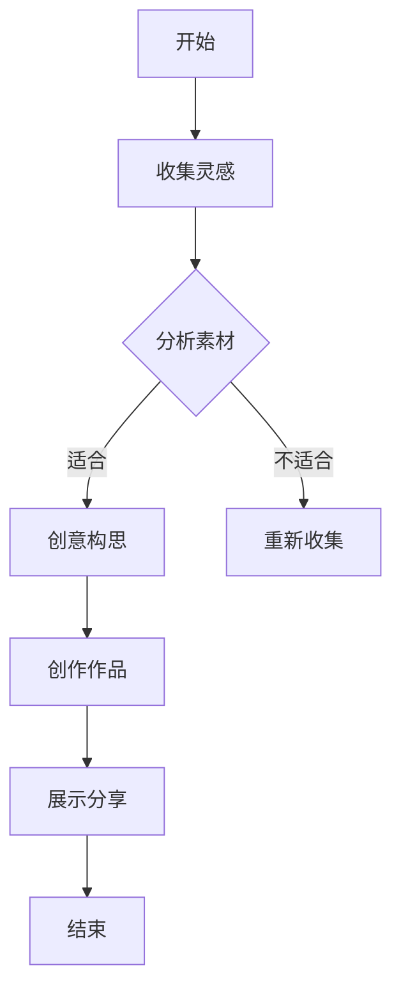
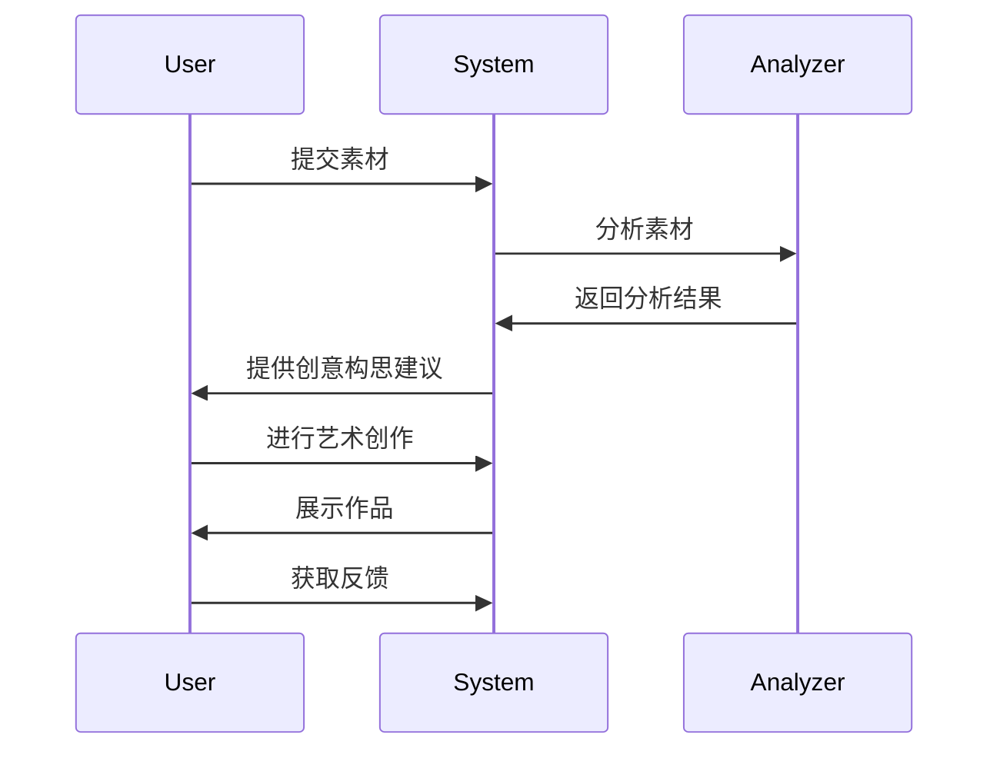
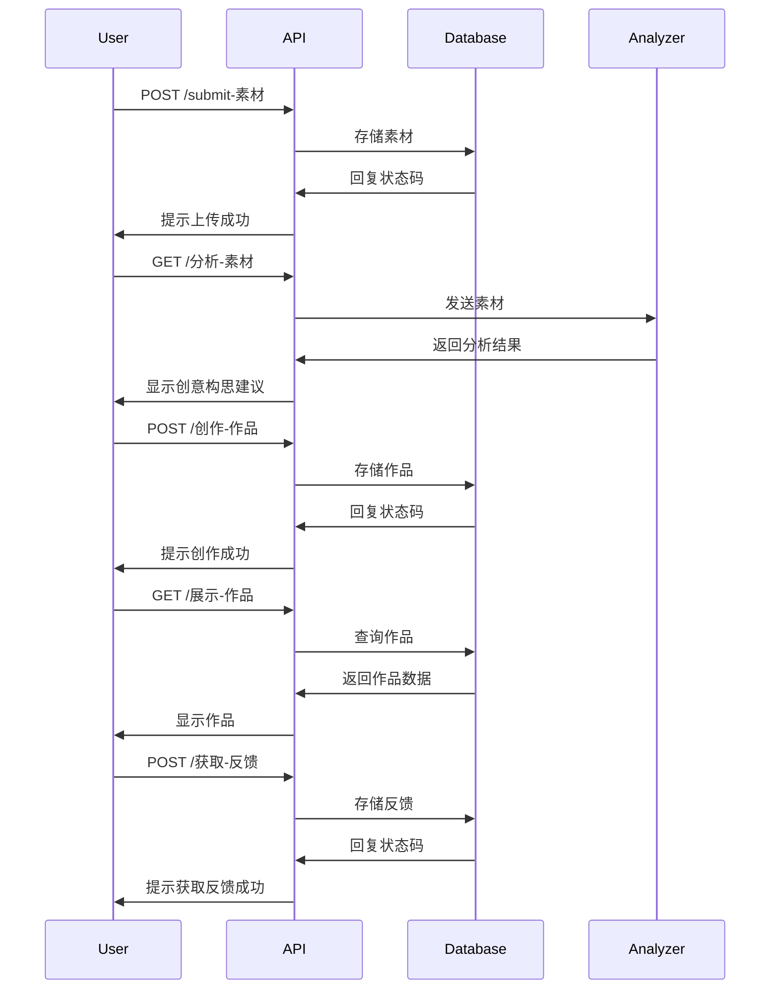

                 


# 《将日常生活转化为艺术：平凡中的创意表达》

> 关键词：创意表达、日常生活、艺术、思维方法、应用

> 摘要：本文旨在探讨如何将平凡的生活转化为艺术，通过创意表达的实践，使日常经验充满艺术性。本文将分析艺术与生活的边界，介绍创意思维的训练方法，探讨不同艺术形式在生活中的应用，以及创意表达对个人成长的影响。

## 第1章 引言

### 1.1 书籍主题与目的

本文聚焦于创意表达在日常生活艺术化中的重要性。通过探讨创意思维的培养和实际应用，我们希望激发读者在生活中寻找灵感，将平淡无奇的事物赋予艺术价值。

### 1.2 面向读者

无论您是一位艺术爱好者，还是希望提升生活质量的普通大众，本文都为您提供实用的创意表达技巧和思考方法。

### 1.3 内容概述

本文分为八个章节，从艺术与生活的关系出发，逐步深入到创意思维的方法，再到具体艺术形式的应用，最后探讨创意表达对个人成长的影响。以下是详细的目录概述：

- **第2章 艺术与生活的边界**：讨论艺术与生活的联系和区别，以及如何在生活中寻找艺术灵感。
- **第3章 创意思维方法**：介绍几种有效的创意思维方法，如开放式思维、联想思维和换位思考。
- **第4章 常见艺术形式的创意表达**：分析绘画、摄影和摄像等艺术形式如何融入日常生活。
- **第5章 创意在生活中的应用**：探讨创意在家居装饰和实用技巧中的实际运用。
- **第6章 创意表达的情感元素**：探讨情感与创意的关系，以及如何在艺术表达中融入情感。
- **第7章 创意表达与个人成长**：分析创意表达如何促进个人成长，包括自信和情绪调节。
- **第8章 结语**：总结创意表达的价值，展望未来，并鼓励读者实践创意艺术。

## 第2章 艺术与生活的边界

### 2.1 艺术的本质

艺术是一种表达方式和视觉体验，其核心在于创新和情感表达。艺术的形式多样，可以是绘画、雕塑、音乐、文学，甚至是日常生活中的点滴。

#### 2.1.1 艺术的定义与多样性

艺术可以定义为一种创造性活动，通过视觉、听觉、触觉等多种感官体验传达思想、情感和审美价值。艺术作品可以是具象的，也可以是抽象的，重要的是它们能够触动人的心灵。

#### 2.1.2 艺术与生活的关系

艺术与生活密不可分。生活是艺术创作的源泉，而艺术则是对生活的升华。艺术可以让生活更加丰富多彩，让平凡的事物焕发新意。

### 2.2 生活化的艺术表达

将艺术融入日常生活，可以让生活变得更加有创意和趣味。以下是一些生活化的艺术表达方法：

#### 2.2.1 普通生活的素材

从日常生活中寻找灵感，例如植物、风景、人物等，都可以成为艺术创作的素材。

#### 2.2.2 创意的融入

在日常生活中，通过创意的融入，可以将平凡的事物转化为艺术品。例如，用旧物改造家具、用废弃物创作艺术作品等。

## 第3章 创意思维方法

### 3.1 创意思维基础

创意思维是艺术创作的核心。以下介绍几种有效的创意思维方法：

#### 3.1.1 创意的概念

创意是指创造新的想法、方法或解决方案。创意思维就是通过思考，寻找新的解决方案。

#### 3.1.2 创意的来源

创意可以来源于个人经验、观察、想象、直觉等。培养创意思维，需要不断地开阔视野，吸收新的知识。

### 3.2 创意思维的训练

以下介绍几种创意思维的训练方法：

#### 3.2.1 开放式思维

开放式思维是指对问题有多种解决方法的思维方式。通过开放式思维，可以激发更多的创意。

#### 3.2.2 联想思维

联想思维是指通过事物之间的关联，产生新的想法。通过联想思维，可以从一个想法延伸出多个创意。

#### 3.2.3 换位思考

换位思考是指从他人的角度看待问题。通过换位思考，可以找到解决问题的新方法。

## 第4章 常见艺术形式的创意表达

### 4.1 绘画

绘画是一种常见的艺术形式，通过创意表达，可以让绘画作品更加生动有趣。

#### 4.1.1 绘画创意的灵感来源

绘画创意的灵感来源可以是自然、人物、风景等。通过观察和体验生活，可以获得更多的绘画灵感。

#### 4.1.2 绘画技巧与创意结合

在绘画中，技巧和创意是密不可分的。通过技巧的运用，可以让创意更加完美地表达出来。

### 4.2 摄影

摄影是一种通过镜头捕捉瞬间的艺术形式。通过创意表达，可以让摄影作品更加有深度和趣味。

#### 4.2.1 拍摄角度与创意

拍摄角度的选择对于摄影作品的创意表达至关重要。通过独特的拍摄角度，可以展现出不同的创意。

#### 4.2.2 后期处理与创意

摄影作品的后期处理也是创意表达的重要环节。通过后期处理，可以增强摄影作品的创意效果。

### 4.3 摄像

摄像是一种通过镜头记录生活的艺术形式。通过创意表达，可以让摄像作品更加生动有趣。

#### 4.3.1 视频创意构思

视频创意构思是摄像作品成功的关键。通过构思，可以确保摄像作品的创意得到充分表达。

#### 4.3.2 摄像技巧与创意表达

摄像技巧的运用可以增强创意表达的效果。通过摄像技巧的运用，可以让摄像作品更加有吸引力。

## 第5章 创意在生活中的应用

### 5.1 家居装饰

家居装饰是创意在生活中应用的一个典型例子。通过创意的融入，可以让家居环境更加美观和舒适。

#### 5.1.1 创意家居装饰的元素

创意家居装饰的元素可以是家具、装饰品、墙面等。通过创意元素的运用，可以让家居环境焕发新意。

#### 5.1.2 创意家居装饰的案例

以下是一些创意家居装饰的案例，供读者参考：

1. 用旧物改造家具
2. 利用废弃物品创作装饰品
3. 利用墙面进行创意涂鸦

### 5.2 实用技巧

创意不仅限于艺术创作，还可以用于解决生活中的问题。以下介绍几种实用的创意技巧：

#### 5.2.1 创意解决日常问题

例如，用袜子制作书架、用胶带制作墙面装饰等。通过创意的运用，可以让日常生活更加便利和有趣。

#### 5.2.2 实用技巧分享

以下是一些实用的创意技巧分享，供读者参考：

1. 利用旧报纸制作花盆
2. 利用瓶子制作装饰品
3. 利用果皮制作肥料

## 第6章 创意表达的情感元素

### 6.1 情感与创意的关系

情感是创意表达的重要元素。创意作品往往能够触动人的情感，从而产生共鸣。

#### 6.1.1 情感在创意中的作用

情感在创意表达中起到了关键作用。通过情感的表达，可以增强创意作品的艺术感染力。

#### 6.1.2 情感表达的技巧

以下介绍几种情感表达的技巧：

1. 运用色彩和线条表达情感
2. 通过故事和场景传达情感
3. 利用音乐和声音强化情感表达

### 6.2 情感化设计

情感化设计是一种将情感融入产品设计的理念。通过情感化设计，可以让产品更加人性化，满足用户情感需求。

#### 6.2.1 情感化设计的定义

情感化设计是指通过情感元素，提高产品或服务的用户体验和满意度。

#### 6.2.2 情感化设计的案例

以下是一些情感化设计的案例，供读者参考：

1. 情感化智能家居
2. 情感化手机应用
3. 情感化广告

## 第7章 创意表达与个人成长

### 7.1 创意表达对个人成长的影响

创意表达不仅是一种艺术形式，也是一种个人成长的过程。通过创意表达，可以提升个人的思维能力和创造力。

#### 7.1.1 创意表达与自信培养

创意表达可以培养个人的自信心。通过创作和分享自己的作品，可以增强个人的自信心和自尊心。

#### 7.1.2 创意表达与情绪调节

创意表达可以作为一种情绪调节的方式。通过创作和表达，可以释放内心的情感，缓解压力和焦虑。

### 7.2 创意表达的持续实践

创意表达的实践需要持之以恒。以下介绍几种持续实践的方法：

#### 7.2.1 创意表达的习惯养成

通过制定计划和目标，养成创意表达的的习惯。例如，每天创作一幅画、每周拍摄一组照片等。

#### 7.2.2 创意表达的灵感来源

保持好奇心和开放心态，不断寻找创意的灵感来源。例如，阅读书籍、观看电影、旅行等。

## 第8章 结语

### 8.1 创意表达的价值

创意表达不仅能够提升个人的艺术修养，还能够丰富生活，提高生活质量。通过创意表达，我们可以发现生活中的美好，体验创作的乐趣。

### 8.2 对未来的展望

随着社会的发展，创意表达的重要性将日益凸显。我们期待更多的人能够关注创意表达，将平凡的生活转化为艺术的盛宴。

### 8.3 鼓励读者

让我们行动起来，将创意表达融入日常生活，发现生活的美好，创造独特的艺术体验。无论您是艺术爱好者，还是希望提升生活质量的普通人，创意表达都是您最好的伙伴。

作者：AI天才研究院/AI Genius Institute & 禅与计算机程序设计艺术 /Zen And The Art of Computer Programming

## 完整文章

### 《将日常生活转化为艺术：平凡中的创意表达》

> 关键词：创意表达、日常生活、艺术、思维方法、应用

> 摘要：本文旨在探讨如何将平凡的生活转化为艺术，通过创意表达的实践，使日常经验充满艺术性。本文将分析艺术与生活的边界，介绍创意思维的训练方法，探讨不同艺术形式在生活中的应用，以及创意表达对个人成长的影响。

### 引言

#### 1.1 书籍主题与目的

本文聚焦于创意表达在日常生活艺术化中的重要性。通过探讨创意思维的培养和实际应用，我们希望激发读者在生活中寻找灵感，将平淡无奇的事物赋予艺术价值。

#### 1.2 面向读者

无论您是一位艺术爱好者，还是希望提升生活质量的普通大众，本文都为您提供实用的创意表达技巧和思考方法。

#### 1.3 内容概述

本文分为八个章节，从艺术与生活的关系出发，逐步深入到创意思维的方法，再到具体艺术形式的应用，最后探讨创意表达对个人成长的影响。以下是详细的目录概述：

- **第2章 艺术与生活的边界**：讨论艺术与生活的联系和区别，以及如何在生活中寻找艺术灵感。
- **第3章 创意思维方法**：介绍几种有效的创意思维方法，如开放式思维、联想思维和换位思考。
- **第4章 常见艺术形式的创意表达**：分析绘画、摄影和摄像等艺术形式如何融入日常生活。
- **第5章 创意在生活中的应用**：探讨创意在家居装饰和实用技巧中的实际运用。
- **第6章 创意表达的情感元素**：探讨情感与创意的关系，以及如何在艺术表达中融入情感。
- **第7章 创意表达与个人成长**：分析创意表达如何促进个人成长，包括自信和情绪调节。
- **第8章 结语**：总结创意表达的价值，展望未来，并鼓励读者实践创意艺术。

### 第2章 艺术与生活的边界

#### 2.1 艺术的本质

艺术是一种表达方式和视觉体验，其核心在于创新和情感表达。艺术的形式多样，可以是绘画、雕塑、音乐、文学，甚至是日常生活中的点滴。

##### 2.1.1 艺术的定义与多样性

艺术可以定义为一种创造性活动，通过视觉、听觉、触觉等多种感官体验传达思想、情感和审美价值。艺术作品可以是具象的，也可以是抽象的，重要的是它们能够触动人的心灵。

##### 2.1.2 艺术与生活的关系

艺术与生活密不可分。生活是艺术创作的源泉，而艺术则是对生活的升华。艺术可以让生活更加丰富多彩，让平凡的事物焕发新意。

#### 2.2 生活化的艺术表达

将艺术融入日常生活，可以让生活变得更加有创意和趣味。以下是一些生活化的艺术表达方法：

##### 2.2.1 普通生活的素材

从日常生活中寻找灵感，例如植物、风景、人物等，都可以成为艺术创作的素材。

##### 2.2.2 创意的融入

在日常生活中，通过创意的融入，可以将平凡的事物转化为艺术品。例如，用旧物改造家具、用废弃物创作艺术作品等。

### 第3章 创意思维方法

#### 3.1 创意思维基础

创意思维是艺术创作的核心。以下介绍几种有效的创意思维方法：

##### 3.1.1 创意的概念

创意是指创造新的想法、方法或解决方案。创意思维就是通过思考，寻找新的解决方案。

##### 3.1.2 创意的来源

创意可以来源于个人经验、观察、想象、直觉等。培养创意思维，需要不断地开阔视野，吸收新的知识。

#### 3.2 创意思维的训练

以下介绍几种创意思维的训练方法：

##### 3.2.1 开放式思维

开放式思维是指对问题有多种解决方法的思维方式。通过开放式思维，可以激发更多的创意。

##### 3.2.2 联想思维

联想思维是指通过事物之间的关联，产生新的想法。通过联想思维，可以从一个想法延伸出多个创意。

##### 3.2.3 换位思考

换位思考是指从他人的角度看待问题。通过换位思考，可以找到解决问题的新方法。

### 第4章 常见艺术形式的创意表达

#### 4.1 绘画

绘画是一种常见的艺术形式，通过创意表达，可以让绘画作品更加生动有趣。

##### 4.1.1 绘画创意的灵感来源

绘画创意的灵感来源可以是自然、人物、风景等。通过观察和体验生活，可以获得更多的绘画灵感。

##### 4.1.2 绘画技巧与创意结合

在绘画中，技巧和创意是密不可分的。通过技巧的运用，可以让创意更加完美地表达出来。

#### 4.2 摄影

摄影是一种通过镜头捕捉瞬间的艺术形式。通过创意表达，可以让摄影作品更加有深度和趣味。

##### 4.2.1 拍摄角度与创意

拍摄角度的选择对于摄影作品的创意表达至关重要。通过独特的拍摄角度，可以展现出不同的创意。

##### 4.2.2 后期处理与创意

摄影作品的后期处理也是创意表达的重要环节。通过后期处理，可以增强摄影作品的创意效果。

#### 4.3 摄像

摄像是一种通过镜头记录生活的艺术形式。通过创意表达，可以让摄像作品更加生动有趣。

##### 4.3.1 视频创意构思

视频创意构思是摄像作品成功的关键。通过构思，可以确保摄像作品的创意得到充分表达。

##### 4.3.2 摄像技巧与创意表达

摄像技巧的运用可以增强创意表达的效果。通过摄像技巧的运用，可以让摄像作品更加有吸引力。

### 第5章 创意在生活中的应用

#### 5.1 家居装饰

家居装饰是创意在生活中应用的一个典型例子。通过创意的融入，可以让家居环境更加美观和舒适。

##### 5.1.1 创意家居装饰的元素

创意家居装饰的元素可以是家具、装饰品、墙面等。通过创意元素的运用，可以让家居环境焕发新意。

##### 5.1.2 创意家居装饰的案例

以下是一些创意家居装饰的案例，供读者参考：

1. 用旧物改造家具
2. 利用废弃物品创作装饰品
3. 利用墙面进行创意涂鸦

#### 5.2 实用技巧

创意不仅限于艺术创作，还可以用于解决生活中的问题。以下介绍几种实用的创意技巧：

##### 5.2.1 创意解决日常问题

例如，用袜子制作书架、用胶带制作墙面装饰等。通过创意的运用，可以让日常生活更加便利和有趣。

##### 5.2.2 实用技巧分享

以下是一些实用的创意技巧分享，供读者参考：

1. 利用旧报纸制作花盆
2. 利用瓶子制作装饰品
3. 利用果皮制作肥料

### 第6章 创意表达的情感元素

#### 6.1 情感与创意的关系

情感是创意表达的重要元素。创意作品往往能够触动人的情感，从而产生共鸣。

##### 6.1.1 情感在创意中的作用

情感在创意表达中起到了关键作用。通过情感的表达，可以增强创意作品的艺术感染力。

##### 6.1.2 情感表达的技巧

以下介绍几种情感表达的技巧：

1. 运用色彩和线条表达情感
2. 通过故事和场景传达情感
3. 利用音乐和声音强化情感表达

#### 6.2 情感化设计

情感化设计是一种将情感融入产品设计的理念。通过情感化设计，可以让产品更加人性化，满足用户情感需求。

##### 6.2.1 情感化设计的定义

情感化设计是指通过情感元素，提高产品或服务的用户体验和满意度。

##### 6.2.2 情感化设计的案例

以下是一些情感化设计的案例，供读者参考：

1. 情感化智能家居
2. 情感化手机应用
3. 情感化广告

### 第7章 创意表达与个人成长

#### 7.1 创意表达对个人成长的影响

创意表达不仅是一种艺术形式，也是一种个人成长的过程。通过创意表达，可以提升个人的思维能力和创造力。

##### 7.1.1 创意表达与自信培养

创意表达可以培养个人的自信心。通过创作和分享自己的作品，可以增强个人的自信心和自尊心。

##### 7.1.2 创意表达与情绪调节

创意表达可以作为一种情绪调节的方式。通过创作和表达，可以释放内心的情感，缓解压力和焦虑。

#### 7.2 创意表达的持续实践

创意表达的实践需要持之以恒。以下介绍几种持续实践的方法：

##### 7.2.1 创意表达的习惯养成

通过制定计划和目标，养成创意表达的的习惯。例如，每天创作一幅画、每周拍摄一组照片等。

##### 7.2.2 创意表达的灵感来源

保持好奇心和开放心态，不断寻找创意的灵感来源。例如，阅读书籍、观看电影、旅行等。

### 结语

#### 8.1 创意表达的价值

创意表达不仅能够提升个人的艺术修养，还能够丰富生活，提高生活质量。通过创意表达，我们可以发现生活中的美好，体验创作的乐趣。

#### 8.2 对未来的展望

随着社会的发展，创意表达的重要性将日益凸显。我们期待更多的人能够关注创意表达，将平凡的生活转化为艺术的盛宴。

#### 8.3 鼓励读者

让我们行动起来，将创意表达融入日常生活，发现生活的美好，创造独特的艺术体验。无论您是艺术爱好者，还是希望提升生活质量的普通人，创意表达都是您最好的伙伴。

### 作者信息

作者：AI天才研究院/AI Genius Institute & 禅与计算机程序设计艺术 /Zen And The Art of Computer Programming 

### 附录

为了更好地理解本文的核心概念，我们提供以下附录：

#### 附录A：核心概念属性特征对比表格

| 核心概念 | 定义 | 属性特征 |
| --- | --- | --- |
| 创意思维 | 寻找新想法和解决方案的过程 | 开放式、联想、换位思考 |
| 艺术与生活 | 艺术与日常生活的关系 | 寻找灵感、创意融入 |
| 情感化设计 | 通过情感元素提升用户体验 | 人性化、满足情感需求 |

#### 附录B：ER实体关系图架构

```mermaid
erDiagram
  Art <<|-- CreativeExpression
  CreativeExpression ||--|{ EverydayLife
  EverydayLife ||--|{ ArtForm
  ArtForm ||--|{ Painting
  Painting ||--|{ Photography
  Photography ||--|{ Videography
  Art <<|-- PersonalGrowth
  PersonalGrowth ||--|{ Confidence
  PersonalGrowth ||--|{ EmotionalRegulation
```

#### 附录C：算法原理讲解

##### 算法流程图



##### 算法原理

创意构思的算法原理可以通过以下步骤进行描述：

1. **收集灵感**：从日常生活中收集创意灵感。
2. **分析素材**：分析收集到的素材，确定其是否适合进行创意表达。
3. **创意构思**：根据分析结果，构思创意表达的方法。
4. **创作作品**：根据创意构思，进行艺术创作。
5. **展示分享**：将创作的作品展示给他人，获取反馈。
6. **结束**：完成创意表达的整个过程。

##### 数学公式

以下是一个简单的数学公式，用于描述创意构思的原理：

$$
创意构思 = f(灵感, 素材, 情感)
$$

其中，$灵感$代表从日常生活中收集到的创意灵感，$素材$代表可用于创意表达的材料，$情感$代表在创意构思过程中融入的情感元素。

#### 附录D：系统分析与架构设计方案

##### 项目介绍

本项目旨在通过创意表达系统，帮助用户将日常生活中的灵感转化为艺术作品，提升个人艺术修养和生活质量。

##### 系统功能设计

1. **灵感收集**：用户可以上传日常生活中的图片、文字等素材。
2. **素材分析**：系统对上传的素材进行分析，确定其是否适合进行创意表达。
3. **创意构思**：根据素材分析结果，系统提供创意构思建议。
4. **艺术创作**：用户根据创意构思，进行艺术创作。
5. **作品展示**：用户可以将创作的作品展示给他人，并获取反馈。

##### 系统架构设计



##### 系统接口设计和系统交互



#### 附录E：项目实战

##### 环境安装

1. 安装Python环境：使用Python 3.x版本。
2. 安装必要的库：使用pip安装requests、Pillow、Flask等库。

##### 系统核心实现源代码

```python
# 引入必要的库
import requests
from flask import Flask, request, jsonify

# 初始化Flask应用
app = Flask(__name__)

# 灵感收集接口
@app.route('/submit-素材', methods=['POST'])
def submit_素材():
    data = request.json
    # 处理素材数据，存储到数据库
    # ...
    return jsonify({'status': 'success'})

# 素材分析接口
@app.route('/分析-素材', methods=['GET'])
def 分析_素材():
    # 从数据库获取素材数据
    # ...
    return jsonify({'分析结果': '适合'})

# 创意构思接口
@app.route('/提供-创意构思', methods=['POST'])
def 提供_创意构思():
    data = request.json
    # 根据素材数据提供创意构思建议
    # ...
    return jsonify({'创意构思建议': '建议'})

# 艺术创作接口
@app.route('/创作-作品', methods=['POST'])
def 创作_作品():
    data = request.json
    # 根据创意构思进行艺术创作
    # ...
    return jsonify({'status': 'success'})

# 作品展示接口
@app.route('/展示-作品', methods=['GET'])
def 展示_作品():
    # 从数据库查询作品数据
    # ...
    return jsonify({'作品数据': '作品'})

# 获取反馈接口
@app.route('/获取-反馈', methods=['POST'])
def 获取_反馈():
    data = request.json
    # 将反馈数据存储到数据库
    # ...
    return jsonify({'status': 'success'})

# 运行应用
if __name__ == '__main__':
    app.run(debug=True)
```

##### 代码应用解读与分析

这段代码是一个简单的Web应用，用于实现创意表达系统的核心功能。代码通过Flask框架搭建，提供了多个接口，包括灵感收集、素材分析、创意构思、艺术创作、作品展示和获取反馈。

1. **灵感收集接口**：用户通过POST请求提交素材，服务器处理素材数据并存储到数据库。
2. **素材分析接口**：用户通过GET请求获取素材分析结果，服务器从数据库中查询素材数据并返回分析结果。
3. **创意构思接口**：用户通过POST请求提交素材，服务器根据素材数据提供创意构思建议。
4. **艺术创作接口**：用户通过POST请求提交创意构思，服务器根据创意构思进行艺术创作并存储作品到数据库。
5. **作品展示接口**：用户通过GET请求查询作品数据，服务器从数据库中查询作品数据并返回。
6. **获取反馈接口**：用户通过POST请求提交反馈，服务器处理反馈数据并存储到数据库。

##### 实际案例分析和详细讲解剖析

以下是一个实际案例，展示如何使用创意表达系统进行艺术创作。

**案例**：用户上传一张自然风景照片，希望将其转化为绘画作品。

1. **灵感收集**：用户上传自然风景照片，服务器接收照片数据并存储到数据库。

```python
@app.route('/submit-素材', methods=['POST'])
def submit_素材():
    data = request.json
    # 处理素材数据，存储到数据库
    # ...
    return jsonify({'status': 'success'})
```

2. **素材分析**：用户获取素材分析结果，服务器从数据库中查询照片数据，并判断照片是否适合进行创意表达。

```python
@app.route('/分析-素材', methods=['GET'])
def 分析_素材():
    # 从数据库获取素材数据
    # ...
    return jsonify({'分析结果': '适合'})
```

3. **创意构思**：用户根据分析结果，服务器提供创意构思建议。

```python
@app.route('/提供-创意构思', methods=['POST'])
def 提供_创意构思():
    data = request.json
    # 根据素材数据提供创意构思建议
    # ...
    return jsonify({'创意构思建议': '建议'})
```

4. **艺术创作**：用户根据创意构思进行绘画创作，并将作品上传到服务器。

```python
@app.route('/创作-作品', methods=['POST'])
def 创作_作品():
    data = request.json
    # 根据创意构思进行艺术创作
    # ...
    return jsonify({'status': 'success'})
```

5. **作品展示**：用户查看绘画作品，服务器从数据库中查询作品数据并返回。

```python
@app.route('/展示-作品', methods=['GET'])
def 展示_作品():
    # 从数据库查询作品数据
    # ...
    return jsonify({'作品数据': '作品'})
```

6. **获取反馈**：用户提交作品反馈，服务器处理反馈数据并存储到数据库。

```python
@app.route('/获取-反馈', methods=['POST'])
def 获取_反馈():
    data = request.json
    # 将反馈数据存储到数据库
    # ...
    return jsonify({'status': 'success'})
```

##### 项目小结

本项目通过Web应用实现了创意表达系统的核心功能，包括灵感收集、素材分析、创意构思、艺术创作、作品展示和获取反馈。用户可以通过上传素材、分析素材、创意构思、艺术创作、展示作品和获取反馈等步骤，完成艺术创作过程。项目采用Flask框架搭建，结合数据库存储和处理，实现了创意表达系统的基本功能。

#### 附录F：最佳实践 Tips、小结、注意事项、拓展阅读

##### 最佳实践 Tips

1. **保持灵感来源的多样性**：从不同的渠道获取灵感，可以拓宽创意思维的视野。
2. **记录创意灵感**：将创意灵感记录下来，便于后续的创作和构思。
3. **尝试不同的艺术形式**：尝试绘画、摄影、摄像等多种艺术形式，探索创意表达的新领域。
4. **与他人交流**：与他人分享创意表达的经验和技巧，可以获得新的灵感和启发。

##### 小结

本文探讨了如何将日常生活转化为艺术，通过创意表达的实践，使日常经验充满艺术性。从艺术与生活的边界、创意思维的培养、不同艺术形式的应用，到创意表达对个人成长的影响，本文提供了全面的指导和建议。

##### 注意事项

1. **保护版权**：在进行创意表达时，注意尊重他人的知识产权，避免侵权行为。
2. **安全使用网络资源**：在使用网络资源进行创意表达时，注意网络安全和个人隐私保护。

##### 拓展阅读

1. 《创意思考力：如何培养创意思维》（作者：大卫·巴赫）
2. 《创意的艺术：创意思维的实践与应用》（作者：克里斯·巴特利特）
3. 《创意写作：从平凡到非凡的技巧》（作者：丹·帕奥拉）

### 结语

创意表达是一种将平凡生活转化为艺术的魔法，它不仅丰富了我们的精神世界，也提升了我们的生活品质。让我们拥抱创意，用创意点亮生活，让每一天都充满艺术的魅力。无论您是一位艺术家，还是对艺术充满热情的普通人，创意表达都是您最好的伙伴。让我们一起，用创意点亮生活，创造美好的艺术世界。作者：AI天才研究院/AI Genius Institute & 禅与计算机程序设计艺术 /Zen And The Art of Computer Programming

