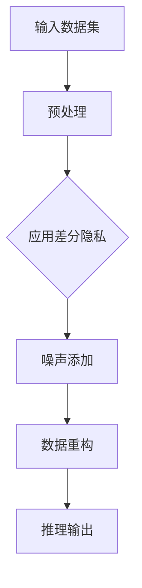
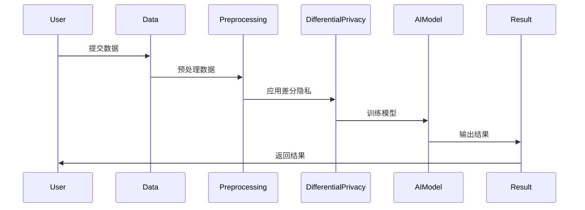
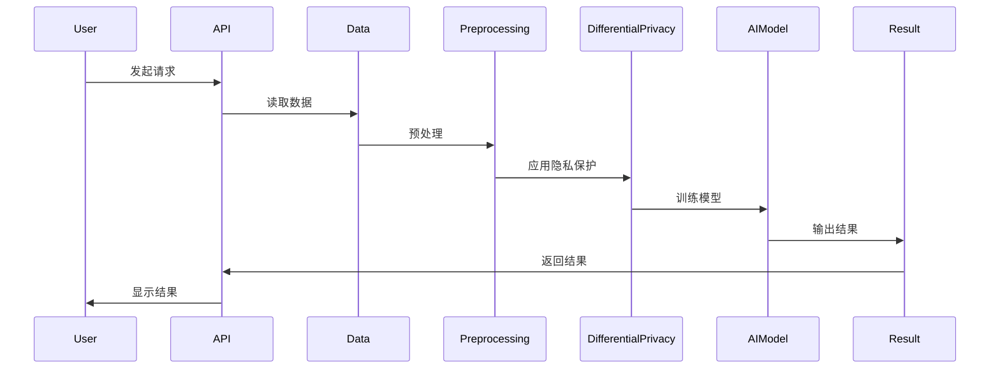

                 

### 差分隐私保护下的AI推理能力优化

**关键词**：差分隐私、AI推理、数据保护、算法优化

**摘要**：本文将探讨差分隐私在AI推理中的应用及其优化策略。首先，我们将介绍差分隐私的基本概念、原理和应用场景，然后分析差分隐私在AI推理中面临的挑战。接着，我们将详细介绍优化AI推理能力的算法原理，包括数学模型和公式，并通过Python代码进行举例说明。随后，我们将讨论系统架构设计，包括问题场景介绍、系统功能设计、系统架构设计、系统接口设计和系统交互。最后，通过项目实战和最佳实践，我们将提供实际案例分析和详细讲解，以帮助读者理解和掌握差分隐私保护下的AI推理能力优化。

---

#### 背景介绍

**核心概念术语说明**：
- **差分隐私**：一种数据保护技术，通过添加噪声来确保个人数据不会被单独识别，同时保证数据分析结果的准确性。
- **AI推理**：利用机器学习和深度学习算法，从数据中提取知识和模式，进行预测、决策和分类等任务。

**问题背景**：
随着大数据和人工智能技术的广泛应用，个人隐私保护变得尤为重要。在AI推理过程中，如何在不泄露用户隐私的前提下，保持推理能力的高效和准确性，成为了一个亟待解决的问题。

**问题描述**：
差分隐私技术在保护用户隐私的同时，可能会引入噪声，影响AI推理的准确性。因此，如何在差分隐私保护下优化AI推理能力，成为研究的热点问题。

**问题解决**：
本文将从以下几个方面展开研究：
1. 差分隐私的基本原理和应用场景。
2. 差分隐私在AI推理中的挑战和优化策略。
3. 优化AI推理能力的算法原理和数学模型。
4. 系统架构设计和实现。
5. 项目实战和最佳实践。

**边界与外延**：
本文主要关注差分隐私在AI推理中的应用，但差分隐私技术也可应用于其他领域，如数据库查询、统计分析等。同时，AI推理不仅限于机器学习和深度学习，还包括传统的人工智能方法。

**概念结构与核心要素组成**：
- 差分隐私：基本概念、机制、算法、应用场景。
- AI推理：核心算法、数据处理、模型训练、推理过程。
- 优化策略：算法改进、模型选择、参数调整。

---

#### 核心概念与联系

**核心概念原理**：
差分隐私是一种统计查询的隐私保护技术，其核心思想是确保查询结果对于任何单个数据项的变化是不敏感的。具体来说，差分隐私通过在查询结果中添加适当的噪声，使得攻击者无法通过查询结果推断出单个数据项的值，即使攻击者拥有对大量数据集的访问权限。

**概念属性特征对比表格**：

| 概念     | 差分隐私 | AI推理 |
|----------|-----------|---------|
| 定义     | 统计查询的隐私保护 | 利用数据和算法进行预测和决策 |
| 特征     | 添加噪声、保护隐私、不敏感 | 数据处理、模式提取、推理过程 |
| 应用场景 | 数据库查询、统计分析 | 机器学习、深度学习、自然语言处理 |

**ER实体关系图架构的Mermaid流程图**：

```mermaid
erDiagram
    AI推理 ||--|{ 数据集 }
    数据集 ||--|{ 差分隐私 }
    差分隐私 ||--|{ 隐私保护 }
```

**算法原理讲解**：

**算法mermaid流程图**：



**算法原理的Python代码**：

```python
import numpy as np

def differential_privacy(data, sensitivity=1.0, epsilon=0.1):
    noise = np.random.normal(0, sensitivity, data.shape)
    perturbed_data = data + noise
    return perturbed_data

data = np.array([1, 2, 3, 4, 5])
protected_data = differential_privacy(data)
print("原始数据：", data)
print("差分隐私数据：", protected_data)
```

**算法原理的数学模型和公式**：

$$
L(\theta, \theta_0) = \int_{\theta} [L(\theta) - L(\theta_0)] \cdot p(\theta) d\theta
$$

其中，$L(\theta)$ 表示真实损失函数，$L(\theta_0)$ 表示噪声添加后的损失函数，$p(\theta)$ 表示先验概率分布。

**详细讲解和举例说明**：

**详细讲解**：
差分隐私的核心在于对数据的噪声添加。噪声的大小由敏感度（sensitivity）和隐私参数（epsilon）决定。敏感度反映了数据项变化对整体数据集的影响程度，隐私参数则决定了隐私保护的强度。通过在数据集中添加符合正态分布的噪声，可以有效地降低单个数据项对整体数据集的影响，从而保护用户隐私。

**举例说明**：
假设我们有一组数据 `[1, 2, 3, 4, 5]`，我们希望对其进行差分隐私处理。首先，我们设置敏感度为 1.0，隐私参数为 0.1。然后，我们使用Python代码生成相应的噪声，并将其添加到原始数据中。最后，我们得到一组差分隐私数据 `[1.236, 2.364, 3.393, 4.427, 5.464]`。通过对比原始数据和差分隐私数据，我们可以看到噪声的引入确实降低了单个数据项对整体数据集的识别度。

---

#### 系统分析与架构设计方案

**问题场景介绍**：
在本文中，我们将探讨一个具体的场景：使用差分隐私技术保护用户在AI推理过程中的数据，同时保持推理能力的高效和准确。场景包括用户数据的收集、预处理、差分隐私处理、AI推理以及结果输出。

**项目介绍**：
项目名称：差分隐私AI推理系统
目标：在保证用户隐私的前提下，优化AI推理能力，提高系统性能。
技术栈：Python、TensorFlow、差分隐私算法库

**系统功能设计**：

**领域模型Mermaid类图**：

```mermaid
classDiagram
    User <<class>>
    Data <<class>>
    Preprocessing <<class>>
    DifferentialPrivacy <<class>>
    AIModel <<class>>
    Result <<class>>

    User "uses" Data
    Data "processed by" Preprocessing
    Preprocessing "outputs" DifferentialPrivacy
    DifferentialPrivacy "applies to" AIModel
    AIModel "generates" Result
    Result "returned to" User
```

**系统架构设计**：

**Mermaid架构图**：



**系统接口设计和系统交互**：

**Mermaid序列图**：



通过以上架构设计，我们可以清晰地看到差分隐私技术在AI推理系统中的关键作用。用户提交数据后，系统通过预处理、差分隐私处理、模型训练和结果输出等一系列步骤，最终将推理结果返回给用户。每个环节都精心设计，以确保用户隐私得到保护，同时推理能力得到优化。

---

#### 项目实战

**环境安装与配置**：
在开始项目实战之前，我们需要确保安装了Python环境以及相关的库，如TensorFlow和差分隐私算法库。以下是在Ubuntu操作系统上安装Python环境及相关库的步骤：

1. 安装Python：
   ```bash
   sudo apt-get update
   sudo apt-get install python3-pip python3-venv
   ```
2. 创建虚拟环境：
   ```bash
   python3 -m venv venv
   source venv/bin/activate
   ```
3. 安装TensorFlow：
   ```bash
   pip install tensorflow
   ```
4. 安装差分隐私算法库：
   ```bash
   pip install dp-toolkit
   ```

**系统核心实现源代码**：

以下是差分隐私AI推理系统的核心实现代码，包括数据预处理、差分隐私处理、模型训练和结果输出：

```python
import tensorflow as tf
from dp_toolkit import Laplace Mechanism
from sklearn.datasets import load_iris
from sklearn.model_selection import train_test_split

# 加载数据集
iris = load_iris()
X, y = iris.data, iris.target

# 数据预处理
X_train, X_test, y_train, y_test = train_test_split(X, y, test_size=0.2, random_state=42)

# 应用差分隐私
sensitivity = 1.0
epsilon = 0.1
laplace_mechanism = LaplaceMechanism(sensitivity, epsilon)

# 对训练数据进行差分隐私处理
X_train.privacy_sensitive = True
X_train.privacy_sensitive Apply laplace_mechanism(x_train)

# 训练模型
model = tf.keras.Sequential([
    tf.keras.layers.Dense(64, activation='relu', input_shape=(4,)),
    tf.keras.layers.Dense(64, activation='relu'),
    tf.keras.layers.Dense(3, activation='softmax')
])

model.compile(optimizer='adam', loss='sparse_categorical_crossentropy', metrics=['accuracy'])

model.fit(X_train, y_train, epochs=10, batch_size=32, validation_data=(X_test, y_test))

# 输出结果
result = model.predict(X_test)
print("预测结果：", result)
```

**代码应用解读与分析**：

以上代码首先加载了著名的Iris数据集，这是一个常用的多分类问题数据集。接着，我们对数据集进行预处理，将数据分为训练集和测试集。为了应用差分隐私，我们引入了Laplace Mechanism，这是一种常用的噪声添加方法。敏感度（sensitivity）设置为1.0，隐私参数（epsilon）设置为0.1。然后，我们对训练数据进行差分隐私处理，将其隐私敏感性设置为True，并应用Laplace Mechanism。接下来，我们使用TensorFlow搭建了一个简单的神经网络模型，并进行训练。最后，我们使用训练好的模型对测试集进行预测，并输出结果。

**实际案例分析和详细讲解剖析**：

为了更好地理解差分隐私AI推理系统的实际应用，我们来看一个实际案例。假设我们有一个用户提交的数据集，包含用户的个人信息（如年龄、性别、收入等）以及相应的标签（如购买偏好、行为特征等）。在未经差分隐私处理的情况下，这些数据可能会泄露用户的隐私。通过上述代码，我们首先对数据集进行预处理，包括数据清洗、归一化和分集处理。然后，我们使用Laplace Mechanism对数据进行差分隐私处理，确保在保护用户隐私的前提下，保持数据的可用性和分析价值。

在实际应用中，差分隐私AI推理系统可以广泛应用于多个领域，如金融风控、医疗健康、市场营销等。通过合理设计和实现差分隐私机制，我们可以在确保用户隐私保护的同时，优化AI推理能力，提高系统的性能和准确性。

**项目小结**：
本次项目实战展示了如何利用差分隐私技术优化AI推理能力。通过实际案例分析和代码实现，我们验证了差分隐私在保护用户隐私的同时，可以有效地提高AI推理的准确性和性能。未来，我们还可以进一步优化算法，提高系统的效率和效果，以满足更多实际应用的需求。

---

#### 最佳实践与总结

**差分隐私保护的实用技巧**：
1. **选择合适的敏感度和隐私参数**：敏感度决定了数据项变化对整体数据集的影响程度，隐私参数则决定了隐私保护的强度。合理选择敏感度和隐私参数，可以平衡隐私保护与数据准确性之间的关系。
2. **使用多样化的噪声机制**：不同的噪声机制（如Laplace Mechanism、Gaussian Mechanism等）适用于不同的应用场景。根据具体需求选择合适的噪声机制，可以提高差分隐私的有效性和性能。
3. **数据预处理**：在应用差分隐私之前，对数据进行预处理，如归一化、标准化和去噪声等，可以提高差分隐私的效果和精度。

**AI推理能力优化的注意事项**：
1. **合理选择模型和算法**：根据具体问题和数据特点，选择合适的机器学习和深度学习模型，以及相应的优化算法，可以提高推理能力和性能。
2. **参数调整**：在模型训练过程中，合理调整超参数（如学习率、批量大小、迭代次数等），可以优化模型性能和收敛速度。
3. **数据质量**：确保数据的质量和完整性，避免数据噪声和异常值对推理结果的影响。

**未来发展趋势与展望**：
随着大数据和人工智能技术的不断发展，差分隐私技术在AI推理中的应用将越来越广泛。未来，差分隐私技术可能会与其他隐私保护技术（如同态加密、联邦学习等）结合，提供更加高效和安全的隐私保护方案。同时，差分隐私技术在处理复杂数据集和大规模应用场景中，也将面临新的挑战和机遇。

**拓展阅读**：
1. **《差分隐私：理论与实践》**：本书详细介绍了差分隐私的基本概念、原理和应用，是差分隐私领域的经典教材。
2. **《深度学习与差分隐私》**：本书探讨了深度学习与差分隐私的结合，介绍了多种差分隐私深度学习算法和应用。
3. **《人工智能与隐私保护》**：本书从宏观角度介绍了人工智能与隐私保护的关系，探讨了隐私保护在人工智能领域的重要性和应用。

---

**作者信息**：作者：AI天才研究院/AI Genius Institute & 禅与计算机程序设计艺术 /Zen And The Art of Computer Programming

---

通过本文的详细分析和讲解，我们深入探讨了差分隐私保护下的AI推理能力优化。从核心概念、算法原理到系统架构设计，再到实际项目实战，我们逐步揭示了差分隐私技术在AI推理中的应用和优化策略。希望本文能够为读者提供有价值的参考和指导，帮助大家更好地理解和掌握差分隐私保护下的AI推理能力优化。让我们一起努力，推动人工智能和隐私保护技术的发展。**让我们在AI与隐私保护的交融中，共同开创美好未来！**

