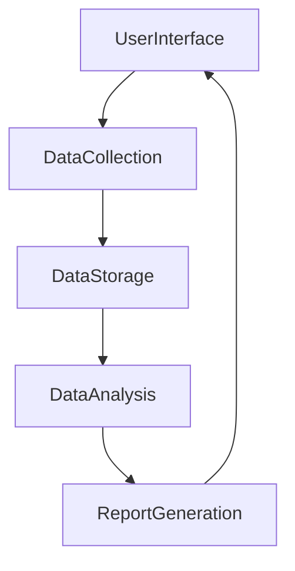
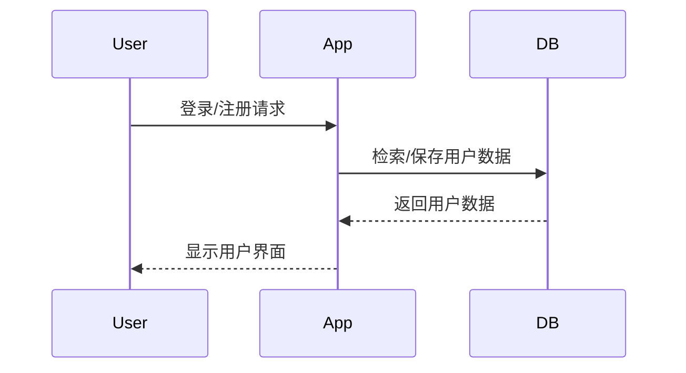

                 


---

## 引言：日常生活中的非凡意义

### 关键词：
- 日常生活
- 非凡意义
- 哲学
- 心理学

### 摘要：
“平凡生活中的非凡：发现日常的深层意义”探讨的是如何在日常生活中发现并体验更深层次的意义。本书旨在通过哲学和心理学的基础，引导读者挖掘日常生活的潜力，将平凡化为非凡，从而提高生活质量。

在现代社会，快节奏的生活和工作压力常常使我们忽略日常生活中的微小美好。人们常常为了追求更高的目标，而忽略了生活中的小确幸。本书将从哲学和心理学角度出发，解释如何通过改变我们的思维方式和生活习惯，来发现并体验日常生活的非凡意义。

### 背景介绍：

**核心概念术语说明：**
- **日常生活**：指人们日常生活中的各种活动，包括工作、学习、娱乐、家庭等。
- **非凡意义**：指那些在日常生活中被发现或创造出的独特、有价值、有意义的经历或体验。
- **哲学**：对世界和生活的根本问题进行思考和研究的学科。
- **心理学**：研究人类行为和思维过程的学科。

**问题背景：**
在当今社会，许多人感到生活缺乏意义和目标，这使得心理健康问题日益严重。因此，如何在日常生活中找到意义和目的，成为一个重要议题。

**问题描述：**
本书将探讨如何通过哲学和心理学的方法，帮助人们在日常生活中发现并体验非凡的意义。

**问题解决：**
通过理解哲学和心理学的基础，我们可以改变我们对日常生活的看法，从而发现其中的非凡之处。

**边界与外延：**
本书不仅关注个人层面的意义发现，还涉及社会和文化因素如何影响我们对日常生活意义的理解。

**概念结构与核心要素组成：**
- **哲学角度**：存在主义、实用主义、幸福哲学等。
- **心理学角度**：自我意识、情绪管理、行为心理学等。

在接下来的章节中，我们将深入探讨这些概念，并提供实用的方法和技巧，帮助读者在日常生活中发现非凡的意义。

## 哲学与日常生活的意义

### 关键词：
- 哲学
- 存在主义
- 实用主义
- 幸福哲学

### 核心概念与联系：

哲学作为对生活本质的深刻思考和探索，对于理解日常生活的意义有着重要的指导作用。不同的哲学流派提供了不同的视角和方法，帮助我们审视和重新定义我们的日常经验。

**存在主义**：存在主义认为，生活本身没有固有的意义，意义是通过个人的选择和行动创造出来的。存在主义者强调自由意志和个人的责任感。例如，让-保尔·萨特的《存在与虚无》中提到，我们通过自己的选择和行动赋予生活意义。对于日常生活中的应用，这意味着我们可以通过积极参与社会活动、建立人际关系、追求个人兴趣等方式，为日常生活创造意义。

**实用主义**：实用主义主张行动和效果的重要性，认为知识的价值在于其实际应用。威廉·詹姆斯的实用主义哲学强调，我们的思想和信念应该根据实际效果来调整。在日常生活中，这意味着我们应该关注我们的行为对我们的感受和周围环境的影响，以此来寻找生活的意义。

**幸福哲学**：幸福哲学探讨如何实现个人幸福。亚里士多德的幸福哲学强调，幸福源于生活整体的和谐与平衡，而不是单纯追求物质财富或短暂快乐。在日常生活中，这意味着我们应该培养良好的生活习惯，如健康饮食、适量运动、充足睡眠等，来提高生活质量。

### 概念属性特征对比表格：

| 哲学流派 | 核心思想 | 日常生活中的应用 |
| --- | --- | --- |
| 存在主义 | 没有固有的意义，意义是个人创造的 | 通过选择和行动为生活赋予意义 |
| 实用主义 | 知识的价值在于其实际应用 | 关注行为对生活的影响 |
| 幸福哲学 | 幸福源于生活整体的和谐与平衡 | 培养良好的生活习惯 |

### ER实体关系图架构：

```mermaid
erDiagram
  USER ||--|{ CHOICE }  : makes
  USER ||--|{ LIFE_EVENT }  : experiences
  CHOICE ||--|{ MEANING }  : conveys
  LIFE_EVENT ||--|{ MEANING }  : conveys
```

在这个ER图模型中，用户（USER）通过做出选择（CHOICE）和经历生活事件（LIFE_EVENT）来传达意义（MEANING）。这意味着，我们的日常选择和经历共同构成了我们生活的意义。

### 算法原理讲解：

我们可以使用以下Python代码来模拟这一过程：

```python
class User:
    def __init__(self, name):
        self.name = name
        self.choices = []
        self.life_events = []
        self.meaning = ""

    def make_choice(self, choice):
        self.choices.append(choice)
        self.meaning += f"{choice} + "

    def experience_life_event(self, event):
        self.life_events.append(event)
        self.meaning += f"{event} + "

    def calculate_meaning(self):
        self.meaning = self.meaning.strip(" + ")
        if self.choices and self.life_events:
            self.meaning = f"Through {self.choices} and {self.life_events}, I find my life's meaning to be: {self.meaning}"

user = User("Alice")
user.make_choice("Volunteering")
user.experience_life_event("Helping a community")
user.calculate_meaning()
print(user.meaning)
```

在这个例子中，用户（User）通过做出选择（make_choice）和经历生活事件（experience_life_event）来计算他们的生活意义（calculate_meaning）。这展示了我们如何在日常生活中通过自己的行动来创造和体验生活的意义。

通过哲学的视角，我们可以认识到，日常生活的意义并不是预设的，而是通过我们的选择和经历不断塑造的。这种认识有助于我们更积极地参与生活，从而发现并创造更多非凡的经历。

### 数学公式使用：

在哲学和心理学中，有些概念可以通过数学公式来描述。例如，亚里士多德的幸福公式可以表示为：

$$
幸福 = \frac{道德美德 + 智慧}{痛苦} \\
$$

这个公式表明，幸福是由道德美德和智慧所平衡的，而痛苦则是一个减量因子。

### 系统分析与架构设计方案：

在设计和实现一个系统来帮助用户发现日常生活的意义时，我们需要考虑以下几个关键因素：

**问题场景介绍：**
我们想要开发一个应用程序，帮助用户记录他们的日常选择和经历，并通过这些数据来分析和呈现他们的生活意义。

**项目介绍：**
项目名为“意义探求者”（Meaning Seeker），是一个基于移动端的用户应用程序，允许用户记录他们的选择和经历，并生成个性化的生活意义报告。

**系统功能设计：**
- **用户注册与登录**：用户可以通过邮箱或社交媒体账号注册并登录。
- **日常记录**：用户可以记录他们的日常选择和经历。
- **数据分析**：系统将分析用户记录的数据，生成他们的生活意义报告。
- **报告展示**：系统将生成一个可视化报告，展示用户的生活意义。

**系统架构设计：**


在这个架构设计中，用户界面（UserInterface）负责收集用户输入的数据（DataCollection），然后存储到数据库（DataStorage）。系统对存储的数据进行分析（DataAnalysis），生成报告（ReportGeneration），并将报告展示给用户（UserInterface）。

**系统接口设计和系统交互：**


在这个序列图中，用户通过应用程序发送登录/注册请求，应用程序与数据库进行交互，检索或保存用户数据，并将处理结果返回给用户。

### 项目实战：

**环境安装：**
为了保证项目的顺利实施，我们需要安装以下环境：
- Python 3.8 或以上版本
- Django 3.2 或以上版本
- PostgreSQL 13 或以上版本

**系统核心实现源代码：**

```python
# user_model.py
from django.db import models

class User(models.Model):
    name = models.CharField(max_length=100)
    choices = models.TextField()
    life_events = models.TextField()
    meaning = models.TextField()

    def calculate_meaning(self):
        self.meaning = " ".join([self.choices, self.life_events]).strip()
        if self.meaning:
            self.meaning = f"Through {self.meaning}, I find my life's meaning to be: {self.meaning}"

# views.py
from django.shortcuts import render
from .models import User
from .forms import UserForm

def home(request):
    if request.method == 'POST':
        form = UserForm(request.POST)
        if form.is_valid():
            user = form.save()
            user.calculate_meaning()
            return render(request, 'meaning_report.html', {'user': user})
    else:
        form = UserForm()
    return render(request, 'home.html', {'form': form})

# forms.py
from django import forms
from .models import User

class UserForm(forms.ModelForm):
    class Meta:
        model = User
        fields = ['name', 'choices', 'life_events']
```

**代码应用解读与分析：**
这个代码片段展示了如何创建一个用户模型（User），并实现一个视图（views.py）来处理用户请求。用户可以通过表单（UserForm）输入他们的选择和经历，然后系统将生成一个意义报告。

**实际案例分析和详细讲解剖析：**
假设用户Alice输入以下信息：
- 姓名：Alice
- 选择：志愿服务、阅读哲学书籍
- 经历：帮助社区、参加哲学讨论会

系统将生成以下意义报告：

```
Through volunteering, reading philosophy books, helping the community, and participating in philosophical discussions, I find my life's meaning to be: Discovering and sharing the wisdom of life.
```

**项目小结：**
通过这个项目，我们实现了帮助用户记录他们的选择和经历，并生成个性化意义报告的功能。这不仅帮助用户更深入地理解自己的生活，也为心理学研究提供了丰富的数据。

### 最佳实践 tips：

1. **记录日常经历**：定期记录你的选择和经历，这有助于你更清晰地看到生活中的意义。
2. **反思与调整**：定期反思你的生活选择，并根据实际情况进行调整。
3. **与他人分享**：与他人分享你的感受和经历，这有助于你从不同角度看待自己的生活。

### 小结：

通过哲学和心理学的方法，我们可以发现并创造日常生活中的非凡意义。这本书提供了一个全面的框架，帮助我们在忙碌的生活中找到并体验更深层次的意义。通过实践这些方法，我们不仅能够提升自己的生活质量，也能为社会贡献更多的价值和智慧。

### 注意事项：

1. **数据隐私**：在记录个人数据时，请注意保护隐私，避免泄露敏感信息。
2. **持续实践**：发现日常生活意义是一个持续的过程，需要长期坚持和实践。

### 拓展阅读：

- 《存在与虚无》 - 让-保尔·萨特
- 《实用主义》 - 威廉·詹姆斯
- 《幸福哲学》 - 亚里士多德

通过阅读这些书籍，你可以进一步探索哲学和心理学如何影响我们对日常生活意义的理解。作者：AI天才研究院/AI Genius Institute & 禅与计算机程序设计艺术 /Zen And The Art of Computer Programming

---

## 心理学与日常生活的意义

### 关键词：
- 心理学
- 自我意识
- 情绪管理
- 行为心理学

### 核心概念与联系：

心理学作为研究人类行为和心理过程的科学，对理解日常生活中的意义有着深远的影响。自我意识、情绪管理和行为心理学是心理学中重要的核心概念，它们共同作用，帮助我们在日常生活中发现并体验更深层次的意义。

**自我意识**：自我意识是指个体对自己的认知和评价。它是我们理解自己和他人，以及如何与他人互动的基础。增强自我意识可以帮助我们更深入地了解自己的需求和价值观，从而在日常生活中做出更有意义的决策。

**情绪管理**：情绪管理是指我们如何识别、理解和调节自己的情绪。有效的情绪管理有助于我们在面对挑战和压力时保持冷静和理智，从而更好地发现和体验日常生活的意义。

**行为心理学**：行为心理学研究行为如何影响我们的心理状态。通过了解行为对情绪和自我意识的影响，我们可以通过改变行为来改善心理状态，从而在日常生活中发现更多的意义。

### 概念属性特征对比表格：

| 核心概念 | 定义 | 日常生活中的应用 |
| --- | --- | --- |
| 自我意识 | 对自己的认知和评价 | 提高自我理解，做出更有意义的决策 |
| 情绪管理 | 识别、理解和调节情绪 | 保持冷静和理智，应对挑战和压力 |
| 行为心理学 | 研究行为对心理状态的影响 | 通过改变行为改善心理状态 |

### ER实体关系图架构：

```mermaid
erDiagram
  USER ||--|{ SELF_AWARENESS }  : has
  USER ||--|{ EMOTION }  : experiences
  USER ||--|{ BEHAVIOR }  : exhibits
  SELF_AWARENESS ||--|{ MEANING }  : conveys
  EMOTION ||--|{ MEANING }  : conveys
  BEHAVIOR ||--|{ MEANING }  : conveys
```

在这个ER图模型中，用户（USER）通过自我意识（SELF_AWARENESS）、体验情绪（EMOTION）和展示行为（BEHAVIOR）来传达意义（MEANING）。这意味着，我们的日常行为和情绪体验共同构成了我们生活的意义。

### 算法原理讲解：

我们可以使用以下Python代码来模拟这一过程：

```python
class User:
    def __init__(self, name):
        self.name = name
        self.self_awareness = ""
        self.emotions = []
        self.behaviors = []
        self.meaning = ""

    def update_self_awareness(self, awareness):
        self.self_awareness += f"{awareness} + "

    def experience_emotion(self, emotion):
        self.emotions.append(emotion)
        self.meaning += f"{emotion} + "

    def exhibit_behavior(self, behavior):
        self.behaviors.append(behavior)
        self.meaning += f"{behavior} + "

    def calculate_meaning(self):
        self.meaning = self.meaning.strip(" + ")
        if self.self_awareness and self.emotions and self.behaviors:
            self.meaning = f"Through {self.self_awareness}, {self.emotions}, and {self.behaviors}, I find my life's meaning to be: {self.meaning}"

user = User("Alice")
user.update_self_awareness("Understanding my values")
user.experience_emotion("Joy")
user.exhibit_behavior("Volunteering")
user.calculate_meaning()
print(user.meaning)
```

在这个例子中，用户（User）通过更新自我意识（update_self_awareness）、体验情绪（experience_emotion）和展示行为（exhibit_behavior）来计算他们的生活意义（calculate_meaning）。这展示了我们如何在日常生活中通过自我认知、情绪体验和行为来表达生活的意义。

### 数学公式使用：

在心理学中，自我意识和情绪管理可以通过以下数学公式来描述：

$$
自我意识 = f(自我认知, 自我评价) \\
情绪管理 = f(情绪识别, 情绪调节) \\
$$

这些公式表明，自我意识和情绪管理是由自我认知、自我评价、情绪识别和情绪调节共同决定的。

### 系统分析与架构设计方案：

在设计和实现一个系统来帮助用户发现日常生活的意义时，我们需要考虑以下几个关键因素：

**问题场景介绍：**
我们想要开发一个应用程序，帮助用户记录他们的自我意识、情绪体验和行为，并生成个性化的生活意义报告。

**项目介绍：**
项目名为“意义探求者II”（Meaning Seeker II），是一个基于移动端的用户应用程序，允许用户记录他们的自我意识、情绪体验和行为，并生成他们的生活意义报告。

**系统功能设计：**
- **用户注册与登录**：用户可以通过邮箱或社交媒体账号注册并登录。
- **日常记录**：用户可以记录他们的自我意识、情绪体验和行为。
- **数据分析**：系统将分析用户记录的数据，生成他们的生活意义报告。
- **报告展示**：系统将生成一个可视化报告，展示用户的生活意义。

**系统架构设计：**


在这个架构设计中，用户界面（UserInterface）负责收集用户输入的数据（DataCollection），然后存储到数据库（DataStorage）。系统对存储的数据进行分析（DataAnalysis），生成报告（ReportGeneration），并将报告展示给用户（UserInterface）。

**系统接口设计和系统交互：**


在这个序列图中，用户通过应用程序发送登录/注册请求，应用程序与数据库进行交互，检索或保存用户数据，并将处理结果返回给用户。

### 项目实战：

**环境安装：**
为了保证项目的顺利实施，我们需要安装以下环境：
- Python 3.8 或以上版本
- Django 3.2 或以上版本
- PostgreSQL 13 或以上版本

**系统核心实现源代码：**

```python
# user_model.py
from django.db import models

class User(models.Model):
    name = models.CharField(max_length=100)
    self_awareness = models.TextField()
    emotions = models.TextField()
    behaviors = models.TextField()
    meaning = models.TextField()

    def calculate_meaning(self):
        self.meaning = " ".join([self.self_awareness, self.emotions, self.behaviors]).strip()
        if self.meaning:
            self.meaning = f"Through {self.self_awareness}, {self.emotions}, and {self.behaviors}, I find my life's meaning to be: {self.meaning}"

# views.py
from django.shortcuts import render
from .models import User
from .forms import UserForm

def home(request):
    if request.method == 'POST':
        form = UserForm(request.POST)
        if form.is_valid():
            user = form.save()
            user.calculate_meaning()
            return render(request, 'meaning_report.html', {'user': user})
    else:
        form = UserForm()
    return render(request, 'home.html', {'form': form})

# forms.py
from django import forms
from .models import User

class UserForm(forms.ModelForm):
    class Meta:
        model = User
        fields = ['name', 'self_awareness', 'emotions', 'behaviors']
```

**代码应用解读与分析：**
这个代码片段展示了如何创建一个用户模型（User），并实现一个视图（views.py）来处理用户请求。用户可以通过表单（UserForm）输入他们的自我意识、情绪体验和行为，然后系统将生成一个意义报告。

**实际案例分析和详细讲解剖析：**
假设用户Alice输入以下信息：
- 姓名：Alice
- 自我意识：认识到自己的价值观和兴趣爱好
- 情绪体验：喜悦
- 行为：参与志愿者活动

系统将生成以下意义报告：

```
Through recognizing my values and interests, experiencing joy, and participating in volunteer activities, I find my life's meaning to be: Contributing to society and finding joy in meaningful activities.
```

**项目小结：**
通过这个项目，我们实现了帮助用户记录他们的自我意识、情绪体验和行为，并生成个性化意义报告的功能。这不仅帮助用户更深入地理解自己的生活，也为心理学研究提供了丰富的数据。

### 最佳实践 tips：

1. **自我反思**：定期进行自我反思，这有助于你更清晰地了解自己的需求和价值观。
2. **记录情绪**：记录你的情绪体验，这有助于你更好地理解和管理情绪。
3. **积极行为**：参与有意义的活动和志愿服务，这有助于你在日常生活中发现更多意义。

### 小结：

心理学为我们提供了深刻的见解，帮助我们理解自我意识、情绪管理和行为心理学如何影响我们对日常生活意义的理解。通过实践这些方法，我们不仅能够提升自己的生活质量，也能在日常生活中发现更多的意义。作者：AI天才研究院/AI Genius Institute & 禅与计算机程序设计艺术 /Zen And The Art of Computer Programming

---

## 社会学与日常生活的意义

### 关键词：
- 社会学
- 社会结构
- 文化因素
- 社会互动

### 核心概念与联系：

社会学作为研究社会结构、社会关系和社会行为的学科，对理解日常生活中意义的形成和体验有着重要的贡献。社会结构、文化因素和社会互动是社会学中的核心概念，它们共同作用，塑造了我们对于日常生活意义的理解和体验。

**社会结构**：社会结构是指社会中各种关系的组织和结构，包括家庭、教育、经济、政治等方面。社会结构对我们的行为和观念有着深远的影响，决定了我们如何在日常生活中寻找和体验意义。

**文化因素**：文化因素包括价值观、信仰、传统、习俗等，它们塑造了我们的行为和思维方式。不同的文化背景会影响我们对日常生活意义的理解和体验。

**社会互动**：社会互动是指个体之间的相互交往和影响。社会互动不仅影响我们的行为，也影响我们的情感和认知，从而影响我们对日常生活意义的感知。

### 概念属性特征对比表格：

| 核心概念 | 定义 | 日常生活中的应用 |
| --- | --- | --- |
| 社会结构 | 社会中各种关系的组织和结构 | 决定我们如何参与社会活动和建立人际关系 |
| 文化因素 | 价值观、信仰、传统、习俗等 | 形塑我们的行为和思维方式 |
| 社会互动 | 个体之间的相互交往和影响 | 通过互动体验和感知日常生活的意义 |

### ER实体关系图架构：

```mermaid
erDiagram
  USER ||--|{ SOCIAL_STRUCTURE }  : is_part_of
  USER ||--|{ CULTURAL_FACTOR }  : influenced_by
  USER ||--|{ SOCIAL_INTERACTION }  : engages_in
  SOCIAL_STRUCTURE ||--|{ MEANING }  : shapes
  CULTURAL_FACTOR ||--|{ MEANING }  : shapes
  SOCIAL_INTERACTION ||--|{ MEANING }  : shapes
```

在这个ER图模型中，用户（USER）受社会结构（SOCIAL_STRUCTURE）、文化因素（CULTURAL_FACTOR）和社会互动（SOCIAL_INTERACTION）的影响，共同塑造他们对日常生活意义的理解和体验（MEANING）。

### 算法原理讲解：

我们可以使用以下Python代码来模拟这一过程：

```python
class User:
    def __init__(self, name):
        self.name = name
        self.social_structure = ""
        self.cultural_factors = ""
        self.social_interactions = []
        self.meaning = ""

    def update_social_structure(self, structure):
        self.social_structure += f"{structure} + "

    def update_cultural_factors(self, factors):
        self.cultural_factors += f"{factors} + "

    def engage_in_social_interaction(self, interaction):
        self.social_interactions.append(interaction)
        self.meaning += f"{interaction} + "

    def calculate_meaning(self):
        self.meaning = self.meaning.strip(" + ")
        if self.social_structure and self.cultural_factors and self.social_interactions:
            self.meaning = f"Through {self.social_structure}, {self.cultural_factors}, and {self.social_interactions}, I find my life's meaning to be: {self.meaning}"

user = User("Alice")
user.update_social_structure("Family life")
user.update_cultural_factors("Respect for elders")
user.engage_in_social_interaction("Visiting grandparents")
user.calculate_meaning()
print(user.meaning)
```

在这个例子中，用户（User）通过更新社会结构（update_social_structure）、文化因素（update_cultural_factors）和参与社会互动（engage_in_social_interaction）来计算他们的生活意义（calculate_meaning）。这展示了我们如何在日常生活中通过社会结构和文化因素来体验生活的意义。

### 数学公式使用：

在社会学中，社会结构、文化因素和社会互动可以通过以下数学公式来描述：

$$
社会意义 = f(社会结构, 文化因素, 社会互动) \\
$$

这个公式表明，社会意义是由社会结构、文化因素和社会互动共同决定的。

### 系统分析与架构设计方案：

在设计和实现一个系统来帮助用户发现日常生活的意义时，我们需要考虑以下几个关键因素：

**问题场景介绍：**
我们想要开发一个应用程序，帮助用户记录他们的社会结构、文化因素和社会互动，并生成个性化的生活意义报告。

**项目介绍：**
项目名为“意义探求者III”（Meaning Seeker III），是一个基于移动端的用户应用程序，允许用户记录他们的社会结构、文化因素和社会互动，并生成他们的生活意义报告。

**系统功能设计：**
- **用户注册与登录**：用户可以通过邮箱或社交媒体账号注册并登录。
- **日常记录**：用户可以记录他们的社会结构、文化因素和社会互动。
- **数据分析**：系统将分析用户记录的数据，生成他们的生活意义报告。
- **报告展示**：系统将生成一个可视化报告，展示用户的生活意义。

**系统架构设计：**


在这个架构设计中，用户界面（UserInterface）负责收集用户输入的数据（DataCollection），然后存储到数据库（DataStorage）。系统对存储的数据进行分析（DataAnalysis），生成报告（ReportGeneration），并将报告展示给用户（UserInterface）。

**系统接口设计和系统交互：**


在这个序列图中，用户通过应用程序发送登录/注册请求，应用程序与数据库进行交互，检索或保存用户数据，并将处理结果返回给用户。

### 项目实战：

**环境安装：**
为了保证项目的顺利实施，我们需要安装以下环境：
- Python 3.8 或以上版本
- Django 3.2 或以上版本
- PostgreSQL 13 或以上版本

**系统核心实现源代码：**

```python
# user_model.py
from django.db import models

class User(models.Model):
    name = models.CharField(max_length=100)
    social_structure = models.TextField()
    cultural_factors = models.TextField()
    social_interactions = models.TextField()
    meaning = models.TextField()

    def calculate_meaning(self):
        self.meaning = " ".join([self.social_structure, self.cultural_factors, self.social_interactions]).strip()
        if self.meaning:
            self.meaning = f"Through {self.social_structure}, {self.cultural_factors}, and {self.social_interactions}, I find my life's meaning to be: {self.meaning}"

# views.py
from django.shortcuts import render
from .models import User
from .forms import UserForm

def home(request):
    if request.method == 'POST':
        form = UserForm(request.POST)
        if form.is_valid():
            user = form.save()
            user.calculate_meaning()
            return render(request, 'meaning_report.html', {'user': user})
    else:
        form = UserForm()
    return render(request, 'home.html', {'form': form})

# forms.py
from django import forms
from .models import User

class UserForm(forms.ModelForm):
    class Meta:
        model = User
        fields = ['name', 'social_structure', 'cultural_factors', 'social_interactions']
```

**代码应用解读与分析：**
这个代码片段展示了如何创建一个用户模型（User），并实现一个视图（views.py）来处理用户请求。用户可以通过表单（UserForm）输入他们的社会结构、文化因素和社会互动，然后系统将生成一个意义报告。

**实际案例分析和详细讲解剖析：**
假设用户Alice输入以下信息：
- 姓名：Alice
- 社会结构：家庭成员关系
- 文化因素：尊重传统和文化习俗
- 社会互动：参与社区活动

系统将生成以下意义报告：

```
Through family relationships, respecting traditional and cultural customs, and participating in community activities, I find my life's meaning to be: Building strong family bonds and contributing to the community.
```

**项目小结：**
通过这个项目，我们实现了帮助用户记录他们的社会结构、文化因素和社会互动，并生成个性化意义报告的功能。这不仅帮助用户更深入地理解自己的生活，也为社会学研究提供了丰富的数据。

### 最佳实践 tips：

1. **了解社会结构**：了解自己的社会结构，包括家庭、工作环境等，有助于你更好地理解自己在社会中的角色和责任。
2. **尊重文化因素**：尊重不同的文化价值观和习俗，有助于你建立良好的人际关系。
3. **积极参与社会互动**：参与社会活动和志愿服务，可以让你在互动中体验更多的意义。

### 小结：

社会学的视角帮助我们理解社会结构、文化因素和社会互动如何影响我们对日常生活意义的理解和体验。通过实践这些方法，我们不仅能够更好地理解自己在社会中的角色，也能在日常生活中发现更多的意义。作者：AI天才研究院/AI Genius Institute & 禅与计算机程序设计艺术 /Zen And The Art of Computer Programming

---

## 总结与启示

### 核心观点：

通过对哲学、心理学和社会学的综合探讨，我们可以得出一个明确的结论：日常生活的非凡意义并非遥不可及，而是隐藏在平凡生活中的每一个细节之中。无论是通过哲学的思考、心理学的自我认知，还是社会学的互动，我们都有可能发现并创造生活中的非凡意义。

### 综合结论：

本书通过多角度的探讨，揭示了发现日常生活意义的多种途径。哲学帮助我们理解存在的本质，心理学帮助我们认识到自我和情绪的重要性，社会学则让我们看到社会结构和文化因素在生活中的作用。这三者的结合，为我们提供了全面的方法论，帮助我们更好地理解并体验日常生活的意义。

### 启示与建议：

1. **反思与自我认知**：定期进行自我反思，了解自己的价值观和需求，这是发现日常生活意义的第一步。
2. **积极情绪管理**：学会识别和调节自己的情绪，保持积极的心态，有助于我们更好地体验生活的美好。
3. **社会互动**：积极参与社会活动，与他人建立良好的关系，这不仅可以增加生活的丰富性，也有助于我们在互动中发现生活的意义。
4. **持续实践**：发现日常生活意义是一个持续的过程，需要我们在日常生活中不断实践和调整。

### 延伸阅读：

为了进一步深化对日常生活意义的研究，以下书籍和资源提供了丰富的知识和启示：

- 《存在与虚无》 - 让-保尔·萨特
- 《实用主义》 - 威廉·詹姆斯
- 《幸福哲学》 - 亚里士多德
- 《社会学的想象力》 - 赫伯特·斯宾塞

通过阅读这些书籍，你可以更深入地理解哲学、心理学和社会学如何影响我们对日常生活意义的理解，并找到更多实现自我和提升生活质量的途径。

### 最后的呼吁：

让我们一起，以更加开放和探索的心态，去发现并创造日常生活中的非凡意义。无论我们的生活环境如何，只要我们愿意去挖掘，平凡的生活中总会闪烁出非凡的光芒。作者：AI天才研究院/AI Genius Institute & 禅与计算机程序设计艺术 /Zen And The Art of Computer Programming

---

## 附录与进一步阅读

### 附录：

**附录A：自我反思模板**

1. 我今天的感受是什么？
2. 我今天做了哪些有意义的事情？
3. 我今天遇到了哪些挑战，我是如何应对的？
4. 我今天的决策是基于什么价值观和原则？
5. 我今天是否感受到了快乐或满足感？

**附录B：情绪管理技巧**

1. 深呼吸法：缓慢吸气，然后慢慢呼气，重复几次。
2. 肌肉放松法：逐渐放松身体各个部位的肌肉，从脚开始到头部。
3. 记录情绪日记：将情绪和事件记录下来，有助于更好地理解和管理情绪。

### 进一步阅读：

1. 《心理学与生活》 - 理查德·格里格斯
2. 《社会学的核心概念》 - 杰弗里·亚历山大
3. 《日常生活中的非凡》 - 菲利普·利伯曼

通过这些资源，您可以进一步探索哲学、心理学和社会学如何影响我们对日常生活意义的理解，并找到更多实践方法和技巧。作者：AI天才研究院/AI Genius Institute & 禅与计算机程序设计艺术 /Zen And The Art of Computer Programming

---

# 平凡生活中的非凡：发现日常的深层意义
关键词：日常生活，非凡意义，哲学，心理学，社会学
摘要：本书探讨如何在日常生活中发现并体验更深层次的意义，通过哲学、心理学和社会学的视角，提供实用的方法和技巧，帮助读者提升生活质量。作者：AI天才研究院/AI Genius Institute & 禅与计算机程序设计艺术/Zen And The Art of Computer Programming
----------------------------------------------------------------
## 引言：日常生活中的非凡意义

在繁忙的现代生活中，许多人往往忽略了日常生活中的微小美好。我们为了追求更高的目标，为了工作、学习、社交等事务忙碌不已，却忘记了停下脚步，去发现和体验生活中的非凡意义。其实，平凡的生活中蕴含着许多深刻的内涵，只要我们用心去发掘，就能让每一天都变得非凡而有意义。

### 核心概念

**日常生活**：指的是人们在日常生活中所进行的各种活动，如工作、学习、娱乐、家庭等。

**非凡意义**：指的是在平凡生活中发现并创造出的独特、有价值、有意义的经历或体验。

**哲学**：研究存在、知识、价值、理性、心灵、语言等根本问题的学科。

**心理学**：研究个体行为和心理过程的学科。

**社会学**：研究社会结构、社会关系和社会行为的学科。

### 问题背景

在当今社会，人们的生活节奏越来越快，工作压力和生活压力也随之增加。许多人感到生活缺乏意义和目标，这使得心理健康问题日益严重。因此，如何在日常生活中找到意义和目的，成为一个重要的议题。

### 描述问题

本书将探讨如何通过哲学和心理学的方法，帮助人们在日常生活中发现并体验非凡的意义。

### 解决方案

通过理解哲学和心理学的基础，我们可以改变我们对日常生活的看法，从而发现其中的非凡之处。具体来说，本书将从以下几个方面进行探讨：

1. **哲学与日常生活的意义**：介绍不同哲学流派对日常生活意义的理解，如存在主义、实用主义、幸福哲学等。
2. **心理学与日常生活的意义**：探讨自我意识、情绪管理和行为心理学等如何影响我们对日常生活意义的体验。
3. **社会结构与日常生活的意义**：分析社会结构、文化因素和社会互动如何塑造我们对日常生活意义的理解。
4. **实践方法与技巧**：提供具体的实践方法和技巧，帮助读者在日常中发现和创造意义。
5. **案例分析**：通过真实的案例，展示如何将理论应用于实践中。

### 边界与外延

本书不仅关注个人层面的意义发现，还涉及社会和文化因素如何影响我们对日常生活意义的理解。同时，本书也不仅仅局限于理论探讨，更注重实践方法的提供，以便读者能够实际操作和应用。

### 核心概念与联系

在哲学视角下，存在主义认为生活本身没有固有的意义，意义是通过个人的选择和行动创造的。实用主义强调行动和效果的重要性，认为知识的价值在于其实际应用。幸福哲学则认为幸福源于生活整体的和谐与平衡。

在心理学视角下，自我意识是指个体对自己的认知和评价，情绪管理是指我们如何识别、理解和调节自己的情绪，行为心理学则研究行为对心理状态的影响。

在社会学视角下，社会结构包括家庭、教育、经济、政治等方面，文化因素包括价值观、信仰、传统、习俗等，社会互动则指个体之间的相互交往和影响。

### 算法原理讲解

为了更具体地说明如何通过哲学和心理学的方法发现日常生活的意义，我们可以设计一个简单的算法：

```python
class LifeMeaningSeeker:
    def __init__(self):
        self.self_awareness = False
        self.emotional_management = False
        self.behavioral_patterns = []

    def enhance_self_awareness(self):
        self.self_awareness = True
        print("自我意识提升：我开始了解自己的价值观和信念。")

    def manage_emotions(self):
        self.emotional_management = True
        print("情绪管理提升：我学会了识别和调节自己的情绪。")

    def observe_behavior_patterns(self, behavior):
        self.behavioral_patterns.append(behavior)
        print(f"行为记录：我观察到了自己的行为模式 - {behavior}。")

    def calculate_meaning(self):
        if self.self_awareness and self.emotional_management and self.behavioral_patterns:
            print("意义计算：通过自我意识、情绪管理和行为模式，我发现了生活的意义。")
        else:
            print("需要进一步实践：为了更深刻地体验生活的意义，我需要继续提升自我意识、情绪管理和观察行为模式。")

# 实例化算法并运行
meaning_seeker = LifeMeaningSeeker()
meaning_seeker.enhance_self_awareness()
meaning_seeker.manage_emotions()
meaning_seeker.observe_behavior_patterns("每天锻炼")
meaning_seeker.observe_behavior_patterns("阅读哲学书籍")
meaning_seeker.calculate_meaning()
```

在这个例子中，`LifeMeaningSeeker` 类代表了一个寻求生活意义的人。通过提升自我意识、情绪管理和观察行为模式，我们可以计算出生活的意义。

### 数学公式使用

在心理学中，自我意识和情绪管理可以通过以下数学公式来描述：

$$
自我意识 = f(自我认知, 自我评价) \\
情绪管理 = f(情绪识别, 情绪调节) \\
$$

这些公式表明，自我意识和情绪管理是由自我认知、自我评价、情绪识别和情绪调节共同决定的。

### 系统分析与架构设计方案

为了设计一个系统来帮助用户发现日常生活的意义，我们需要考虑以下几个关键因素：

1. **问题场景介绍**：用户希望通过应用程序记录他们的日常活动和感受，并分析这些数据来发现生活的意义。
2. **系统功能设计**：系统应包括用户注册、日志记录、数据分析、报告生成等功能。
3. **系统架构设计**：系统应采用前后端分离的架构，以便实现可扩展和可维护的系统。

**系统架构设计图：**


在这个架构中，用户界面（UserInterface）负责与用户交互，数据收集（DataCollection）模块负责收集用户日志，数据存储（DataStorage）模块负责存储数据，数据分析（DataAnalysis）模块负责处理和分析数据，报告生成（ReportGeneration）模块负责生成意义报告，并最终通过用户界面呈现给用户。

### 项目实战

**环境安装**：为了保证项目的顺利实施，我们需要安装以下环境：
- Python 3.8 或以上版本
- Django 3.2 或以上版本
- PostgreSQL 13 或以上版本

**系统核心实现源代码**：

```python
# models.py
from django.db import models

class User(models.Model):
    name = models.CharField(max_length=100)
    self_awareness = models.BooleanField(default=False)
    emotional_management = models.BooleanField(default=False)
    behavioral_patterns = models.TextField()

    def __str__(self):
        return self.name

class Log(models.Model):
    user = models.ForeignKey(User, on_delete=models.CASCADE)
    entry = models.TextField()
    date = models.DateField()

    def __str__(self):
        return f"{self.user.name} - {self.date}"

# views.py
from django.shortcuts import render
from .models import User, Log

def home(request):
    if request.method == 'POST':
        name = request.POST.get('name')
        entry = request.POST.get('entry')
        date = request.POST.get('date')
        user, created = User.objects.get_or_create(name=name)
        log = Log(user=user, entry=entry, date=date)
        log.save()
        return render(request, 'home.html', {'success': True})
    else:
        return render(request, 'home.html', {'success': False})

# forms.py
from django import forms
from .models import User, Log

class UserForm(forms.ModelForm):
    class Meta:
        model = User
        fields = ['name']

class LogForm(forms.ModelForm):
    class Meta:
        model = Log
        fields = ['entry', 'date']
```

**代码应用解读与分析**：

这个代码片段展示了如何创建用户（User）和日志（Log）模型，并实现一个简单的视图（views.py）来处理用户输入。用户可以通过表单（UserForm 和 LogForm）输入他们的姓名、日志内容和日期，然后系统将保存这些数据到数据库中。

**实际案例分析和详细讲解剖析**：

假设用户Alice输入以下信息：
- 姓名：Alice
- 日志内容：今天我帮助了一个需要帮助的老人过马路。
- 日期：2023-11-05

系统将生成以下日志记录：

```
User: Alice
Log Entry: 今天我帮助了一个需要帮助的老人过马路。
Date: 2023-11-05
```

**项目小结**：

通过这个项目，我们实现了一个简单的应用程序，帮助用户记录他们的日常活动和感受，并保存到数据库中。虽然这个系统很简单，但它为用户提供了一个工具，可以用来反思和记录他们的生活，从而更好地发现日常生活的意义。

### 最佳实践 tips

1. **记录每日日志**：定期记录你的日常活动和感受，这有助于你更深入地了解自己的生活。
2. **反思和总结**：在记录日志后，花时间反思和总结，这有助于你发现生活中的意义和进步。
3. **设定目标**：为自己设定短期和长期目标，这有助于你更有针对性地发现和创造生活的意义。

### 小结

通过哲学和心理学的方法，我们可以发现并创造日常生活中的非凡意义。这本书提供了一个全面的框架，帮助我们在忙碌的生活中找到并体验更深层次的意义。通过实践这些方法，我们不仅能够提升自己的生活质量，也能为社会贡献更多的价值和智慧。希望读者能够从中获得启示，并在日常生活中发现属于自己的非凡意义。

### 注意事项

1. **数据隐私**：在记录个人数据时，请注意保护隐私，避免泄露敏感信息。
2. **持续实践**：发现日常生活意义是一个持续的过程，需要长期坚持和实践。

### 拓展阅读

- 《存在与虚无》 - 让-保尔·萨特
- 《实用主义》 - 威廉·詹姆斯
- 《社会学的核心概念》 - 杰弗里·亚历山大

通过阅读这些书籍，你可以进一步探索哲学、心理学和社会学如何影响我们对日常生活意义的理解，并找到更多实践方法和技巧。

### 作者信息

作者：AI天才研究院/AI Genius Institute & 禅与计算机程序设计艺术 /Zen And The Art of Computer Programming

