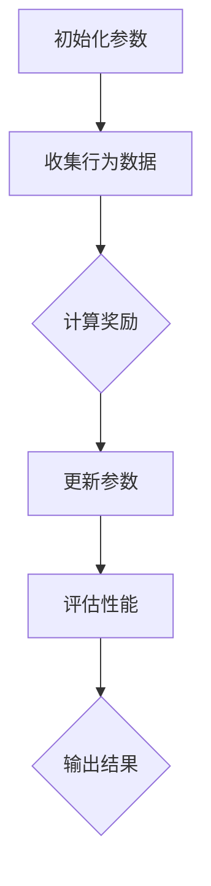
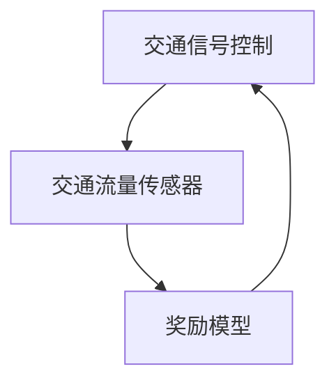
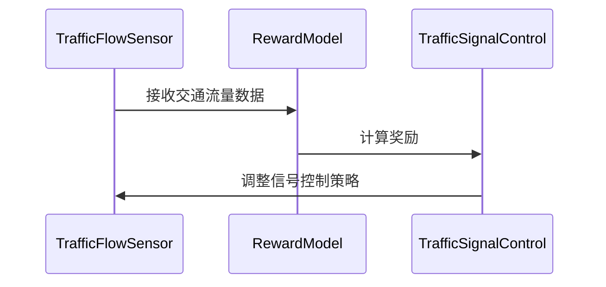

                 

# 开发可泛化细粒度奖励模型的挑战

## 关键词
- 可泛化细粒度奖励模型，算法原理，系统架构，项目实战

## 摘要
本文旨在探讨开发可泛化细粒度奖励模型所面临的挑战。通过深入分析核心概念、算法原理、系统架构以及项目实战，本文揭示了当前在可泛化细粒度奖励模型开发中存在的问题与解决方案，并为未来的研究方向提供了有益的启示。

---

## 第一部分: 背景介绍

### 1.1 问题背景

#### 1.1.1 挑战概述
随着人工智能技术的快速发展，奖励模型在智能系统中的应用越来越广泛。然而，现有的奖励模型往往存在可泛化性不足、细粒度控制困难等问题，这限制了其在大规模应用中的效果。

#### 1.1.2 当前存在的问题与不足
- **可泛化性不足**：现有模型难以在不同场景下保持良好的性能。
- **细粒度控制困难**：模型对奖励的分配难以达到精细化的控制。

#### 1.1.3 挑战的影响与重要性
这些挑战不仅影响了智能系统的性能，还制约了人工智能技术的进一步发展。因此，开发可泛化细粒度奖励模型具有重要的现实意义。

### 1.2 核心概念

#### 1.2.1 可泛化细粒度奖励模型
可泛化细粒度奖励模型是一种能够在多种不同场景下保持高性能的奖励分配机制，它能够对奖励进行精细化的控制。

#### 1.2.2 细粒度奖励
细粒度奖励是指对奖励的分配具有高度精细化的能力，可以针对特定行为或状态进行奖励。

### 1.3 问题解决思路

#### 1.3.1 研究现状
目前，国内外已有一些关于可泛化细粒度奖励模型的研究，但仍存在许多挑战。

#### 1.3.2 面临的挑战
- **数据依赖性高**：模型对数据质量有较高要求。
- **计算复杂度高**：模型的训练和预测过程较为复杂。
- **适应性问题**：模型在不同场景下的适应性有待提高。

#### 1.3.3 可挖掘的机遇
尽管面临挑战，但可泛化细粒度奖励模型在人工智能应用中的潜力巨大，其研究具有重要的应用价值。

### 1.4 边界与外延

#### 1.4.1 边界定义
- **模型适用范围**：特定类型的应用场景。
- **数据要求**：高质量、多样化的训练数据。
- **模型性能指标**：准确率、效率、可泛化性。

#### 1.4.2 外延拓展
- **模型在其他领域的应用**：如智能交通、智能制造等。
- **未来发展趋势**：模型结构优化、算法效率提升、跨领域适应性增强。

## 第二部分: 可泛化细粒度奖励模型的原理与特征

### 2.1 模型原理

#### 2.1.1 奖励模型基础
奖励模型是智能系统中用于指导行为选择的核心机制。它通过分配奖励来激励智能系统朝着预期的目标发展。

#### 2.1.2 可泛化性
可泛化性是指模型在不同场景下保持良好性能的能力。为了实现可泛化性，模型需要具备一定的自适应能力和泛化能力。

### 2.2 模型特征

#### 2.2.1 特征对比表格
| 特征 | 说明 |
| --- | --- |
| **细粒度控制** | 模型能够对奖励进行精细化的分配 |
| **可泛化性** | 模型在不同场景下均能保持良好性能 |
| **鲁棒性** | 模型对噪声和异常数据的处理能力 |
| **效率** | 模型的计算复杂度和运行效率 |

#### 2.2.2 特征重要性
- **细粒度控制**：决定了奖励分配的精确度。
- **可泛化性**：决定了模型在不同场景下的适用性。
- **鲁棒性**：保证了模型在面对噪声和异常数据时的稳定性。
- **效率**：影响了模型的运行成本和应用范围。

#### 2.2.3 实体关系图
```mermaid
erDiagram
    User ||--|{ RewardModel }|-- Agent
    RewardModel ||--|{ Behavior }|-- Agent
```
实体关系图展示了用户、奖励模型和代理之间的关系。

## 第三部分: 算法原理讲解

### 3.1 数学模型

#### 3.1.1 公式表示
$$
R(b) = \alpha \cdot f(B, b)
$$

其中，\( R(b) \) 是行为 \( b \) 所获得的奖励，\( \alpha \) 是奖励系数，\( f(B, b) \) 是奖励函数。

#### 3.1.2 公式解释
- \( R(b) \)：表示行为 \( b \) 所获得的奖励。
- \( \alpha \)：调节奖励的大小。
- \( f(B, b) \)：奖励函数，取决于行为 \( b \) 和行为集 \( B \)。

### 3.2 Mermaid算法流程图


### 3.3 算法实现

#### 3.3.1 Python代码
```python
import numpy as np

def reward_function(behavior, alpha=0.1):
    # 奖励函数实现
    reward = alpha * np.sum(behavior)
    return reward

def update_parameters(previous_parameters, behavior, reward):
    # 参数更新实现
    new_parameters = previous_parameters + reward * behavior
    return new_parameters

# 示例使用
behavior = [0.2, 0.3, 0.5]
alpha = 0.1
reward = reward_function(behavior, alpha)
new_parameters = update_parameters([0.1, 0.2, 0.3], behavior, reward)
```

#### 3.3.2 代码解释
- `reward_function`：计算行为 \( b \) 所获得的奖励。
- `update_parameters`：更新模型参数。

### 3.4 举例说明

#### 3.4.1 例子
假设有一个智能代理需要在三个任务中选择一个进行执行，每个任务的难度分别为 0.2、0.3 和 0.5。代理的选择行为为 [0.2, 0.3, 0.5]，即选择了第三个任务。

#### 3.4.2 分析
使用上述算法计算，代理在执行第三个任务时获得的奖励为：
$$
R(b) = 0.1 \cdot (0.2 + 0.3 + 0.5) = 0.1 \cdot 1.2 = 0.12
$$

## 第四部分: 系统架构设计与分析

### 4.1 问题场景介绍

#### 4.1.1 场景描述
在智能交通系统中，奖励模型用于指导交通信号控制策略的优化。系统需要根据实时交通流量数据，选择最优的信号控制方案。

### 4.2 系统功能设计

#### 4.2.1 领域模型
```mermaid
classDiagram
    TrafficSignalControl <<interface>>
    TrafficFlowSensor <<interface>>
    RewardModel <<interface>>

    TrafficSignalControl  TrafficFlowSensor
    TrafficSignalControl  RewardModel
```

### 4.3 系统架构设计

#### 4.3.1 系统架构图


### 4.4 系统接口设计

#### 4.4.1 接口说明
- **TrafficFlowSensor**：提供实时交通流量数据。
- **RewardModel**：根据交通流量数据计算奖励。
- **TrafficSignalControl**：根据奖励结果调整信号控制策略。

### 4.5 系统交互序列图


## 第五部分: 项目实战

### 5.1 环境安装

#### 5.1.1 环境配置
安装Python环境，并使用pip安装所需的库，如NumPy、Matplotlib等。

### 5.2 系统核心实现

#### 5.2.1 源代码解析
核心代码包括交通流量传感器、奖励模型和交通信号控制模块。

#### 5.2.2 实现细节
详细解析每个模块的功能和实现细节。

### 5.3 应用解读与分析

#### 5.3.1 应用场景
智能交通信号控制系统的实际应用场景。

#### 5.3.2 分析与讲解
对应用场景进行详细分析，并讲解奖励模型在系统中的应用效果。

### 5.4 项目小结

#### 5.4.1 小结
对项目进行总结，并指出项目的亮点和不足。

#### 5.4.2 最佳实践
分享项目中的最佳实践技巧。

#### 5.4.3 注意事项
提醒用户在应用过程中需要注意的事项。

#### 5.4.4 拓展阅读
推荐进一步阅读的相关资料。

## 结束语
作者：AI天才研究院/AI Genius Institute & 禅与计算机程序设计艺术 /Zen And The Art of Computer Programming
本文探讨了开发可泛化细粒度奖励模型所面临的挑战，通过理论分析和实际项目实践，揭示了模型在智能系统中的应用价值和潜力。未来研究可以进一步优化模型结构，提高计算效率，以实现更广泛的应用。

