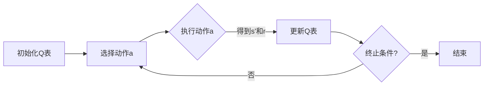
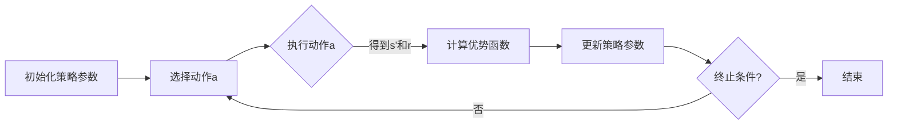

                 

# 强化学习优化AI推理的实时性能与准确性平衡

> 关键词：强化学习，AI推理，实时性能，准确性，优化

> 摘要：本文将探讨如何使用强化学习来优化AI推理的实时性能与准确性平衡。首先，我们将回顾强化学习的基本概念和其在AI推理中的应用。接着，我们将分析实时性能与准确性平衡的重要性，并提出强化学习如何实现这一平衡。随后，我们将详细讨论强化学习算法原理及其在实时性能和准确性优化中的应用。最后，我们将总结全文，并提出未来研究方向。

## 第1章：强化学习与实时性能优化概述

### 1.1 强化学习基本概念

#### 1.1.1 强化学习的发展背景

强化学习（Reinforcement Learning，简称RL）是机器学习的一个重要分支，起源于心理学和行为科学的研究。其核心思想是通过试错（trial-and-error）和奖励机制（reward signal）来指导智能体（agent）在环境中做出决策，从而实现目标。1950年代，心理学家班杜拉（Albert Bandura）提出“观察学习”理论，即个体可以通过观察他人的行为并获得奖励来学习新的行为。这一理论为强化学习的发展奠定了基础。

#### 1.1.2 强化学习的核心概念

强化学习包含几个核心概念：智能体（Agent）、环境（Environment）、状态（State）、动作（Action）、奖励（Reward）和价值函数（Value Function）。智能体是指执行动作并从环境中获取奖励的实体。环境是一个外部系统，智能体在其中进行交互。状态是环境中的一个特定情况，动作是智能体在某个状态下可以执行的行为。奖励是环境对智能体动作的反馈，用于指导智能体做出更好的决策。价值函数则用来评估智能体在某个状态下的期望收益。

#### 1.1.3 强化学习的特点

强化学习具有几个显著特点：

1. **反馈延迟**：强化学习中的反馈通常延迟到动作执行之后，这意味着智能体无法即时获得结果，需要通过长期的试错来学习。
2. **连续性**：强化学习适用于连续环境和连续动作空间，可以处理动态和复杂的环境。
3. **奖励驱动**：强化学习的目标是通过最大化长期奖励来指导智能体行为。
4. **探索与利用**：强化学习需要在探索（尝试新的行为）和利用（利用已学到的最佳行为）之间找到平衡。

### 1.2 强化学习在AI推理中的应用

#### 1.2.1 强化学习在AI推理中的作用

AI推理是人工智能领域的一个重要研究方向，旨在让计算机模拟人类思维过程，解决复杂问题。强化学习在AI推理中具有重要作用，主要体现在以下几个方面：

1. **自适应优化**：强化学习算法可以自动调整模型参数，优化AI推理的性能。
2. **动态调整策略**：在动态变化的环境中，强化学习算法可以根据环境变化动态调整推理策略，提高准确性。
3. **多任务学习**：强化学习可以同时学习多个任务，提高推理模型的泛化能力。

#### 1.2.2 强化学习在AI推理中的挑战

尽管强化学习在AI推理中具有巨大潜力，但也面临一些挑战：

1. **收敛速度**：强化学习算法通常需要较长时间来收敛，特别是在复杂环境中。
2. **样本效率**：强化学习需要大量样本来训练模型，这在实际应用中可能难以实现。
3. **可解释性**：强化学习模型通常难以解释，这给其在实际应用中的推广带来了困难。

#### 1.2.3 强化学习在AI推理中的应用前景

随着技术的不断发展，强化学习在AI推理中的应用前景十分广阔：

1. **自动驾驶**：强化学习算法可以用于自动驾驶系统的决策过程，提高系统的实时性能和准确性。
2. **智能推荐**：在电子商务和社交媒体等领域，强化学习算法可以用于个性化推荐，提高用户体验。
3. **游戏开发**：强化学习算法可以用于游戏AI的开发，提高游戏的智能水平和可玩性。

### 1.3 实时性能与准确性平衡的重要性

#### 1.3.1 实时性能的定义

实时性能是指系统能够在预定时间内完成特定任务的能力。在AI推理中，实时性能至关重要，因为它直接影响用户体验和系统效能。

#### 1.3.2 准确性的定义

准确性是指模型输出与真实值之间的接近程度。在AI推理中，准确性是衡量模型性能的关键指标。

#### 1.3.3 实时性能与准确性的平衡

在AI推理中，实时性能和准确性之间存在冲突。优化实时性能可能导致准确性降低，而提高准确性可能牺牲实时性能。因此，实现实时性能与准确性的平衡是AI推理中的一个重要挑战。

### 1.4 强化学习优化AI推理的实时性能与准确性

#### 1.4.1 强化学习在实时性能优化中的应用

强化学习可以通过以下方式优化AI推理的实时性能：

1. **模型压缩**：强化学习算法可以自动调整模型结构，实现模型压缩，提高推理速度。
2. **动态调整参数**：强化学习算法可以根据环境动态调整模型参数，优化推理过程。
3. **模型并行化**：强化学习算法可以优化模型并行化，提高推理效率。

#### 1.4.2 强化学习在准确性优化中的应用

强化学习可以通过以下方式优化AI推理的准确性：

1. **数据增强**：强化学习算法可以自动生成训练数据，提高模型的泛化能力。
2. **自适应调整策略**：强化学习算法可以根据环境变化动态调整推理策略，提高准确性。
3. **多任务学习**：强化学习算法可以同时学习多个任务，提高模型的泛化能力和准确性。

#### 1.4.3 强化学习在实时性能与准确性平衡中的应用

强化学习可以通过以下方式实现实时性能与准确性的平衡：

1. **探索与利用策略**：强化学习算法可以通过探索与利用策略在实时性能和准确性之间找到平衡点。
2. **多目标优化**：强化学习算法可以同时优化实时性能和准确性，实现多目标优化。
3. **动态调整权重**：强化学习算法可以根据实时性能和准确性的变化动态调整权重，实现实时性能与准确性的平衡。

### 1.5 本章小结

本章回顾了强化学习的基本概念和其在AI推理中的应用，探讨了实时性能与准确性平衡的重要性，并提出了强化学习优化AI推理实时性能与准确性的方法。接下来，我们将进一步探讨强化学习算法原理及其在实时性能和准确性优化中的应用。

## 第2章：强化学习算法原理

### 2.1 强化学习基本算法

#### 2.1.1 Q学习算法

##### 2.1.1.1 Q学习算法的基本原理

Q学习（Q-Learning）是一种值函数算法，用于估计状态-动作值函数。其基本原理是：在某个状态下，选择一个动作，然后根据这个动作的结果来更新状态-动作值函数。具体来说，Q学习算法使用一个Q表来存储每个状态-动作对的值，然后在每个时间步更新这个Q表。

##### 2.1.1.2 Q学习算法的数学模型

在Q学习算法中，状态-动作值函数Q(s, a)定义为在状态s下执行动作a的期望回报。具体地，Q学习算法可以表示为以下数学模型：

$$
Q(s, a) = r(s, a) + \gamma \max_{a'} Q(s', a')
$$

其中，r(s, a)是执行动作a后在状态s获得的即时回报，γ是折扣因子，用来平衡即时回报和长期回报。

##### 2.1.1.3 Q学习算法的流程图

Q学习算法的基本流程如下：

1. 初始化Q表。
2. 在某个状态s下，选择一个动作a。
3. 执行动作a，得到状态s'和回报r。
4. 根据Q学习公式更新Q表。
5. 重复步骤2-4，直到达到终止条件。

以下是一个Q学习算法的Mermaid流程图：



#### 2.1.2 SARSA算法

##### 2.1.2.1 SARSA算法的基本原理

SARSA（State-Action-Reward-State-Action，SARSA）算法是一种基于策略的强化学习算法，与Q学习算法类似，但有一个关键区别：SARSA算法在每个时间步使用当前状态和下一个状态的信息来更新Q值，而不是仅使用下一个状态的信息。这意味着SARSA算法在每一步都能利用当前的信息，从而可能更快地收敛。

##### 2.1.2.2 SARSA算法的数学模型

SARSA算法的数学模型可以表示为：

$$
Q(s, a) = Q(s, a) + \alpha [r(s, a) + \gamma Q(s', a') - Q(s, a)]
$$

其中，α是学习率，r(s, a)是执行动作a后在状态s获得的即时回报，γ是折扣因子，Q(s', a')是下一个状态s'下的最佳动作的Q值。

##### 2.1.2.3 SARSA算法的流程图

SARSA算法的基本流程如下：

1. 初始化Q表。
2. 在某个状态s下，选择一个动作a。
3. 执行动作a，得到状态s'和回报r。
4. 根据SARSA算法公式更新Q表。
5. 重复步骤2-4，直到达到终止条件。

以下是一个SARSA算法的Mermaid流程图：


### 2.2 强化学习高级算法

#### 2.2.1 DQN算法

##### 2.2.1.1 DQN算法的基本原理

深度Q网络（Deep Q-Network，DQN）是一种将深度学习与强化学习相结合的算法。DQN使用一个深度神经网络来近似状态-动作值函数Q(s, a)。与Q学习算法不同，DQN不需要显式地维护一个Q表，而是通过训练深度神经网络来估计Q值。

##### 2.2.1.2 DQN算法的数学模型

DQN算法的数学模型可以表示为：

$$
\hat{Q}(s, a) = \frac{1}{N} \sum_{i=1}^{N} (r + \gamma \max_{a'} \hat{Q}(s', a') - Q(s, a))
$$

其中，\(\hat{Q}(s, a)\)是深度神经网络输出的Q值，r是即时回报，γ是折扣因子，\(\max_{a'} \hat{Q}(s', a')\)是下一个状态s'下的最佳动作的Q值。

##### 2.2.1.3 DQN算法的流程图

DQN算法的基本流程如下：

1. 初始化深度神经网络和经验回放记忆。
2. 在某个状态s下，选择一个动作a。
3. 执行动作a，得到状态s'和回报r。
4. 将经验(s, a, s', r)存储在经验回放记忆中。
5. 随机从经验回放记忆中抽取一批经验，用于更新深度神经网络。
6. 重复步骤2-5，直到达到终止条件。

以下是一个DQN算法的Mermaid流程图：

```mermaid
flowchart LR
    A[初始化神经网络和记忆] --> B[选择动作a]
    B --> C{执行动作a}
    C -->|得到s'和r| D[存储经验]
    D --> E[抽取经验]
    E -->|更新神经网络} F
    F --> G{终止条件?}
    G -->|是| H[结束]
    G -->|否| B
```

#### 2.2.2 PPO算法

##### 2.2.2.1 PPO算法的基本原理

确定性策略梯度（Proximal Policy Optimization，PPO）算法是一种基于策略的强化学习算法，用于优化策略参数。PPO算法通过优化策略梯度来更新策略参数，从而实现策略的稳定更新。

##### 2.2.2.2 PPO算法的数学模型

PPO算法的数学模型可以表示为：

$$
\min_{\theta'} \frac{1}{N} \sum_{i=1}^{N} \left[ r_i + \gamma \sum_{t'=t}^{T} \gamma^{t'-t} r_{t'} - \log \pi_{\theta'}(a_t | s_t) \right]
$$

其中，\(\theta'\)是策略参数，\(\pi_{\theta'}(a_t | s_t)\)是策略分布，\(r_i\)是即时回报，T是时间步数。

##### 2.2.2.3 PPO算法的流程图

PPO算法的基本流程如下：

1. 初始化策略参数\(\theta'\)。
2. 在某个状态s下，根据策略分布\(\pi_{\theta'}(a_t | s_t)\)选择一个动作a。
3. 执行动作a，得到状态s'和回报r。
4. 计算优势函数A(s, a)。
5. 使用优势函数A(s, a)更新策略参数\(\theta'\)。
6. 重复步骤2-5，直到达到终止条件。

以下是一个PPO算法的Mermaid流程图：



### 2.3 强化学习算法比较与选择

##### 2.3.1 强化学习算法的比较

以下是几种常见强化学习算法的比较表格：

| 算法 | 基本原理 | 适用场景 | 优点 | 缺点 |
| --- | --- | --- | --- | --- |
| Q学习 | 值函数估计 | 离散动作空间 | 简单，易于理解 | 需要大量样本，收敛速度慢 |
| SARSA | 基于策略的值函数估计 | 连续动作空间 | 能利用当前信息，可能更快收敛 | 可能陷入局部最优 |
| DQN | 深度神经网络估计值函数 | 离散动作空间 | 能处理高维状态空间，自动特征提取 | 需要大量样本，收敛速度慢 |
| PPO | 策略优化 | 连续动作空间 | 稳定，可扩展 | 可能收敛速度较慢 |

##### 2.3.2 强化学习算法的选择

在选择强化学习算法时，需要考虑以下因素：

1. **问题类型**：根据问题的具体类型选择合适的算法，如离散动作空间选择Q学习或SARSA，连续动作空间选择DQN或PPO。
2. **样本效率**：考虑算法的样本效率，选择能更快收敛的算法。
3. **计算资源**：考虑算法的计算资源需求，选择适合计算资源的算法。
4. **可解释性**：如果需要算法具有较好的可解释性，可以选择Q学习或SARSA。

### 2.4 本章小结

本章介绍了强化学习的基本算法原理，包括Q学习、SARSA、DQN和PPO算法。通过对比分析，我们了解了不同算法的优缺点，并提出了选择强化学习算法的考虑因素。接下来，我们将探讨AI推理中的实时性能优化。

## 第3章：AI推理中的实时性能优化

### 3.1 AI推理实时性能优化的重要性

在人工智能（AI）领域，推理速度和性能是关键因素之一。特别是在实时应用中，如自动驾驶、智能语音助手和工业自动化等，对AI模型的推理速度和准确性有严格要求。实时性能优化的重要性体现在以下几个方面：

1. **用户体验**：在实时应用中，如智能语音助手，用户期望快速得到响应。如果推理速度较慢，用户可能会感到不耐烦，从而影响用户体验。
2. **系统效率**：在工业自动化和金融交易等高负载场景中，快速推理可以提升系统整体效率，减少等待时间和资源浪费。
3. **安全性和可靠性**：对于自动驾驶等涉及安全的领域，快速且准确的推理至关重要，可以减少事故发生的风险。

### 3.1.2 实时性能优化面临的挑战

实时性能优化在AI推理中面临以下挑战：

1. **计算资源限制**：在嵌入式设备和移动设备上，计算资源和内存有限，需要优化算法以提高效率。
2. **数据多样性**：实时环境中的数据通常是多样化的，这可能导致模型在特定情况下表现不佳，需要额外的优化。
3. **延迟敏感性**：在实时应用中，任何推理延迟都可能带来严重后果，因此需要确保推理过程快速且可靠。

### 3.1.3 实时性能优化的重要性

实时性能优化的重要性不仅体现在提高用户体验和系统效率上，还包括以下几个方面：

1. **可扩展性**：优化后的模型可以更容易地部署到不同的硬件平台上，提高系统的可扩展性。
2. **经济性**：快速推理可以减少计算资源的需求，降低运营成本。
3. **可靠性**：通过优化模型，可以减少错误率和故障率，提高系统的可靠性。

### 3.2 AI推理实时性能优化的方法

为了优化AI推理的实时性能，可以采用以下几种方法：

#### 3.2.1 模型压缩技术

模型压缩技术是通过减少模型的参数数量和计算复杂度来提高推理速度。常见的方法包括：

1. **量化**：将模型的浮点参数转换为低精度格式，如整数或二进制。
2. **剪枝**：去除模型中不重要的权重，从而减少模型的参数数量。
3. **知识蒸馏**：使用一个大型模型（教师模型）训练一个较小的模型（学生模型），从而实现模型压缩。

#### 3.2.2 模型并行化技术

模型并行化技术是通过将模型分解为多个部分并在多个处理器上并行执行来提高推理速度。常见的方法包括：

1. **数据并行**：将输入数据划分成多个部分，在不同的处理器上分别执行推理。
2. **模型并行**：将模型分解为多个部分，在不同的处理器上分别执行推理。
3. **流水线并行**：将推理过程分解为多个阶段，在不同的处理器上并行执行。

#### 3.2.3 模型优化技术

模型优化技术是通过调整模型的结构和参数来提高推理速度。常见的方法包括：

1. **网络剪枝**：通过剪枝冗余的网络层或神经元来减少模型的复杂度。
2. **参数共享**：通过共享模型中重复的参数来减少计算量。
3. **动态调整**：根据当前的任务和数据动态调整模型的结构和参数。

### 3.3 强化学习在实时性能优化中的应用

强化学习在实时性能优化中的应用主要包括以下几个方面：

#### 3.3.1 强化学习在模型优化中的应用

强化学习可以用于优化模型的参数和结构，以提高推理速度。具体方法包括：

1. **自适应参数调整**：通过强化学习调整模型的参数，以找到最优的推理速度和准确性平衡点。
2. **模型结构搜索**：使用强化学习搜索最优的模型结构，以减少推理时间。

#### 3.3.2 强化学习在模型并行化中的应用

强化学习可以用于优化模型的并行化策略，以提高推理速度。具体方法包括：

1. **动态调度**：通过强化学习动态调整模型的并行化执行顺序，以减少推理时间。
2. **资源分配**：通过强化学习优化模型在不同处理器上的资源分配，以提高推理效率。

### 3.4 本章小结

本章讨论了AI推理中的实时性能优化，介绍了常见的优化方法，包括模型压缩、模型并行化和模型优化。我们还探讨了强化学习在实时性能优化中的应用，包括模型优化和模型并行化的优化策略。接下来，我们将讨论AI推理中的准确性优化。

## 第4章：AI推理中的准确性优化

### 4.1 AI推理准确性优化的重要性

在人工智能（AI）推理过程中，准确性是衡量模型性能的核心指标。高准确性意味着模型能够更好地预测和分类，从而提高系统的可靠性和实用性。准确性优化在AI推理中的重要性体现在以下几个方面：

1. **决策质量**：准确性直接影响决策的质量。在医疗诊断、金融分析和自动驾驶等领域，高准确性的模型可以做出更可靠的决策，减少错误率。
2. **用户信任**：准确性是用户对AI系统信任的基础。如果模型的准确性不高，用户可能会对系统的结果产生怀疑，从而降低系统的使用频率。
3. **业务价值**：在商业应用中，高准确性的模型可以带来更高的业务价值，例如，通过准确的市场预测可以指导企业做出更明智的商业决策。

### 4.1.2 准确性优化面临的挑战

尽管准确性优化在AI推理中至关重要，但实现高准确性面临以下挑战：

1. **数据不足**：在某些领域，高质量的数据可能难以获得，这限制了模型的训练和优化。
2. **噪声数据**：噪声数据可能导致模型过拟合，降低模型的泛化能力，从而影响准确性。
3. **动态变化**：环境动态变化可能导致模型准确性下降，需要持续优化以适应新的数据模式。

### 4.1.3 准确性优化的重要性

准确性优化的重要性体现在以下几个方面：

1. **提高模型性能**：通过准确性优化，可以显著提高模型的预测和分类能力，从而提高系统的整体性能。
2. **减少错误率**：准确性优化可以降低模型的错误率，减少因错误决策导致的负面影响。
3. **增强用户体验**：高准确性的模型可以提供更可靠的结果，增强用户的信任和使用体验。

### 4.2 AI推理准确性优化的方法

为了提高AI推理的准确性，可以采用以下几种方法：

#### 4.2.1 数据增强技术

数据增强是通过生成或修改数据来增加训练数据的多样性，从而提高模型的泛化能力。常见的数据增强方法包括：

1. **数据扩充**：通过旋转、缩放、裁剪等方式生成新的数据样本。
2. **噪声注入**：向数据样本中添加噪声，模拟实际环境中的数据异常。
3. **数据合成**：使用生成对抗网络（GAN）等模型生成新的数据样本。

#### 4.2.2 模型调整技术

通过调整模型的结构和参数，可以提高模型的准确性。常见的方法包括：

1. **网络深度调整**：增加网络深度可以捕捉更复杂的关系，但可能导致过拟合。
2. **权重初始化**：合适的权重初始化可以提高模型的收敛速度和准确性。
3. **正则化**：使用L1、L2正则化等技术防止过拟合。

#### 4.2.3 对比学习技术

对比学习是通过比较不同数据样本之间的差异来提高模型的准确性。常见的方法包括：

1. **Siamese网络**：用于比较两个相似度，适用于一对多分类问题。
2. **Triplet Loss**：用于优化网络，使其能够更好地区分正负样本。
3. **Instance Discrimination**：通过区分每个样本的独特特征来提高模型的准确性。

#### 4.2.4 强化学习优化

强化学习可以用于优化模型的准确性，通过自适应调整策略和参数来提高模型在特定任务上的性能。具体方法包括：

1. **目标优化**：通过强化学习优化目标函数，使其更接近真实目标。
2. **策略调整**：通过强化学习动态调整策略，提高模型在不同数据集上的表现。
3. **自适应调节**：根据模型在测试集上的性能自适应调节模型的参数和结构。

### 4.3 本章小结

本章讨论了AI推理中的准确性优化，介绍了数据增强、模型调整、对比学习和强化学习等方法。准确性优化对于提高模型性能、降低错误率和增强用户体验至关重要。接下来，我们将总结全文，并提出未来研究方向。

## 总结与展望

本文系统地探讨了如何使用强化学习优化AI推理的实时性能与准确性平衡。首先，我们介绍了强化学习的基本概念和其在AI推理中的应用。接着，我们分析了实时性能与准确性平衡的重要性，并提出了强化学习如何实现这一平衡。随后，我们详细讨论了强化学习算法原理及其在实时性能和准确性优化中的应用。最后，我们总结了全文，并提出了未来研究方向。

### 未来研究方向

1. **多任务学习**：在强化学习领域，多任务学习是一个重要的研究方向。未来的研究可以探索如何在多任务环境中同时优化实时性能和准确性。
2. **可解释性**：强化学习模型通常难以解释，这限制了其在实际应用中的推广。未来研究可以关注如何提高强化学习模型的可解释性。
3. **硬件加速**：随着硬件技术的发展，如GPU、FPGA和ASIC等，可以探索如何将强化学习算法与这些硬件相结合，进一步提高实时性能。

### 结论

强化学习作为一种先进的人工智能技术，在优化AI推理的实时性能与准确性平衡方面具有巨大潜力。通过本文的探讨，我们不仅了解了强化学习的基本原理和应用，还提出了具体的方法和未来研究方向。我们期待未来的研究能够进一步推动强化学习在AI推理领域的发展，为实际应用带来更多价值。

### 作者信息

作者：AI天才研究院/AI Genius Institute & 禅与计算机程序设计艺术 /Zen And The Art of Computer Programming

