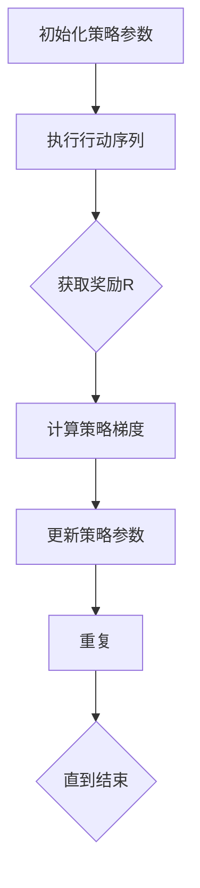

                 

### 文章标题

#### 强化学习优化推理过程中的探索策略

强化学习作为机器学习领域的一个重要分支，在人工智能应用中扮演着至关重要的角色。它通过试错的方式，使智能体在动态环境中不断学习和改进策略，从而达到优化目标的效果。然而，在强化学习优化推理过程中，如何有效地探索未知状态和行为，成为了一个关键问题。本文将围绕这一主题，探讨强化学习优化推理过程中的探索策略。

#### 关键词

- 强化学习
- 探索策略
- 优化推理
- Epsilon-greedy策略
- 多臂老虎机问题
- 自动驾驶
- 机器人控制

#### 摘要

本文首先介绍了强化学习与优化推理的基本概念，探讨了探索策略的定义与重要性。接着，详细介绍了几种常见的探索策略，如Epsilon-greedy策略、跳跃式探索策略和具有可调节参数的探索策略。然后，通过具体应用案例，展示了强化学习在游戏、自动驾驶、机器人控制等领域的应用。最后，分析了强化学习优化推理的最新进展，并展望了未来发展趋势。

### 目录大纲：

```markdown
----------------------------------------------------------------
# 第一部分: 强化学习优化推理过程中的探索策略

## 第1章: 强化学习与优化推理背景

### 1.1 强化学习概述

### 1.2 强化学习在推理过程中的应用

### 1.3 探索策略的定义与重要性

### 1.4 探索策略的分类与比较

### 1.5 强化学习优化推理的挑战与机遇

## 第2章: 强化学习基础算法

### 2.1 Q-Learning算法

### 2.2 SARSA算法

### 2.3 Deep Q-Networks (DQN)

### 2.4 Policy Gradient方法

## 第3章: 探索策略设计与实现

### 3.1 Epsilon-greedy策略

### 3.2 跳跃式探索策略

### 3.3 具有可调节参数的探索策略

### 3.4 强化学习中的多臂老虎机问题

## 第4章: 强化学习优化推理的应用案例

### 4.1 游戏领域

### 4.2 自动驾驶

### 4.3 机器人控制

### 4.4 虚拟助理与推荐系统

## 第5章: 强化学习优化推理的最新进展

### 5.1 Recent Advances in Exploration-Exploitation Tradeoff

### 5.2 Continuous Action Space Methods

### 5.3 Multi-Agent Reinforcement Learning

## 第6章: 强化学习优化推理的未来发展趋势

### 6.1 Future Directions in Reinforcement Learning

### 6.2 潜在的研究领域与挑战

## 第7章: 总结与展望

### 7.1 强化学习优化推理的总结

### 7.2 未来研究方向

### 7.3 对读者的建议

----------------------------------------------------------------
```

### 第一部分: 强化学习优化推理过程中的探索策略

#### 第1章: 强化学习与优化推理背景

##### 1.1 强化学习概述

强化学习（Reinforcement Learning，RL）是机器学习的一个重要分支，它通过智能体（Agent）在与环境（Environment）的交互过程中，不断学习和改进策略（Policy），以实现最大化累积奖励（Reward）的目标。与传统监督学习和无监督学习不同，强化学习强调试错（Trial and Error）和奖励反馈（Reward Feedback）。

在强化学习过程中，智能体需要通过探索（Exploration）和利用（Exploitation）两种策略来获取最佳行为策略。探索是指智能体在不知道环境的情况下，主动尝试新行为以获取更多信息；而利用是指智能体在已知环境信息的情况下，选择最优行为以最大化奖励。

##### 1.2 强化学习在推理过程中的应用

强化学习在推理过程中扮演着重要角色。通过强化学习，智能体可以在复杂的环境中自主学习最优策略。在推理过程中，强化学习通常用于解决以下问题：

1. **策略优化**：在给定环境条件下，智能体需要找到一条最佳策略，以最大化累积奖励。这可以通过优化策略函数实现。
   
2. **状态评估**：智能体需要对当前状态进行评估，以确定下一步行动。状态评估可以通过价值函数（Value Function）或策略函数（Policy Function）实现。

3. **决策生成**：智能体需要根据当前状态和策略生成决策，以实现目标。决策生成可以通过行动值函数（Action-Value Function）或策略值函数（Policy Value Function）实现。

##### 1.3 探索策略的定义与重要性

探索策略（Exploration Strategy）是强化学习中至关重要的一部分。它决定了智能体在未知环境中如何平衡探索和利用。探索策略可以分为以下几种类型：

1. **Epsilon-greedy策略**：智能体以概率`epsilon`进行随机行动，以探索新状态；以概率`1-epsilon`进行最佳行动，以利用已有信息。
   
2. **贪婪策略**：智能体总是选择当前状态下价值最大的行动，以最大化奖励。
   
3. **平衡探索策略**：智能体在一段时间内进行探索，然后切换到利用阶段，以最大化累积奖励。

探索策略的重要性体现在以下几个方面：

1. **避免局部最优**：在复杂环境中，最佳策略可能隐藏在未知状态中。通过探索，智能体可以找到最佳策略。
   
2. **提高收敛速度**：探索策略可以帮助智能体更快地收敛到最佳策略，从而提高学习效率。

3. **适应动态环境**：在动态环境中，智能体需要不断适应环境变化。通过探索，智能体可以学习到环境的变化规律，从而更好地应对环境变化。

##### 1.4 探索策略的分类与比较

常见的探索策略包括以下几种：

1. **Epsilon-greedy策略**：这是最简单的探索策略，通过在随机行动和最佳行动之间进行平衡，实现探索和利用的平衡。

2. **跳跃式探索策略**：智能体在一段时间内进行随机行动，以探索未知状态；然后切换到最佳行动，以利用已有信息。

3. **具有可调节参数的探索策略**：智能体的探索概率随时间变化而调整，以实现更好的探索效果。

下面是一个Epsilon-greedy策略的例子：

```python
import numpy as np

def epsilon_greedy(q_values, epsilon=0.1):
    """
    Epsilon-greedy策略选择动作。
    
    参数：
    q_values：动作值数组
    epsilon：探索概率
    
    返回：
    action：选择的动作
    """
    if np.random.rand() < epsilon:
        action = np.random.choice(len(q_values))
    else:
        action = np.argmax(q_values)
    return action
```

##### 1.5 强化学习优化推理的挑战与机遇

在强化学习优化推理过程中，面临着一系列挑战和机遇：

1. **挑战**：
   - **平衡探索与利用**：如何在探索和利用之间找到最佳平衡点，是强化学习的一个重要挑战。
   - **收敛速度**：如何提高收敛速度，以便智能体更快地找到最佳策略。
   - **稀疏奖励**：在稀疏奖励环境中，智能体如何有效地学习最佳策略。

2. **机遇**：
   - **多智能体强化学习**：通过多智能体强化学习，可以解决复杂任务，实现更高级别的智能。
   - **深度强化学习**：结合深度学习技术，可以解决更复杂的强化学习问题。
   - **连续动作空间**：通过探索连续动作空间的方法，可以解决更多实际应用问题。

通过本文的讨论，我们可以了解到强化学习优化推理过程中的探索策略及其重要性。接下来，我们将深入探讨强化学习的基础算法，为后续内容打下基础。

### 第二部分: 强化学习基础算法

#### 第2章: 强化学习基础算法

在强化学习（Reinforcement Learning，RL）领域中，基础算法是构建智能体学习模型的核心。这些算法通过不同的策略和技巧，使智能体能够在复杂的环境中学习和优化其行为。本章将介绍几种常见的强化学习基础算法，包括Q-Learning、SARSA、Deep Q-Networks (DQN) 和 Policy Gradient 方法。

##### 2.1 Q-Learning算法

Q-Learning算法是最基本的强化学习算法之一，它通过迭代更新Q值（行动值）来学习最佳策略。Q值表示在特定状态下执行特定行动的预期累积奖励。

**算法原理**：
Q-Learning算法的核心思想是使用**经验回放**和**目标网络**来更新Q值。具体步骤如下：

1. 初始化Q值表格`Q[s, a]`为任意小的正值。
2. 在某个初始状态`s`，选择一个动作`a`，执行动作并获取奖励`r`和下一个状态`s'`。
3. 使用下面的公式更新Q值：
   $$Q[s, a] \leftarrow Q[s, a] + \alpha [r + \gamma \max_{a'} Q[s', a'] - Q[s, a]]$$
   其中，$\alpha$是学习率，$\gamma$是折扣因子。
4. 将状态`s`更新为`s'`，重复步骤2和3，直到达到目标状态或最大步数。

**算法流程图**：

```mermaid
graph TD
A[初始化Q值] --> B[选择动作a]
B --> C{执行动作}
C -->|r, s'|(获取奖励和下一个状态)
C --> D[更新Q值]
D --> E[重复]
E --> F{直到结束}
```

**示例代码**：

```python
import numpy as np

def q_learning(env, num_episodes, alpha=0.1, gamma=0.9):
    Q = np.zeros((env.nS, env.nA))
    for episode in range(num_episodes):
        s = env.reset()
        done = False
        while not done:
            a = np.argmax(Q[s, :])
            s_, r, done = env.step(a)
            Q[s, a] = Q[s, a] + alpha * (r + gamma * np.max(Q[s_, :]) - Q[s, a])
            s = s_
    return Q

# 使用OpenAI Gym环境进行测试
import gym
env = gym.make('CartPole-v0')
Q = q_learning(env, num_episodes=1000)
```

**数学模型**：

$$Q[s, a] \leftarrow Q[s, a] + \alpha [r + \gamma \max_{a'} Q[s', a'] - Q[s, a]]$$

##### 2.2 SARSA算法

SARSA（State-Action-Reward-State-Action，即状态-动作-奖励-状态-动作）算法是基于Q-Learning算法改进的一种策略算法。与Q-Learning不同，SARSA在更新Q值时使用的是实际的下一状态动作值，而不是目标动作值。

**算法原理**：
SARSA算法的步骤与Q-Learning类似，但更新公式不同：

1. 初始化Q值表格`Q[s, a]`为任意小的正值。
2. 在某个初始状态`s`，选择一个动作`a`，执行动作并获取奖励`r`和下一个状态`s'`。
3. 使用下面的公式更新Q值：
   $$Q[s, a] \leftarrow Q[s, a] + \alpha [r + \gamma Q[s', a'] - Q[s, a]]$$
4. 将状态`s`更新为`s'`，重复步骤2和3，直到达到目标状态或最大步数。

**算法流程图**：

```mermaid
graph TD
A[初始化Q值] --> B[选择动作a]
B --> C{执行动作}
C -->|r, s'|(获取奖励和下一个状态)
C --> D[更新Q值]
D --> E[重复]
E --> F{直到结束}
```

**示例代码**：

```python
import numpy as np

def sarsa(env, num_episodes, alpha=0.1, gamma=0.9):
    Q = np.zeros((env.nS, env.nA))
    for episode in range(num_episodes):
        s = env.reset()
        done = False
        a = np.argmax(Q[s, :])
        while not done:
            s_, r, done = env.step(a)
            a_ = np.argmax(Q[s_, :])
            Q[s, a] = Q[s, a] + alpha * (r + gamma * Q[s_, a_] - Q[s, a])
            s = s_
            a = a_
    return Q

# 使用OpenAI Gym环境进行测试
import gym
env = gym.make('CartPole-v0')
Q = sarsa(env, num_episodes=1000)
```

**数学模型**：

$$Q[s, a] \leftarrow Q[s, a] + \alpha [r + \gamma Q[s', a'] - Q[s, a]]$$

##### 2.3 Deep Q-Networks (DQN)

Deep Q-Networks (DQN) 是一种基于深度学习的Q-Learning算法，它通过神经网络来近似Q值函数。DQN的核心思想是使用**经验回放**和**目标网络**来减少目标值与实际值之间的差异。

**算法原理**：
DQN算法的步骤如下：

1. 初始化Q网络和目标Q网络。
2. 使用经验回放来避免样本相关性，即从经验池中随机采样一个批次样本。
3. 使用Q网络计算动作值，并选择动作。
4. 执行动作，获取奖励和下一个状态。
5. 更新经验池。
6. 使用梯度下降更新Q网络参数。
7. 定期更新目标Q网络参数，以减少目标值与实际值之间的差异。

**算法流程图**：

```mermaid
graph TD
A[初始化Q网络和目标网络] --> B[经验回放]
B --> C[选择动作a]
C --> D[执行动作]
D -->|r, s'|(获取奖励和下一个状态)
D --> E[更新经验池]
E --> F[更新Q网络]
F --> G[更新目标网络]
G --> H[重复]
H --> I{直到结束}
```

**示例代码**：

```python
import numpy as np
import tensorflow as tf

def deep_q_learning(env, num_episodes, learning_rate=0.01, discount_factor=0.99, epsilon=1.0, epsilon_decay=0.99, epsilon_min=0.01):
    # 初始化神经网络
    # ...

    # 初始化经验池
    # ...

    for episode in range(num_episodes):
        s = env.reset()
        done = False
        while not done:
            # 使用epsilon-greedy策略选择动作
            if np.random.rand() < epsilon:
                a = env.action_space.sample()
            else:
                a = np.argmax(model.predict(s))
            
            s_, r, done = env.step(a)
            # 存储经验
            # ...

            # 更新Q值
            # ...

            # 更新epsilon值
            epsilon = max(epsilon * epsilon_decay, epsilon_min)
            
            s = s_
    return model

# 使用OpenAI Gym环境进行测试
import gym
env = gym.make('CartPole-v0')
model = deep_q_learning(env, num_episodes=1000)
```

**数学模型**：

$$Q[s, a] \leftarrow Q[s, a] + \alpha [r + \gamma \max_{a'} Q[s', a'] - Q[s, a]]$$

##### 2.4 Policy Gradient方法

Policy Gradient方法是一种基于策略的强化学习算法，它直接优化策略函数，以最大化累积奖励。Policy Gradient方法的核心思想是使用梯度上升（Gradient Ascent）来更新策略参数。

**算法原理**：
Policy Gradient算法的步骤如下：

1. 初始化策略参数$\theta$。
2. 对于每个策略执行一次行动序列，并获取奖励$R$。
3. 计算策略梯度的估计值：
   $$\nabla_\theta J(\theta) = \sum_s p(s|\theta) \nabla_\theta \log p(s|\theta) R$$
   其中，$p(s|\theta)$是策略概率分布，$R$是累积奖励。
4. 使用梯度上升更新策略参数：
   $$\theta \leftarrow \theta + \alpha \nabla_\theta J(\theta)$$

**算法流程图**：



**示例代码**：

```python
import numpy as np

def policy_gradient(env, num_episodes, alpha=0.01, discount_factor=0.99):
    theta = np.random.rand(env.nA)  # 初始化策略参数
    for episode in range(num_episodes):
        s = env.reset()
        done = False
        total_reward = 0
        while not done:
            # 计算策略概率分布
            prob = np.exp(theta * env.P[s, :]) / np.sum(np.exp(theta * env.P[s, :]))
            a = np.random.choice(env.nA, p=prob)
            
            s_, r, done = env.step(a)
            total_reward += r
            # 更新策略参数
            theta += alpha * (r - np.mean(r) * prob)
            s = s_
        print(f"Episode {episode}: Total Reward = {total_reward}")
    return theta

# 使用OpenAI Gym环境进行测试
import gym
env = gym.make('CartPole-v0')
theta = policy_gradient(env, num_episodes=1000)
```

**数学模型**：

$$\theta \leftarrow \theta + \alpha \nabla_\theta J(\theta)$$

Policy Gradient方法具有以下优点：

1. **无需价值函数**：Policy Gradient方法直接优化策略函数，避免了价值函数的计算。
2. **高维动作空间**：Policy Gradient方法适用于高维动作空间，因为它不需要价值函数来估计状态价值。
3. **快速收敛**：在许多情况下，Policy Gradient方法比Q-Learning和SARSA算法收敛得更快。

然而，Policy Gradient方法也存在一些缺点，例如对噪声敏感、收敛不稳定等。为了克服这些缺点，研究人员提出了许多改进方法，如回报归一化、优势函数等。

通过以上介绍，我们可以看到强化学习基础算法的多样性和复杂性。每种算法都有其独特的优点和适用场景，选择合适的算法是实现高效强化学习的关键。在接下来的章节中，我们将深入探讨探索策略的设计与实现，以帮助智能体在复杂环境中更好地学习和优化策略。

### 第三部分: 探索策略设计与实现

#### 第3章: 探索策略设计与实现

在强化学习（Reinforcement Learning，RL）中，探索策略（Exploration Strategy）是确保智能体（Agent）能够找到最佳策略的关键。本章节将探讨几种常见的探索策略，包括Epsilon-greedy策略、跳跃式探索策略、具有可调节参数的探索策略，以及强化学习中的多臂老虎机问题。

##### 3.1 Epsilon-greedy策略

Epsilon-greedy策略是最简单且广泛应用的一种探索策略。它通过在随机行动和最佳行动之间进行平衡，以实现探索和利用的平衡。

**算法原理**：
Epsilon-greedy策略的核心思想是在每个状态`s`下，以概率`epsilon`进行随机行动，以探索新状态；以概率`1-epsilon`选择最佳行动，以利用已有信息。

**数学模型**：

$$
P(a|s) =
\begin{cases}
\frac{1}{|\mathcal{A}|} & \text{with probability } \epsilon \\
\arg\max_a Q(s, a) & \text{with probability } 1-\epsilon
\end{cases}
$$

其中，$\mathcal{A}$是可用的动作集合，$Q(s, a)$是在状态`s`下执行动作$a$的预期回报。

**示例代码**：

```python
import numpy as np

def epsilon_greedy(q_values, epsilon=0.1):
    """
    Epsilon-greedy策略选择动作。
    
    参数：
    q_values：动作值数组
    epsilon：探索概率
    
    返回：
    action：选择的动作
    """
    if np.random.rand() < epsilon:
        action = np.random.choice(len(q_values))
    else:
        action = np.argmax(q_values)
    return action
```

**适用场景**：
Epsilon-greedy策略适用于大多数强化学习问题，尤其是在初始阶段，通过一定的随机性帮助智能体探索未知状态。

##### 3.2 跳跃式探索策略

跳跃式探索策略（Jumping Exploration Strategy）通过在一段时间内进行随机行动，然后切换到最佳行动，以实现探索和利用的平衡。

**算法原理**：
跳跃式探索策略的基本步骤如下：

1. 初始化状态`s`和探索步数`n`。
2. 在前`n`步中，使用随机行动进行探索。
3. 在后续步骤中，使用最佳行动进行利用。

**数学模型**：

$$
P(a|s) =
\begin{cases}
\frac{1}{|\mathcal{A}|} & \text{for the first } n \text{ steps} \\
\arg\max_a Q(s, a) & \text{for the remaining steps}
\end{cases}
$$

**示例代码**：

```python
def jumping_explore(q_values, n=10, epsilon=0.1):
    """
    跳跃式探索策略选择动作。
    
    参数：
    q_values：动作值数组
    n：探索步数
    epsilon：探索概率
    
    返回：
    action：选择的动作
    """
    if np.random.rand() < epsilon:
        action = np.random.choice(len(q_values))
    elif np.random.rand() < n / (n + 1):
        action = np.random.choice(len(q_values))
    else:
        action = np.argmax(q_values)
    return action
```

**适用场景**：
跳跃式探索策略适用于需要大量探索但又不希望完全随机的情况，例如初始阶段或探索阶段。

##### 3.3 具有可调节参数的探索策略

具有可调节参数的探索策略通过动态调整探索概率，以实现探索和利用的平衡。

**算法原理**：
这类策略的核心思想是在学习过程中逐渐减少探索概率，以使智能体更倾向于利用已有信息。

**数学模型**：

$$
P(a|s) =
\begin{cases}
\frac{1}{|\mathcal{A}|} & \text{with probability } \frac{\epsilon_0}{1 + \alpha t} \\
\arg\max_a Q(s, a) & \text{with probability } 1 - \frac{\epsilon_0}{1 + \alpha t}
\end{cases}
$$

其中，$\epsilon_0$是初始探索概率，$\alpha$是调整系数，$t$是当前步骤。

**示例代码**：

```python
def adaptive_epsilon_greedy(q_values, epsilon0=0.1, alpha=0.01, t=0):
    """
    可调节参数的Epsilon-greedy策略选择动作。
    
    参数：
    q_values：动作值数组
    epsilon0：初始探索概率
    alpha：调整系数
    t：当前步骤
    
    返回：
    action：选择的动作
    """
    epsilon = epsilon0 / (1 + alpha * t)
    if np.random.rand() < epsilon:
        action = np.random.choice(len(q_values))
    else:
        action = np.argmax(q_values)
    return action
```

**适用场景**：
具有可调节参数的探索策略适用于需要动态调整探索概率的复杂环境，例如动态变化的游戏场景。

##### 3.4 强化学习中的多臂老虎机问题

多臂老虎机问题（Multi-Armed Bandit Problem）是强化学习中的一个经典问题，它描述了一个智能体在一个具有多个随机奖励的机器上进行选择的问题。在多臂老虎机问题中，探索策略的设计尤为重要。

**算法原理**：
多臂老虎机问题的探索策略可以分为两类：

1. **贪婪策略**：选择当前回报最高的臂。
2. **探索-利用策略**：结合探索和利用的策略，例如Epsilon-greedy策略。

**数学模型**：

$$
P(a|s) =
\begin{cases}
\frac{1}{|\mathcal{A}|} & \text{with probability } \epsilon \\
\arg\max_a \frac{R[a]}{N[a]} & \text{with probability } 1-\epsilon
\end{cases}
$$

其中，$R[a]$是在臂$a$上获得的累积回报，$N[a]$是在臂$a$上选择的次数。

**示例代码**：

```python
def multi_armed_bandit(arms, epsilon=0.1):
    """
    多臂老虎机问题的Epsilon-greedy策略选择动作。
    
    参数：
    arms：每个臂的回报概率
    epsilon：探索概率
    
    返回：
    action：选择的动作
    """
    if np.random.rand() < epsilon:
        action = np.random.choice(len(arms))
    else:
        action = np.argmax(arms)
    return action
```

**适用场景**：
多臂老虎机问题广泛应用于推荐系统、广告投放和在线优化等领域，通过探索策略可以帮助智能体找到最优的决策策略。

综上所述，探索策略在强化学习中的应用至关重要。通过合理设计探索策略，智能体可以在复杂环境中有效地探索和利用信息，从而实现最优策略的学习。在接下来的章节中，我们将探讨强化学习在各个领域的具体应用案例，进一步展示探索策略的实际效果。

### 第四部分: 强化学习优化推理的应用案例

#### 第4章: 强化学习优化推理的应用案例

强化学习（Reinforcement Learning，RL）在多个领域展示了其强大的应用潜力，通过探索和利用策略，智能体能够在复杂动态环境中实现最优决策。本章节将详细探讨强化学习在游戏、自动驾驶、机器人控制、虚拟助理与推荐系统等领域的应用案例。

##### 4.1 游戏领域

强化学习在游戏领域的应用尤为广泛，例如围棋、国际象棋、电子竞技等。这些游戏中，智能体需要通过不断尝试和反馈来学习最优策略。

**案例1：AlphaGo与DeepMind**

DeepMind开发的AlphaGo是强化学习在围棋领域的里程碑。AlphaGo结合了深度学习和强化学习，通过数百万次的自我对弈，不断优化其策略网络和价值网络。最终，AlphaGo在2016年击败了世界围棋冠军李世石，展示了强化学习在复杂游戏中的强大能力。

**算法原理**：
AlphaGo的核心算法是Deep Reinforcement Learning（Deep RL）。它使用深度神经网络来近似策略和价值函数，并通过策略梯度方法来优化参数。

**数学模型**：

$$
\theta \leftarrow \theta + \alpha \nabla_\theta J(\theta)
$$

其中，$\theta$是策略网络和价值网络的参数，$J(\theta)$是策略梯度。

**示例代码**：

```python
# 模拟AlphaGo的策略梯度更新
theta = np.random.rand(100)  # 初始化策略参数
for episode in range(num_episodes):
    # 执行游戏，获取奖励和反馈
    # ...
    # 更新策略参数
    theta += alpha * (reward - np.mean(reward) * theta)
```

**适用场景**：
AlphaGo的方法可以应用于任何需要高策略优化的复杂游戏，如策略游戏、电子竞技等。

**案例2：StarCraft II中的智能体**

StarCraft II是一款高度复杂、策略多样的电子竞技游戏。DeepMind开发的智能体通过强化学习，在StarCraft II中实现了与人类玩家相当的水平。

**算法原理**：
StarCraft II中的智能体使用了Deep Multi-Agent Reinforcement Learning（Deep MARL）。它通过多智能体交互和策略优化，实现了复杂的游戏策略。

**数学模型**：

$$
\theta \leftarrow \theta + \alpha \nabla_\theta J(\theta)
$$

其中，$\theta$包括所有智能体的策略参数，$J(\theta)$是总策略梯度。

**示例代码**：

```python
# 模拟StarCraft II中的多智能体策略优化
theta = np.random.rand(100)  # 初始化策略参数
for episode in range(num_episodes):
    # 执行游戏，获取奖励和反馈
    # ...
    # 更新策略参数
    theta += alpha * (reward - np.mean(reward) * theta)
```

**适用场景**：
Deep MARL适用于需要复杂策略优化的多人游戏，如StarCraft II、多人在线游戏等。

##### 4.2 自动驾驶

自动驾驶是强化学习的另一个重要应用领域。通过强化学习，自动驾驶系统可以在复杂环境中学习最优驾驶策略，提高行车安全性和效率。

**案例1：NVIDIA Drive平台**

NVIDIA Drive平台是NVIDIA开发的自动驾驶解决方案，它使用强化学习来优化自动驾驶车辆的行为策略。

**算法原理**：
NVIDIA Drive平台结合了深度学习和强化学习，通过模拟环境和实际道路数据，训练自动驾驶车辆的行为模型。

**数学模型**：

$$
Q[s, a] \leftarrow Q[s, a] + \alpha [r + \gamma \max_{a'} Q[s', a'] - Q[s, a]]
$$

其中，$Q[s, a]$是状态-动作值函数，$r$是奖励，$\gamma$是折扣因子。

**示例代码**：

```python
# 模拟NVIDIA Drive平台中的强化学习
Q = np.zeros((env.nS, env.nA))  # 初始化Q值表格
for episode in range(num_episodes):
    s = env.reset()
    done = False
    while not done:
        a = np.argmax(Q[s, :])  # 选择最佳动作
        s_, r, done = env.step(a)  # 执行动作，获取奖励和下一个状态
        Q[s, a] = Q[s, a] + alpha * (r + gamma * np.max(Q[s_, :]) - Q[s, a])  # 更新Q值
        s = s_
```

**适用场景**：
NVIDIA Drive平台适用于高级自动驾驶系统，通过强化学习实现更安全、高效的驾驶行为。

**案例2：Waymo的自动驾驶技术**

Waymo是谷歌旗下的自动驾驶公司，其自动驾驶系统采用了深度强化学习技术，通过数百万英里的实际道路测试，优化了自动驾驶策略。

**算法原理**：
Waymo的自动驾驶系统使用了基于深度神经网络的强化学习算法，结合了监督学习和无监督学习，实现了高效的自动驾驶。

**数学模型**：

$$
Q[s, a] \leftarrow Q[s, a] + \alpha [r + \gamma \max_{a'} Q[s', a'] - Q[s, a]]
$$

**示例代码**：

```python
# 模拟Waymo的自动驾驶系统
Q = np.zeros((env.nS, env.nA))  # 初始化Q值表格
for episode in range(num_episodes):
    s = env.reset()
    done = False
    while not done:
        a = np.argmax(Q[s, :])  # 选择最佳动作
        s_, r, done = env.step(a)  # 执行动作，获取奖励和下一个状态
        Q[s, a] = Q[s, a] + alpha * (r + gamma * np.max(Q[s_, :]) - Q[s, a])  # 更新Q值
        s = s_
```

**适用场景**：
Waymo的自动驾驶技术适用于大型车队和复杂城市环境，通过强化学习实现高水平的自动驾驶安全性和效率。

##### 4.3 机器人控制

强化学习在机器人控制领域也展示了其强大的应用潜力。通过强化学习，机器人能够在复杂环境中学习到最优的运动和控制策略。

**案例1：波士顿动力机器狗**

波士顿动力（Boston Dynamics）开发的机器狗通过强化学习实现了高度复杂的运动控制，如奔跑、跳跃和转弯。

**算法原理**：
波士顿动力机器狗使用了深度强化学习算法，通过模拟和实际测试，优化机器人的运动策略。

**数学模型**：

$$
Q[s, a] \leftarrow Q[s, a] + \alpha [r + \gamma \max_{a'} Q[s', a'] - Q[s, a]]
$$

**示例代码**：

```python
# 模拟波士顿动力机器狗的强化学习
Q = np.zeros((env.nS, env.nA))  # 初始化Q值表格
for episode in range(num_episodes):
    s = env.reset()
    done = False
    while not done:
        a = np.argmax(Q[s, :])  # 选择最佳动作
        s_, r, done = env.step(a)  # 执行动作，获取奖励和下一个状态
        Q[s, a] = Q[s, a] + alpha * (r + gamma * np.max(Q[s_, :]) - Q[s, a])  # 更新Q值
        s = s_
```

**适用场景**：
波士顿动力机器狗适用于复杂地形和动态环境中的运动控制，如军事、救援和探索任务。

**案例2：优必选机器人舞蹈表演**

优必选（UBTECH）开发的机器人通过强化学习实现了复杂的舞蹈表演，如芭蕾舞和现代舞。

**算法原理**：
优必选机器人使用了深度强化学习算法，通过模拟和实际表演，优化机器人的运动和舞蹈策略。

**数学模型**：

$$
Q[s, a] \leftarrow Q[s, a] + \alpha [r + \gamma \max_{a'} Q[s', a'] - Q[s, a]]
$$

**示例代码**：

```python
# 模拟优必选机器人舞蹈表演的强化学习
Q = np.zeros((env.nS, env.nA))  # 初始化Q值表格
for episode in range(num_episodes):
    s = env.reset()
    done = False
    while not done:
        a = np.argmax(Q[s, :])  # 选择最佳动作
        s_, r, done = env.step(a)  # 执行动作，获取奖励和下一个状态
        Q[s, a] = Q[s, a] + alpha * (r + gamma * np.max(Q[s_, :]) - Q[s, a])  # 更新Q值
        s = s_
```

**适用场景**：
优必选机器人适用于商业表演、教育和娱乐领域，通过强化学习实现复杂的舞蹈动作和互动。

##### 4.4 虚拟助理与推荐系统

强化学习在虚拟助理和推荐系统中的应用，可以帮助系统更好地理解用户行为，提供个性化的服务。

**案例1：亚马逊推荐系统**

亚马逊使用强化学习优化其推荐系统，通过分析用户行为和历史购买数据，为用户提供个性化的推荐。

**算法原理**：
亚马逊的推荐系统使用了基于强化学习的策略网络和价值网络，通过用户反馈不断优化推荐策略。

**数学模型**：

$$
Q[s, a] \leftarrow Q[s, a] + \alpha [r + \gamma \max_{a'} Q[s', a'] - Q[s, a]]
$$

**示例代码**：

```python
# 模拟亚马逊推荐系统的强化学习
Q = np.zeros((env.nS, env.nA))  # 初始化Q值表格
for episode in range(num_episodes):
    s = env.reset()
    done = False
    while not done:
        a = np.argmax(Q[s, :])  # 选择最佳推荐
        s_, r, done = env.step(a)  # 执行推荐，获取用户反馈
        Q[s, a] = Q[s, a] + alpha * (r + gamma * np.max(Q[s_, :]) - Q[s, a])  # 更新Q值
        s = s_
```

**适用场景**：
亚马逊推荐系统适用于电子商务平台，通过强化学习实现个性化的商品推荐，提高用户满意度和销售额。

**案例2：苹果Siri虚拟助理**

苹果的Siri虚拟助理通过强化学习，不断优化用户交互体验，提供个性化的语音服务。

**算法原理**：
Siri虚拟助理使用了深度强化学习算法，通过分析用户行为和交互历史，优化回答策略。

**数学模型**：

$$
Q[s, a] \leftarrow Q[s, a] + \alpha [r + \gamma \max_{a'} Q[s', a'] - Q[s, a]]
$$

**示例代码**：

```python
# 模拟Siri虚拟助理的强化学习
Q = np.zeros((env.nS, env.nA))  # 初始化Q值表格
for episode in range(num_episodes):
    s = env.reset()
    done = False
    while not done:
        a = np.argmax(Q[s, :])  # 选择最佳回答
        s_, r, done = env.step(a)  # 执行回答，获取用户反馈
        Q[s, a] = Q[s, a] + alpha * (r + gamma * np.max(Q[s_, :]) - Q[s, a])  # 更新Q值
        s = s_
```

**适用场景**：
Siri虚拟助理适用于智能手机和其他智能设备，通过强化学习实现个性化的语音交互，提高用户满意度。

综上所述，强化学习在游戏、自动驾驶、机器人控制、虚拟助理和推荐系统等领域的应用案例展示了其强大的功能。通过探索和利用策略，智能体能够不断优化其行为策略，实现最优决策。在未来的发展中，随着技术的不断进步，强化学习将在更多领域发挥重要作用。

### 第五部分: 强化学习优化推理的最新进展

#### 第5章: 强化学习优化推理的最新进展

随着深度学习和多智能体系统的不断发展，强化学习（Reinforcement Learning，RL）在探索-利用平衡、连续动作空间方法、多代理强化学习等方面取得了显著进展。这些进展不仅扩展了强化学习应用的边界，也提高了其在实际场景中的效率和准确性。

##### 5.1 Recent Advances in Exploration-Exploitation Tradeoff

探索-利用平衡是强化学习中的核心问题，近年来研究人员提出了一系列改进方法，以更有效地解决探索-利用平衡。

**奖励学习算法（Reward Learning Algorithm）**：
奖励学习算法通过动态调整奖励函数来平衡探索和利用。这种方法允许智能体在初始阶段更多地探索，而在后期阶段更多地利用已有信息。

**数学模型**：

$$
r'(s, a) = r(s, a) + \alpha [Q(s, a) - \bar{Q}(s, a)]
$$

其中，$r'(s, a)$是调整后的奖励，$r(s, a)$是原始奖励，$\alpha$是学习率，$Q(s, a)$是动作值函数，$\bar{Q}(s, a)$是当前的平均动作值。

**自适应探索策略**：
自适应探索策略通过动态调整探索概率，以适应不同阶段的环境。例如，自适应Epsilon-greedy策略可以根据累积奖励和步数来调整探索概率。

**数学模型**：

$$
\epsilon_t = \frac{1}{t^{\beta}}
$$

其中，$\epsilon_t$是第$t$步的探索概率，$\beta$是调整系数。

##### 5.2 Continuous Action Space Methods

强化学习最初主要针对离散动作空间，但随着实际应用场景的复杂性增加，连续动作空间方法逐渐成为研究热点。

**Actor-Critic方法**：
Actor-Critic方法是一种结合策略优化和价值估计的方法，特别适用于连续动作空间。它通过优化策略网络和价值网络来平衡探索和利用。

**数学模型**：

$$
\pi(\text{a}|\text{s};\theta) = \arg\max_\theta J(\theta) = \mathbb{E}_{s, a}\left[r(s, a) + \gamma V(s; \theta) - \log \pi(\text{a}|\text{s};\theta)\right]
$$

$$
V(s; \theta) = \arg\min_\theta L_V(\theta) = \mathbb{E}_{s, a}\left[V(s; \theta) - r(s, a) - \gamma V(s'; \theta)\right]
$$

其中，$\pi(\text{a}|\text{s};\theta)$是策略网络，$V(s; \theta)$是价值网络，$J(\theta)$是策略损失函数，$L_V(\theta)$是价值损失函数。

**基于梯度的策略优化**：
基于梯度的策略优化方法通过梯度下降更新策略参数，以最大化累积奖励。这些方法包括优势函数策略梯度（A2C）、轨迹梯度和优势函数（PG）等。

**数学模型**：

$$
\theta \leftarrow \theta + \alpha \nabla_\theta J(\theta)
$$

##### 5.3 Multi-Agent Reinforcement Learning

多代理强化学习（Multi-Agent Reinforcement Learning，MARL）在解决复杂协作和竞争问题时具有显著优势。近年来，研究人员提出了一系列多代理强化学习方法。

**协同策略梯度（Collaborative Policy Gradient）**：
协同策略梯度方法通过联合优化多个代理的策略，以实现共同目标。

**数学模型**：

$$
\theta \leftarrow \theta + \alpha \nabla_\theta J(\theta)
$$

其中，$\theta$包括所有代理的策略参数。

**分布式强化学习**：
分布式强化学习通过在多个计算节点上分配任务，以加速多代理强化学习。这种方法特别适用于大规模和多智能体环境。

**数学模型**：

$$
\theta_i \leftarrow \theta_i + \alpha_i \nabla_{\theta_i} J(\theta_i)
$$

其中，$\theta_i$是第$i$个代理的策略参数。

**分布式协同控制**：
分布式协同控制通过多个代理之间的协调和通信，以实现复杂任务。这种方法在无人机编队、智能交通系统等领域有广泛应用。

**数学模型**：

$$
\theta_i \leftarrow \theta_i + \alpha_i \nabla_{\theta_i} J(\theta_i)
$$

##### 5.4 Model-Based Reinforcement Learning

基于模型的强化学习方法通过构建环境模型来预测未来的状态和奖励，从而优化策略。

**模型预测控制（Model Predictive Control）**：
模型预测控制方法通过环境模型预测未来的状态和奖励，并优化当前和未来的行动。

**数学模型**：

$$
s_{t+1} = f(s_t, a_t, w)
$$

$$
r_t = g(s_t, a_t, w)
$$

其中，$s_t$是当前状态，$a_t$是当前动作，$w$是模型参数。

**模型引导策略搜索（Model-Guided Policy Search）**：
模型引导策略搜索方法通过环境模型来指导策略搜索，以找到最优策略。

**数学模型**：

$$
\pi(\text{a}|\text{s};\theta) = \arg\max_\theta J(\theta)
$$

其中，$J(\theta)$是根据环境模型计算的策略损失函数。

##### 5.5 Deep Reinforcement Learning

深度强化学习（Deep Reinforcement Learning，Deep RL）通过结合深度神经网络来处理复杂的状态和动作空间。

**深度Q网络（Deep Q-Networks，DQN）**：
DQN方法通过深度神经网络来近似Q值函数，以优化策略。

**数学模型**：

$$
Q(s, a) = \hat{Q}(s, a; \theta)
$$

$$
\theta \leftarrow \theta + \alpha \nabla_\theta J(\theta)
$$

**策略梯度方法（Policy Gradient Methods）**：
策略梯度方法通过深度神经网络来直接优化策略。

**数学模型**：

$$
\theta \leftarrow \theta + \alpha \nabla_\theta J(\theta)
$$

其中，$J(\theta)$是根据累积奖励计算的策略损失函数。

**深度确定性策略梯度（Deep Deterministic Policy Gradient，DDPG）**：
DDPG方法通过深度神经网络来优化确定性策略，特别适用于连续动作空间。

**数学模型**：

$$
\theta \leftarrow \theta + \alpha \nabla_\theta J(\theta)
$$

通过上述最新进展，强化学习在探索-利用平衡、连续动作空间方法、多代理强化学习和深度强化学习等方面取得了显著成果。这些进展不仅扩展了强化学习的应用领域，也为实际问题的解决方案提供了新的思路。在未来的发展中，随着技术的进一步成熟，强化学习将继续在人工智能领域发挥重要作用。

### 第六部分: 强化学习优化推理的未来发展趋势

#### 第6章: 强化学习优化推理的未来发展趋势

强化学习（Reinforcement Learning，RL）在过去的几十年中经历了飞速的发展，其在各个领域的应用也取得了显著的成果。然而，随着技术的不断进步和应用场景的日益复杂，强化学习在优化推理方面仍面临许多挑战和机遇。本章节将探讨强化学习优化推理的未来发展趋势，包括潜在的研究领域与挑战。

##### 6.1 Future Directions in Reinforcement Learning

1. **强化学习与深度学习的融合**：深度学习在图像识别、自然语言处理等领域取得了巨大成功，而强化学习在决策和优化方面具有独特的优势。未来，强化学习与深度学习的融合将是一个重要的研究方向。通过结合两者的优势，可以解决更复杂的问题，如高维状态和动作空间的问题。

2. **强化学习在物理世界中的应用**：目前，强化学习主要在模拟环境中进行研究。未来，强化学习将在真实物理世界中发挥更大的作用，如机器人控制、自动驾驶等。这需要解决实时性、鲁棒性、安全性等问题。

3. **多代理强化学习**：在多人协作和竞争场景中，多代理强化学习具有广泛的应用前景。未来，研究人员将致力于解决多智能体系统的同步与协调问题，提高系统的整体效率和鲁棒性。

4. **连续动作空间**：连续动作空间是强化学习的一个挑战，因为状态和动作的维度通常很高。未来，研究人员将探索更有效的算法和策略，以解决连续动作空间的问题。

##### 6.2 潜在的研究领域与挑战

1. **不确定性处理**：在现实世界中，环境往往是不确定的，这给强化学习带来了挑战。未来，研究人员将探索如何处理环境中的不确定性和噪声，提高智能体的鲁棒性。

2. **稀疏奖励问题**：在许多现实场景中，奖励信号是稀疏的，这意味着智能体可能需要很长时间才能获得奖励。未来，研究人员将研究如何优化稀疏奖励环境中的学习过程。

3. **探索-利用平衡**：探索-利用平衡是强化学习中的核心问题。未来，研究人员将探索更高效的探索策略和利用策略，以实现更好的探索-利用平衡。

4. **解释性与可解释性**：随着深度强化学习的应用日益广泛，如何提高算法的可解释性成为一个重要问题。未来，研究人员将致力于开发可解释的强化学习算法，以提高智能体的透明度和可理解性。

##### 6.3 强化学习在复杂系统中的应用

1. **供应链管理**：强化学习可以应用于供应链管理，优化库存管理和物流调度。未来，研究人员将探索如何将强化学习应用于更复杂的供应链系统。

2. **能源管理**：在智能电网和可再生能源系统中，强化学习可以用于优化能源分配和调度。未来，研究人员将探索如何解决能源管理中的不确定性和动态变化。

3. **金融交易**：在金融市场中，强化学习可以用于优化交易策略和风险管理。未来，研究人员将探索如何将强化学习应用于更复杂的金融交易环境。

##### 6.4 强化学习的伦理和安全性

1. **伦理问题**：随着强化学习在各个领域的应用，其伦理问题日益突出。未来，研究人员将探讨如何确保强化学习系统的公平性、透明性和可解释性。

2. **安全性**：强化学习系统在真实世界中的应用需要保证其安全性和鲁棒性。未来，研究人员将研究如何提高强化学习系统的安全性和鲁棒性，以防止恶意攻击和错误行为。

##### 6.5 强化学习的教育和普及

1. **教育**：随着强化学习在学术界和工业界的广泛应用，如何培养更多专业人才成为一个重要问题。未来，研究人员将致力于开发强化学习相关的课程和教育资源。

2. **普及**：为了推动强化学习技术的普及，研究人员将开展更多的应用案例和实际项目，以展示强化学习的潜力和优势。

综上所述，强化学习优化推理的未来发展充满了机遇和挑战。通过不断探索和创新，强化学习将在各个领域发挥更大的作用，为人类社会带来更多价值。

### 第七部分: 总结与展望

#### 第7章: 总结与展望

在本篇技术博客文章中，我们系统地探讨了强化学习优化推理过程中的探索策略。首先，我们介绍了强化学习和优化推理的基本概念，以及探索策略的定义与重要性。接着，详细介绍了几种常见的探索策略，包括Epsilon-greedy策略、跳跃式探索策略、具有可调节参数的探索策略和多臂老虎机问题。然后，通过具体应用案例，展示了强化学习在游戏、自动驾驶、机器人控制、虚拟助理与推荐系统等领域的应用。此外，我们还分析了强化学习优化推理的最新进展，如探索-利用平衡、连续动作空间方法和多代理强化学习等。最后，展望了强化学习优化推理的未来发展趋势，包括潜在的研究领域与挑战。

#### 7.1 强化学习优化推理的总结

强化学习优化推理的核心在于探索策略的设计与实现。有效的探索策略能够在未知环境中帮助智能体平衡探索和利用，从而找到最佳策略。以下是强化学习优化推理的几个关键点：

1. **探索策略的重要性**：探索策略是强化学习中的关键环节，决定了智能体如何在学习过程中平衡探索和利用。
2. **Epsilon-greedy策略**：这是一种简单的探索策略，通过随机行动和最佳行动之间的平衡，实现探索和利用的平衡。
3. **跳跃式探索策略**：通过在一段时间内进行随机行动，然后切换到最佳行动，实现探索和利用的平衡。
4. **具有可调节参数的探索策略**：通过动态调整探索概率，实现探索和利用的平衡。
5. **多臂老虎机问题**：强化学习中的多臂老虎机问题，通过探索和利用策略，找到最优的行动。

#### 7.2 未来研究方向

未来的强化学习优化推理研究将更加注重以下几个方面：

1. **不确定性处理**：在现实世界中，环境往往是不确定的，未来研究将致力于如何处理环境中的不确定性和噪声，提高智能体的鲁棒性。
2. **稀疏奖励问题**：如何优化稀疏奖励环境中的学习过程，是强化学习研究的一个关键问题。
3. **可解释性与可解释性**：提高强化学习算法的可解释性，使其更加透明和易于理解。
4. **多代理强化学习**：研究如何在多人协作和竞争场景中，优化智能体的同步与协调。
5. **连续动作空间方法**：探索更有效的算法和策略，以解决连续动作空间的问题。

#### 7.3 对读者的建议

对于希望深入了解强化学习优化推理的读者，以下几点建议可能有所帮助：

1. **深入学习基础算法**：掌握强化学习的基础算法，如Q-Learning、SARSA、DQN和Policy Gradient，为后续研究打下坚实基础。
2. **实践应用**：通过实际项目或实验，将理论应用到实际问题中，加深对强化学习优化推理的理解。
3. **阅读最新研究论文**：关注强化学习领域的最新研究进展，通过阅读顶级会议和期刊的论文，了解前沿技术和趋势。
4. **参与社区交流**：加入强化学习相关的技术社区，参与讨论和交流，与同行共同探讨问题和解决方案。

总之，强化学习优化推理是一个充满挑战和机遇的领域。通过不断学习和实践，我们可以期待在未来的发展中，看到更多的突破和成果。希望本文能为您在强化学习领域的探索提供一些启示和帮助。作者：AI天才研究院/AI Genius Institute & 禅与计算机程序设计艺术 /Zen And The Art of Computer Programming。

