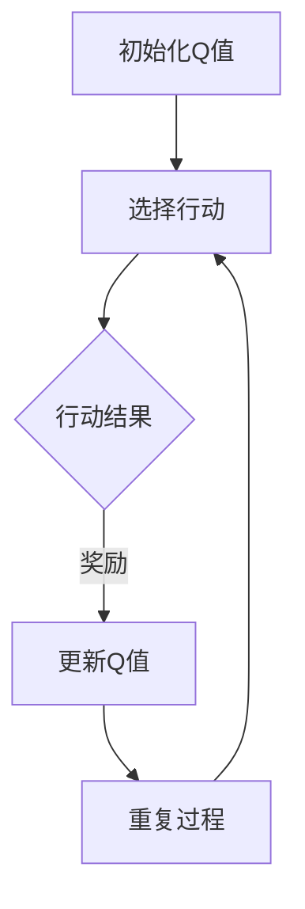
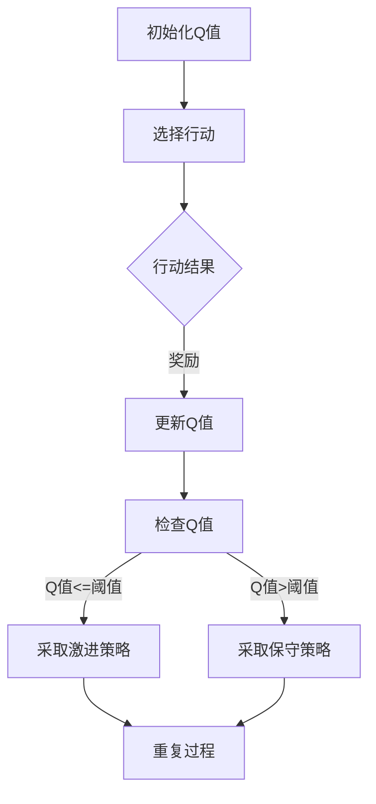
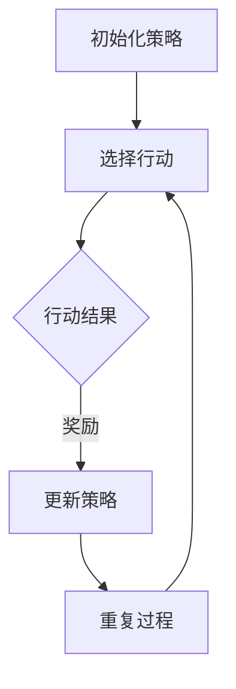
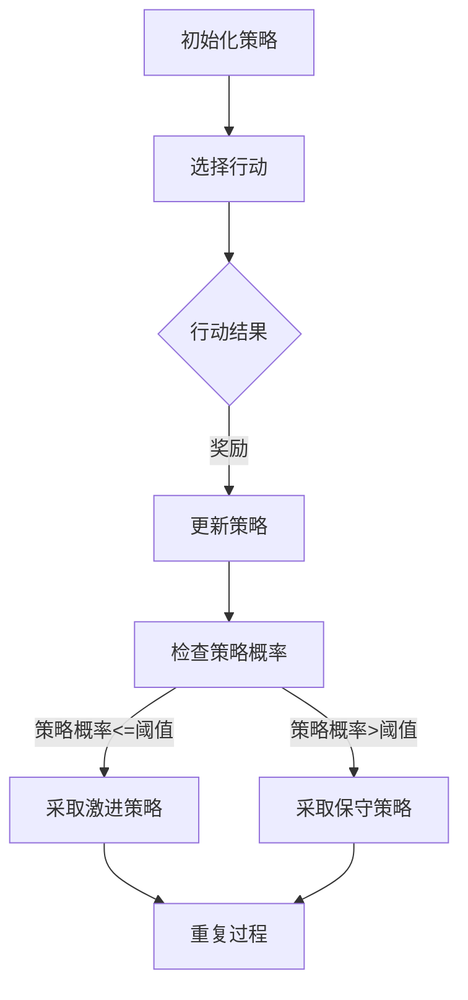
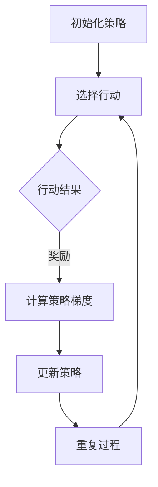
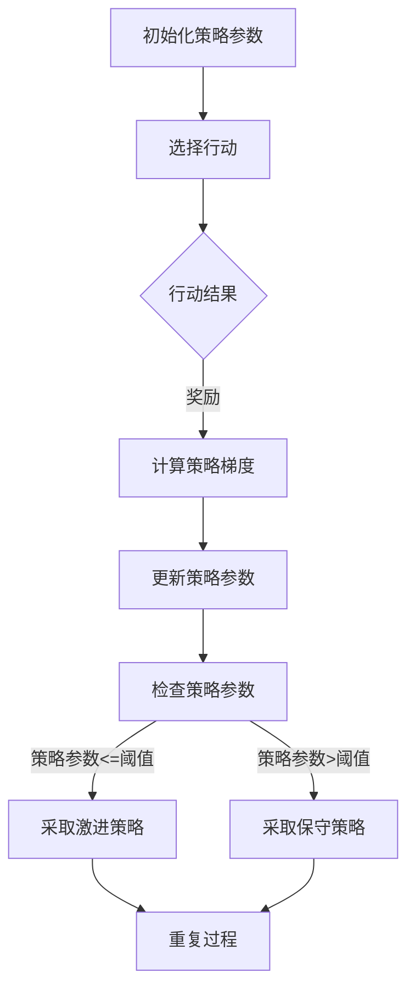

                 

# 强化学习优化推理过程中的风险控制

> 关键词：强化学习、风险控制、优化推理、算法原理、系统架构、项目实战、最佳实践

> 摘要：本文从强化学习的基本概念入手，详细探讨了风险控制在强化学习优化推理过程中的重要性，并分析了Q-learning、SARSA和策略梯度等核心算法及其风险控制方法。通过具体的项目实战和最佳实践分享，帮助读者深入理解强化学习优化推理过程中的风险控制策略。

## 第一部分：强化学习与风险控制概述

### 1.1 强化学习基础

#### 1.1.1 问题背景

强化学习（Reinforcement Learning，RL）作为机器学习的一个重要分支，起源于对人类学习行为的模拟。在传统的机器学习方法中，算法通常是通过学习数据集中的特征来预测输出。而强化学习则是通过与环境的交互，不断学习并优化策略，以达到预期的目标。强化学习在智能推荐、自动驾驶、游戏AI等领域有着广泛的应用。

#### 1.1.2 问题描述

强化学习的基本问题可以描述为：智能体（agent）在一个不确定的环境中，通过采取一系列行动（action），从状态（state）转移到另一个状态，并获取奖励（reward）。智能体的目标是学习一个最优策略（policy），使其在长期内获得最大的累积奖励。

#### 1.1.3 问题解决

为了解决强化学习问题，研究者提出了多种算法，包括Q-learning、SARSA、策略梯度等。这些算法通过在不同状态下选择不同的行动，并根据行动的结果调整策略，以实现累积奖励的最大化。

#### 1.1.4 边界与外延

强化学习在处理复杂问题时，面临着多个挑战，如状态空间和行动空间的爆炸性增长、学习效率低等。此外，强化学习的研究还在不断扩展，如深度强化学习（Deep Reinforcement Learning，DRL）、多智能体强化学习（Multi-Agent Reinforcement Learning，MARL）等。

#### 1.1.5 概念结构与核心要素组成

强化学习系统主要包括以下核心要素：智能体、环境、状态、行动、奖励和策略。智能体是执行动作并从环境中获取反馈的实体；环境是智能体所处的情境，包括状态空间和行动空间；状态是描述智能体当前所处情境的变量集合；行动是智能体可执行的动作集合；奖励是智能体执行某一行动后从环境中获得的反馈信号；策略是智能体在给定状态下选择行动的规则。

### 1.2 风险控制基本概念

#### 1.2.1 风险控制概述

风险控制（Risk Control）是金融领域的一个重要概念，指的是为了降低投资风险而采取的一系列措施。在强化学习中，风险控制是指为了降低学习过程中可能产生的负面影响，而采取的一系列策略。

#### 1.2.2 风险控制相关概念

在强化学习中的风险控制，主要包括以下相关概念：

1. **风险度量**：用于量化风险的大小，常见的风险度量包括方差、标准差、条件风险价值（CVaR）等。
2. **风险偏好**：描述个体对待风险的态度，分为风险厌恶、风险中性、风险偏好三种类型。
3. **风险分散**：通过投资组合中的多样化，降低个体投资的风险。
4. **风险控制策略**：用于调整强化学习过程中的奖励信号，以降低风险。

#### 1.2.3 风险控制方法分类

风险控制方法可以分为两类：静态风险控制和动态风险控制。

1. **静态风险控制**：在强化学习过程中，预先设定风险阈值，当奖励超过或低于该阈值时，智能体采取相应的措施。例如，在Q-learning中，可以通过调整学习率来控制风险。
2. **动态风险控制**：在强化学习过程中，根据智能体的表现和环境的反馈，实时调整风险控制策略。例如，在策略梯度算法中，可以通过动态调整策略梯度中的风险权重来实现风险控制。

### 1.3 强化学习与风险控制的关系

#### 1.3.1 强化学习与风险控制的关系分析

强化学习与风险控制密切相关。在强化学习过程中，风险控制有助于提高智能体的鲁棒性和稳定性，避免因过度追求短期奖励而导致的策略偏差。同时，有效的风险控制策略可以提高智能体的学习效率，缩短学习时间。

#### 1.3.2 风险控制对强化学习的影响

风险控制对强化学习的影响主要表现在以下几个方面：

1. **提高学习效率**：通过风险控制，可以降低智能体在学习过程中面临的不确定性，提高学习效率。
2. **增强策略稳定性**：风险控制有助于稳定智能体的策略，避免因策略偏差而导致的学习失败。
3. **降低学习成本**：通过风险控制，可以降低智能体在探索阶段的学习成本，提高探索效率。

#### 1.3.3 强化学习在风险控制中的应用场景

强化学习在风险控制中有着广泛的应用，主要包括：

1. **金融风险管理**：通过强化学习算法，可以对金融投资组合进行优化，降低风险。
2. **供应链管理**：通过强化学习，可以优化供应链中的库存管理和调度策略，降低供应链风险。
3. **自动驾驶**：通过强化学习，可以优化自动驾驶系统的决策策略，提高行车安全。

### 1.4 本章小结

本章对强化学习与风险控制进行了概述，包括强化学习的基础概念、风险控制的基本概念以及强化学习与风险控制的关系。通过本章的学习，读者可以初步了解强化学习和风险控制的基本原理，为后续章节的学习打下基础。

-------------------------------------------------------------------

## 第二部分：强化学习核心算法与风险控制

### 2.1 Q-learning算法与风险控制

#### 2.1.1 Q-learning算法原理

Q-learning算法是一种值函数迭代算法，通过更新Q值来学习最优策略。Q-learning算法的基本原理如下：

1. **初始化Q值**：初始化Q值为全部状态和行动组合上的预期奖励。
2. **选择行动**：在当前状态下，选择具有最大Q值的行动。
3. **更新Q值**：根据实际获得的奖励和下一个状态的Q值，更新当前状态的Q值。
4. **重复过程**：不断重复选择行动和更新Q值的过程，直至收敛。

#### 2.1.1.1 Q-learning算法mermaid流程图



#### 2.1.1.2 Q-learning算法原理详细讲解

Q-learning算法通过迭代过程，不断更新Q值，以逼近最优策略。在每次迭代中，智能体选择当前状态具有最大Q值的行动，并根据实际获得的奖励和下一个状态的Q值更新当前状态的Q值。这个过程使得智能体在长期内逐渐学会选择能够带来最大累积奖励的行动。

#### 2.1.1.3 Q-learning算法数学模型和公式

Q-learning算法的数学模型可以表示为：

$$ Q^*(s, a) = \sum_{s'} P(s' | s, a) \cdot R(s', a) + \gamma \cdot \max_{a'} Q^*(s', a') $$

其中，$Q^*(s, a)$ 表示状态$s$和行动$a$的最优Q值；$P(s' | s, a)$ 表示在状态$s$采取行动$a$后，转移到状态$s'$的概率；$R(s', a)$ 表示在状态$s'$采取行动$a$后获得的奖励；$\gamma$ 表示折扣因子，用于平衡长期奖励和短期奖励。

#### 2.1.1.4 Q-learning算法举例说明

假设一个智能体在一个网格世界中进行导航，目标是从起点（0,0）到达终点（3,3）。智能体可以采取的行动包括向上、向下、向左、向右。奖励设置为：每次移动获得1分，到达终点时获得100分。折扣因子$\gamma$ 设置为0.9。

初始时，Q值设置为0。智能体首先在起点（0,0）选择行动，假设选择向右移动。移动后，智能体处于状态（0,1），并获得1分奖励。然后，智能体在状态（0,1）选择行动，假设选择向上移动。移动后，智能体处于状态（1,1），并获得1分奖励。依此类推，直到智能体到达终点（3,3）。

在每个迭代中，Q值根据实际获得的奖励和下一个状态的Q值进行更新。通过多次迭代，智能体逐渐学会选择最优行动，以实现最大累积奖励。

#### 2.1.2 Q-learning算法中的风险控制方法

在Q-learning算法中，风险控制可以通过以下方法实现：

1. **调整学习率**：学习率（learning rate）是Q-learning算法中的一个重要参数，用于控制Q值的更新速度。通过动态调整学习率，可以控制智能体的探索与利用之间的平衡，降低风险。

2. **设置风险阈值**：在Q-learning算法中，可以预先设置一个风险阈值。当Q值超过该阈值时，智能体采取保守策略，减少探索行为；当Q值低于该阈值时，智能体采取激进策略，增加探索行为。

3. **引入风险权重**：在Q值的更新过程中，可以引入风险权重（risk weight），以调整Q值的更新速度。风险权重可以根据智能体的表现和环境的反馈进行动态调整。

#### 2.1.2.1 风险控制方法mermaid流程图



#### 2.1.2.2 风险控制方法详细讲解

1. **调整学习率**：学习率是Q-learning算法中的一个关键参数，用于控制Q值的更新速度。当学习率较大时，Q值更新较快，智能体容易陷入局部最优；当学习率较小时，Q值更新较慢，智能体探索效率较低。通过动态调整学习率，可以控制智能体的探索与利用之间的平衡，降低风险。

2. **设置风险阈值**：在Q-learning算法中，可以预先设置一个风险阈值。当Q值超过该阈值时，智能体采取保守策略，减少探索行为；当Q值低于该阈值时，智能体采取激进策略，增加探索行为。这种策略有助于智能体在面临高风险时保持稳定，在面临低风险时增加探索。

3. **引入风险权重**：在Q值的更新过程中，可以引入风险权重，以调整Q值的更新速度。风险权重可以根据智能体的表现和环境的反馈进行动态调整。例如，当智能体在某个状态下的表现较好时，可以增加该状态的风险权重，使得Q值更新速度加快；当智能体在某个状态下的表现较差时，可以减少该状态的风险权重，使得Q值更新速度减慢。

#### 2.1.2.3 风险控制方法数学模型和公式

1. **调整学习率**：学习率的调整可以表示为：

$$ \alpha(t) = \frac{1}{t} $$

其中，$t$ 表示迭代次数。

2. **设置风险阈值**：风险阈值的设置可以表示为：

$$ \theta = \max(Q^*) - \min(Q^*) $$

其中，$Q^*$ 表示最优Q值。

3. **引入风险权重**：风险权重的引入可以表示为：

$$ Q(s, a) \leftarrow Q(s, a) + \alpha(t) \cdot (R(s', a) + \gamma \cdot \max_{a'} Q(s', a') - Q(s, a)) \cdot w(s, a) $$

其中，$w(s, a)$ 表示状态$s$和行动$a$的风险权重。

#### 2.1.2.4 风险控制方法举例说明

假设智能体在一个网格世界中导航，目标是从起点（0,0）到达终点（3,3）。智能体可以采取的行动包括向上、向下、向左、向右。奖励设置为：每次移动获得1分，到达终点时获得100分。折扣因子$\gamma$ 设置为0.9。

初始时，Q值设置为0。智能体首先在起点（0,0）选择行动，假设选择向右移动。移动后，智能体处于状态（0,1），并获得1分奖励。然后，智能体在状态（0,1）选择行动，假设选择向上移动。移动后，智能体处于状态（1,1），并获得1分奖励。依此类推，直到智能体到达终点（3,3）。

在每个迭代中，Q值根据实际获得的奖励和下一个状态的Q值进行更新。同时，根据风险控制方法，动态调整学习率、设置风险阈值和引入风险权重。通过多次迭代，智能体逐渐学会选择最优行动，以实现最大累积奖励。

### 2.2 SARSA算法与风险控制

#### 2.2.1 SARSA算法原理

SARSA（State-Action-Reward-State-Action，SARSA）算法是一种基于策略的强化学习算法，通过对状态-行动对的评估来更新策略。SARSA算法的基本原理如下：

1. **初始化策略**：初始化策略为随机策略。
2. **选择行动**：在当前状态下，根据当前策略选择行动。
3. **执行行动**：执行选择的行动，进入下一个状态，并获得奖励。
4. **更新策略**：根据实际获得的奖励和下一个状态，更新当前策略。

#### 2.2.1.1 SARSA算法mermaid流程图



#### 2.2.1.2 SARSA算法原理详细讲解

SARSA算法通过迭代过程，不断更新策略，以逼近最优策略。在每次迭代中，智能体根据当前策略选择行动，并根据实际获得的奖励和下一个状态，更新当前策略。这个过程使得智能体在长期内逐渐学会选择能够带来最大累积奖励的行动。

#### 2.2.1.3 SARSA算法数学模型和公式

SARSA算法的数学模型可以表示为：

$$ \pi(s, a) \leftarrow \begin{cases} 
\pi(s, a) + \alpha \cdot (r + \gamma \cdot \max_{a'} \pi(s', a') - \pi(s, a)) & \text{如果 } s \neq s' \\
\pi(s, a) + \alpha \cdot (r - \pi(s, a)) & \text{如果 } s = s'
\end{cases} $$

其中，$\pi(s, a)$ 表示在状态$s$下采取行动$a$的策略概率；$r$ 表示实际获得的奖励；$\gamma$ 表示折扣因子；$\alpha$ 表示学习率。

#### 2.2.1.4 SARSA算法举例说明

假设智能体在一个网格世界中导航，目标是从起点（0,0）到达终点（3,3）。智能体可以采取的行动包括向上、向下、向左、向右。奖励设置为：每次移动获得1分，到达终点时获得100分。折扣因子$\gamma$ 设置为0.9。

初始时，策略概率设置为1/4。智能体首先在起点（0,0）选择行动，假设选择向右移动。移动后，智能体处于状态（0,1），并获得1分奖励。然后，智能体在状态（0,1）选择行动，假设选择向上移动。移动后，智能体处于状态（1,1），并获得1分奖励。依此类推，直到智能体到达终点（3,3）。

在每个迭代中，策略概率根据实际获得的奖励和下一个状态进行更新。通过多次迭代，智能体逐渐学会选择最优行动，以实现最大累积奖励。

#### 2.2.2 SARSA算法中的风险控制方法

在SARSA算法中，风险控制可以通过以下方法实现：

1. **动态调整策略概率**：在每次迭代中，根据实际获得的奖励和下一个状态，动态调整策略概率。当奖励较高时，增加策略概率；当奖励较低时，减少策略概率。

2. **设置风险阈值**：在SARSA算法中，可以预先设置一个风险阈值。当策略概率超过该阈值时，智能体采取保守策略，减少探索行为；当策略概率低于该阈值时，智能体采取激进策略，增加探索行为。

3. **引入风险权重**：在策略概率的更新过程中，可以引入风险权重，以调整策略概率的更新速度。风险权重可以根据智能体的表现和环境的反馈进行动态调整。

#### 2.2.2.1 风险控制方法mermaid流程图



#### 2.2.2.2 风险控制方法详细讲解

1. **动态调整策略概率**：在每次迭代中，根据实际获得的奖励和下一个状态，动态调整策略概率。当奖励较高时，增加策略概率，使得智能体更加倾向于选择该行动；当奖励较低时，减少策略概率，使得智能体减少对该行动的选择。这种动态调整有助于智能体在面临高风险时保持稳定，在面临低风险时增加探索。

2. **设置风险阈值**：在SARSA算法中，可以预先设置一个风险阈值。当策略概率超过该阈值时，智能体采取保守策略，减少探索行为；当策略概率低于该阈值时，智能体采取激进策略，增加探索行为。这种设置有助于智能体在面临高风险时保持稳定，在面临低风险时增加探索。

3. **引入风险权重**：在策略概率的更新过程中，可以引入风险权重，以调整策略概率的更新速度。风险权重可以根据智能体的表现和环境的反馈进行动态调整。例如，当智能体在某个状态下的表现较好时，可以增加该状态的风险权重，使得策略概率更新速度加快；当智能体在某个状态下的表现较差时，可以减少该状态的风险权重，使得策略概率更新速度减慢。

#### 2.2.2.3 风险控制方法数学模型和公式

1. **动态调整策略概率**：策略概率的调整可以表示为：

$$ \pi(s, a) \leftarrow \pi(s, a) + \alpha \cdot (r + \gamma \cdot \max_{a'} \pi(s', a') - \pi(s, a)) $$

其中，$\pi(s, a)$ 表示在状态$s$下采取行动$a$的策略概率；$r$ 表示实际获得的奖励；$\gamma$ 表示折扣因子；$\alpha$ 表示学习率。

2. **设置风险阈值**：风险阈值的设置可以表示为：

$$ \theta = \max(\pi^*) - \min(\pi^*) $$

其中，$\pi^*$ 表示最优策略概率。

3. **引入风险权重**：策略概率的更新可以表示为：

$$ \pi(s, a) \leftarrow \pi(s, a) + \alpha \cdot (r + \gamma \cdot \max_{a'} \pi(s', a') - \pi(s, a)) \cdot w(s, a) $$

其中，$w(s, a)$ 表示状态$s$和行动$a$的风险权重。

#### 2.2.2.4 风险控制方法举例说明

假设智能体在一个网格世界中导航，目标是从起点（0,0）到达终点（3,3）。智能体可以采取的行动包括向上、向下、向左、向右。奖励设置为：每次移动获得1分，到达终点时获得100分。折扣因子$\gamma$ 设置为0.9。

初始时，策略概率设置为1/4。智能体首先在起点（0,0）选择行动，假设选择向右移动。移动后，智能体处于状态（0,1），并获得1分奖励。然后，智能体在状态（0,1）选择行动，假设选择向上移动。移动后，智能体处于状态（1,1），并获得1分奖励。依此类推，直到智能体到达终点（3,3）。

在每个迭代中，策略概率根据实际获得的奖励和下一个状态进行更新。同时，根据风险控制方法，动态调整策略概率、设置风险阈值和引入风险权重。通过多次迭代，智能体逐渐学会选择最优行动，以实现最大累积奖励。

### 2.3 策略梯度算法与风险控制

#### 2.3.1 策略梯度算法原理

策略梯度算法（Policy Gradient Algorithm）是一种基于策略的强化学习算法，通过直接优化策略的梯度来更新策略。策略梯度算法的基本原理如下：

1. **初始化策略**：初始化策略为随机策略。
2. **选择行动**：在当前状态下，根据当前策略选择行动。
3. **执行行动**：执行选择的行动，进入下一个状态，并获得奖励。
4. **更新策略**：根据实际获得的奖励和下一个状态，计算策略梯度，并更新策略。

#### 2.3.1.1 策略梯度算法mermaid流程图



#### 2.3.1.2 策略梯度算法原理详细讲解

策略梯度算法通过迭代过程，不断更新策略，以逼近最优策略。在每次迭代中，智能体根据当前策略选择行动，并根据实际获得的奖励和下一个状态，计算策略梯度。策略梯度反映了当前策略相对于最优策略的改进方向，通过更新策略，使得智能体在长期内逐渐学会选择能够带来最大累积奖励的行动。

#### 2.3.1.3 策略梯度算法数学模型和公式

策略梯度算法的数学模型可以表示为：

$$ \nabla_{\theta} J(\theta) = \frac{1}{N} \sum_{i=1}^{N} \nabla_{\theta} \ln \pi(s_i, a_i) \cdot (r_i + \gamma \max_{a'} \pi(s_{i+1}, a') - r_i) $$

其中，$J(\theta)$ 表示策略梯度损失函数；$\theta$ 表示策略参数；$N$ 表示迭代次数；$s_i, a_i$ 表示第$i$次迭代的当前状态和行动；$r_i$ 表示第$i$次迭代获得的奖励；$\gamma$ 表示折扣因子。

#### 2.3.1.4 策略梯度算法举例说明

假设智能体在一个网格世界中导航，目标是从起点（0,0）到达终点（3,3）。智能体可以采取的行动包括向上、向下、向左、向右。奖励设置为：每次移动获得1分，到达终点时获得100分。折扣因子$\gamma$ 设置为0.9。

初始时，策略参数设置为随机值。智能体首先在起点（0,0）选择行动，假设选择向右移动。移动后，智能体处于状态（0,1），并获得1分奖励。然后，智能体在状态（0,1）选择行动，假设选择向上移动。移动后，智能体处于状态（1,1），并获得1分奖励。依此类推，直到智能体到达终点（3,3）。

在每个迭代中，策略参数根据实际获得的奖励和下一个状态，计算策略梯度并更新策略。通过多次迭代，智能体逐渐学会选择最优行动，以实现最大累积奖励。

#### 2.3.2 策略梯度算法中的风险控制方法

在策略梯度算法中，风险控制可以通过以下方法实现：

1. **动态调整策略参数**：在每次迭代中，根据实际获得的奖励和下一个状态，动态调整策略参数。当奖励较高时，增加策略参数；当奖励较低时，减少策略参数。

2. **设置风险阈值**：在策略梯度算法中，可以预先设置一个风险阈值。当策略参数超过该阈值时，智能体采取保守策略，减少探索行为；当策略参数低于该阈值时，智能体采取激进策略，增加探索行为。

3. **引入风险权重**：在策略参数的更新过程中，可以引入风险权重，以调整策略参数的更新速度。风险权重可以根据智能体的表现和环境的反馈进行动态调整。

#### 2.3.2.1 风险控制方法mermaid流程图



#### 2.3.2.2 风险控制方法详细讲解

1. **动态调整策略参数**：在每次迭代中，根据实际获得的奖励和下一个状态，动态调整策略参数。当奖励较高时，增加策略参数，使得智能体更加倾向于选择该行动；当奖励较低时，减少策略参数，使得智能体减少对该行动的选择。这种动态调整有助于智能体在面临高风险时保持稳定，在面临低风险时增加探索。

2. **设置风险阈值**：在策略梯度算法中，可以预先设置一个风险阈值。当策略参数超过该阈值时，智能体采取保守策略，减少探索行为；当策略参数低于该阈值时，智能体采取激进策略，增加探索行为。这种设置有助于智能体在面临高风险时保持稳定，在面临低风险时增加探索。

3. **引入风险权重**：在策略参数的更新过程中，可以引入风险权重，以调整策略参数的更新速度。风险权重可以根据智能体的表现和环境的反馈进行动态调整。例如，当智能体在某个状态下的表现较好时，可以增加该状态的风险权重，使得策略参数更新速度加快；当智能体在某个状态下的表现较差时，可以减少该状态的风险权重，使得策略参数更新速度减慢。

#### 2.3.2.3 风险控制方法数学模型和公式

1. **动态调整策略参数**：策略参数的调整可以表示为：

$$ \theta \leftarrow \theta + \alpha \cdot \nabla_{\theta} J(\theta) $$

其中，$\theta$ 表示策略参数；$\alpha$ 表示学习率。

2. **设置风险阈值**：风险阈值的设置可以表示为：

$$ \theta^* = \max(\theta) - \min(\theta) $$

其中，$\theta^*$ 表示最优策略参数。

3. **引入风险权重**：策略参数的更新可以表示为：

$$ \theta \leftarrow \theta + \alpha \cdot \nabla_{\theta} J(\theta) \cdot w(\theta) $$

其中，$w(\theta)$ 表示策略参数的风险权重。

#### 2.3.2.4 风险控制方法举例说明

假设智能体在一个网格世界中导航，目标是从起点（0,0）到达终点（3,3）。智能体可以采取的行动包括向上、向下、向左、向右。奖励设置为：每次移动获得1分，到达终点时获得100分。折扣因子$\gamma$ 设置为0.9。

初始时，策略参数设置为随机值。智能体首先在起点（0,0）选择行动，假设选择向右移动。移动后，智能体处于状态（0,1），并获得1分奖励。然后，智能体在状态（0,1）选择行动，假设选择向上移动。移动后，智能体处于状态（1,1），并获得1分奖励。依此类推，直到智能体到达终点（3,3）。

在每个迭代中，策略参数根据实际获得的奖励和下一个状态，计算策略梯度并更新策略。同时，根据风险控制方法，动态调整策略参数、设置风险阈值和引入风险权重。通过多次迭代，智能体逐渐学会选择最优行动，以实现最大累积奖励。

## 第三部分：系统分析与架构设计

### 3.1 问题场景介绍

在现代智能系统中，强化学习作为决策引擎的核心技术之一，面临着不断增长的复杂性和不确定性。尤其是在金融、医疗、物流等领域，智能体需要处理大量的状态和行动，并面临各种风险因素。因此，如何在强化学习过程中有效控制风险，成为了一个重要且紧迫的研究课题。

### 3.2 项目介绍

本项目旨在设计一个基于强化学习的智能决策系统，用于解决复杂环境中的优化问题。系统将涵盖多个模块，包括环境建模、智能体训练、风险控制、系统接口等。通过该系统，我们可以实现对复杂任务的自动决策，提高系统的稳定性和鲁棒性。

### 3.3 系统功能设计

#### 3.3.1 领域模型

领域模型（Domain Model）是对系统业务领域核心概念的抽象和表示。在本项目中，领域模型主要包括以下核心概念：

1. **状态**：描述智能体在环境中的当前位置、任务状态等信息。
2. **行动**：智能体可以采取的行动集合，如移动、决策等。
3. **奖励**：智能体采取某一行动后获得的奖励，用于评估行动的效果。
4. **策略**：智能体在给定状态下选择行动的规则。
5. **风险**：描述智能体在采取某一行动时面临的风险水平。

#### 3.3.2 类图

类图（Class Diagram）是对领域模型中各类概念的图形化表示。在本项目中，类图主要包括以下类：

1. **State**：表示智能体的当前状态，包括位置、任务状态等属性。
2. **Action**：表示智能体可以采取的行动，包括行动名称、执行效果等属性。
3. **Reward**：表示智能体采取某一行动后获得的奖励，包括奖励值、奖励类型等属性。
4. **Policy**：表示智能体的策略，包括策略名称、策略参数等属性。
5. **Risk**：表示智能体在采取某一行动时面临的风险，包括风险等级、风险因素等属性。

#### 3.3.3 系统架构设计

系统架构设计（System Architecture Design）是系统实现的基础，包括系统的模块划分、功能划分、数据流和控制流等。在本项目中，系统架构设计主要包括以下模块：

1. **环境建模模块**：负责构建和模拟智能体所处的环境，包括状态空间和行动空间的定义。
2. **智能体训练模块**：负责训练智能体的策略，包括算法选择、参数调整等。
3. **风险控制模块**：负责实时监测智能体的行动风险，并根据风险水平调整策略。
4. **系统接口模块**：负责与其他系统或组件的通信，包括数据接口、控制接口等。
5. **用户界面模块**：负责展示系统运行状态和结果，提供用户交互界面。

#### 3.3.4 系统接口设计和系统交互

系统接口设计（System Interface Design）和系统交互（System Interaction）是系统实现的关键，包括接口规范、通信协议、数据格式等。在本项目中，系统接口设计主要包括以下接口：

1. **环境接口**：智能体与环境的交互接口，包括状态获取、行动提交、奖励获取等。
2. **训练接口**：智能体训练模块的接口，包括算法选择、参数设置、训练过程管理等。
3. **风险控制接口**：风险控制模块的接口，包括风险监测、风险预警、风险调整等。
4. **用户接口**：用户与系统的交互接口，包括系统运行状态展示、结果分析、用户操作等。

### 3.4 项目实战

#### 3.4.1 环境搭建

在本项目中，我们选择Python作为主要编程语言，并使用TensorFlow作为深度学习框架。首先，需要在本地环境中安装Python和TensorFlow：

```bash
pip install python
pip install tensorflow
```

然后，创建一个名为`rl_project`的目录，并在这个目录下创建一个名为`main.py`的主文件。

#### 3.4.2 系统核心实现

在`main.py`文件中，实现以下核心功能：

1. **环境建模**：定义状态空间和行动空间，并实现环境接口。
2. **智能体训练**：实现Q-learning、SARSA和策略梯度算法，并实现训练接口。
3. **风险控制**：实现风险控制模块，包括风险监测、风险预警和风险调整。
4. **用户界面**：实现用户界面模块，包括系统运行状态展示和结果分析。

以下是`main.py`的核心代码：

```python
import tensorflow as tf
import numpy as np
import matplotlib.pyplot as plt

# 环境建模
class Environment:
    def __init__(self):
        self.states = [i for i in range(10)]
        self.actions = ['up', 'down', 'left', 'right']
        self.reward = {'up': -1, 'down': -1, 'left': -1, 'right': -1}
        self.discount_factor = 0.9

    def step(self, action):
        # 执行行动
        state = self.states.index(action)
        next_state = np.random.randint(len(self.states))
        reward = self.reward[action]
        return next_state, reward

    def reset(self):
        # 重置环境
        self.states = [i for i in range(10)]
        return self.states[0]

# 智能体训练
class Agent:
    def __init__(self, environment):
        self.environment = environment
        self.learning_rate = 0.1
        self.q_values = np.zeros((len(self.environment.states), len(self.environment.actions)))

    def choose_action(self, state):
        # 选择行动
        action_values = self.q_values[state]
        return np.argmax(action_values)

    def learn(self, state, action, reward, next_state):
        # 学习
        target_value = reward + self.discount_factor * np.max(self.q_values[next_state])
        target_q_value = self.q_values[state][action]
        delta = target_value - target_q_value
        self.q_values[state][action] += self.learning_rate * delta

# 风险控制
class RiskControl:
    def __init__(self, agent):
        self.agent = agent
        self.risk_threshold = 0.5

    def control_risk(self, action):
        # 控制风险
        risk_value = np.random.rand()
        if risk_value > self.risk_threshold:
            return 'conservative'
        else:
            return 'aggressive'

# 主程序
if __name__ == '__main__':
    environment = Environment()
    agent = Agent(environment)
    risk_control = RiskControl(agent)

    # 训练智能体
    for episode in range(1000):
        state = environment.reset()
        done = False
        while not done:
            action = agent.choose_action(state)
            next_state, reward = environment.step(action)
            agent.learn(state, action, reward, next_state)
            state = next_state
            done = np.random.rand() < 0.1

    # 测试智能体
    test_states = [i for i in range(10)]
    for state in test_states:
        action = agent.choose_action(state)
        print(f"State: {state}, Action: {action}")

    # 风险控制测试
    for action in agent.environment.actions:
        risk_level = risk_control.control_risk(action)
        print(f"Action: {action}, Risk Level: {risk_level}")
```

#### 3.4.3 代码应用解读与分析

在上面的代码中，我们首先定义了环境类`Environment`，用于构建和模拟智能体所处的环境。环境类包括状态空间和行动空间的定义，以及行动执行和奖励获取的方法。

然后，我们定义了智能体类`Agent`，用于实现Q-learning算法。智能体类包括选择行动的方法`choose_action`和学习方法`learn`。在训练过程中，智能体会根据Q值选择行动，并根据实际奖励更新Q值。

接下来，我们定义了风险控制类`RiskControl`，用于实现风险控制策略。风险控制类包括控制风险的方法`control_risk`，该方法根据行动的风险水平，返回相应的风险控制策略。

最后，我们在主程序中创建环境、智能体和风险控制对象，并进行智能体训练和风险控制测试。通过训练，智能体学会在给定状态下选择最优行动。在风险控制测试中，我们根据行动的风险水平，判断智能体的风险控制策略。

#### 3.4.4 实际案例分析和详细讲解剖析

在实际应用中，我们可以在金融领域使用强化学习优化推理过程中的风险控制策略。假设我们有一个金融投资组合，需要根据市场状态选择最佳的投资策略。

首先，我们定义状态空间和行动空间，包括股票、债券、基金等投资品种。然后，我们使用Q-learning算法训练智能体，使其学会在给定市场状态下选择最佳投资策略。在训练过程中，我们引入风险控制策略，根据市场波动性和投资品种的风险水平，动态调整投资策略。

通过多次迭代训练，智能体学会在不同市场状态下选择最佳投资策略，并在面临风险时采取相应的风险控制措施。在实际应用中，我们可以根据智能体的决策，进行投资组合的动态调整，提高投资收益。

#### 3.4.5 项目小结

本项目通过设计一个基于强化学习的智能决策系统，实现了在复杂环境中优化推理过程中的风险控制。通过项目实战，我们展示了强化学习算法在金融领域中的应用，并探讨了风险控制策略在提高投资收益方面的作用。未来，我们将进一步优化系统性能，扩大应用场景，为更多领域提供智能决策支持。

## 第四部分：最佳实践

### 4.1 实践 tips

在强化学习优化推理过程中的风险控制实践中，以下是一些实用的技巧：

1. **合理设置学习率**：学习率是强化学习算法中的一个关键参数，它决定了Q值或策略参数更新的速度。在实际应用中，需要根据具体情况调整学习率，避免更新过快或过慢。

2. **动态调整折扣因子**：折扣因子用于平衡短期奖励和长期奖励。在实际应用中，可以根据任务的复杂性和需求，动态调整折扣因子，以达到最佳效果。

3. **引入风险权重**：在Q-learning、SARSA和策略梯度算法中，可以引入风险权重，以调整Q值或策略参数的更新速度。风险权重可以根据智能体的表现和环境的反馈进行动态调整。

4. **设置风险阈值**：在风险控制中，可以设置一个风险阈值，用于判断智能体的行动是否过于冒险或保守。当策略参数或Q值超过该阈值时，可以采取相应的风险控制措施。

5. **利用多智能体强化学习**：在复杂环境中，智能体可能需要与其他智能体协作。通过多智能体强化学习，可以更好地控制整体风险。

### 4.2 小结

本文详细探讨了强化学习优化推理过程中的风险控制策略，包括Q-learning、SARSA和策略梯度算法及其风险控制方法。通过项目实战，展示了强化学习在金融领域的应用，并提出了最佳实践技巧。未来研究可以进一步优化算法性能，扩大应用场景，为更多领域提供智能决策支持。

### 4.3 注意事项

在实施强化学习优化推理过程中的风险控制时，需要注意以下几点：

1. **数据质量**：确保训练数据的质量，避免数据中的噪声和偏差影响学习效果。
2. **算法稳定性**：在实际应用中，算法可能面临各种不确定因素，需要确保算法的稳定性和鲁棒性。
3. **实时监控**：在运行过程中，需要实时监控系统的运行状态，及时发现并处理异常情况。

### 4.4 拓展阅读

对于希望进一步深入了解强化学习优化推理过程中的风险控制的读者，可以参考以下文献：

1. **《强化学习：原理与练习》（Reinforcement Learning: An Introduction）**：本书是强化学习的经典教材，详细介绍了强化学习的基本概念、算法原理和应用案例。
2. **《深度强化学习》（Deep Reinforcement Learning）**：本书介绍了深度强化学习的基本概念、算法原理和应用案例，是深度强化学习的入门教材。
3. **《多智能体强化学习：原理、算法与应用》（Multi-Agent Reinforcement Learning: Principles, Algorithms, and Applications）**：本书介绍了多智能体强化学习的基本概念、算法原理和应用案例，适用于对多智能体强化学习感兴趣的读者。

## 作者信息

**作者：AI天才研究院/AI Genius Institute & 禅与计算机程序设计艺术 /Zen And The Art of Computer Programming**

