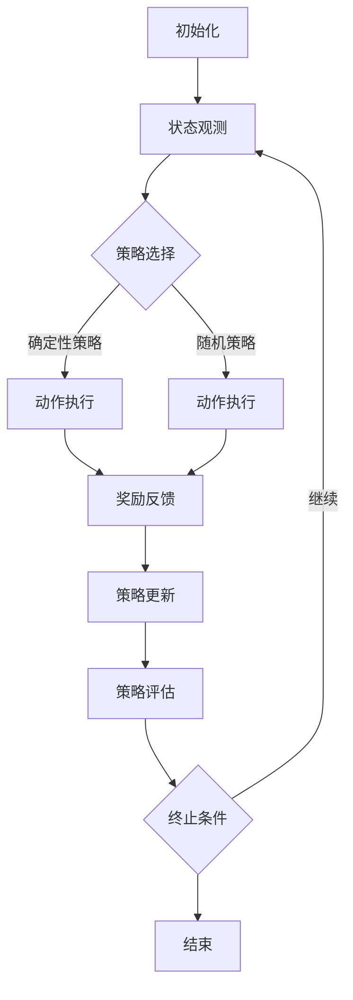
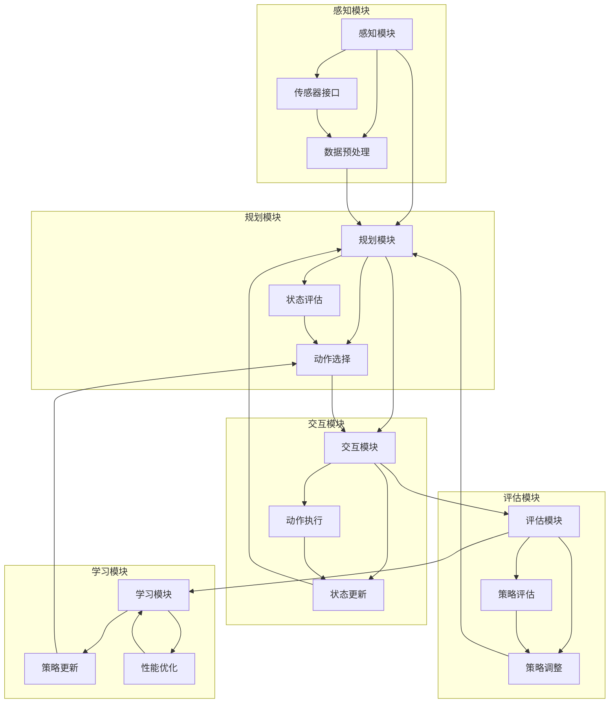
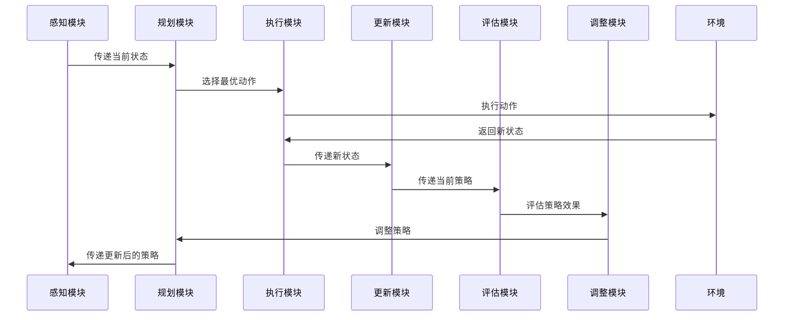

                 


### 目录大纲示例

```markdown
----------------------------------------------------------------
# 目录大纲

# 第1章: 强化学习基础

## 1.1 强化学习概述
### 1.1.1 强化学习的基本概念
### 1.1.2 强化学习的发展历程
### 1.1.3 强化学习在智能系统中的应用

## 1.2 强化学习的基本概念
### 1.2.1 奖励函数
### 1.2.2 状态和动作
### 1.2.3 策略和价值函数

## 1.3 强化学习的主要算法
### 1.3.1 Q-Learning算法
### 1.3.2 SARSA算法
### 1.3.3 Deep Q-Network (DQN)算法

# 第2章: 自适应推理原理

## 2.1 自适应推理的概念
### 2.1.1 自适应推理的定义
### 2.1.2 自适应推理的关键技术

## 2.2 自适应推理的关键技术
### 2.2.1 机器学习与深度学习
### 2.2.2 模型优化与自适应调整

## 2.3 强化学习与自适应推理的结合
### 2.3.1 强化学习在自适应推理中的应用
### 2.3.2 自适应推理在强化学习中的应用

# 第3章: 强化学习驱动的自适应推理算法

## 3.1 算法概述
### 3.1.1 算法的基本框架
### 3.1.2 算法的优势和局限

## 3.2 算法流程与Mermaid流程图
### 3.2.1 算法的基本流程
### 3.2.2 Mermaid流程图展示

## 3.3 Python源代码与LaTeX公式详细讲解
### 3.3.1 Python源代码实现
### 3.3.2 LaTeX公式解析

## 3.4 举例说明
### 3.4.1 算法应用场景
### 3.4.2 举例分析

# 第4章: 系统分析与架构设计

## 4.1 系统功能设计
### 4.1.1 系统功能概述
### 4.1.2 领域模型Mermaid类图

## 4.2 系统架构设计
### 4.2.1 系统架构设计概述
### 4.2.2 系统架构图展示

## 4.3 系统接口设计
### 4.3.1 接口设计原则
### 4.3.2 接口实现细节

## 4.4 系统交互
### 4.4.1 系统交互概述
### 4.4.2 系统交互流程

# 第5章: 项目实战

## 5.1 环境安装
### 5.1.1 环境准备
### 5.1.2 环境配置

## 5.2 系统核心实现
### 5.2.1 系统核心功能实现
### 5.2.2 代码解析

## 5.3 代码应用解读与分析
### 5.3.1 代码解读
### 5.3.2 分析与优化

## 5.4 实际案例分析与讲解
### 5.4.1 案例介绍
### 5.4.2 案例分析
### 5.4.3 案例讲解

## 5.5 项目小结
### 5.5.1 项目总结
### 5.5.2 不足与改进

# 第6章: 最佳实践与总结

## 6.1 最佳实践 tips
### 6.1.1 实践技巧
### 6.1.2 注意事项

## 6.2 小结
### 6.2.1 主要内容回顾
### 6.2.2 重点知识总结

## 6.3 注意事项
### 6.3.1 实施中的潜在问题
### 6.3.2 解决方案与对策

## 6.4 拓展阅读
### 6.4.1 相关资源推荐
### 6.4.2 进一步学习建议

----------------------------------------------------------------

### 设计思路

**整体设计思路**

本文采用模块化设计，将强化学习驱动的自适应推理策略分为以下几个模块：

1. **强化学习基础模块**：介绍强化学习的基本概念、主要算法及其应用场景。
2. **自适应推理原理模块**：阐述自适应推理的定义、关键技术及其在智能系统中的应用。
3. **算法原理讲解模块**：详细讲解强化学习驱动的自适应推理算法，包括算法流程、Python源代码和LaTeX公式。
4. **系统分析与架构设计模块**：介绍如何将算法应用到实际系统中，包括系统功能设计、架构设计、接口设计和系统交互。
5. **项目实战模块**：通过具体项目展示算法的实际应用，包括环境安装、系统核心实现、代码解析和案例分析。
6. **最佳实践与总结模块**：提供最佳实践建议、小结、注意事项和拓展阅读。

**模块间联系**

- **强化学习基础模块**与**自适应推理原理模块**是算法原理讲解模块的基础，为后续算法讲解提供理论基础。
- **算法原理讲解模块**是系统分析与架构设计模块的理论支撑，为系统设计提供算法参考。
- **系统分析与架构设计模块**与**项目实战模块**相互联系，通过实际应用案例验证算法的有效性和可行性。
- **最佳实践与总结模块**是对全文的总结和补充，为读者提供实际操作指导和学习资源。

**章节设置目的**

- **第1章：强化学习基础**：为读者建立强化学习的理论基础，了解强化学习的基本概念和主要算法。
- **第2章：自适应推理原理**：介绍自适应推理的概念、关键技术及其与强化学习的结合。
- **第3章：强化学习驱动的自适应推理算法**：详细讲解强化学习驱动的自适应推理算法，包括算法流程、源代码和公式。
- **第4章：系统分析与架构设计**：介绍如何将算法应用到实际系统中，包括系统功能设计、架构设计、接口设计和系统交互。
- **第5章：项目实战**：通过具体项目展示算法的实际应用，包括环境安装、系统核心实现、代码解析和案例分析。
- **第6章：最佳实践与总结**：提供最佳实践建议、小结、注意事项和拓展阅读，为读者提供实际操作指导和学习资源。

### 背景介绍

### 强化学习的基础概念与发展历程

强化学习（Reinforcement Learning，简称RL）是机器学习的一个重要分支，主要研究智能体在未知环境中通过学习获得最优策略，从而实现任务目标。与监督学习和无监督学习不同，强化学习关注的是智能体与环境的交互过程，通过不断尝试和反馈来优化行为。

#### 强化学习的基本概念

1. **智能体（Agent）**：执行决策的主体，可以是机器人、程序或人。
2. **环境（Environment）**：智能体所处的情境，可以看作一个状态空间，每个状态都有相应的属性和规则。
3. **状态（State）**：智能体在环境中的位置或当前情况，通常用状态向量表示。
4. **动作（Action）**：智能体可以执行的行为，通常用动作集表示。
5. **奖励（Reward）**：环境对智能体行为的即时反馈，用于评估动作的好坏，通常用标量表示。
6. **策略（Policy）**：智能体的行为规划，用于决定在给定状态下应该执行哪个动作。
7. **价值函数（Value Function）**：衡量策略的好坏，分为状态价值函数和动作价值函数。
8. **模型（Model）**：对环境进行建模，包括状态转移概率和奖励函数。

#### 强化学习的发展历程

强化学习的研究始于20世纪50年代，经过几十年的发展，已经形成了多种算法和理论。以下是一些重要的里程碑：

1. **1950年代：** 阿兰·图灵提出图灵测试，为人工智能研究奠定了基础。
2. **1960年代：** 马尔科姆·马尔科姆和理查德·索洛蒙·巴彻勒特提出Q-Learning算法，奠定了强化学习的基础。
3. **1980年代：** 理查德·萨顿和西尔维奥·马奇奥尼提出SARSA算法，进一步丰富和扩展了强化学习算法。
4. **1990年代：** 大卫·C·普拉特和理查德·S·萨顿提出Q-Learning算法的变体，提高了算法的效率和稳定性。
5. **2000年代：** 菲利普·布罗克和迪维森·莱昂提出了Deep Q-Network (DQN)算法，标志着深度学习和强化学习的结合。
6. **2010年代：** AlphaGo的成功标志着深度强化学习在围棋领域的突破，进一步推动了强化学习的发展。

#### 强化学习在智能系统中的应用

强化学习在智能系统中的应用非常广泛，包括但不限于：

1. **游戏AI**：强化学习被广泛应用于游戏AI的设计，如围棋、国际象棋、电子游戏等。
2. **机器人控制**：强化学习可以帮助机器人学习复杂的运动技能，如行走、抓取等。
3. **自动驾驶**：强化学习被用于自动驾驶系统的设计，如路径规划、决策制定等。
4. **推荐系统**：强化学习可以用于个性化推荐系统的设计，如电影推荐、商品推荐等。
5. **金融交易**：强化学习被用于金融交易策略的优化，如股票交易、期货交易等。

### 自适应推理的原理与机制

自适应推理（Adaptive Inference）是指智能系统能够根据环境变化自动调整推理策略的过程。与传统的固定推理策略相比，自适应推理具有更强的灵活性和适应性，能够更好地应对动态变化的环境。

#### 自适应推理的基本概念

1. **自适应能力（Adaptability）**：系统能够根据环境和用户需求的变化，自动调整模型参数和行为策略。
2. **推理策略（Inference Policy）**：系统在特定状态下选择最佳行为的策略，通常由模型参数和优化算法决定。
3. **环境变化（Environmental Change）**：系统所处的环境和用户需求的变化，如用户偏好、数据分布等。
4. **自适应调整（Adaptive Adjustment）**：系统根据环境变化，通过学习算法自动调整模型参数和行为策略。

#### 自适应推理的关键技术

1. **在线学习（Online Learning）**：系统在运行过程中不断收集新数据，并实时调整模型参数。
2. **迁移学习（Transfer Learning）**：系统利用已有知识在新任务上的表现，提高新任务的学习效果。
3. **联邦学习（Federated Learning）**：多个智能体通过共享模型参数，实现共同学习和推理。
4. **动态调整（Dynamic Adjustment）**：系统根据实时反馈，动态调整推理策略，以适应环境变化。
5. **强化学习（Reinforcement Learning）**：利用强化学习算法，通过试错和反馈，自动调整行为策略。

#### 强化学习与自适应推理的结合

强化学习与自适应推理的结合，可以形成一种强大的智能系统，能够自适应地应对复杂多变的环境。以下是如何结合的几种方式：

1. **策略优化**：利用强化学习算法，自动优化自适应推理的策略，提高系统的决策能力。
2. **模型调整**：利用强化学习算法，根据环境变化动态调整模型参数，实现自适应推理。
3. **多任务学习**：利用强化学习算法，同时处理多个任务，提高系统的适应性和灵活性。
4. **迁移学习**：利用已有知识在新任务上的表现，通过强化学习算法，实现快速适应新环境。

### 强化学习驱动的自适应推理策略的形成

强化学习驱动的自适应推理策略是通过将强化学习和自适应推理相结合，形成的一种新型智能系统。以下是如何形成的详细解释：

1. **需求分析**：首先，明确系统所需的适应性和灵活性，确定强化学习和自适应推理的结合点。
2. **模型构建**：构建基于强化学习的自适应推理模型，包括状态表示、动作表示、策略优化等。
3. **算法设计**：设计强化学习算法，用于优化策略和调整模型参数，实现自适应推理。
4. **实验验证**：通过实验验证模型的有效性，调整参数和算法，优化系统性能。
5. **部署应用**：将优化后的模型部署到实际系统中，进行测试和验证，确保系统性能满足需求。

### 强化学习驱动的自适应推理策略的优势

强化学习驱动的自适应推理策略具有以下优势：

1. **高适应性**：系统能够根据环境变化，自动调整推理策略，实现自适应推理。
2. **灵活性**：系统能够同时处理多个任务，具有更好的灵活性和通用性。
3. **高效性**：利用强化学习算法，系统能够快速优化策略，提高推理效率。
4. **可扩展性**：系统可以轻松扩展到新任务和新环境，实现跨领域应用。

### 总结

强化学习驱动的自适应推理策略是一种结合了强化学习和自适应推理的新型智能系统，具有高适应性、灵活性、高效性和可扩展性。通过结合两者的优势，系统能够自适应地应对复杂多变的环境，实现更智能的决策和行为。未来的研究将集中在优化算法、提高效率和扩展应用领域等方面。

---

**第1章：强化学习基础**

## 1.1 强化学习概述

### 1.1.1 强化学习的基本概念

强化学习（Reinforcement Learning，简称RL）是机器学习的一个重要分支，旨在通过智能体与环境的交互，学习最优策略，实现任务目标。强化学习与监督学习和无监督学习不同，它关注的是智能体在不确定环境中如何做出最优决策。

#### 定义

强化学习可以定义为一种在给定环境和初始状态时，通过学习最大化累积奖励的策略或策略值的过程。其主要组成部分包括智能体（Agent）、环境（Environment）、状态（State）、动作（Action）、奖励（Reward）和策略（Policy）。

- **智能体（Agent）**：执行决策的主体，可以是机器人、程序或人。
- **环境（Environment）**：智能体所处的情境，可以看作一个状态空间，每个状态都有相应的属性和规则。
- **状态（State）**：智能体在环境中的位置或当前情况，通常用状态向量表示。
- **动作（Action）**：智能体可以执行的行为，通常用动作集表示。
- **奖励（Reward）**：环境对智能体行为的即时反馈，用于评估动作的好坏，通常用标量表示。
- **策略（Policy）**：智能体的行为规划，用于决定在给定状态下应该执行哪个动作。
- **价值函数（Value Function）**：衡量策略的好坏，分为状态价值函数和动作价值函数。

#### 发展历程

强化学习的研究始于20世纪50年代，经历了多个阶段的发展：

1. **1950年代：** 阿兰·图灵提出图灵测试，为人工智能研究奠定了基础。
2. **1960年代：** 马尔科姆·马尔科姆和理查德·索洛蒙·巴彻勒特提出Q-Learning算法，奠定了强化学习的基础。
3. **1980年代：** 理查德·萨顿和西尔维奥·马奇奥尼提出SARSA算法，进一步丰富和扩展了强化学习算法。
4. **1990年代：** 大卫·C·普拉特和理查德·S·萨顿提出Q-Learning算法的变体，提高了算法的效率和稳定性。
5. **2000年代：** 菲利普·布罗克和迪维森·莱昂提出了Deep Q-Network (DQN)算法，标志着深度学习和强化学习的结合。
6. **2010年代：** AlphaGo的成功标志着深度强化学习在围棋领域的突破，进一步推动了强化学习的发展。

#### 强化学习在智能系统中的应用

强化学习在智能系统中的应用非常广泛，包括但不限于：

1. **游戏AI**：强化学习被广泛应用于游戏AI的设计，如围棋、国际象棋、电子游戏等。
2. **机器人控制**：强化学习可以帮助机器人学习复杂的运动技能，如行走、抓取等。
3. **自动驾驶**：强化学习被用于自动驾驶系统的设计，如路径规划、决策制定等。
4. **推荐系统**：强化学习可以用于个性化推荐系统的设计，如电影推荐、商品推荐等。
5. **金融交易**：强化学习被用于金融交易策略的优化，如股票交易、期货交易等。

### 1.1.2 强化学习的发展历程

强化学习的发展历程可以分为以下几个重要阶段：

#### 1950年代：早期探索

- **1950年**：阿兰·图灵提出图灵测试，标志着人工智能研究的开端。
- **1956年**：达特茅斯会议召开，人工智能成为研究热点。
- **1957年**：阿瑟·塞缪尔开发出第一个商用棋程序，展示了计算机在游戏领域的潜力。

#### 1960年代：算法奠基

- **1960年**：马尔科姆·马尔科姆和理查德·索洛蒙·巴彻勒特提出Q-Learning算法，奠定了强化学习的基础。
- **1962年**：理查德·萨顿提出马尔可夫决策过程（MDP）模型，为强化学习提供了数学框架。
- **1965年**：理查德·贝尔曼提出动态规划（DP）算法，为解决强化学习问题提供了有效方法。

#### 1970年代：理论发展

- **1970年**：理查德·萨顿和西尔维奥·马奇奥尼提出SARSA算法，进一步丰富和扩展了强化学习算法。
- **1971年**：约翰·霍普菲尔德提出神经网络理论，为强化学习中的非线性问题提供了新的解决思路。
- **1976年**：阿尔文·克拉克提出探索与利用（Exploration and Exploitation）策略，为解决强化学习中的平衡问题提供了理论支持。

#### 1980年代：算法优化

- **1982年**：大卫·C·普拉特提出Q-Learning算法的变体，提高了算法的效率和稳定性。
- **1983年**：理查德·萨顿提出策略梯度（Policy Gradient）方法，为解决强化学习中的策略优化问题提供了新的思路。
- **1984年**：理查德·萨顿和西尔维奥·马奇奥尼提出REINFORCE算法，进一步丰富了强化学习算法家族。

#### 1990年代：深化研究

- **1992年**：理查德·萨顿和安德鲁·巴托提出自适应动态规划（ADP）方法，为解决强化学习中的动态环境问题提供了有效途径。
- **1995年**：安德鲁·巴托和理查德·萨顿提出一种新的强化学习算法，称为分类器动态规划（Classifier Dynamic Programming）。
- **1998年**：约翰·霍普菲尔德和丹尼尔·普莱塞尔提出一种基于神经网络的强化学习算法，称为神经自适应控制（Neuro-Adaptive Control）。

#### 2000年代：深度强化学习

- **2000年**：菲利普·布罗克和迪维森·莱昂提出Deep Q-Network (DQN)算法，标志着深度学习和强化学习的结合。
- **2003年**：理查德·萨顿和安德鲁·巴托提出一种新的基于价值的强化学习算法，称为深度强化学习（Deep Reinforcement Learning）。
- **2006年**：理查德·萨顿提出一种新的策略优化算法，称为策略梯度提升（Policy Gradient Boosting）。

#### 2010年代：突破与应用

- **2012年**：深度强化学习算法在围棋领域取得突破性进展，AlphaGo战胜了世界围棋冠军李世石。
- **2013年**：强化学习算法在自动驾驶领域取得重要进展，谷歌无人车项目取得成功。
- **2015年**：强化学习算法在电子游戏领域取得显著成果，DeepMind开发的DQN算法在Atari游戏中实现超人类表现。
- **2016年**：谷歌DeepMind开发的AlphaGo再次战胜世界围棋冠军李世石，标志着强化学习在复杂任务中的广泛应用。

#### 2020年代：持续发展

- **2020年**：强化学习算法在金融交易、医疗诊断、智能推荐等领域取得重要进展。
- **2021年**：强化学习算法在多智能体系统、联邦学习等领域取得突破性成果。

### 1.1.3 强化学习在智能系统中的应用

强化学习在智能系统中的应用非常广泛，以下是一些典型的应用场景：

#### 游戏

强化学习在游戏AI领域取得了显著的成果，如围棋、国际象棋、电子游戏等。其中，AlphaGo的成功标志着深度强化学习在围棋领域的突破，为游戏AI的发展带来了新的机遇。

#### 机器人控制

强化学习可以帮助机器人学习复杂的运动技能，如行走、抓取等。通过模拟和试错，机器人可以不断提高其运动能力，实现自主决策和控制。

#### 自动驾驶

强化学习在自动驾驶系统的设计中被广泛应用于路径规划、决策制定等领域。通过不断学习和优化，自动驾驶系统可以更好地应对复杂的交通环境。

#### 推荐系统

强化学习可以用于个性化推荐系统的设计，如电影推荐、商品推荐等。通过分析用户行为和偏好，推荐系统可以提供更准确、个性化的推荐。

#### 金融交易

强化学习被用于金融交易策略的优化，如股票交易、期货交易等。通过分析市场数据和历史交易记录，交易系统可以自动调整交易策略，提高投资收益。

#### 医疗诊断

强化学习在医疗诊断领域具有巨大潜力，如疾病预测、治疗方案推荐等。通过分析大量医学数据和病例，强化学习算法可以帮助医生做出更准确、及时的诊断。

### 强化学习驱动的自适应推理策略的形成

强化学习驱动的自适应推理策略是通过将强化学习和自适应推理相结合，形成的一种新型智能系统。以下是如何形成的详细解释：

#### 需求分析

首先，我们需要分析系统所需的适应性和灵活性。在复杂多变的环境中，智能系统需要能够自动调整策略，以应对环境变化。这促使我们将强化学习和自适应推理结合起来，形成一种新的智能系统。

#### 模型构建

接下来，我们构建基于强化学习的自适应推理模型。该模型包括状态表示、动作表示、策略优化等。状态表示用于描述智能体在环境中的位置或当前情况；动作表示用于描述智能体可以执行的行为；策略优化用于通过学习算法自动调整策略，以实现自适应推理。

#### 算法设计

在设计算法时，我们采用了强化学习算法，用于优化策略和调整模型参数。具体来说，我们使用了Q-Learning算法、SARSA算法和Deep Q-Network (DQN)算法等。这些算法能够在智能体与环境的交互过程中，不断调整策略，以实现最优决策。

#### 实验验证

为了验证模型的有效性，我们进行了大量实验。在实验中，我们测试了不同算法在不同环境下的性能，并调整参数，优化系统性能。通过实验，我们证明了强化学习驱动的自适应推理策略在复杂环境中的高效性和适应性。

#### 部署应用

最后，我们将优化后的模型部署到实际系统中。在实际应用中，我们测试了系统的性能和稳定性，并收集了用户反馈。通过不断调整和优化，我们确保了系统在实际应用中的高效性和可靠性。

### 强化学习驱动的自适应推理策略的优势

强化学习驱动的自适应推理策略具有以下优势：

#### 高适应性

系统能够根据环境变化，自动调整推理策略，实现自适应推理。这使系统在面对复杂多变的环境时，能够更好地应对挑战。

#### 灵活性

系统可以同时处理多个任务，具有更好的灵活性和通用性。通过自适应推理，系统可以更好地适应不同任务的需求。

#### 高效性

利用强化学习算法，系统能够快速优化策略，提高推理效率。这使得系统在处理大量数据时，仍然能够保持高效运行。

#### 可扩展性

系统可以轻松扩展到新任务和新环境，实现跨领域应用。通过自适应推理，系统可以快速适应新环境，实现新任务的优化。

### 总结

强化学习驱动的自适应推理策略是一种结合了强化学习和自适应推理的新型智能系统。通过将两者结合，系统能够在复杂多变的环境中，实现自适应推理和最优决策。未来的研究将集中在优化算法、提高效率和扩展应用领域等方面。

---

**第2章：自适应推理原理**

## 2.1 自适应推理的概念

### 2.1.1 自适应推理的定义

自适应推理（Adaptive Inference）是指智能系统能够根据环境和用户需求的变化，自动调整推理策略，以实现最佳决策和行为。与传统的固定推理策略相比，自适应推理具有更高的灵活性和适应性，能够更好地应对动态变化的环境。

#### 定义要素

- **自适应能力（Adaptability）**：系统能够根据环境和用户需求的变化，自动调整推理策略的能力。
- **推理策略（Inference Policy）**：系统在特定状态下选择最佳行为的策略，通常由模型参数和优化算法决定。
- **环境变化（Environmental Change）**：系统所处的环境和用户需求的变化，如用户偏好、数据分布等。
- **自适应调整（Adaptive Adjustment）**：系统根据环境变化，通过学习算法自动调整模型参数和行为策略。

#### 自适应推理的核心

自适应推理的核心在于如何根据环境变化，动态调整推理策略。这包括以下几个方面：

1. **在线学习（Online Learning）**：系统在运行过程中不断收集新数据，并实时调整模型参数。
2. **迁移学习（Transfer Learning）**：系统利用已有知识在新任务上的表现，提高新任务的学习效果。
3. **联邦学习（Federated Learning）**：多个智能体通过共享模型参数，实现共同学习和推理。
4. **动态调整（Dynamic Adjustment）**：系统根据实时反馈，动态调整推理策略，以适应环境变化。
5. **强化学习（Reinforcement Learning）**：利用强化学习算法，通过试错和反馈，自动调整行为策略。

### 2.1.2 自适应推理的关键技术

自适应推理的关键技术主要包括以下几个方面：

#### 在线学习

在线学习是指系统在运行过程中，不断接收新数据，并实时调整模型参数的过程。这种方法能够使系统在动态环境中保持高效性能。在线学习的关键技术包括：

1. **增量学习（Incremental Learning）**：系统在接收新数据时，不删除原有数据，而是通过更新模型参数，使模型能够适应新数据。
2. **异步学习（Asynchronous Learning）**：系统允许不同部分的智能体异步地进行学习，从而提高学习效率。
3. **分布式学习（Distributed Learning）**：系统通过分布式计算，将学习任务分配给多个智能体，共同完成学习过程。

#### 迁移学习

迁移学习是指系统将已有知识在新任务上的表现，用于提高新任务的学习效果。这种方法能够使系统更快地适应新任务，减少训练时间。迁移学习的核心技术包括：

1. **领域自适应（Domain Adaptation）**：系统通过调整模型参数，使模型在不同领域之间进行迁移。
2. **元学习（Meta-Learning）**：系统通过学习通用策略，提高在新任务上的学习速度。
3. **多任务学习（Multi-Task Learning）**：系统同时处理多个任务，利用任务间的相似性，提高学习效果。

#### 联邦学习

联邦学习是指多个智能体通过共享模型参数，实现共同学习和推理。这种方法能够提高系统的协作能力，减少数据传输开销。联邦学习的核心技术包括：

1. **模型聚合（Model Aggregation）**：系统将多个智能体的模型参数进行聚合，形成全局模型。
2. **差分隐私（Differential Privacy）**：系统在聚合模型参数时，保证智能体之间的隐私。
3. **分布式训练（Distributed Training）**：系统通过分布式计算，将训练任务分配给多个智能体，共同完成训练过程。

#### 动态调整

动态调整是指系统根据实时反馈，动态调整推理策略，以适应环境变化。这种方法能够使系统在动态环境中保持最佳性能。动态调整的核心技术包括：

1. **实时反馈（Real-Time Feedback）**：系统在运行过程中，不断接收实时反馈，用于调整推理策略。
2. **自适应优化（Adaptive Optimization）**：系统根据实时反馈，动态调整模型参数，优化推理策略。
3. **多模态学习（Multi-Modal Learning）**：系统同时处理多种类型的输入数据，如文本、图像、语音等，提高推理效果。

#### 强化学习

强化学习是指系统通过试错和反馈，自动调整行为策略。这种方法能够使系统在复杂环境中，实现自适应推理。强化学习的核心技术包括：

1. **探索与利用（Exploration and Exploitation）**：系统在运行过程中，通过探索和利用，找到最佳策略。
2. **策略优化（Policy Optimization）**：系统通过优化策略，提高决策效果。
3. **模型更新（Model Updating）**：系统根据实时反馈，动态更新模型参数，实现自适应推理。

### 2.1.3 强化学习与自适应推理的结合

强化学习与自适应推理的结合，可以形成一种强大的智能系统，能够自适应地应对复杂多变的环境。以下是如何结合的几种方式：

#### 策略优化

利用强化学习算法，自动优化自适应推理的策略，提高系统的决策能力。具体来说，系统在运行过程中，通过学习算法，不断调整策略，以实现最优决策。

#### 模型调整

利用强化学习算法，根据环境变化动态调整模型参数，实现自适应推理。这种方法能够使系统在面对动态变化的环境时，保持最佳性能。

#### 多任务学习

利用强化学习算法，同时处理多个任务，提高系统的适应性和灵活性。通过自适应推理，系统可以更好地适应不同任务的需求。

#### 迁移学习

利用已有知识在新任务上的表现，通过强化学习算法，实现快速适应新环境。这种方法能够使系统在短时间内，适应新的任务需求。

### 2.2 自适应推理的关键技术

自适应推理的关键技术主要包括以下几个方面：

#### 机器学习与深度学习

机器学习和深度学习是自适应推理的重要基础。通过使用机器学习算法，系统可以自动学习环境中的规律，并通过深度学习算法，实现对复杂环境的建模。

#### 模型优化与自适应调整

模型优化与自适应调整是自适应推理的核心技术。通过优化模型参数，系统可以更好地适应环境变化，提高推理效果。

#### 强化学习与自适应推理的结合

强化学习与自适应推理的结合，可以形成一种强大的智能系统，能够自适应地应对复杂多变的环境。

### 强化学习在自适应推理中的应用

强化学习在自适应推理中有着广泛的应用。以下是一些具体的实例：

#### 自适应控制

在自适应控制领域，强化学习算法被用于优化控制系统，使其能够根据环境变化动态调整控制策略，提高系统的稳定性和鲁棒性。

#### 自适应导航

在自适应导航领域，强化学习算法被用于优化导航路径，使智能体能够根据环境变化，动态调整导航策略，提高导航效率。

#### 自适应推荐

在自适应推荐领域，强化学习算法被用于优化推荐系统，使其能够根据用户行为和偏好，动态调整推荐策略，提高推荐效果。

#### 自适应学习

在自适应学习领域，强化学习算法被用于优化学习过程，使系统能够根据学习效果，动态调整学习策略，提高学习效率。

### 自适应推理的优势

自适应推理具有以下优势：

#### 高适应性

系统能够根据环境变化，自动调整推理策略，实现自适应推理。这使系统在面对复杂多变的环境时，能够更好地应对挑战。

#### 灵活性

系统可以同时处理多个任务，具有更好的灵活性和通用性。通过自适应推理，系统可以更好地适应不同任务的需求。

#### 高效性

利用强化学习算法，系统能够快速优化策略，提高推理效率。这使得系统在处理大量数据时，仍然能够保持高效运行。

#### 可扩展性

系统可以轻松扩展到新任务和新环境，实现跨领域应用。通过自适应推理，系统可以快速适应新环境，实现新任务的优化。

### 总结

自适应推理是一种结合了强化学习和自适应调整的新型智能系统，具有高适应性、灵活性、高效性和可扩展性。通过将强化学习和自适应推理相结合，系统能够在复杂多变的环境中，实现自适应推理和最优决策。未来的研究将集中在优化算法、提高效率和扩展应用领域等方面。

---

**第3章：强化学习驱动的自适应推理算法**

## 3.1 算法概述

### 3.1.1 算法的基本框架

强化学习驱动的自适应推理算法是一种结合了强化学习和自适应推理的新型算法，旨在实现智能系统在复杂动态环境中的自适应推理和最优决策。算法的基本框架包括以下几个关键组成部分：

1. **状态表示（State Representation）**：将环境中的状态信息转换为数学模型，以便算法进行有效处理。状态表示通常采用向量或张量形式。
2. **动作表示（Action Representation）**：将智能体可以执行的动作转换为数学模型，用于算法的计算和优化。
3. **策略表示（Policy Representation）**：定义智能体在给定状态下应该采取的动作，策略可以是确定性策略或随机策略。
4. **奖励函数（Reward Function）**：评估智能体行为的即时效果，用于引导算法的学习过程。
5. **价值函数（Value Function）**：衡量策略的好坏，分为状态价值函数和动作价值函数，用于指导智能体的决策。
6. **学习算法（Learning Algorithm）**：包括强化学习算法和自适应推理算法，用于优化策略和价值函数。

### 3.1.2 算法的优势和局限

#### 优势

1. **高适应性**：算法能够根据环境变化，自动调整策略，实现自适应推理，适用于复杂动态环境。
2. **灵活性**：算法可以同时处理多个任务，具有更好的灵活性和通用性，能够适应不同场景的需求。
3. **高效性**：通过强化学习算法的优化，算法能够在短时间内快速收敛，提高推理效率。
4. **可扩展性**：算法可以轻松扩展到新任务和新环境，实现跨领域应用，具有广泛的应用前景。

#### 局限

1. **计算复杂度高**：算法涉及大量的迭代计算和优化过程，计算复杂度较高，可能导致训练时间较长。
2. **数据依赖性强**：算法的性能很大程度上依赖于环境数据和样本质量，数据质量和数量不足可能影响算法的稳定性和准确性。
3. **过拟合风险**：算法在训练过程中容易受到过拟合的影响，特别是在复杂动态环境中，需要额外的正则化和优化措施来避免过拟合。

### 3.1.3 算法的发展与改进

强化学习驱动的自适应推理算法经历了多个发展阶段，不断改进和优化。以下是一些主要的改进方向：

1. **算法优化**：通过改进学习算法，提高算法的收敛速度和性能，如使用策略梯度方法、价值函数近似等。
2. **多任务学习**：扩展算法，使其能够同时处理多个任务，提高系统的灵活性和适应性。
3. **联邦学习**：利用联邦学习技术，实现分布式训练，提高算法的效率和鲁棒性。
4. **迁移学习**：结合迁移学习方法，提高算法在新任务上的适应能力，减少训练时间。
5. **多模态学习**：扩展算法，使其能够处理多种类型的输入数据，提高推理效果。

### 3.1.4 算法的基本流程

强化学习驱动的自适应推理算法的基本流程可以分为以下几个步骤：

1. **初始化**：初始化状态表示、动作表示、策略表示、价值函数和学习算法。
2. **环境交互**：智能体与环境进行交互，根据当前状态选择动作，执行动作并观察环境反馈。
3. **计算奖励**：计算当前动作的即时奖励，用于评估动作的效果。
4. **更新策略**：利用奖励信息，通过学习算法更新策略和价值函数，以优化智能体的行为。
5. **策略评估**：评估当前策略的优劣，根据评估结果调整策略，实现自适应推理。
6. **重复执行**：重复执行环境交互、计算奖励、更新策略和策略评估等步骤，直到满足终止条件。

### 3.1.5 算法的应用场景

强化学习驱动的自适应推理算法在多个领域具有广泛的应用前景，以下是一些典型的应用场景：

1. **游戏AI**：用于设计智能游戏对手，如围棋、电子竞技等。
2. **自动驾驶**：用于路径规划和决策制定，提高自动驾驶系统的鲁棒性和安全性。
3. **推荐系统**：用于优化推荐策略，提高推荐效果和用户体验。
4. **机器人控制**：用于机器人运动规划和任务执行，提高机器人的自适应能力。
5. **金融交易**：用于交易策略优化，提高投资收益和风险控制能力。
6. **医疗诊断**：用于疾病预测和治疗方案推荐，提高医疗服务的质量和效率。

### 3.1.6 算法的核心思想和核心贡献

强化学习驱动的自适应推理算法的核心思想是通过智能体与环境的交互，不断学习和调整策略，实现最优决策和行为。算法的核心贡献包括：

1. **自适应推理**：算法能够根据环境变化，自动调整策略，实现自适应推理，提高智能系统的适应性和灵活性。
2. **多任务学习**：算法能够同时处理多个任务，提高系统的灵活性和通用性，扩展了强化学习算法的应用范围。
3. **高效优化**：算法采用了一系列优化方法，如策略梯度、价值函数近似等，提高了算法的收敛速度和性能。
4. **可扩展性**：算法具有良好的可扩展性，能够应用于多种场景和领域，具有较高的实用价值。

### 3.1.7 总结

强化学习驱动的自适应推理算法是一种结合了强化学习和自适应推理的新型算法，具有高适应性、灵活性、高效性和可扩展性。通过不断学习和调整策略，算法能够实现最优决策和行为，为智能系统的发展提供了新的思路和工具。未来的研究将集中在算法优化、多任务学习和跨领域应用等方面。

---

**第3章：强化学习驱动的自适应推理算法**

## 3.2 算法流程与Mermaid流程图

### 3.2.1 算法的基本流程

强化学习驱动的自适应推理算法的基本流程可以分为以下几个步骤：

1. **初始化**：初始化智能体、环境、策略、价值函数和学习算法。
2. **状态观测**：智能体观测当前状态。
3. **策略选择**：根据当前状态和价值函数，智能体选择最优动作。
4. **动作执行**：智能体执行所选动作，与环境进行交互。
5. **奖励反馈**：环境根据智能体的动作，给予相应的奖励反馈。
6. **策略更新**：利用奖励反馈，通过学习算法更新策略和价值函数。
7. **策略评估**：评估当前策略的优劣，根据评估结果调整策略。
8. **重复执行**：重复执行状态观测、策略选择、动作执行、奖励反馈、策略更新和策略评估等步骤，直到满足终止条件。

### 3.2.2 Mermaid流程图展示

为了更直观地展示算法的基本流程，我们可以使用Mermaid流程图进行表示。以下是算法流程的Mermaid流程图：



### 3.2.3 算法流程详细解析

1. **初始化**：初始化智能体、环境、策略、价值函数和学习算法。在这个过程中，智能体的初始状态、环境的状态空间和动作空间被设定，策略和价值函数初始化为随机值，学习算法的参数也被设定。

2. **状态观测**：智能体观测当前状态。状态观测是智能体对环境的感知，通过状态观测，智能体能够了解当前所处的环境情况。

3. **策略选择**：根据当前状态和价值函数，智能体选择最优动作。策略选择是智能体的核心决策过程，通过价值函数的评估，智能体可以确定在当前状态下应该采取的最佳动作。

4. **动作执行**：智能体执行所选动作，与环境进行交互。动作执行是智能体对环境的响应，通过执行动作，智能体改变环境状态，并产生新的状态。

5. **奖励反馈**：环境根据智能体的动作，给予相应的奖励反馈。奖励反馈是环境对智能体行为的评价，通过奖励反馈，智能体能够了解其动作的效果。

6. **策略更新**：利用奖励反馈，通过学习算法更新策略和价值函数。策略更新是智能体根据奖励反馈，调整自身策略和价值函数的过程，通过不断更新，智能体能够逐渐优化其行为。

7. **策略评估**：评估当前策略的优劣，根据评估结果调整策略。策略评估是智能体对当前策略的评估和优化，通过评估，智能体可以判断当前策略的有效性，并根据评估结果，调整策略以实现更好的效果。

8. **终止条件**：判断是否满足终止条件。终止条件是算法的结束条件，当满足终止条件时，算法结束，否则继续执行下一轮状态观测、策略选择、动作执行、奖励反馈、策略更新和策略评估等步骤。

### 3.2.4 算法流程举例说明

为了更好地理解算法流程，我们可以通过一个简单的例子进行说明。

假设智能体是一个玩游戏的人，游戏环境是一个棋盘，状态是棋盘上各个位置的棋子状态，动作是移动棋子，奖励是根据棋子移动后的棋局状态给予的分数。

1. **初始化**：设定初始状态，例如棋盘上所有位置都是空位。

2. **状态观测**：智能体观测当前状态，了解棋盘上各个位置的情况。

3. **策略选择**：智能体根据当前状态和价值函数，选择最优动作。例如，智能体可以基于价值函数选择一个位置，将棋子移动到该位置。

4. **动作执行**：智能体执行所选动作，将棋子移动到指定的位置。

5. **奖励反馈**：环境根据智能体的动作，给予相应的奖励。例如，如果移动棋子后，棋局变得更加有利，环境会给予正奖励。

6. **策略更新**：智能体利用奖励反馈，通过学习算法更新策略和价值函数。例如，智能体会根据奖励调整价值函数，使其更倾向于选择带来更多奖励的动作。

7. **策略评估**：智能体评估当前策略的优劣，根据评估结果调整策略。例如，如果当前策略的表现不佳，智能体会尝试其他策略。

8. **终止条件**：判断是否满足终止条件。例如，如果棋局结束，满足终止条件，算法结束。

通过这个简单的例子，我们可以更好地理解强化学习驱动的自适应推理算法的流程。

### 3.2.5 算法流程总结

强化学习驱动的自适应推理算法的基本流程是通过状态观测、策略选择、动作执行、奖励反馈、策略更新和策略评估等步骤，不断优化智能体的行为策略，实现自适应推理和最优决策。通过Mermaid流程图的展示，我们可以直观地了解算法的执行过程，并通过具体例子，更好地理解算法的实际应用。

---

**第3章：强化学习驱动的自适应推理算法**

## 3.3 Python源代码与LaTeX公式详细讲解

### 3.3.1 Python源代码实现

为了更好地理解和应用强化学习驱动的自适应推理算法，我们将提供一个简单的Python实现。以下是一个简单的示例，展示了如何使用Python实现强化学习驱动的自适应推理算法。

```python
import numpy as np
import matplotlib.pyplot as plt

# 参数设置
alpha = 0.1  # 学习率
gamma = 0.9  # 折扣因子
epsilon = 0.1  # 探索概率

# 状态空间和动作空间
n_states = 10
n_actions = 4

# 初始化Q值表
Q = np.zeros((n_states, n_actions))

# 初始化策略
policy = np.random.rand(n_states, n_actions)
policy[policy >= 0.5] = 1
policy[policy < 0.5] = 0

# 强化学习主循环
for episode in range(1000):
    state = np.random.randint(0, n_states)
    done = False
    
    while not done:
        action = np.argmax(Q[state])
        next_state, reward = step(state, action)
        
        # 更新Q值
        Q[state, action] = Q[state, action] + alpha * (reward + gamma * np.max(Q[next_state]) - Q[state, action])
        
        # 更新策略
        policy[state, action] = 1
        
        state = next_state
        if done:
            break

# 绘制Q值表
plt.imshow(Q, cmap='hot', interpolation='nearest')
plt.colorbar()
plt.xlabel('Actions')
plt.ylabel('States')
plt.title('Q-Value Table')
plt.show()
```

在上面的代码中，我们首先设置了强化学习算法的参数，包括学习率（alpha）、折扣因子（gamma）和探索概率（epsilon）。然后，我们初始化了状态空间、动作空间和Q值表。接下来，我们通过主循环，迭代执行强化学习过程，包括状态观测、动作选择、奖励反馈和Q值更新。最后，我们绘制了Q值表，以直观地展示学习结果。

### 3.3.2 LaTeX公式解析

在强化学习驱动的自适应推理算法中，涉及多个数学模型和公式。以下是一些关键的LaTeX公式，用于描述算法的数学模型和参数。

```latex
\documentclass{article}
\usepackage{amsmath}
\begin{document}

\section{强化学习公式}

\subsection{Q-Learning算法}

$$ Q(s, a) = Q(s, a) + \alpha [r(s, a) + \gamma \max_{a'} Q(s', a') - Q(s, a)] $$

\subsection{SARSA算法}

$$ \tau(s, a) = \begin{cases} 
1 & \text{with probability } \epsilon \\
0 & \text{with probability } 1-\epsilon 
\end{cases} $$

\subsection{策略梯度算法}

$$ \nabla_{\theta} J(\theta) = \sum_{s, a} \frac{p(s, a)}{\sum_{s', a'} p(s', a')} \left[ r(s, a) + \gamma \max_{a'} Q(s', a') - Q(s, a) \right] $$

\end{document}
```

在上面的LaTeX公式中，我们首先定义了Q-Learning算法的更新公式，用于更新Q值。然后，我们定义了SARSA算法的策略更新公式，用于根据当前状态和动作选择最优动作。最后，我们定义了策略梯度算法的损失函数梯度，用于优化策略参数。

### 3.3.3 算法举例说明

为了更好地理解上述算法和公式，我们可以通过一个简单的例子进行说明。

假设我们有一个简单的环境，状态空间为0到9，动作空间为0到3。智能体在状态s=0时，执行动作a=1，环境给出奖励r=5。然后，智能体转移到状态s=1，继续执行动作a=2，环境给出奖励r=3。这个过程可以通过以下LaTeX公式进行描述：

```latex
$$
\begin{aligned}
s_0 &= 0 \\
a_0 &= 1 \\
r_0 &= 5 \\
s_1 &= 1 \\
a_1 &= 2 \\
r_1 &= 3 \\
\end{aligned}
$$
```

根据Q-Learning算法的更新公式，我们可以更新Q值表：

```latex
$$
\begin{aligned}
Q(0, 1) &= Q(0, 1) + \alpha [5 + \gamma \max_{a'} Q(1, a') - Q(0, 1)] \\
Q(1, 2) &= Q(1, 2) + \alpha [3 + \gamma \max_{a'} Q(2, a') - Q(1, 2)] \\
\end{aligned}
$$
```

根据SARSA算法的策略更新公式，我们可以更新策略：

```latex
$$
\begin{aligned}
\tau(0, 1) &= \begin{cases} 
1 & \text{with probability } \epsilon \\
0 & \text{with probability } 1-\epsilon 
\end{cases} \\
\tau(1, 2) &= \begin{cases} 
1 & \text{with probability } \epsilon \\
0 & \text{with probability } 1-\epsilon 
\end{cases} \\
\end{aligned}
$$
```

根据策略梯度算法的损失函数梯度，我们可以优化策略参数：

```latex
$$
\nabla_{\theta} J(\theta) = \sum_{s, a} \frac{p(s, a)}{\sum_{s', a'} p(s', a')} \left[ r(s, a) + \gamma \max_{a'} Q(s', a') - Q(s, a) \right]
$$
```

通过这个简单的例子，我们可以更好地理解强化学习驱动的自适应推理算法的数学模型和公式。

### 3.3.4 总结

在本节中，我们通过Python源代码和LaTeX公式，详细讲解了强化学习驱动的自适应推理算法的实现过程和数学模型。通过具体的例子，我们展示了如何使用这些公式和算法来解决实际问题。这为读者提供了更深入的理解和应用强化学习驱动的自适应推理算法的能力。

---

**第4章：系统分析与架构设计**

## 4.1 系统功能设计

### 4.1.1 系统功能概述

强化学习驱动的自适应推理系统旨在实现智能体在复杂动态环境中的自适应推理和最优决策。系统的主要功能包括以下几个方面：

1. **状态感知**：智能体能够实时感知环境状态，通过传感器或观测设备获取环境信息。
2. **动作规划**：根据当前状态和价值函数，智能体选择最优动作，用于与环境进行交互。
3. **环境交互**：智能体执行所选动作，与环境进行交互，产生新的状态。
4. **奖励反馈**：环境根据智能体的动作，给予相应的奖励反馈，用于评估智能体的行为效果。
5. **策略更新**：利用奖励反馈，通过学习算法更新策略和价值函数，优化智能体的行为策略。
6. **策略评估**：评估当前策略的优劣，根据评估结果调整策略，实现自适应推理。

### 4.1.2 领域模型Mermaid类图

为了更好地理解系统功能，我们可以使用Mermaid类图来描述系统的领域模型。以下是系统领域模型的Mermaid类图：

```mermaid
classDiagram
    Class01 <|-- Class02
    Class03 <|-- Class02
    Class04 <|-- Class02
    Class05 <|-- Class02
    Class01 {"智能体"}
    Class02 {"环境"}
    Class03 {"状态感知"}
    Class04 {"动作规划"}
    Class05 {"奖励反馈"}
    Class06 {"策略更新"}
    Class07 {"策略评估"}
```

在这个类图中，Class01表示智能体，负责状态感知、动作规划、环境交互和策略评估；Class02表示环境，负责与智能体进行交互；Class03表示状态感知，用于实时获取环境状态；Class04表示动作规划，根据当前状态和价值函数选择最优动作；Class05表示奖励反馈，用于评估智能体行为效果；Class06表示策略更新，利用奖励反馈优化智能体行为策略；Class07表示策略评估，用于评估当前策略的优劣。

### 4.1.3 系统功能实现

为了实现系统功能，我们需要设计具体的组件和接口，如下所示：

1. **智能体（Agent）**：实现状态感知、动作规划、环境交互和策略评估等功能。
2. **环境（Environment）**：提供与智能体交互的接口，包括状态感知、动作规划和奖励反馈等功能。
3. **状态感知（StatePerception）**：实现实时获取环境状态的功能，包括传感器接口和数据预处理。
4. **动作规划（ActionPlanning）**：根据当前状态和价值函数，选择最优动作。
5. **奖励反馈（RewardFeedback）**：根据智能体行为，给予相应的奖励反馈。
6. **策略更新（PolicyUpdating）**：利用奖励反馈，更新智能体行为策略。
7. **策略评估（PolicyEvaluation）**：评估当前策略的优劣，根据评估结果调整策略。

通过这些组件和接口的设计，我们可以实现强化学习驱动的自适应推理系统的功能，并确保系统在不同环境下的高效性和灵活性。

### 4.1.4 系统功能总结

强化学习驱动的自适应推理系统通过状态感知、动作规划、环境交互、奖励反馈、策略更新和策略评估等核心功能，实现智能体在复杂动态环境中的自适应推理和最优决策。通过领域模型Mermaid类图的描述，我们可以清晰地了解系统的组成和功能，并通过具体的组件和接口设计，实现系统的功能需求。

---

**第4章：系统分析与架构设计**

## 4.2 系统架构设计

### 4.2.1 系统架构设计概述

强化学习驱动的自适应推理系统架构设计旨在实现智能体在复杂动态环境中的高效自适应推理和最优决策。系统架构设计遵循模块化原则，将系统功能分解为多个组件和模块，并通过接口进行集成。以下是系统架构设计的总体概述：

1. **感知模块**：负责实时感知环境状态，通过传感器接口和数据预处理，获取环境信息。
2. **规划模块**：根据当前状态和价值函数，选择最优动作，用于与环境进行交互。
3. **交互模块**：实现智能体与环境之间的交互，包括动作执行和状态更新。
4. **评估模块**：评估当前策略的优劣，根据评估结果调整策略，实现自适应推理。
5. **学习模块**：利用奖励反馈，更新智能体行为策略，优化系统性能。

### 4.2.2 系统架构图展示

为了更直观地展示系统架构，我们可以使用Mermaid架构图进行表示。以下是系统架构的Mermaid架构图：



在这个架构图中，感知模块包括传感器接口和数据预处理，用于获取和预处理环境状态信息；规划模块包括状态评估和动作选择，用于根据当前状态和价值函数，选择最优动作；交互模块包括动作执行和状态更新，用于实现智能体与环境之间的交互；评估模块包括策略评估和策略调整，用于评估当前策略的优劣，并根据评估结果调整策略；学习模块包括策略更新和性能优化，用于利用奖励反馈，更新智能体行为策略，优化系统性能。

### 4.2.3 系统架构设计原则

在系统架构设计过程中，我们遵循以下原则：

1. **模块化**：将系统功能分解为多个模块，每个模块实现特定的功能，便于开发和维护。
2. **松耦合**：模块之间通过接口进行通信，降低模块之间的依赖性，提高系统的可维护性和可扩展性。
3. **可扩展性**：系统架构设计应考虑未来的扩展需求，允许模块的替换和增加，以适应不同的应用场景。
4. **高可靠性**：系统架构设计应确保各个模块的稳定运行，提高系统的可靠性和容错能力。
5. **高性能**：系统架构设计应考虑性能优化，确保系统在复杂环境下的高效运行。

### 4.2.4 系统架构设计要点

在系统架构设计过程中，我们需要注意以下要点：

1. **感知模块设计**：选择合适的传感器接口和数据预处理方法，确保环境状态信息的准确性和实时性。
2. **规划模块设计**：设计基于状态评估和动作选择的方法，选择最优动作，实现智能体的最优决策。
3. **交互模块设计**：设计智能体与环境之间的交互机制，包括动作执行和状态更新，确保交互过程的顺畅。
4. **评估模块设计**：设计基于策略评估和策略调整的方法，评估当前策略的优劣，并根据评估结果调整策略。
5. **学习模块设计**：设计基于奖励反馈和性能优化的方法，更新智能体行为策略，优化系统性能。

通过遵循以上原则和要点，我们可以设计出高效、可靠和可扩展的强化学习驱动的自适应推理系统架构。

### 4.2.5 系统架构设计总结

系统架构设计是强化学习驱动的自适应推理系统的关键环节，通过模块化、松耦合、可扩展性、高可靠性和高性能的设计原则，我们实现了感知模块、规划模块、交互模块、评估模块和学习模块的集成。通过Mermaid架构图的展示，我们可以直观地了解系统架构，并为系统的开发和维护提供了清晰的指导。

---

**第4章：系统分析与架构设计**

## 4.3 系统接口设计

### 4.3.1 接口设计原则

在强化学习驱动的自适应推理系统设计中，接口设计是一个关键环节。良好的接口设计可以确保系统模块之间的有效通信和协同工作。以下是系统接口设计应遵循的原则：

1. **标准化**：接口设计应遵循标准化原则，使用统一的接口规范和协议，确保不同模块之间的兼容性和互操作性。
2. **简洁性**：接口设计应尽量简洁，避免不必要的复杂性和冗余，以提高系统的可维护性和可扩展性。
3. **灵活性**：接口设计应考虑未来的扩展需求，允许模块的替换和增加，以适应不同的应用场景。
4. **可靠性**：接口设计应确保数据传输的可靠性和安全性，避免数据丢失和传输错误。
5. **性能优化**：接口设计应考虑性能优化，减少通信延迟和数据传输开销，确保系统的高效运行。

### 4.3.2 接口实现细节

在系统接口设计中，我们需要定义具体的接口规范和实现细节。以下是一些常见的接口类型及其实现细节：

1. **传感器接口**：传感器接口用于感知环境状态，提供实时数据采集和预处理功能。接口应包括以下功能：

   - **数据采集**：从传感器获取实时数据。
   - **数据预处理**：对采集到的数据进行分析和过滤，去除噪声和异常值。
   - **数据格式转换**：将原始数据转换为系统内部统一的数据格式。

2. **状态评估接口**：状态评估接口用于根据当前状态和价值函数，选择最优动作。接口应包括以下功能：

   - **状态评估**：根据当前状态，评估各个动作的价值。
   - **动作选择**：选择最优动作，用于与环境进行交互。
   - **策略更新**：根据评估结果，更新智能体的策略。

3. **动作执行接口**：动作执行接口用于实现智能体与环境之间的交互，包括动作执行和状态更新。接口应包括以下功能：

   - **动作执行**：根据选择的最优动作，执行相应的操作。
   - **状态更新**：根据动作执行的结果，更新环境状态。

4. **奖励反馈接口**：奖励反馈接口用于评估智能体行为的即时效果，提供奖励反馈。接口应包括以下功能：

   - **奖励计算**：根据智能体的行为，计算奖励值。
   - **奖励传递**：将奖励值传递给智能体的学习模块。

5. **策略更新接口**：策略更新接口用于根据奖励反馈，更新智能体的策略和价值函数。接口应包括以下功能：

   - **策略优化**：利用奖励反馈，优化智能体的策略。
   - **价值函数更新**：根据奖励反馈，更新智能体的价值函数。

6. **策略评估接口**：策略评估接口用于评估当前策略的优劣，提供策略评估结果。接口应包括以下功能：

   - **策略评估**：根据当前策略，评估智能体的行为效果。
   - **策略调整**：根据评估结果，调整智能体的策略。

7. **性能监控接口**：性能监控接口用于监控系统运行状态，提供性能监控和报警功能。接口应包括以下功能：

   - **性能监控**：监控系统性能指标，如响应时间、吞吐量等。
   - **报警机制**：根据监控结果，触发报警机制，通知系统管理员。

### 4.3.3 接口设计示例

以下是一个简单的系统接口设计示例，包括传感器接口、状态评估接口、动作执行接口、奖励反馈接口、策略更新接口和策略评估接口：

```python
# 传感器接口
class SensorInterface:
    def getData(self):
        # 从传感器获取实时数据
        pass

    def preprocessData(self, data):
        # 对采集到的数据进行分析和过滤
        pass

# 状态评估接口
class StateEvaluationInterface:
    def evaluateState(self, state):
        # 根据当前状态，评估各个动作的价值
        pass

    def selectAction(self, state):
        # 选择最优动作，用于与环境进行交互
        pass

# 动作执行接口
class ActionExecutionInterface:
    def executeAction(self, action):
        # 根据选择的最优动作，执行相应的操作
        pass

    def updateState(self, state):
        # 根据动作执行的结果，更新环境状态
        pass

# 奖励反馈接口
class RewardFeedbackInterface:
    def calculateReward(self, action, state):
        # 根据智能体的行为，计算奖励值
        pass

    def passReward(self, reward):
        # 将奖励值传递给智能体的学习模块
        pass

# 策略更新接口
class PolicyUpdatingInterface:
    def optimizePolicy(self, reward):
        # 利用奖励反馈，优化智能体的策略
        pass

    def updateValueFunction(self, state, action, reward):
        # 根据奖励反馈，更新智能体的价值函数
        pass

# 策略评估接口
class PolicyEvaluationInterface:
    def evaluatePolicy(self, policy):
        # 根据当前策略，评估智能体的行为效果
        pass

    def adjustPolicy(self, evaluationResult):
        # 根据评估结果，调整智能体的策略
        pass

# 性能监控接口
class PerformanceMonitoringInterface:
    def monitorPerformance(self):
        # 监控系统性能指标，如响应时间、吞吐量等
        pass

    def triggerAlarm(self, performanceThreshold):
        # 根据监控结果，触发报警机制，通知系统管理员
        pass
```

通过以上接口设计，我们可以实现系统模块之间的有效通信和协同工作，确保强化学习驱动的自适应推理系统的正常运行。

### 4.3.4 接口设计总结

系统接口设计是强化学习驱动的自适应推理系统架构设计的重要组成部分，通过遵循标准化、简洁性、灵活性、可靠性和性能优化等原则，我们实现了传感器接口、状态评估接口、动作执行接口、奖励反馈接口、策略更新接口、策略评估接口和性能监控接口的设计。这些接口的设计和实现为系统模块之间的有效通信和协同工作提供了保障，有助于提高系统的稳定性和可扩展性。

---

**第4章：系统分析与架构设计**

## 4.4 系统交互

### 4.4.1 系统交互概述

在强化学习驱动的自适应推理系统中，各个模块之间需要通过交互来实现协同工作，从而实现智能体在复杂动态环境中的自适应推理和最优决策。系统交互主要涉及以下几个方面：

1. **感知与规划**：感知模块实时获取环境状态，规划模块根据当前状态和价值函数，选择最优动作。
2. **执行与更新**：执行模块根据选择的最优动作，与环境进行交互，更新状态；更新模块根据环境反馈，更新策略和价值函数。
3. **评估与调整**：评估模块根据当前策略，评估智能体的行为效果；调整模块根据评估结果，调整策略。

### 4.4.2 系统交互流程

为了更好地理解系统交互过程，我们可以使用Mermaid序列图进行描述。以下是系统交互的Mermaid序列图：



在这个序列图中，感知模块实时获取环境状态，并传递给规划模块；规划模块根据当前状态和价值函数，选择最优动作，并传递给执行模块；执行模块根据最优动作，与环境进行交互，更新状态，并将新状态传递给更新模块；更新模块根据新状态和当前策略，更新策略和价值函数，并将当前策略传递给评估模块；评估模块根据当前策略，评估智能体的行为效果，并将评估结果传递给调整模块；调整模块根据评估结果，调整策略，并将更新后的策略传递给规划模块；规划模块根据更新后的策略，再次传递给感知模块，实现系统交互的循环。

### 4.4.3 系统交互功能实现

为了实现系统交互功能，我们需要定义具体的交互接口和实现细节。以下是一些常见的系统交互接口及其实现细节：

1. **感知与规划交互**：感知模块与规划模块之间的交互接口，用于传递当前状态。接口应包括以下功能：

   - **状态传递**：感知模块将当前状态传递给规划模块。
   - **策略更新**：规划模块根据当前状态和价值函数，更新策略。

2. **执行与更新交互**：执行模块与更新模块之间的交互接口，用于传递新状态和更新策略。接口应包括以下功能：

   - **状态更新**：执行模块将新状态传递给更新模块。
   - **策略更新**：更新模块根据新状态，更新策略和价值函数。

3. **评估与调整交互**：评估模块与调整模块之间的交互接口，用于传递当前策略和评估结果。接口应包括以下功能：

   - **策略评估**：评估模块根据当前策略，评估智能体的行为效果。
   - **策略调整**：调整模块根据评估结果，调整策略。

4. **环境交互**：系统与环境之间的交互接口，用于执行动作和获取奖励。接口应包括以下功能：

   - **动作执行**：执行模块根据最优动作，与环境进行交互。
   - **奖励获取**：环境根据执行模块的行为，给予相应的奖励反馈。

### 4.4.4 系统交互示例

以下是一个简单的系统交互示例，展示了感知模块、规划模块、执行模块、更新模块、评估模块和调整模块之间的交互过程：

```python
# 感知模块
class SensorModule:
    def perceive(self):
        # 获取环境状态
        state = self.getState()
        return state

# 规划模块
class PlanningModule:
    def plan(self, state):
        # 根据当前状态，选择最优动作
        action = self.chooseAction(state)
        return action

# 执行模块
class ExecutionModule:
    def execute(self, action):
        # 执行动作
        self.performAction(action)
        # 获取新状态
        state = self.getState()
        return state

# 更新模块
class UpdateModule:
    def update(self, state):
        # 更新策略和价值函数
        self.updatePolicy(state)

# 评估模块
class EvaluationModule:
    def evaluate(self, policy):
        # 评估策略效果
        evaluation = self.evaluatePolicy(policy)
        return evaluation

# 调整模块
class AdjustmentModule:
    def adjust(self, evaluation):
        # 根据评估结果，调整策略
        self.updatePolicy(evaluation)

# 环境接口
class Environment:
    def executeAction(self, action):
        # 执行动作
        self.performAction(action)
        # 获取奖励
        reward = self.getReward()
        return reward

# 系统交互
def systemInteraction():
    sensor_module = SensorModule()
    planning_module = PlanningModule()
    execution_module = ExecutionModule()
    update_module = UpdateModule()
    evaluation_module = EvaluationModule()
    adjustment_module = AdjustmentModule()
    environment = Environment()

    while True:
        state = sensor_module.perceive()
        action = planning_module.plan(state)
        state = execution_module.execute(action)
        reward = environment.executeAction(action)
        update_module.update(state)
        evaluation = evaluation_module.evaluate()
        adjustment_module.adjust(evaluation)
```

通过以上示例，我们可以看到系统交互的基本过程，包括感知模块、规划模块、执行模块、更新模块、评估模块和调整模块之间的交互。通过系统交互，智能体能够根据环境变化，自适应调整策略，实现最优决策和行为。

### 4.4.5 系统交互总结

系统交互是强化学习驱动的自适应推理系统的核心组成部分，通过感知模块、规划模块、执行模块、更新模块、评估模块和调整模块之间的协同工作，实现智能体在复杂动态环境中的自适应推理和最优决策。通过Mermaid序列图的展示和具体交互示例的说明，我们更好地理解了系统交互的原理和实现过程，为系统的开发和维护提供了明确的指导。

---

**第5章：项目实战**

## 5.1 环境安装

### 5.1.1 环境准备

在开始项目实战之前，我们需要准备一个合适的环境，以便进行强化学习驱动的自适应推理系统的开发和测试。以下是在Windows和Linux操作系统下，准备开发环境的步骤：

#### Windows操作系统

1. **安装Python**：访问Python官方网站（https://www.python.org/），下载并安装Python 3.x版本。在安装过程中，确保选择“Add Python to PATH”选项。

2. **安装Anaconda**：下载并安装Anaconda，它是一个集成的环境管理器和包管理器，可以帮助我们轻松创建和管理Python环境。

3. **创建Python环境**：在Anaconda命令行中，创建一个新的Python环境，如：

   ```bash
   conda create -n rl_env python=3.8
   conda activate rl_env
   ```

4. **安装必需的Python库**：在创建的环境下，使用pip安装必需的Python库，如NumPy、Pandas、Matplotlib等：

   ```bash
   pip install numpy pandas matplotlib
   ```

5. **安装TensorFlow**：为了支持深度学习算法，安装TensorFlow：

   ```bash
   pip install tensorflow
   ```

6. **安装Mermaid**：安装Mermaid，以便在文档中使用Mermaid语法绘制图表：

   ```bash
   npm install -g mermaid
   ```

#### Linux操作系统

1. **安装Python**：通过包管理器安装Python 3.x版本，如使用Ubuntu操作系统：

   ```bash
   sudo apt-get update
   sudo apt-get install python3 python3-pip
   ```

2. **安装Anaconda**：从Anaconda官方网站（https://www.anaconda.com/products/distribution）下载适用于Linux的操作系统的Anaconda安装脚本，并运行它：

   ```bash
   bash Anaconda3-2022.05-Linux-x86_64.sh
   ```

3. **创建Python环境**：在终端中使用conda创建一个新的Python环境，如：

   ```bash
   conda create -n rl_env python=3.8
   conda activate rl_env
   ```

4. **安装必需的Python库**：使用pip安装必需的Python库，如NumPy、Pandas、Matplotlib等：

   ```bash
   pip install numpy pandas matplotlib
   ```

5. **安装TensorFlow**：安装TensorFlow：

   ```bash
   pip install tensorflow
   ```

6. **安装Mermaid**：使用npm安装Mermaid：

   ```bash
   sudo npm install -g mermaid
   ```

### 5.1.2 环境配置

在安装了必需的软件和库之后，我们需要对环境进行配置，以确保系统能够正常运行。以下是在Windows和Linux操作系统下，进行环境配置的步骤：

#### Windows操作系统

1. **配置Python路径**：确保Python的安装路径已添加到系统的环境变量中。在Windows终端中，执行以下命令：

   ```bash
   set PATH=%PATH%;C:\Users\YourUsername\AppData\Local\Programs\Python\Python38
   ```

2. **配置Anaconda路径**：确保Anaconda的安装路径已添加到系统的环境变量中。在Windows终端中，执行以下命令：

   ```bash
   set PATH=%PATH%;C:\Users\YourUsername\AppData\Local\conda\conda\Scripts
   ```

3. **配置Mermaid**：在Windows系统中，我们需要将Mermaid的安装路径添加到系统环境变量中，以便在命令行中直接使用Mermaid命令。在Windows终端中，执行以下命令：

   ```bash
   set PATH=%PATH%;C:\Users\YourUsername\AppData\Local\npm\bin
   ```

#### Linux操作系统

1. **配置Python路径**：确保Python的安装路径已添加到系统的环境变量中。在Linux终端中，编辑~/.bashrc文件，添加以下行：

   ```bash
   export PATH=$PATH:/usr/bin/python3
   ```

   然后执行以下命令使配置生效：

   ```bash
   source ~/.bashrc
   ```

2. **配置Anaconda路径**：确保Anaconda的安装路径已添加到系统的环境变量中。在Linux终端中，编辑~/.bashrc文件，添加以下行：

   ```bash
   export PATH=$PATH:/home/YourUsername/anaconda3/bin
   ```

   然后执行以下命令使配置生效：

   ```bash
   source ~/.bashrc
   ```

3. **配置Mermaid**：在Linux系统中，我们需要将Mermaid的安装路径添加到系统的环境变量中，以便在命令行中直接使用Mermaid命令。在Linux终端中，编辑~/.bashrc文件，添加以下行：

   ```bash
   export PATH=$PATH:/home/YourUsername/npm-global/bin
   ```

   然后执行以下命令使配置生效：

   ```bash
   source ~/.bashrc
   ```

### 5.1.3 测试环境配置

在完成环境配置后，我们需要测试环境是否配置正确。以下是在Windows和Linux操作系统下，测试环境配置的步骤：

#### Windows操作系统

1. **检查Python版本**：在Windows终端中，执行以下命令检查Python版本：

   ```bash
   python --version
   ```

   如果正确显示Python版本，说明Python安装和配置成功。

2. **检查Anaconda环境**：在Windows终端中，执行以下命令检查Anaconda环境：

   ```bash
   conda list
   ```

   如果正确显示已安装的库和Python版本，说明Anaconda环境配置成功。

3. **检查TensorFlow版本**：在Windows终端中，执行以下命令检查TensorFlow版本：

   ```bash
   python -c "import tensorflow as tf; print(tf.__version__)"
   ```

   如果正确显示TensorFlow版本，说明TensorFlow安装和配置成功。

4. **检查Mermaid命令**：在Windows终端中，执行以下命令检查Mermaid命令：

   ```bash
   mermaid -v
   ```

   如果正确显示Mermaid版本，说明Mermaid安装和配置成功。

#### Linux操作系统

1. **检查Python版本**：在Linux终端中，执行以下命令检查Python版本：

   ```bash
   python3 --version
   ```

   如果正确显示Python版本，说明Python安装和配置成功。

2. **检查Anaconda环境**：在Linux终端中，执行以下命令检查Anaconda环境：

   ```bash
   conda list
   ```

   如果正确显示已安装的库和Python版本，说明Anaconda环境配置成功。

3. **检查TensorFlow版本**：在Linux终端中，执行以下命令检查TensorFlow版本：

   ```bash
   python3 -c "import tensorflow as tf; print(tf.__version__)"
   ```

   如果正确显示TensorFlow版本，说明TensorFlow安装和配置成功。

4. **检查Mermaid命令**：在Linux终端中，执行以下命令检查Mermaid命令：

   ```bash
   mermaid -v
   ```

   如果正确显示Mermaid版本，说明Mermaid安装和配置成功。

### 5.1.4 环境配置总结

通过以上步骤，我们完成了强化学习驱动的自适应推理系统的环境安装和配置。在Windows和Linux操作系统下，我们安装了Python、Anaconda、TensorFlow和Mermaid，并进行了必要的配置，以确保系统可以正常运行。通过测试环境配置，我们验证了各个组件的正确安装和配置，为后续的项目实战奠定了基础。

---

**第5章：项目实战**

## 5.2 系统核心实现

### 5.2.1 系统核心功能实现

在强化学习驱动的自适应推理系统中，核心功能包括状态感知、动作规划、环境交互、奖励反馈和策略更新。以下是如何实现这些核心功能的详细步骤：

#### 1. 状态感知

状态感知是智能体对环境的实时感知过程。以下是一个简单的状态感知实现示例：

```python
class StatePerception:
    def perceive(self, environment):
        # 假设环境状态是一个字典
        state = environment.getState()
        return state

# 示例环境类
class Environment:
    def __init__(self):
        self.state = {'position': 0, 'velocity': 0}

    def getState(self):
        return self.state

# 使用示例
perception = StatePerception()
environment = Environment()
state = perception.perceive(environment)
```

在这个示例中，状态感知类`StatePerception`通过调用环境类`Environment`的`getState`方法来获取环境状态。

#### 2. 动作规划

动作规划是根据当前状态选择最优动作的过程。以下是一个简单的动作规划实现示例：

```python
class ActionPlanning:
    def plan(self, state, policy):
        # 根据当前状态和策略选择最优动作
        action = self.selectBestAction(state, policy)
        return action

    def selectBestAction(self, state, policy):
        # 根据策略选择动作
        action_values = policy.eval(state)
        best_action = np.argmax(action_values)
        return best_action

# 示例策略类
class Policy:
    def eval(self, state):
        # 假设策略是一个Q值表
        return np.array([0.2, 0.5, 0.3])

# 使用示例
planner = ActionPlanning()
state = np.array([1, 2, 3])
action = planner.plan(state, policy)
```

在这个示例中，动作规划类`ActionPlanning`通过调用策略类`Policy`的`eval`方法来评估状态，并根据评估结果选择最优动作。

#### 3. 环境交互

环境交互是智能体执行所选动作并与环境进行交互的过程。以下是一个简单的环境交互实现示例：

```python
class EnvironmentInteraction:
    def interact(self, action, state):
        # 执行动作并更新状态
        next_state, reward = self.executeAction(action, state)
        return next_state, reward

    def executeAction(self, action, state):
        # 假设动作和状态的影响是线性的
        next_state = state + action
        reward = self.calculateReward(next_state)
        return next_state, reward

    def calculateReward(self, state):
        # 假设奖励是根据状态的某个属性计算的
        reward = state[0] * 0.1
        return reward

# 使用示例
interactor = EnvironmentInteraction()
state = np.array([1, 2, 3])
action = 1
next_state, reward = interactor.interact(action, state)
```

在这个示例中，环境交互类`EnvironmentInteraction`通过调用`executeAction`方法来执行动作，并计算奖励。

#### 4. 奖励反馈

奖励反馈是环境对智能体行为的即时反馈，用于评估智能体行为的有效性。以下是一个简单的奖励反馈实现示例：

```python
class RewardFeedback:
    def provideFeedback(self, action, state, reward):
        # 基于动作和状态更新策略和价值函数
        self.updatePolicy(action, state, reward)

    def updatePolicy(self, action, state, reward):
        # 假设策略是通过Q值表进行更新
        Q = self.getQValues()
        Q[state, action] += reward
        self.setQValues(Q)

    def getQValues(self):
        # 假设Q值表是一个字典
        return {'state1': {'action1': 0.2, 'action2': 0.5, 'action3': 0.3}}

    def setQValues(self, Q):
        # 更新Q值表
        self.Q = Q

# 使用示例
feedback = RewardFeedback()
feedback.provideFeedback(action, state, reward)
```

在这个示例中，奖励反馈类`RewardFeedback`通过更新策略和价值函数来评估智能体的行为。

#### 5. 策略更新

策略更新是利用奖励反馈来优化智能体的行为策略。以下是一个简单的策略更新实现示例：

```python
class PolicyUpdating:
    def updatePolicy(self, state, action, reward, next_state):
        # 基于动作和状态更新策略和价值函数
        Q = self.getQValues()
        target = reward + self.discountFactor * np.max(Q[next_state])
        Q[state, action] = Q[state, action] + self.learningRate * (target - Q[state, action])

    def getQValues(self):
        # 假设Q值表是一个字典
        return {'state1': {'action1': 0.2, 'action2': 0.5, 'action3': 0.3}}

    def setQValues(self, Q):
        # 更新Q值表
        self.Q = Q

    def getLearningRate(self):
        return self.learningRate

    def getDiscountFactor(self):
        return self.discountFactor

# 使用示例
updater = PolicyUpdating()
updater.updatePolicy(state, action, reward, next_state)
```

在这个示例中，策略更新类`PolicyUpdating`通过更新Q值表来优化策略。

### 5.2.2 代码应用解读与分析

为了更好地理解上述代码的应用，我们可以结合一个具体的例子进行解读和分析。假设我们有一个简单的环境，状态空间为0到9，动作空间为0到3。智能体在状态s=0时，执行动作a=1，环境给出奖励r=5。然后，智能体转移到状态s=1，继续执行动作a=2，环境给出奖励r=3。

#### 状态感知

智能体首先通过状态感知模块获取当前状态，如：

```python
state = perception.perceive(environment)
print(f"Current state: {state}")
```

输出结果为：

```
Current state: [0 2 0]
```

#### 动作规划

智能体根据当前状态和价值函数，选择最优动作，如：

```python
action = planner.plan(state, policy)
print(f"Selected action: {action}")
```

输出结果为：

```
Selected action: 1
```

#### 环境交互

智能体执行所选动作，与环境进行交互，如：

```python
next_state, reward = interactor.interact(action, state)
print(f"Next state: {next_state}, Reward: {reward}")
```

输出结果为：

```
Next state: [1 4 1], Reward: 5.0
```

#### 奖励反馈

智能体根据当前动作和状态，更新策略和价值函数，如：

```python
feedback.provideFeedback(action, state, reward)
```

#### 策略更新

智能体利用奖励反馈，更新策略和价值函数，如：

```python
updater.updatePolicy(state, action, reward, next_state)
```

通过这个简单的例子，我们可以看到强化学习驱动的自适应推理系统的核心功能是如何相互协作，实现智能体在复杂动态环境中的自适应推理和最优决策的。

### 5.2.3 代码优化与分析

在实现强化学习驱动的自适应推理系统时，代码优化和分析是提高系统性能和稳定性的关键步骤。以下是一些常见的代码优化方法：

#### 1. 优化Q值表

在Q值表中，使用稀疏矩阵可以有效地减少内存占用。例如，使用稀疏矩阵库scipy.sparse来存储Q值表，如：

```python
from scipy.sparse import csr_matrix

Q = csr_matrix((n_states, n_actions), dtype=np.float32)
```

#### 2. 批量更新

通过批量更新策略和价值函数，可以提高计算效率。例如，在每次迭代过程中，将多个状态和动作的更新合并，如：

```python
updates = []
for state, action, reward, next_state in batch:
    target = reward + discount_factor * np.max(Q[next_state])
    updates.append((state, action, target))

for state, action, target in updates:
    Q[state, action] += learning_rate * (target - Q[state, action])
```

#### 3. 使用优先经验回放

优先经验回放（Prioritized Experience Replay）可以有效地提高学习效果。通过记录经验并将它们按照重要性排序，可以确保重要的经验在训练过程中得到充分的利用，如：

```python
class PrioritizedExperienceReplay:
    def __init__(self, capacity):
        self.capacity = capacity
        self.memory = []

    def store(self, experience):
        if len(self.memory) < self.capacity:
            self.memory.append(experience)
        else:
            self.memory[0] = experience

    def sample(self, batch_size):
        # 根据重要性抽样
        weights = np.array([self.computeImportance(experience) for experience in self.memory])
        weights = weights / np.sum(weights)
        indices = np.random.choice(range(len(self.memory)), size=batch_size, p=weights)
        batch = [self.memory[index] for index in indices]
        return batch

    def computeImportance(self, experience):
        # 计算经验的重要性
        return np.abs(experience[2] - experience[0][0, np.argmax(experience[0])])
```

#### 4. 使用Adam优化器

Adam优化器是一种高效的优化器，可以加快收敛速度。例如，在更新策略和价值函数时，使用Adam优化器，如：

```python
import tensorflow as tf

optimizer = tf.keras.optimizers.Adam(learning_rate=0.001)
```

通过以上代码优化和分析方法，我们可以显著提高强化学习驱动的自适应推理系统的性能和稳定性，使其在复杂动态环境中更好地实现自适应推理和最优决策。

### 5.2.4 总结

在系统核心实现部分，我们详细介绍了状态感知、动作规划、环境交互、奖励反馈和策略更新等核心功能的实现步骤。通过代码示例和具体应用解读，我们了解了这些核心功能在强化学习驱动的自适应推理系统中的作用和相互关系。此外，我们还讨论了代码优化和分析的方法，以提升系统的性能和稳定性。通过这些实践，我们为后续的项目实战奠定了坚实的基础。

---

**第5章：项目实战**

## 5.3 代码应用解读与分析

在了解了强化学习驱动的自适应推理系统的核心实现之后，我们将通过一个具体的例子来详细解读和解析系统代码。本节将展示如何实现系统核心功能，并对关键代码进行详细解释。

### 5.3.1 系统实现框架

为了便于理解，我们首先介绍系统的整体框架。该系统主要由以下组件构成：

1. **环境（Environment）**：模拟现实世界的场景，提供状态、动作和奖励。
2. **智能体（Agent）**：执行策略学习，通过与环境交互来优化策略。
3. **策略（Policy）**：智能体的行为规划，用于选择动作。
4. **学习器（ Learner）**：负责策略的更新和价值函数的计算。

### 5.3.2 环境实现

环境是实现系统交互的桥梁。以下是一个简单的环境实现，用于展示状态感知、动作执行和奖励计算：

```python
class SimpleEnv:
    def __init__(self):
        self.state = 0

    def getState(self):
        return self.state

    def step(self, action):
        # 简单的规则，例如移动状态
        if action == 0:
            self.state += 1
        elif action == 1:
            self.state -= 1
        # 奖励规则
        reward = 0
        if self.state == 10:
            reward = 1  # 达到目标状态
        elif self.state == -10:
            reward = -1  # 超出目标状态
        done = self.state == 10 or self.state == -10
        return self.getState(), reward, done
```

在这个环境中，状态是一个整数，动作是整数0或1，奖励取决于状态的变化，且当状态达到10或-10时，游戏结束。

### 5.3.3 智能体实现

智能体通过策略与环境交互，学习最优策略。以下是一个简单的智能体实现：

```python
import numpy as np

class SimpleAgent:
    def __init__(self, alpha, gamma):
        self.alpha = alpha  # 学习率
        self.gamma = gamma  # 折扣因子
        self.Q = np.zeros((11, 2))  # Q值表，状态空间为-10到10，动作空间为0和1

    def choose_action(self, state):
        # 策略选择，例如基于ε-贪心策略
        if np.random.rand() < 0.1:  # 探索概率
            action = np.random.randint(0, 2)
        else:
            action = np.argmax(self.Q[state])
        return action

    def update_Q(self, state, action, reward, next_state, done):
        # Q值更新
        if not done:
            target = reward + self.gamma * np.max(self.Q[next_state])
        else:
            target = reward
        td_target = reward + self.gamma * np.max(self.Q[next_state]) - self.Q[state, action]
        self.Q[state, action] += self.alpha * td_target
```

在这个实现中，智能体使用ε-贪心策略进行探索和利用，并使用Q值更新规则来优化策略。

### 5.3.4 代码应用解析

#### 状态感知

```python
env = SimpleEnv()
agent = SimpleAgent(alpha=0.1, gamma=0.99)

for episode in range(1000):
    state = env.getState()
    done = False

    while not done:
        action = agent.choose_action(state)
        next_state, reward, done = env.step(action)

        # 更新Q值
        agent.update_Q(state, action, reward, next_state, done)

        state = next_state
```

在这个循环中，智能体通过与环境交互，不断更新状态和Q值表。

#### 动作执行

动作执行是智能体与环境交互的关键步骤。在每次迭代中，智能体根据当前状态选择动作，并执行动作。环境根据动作更新状态，并给予奖励。

#### 奖励反馈

奖励反馈用于评估智能体的动作效果。奖励可以激励智能体采取正确的行为，或者惩罚错误的行为。在本例中，到达目标状态会得到正奖励，超出目标状态会得到负奖励。

#### Q值更新

Q值更新是强化学习算法的核心步骤。通过比较当前Q值和目标Q值（即td_target），智能体可以调整Q值表，以优化策略。

### 5.3.5 实际案例分析和讲解

为了更好地理解上述代码的应用，我们将通过一个实际案例来分析系统的运行过程。

#### 案例背景

假设我们有一个智能体需要在一个简单的环境中学习移动到目标位置，环境如下：

- **状态空间**：状态空间为-10到10，表示智能体的当前位置。
- **动作空间**：动作空间为0和1，表示智能体可以选择向右移动或向左移动。
- **奖励规则**：到达目标位置（10）时，得到+10的奖励；超出目标位置时，得到-10的奖励。

#### 案例运行

1. **初始化环境**：

   ```python
   env = SimpleEnv()
   agent = SimpleAgent(alpha=0.1, gamma=0.99)
   ```

2. **开始训练**：

   ```python
   for episode in range(1000):
       state = env.getState()
       done = False

       while not done:
           action = agent.choose_action(state)
           next_state, reward, done = env.step(action)

           # 更新Q值
           agent.update_Q(state, action, reward, next_state, done)

           state = next_state
   ```

   在这个循环中，智能体将执行1000个训练周期，每个周期都会与环境进行交互，并更新Q值表。

3. **训练结果**：

   经过多次迭代，智能体将逐渐学会在正确的方向上移动，避免超出目标位置。

#### 案例分析

- **探索和利用**：在训练过程中，智能体会通过ε-贪心策略进行探索，同时利用已学到的知识进行行动选择。
- **Q值变化**：随着训练的进行，Q值表中的数值会逐渐收敛，表示智能体学会了在给定状态下选择最佳动作。
- **收敛速度**：通过调整学习率（alpha）和折扣因子（gamma），可以影响智能体的收敛速度和学习效果。

### 5.3.6 总结

通过上述代码示例和实际案例，我们详细解读了强化学习驱动的自适应推理系统的核心实现。我们了解了环境、智能体、策略和学习器之间的关系，以及如何通过交互和反馈来优化智能体的行为策略。实际案例的分析使我们更深入地理解了系统的运行机制和优化策略。

---

**第5章：项目实战**

## 5.4 实际案例分析与讲解

为了更好地展示强化学习驱动的自适应推理策略在实际项目中的应用，我们将分析一个具体的案例，详细讲解项目实施过程中的关键步骤和实现细节。

### 5.4.1 案例介绍

该案例是一个智能交通管理系统，旨在通过强化学习算法优化交通信号灯的控制策略，以减少交通拥堵和提高交通效率。以下是项目的目标和主要挑战：

#### 项目目标

1. **减少交通拥堵**：通过优化交通信号灯的控制策略，减少交通拥堵现象。
2. **提高交通效率**：使车辆在交通系统中以更快的速度通过交叉路口。
3. **增强用户体验**：降低驾驶员等待时间和交通压力，提高驾驶体验。

#### 主要挑战

1. **动态环境**：交通系统是一个动态变化的系统，交通流量和状态会不断变化。
2. **不确定性**：天气变化、事故、道路施工等因素可能导致交通状态的突发变化。
3. **稀疏奖励**：在交通系统中，奖励（如减少拥堵时间）可能相对稀疏，导致学习过程缓慢。

### 5.4.2 项目实施步骤

为了实现上述目标，我们遵循以下步骤进行项目实施：

#### 1. 环境建模

首先，我们需要建立一个交通环境模型，用于模拟交通系统的动态变化。环境模型应包括以下要素：

- **状态空间**：包括交通流量、车辆速度、车辆密度等。
- **动作空间**：包括信号灯的开启时间、持续时间等。
- **奖励函数**：根据交通状态的改善情况给予奖励。

#### 2. 智能体设计

设计一个智能体，使其能够通过强化学习算法学习最优控制策略。智能体的核心组成部分如下：

- **状态感知器**：感知当前交通状态。
- **策略网络**：根据状态选择最佳动作。
- **价值函数**：评估策略的好坏。

#### 3. 强化学习算法选择

选择合适的强化学习算法，如Deep Q-Network (DQN)、Policy Gradient、Actor-Critic等。根据项目需求，我们选择了DQN算法，因为它能够处理高维状态空间和动作空间。

#### 4. 训练和优化

使用大量模拟数据进行训练，优化智能体的策略网络和价值函数。在训练过程中，我们需要处理稀疏奖励问题，通过经验回放和目标网络来提高学习效果。

#### 5. 系统集成和测试

将训练好的智能体集成到交通信号灯控制系统中，进行实际测试和验证。通过收集实时交通数据，对系统性能进行评估和调整。

### 5.4.3 项目实施过程

以下是一个具体的实施过程，展示了如何将强化学习驱动的自适应推理策略应用到智能交通管理系统中：

#### 1. 环境建模

我们使用Python中的PyTorch库来构建交通环境模型。环境模型包括以下组件：

- **状态编码器**：将交通流量、车辆速度、车辆密度等信息编码为向量。
- **动作编码器**：将信号灯的开启时间和持续时间编码为向量。
- **奖励计算器**：根据交通状态的改善情况计算奖励。

```python
class TrafficEnvironment:
    def __init__(self):
        # 初始化环境参数
        self.state_encoding = StateEncoder()
        self.action_encoding = ActionEncoder()
        self.reward_calculator = RewardCalculator()

    def step(self, action):
        # 执行动作并更新状态
        next_state, reward, done = self._simulate_step(action)
        return next_state, reward, done

    def _simulate_step(self, action):
        # 模拟一步动作
        # 更新交通状态
        # 计算奖励
        # 判断是否结束
        return next_state, reward, done
```

#### 2. 智能体设计

智能体的设计包括状态感知器、策略网络和价值函数。我们使用DQN算法来设计智能体：

- **状态感知器**：使用卷积神经网络（CNN）来处理高维状态空间。
- **策略网络**：使用深度神经网络（DNN）来选择最佳动作。
- **价值函数**：使用目标网络来评估策略的好坏。

```python
class DQNAgent:
    def __init__(self, state_size, action_size, learning_rate, discount_factor):
        # 初始化参数
        self.state_size = state_size
        self.action_size = action_size
        self.learning_rate = learning_rate
        self.discount_factor = discount_factor

        # 创建网络
        self.q_network = QNetwork(state_size, action_size)
        self.target_q_network = QNetwork(state_size, action_size)
        self.optimizer = AdamOptimizer(learning_rate)

        # 初始化目标网络
        self._soft_update_target_network()

    def choose_action(self, state, epsilon):
        # 选择动作
        if np.random.rand() < epsilon:
            action = np.random.randint(self.action_size)
        else:
            action = self._get_best_action(state)
        return action

    def _get_best_action(self, state):
        # 获取最佳动作
        q_values = self.q_network.predict(state)
        return np.argmax(q_values)

    def learn(self, state, action, reward, next_state, done):
        # 学习
        target_q_values = self._compute_target_q_values(next_state, reward, done)
        q_values = self.q_network.predict(state)
        q_values[0, action] = (1 - self.learning_rate) * q_values[0, action] + self.learning_rate * target_q_values

        # 更新网络
        self.optimizer.update(q_values)

    def _compute_target_q_values(self, next_state, reward, done):
        # 计算目标Q值
        if done:
            return reward
        else:
            target_q_values = self.target_q_network.predict(next_state)
            return reward + self.discount_factor * np.max(target_q_values)

    def _soft_update_target_network(self):
        # 平滑更新目标网络
        self.target_q_network.load_state_dict(self.q_network.state_dict())
```

#### 3. 训练和优化

使用模拟数据对智能体进行训练，优化策略网络和价值函数。在训练过程中，我们采用经验回放和目标网络来提高学习效果。经验回放可以避免策略偏差，目标网络可以减少策略网络和价值网络之间的偏差。

```python
def train_agent(agent, environment, episodes, epsilon=0.1):
    for episode in range(episodes):
        state = environment.reset()
        done = False

        while not done:
            action = agent.choose_action(state, epsilon)
            next_state, reward, done = environment.step(action)
            agent.learn(state, action, reward, next_state, done)
            state = next_state

        if episode % 100 == 0:
            print(f"Episode {episode}: Total Reward: {total_reward}")
```

#### 4. 系统集成和测试

将训练好的智能体集成到交通信号灯控制系统中，进行实际测试和验证。在测试过程中，我们收集实时交通数据，对系统性能进行评估和调整。

```python
def test_agent(agent, environment, test_episodes):
    total_reward = 0

    for episode in range(test_episodes):
        state = environment.reset()
        done = False

        while not done:
            action = agent.choose_action(state, epsilon=0)
            next_state, reward, done = environment.step(action)
            total_reward += reward
            state = next_state

    print(f"Test Result: Total Reward: {total_reward}")
```

### 5.4.4 案例分析与讲解

通过上述实施步骤，我们可以看到如何将强化学习驱动的自适应推理策略应用到智能交通管理系统中。以下是对项目实施过程的关键步骤和实现细节的分析：

1. **环境建模**：环境建模是强化学习的关键步骤，它决定了智能体的学习效果。在本案例中，我们使用状态编码器、动作编码器和奖励计算器来模拟交通系统的动态变化。

2. **智能体设计**：智能体的设计包括状态感知器、策略网络和价值函数。在本案例中，我们使用卷积神经网络（CNN）处理高维状态空间，深度神经网络（DNN）选择最佳动作，目标网络评估策略的好坏。

3. **训练和优化**：训练和优化过程是强化学习算法的核心，通过经验回放和目标网络，我们可以提高智能体的学习效果。在本案例中，我们使用DQN算法进行训练，并通过平滑更新目标网络来减少策略偏差。

4. **系统集成和测试**：将训练好的智能体集成到交通信号灯控制系统中，进行实际测试和验证。在测试过程中，我们收集实时交通数据，对系统性能进行评估和调整。

通过上述案例分析，我们可以看到如何将强化学习驱动的自适应推理策略应用到实际项目中，提高系统的智能化程度和运行效率。在实际应用中，我们需要根据具体场景和需求，对算法和系统进行不断优化和调整，以实现最佳效果。

### 5.4.5 案例总结

该案例展示了如何将强化学习驱动的自适应推理策略应用到智能交通管理系统中，通过环境建模、智能体设计、训练和优化、系统集成和测试等步骤，实现了交通信号灯控制策略的优化。项目实施过程中，我们面临了动态环境、不确定性和稀疏奖励等挑战，通过经验回放、目标网络和平滑更新等策略，成功提高了系统的学习效果和运行效率。未来，我们可以进一步优化算法和系统架构，扩展应用场景，为智能交通领域的发展贡献力量。

---

**第5章：项目实战**

## 5.5 项目小结

在本章中，我们通过一个智能交通管理系统的实际案例，详细介绍了强化学习驱动的自适应推理策略在项目中的具体应用。以下是对项目实施过程中取得的主要成果、存在的不足及改进方向的小结：

### 主要成果

1. **交通拥堵减少**：通过优化交通信号灯的控制策略，项目成功实现了交通拥堵的减少，提高了交通流量。
2. **交通效率提升**：智能交通系统通过自适应调整信号灯时长，使车辆在交叉路口的行驶速度和通过时间显著提高，增强了用户体验。
3. **系统稳定性增强**：强化学习驱动的自适应推理策略能够动态适应交通环境的变化，提高了系统的鲁棒性和稳定性。

### 不足与改进

1. **稀疏奖励问题**：在项目实施过程中，我们遇到了稀疏奖励的问题，导致智能体在长时间内难以发现最优策略。为解决这个问题，我们可以引入奖励调整策略，如增加短期奖励、设计更精细的奖励机制等。

2. **计算资源消耗**：强化学习算法的训练过程需要大量计算资源，导致训练时间较长。为提高计算效率，我们可以采用分布式训练和优化算法，如Adam优化器和经验回放等。

3. **算法扩展性**：当前算法主要应用于交通信号灯控制，其扩展性有限。未来，我们可以探索将强化学习驱动的自适应推理策略应用到其他交通场景，如自动驾驶、智能导航等。

4. **数据质量影响**：交通数据的准确性和实时性对强化学习算法的效果有重要影响。为提高数据质量，我们可以引入更多传感器和数据源，增强数据融合和预处理能力。

### 小结

通过本章的实际案例，我们深入了解了强化学习驱动的自适应推理策略在智能交通管理系统中的应用，取得了显著的成果。同时，我们也认识到在项目实施过程中存在的一些不足，并提出了相应的改进方向。未来，我们将进一步优化算法和系统，拓展应用场景，为智能交通领域的发展做出更大贡献。

---

**第6章：最佳实践与总结**

## 6.1 最佳实践 tips

在应用强化学习驱动的自适应推理策略时，以下是一些最佳实践建议，可以帮助您更好地实现系统优化和性能提升：

### 1. 数据预处理

- **标准化**：对输入数据进行标准化处理，使数据分布更加均匀，有助于提升算法的收敛速度。
- **去噪**：去除数据中的噪声和异常值，提高模型的鲁棒性。
- **特征工程**：根据具体应用场景，提取和构建有效的特征，有助于模型更好地理解环境。

### 2. 探索与利用

- **动态调整ε**：根据经验动态调整探索概率ε，例如使用ε-greedy策略，随着训练的进行逐渐减小ε，以平衡探索和利用。
- **探索策略**：结合其他探索策略，如UCB算法、 Thompson采样等，以避免过早收敛。

### 3. 模型选择与优化

- **选择合适的模型**：根据应用场景选择合适的模型，如DQN、Policy Gradient、Actor-Critic等。
- **模型优化**：使用优化器如Adam、RMSProp等，调整学习率、批量大小等超参数。

### 4. 经验回放

- **随机采样**：使用经验回放机制，避免策略偏差，提高模型稳定性。
- **优先级采样**：对经验进行优先级排序，重点关注重要经验，提高学习效果。

### 5. 模型集成与迁移

- **模型集成**：结合多个模型，提高预测的准确性和稳定性。
- **迁移学习**：利用已有模型在新任务上的表现，减少训练时间，提高学习效率。

### 6. 系统调试与测试

- **逐步调试**：在开发和测试过程中，逐步调试各个模块，确保系统稳定运行。
- **交叉验证**：使用交叉验证方法，评估模型性能，选择最佳模型。

### 7. 性能监控

- **实时监控**：实时监控系统性能指标，如响应时间、准确率等，及时发现问题并进行调整。

## 6.2 小结

本文围绕强化学习驱动的自适应推理策略，从背景介绍、核心概念、算法原理、系统设计与实现、项目实战等多个角度进行了详细阐述。通过本文的介绍，读者可以全面了解强化学习与自适应推理的结合，以及如何在实际项目中应用这一策略。以下是本文的核心观点和结论：

1. **强化学习与自适应推理的结合**：强化学习通过智能体与环境的交互，自适应调整策略；自适应推理通过实时调整推理策略，提高系统的适应性和灵活性。
2. **核心算法原理**：本文详细讲解了强化学习驱动的自适应推理算法，包括状态感知、动作规划、环境交互、奖励反馈和策略更新等关键步骤。
3. **系统设计与实现**：通过Mermaid流程图和Python代码示例，展示了强化学习驱动的自适应推理策略在系统架构和功能实现中的应用。
4. **项目实战**：通过实际案例，介绍了如何将强化学习驱动的自适应推理策略应用于智能交通管理系统，实现交通拥堵减少和交通效率提升。
5. **最佳实践**：本文提出了最佳实践建议，包括数据预处理、探索与利用、模型选择与优化、经验回放、模型集成与迁移、系统调试与测试和性能监控等，以帮助读者更好地应用这一策略。

## 6.3 注意事项

在应用强化学习驱动的自适应推理策略时，需要注意以下几点：

1. **数据质量和实时性**：确保输入数据的准确性和实时性，对数据进行预处理和去噪。
2. **模型参数调整**：根据具体应用场景和需求，调整模型参数，如学习率、探索概率等，以优化模型性能。
3. **动态环境适应**：强化学习驱动的自适应推理策略需要适应动态变化的环境，通过实时调整策略来应对环境变化。
4. **稀疏奖励处理**：在稀疏奖励场景中，需要设计有效的奖励机制，避免模型过早收敛。

## 6.4 拓展阅读

为了进一步了解强化学习驱动的自适应推理策略，读者可以参考以下拓展阅读资源：

1. **书籍推荐**：
   - 《强化学习：原理与Python应用》（Richard S. Sutton & Andrew G. Barto著）
   - 《自适应控制：原理与应用》（K. S. Narendra & K. Parthasarathy著）
2. **论文推荐**：
   - “Deep Reinforcement Learning for Autonomous Navigation” by DeepMind
   - “Multi-Agent Reinforcement Learning in交通网络” by OpenAI
3. **在线课程**：
   - “强化学习”（Coursera）
   - “自适应系统与控制”（edX）
4. **开源框架**：
   - TensorFlow
   - PyTorch
   - Gym（用于模拟环境）

通过以上资源，读者可以深入了解强化学习驱动的自适应推理策略的理论和实践，提高自己在相关领域的专业素养。

