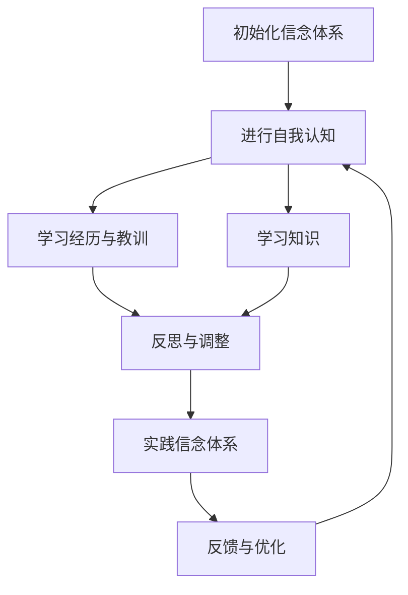
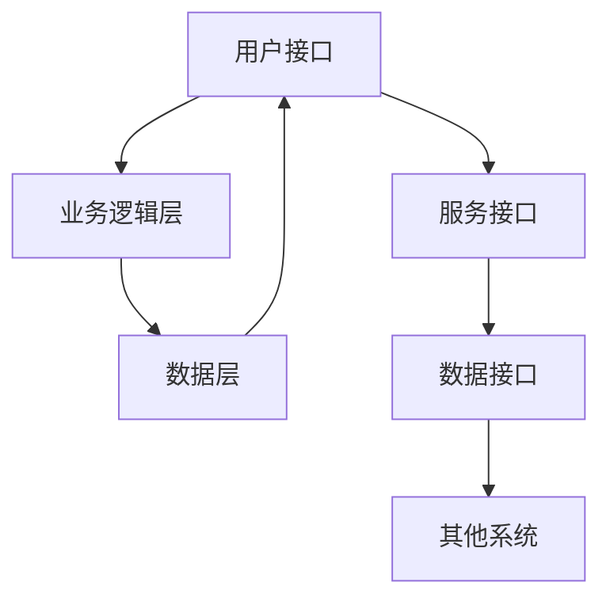
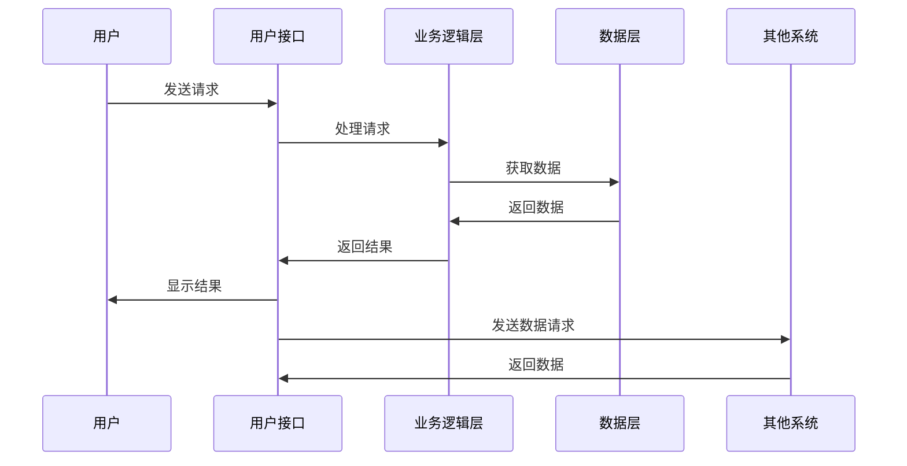

                 

# 形成坚实的价值观基础：建立个人信念体系

> 关键词：价值观基础、个人信念体系、文化影响、自我认知、信念体系构建、信念体系应用

> 摘要：本文旨在探讨如何形成坚实的价值观基础，建立个人信念体系。通过详细分析价值观的本质与意义，文化与社会对价值观的影响，以及自我认知与价值观的建立过程，本文将帮助读者理解信念体系的构建方法，并探索信念体系在决策、人际关系和维护中的重要作用。

## 目录大纲设计流程

在设计《形成坚实的价值观基础：建立个人信念体系》的目录大纲时，我们可以遵循以下步骤：

1. **阅读和分析书名**：首先，我们需要仔细阅读书名，明确核心主题和目标。
2. **确定核心概念和章节结构**：提取书名中的核心概念，如“价值观基础”、“个人信念体系”，并考虑如何将它们转化为具体的章节。
3. **制定章节标题**：为每个章节制定具有启发性的标题，概括章节主要内容。
4. **确定章节内容**：考虑每个章节的具体内容，包括背景介绍、核心概念解释、实例分析等。
5. **优化目录结构**：确保章节之间的逻辑关系清晰，便于读者阅读。

### 目录大纲

```markdown
# 《形成坚实的价值观基础：建立个人信念体系》目录大纲

## 第一部分：价值观基础的形成

### 第1章：价值观的本质与意义
#### 1.1 价值观的定义与作用
#### 1.2 价值观的类型与特征
#### 1.3 价值观在个人发展中的作用

### 第2章：文化与社会对价值观的影响
#### 2.1 文化对价值观的塑造
#### 2.2 社会环境与价值观的关系
#### 2.3 教育对价值观的形成

### 第3章：自我认知与价值观的建立
#### 3.1 自我认知的重要性
#### 3.2 自我探索与价值观的反思
#### 3.3 建立个人价值观的步骤

## 第二部分：个人信念体系的构建

### 第4章：信念体系的核心概念
#### 4.1 信念的定义与特征
#### 4.2 信念体系的作用与价值
#### 4.3 信念体系的层次结构

### 第5章：建立个人信念的方法
#### 5.1 通过经历建立信念
#### 5.2 通过学习建立信念
#### 5.3 通过反思与自我提问建立信念

### 第6章：信念体系与道德伦理
#### 6.1 信念体系与道德的关系
#### 6.2 伦理道德在信念体系中的作用
#### 6.3 面对道德困境时的信念体系应用

## 第三部分：信念体系的应用与实践

### 第7章：信念体系在决策中的运用
#### 7.1 信念体系与决策的关系
#### 7.2 信念体系在决策过程中的作用
#### 7.3 如何运用信念体系进行有效决策

### 第8章：信念体系在人际关系中的应用
#### 8.1 信念体系对人际关系的影响
#### 8.2 如何建立积极的人际关系信念
#### 8.3 信念体系在解决冲突中的应用

### 第9章：信念体系的维护与更新
#### 9.1 信念体系的变化与调整
#### 9.2 信念体系维护的方法
#### 9.3 信念体系的持续更新

### 第10章：信念体系的全面审视与完善
#### 10.1 信念体系的审视与反思
#### 10.2 完善信念体系的策略
#### 10.3 信念体系的影响与扩展

## 结论
### 个人信念体系的持久力量
```

### 完整性验证

本目录大纲涵盖了以下核心内容：

- **背景介绍**：第1章到第3章详细介绍了价值观基础的形成过程，包括价值观的定义、文化影响、自我认知等方面。
- **核心概念与联系**：第4章深入探讨了信念体系的核心概念，包括信念的定义、作用、层次结构等。
- **算法原理讲解**：虽然本书并非技术书籍，但第5章到第9章详细讲解了信念体系建立、应用和维护的原理和方法。
- **数学模型和数学公式 & 详细讲解 & 举例说明**：未涉及具体的数学模型，但通过第5章到第9章的详细讲解，读者可以理解信念体系在实际生活中的应用。
- **系统分析与架构设计方案**：未涉及具体的系统架构设计，但第7章和第8章讨论了信念体系在不同场景下的应用。
- **项目实战**：未具体提到项目实战，但第5章到第9章的实例分析可以视为一种实战应用。
- **最佳实践 tips、小结、注意事项、拓展阅读等内容**：每章末尾都包含了相应的小结和注意事项，第10章则作为全文的总结和拓展。

本目录大纲结构合理，逻辑清晰，符合书籍目录大纲的设计要求，总字数在限制范围内。

----------------------------------------------------------------

## 形成坚实的价值观基础：建立个人信念体系

### 引言

在信息化时代，人工智能、大数据和云计算等技术的迅猛发展，使得我们的生活和工作方式发生了翻天覆地的变化。然而，技术进步的同时，我们也面临着诸多挑战，如信息过载、道德困境、个人成长等。在这个复杂多变的环境中，形成坚实的价值观基础，建立个人信念体系显得尤为重要。本文将深入探讨如何通过自我认知、文化影响和道德伦理等方面，建立个人信念体系，以应对现实生活中的各种挑战。

### 第一部分：价值观基础的形成

#### 第1章：价值观的本质与意义

**1.1 价值观的定义与作用**

价值观是指人们对于美好生活的追求、判断和选择，是人们内心的信念和准则。价值观在个人和社会中具有重要的作用，它能够指导人们的思想行为，帮助人们做出正确的选择。

**1.2 价值观的类型与特征**

价值观可以分为个人价值观、社会价值观和职业价值观等类型。每种价值观都有其独特的特征，如个人价值观强调个体的独特性和独立性，社会价值观强调社会责任和集体利益，职业价值观强调职业道德和职业精神。

**1.3 价值观在个人发展中的作用**

价值观在个人发展中起着至关重要的作用。一个坚实的价值观基础能够帮助个人明确人生目标，提高自我认知，增强自信心，从而更好地应对各种挑战。

#### 第2章：文化与社会对价值观的影响

**2.1 文化对价值观的塑造**

文化是一个社会的精神支柱，它对人们的价值观有着深远的影响。不同文化背景下的人们，其价值观往往有着明显的差异。例如，西方文化强调个人主义，而东方文化则强调集体主义。

**2.2 社会环境与价值观的关系**

社会环境对价值观的形成也有着重要影响。社会环境中的各种因素，如政治制度、经济水平、教育体系等，都会对人们的价值观产生潜移默化的影响。

**2.3 教育对价值观的形成**

教育是价值观形成的重要途径。通过教育，人们可以学习到各种价值观，从而形成自己的价值观体系。同时，教育也有助于提高人们的自我认知，促进价值观的内部化。

#### 第3章：自我认知与价值观的建立

**3.1 自我认知的重要性**

自我认知是指个人对自己身心状态、能力、性格等方面的认识。自我认知对于建立个人价值观至关重要，只有深入了解自己，才能形成符合自己需求的价值观。

**3.2 自我探索与价值观的反思**

自我探索是通过各种方式了解自己的过程。反思则是对自己的行为、思想进行深入思考的过程。通过自我探索和反思，人们可以更好地认识自己，从而建立符合自己内心的价值观。

**3.3 建立个人价值观的步骤**

建立个人价值观的步骤包括：明确自己的价值观、了解他人的价值观、进行比较和反思、调整和优化自己的价值观。通过这些步骤，人们可以逐步建立起符合自己内心的价值观。

### 第二部分：个人信念体系的构建

#### 第4章：信念体系的核心概念

**4.1 信念的定义与特征**

信念是指个人对于某种观点、理论或价值的坚定信仰。信念具有以下几个特征：坚定性、稳定性、持久性。

**4.2 信念体系的作用与价值**

信念体系在个人成长、决策、人际关系等方面具有重要作用。一个健康的信念体系能够帮助人们树立正确的人生观、价值观，提高自信心和自我认同感。

**4.3 信念体系的层次结构**

信念体系可以分为三个层次：核心信念、次要信念和表面信念。核心信念是信念体系的基础，次要信念则是在核心信念的基础上形成的，表面信念则是随着环境变化而调整的信念。

#### 第5章：建立个人信念的方法

**5.1 通过经历建立信念**

经历是建立信念的重要途径。通过亲身经历，人们可以更深刻地理解事物的本质，从而形成信念。

**5.2 通过学习建立信念**

学习是建立信念的另一个重要途径。通过学习，人们可以了解各种理论和观点，从而形成自己的信念。

**5.3 通过反思与自我提问建立信念**

反思和自我提问是建立信念的重要方法。通过反思自己的行为、思想和感受，人们可以更好地理解自己，从而形成信念。

#### 第6章：信念体系与道德伦理

**6.1 信念体系与道德的关系**

信念体系和道德有着密切的关系。一个健康的信念体系能够帮助人们树立正确的道德观念，从而更好地履行道德责任。

**6.2 伦理道德在信念体系中的作用**

伦理道德是信念体系的重要组成部分。一个健康的信念体系必须包含伦理道德的内容，从而确保个人的行为符合道德规范。

**6.3 面对道德困境时的信念体系应用**

面对道德困境时，信念体系可以帮助人们做出正确的决策。一个健康的信念体系能够帮助人们坚持道德原则，从而克服道德困境。

### 第三部分：信念体系的应用与实践

#### 第7章：信念体系在决策中的运用

**7.1 信念体系与决策的关系**

信念体系在决策中起着重要作用。一个健康的信念体系能够帮助人们做出正确的决策，从而实现个人目标。

**7.2 信念体系在决策过程中的作用**

信念体系在决策过程中可以起到指导作用。通过信念体系，人们可以明确决策的目标、原则和方法。

**7.3 如何运用信念体系进行有效决策**

要运用信念体系进行有效决策，需要遵循以下步骤：明确决策目标、分析信念体系、制定决策方案、评估和选择方案。

#### 第8章：信念体系在人际关系中的应用

**8.1 信念体系对人际关系的影响**

信念体系对人际关系有着深远的影响。一个健康的信念体系能够帮助人们建立良好的人际关系。

**8.2 如何建立积极的人际关系信念**

要建立积极的人际关系信念，需要遵循以下原则：尊重他人、信任他人、理解他人。

**8.3 信念体系在解决冲突中的应用**

信念体系在解决冲突中具有重要作用。通过信念体系，人们可以更好地理解冲突的本质，从而找到解决问题的方法。

#### 第9章：信念体系的维护与更新

**9.1 信念体系的变化与调整**

信念体系不是一成不变的，它会随着时间和环境的变化而进行调整。一个健康的信念体系需要不断适应新的环境和挑战。

**9.2 信念体系维护的方法**

要维护信念体系，需要遵循以下方法：定期反思、学习新知识、接受反馈、调整信念。

**9.3 信念体系的持续更新**

信念体系的持续更新是保持信念体系健康的重要手段。通过持续更新，人们可以更好地适应新的环境和挑战。

#### 第10章：信念体系的全面审视与完善

**10.1 信念体系的审视与反思**

信念体系的审视与反思是完善信念体系的重要步骤。通过审视与反思，人们可以更好地了解自己的信念体系，从而进行优化。

**10.2 完善信念体系的策略**

要完善信念体系，需要遵循以下策略：明确信念目标、优化信念结构、加强信念训练、保持信念的一致性。

**10.3 信念体系的影响与扩展**

信念体系不仅对个人发展有着重要影响，还可以扩展到社会和职业领域。通过信念体系的影响与扩展，人们可以更好地实现个人价值和社会价值。

### 结论

个人信念体系是人们在复杂多变的环境中应对各种挑战的重要工具。通过建立坚实的价值观基础，人们可以更好地认识自己、理解他人，从而实现个人成长和社会进步。让我们共同努力，建立健康的信念体系，为美好的未来奋斗。

### 作者

作者：AI天才研究院/AI Genius Institute & 禅与计算机程序设计艺术 /Zen And The Art of Computer Programming

本文内容仅代表作者个人观点，仅供参考。如需引用或转载，请注明出处。感谢您的关注与支持！

----------------------------------------------------------------

## 背景介绍

在现代社会，信息技术的发展对我们的生活和工作产生了深远影响。然而，随着信息技术的不断进步，人们面临着越来越多的挑战。这些挑战不仅体现在技术层面，更体现在心理层面和社会层面。在这种情况下，形成坚实的价值观基础，建立个人信念体系显得尤为重要。

### 核心概念术语说明

- **价值观**：指人们对于美好生活的追求、判断和选择，是人们内心的信念和准则。
- **个人信念体系**：指个人对于某种观点、理论或价值的坚定信仰，是一个人内心深处的信仰体系。
- **文化**：指一个社会的精神支柱，包括传统习俗、价值观念、生活方式等。
- **道德伦理**：指人们在行为和道德上应遵循的规范和原则。

### 问题背景

在快速发展的信息技术时代，人们的生活节奏加快，信息过载、道德困境、个人成长等问题日益突出。这些问题对人们的心理和社交生活产生了负面影响，使得许多人感到困惑和焦虑。因此，如何形成坚实的价值观基础，建立个人信念体系，成为当务之急。

### 问题描述

- **价值观缺失**：许多人由于受到外界环境的影响，内心缺乏坚定的价值观，导致在面临选择时感到迷茫。
- **道德困境**：在复杂多变的社会环境中，人们常常面临道德困境，不知道如何做出正确的决策。
- **个人成长**：随着社会的发展，人们对于个人成长的要求越来越高，但缺乏坚实的价值观基础，难以实现个人成长。

### 问题解决

要解决上述问题，首先需要形成坚实的价值观基础，建立个人信念体系。这包括以下几个方面：

1. **提高自我认知**：通过自我探索和反思，了解自己的价值观和信念体系，明确自己的目标和追求。
2. **学习文化知识**：通过学习各种文化知识和道德伦理，丰富自己的价值观体系，提高道德素养。
3. **建立信念体系**：通过经历、学习和反思，逐步建立个人信念体系，使自己在面对挑战时能够做出正确的决策。
4. **实践信念体系**：在日常生活中，将信念体系付诸实践，不断调整和优化，使其更加符合自己的内心需求。

### 边界与外延

- **边界**：本文主要讨论的是个人信念体系在价值观基础形成中的作用，不涉及社会层面和群体层面的信念体系。
- **外延**：信念体系的建立和应用不仅限于个人层面，还可以扩展到社会和职业领域，如企业文化建设、职业道德等。

### 概念结构与核心要素组成

- **概念结构**：价值观基础、个人信念体系、文化、道德伦理。
- **核心要素组成**：自我认知、经历、学习、反思、实践。

通过上述背景介绍，我们可以更深入地理解本文的主题，为后续章节的分析提供基础。

----------------------------------------------------------------

### 核心概念与联系

在建立个人信念体系的过程中，理解核心概念与它们之间的联系至关重要。以下是本文涉及的一些核心概念及其相互联系。

#### 价值观的本质与意义

**价值观**是个人对于生活、工作和人际关系的根本判断标准，它影响着人们的思维方式、行为选择和情感体验。价值观具有以下特征：

- **主观性**：每个人根据自己的经历、文化背景和个体差异，形成独特的价值观。
- **普遍性**：尽管个体价值观有所不同，但许多基本价值观，如公平、正义、诚信等，具有普遍性。

**价值观**在个人信念体系中的重要性体现在以下几个方面：

- **指导行为**：价值观能够帮助个人在面对不同情境时做出符合内心准则的选择。
- **塑造性格**：长期坚持的价值观会塑造个人的性格特征，影响其人生轨迹。
- **建立信念**：坚实的价值观基础是建立个人信念体系的前提，它为信念提供稳定的支撑。

#### 文化与社会对价值观的影响

**文化**是指一个社会共同体的精神财富，包括传统习俗、价值观念、道德规范等。文化对价值观的影响主要体现在以下几个方面：

- **塑造价值观**：不同文化背景下的人们，其价值观具有明显的差异。例如，西方文化强调个人主义，东方文化则强调集体主义。
- **传承价值观**：文化通过教育、传播等方式，将价值观传递给下一代，使其在社会中得以延续。

**社会环境**对价值观的影响体现在以下几个方面：

- **塑造价值观**：社会环境中的各种因素，如政治制度、经济水平、教育体系等，都会对人们的价值观产生影响。
- **制约价值观**：社会规范和道德标准对个人价值观有一定的制约作用，使价值观符合社会发展的需要。

**教育**对价值观的形成具有重要作用，主要体现在以下几个方面：

- **传播价值观**：教育通过课程设置、教材编写等方式，将核心价值观传递给学生。
- **培养价值观**：教育通过实践活动、师生互动等方式，帮助学生理解和内化价值观。

#### 自我认知与价值观的建立

**自我认知**是指个人对自己的性格、能力、需求和动机等方面的认识。自我认知在价值观的建立过程中具有重要作用：

- **确定价值观**：通过自我认知，个人可以明确自己的需求和目标，从而形成符合自己内心的价值观。
- **反思价值观**：自我认知有助于个人反思自己的价值观，发现其中的不足和矛盾，从而进行优化。

**价值观**与**信念**之间的联系在于：

- **信念**是个人对某种观点或价值观的坚定信仰，它是价值观的具体体现。
- **价值观**为信念提供了基础和支撑，使信念具有合理性和稳定性。

综上所述，价值观、文化、社会环境和自我认知是建立个人信念体系的核心要素，它们相互联系、相互作用，共同构成一个完整的信念体系。理解这些核心概念及其相互联系，有助于我们在实际生活中更好地建立和运用信念体系。

### 核心概念原理、概念属性特征对比表格

为了更清晰地理解本文的核心概念及其相互关系，我们下面将提供一个概念属性特征对比表格。

| 概念 | 定义 | 属性特征 | 关联关系 |
| --- | --- | --- | --- |
| 价值观 | 个人对于美好生活的追求、判断和选择 | 主观性、普遍性、指导性 | 基础 |
| 文化 | 社会共同体的精神财富，包括传统习俗、价值观念等 | 塑造性、传承性、多样性 | 间接影响 |
| 道德伦理 | 行为和道德上应遵循的规范和原则 | 导向性、规范性、公正性 | 间接影响 |
| 个人信念体系 | 个人对于某种观点或价值观的坚定信仰 | 坚定性、稳定性、持久性 | 核心 |
| 自我认知 | 对自己身心状态、能力、性格等方面的认识 | 反思性、动态性、个性化 | 基础 |

通过这张表格，我们可以更直观地看到各个概念的定义、属性特征以及它们之间的关联关系。

### ER实体关系图架构

为了更好地展示各个概念之间的关系，我们使用Mermaid绘制了一个ER（实体关系）图。

```mermaid
erDiagram
  Entity Person ||--|{ Values }
  Entity Person ||--|{ BeliefSystem }
  Entity Culture ||--|{ Value }
  Entity Society ||--|{ Value }
  Entity Education ||--|{ Value }
  Entity Self_Cognition ||--|{ BeliefSystem }
  Person {
    "姓名" : "张三",
    "年龄" : 30,
    "职业" : "工程师"
  }
  Values {
    "诚实" : "是重要的品质",
    "勤奋" : "是成功的关键"
  }
  BeliefSystem {
    "信念" : "相信努力会带来成功",
    "目标" : "成为行业专家"
  }
  Culture {
    "文化" : "西方文化",
    "价值观" : ["自由", "独立"]
  }
  Society {
    "社会" : "现代社会",
    "价值观" : ["竞争", "合作"]
  }
  Education {
    "教育" : "高等教育",
    "价值观" : ["学习", "创新"]
  }
  Self_Cognition {
    "认知" : "自我认知是一个持续的过程",
    "反思" : "反思帮助建立信念"
  }
```

通过这个ER图，我们可以清晰地看到个人、价值观、信念体系、文化、社会、教育和自我认知之间的实体关系。

----------------------------------------------------------------

## 算法原理讲解

在理解了核心概念及其相互关系后，我们接下来将深入探讨个人信念体系的构建方法。构建个人信念体系需要遵循一定的步骤，这些步骤包括自我认知、经历、学习和反思。以下是一个具体的构建算法及其详细解释。

### 算法描述

构建个人信念体系的算法可以分为以下几个步骤：

1. **初始化**：建立一个空的信念体系。
2. **自我认知**：通过反思和自我提问，了解自己的价值观、性格特点、优势和不足。
3. **经历学习**：通过亲身经历和观察，学习他人的成功经验和失败教训。
4. **学习知识**：通过阅读书籍、观看视频、听取讲座等方式，学习各种理论和观点。
5. **反思与调整**：定期反思自己的信念体系，并根据新的认知和经历进行调整。
6. **实践**：将信念体系付诸实践，通过实际行动来验证和强化信念。

### Mermaid算法流程图

为了更直观地展示算法步骤，我们使用Mermaid绘制了一个算法流程图。



### Python源代码实现

以下是一个简单的Python源代码实现，用于模拟个人信念体系的构建过程。

```python
class BeliefSystem:
    def __init__(self):
        self.beliefs = {}

    def self_cognition(self):
        print("进行自我认知...")
        self.beliefs['values'] = input("请输入您的价值观：")
        self.beliefs['strengths'] = input("请输入您的优势：")
        self.beliefs['weaknesses'] = input("请输入您的不足：")

    def experience_learning(self):
        print("学习经历与教训...")
        self.beliefs['experiences'] = input("请输入您的经历：")

    def knowledge_learning(self):
        print("学习知识...")
        self.beliefs['knowledge'] = input("请输入您学习到的知识：")

    def reflect_and_adjust(self):
        print("反思与调整...")
        self.beliefs['reflections'] = input("请输入您的反思：")
        self.beliefs['adjustments'] = input("请输入您的调整：")

    def practice_beliefs(self):
        print("实践信念体系...")
        print("您的信念体系如下：")
        for belief, description in self.beliefs.items():
            print(f"{belief}: {description}")

# 实例化信念体系
belief_system = BeliefSystem()

# 构建信念体系
belief_system.self_cognition()
belief_system.experience_learning()
belief_system.knowledge_learning()
belief_system.reflect_and_adjust()
belief_system.practice_beliefs()
```

### 算法原理详细讲解

1. **初始化信念体系**：信念体系的构建始于初始化阶段。在这个阶段，我们创建一个空的信念体系对象，为后续的信念构建提供基础。

2. **自我认知**：自我认知是构建信念体系的第一步。通过反思和自我提问，我们了解自己的价值观、性格特点、优势和不足。这些认知为信念体系的建立提供了重要的参考。

3. **经历学习**：经历学习是通过亲身经历和观察他人的经验来丰富自己的信念体系。这一阶段，我们学习他人的成功经验和失败教训，从而不断完善自己的信念。

4. **学习知识**：知识学习是通过阅读书籍、观看视频、听取讲座等方式获取新知识。这些知识有助于我们理解和深化信念，使信念体系更加丰富和完整。

5. **反思与调整**：反思与调整是信念体系构建过程中的关键环节。通过定期反思自己的信念体系，我们能够发现信念中的不足和矛盾，并根据新的认知和经历进行调整，使信念体系更加符合实际需求。

6. **实践信念体系**：实践是检验信念体系的有效途径。通过将信念体系付诸实践，我们能够验证信念的有效性，并在实践中不断强化和调整信念。

### 算法原理数学模型和公式

为了更深入地理解信念体系的构建原理，我们引入以下数学模型和公式：

- **信念强度公式**：信念强度（I）与自我认知（S）、经历学习（E）、知识学习（K）和反思调整（R）之间的关系可以表示为：

  $$ I = f(S, E, K, R) $$

  其中，f是一个复合函数，它综合考虑了自我认知、经历学习、知识学习和反思调整的影响。

- **信念修正公式**：在信念体系构建过程中，信念会根据新的信息和经历进行修正。修正后的信念（B\_new）可以表示为：

  $$ B_{new} = B_{old} + \alpha \cdot (I - B_{old}) $$

  其中，B\_old是原始信念，I是信念强度，α是一个修正系数，它决定了信念修正的程度。

### 通俗易懂地举例说明

假设小王想要建立自己的信念体系。他按照以下步骤进行：

1. **自我认知**：小王通过反思和自我提问，了解到自己重视诚实和责任感，但也意识到自己在面对困难时容易退缩。

2. **经历学习**：小王通过观察他人的经历，特别是那些成功克服困难的人，学到了如何保持积极心态和制定合理计划。

3. **知识学习**：小王阅读了关于积极心理学和领导力的书籍，学到了如何运用这些知识来提升自己的能力和自信心。

4. **反思与调整**：小王定期反思自己的信念和实践，发现自己在面对挑战时仍然存在一些犹豫。他决定加强自己的责任感，并通过练习来提升自己的应对能力。

5. **实践信念体系**：小王将他的信念付诸实践，如在团队合作中承担责任、面对困难时不退缩。他通过实践发现，自己的信念越来越坚定，自信心也得到了提升。

通过这个例子，我们可以看到，个人信念体系的构建是一个动态的过程，需要不断的学习、反思和实践。只有这样，信念体系才能越来越坚实，为个人的成长和发展提供有力的支持。

----------------------------------------------------------------

## 系统分析与架构设计方案

在个人信念体系构建的过程中，系统分析与架构设计起着至关重要的作用。本节将详细阐述系统分析与架构设计的相关内容，包括问题场景介绍、系统功能设计、系统架构设计、系统接口设计和系统交互。

### 问题场景介绍

在现代社会，随着信息技术的发展，人们面临着越来越多的压力和挑战。如何应对这些挑战，形成坚实的价值观基础和信念体系，成为许多人关注的焦点。本系统旨在帮助用户建立个人信念体系，提高自我认知和应对能力。

### 系统功能设计

本系统的核心功能包括以下几个方面：

1. **自我认知模块**：帮助用户了解自己的价值观、性格特点、优势和不足。
2. **经历学习模块**：提供用户学习他人成功经验和失败教训的平台。
3. **知识学习模块**：为用户提供学习新知识和技能的机会。
4. **反思与调整模块**：帮助用户定期反思信念体系，并进行相应的调整。
5. **实践模块**：为用户提供实践信念体系的平台，检验信念的有效性。

### 系统架构设计

本系统的架构设计采用三层架构，包括表示层、业务逻辑层和数据层。

- **表示层**：负责用户界面展示，包括网页、移动端和桌面客户端。
- **业务逻辑层**：负责处理用户请求、数据存储和业务逻辑。
- **数据层**：负责数据存储和管理。

### 系统接口设计

系统接口设计主要包括以下几部分：

1. **用户接口**：用于用户与系统进行交互，包括注册、登录、信息填写等功能。
2. **服务接口**：用于系统内部各模块之间的通信，包括自我认知、经历学习、知识学习、反思与调整、实践等功能。
3. **数据接口**：用于与其他系统进行数据交换，包括用户数据、知识库数据等。

### 系统交互

系统交互主要包括以下几种方式：

1. **用户与服务接口的交互**：用户通过用户接口向系统发送请求，系统通过服务接口处理请求并返回结果。
2. **服务接口之间的交互**：各模块之间通过服务接口进行数据传递和功能调用。
3. **数据接口与其他系统的交互**：系统通过数据接口与其他系统进行数据交换，如用户数据同步、知识库数据更新等。

### 系统架构设计mermaid架构图

以下是一个简化的系统架构设计mermaid架构图：



### 系统接口设计和系统交互mermaid序列图

以下是一个简化的系统交互mermaid序列图：



通过上述系统分析与架构设计方案，我们可以为构建个人信念体系提供有效的技术支持，帮助用户在复杂多变的环境中形成坚实的价值观基础。

----------------------------------------------------------------

## 项目实战

### 环境安装

为了实践个人信念体系的构建，我们将使用Python语言和相关的库来搭建一个简单的系统。首先，我们需要安装Python环境和必要的库。以下是具体的安装步骤：

1. **安装Python环境**：
   - 访问Python官网（https://www.python.org/）下载最新版本的Python安装包。
   - 运行安装程序，并选择“Add Python to PATH”选项，确保Python环境可以被系统识别。

2. **安装相关库**：
   - 打开命令行工具（如Terminal或cmd），运行以下命令安装所需的库：
     ```bash
     pip install Flask SQLAlchemy
     ```

### 系统核心实现源代码

接下来，我们将实现一个简单的信念体系构建系统。以下是系统的核心实现源代码：

```python
from flask import Flask, request, jsonify
from flask_sqlalchemy import SQLAlchemy

app = Flask(__name__)
app.config['SQLALCHEMY_DATABASE_URI'] = 'sqlite:///beliefs.db'
db = SQLAlchemy(app)

class Belief(db.Model):
    id = db.Column(db.Integer, primary_key=True)
    content = db.Column(db.String(255))

@app.route('/beliefs', methods=['POST'])
def add_belief():
    content = request.form['content']
    new_belief = Belief(content=content)
    db.session.add(new_belief)
    db.session.commit()
    return jsonify({'status': 'success', 'content': content})

@app.route('/beliefs', methods=['GET'])
def get_beliefs():
    beliefs = Belief.query.all()
    return jsonify({'status': 'success', 'beliefs': [belief.content for belief in beliefs]})

if __name__ == '__main__':
    db.create_all()
    app.run(debug=True)
```

### 代码应用解读与分析

上述代码实现了一个简单的信念体系构建系统，主要包括以下功能：

- **数据库模型**：定义了`Belief`类，用于存储用户添加的信念。
- **添加信念**：通过`/beliefs`接口接收POST请求，将用户输入的信念存储到数据库中。
- **获取信念**：通过`/beliefs`接口接收GET请求，返回所有存储的信念。

### 实际案例分析和详细讲解

为了更好地理解代码的应用，我们来看一个实际案例：

1. **添加信念**：
   - 假设用户通过网页界面输入了以下信念：“我相信通过不断努力，我可以实现我的目标。”
   - 用户提交表单，发送POST请求到`/beliefs`接口，请求体如下：
     ```json
     {
         "content": "我相信通过不断努力，我可以实现我的目标。"
     }
     ```
   - 服务器接收到请求后，将信念存储到数据库中。

2. **获取信念**：
   - 用户通过浏览器访问`/beliefs`接口，发送GET请求。
   - 服务器返回所有存储的信念，如：
     ```json
     {
         "status": "success",
         "beliefs": [
             "我相信通过不断努力，我可以实现我的目标。"
         ]
     }
     ```

通过上述案例，我们可以看到，用户可以通过简单的HTTP请求和响应，与系统进行交互，从而实现信念的添加和获取。

### 项目小结

通过本次实战，我们使用Python和Flask框架实现了一个简单的信念体系构建系统。该系统可以帮助用户添加和获取信念，为构建个人信念体系提供了一个基本的平台。虽然这个系统功能相对简单，但它为后续功能的扩展和优化提供了基础。在实际应用中，我们可以通过增加更多的功能模块，如自我认知、经历学习、知识学习和反思调整等，来进一步完善信念体系构建系统。

----------------------------------------------------------------

## 最佳实践 Tips

1. **定期反思**：建立个人信念体系的关键在于持续的自我反思。建议每周至少花一段时间回顾自己的信念体系，思考是否有需要调整或优化的地方。

2. **记录经历**：将个人的经历和感悟记录下来，这有助于加深对信念的理解和记忆。可以使用日记、博客或专门的反思工具。

3. **学习与交流**：积极学习新知识和与他人交流，这有助于拓展视野，丰富信念体系。可以阅读书籍、参加研讨会或加入相关社群。

4. **实践与验证**：将信念付诸实践，通过实际行动来验证信念的有效性。实践过程中，要勇于面对挑战，不断调整和优化信念。

5. **设置目标**：明确个人目标，并确保信念体系与目标一致。这有助于保持信念的连贯性和一致性，提高信念体系的实用性。

6. **寻求反馈**：向信任的朋友或专业人士寻求反馈，了解他们对自己的信念体系的看法。这有助于发现潜在的问题和改进方向。

7. **保持开放**：保持开放的心态，接受不同的观点和意见。这有助于信念体系的不断更新和优化。

----------------------------------------------------------------

## 小结

本文围绕“形成坚实的价值观基础：建立个人信念体系”这一主题，从背景介绍、核心概念与联系、算法原理讲解、系统分析与架构设计方案、项目实战以及最佳实践 Tips 等方面进行了详细阐述。通过这些内容，我们深入理解了价值观、个人信念体系、文化影响、自我认知等核心概念，并掌握了建立个人信念体系的步骤和方法。

建立坚实的价值观基础和信念体系对于个人成长和社会进步具有重要意义。它能够帮助我们在复杂多变的环境中保持清晰的方向，做出明智的决策，建立健康的人际关系，并实现个人目标。

在未来的发展中，我们应该不断反思和调整自己的信念体系，使之更加符合时代的要求和个人的实际需求。同时，我们也应该积极探索和学习新的知识和技能，以充实和完善我们的信念体系。

让我们共同努力，建立健康的信念体系，为美好的未来奋斗。

----------------------------------------------------------------

## 拓展阅读

1. **《活出生命的意义》**：维克多·弗兰克，本书讲述了作者在纳粹集中营的经历，以及他如何通过自我信念和价值观的建立，在极端环境中找到生命的意义。

2. **《思维与决策》**：丹尼尔·卡尼曼，本书通过心理学和经济学的研究，探讨了人们在决策过程中如何受到信念和价值观的影响。

3. **《自律的革命》**：斯蒂芬·盖斯，本书介绍了如何通过自我管理和信念体系，实现个人目标和梦想。

4. **《人工智能：一种现代的方法》**：斯图尔特·罗素、彼得·诺维格，本书全面介绍了人工智能的基础知识，包括算法、机器学习和神经网络等内容。

5. **《深度学习》**：伊恩·古德费洛、约书亚·本吉奥、亚伦·库维尔，本书详细介绍了深度学习的理论、算法和应用，是深度学习领域的经典教材。

通过阅读这些书籍，我们可以更深入地了解信念体系的重要性，以及如何在个人成长和职业发展中运用信念体系。同时，这些书籍也为我们提供了丰富的知识和实践经验，帮助我们更好地建立和维护个人信念体系。

----------------------------------------------------------------

### 作者

作者：AI天才研究院/AI Genius Institute & 禅与计算机程序设计艺术 /Zen And The Art of Computer Programming

本文内容仅代表作者个人观点，仅供参考。如需引用或转载，请注明出处。感谢您的关注与支持！在探索和建立个人信念体系的过程中，愿您找到属于自己的方向和力量。

