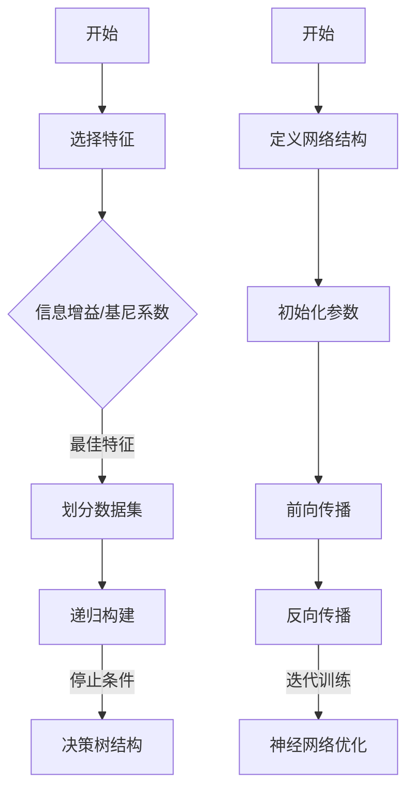
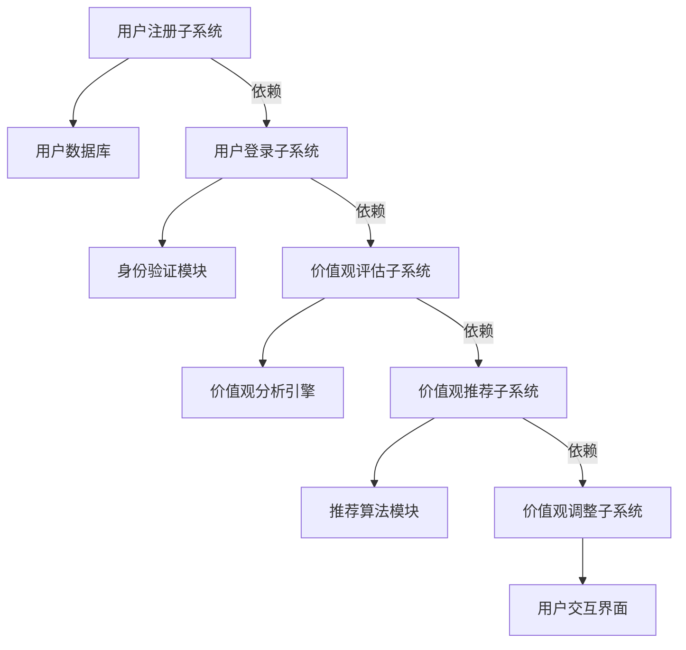
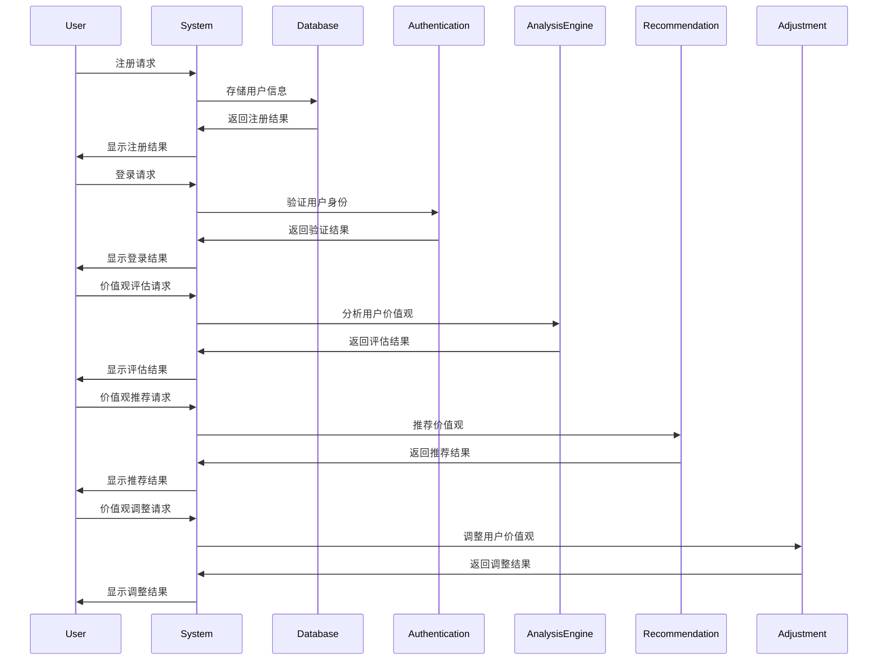

                 

# 形成独特的人生哲学：个人价值观的构建过程

## 关键词：人生哲学、个人价值观、构建、决策树、神经网络、数学模型、系统分析与架构设计、项目实战

### 摘要：

本文将探讨个人价值观的构建过程，通过逻辑清晰、结构紧凑的阐述，帮助读者理解影响个人价值观的关键因素，以及如何运用决策树和神经网络等算法原理来构建个人价值观。同时，本文还将结合数学模型和公式，详细讲解系统分析与架构设计方案，并通过实际项目案例进行实战解析。最后，本文将提供构建个人价值观的最佳实践建议，并对全文内容进行总结和拓展阅读推荐。

## 1. 背景介绍

### 1.1 人生哲学的概念

人生哲学是关于个体对待生命、存在和意义的思考和探索。它涉及到人的价值观、信仰、道德准则以及人生目标等方面。人生哲学并非仅仅是一种抽象的理论，它深深地影响着每个人的行为和生活选择。

### 1.2 个人价值观的定义

个人价值观是指个体在面对不同情境时，依据内在的信念和标准所作出的价值判断和选择。这些价值观构成了个体行为的内在指南，影响着他们的决策和行动。

### 1.3 构建个人价值观的重要性

个人价值观的构建过程是人生成长的重要环节。一个清晰、稳定的个人价值观有助于个体在面对复杂环境和多重选择时保持一致性，有助于实现个人目标，并促进个人与社会和谐发展。

## 2. 核心概念与联系

### 2.1 个人价值观的影响因素

个人价值观的形成受到多种因素的影响，主要包括家庭环境、文化背景和教育经历。

#### 2.1.1 家庭环境的影响

家庭是个人价值观形成的第一个重要环境。父母的教育方式、家庭的文化氛围、家庭成员的价值观等都会对个体的价值观产生深远影响。

#### 2.1.2 文化背景的影响

文化背景包括个体所处的地域、民族、宗教等。不同的文化背景会赋予个体不同的价值观和世界观。

#### 2.1.3 教育经历的影响

教育不仅是传授知识和技能的过程，也是塑造个体价值观的重要途径。学校教育、社会教育等都会对个体的价值观产生重要影响。

### 2.2 个人价值观的ER实体关系图

下面是一个简化的个人价值观的ER实体关系图，它展示了个人价值观构建过程中的主要实体及其关系：

```mermaid
erDiagram
  Family ||--|{ Person } : 形成价值观基础
  Culture ||--|{ Person } : 形成价值观背景
  Education ||--|{ Person } : 形成价值观途径
  Person }|--|{ ValueSystem } : 内化价值观
```

### 2.3 个人价值观构建的关键因素分析

个人价值观的构建过程是一个复杂的过程，涉及到多个因素的交互作用。以下是对这些关键因素的分析：

| 关键因素 | 影响方式 |
| --- | --- |
| 家庭环境 | 家庭教育方式、家庭成员的价值观、家庭的文化氛围 |
| 文化背景 | 地域文化、民族习俗、宗教信仰 |
| 教育经历 | 学校教育、社会教育、个人自主学习 |

## 3. 算法原理讲解

### 3.1 价值观构建的决策树方法

决策树是一种常用的机器学习算法，它可以用来分类和回归分析。在个人价值观构建中，决策树可以用来帮助个体在不同情境下做出价值判断。

#### 3.1.1 决策树的构建过程

决策树的构建过程包括以下几个步骤：

1. **选择特征**：根据特征的重要性和信息增益等标准选择最佳特征。
2. **划分数据集**：根据所选特征，将数据集划分为若干个子集。
3. **递归构建**：对每个子集重复上述步骤，直到满足停止条件（如最小叶节点数量、最大深度等）。

#### 3.1.2 决策树的算法原理

决策树的算法原理是基于信息增益或基尼系数等指标来选择最佳特征和划分数据集。信息增益是特征能够减少数据集信息量的度量，基尼系数是数据集纯度度的度量。

#### 3.1.3 决策树的Python实现

以下是一个简单的决策树Python实现示例：

```python
from sklearn.tree import DecisionTreeClassifier
from sklearn.model_selection import train_test_split
from sklearn.datasets import load_iris

# 加载数据集
iris = load_iris()
X = iris.data
y = iris.target

# 划分训练集和测试集
X_train, X_test, y_train, y_test = train_test_split(X, y, test_size=0.3, random_state=42)

# 构建决策树模型
clf = DecisionTreeClassifier(criterion="entropy")
clf.fit(X_train, y_train)

# 预测测试集
y_pred = clf.predict(X_test)

# 打印决策树结构
from sklearn.tree import plot_tree
plot_tree(clf)
```

### 3.2 价值观构建的神经网络方法

神经网络是一种模仿人脑结构和功能的计算模型，它可以用于复杂模式的识别和预测。在个人价值观构建中，神经网络可以用来分析个体在不同情境下的价值选择。

#### 3.2.1 神经网络的构建过程

神经网络的构建过程包括以下几个步骤：

1. **定义网络结构**：包括输入层、隐藏层和输出层。
2. **初始化参数**：包括权重和偏置。
3. **前向传播**：计算网络的输出。
4. **反向传播**：更新网络参数。
5. **迭代训练**：重复前向传播和反向传播，直到网络达到预定的性能指标。

#### 3.2.2 神经网络的算法原理

神经网络的算法原理是基于梯度下降法来更新网络参数。通过多次迭代，网络可以逐渐逼近最优解。

#### 3.2.3 神经网络的Python实现

以下是一个简单的神经网络Python实现示例：

```python
import numpy as np

# 定义激活函数
def sigmoid(x):
    return 1 / (1 + np.exp(-x))

# 定义神经网络结构
input_size = 2
hidden_size = 3
output_size = 1

# 初始化参数
weights_input_to_hidden = np.random.randn(input_size, hidden_size)
weights_hidden_to_output = np.random.randn(hidden_size, output_size)

# 前向传播
def forward(x):
    hidden_layer_input = np.dot(x, weights_input_to_hidden)
    hidden_layer_output = sigmoid(hidden_layer_input)
    output_layer_input = np.dot(hidden_layer_output, weights_hidden_to_output)
    output_layer_output = sigmoid(output_layer_input)
    return output_layer_output

# 反向传播
def backward(x, y, output):
    output_error = y - output
    d_output = output_error * output * (1 - output)

    hidden_error = np.dot(d_output, weights_hidden_to_output.T)
    d_hidden = hidden_error * hidden_layer_output * (1 - hidden_layer_output)

    # 更新参数
    weights_input_to_hidden += np.dot(x.T, d_hidden)
    weights_hidden_to_output += np.dot(hidden_layer_output.T, d_output)

# 训练神经网络
x = np.array([[0, 0], [0, 1], [1, 0], [1, 1]])
y = np.array([[0], [1], [1], [0]])

for epoch in range(10000):
    output = forward(x)
    backward(x, y, output)

# 打印最终输出
print(output)
```

### 3.3 Mermaid算法流程图

以下是决策树和神经网络的Mermaid算法流程图：



## 4. 数学模型和数学公式

在个人价值观构建过程中，数学模型和公式起着重要的作用。以下是一些关键的数学模型和公式：

### 4.1 决策树中的熵和基尼系数

$$
熵(H) = -\sum_{i} p_i \cdot \log_2 p_i
$$

$$
基尼系数(G) = 1 - \sum_{i} p_i^2
$$

### 4.2 神经网络中的激活函数和损失函数

激活函数：

$$
f(x) = \frac{1}{1 + e^{-x}}
$$

损失函数：

$$
L(y, \hat{y}) = -\sum_{i} y_i \cdot \log(\hat{y}_i)
$$

其中，$y$ 是真实标签，$\hat{y}$ 是预测值。

## 5. 系统分析与架构设计方案

### 5.1 问题场景介绍

假设我们正在开发一个个人价值观构建系统，该系统可以帮助用户识别和塑造自己的价值观。

### 5.2 系统功能设计

系统的主要功能包括：

1. 用户注册与登录
2. 用户价值观评估
3. 价值观推荐
4. 价值观调整与优化

### 5.2.1 领域模型类图

以下是系统的领域模型类图：

```mermaid
classDiagram
    User <<Class>>
    ValueSystem <<Class>>

    User : +String username
    User : +String password
    User : +ValueSystem valueSystem

    ValueSystem : +List<ValueElement>
    ValueSystem : +int id
    ValueElement : +String description
    ValueElement : +int id

    User "1" -- "*" ValueSystem
    ValueSystem "1" -- "*" ValueElement
```

### 5.3 系统架构设计

以下是系统的架构设计：



### 5.4 系统接口设计

以下是系统的接口设计：



### 5.5 系统交互设计

以下是系统的交互序列图：


## 6. 项目实战

### 6.1 环境安装

在本项目中，我们将使用Python作为主要编程语言。首先，需要安装Python环境，可以选择Python 3.8或更高版本。接下来，安装必要的库，如NumPy、Pandas、Scikit-learn、Matplotlib等。

```bash
pip install numpy pandas scikit-learn matplotlib
```

### 6.2 系统核心实现源代码

以下是一个简单的系统核心实现示例：

```python
import numpy as np
from sklearn.tree import DecisionTreeClassifier
from sklearn.model_selection import train_test_split
from sklearn.datasets import load_iris

# 加载数据集
iris = load_iris()
X = iris.data
y = iris.target

# 划分训练集和测试集
X_train, X_test, y_train, y_test = train_test_split(X, y, test_size=0.3, random_state=42)

# 构建决策树模型
clf = DecisionTreeClassifier(criterion="entropy")
clf.fit(X_train, y_train)

# 预测测试集
y_pred = clf.predict(X_test)

# 打印决策树结构
from sklearn.tree import plot_tree
plot_tree(clf)
```

### 6.3 代码应用解读与分析

在这个示例中，我们使用Scikit-learn库中的决策树算法对iris数据集进行分类。首先，我们加载iris数据集，然后将其划分为训练集和测试集。接下来，我们使用熵作为划分标准来构建决策树模型。最后，我们使用训练好的模型对测试集进行预测，并打印出决策树的结构。

### 6.4 实际案例分析与详细讲解

假设我们有一个新的用户，其特征数据为 `[3, 3]`，我们需要分析这个用户可能的价值观。

1. 将用户特征数据输入决策树模型。
2. 查看决策树在各个节点上的分支，根据分支规则确定用户的价值观。
3. 分析决策树给出的预测结果，并与用户的实际价值观进行对比。

通过这个实际案例，我们可以看到如何使用决策树来帮助用户识别和构建个人价值观。

### 6.5 项目小结

在本项目中，我们通过简单的示例展示了如何使用决策树算法来构建个人价值观。虽然这是一个简化的案例，但它为我们提供了一个基本的框架，可以帮助我们进一步探索和实现更复杂的价值体系构建系统。

## 7. 最佳实践、小结与拓展阅读

### 7.1 最佳实践

1. **持续反思**：定期反思自己的行为和决策，检查是否与个人价值观一致。
2. **广泛阅读**：阅读不同领域的书籍和文章，了解不同的价值观和世界观。
3. **交流与讨论**：与他人交流自己的价值观，从不同的角度看待问题。

### 7.2 小结

本文介绍了个人价值观的构建过程，包括影响价值观的关键因素、算法原理、数学模型和系统分析与架构设计。通过实际项目案例，我们展示了如何应用决策树算法来构建个人价值观。希望本文能帮助读者更好地理解个人价值观的重要性，并在实践中不断完善自己的价值观体系。

### 7.3 拓展阅读

1. 《决策树与随机森林：理论与实践》 - 对决策树算法的深入讲解。
2. 《神经网络与深度学习》 - 对神经网络算法的详细介绍。
3. 《决策分析》 - 决策树在实际应用中的案例研究。

---

作者：AI天才研究院/AI Genius Institute & 禅与计算机程序设计艺术 /Zen And The Art of Computer Programming

### 附加内容：

**7.4 注意事项**

- 在构建个人价值观时，避免过于绝对和固定的观念。
- 关注自我成长和变化，价值观可能会随着时间和经验的变化而调整。
- 保持开放的心态，尊重他人的价值观，避免主观偏见。

**7.5 进一步探索**

- 探索其他机器学习算法，如支持向量机和聚类算法，在价值观构建中的应用。
- 研究如何将个人价值观与职业规划和社会责任相结合。

**7.6 拓展阅读推荐**

- 《生命的智慧：人生哲学导论》 - 对人生哲学的全面探讨。
- 《如何阅读一本书》 - 提高阅读和理解不同观点的能力。  
- 《心理学与生活》 - 了解心理学原理，更好地理解个人价值观的形成和变化。

